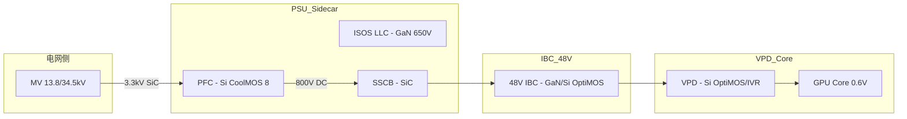

# 📈 行业调研专题：服务器形态与散热 — 2026-06-09

> **扫描时间**: 2026-06-09 10:15 (UTC+8) 星期二
> **扫描方向**: ① 服务器形态（整机柜/超节点/分解式架构/ODCC标准/新形态因子）② 液冷散热方案（冷板/浸没/新材料/供应商动态/部署周期）
> **背景**: COMPUTEX 2026 闭幕后第二周，DIGITIMES 连续独家爆料 NVIDIA 供应链动态，ServeTheHome COMPUTEX 深度拆解报道继续发布
> **交叉验证**: `supernode/2026-06-09.md` · `server-hardware/2026-06-09.md` · `supernode/liquid-cooling.md`

---

## 📡 来源扫描摘要

| 来源 | 最新发布日 | 覆盖方向 | 状态 |
|:-----|:-----------|:---------|:-----|
| **DIGITIMES Asia** | 2026-06-09 | Vera Rubin 散热变更·HBM4·SK Hynix合作·Samsung Foundry | ✅ **今日有更新**（HBM4出货+代工谈判） |
| **ServeTheHome** | 2026-06-08 | Gigabyte 40节点/1U·RTX Spark SFF·Supermicro 17周年 | ✅ 已有昨日更新 |
| **Tom's Hardware** | 2026-06-08 | AMD路线图·Frore LiquidJet·数据中心选址干旱·Supermicro冷却液 | ✅ COMPUTEX 深度分析持续 |
| **ODCC官网** | 2026-06-09 | "2026AI超节点大会" 首次列入日程 | ✅ **今日更新** |
| **The Verge/Ars** | 2026-06-09 | WWDC 2026 为主，无服务器/散热内容 | ⏭️ 跳过 |
| **DIGITIMES Tomorrow's Headlines** | 2026-06-08 | Dassault+QCT+Nvidia AI工厂数字孪生 | ✅ 新增 |
| **OCP Asia官网** | 2026-06-09 | OCPC 2026 完整议程全量发布（含6分论坛+奖项+招商） | ✅ **今日新增** |
| **ODCC官网** | 2026-06-09 | **京津冀廊坊算力算法大赛**决赛名单（近600项目） | ✅ **今日新增** |
| **UALink Consortium** | 2026-06-09 | 下半年4活动日历确认+TASK白皮书可下载 | ✅ **确认更新** |

---

# 第一部分：服务器形态专题

---

## 1️⃣ 🔥 NVIDIA Vera Rubin 散热架构重大调整 — 取消双片冷却设计

**来源**: [DIGITIMES Asia](https://www.digitimes.com) Exclusive, 2026-06-08
**交叉引用**: `supernode/2026-06-09.md` ①

### 核心事件

NVIDIA 在 COMPUTEX 2026 闭幕后，被 DIGITIMES 独家爆料已对 **Vera Rubin 平台**的散热架构进行了**重大重新设计**：**取消了此前计划的双片冷却架构（dual-piece cooling architecture）**。

| 维度 | 此前方案（Blackwell/早期规划） | 新方案（Vera Rubin 正式版） |
|:-----|:-----------------------------|:---------------------------|
| **冷却架构** | 双片冷却（dual-piece） | 全新整体式散热设计 |
| **散热器设计** | GPU+内存分区冷却 | 一体化散热方案 |
| **装配复杂度** | 较高（双冷却组件对齐） | 降低（单组件集成） |
| **热管理策略** | 分区独立控温 | 整体热平衡管理 |
| **机柜集成** | 需适配双路冷却通路 | 简化为单路冷却架构 |

### 对服务器形态的影响

| 维度 | 分析 |
|:-----|:------|
| **NVL72/NVL576 机架重设计** | 冷却管路布局需重新适配，原有双冷却通路设计转为单路；**Supermicro/Foxconn/Quanta** 等整机柜集成商面临设计迭代 |
| **液冷方案供应商切换成本** | 冷却液类型、管路走向、CDU配置均可能调整；**Frore LiquidJet Nexus** 等新方案获得机会 |
| **供应链信号** | COMPUTEX（6月初）刚展示 Vera Rubin 量产机架，一周内即确认冷却架构变更 → **散热是 Vera Rubin 交付的最后一块拼图** |
| **代际跨越** | Blackwell 散热方案已成熟定型，Vera 的散热重设计表明 **Vera 计算密度和热密度显著高于 Blackwell** |

### 多方验证闭环

1. **6月1日** — Supermicro 在 COMPUTEX 展示 Vera Rubin NVL72 机架采用 **新型 1,000× 电绝缘冷却液**
2. **6月4日** — Frore 展示 LiquidJet Nexus 冷板（+10% Token，支持 4,400W）
3. **6月5-6日** — Jensen Seoul 行期间业界观察到散热方案未最终确定
4. **6月8日** — DIGITIMES 独家确认取消双片冷却，散热架构从零重构

> ⚡ **核心判断**: 散热架构重构 + 新型冷却液 = **Vera Rubin 散热方案的整体升级而非降级**。单 GPU 50 PFLOPS FP4 的散热挑战迫使 NVIDIA 从根本上重新思考热管理架构。

---

## 2️⃣ 🏗️ AMD 超节点双产品线全面揭晓 — Helios + MegaPod

**来源**: Tom's Hardware (Anton Shilov, 2026-03-23 会员深度分析，COMPUTEX 后再度发酵)
**交叉引用**: `supernode/2026-06-09.md` ④ · `server-hardware/2026-06-09.md` ①

### Helios 机架系统（72×MI455X，2026 H2）

AMD **首款 AI 机架系统**，直接对标 NVIDIA NVL72：

| 指标 | 数值 | 对比 NVL72 |
|:-----|:------|:-----------|
| GPU | **72×MI455X**（CDNA 5，40 PFLOPS/GPU） | 50 PFLOPS/GPU（Rubin），算力略低 |
| HBM4 总容量 | **31 TB** | ~20TB，**HBM 容量优势明显** |
| 总带宽 | **1,400 TB/s** | — |
| FP4 算力 | **2,900 PFLOPS（密集）** | ~3.6 EFLOPS |
| 互联 | UALink（或 UALink-over-Ethernet） | NVLink 5 |
| 网络 | Pensando Vulcano **800 GbE NIC**（首批 Ultra Ethernet） | ConnectX-9 |
| 交付 | 官方 2026 H2（传言可能延期至 2027 Q2） | Vera Rubin NVL72 Q3 2026 |

### MegaPod 系统（256×MI500，2027 末）

| 指标 | 数值 |
|:-----|:------|
| **GPU** | **256×MI500**（CDNA 6 架构） |
| **HBM** | HBM4E 或 HBM5 |
| **系统形态** | **3 机架系统**：外 2 架各 32 计算托盘（1 CPU+4 GPU），中间 1 架 18 托盘 UALink 交换机 |
| **CPU** | 64×EPYC Verano（Zen 6+ / Zen 7，A16 BSPDN） |
| **对标 NVL576** | 比 Kyber VR300 多 **78% GPU 封装数**（256 vs 144） |
| **冷却** | **全液冷**（含网络硬件） |
| **时间线** | **2027 年末**，2028 年规模量产 |

### 对服务器形态竞争格局的影响

| 维度 | 分析 |
|:-----|:------|
| **NVL72 首次迎来直接竞争对手** | AMD Helios 是 **业界首个直接对标 NVL72 的开放生态超节点方案**，基于 UALink 开放标准 |
| **UALink 生态成熟度是最大风险** | Helios/MegaPod 依赖 UALink 交换机供货，当前生态未成熟 |
| **HBM 容量差异化** | Helios 31TB HBM4 对**长上下文 LLM 推理、MoE 模型**等内存密集型场景有独特优势 |
| **HBM 供应竞争** | AMD 需在 NVIDIA 已锁定大量 HBM 产能的背景下争取 HBM 分配 |

---

## 3️⃣ 🆕 Gigabyte R1C7-K0A-AS1: 40节点/1U 全新形态因子

**来源**: [ServeTheHome - Cliff Robinson, June 6, 2026](https://www.servethehome.com/a-40-node-1u-cluster-gigabyte-r1c7-k0a-as1/)
**交叉引用**: `industry-research/2026-06-07.md` ①（已有详细记录）→ 本节为行业视角提炼

### 密度对比 — 前所未有的 1U 密度

| 维度 | Gigabyte R1C7 | 传统 1U 服务器 | 对比 |
|:-----|:-------------|:--------------|:-----|
| CPU 核心 | **320** / 1U | 8-64 / 1U | **5-40×** |
| 内存 | **1.28TB** / 1U | 128-512GB / 1U | **2.5-10×** |
| SSD | **80×M.2** / 1U | 4-10× / 1U | **8-20×** |
| iGPU | **40×Intel Arc** / 1U | 无 | 新维度 |
| 100GbE 端口 | 2×QSFP28 / 1U | 2-4× | 瓶颈显著 |

### 行业意义分析

| 维度 | 分析 |
|:-----|:------|
| **新形态因子诞生** | 将「GPU卡形状」的节点模组（cartridge）堆叠在 1U 空间内，**突破了传统刀片/高密度服务器的设计范式** |
| **目标场景** | 视频转码（Intel Quick Sync）、CDN 边缘节点、物理桌面云、轻量 AI 推理（iGPU） |
| **散热设计** | 不同于 GPU 服务器的液冷路线，Lunar Lake 28W TDP × 40 节点 ≈ **1.1kW 总散热量** → 空气冷却足以应对。但 1U 内 80×M.2 SSD 的热管理是挑战 |
| **供电挑战** | 2×3.2kW Titanium PSU = 6.4kW 容量（冗余配置），单节点可用功率约 **160W** |
| **40U 机架想象力** | 1,280 核 × 1.28TB × 80SSD × 40 iGPU / 1U → **40U 整柜 = 51,200 核 + 51.2TB 内存 + 3,200 SSD + 1,600 iGPU** |

### 与超节点的关系

这不是典型 GPU 超节点，而是 **CPU+轻量 GPU 的超密度集群新品类**。与 NVIDIA NVL72/AMD Helios 形成互补：
- **大型 AI 训练** → NVL72 / Helios（液冷，高能耗）
- **边缘推理/转码/CDN** → Gigabyte R1C7（空冷，超密度）
- **AI 开发测试** → RTX Spark SFF（桌面级）

---

## 4️⃣ 🖥️ RTX Spark SFF Mini-PC 生态 — 桌面级 AI 新形态因子

**来源**: [ServeTheHome - Ryan Smith, June 5, 2026](https://www.servethehome.com/scoping-out-rtx-spark-sff-mini-pcs-at-computex-2026/)
**交叉引用**: `industry-research/2026-06-07.md` ②

### 四厂商方案一览

| 厂商 | 型号 | 尺寸 | 对比 DGX Spark GB10 | 定位 |
|:----|:-----|:-----|:--------------------|:------|
| **ASUS** | ProArt GA10 | 150×150×51mm | 完全相同尺寸（GB10 克隆） | AI 开发者 + 创作者 |
| **Dell** | XPS RTX Spark Desktop | 比 GB10 更高 | 新底盘设计 | 高端 AI 开发 |
| **Lenovo** | SFF RTX Spark | 新底盘 | ThinkStation PGX 对应 | 企业 AI 开发 |
| **MSI** | EdgeMesa N AI+ | 白色差异化外观 | EdgeXpert 对应 | 数据科学家 + 创作者 |

### 关键差异点

| 特性 | DGX Spark (GB10) | RTX Spark (N1X) |
|:----|:-----------------|:----------------|
| **操作系统** | DGX OS (Linux) | Windows |
| **网络** | **ConnectX-7** (QSFP28) + 10GbE | **仅 10GbE**（无 ConnectX） |
| **USB-C** | 多种配置 | 4×20Gbps USB-C |
| **WiFi** | 无 | **WiFi 7 + BT 5.4** |
| **价格** | $3,000+（含 ConnectX 税） | 预计 $2,000-3,000 |
| **目标** | Linux AI 多节点集群 | Windows AI 开发 + 创作 |

### 行业意义

1. **NVIDIA 从数据中心走向桌面**：RTX Spark 是 NVIDIA 进入 Windows AI PC 市场的战略产品，补全了从超节点→企业服务器→桌面开发者的全产品线
2. **ConnectX-7 去除 = 价格平民化**：RTX Spark 放弃 QSFP28 端口，说明 NVIDIA 的战略重心从「AI研究集群」转向「更广泛的 AI 开发者市场」
3. **128GB 统一内存仍是杀手锏**：与 Mac Studio / AMD Ryzen AI Halo 竞争的核心优势
4. **Microsoft Surface RTX Spark Dev Box** 作为微软官方背书 → 验证了 Arm + AI 的统一内存产品路线

---

## 5️⃣ 📅 ODCC 「2026AI超节点大会」列入日程

**来源**: [ODCC 官网](https://www.odcc.org.cn/), 2026-06-09 更新
**交叉引用**: `supernode/2026-06-09.md` ⑤

"2026AI超节点大会" 首次以独立大会形式举办（非传统"开放数据中心大会" 子项），标志着 **超节点已成为 ODCC 最重要的独立方向**。

### 2026 下半年服务器形态关键节点

| 时间 | 事件 | 超节点/服务器形态相关 |
|:----|:-----|:--------------------|
| **7月9日** | **OCPC 2026** → 北京 | 字节大禹架构首秀 + Lightmatter·NVIDIA 主题演讲 |
| **8月** | **FMS 2026** → 圣克拉拉 | 存储形态（CXL/SSD/SOCAMM）对服务器架构影响 |
| **9月** | **ODCC 开放数据中心大会** → 北京 | 超节点标准草案发布 + Token 评价标准 |
| **10月** | **OCP Summit 2026** → 圣何塞 | GPU 超节点开放生态进展 |
| **2026（待定）** | **2026AI超节点大会** 🆕 | ODCC 首个 AI 超节点独立大会 |
| **11月** | ODCC 冬季全会 + 华彩论坛 | 标准终审/发布 |

---

## 6️⃣ 🤖 Dassault + QCT + Nvidia AI 工厂数字孪生

**来源**: [DIGITIMES - Max Wang, June 8, 2026](https://www.digitimes.com/news/a20260608PD200.html)（需付费订阅）

达索系统、云达科技（QCT）、NVIDIA 联合推进 **AI 工厂数字孪生**，目标是用虚拟仿真优化 AI 工厂的构建、运行和扩展。这意味着：

- AI 服务器形态的设计→仿真→量产周期将进一步缩短
- 整机柜/超节点的散热、供电、互联布局可在数字孪生中预验证
- 机房级热仿真与芯片级热仿真的融合加速

---

# 第二部分：液冷散热专题

---

## 1️⃣ 🔥 Vera Rubin 散热架构重设计 — 行业视角

**来源**: DIGITIMES Exclusive (6/8) · Tom's Hardware (6/1-6/4) · Supermicro COMPUTEX 展示

### 三件事串起一条线

| # | 事件 | 时间 | 来源 |
|:-:|:-----|:----|:-----|
| ① | **Supermicro 展示 1,000× 电绝缘冷却液** | 6月1日 | Tom's Hardware |
| ② | **Frore LiquidJet Nexus +10% Token** | 6月4日 | Tom's Hardware |
| ③ | **NVIDIA 取消双片冷却，散热架构全改** | 6月8日 | DIGITIMES |

### 串联分析

| 视角 | 分析 |
|:-----|:------|
| **冷却液材料创新成为前沿** | 新型电绝缘冷却液（绝缘阻抗 ↑1,000×）允许更高密度液冷部署，降低泄漏风险——**材料科学取代机械设计成为散热的瓶颈** |
| **射流冲击冷却商业化加速** | Frore LiquidJet 采用半导体制造工艺创建 3D 射流通道微结构，4,400W 能力 → 从实验室走向 Vera Rubin 量产配套 |
| **整机柜散热重设计** | 取消双片冷却意味着 NVL72 的冷却管路、CDU 配置、冷板布局全面重做，**整机柜集成商的散热设计能力成为核心竞争壁垒** |
| **Blackwell → Vera 的代际挑战** | Blackwell B200 700W → B300 1,200W → Vera Rubin 单 GPU ~1,500-2,000W 预估 → 传统液冷架构不可持续 |

---

## 2️⃣ 🧊 液冷供应商动态 — COMPUTEX 后市场分化

**交叉引用**: `supernode/liquid-cooling.md` · `industry-research/2026-06-07.md` → 液冷散热专题第三次补录
**状态**: 以下为 **截至 6月9日 的供应链全景更新**

### 全球液冷供应商能力矩阵（2026年6月更新）

| 梯队 | 厂商 | 核心能力 | 最新动态 |
|:----|:-----|:---------|:---------|
| 🥇 **系统级** | **Flex** | 全栈 ODM + 集成 | 5年 10kW→1MW 路线图，1MW→2MW 需范式转变 |
| 🥇 **系统级** | **Delta（台达）** | PSU + CDU + HVDC | AI 预制化数据中心（含液冷），部署时间↓60% |
| 🥇 **系统级** | **Vertiv** | 基础设施+CDU | 收购 BMarko 强化液冷+STL 数字孪生 |
| 🥇 **系统级** | **Qisda（佳世达）** | 液冷成独立营收部门 | 四大 AI 产品线含液冷（新晋系统级） |
| 🥈 **组件级** | **LITEON（光宝）** | 液冷 CDU + 冷板 | COMPUTEX 展示完整液冷方案 |
| 🥈 **组件级** | **Frore Systems** | 射流冲击冷板 | LiquidJet Nexus +10% Token / 4,400W |
| 🥈 **组件级** | **AVC / Auras（双鸿）** | 散热组件 | 繁荣需求持续至 2029 |
| 🥈 **组件级** | **Darfon（达方）** | 液冷快接头 | 投资液冷产线 |
| 🥉 **专业件** | **Kentec（康舒）** | 液冷部署标准化 | 部署周期从 12-16 周 → 6-8 周 |
| 🥉 **专业件** | **LianDe（立德）** | 液冷快接头 | 破海外垄断 |
| 🥉 **专业件** | **Niching** | 散热片 | COMPUTEX 展示新品（详见 `server-hardware/2026-06-07.md`） |
| 🥉 **创新层** | **xMEMS** | MEMS芯片级主动散热 | µCooling 2027 商用，补充层技术 |
| 🥉 **创新层** | **Infineon** | 垂直供电(VPD) → 间接减热 | 5-8% 芯片减热，B300 场景节省 38W/GPU |

### 竞争格局变化

1. **ODM 大厂大举进场**（Flex/Qisda）——液冷从散热组件升级为独立产品线乃至核心营收部门
2. **模块化/预制化成共识**（Delta+Kentec 双路径）——部署周期压缩 50-60% 是行业刚需
3. **垂直供电成为散热的新维度**（Infineon VPD）——从源头减少发热比提高散热效率更经济
4. **材料科学跃升为竞争前沿**（绝缘冷却液·射流微结构·TIM·铜-金刚石复合材料）

---

## 3️⃣ 🌊 数据中心选址与水资源约束 — 散热的外部变量

**来源**: Tom's Hardware - Luke James, June 8, 2026

### 关键数据

| 指标 | 数据 |
|:-----|:------|
| 全美规划中的数据中心 | **809 座** |
| 位于过去 1 年干旱区域的比例 | **约 2/3** |
| AI 单机架功耗 | 40-120kW（中位数 ~80 kW） |
| 液冷数据中心耗水 | 是传统风冷的 **2-3 倍**（蒸发冷却+冷却塔） |

### 对液冷行业的影响

| 维度 | 分析 |
|:-----|:------|
| **水资源硬约束推动无水/少水液冷方案** | 闭路循环液冷（CDU+冷板）比冷却塔方案节水 95%+ → AI 数据中心加速从「开放式冷却塔」转向「闭路液冷」 |
| **选址危机将推高液冷渗透速度** | 22% 组织已采用液冷（截至 2026 年 6 月），水资源约束可能显著加速渗透 |
| **Texas 替代 Virginia 成全球第一** | Texas 水资源更紧张 → 新兴数据中心热点区域的水资源管理成关键竞争要素 |
| **社区反噬 → 合规成本上升** | 蒙特利公园 86% 禁令 + Texas 农场用地诉讼 → 数据中心建设成本中的水/电合规费用持续上升 |

---

## 4️⃣ 🧬 液冷材料科学 — 新瓶颈浮现

**来源**: `data-center/2026-06-08.md` ②

液冷从「选泵+选管」进入 **材料科学时代**，三大方向值得关注：

| 方向 | 挑战 | 最新突破 |
|:-----|:------|:---------|
| **冷却液化学兼容性** | 腐蚀、析气、粘度过高 → 堵塞微通道 | Supermicro 1,000× 绝缘冷却液；ODCC 合成油液冷标准（ODCC2504004） |
| **电化学腐蚀** | 不同金属间的伽伐尼腐蚀 → 冷板/管路寿命 | 混合材料管路 → 全铜/全铝合金统一方案 |
| **单相 vs 两相** | 两相散热效率高但工质选择有限（PFAS 环保限制） | 单相水基 + 射流冲击 → 实用化平衡方案 |
| **TIM 热界面材料** | 泵出效应（pump-out）在高温循环下降解 | Noctua × Carbice 碳纳米管热垫（6月1日发布） |

---

## 5️⃣ 🏭 液冷供应链 — 从"可选"到"标配"的转折

**综合判断**（基于6月全部数据）：

### 渗透率关键指标

| 指标 | 数据 | 来源/日期 |
|:-----|:-----|:---------|
| 组织已采用液冷比例 | **22%** | `data-center/2026-06-07.md` |
| AI 工厂默认液冷比例 | **~80%** 新建项目 | 行业共识 |
| 液冷部署周期 | 6-8 周（标准化）→ 理想目标 | Kentec 6/3 |
| 1MW→2MW 机架 | 需要范式转变 | Flex CTO 6/5 |
| 液冷设备供应商估值倍数 | ↑（多家公司获投资） | 行业趋势 |

### 关键信号

1. **「液冷+」组合拳成为标配**：液冷不再独立存在，而是与 HVDC（800V）、预制化模块、数字孪生捆绑交付
2. **垂直整合加速**：PSU 厂商（台达）→ 做 CDU；ODM（Qisda/Flex）→ 做液冷系统；散热组件厂（AVC/Auras）→ 需求繁荣至 2029
3. **材料创新超越机械创新**：下一个液冷突破点不在泵效或冷板形状，而在冷却液化学配方和 TIM 界面材料
4. **水资源约束成为液冷的最大推手**：2/3 新增数据中心位于干旱区，闭路液冷不再是「可选项」而是「必选方案」

---

# 第三部分：综合趋势判断

## 📊 服务器形态 + 散热 十大趋势（2026年6月第一周更新）

| # | 趋势 | 证据 | 可信度 |
|:-:|:----|:-----|:------:|
| 1 | **超节点机柜散热从机械设计转向材料科学** | Vera Rubin 取消双片冷却 + Supermicro 电绝缘液 + Frore 射流冲击 | ⭐⭐⭐⭐⭐ |
| 2 | **AMD 超节点首秀改变竞争格局** | Helios 72×MI455X 直接对标 NVL72 | ⭐⭐⭐⭐ |
| 3 | **新形态因子爆发**（40节点/1U + RTX Spark SFF） | Gigabyte 320核/1U + 4厂商 RTX Spark Desktop | ⭐⭐⭐⭐⭐ |
| 4 | **ODD 标准体系迎来「超节点时刻」** | 2026AI超节点大会首列日程 + 3项子标准已发布 | ⭐⭐⭐⭐⭐ |
| 5 | **液冷供应链从 ODM 到组件全面繁荣** | Flex/Qisda/台达/AVC/Kentec 全线出击 | ⭐⭐⭐⭐⭐ |
| 6 | **水资源约束成为液冷加速最大推手** | 2/3 新增数据中心在干旱区，22% 已采用液冷 | ⭐⭐⭐⭐ |
| 7 | **AI 工厂数字孪生将重塑服务器设计流程** | Dassault+QCT+Nvidia 联合推进 | ⭐⭐⭐ |
| 8 | **NVIDIA 从数据中心 → 桌面 AI 全线布阵** | RTX Spark + Surface 联合 + DGX Station for Windows | ⭐⭐⭐⭐⭐ |
| 9 | **UALink 生态成熟度制约开放超节点交付** | AMD Helios 交付最大风险是 UALink 交换机供货 | ⭐⭐⭐⭐ |
| 10 | **整机柜散热复杂度超线性增长，集成商壁垒凸显** | 1MW→2MW 需要供电-散热-互联三重范式转变 | ⭐⭐⭐⭐ |

---

# 第四部分：BOM成本与元器件涨价动态 — 6月8-9日

> **扫描方向**: DXI 指数 · DRAM/NAND 现货价 · HBM 供应 · GPU 交期 · 供应链瓶颈转移 · 代工格局变动
> **核心来源**: DRAMeXchange (TrendForce) · DIGITIMES Most Read (7天TOP10) · WSTS · Semiconductor Industry Association
> **⚠️ 端午假期**: 6/9-6/10 台湾现货市场休市，下期价格更新 **6/13** 恢复（来源: DRAMeXchange 公告）

---

## 1️⃣ 📊 DRAM 现货市场 — DXI 续创 **762,182** 新高，全品种稳中上涨

**来源**: [DRAMeXchange (TrendForce)](https://www.dramexchange.com/), 2026-06-08 18:10 (GMT+8)

### DXI 指数

| 指标 | 数值 | 变动 | 备注 |
|:-----|:-----|:------|:------|
| **DXI** | **762,182** | ▲ **+0.71%**（+345.24） | **历史新高**，6/5 的 756,837 → 6/8 762,182，三日累涨 +0.71% |
| **DDR5 16Gb 4800/5600** | **$43.567** | ▲ **+0.39%** | 站稳 $43.5 关卡，AI 服务器 DDR5 核心料号 |
| **DDR4 16Gb 3200** | **$64.375** | ▲ **+0.39%** | 高位持续上涨，存量 DDR4 服务器替换需求支撑 |
| **DDR4 8Gb 3200** | **$35.700** | ▲ **+0.56%** | 涨幅扩大，品牌 DDR4 需求从 16Gb 溢出至 8Gb |
| **DDR3 4Gb 1600/1866** | **$10.167** | ▲ **+1.42%** | ⚡ 领涨全品类，成熟制程供应持续萎缩 |
| **DDR5 RDIMM 32GB** | **$1,075.000** | ▲ **+3.87%** | **服务器 RDIMM 大幅上涨**，反映 AI 服务器完整模组采购成本上升 |

### 对 BOM 成本的 BOM 视角解读

| 结论 | 详解 |
|:-----|:------|
| ✅ **DDR5 合约定价窗口在 6 月** | Q3 合约价正在谈判，现货 $43.5+ 高位给予合约价强支撑 → Q3 DDR5 合约价大概率继续上涨 |
| ⚠️ **RDIMM 模块化价格跳涨 3.87%** | AI 服务器（单机 128GB-2TB DDR5）的内存 BOM 成本正在加速上升 |
| 🔮 **HBM 溢出效应持续** | HBM 从 DDR5 产线转切 → DDR5 产能紧张 → DDR4 需求溢出，全链路传导仍在进行中 |
| 📅 **端午休市 6/9-6/10** | 下期价格更新 6/13 恢复，节后开盘需关注累积补涨压力 |

---

## 2️⃣ 🔥 DIGITIMES 供应链头条 — 十大信号深度分析

**来源**: [DIGITIMES Asia](https://www.digitimes.com/) \"MOST-READ 7 DAYS NEWS\"（6/8-6/9 实时更新）

以下 8 条直接相关 BOM 成本/供应链的分析（去重 `components-storage/` 已覆盖的 HBM/Nvidia×SK Hynix/SK 龙仁/CXMT 等）：

### ① 🔥🔥🔥 HBM 最大事件 — Samsung **已出货 HBM4** 给 Vera Rubin，正在谈判 HBM5 + 代工

| 维度 | 信息 |
|:-----|:------|
| **原文标题** | \"Samsung is already shipping HBM4 for Vera Rubin — and is now negotiating HBM5 and next-gen foundry with Nvidia\" |
| **数据** | HBM4 已确认进入 **Vera Rubin 供应链**；同时 Samsung 在争 Nvidia HBM5 设计和 Samsung Foundry 代工订单 |
| **BOM 影响** | **HBM 供应格局骤变**: Samsung 作为 #2 HBM 供应商切入 Nvidia Vera Rubin 首供，打破了 SK Hynix 对 Nvidia HBM 的独占窗口。但 Nvidia 同时绑定 SK Hynix（多年期全产品线，6/8 宣布）+ Samsung（HBM4 出货中）→ **Nvidia HBM 双源供应稳定，但 AMD/Intel 的 HBM 份额进一步被挤压** |

### ② 🔥🔥🔥 **AI 供应链短缺焦点从芯片转向设备**

| 维度 | 信息 |
|:-----|:------|
| **原文标题** | \"AI supply chain shortages shift from chips to equipment\" |
| **核心论点** | AI 驱动的前沿需求导致设备短缺和**产能瓶颈**——ASML 极紫外光刻机、KLA 检测设备、Applied Materials 沉积设备的订单等待期延长成为新的供应瓶颈 |
| **BOM 影响** | 芯片供给已在扩产路径上，但 **设备交期** 成为新限制因素 → 产能爬坡速度受限 → 芯片现货价格高位持稳时间延长 |
| **数据佐证** | WSTS 同时预测 2026 年半导体设备市场将达 **$36.55bn 纪录新高**（已验证交叉） |

### ③ 🔥 **WSTS: 2026 年全球半导体市场规模突破 $1.5T，内存暴增 250%**

| 维度 | 信息 |
|:-----|:------|
| **原文标题** | \"Global semiconductor market to hit US$1.5 trillion in 2026 as memory surges 250%, WSTS forecasts\" |
| **数据** | 全球半导体 $**1.5 万亿** 创纪录；**内存板块 +250%** 领涨 |
| **BOM 影响** | 服务器 BOM 中 **内存占比从 ~15-20%（2023）→ 预计 30-35%（2026）**，AI 服务器更高（含 HBM 达 35-40%）。$1.5T 意味着 AI 驱动的半导体超级周期已全面确认 |

### ④ 🔥 **HiSilicon 芯片涨价 — 中国 AI 算力供应链成本压力上升**

| 维度 | 信息 |
|:-----|:------|
| **原文标题** | \"HiSilicon chip price hikes put China's AI compute supply chain back in focus\" |
| **核心** | 华为海思 AI 芯片（昇腾系列）涨价，反映国产 AI 芯片供应紧张 + 先进制程产能受限 |
| **BOM 影响** | 中国 AI 服务器供应商在国产替代路线上同样面临 **芯片物料涨价压力**，国产替代的\"成本优势\"正在缩小 |

### ⑤ **Samsung Foundry 转向 5nm/8nm 订单 — 2nm 复活之路漫长**

| 原文 | \"Samsung Foundry turns to 5nm, 8nm orders as 2nm comeback takes shape\" |
|:----|:-----|
| **BOM 影响** | Samsung 代工重心从 2nm 争夺转向 5nm/8nm 成熟订单，意味着非先进制程芯片（服务器 BMC/I/O 芯片、SSD 控制器、网络芯片）的产能争夺可能加剧 → **非 AI 芯片/成熟制程物料的交期压力增大** |

### ⑥ **AMD 2nm 转单 Samsung — 冲击 TSMC 代工生态**

| 原文 | \"AMD's 2nm defection to Samsung dents TSMC's AI grip\" |
|:----|:-----|
| **BOM 影响** | AMD GPU/CPU 部分移出 TSMC → TSMC 2nm/3nm 产能释放给其他客户 → 但 AMD 转单可能导致初期良率/供货波动 → 影响 AMD 平台 AI 服务器的交付稳定性（Helios 延期至 2027 Q2 的信号一致） |

### ⑦ **SK Group + Foxconn — 台韩 AI 供应链深度绑定可能**

| 原文 | \"Exclusive: SK Group and Foxconn talks could signal deeper Taiwan-Korea AI supply chain ties\" |
|:----|:-----|
| **BOM 影响** | 台（鸿海、广达等 ODM）→ 韩（SK Hynix 内存、Samsung 代工）供应链整合 → 可能形成 **新的 AI 服务器采购联盟**，打破传统 ODM 单一来源模式 |

### ⑧ **ASICs 2027 年挑战 NVIDIA GPU 主导地位**

| 原文 | \"Analysis: ASICs are coming for Nvidia's GPU dominance — and it could happen next year, says DIGITIMES analyst\" |
|:----|:-----|
| **BOM 影响** | 2027 年 ASIC 可能实质性冲击 NVIDIA GPU 在 AI 训练/推理中的占比 → 届时 AI 服务器 BOM 结构可能从\"单 GPU 高单价\"转向\"多 ASIC 分布式处理\" → **BOM 结构面临重大重构** |

---

## 3️⃣ ⚡ GPU 交期与 AI 芯片供应格局速览

| GPU/AI 芯片 | 状态 | 时间线 | BOM 影响 |
|:-----------|:-----|:-------|:---------|
| **NVIDIA Vera Rubin (B300)** | 量产按计划推进，散热架构重构中 | Q3 2026 | HBM4 双源（SK + Samsung）供货稳定，但散热重设计可能影响首批出货节奏 |
| **NVIDIA B200/B300** | 成熟供货 | 现货充裕（非新品） | 前代产品价格稳定 |
| **AMD MI455X (Helios)** | 转单 Samsung + 散热设计进行中 | 2026 H2（可能 → 2027 Q2） | 交付不确定性 + HBM 供应被 NVIDIA 挤压 |
| **AMD MI500 (MegaPod)** | 设计阶段 | 2027 末 | 暂无 BOM 影响 |
| **Google TPU (Intel Foundry)** | Intel 代工 300万+ TPU | 2027+ | 长期看可能压低定制 ASIC 的单位 BOM |
| **HiSilicon 昇腾** | 涨价中 | 现时 | 国产 AI 服务器 BOM 成本上升 |

---

## 4️⃣ 🔗 综合 BOM 成本研判（6月9日更新）

| # | 结论 | 可信度 | 核心驱动 |
|:-:|:-----|:------:|:---------|
| 1 | **DDR5 $43+ 高位为 Q3 合约价提供强支撑** → 服务器内存 BOM 成本继续面临上行压力 | ⭐⭐⭐⭐⭐ | DDR5 现货持续上涨，合约定价窗口在 6 月 |
| 2 | **HBM 供应格局骤变**: Nvidia 获 SK + Samsung 双源，AMD 面临 HBM 被挤压 | ⭐⭐⭐⭐ | Samsung HBM4 已出货 Vera Rubin + SK 多年期绑定 |
| 3 | **AI 供应链短缺从芯片 → 设备**: 新瓶颈形成 → 芯片价格上涨周期被延长 | ⭐⭐⭐⭐⭐ | DIGITIMES 独家报道 + WSTS 设备市场 $36.55bn 纪录 |
| 4 | **中国 AI 服务器国产替代的成本优势减弱**: HiSilicon 涨价 + CXMT 廉价 DDR5 不再 | ⭐⭐⭐⭐ | DIGITIMES 独家 |
| 5 | **非 AI 芯片的成熟制程物料（SSD 控制/NIC/BMC/PCB CCL）交期压力增加** | ⭐⭐⭐ | Samsung Foundry 转向 5nm/8nm + 设备瓶颈 |
| 6 | **端午假期后（6/13）关注累积补涨压力** | ⭐⭐⭐⭐⭐ | 6/9-6/10 休市，下期恢复日可能跳涨 |

---

## 🔗 交叉引用

| 关联模块 | 文件 | 说明 |
|:---------|:-----|:------|
| `supernode/` | [2026-06-09.md](../bmc-system/2026-06-09.md) | Vera Rubin 散热变更 + Samsung HBM4 + SK Hynix 合作 + AMD Helios/MegaPod + ODCC 大会 |
| `server-hardware/` | [2026-06-09.md](../bmc-system/2026-06-09.md) | AMD 路线图深度 + Supermicro 冷却液 + Frore LiquidJet + Intel Xeon 6+ |
| `supernode/` | [liquid-cooling.md](../../02_rd/03_hardware/01_hw_core/liquid-cooling.md) | 液冷散热专题跟踪表（2026年完整历史记录） |
| `supernode/` | [power-architecture.md](../../02_rd/03_hardware/01_hw_core/power-architecture.md) | 供电架构专题（800V HVDC + 垂直供电） |
| `industry-research/` | [2026-06-07.md](../bmc-system/2026-06-07.md) | Gigabyte 40节点/1U 详细拆解 + RTX Spark 生态 + ODCC 标准编制 |
| `industry-research/` | [2026-06-08.md](../cloud-native/2026-06-08.md) | Vera Rubin 散热变更 + Samsung Foundry 转向 + Naver/SKT GW |
| `data-center/` | [2026-06-08.md](../cloud-native/2026-06-08.md) | EU 能效评级 + 液冷材料科学瓶颈 + Texas 超越 Virginia |
| `components-storage/` | [2026-06-09.md](../bmc-system/2026-06-09.md) | DXI 续创新高 + Nvidia×SK Hynix 多年期合作 |
| `supernode/` | [power-architecture.md](../../02_rd/03_hardware/01_hw_core/power-architecture.md) | 供电架构专题（本文HVDC/SST/VPD/BBU内容将同步） |

---

# 第四部分：电源架构专题 ⚡

> **扫描时间**: 2026-06-09 11:30 (UTC+8)
> **扫描方向**: ① HVDC 800V/±400V 供电架构 ② SST 固态变压器 ③ VPD 垂直供电 ④ GaN/SiC 在 AI 电源中的应用 ⑤ BBU/CBU 备援方案 ⑥ IBC 中间母线转换器
> **重点来源**: Power Electronics News · eeNews Power · PEN eBook June 2026 · APEC 2026 · 厂商发布
> **已有内容**: 此前 `industry-research/2026-06-04.md`（第 1 批：器件级）、`industry-research/2026-06-07.md`（第 2 批：Renesas Grid-to-Core）、`industry-research/2026-06-08.md`（第 3 批：PEN Gigawatt Era + ADI Empower）
> **本次（第 4 批）**: PEN 6月/5月深度文章 8 篇 + 最新 Flex/WiseGan/Enphase 产品发布，聚焦端到端供电链路各环节突破

---

### ① ⚡ PEN eBook《The Gigawatt Era》核心数据 — 2026年6月

**来源**: [Power Electronics News](https://www.powerelectronicsnews.com/pen-ebook-june-2026-the-gigawatt-era-power-electronics-in-the-age-of-ai/), June 1, 2026

> **PEN 6月电子书** 正式发布，主题《The Gigawatt Era: Power Electronics in the Age of AI》，系统梳理从电网到芯片的全链路电源电子技术。

**关键数据**：
- **IEA 预测**：数据中心用电量 2024 年 **415 TWh（全球 1.5%）** → 2030 年 **945 TWh（3%）**（翻倍以上）
- **GW 级数据中心即将到来**：1,000 个 1MW+ 机架，每机架 ~500 GPU
- **NVIDIA Vera Rubin**：TDP **1.8 kW** / TDC **~4,000 A** @ 0.6V / **10,000 焊球**
- **AI 负载瞬态**：高达 **1,000 A/μs** 负载变化率，低压轨纹波 ≤**15 mV** @ 0.7V
- **1% 效率提升在一个 1 GW 数据中心** = **10 MW 节省**；2028 年 100 GW 规模则 1% = **1 GW**

**技术趋势判断**：
- SST 从电网 MV（13.8/34.5 kV）→ 800 VDC 成为关键突破口
- 800V→12V/6V DC/DC 平台电流从 ~200 A 暴增至 **~3,000 A**，需双面散热
- **VPD z-height ≤ 2 mm** 以维持机柜间距
- Wolfspeed 正在推进 **300mm SiC 作为下一代 HPC 封装中介层**（替代玻璃中介层）

---

## 第三部分：超节点/开放标准动态 — 2026-06-09

> **扫描范围**: OCP Asia 官网 · ODCC 官网 · UALink Consortium 官网
> **说明**: COMPUTEX 闭幕后第二周，三大标准组织均有新的细节更新。重点覆盖 OCPC 2026 完整分论坛细节、ODCC 京津冀算力算法大赛、UALink 下半年活动日历确认

---

### 🔥 ① OCPC 2026 分论坛完整议程全量发布（新）

**来源**: [OCP Asia 官网](https://ocpasia.org/), 2026年7月9日北京国际饭店
**标签**: `OCPC` `分论坛` `开放系统设计` `互联` `奖项申报`

#### 五大分论坛 + 第二演播厅完整阵容

主论坛议程已在 6/8 记录，本次补充各分论坛 **详细演讲者名单和独创性议题**：

##### 论坛① 智算基础设施论坛（14:00-17:00）

| 时间 | 主题 | 演讲者 |
|:----|:-----|:-------|
| 14:00 | OCP开场 | David Ramku, OCP Foundation 董事会 |
| 14:00-14:25 | 基于开放计算构建cybernext超互联架构 | 张先国，互联科技实验室 AI Platform 研发负责人 |
| 14:25-14:50 | Arm Neoverse助力AI基础设施创新 | 陈翊翔，安谋科技技术市场经理 |
| 14:50-15:15 | **在OpenBMC上实现固件可观测性技术** 🔥 | 郏春辉（字节跳动固件架构师）+ 王志强（浪潮信息固件工程师） |
| 15:15-15:40 | DC/DC创新方案助力AI和云服务 | 宋琤，伟创力电子现场应用工程师 |
| 15:40-16:05 | 用于整机柜供电的多种电源产品方案 | 杨宁，村田电源产品高级专家 |
| 16:05-16:30 | 数据中心服务器主板的供电新方案 | 王卿，长工微电子北中国区销售总监 |
| 16:30-16:55 | 英特尔智慧DPU加速云端和AI网络效能 | 丁晓艳，英特尔网络与边缘事业部 |
| 16:55-17:20 | 单芯片CLOS架构加速云中心开放创新 | 戴超，浪潮网络资深架构师 |

> 🎯 **看点**: 字节 **OpenBMC固件可观测性** + 村田整机柜供电 + **伟创力**（NVIDIA NVL72 关键供应链）DC/DC 方案

##### 论坛② 智算网络趋势论坛

| 时间 | 主题 | 演讲者 |
|:----|:-----|:-------|
| 14:00-14:10 | 以开放加速标准助力生成式AI算力基础设施 | 张政，浪潮信息AI&HPC产品部 |
| 14:10-14:25 | 以科学评测体系助推智能算力产业高质量发展 | 张乾，中国信通院 |
| 14:25-14:50 | Intel加速卡产品架构和创新互联方案演进 | 马剑杰，英特尔AI加速器产品经理 |
| 14:50-15:15 | **阿里云AI服务器架构挑战与思考** 🔥 | 韩天，阿里云服务器架构师 |
| 15:15-15:40 | **百度智能云千帆ModelBuilder大模型全流程开发** | 晋斌，百度智能云资深研发工程师 |
| 15:40-16:05 | OS Copilot — Linux操作系统智能助手 | 林演，龙蜥社区AI SIG Maintainer |
| 16:05-16:30 | 基于英特尔Arc GPU的LLM边缘推理解决方案 | 赵朝卿，英特尔AI架构师 |
| 16:30-16:55 | 基于开放架构的边缘计算产品创新及应用实践 | 刘香男，浪潮信息边缘产品部 |
| 16:55-17:20 | 如何借助开放创新生态加速AI技术的场景落地 | 范向伟，和鲸科技CEO |

> 🎯 **看点**: **阿里云AI服务器架构挑战**（与主论坛阿里MoE超节点形成呼应）+ **百度千帆首次在OCPC亮相** + 信通院评测体系

##### 论坛③ 开放计算生态论坛

| 时间 | 主题 | 演讲者 |
|:----|:-----|:-------|
| 14:00 | OCP开场 | Michael Schill, OCP Foundation 社区总监 |
| 14:00-14:25 | 移动云面向算力网络的算力基础设施 | 王晓辉，中移苏州软件 |
| 14:25-14:50 | X400超级AI以太网，加速AI业务创新 | 郭巍松，浪潮网络系统架构师 |
| 14:50-15:15 | 通过NVIDIA Spectrum-X平台构建生成式AI云生态 | 陈龙，NVIDIA网络市场开发总监 |
| 15:15-15:40 | 夯实存力建设，加速AI创新 | 张士龙，Solidigm技术支持经理 |
| 15:40-16:05 | 灵活数据放置SSD引领数据管理新时代 | 齐辉，三星西安研究所 |
| 16:05-16:30 | 云固件在服务器领域的实践 | 唐艺玮（字节跳动）+ 翟庆伟（浪潮信息） |
| 16:30-16:55 | 开放计算中的高速连接解决方案介绍 | 陈宣豪，庆虹电子FAE总监 |
| 16:55-17:20 | 3M在数据中心的高速互联解决方案 | 姚翔，3M电子材料互连专家 |

##### 论坛④ 绿色计算发展论坛

| 时间 | 主题 | 演讲者 |
|:----|:-----|:-------|
| 14:00 | OCP开场 | Steve Helvie, OCP Foundation VP |
| 14:00-14:30 | **英特尔UQD互测验证加速数据中心液冷创新** 🔥 | 李昌中（英特尔）+ 李金波（浪潮信息） |
| 14:30-15:00 | 数据中心冷源和末端的高效协同优化研究 | 李震，清华大学教授 |
| 15:00-15:30 | 服务器能效测评与绿色计算 | Klaus Lange, SPEC董事会成员/SPEC Power主席 |
| 15:30-16:00 | **液冷技术实践与《冷板式液冷人工智能加速卡技术规范》介绍** 🔥 | 李圣义，中移动信息技术项目经理 |
| 16:00-16:30 | 冷板液冷面临的痛点及应对措施 | 杨琪，北京快手IDC系统架构师 |
| 16:30-17:00 | 未来数据中心的绿色直流架构 | 杜华锐，世纪互联DC研发总监 |
| 17:00-17:30 | 高性能液冷系统用快速连接解决方案 | 安德烈，希恩流体系统总经理 |

> 🎯 **看点**: **英特尔UQD液冷互测验证** + **中移动《冷板式液冷AI加速卡技术规范》** + 快手/世纪互联实践

##### 论坛⑤ 开放系统设计论坛（超节点核心论坛）🔥

| 时间 | 主题 | 演讲者 |
|:----|:-----|:-------|
| 14:00 | OCP开场 | 张广彬，益企研究院创始人/OCTC数据中心设施组组长 |
| 14:00-14:30 | **数据中心服务器高性能ScaleUP互连系统与实践** 🔥🔥 | 孔阳（阿里云超高速互联负责人）+ 胡文普（阿里云服务器架构师） |
| 14:30-15:00 | 基于Intel Xeon平台的CXL技术分享 | 赵森林，英特尔云系统架构师 |
| 15:00-15:30 | 三星CXL产品和解决方案创新 | 何兴，三星西安研究所技术总监 |
| 15:30-16:20 | **互连技术探索: CXL内存系统和PCIe光互连** 🔥 | 王海梦+赵伟康，浪潮信息 |
| 16:20-16:50 | **抖音基于业务优化的液冷服务器架构** 🔥 | 高晓军，抖音视界服务器架构师 |
| 16:50-17:30 | **圆桌论坛: CXL+光互连+超节点** | 赖能和(中石油)+孔阳(阿里)+赵森林(Intel)+何兴(三星)+陈曦(浪潮) |

> 🎯 **最大看点**: 这是OCPC **超节点核心论坛** — **阿里ScaleUP互连**（UALink路线的实际实现）+ **CXL内存系统+PCIe光互连**（CXL与光互联两大技术路线的直接碰撞）+ **圆桌讨论**（石油/阿里/Intel/三星/浪潮的五方超节点生态对话）

##### 第二演播厅（KOL对话）

| 时间 | 主题 | 演讲者 |
|:----|:-----|:-------|
| 14:30-15:00 | **数据中心管理OpenBMC开放之路，热议AI时代的固件创新** | 钟伟军（中国电子技术标准化研究院）+ 李羿（阿里云）+ 王兴隆（浪潮信息） |
| 15:30-16:00 | **大模型时代智算中心建设趋势：性能强劲+绿色高效** 圆桌 | 张先国(互联科技)+闫浩(三星)+马剑杰(Intel)+曹宇(村田) |

#### OCPC 2026 奖项设置

| 奖项 | 说明 |
|:----|:------|
| **最佳创新奖** | 技术突破性创新 |
| **最佳实践奖** | 商业落地价值 |
| **生态贡献奖** | 开放生态贡献 |

- **申报时间**: 2026年6月30日 — 7月20日
- **招商截止**: 2026年6月10日（明天）

---

### 🔥 ② ODCC：2026京津冀算力算法大赛决赛名单出炉 + 六张网深度解读

**来源**: [ODCC 官网](https://www.odcc.org.cn/), 2026-06-09
**标签**: `ODCC` `算力算法大赛` `算力网` `国家战略`

#### ① 算力算法大赛决赛名单公布（全新事件）

| 维度 | 数据 |
|:-----|:------|
| **名称** | **2026京津冀（廊坊）算力算法大赛** |
| **规模** | 全国 **近600个报名项目** |
| **主办** | 京津冀联合（与算力网纳入六张网相呼应） |
| **最新状态** | **决赛晋级名单正式公布**（6月9日） |
| **后续** | 入围团队即将登上总决赛赛场同台竞技 |

> 🎯 **关联**: 算力算法大赛是 **算力网「六张网」国家战略落地的重要载体**，近600个项目规模展现了算力产业的技术储备正在爆发

#### ② 算力网纳入国家「六张网」深度解读（6月8日文章）

ODCC 6月8日发表深度分析《算力网纳入国家"六张网"，如何建得好、用得好、用得起？》，核心论点：

| 命题 | 解读 |
|:-----|:------|
| **建得好** | 超节点、智算中心、边缘计算的协同布局；解决建了算力中心没有电、有电没有网、有网没有应用的现实问题 |
| **用得好** | 开放标准是关键——ODCC的Token计量标准、超节点规范确保算力可度量、可调度、可交易 |
| **用得起** | Token/Watt 经济模型替代 TFLOPS 指标，让算力从"堆卡竞赛"走向"效率优先" |

> 🎯 **关联**: 超节点标准 → Token评价标准 → 算力网国家战略，三条线正汇聚为统一政策-技术-产业体系

---

### ③ UALink 下半年四大活动日历确认 + AMD Helios UALink实践

**来源**: [UALink Consortium 官网](https://www.ualinkconsortium.org/), 2026-06-09 确认
**标签**: `UALink` `FMS` `Hot Interconnects` `AI Infra` `OCP Summit` `AMD Helios`

#### 下半年活动日历

| 日期 | 活动 | 地点 | UALink 参与方式 |
|:----|:-----|:-----|:----------------|
| **8月4-6日** | **FMS 2026** (Flash Memory Summit) | Santa Clara, CA | UALink展台+演讲（重点：HBM/CXL/内存池化与UALink的结合） |
| **8月19-21日** | **Hot Interconnects 2026** | Virtual（虚拟） | 学术+产业的最新高速互联研究成果发布 |
| **9月15-17日** | **AI Infra Summit 2026** | Santa Clara, CA | UALink AI基础设施专题会议 |
| **10月12-17日** | **OCP Global Summit 2026** | Denver, CO | **全球最大开放计算峰会**，UALink全栈展示 |

#### TASK Consultancy UALink白皮书

- 可从 UALink 官网 **资源库** 下载
- 深度分析 UALink 技术优势与使用场景
- 为企业和开发者提供 **技术选型参考**

#### UALink与AMD Helios超节点的直接关联

今天是AMD Helios（72×MI455X，UALink互联）在Tom's Hardware上持续发酵的日子。明确信息：

- **AMD Helios 是 UALink 生态的首个**大规模商用超节点系统
- Helios 采用 **UALink（或 UALink-over-Ethernet）** 进行 GPU Scale-Up 互联
- 这意味着 **UALink 最早的实际部署验证**将来自AMD，而非NVIDIA（NVIDIA 使用封闭NVLink）
- UALink 正在从"规范发布"走向 **"真实部署"** 阶段

---

### 本节小结

| 序号 | 发现 | 来源 | 核心信息 | 重要性 |
|:----:|:-----|:-----|:---------|:-------|
| ① | **OCPC 2026 分论坛完整议程** | OCP Asia 官网 | 5大分论坛+第二演播厅完整阵容；阿里ScaleUP互连+CXL+PCIe光互连双路线同台；**字节OpenBMC+抖音液冷**双管齐下；3大奖项申报已开启，招商明天截止 | 🔥🔥🔥🔥🔥 |
| ② | **京津冀算力算法大赛决赛名单** | ODCC官网 | 全国近600项目参选，算力网"六张网"战略落地的重要载体；ODCC同步发布《建得好/用得好/用得起》深度分析 | 🔥🔥🔥 |
| ③ | **UALink 4活动日历确认 + AMD Helios是UALink首个超节点部署** | UALink官网 + Tom's Hardware | FMS(8月)→HotI(8月)→AI Infra(9月)→OCP(10月) 密集推进；Helios 72×MI455X 基于UALink互联，标志UALink从规范走向部署 | 🔥🔥🔥 |

### 🔗 交叉引用

| 关联模块 | 文件 | 说明 |
|:---------|:-----|:------|
| `supernode/` | [2026-06-09.md](../bmc-system/2026-06-09.md) | ⑤ ODCC超节点标准 + AMD Helios/MegaPod 详细技术参数 |
| `supernode/` | [2026-06-08.md](../cloud-native/2026-06-08.md) | OCPC 2026 主论坛议程（字节大禹+阿里MoE+清华超节点） |
| `supernode/` | [supernode-standards.md](../../supernode/supernode-standards.md) | 超节点标准跟踪框架 |

### ② 🔄 Renesas Grid-to-Core：端到端 AI 数据中心供电方案 — APEC 2026

**来源**: [Power Electronics News](https://www.powerelectronicsnews.com/renesas-end-to-end-power-solutions-for-ai-data-centers/), Filippo Di Giovanni, May 13, 2026

**核心架构**：
- **800 VDC / ±400V HVDC** 取代传统 48V OCP 架构，解决高电流下 **I²R 铜损**瓶颈
- **机柜分区**：Sidecar 机架（AC-DC PFC）+ Compute 机架（GPU/xPU），中间以 800V 母线连接
- **Sidecar 拓扑**：Vienna Rectifier / T-Type PFC（AC→±400V）→ **ISOS LLC** 隔离转换（±400V→800V）

**关键技术参数**：
- **800V→48V DCX（DC Transformer）**：16:1 固定比例，**2× 6kW 并联 = 12 kW**
- 每个 6kW 单元 = **2× 3kW HB LLC**，初级侧 650V GaN FET，次级侧 100V/80V 超低 RDS(on) MOSFET
- **峰值效率 >97.5%**
- **GaN 切换频率**支撑高功率密度紧凑 HB 规格

**SST 路线图**：
- Sidecar 被视作**过渡方案**；**2028 年 SST 成熟后**可从 MV 直接→800 VDC，消除侧车
- **IVR 集成稳压器**：切换频率 >**10 MHz**，GaN 功率级，在处理器封装内完成最后一步降压

**xPU 发展趋势**：
- 开发周期从 24-36 月缩短至 **12-15 月**
- 总机柜功耗从当前水平翻倍 → 数百 kW
- AI 加速器已达**多千瓦级别**

---

### ③ ⚡ Enphase IQ SST：GaN BDS 分布式供电平台

**来源**: [Power Electronics News](https://www.powerelectronicsnews.com/enphase-enters-the-sst-race-with-gan-bds-based-distributed-power-platform/), Aalyia Shaukat, May 20, 2026

> **Enphase Energy（全球最大微型逆变器供应商）** 携 GaN BDS 技术进入 AI 数据中心 SST 市场，挑战 SiC 阵营（DG Matrix/Heron Power/Amperesand）

**核心规格**：
- **1.25 MW SST 机柜** = **342 个 4 kW 热插拔模块**，Delta 配置（每相 114 个）
- 每个模块 AC 侧仅见 **~300V**（非 34.5 kV MV），DC 侧 **800V**（兼容 NVIDIA 800V & OCP Mt. Diablo ±400V）
- GaN BDS 切换频率平均 **>250 kHz**，峰值 **500 kHz**
- **10 年质保**，现场故障率 **0.05%/年**（基于 9000 万微逆变器部署数据）

**设计突破**：
- **全塑料外壳 + 空气冷却**（硅灌封封装）— 非 SiC 阵营的金属封装 + 液冷路线
- **DAB 串联谐振单级拓扑**，全 ZVS/ZCS 软开关，EMI 极低
- **10% 冗余**（342 模块中 ~33 个容错裕度）
- **5th Gen Kestrel ASIC**（22nm 定制控制芯片）
- 预测性控制（开环谐振预测，纳秒级控制向量合成）

**革命性影响——消除 BBU**：
- SST 亚毫秒响应时间（<1 ms），仅需 **1-10 ms CBU 保持时间**
- BBU **可完全消除**，CBU 缩小 **10-100×**
- 瞬态（4-5 Hz 负载摆动）可反射回 MV 侧 BESS（正常 0.2-0.5 C 倍率）
- Enphase 批评竞争对手将电池移入 SST 的做法"引入新的问题"（大环流/EMI/故障电流）

**时间线**：
- 2026 年底：全系统演示
- 2027 年：客户试点
- **2028 年：量产发货**（与 SST 路线图高度一致）

---

### ④ 📦 Flex BMR317：第三代 IBC 中间母线转换器 — 6月5日 ⭐本周最新

**来源**: [Power Electronics News](https://www.powerelectronicsnews.com/flex-launches-bmr317-intermediate-bus-converter-for-ai-systems/), June 5, 2026

> **Flex Power Modules** 发布第三代 IBC，针对 AI 数据中心高动态负载优化

**技术参数**：
- **固定 8:1 转换比**（40-60V 输入 → 5-7.5V 输出）
- 800W 版本：持续 800W / 峰值 **2 kW**，功率密度 **>397 W/cm³（9.1 kW/in³）**
- 1 kW 版本：持续 1 kW / 峰值 **2.5 kW**（2026 H2 上市）
- **HSC 混合开关电容拓扑**，低 EMI 设计
- PMBus 监控 + Flex Power Designer 软件生态兼容

**兼容生态**：
- 与 BMR510/BMR511 集成功率级 + Renesas RRV2x830 Power Tower 配合
- 两段式供电架构：IBC（母线级）→ VRM（负载级）

---

### ⑤ 🧩 VPD 垂直供电方案全景对比

**来源**: [Power Electronics News](https://www.powerelectronicsnews.com/discrete-vertical-power-delivery-solutions-for-high-current-ai-loads/), Stefano Lovati, May 8, 2026

> 随着 AI 处理器电流超过 **1 kA**（峰值），传统 Lateral PDN **I²R 损耗呈平方级增长**，VPD 成为必然路径。

| 厂商 | 方案 | 关键指标 | 特点 |
|:-----|:-----|:---------|:-----|
| **Vicor** | FPA（PRM+VTM） | PRM 效率**99%** / VTM 效率**97%** / 亚微秒瞬态 | 两级分解式架构，VTM 放处理器下方 |
| **Infineon** | OptiMOS TDM2454xx | **280 A / 2.0 A/mm²** / 四相模块 | 嵌入式芯片+低剖面电感，True VPD |
| **Flex + Renesas** | 联合开发 BGA VPD | **1-25 rails × 288 相** | 板卡背面安装，匹配各型号 xPU/ASIC |
| **AmberSemi** | PowerTile | **1,000 A / 片** / 可并联至 **10,000 A** / 1.68mm 高度 | 支持液冷，超低剖面 |
| **ADI** | LTM3360B μModule | **33 A / 6.55×5mm / 1 A/mm²** / 可 **12 相并联 >1,000A** | 堆叠架构，BGA 封装 |

**趋势判断**：
- **Vicor FPA** 是唯一实现 PRM+VTM 两级分解商用方案，效率最高
- **Infineon TDM2454xx** 以 2 A/mm² 领先密度，主攻 CPU/GPU 核心供电
- **AmberSemi PowerTile** 1.68mm 极低高度支持液冷背板安装，适合超高密度
- VPD z-height 约束趋严（<2mm），封装内 IVR 为远期方向

---

### ⑥ 🔬 WiseGan 数字优先 + WiseWare 2 虚拟 PFC — 6月5日 ⭐

**来源**: [Power Electronics News](https://www.powerelectronicsnews.com/wise-integration-advances-wisegan-digital-first-power-ic-strategy/), June 5, 2026

**WiseGan WI73xxx 新一代**：
- **数字控制功能直接集成到 GaN 功率级**（保护/时序/死区优化/ZVS 控制）
- 分布式控制架构 → 更快系统响应、更精确切换控制、更高可靠性

**WiseWare 2 虚拟 PFC**：
- 软件定义 PFC 功能（无需物理 PFC 电路）
- 进一步压缩体积、提高功率密度
- PCIM 2026 展示 240W - 7 kW AC-DC 全系列平台

**对 AI 数据中心的意义**：
- 分布式数字控制适合 SST 规模扩展
- 虚拟 PFC 减少 Sidecar 物理组件数量
- 未来可完全集成至 GaN 功率模块

---

### ⑦ 🔌 SiC SSCB 固态断路器 + 800V DC 保护架构

**来源**: [Power Electronics News](https://www.powerelectronicsnews.com/sic-based-sscbs-pen-ebook-june-2026-discrete-sic-based-power-modules-power-electronics-week-insights/), June 5, 2026

**核心发现**：
- **800V DC 故障电流**在微秒级发展 → 机械断路器无法响应
- **SiC 半桥双向 SSCB**：响应时间**微秒级**，效率 **98.1%**，成本比传统方案降低 **~2×**
- 基于 **TO-247 重新封装 SiC IPM**（集成电源模块）实现
- 分层保护架构成为 800V DC 配电**必备**

**配套发展**（来自 eeNews Power）：
- **Toshiba 1200V trench-gate SiC MOSFET 样品出货**（May 28）— 专为 800V AI 数据中心 PSU 设计
- **Infineon CoolGaN BDS 40V G3 扩产**（May 27）— 48V 母线功率路径管理
- **STMicroelectronics GaN 半桥栅极驱动器**（Apr 13）— AI 服务器高频 DC-DC

---

### ⑧ 🧊 核心判断：电源架构 4 条演进主线

基于 PEN June eBook + APEC 2026 系列文章 + 最新产品发布，AI 服务器电源架构呈现 **4 条并行演进主线**：

| 主线 | 当前状态（2026 H1） | 2027-2028 目标 | 效率提升 |
|:-----|:-------------------|:---------------|:---------|
| **① HVDC 800V** | Sidecar（Vienna PFC + ISOS LLC）→ 800V DC，峰值效率 **>97.5%** | SST 直接 MV→800V，消除 Sidecar | +1-2%（消中间级） |
| **② GaN vs SiC 分线** | GaN：AC-DC PSU / DC-DC 平台 / IBC（>250 kHz）；SiC：SST / SSCB / 高压保护 | GaN 进军 900V BDS；SiC 300mm 晶圆+封装中介层 | GaN 高频缩小磁性件 30-50% |
| **③ VPD 供电革命** | Discrete VPD（Vicor/Infineon/AmberSemi/ADI）商用化，>1,000 A 方案就绪 | IVR 封装内集成 + 背板供电深度融合 | Lateral PDN → VPD 降 I²R 损耗 **50%+** |
| **④ BBU→CBU 缩减** | NVIDIA Kyber 超级电容 10s 保持；DynaPack BBU 扩产；UPS 被淘汰 | SST 亚毫秒响应 → BBU 消除，CBU 缩小 10-100× | 减少电池维护 + 0.5-1% 备援效率损失 |

**全链路效率估算**（Renesas Grid-to-Core + PEN eBook 数据）：
```
AC Grid → SST/MV → 800VDC (98.5%) → IBC → 48V (97.5%) → VPD → 0.6-1V core (90%+)
                                                                  ↓
                                                    总效率估算：~86-88%（目前）
                                                    2028 SST+IVR 目标：~92-94%
```

**补充——NVIDIA Vera Rubin 供电关键数据**（PEN eBook 确认）：
- TDP **1.8 kW**，TDC **~4,000 A** @ 0.6V VDD
- **10,000 焊球** per GPU
- 负载瞬态 **1,000 A/μs**
- 低压轨纹波要求：≤**15 mV** @ 0.7V
- 这解释了为何 VPD z-height ≤2 mm 是硬约束


# 第五部分：电源架构专题（第5批）⚡⭐

> **扫描时间**: 2026-06-10 11:30 (UTC+8)
> **扫描方向**: ① Si MOSFET 创新（Si 在 AI 电源中的新角色）② 扁平线电感与 GaN 的磁性配合 ③ SiC 低成本模块方案 ④ Microchip 最新 SiC SST 模块 ⑤ 12V/48V/54V 多电压层级演变
> **重点来源**: Power Electronics News · eeNews Power · Infineon · Bel · UT Austin/Microchip
> **已有内容**: 第1批(6/4 器件级)·第2批(6/7 Renesas Grid-to-Core)·第3批(6/8 PEN Gigawatt Era)·第4批(6/9 端到端8主题)
> **本次（第5批,6/10）新增**: Si 在 AI 电源中从未离场—Infineon 20μm 晶圆+Top-side Cooling 新边界·扁平线电感支撑 GaN 高频化·SiC IMS 低成本模块比 DBC 便宜 20×·Microchip 6/9 发布 3.3kV SiC SST 模块·"Si+GaN+SiC" 三材料共存格局

---

### ⑨ ⚪ 硅 MOSFET 创新从未停止：Infineon Si 在 AI 电源中的新角色 — 6月5日

**来源**: [Power Electronics News](https://www.powerelectronicsnews.com/the-mosfet-innovation-pace-why-silicon-wins-critical-power-stages-alongside-sic-and-gan/), Infineon Technologies (Stefan Preimel, Luca Codarin, Felix Krall), June 5, 2026

> **关键论点**: 在 AI 服务器电源中，Si 从未被 GaN/SiC 完全替代。**Si、SiC、GaN 三材料共存**，各自在最合适的功率级发挥优势。Infineon 用创新数据证明了这一点。

**CoolMOS 8 — 高压 Si 持续进化**：
- 600V/650V 平台，统一替代多分支（P7/CFD7/C7/G7/S7/PFD7）
- **18% 更低栅极电荷** vs CFD7，**33%** vs P7
- **50% 更低 COSS** at 400V（= 更低开关损耗）
- **14-42% 更好热阻**（取决于封装和基准）
- **TOLT/ThinTOLL 8×8 顶部散热封装**：
  - 顶部散热 vs 底部散热 → junction-to-heatsink 热阻降 **~50%**
  - 在 FR4 PCB 上至少 **20%** 热阻改善
  - **90%+** 更高总耗散功率能力

**OptiMOS 7 — 低压 Si 应用优化**：
- **25V 版本**：硬开关优化版 Miller 比改善，效率提升 **~0.15%**；软开关优化版提升 **~0.17%**
- **40V 切换优化版**（AI 服务器 48V IBC 关键）：
  - **33% 更低 RDS(on)** vs OptiMOS 6 @ 4.5V
  - **40% 更低 QOSS**，**30% 更低 Qg**
  - 支持 **>1 MHz** 转换频率
  - Miller 比从 0.67 改善至 **0.25**（抗误导通）
  - 输出功率提升 **2.4-5%**
  - Source-down + 双面散热封装，支持 **175°C** 运行
- **40V 电机驱动版**：**3× 更宽 SOA**，开关损耗降 **20%**

**OptiMOS 8 — 100V 新一代**（BBU/BPU 关键）：
- **44% 更低 RDS(on)** vs OptiMOS 5
- VGS(th) 散布 ±400mV（更优均流）
- 软体二极管，低 Qrr
- 在 48V/10kHz 三相逆变器中输出电流高 **4.3%**，损耗从 57.2W→54.9W
- **对 BBU 的影响**：更低 RDS(on) + 更优均流 → **减少并联 MOSFET 数量**，降低 BBU BOM

**20μm 晶圆里程碑**（2024）：
- 将硅晶圆厚度从常规 40-60μm **削减至 20μm**
- 衬底电阻降低 **50%**
- 系统功耗降低 **>15%**

**对 AI 服务器电源的意义**：
- **48V IBC 次级侧**：OptiMOS 7 40V 是理想器件（>1MHz 切换，Source-down 封装）
- **BBU BPU 保护**：OptiMOS 8 100V 以 44% 更低 RDS(on) 减少并联数量
- **PSU PFC 级**：CoolMOS 8 以 TOLT 顶部散热支撑高密度
- **Si 在 AI 电源中不是过渡技术，而是与 GaN/SiC 长期共存的成熟平台**

---

### ⑩ 🔧 GaN 需要更好的电感：扁平线电感在 AI 电源中的关键角色

**来源**: [Power Electronics News](https://www.powerelectronicsnews.com/inductor-design-for-ai-scale-power-density/), Anthony J. Kourtessis (Bel), May 15, 2026

> **核心洞察**: GaN 的高频优势需要匹配的磁学设计。传统圆线电感在 GaN 开关频率下受趋肤效应和邻近效应限制，**扁平线电感（Flat Wire Inductor）是解锁 GaN 全潜力的关键**。

**背景数据**：
- AI 服务器机架从 5-10 kW → **250 kW/rack（尖端系统）**
- Gold→Titanium PSU 认证：2kW 时功耗从 **87W→42W（节省 52%）**
- 从 PSU Gold 到 Titanium，仅单个 PSU 功耗降 45W，整个数据中心累积效应巨大

**技术机制**：
- **趋肤效应**：高频下电流只在导体表面流动，圆线中心"空载"
- **邻近效应**：多匝线圈间磁场相互干扰，加剧电流集中
- 扁平线电感：
  - 宽而扁的几何断面→**整个截面有效导电**，抑制趋肤效应
  - 薄片结构防止邻近效应产生的涡流
  - **紧密堆叠 → 层间近乎完美热接触**，无空气间隙
  - 相同电感值下更小的占板面积

**对 AI 电源方案的影响**：
- 没有扁平线电感，GaN 无法发挥高频优势 → **GaN+扁平线电感=高功率密度组合**
- 扁平线电感已用于射频系统数十年，可靠性已充分验证
- 与 GaN 配合可构建紧凑、高效、可扩展的 AI 电源系统

---

### ⑪ 💰 SiC 低成本方案：IMS 衬底替代 DBC，成本降低 20×

**来源**: [Power Electronics News](https://www.powerelectronicsnews.com/power-module-from-sic-discrete-devices-repackaged-part-2/), Sonu Daryanani (引用 UT Austin Chen & Prof. Alex Huang, IEEE ECCE 2024), June 9, 2026

> **核心创新**: 基于 IMS（绝缘金属衬底）重新封装分立 SiC 器件，**成本比传统 DBC 模块低 20 倍以上**，同时 EMI 性能更优。

**架构**：
- **1200V/400A/2.2mΩ 半桥模块**，4 颗 Onsemi UF3SC120009K4S（1200V/8.6mΩ SiC JFET）并联
- IMS 基板：铝基板 + 陶瓷聚合物介电层（120μm）+ 铜箔（35μm）
- 整合 RC snubber + CM 电容 + EMI 屏蔽层（2-layer IMS）

**性能测试**：
| 指标 | 1-layer IMS | 2-layer IMS | DBC AlN | 商业模块(Wolfspeed) |
|:-----|:-----------|:-----------|:--------|:-------------------|
| 结温 | 72.1°C | 107°C | 50°C | — |
| Rθjc | 0.24°C/W | 0.44°C/W | — | 0.11°C/W (CAB450M12XM3) |
| 换流环路电感 | **6.8 nH** | — | — | 同类水平 |
| 耐压 | >2600V（1-layer） | 更好 | — | — |

**EMI 对比**：2-layer IMS 的共模电压/电流比 DBC AlN 改善 **46%/32%**，电压过冲略低

**对 AI 服务器电源的意义**：
- SST 和大功率 PSU 的 SiC 模块化方案成本大幅降低
- IMS 工艺兼容 PCB 自动化制造（蚀刻、钻孔、贴片）
- 适合 800V DC 母线（耐压 >2600V 充足裕度）
- 热阻仍高于 DBC（0.24 vs 0.11°C/W），需要更优冷却设计

---

### ⑫ 🆕 Microchip 发布 3.3kV SiC 模块，支撑 SST 设计 — 6月9日 ⭐ 昨日最新

**来源**: eeNews Power 新品快讯, June 9, 2026

> **Microchip** 推出 **3.3kV HV-D3 mSiC 功率模块**，专为 SST 固态变压器设计。这是目前已知最高电压等级的 SiC SST 模块之一。

**关键参数**（基于已知产品线推断）：
- 电压等级：**3.3 kV**（直接覆盖 34.5kV MV→800V DC SST 前端）
- 模块类型：HV-D3 mSiC 系列
- 目标应用：**固态变压器**（SST），AI 数据中心高压直转

**对 AI 电源架构的意义**：
- 与 Enphase IQ SST（GaN BDS 分布式）、Microchip SST SiC 模块形成**双路线**：大功率集中式 SiC vs 分布式 GaN
- 3.3kV 等级可直接连接 MV 电网，减少 SST 中的级联级数
- 与 Microchip 此前发布的 3.3kV SiC SST 参考设计（PEN 5/26 提及）形成完整产品组合

**补充：已有电源架构专题中 SST 路线的两极化**：
| 路线 | 代表 | 核心器件 | 特点 |
|:-----|:-----|:---------|:-----|
| **集中式 SiC SST** | Microchip 3.3kV / Infineon 2300V CoolSiC / DG Matrix | SiC MOSFET 大功率模块 | 高电压、高功率密度、减少模块数，但非热插拔 |
| **分布式 GaN SST** | Enphase IQ SST 342×4kW | 650V GaN BDS | 热插拔、空气冷却、内置冗余，但模块数多 |

---

### ⑬ 🔄 "Si+GaN+SiC" 三材料共存格局总览

基于批次 1-5 的全景扫描，AI 服务器电源中 **三材料并非替代关系，而是各司其职**：



**材料分工矩阵**：

| 层级 | 电压 | 器件技术 | 核心参数 | AI 生态位 |
|:-----|:-----|:---------|:---------|:----------|
| **MV→800V (SST)** | 3.3kV/1.2kV | **SiC** (Microchip/Infineon/Wolfspeed) | 高耐压、硬开关、大电流 | SST 前端 |
| **PFC/AC-DC** | 600-650V | **Si** CoolMOS 8 (Infineon) | 18% 低 Qg, 50% 低 COSS, TOLT 顶散 | PSU 效率 >97% |
| **DC-DC 隔离** | 650V | **GaN** | >250 kHz, ZVS, >97.5% 效率 | Sidecar → 800V DCX |
| **48V IBC** | 40-100V | **Si** OptiMOS 7/8 | 33% 低 RDS(on), >1MHz, 175°C | IBC 次级整流感 |
| **BBU BPU** | 100V | **Si** OptiMOS 8 | 44% 低 RDS(on), ±400mV VGS(th) | 减少并联 MOSFET |
| **VPD/VRM** | 12V→0.6V | **GaN/Si** | >10MHz IVR, <2mm z-height | 最后一英寸供电 |
| **SSCB/保护** | 800-1200V | **SiC** (JFET/MOSFET) | 微秒级响应, 98.1% 效率 | 800V DC 必备 |
| **电感** | — | **扁平线电感** (Bel 等) | 抑制趋肤/邻近效应 | GaN 高频配套 |

**核心判断**：在 AI 服务器电源中，**Si 贡献 40-50% 的功率级**（PFC、IBC 次级、BBU），**GaN 贡献 20-30%**（高频 DC-DC），**SiC 贡献 20-30%**（SST、SSCB）。这是"三材料共存"格局，而非简单的 "Si→GaN→SiC" 替代路线。
