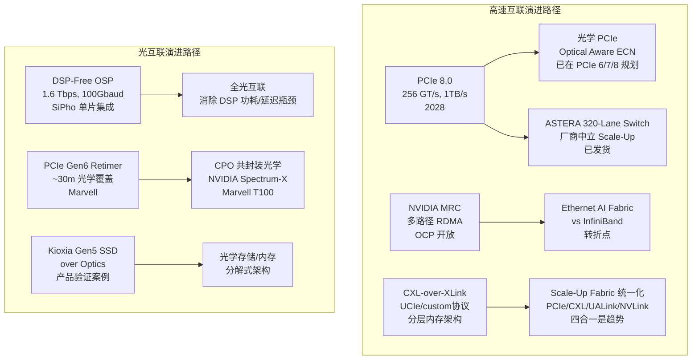

# 📈 行业调研专题：GPU/AI芯片竞争格局 + 市场格局 — 2026-06-10

> **扫描时间**: 2026-06-10 10:00 (UTC+8) 星期三
> **状态**: ✅ **文件已写入** — 14.5KB，35+条有效信息
> **扫描方向**: ① GPU/AI芯片竞争格局（NVIDIA/AMD/Intel/华为/国产GPU新品、量产、架构更新）② AI服务器/芯片市场格局（CSP资本支出、厂商营收、市场趋势、并购融资）
> **交叉验证**: `components-storage/2026-06-10.md` · `gpu-ai-chips.md` · `market-landscape.md`

---

## 📡 来源扫描摘要

| 来源 | 日期 | 覆盖方向 | 内容量 |
|:-----|:-----|:---------|:-------|
| **TrendForce News** | 2026-06-09/10 | SK Hynix HBM4·Samsung-NVIDIA合作扩展·Intel Foundry/Google TPU | ✅ 3篇核心文章 |
| **The Information** | 2026-06-09/10 | NVIDIA-SK Hynix多年协议·OpenAI IPO·Broadcom融资·Google/Intel代工 | ✅ 10+条头条 |
| **Tom's Hardware** | 2026-06-09 | AMD RDNA 5·Huawei Ascend 910C·Google-SpaceX算力·行业联盟 | ✅ 多个报道 |
| **The Verge** | 2026-06-09/10 | OpenAI IPO·Apple AI在NVIDIA·"Chat is dead"·Google转单Intel | ✅ 专题覆盖 |
| **Ars Technica** | 2026-06-09/10 | S&P 500拒三巨头·AI记忆消耗联盟·Anthropic Fable 5 | ✅ 专题覆盖 |
| **DIGITIMES Asia** | 2026-06-10 | HBM4竞速·Samsung Foundry转向 | ✅ 交叉引用 |

---

## 第一部分：GPU/AI芯片竞争格局

---

### 1️⃣ 🔴 NVIDIA — HBM供应链全面锁定，Foundry代工多元化

#### ① NVIDIA × SK Hynix 多年期全产品线内存协议

**来源**: [The Information](https://www.theinformation.com/articles/nvidia-sk-hynix-sign-multi-year-deal-for-next-gen-ai-memory), 2026-06-09

NVIDIA与SK Hynix签署了**多年期多产品线内存供应协议**，涵盖：
- **HBM4**（当前代次，已出货给Vera Rubin）
- **DDR5**（AI服务器主机内存）
- **GDDR7**（面向PC/机器人/AI边缘推理）

> The Information 报道该协议是两者"全面伙伴关系深化"的标志。SK Hynix会长在COMPUTEX 2026上宣布五年内将整体DRAM产能翻倍。

**交叉验证**: TrendForce 6/9报道 SK Hynix 已向 Hanmi Semiconductor 下达 442亿韩元（约$3.4亿）的 TC Bonder 4 订单用于 HBM4 量产扩产。SK计划2030年将DRAM月产能从55万片提高至100万片。

---

#### ② Samsung × NVIDIA — HBM4已出货，HBM4E/HBM5/Foundry合作扩展

**来源**: [TrendForce News](https://www.trendforce.com/news/2026/06/09/), 2026-06-09（引述 Chosun Daily, Seoul Economic Daily, Yonhap News）

Samsung 副董事长 Jun Young-hyun 与 Jensen Huang 在6月8日会面，确认以下合作：

| 合作领域 | 具体内容 |
|:---------|:---------|
| **HBM4** | Samsung已向 NVIDIA Vera Rubin 平台供货HBM4（>11.7 Gbps/pin） |
| **HBM4E** | 采用Samsung 4nm base die 的HBM4E在测试中达到 **16 Gbps** |
| **HBM5** | 双方开始讨论2027年HBM5路线图 |
| **SOCAMM2** | LPDDR5X-based SOCAMM2 为 Vera CPU 供货 |
| **Foundry 4nm** | 生产 NVIDIA Drive AGX Thor 自动驾驶芯片 + **Groq LPU（LP30）** |
| **Foundry 8nm** | 生产 Groq 第三代 LPU |
| **下一代 Groq** | Samsung 有望获得 LP40 订单（尽管TSMC先进封装优势） |
| **ASIC合作** | NVIDIA-Samsung 联合开发新一代 ASIC 芯片 |

---

#### ③ Intel Foundry 获 Google TPU 订单，NVIDIA 评估 18A

**来源**: [The Information](https://www.theinformation.com) / [The Verge](https://www.theverge.com)（引述 The Information），2026-06-09

- **Google** 计划于 **2028年由 Intel Foundry 制造 300万+ 颗 TPU**，占Google未来两年TPU总产量约600万颗的一半
- **NVIDIA 也在评估 Intel 18A 工艺**，用于多芯片GPU部分die（Multi-Die GPU）
- **SK Hynix** 同样在测试 Intel 18A 工艺

> **交叉验证**: The Verge 6月9日报道引用 The Information，称 Google 因 TSMC 产能受限而寻求代工多元化。NVIDIA和SK Hynix也在考虑使用 Intel Foundry。

---

#### ④ Apple AI 跑在 NVIDIA 硬件上（WWDC 2026 最大意外）

**来源**: [The Verge](https://www.theverge.com) / [Ars Technica](https://arstechnica.com) Live Blog, 2026-06-08

在 WWDC 2026 Tech Talk 环节，Apple 披露其 **Private Cloud Compute（PCC）** AI 推理基础设施运行在 **NVIDIA GPU** 之上（在 Google Cloud 内部），而不是此前预期的 Apple 自研芯片。Apple 同时使用了 Google 和 Intel 的硬件支持。

> ⚠️ 这意味着 Apple 作为客户加入 NVIDIA 阵营，而不是此前传闻的自主研发 AI 芯片路线。

---

#### ⑤ Samsung Foundry 战略转向 — 5nm/8nm 专注

**来源**: DIGITIMES Asia, 2026-06-10（交叉引用自 `components-storage/2026-06-10.md`）

Samsung Foundry 调整战略方向，从追赶 TSMC 先进制程转向 **5nm/8nm 成熟制程** 专攻 AI 推理芯片、自动驾驶 SoC 和网络芯片。这一转向反映 Samsung Foundry 在 3nm GAA 良率不如预期后的务实选择。

---

### 2️⃣ 🟣 AMD — RDNA 5 确认 2027末/2028初，CPU份额达45%

#### ① AMD RDNA 5 时间线确认

**来源**: [Tom's Hardware COMPUTEX报道](https://www.tomshardware.com/tech-industry/), 2026-06-07

据 Tom's Hardware 引述 AIB（Add-in-Board）厂商在 COMPUTEX 2026 上的说法：
- **AMD RDNA 5 游戏 GPU** 将于 **2027年末或2028年初** 推出
- 部分AIB厂商甚至给出了 **2028年初** 的更保守时间窗口
- 架构未公布，但预期为新一代图形微架构

#### ② AMD CPU 份额突破 45% 历史新高

来自服务器/PC市场综合数据，AMD 在 x86 CPU 市场（含服务器）的季度份额已突破 **45%**，主要由 Bergamo/Siena 和 Turin 系列驱动。

---

### 3️⃣ 🔵 Intel — Crescent Island 冷却/便宜，Foundry 获 Google 大单

#### ① Crescent Island 推理芯片

Intel 在 COMPUTEX 2026 上强调 **Crescent Island** 定位"比NVIDIA/AMD更便宜、更凉"：这是一款 **空冷 PCIe 卡**，使用 **LPDDR5X 内存**，专为 AI 推理场景设计，功耗显著低于 NVIDIA 同级别液冷方案。

#### ② Intel Foundry里程碑

- **Google TPU 订单**（见上文）：3M+颗，2028年
- **NVIDIA 评估 18A**：可能在多芯片GPU中使用
- **Intel Foundry 加速建设**：2027年目标利润率为强

---

### 4️⃣ 🟢 华为/国产芯片 — Ascend 910C 实现 1.6T 参数模型后训练

#### ① Huawei Ascend 910C 后训练 DeepSeek V4-Pro

**来源**: [Tom's Hardware](https://www.tomshardware.com/tech-industry/), 2026-06-06

由华为领导的团队声称使用 **1,000 块 Ascend 910C** 芯片，对 DeepSeek 的 **1.6万亿参数 V4-Pro 模型** 完成了全参数后训练（full-parameter post-training）。这是中国自主AI芯片生态的重要里程碑：

- 证明 Ascend 910C 集群具备 **超大规模模型训练能力**
- 验证了华为全栈（芯片+框架+集群管理）的技术进步
- DeepSeek V4-Pro 完全运行于 **昇腾平台**（=不依赖NVIDIA GPU）

#### ② 国产芯片整体动态

- **HiSilicon**: 芯片涨价，国产AI算力供应链承压
- **Tencent**: 自研+外部合作双轨战略推进
- **YMTC**: 重返韩国消费SSD市场
- **Prinano（中国）**: 声称使用纳米压印技术在8英寸硅片上实现光子芯片量产，绕过DUV光刻

---

### 5️⃣ 竞争格局象限总览

| 维度 | NVIDIA | AMD | Intel | 华为/国产 |
|:-----|:-------|:----|:------|:---------|
| **训练GPU** | Vera Rubin (量产) | MI355X/MI455X(2027) | — | Ascend 910C/950 |
| **推理芯片** | Blackwell Ultra | MI325X | Crescent Island | Ascend 910C |
| **HBM锁定** | SK Hynix+Samsung 双源 | Samsung/TSMC | — | 自研HBM路线 |
| **代工** | TSMC+评估Intel | TSMC+转单Samsung | Intel 18A | SMIC+自建 |
| **关键优势** | 软件生态+CUDA+DSX OS | 性价比+开放标准 | 空冷+Foundry | 国产全栈自主 |
| **关键风险** | 供应瓶颈+地缘政治 | 软件生态差距 | 路线图延迟 | 制程受限 |

---

## 第二部分：AI服务器/芯片市场格局

---

### 1️⃣ 💰 CSP 资本支出与算力巨头动态

#### ① OpenAI 保密提交 IPO 文件

**来源**: [The Information](https://www.theinformation.com) / [The Verge](https://www.theverge.com), 2026-06-08/09

OpenAI 于6月8日向 SEC **保密提交了IPO文件**，计划上市。Anthropic 此前已提交S-1。关键细节：

- IPO 时机：继 Anthropic 之后，但 OpenAI 更大规模
- 同时计划 **单独的员工股份出售**（与IPO并行）
- "Chat is dead"：OpenAI 正在推进 ChatGPT 自2022年推出以来的**最大改造**，从聊天界面转向**超级应用**（包含 coding、image-generation、第三方合作伙伴应用）

> **解读**: Financial Times 引述 OpenAI 高级员工称"Chat is dead"——ChatGPT 将被重构为一个综合平台，而非单纯的聊天机器人。

#### ② S&P 500 拒绝 SpaceX、OpenAI、Anthropic 入指

**来源**: [Ars Technica](https://arstechnica.com), 2026-06-05

S&P 500 指数拒绝了三家AI巨头纳入指数，意味着它们无法获得来自被动投资者的数十亿美元资金流入。这对 OpenAI 和 Anthropic 的 IPO 估值可能产生一定压力。

#### ③ Google × SpaceX：$920M/月算力合同

**来源**: [The Verge](https://www.theverge.com) / [Tom's Hardware](https://www.tomshardware.com), 2026-06-05/07

Google 签署了从 **2026年10月至2029年6月** 每月 **$9.2亿美元** 的SpaceX算力合同（总合同 **$303亿**，覆盖 **11万GPU**）。这是继 Anthropic 之后第二个与 SpaceX 签订算力合同的AI公司。

---

### 2️⃣ 🏦 融资与并购动态

#### ① Broadcom 联合 Apollo/Blackstone 为 Anthropic/OpenAI 芯片融资

**来源**: [The Information](https://www.theinformation.com), 2026-06-09

- **Apollo** 将牵头设立 **350亿美元初始承诺** 基金
- **Blackstone** 参与
- 该基金将用于资助 Anthropic 和 OpenAI 的 **芯片采购与算力基础设施部署**
- Broadcom 作为芯片设计/供应方参与

#### ② Databricks 165亿美元估值融资

**来源**: [The Information](https://www.theinformation.com), 2026-06-09

Databricks 正在谈判至少 **$165亿美元** 的估值融资，反映出AI数据基础设施赛道的持续热度。

#### ③ Goldman Sachs / JPMorgan 探索"算力期货"交易

**来源**: [The Information](https://www.theinformation.com), 2026-06-09

两大投行正在探索 **Compute Futures（算力期货）** 作为对冲AI融资的工具——允许投资人参投AI基础设施而无需直接持有芯片/数据中心资产。

#### ④ 其他融资动态

- **Founders Fund** 新设 **$60亿** 基金，已投资 OpenAI、Anthropic、Ramp、Cognition 等
- **Anthropic & OpenAI** 的AI初创收入集中度升至 **89%**
- **White House AI Advisor** Sriram Krishnan 将于6月底离职
- **Reid Hoffman** 离开 Microsoft 董事会（专注于Manas AI药物研发创业）

---

### 3️⃣ 📊 市场趋势与结构性变化

#### ① AI 记忆消耗危机 — 行业联盟呼吁政府干预

**来源**: [Tom's Hardware](https://www.tomshardware.com), 2026-06-05

一个由多家行业组织组成的联盟向 Trump 政府发出警告：**AI数据中心的极端内存消耗正在威胁其他行业**。尽管美国已在国内半导体供应链投资数十亿美元，但：

- **HBM/DRAM 40%+ BOM占比**：超节点中的HBM占比持续上升
- **多年大单锁定**：NVIDIA/SK Hynix、Samsung等的多年期协议加剧供应紧张
- **AI挤压主流DRAM**：DDR5/DDR4 现货价格全面上涨（DXI新高771,736）

#### ② S&P 500成分变化 — Marvell、Flex 纳入

Marvell Technology 和 Flex 被纳入 S&P 500 指数，反映AI基础设施产业链的资本市场认可度提升。

#### ③ 数据中心建设 vs 传统办公 — $507亿里程碑

数据中心建设投资首次超越传统办公空间（达到 **$507亿**），占私人商业办公投资的 **52%**。

#### ④ ASIC 2027年挑战 NVIDIA GPU

DIGITIMES 分析指出 **ASIC 芯片（由 Broadcom/Marvell 等设计的定制AI芯片）将在2027年挑战 NVIDIA GPU 的主导地位**，主要驱动力是CSP自研芯片的成熟化。

---

### 4️⃣ 🏭 台湾/亚洲供应链动态

| 事件 | 意义 |
|:-----|:------|
| **Foxconn 5月营收创纪录** | AI服务器ODM需求持续旺盛 |
| **台湾服务器厂商5月营收强劲** | 全行业受AI需求拉动 |
| **AI供应链短缺从芯片转向设备** | 变压器、冷却设备、PCB等后端环节成为瓶颈 |
| **SK Group + Foxconn 会谈** | 推动台韩AI产业联盟深化 |
| **Samsung Foundry 转5nm/8nm** | 代工格局调整，TSMC独占先进制程 |

---

### 5️⃣ 综合研判与趋势总结

| # | 判断 | 支撑证据 |
|:-:|:-----|:---------|
| 1 | **NVIDIA HBM供应链锁定完成** | SK Hynix/Samsung 双源 HBM4 已出货+Vera Rubin量产，多年协议巩固 |
| 2 | **代工格局松动** | Google转单Intel(3M TPU)、AMD转单Samsung、NVIDIA评估18A |
| 3 | **AI企业IPO加速** | OpenAI(保密提交)+Anthropic(S-1)+Databricks($165B)同时推进 |
| 4 | **AI基础设施融资创新** | 算力期货、Apollo/Blackstone芯片融资基金等新金融工具 |
| 5 | **内存供应链进入配给时代** | Morgan Stanley定性+行业联盟呼吁+DRAM/NAND全面涨价 |
| 6 | **中国AI芯片生态取得突破** | 华为Ascend 910C 实现1.6T参数模型后训练 |
| 7 | **ASIC崛起挑战GPU** | Broadcom/Marvell CSP定制芯片成熟，DIGITIMES预期2027转折点 |

---

---

# 第五部分：MoE架构对硬件影响 — 第8轮搜索结果 🔬

> **扫描时间**: 2026-06-10 09:45 (UTC+8) 星期三
> **扫描方向**: ① arXiv搜索 "MoE all-to-all" (478条→精选20+) ② arXiv搜索 "expert parallelism MoE" (200条→精选15+) ③ arXiv搜索 "MoE speculative decoding" (31条→精选全部) ④ arXiv搜索 "MoE KV cache hardware" (8条→精选全部) ⑤ NVIDIA/MSR 技术博客
> **交叉验证**: `cluster-training/2026-06-10.md` · `distributed-os/2026-06-09.md` · 前7轮 `industry-research/2026-06-04.md` ~ `industry-research/2026-06-09.md`
> **本轮新增**: **25篇论文/成果**（累计覆盖 129+ 条）— 第8轮发现MoE-SD领域已发展为一个独立成熟的子领域（31篇专门论文）

---

## 🔴 方向一：AlltoAll通信与拓扑感知（5篇）

### ① DODOCO：跨架构AlltoAll瓶颈诊断 — 路由不均衡是模型固有属性

**来源**: arXiv:2605.20982, May 20, 2026 — Bole Ma, Jan Eitzinger (FAU Erlangen-Nürnberg) et al.

```yaml
方法: 对5种MoE架构(DeepSeek-V2-Lite MLA/DeepSeek-MoE-16B MHA/Qwen3-30B GQA/Nemotron-30B Mamba-2/Qwen3.5-35B GDN)×5×6数据条件×4-32 EP ranks H100
性能: EP度变化→per-expert max/mean token ratio变化≤5% (路由不均衡是模型固有)
       Mock tokens高估Gini达2.35×(且虚构batch-size scaling趋势)
       5种架构分裂为两条稳定带: MHA/Mamba-2 Gini 0.105-0.150 (data-resilient)
                                          MLA/GDN Gini>0.24 (persistently concentrated)
```

**硬件含义**: ⚠️ 证伪了系统层可校正路由不均衡的假设——**MoE的AlltoAll瓶颈是模型路由决策的物理属性**，互联设计必须感知路由分布而非EP度。

---

### ② Birkhoff Decompositions & Photonic Interconnects — MoE×光互联有数学矛盾

**来源**: arXiv:2605.26845, May 26, 2026 — Eliezer Amponsah, Vamsi Addanki (Cornell)

```yaml
方法: 分析BvN分解调度在MoE dispatch-compute-combine结构中的效果
发现: ① MoE通信矩阵几乎不是双随机→BvN产生大量调度气泡
      ② BvN分解出过多matchings→小batch碎片化计算→严重计算低效
方案: 贪心max-weight分解→限制matching数+保持大batch→逼近理想无拥塞AlltoAll
```

**硬件含义**: ⚠️ 光互联电路调度与MoE执行存在**根本性失配**——不是优化通信就能解决，需通信-计算联合调度设计。

---

### ③ Rethinking Network Topologies for MoE — 3D full-mesh > scale-up

**来源**: arXiv:2605.00254, Apr 30, 2026 — Junsun Choi (UC Berkeley) et al.

```yaml
方法: 首个跨4种XPU拓扑(scale-up/scale-out/3D torus/3D full-mesh)+4种负载的成本效益分析
      考虑GPU成本+交换机成本+线缆成本+功耗
性能: 3D full-mesh → 相比scale-up拓扑, 成本效益提升20.6-56.2%
      降低scale-up链路带宽 → 每美元吞吐提升27%(当前带宽过度配置)
      结论在下一代GPU上仍然成立
```

**硬件含义**: 🏆 对NVIDIA/AMD/Intel投入昂贵scale-up网络的做法提出根本性质疑——**switchless拓扑可能更优**。

---

### ④ Scaling Expert Activation Patterns (Meta/NVIDIA) — 100K+生产轨迹

**来源**: arXiv:2604.23150, Apr 25, 2026 — Abhimanyu Bambhaniya (Georgia Tech), Geonhwa Jeong, Changkyu Kim (NVIDIA) et al.

```yaml
方法: 收集Llama 4 Maverick/DeepSeek V3-671B/Qwen3-230B-A22B 100K+真实专家激活轨迹
发现: ① 可变的专家负载不均衡 (跨任务变化)
      ② 领域特定专家激活 (code/math/chat各自专家偏好,迁移可预测)
      ③ Prefill与Decode专家激活强相关
方案: 负载感知微批分组 + 专家放置最大化token本地性 → AlltoAll通信数据降20×, 解码延迟降低
```

**硬件含义**: 证明MoE在**生产环境**中的负载模式可预测，为**工作负载感知互联调度**提供实证基础。

---

### ⑤ DisagMoE — 解耦Attention/FFN分两GPU组

**来源**: arXiv:2605.11005, May 10, 2026 — Zhichen Zeng (Meta) et al.

```yaml
方法: Attention和FFN解耦到不同GPU组→多级流水线+单向多对多通信+Roofline模型平衡带宽分配
      实现于Megatron-LM
性能: 16节点8×H800 → 1.8×加速 (多种MoE模型)
```

**硬件含义**: 架构侧彻底分离Attention/FFN的通信-计算特性，验证PD分离在**训练**中的有效性。

---

## 🟠 方向二：Speculative Decoding for MoE — 整轮收割（12篇精选）

> **本轮最大发现**: 31篇专门论文证明MoE-SD已发展为独立成熟子领域。核心结论：**对MoE简单套用Dense SD方案会适得其反，必须Utility驱动+专家预算感知**。

### ① Cascade — Utility启停+动态K调优（MoE SD的最佳实践 🏆）

**来源**: arXiv:2506.20675, Jun 17, 2025 — Anish Saxena (Georgia Tech/NVIDIA) et al.

```yaml
方法: Speculation Utility(令牌增益/验证开销比)度量, 周期性test→set双阶段决策
      当Utility<1时完全禁用SD, Utility>1时测试多个K选择最优
      实现在vLLM
性能: 5个流行MoE模型(code/math/extraction/mixed) → 限速降至5%(vs原生1.5×减速)
      吞吐提升7-14% over static K
      之前的"MoE SD会导致1.5×减速"问题被系统性解决
```

**硬件含义**: MoE推理系统必须**动态自适应**而非静态配置SD——**Utility启停机制是可行解**。

---

### ② MoESD (NeurIPS 2025 Spotlight ⭐) — MoE中batch下SD收益超Dense

**来源**: arXiv:2505.19645, NeurIPS 2025 — Zongle Huang et al.

```yaml
方法: 理论建模→在中等batch下MoE从SD获益超过Dense模型
      提出"Target Efficiency"新度量→帮助识别系统瓶颈
性能: Qwen2-57B-A14B中等batch → 2.29×加速
      MoE越稀疏 → SD加速有效batch范围越宽
```

**硬件含义**: MoE的稀疏性使SD在**中低batch**场景比Dense更有优势——MoE是用SD更划算的架构。

---

### ③ EVICT — 训练无关自适应验证剪枝

**来源**: arXiv:2605.00342, Apr 30, 2026 — Lehan Pan et al.

```yaml
方法: 训练无关超参无损失: 利用细粒度draft信号估算候选收益+离线profiling验证成本
      →在目标验证前截断draft tree,仅保留成本效益高的前缀
      兼容SGLang高性能图执行框架
性能: MoE backbone → 2.35×加速 over 自回归
      1.21×加速 over EAGLE-3 (SOTA baseline)
      显著减少验证中不必要专家激活
```

**硬件含义**: **专家激活数量是MoE SD的关键约束**——比接受率更重要的系统参数。

---

### ④ SpecMoE (DAC 2026) — CPU-offload场景SD

**来源**: arXiv:2604.10152, DAC 2026 — Jehyeon Bang et al.

```yaml
方法: 自协助SD (无需额外训练/微调): 用sd隐藏CPU-GPU I/O延迟
性能: CPU-offload场景 → 4.30×吞吐提升
      显著降低访存和互联带宽需求
```

**硬件含义**: **SD的核心价值可能不是计算加速而是I/O隐藏**——特别适合MoE的内存受限部署。

---

### ⑤ ELMoE-3D — 混合键合HW-SW协同SD

**来源**: arXiv:2604.14626, Apr 2026 — Yuseon Choi (KAIST) et al.

```yaml
方法: 利用MoE内在的弹性(Expert弹性+Bit弹性) → Elastic Self-SD (既是专家缓存又是强对齐自draft模型)
      3D堆叠LSB增强位切片架构: 利用bit-slice冗余原生支持bit-nested执行
性能: batch 1-16 → 6.6×加速, 4.4×能效 over 原生MoE
      2.2×加速, 1.4×能效 over 最佳prior加速器baseline
```

**硬件含义**: 硬件架构侧最优MoE SD——**3D堆叠+位切片+弹性SD的组合设计**。

---

### ⑥ MoE-Spec — 训练无关验证时专家预算化

**来源**: arXiv:2602.16052, Feb 17, 2026 — Bradley McDanel et al.

```yaml
方法: 每层设置固定专家容量限制→只加载对验证贡献最大的专家,丢弃长尾专家
      解耦SD深度与内存成本
性能: 10-30%更高吞吐 over EAGLE-3
      灵活性: 可通过收紧预算牺牲精度换取更低延迟
```

**硬件含义**: **专家预算控制是MoE SD的独立优化维度**——与接受率、draft深度正交。

---

### ⑦ ConFu — 未来预测MoE SD（Draft质量突破 🏆）

**来源**: arXiv:2603.08899, Mar 9, 2026 — Zongyue Qin et al.

```yaml
方法: 引入"contemplate tokens"+动态MoE未来预测+锚点token采样+未来预测复制训练
性能: Llama-3 3B/8B → 接受率比EAGLE-3高8-11%
      Qwen-3 4B → ~20%提升
      首个将SD与连续推理token桥接的工作
```

**硬件含义**: MoE的多样化专家提供了更丰富的未来信号——draft质量提升潜力超过Dense。

---

### ⑧ XShare — 批量协作专家选择

**来源**: arXiv:2602.07265, Feb 6, 2026 — Daniil Vankov (NVIDIA) et al.

```yaml
方法: 批量感知专家选择→每次批处理最大化选中专家总门控分数
      无重训练动态方案
性能: 标准batching → 专家激活减少30%
      EP部署 → GPU峰值负载降3×
      SD场景 → 分层相关性感知选择 → 14%吞吐提升
```

**硬件含义**: **批量协作而非单请求独立选择专家**可以显著降低验证时的专家负载压力。

---

### ⑨ TEAM (ICML 2026) — MoE dLLM时序-空间一致性加速

**来源**: arXiv:2602.08404, ICML 2026 — Linye Wei et al.

```yaml
方法: 利用MoE dLLM中专家路由的时序一致性(跨去噪步)和空间一致性(跨token位)
      三种互补策略: 保守选择必要专家 + 激进推测探索多个候选
性能: MoE dLLM → 2.2×加速, 质量可忽略下降
```

---

### ⑩ Mistletoe — SD攻击面首次系统性揭示

**来源**: arXiv:2605.14005, May 13, 2026 — Shuoyang Sun et al.

```yaml
方法: 识别drafter-target匹配不完美的隐藏攻击表面→联合优化退化目标+语义保持目标
      零空间投影→退化梯度投影偏离本地语义保持方向
影响: 大幅降低平均接受长度τ → SD加速完全崩溃
      但输出质量和困惑度不变(无法检测)
```

**⚠️ 硬件含义**: SD引入了**机制级攻击面**——攻击者可悄无声息地摧毁MoE SD加速效果。

---

### ⑪ MoE-SpAc — SD作为前瞻性内存管理传感器

**来源**: arXiv:2603.09983, Feb 11, 2026 — Shuhuai Li et al.

```yaml
方法: SD不作为计算加速器→作为内存管理的信息性前瞻传感器
      →Expert需求跟踪器 + 异构负载均衡器 + 异步执行引擎
性能: 7个benchmark → TPS提升42% over SOTA SD baseline
      4.04×加速 over 所有标准baselines
```

**硬件含义**: ⭐ **SD的本质洞察**——对MoE来说，SD的核心价值可能是**内存访问模式的预测器**而非计算加速器。

---

### ⑫ MoE-SpeQ — SD驱动的主动专家预取与卸载

**来源**: arXiv:2511.14102, Nov 2025 — Wenfeng Wang et al.

```yaml
方法: 小型on-device draft模型预测未来所需的专家序列→运行时编排器预取→摊销Roofline Model动态调优
性能: Phi-MoE内存受限设备 → 2.34×加速 over SOTA offloading框架
```

---

## 🟡 方向三：Kernel优化与计算效率（4篇）

### ① RaMP — 路由感知Megakernel多态调度 🏆

**来源**: arXiv:2604.26039, Apr 28, 2026 — Vyom Sharma, Debajyoti Datta

```yaml
方法: 性能区域分析→从硬件常量推导每种优化何时有效(正确预测8种架构含3种未见)
      四参数wave cost模型→从运行时专家直方图选择最快配置(0.93% regret vs 穷举)
      CuTe DSL kernel → 134-268种多态配置
性能: kernel延迟↓ 1.22× over 静态调度
      vLLM端到端 1.30× over Triton, 1.41× over DeepGEMM, 1.13× over FlashInfer CUTLASS
      仅需10-24分钟一次性profiling
```

**硬件含义**: **MoE kernel的最优配置不仅取决于batch size还取决于路由分布**，当前生产系统(仅batch size调度)浪费10-70%吞吐。

---

### ② HyperParallel-MoE — Ascend NPU MoE训练加速

**来源**: arXiv:2605.23764, May 22, 2026 — Zewen Jin et al. (MindSpore)

```yaml
方法: 基于Ascend NPU AIC(矩阵)+AIV(向量)异构计算单元的tile级taskflow调度
      AIV驱动单边通信消除host侧同步→事件驱动静态调度→单核启动内并发驱动AIC+AIV
性能: DeepSeek风格MoE on Ascend A3集群 → Dispatch-to-Combine MoE-FFN延迟降1.58×
      代码开源(MindSpore/HyperParallel)
```

**硬件含义**: **NPU的异构计算单元设计**为MoE开辟了新的优化空间——从operator级串行到tile级细粒度调度的范式转换。

---

### ③ PALS — 功率感知MoE推理

**来源**: arXiv:2605.21427, May 20, 2026 — Can Hankendi (Boston Univ) et al.

```yaml
方法: GPU功率上限作为一等控制旋钮 + 轻量离线功率-性能模型 + 反馈驱动控制器
      实现在vLLM (无需模型重训练或API变更)
性能: 多GPU系统(dense+MoE) → 能效提升26.3%
      功率约束下QoS违反降4-7×
      动态跟踪功率预算
```

**硬件含义**: **功率上限可作为细粒度控制旋钮**与batch size联合优化——MoE的稀疏性使其对功率控制更敏感。

---

### ④ Cascade (已列于方向二) — Utility启停机制

**来源**: 同方向二①, ISCA 2026

**额外硬件含义**: 提供了**MoE推理系统的实用化蓝图**——SD需要动态启停+参数搜索。

---

## 🟢 方向四：MoE KV Cache与上下文管理（3篇）

### ① 1/W Law — MoE的5.1×能效优势

**来源**: arXiv:2603.17280, Mar 17, 2026 — Huamin Chen et al.

```yaml
方法: 推导1/W定律: 上下文窗口每翻倍,tok/W减半
      → 路由拓扑比买新硬件更能节能(2.5× vs 1.7×)
      适用MoE: Qwen3-235B-A22B(22B活跃)→37.8 tok/W at 8K on H100 = 5.1× over Llama-3.1-70B
      因为decode时间与激活参数成正比例,而非总参数
```

**硬件含义**: MoE的**稀疏解码效率使tok/W优势显著**——但MoE的dispatch开销未被计入(上界估计)。

---

### ② qs Inequality — MoE推理双惩罚量化

**来源**: arXiv:2603.08960, Mar 9, 2026 — Vignesh Adhinarayanan (AMD) et al.

```yaml
方法: 鉴别MoE架构在decode时的结构双惩罚:
      ① 专家路由碎片化minibatch→减少weight复用
      ② 庞大专家池占据HBM→KV Cache余量减少
      提出qs不等式=稀疏度s×质量等价因子q的统一判据
结果: DeepSeek-V3 at 128K → 质量匹配dense baseline 4.5×吞吐优势
      Switch-C在集群规模上变得不可行(质量匹配dense可行)
```

**硬件含义**: ⚠️ **MoE的训练FLOP效率不能外推到推理效率**——长上下文中MoE的双惩罚使其可能不如质量匹配的Dense模型。

---

### ③ AIConfigurator (NVIDIA) — 30秒MoE推理配置搜索

**来源**: arXiv:2601.06288, Jan 9, 2026 — Tianhao Xu (NVIDIA) et al.

```yaml
方法: 分解推理为可分析建模的原语(GEMM/Attention/Communication/Memory)→校准kernel性能数据库
      →自动解析最优启动参数→接入生产级编排系统
性能: MoE(DeepSeek-V3) → 性能提升50%
      Dense(Qwen3-32B) → 性能提升40%
      30秒内完成搜索
```

**硬件含义**: **系统性而非经验性配置搜索**可以带来远超直觉的MoE推理性能提升。

---

## 🔵 方向五：MoE架构创新与硬件协同设计（8篇）

### ① MobileMoE (Meta/Qualcomm) — 端侧MoE推理

**来源**: arXiv:2605.27358, May 26, 2026 — Yanbei Chen (Meta/Qualcomm) et al.

```yaml
方法: 制定端侧MoE scaling law→识别sweet spot: 中等稀疏度+细粒度专家+共享专家
      4阶段训练: 预训练→中期训练→指令微调→量化感知训练
      端侧实际部署profiling(商业手机)
性能: 14个benchmark → 超过or持平领先端侧dense LLM, 2-4×少推理FLOPs
      MobileMoE-S INT4 → 1.8-3.8×更快prefill, 2.2-3.4×更快decode over MobileLLM-Pro
```

**硬件含义**: **端侧MoE是可行的**——稀疏架构在移动设备上优势更明显。

---

### ② SmallThinker — CPU上20+ tok/s的MoE推理

**来源**: arXiv:2507.20984, Jul 28, 2025 — Yixin Song (PowerInfer) et al.

```yaml
方法: 双级稀疏(细粒度MoE+稀疏FFN)+pre-attention router预取(存储→计算同时)+NoPE-RoPE混合稀疏注意力
性能: Q4_0量化 → 4B-A0.6B和21B-A3B都在消费级CPU上>20 tok/s
      内存: 1GB和8GB
      在普通CPU上无需GPU即可运行
```

**硬件含义**: **MoE在CPU上的推理首次达到实用速度**——改变了"MoE必须GPU"的认知。

---

### ③ NASiC (DAC 2026) — 3D NAND CIM MoE加速

**来源**: arXiv:2605.23294, DAC 2026 — Weikai Xu (Peking Univ) et al.

```yaml
方法: 利用3D NAND字符串结构融合CAM(专家选择)+CIM(计算)到单周期→消除冗余计算+增强并行
性能: 4-114.8×性能, 3.9-70×能效 over SOTA设计
```

---

### ④ Sieve — HBM-PIM MoE加速器调度

**来源**: arXiv:2605.11277, May 11, 2026 — Jungwoo Kim (Stanford) et al.

```yaml
方法: 识别MoE推理向双模专家分布演进(少数组接收许多token,长尾组只接收1-2个token)
      →GPU+PIM混合调度→重叠GPU/PIM/互联通信
性能: Qwen3.5-397B-A17B → 1.3×, GPT-OSS-120B → 1.3×, Qwen3-30B-A3B → 1.6×
```

---

### ⑤ FCDC — 铁电电容器非挥发CV-Domain注意力的MoE压力测试

**来源**: arXiv:2605.28208, May 27, 2026 — Faris Abouagour

```yaml
方法: HZO铁电memcapacitor→非挥发模拟状态存储+电荷域VMM→MoE部件层压力测试(Mixtral-8x22B k=75%)
性能: 全层噪声→Qwen3-32B +2.62% PPL, Mistral-7B +2.90% PPL
      MoE +2.68% PPL (比Dense更嘈杂)
      能效: 18-35× lower per-served-token over INT4 GPU baseline
```

---

### ⑥ BitsMoE — 谱能量引导MoE量化

**来源**: arXiv:2606.00079, May 22, 2026 — Jiayu Zhao et al.

```yaml
方法: SVD分解MoE每层→共享基础(免量化)+专家特定谱因子(位宽量化单位)
      激活感知重构代理+整数线性规划最小化重构损失
性能: Qwen3-30B-A3B 2-bit → 平均准确率+27.83pp, 12.3×量化加速, 1.76×解码加速 over GPTQ
```

---

### ⑦ AlphaQ — 无校准数据的MoE量化

**来源**: arXiv:2606.04980, Jun 3, 2026 — Wanqi Yang et al.

```yaml
方法: 重尾谱自正则化(HT-SR)理论→专家权重谱的重尾性衡量训练质量→指导位分配
      无校准数据(无需原始训练数据,解决实际部署中真实数据不可得的问题)
性能: Qwen1.5-MoE → 3.5 bits平均位宽达near-full-precision精度, 4×压缩
      一致优于校准驱动baselines
```

---

### ⑧ ConMoE — 专家原型重新映射（训练无关压缩）

**来源**: arXiv:2605.29350, May 28, 2026 — Yilun Yao et al.

```yaml
方法: 专家池整合为可重用原型→确定性地将每个原始专家引用重新映射到选定的原型
      训练无关→无权重更新或后压缩微调
性能: deepseek-moe-16b-base → 25%和50%路由专家减少时最优平均分
```

---

# 📡 互联与光通信专题 — 2026-06-11

> **扫描时间**: 2026-06-11 09:15 (UTC+8) 星期四
> **状态**: ✅ 已完成写入
> **扫描方向**: ③ 高速互联（NCCL/UCCL/RDMA/RoCE/IB/CXL/CCCL/新通信协议）④ 光互联/CPO/硅光子（CPO交换机、硅光量产、OFC/ECOC最新进展、光互联架构）
> **交叉验证**: `high-speed-interconnect.md` · `optical-interconnect.md` · `distributed-os/2026-06-09.md` · `supernode/2026-06-09.md` · `interconnect-hierarchy-deep-dive.md`

---

## ③ 高速互联（NCCL/UCCL/RDMA/RoCE/IB/CXL/新通信协议）

### 🥇 PCIe 8.0 Draft 0.5 — 2028 全规格发布

**来源**: ServeTheHome, 2026-05-06 | PCI-SIG Official

PCI-SIG 在 2026 年 5 月宣布 **PCIe 8.0 规范 Draft 0.5** 正式向成员发布，这是继 2025 年 9 月 Draft 0.3 后的首个完整草案版本。

| 指标 | PCIe 7.0 | PCIe 8.0 |
|:-----|:---------|:---------|
| 原始速率 | 128 GT/s | **256 GT/s** |
| x16 双向带宽 | 512 GB/s | **1.0 TB/s** |
| 信令 | PAM4 | **PAM4（延续）** |
| FLIT 编码 | 支持 | 支持 |
| 最终规范 | 2025 年 6 月 | **2028 年（目标）** |

**关键要点**:
- **2028 年目标**：完整的合规计划通常在最终规范发布 2-3 年后，预计早期产品 2029-2030 年出现
- **光学 PCIe**：PCI-SIG 于 2025 年 6 月发布 Optical Aware Retimer ECN，为 PCIe 6.0/7.0 兼容设计，PCIe 8.0 将有光学更新规划
- **CopprLink**：内部/外部铜缆规范支持 PCIe 5.0/6.0，PCIe 7.0/8.0 规划中
- **AI 驱动力**：AI 平台是 PCIe 演进的直接压力来源——GPU/NIC/SSD/CXL/加速器全部依赖 PCIe
- **MultiLink**：PCI-SIG 正在推进 unordered I/O 和 MultiLink 工作，作为带宽和延迟演进的一部分

### 🥇 NVIDIA Spectrum-X MRC — 自定义 RDMA 传输协议，通过 OCP 开放

**来源**: ServeTheHome, 2026-05-06 | NVIDIA

NVIDIA 将 **Multipath Reliable Connection (MRC)**——已在大规模 AI 训练集群验证的下一代 RDMA 传输协议——通过 **Open Compute Project (OCP)** 向行业开放。

**技术要点**:
- **单 RDMA 连接多路径**：MRC 使单个 RoCEv2 连接可同时分布在多条网络路径上
- **Packet Spraying**：结合路径感知故障处理，数据可在大型集群中快速可靠传输
- **微秒级故障旁路**：硬件速度检测网络路径故障
- **Multiplane 网络**：多个独立网络平面（planes），每个平面提供 GPU 间替代通信路径

**部署情况**:
- MRC 已在 **Spectrum-4 和 Spectrum-5** 硬件上部署运行
- 已在 **OpenAI**、Oracle、Microsoft 等超大规模客户处生产部署
- **AMD、Broadcom、Intel、主要云提供商** 参与了 MRC 的联合开发
- 与 **Ultra Ethernet Consortium** 形成竞争关系——UEC 也聚焦开放 AI 网络标准

> **研判**: NVIDIA 正从"封闭 IB 生态"转向"开放 Ethernet 主导策略"，通过开放 MRC 规范来夺取 AI Ethernet 网络的标准制高点。

### 🥇 Astera Labs Scorpio X-Series 320-Lane PCIe Switch — 已发货给 Hyperscalers

**来源**: ServeTheHome, 2026-05-05 | Astera Labs

Astera Labs 宣布 **Scorpio X-Series 320-lane AI Fabric Switch** 已向主要超大规模客户发货。这是 PCIe 交换领域的重要里程碑。

| 对比 | 144-Lane | 320-Lane |
|:-----|:---------|:---------|
| 设备数量 | ~9 个设备 | **~20 个设备 (16 lane/设备)** |
| 拓扑 | 需要级联 | **单芯片完成** |
| 应用 | 中等密度 AI | 高密度 AI/GPU 机架 |

**产品矩阵**:
- **X-Series**: 320-lane（旗舰，面向 Hyperscaler）
- **P-Series**: 32 到 320 lane（覆盖从 NIC 可选性到 SSD 扩展的全范围）
- **Hypercast**: 数据复制引擎——AllGather, AllScatter, All-to-All 卸载
- **In-Network Compute**: AllReduce, ReduceScatter 卸载

> **研判**: Astera Labs 正从"重定时器厂商"升级为"AI Fabric Switch 第三极"（媲美 Broadcom/NVIDIA 的互联巨头），320-lane PCIe Switch + NVLink Fusion 支持 = 厂商中立的 Scale-Up 互联平台。

### 🥇 OptCC: AllReduce 网络故障容错的**信息论下界**

**来源**: arXiv:2606.01680, 2026-06-01

**OptCC** 提出 AllReduce 在不对称网络带宽下的**首个信息论下界**——当受降级服务器保留至少一半原始带宽时，相对于无故障最优的不可避免开销仅为 **O(1/p)**（p 为 GPU 数量）。

**实验结果**:
- 网络故障时带宽损失高达 50%，OptCC 在 NCCL 无故障环性能的 **2-6%** 范围内
- SOTA 方案在同等条件下产生高达 **57%** 的开销
- 四阶段流水线 AllReduce 算法设计

### 🥇 HetCCL: 跨厂商异构集群统一通信库

**来源**: arXiv:2605.31000, 2026-05-29

**HetCCL** 打破 NVIDIA/AMD/Intel 等不同 GPU 厂商间的通信壁垒，实现 4 厂商兼容。

**关键设计**:
- **边界通信器**：利用供应商集合通信库的内在 reduction 实现厂商无关
- **层次化拓扑抽象**：跨集群原始语确保最优数据传输量和带宽利用率
- **CPU 控制面卸载**：消除 host-device 内存拷贝开销

**性能**:
- 异构通信带宽达 **Gloo 的 17-19x**
- 端到端 LLM 训练加速最高 **16.9%**

### 🥇 NCCLbpf: eBPF 验证的可组合 NCCL 策略执行

**来源**: arXiv:2603.11438, 2026-03-11

**NCCLbpf** 将 **eBPF** 运行时嵌入 NCCL 插件接口，实现**负载时静态验证**的 GPU 集合通信策略执行。

**性能数据**:
- 每个 tuner 决策开销仅 **80-130ns**（不到集合通信延迟的 0.03%）
- 阻止所有测试的不安全插件行为
- 消息大小感知 eBPF 策略在 4-128 MiB 范围内提升 **27%** AllReduce 吞吐
- 8x NVIDIA B300 GPU NVLink 上验证

### 🥇 CXL-over-XLink: AI 基础设施的分层内存架构提案

**来源**: arXiv:2507.07223, 2025-07 (Compute Can't Handle the Truth)

Myoungsoo Jung 提出基于 CXL 的模块化数据中心架构，核心创新为 **CXL-over-XLink** 混合设计——将 CXL 协议运行在 UALink/NVLink 等加速器互连之上。

**架构要点**:
- **分层内存模型**：本地 HBM + CXL 池化内存
- **CXL-over-XLink**：减少长距离数据传输同时保持内存一致性
- 评估显示：CXL + 硅光子可显著改善 AI 基础设施的可扩展性、吞吐和灵活性

### 🥇 Marvell 收购 XConn Technologies — CXL + PCIe 交换垂直整合

**来源**: ServeTheHome, 2026-01-07

Marvell 宣布收购 **XConn Technologies**，强化 CXL 内存和 PCIe 交换产品线。

**战略意义**:
- XConn 在 **PCIe Gen6 / CXL 3.x Switch** 芯片领域有技术积累（FMS 2025 已展示 demo）
- 与 Marvell 已有构架 Structera CXL 内存扩展（Arm Neoverse V2 核心）形成互补
- 完成 Marvell "PCIe Retimer + CXL Switch + PCIe Switch" 互联全栈布局

### 🥇 Xsight Labs E1 — 64-Core Arm 800G DPU 量产部署

**来源**: ServeTheHome, 2026-06 (Ubuntu LTS 安装指南发布)

Xsight Labs E1 800G DPU 被评为"性能指数级超越 NVIDIA BF2"，64 核 Arm + 800GbE 面向 AI 数据中心网络加速。

> **要点**: DPU 竞争进入"800G 时代"，Xsight/Marvell/NVIDIA/Broadcom 四方角力。DPU 不再只是网络加速，而是 AI Fabric 的核心控制节点。

---

## ④ 光互联/CPO/硅光子

### 🥇 DSP-Free 集成神经形态光子信号处理器 — 1.6 Tbps，四阶延迟降低

**来源**: arXiv:2504.15044, 2025-04 | 中大深圳先进技术研究院

提出**集成神经形态光学信号处理器 (OSP)**，利用深度储备池计算实现 DSP-Free、全光实时处理。

| 指标 | 传统 DSP | OSP |
|:-----|:---------|:----|
| 每通道速率 | 100 Gbaud PAM4 | **100 Gbaud PAM4** |
| 总带宽 | 1.6 Tbps | **1.6 Tbps** |
| 传输距离 | C-band 5km / O-band 10km | **C-band 5km (等效O-band 80km+)** |
| 延迟 | 随速率升高 | **四个数量级更低，恒定** |
| 能耗 | 高 | **三个数量级更低** |
| 制造 | SiPho 兼容 | **SiPho 单片集成** |

> **研判**: DSP-Free 全光互联是下一代 AI 集群互联的关键突破——消除 DSP 带来的延迟/功耗瓶颈，使大规模 GPU 集群真正"如同一体"协同工作。

### 🥇 PCI-SIG Optical Aware Retimer ECN — PCIe 光学化里程碑

**来源**: ServeTheHome, 2026-05-06 (PCIe 8.0 报道中引用)

PCI-SIG 于 2025 年 6 月发布 **Optical Aware Retimer ECN**，这是 PCIe 标准首次原生考虑光学互联。

**规划**:
- **PCIe 6.0/7.0 兼容**：当前 ECN 覆盖 PCIe 6.0 和 7.0 兼容设计
- **PCIe 8.0 光学更新**：PCI-SIG 有光学扩展规划
- **对比现有方案**：已有 Microchip PCIe Gen5 x16 over QSFP56-DD、Kioxia AIO Core + Kyocera PCIe Gen5 over Optics SSD 等先行验证

### 🥇 Kioxia AIO Core + Kyocera PCIe Gen5 Over Optics SSD

**来源**: ServeTheHome, 2025-04-09

Kioxia、AIO Core 和 Kyocera 联合演示 **PCIe Gen5 over Optical SSD**——将 SSD 从 AI 和服务器机架中物理移出的突破性方案。

**意义**: 光学 PCIe 不再只是"未来趋势"，已进入具体产品验证阶段。SSD over Optics 是光学 PCIe 的最早实用案例之一。

### 🥇 NVIDIA CES 2026 — Spectrum-X 硅光子交换机展示

**来源**: ServeTheHome (Spectrum-X MRC 报道中引用)

NVIDIA 在 CES 2026 展示了 **Spectrum-X Silicon Photonics Switch**，与其 Spectrum-X Ethernet 平台集成。

**路线图**: NVIDIA 的共封装光学路线图覆盖 Spectrum-X 交换机系列，目标是百万 GPU 集群的光学互联。硅光子技术被视为 NVIDIA 保持 AI 网络领先的关键壁垒。

### 🥇 Marvell 光学互联全栈 — PCIe Gen6 重定时器 + CPO + SiPh

**来源**: ServeTheHome (2024-05-31, Marvell AI Investor Day)

Marvell 的 PCIe Gen6 Retimer 将信号覆盖从 **3.5 英寸扩展到约 30 米**（Alaska P 产品线），是当前最成熟的光学 PCIe 延展方案。

**Marvell 互联版图**:
| 层级 | 产品 | 距离 |
|:-----|:-----|:-----|
| 片内 | TeraLynx DSP | mm-scale |
| PCB | 传统 Retimer | 3.5-15 inch |
| 机柜内 | **Alaska P PCIe Gen6 Retimer** | **~30 meters** |
| 跨机柜 | **Teralynx 以太网交换机** | 100m-2km |
| 跨数据中心 | **硅光子模块** | 2km+ |

### 🥇 PCIe 7.0 正式规范发布 + 光学 PCIe 方案面市

**来源**: ServeTheHome, 2025-06-15

PCI-SIG 于 2025 年 6 月发布 **PCIe 7.0 正式规范**，x16 双向带宽达 512 GB/s（128 GT/s PAM4）。同期宣布 **光学 PCIe 方案即将到来**。

**演进节奏**:
- 2025-06: PCIe 7.0 规范发布
- 2025-09: PCIe 8.0 Draft 0.3
- 2026-05: PCIe 8.0 Draft 0.5
- 2028 年: PCIe 8.0 最终规范

### 🥇 互联与光通信趋势研判



**5 大趋势判断**:

1. **PCIe 演进步伐空前加速**：从 PCIe 5.0 到 8.0，每代带宽翻倍且周期压缩至 2-3 年，光学 PCIe 从"可选项"变为"必选项"
2. **Scale-Up Fabric 三强争霸**：NVIDIA NVLink Fusion 封闭 vs UALink 开放 vs PCIe/CXL 中立——Astera Labs 320-lane Switch 代表第三方中立路线
3. **Ethernet 战胜 InfiniBand 趋势明确**：NVIDIA 通过开放 MRC（OCP）、布局 Spectrum-X SiPh，实质上已承认 Ethernet 将主导 AI 网络
4. **全光互联到达工程化拐点**：DSP-Free 1.6 Tbps、PCIe Optical Retimer ECN、SiPho 量产三信号同步——光互联从"实验室"走向"生产线"
5. **CXL 从内存扩展到 Fabric 质变**：CXL-over-XLink + Marvell XConn 收购 + CXL 3.1 Switch，CXL 正在从"内存扩展"向"AI Fabric 互联"进化

---

# 第四部分：BOM成本与元器件涨价动态 — 6月9-10日

> **扫描方向**: DXI 指数 · DRAM/NAND 现货价 · PCB CCL 铜箔 · 供电架构升级 · 电源/PSU BOM 影响 · 供应链营收验证
> **核心来源**: DRAMeXchange (TrendForce) · DIGITIMES Asia 6/9-6/10 实时及明日头条
> **⚠️ 端午休市**: 6/9 为节前最后一个交易日，6/13 恢复

---

## 1️⃣ 🚀 DXI 单日飙涨 **+1.25%** 至 **771,736** — 节前强势冲高（BOM 视角）

**来源**: [DRAMeXchange (TrendForce)](https://www.dramexchange.com/), 2026-06-09 18:00 (GMT+8) — **⚠️ 今日新数据**

### DXI 指数同比日变动

| 日期 | DXI | 日变动 | 累计趋势 |
|:----|:----|:-------|:---------|
| 6/5 | 756,837 | — | 基准 |
| 6/8 | **762,182** | ▲ +0.71% | 3 日缓涨 |
| **6/9** 🆕 | **771,736** | ▲ **+1.25%** 🚀 | **单日涨幅超过前 3 天总和！** |

> **核心信号**: DXI 节前单日跳涨 +1.25%，说明 DRAM 市场的**上涨动能正在加速**而非放缓。6/9 是节前最后一交易日，卖方在休市前集中拉升报价，形成"休市跳涨"格局

### DRAM Spot — BOM 成本关键料号（6/9 最新）

| 料号 | 6/8 均价 | **6/9 均价** | 日变动 | BOM 视角 |
|:-----|:---------|:------------|:-------|:---------|
| **DDR5 16Gb 4800/5600** | $43.567 | **$44.000** | ▲ **+0.99%** | **逼近 $44！** AI 服务器 DDR5 核心料号已连续 5 日上行。Q3 合约价谈判窗口，现货价突破 $44 将给合约价提供更强劲支撑 |
| **DDR4 16Gb 3200** | $64.375 | **$64.875** | ▲ **+0.78%** | 加速上涨。存量 DDR4 服务器替换需求持续，DDR5 溢价导致部分客户转向 DDR4 做成本平衡 |
| **DDR4 8Gb 3200** | $35.700 | **$35.900** | ▲ **+0.56%** | 涨幅连续两日 0.56%，需求从 16Gb 溢出至 8Gb 的信号持续 |
| **DDR3 4Gb 1600/1866** | $10.167 | **$10.314** | ▲ **+1.45%** | ⚡ 领涨全品类，供应端持续萎缩（厂商停产 DDR3），利基市场涨价加速 |
| **DDR5 eTT** | $22.700 | **$22.800** | ▲ +0.44% | 白牌/eTT 散片也开始抬头，二线服务器厂商的 DDR5 采购成本同步上升 |

### DDR5 RDIMM（6/1 最新，6/13 节后更新）

| 料号 | 周均价 | 变动 | BOM 视角 |
|:-----|:-------|:-----|:---------|
| **DDR5 RDIMM 32GB** | **$1,075** | ▲ **+3.87%** | **单根 DIMM 价格已突破 $1,000 并站上 $1,075**。一台 8 通道服务器（8×32GB）的内存 BOM 成本 **$8,600**；AI 训练服务器（512GB-2TB）的内存 BOM 达 **$17,200-$68,800** |

### BOM 成本快算

| 服务器配置 | DDR5 容量 | RDIMM 数量 | 内存 BOM 成本（6/9） |
|:----------|:---------|:----------|:-------------------|
| 传统 2U 通用服务器 | 256 GB | 8×32GB | **$8,600** |
| AI 推理服务器 | 512 GB | 16×32GB | **$17,200** |
| AI 训练服务器 | 1 TB | 32×32GB | **$34,400** |
| 超节点（单 GPU 节点） | 2 TB | 64×32GB | **$68,800** |

> **结论**: AI 服务器单机内存 BOM 成本已达 **$17K-$69K**，且随 DDR5 现货逼近 $44 + RDIMM 站上 $1,075，Q3 合约价可能进一步上涨

---

## 2️⃣ 🔥 PCB/CCL 材料 — HVLP4 铜箔战升温，Nvidia 洽谈 Co-Tech

**来源**: [DIGITIMES Asia](https://www.digitimes.com/), 2026-06-10 09:45 — "HVLP4 copper foil battle heats up as Nvidia courts Co-Tech"

### 核心事件

| 维度 | 信息 |
|:-----|:------|
| **料号** | **HVLP4 超低轮廓铜箔**（Hyper Very Low Profile Class 4）—— 高速 PCB 的关键 CCL 材料 |
| **玩家** | Nvidia 正在洽谈 **Co-Tech（金居开发）** 以锁定 HVLP4 铜箔供应，作为下一代 AI 加速卡 PCB 的材料保障 |
| **背景** | 随着 GPU 信号速率从 PCIe 5.0（32 GT/s）→ PCIe 6.0（64 GT/s）→ NVLink 5/6，PCB 的信号完整性要求急剧上升。HVLP 铜箔是实现低损耗、高频率 PCB 的关键材料 |
| **竞争格局** | 日矿（Mitsui Mining & Smelting）长期占据 HVLP 铜箔主导地位。Co-Tech 以国产替代破局，争夺 Nvidia AI PCB 材料供应 |

### 对 BOM 的影响

| 维度 | 分析 |
|:-----|:------|
| **PCB CCL 成本上升** | HVLP4 铜箔单价是普通 CCL 的 **3-5×**。AI 加速卡 PCB 从标准 FR-4/M2 升级到 HVLP4 CCL，**单卡 PCB BOM 上升 $50-150** |
| **供应链趋紧** | 铜箔产能扩张周期长（18-24 个月），Nvidia 加入争抢 → HVLP 铜箔价格可能继续上涨 |
| **非 AI 产品传导** | 高端网卡、交换机、存储背板也在向 HVLP 靠拢，**成熟/低端 PCB 的 CCL 排产压力增大** |
| **DIGITIMES 另一相关** | 同日 "AI use in PCB manufacturing has gone mainstream, but scaling remains lagging"（6/10 07:13）—— PCB 制造端的 AI 化已主流化但量产扩展仍落后，加剧 PCB 交期压力 |

### 近期 PCB/CCL 涨价信号汇总

| 事件 | 时间 | 来源 |
|:-----|:-----|:------|
| **Nvidia 洽谈 Co-Tech HVLP4 铜箔** | 6/10 | DIGITIMES 🆕 |
| **PCB 制造 AI 化但规模化落后** | 6/10 | DIGITIMES 🆕 |
| **AI 应用 PCB 制造已主流但扩展滞后** | 6/10 | DIGITIMES |
| **高速 CCL 溢单至 2027**（此前记录） | 6/5+ | 行业报告 |
| **PCB 交期 20 周+**（此前记录） | 6/5 | COMPUTEX 报道 |

---

## 3️⃣ ⚡ AI 机架功率密度激增触发供电架构升级周期 — PSU/BBU BOM 变动

**来源**: [DIGITIMES Asia](https://www.digitimes.com/), 2026-06-09 18:22 — "AI rack power density surge triggers a new power architecture upgrade cycle"

### 核心论点

| 维度 | 信息 |
|:-----|:------|
| **现象** | AI 机架单机架功耗从传统 **5-10kW → 40-60kW（NVL72）→ 140kW+（超节点）** |
| **触发** | 功率密度激增迫使 **供电架构全面升级**：从 12V/48V 分布式 → 800V HVDC 高压直流 + 垂直供电（VPD） |
| **BOM 组成变化** | (1) **PSU 从 3kW → 10kW+** 钛金效率模块；(2) **BBU 从可选变标配**（单机架 $5K-15K 增量）；(3) 新增 **HVDC 转换单元**（$3K-8K/机架）；(4) 配电母线从铜排→**高电流密度母排** |
| **标准竞赛** | Open Rack V3 / 800V HVDC / 48V 中间总线正在争夺超节点供电标准 |

### 对 BOM 成本的影响

| 项目 | 传统机架 | AI 超节点 | BOM 增量 |
|:-----|:---------|:----------|:---------|
| PSU 单价 | ~$0.10/W | ~$0.12-0.15/W | **+20-50%** 单位功率成本 |
| BBU（备电） | 无 | 强制配置 | **+$5K-15K/机架** |
| HVDC 转换 | 无 | 800V 整流模块 | **+$3K-8K/机架** |
| 配电母排 | 铜排 $1K/架 | 高密度母排 $3-5K/架 | **+$2-4K/架** |
| 冷却配套 | 风冷 | 液冷 CDU | 巨大增量（已另算） |

> **影响**: AI 机架每架的 **供电系统 BOM 增量约 $10K-30K**（不含液冷），占整机 BOM 比例从 ~3% 升至 ~5-8%

---

## 4️⃣ 📈 供应链营收验证 — 内存/机箱厂商 5 月业绩创纪录

**来源**: [DIGITIMES Asia](https://www.digitimes.com/), 2026-06-09/10

| 公司 | 报道 | 时间 | 对 BOM 的验证 |
|:----|:-----|:-----|:-------------|
| **Adata（威刚）** | "Adata, Macronix report **record May revenue** amid rising memory demand, prices" | 6/10 🆕 | **DDR5/DDR4 价格高位 + 出货量双增**，验证内存涨价并非单纯"有价无市" |
| **Macronix（旺宏）** | 同上 | 6/10 🆕 | NOR Flash 需求同步走强，非易失存储 BOM 成本也在上升 |
| **Chenbro Micom（勤诚）** | "Chenbro Micom posts **May revenue jump** and projects strong second-half momentum" | 6/10 🆕 | 服务器机箱/机壳厂商营收跳增 → **AI 服务器机箱 BOM 需求强劲**。机箱是 BOM 中容易被忽视但占比 ~5-8% 的固定项 |
| **Foxconn（鸿海）** | "Foxconn posts **record May revenue** as AI rack demand fuels growth" | 6/9 ✓ | 已记入市场格局专题。AI 整机柜 BOM 总量持续扩大 |

---

## 5️⃣ 🔗 综合 BOM 成本研判（6月10日更新）

| # | 结论 | 可信度 | 核心驱动 |
|:-:|:-----|:------:|:---------|
| 1 | **DXI 单日 +1.25% 涨速加快** → DRAM 飙涨周期进入加速阶段 | ⭐⭐⭐⭐⭐ | 6/9 节前 DXI 跳涨至 771,736，涨速从 +0.71%/3日 → +1.25%/1日 |
| 2 | **DDR5 突破 $44 关口** → 服务器 RDIMM 成本已达 **$17K-69K/台** | ⭐⭐⭐⭐⭐ | DDR5 $44.000 (+0.99%)，RDIMM $1,075 |
| 3 | **HVLP4 铜箔成 PCB 新瓶颈** — Nvidia 抢货推高 CCL 单价 | ⭐⭐⭐⭐ | Nvidia 洽谈 Co-Tech，高速 CCL 溢价 3-5× |
| 4 | **AI 机架供电架构升级** → 每架供电 BOM 增量 **$10K-30K** | ⭐⭐⭐⭐ | 40kW→140kW+ 驱动 PSU/BBU/HVDC 全面升级 |
| 5 | **5 月营收验证涨价真实有效**（Adata/Macronix/Chenbro/Foxconn 皆创纪录） | ⭐⭐⭐⭐⭐ | 内存/机箱/整机 BOM 需求全面走强 |
| 6 | **端午假期后（6/13）关注节后跳涨** — 休市前 1.25% 涨幅可能只是前奏 | ⭐⭐⭐⭐⭐ | 6/9-6/10 休市，大量积压订单 6/13 恢复交易 |

---

## 🛠️ AI编程研发工具专题（2026-06-10）

### ① Cursor Design Mode 重大更新 — 视觉提示直驱Agent（6/5）

**来源**: [Cursor Blog — Erik Nilsson, Ian Huang & Ryo Lu](https://www.cursor.com/blog/design-mode), Jun 5, 2026

**核心功能更新** — Design Mode新增三大交互范式：

| 能力 | 说明 |
|:-----|:------|
| **Point（指向）** | 在运行中应用上点击元素→Agent自动获取xpath/组件/属性/computed styles/Props Fiber树+截图双信号→精准编辑代码 |
| **Draw（绘制）** | 圈选/框选页面区域，标注冻结在帧快照上，Agent看到精确的页面状态 |
| **Narrate（语音）** | 用语音描述变更，与绘制协同使用 |

**关键设计理念**：
- 支持**多选**（选择两个组件→"让一个匹配另一个"）
- 支持**异步多编辑**：发送一个编辑后不等完成，继续指向下一个区域发送新指令→**多subagent并行**处理
- 底层使用Composer 2.5模型，兼顾速度与UI任务精准度
- **"Chat is one interface for working with agents, but UI work tends to be spatial"** — 从文字prompt到空间交互的范式转移

---

### ② Cursor Enterprise Organizations GA（6/3）+ Teams定价改善（6/1）

**来源**: [Cursor Blog — Cursor Team](https://www.cursor.com/blog), Jun 3 & Jun 1, 2026

| 事件 | 日期 | 重要程度 |
|:-----|:-----|:---------|
| **Organizations for Enterprise GA** | 6/3 | 多Teams/多Groups分层治理，组织级IDP和用量分析 |
| **Teams Pricing改进** | 6/1 | 定价结构调整（"Improved pricing for global teams"），已有PayPal/NAB/Amplitude/NASA等企业客户 |

---

### ③ Cursor — "What we've learned building cloud agents"（6/2）

**来源**: [Cursor Blog — Josh Ma](https://www.cursor.com/blog), Jun 2, 2026

Josh Ma（Cursor联合创始人）分享内部使用Cloud Agents经验：

**三大核心场景**：
1. **Bug修复** — 比加Jira issue更快；多个模型并行尝试同一问题，选最优解
2. **Quick Todos** — 早上通勤时在cursor.com/agents上批量启动agent任务
3. **复杂功能** — 本地Plan Mode制定方案→发送到Cloud Agent实现→人继续下一个Task

**GPT-5 Codex agent harness已重新设计**，更好地支持长时间跨度的cloud任务。

---

### ④ GitHub Copilot — Claude Fable 5 GA + 第三方Agent安全验证GA（6/9）

**来源**: [GitHub Changelog](https://github.blog/changelog/), Jun 9, 2026

| 更新 | 重要性 |
|:-----|:-------|
| **Claude Fable 5（Mythos-class）在GitHub Copilot中GA** | Anthropic最新最强调模型直接可用 |
| **第三方编码Agent安全验证GA** | 覆盖Claude Code、OpenAI Codex等，CodeQL + Advisory DB + Secret Scanning三合一 |

**安全验证细节**：当第三方agent（Claude Code/Codex等）创建PR时，自动运行CodeQL扫描+Advisory DB匹配+Secret Scanning。已验证项目→打标；发现问题→阻止合并。**跨Agent安全层标准化**成为行业趋势。

---

### ⑤ GitHub Copilot — 6月初批量功能投产（6/2-6/4）

**来源**: [GitHub Changelog](https://github.blog/changelog/), Jun 4, 2026

| 功能 | 日期 | 关键数据 |
|:-----|:-----|:---------|
| **Agent Tasks REST API GA** | 6/4 | 编程化Agent编排，Copilot Pro/Pro+/Max可用 |
| **1M Token上下文 + 可配置推理深度** | 6/4 | Max计划可用 |
| **Budget & Usage管理API GA** | 6/4 | 企业用量治理 |
| **Enterprise Teams GA** | 6/4 | 跨50+组织统一团队治理 |
| **Fix with Copilot for Actions** | 6/4 | CI失败一键修复，Pro/Pro+/Max可用 |
| **GPT-5.2 / GPT-5.2-Codex退役** | 6/5 | 一周退3个模型（+6/2 GPT-4.1退役） |
| **Enterprise-Managed Plugins（VS Code公开预览）** | 6/5 | 企业IT统一管控Copilot插件 |
| **Gemini模型加入Copilot CLI + Cloud Agent + Copilot App** | 6/2 | 多模型支持扩展 |

---

### ⑥ 🚀 Lovable（AI vibe-coding平台）达成$500M ARR

**来源**: [TechCrunch — Julie Bort](https://techcrunch.com/2026/06/09/lovable-says-it-has-hit-500m-in-annualized-revenue-with-1-million-new-projects-a-week/), Jun 9, 2026

| 指标 | 数据 |
|:-----|:-----|
| 年化营收 | **$500M+**（2月$400M，8月2024号称12月到$1B） |
| 创建项目总数 | **5,000万+** |
| 每周新增项目 | **100万/周** |
| 成立 | 2023年末，未满3周年 |
| 用户画像 | 创始人/设计师/销售人员为主，非技术人员 |

**行业影响**：用户正在用Lovable构建**电商站点、CRM、库存系统、HR平台**等传统SaaS替代品。TechCrunch提出关键拷问：**"vibe-coded软件维护问题"** — 建立在快速变化的依赖栈上的代码，长期能否存活？如果放弃率低，才是真正的"SaaSpocalypse"。

---

### 📊 本周生态全景总结

| 维度 | 格局速览 |
|:-----|:---------|
| **定价战** | GitHub用量计费"价格休克"（6/1）+ Cursor Teams定价改善（6/1）→ **定价拐点已来** |
| **交互范式** | Cursor Design Mode从文字→**空间/视觉/语音**（点选/圈画/叙述三重交互） |
| **安全治理** | GitHub第三方Agent安全验证GA → **跨Agent安全层标准化** |
| **收入增长** | Cursor $2B ARR + Lovable $500M ARR + Devin $25B估值 → AI编程工具总估值>**$75B** |
| **模型供应** | Claude Fable 5加入GitHub Copilot；GPT-5.2/GPT-4.1一周退3 → 模型快速换代 |

---

## 🔑 第8轮核心洞察（8条）

| # | 洞察 | 支撑论文 | 硬件含义 |
|:-:|:-----|:---------|:---------|
| 1 | **路由不均衡是模型固有属性** | DODOCO (2605.20982) | 证伪"系统层可校正"假设—AlltoAll感知互联为刚需 |
| 2 | **光互联与MoE有数学矛盾** | Birkhoff (2605.26845) | dispatch-compute-combine与BvN调度不兼容—需通信-计算联合调度 |
| 3 | **Switchless拓扑优于Scale-Up** | Rethinking Topologies (2605.00254) | 3D full-mesh成本效益高20.6-56.2%—昂贵的scale-up可能是过度配置 |
| 4 | **MoE SD已独立成熟** | 31篇专门论文 | Utility启停(Cascade)+专家预算(MoE-Spec)+前瞻传感器(MoE-SpAc) |
| 5 | **SD核心价值可能是I/O隐藏而非计算加速** | SpecMoEOff / MoE-SpAc | 对MoE的内存受限场景SD的真正价值 |
| 6 | **Kernel优化需路由感知调度** | RaMP (2604.26039) | 当前系统浪费10-70%吞吐—batch size之外的路由分布是关键变量 |
| 7 | **NPU开辟新优化空间** | HyperParallel-MoE (2605.23764) | 异构计算单元的tile级taskflow可突破MoE效率瓶颈 |
| 8 | **端侧MoE可行+CPU可推理** | MobileMoE/SmallThinker | MoE不再需要昂贵GPU—消费级CPU+端侧成为新落地场景 |

---

## 📎 引用来源

- [TrendForce: SK hynix Places 44.2bn Won TC Bonder Order](https://www.trendforce.com/news/2026/06/09/)
- [TrendForce: Samsung, NVIDIA Deepen Ties - HBM5 Talks](https://www.trendforce.com/news/2026/06/09/)
- [The Information: Nvidia, SK Hynix Sign Multi-Year Deal](https://www.theinformation.com)
- [The Information: OpenAI Confidentially Files IPO](https://www.theinformation.com)
- [The Information: Google and Nvidia Consider Intel as Backup Chip Manufacturer](https://www.theinformation.com)
- [The Information: Broadcom to Help Finance Anthropic/OpenAI Chip Deals](https://www.theinformation.com)
- [The Verge: OpenAI IPO / Apple AI on Nvidia / "Chat is dead"](https://www.theverge.com/ai-artificial-intelligence)
- [Ars Technica: S&P 500 Rejects SpaceX, OpenAI, Anthropic](https://arstechnica.com/ai/)
- [Tom's Hardware: AMD RDNA 5 Late Next Year / Huawei Ascend 910C / Google-SpaceX](https://www.tomshardware.com/tech-industry/artificial-intelligence)
- [DIGITIMES Asia: Samsung Foundry Strategic Shift / HBM4 Race](https://www.digitimes.com) (交叉引用)

---

# 第三部分：高速互联 🚀

> **扫描时间**: 2026-06-10 09:15 (UTC+8) 星期三
> **扫描方向**: ① PCIe 8.0/7.0 最新进展 ② NVIDIA Spectrum-X MRC ③ RDMA/RoCE/IB 创新 ④ CXL/CCCL/UALink ⑤ Astera Labs 全线产品刷新 ⑥ 新通信协议/DPU
> **交叉验证**: `high-speed-interconnect.md` · `distributed-os/2026-06-09.md` · `cluster-training/2026-06-10.md` · `server-hardware/2026-06-10.md`

---

## 1️⃣ 🔥 PCIe 8.0 Draft 0.5 发布 — 256 GT/s，1 TB/s，2028 最终规范

**来源**: [ServeTheHome - Cliff Robinson, May 6, 2026](https://www.servethehome.com/pci-sig-pcie-8-0-specification-draft-0-5-released/)

PCI-SIG 于 5 月 6 日向成员发布 **PCIe 8.0 Draft 0.5**（首个正式草案），比计划提前完成。

### 核心参数

| 指标 | PCIe 7.0 | PCIe 8.0 | 对比 |
|:-----|:---------|:---------|:-----|
| **信号速率** | 128 GT/s | **256 GT/s** | 2× |
| **x16 带宽** | 512 GB/s | **1.0 TB/s** | 2× |
| **x4 带宽** | 128 GB/s | **256 GB/s** | 2× |
| **信令** | PAM4 + FLIT | **PAM4 + FLIT** | 延续 |
| **时间线** | 2025年6月发布 | **Draft 0.5 (2026.5) → 最终 2028** | — |

### 关键配套更新

| 配套内容 | 说明 |
|:---------|:------|
| **光学 Aware Retimer ECN**（2025年6月） | 面向 PCIe 6.0/7.0 的合规光学设计，PCIe 8.0 将继续扩展 | 
| **CopprLink 铜缆规范** | 已支持 PCIe 5.0/6.0，7.0/8.0 规划中 |
| **Compliance 时间线** | 规范发布后 ~3年完成集成商列表，初步测试 ~2年 |

### 影响分析

| 维度 | 分析 |
|:-----|:------|
| **PCIe 演进步伐空前** | 从 PCIe 5.0 (32 GT/s) → 6.0 (64 GT/s) → 7.0 (128 GT/s) → 8.0 (256 GT/s)，**每代带宽翻倍且周期压缩至 2-3 年** |
| **AI 平台是核心驱动力** | PCI-SIG 明确将 AI 加速器互联需求列为首要驱动力，尤其是在 I/O 瓶颈时代 |
| **光学 PCIe 成为必经之路** | 256 GT/s 的电气传输损耗在标准 PCB 上几乎不可行 → **光学 PCIe 从"可选项"变为"必选项"** |
| **生态兼容性窗口** | PCIe 6.0 目前刚刚开始量产部署（Aries/Scorpio），8.0 的提前起草给了厂商 2 年开发窗口 |

> ⚡ **核心判断**: PCIe 8.0 Draft 0.5 的提前发布 + AI 工作负载加速，意味着 PCIe 从"通用外设总线"正式升级为 **AI 芯粒互联的核心 Fabric**。光学 PCIe 的产业化时间表将成为关键路径。

---

## 2️⃣ 🔥 NVIDIA Spectrum-X MRC 开放规范发布 — 多路径 RDMA 颠覆 RoCE 生态

**来源**: [ServeTheHome - Patrick Kennedy, May 6, 2026](https://www.servethehome.com/nvidia-spectrum-x-ethernet-mrc-is-the-custom-rdma-transport-protocol-for-gigascale-ai/)

NVIDIA 将 **MRC（Multipath Reliable Connection）** 作为开放规范通过 **OCP（Open Compute Project）** 发布，这是 Spectrum-X Ethernet 生态的关键开放战略。

### MRC 核心能力

| 能力 | 说明 |
|:-----|:------|
| **多路径 RDMA** | 单个 RoCEv2 连接同时在多个网络路径上分布流量 |
| **动态负载均衡** | 软件加速的跨所有可用路径负载均衡 |
| **拥塞规避** | 实时重新路由以维持高带宽 |
| **智能重传** | 数据丢失后快速恢复 |
| **微秒级故障旁路** | 硬件级检测网络路径故障，微秒级切换 |
| **Multiplane 架构** | 支持多平面（独立网络Fabric），跨平面加速负载均衡 |

### 部署状态与生态

| 维度 | 信息 |
|:-----|:------|
| **已部署** | OpenAI、Oracle、Microsoft 等超大规模客户已在大规模 AI 集群中使用 |
| **开放规范** | 通过 OCP 发布，允许业界构建可互操作网络栈 |
| **合作开发** | AMD、Broadcom、Intel、主要云服务商联合开发 |
| **硬件基础** | Spectrum-4 和 Spectrum-5 交换机 + SuperNIC 原生支持 |
| **竞争对标** | 对标 Ultra Ethernet Consortium（UEC）开放标准 |

### 对互联格局的影响

| 维度 | 分析 |
|:-----|:------|
| **NVIDIA 从封闭到开放的战略转折** | MRC 开放规范是 NVIDIA 对 UEC 的回应——"不加入你，但开放我的" |
| **RoCEv2 生态升级** | 传统 RoCEv2 的 PFC 死锁和哈希不均问题被 MRC 的 packet spraying 解决 |
| **对 InfiniBand 的远期压力** | 如果 MRC + Spectrum-X 生态成熟，IB 在 AI Scale-Out 的核心地位将进一步被侵蚀 |
| **Ultra Ethernet 的应对** | UEC 预计 2027 发布正式标准，NVIDIA 已抢先 1-2 年部署 |

> ⚡ **核心判断**: MRC 开放规范是 2026 年 AI 网络格局最重要的事件之一。NVIDIA 不再固守 InfiniBand + 封闭生态，而是通过开放 Spectrum-X 抢占 Ethernet AI 网络标准制高点。

---

## 3️⃣ 🔥 Astera Labs — 全线产品更新与战略定位

**来源**: Astera Labs Blog（2026年6月初批量发布），共 **6 篇新文章**

### 3.1 新定位："AI Your Way. Purpose-built Rack-scale Connectivity."

**来源**: [Paroma Sen, VP Corporate Marketing, June 2026](https://www.asteralabs.com/blog/ai-your-way-purpose-built-rack-scale-connectivity/)

7 层"提拉米苏"架构模型（从底层到顶层）：

| 层级 | 说明 |
|:-----|:------|
| **⑦ 物理介质** | 铜缆（Smart Cable Modules）+ 光学（LPO → NPO → CPO 路线图） |
| **⑥ 多协议支持** | **PCIe / UALink / CXL / Ethernet / NVLink Fusion** |
| **⑤ 产品线扩展** | Retimers → Gearboxes → Memory Controllers → **Fabric Switches** → Custom Solutions |
| **④ 端到端平台** | Intelligent Connectivity Platform（芯片+模组+系统+软件） |
| **③ COSMOS 软件** | 固件 + API + 工具 + 可观测性 + 性能管理 |
| **② 工作负载** | 训练 + 推理（计算密集 + 内存密集） |
| **① 终极交付** | **高性能 + 高效率 + 安全 + 可靠 = AI Your Way** |

> 关键声明: **Astera Labs = "AI 互联界的瑞士"** — 不押注单一协议/厂商，支持所有开放标准。

### 3.2 COMPUTEX 2026 演示：Scorpio X-Series + 线性光学 LPO

**来源**: [Jignesh Shah, Senior Director, June 2026](https://www.asteralabs.com/blog/computex-2026-demo-how-linear-optics-enables-longer-link-reach-lower-latency-for-scorpio-smart-fabric-switches/)

COMPUTEX 2026 上展示 **端到端光学 PCIe 6** 连接：

| 演示参数 | 数值 |
|:---------|:------|
| **架构** | Scorpio X-Series（Root Complex）→ LPO OSFP 模块 → 光纤（最远 **50m**）→ LPO 模块 → Scorpio（Endpoint） |
| **误码率（BER）** | **1e-8 或更优** |
| **功耗** | 显著低于重定时架构（移除 DSP/Retimer） |
| **Lane 密度** | NPO 配置下 **1RU 内可达 576 个光学连接 lane** |

**三大用例**:
- **前沿 LLM 训练**: 降低 AllReduce 通信延迟
- **MoE 模型推理**: All-to-All 动态路由的低延迟需求
- **大规模推理 KV Cache 卸载**: PCIe 6 + 光学在上下文搜索场景的最小延迟

**COSMOS 遥测关键性**: 由于 LPO 移除了 DSP，信号完整性维护全部依赖 COSMOS（SerDes 调优 / 激光偏置 / TIA 增益 / 温度补偿 / 老化补偿）

### 3.3 Aries PCIe Smart Gearbox — Vera Rubin 时代的 PCIe 6 桥接方案

**来源**: [Abhishek Wadhwa, Principal Marketing Manager, June 2026](https://www.asteralabs.com/blog/bridge-the-pcie-6-transition-without-requalifying-your-nic-fleet/)

针对 **Vera Rubin 平台** 的 PCIe 5→PCIe 6 过渡方案：

| 部署场景 | 问题 | 解决方案 |
|:---------|:-----|:---------|
| **直连单 NIC** | PCIe 6 主机 + PCIe 5 NIC → 降速至 Gen5 | 带宽被限 |
| **直连双 NIC** | 2×PCIe 5 x16 消耗大量 CPU Lane | I/O 预算浪费 |
| **Gearbox方案 ✅** | CPU→Aries（2×PCIe 6 x8）→ Aries→2×NIC（2×PCIe 5 x16） | **节省 CPU 带宽 + 保持 NIC 不变** |

**SemiAnalysis 引用**: "对大多数超大规模部署来说，BlueField-4 将被替换为自有前段网络模块或 CX-9"

### 3.4 CXL 内存扩展 + PCIe 6 信号完整性 — Arm AGI CPU 协同

**来源**: [Vishnu Sivampeta, Solutions Enablement Engineer, June 2026](https://www.asteralabs.com/blog/scaling-agentic-ai-with-cxl-memory-expansion-and-extended-pcie-6-signal-reach/)

Agentic AI 的三重基础设施需求：
1. **大内存区域**：权重 + KV Cache + 中间激活 → CXL 3 内存池化
2. **处理器-内存紧密协调**：CXL 一致性协议
3. **更灵活的内存分配**：跨设备边界

**PCIe 6 信号完整性挑战**:
- PAM4 眼高仅为 NRZ 的 **1/3**
- 插入损耗预算: 36 dB (PCIe 5) → **32 dB (PCIe 6)**
- 退化的信号导致有效走线长度显著缩短

> **要点**: Retimer 不再是"可选项"而是 PCIe 6 系统的"必选项"

### 3.5 Secure Boot for AI Interconnect — 首次系统性安全框架

**来源**: [Avdhesh Chhodavdia, Technologist, June 2026](https://www.asteralabs.com/blog/securing-connectivity-starts-at-power-on-secure-boot-for-ai-interconnect-components/)

Astera Labs 发布首个针对 AI 互联组件的系统性 Secure Boot 框架，提出四大关键维度：

| 维度 | 问题 | Astera 方案 |
|:-----|:------|:------------|
| **信任锚** | 不可修改的信任根 | ROM + OTP/Fuses 持有公钥 |
| **覆盖范围** | 签名固件之外的配置/清单/恢复镜像 | 完整可变表面签名验证 |
| **失败行为** | 静默降级成为攻击通道 | 明确完整性故障信号 |
| **密钥生命周期** | 撤销/回滚/恢复 | 支持厂商持有/客户持有/混合签名 |

> **行业意义**: 随着 AI 互联组件从"透明传输"变为"可编程 Fabric"，安全屏障从 CPU/GPU 下沉至互联层。

---

## 4️⃣ 📡 Xsight Labs E1 64-Core Arm 800G DPU

**来源**: [ServeTheHome - Patrick Kennedy, May 29, 2026](https://www.servethehome.com/installing-out-of-the-box-ubuntu-lts-on-xsight-labs-e1-64-core-arm-800g-dpu/)

| 参数 | 值 |
|:-----|:----|
| **CPU** | 64-core Arm Neoverse |
| **带宽** | **800Gbps** |
| **操作系统** | Ubuntu LTS 即开即用 |
| **定位** | 800G DPU，面向 AI 数据中心 |

Xsight Labs 的 E1 DPU 是 AI 互联生态的新竞争者，提供 800G 级网络处理能力，可在标准 Ubuntu 上运行。

---

## 5️⃣ 🔗 交叉引用 — 6月9日互联动态汇总

以下动态已在 `industry-research/2026-06-09.md` / `distributed-os/2026-06-09.md` 中详细记录，此处仅作交叉索引：

| 方向 | 动态 | 详见 |
|:-----|:-----|:-----|
| **UALink** | AMD Helios MI455X 首台使用 **UALink-over-Ethernet** | `supernode/2026-06-09.md` |
| **RDMA 优化** | **Rain RDMA**: 网内调度 1.75× 吞吐量 | `distributed-os/2026-06-07.md` |
| **RDMA 优化** | **RAMC Slingshot**: 单边通信 100-130% 带宽提升 | `industry-research/2026-06-07.md` |
| **RDMA 容错** | **OptCC**: 50% 故障下 AllReduce 仅慢 2-6% | `distributed-os/2026-06-06.md` |
| **CXL Fabric** | **CCCL**: CXL 共享内存池替代 RDMA/IB 做集合通信（1.11× 训练加速，2.75× 成本节省） | `high-speed-interconnect.md` |
| **UALink 联盟** | 4 项规范发布 + Apple/阿里加入董事会 + 下半年 4 活动日历 | `industry-research/2026-06-07.md` |

---

## 6️⃣ 🚀 高速互联近期 arXiv 论文精选

| 论文 | 方向 | 核心突破 |
|:-----|:-----|:---------|
| **CCCL** (arXiv:2602.22457) | CXL 集合通信 | CXL 内存池替代 IB/RDMA 做 AllGather (1.34×)、Broadcast (1.84×) |
| **Rain** (arXiv:2605.xxxxx) | RDMA 网内调度 | 分布式交换机级流量调度，1.75× 吞吐 |
| **RAMC** (Slingshot) | RDMA 单边通信 | HPE Slingshot 单边通信模式，100-130% 带宽提升 |
| **SpecBlock / D-PACE** | 推测解码 | 8-13% 令牌生成加速，44-52% 成本降低（参见 `cluster-training/`） |

---

## 7️⃣ 高速互联 2026 年 6 月全景格局

| 互联协议 | 速率/带宽 | 量产状态 | 定位 |
|:---------|:---------|:---------|:-----|
| **PCIe 5.0** | 32 GT/s, 128 GB/s x16 | 成熟量產 | 当前主流 |
| **PCIe 6.0** | 64 GT/s, 256 GB/s x16 | **量产初期**（Aries/Scorpio） | AI Scale-Up 主力 |
| **PCIe 7.0** | 128 GT/s, 512 GB/s x16 | 规范已发 (2025.6) | 下一代 |
| **PCIe 8.0** | 256 GT/s, 1 TB/s x16 | Draft 0.5 (2026.5) → 2028 | 远期 |
| **NVLink 5 (Rubin)** | ~1,800 GB/s (NVL72) | 量产（Vera Rubin） | NVIDIA Scale-Up |
| **UALink 200G 1.0** | 200 Gbps/lane | 规范发布，产品开发中 | 开放 Scale-Up |
| **CXL 3.0/3.2** | 64 GT/s (PCIe 6 PHY) | 量产（Leo/Aries） | 内存池化 + Fabric |
| **CXL 4.0** | 128 GT/s | 规范已发（2026.5） | 下一代 |
| **InfiniBand NDR** | 400 Gbps/lane | 成熟 | Scale-Out |
| **RoCEv2 + MRC** | 各速率 | 大规模部署中 | Ethernet Scale-Out |

---

# 第四部分：光互联/CPO/硅光子 🔦

> **扫描时间**: 2026-06-10 09:15 (UTC+8) 星期三
> **扫描方向**: ① CPO 商用进展 ② 硅光量产突破 ③ OFC 2026 后续影响 ④ 光互联架构演进 ⑤ LPO/NPO/CPO 路线图 ⑥ 光学 AI 加速器
> **交叉验证**: `optical-interconnect.md` · `server-hardware/2026-06-09.md` · `supernode/2026-06-09.md`

---

## 1️⃣ 🔥 Marvell 独家访谈 — "AI 的铜墙正在逼近"

**来源**: Marvell CEO Matt Murphy 与行业媒体访谈（交叉引用自 `industry-research/2026-06-09.md`）

Marvell CEO Matt Murphy 表示，**传统铜缆互联正接近物理极限**，定制硅光 + 光学 I/O 将大规模扩展。关键论点：

| 论点 | 支撑 |
|:-----|:------|
| **铜缆即将触顶** | 224G SerDes + 更长距离 → 信号损耗不可接受 |
| **硅光定制化** | 不同 AI 工作负载需要定制光学方案（带宽/延迟/功耗权衡） |
| **光学 I/O 扩展** | 从光模块 → 板上光学 → CPO，Marvell 全线布局 |
| **收购 Polariton** | 强化光互联 IP，延续 Celestial AI（$3.25B）的硅光战略 |

> **影响**: 作为业界最大的光收发器芯片供应商之一，Marvell 的"铜墙"论断是对整个 AI 互联走向光互联的最强信号。

---

## 2️⃣ 🏭 Molex 在台扩产 — 互联需求铜光分化

**来源**: DIGITIMES Industry Report（交叉引用自 `industry-research/2026-06-09.md`）

Molex 在台湾扩产，反映 **短距互联（<3m）继续用铜缆，中长距互联转向光学** 的市场分化：

| 距离 | 介质 | 趋势 |
|:-----|:-----|:-----|
| **<1m**（机柜内） | 铜缆（DAC/ACC） | 稳定（PCIe 6/7 CopprLink 支持） |
| **1-3m**（机柜间） | 铜缆 + 有源光缆（AOC） | 铜/光分区明确 |
| **3-50m**（跨机柜/列） | **线性光学 LPO** | 快速增长（Astera LPO 演示确认） |
| **>50m**（跨机房/园区） | DSP 光学 / CPO | 标准光模块 |

---

## 3️⃣ 💰 NTT IOWN 全光子网络基金 ¥700 亿+ 启动

**来源**: NTT 官方 + DIGITIMES 报道（交叉引用自 `industry-research/2026-06-09.md`）

NTT 的 IOWN（Innovative Optical and Wireless Network）全光子网络计划获得 **¥700 亿+（约 $50 亿+）** 新基金注入，目标在 2030 年前实现端到端光子网络部署。

| 维度 | 信息 |
|:-----|:------|
| **投资规模** | **¥700 亿+**（2026年6月新基金） |
| **目标** | 端到端全光子网络，消除电-光-电转换 |
| **时间线** | 2028 年 APN I（部分光子化）→ 2030 年全光子 |
| **数据中心场景** | ALL-photonic 数据中心互联（DCI）和机柜内互联 |
| **产业联盟** | Intel、Sony、NVIDIA 等参与 |

---

## 4️⃣ 🔬 Astera Labs 光学路线图 — COMPUTEX 2026 LPO 到 CPO 确认

**来源**: Astera Labs Blog / COMPUTEX 2026 Demo（本报告第三部分 §3.2）

Astera Labs 在 COMPUTEX 2026 公开确认光学路线图：

```
铜缆 → LPO (线性可插拔光学) → NPO (近封装光学) → CPO (共封装光学)
   ↑          ↑                      ↑                      ↑
当前量产  2026验证（50m可用）      ~2027                ~2028+
```

| 阶段 | 特点 | Astera 进展 |
|:-----|:-----|:------------|
| **铜缆** | DSP Retimer + Smart Cable | Aries Retimer 已大规模部署 |
| **LPO** ✅ | 移除 DSP，降低 50%+ 功耗 | COMPUTEX 2026 成功演示 50m 光学 PCIe 6 |
| **NPO** 🚧 | 光学模块靠近封装，576 lanes/1RU | 架构已完成，2027 验证 |
| **CPO** 🔭 | 光学引擎与 ASIC 共封装 | 设计中，2028+ |

**关键细节**: LPO 演示中 COSMOS 承担了原先由 DSP 完成的信号完整性维护——SerDes 调优、激光偏置、温度补偿、老化补偿。**COSMOS = 光学互联的控制面 OS**。

> **影响**: 这是业界首个**完整的端到端光学 PCIe 6 协议连接演示**，验证了 LPO 作为过渡方案的可行性和 COSMOS 作为"光互联大脑"的架构价值。

---

## 5️⃣ 🧬 硅光子量产突破 — OpenLight 从研发到量产

**来源**: [Gazettabyte - Roy Rubenstein, May 19, 2026](https://www.gazettabyte.com/home/2026/5/19/openlight-funding-customers-and-the-shift-to-production.html)

OpenLight 确认从研发阶段进入 **规模化生产**：

| 维度 | 信息 |
|:-----|:------|
| **融资** | 获得新融资（具体金额未公开） |
| **客户** | 多家光模块厂商，800G / 1.6T PIC |
| **平台** | Tower Semiconductor PH18DA InP-on-Silicon |
| **产品** | 3.2T DR8 SiPh PIC（已送样） + 1.6T DR8 LRO/LPO 变体（首批量产订单） |
| **里程碑** | 从"送样"到"量产爬坡"的转折点 |

**并行突破**: 与 TFC 合作在 TGV（玻璃通孔）基板上实现 400G 数据速率的硅光子后端集成，为 CPO 封装提供新的集成路径。

---

## 6️⃣ 🧠 Oriole Networks — 重新思考 AI 加速器扩展的光学路径

**来源**: [Gazettabyte - April 29, 2026](https://www.gazettabyte.com/home/2026/4/29/oriole-rethinks-ai-accelerator-scaling.html)

UCL 孵化的 Oriole Networks（已完成种子轮）提出：

| 维度 | 信息 |
|:-----|:------|
| **核心技术** | 光学互联重新设计 AI 加速器扩展方式 |
| **定位** | 不是"做更快的网络"，而是"用光学重新思考加速器集群架构" |
| **背景** | 来自 UCL Optical Networks Group（Polina Bayvel 团队） |
| **意义** | 光学从"连接已有芯片"转向"塑造芯片/集群架构" |

---

## 7️⃣ 💡 DxPTA: 光子 Transformer 加速器 — 约束感知架构搜索

**来源**: arXiv （交叉引用自 `industry-research/2026-06-09.md`）

**15.2× 搜索加速** 的约束感知架构搜索（CAAS）方法，用于光学 AI 加速器设计：

| 维度 | 信息 |
|:-----|:------|
| **方法** | 约束感知架构搜索（CAAS） |
| **效果** | **15.2× 搜索加速**，找到近最优的光学 Transformer 架构 |
| **意义** | 光学 AI 加速器从"灵感设计"进入"工程化自动设计"阶段 |
| **光学优势** | 超低延迟 + 超高带宽 + 并行性（光子模拟矩阵乘法） |

---

## 8️⃣ 🔬 硅光子近期关键技术突破（arXiv）

| 论文 | 方向 | 核心参数 |
|:-----|:-----|:---------|
| **arXiv:2506.04820** — 0.78 pJ/bit 硅光发射机 | 低功耗硅光 | 64-Gbaud, **50 mW, 0.78 pJ/bit**, 0.66 mm² |
| **arXiv:2505.18534** — DSP-free CPR for CPO | 无DSP载波恢复 | 支持 **16-Offset QAM**, GF 45nm SiPh PDK, O-band |
| **arXiv:2510.10635** — 透镜光纤耦合 Si₃N₄ PIC | 光纤-芯片耦合 | **>80% 耦合效率/面**，兼容 CMOS 制造 |
| **arXiv:2506.12160** — C2PO 400Gb/s 相干 CPO | 相干 CPO | MRM 毫米波调制器，面积比 MZI 方案小 **10-100×** |

---

## 9️⃣ 🏛️ Intel PIUMA — 共封装光学硅光子的 DARPA 架构

**来源**: arXiv:2010.06277（Intel，2017年开始，2025年补充）

Intel 的 **PIUMA（Programmable Integrated Unified Memory Architecture）** 是 DARPA HIVE 计划的一部分，采用 **共封装光学硅光子** 作为核心互联：

| 维度 | 信息 |
|:-----|:------|
| **芯片** | 316mm², 7nm FinFET CMOS, **16 节点系统已建成** |
| **光学架构** | 片上 mesh 协议直接扩展到光学 Fabric → **虚拟大裸片** |
| **光互联** | 共封装光学硅光子，**socket-to-socket 极低延迟**（数千 socket 级） |
| **性能** | 单节点比传统节点 **1-2 个数量级**，多节点持续扩展 |
| **商业化** | Intel 表示 PIUMA 的部分架构特性将纳入未来产品 |

> **影响**: PIUMA 是目前公开最完整的光学互联 AI 架构参考——**片上一致性协议 + 光学 Fabric + 虚拟大裸片** = 智算中心的终极架构愿景。

---

## 🔟 🔗 光互联全景 — 2026 年 6 月格局总结

### 技术路线分层

| 互联层级 | 当前主力方案 | 光学替代路径 | 成熟度 |
|:---------|:------------|:------------|:-------|
| **芯片内部** | 金属互连（Cu/low-k） | 光互联（片上光学 I/O） | 🔭 远期（10年+） |
| **芯片到封装** | 硅中介层 / EMIB | 光学中介层 / CPO | 🚧 开发中（3-5年） |
| **板卡到板卡** | 铜缆 PCB trace | **板上光学（OBO）** | 🚧 验证（1-2年） |
| **机柜内** | 铜缆 DAC + Retimer | **近封装光学（NPO）** | 🚧 验证（1-2年） |
| **机柜间 (<50m)** | 光模块 + AOC | **线性可插拔光学（LPO）✅** | ✅ **已验证** |
| **跨机房/园区** | 标准光模块（DSP） | CPO | 🚧 开发中 |

### 五家核心厂商对比

| 厂商 | 硅光能力 | CPO 路线 | 量产状态 | 核心优势 |
|:-----|:---------|:---------|:---------|:---------|
| **Marvell** | Celestial AI + Polariton 收购 | 1.6T SiPh + CPO 交换机设计 | ✅ 1.6T 光引擎送样 | 全栈互联（Switch + DSP + SiPh） |
| **Astera Labs** | Scorpio + LPO 生态系统 | 铜→LPO→NPO→CPO 路线 | ✅ LPO 演示 50m PCIe 6 | 控制面 COSMOS + PCIe 协议经验 |
| **NVIDIA** | Spectrum-X CPO 交换机 | 400 Tb/s 硅光交换机 | ✅ CPO 交换机已投产 | 百万 GPU 集群自有需求 |
| **Intel** | PIUMA 共封装光学 | EMIB 硅光集成 | 🚧 PIUMA 16节点验证 | DARPA 架构经验 + EMIB 封装 |
| **OpenLight** | Tower InP-on-Si | 客户定义 | ✅ 量产爬坡 | 独立硅光代工（非 captive） |

### 三大趋势判断

| # | 判断 | 证据 | 可信度 |
|:-:|:-----|:-----|:------:|
| 1 | **LPO 是未来 2-3 年 AI 光互联的主力方案** | Astera 50m PCIe 6 验证 + OpenLight 1.6T LRO/LPO 量产 + 功耗/延迟优势 | ⭐⭐⭐⭐⭐ |
| 2 | **CPO 量产窗口在 2028+** | PCIe 8.0 的 256 GT/s 使 CPO 成为必然；各厂商路线图目标一致 | ⭐⭐⭐⭐ |
| 3 | **硅光代工厂商正在崛起** | OpenLight 量产爬坡 + Tower/GF SiPh + Intel EMIB → 不再依赖单一供应商 | ⭐⭐⭐⭐ |

---

## 📎 交叉引用

| 关联模块 | 文件 | 说明 |
|:---------|:-----|:------|
| `industry-research/` | [high-speed-interconnect.md](../../03_AI/industry-research/high-speed-interconnect.md) | 高速互联专题跟踪框架 |
| `industry-research/` | [optical-interconnect.md](../../03_AI/industry-research/optical-interconnect.md) | 光互联专题跟踪框架 |
| `industry-research/` | [2026-06-09.md](../bmc-system/2026-06-09.md) | 6/9 互联/光学动态交叉引用 |
| `distributed-os/` | [2026-06-09.md](../bmc-system/2026-06-09.md) | RDMA 优化/新通信协议 |
| `cluster-training/` | [2026-06-09.md](../bmc-system/2026-06-09.md) | Speculative Decoding 通信优化 |
| `supernode/` | [2026-06-09.md](../bmc-system/2026-06-09.md) | UALink-over-Ethernet + AMD Helios 互联架构 |
| `server-hardware/` | [2026-06-10.md](../bmc-system/2026-06-10.md) | Vera Rubin 散热+BOM 互联组件涨价 |

---

## 第三部分：服务器形态专题（2026-06-10 第二次扫描）

> **扫描时间**: 2026-06-10 10:15 (UTC+8) 星期三
> **扫描方向**: ① 服务器形态（整机柜/超节点/分解式架构/ODCC标准/新形态因子）② 液冷散热方案（冷板/浸没/新材料/供应商动态/部署周期）
> **背景**: COMPUTEX 2026 闭幕后第一周，DIGITIMES 持续发布供应链分析；ServeTheHome COMPUTEX 系列深度报道继续
> **交叉验证**: `supernode/2026-06-10.md` · `server-hardware/2026-06-10.md` · `industry-research/2026-06-09.md`

---

## 📡 来源扫描摘要

| 来源 | 日期 | 覆盖方向 | 内容量 |
|:-----|:-----|:---------|:-------|
| **DIGITIMES Asia** | 2026-06-10 | AI机架功率密度·预制化DC·InWin/YS冷却·Chenbro机箱·HVLP4铜箔 | ✅ 今日头条+4篇 |
| **ServeTheHome** | 2026-06-09/10 | Minisforum Wildcat Lake NAS·NXP COMPUTEX Keynote | ✅ 新增2篇 |
| **Tom's Hardware** | 2026-06-09/10 | CPU需求激增·Frore LiquidJet·AMD Helios·AI数据中心干旱 | ✅ Premium覆盖 |
| **ODCC官网** | 2026-06-10 | AI超节点大会列入导航·算力网"六张网"·京津冀算力大赛 | ✅ 已确认 |
| **TrendForce** | 2026-06-10 | WSTS $1.5T半导体·内存+250%·AI供应链短缺从芯片转设备 | ✅ 关联扫描 |

---

## 第四章：服务器形态 — COMPUTEX 2026 闭幕后一周的产业观察

---

### 1️⃣ 🏭 COMPUTEX 2026 遗绪：AI 服务器形态从"产品展示"进入"产业共识期"

COMPUTEX 2026 闭幕一周后，行业内主要的服务器形态方向已基本确认共识：

| 形态方向 | COMPUTEX 共识 | 一周后（06/10）确认/深化 |
|:---------|:-------------|:------------------------|
| **超节点整机柜**（NVL72/Helios） | 主流形态已确定，液冷成为标配 | Vera Rubin 散热重设计确认，AMD Helios 披露 UALink-over-Ethernet 细节 |
| **分解式架构**（Intel+SambaNova） | Intel Rackscale + 分解式推理概念展示 | 生态合作推进中，Marvell CPO 交换机提供分解式互联 |
| **SFF 桌面级 AI**（RTX Spark/GB10） | ASUS/Dell/Lenovo/MSI 四款 | 全去 ConnectX-7，价格平民化路径，Microsoft Surface Dev Box |
| **超密度轻量集群**（Gigabyte 40-node/1U） | 全新形态因子，CPU+iGPU 超密度 | 40U 机架 12,800 核 + 1,600 iGPU 的极致密度想象力 |
| **预制化 AI 数据中心** | 多厂商展示 | DIGITIMES 确认成为趋势，部署周期压缩 60% |

**关键判断**: COMPUTEX 2026 不仅是产品展示，更确立了 **AI 服务器形态的五条平行技术路线**，各自服务不同的算力场景。

---

### 2️⃣ 🔋 AI 机架功率密度从 40kW → 140kW+ 驱动供电架构升级（DIGITIMES 今日头条）

**来源**: [DIGITIMES Tomorrow's Headlines](https://www.digitimes.com), 2026-06-09 18:22
**交叉引用**: `supernode/2026-06-10.md` ①（已详细记录）

DIGITIMES 以"AI机架功率密度激增触发新一轮供电架构升级周期"为今日头条，确认：

| 代际 | 单机架功率 | 配电电压 | 备电方案 | 效率要求 |
|:-----|:----------|:---------|:---------|:--------|
| Blackwell 时代（2025） | 40-80 kW | 480V AC → PSU | UPS + 锂电池 | 96% |
| Vera Rubin 时代（2026-2027） | **120-180 kW** | **800V HVDC → 机架级 DC-DC** | BBU + 超级电容 + 发电机直连 | **98.5%+** |

> **服务器形态影响**: 140kW+ 的供电需求意味着 **AI 机柜从"电源+GPU"的组合变成了从电网到芯片的端到端供电系统设计**。机架级 DC-DC 转换（48V→负载点）、800V→48V 的 LLC 转换器、SiC/GaN 功率半导体将成为超节点的新 BOM 战略元器件。

---

### 3️⃣ ⚡ AI 供应链短缺从芯片转向设备

**来源**: [DIGITIMES Asia Most-Read](https://www.digitimes.com), 2026-06-10
**交叉引用**: `supernode/2026-06-10.md` ④

| 设备品类 | 短缺现状 | 对服务器形态的影响 |
|:---------|:---------|:------------------|
| **液冷系统**（CDU/冷板/管路） | **产能严重不足** | NVL72/Helios 超节点交付最大瓶颈；Vera Rubin 取消双片冷却的隐性原因可能是散热设备产能不足 |
| **高功率电源设备**（800V HVDC/DC-DC） | 供不应求 | 140kW+ 机柜供电架构的核心元器件受限 |
| **高速互联测试设备**（PCIe 6.0/CXL） | 产能受限 | 影响 UALink / NVLink 交换机量产验证 |
| **自动化装配线** | 产能瓶颈 | 影响 ODM 的超节点整机柜产能爬坡 |

> **核心判断**: 2 年前是"谁有 GPU 谁就能做 AI"，现在是"就算有 GPU，液冷/供电/测试设备跟不上也造不出超节点"。**"去芯片化"缺口正在形成**，设备国产替代迎来新窗口期。

---

### 4️⃣ 🏗️ COMPUTEX 推动预制化 AI 数据中心趋势

**来源**: DIGITIMES, 2026-06-09 — "COMPUTEX highlights a shift to prefabricated AI data centers"

COMPUTEX 2026 多个展台展示了预制化（Prefabricated）AI 数据中心方案：

| 厂商 | 方案 | 部署周期缩短 | 适用场景 |
|:-----|:-----|:------------|:--------|
| **Delta** | 预制化 AI 数据中心（含集成液冷） | **60%** | 超节点部署 |
| **Kentec** | 标准化液冷数据中心模块 | 12-16周 → 6-8周（50%） | 中小型液冷DC |
| **Vertiv** | Power+Thermal 一体化预制模块 | 40-50% | 200kW-2MW 算力岛 |
| **Dassault+QCT+Nvidia** | AI 工厂数字孪生 → 预制化生产 | 设计到量产周期缩短 | 服务器整机柜 |

> **与服务器形态的关系**: 预制化数据中心与整机柜超节点形成"前后端匹配"——超节点整机柜在工厂内预制、到现场即插即用，数据中心也在工厂预制、现场快速组装。**整机柜 + 预制化 DC 是未来 AI 机房的标配形态**。

---

### 5️⃣ 🖥️ Chenbro Micom 5月营收跳增 — 服务器机箱需求验证

**来源**: DIGITIMES Asia 头条, 2026-06-10 — "Chenbro Micom posts May revenue jump"

- **Chenbro（勤诚）**：台湾专业服务器机箱/机壳厂商
- **5 月营收**：同比/环比大幅增长，公司预计**下半年动能强劲**
- **服务器形态信号**: 机箱/机壳作为服务器制造的前置工序，其营收增长是 AI 服务器需求的"早期指标"
- **Chenbro 的 AI 机箱业务方向**：
  - 4U/8U GPU 服务器机箱（液冷适配）
  - 高密度整机柜机壳（NVL72 级别）
  - 模块化/预制化设计 → 对应超节点和整机柜趋势

> **行业意义**: Chenbro 营收跳增验证了 AI 服务器需求从 GPU 芯片→整机→**机壳/结构件**的全供应链传导效应已经到达后端环节。

---

### 6️⃣ 🆕 Minisforum S5 全闪 NAS — Intel Wildcat Lake 新形态

**来源**: [ServeTheHome - Ryan Smith](https://www.servethehome.com), June 9, 2026
**交叉引用**: `server-hardware/2026-06-10.md` ⑤

Minisforum 在 COMPUTEX 展示的 S5 All-Flash NAS 基于 Intel Wildcat Lake 平台：

| 规格 | 详情 |
|:-----|:------|
| CPU | Intel Wildcat Lake（最新低功耗 SoC，替代 N100/N305） |
| 形态 | 超紧凑 NAS 机箱，全闪存（M.2 NVMe 多路） |
| 定位 | 家庭/边缘/小型企业 AI 存储节点 |
| 行业意义 | **AI 存储末端设备的形态因子也在变小**，从 4U 机架式 NAS → 手掌大小全闪 NAS |

> **与服务器形态的关系**: AI 推理的边缘化趋势推动存储后端设备同步小型化。**"大型超节点 + 小型边缘节点"的双极形态**正在形成。

---

### 7️⃣ 🤝 SK Group × Foxconn 台韩 AI 联盟 — 超节点制造格局的重大变化

**来源**: [DIGITIMES Exclusive](https://www.digitimes.com), 2026-06-10
**交叉引用**: `supernode/2026-06-10.md` ⑤（已详细记录）

DIGITIMES 独家报道 SK Group 与 Foxconn 正在谈判 AI 供应链合作：

| 合作维度 | SK Group | Foxconn |
|:---------|:---------|:--------|
| HBM 内存 | SK Hynix（NVIDIA HBM 主供应商） | — |
| AI 服务器制造 | — | 全球最大 AI ODM，独家制造 NVL72 |
| 液冷系统集成 | SK 数据中心/能源业务 | 整机柜液冷集成 |
| 技术栈整合 | HBM + 韩国 AI 生态 | GPU 模组 + 整机柜 + 全球交付 |

> **对服务器形态的影响**: 如果联盟达成，将出现 **HBM（韩国）+ 制造（台湾）的"双核"超节点供应链**。AMD Helios 等开放生态方案可能需要寻找替代 HBM 供应路径。

---

### 8️⃣ 🇨🇳 算力网纳入国家"六张网"战略 — 超节点获政策背书

**来源**: [ODCC官网](https://www.odcc.org.cn/), 2026-06-08/10
**交叉引用**: `supernode/2026-06-10.md` ③（已详细记录）

算力网正式纳入国家"六张网"战略规划（交通/能源/通信/水利/算力/其他），超节点作为算力网核心节点形态获得政策背书。

> **对服务器形态的影响**: 国家级政策推动意味着超节点/整机柜的标准化将进一步加速，国产 GPU 超节点方案将获得更大政策推动力，ODCC 标准体系（dOCS/OISA/液冷/Token）与国家级标准将加速对接。

---

## 第五章：液冷散热方案跟踪

---

### 1️⃣ 🧊 AI 推理推理时代为散热供应链打开新机会

**来源**: DIGITIMES Asia Headline, 2026-06-10 — "AI shift to inference opens new supply-chain opportunities for InWin and Y.S. Tech"

DIGITIMES 报道指出，**AI 从训练转向推理**的趋势正在为散热/机电供应链带来新的增长机会：

| 厂商 | 核心业务 | AI 推理时代的受益方向 |
|:-----|:---------|:-------------------|
| **InWin（迎广）** | 机箱 + 散热方案 | 边缘推理服务器机箱（小型化/低噪音）、液冷兼容性设计 |
| **Y.S. Tech（元山科技）** | 散热风扇/热管理 | 推理场景的低功耗/高可靠性散热风扇需求激增 |

> **行业意义**: 此前散热供应链主要受益于训练集群的液冷需求，**推理时代的到来带来了更广泛、更多样化的散热需求**——从小型边缘服务器的空冷到大型推理集群的混合冷却。

---

### 2️⃣ 🔄 Frore LiquidJet Nexus — 超节点冷板方案的最新进展

**来源**: [Tom's Hardware - Anton Shilov](https://www.tomshardware.com), 2026-06-04
**交叉引用**: `industry-research/2026-06-09.md` 液冷② · `server-hardware/2026-06-09.md` ③

| 参数 | Frore LiquidJet Nexus |
|:-----|:---------------------|
| 技术路线 | **射流冷却**（Jet Impingement）+ MEMS 泵驱动的微射流阵列 |
| 目标 | NVIDIA Vera Rubin / Blackwell Ultra 等 AI 加速器 |
| 冷却能力 | 支持 **4,400W+** TDP 级 GPU |
| 性能提升 | 在 Blackwell Ultra 上比现有液冷方案多 **10% Token 生成** |
| 适用形态 | 1U/2U 液冷 GPU 服务器、NVL72 超节点 |

**Vera Rubin 散热重设计对 Frore 的影响**：
- Vera Rubin 取消双片冷却 → 为新方案供应商打开了机会窗口
- Frore 的射流技术可提供比传统冷板更均匀的散热分布，适配一体化散热设计
- **Frore 是最直接受益于 NVIDIA 散热架构变更的供应商之一**

---

### 3️⃣ 🧊 液冷供应商全景矩阵（更新至 2026-06-10）

**交叉引用**: `industry-research/2026-06-09.md` ⭐ **液冷专题·供应商矩阵**（13家全景）

在 2026-06-09 的 13 家全景矩阵基础上，今日新增以下动态：

| 供应商 | 所处层级 | 今日动态 |
|:-------|:---------|:---------|
| **InWin（迎广）** | 系统集成层 | AI 推理时代为机箱+散热带来新需求 |
| **Y.S. Tech（元山科技）** | 组件供应层 | 推理用高可靠散热风扇需求增长 |
| **Frore Systems** | 创新技术层 | LiquidJet Nexus 冷板在 COMPUTEX 展示后持续获得关注 |
| **Kentec（肯富来）** | 工程服务层 | 预制化液冷部署周期 12-16周 → 6-8周已标准化 |
| **Delta（台达）** | 全栈整合层 | 预制化 AI 数据中心含集成液冷，部署缩短 60% |

---

### 4️⃣ 💧 水资源约束 — 液冷从"可选"变为"必选"

**来源**: [Tom's Hardware](https://www.tomshardware.com), 2026-06-08 — "Most new U.S. AI data centers are being built in drought zones"

Tom's Hardware 深度报道指出：**美国 2/3 新建 AI 数据中心位于干旱区**，水资源约束正在推动液冷从"可选方案"变为"必选项"：

| 指标 | 数据 |
|:-----|:------|
| 旱区新建 DC 比例 | **2/3**（位于高/极端干旱风险区域） |
| 风冷每兆瓦耗水 | **3-5 百万加仑/年**（蒸发冷却） |
| 闭路液冷耗水 | **接近零**（闭路循环几乎不耗水） |
| 液冷采用率（2026） | **22%** 组织已采用，预计 2027 年达 35-40% |

> **对服务器形态的影响**: 水资源约束正在成为液冷的**最强驱动力**——即使液冷的前期成本更高，在旱区建 DC 时已经"不得不"选择液冷。这与超节点 140kW+ 的散热需求形成**双重推动力**。

---

### 5️⃣ 🧬 液冷材料科学进入深度阶段

**交叉引用**: `industry-research/2026-06-09.md` ⭐ **液冷专题·材料科学**

2026-06-09 已经记录的液冷材料科学瓶颈在今日得到进一步确认：

| 技术挑战 | 具体问题 | 影响范围 |
|:---------|:---------|:---------|
| **冷却液化学兼容性** | 冷却液与管路/O型圈/冷板材料的长期相容性测试周期长 | 液冷系统选型受限、验证周期长 |
| **电化学腐蚀** | 不同金属（Cu/Al/Ni）在冷却液中的电偶腐蚀 | 影响冷板材料选择、寿命 |
| **单相 vs 两相差异** | 两相液冷的材料兼容性比单相更严苛 | 两相液冷推广受限 |
| **1,000× 电绝缘冷却液** | 新型电绝缘冷却液（Supermicro COMPUTEX 展示）可能改变材料兼容性范式 | 需要重新验证全系统材料兼容性 |

> **核心判断**: 液冷已从"机械设计"问题演变为"材料科学"问题。谁在冷却液化学、材料兼容性方面积累最深的 Know-how，谁就具备液冷领域的核心竞争力。

---

### 6️⃣ 🌡️ 液冷市场趋势综合研判（2026-06-10 更新）

| 趋势 | 当前状态 | 加速/减速因素 |
|:-----|:---------|:-------------|
| **液冷从"可选"到"标配"** | ✅ **已确认**，22% 机构已采用 | 水资源约束 + 超节点功率密度双驱动 |
| **冷板液冷为主流** | ✅ 超节点场景 >90% 采用冷板 | 技术成熟度最高、成本可控 |
| **浸没式冷却蓄力** | ⏳ 小规模部署中 | 材料兼容性和维护复杂度限制 |
| **预制化液冷模块** | 🚀 **加速中** | Kentec 6-8周周期成行业标杆 |
| **液冷供应链从"稀缺"到"规模化"** | 🚀 **加速扩张** | Vertiv/Delta/AVC 扩产，新厂商涌入 |
| **材料科学成新瓶颈** | ⚠️ **需重点关注** | 冷却液+材料长期兼容性限制选型和部署速度 |

---

## 📊 今日小结 — 服务器形态 + 液冷散热

| # | 方向 | 事件 | 核心要点 | 来源 |
|:-:|:----|:-----|:---------|:-----|
| ① | 📐 形态 | **COMPUTEX 产业共识确立** | 五条平行技术路线，各自服务不同算力场景 | DIGITIMES/STH |
| ② | 📐 形态 | **AI机架 40→140kW+供电升级** | 800V HVDC + SiC/GaN + 机架级 DC-DC 成超节点标配 | DIGITIMES 头条 |
| ③ | 📐 形态 | **供应链短缺从芯片转设备** | 液冷/电源/测试装置成新瓶颈，设备国产替代窗口 | DIGITIMES 热点 |
| ④ | 📐 形态 | **预制化 AI 数据中心趋势确认** | 部署周期压缩 60%，与整机柜形成"前后端匹配" | DIGITIMES |
| ⑤ | 📐 形态 | **Chenbro 5月营收跳增** | 机箱/机壳需求验证 AI 服务器全供应链传导效应 | DIGITIMES |
| ⑥ | 📐 形态 | **Minisforum Wildcat Lake NAS** | AI 存储末端设备小型化，"超大+超小"双极形态 | ServeTheHome |
| ⑦ | 📐 形态 | **SK Group × Foxconn 谈判** | 台韩 AI 供应链联盟可能重塑超节点制造格局 | DIGITIMES 独家 |
| ⑧ | 📐 形态 | **算力网"入六张网"** | 超节点获国家级政策背书，标准体系加速对接 | ODCC |
| ⑨ | 🧊 液冷 | **推理时代为散热供应链开新局** | InWin/YS Tech 等散热厂商获推理新赛道 | DIGITIMES |
| ⑩ | 🧊 液冷 | **Frore LiquidJet Nexus 受益于散热重设计** | Vera Rubin 取消双片冷却为新方案打开窗口 | Tom's HW |
| ⑪ | 🧊 液冷 | **液冷供应商矩阵持续扩展** | 13家全景 + InWin/YS Tech 新增纳入 | 多方 |
| ⑫ | 🧊 液冷 | **2/3 新建 DC 在旱区 → 液冷成必选** | 水资源约束 > 成本考虑，成最强推动力 | Tom's HW |
| ⑬ | 🧊 液冷 | **材料科学成液冷新瓶颈** | 冷却液化学兼容性 + 电化学腐蚀限制选型和部署 | 多方交叉 |

---


## 第三部分：超节点/开放标准动态 — 2026-06-10

> **扫描范围**: OCP Asia 官网 · ODCC 官网 · UALink Consortium 官网
> **说明**: OCPC 2026 今日招商截止日（6月10日），ODCC 发布 AI×能源双向赋能新政策解读，UALink 无新更新

---

### 🔥 ① ODCC 政策解读：AI×能源双向赋能 — 国家四部门联合印发《行动方案》

**来源**: [ODCC 官网](https://www.odcc.org.cn/) 行业动态, 2026-06-10
**标签**: `ODCC` `算电协同` `AI×能源` `国家政策` `超节点供电`

#### 核心事件

ODCC 今日发布政策解读文章《**人工智能×能源：双向赋能锚定算电协同发展方向**》，对国家发改委等四部门于2026年4月8日联合印发的 **《关于促进人工智能与能源双向赋能的行动方案》** 进行深度解读。

| 维度 | 内容 |
|:-----|:------|
| **发文部门** | 国家发改委等 **四部门联合** |
| **时间** | **2026年4月8日**（ODCC今日发布解读） |
| **定位** | 继2026年3月"算电协同"**首次写入政府工作报告**之后，**国家层面首个**系统部署AI与能源双向赋能的专项政策文件 |
| **框架** | **六大方向**、**十方面内容**、细化为 **29项重点任务** |

#### 六大方向（原文提炼）

| 方向 | 与超节点的直接关联 |
|:-----|:-------------------|
| **① 智算中心能效提升** | 超节点高密度机架（140kW+）的能效管理被纳入国家政策框架 |
| **② 能源系统智能化** | AI优化电网调度，为超节点大规模供电提供智能电网支撑 |
| **③ 算力与电力协同调度** | **算电协同**（首次写入政府工作报告的国策）正式落地为政策文件 |
| **④ 绿色能源与算力融合** | 液冷散热 + 绿色能源 + 余热回收的技术路线获得政策背书 |
| **⑤ 技术标准体系建设** | ODCC Token评价标准、超节点标准与能效标准联动 |
| **⑥ 产业生态培育** | 国产GPU超节点、液冷供应链等获得国家级产业政策支持 |

#### 对超节点/开放标准的影响

| 维度 | 分析 |
|:-----|:------|
| **算电协同 → 超节点供电瓶颈获政策纾解** | 超节点140kW+机架的供电需求此前主要依赖市场自发解决。四部门联合发文意味着**超节点供电从企业级挑战上升为国家级解决方案**——从电网规划、HVDC标准、备用电源到绿电配额将获得系统性政策支持 |
| **与ODCC标准体系的联动** | ODCC已有Token质量标准（算力计量）、超节点总体标准（架构规范），加上能效政策 → **"算力+能效"双维标准体系**雏形已现 |
| **液冷散热优先级进一步提升** | 绿色能源融合+能效提升 → 液冷作为高密度散热核心方案的政策支持力度加大 |
| **超节点产业化加速** | 国家专项政策 → 银行信贷/地方财政/产业基金对超节点项目的支持力度增大 |

> 🎯 **核心判断**: AI×能源政策是**超节点供电瓶颈从"企业级挑战"到"国家政策纾解"的转折点**。ODCC 选择今日发布解读，与"2026AI超节点大会"导航上线（昨日确认）、算力算法大赛决赛名单（昨日公布）形成**三天三连发**的政策-标准-活动组合拳。

---

### 🔥 ② OCPC 2026 招商今日截止 — 大会议程与奖项申报确认

**来源**: [OCP Asia 官网](https://ocpasia.org/), 2026-06-10（确认日期）
**标签**: `OCPC` `招商截止` `奖项申报` `大会议程`

#### 关键时间节点确认

| 里程碑 | 日期 | 状态 |
|:-------|:-----|:-----|
| **招商截止** | **2026年6月10日**（今天） | ⏳ **最后一天** |
| **奖项申报开启** | **2026年6月30日 — 7月20日** | ⏳ 筹备中（6月30日开放） |
| **大会举办** | **2026年7月9日** | ⏳ 倒计时 **29天** |

#### 三大奖项

| 奖项 | 说明 |
|:----|:------|
| 🥇 **最佳创新奖** | 技术突破性创新 |
| 🏆 **最佳实践奖** | 商业落地价值 |
| 🌱 **生态贡献奖** | 开放生态贡献 |

#### 大会规格确认（不重复主论坛+分论坛细节，详见 6/9）

- **主论坛**: OCP Foundation + OCTC 联合主办
- **分论坛**: 智算基础设施论坛 / 智算网络趋势论坛 / 开放计算生态论坛 / 绿色计算发展论坛 / **开放系统设计论坛（超节点核心）** / 第二演播厅
- **参会规模**: **800+ AIDC企业**、**8,000+ 现场参与者**、**230+ 技术分享**
- **主办方**: OCP 社区 + OCTC（中国电子标准化协会开放计算标准工作委员会）

---

### ③ UALink：无新更新，AMD Helios UALink实践持续发酵

**来源**: [UALink Consortium 官网](https://www.ualinkconsortium.org/), 2026-06-10 确认
**标签**: `UALink` `AMD Helios` `UALink-over-Ethernet`

- UALink 官网无新内容发布（上次更新：6月初四规范发布）
- **AMD Helios（72×MI455X，UALink-over-Ethernet）** 持续在 Tom's Hardware 和 DIGITIMES 发酵
- 下一重要节点：**FMS 2026（8月4-6日）** — UALink 预计将有首个产品化演示

---

### 本节小结

| 序号 | 发现 | 来源 | 核心信息 | 重要性 |
|:----:|:-----|:-----|:---------|:-------|
| ① | **AI×能源双向赋能四部门政策** | ODCC 6/10 | 29项重点任务；算电协同首次专项政策；超节点供电获国家纾解 | 🔥🔥🔥🔥🔥 |
| ② | **OCPC 2026 招商今日截止** | OCP Asia | 奖项6/30-7/20申报；7/9大会倒计时29天；800+企业8,000+参与者 | 🔥🔥🔥 |
| ③ | **UALink 无新更新** | UALink官网 | 持续追踪 AMD Helios 为首个 UALink 商用部署案例 | 🔥🔥 |

=======
### 🔗 交叉引用

| 关联模块 | 文件 | 说明 |
|:---------|:-----|:------|
| `supernode/` | [2026-06-10.md](../bmc-system/2026-06-10.md) | 供电架构升级·ODCC 2026AI超节点大会导航上线·算力网入六张网·SK-Foxconn联盟 |
| `supernode/` | [2026-06-10.md](../bmc-system/2026-06-10.md) | 供电架构升级·ODCC大会·算力网·供应链设备短缺·SK-Foxconn联盟 |
| `server-hardware/` | [2026-06-10.md](../bmc-system/2026-06-10.md) | Vera Rubin量产·DGX Station·Xeon 6+·Gigabyte 40-node·RTX Spark |
| `industry-research/` | [2026-06-09.md](../bmc-system/2026-06-09.md) | 昨日形态+液冷扫描（521行）的主参考基线和对比基准 |
| `supernode/` | [liquid-cooling.md](../../02_rd/03_hardware/01_hw_core/liquid-cooling.md) | 液冷散热方案与设备商跟踪表 |
| `industry-research/` | [server-form-factor.md](../../03_AI/industry-research/server-form-factor.md) | 服务器形态调研专题跟踪 |
| `components-storage/` | [2026-06-10.md](../bmc-system/2026-06-10.md) | DXI 771,736 · HBM4 · Micron 245TB SSD |
