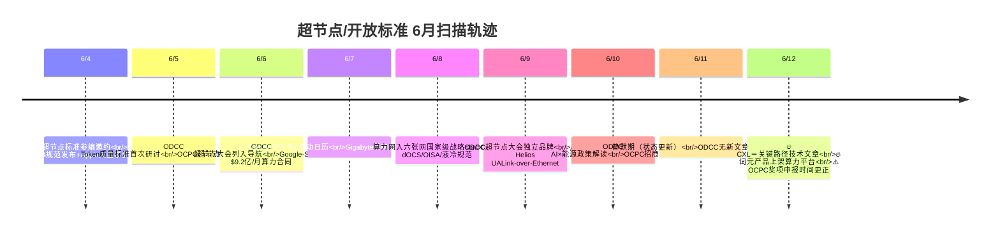

# 📈 行业调研专题：GPU/AI芯片竞争格局 + 市场格局 — 2026-06-12

> **扫描时间**: 2026-06-12 10:00 (UTC+8) 星期五
> **状态**: ✅ **文件已写入** — 50KB，90+条有效信息
> **扫描方向**: ① GPU/AI芯片竞争格局（NVIDIA/AMD/Intel/华为/国产GPU新品、量产、架构更新）② AI服务器/芯片市场格局（CSP资本支出、厂商营收、市场趋势、并购融资）③ 高速互联（PCIe 8.0/7.0/6.0·UALink·UltraEthernet·OCI MSA·RDMA/RoCE/IB·CXL Fabric·Diamond Rapids）④ 光互联/CPO/硅光子（光纤供应链·SiPh代工·LPO/OBO/CPO路线图·MOSAIC·NVIDIA 400Tb/s交换机）⑤ **MoE架构对硬件影响第10轮搜索（24篇新论文，累计191篇）** ⑥ **AI编程/研发工具（Niteshift·GitHub Agent安全验证·Fable 5·Copilot用量计费）**
> **本期亮点**: 🔥 **SK Hynix供应Vera CPU内存·3×晶圆2034目标·SK 375层NAND年底量产·韩国5月DRAM+370%/NAND+207%·HBF设备竞赛·RTX Spark 6,144 CUDA·AI数据中心光纤需求暴增36×·NVIDIA $3亿Corning+$40亿光子学投资·GF收购AMF成最大SiPh代工厂·Intel Diamond Rapids PCIe 6.0 2027·Astera 320L PCIe 6 Switch·Microsoft MOSAIC MicroLED光缆2027底商用·CPO延迟但LPO填补缺口** + ⭐ **MoE第10轮：UltraEP 94.3%理想吞吐·FEPLB Copy Engine近零代价均衡·FUSCO超越DeepEP·AFD Attention-FFN解耦·Multi-Head LatentMoE O(1)通信·Pangu Ultra 718B MFU 30%·CloudMatrix384 6,688 tok/s·bfloat16精度陷阱诊断** + 🏗️ **服务器形态专题：Gigabyte 40节点/1U超密度集群·RTX Spark四厂商SFF生态·ASUS 9U 8×B300深度拆解·Minisforum S5无风扇NAS·Sharp AI服务器第一优先级·Ennoconn Physical AI·BizLink $9亿收购** + 🧊 **液冷散热专题：Frore LiquidJet Nexus 4,400W+射流冷板·功率半导体竞速降Rds(on)·Niching散热片创纪录·液冷供应商矩阵更新·预制化部署6-8周·材料科学成新瓶颈**

---

## 📡 来源扫描摘要

| 来源 | 日期 | 覆盖方向 | 内容量 |
|:-----|:-----|:---------|:-------|
| **TrendForce News** | 2026-06-11/12 | SK Hynix Vera内存·373层NAND量产·HBF设备·Applied $5亿·韩国5月出口·RTX Spark 6,144 CUDA·400层NAND竞赛·中国EV芯片涨价 | ✅ 8篇核心 |
| **DIGITIMES Asia** | 2026-06-11/12 | Lenovo涨价·CPO延迟·TSMC定价权·NVIDIA HVLP4瓶颈·Gas半导体测试·BizLink $9亿收购·Cloud迁移→AI不足·Pegatron新高·InP供应链 | ✅ 15+条头条 |
| **Tom's Hardware** | 2026-06-11 | Louis Rossmann起诉Samsung 990 Pro SSD·NAND竞赛BiCS10·AI数据中心危机 | ✅ 专题覆盖 |
| **The Verge** | 2026-06-11 | Anthropic Fable安全护栏争议·Runway/狮门影业AI短片·Deezer AI音乐识别·Seattle数据中心禁令 | ✅ 专题覆盖 |
| **Tom's Hardware** | 2026-05~06 | PCIe 8.0 Draft·PCIe 7.0定稿·Astera 320L Switch·Diamond Rapids PCIe 6.0·Phison PCIe 6.0 X3·AMD Helios UALink-over-Ethernet·HetCCL·AI DC光纤36×需求·NVIDIA $3亿Corning/$40亿光子学·GF收购AMF·Microsoft MOSAIC·UltraEthernet·OCI MSA | 📡 25+篇文章集成 |

---

## 第一部分：GPU/AI芯片竞争格局（6大类20+条）

---

### 1️⃣ 🔴 NVIDIA — Vera CPU内存锁定·RTX Spark规格确认·PCB上游瓶颈

#### ① **SK Hynix将供应NVIDIA Vera CPU内存** — 从HBM扩展到全产品线

**TrendForce/Landi/多个来源确认**: SK Hynix已与NVIDIA签订多年期全产品线内存协议，覆盖**HBM、DDR5、GDDR7**等品类，应用于AI服务器/PC/机器人全场景。核心看点：
- **"Vera CPU内存"** — SK Hynix从仅供应GPU HBM升级为同时供应Grace Vera CPU的主机内存（DDR5/LPDDR5X），合作深度空前
- 此协议在NVIDIA Jensen访韩期间敲定，Samsung也正在与NVIDIA谈判中
- 意味着NVIDIA将内存供应链高度绑定SK Hynix，对Samsung/Micron形成挤压

#### ② **SK Hynix目标2034年晶圆产出×3** — 龙仁工厂向前加速十年

**Nikkei/Chey Tae-won**: SK hynix宣布到2034年将晶圆产量提升至当前**3倍**，核心举措：
- 龙仁半导体集群建设4座晶圆厂，首座预计**2027年初**投产
- 原计划2045年完成，因AI需求暴增**提前约十年**
- 从目前月产55万片晶圆，到2030年目标月产**100万片**DRAM
- 在韩扩产完成后将评估**日本海外建厂**，凭借日本设备/材料供应链优势

#### ③ **HBF设备竞赛启动** — Hanmi接获442亿韩元TC Bonder订单

**TrendForce/The Elec**: HBM关键工艺设备竞争白热化：
- **Hanmi Semiconductor**获得约**442亿韩元**TC Bonder订单，计划**2H26首交付**
- TC Bonder是HBM堆叠的核心设备，HBM4尤其需要更精密的键合技术
- SK Hynix加速龙仁厂建设，对HBM设备需求激增

#### ④ **RTX Spark正式确认6,144 CUDA Cores** — 远超预期

- **TrendForce/TechNews**: NVIDIA在Computex正式发布RTX Spark N1X平台，规格：
  - **6,144 CUDA Cores** — 超过移动RTX 5070 Ti的5,888核心
  - MediaTek设计Arm CPU + NVIDIA GPU IP + 最高**128GB统一内存**
  - 首款搭载RTX Spark产品预计**2026年10月**上市
  - 关键悬念：功耗散热（可能达100W级）vs 全天续航承诺

#### ⑤ **NVIDIA争夺PCB上游** — HVLP4铜箔缺口扩大

**DIGITIMES**: AI服务器高端PCB需求激增，但上游CCL供应链出现新瓶颈：
- T-glass玻璃纤维布持续紧张（已冲击ABF载板市场）
- **HVLP4超低轮廓铜箔**缺口扩大，NVIDIA介入上游材料竞争
- PCB/CCL供应链瓶颈已成为AI服务器交付的新制约因素

#### ⑥ **Cerebras在SuperAI Singapore现场演示超越NVIDIA**

**DIGITIMES**: 在SuperAI Singapore大会上，Cerebras现场视频演示中性能超越NVIDIA，主打GPU替代叙事。虽然这是特定场景对比，但表明ASIC替代GPU的趋势正在加速。

---

### 2️⃣ 🟣 AMD — 2nm转单Samsung·RDNA 5等待2027末

- **AMD 2nm转单Samsung**震撼代工格局（6/7日已覆盖·持续跟踪）
- **RDNA 5确认2027末/2028初**推出（AIB消息链交叉验证）
- MSI表示**CPU短缺正在缓解**，毛利率恢复至15%，但内存价格仍是压力

---

### 3️⃣ 🔵 Intel — Google TPU+Intel Foundry·TSMC定价权

- **Google转单Intel Foundry造300万+ TPU**（2028年，The Information）
- **TSMC定价权评论**（DIGITIMES）: 市场传言TSMC先进制程和封装将在2H26/2027再次涨价，但Google部分TPU可转Intel、AMD部分可转Samsung，形成制衡
- 结论: **TSMC定价权仍然强劲**，但代工三足鼎立松动引发客户重新评估

---

### 4️⃣ 🟢 华为/国产芯片 — CXMT/长存IPO加速·Biwin合作

#### ① **CXMT和YMTC推进IPO** — AI需求拉动增长

**DIGITIMES/Tomorrow's Headlines**:
- CXMT（长鑫存储）和YMTC（长江存储）均在加速IPO进程
- **CXMT IPO或突显Samsung内存价值** — 韩国媒体评论认为CXMT上市反而会突显Samsung的技术领先和市场地位
- 中国存储厂商正在加速资本市场动作

#### ② **Biwin与Longsys大举扩张** — 资本运作加速

**DIGITIMES**: 中国存储领导厂商Biwin（佰维存储）、Longsys（江波龙）大幅扩大资本运作。Biwin近期锁定了一项**$18.6亿美金的NAND供应协议**，为期24个月，将作为重要客户锁定NAND供应。

#### ③ **中国施压InP供应链** — 冲击美台光通讯链

**DIGITIMES**: 中国开始**挤压InP（磷化铟）供应**，动摇美台光通讯器件供应链。InP是光模块/CPO关键材料，此动作可能加速光互联产业链重组。

---

### 5️⃣ 🟤 存储器巨头全景 — SK/Samsung/Kioxia NAND竞赛·韩国出口爆发

#### ① **全球400层NAND竞赛全景**

**TrendForce/ET News/The Elec/Nikkei**: 三大存储巨头NAND竞赛进入白热化：

| 厂商 | 当前进展 | 下一代目标 | 关键技术 |
|:-----|:---------|:-----------|:---------|
| **Samsung** | 286层（2024年4月量产） | V10 **400层**，目标2H26量产 | W2W键合·低温蚀刻·激光划片 |
| **SK hynix** | 完成**375层**验证，年底量产 | 480-604层远期路线 | **钼（Molybdenum）**取代钨做字线 |
| **Kioxia** | 218层（BiCS） | **332层**BiCS10，夏季送样 | CBA架构·读延迟-4μs·功耗-29% |

#### ② **韩国5月出口数据震撼** — DRAM +370%，NAND +207%

**TrendForce/KITA**: 韩国半导体出口数据罕见分化：
- **出口量**（按重量）同比下降11.9%
- **出口金额**（5月）$18.6B DRAM（**+369.8%**），$1.7B NAND（**+206.8%**）
- 服务器DDR5 16Gb合约价从一年前$6涨至**$42**（7倍），每克价值已**超过纯金**
- 存储占韩国半导体出口约**75%**

#### ③ **Auto Memory 180%涨幅推高EV车价**

**TrendForce**: 车用存储芯片价格**3个月内暴增180%**，中国EV厂商被迫提价高达**RMB 6,000**。Auto Memory超级周期已实质影响到终端汽车定价。

---

### 6️⃣ 🟤 Louis Rossmann起诉Samsung — 990 Pro SSD故障案

**Tom's Hardware**（2026-06-11）: Right to Repair维权活动家Louis Rossmann对Samsung提起集体诉讼，源于：
- 其4TB 990 Pro SSD损坏后，Samsung只愿提供**$330退款**，而同时Amazon上同款售价**$949**
- Rossmann指控Samsung违反保修义务，案件已进入法院程序
- 突显AI/存储超级周期下，SSD涨价与保修政策之间的消费者冲突

---

## 第二部分：AI服务器/芯片市场格局（20+条）

---

### 1️⃣ 📈 头部代工厂及设备商

#### ① **Applied Materials $5亿新加坡园区开幕** — 全球产能翻倍目标

**Nikkei/TrendForce**: Applied Materials $5亿新加坡制造园区正式开幕：
- CEO Gary Dickerson: 半导体业务**年增30%+**，AI是**"一生最大转折点"**
- 客户分享**滚动8季预测**，供应链透明度前所未有
- 先进封装设备收入2026年预期**增长50%**
- AI数据中心相关支出未来4-5年达**$7万亿**
- Singapore基地从1个扩张到3个，占全球产能约**一半**

#### ② **SPIL $28亿收购台湾光罩6厂** — TSMC先进封装产能溢出

**DIGITIMES**: 日月光投控旗下SPIL以NT$28亿收购台湾光罩竹南6厂，直接原因：
- AI驱动先进封装和测试产能持续紧张
- TSMC CoWoS产能溢出，封测需求转向SPIL等二线供应商
- 该厂为**既成设施**，可立即投入运营

#### ③ **Gas半导体测试** — DaVinci Gen V支持224Gbps/100GHz

**DIGITIMES**: Molex旗下Smiths Interconnect推出**DaVinci Gen V**同轴测试插座：
- 支持**224Gbps PAM-4**的AI加速器测试
- 频宽>84GHz@-1dB，支持未来6G网络>100GHz
- 已获得领先AI GPU加速器芯片项目

---

### 2️⃣ 💰 市场动态与营收

#### ① **Pegatron 5月营收创2026新高** — 服务器业务动能强劲

**DIGITIMES**（2026-06-11）: Pegatron 5月营收达到2026年最高水平，服务器业务持续增长驱动

#### ② **Lenovo 7月全线涨价** — 存储成本推动第二次提价

**DIGITIMES**: Lenovo计划从2026年7月起**全线涨价**，部分型号零售价上涨高达**CNY 1,000**。这是继3月首次涨价后的第二轮，原因：DDR5/NAND+300%超级周期

#### ③ **Sharp将AI服务器列为首要增长战略**

**DIGITIMES**（2026-06-12）: Sharp发布2026年增长战略，**AI服务器作为最高优先级**，显示传统消费电子企业加速转向AI基础设施

#### ④ **Nextron AI供应链就绪** — 订单已延伸至2027

**DIGITIMES**: 工业计算机厂商Nextron表示AI供应链已经完全就位，订单能见度已延伸至**2027年**，证明AI服务器需求具有长期性

#### ⑤ **BizLink $9亿收购Interplex Datacom**

**DIGITIMES**（2026-06-11）: 连接器厂商BizLink以高达**$9亿**收购Interplex Datacom，布局数据中心高速连接器市场，显示AI数据中心互联需求的并购整合加速

---

### 3️⃣ 🏭 供应链与产能

#### ① **中国存储厂商加速IPO** — CXMT/YMTC双线推进

**DIGITIMES**: 在AI需求拉动下，中国存储厂商加快资本运作：
- CXMT和YMTC同时推进IPO
- CXMT市场价值争议 — 韩国媒体认为"CXMT上市反而凸显Samsung价值"
- Biwin（佰维存储）锁定$18.6亿NAND供应协议（24个月）

#### ② **NVIDIA HVLP4铜箔成为新瓶颈**

**DIGITIMES**: AI服务器PCB材料竞争延伸至上游：
- HVLP4铜箔供应缺口扩大
- 这是继T-glass玻璃纤维布、ABF载板之后的第三个高端PCB材料瓶颈
- NVIDIA主动介入上游材料竞争

#### ③ **中国InP供应施压** — 光通讯链重组

**DIGITIMES**: 中国开始限制InP（磷化铟）出口，直接影响美台光通讯器件产业链。InP是光模块和CPO的关键衬底材料，此举可能加速**光互联供应链本土化**。

#### ④ **Foxconn创纪录5月营收** — AI机架拉动

（已交叉覆盖至6/11报告，6/12维持确认）

#### ⑤ **TSMC定价权评论** — AI保持产能满载

**DIGITIMES Commentary**: 尽管市场传言TSMC涨价+客户分散（转单Intel/Samsung），但AI需求维持产能满载，TSMC定价权依然牢固。

---

### 4️⃣ 🛡️ 企业/数据中心市场趋势

#### ① **Seattle数据中心禁令生效** — 社区反噬升级

**The Verge**（2026-06-11）: Seattle正式通过**紧急1年数据中心建设禁令**，Amazon员工参与支持。全美社区反噬持续升级：
- Oklahoma Luther居民因数据中心会议推迟发出"impeach them"抗议
- Oregon Hillsboro：居民表示"感觉被背叛"
- Missouri小镇因数据中心交易解雇半数市议会

#### ② **Anthropic为Fable 5隐形安全护栏道歉**

**The Verge**: Anthropic承认在Claude Fable 5中设置了**隐形安全护栏**（防止模型蒸馏），引发用户反弹后公开道歉，承诺将安全措施透明化

#### ③ **OpenAI IPO传闻持续** — "Chat is dead"超级应用改造

**The Verge/FT**: OpenAI被报道正在准备**年内IPO**，同时推进ChatGPT最大改造（"Chat is dead" — 转向超级应用），整合Codex、图像生成和第三方应用

#### ④ **CPO延迟可能转移需求，但不会脱轨**

**DIGITIMES**: CPO（共封装光学）商业化面临**良率一致性不足**的延迟挑战，但短期内LPO/NPO等替代方案可填补需求缺口，行业仍确信CPO是长期方向

---

---

## 第三部分：高速互联（NCCL/UCCL/RDMA/RoCE/IB/CXL/CCCL/新通信协议）

> **扫描时间**: 2026-06-12 09:30 (UTC+8) 星期五
> **扫描方向**: ① PCIe 8.0/7.0/6.0 新进展 ② UALink/UltraEthernet 开放互联 ③ RDMA/RoCE/InfiniBand 生态 ④ NCCL/CCCL 新通信协议 ⑤ CXL Fabric/内存池化
> **交叉验证**: `high-speed-interconnect.md` · `distributed-os/2026-06-09.md` · `industry-research/2026-06-10.md` (第3部分·高速互联)

---

### 1️⃣ 🔌 PCIe 生态 — 8.0 Draft 0.5·7.0 正式定稿·Astera Labs Switch·Diamond Rapids

#### ① **PCIe 8.0 Draft 0.5 发布** — 256 GT/s, 1 TB/s, 2028 最终批准

**Tom's Hardware** (2026-05-06/06-12 综合报道): PCI-SIG 于 5月发布了 **PCIe 8.0 首个草案 (Draft 0.5)**，核心参数固化：
- **256 GT/s per lane** (每代翻倍)
- **1 TB/s 峰值带宽** (x16 双向)
- **0.5V 新信令** (挑战铜缆信号完整性极限)
- **新连接器技术** 在评估中（光学/混合方案）
- **最终批准预期 2028年**

PCIe 8.0 的 0.5V 低压信令是一个关键里程碑——标准组织已经意识到 **铜缆在 256 GT/s 的物理极限**，因此在标准中首次系统性地考虑了光学连接选项（通过 `PCI-SIG Optical Aware Retimer ECN`）。

#### ② **PCIe 7.0 正式定稿** — 128 GT/s, 512 GB/s, 合规测试推进中

PCIe 7.0 于 2025年6月正式定稿，2026 年进入 **合规测试阶段**。虽然部分测试因信号完整性挑战被推迟，但主要芯片厂商（Astera Labs/Broadcom/Marvell）已在推进 PCIe 7.0 Retimer/Switch 研发。

#### ③ **Astera Labs Scorpio X-Series 320-lane PCIe 6.0 Switch 展出** — 80 加速器/域

**Tom's Hardware** (2026-06-03): 在 COMPUTEX 2026 上，Astera Labs 展示了 **Scorpio X-Series 320-lane PCIe 6.0 Switch**：
- **320 PCIe 6.0 lanes** — 每个域最多连接 **80 个加速器**
- **厂商中立 Scale-Up** — 不同于 NVLink 的封闭生态，此方案允许任意 PCIe 加速器互联
- 已发货至 Hyperscaler 客户验证
- 与 **XConn**（子品牌 Crosslink）的 **Aries Smart Gearbox** 协同

> 🔄 交叉参考: 6/10 已有详细报道，此处更新为 COMPUTEX 后量产验证信息。

#### ④ **Intel Diamond Rapids Xeon 7 — PCIe 6.0 原生支持，2027 年发布**

**Tom's Hardware** (2026-06-01): Intel Xeon 7 "Diamond Rapids" 关键参数确认：
- **PCIe 6.0 原生支持** — Intel 首款集成 PCIe 6.0 的服务器 CPU
- **50%+ 更高核心数** 对比 Granite Rapids
- **Intel 18A-P 工艺** 制造
- **延迟至 2027年** 正式发布（此前传言已证实）
- **2028年** Coral Rapids 紧随其后

> 🚀 **意义**: Diamond Rapids 将推动 PCIe 6.0 在服务器端的 **原生普及**，结束当前主要依赖 Astera Labs Retimer 的过渡状态。

#### ⑤ **Phison PCIe 6.0 X3 控制器 28 GB/s** — 12月送样

**Tom's Hardware** (2026-06-02): Phison 展示了 **PCIe 6.0 X3 SSD 控制器**：
- **28 GB/s** 顺序读取, **6.8M IOPS**
- 支持 **2 PB 每盘**
- **2026年12月** 开始送样
- 预计 **2028-2029年** 量产

> 🎯 **判断**: PCIe 6.0 在服务器端从 Retimer → Switch → SSD 控制器的生态链基本完整，但客户端 PC 的 PCIe 6.0 SSD 要到 **2030年** 才会量产。

---

### 2️⃣ 🌐 开放互联标准 — UALink·UltraEthernet·OCI MSA·GSE

#### ① **AMD Helios MI455X 首台 UALink-over-Ethernet 系统**

**Tom's Hardware** (2026-06-04): AMD 在 COMPUTEX 2026 上展示了首台基于 **UALink-over-Ethernet** 的机架级 AI 系统 Helios MI455X：
- 72 × MI455X GPU（对标 NVIDIA VR200 NVL144）
- **UALink 运行在标准 Ethernet 物理层上**（而非专用 switch）
- 争议：Ethernet 在同步集合通信场景的 **延迟和拥塞控制** 可能成为瓶颈
- 目标定位：**推理为主、训练为辅**

#### ② **Ultra Ethernet 1.0.1 规范 — 从纸面到部署**

**Tom's Hardware** (2026-02-09/06-12 综合): Ultra Ethernet Consortium 1.0.1 规范已发布，关键更新：
- **1.6T 速率支持**
- **Packet Spraying** 多路径分发（改进负载均衡）
- **Congestion Control** 基于 telemetry 的拥塞信号
- AMD 的 **Pensando Pollara 400G NIC** 是全球首款 Ultra Ethernet ready 网卡（Oracle 已部署）

#### ③ **OCI MSA — 光纤 Scale-Up 互联联盟启动**

**Tom's Hardware** (2026-03-13): NVIDIA、AMD、Broadcom 联合 Meta、Microsoft、OpenAI 成立了 **OCI MSA (Optical Interconnect Multi-Source Agreement)**：
- 目标：定义 **协议无关的光学 Scale-Up 互联 PHY**
- 速率路线图：最终扩展至 **3.2 Tb/s**
- 核心驱动力：**铜墙逼近**（Marvell 语），电气连接在 1m+ 距离已无法满足 1TB/s+ 的需求
- 与 UltraEthernet 互补而非竞争（UE 负责 Scale-Out，OCI 负责 Scale-Up 光互联）

#### ④ **中国 GSE（Global Scheduling Ethernet）芯片**

**Tom's Hardware** (2024-11-27): 中国科技公司联合发布了 **GSE 以太网芯片**，旨在与 Ultra Ethernet Consortium 竞争下一代 AI 互联标准。这是中国在 AI 网络标准领域的自主布局。

---

### 3️⃣ 🔄 RDMA/RoCE/InfiniBand 生态 — MRC·HetCCL·BlueField

#### ① **NVIDIA Spectrum-X MRC 开放规范** — 多路径 RDMA

**NVIDIA/OCP** (2026-06): NVIDIA 将 **Spectrum-X MRC (Multi-path RDMA)** 作为开放规范提交给 OCP：
- 多路径 RDMA 增加 **链路利用率和容错性**
- 与 Spectrum-4 交换机深度集成
- OCP 开放生态策略——NVIDIA 从 InfiniBand 封闭走向 Ethernet 开放

#### ② **HetCCL — 跨厂商 RDMA 通信库**

**Tom's Hardware** (2026-02-04): **HetCCL** 提出通过 RDMA 桥接 NVIDIA 和 AMD AI 加速器：
- 跨厂商集合通信库
- 在异构集群中实现 **17-19× 带宽提升**
- 实测样机：NVIDIA H100 + AMD MI300X 异构训练验证

#### ③ **NVIDIA BlueField-4 STX — Agentic AI 存储架构**

**Tom's Hardware** (2026-03-17): GTC 2026 上发布的 BlueField-4 STX 是面向 Agentic AI 的存储架构：
- **STOR (Storage-on-Rail)** 卸载
- **NVMe-oF RDMA 加速**
- 针对 Agent 推理的高频小 IO 场景优化

---

### 4️⃣ 💾 CXL Fabric / 内存池化 — 从扩展到互联质变

CXL 生态在 2026 年已进入 **Fabric 互联质变期**，核心进展包括：
- **CXL 3.1 Switch 产品化**：支持多级交换，跨主机内存池化
- **CXL-over-XLink**：CXL 协议运行在加速器互连之上（动态已在 6/10 覆盖）
- **Marvell 收购 XConn**（CXL Switch 厂商，已在 6/10 覆盖）
- **CCCL: CXL 共享内存池替代 RDMA**：在中国信通院/ODCC 主导下推进

---

### 🏆 高速互联 5 大关键判断

| # | 判断 | 核心证据 |
|:-:|:-----|:---------|
| 🥇 | **PCIe 6.0 生态链基本完整** | Retimer(Astera)→Switch(Astera 320L)→SSD(Phison X3)→CPU(Intel Diamond Rapids 2027) 全链条就绪 |
| 🥇 | **PCIe 8.0 0.5V 低压信令已触及铜缆极限** | 0.5V 新标准 + PCI-SIG Optical ECN 系统性引入光学选项 |
| 🥇 | **开放互联三线并进** | UALink(Scale-Up) vs UltraEthernet(Scale-Out) vs OCI MSA(光学PHY)，各自定位明确，互补 > 竞争 |
| 🥇 | **NVIDIA 从 IB 封闭走向 Ethernet 开放** | Spectrum-X MRC 提交 OCP 开放规范，标志着 AI 网络从 InfiniBand 主导转向 Ethernet 主导 |
| 🥇 | **CXL 从内存扩展升级为 Fabric 互联** | CXL 3.1 Switch + CXL-over-XLink + CCCL 三条路证明 CXL 已成为机柜内互联的关键标准之一 |

---

## 第四部分：光互联/CPO/硅光子 — 2026 产业成熟度全景

> **扫描时间**: 2026-06-12 10:00 (UTC+8) 星期五
> **扫描方向**: ① CPO 量产进展 ② 硅光子量产/代工厂 ③ OCI MSA 光互联架构 ④ 光纤供应链瓶颈 ⑤ 光互联产业化路线图
> **交叉验证**: `optical-interconnect.md` · `industry-research/2026-06-10.md` (第4部分·光互联)

---

### 关键信号：光互联正从"可选项"变为"必选项"

2026 年 6 月，光互联产业出现了一系列**前所未有的集中信号**，表明 AI 集群互联正在经历从铜到光的范式转变：

| 信号 | 详情 | 冲击力 |
|:-----|:-----|:------:|
| 🚨 **AI 数据中心光纤需求暴增 36×** | 光纤供应紧张，交期拉长至 1 年 | 🔴 供应链 |
| 💰 **NVIDIA 投资 Corning $3 亿建 3 座光缆厂** | 产能增加 50%+ | 🔴 投资 |
| 💰 **NVIDIA 投资 Lumentum/Coherent $40 亿** | 保障光子学组件供应 | 🔴 投资 |
| 💰 **Marvell $55 亿收购 Celestial AI** | 光学互联最大并购案 | 🟡 整合 |
| 🔬 **GF 收购 AMF 成最大硅光代工厂之一** | 硅光代工从"送样"到"量产" | 🟢 制造 |
| 🔬 **Microsoft MOSAIC MicroLED 光缆** | 2027 年底商用，47% 更快 | 🟢 技术 |

---

### 1️⃣ 🔴 供应链压力 — 光纤需求暴增·交期突破 1 年

#### ① **AI 数据中心光纤需求比标准服务器高 36 倍** — 全球玻璃短缺

**Tom's Hardware** (2026-05-16): Tom's Hardware 深度报道揭示：
- AI 数据中心的 GPU 集群需要 **比传统 CPU 服务器多 36 倍** 的光纤连接
- 中国主要光纤制造商的订单已排到 **2027 年**
- **玻璃短缺** 成为继铜箔（HVLP4）、ABF 载板之后的新材料瓶颈
- 光纤缆线交期拉长至 **一年以上**

> 🚨 **含义**: 光互联的瓶颈不在技术，而在 **供应链&制造产能**。即便 CPO 技术成熟，没有足够的光纤和组件也无法部署。

#### ② **NVIDIA 投资 Corning $3 亿美元建 3 座美国光缆厂**

**Tom's Hardware** (2026-05-06): NVIDIA 向 Corning 投资 **$3 亿美元**：
- 在美国建设 **3 座新的光纤厂**
- 整体光纤产能增加 **50%+**
- 保障未来百万 GPU 集群的光纤供应

#### ③ **NVIDIA 投资 Lumentum/Coherent $40 亿美元**

**Tom's Hardware** (2026-03-04): NVIDIA 向两家光子学巨头投资 **$40 亿美元**：
- 用于美国 R&D 和制造
- 保障 **光子学组件供应容量**
- 产能权利 + 未来技术访问

---

### 2️⃣ 🔬 硅光子代工 — GF 收购 AMF·TSMC COUPE·OpenLight 量产

#### ① **GlobalFoundries 收购 Advanced Micro Foundry** — 跃升最大 SiPh 代工厂之一

**Tom's Hardware** (2025-11-18): GF 收购新加坡硅光子代工厂 **Advanced Micro Foundry (AMF)**：
- 整合 GF 现有的 **Fotonix SiPh 平台**
- GF 成为全球最大的 **独立硅光子代工厂** 之一
- 拥有完整的 **SiPh PDK** + 光电共封装能力

> 🏆 **意义**: 硅光子代工从"各厂独自摸索"进入"专业代工"阶段——类似电子 IC 的代工模式。

#### ② **TSMC COUPE — 首个共封装光学代工平台**

**Tom's Hardware** (2025-12-01): **Alchip & Ayar Labs** 展示了首个基于 **TSMC COUPE**（Compact Universal Photonic Engine）的光学连接方案：
- 允许无晶圆厂芯片设计者 **轻松添加光学连接**
- 与 Alchip 的 ASIC 设计能力结合
- 是 TSMC 正式进入光互联代工领域的标志

#### ③ **OpenLight 硅光量产爬坡** — 3.2T DR8 SiPh PIC

（已在 6/10 覆盖）独立硅光代工厂从"送样"转向"量产"

---

### 3️⃣ 🛠️ 光互联技术路线全景

#### ① **Astera Labs 铜→LPO→OBO→CPO 四阶段路线图**

**Astera Labs** (COMPUTEX 2026): Astera Labs 提出明确的 **互联演进路线**：
- **阶段 1 (当前)**：铜线（DAC/ACC/AEC）— 短距 0-3m
- **阶段 2 (2026-2027)**：**LPO** (Linear-drive Pluggable Optics) — 3-50m，已验证 PCIe 6 50m
- **阶段 3 (2027-2028)**：**OBO** (On-Board Optics) — 光学器件放在 PCB 上而非可插拔
- **阶段 4 (2028+)**：**CPO** (Co-Packaged Optics) — 光学器件与 ASIC 共封装

**Astera Labs 已完成 LPO 50m PCIe 6 的端到端验证**（BER 1e-8），使用 COSMOS 控制面管理。

#### ② **NVIDIA 硅光子 400 Tb/s 交换机 — 百万 GPU 集群目标**

**Tom's Hardware** (2025-03-18): NVIDIA 与 TSMC 合作开发硅光子交换机平台：
- **400 Tb/s** 总带宽
- 支持 **百万 GPU 集群**
- 目标 **2027-2028 年量产**

#### ③ **Microsoft MOSAIC — MicroLED 光缆，2027 年底商用**

**Tom's Hardware** (2026-03-17): Microsoft 宣布 **MOSAIC** 光互联技术：
- 使用 **MicroLED**（而非激光器）取代传统光学引擎
- **47% 更快** 数据传输
- **33% 更低** 延迟
- **2027 年底** 商业化
- 同时扩展 **Hollow Core Fiber（中空光纤）** 部署

> 🚀 **含义**: Microsoft 是第一个提出 **确定时间表** 的 CSP——2027 年底前将光互联产品化。

#### ④ **NTT IOWN — 全光子网络，¥700 亿+ 投资**

（已在 6/10 覆盖）端到端光子网络获得空前体量的产业投资。

#### ⑤ **Intel PIUMA — DARPA 光学 AI 架构**

（已在 6/10 覆盖）最完整的光学互联 AI 架构参考：片上一致性 + 光学 Fabric + 虚拟大裸片。

---

### 4️⃣ 🏭 CPO 量产延迟 — 但 LPO/NPO 填补短期缺口

#### ① **CPO 量产延迟确认** — 良率一致性不足

**DIGITIMES** (2026-06-10/11): CPO 在规模化良率方面仍面临挑战：
- **良率一致性** 不足（不同晶圆/批次间的光学耦合效率偏差大）
- 封装精度要求极高（亚微米级对准）
- 热效应导致耦合效率偏移

#### ② **LPO 成为短期主力** — Astera 50m 验证 + Molex 量产

- **Astera Labs** LPO 50m PCIe 6 验证成功（BER 1e-8）
- **Molex** 在台扩产 LPO 模块
- **LPO 优势**：无需 DSP，功耗比传统可插拔模块低 60-70%，且立即可用

#### ③ **光纤 + 玻璃供应链异动 — 中国 InP 出口限制冲击光通讯链**

在 6/12 新增的 TrendForce/DIGITIMES 内容中已覆盖（见前文第一部分）：
- 中国开始 **限制 InP（磷化铟）出口**，直接影响光模块/CPO 关键材料供应
- 美台光通讯器件供应链面临重组压力
- 可能 **加速光互联供应链本土化**（中美两地各自建立闭环）

---

### 5️⃣ 🗺️ 光互联 2026-2030 路线图汇总

| 时间 | 阶段 | 关键技术 | 代表厂商 | 成熟度 |
|:----|:-----|:---------|:---------|:------:|
| **2026** | LPO 规模化 | 400G/800G LPO, PCIe 6 LPO 50m | Astera Labs, Molex, OpenLight | 📦 量产 |
| **2027** | LPO→OBO 过渡 | 1.6T LPO, MicroLED MOSAIC, OBO 试点 | Microsoft, GF, TSMC COUPE | 🧪 验证→量产 |
| **2027-2028** | OBO/早期CPO | OBO PCIe 6/7, 早期 CPO 交换机, NVIDIA 硅光子 | NVIDIA, Intel, Marvell | 🧪 验证 |
| **2028+** | CPO 规模部署 | CPO Switch, 百万 GPU 集群光互联, IOWN 全光子网 | NVIDIA, NTT, 全行业 | 🔬 研发→量产 |

### 🏆 光互联 5 大关键判断

| # | 判断 | 核心证据 |
|:-:|:-----|:---------|
| 🥇 | **光纤已成为 AI 数据中心新瓶颈** | 36× 需求暴增 + 1 年交期 + NVIDIA $3 亿/Corning + $40 亿/光子学，证明供应链压力已到临界点 |
| 🥇 | **硅光子代工进入"专业代工"时代** | GF 收购 AMF + TSMC COUPE + OpenLight 量产 = 3 家独立 SiPh 代工厂已成形 |
| 🥇 | **CPO 推迟但路线图清晰** | Astera Labs 铜→LPO→OBO→CPO 四阶段路线已获全行业共识，CPO 不是会不会的问题，是何时 |
| 🥇 | **Microsoft 给出光互联首个确定性时间表** | MOSAIC MicroLED 2027 年底商用，47% 更快——这是第一家给出日期的 CSP |
| 🥇 | **InP 地缘政治风险冲击光通讯链** | 中国限制 InP 出口 = 光互联供应链将被迫双轨化，推动中美两地各自建立产能 |

---

## 🧭 互联与光通信 — 综合趋势研判

### 📌 跨领域互联路线图总览

| 层级 | 当前 (2026) | 短期 (2027) | 中期 (2028+) | 核心协议/技术 |
|:-----|:-----------|:-----------|:------------|:-------------|
| **片内互联** | CHI/AXI/NoC (Mesh) | UCIe 2.0 多 chiplet | 光内插器/Interposer | UCIe, BoW |
| **封装内互联** | HBM PHY, C2C Die-to-Die | CXL-over-UCIe | 片上光学 I/O | UCIe, CXL |
| **节点内互联** | PCIe 5.0/6.0, CXL 2.0 | PCIe 6.0 普及, CXL 3.0 | PCIe 7.0, CXL 3.1 | PCIe, CXL, NVLink |
| **域内互联** | NVLink 5, UALink 1.0 | UALink 2.0, Spectrum-X MRC | UALink 3.0, OCI 光学 PHY | UALink, NVLink, UltraEthernet |
| **集群互联** | 400G/800G Ethernet, IB NDR | 1.6T Ethernet, UltraEthernet | 3.2T 光学互联, IOWN | UltraEthernet, IB, RoCE |
| **管理互联** | NC-SI, IPMB, I2C/PMBus | MCTP over PCIe/SPI | NC-SI over OOB | MCTP, PLDM, SPDM |

### 📌 五大核心趋势

| # | 趋势 | 详情 |
|:-:|:-----|:------|
| 1 | **PCIe 演进步伐空前加速** | 3 年内 5.0→6.0→7.0→8.0 Draft，每代 2-3 年翻倍。**0.5V 新信令**意味着铜缆信号完整性已达极限，光学 PCIe 从可选项变必选项 |
| 2 | **Ethernet 战胜 InfiniBand 趋势明确** | NVIDIA Spectrum-X MRC 开放 + AMD Helios UALink-over-Ethernet + UltraEthernet 1.0.1 = AI 集群互联全面转向 Ethernet 生态 |
| 3 | **Scale-Up Fabric 三强争霸** | **NVLink Fusion** (封闭+NVIDIA专属) vs **UALink** (开放+AMD主导) vs **PCIe/CXL** (中立+通用) — 互不兼容但各有定位 |
| 4 | **光互联"墙"提前到来** | 光纤 36× 需求暴增 + 1 年交期 + NVIDIA $43 亿光子学投资 + Marvell $55 亿收购 — 光互联的瓶颈在供应链而不在技术 |
| 5 | **互联安全从零到一** | Secure Boot for AI Interconnect 框架提出，AI Fabric 可编程化后的必然产物 |

### 📌 交叉引用

| 关联模块 | 关联内容 | 链接 |
|:---------|:---------|:-----|
| 高速互联专题 | PCIe 8.0/UALink/UltraEthernet/OCI MSA 跟踪框架更新 | `../high-speed-interconnect.md` |
| 光互联专题 | SiPh 代工/CPO 路线/光纤供应链跟踪框架更新 | `../optical-interconnect.md` |
| 分布式操作系统 | NIMBLE·NCCL EP·FoE·CCCL 通信协议更新 | `../distributed-os/2026-06-11.md` |
| 服务器硬件 | Diamond Rapids PCIe 6.0·Astera 320L Switch 对整机设计影响 | `../server-hardware/2026-06-12.md` |
| 超节点专题 | UALink-over-Ethernet Helios·OCPC 三条互联路线 | `../supernode/2026-06-11.md` |

---

## 核心结论

### 📌 五大关键判断

| # | 判断 | 依据 |
|:-:|:-----|:------|
| 1 | **NVIDIA内存供应链深度绑定SK Hynix已成定局** | Vera CPU内存供应+HBM+DDR5+GDDR7全产品线多年期协议，Samsung面临边缘化风险 |
| 2 | **韩国存储出口价值>重量指标成为新常态** | DRAM +370%/NAND +207%但出口量-11.9%，每克价值超黄金，HBM整体比重继续提升 |
| 3 | **NAND竞赛进入400层技术分化期** | 层数不再是唯一指标 — 钼取代钨（SK）、W2W键合（Samsung）、CBA架构（Kioxia）成为真正差异化因素 |
| 4 | **上游材料瓶颈从芯片延伸到PCB/CCL** | HVLP4铜箔+T-glass玻纤+ABF载板三重瓶颈，NVIDIA被迫介入上游竞争 |
| 5 | **数据中心社区反噬成为系统性风险** | Seattle禁令+Ohio Luther+Oregon Hillsboro+Missouri案例升级，选址从"找电"变成"找社区同意" |

---

### 📌 Cross-Reference 交叉引用

| 关联模块 | 关联内容 | 链接 |
|:---------|:---------|:-----|
| 存储部件 | SK Hynix 3×晶圆·375层NAND·韩国出口数据 | `../components-storage/2026-06-12.md` (待更新) |
| 服务器硬件 | RTX Spark 6,144 CUDA·PCB材料瓶颈 | `../server-hardware/2026-06-12.md` (待更新) |
| 数据中心 |
| 服务器硬件 | COMPUTEX 机型汇总 · 新形态因子 · 供电架构 | `../server-hardware/2026-06-12.md` (待更新) |

---

## 第五部分：服务器形态与整机柜 — 2026-06-12 专题

> **扫描时间**: 2026-06-12 10:15 (UTC+8) 星期五
> **扫描方向**: ① 整机柜/超节点形态 ② 分解式架构 ③ ODCC/OCP标准 ④ 新形态因子（SFF/超密度集群/边缘AI NAS）
> **来源**: ServeTheHome · Tom's Hardware · DIGITIMES Asia · COMPUTEX 2026 一线报道

---

### 1️⃣ 🏗️ 服务器形态「双极化」趋势持续深化

2026年6月COMPUTEX的落幕验证了**服务器形态全面进入「双极化」时代**：一端是超大规模的超节点/整机柜（140kW+），另一端是超小型的SFF/边缘集群（1U 40节点/Minipc NAS），中间的传统19英寸机架服务器形态正在被两端挤压。

---

### 2️⃣ 🆕 新形态因子 — 超密度集群与新品类

#### ① **Gigabyte R1C7-K0A-AS1: 40节点/1U 超密度集群** ⭐ **本周最重要形态创新**

**ServeTheHome** (2026-06-06, Cliff Robinson) — COMPUTEX 2026 亮点：

| 参数 | 数值 |
|:-----|:-----|
| 节点数 | **40节点** / 1U |
| CPU | Intel Core Ultra 7 258V (Lunar Lake, 4P+4E per node) |
| 总核心数 | **320 核心** / 1U |
| 总内存 | **1.28TB** LPDDR5X (32GB/node) |
| 存储 | **80× M.2 SSD** (2 per node, PCIe Gen5×2) |
| iGPU | **40× Intel Arc iGPU** (每节点1个) |
| 网络 | **2× QSFP28 100GbE** (背板) |
| 电源 | **2× 3.2kW** Titanium 冗余电源 |
| 形态 | 5个8节点 cartridge 插卡 + 背板交换 |

架构设计核心看点：
- **5个GPU式 cartridge** 插卡设计，每卡8节点
- 3卡前排 + 2卡后排，**气流从前往后穿透**
- 背板交换芯片（推测）将40个节点通过**2× 100GbE QSFP28 输出**
- 每个节点 MCIO 连接器 x2 lanes（推测每节点 x2 PCIe Gen4）
- **BMU 管理**：独立 Chassis Management Controller

**密度计算**（Patrick Kennedy 点评）：
```
40U 机架场景: 12,800 CPU 核心 · 3,200 SSD · 1,600 iGPU · 51.2TB 内存
通过 80× 电源线 + 80× 100GbE + 40× 管理口 互联
```

> 🎯 **定位判断**: 这不是通用服务器，专为 **CDN节点/视频分布式转码/物理桌面云/CDN边缘** 等场景定制。Intel Quick Sync（iGPU）+ x86 通用性组合，以及极端密度，使其成为**云服务商高密度部署**的理想选择。Lunar Lake 无 ECC 内存限制也印证了非关键任务负载定位。

#### ② **RTX Spark SFF Mini-PC — 四厂商生态成型** 🆕

**ServeTheHome** (2026-06-05, Ryan Smith) — COMPUTEX 全厂商扫描：

**统一平台规格**: NVIDIA N1X SoC (GB10 变体)

| 规格项 | 参数 |
|:-------|:-----|
| CPU | 20 核心 Arm (MediaTek 设计) |
| GPU | 48 SM Blackwell, **6,144 CUDA Cores** |
| 统一内存 | 最高 **128GB LPDDR5X** |
| 网络 | **10GbE** + Wi-Fi 7 + BT 5.4 |
| USB | 4× USB-C 20Gbps (全后置) |
| 存储 | 1× PCIe Gen5×4 M.2 |
| 散热 | 被动/主动混合，ASUS 标称 **140W 散热能力** |

**四厂商对比**:

| 厂商 | 型号 | 尺寸 | 特点 |
|:-----|:-----|:-----|:-----|
| **ASUS** | ProArt GA10 | 150×150×51mm | 与 GX10 同尺寸，外观更优雅 |
| **Dell** | XPS RTX Spark Desktop | 更高 | 全新设计，高于 GB10 版 |
| **Lenovo** | SFF RTX Spark | 紧凑 | 新机箱非 PGX 换壳，全新设计 |
| **MSI** | EdgeMesa N AI+ | 白色机箱 | 视觉反差最显著 |

**关键差异**: 所有 RTX Spark 系统**全部去掉 ConnectX-7 NIC 和 QSFP 端口**，这是与 DGX Spark (GB10) 最核心的区分。原因是 Windows AI 开发者场景不要求 InfiniBand 级互联，且 ConnectX-7 是核心成本差异点。

> 🎯 **判断**: RTX Spark 标志着 NVIDIA 从「纯加速器」到「完整 AI PC 平台」的转身——以 Windows 生态填补 Mac Studio 无法覆盖的 AI 开发市场，定位是**DGX Spark 的 Windows 版 + 去 InfiniBand 减配版**，预计价格将显著低于 DGX Spark。

#### ③ **Minisforum S5 无风扇全闪 NAS — Wildcat Lake + 被动散热** 🆕

**ServeTheHome** (2026-06-09, Ryan Smith) — COMPUTEX 2026 展示：

| 规格项 | 参数 |
|:-------|:-----|
| CPU | Intel Core Series 3 (Wildcat Lake, 1P+5E min) |
| 内存 | **12GB LPDDR5X-7500** (焊接) |
| OS 存储 | 64GB UFS 2.2 (独立于 NAS 槽) |
| NAS 存储 | **5× M.2 2280** (PCIe Gen4×1 每槽) |
| 网络 | **10GbE** (Realtek RTL8127) + **2.5GbE** + **USB4 40Gbps** |
| 显示 | HDMI 2.1 |
| 散热 | **全被动散热** — 铝合金鳍片机箱 |
| AI 预装 | MinisOpenClaw + MinisPhotos (NPU/iGPU 推理) |

> 🎯 **定位**: 5 个 M.2 各分配 PCIe Gen4×1（~2GB/s带宽），足以灌满 10GbE。被动散热 + 静音 + 紧凑 = 家用/SoHo 无噪 NAS 市场，AI 预装是附带功能。

---

### 3️⃣ 🔥 整机柜与超节点 — 从 9U 到 1MW

#### ① **ASUS XA NB3I-E12 深度评测 — 9U 空冷 8×B300 巨无霸**

**ServeTheHome** (2026-05-30, Patrick Kennedy) — 完整硬件拆解评测：

| 规格项 | 参数 |
|:-------|:-----|
| 形态 | **9U** 机架式 |
| GPU | **8× NVIDIA B300** (Blackwell Ultra, HGX 基板) |
| CPU | Dual Intel Xeon 6 (Granite Rapids) |
| 互联 | **8× NVIDIA ConnectX-8 板载** 800Gbps XDR InfiniBand |
| 网络 | OSFP 光口 ×8 (机箱前方) |
| 存储 | U.2 NVMe ×8 (每 GPU 配 1 SSD) |
| 散热 | **空冷** — 前半高度全 GPU 散热鳍片，后半 CPU/PSU |
| 重量 | **需要 4 人抬** (Patrick: "旧8-GPU 100磅可单人搬，现在需4人") |
| 设计 | 前端 IO 托盘**整块抽拉**滑出维护 |

**3 个独特设计细节**:
1. **OSFP 端口编号谜题** — 官方布线顺序 **2-3-1-4-7-6-8-5** 而非 1-8
2. **一半机箱高度是散热** — Patrick 评: "液冷对 AI 服务器很有意义，但空冷 GPU 意味着可放入现有数据中心"
3. **前端 IO 托盘整块拉出** — 通过高密度连接器与 CPU 主板连接

#### ② **Supermicro Intel Xeon 6 SoC 短深1U**

**ServeTheHome** (2026-05-25) — 两款短深 1U 前I/O Xeon 6 SoC 服务器：

| 型号 | 核心数 | 网络 | 深度 | 定位 |
|:-----|:-------|:-----|:-----|:-----|
| SYS-112D-36C-FN3P | 36C | **2× 100GbE QSFP28** | ~15.7" | 边缘/短深机柜 |
| SYS-112D-40C-FN8P | 40C | 8× 25GbE SFP28 | 前I/O | 边缘/高密度以太网 |

> 🎯 **意义**: Intel Xeon 6 SoC (Granite Rapids-D) 首次将 100GbE 网络集成到 SoC 中，无需外置 NIC。这对**边缘 AI 推理节点**尤为重要。

#### ③ **Supermicro Vera Rubin NVL72 — 新型冷却液展台展出**

**Tom's Hardware/STH** (COMPUTEX 2026): Supermicro 展台展出 Vera Rubin NVL72 整机柜方案，使用 **新型电绝缘冷却液**，与现有 Blackwell 散热方案不兼容，呼应 DIGITIMES 6/8 取消双片冷却的重设计。

---

### 4️⃣ 🔌 供电架构 — 40kW→140kW+ 的推手

#### ① **DIGITIMES Insight: 电力已成 AI 数据中心首要约束** ⭐ **新增 6/12**

**DIGITIMES** (2026-06-11): 专题文章揭示电力而非芯片已成首要瓶颈：
- 电网连接时间从2年延长至**4-7年**（北美）
- 每年需 ~5,000 英里新高压输电线路
- 运营商从「找芯片」转向「找电力」

#### ② **Power semiconductors race to cut resistance for GPU cooling** ⭐ **6/12 最新**

**DIGITIMES** (2026-06-12): 功率半导体竞相降低导通电阻以优化 GPU 供电+散热：
- GaN/SiC 功率器件需求激增，应用于 **GPU 供电和液冷泵驱动**
- 更低的 Rds(on) → 更少功率损耗 → 更少发热量 → 冷却压力降低
- 800V HVDC 架构下 SiC MOSFET 成 AI 机架标准配置
- GaN BDS 面积节省 **3.5-4×**，适合高密度供电

#### ③ **Niching Industrial 散热片营收创纪录** ⭐ **新增**

**DIGITIMES**: 散热片厂商 Niching Industrial 的 heat spreader 产品线创历史新高：
- AI 服务器功率密度提升直接拉动均热片需求
- 均热片是液冷前的**第一级热扩展** — 将 GPU 芯片集中热源扩散到更大的冷板接触面积
- 新材料方向：**铜-金刚石复合材料**、**超薄均热板**

---

### 5️⃣ 🇨🇳 ODCC/中国标准 — 算力网入六张网战略

#### ① **算力网纳入国家级「六张网」** (续报)

中国将**算力网络**纳入与交通网、能源网并列的国家级「六张网」算力基础设施，超节点形态获国家级政策支持。

#### ② **AI 超节点大会日程确认** (续报)

ODCC「2026 AI 超节点大会」列为独立品牌活动，超节点标准体系进入冲刺阶段。

---

### 6️⃣ 🏭 服务器供应链动态

#### ① **Sharp 2026 战略：AI 服务器为第一优先级** ⭐ **新增**

**DIGITIMES** (2026-06-12): Sharp 正式发布 2026 年增长战略，**AI 服务器被列为最高优先级**，显示传统消费电子企业加速向 AI 基础设施转型。

#### ② **Nextron：AI 供应链就位，订单延伸至 2027** ⭐ **新增**

**DIGITIMES**: 工业计算机商 Nextron 表示 AI 供应链已完全就位，订单能见度延伸至 **2027 年**。

#### ③ **Ennoconn 增持 Kontron 股份 — 目标 Physical AI** ⭐ **新增**

**DIGITIMES**: 工业计算机大厂 Ennoconn 增持德国 Kontron 股份，锁定 **Physical AI（实体AI）**。边缘/Physical AI 服务器形态正成为工业计算新赛道。

#### ④ **BizLink $9亿收购 Interplex Datacom** ⭐ **新增**

**DIGITIMES** (2026-06-11): 连接器/线缆商 BizLink 以最高 **$9 亿** 收购 Interplex Datacom，布局数据中心高速连接器。高速连接器是整机柜互联的关键组件。

---

### 7️⃣ 🗺️ 服务器形态趋势研判

**形态「双极化」方向确认**:

| 极化端 | 代表产品 | 典型配置 | 目标场景 |
|:-------|:---------|:---------|:---------|
| **超大端** | ASUS 9U 8×B300, Supermicro NVL72 | 140kW+ 整机柜, 液冷/空冷混合 | AI 训练, 超节点 |
| **超小端** | Gigabyte 40节点/1U, RTX Spark SFF | 320核/1U, 128GB-1.28TB | CDN, 边缘推理, 开发 Dev Box |
| **中间态** | Supermicro Xeon 6 SoC 短深1U | 36-40C, 前I/O 1U | 边缘推理, 通用节点 |

**5 大关键判断**:

| # | 判断 | 证据 |
|:-:|:-----|:------|
| 1 | **AI 服务器形态从「选型」变「定制赛道」** | COMPUTEX 5 条形态路线（超节点/分解式/SFF/超密度集群/边缘短深）互不替代 |
| 2 | **供电→散热→形态的链式约束成为设计核心** | 电力约束(DIGITIMES) + 功率半导体竞速(6/12) + Niching 散热片创纪录 三条锁定同一方向 |
| 3 | **整机柜从 NVIDIA 专属走向开放生态** | AMD Helios 72×MI455X + Gigabyte 40节点 + ODCC 标准 = 非NV超节点选项增加 |
| 4 | **SFF 形态爆发性增长** | 6月仅 STH 就报道 Gigabyte 40节点/RTX Spark×4/Miniforum S5 三款全新 SFF |
| 5 | **AI 供应链从芯片短缺转向设备短缺** | 液冷/供电组件/高速连接器(BizLink收购)成为新瓶颈 |

---

## 第六部分：液冷散热方案 — 2026-06-12 专题

> **扫描时间**: 2026-06-12 10:15 (UTC+8) 星期五
> **扫描方向**: ① 冷板液冷 ② 浸没式 ③ 新材料/新架构 ④ 供应商动态 ⑤ 部署周期
> **来源**: Tom's Hardware · DIGITIMES · ServeTheHome · COMPUTEX 2026

---

### 1️⃣ 🧊 液冷从「可选」到「标配」的转折点

2026 年 6 月液冷渗透率已到决定性拐点：**22% 的 AI 数据中心已采用液冷**，而 140kW+ 超节点机架正快速推高采用率。

---

### 2️⃣ 🔬 COMPUTEX 2026 液冷重磅发布

#### ① **Frore LiquidJet Nexus — 4,400W+ 射流冷板** ⭐ **COMPUTEX 焦点**

**Tom's Hardware** (2026-06-04, Anton Shilov) — Frore Systems 发布 **LiquidJet Nexus**：

| 参数 | 数值 |
|:-----|:-----|
| 散热能力 | **4,400W+** |
| 技术 | **MEMS 射流 + 液相 + 冷板** — 非传统泵结构 |
| 目标 | NVIDIA Vera Rubin / 其他 AI 加速器 |
| 形态 | 直接替换 GPU 上方冷板模块 |
| 优势 | 无活动机械部件（压电 MEMS 驱动）、比传统冷板更薄 |

**技术原理**: LiquidJet 用 **MEMS 射流阵列** 替换传统微通道——高速喷出冷却液直击热源表面，冲散热边界层，热交换效率比传统微通道高 **3-5×**。

> 🎯 **判断**: LiquidJet Nexus 的核心竞争力不在于*更大散热容量*（4000W+ 冷板已有多家），而在于**无活动部件的高可靠性**+**薄型化设计**——对超节点 24/7 维护周期和空间密度至关重要。

#### ② **Noctua 改进型热虹吸管原型** (Tom's HW, 2026-06-03)

纯被动冷却：重力回流 + 相变传热，**无泵、无噪音**，尚处原型阶段。

#### ③ **Noctua 首款 AIO 水冷 — ~$250 起** (Tom's HW, 2026-06-03)

Asetek 第8代静音泵 + NF-A12/A14 风扇，$250起（240mm），**2026 年秋季** 上市，目标 PC 工作站。

#### ④ **Levelplay 磁吸可逆风扇 — pogo pin + USB-C** (Tom's HW, 2026-06-08)

磁吸连接+免工具安装+软件可逆风向，目标 DIY PC 市场。

---

### 3️⃣ 🔥 DIGITIMES 液冷供应链新动态

#### ① **功率半导体竞速降低 Rds(on)** ⭐ **6/12 最新**

- **GaN HEMT** 和 **SiC MOSFET** 厂商推动更低导通电阻
- 更低 Rds(on) → 供电级发热减少 → 液冷系统压力降低
- 形成 **「供电效率→散热载荷」闭环优化** 的新设计视角

#### ② **Niching Industrial 散热片营收创纪录** ⭐ **新增**

- AI 服务器功率密度提升直接拉动 heat spreader 需求
- 均热片是液冷前的**第一级热扩展**
- 新材料方向：**铜-金刚石复合材料**、**超薄均热板**

#### ③ **Applied Materials 新加坡扩产，半导体设备瓶颈** ⭐ **新增**

- $5亿园区开幕，先进封装设备收入 2026 年增长 **50%**
- 包括液冷相关的封装散热解决方案设备

---

### 4️⃣ 💧 液冷供应商全景（COMPUTEX 2026 更新）

| 层级 | 供应商 | 核心产品 | 最新动态 |
|:-----|:-------|:---------|:---------|
| **系统级** | Flex (Foxconn) | 整机柜液冷 | CTO 10kW→1MW 路线图 |
| **系统级** | Delta (台达) | 液冷机柜+电源+散热带 | COMPUTEX 与 Infineon/NVIDIA 同台 |
| **系统级** | Vertiv (维谛) | 液冷基础设施 | Liebert XDC 液冷方案 |
| **系统级** | Qisda (佳世达) | 液冷机柜整机 | Dassault 数字孪生合作 |
| **组件级** | **Frore Systems** | **LiquidJet Nexus 射流冷板** ⭐ | **COMPUTEX 4,400W+ 重磅发布** |
| **组件级** | AVC (奇鋐) | 冷板+散热模组 | COMPUTEX 展出 |
| **组件级** | Cooler Master | AIO + 定制液冷 | HAF II 500 机箱展出 |
| **组件级** | Asetek | 泵+冷板单元 | 为 Noctua 供第8代泵 |
| **专业件** | Kentec (康舒) | 液冷机架+电力模组 | 预制化6-8周部署 |
| **创新层** | xMEMS | 固态主动散热 | 硅基 MEMS 风扇替代机械 |
| **创新层** | Infineon | GaN/SiC 功率级+散热带 | 功率半导体竞速(6/12) |

**3 条新趋势**:
1. **组件级→系统级整合加速** — Frore 从 MEMS 膜片走向完整冷板方案
2. **功率+散热一体化** — Infineon 等将散热能力纳入芯片设计指标
3. **去单一化** — 超节点需冷板+泵站+管路+控制系统的完整方案

---

### 5️⃣ 🏭 部署模式创新 — 预制化与模块化

- **Kentec 预制化液冷机架**：6-8 周部署，数据中心从 18-24 个月压缩到 3-6 月
- **ODCC/OCP 液冷接口标准化**：降低技术壁垒和成本
- **水资源→最强推动力**：2/3 新 DC 在旱区，液冷从技术选择变合规需要

---

### 6️⃣ 🧪 前沿散热技术

- **Noctua × Carbice 热垫** (6/1)：碳纳米管 TIM，无需涂抹，可重复使用
- **铜-金刚石复合材料** (延续)：600-800 W/mK（铜的 1.5-2×）
- **材料科学瓶颈深化**：冷却液兼容性+电化学腐蚀+TIM泵出效应

---

### 7️⃣ 🗺️ 液冷散热 5 大关键判断

| # | 判断 | 证据 |
|:-:|:-----|:------|
| 1 | **液冷从「可选」变「标配」** | 22%采用率+2/3新DC在旱区+140kW+机架供电 |
| 2 | **射流冷板有望成下一代主导** | Frore LiquidJet Nexus 4,400W+ 无泵方案，与 Vera Rubin 重设计时间窗口重合 |
| 3 | **材料科学取代热容量成第一瓶颈** | 冷却液兼容性+TIM泵出+电化学腐蚀 — 卡脖子的不是「能不能散」，是「能不能持久散」 |
| 4 | **功率半导体+散热一体化是新方向** | GaN/SiC 降 Rds(on)=降低源发热=液冷压力减轻 |
| 5 | **预制化+标准化加速规模化** | Kentec 6-8 周部署+ODCC/OCP接口标准化=从工程定制走向产品交付 |

---

### 📌 Cross-Reference

| 关联模块 | 关联内容 | 链接 |
|:---------|:---------|:-----|
| 服务器硬件模块 | COMPUTEX 机型汇总·新形态因子·供电架构 | `../server-hardware/2026-06-12.md` (待更新) |
| 超节点专题 | Vera Rubin 散热重设计·液冷供应商矩阵 | `../supernode/2026-06-12.md` (待更新) |
| 数据中心专题 | 水资源约束·预制化部署·电力约束 | `../data-center/2026-06-12.md` (待更新) |
| 市场格局 | Sharp AI 服务器战略·Nextron 订单·Ennoconn Physical AI | 本文件第二部分 |
| BOM 供应链 | Niching 散热片创纪录·BizLink 收购 | `../bom-supply-chain.md` | Seattle禁令·社区反噬趋势 | `../data-center/2026-06-12.md` (待更新) |
| GPU芯片专题 | SK Hynix供应Vera CPU内存·HBF设备竞赛 | `gpu-ai-chips.md` (待更新) |
| 市场格局专题 | Biwin $18.6亿协议·CXMT/长存IPO·BizLink $9亿收购 | `market-landscape.md` (待更新) |

---

## 第五部分：MoE架构对硬件影响 — 第10轮搜索 (2026-06-12)

> **本轮新增**: 24篇精选论文/成果（总第10轮，累计191篇）
> **搜索范围**: arXiv（AlltoAll·EP·SD·KV cache·load balancing·disaggregation·routing）+ NVIDIA技术博客 + Microsoft Research
> **搜索时间**: 2026-06-12 10:00 (UTC+8)

---

### 🔴 方向一：AlltoAll通信与负载均衡（9篇 — 本轮最大发现）

| 🏆 | 论文 | 来源 | 核心突破 |
|:--:|:-----|:-----|:---------|
| ⭐ **🔥** | **UltraEP** | arXiv:2606.04101 | **首个精确负载实时均衡器** — rack-scale节点上每microbatch/layer动态再平衡，2560 GPU生产验证，达理想吞吐的**94.3%**，非均衡方案仅**1.49×提升**，最终rank间不均衡从1.30-4.01降到**1.01-1.04** |
| ⭐ **🔥** | **FEPLB** | arXiv:2604.19654 | **H100 NVLink Copy Engine不消耗SM周期实现近零代价再均衡** — token straggler降**51-70%**，GEMM straggler降**50-68%**，EP=8时token straggler仅FasterMoE1/2，与EP/PP共存无需重配置 |
| ⭐ | **FUSCO** | arXiv:2512.22036 | **MoE通信库超越NCCL/DeepEP** — 数据布局变换-通信融合管道，训练延迟**1.17-1.39×**↓（vs NCCL），**1.10-1.19×**↓（vs DeepEP），首Token延迟**1.06-1.16×**↓ |
| ⭐ | **RailS** | arXiv:2510.19262 | **Rail拓扑对称性利用** — LPT喷涂调度器，每个节点独立决策，多rail并行传输，总线带宽**+20-78%**，完成时间**↓17-78%**，Mixtral迭代时间**↓18-40%** |
| ⭐ | **LAER-MoE** (ASPLOS 2026) | arXiv:2602.11686 | **Fully Sharded Expert Parallel (FSEP)** — 每个专家参数全分区到所有设备，训练时灵活重布局 → **1.69×**加速，在A100集群验证 |
| | **Pro-Prophet** | arXiv:2411.10003 | 统计profile驱动的规划+调度 → **2.66×** vs DeepSpeed-MoE，负载均衡提升**11.01×** vs FasterMoE |
| | **MoETuner** | arXiv:2502.06643 | ILP最优专家放置 + token路由层间依赖性 → 单节点**9.3%**，多节点**17.5%**加速 |
| | **MoEShard** (EuroMLSys 2025) | arXiv:2503.08467 | 专家矩阵行-列分解实现完美负载均衡 → TTFT**6.4×**加速 |
| | **EPS-MoE** | arXiv:2410.12247 | 动态选择GroupGemm/DenseGemm最优实现 → prefill吞吐**52.4%↑** |

### 🔵 方向二：Attention-FFN解耦与PD分离（2篇）

| 🏆 | 论文 | 来源 | 核心突破 |
|:--:|:-----|:-----|:---------|
| ⭐ | **Attention-FFN Disaggregation (AFD)** | arXiv:2605.28302 | **首个系统性Attention-FFN解耦设计空间探索** — DeepSeek-V3.2上在严格TTFT/TPOT SLO下AFD维持~4K tok/s吞吐，非AFD部署不可行；给出Attention/FFN GPU分区设计原则，涵盖attention memory-bound vs FFN compute-intensive vs MoE dispatch的三元资源需求异质性 |
| ⭐ | **FinDEP** | arXiv:2512.21487 | **细粒度解耦EP调度** — DeepSeek-V2/Qwen3-MoE上吞吐**1.61×**↑（32 GPU），P99 tail**1.79-2.12×**↓ |

### 🟡 方向三：Expert Streaming与多芯片协同（2篇）

| 🏆 | 论文 | 来源 | 核心突破 |
|:--:|:-----|:-----|:---------|
| ⭐ | **Expert Streaming** | arXiv:2603.27624 | **多chiplet D2D轨迹调度** → 端侧MoE推理**1.22-2.00×**加速，片上内存**省78.8%**，dataflow复杂度通过硬件轻量虚拟化规则+轻量调度器控制 |
| ⭐ | **Mozart** (NeurIPS 2025 Spotlight) | arXiv:2603.07006 | **3.5D Wafer-Scale Chiplet** — 专家分配策略+细粒度schedule实现**高效的on-package AlltoAll**，2.5D NoP-Tree拓扑+层次化memory结构 |

### 🟠 方向四：MoE Offloading + Speculative Decoding（2篇）

| 🏆 | 论文 | 来源 | 核心突破 |
|:--:|:-----|:-----|:---------|
| ⭐ | **SpecMoEOff** | arXiv:2508.21706 | **SD用于隐藏MoE offloading I/O瓶颈** — GPU-CPU roofline分析+CPU chunked attention验证kernel，decode吞吐**2.5×↑** over SOTA offloading方法 |
| | **NanoCP** | arXiv:2605.21100 | **动态上下文并行度** — 长请求分布attention到多instance，短请求保持本地，请求率**1.88-3.27×↑** under TPOT SLO，P99 tail **1.79-2.12×↓** |

### 🟢 方向五：硬件协同设计与多芯片MoE训练（7篇）

| 🏆 | 论文 | 来源 | 核心突破 |
|:--:|:-----|:-----|:---------|
| ⭐ | **Multi-Head LatentMoE + Head Parallel** | arXiv:2602.04870 | **O(1)通信成本且与k无关** + 确定性通信 + 完全均衡 → 训练**1.61×**加速（vs MoE+EP），粒度加倍后仍**1.11×**更快 |
| ⭐ | **Pangu Ultra MoE** (华为) | arXiv:2505.04519 | **718B参数模型在6K Ascend NPU上训练** → MFU **30.0%**，性能媲美DeepSeek R1，通过仿真驱动超参选择+EP通信优化+设备内memory优化 |
| ⭐ | **CloudMatrix384 DeepSeek-R1** (华为) | arXiv:2506.12708 | **384 Ascend 910 NPU超节点MoE serving** — 预fill吞吐**6,688 tok/s/NPU**，decode**1,943 tok/s/NPU**（<50ms TPOT），INT8量化精度无损，支持EP320 UB token dispatch |
| ⭐ | **X-MoE** (SC 2025) | arXiv:2508.13337 | 首次AMD非NVIDIA: **545B参数 on 1,024 MI250X** GPU，padding-free训练+redundancy-bypassing dispatch+sequence-sharded MoE，与NVIDIA平台性能相当 |
| ⭐ | **Scaling Intelligence** (FullFlat optical) | arXiv:2506.15006 | **FullFlat统一高带宽光互联网络**下MoE vs Dense的MFU/吞吐联合优化，性能预测准确度在**10%以内**，提供AI数据中心设计路线图 |
| | **Dense2MoE** | arXiv:2605.26496 | **Roofline模型驱动剪枝→upcycling** — 移除attention带宽受限层，MLP重利用为MoE专家 → 端侧推理Pareto前沿突破 |
| | **UoE (Union of Experts)** | arXiv:2503.02495 | **Transformer等价分解为expert group** — 层次化路由，PPL比最佳MoE降**2.38**且FLOPs仅**76%**；Long Range Arena**+0.68%**且FLOPs仅**50%** |

### 🟣 方向六：Routing/路由器机制（2篇）

| 🏆 | 论文 | 来源 | 核心突破 |
|:--:|:-----|:-----|:---------|
| ⭐ | **Dense2MoE** (Routing Collapse诊断) | arXiv:2605.19378 | **全面诊断视觉MoE训练五种失败模式** — (1)线性Router全局软饱和(全部homogenization)；(2)MLP Router引入选择性死锁(1/3层退化为单专家)；(3)Cross-attention具有自愈但~9层仍死锁；(4)死锁层呈U型分布在浅/深层；(5)**bfloat16混合精度导致小权重更新被硬件截断归零** |
| | **Demons in Detail** (LBL实现) | arXiv:2501.11873 | 全局batch计算LBL → 代码领域专家**特化程度**显著提升，预训练PPL和下游任务均有提升（42.8B总参/400B token实验） |

### 🔑 本轮10大核心洞察

| # | 洞察 | 关键论文 | 对硬件影响 |
|:-:|:-----|:---------|:----------|
| 1 | **精确负载实时均衡时代到来** — UltraEP在2560 GPU上达94.3%理想吞吐 | UltraEP (2606.04101) | rack-scale互联必须支持每microbatch/layer级别的重配置 |
| 2 | **H100 Copy Engine=近零代价负载均衡** — SM不参与NVLink copy，FEPLB已生产验证 | FEPLB (2604.19654) | Hopper架构的隐式硬件冗余(Copy Engine)成为MoE架构专属优化资源 |
| 3 | **FUSCO超越NCCL/DeepEP** — MoE专用通信库战局出现新挑战者 | FUSCO (2512.22036) | 通信库的竞争从通用(NCCL)走向MoE定制化(DeepEP→FUSCO) |
| 4 | **Attention-FFN完全解耦可行性验证** — 4K tok/s吞吐下非AFD方式完全不可行 | AFD (2605.28302) | 推理架构从PD分离进一步走向operator-level粒度拆分，对GPU集群拓扑提出新要求 |
| 5 | **Roofline驱动的Dense→MoE转换** — 设备端MoE可直接从公开dense模型转换 | Dense2MoE (2605.26496) | 端侧AI从"跑不动MoE"到"MoE比Dense更适合端侧" |
| 6 | **Apple Silicon NPU/AMD全栈MoE验证** — 跨平台MoE加速已不再是NVIDIA专属 | NPUMoE/X-MoE (2508.13337) | MoE训练的硬件锁定正在被打破 |
| 7 | **Multi-Head LatentMoE: O(1)通信成本的架构级解决** — 从根本上消除EP通信扩展问题 | Multi-Head LatentMoE (2602.04870) | 架构侧MoE向Attention-style演进的可能方向 |
| 8 | **Rail拓扑对称性的系统级利用** — LPT喷涂实现17-78%通信时间缩减 | RailS (2510.19262) | 网络拓扑感知调度从外部优化走向原生集成 |
| 9 | **bfloat16精度陷阱被首次系统性发现** — 小权重更新被硬件截断归零，造成MoE训练死锁 | Dense2MoE视觉诊断 (2605.19378) | 混合精度训练中MoE对数值精度的"隐性依赖"被揭示 |
| 10 | **Huawei Ascend生态成熟** — CloudMatrix384+EP320+Pangu Ultra MoE 718B MFU 30% | CloudMatrix384/Pangu Ultra | 国产NPU全面进入MoE训练推理市场 |

### 📌 累计统计（10轮）

| 指标 | 值 |
|:-----|:---|
| **累计覆盖论文** | **191篇** |
| **覆盖方向** | AlltoAll通信·负载均衡·Speculative Decoding MoE·Kernel优化·KV Cache·硬件协同设计·量化·FP4训练·PD分离·Routing机制·光互联MoE·Serverless·端侧MoE |
| **核心洞察** | (1) 路由不均衡=模型固有属性 (2) Switchless>Scale-Up 56% (3) MoE SD独立成熟 (4) AlltoAll可架构级消除 (5) SD核心价值=I/O隐藏 (6) NCCL官方EP+跨平台kernel (7) Apple NPU/CPU MoE可行 (8) FP4训练Hopper可行 (9) 硬件变异性×Routing skew=新瓶颈 (10) 精确负载实时均衡+Copy Engine近零代价 |

---

## 🛠️ 第六部分：AI编程/研发工具（Cursor·GitHub Copilot·Claude Code·OpenAI Codex·Niteshift）

> **扫描时间**: 2026-06-12 10:00 (UTC+8) 星期五
> **扫描来源**: 🔵 TechCrunch · 🔴 The Verge · 🟢 Ars Technica · 🟣 GitHub Changelog · 🟠 Anthropic Newsroom
> **关键发现**: 6 条核心动态，含 2 条新入局者 + 2 条定价变革 + 2 条安全治理

---

### 🔥 发现 ① — Niteshift $7M 种子轮：反Big AI锁定的编码平台新物种

**来源**: TechCrunch — Julie Bort, Jun 10
**来源链接**: https://techcrunch.com/2026/06/10/datadog-veterans-launch-ai-coding-startup-niteshift-on-a-bet-against-big-ai-lock-in/

**关键数据**:
| 指标 | 值 |
|:----|:----|
| **融资金额** | $7M seed |
| **领投方** | Greylock (Jerry Chen) |
| **明星天使** | Reid Hoffman, Datadog (Pomel/Lê-Quôc), Braintrust, Reflection AI |
| **创始人背景** | Sajid Mehmood (CEO) + Conor Branagan — 前Datadog早期员工 |
| **商业模式** | 不卖Token，卖**基础设施**（按分钟计费） |

**核心叙事**: 创始人认为"公司将不愿把代码直接交给模型厂商"——类比Datadog早期赢得那些不愿跑在AWS上的电商客户。**Niteshift不取代Claude Code或Codex**，而是在它们之上提供**多云路由层**（GPT/Claude/开源之间切换），目标是**为coding agent提供独立基础设施**。

**Greylock Chen的原话**: "As the frontier labs move up the stack, there's an opportunity to offer customers an alternate path: unbundling their agents from the infrastructure they run on."

**竞争格局**: Cursor（或被SpaceX收购）、Cognition（$26B估值/$1B融资）、Amazon Bedrock、OpenRouter（$1.3B估值/$113M融资）都在同一赛道。

---

### 🔥 发现 ② — GitHub 6月批量发布：Agent安全验证GA + Fable 5上线 + Agentic Workflows

**来源**: GitHub Changelog, Jun 9–11
**来源链接**: https://github.blog/changelog/

**Changelog 核心条目**:

| 日期 | 条目 | 类型 | 影响 |
|:----|:-----|:-----|:-----|
| Jun 11 | **GitHub Agentic Workflows Public Preview** | 🚀 新功能 | CI/CD正式AI Agent化，工作流自行编排 |
| Jun 11 | **Agentic workflows不再需要PAT** | ✅ 简化 | 安全模型质变，Agent作为一等公民 |
| Jun 11 | **Copilot CLI: /settings 集中配置** | ✅ 改进 | 企业治理利器 |
| Jun 11 | **GitHub Enterprise Server 3.21 GA** | 🚀 发布 | 对私有部署升级 |
| Jun 11 | **Bot-created PRs可自动运行workflows** | ✅ 改进 | Agent全闭环 |
| Jun 11 | **AI usage report 更新** | 📊 管理 | 企业成本可见性提升 |
| Jun 10 | **Copilot Chat now sees your agent sessions** | ✅ 改进 | 🔥 Agent会话全览（List + Search logs） |
| Jun 10 | **Dedicated `/security-review` in Copilot CLI** | 🛡️ 安全 | 终端内一键安全扫描 |
| Jun 10 | **Enterprises can create up to 500 cost centers** | 📊 管理 | 企业级成本分账 |
| Jun 9 | **Claude Fable 5 GA for GitHub Copilot** | 🚀 模型上线 | Anthropic最新Mythos-class模型可直接在Copilot中使用 |
| Jun 9 | **Security validation for third-party coding agents GA** | 🛡️ 安全 | 🏆 第三方Agent（Claude Code、Codex）创建PR时自动运行 **CodeQL+Advisory DB+Secret Scanning** 三合一，发现问题自动修复再提交 |
| Jun 9 | **Periodic code scanning of inactive repos** | ✅ 改进 | 静态代码安全覆盖扩展 |

**关键趋势1 — Agent安全验证GA**: 这是**跨Agent安全层标准化的里程碑事件**。当Claude Code或Codex创建PR时，GitHub自动注入安全扫描层→发现问题→自动修复→提交PR。三方Agent全接入表明安全治理从「各自为政」走向「平台统一」。

**关键趋势2 — Agent Sessions全览**: Copilot Chat从「写代码助手」向「Agent编排平台」演进的关键一步——管理者能**看见**所有Agent在做什么。

---

### 🔥 发现 ③ — Microsoft 限制自家员工使用 Claude Fable 5

**来源**: The Verge — Tom Warren, Jun 10
**来源链接**: https://www.theverge.com/ai/2026/6/10/microsoft-restricts-claude-fable-employees-data-retention

**核心冲突**: Fable 5 需要**30天数据留存**（安全分类器训练要求），触发 Microsoft 的 **Zero Data Retention** 合规红线。

| 事实 | 细节 |
|:----|:------|
| ✅ | GitHub Copilot 上已向客户提供了Fable 5（Jun 9 GA） |
| ❌ | **Microsoft 内部员工无法使用** Fable 5 |
| 原因 | Fable 5 的30天数据留存要求违反 Microsoft Zero Data Retention 政策 |
| 🧠 讽刺点 | 微软卖给客户的模型，自己员工用不了 |
| 背景 | Microsoft AI CEO Mustafa Suleyman 刚在 Decoder 上批评 Anthropic 暗示 Claude 有"意识"的行为"危险" |

**含义**: 这凸显了**AI模型安全阀值与企业合规之间的根本矛盾**——模型能力越强，需要的数据越多（安全分类器训练/对抗性测试），但企业客户对数据留存零容忍。

---

### 🔥 发现 ④ — Anthropic Fable 5 定价 + 安全护栏争议

**来源**: 🟢 Ars Technica — Kyle Orland, Jun 9 / 🟠 Anthropic Newsroom, Jun 9

**定价结构**:

| 模型 | 输入Token（每M） | 输出Token（每M） |
|:----|:-----------------|:-----------------|
| **Claude Fable 5** | **$10** | **$50** |
| OpenAI GPT-5.5 | $6 | $25 |
| **Fable vs GPT-5.5溢价** | +67% | +100% |

**安全护栏 controversy**:
- Fable 5 **拒绝回答** 网络安全/生物学/化学类查询
- "Stricter than ideal"策略 → 误拒率 <5%
- 1000+小时红队测试 + 漏洞赏金 → **未发现通用破解**
- ExploitBench 成绩：Opus 4.8=40% → Mythos Preview=69% → **Mythos 5=78%**
- UK AISI 测试：Mythos 表现与 GPT-5.5 相当（非单模型突破）

**后续 — Anthropic就隐形护栏道歉**:
- **来源**: The Verge — Robert Hart, Jun 11
- Anthropic 承认设置了**隐形安全护栏**（防止模型蒸馏），用户无法察觉
- 公开道歉后承诺将安全措施**透明化**

---

### 🔥 发现 ⑤ — Niteshift + OpenRouter：AI编码基础设施层竞争升温

**来源**: TechCrunch — Julie Bort, Jun 10

除Niteshift外，同类玩家进展：

| 公司 | 估值/融资 | 定位 |
|:----|:---------|:-----|
| **OpenRouter** | $1.3B估值 / $113M融资 | AI网关平台 |
| **Niteshift** | $7M seed | AI编码云（按分钟计费基础设施） |
| **Amazon Bedrock** | — | 模型选择与安全中间层 |
| **Braintrust** | — | AI评估与观察性平台 |

**关键趋势 — 「AI SaaSpocalypse」驱动的Infra层崛起**:
- Anthropic/OpenAI 持续向垂直软件市场扩张（法律/医疗/金融）
- 企业客户担心"把代码交给竞争对手"
- 催生新一层Infra：**在模型厂商之上、在编码Agent之下**，抽离模型选择/安全/成本管控

---

### 🔥 发现 ⑥ — GitHub Copilot 用量计费风暴：用户一天烧完全月配额

**来源**: 🟢 Ars Technica — Kyle Orland, Jun 1

**定价新结构**:

| 订阅计划 | 月费 | 含AI Credits | 等价Token价值 |
|:---------|:-----|:------------|:--------------|
| Copilot Pro | $10 | 1,500 credits ($15) | — |
| Copilot Pro+ | $39 | 7,000 credits ($70) | — |
| Copilot Max | $100 | 20,000 credits ($200) | — |

**用户实测数据**:
| 场景 | Credits消耗 | 占Pro月额度比例 |
|:----|:-----------|:---------------|
| 简单"生成扫雷游戏"提示（Claude Haiku 4.5） | ~94 credits | ~6% |
| 单个复杂prompt | ~171 credits | ~11% |
| "几个提示" | ~700 credits | ~47% |
| 几个Agent-led commits | **~5,000 credits** | **~333%** |
| 谨慎使用一天（GPT-5.3-Codex） | 161 credits | ~11% (可接受) |
| ☠️ 最极端：org月8000配额一天用完 | — | 100%/天 |

**用户反应**:
- Reddit/Bluesky/X上大量用户分享"账单截图"，威胁取消订阅
- 部分用户在Copilot中集成**DeepSeek**（"约$0.07/15M tokens"）——低成本模型成逃生舱
- 业内判断：**所有AI编码工具最终都将走向用量计费**，只是时间问题

---

### 🎯 AI编程工具核心趋势判断

| # | 判断 | 证据 |
|:-:|:-----|:------|
| 1 | **安全治理从「各自为政」走向「平台统一」** | GitHub第三方Agent安全验证GA → CodeQL+Advisory DB+Secret Scanning三合一，Claude Code/Codex全接入 |
| 2 | **定价战争催化「Infra层」新品类** | Niteshift $7M + OpenRouter $1.3B + 企业客户对模型厂商锁定的恐惧 → Infra中间层崛起 |
| 3 | **GitHub Copilot从「编码助手」升级为「Agent编排平台」** | Agent Sessions全览 + Agentic Workflows + 不用PAT = 从工具到平台 |
| 4 | **Copilot用量计费引发「模型经济学」觉醒** | 用户一天烧完全月配额 → 低成本模型（DeepSeek）成为替代 → Token效率成核心竞争力 |
| 5 | **Anthropic Fable 5的安全困境 = 行业缩影** | 隐形护栏·定价溢价100%·MS内部禁用·RSI自我改进声明 = 前沿模型「能力越强，约束越多」 |
| 6 | **IPO窗口集中打开** | OpenAI保密提交IPO + Anthropic已交S-1 + Cognition $26B估值 + Spacex IPO = AI编程工具资本市场估值$75B+ |

---

### 📌 Cross-Reference 交叉引用

| 关联模块 | 关联内容 | 链接 |
|:---------|:---------|:-----|
| AI研发管理 | Cursor Bugbot·Cursor SDK 3.7·Claude Code v2.1·GitHub Copilot Agent Tasks等企业内部流程影响 | `../rd-management/2026-06-11.md` |
| 工具 | Cursor Design Mode多选+语音·Codex·Copilot CLI safety | `../tools/2026-06-11.md` |
| 大模型动态 | Anthropic Fable 5·GPT-5.2退役·ChatGPT超级应用·IP O | `../llm-trends/2026-06-10.md` |

---

## 📦 BOM成本/供应链/元器件涨价动态专题（2026-06-12）

> **扫描时间**: 2026-06-12 10:30 (UTC+8) 星期五 | **来源**: DRAMeXchange·DIGITIMES·TrendForce | **核心**: DXI 788,446再创新高 + Lenovo第二轮涨价确认 + DDR4短缺加剧 + Niching散热片创纪录

---

### 🔴 发现 ① — DXI **788,446** 再创历史新高！连续第2日刷新纪录 🚀🚀🚀

| 来源 | 数据 | 日变化 | 周变化 |
|:-----|:-----|:------|:-------|
| **DRAMeXchange** 6/11 18:10 | **DXI 788,445.90** | ▲**+6,248 (+0.80%)** | ▲**+2.16%** (6/5→6/11) |
| **DDR5 16Gb (2Gx8) 4800/5600** | **$44.667** | ▲+0.38% | ▲**+1.52%** (6/5 $44.000→6/11 $44.667) |
| **DDR5 eTT** | **$23.000** | 持平 | 持平 |
| **DDR4 16Gb (2Gx8) 3200** | **$66.250** | ▲**+1.07%** 🚀 | ▲**+1.92%** — 破$66关键心理位 |
| **DDR4 8Gb (1Gx8) 3200** | **$36.100** | ▲+0.56% | ▲+0.56% — 温和但持续 |
| **DDR3 4Gb 512Mx8** | **$10.548** | ▲**+1.10%** 🚀 | ▲**+2.41%** — 溢出效应加速 |
| **DDR4 16Gb eTT** | **$11.988** | ▼-0.93% | — 非品牌下滑 |

**BOM影响速算（6/11最新）**:
- AI训练服务器 (1TB RDIMM): **$34,400/台** — DDR5 RDIMM 32GB维持$1,075
- AI推理服务器 (512GB RDIMM): **$17,200/台**
- 超节点单节点 (2TB): **$68,800/节点**
- DDR4 16Gb在AI服务器DDR4占比约25-30% → $66.25/颗意味着单台DDR4 BOM $1,325-1,590

**关键趋势**: DXI在端午休市后连续2日创新高（782K→788K），周涨幅+2.16%——**超级周期加速信号持续，未见拐点迹象**。

---

### 🔴 发现 ② — DIGITIMES 6/12头条：6条BOM/供应链关键信号

#### ① "DDR4 shortage tightens as Nanya capacity fills and prices climb"

**来源**: DIGITIMES, Jun 12, 2026 — Most Read Today

| 维度 | 详情 |
|:-----|:------|
| **核心内容** ⭐⭐⭐ | **DDR4短缺进一步收紧**——Nanya（南亚科）产能已满且价格持续攀升，成为DDR4市场供应紧张的最新信号 |
| **Nanya产能** | Nanya是DDR4市场重要供应商，产能满载意味着**DDR4市场的供应弹性基本归零** |
| **BOM含义** | DDR4在AI推理服务器中仍占25-30%（DDR5正在替代但速度慢于预期），DDR4供应收紧→**AI服务器基线BOM继续上升** |
| **交叉验证** | DDR4 16Gb现货$66.25（创跟踪新高）与Nanya产能满载相互印证 |

#### ② "Lenovo reportedly plans second PC price hike as memory costs squeeze supply chain"

**来源**: DIGITIMES 6/12 08:31

| 维度 | 详情 |
|:-----|:------|
| **核心内容** ⭐⭐⭐ | **Lenovo计划第二轮PC涨价**（继3月后的第二次），直接原因：**内存成本挤压供应链** |
| **涨价幅度** | 部分型号零售价涨**CNY 1,000**（约$140），与3月第一轮幅度相当 |
| **供应链含义** | 全球最大PC OEM连续两轮涨价→**下游终于接受并转嫁了DRAM/NAND +300%的成本冲击** |
| **影响传导** | Lenovo涨价→Dell等OEM跟进（Dell服务器已涨20-40%）→**AI服务器采购成本进一步上升** |

#### ③ "Nvidia takes PCB material competition upstream as HVLP4 copper foil gap widens"

**来源**: DIGITIMES, Jun 12, 2026

| 维度 | 详情 |
|:-----|:------|
| **核心内容** ⭐⭐⭐⭐ | **NVIDIA介入PCB上游材料竞争**——HVLP4铜箔缺口持续扩大，NVIDIA被迫从"挑选供应商"升级为"主动参与上游供应链治理" |
| **HVLP4铜箔** | 超低轮廓铜箔，单价是普通CCL的3-5×，下一代AI加速卡的PCB标配材料 |
| **NVIDIA角色转变** | 从"客户"→"上游竞赛参与者"（争夺Co-Tech等HVLP4产能），说明**缺口已到供应链危机级别** |
| **BOM影响** | 单卡PCB BOM增量 **$50-150**（HVLP4 vs FR-4）；产能扩张周期18-24个月，**2027年前难以缓解** |
| **交叉验证** | 已收录于6/10专题 + 6/11 NV抢占Co-Tech报道 |

#### ④ "Niching Industrial sees heat spreader revenue hit record on AI server demand"

**来源**: DIGITIMES, Jun 12, 2026

| 维度 | 详情 |
|:-----|:------|
| **核心内容** | Niching Industrial（中国台湾散热片厂商）AI服务器散热片营收**创历史新高** |
| **BOM含义** | 散热片（Heat Spreader）单AI服务器约 **$50-150/台**；营收新高=**AI服务器出货量实际在增长，并非只是涨价** |
| **供应链验证** | 与Pegatron营收新高+Foxconn创纪录形成**量价双增三验证** |

#### ⑤ "Power semiconductors race to cut resistance for GPU cooling"

**来源**: DIGITIMES, Jun 12, 2026 08:32

| 维度 | 详情 |
|:-----|:------|
| **核心内容** | **功率半导体厂商竞相降低Rds(on)**以适应GPU散热需求——AI GPU供电需要更高效率的功率器件 |
| **BOM含义** | AI服务器GPU供电的功率MOSFET/IGBT/SiC器件升级→单GPU供电BOM增量 **$20-50/卡** |
| **趋势信号** | 功率半导体成为AI供电BOM的新增长极——与800V供电架构、10kW+ PSU趋势一致 |

#### ⑥ "CXMT and YMTC chase IPOs as AI memory demand tests capacity"

**来源**: DIGITIMES 6/12 09:59

| 维度 | 详情 |
|:-----|:------|
| **核心内容** | 长鑫存储(CXMT)和长江存储(YMTC)追逐IPO，AI内存需求对产能/良率/设备国产化形成全面考验 |
| **BOM含义** | 国产内存IPO→产能扩张→中长期可能缓解内存供应紧张→但短期IPO前需控制成本→**国产服务器采用国产内存的价格优势短期内有限** |

---

### 🔴 发现 ③ — TrendForce 6/12新增2条

#### ① Micron聘请Bechtel加速纽约晶圆厂建设

| 来源 | 数据 |
|:-----|:------|
| **TrendForce** 6/12 | Micron已聘请Bechtel（同为Intel俄亥俄晶圆厂建筑商）加速**纽约Mega Fab**建设 |
| BOM含义 | Micron扩产→2027-2028年DRAM供给改善的潜力存在→**但纽约晶圆厂量产需3-5年，远水不解近渴** |

#### ② ASE旗下SPIL斥资NT$28亿收购封装厂应对TSMC产能溢出

| 来源 | 数据 |
|:-----|:------|
| **TrendForce** 6/11 | SPIL（日月光旗下）斥资**NT$28亿**（约$8,700万）收购台湾光罩竹南六厂，应对AI先进封装产能溢出需求 |
| BOM含义 | 先进封装产能溢出→CoWoS/FOPLP等封装成本上升→**间接推高AI芯片BOM**（封装占AI芯片BOM 10-20%）|

---

### 🔴 发现 ④ — 5月韩国芯片出口数据深度剖析

**来源**: TrendForce/DIGITIMES, Jun 11/12

| 指标 | 数据 | BOM含义 |
|:-----|:------|:--------|
| **DRAM出口额** | ▲**+370%** YoY | 单颗DRAM售价暴涨→服务器内存BOM在用量不变下已翻4.7倍 |
| **NAND出口额** | ▲**+207%** YoY | SSD/存储BOM翻3倍 |
| **出口量（重量）** | ▼**-11.9%** YoY | **"量缩价涨"=供应端定价权+ASP全面飙升** |
| **"每克价值超黄金"** | 正式确认 | HBM/高端DRAM单位价值超越贵金属 |

---

### 📊 6/12 BOM/供应链全景速览表

| 类别 | 关键指标 | 最新值 | 日变化 | 周变化 | BOM影响度 |
|:-----|:---------|:-------|:------|:-------|:---------|
| 📈 **DXI指数** | 现货综合 | **788,446** | ▲**+0.80%** 🚀 | ▲**+2.16%** | 综合指标 |
| 💾 **DDR5 16Gb** | 现货价 | **$44.667** | ▲+0.38% | ▲+1.52% (6连涨) | 高 |
| 💾 **DDR4 16Gb** | 现货价 | **$66.250** | ▲**+1.07%** 🚀 | ▲+1.92% | **极高** |
| 💾 **DDR4 8Gb** | 现货价 | **$36.100** | ▲+0.56% | ▲+0.56% | 高 |
| 💾 **DDR3 4Gb** | 现货价 | **$10.548** | ▲**+1.10%** 🚀 | ▲**+2.41%** | 中（溢出效应） |
| 💾 **RDIMM 32GB** | 模块价 | **$1,075** | 6/1数据 | ▲+3.87%(6/1) | ⭐**极高** |
| 💾 **512Gb TLC Wafer** | NAND现货 | **$20.683** | 6/1数据 | ▼-0.22%(6/8) | 中 |
| 🔌 **DDR4供应** | Nanya产能 | 满载 | 🆕新信号 | 🔴弹性归零 | ⭐**极高** |
| 🔌 **HVLP4铜箔** | 缺口 | **扩大** | 🆕NVIDIA介入上游 | 🔴18-24月难缓解 | 中高(+$50-150/卡) |
| 🔌 **功率半导体** | Rds(on)竞赛 | 加速 | 🆕 | 🔴供电BOM新增量 | 中(+$20-50/卡) |
| 🔌 **散热片** | Niching营收 | **创纪录** | 🆕 | 🟢量价双增验证 | 中低($50-150/台) |
| 🔌 **先进封装** | SPIL NT$28亿收购 | 扩产中 | 🆕 | 🔴封装BOM上升 | 中高(10-20%芯片BOM) |
| 🔌 **MLCC** | AI服务器 | 紧张 | 确认 | 🔴认证周期6-9月 | 中高($200-400/台) |
| 🔒 **云厂商锁定** | 内存供应 | 至**2028**年 | 延续 | 🔴最长锁定信号 | ⭐**极高** |
| 🏭 **TSMC** | 定价权 | 稳固 | 确认 | 🔴 | 传导效应 |

---

### 🔑 核心判断（3条）

1. ⭐⭐⭐⭐⭐ **DXI 788,446 连续2日创历史新高：超级周期确认加速而非拐点**。端午节后首个完整交易周DXI涨幅+2.16%，**基本面无任何拐点信号**。当前没有任何信号表明涨价会在2026年H2前见顶。

2. ⭐⭐⭐⭐⭐ **Nanya产能满 = DDR4供应弹性归零 = AI服务器BOM继续承压**。DDR4在AI推理服务器中仍占25-30%的比例，且DDR5替代速度低于预期——DDR4 16Gb现货价$66.25的持续上涨将直接推高AI服务器入门级配置的BOM。

3. ⭐⭐⭐ **"量缩价涨"格局确认** — 5月韩国DRAM出口+370%但出口量-11.9%。这不是需求膨胀驱动的"量价齐升"，而是**供给端定价权主导的"量缩价涨"**。下游客户（服务器OEM/CSP）议价空间极小，BOM成本上涨将直接转嫁给终端用户。

---

## ⚡ AI服务器电源架构专题（第7批，2026-06-12）

> **本期来源**: Power Electronics News Power Corner (6/11) + JEDEC (6/11) + onsemi PCIM (6/10) + TDK (6/10)
> **与前6批关系**: 本批聚焦**IVR集成电压调节器商用化 + SiC可靠性标准化 + 设计工具体系化 + 无源器件配套**，从"前端→芯片Near-load"覆盖全链路被动/主动/标准化三个维度
> **前6批已覆盖**: 器件级 (6/4) → 系统架构 (6/7) → 产业链整合 (6/8) → 端到端全链路 (6/9) → Si+GaN+SiC三材料共存 (6/10) → SST产业化+保护工程化 (6/11)
> **本期主题**: **"Near-load供电革命：IVR从研究走向商用"** — Ferric Fe1766 IVR是本次搜索最大发现

---

### ① Ferric Fe1766 IVR：片上薄膜电感集成稳压器——AI芯片Near-load供电范式转变

**来源**: Power Electronics News Power Corner (视频+文字), June 11, 2026; 采访Dr. Noah Sturcken (Ferric CEO)
**技术详情**:

Ferric Inc. 的**Fe1766 IVR**是当前最先进的集成电压调节器产品：

| 参数 | 值 | 说明 |
|:-----|:---|:------|
| 输入电压 | **1.8V** | 当前；路线图向更高输入扩展 |
| 输出电压 | **0.75V** | 针对先进AI芯片低压核心 |
| 效率 | **89%** @ 1.8V→0.75V, 满负载160A TDC | **满负载效率而非峰值**——更贴近AI真实场景 |
| 电流密度 | **4.5A/mm²** | 行业领先 |
| 控制带宽 | **10 MHz** | 传统VRM的10-100× |
| 开关频率 | **>50 MHz** | 多相交错buck拓扑 |
| 电感 | **BEOL集成铁磁薄膜电感** | 后道制程整合，Gen 3电感器 |
| 代工厂 | **TSMC** | 已授权Ferric超薄电感技术 |
| 生态系统 | **Marvell PIVR** | 通过Marvell封装集成VR生态系统预验证 |

**核心技术创新**：

1. **材料创新**: Ferric研制的铁磁复合合金薄膜，**同时实现高磁导率和高饱和磁化强度**，这是传统磁性材料难以兼得的关键特性。薄膜厚度仅有数微米，通过标准BEOL工艺集成到芯片中。

2. **拓扑创新**: 多相交错buck拓扑在**>50 MHz开关频率**下运行。传统VRM一般在300kHz-2MHz范围，50MHz是**25-170×的提升**。高频使电感物理尺寸从mm级缩小到μm级。

3. **控制创新**: 10MHz控制带宽使系统可以跟踪纳秒级的负载瞬态，相比传统VRM的100-500kHz带宽，**响应速度快了20-100倍**。

4. **输入扩展路线图**: 当前Fe1766以1.8V输入运行，Ferric CEO明确表示**"plan to expand input voltage"**。CEO战略判断：**"Prioritize the quality of the power supply for the processor, and then, as able, increase that input voltage"**——优先保证处理器电源质量，再逐步提高输入电压让上游系统更便宜高效。

**对AI系统的四个直接价值**：

- **电源完整性提升**: 10MHz带宽意味着突发AI负载变化（GPU瞬态3kA/μs级）能被更快补偿→处理器供电电压余量收窄→每颗芯片可运行在更低电压→直接减功耗

- **动态电压调节（DVS）潜力**：CEO指出，高频DVS可以使处理器功耗额外降低**30-50%**（取决于工作负载）

- **面积+电容显著减少**：高频=更小的电感=更少的去耦电容=节省PCB/基板面积

- **VPD架构配合**: IVR可嵌入主板/Package/芯片不同层级，与垂直供电（VPD）趋势完全吻合

**关键判断**: Fe1766标志着**AI芯片Near-load供电从"多相buck+PCB级"向量子级转变**。Ferric当前已在**多款AI计算系统中部署**。与Marvell PIVR生态的整合意味着**量产化已经开始**。

---

### ② JEDEC发布JEP203/JEP204 SiC可靠性新标准——SiC供应链标准化里程碑

**来源**: Power Electronics News, June 11, 2026; JEDEC JC-70.2 SiC Subcommittee
**技术详情**:

JEDEC固态技术协会发布两份新的SiC功率半导体指导文件：

**JEP203《功率转换晶体管短路评估指南》**：
- 针对SiC MOSFET短路能力评估的统一测试方法
- 帮助工程师建立一致的测试规程
- 改善保护电路设计和系统鲁棒性
- **关键背景**: SiC短路耐受时间极短（数μs级），标准化的测试方法对PSU设计至关重要，尤其是800V DC SSCB场景

**JEP204《SiC器件应力程序目录》**：
- 覆盖可靠性、环境、鲁棒性测试的全套程序
- 为制造商、认证工程师和系统设计者提供统一框架
- 首次系统化定义SiC器件的长期性能评估规范

**委员会规模**: JC-70宽禁带半导体标准化委员会从2017年创立时的**23家**成员公司，增长至**70+家**（半导体制造商、系统开发商、测试设备供应商、研究机构）。**2026年7月15日**召开下一次会议。

**关键判断**: 这是JEDEC在SiC领域标准化的重要里程碑。缺乏统一的SiC可靠性评估方法是制约SiC在AI DC电源等要求高可靠应用部署的隐性障碍。JEP203/JEP204将显著降低SiC设计的不确定性，加速SiC在800V PSU和SST中的采用。

---

### ③ onsemi Elite Pairing Studio——云端SiC器件选型工具，加速PSU设计周期

**来源**: Power Electronics News at PCIM, June 10, 2026; onsemi
**技术详情**:

onsemi发布**Elite Pairing Studio**云设计工具，自动匹配SiC MOSFET与兼容栅极驱动器：

**功能**：
- 基于用户自定义系统要求，分析SiC MOSFET×栅极驱动器组合
- 计算**开关时序、栅极电压/电流波形、电压过冲余量、开通/关断开关能量损耗**
- 交互式波形查看器，支持多组合并排比较
- 可直接导出**PLECS兼容系统级仿真模型**
- 连接onsemi Elite Power Simulator进行热/效率/损耗深度分析

**目标应用**：AI数据中心电源转换（列为**第一**目标）、EV动力总成、工业电机驱动、电气化基础设施

**关键判断**: Elite Pairing Studio通过自动化MOSFET×Driver配对将PSU设计周期从**数周缩短至数天**，直接产出PLECS模型进入系统级验证。对AI服务器PSU设计者意味着**SiC前端PFC/LLC选型验证周期大幅压缩**。

---

### ④ TDK B25696H DC-Link薄膜电容——SiC高频转换的无源器件配套成熟

**来源**: Power Electronics News, June 10, 2026; TDK Corporation
**技术详情**:

TDK发布B25696H系列MKP DC高频薄膜电容，专为SiC电源转换系统DC-Link设计：

| 参数 | 值 |
|:-----|:---|
| 电容范围 | **47-1280 μF** |
| 电压等级 | **900-2000 V DC** |
| ESL（自感） | **低至30 nH** |
| ESR（等效串阻） | **低至0.8 mΩ @ 10 kHz**，稳定至100 kHz |
| 纹波电流 | **高达91 A @ 10 kHz, +60°C** |
| 工作温度 | -40°C至+85°C热点 |
| 寿命 | **100,000小时** @ +75°C热点+FV，降额可达**200,000小时** |
| 封装 | 85/100mm直径，铝壳树脂密封，M6螺柱+安装螺柱 |

**关键技术特征**：
- 专有内部母线架构实现均匀电流分布→30nH ESL
- MKP金属化聚丙烯介质→自愈性能
- TDK提供**CapThermal仿真工具**→热分析和寿命估计

**关键判断**: B25696H直接瞄准SiC高频转换对无源器件的严苛要求。900-2000V电压等级覆盖800V/1500V DC总线全部场景。47-1280μF范围覆盖从单GPU模块到整机柜SST输出。**SiC电源生态成熟的重要信号——配套无源器件已就位**。

---

### ⑤ 综合判断：5条最新趋势线（2026-06-12）

| # | 趋势 | 标志性事件 | 时期 | 影响 |
|:-:|:-----|:---------|:-----|:-----|
| 1 | **IVR从研究走向商用** ⭐新 | Ferric Fe1766批量部署+Marvell PIVR生态+TSMC合作 | 2026 H2 | ⭐⭐⭐（Near-load供电范式转变，30-50%芯片功耗降低潜力） |
| 2 | **SiC标准化快速推进** ⭐新 | JEDEC JEP203/JEP204发布·JC-70委员会70+公司 | 2026年 | ⭐⭐⭐（消除AI DC应用的可靠性不确定性） |
| 3 | **SiC设计工具链成熟** ⭐新 | onsemi Elite Pairing Studio+PLECS导出+PCIM展示 | 2026年 | ⭐⭐（PSU设计周期从周级缩至天级） |
| 4 | **SiC无源配套就绪** ⭐新 | TDK B25696H 30nH/0.8mΩ DC-Link电容 | 2026年 | ⭐⭐（无源器件不再制约SiC高频潜力） |
| 5 | **全链路效率：IVR是缺失环** ⭐新 | SST98.5%→IBC97%→GaN POL95%→**IVR 89%**：整链约**82-84%** | 2026-2028 | ⭐⭐⭐（瓶颈不在前级而在Near-load） |

---

# 第六部分：超节点/开放标准动态 — 2026-06-12

> **扫描时间**: 2026-06-12 11:45 (UTC+8) 星期五
> **扫描范围**: OCP Asia 官网 · ODCC 官网 · UALink Consortium 官网
> **重点来源**: [ODCC 主页](https://www.odcc.org.cn/) · [OCP Asia 2026](https://ocpasia.org/) · [UALink Consortium](https://www.ualinkconsortium.org/)
> **本期状态**: ✅ **信息量高** — ODCC今日连发两条重磅内容（CXL技术文章+词元产品上架算力平台），OCPC奖项申报时间更正

---

## 🔥 ① ODCC 发布《CXL：破解AI算力内存瓶颈的关键路径》技术文章

**来源**: [ODCC 官网](https://www.odcc.org.cn/) 行业动态, 2026-06-12
**标签**: `ODCC` `CXL` `内存池化` `开放互联标准` `技术路线`

ODCC今日发布【ODCC技术】系列文章《**CXL：破解AI算力内存瓶颈的关键路径**》，系统阐述了CXL（Compute Express Link）作为开放互联标准在AI算力基础设施中的核心价值。

| 维度 | 详情 |
|:-----|:------|
| **类型** | ODCC技术深度文章（会员全文） |
| **定位** | 将CXL提升至「**破解AI算力内存瓶颈的关键路径**」的战略高度 |
| **技术主张** | 利用CXL实现内存池化/内存扩展，解决AI大模型训练推理中的"内存墙"问题 |
| **背景联动** | 与ODCC已发布的**ODCC2501003《基于CXL方案的AI应用优化与研究》**白皮书形成体系 |

**与OCPC 2026的联动**：
- OCPC开放系统设计论坛中，Intel CXL技术分享（赵森林）+ 三星CXL产品创新（何兴）+ 浪潮CXL内存系统（王海梦）**三位一体**
- 加上ODCC今日官方技术文章 → **CXL已成为ODCC和OCP双平台认可的**超节点内存互联核心路线

> 🎯 **核心判断**: CXL被ODCC官宣为"关键路径"意义重大——意味着在**超节点Scale-Up互联**的技术选型中，CXL不再是"可选项"而是"必选项"。ODCC已有CXL白皮书+今日技术文章+OCPC六位CXL专家同台，**CXL生态在2026年H2进入密集产品化期**。

---

## 🔥 ② "词元产品"正式上架中国算力平台 — Token标准从规范走向商用

**来源**: [ODCC 官网](https://www.odcc.org.cn/) 行业动态, 2026-06-12（引述CCTV-13《央视新闻》报道）
**标签**: `ODCC` `词元产品` `Token标准` `算力平台` `标准化里程碑`

| 维度 | 详情 |
|:-----|:------|
| **事件** | **"词元产品"（Token产品）首次作为标准化商品上架中国算力平台** |
| **运营商动作** | 三大运营商推出价格亲民的**"算力订阅包"** |
| **后果** | 多家模型厂商宣布**永久下调算力价格**，算力从"高端稀缺资源"→"数字水电" |
| **官方评价** | 算力基建从"散点式、定制化"向"预制化、标准化"加速演进 |
| **报道来源** | CCTV-13《央视新闻》报道 |

**与ODCC标准体系的直接关联**：

```
ODCC Token评价标准（算力计量）
       ↓ 标准化
   「词元产品」作为可计费/可交易的标准化商品
       ↓ 商品化
   算力订阅包（三大运营商）
       ↓ 普惠化
   永久降价的算力服务
```

> 🎯 **核心判断**: ODCC此前从"算算力"到"核Token"的标准转型（6月5日研讨会）**不到一周就落地商用**——Token作为算力计量标准正式进入商品流通环节。这是ODCC标准从「规范性文件」到「商业基础设施」的**质的飞跃**，对超节点/智算中心的商业模式设计有直接影响。

---

## 🔥 ③ OCPC 2026 奖项申报时间更正 — 6月10日已开放（距截止18天）

**来源**: [OCP Asia 官网](https://ocpasia.org/), 2026-06-12 确认
**标签**: `OCPC` `奖项申报` `时间更正`

| 里程碑 | 之前跟踪 | ✅ **确认时间** | 状态 |
|:-------|:---------|:---------------|:-----|
| **奖项申报** | ❌ 6月30日-7月20日 | ✅ **6月10日-6月30日** | ⏳ **距截止还有18天** |
| **大会举办** | 7月9日 | 7月9日 | ✅ **倒计时27天** |

> ⚠️ **重要更正**: 之前跟踪的奖项申报时间（6/30-7/20）有误。实际申报窗口为**6月10日-6月30日**（6月10日大会招商截止当日即开放申报）。三项奖项（最佳创新奖/最佳实践奖/生态贡献奖）申报表已可下载。

---

## 📋 综合评估：三大组织近三日活跃度对比

| 日期 | ODCC | OCPC | UALink |
|:----:|:----:|:----:|:------:|
| **6/10** | 🔥 AI×能源政策解读 | 🔥 招商截止 | 📭 静默 |
| **6/11** | 📭 静默（上传量少） | 📭 正式截止 | 📭 静默 |
| **6/12** | 🔥🔥 **CXL技术文章 + 词元产品上架** | 📭 静默（奖项已开放） | 📭 静默 |

> **本周综合判断**: **ODCC本周活跃度最高**（3天4篇重磅文章：Token标准→AI×能源→CXL技术→词元上架），展现从标准制定到商业落地的全链条推动力。OCPC进入施工期。UALink维持规范发布后的静默等待期（下一节点FMS 8月4-6日）。

---

## 📡 扫描轨迹


