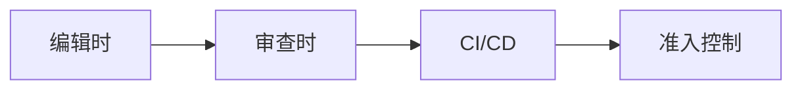
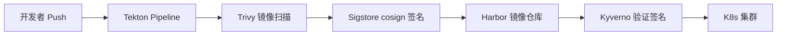

# 📊 运维运营系统跟踪 — 2026-06-08

> **来源**: CNCF Blog
> **时间窗口**: 2026-05-20 ~ 2026-06-04
> **本次新增**: 5 条 | **未覆盖来源**: The Register（访问受限），NVIDIA DSX（无新版本发布）

---

## 1️⃣ 🛡️ Prempti：AI Coding Agent 运行时安全策略工具

**来源**: [CNCF Blog · 2026-05-20](https://www.cncf.io/blog/2026/05/20/introducing-prempti-policy-and-visibility-for-ai-coding-agents/)
**作者**: Leonardo Grasso (Falco Maintainer)
**项目**: [Prempti](https://github.com/falcosecurity/prempti)（Falco 生态系统实验项目）

### 核心痛点

AI Coding Agent（Claude Code 等）以用户权限运行，可读文件、执行 Shell 命令、写文件、发网络请求，但开发者对这些行为几乎**零结构化可见性**。Agent 的聊天输出能看到结果，但看不到底层操作。

### Prempti 工作原理

- 作为**轻量用户态服务**运行在 Coding Agent 旁边（无需 root/内核模块）
- 在 Agent 的每个工具调用前**拦截**，用 Falco 规则评估后返回 verdict

```
Agent 工具调用 → Prempti 拦截 → Falco 规则评估 →  verdict
                                                          ├── Allow → 继续执行
                                                          ├── Deny  → 阻止 + 告知 Agent 原因
                                                          └── Ask  → 提示用户批准/拒绝
```

### 两种模式

| 模式 | 行为 | 建议 |
|:-----|:------|:-----|
| **Monitor** | 仅记录和评估，不强制执行 | 推荐**先用这个**——观察 Agent 实际行为后调优规则 |
| **Guardrails** | 强制执行 verdict | 规则调优后启用 |

### 默认规则覆盖 6 大安全域

| 域 | 内容 |
|:---|:-----|
| 工作目录边界 | 监控/询问项目目录外的文件访问 |
| 敏感路径 | **拒绝**读取 `/etc/`、`~/.ssh/`、`~/.aws/`、`.env` 等 |
| Sandbox 禁用检测 | 检测 Agent 试图关闭自身的 Sandbox |
| 威胁检测 | 凭证访问、破坏性命令、pipe-to-shell、编码 payload、IMDS 访问、反向 Shell、供应链安装 |
| MCP 和 Skill 内容 | MCP 服务端配置投毒、斜杠命令文件注入 |
| 持久化向量 | Hook 注入、Git hooks、API base URL 覆盖、API Key 泄露 |

### 限制（坦诚说明）

- **拦截的是 Agent 声明的工具调用，不是系统调用**——Agent 写恶意二进制再执行，Prempti 只看到 `gcc` 和 `./main`，看不到二进制内部的系统调用
- **不是 Sandbox**——是 Agent 层的策略补充，不取代沙箱和系统加固

### 当前支持

- Claude Code on Linux (x86_64, aarch64)、macOS (Apple Silicon, Intel)、Windows (x86_64, ARM64)
- Codex 集成**已列入计划**
- 自定义规则放在 `~/.prempti/rules/user/`，升级后保留

### 运维意义

这是 **AI Agent 安全运维的新品类**。当 AI Coding Agent 进入企业生产环境，"Agent 到底在我的机器上做了什么"成为运维团队的必答题。Prempti 将 Falco 的运行时安全模型扩展到 AI Agent 工具调用层，提供了策略驱动的可见性和控制能力。与 OTel GenAI Observability（追踪 Agent 做了什么）形成**互补**——一个管"能做什么"（策略），一个管"做了什么"（观测）。

---

## 2️⃣ 📋 Kubernetes 策略执行：时机问题与审查时强制

**来源**: [CNCF Blog · 2026-05-25](https://www.cncf.io/blog/2026/05/25/why-kubernetes-policy-enforcement-happens-too-late-and-what-to-do-about-it/)
**作者**: Sajal Nigam, CNCF Community Member
**涉及项目**: OPA, Kyverno, Conftest

### 核心问题：策略执行时机

大多数可靠性/安全事件并非源于应用代码，而是**基础设施配置错误**（缺少资源限制、过多的安全上下文、错误的 RBAC）。但现有的策略工具（OPA/Kyverno/Conftest）有两个主要执行阶段，都存在时机问题：

| 执行阶段 | 优势 | 局限性 |
|:---------|:-----|:-------|
| CI/CD 流水线 | 集中化、可审计 | **反馈周期长**——开发者已切换上下文 |
| Admission Controller | 最强保障 | **最晚反馈**——策略违规在部署最后一刻才暴露 |
| **审查时（Review-time）** 🔑 | 协作中即时反馈 | 可绕过（客户端评估），需与其他层配合 |

### 提出的模型：Enforcement Locus（执行轨迹）



关键洞察：**越早的反馈层，修复成本越低**。审查时执行填补了 CI/CD 和 Admission 之间的空白。

### AI Agent 作为策略推理伙伴

文章提出了一个前瞻性方向：AI Agent 嵌入审查时层，超越简单的规则匹配：

- **检测→推理**：不只是标出"缺少 resource limits"，而是解释为何在该工作负载上下文中重要
- **自动修复建议**：Patch 建议内联在 PR 注释中，开发者一键接受
- **自适应策略解释**：生产命名空间 vs 开发沙箱的违规容忍差异
- **Agentic 治理流水线**：多 Agent 分析跨 PR 的策略趋势、系统漂移检测
- **自然语言策略编写**：用自然语言描述意图，自动生成 Rego/Kyverno 策略

### 运维意义

这不是一个新策略引擎，而是**策略执行的集成点创新**。将策略反馈嵌入代码审查流程（开发者的核心协作表面），显著降低违规的修复成本。对于平台工程团队，这是一个"四层防御"（编辑-审查-CI-准入）的思路扩展。

---

## 3️⃣ 🔗 K8s 集成税：Prometheus/Cilium/cert-manager 实战经验

**来源**: [CNCF Blog · 2026-05-28](https://www.cncf.io/blog/2026/05/28/the-kubernetes-integration-tax-prometheus-cilium-and-production-reality/)
**作者**: Rishi Mondal, SRE at Obmondo / CNCF KubeStellar Maintainer

### 什么是集成税？

> "80% 的运维时间花在**连接** CNCF 项目上——不是安装、不是调优单个项目，而是让它们能对话。"

三个真实案例：

**1. cert-manager vs Ingress 控制器**
- HTTP-01 ACME Challenge 期望纯 HTTP，但 Ingress 控制器强制 HTTP→HTTPS 重定向，导致证书续签静默失败
- 修复：DNS-01 Challenge + 云 IAM，**但没有任何 Helm chart 默认配置此方案**

**2. Prometheus vs kubelet**
- kubelet 的 `/metrics` 和 `/metrics/probes` 都暴露 `process_start_time_seconds`，Prometheus 抓取到**重复时序**，产生 `PrometheusDuplicateTimestamps` 噪声告警
- 修复：Jsonnet relabeling 规则**丢弃一个端点**——不是 bug，但需要在**集成间隙**中调试

**3. Cluster API 跨云 Day-2 操作**
- 统一四个云（AWS/GCP/Azure/Hetzner）的集群管理
- CAPI 的 MachineHealthCheck + Velero 备份 + GitOps = 灾难恢复时集群从 Git 状态**自动重建**——前提是所有集成已正确配置

### 核心实践：两仓库 GitOps 拆分

| 仓库 | 内容 | 特性 |
|:-----|:-----|:-----|
| **Platform Repo** | 100+ Helm charts + 生产调优默认值 | Cilium NetworkPolicies、Prometheus ServiceMonitors 预配置，跨云共享 |
| **Config Repo** | 每客户/环境只需变的值 | 域名、节点数、云项目 ID |

ArgoCD 监控两个仓库。Platform Repo 中的一个修复（如去重规则）通过版本升级传播到所有集群。

### 五条实战教训

| 教训 | 方法 |
|:-----|:-----|
| 🔧 **监控应生成而非组装** | Jsonnet 单源生成整个 kube-prometheus 栈，可 diff、可版本化 |
| 🔒 **NetworkPolicy 嵌入 Chart 而非 Runbook** | 20+ Helm chart 各自声明 egress 需求，策略跟着代码走 |
| ♻️ **灾难恢复在引导时自动化** | 集群创建时同步创建 Velero 备份存储桶，不需要 Jira Ticket |
| 🔐 **加密后再提交到 Git** | Sealed Secrets 加密所有凭证，Git 成为完整可审计的集群状态记录 |
| 🤖 **让机器执行策略** | Kyverno 拦截缺资源限制的部署，Kubescape 持续扫描 CIS 基准 |

### 运维意义

"集成税"是一个精准的命名——CNCF 生态的单项目质量很高，但**运维的真正成本在于项目之间的缝隙**。两仓库 GitOps + Jsonnet 生成 + 预配 NetworkPolicy 的方法论提供了一个可复用的参考模式。核心信条：**"集成逻辑必须存在于代码中，而非人的记忆中"**。

---

## 4️⃣ 🏗️ 构建云原生内部开发者平台（IDP）

**来源**: [CNCF Blog · 2026-05-29](https://www.cncf.io/blog/2026/05/29/building-a-cloud-native-internal-developer-platform-with-kubernetes-gitops-and-supply-chain-security/)
**作者**: Abu Hena Mostafa Kamal, CNCF Kubestronaut

### 五大设计支柱

| 支柱 | 技术栈 | 说明 |
|:-----|:-------|:-----|
| 🏗️ **K8s 底座** | kubeadm + containerd + Cilium | 安全的集群引导 |
| 🔄 **GitOps** | ArgoCD + Crossplane | 声明式应用和基础设施管理 |
| 🔐 **安全** | Kyverno + Trivy + OPA Gatekeeper | 策略即代码 + 镜像扫描 + 治理 |
| 📊 **可观测性** | Prometheus + Grafana + Loki + Tempo |  Metrics/Logs/Traces 三信号 |
| 📦 **CI/CD** | Tekton + Harbor + Sigstore | 签名 + 验证 + 安全供应链 |

### 供应链安全集成



### 运维意义

这篇文章本身不是突破性创新，但代表了**社区共识的最佳实践模板**——将 L4 治理（策略+扫描+验证）整合到 IDP 中的标准化模式。核心价值是**供应链安全不是事后补丁，而是 CI/CD 流水线的一等公民**——镜像签名、策略验证、漏洞扫描在部署前完成。

---

## 5️⃣ 📦 CNCF 项目快报：Swift 动态配置 + Cilium Journey Report 日文版

**来源**: [CNCF Blog · 2026-06-01](https://www.cncf.io/blog/2026/06/01/dynamic-configuration-for-cloud-native-swift-services/) · 2026-05-15

### Swift 云原生动态配置（Apple 投稿）

Apple 团队发表文章介绍 Swift 服务在云原生基础设施中的配置管理——与现代 CNCF 项目（Prometheus、OTel、K8s ConfigMaps）的集成模式。Swift 在服务器端的生态（尤其 AI 推理场景）正在扩大，这是 CNCF 社区持续接纳 Swift 的信号。

### Cilium Project Journey Report 日文翻译

Cilium 项目旅程报告的日文版发布，帮助日本社区理解 Cilium 的 CNCF 毕业旅程。Cilium 持续是最活跃的 CNCF 网络项目之一。

---

## 🎯 本周趋势判断

**「AI Agent 运维安全」成为新热点 🔥**

| 维度 | 信号 | 强度 |
|:-----|:-----|:-----|
| 🤖 **AI Agent 安全策略** | Prempti 将 Falco 策略模型扩展到 AI Coding Agent 工具调用层 | ⭐⭐⭐⭐⭐ |
| ⏱️ **策略执行时机理论** | "Enforcement Locus"模型——审查时执行填补关键空白 | ⭐⭐⭐⭐ |
| 🔗 **集成税实战经验** | 两仓库 GitOps + Jsonnet + NetworkPolicy-in-Chart 方法论 | ⭐⭐⭐⭐ |
| 🏗️ **IDP 最佳实践** | 端到端供应链安全 GitOps CI/CD 参考架构 | ⭐⭐⭐ |

**核心判断**：运维领域正在出现两个平行趋势的交叉——**AI 正在成为运维的对象（AI Agent 安全）**，同时**运维本身正在被 AI 改造（Agent 作为策略推理伙伴）**。Prempti（策略层）与 OTel GenAI Observability（观测层）从两个方向共同定义了"AI Agent 运维"的新领域。与此同时，"集成税"文章以实战经验提醒社区——无论 AI 多么先进，CNCF 项目之间的集成质量仍然是运维的硬功夫。

---

## 📋 已覆盖来源清单

| 来源 | 覆盖数 | 最新日期 |
|:-----|:-------|:---------|
| CNCF Blog | 5 篇 | 2026-05-20 ~ 2026-06-01 |
| K8s Blog | 0 篇（无新内容） | — |
| OTel Blog | 0 篇（此前已覆盖） | — |
| NVIDIA Technical Blog | 0 篇 | — |

> **说明**: K8s v1.36 系列博客、OTel 毕业、Jaeger v2 AI Agent 追踪、KEDA GPU Scaler、NVIDIA DSX OS 等内容已在 6/5-6/7 覆盖。本周新增的是 Prempti（Falco 新项目）和社区方法论文章（K8s 集成税、策略执行时机）。
