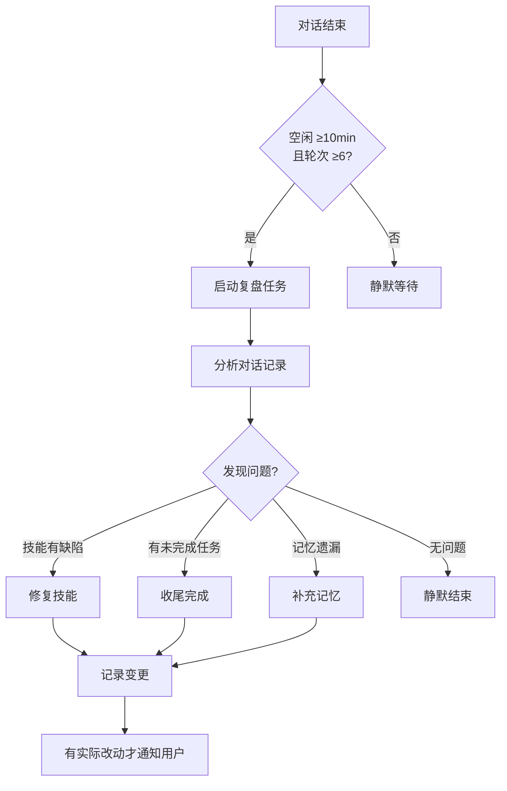

# 自主进化专题深度分析：进化 vs 自动化的本质区别

> **创建**: 2026-06-23 | **版本**: v1.0
> **来源**: import 素材综合提炼（Harness Engineering · AI Agent 设计九大模式 · Agent OS 五种范式 · CowAgent 自进化五层 · Agent 工具链工程化等）
> **关联**: [Agent 自进化机制五层实现](../../03_AI/notes/2026-06-17-agent-self-evolution-five-layers.md) · [Agent OS：五种范式](../../03_AI/notes/2026-06-17-agent-os-five-paradigms-rossi.md) · [Agent 工具链工程化](../../03_AI/notes/2026-06-17-agent-toolchain-engineering-skill-cli.md) · [AI 使用方法论](../01_basic-concepts/ai-usage-methodology.md)

---

## §0 核心区分：自主进化 vs 自动化

> 这是理解本专题最重要的前提——**自主进化不是自动化的高级版本，二者有本质区别**。

| 维度 | **自动化（Automation）** | **自主进化（Autonomous Evolution）** |
|:-----|:------------------------|:-------------------------------------|
| **本质** | 固定流程的机器执行 | 行为模式的自我优化 |
| **反馈回路** | 单向：输入 → 执行 → 输出 | 闭环：执行 → 评估 → 反思 → 调整 → 再执行 |
| **变化对象** | 不变的程序/规则 | Agent 自身的提示词、技能、记忆、甚至代码 |
| **场景依赖** | 规则明确、场景稳定 | 场景不确定、规则需适应 |
| **对失败的响应** | 报错/停止 | 分析根因、调整策略、自我修复 |
| **输出可预测性** | 高（确定性） | 中低（概率性，但随进化提升） |
| **适用范围** | 已知问题的重复执行 | 未知问题的探索求解 |

**一句话区分**：
- **自动化**：把"人做的事"交给机器做，做的事不变
- **自主进化**：让 Agent 变得"越来越会做"，做事的方式持续改进

**意义**：当前 AI 领域最大的误区之一，就是以为"把所有流程自动化"= "实现了智能"。实际上，没有进化能力的自动化系统在环境变化时会快速失效——这也是"假设腐化"问题的核心根源。

---

## §1 自主进化的理论基础

### 1.1 为什么需要进化？——不确定性的六个来源

> 来源：Agent OS 五种范式

Agent 面临的不确定性有 **6 个来源**，传统自动化系统只面对其中少数：

| # | 不确定性来源 | 性质 | 传统自动化能否应对？ |
|:--|:-------------|:-----|:-------------------|
| ① | **LLM 输出概率性** | 认知不确定性 | ❌ 传统系统假设确定性 |
| ② | **Tool 调用可能失败** | 偶然不确定性 | ⚠️ 仅能重试，无法换策略 |
| ③ | **环境状态变化** | 外部扰动 | ❌ 需人工调整规则 |
| ④ | **Context Window 有限** | 观测约束（物理极限） | ❌ 无对应概念 |
| ⑤ | **多 Agent 并发** | 竞争条件 | ⚠️ 传统锁机制不兼容 |
| ⑥ | **模型升级行为漂移** 🚩 | 平台演变 | ❌ 无概念（模型不变） |

**关键洞察**：传统自动化系统的核心假设——"同样输入必然产生同样输出"——在 Agent 系统中完全不成立。Agent 系统必须通过进化机制来持续适应这些不确定性。

### 1.2 五种驯服不确定性的范式

> 来源：Agent OS 五种范式（跨 10 个领域综合提炼）

| 范式 | 核心思想 | 进化中的体现 |
|:-----|:---------|:------------|
| **冗余（Redundancy）** | 多份副本提高可靠性 | 多方案对比、多 Agent 投票 |
| **反馈（Feedback）** | 用实际结果调整行为 | Reflexion、外部评估、Trace→Skill 闭环 |
| **约束（Constraint）** | 预先规定可行空间 | 反压模型、Harness 安全护栏 |
| **隔离（Isolation）** | 限制故障传播范围 | L3 复盘独立异步运行、上下文分层 |
| **门控（Gating）** | 按不可逆度分级决策 | 有界委托、G 层授权、渐进信任 |

**核心公式**：Agent OS Engineering = 五种范式的**组合应用**，在"概率性执行主体 + 观测有限 + 假设腐化"约束下的特化实现。

### 1.3 进化的核心机制：反馈回路（Feedback Loop）

进化能力的根基是**闭环反馈**：

```
┌─────────┐    ┌─────────┐    ┌─────────┐    ┌─────────┐
│  执行    │ →  │  观察   │ →  │  评估   │ →  │  调整   │
│ (Act)   │    │ (Sense) │    │ (Judge) │    │ (Adapt) │
└─────────┘    └─────────┘    └─────────┘    └─────────┘
      ↑                                             │
      └──────────────── 循环 ──────────────────────┘
```

**核心条件**：反馈信号必须来自**外部**（非 Agent 自我宣称）。Agent 自己说"我做得很好"不可信——需要工具验证、人工审核或其他 Agent 评审。

---

## §2 反馈模式的演进：自我反思 → 外部校准 → 深度优化

> 来源：AI Agent 设计九大模式深度解析 · Harness Engineering

反馈回路的质量决定了进化的深度。三种模式逐级递进：

### 2.1 模式一：Basic Reflection（基础反思）

**核心原理**：Agent 生成初始响应后，自主进行反思与修正。

```
接收任务 → 生成响应 → 自我反思 → 修正答案 → 循环至最优
```

- ✅ 优势：显著提升输出准确性，减少基础错误
- ❌ 局限：没有外部标准，"自我反思"可能只是自我确认
- 适用：自动问答、代码生成与审查
- ⚠️ **与自动化的本质区别**：自动化在此场景是"一次输出即结束"，Basic Reflection 则自主决定是否需要重新输出

### 2.2 模式二：Reflexion（外部校准反思）

**核心原理**：引入外部数据或标准答案评估响应，生成建设性修正建议。

```
接收任务 → 生成响应 → 外部评估 → 深度反思 → 修正 → 循环
```

- ✅ 优势：利用外部标准实现更高的准确性
- ✅ 成长性：Agent 进行可验证的学习（而非自我确认）
- 适用：高精度问答、代码审查、复杂推理
- 🚩 **关键特征**：进化与自动化的分水岭就在这里——自动化系统不"学习"，Reflexion 通过学习改进后续行为

### 2.3 模式三：Self-Discover（自我发现深度优化）

> 这是最高阶的进化模式

**核心原理**：在任务细粒度上进行持续反思，**自我发现潜在问题与改进空间**。

- ✅ 优势：挖掘深层优化点，具备极强的主动适应性
- ✅ 真正"进化"：Agent 不只是修正当前错误，而是发现"自己哪里还需要变好"
- 适用：模型自动调优、复杂策略迭代
- 🚩 **与自动化的关键区别**：自动化系统在预设路径上走到终点；Self-Discover 会问"走的路对吗？该不该换条路？"

---

## §3 Agent 自进化的工程实现：五层递进架构

> 来源：CowAgent 自进化机制 · Agent OS ETCLOVG 架构

### 3.1 架构总览

| 层级 | 改进内容 | 触发时机 | 进化深度 | 与自动化的区别 |
|:-----|:---------|:---------|:---------|:-------------|
| **L1 记忆维护** | 记忆/知识/提示词 | 每次对话中 | 记录 | 自动化=固定模板记录；进化=分析后决定记什么 |
| **L2 上下文总结** | 记忆 | 上下文超限时 | 保留 | 自动化=直接丢弃；进化=提炼后保留关键信息 |
| **L3 会话复盘** ⭐ | 技能/记忆/提示词 | 会话空闲后 | **行动** | 自动化=什么都不做；进化=主动识别问题并修复 |
| **L4 梦境整理** | 长期记忆 | 每日定时 | 沉淀 | 自动化=简单归档；进化=去重/合并/冲突解决 |
| **L5 源码自更新** | 自身代码 | 被动/主动触发 | **自我重构** | 自动化=不改代码；进化=修改自身运行逻辑 |

### 3.2 核心层深度解析：L3 会话复盘

这是**进化与自动化最本质区别**的体现层：



**自动化在此处做什么**：什么都不做，或者最多记录日志。
**进化在此处做什么**：主动识别、分析根因、修复问题、记录变更——**完全是人在做的事情**。

### 3.3 安全可控三原则

进化能力越强，安全要求越高：

| 原则 | 实现 | 目的 |
|:-----|:------|:-----|
| **隔离执行** | 独立异步临时任务，工具集大幅收紧 | 不污染主对话 |
| **变更可回滚** | 改动前自动备份，用户说"撤销"即可还原 | 失败可恢复 |
| **变更可追溯** | 持久化变更记录 | 审计与复盘 |
| **未变更不打扰** | 有实际改动才推送，否则静默 | 避免干扰用户 |

> **核心教训**：实现修改能力不难，难的是**改得克制、改得可控**。

---

## §4 Trace→Skill 进化闭环：从经验到能力

> 来源：Agent OS ETCLOVG 架构 · ContextSearch 工程实践

### 4.1 闭环链路

Trace→Skill 是自主进化中最具**工程价值**的实践：

```
[在线执行]
     ↓ 产生 Trace（执行轨迹）
[离线分析]
     ├─ 高频路径 → 沉淀为 Skill（固化路由，减少推理）
     ├─ 失败模式 → 策略优化（调整路由/工具选择）
     ├─ 小模型路由 → 训练轻量分类器
     └─ 评测样本 → 回灌自动评测
     ↓
[技能安装] → 新能力注入 Agent 系统
     ↓
[在线执行] → 使用新能力，产生新的 Trace
```

### 4.2 与自动化的关键区别

| 方面 | 自动化 | Trace→Skill 进化 |
|:-----|:-------|:-----------------|
| **对经验的态度** | 无概念 | 经验是核心资产 |
| **对失败的利用** | 记录/告警 | 分析根因，调整策略 |
| **对高频路径** | 不感知 | 识别并固化，降低不确定性 |
| **确定性覆盖率** | 100%（规则写死） | ~30% → 数月后 ~60-70%（持续增长） |
| **对环境变化的响应** | 需人工更新规则 | 自动发现并适应 |

### 4.3 工程启示

**确定性优先路由原则（INV-R）**：

```
执行成功率：Rule > API > CLI > MCP > GUI > Free-form LLM

每一条新确定的路径 = 永久消除一部分不确定性
```

这意味着自主进化系统会在运行中**不断扩展其确定性处理能力**，将已验证过的高频路径固化为确定性规则——这与自动化"一开始就要完整规则"的哲学完全相反。

---

## §5 Harness Engineering：自主进化的基础设施层

> 来源：Harness Engineering：AI Agent 时代的工程范式革命

### 5.1 Harness 的定位

```
Prompt Engineering (指令层)     ← 最内层：关注"给 AI 看什么指令"
    ↓
Context Engineering (信息层)     ← 中间层：关注"给 AI 看什么信息"
    ↓
Harness Engineering (系统层)     ← 最外层：关注系统防崩、量化与修复
```

**模型是 CPU，Harness 是操作系统。** 操作系统管理资源、调度任务、监控健康——这就是自主进化所需的基础设施。

### 5.2 反压模型（Backpressure）：自主进化的控制机制

> 来源：Anthropic Huntley 实践

```
上游反压（Upstream）→ 执行前施加约束
    ↓
执行中
    ↓
下游反压（Downstream）→ 执行后验证输出
```

**上游反压**（进化前约束）：
- 确定性环境设置
- 一致上下文分配
- 架构依赖方向声明

**下游反压**（进化后验证）：
- 测试结果验证
- 副作用检查（文件是否存在、数据库记录是否写入）
- 质量评估

> **关键洞察**：没有反压的进化是灾难。自主进化的本质是在"反压约束空间"内的自由优化——像进化论中的自然选择约束。

### 5.3 从"驯服 AI"到"设计 AI 自治系统"的趋势

| 演进阶段 | 特点 | 进化程度 |
|:---------|:-----|:---------|
| Phase 1 — 驯服 | 约束 + 隔离 + 防崩 | 基础安全 |
| Phase 2 — 自动化 | 固定流程 + 规则引擎 | 无进化 |
| Phase 3 — 自适应 | 动态调整约束与资源分配 | 🔄 **系统级自优化** |
| Phase 4 — 全自治 | 从需求到上线的全流程自主 | 🔄 **完全自主进化** |

---

## §6 自主进化 vs 自动化：一个统一的对比框架

### 6.1 本质对照表

| 维度 | 自动化 | 自主进化 |
|:-----|:-------|:---------|
| **思维模型** | 流水线 | 生物体 |
| **处理方式** | 预先编程 | 经验学习 |
| **核心假设** | 环境稳定可预测 | 环境动态不可预测 |
| **错误处理哲学** | 防御（写规则防止） | 修复（发生后再学习） |
| **扩展方式** | 追加规则 | 积累经验+模式发现 |
| **与人的关系** | 替代 | 增强（越来越强） |
| **鲁棒性来源** | 规则完备性 | 适应能力 |
| **对变化的响应** | 需人工更新 | 自动感知和调整 |
| **收敛特性** | 确定性收敛 | 概率性趋优 |
| **天花板** | 规则设计者的智慧上限 | 环境和学习能力的上限 |

### 6.2 实践中的互补关系

自主进化**不是替代**自动化，而是在自动化之上叠加学习层：

```
┌─────────────────────────────────────────┐
│           自主进化层                       │
│  (Reflexion · Trace→Skill · 复盘)        │
│     ↑ 提供优化信号     ↓ 注入新能力       │
├─────────────────────────────────────────┤
│           自动化执行层                     │
│  (Rule Engine · Pipeline · Workflow)     │
├─────────────────────────────────────────┤
│           基础设施层                       │
│  (Harness · 反馈回路 · 安全护栏)          │
└─────────────────────────────────────────┘
```

**实践建议**：
- **底层执行** — 尽可能自动化（确定性规则 + 流程编排）
- **上层进化** — 在自动化之上叠加经验学习层
- **不越级优化** — 不要在没有自动化基础的系统上做进化，那样目标不稳定

---

## §7 总结：自主进化的核心判别标准

一个系统是否具备"自主进化"能力，请在运行中问以下 5 个问题：

| # | 判别问题 | 如果是自动化 | 如果是自主进化 |
|:-:|:---------|:------------|:--------------|
| 1 | 运行过程中，系统自身是否在变化？ | ❌ 否，代码固定 | ✅ 是，记忆/技能/提示词在更新 |
| 2 | 遇到失败/错误时，系统会做什么？ | 记录/报错/重试 | 分析根因、调整策略 |
| 3 | 同样的问题第二次遇到，表现是否更好？ | 不一定（除非重试成功） | ✅ 应该更好（经验已沉淀） |
| 4 | 系统能否发现"自己还需改进什么"？ | ❌ 不能 | ✅ 能（Self-Discover 模式） |
| 5 | 环境变化后，系统能否自动适应？ | ❌ 需人工调整 | ✅ 自动感知并调整 |

**结论**：
- 如果 5 个答案都是"否" → 纯自动化系统
- 如果有 2 个以上"是" → 具备进化能力
- 如果 5 个都是"是" → 高度自主进化的系统（当前最高水平）

### 关键金句

> **自动化解决"已知问题的重复执行"，自主进化解决"如何变得更好"——前者是效率问题，后者是适应性问题。**

> **没有进化能力的自动化，在下一次环境变化时就是一堆废代码。**

> **自主进化不是高级自动化，它是对自动化假设（环境不变）的根本否定。**

---

## 🔗 交叉引用

| 关联文件 | 关联内容 |
|:---------|:---------|
| [Agent 自进化机制五层实现](../../03_AI/notes/2026-06-17-agent-self-evolution-five-layers.md) | L1-L5 工程实现细节 |
| [Agent OS：五种范式](../../03_AI/notes/2026-06-17-agent-os-five-paradigms-rossi.md) | 不确定性来源 · ETCLOVG 架构 · Trace→Skill 闭环 |
| [Agent 工具链工程化](../../03_AI/notes/2026-06-17-agent-toolchain-engineering-skill-cli.md) | Skill CLI 与自动化层的关系 |
| [MetaSKILL 与 SKILL](../../03_AI/tools/metaskill-skill-deep-review.md) | Skill 生态与进化路径 |
| [AI 使用方法论](../01_basic-concepts/ai-usage-methodology.md) | 人机分工 · 五层解法树 |
| [Agent SKILL 架构](../../03_AI/tools/agent-skill-architecture-decomposition.md) | Skill 的自我优化与进化 |
