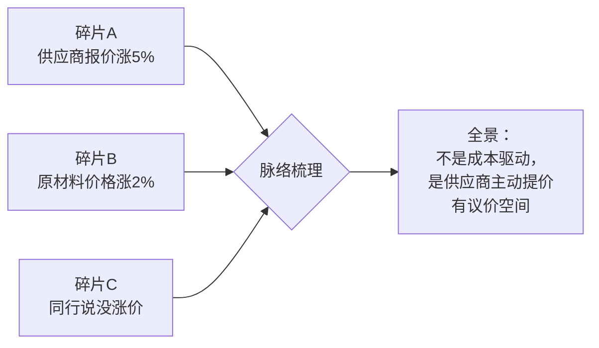
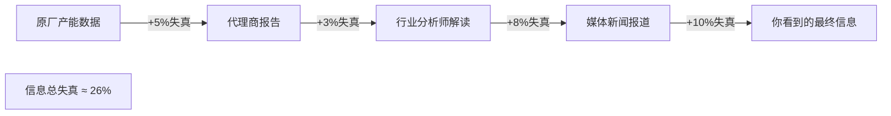
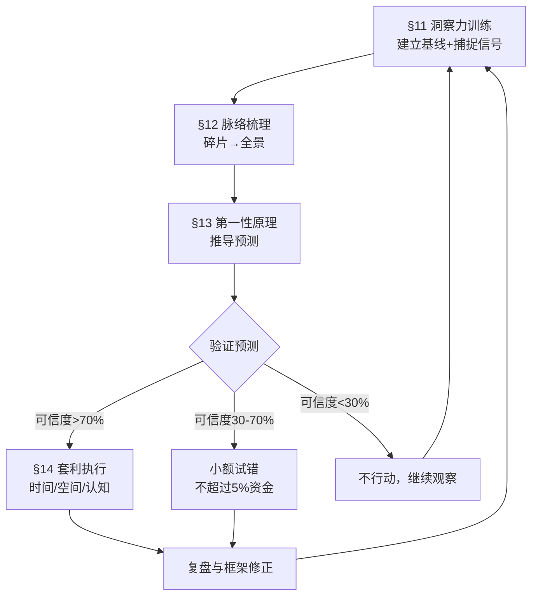

# 信息差四层方法论：从洞察到产业化

> **版本**: v2.0 | **创建**: 2026-06-22 | **更新**: 2026-06-22 (新增 §§11-14：洞察力·脉络梳理·第一性原理·预测与套利, 新增 §8.4 日常信号捕捉, §4 新增双重视角标注)
> **关联**: [采购模式全景指南](../00_rd-management/procurement-models-complete-guide.md#信息差在采购中的应用) · [架构师职业踩坑经验](../../04_person/enterprise-mgmt/architect-career-pitfalls.md)
> **核心洞察**: 社会上许多领域本质上是通过「制造信息差 → 利用信息差获利 → 形成产业链 → 养活一班人」的闭环运转

---

## 目录

- [§1 信息差的本质定义](#§1-信息差的本质定义)
- [§2 信息差的五层结构](#§2-信息差的五层结构)
- [§3 信息差如何产业化：四阶段演进](#§3-信息差如何产业化四阶段演进)
- [§4 采购/供应链场景的 10 种典型信息差](#§4-采购供应链场景的-10-种典型信息差)
- [§5 信息差的制造手法：7 种常见模式](#§5-信息差的制造手法7-种常见模式)
- [§6 信息差的利用策略：4 种博弈类型](#§6-信息差的利用策略4-种博弈类型)
- [§7 如何防范被信息差收割](#§7-如何防范被信息差收割)
- [§8 如何主动构建信息优势](#§8-如何主动构建信息优势)
- [§9 信息差的伦理边界](#§9-信息差的伦理边界)
- [§10 终极启示](#§10-终极启示)
- [附录：信息差快查表](#附录信息差快查表)

---

## §1 信息差的本质定义

### 1.1 核心定义

**信息差** = 同一信息在不同主体之间的**时间差 × 质量差 × 解读差**

信息差的获利公式不是「你知道别人不知道」，而是：

```
利润 = (对方获取成本 - 你获取成本) + (对方解读时间 - 你解读时间)
     + (对方行动速度 - 你行动速度) + 对方的认知盲区租金
```

### 1.2 三个关键属性

| 属性 | 含义 | 例子 |
|:-----|:-----|:-----|
| **时效性** | 信息价值随时间指数衰减 | 上游涨价消息提前 1 天 vs 提前 1 周，议价空间差 10× |
| **结构性** | 单一信息点无价值，结构化才有 | 知道 CPU 涨价 5% 不够，还要知道这是产能、关税还是需求驱动 |
| **解读性** | 相同信息不同人看到不同价值 | 供应商说要涨价 15%，有人直接接受，有人追问「哪几家、何时、是否可锁定」 |

### 1.3 信息差的四条公理

1. **信息从生成到扩散一定有延迟** — 这是信息差存在的物理基础
2. **信息在传递中一定损失或失真** — 这是产业链的生存基础
3. **信息解读能力差异远超信息获取能力差异** — 这是认知壁垒的来源
4. **信息差无法消灭，只能转移** — 消灭了旧层的信息差，新层立刻产生

---

## §2 信息差的五层结构

不是所有信息差都值钱。按价值从低到高：

### L0：事实信息差——「我知道这件事」

| 维度 | 说明 | 典型场景 |
|:-----|:-----|:---------|
| **内涵** | 单纯知道某个事实存在 | 我知道 A 供应商在降价 |
| **半衰期** | 极短（几小时到几天） | 消息公开后价值归零 |
| **获利方式** | 抢先行动（先买先卖） | 先于同行锁价 |
| **防御难度** | 低（信息源一多，差就消失） | 信息中介越多人入场，利润越薄 |

### L1：结构信息差——「我知道这件事的关联」

| 维度 | 说明 | 典型场景 |
|:-----|:-----|:---------|
| **内涵** | 知道事实 A 与事实 B 的关系 | 我知道 A 降价是因为 B 厂产能过剩，而 C 厂会跟 |
| **半衰期** | 中（几天到几周） | 需要时间验证关联 |
| **获利方式** | 利用关联预判 | 提前一个月知道降价会传导到哪一层 |
| **防御难度** | 中（需要领域知识） | 从业也未必能建立关联 |

### L2：预判信息差——「我知道接下来会发生什么」

| 维度 | 说明 | 典型场景 |
|:-----|:-----|:---------|
| **内涵** | 从历史模式和当前信号推断未来 | 我知道涨价公告前一周供应商会减少报价响应速度 |
| **半衰期** | 长（几周到几个月） | 预判框架可复用 |
| **获利方式** | 提前布局 | 在涨价前锁定全年框架协议 |
| **防御难度** | 高（需要长期观察+模式识别） | 跨行业也难复制 |

### L3：博弈信息差——「我知道你会怎么动，也知道你知道，但我还知道你不知道我知道」

| 维度 | 说明 | 典型场景 |
|:-----|:-----|:---------|
| **内涵** | 多层认知嵌套 | 供应商给我报高价，他知道我会还价，但不知道我已经拿到他的全成本结构 |
| **半衰期** | 极长（可反复使用直到被识破） | 博弈框架可以跨谈判场景复用 |
| **获利方式** | 利用对方的认知盲区 | 让对方以为自己在赢，实际上每一步都被预判 |
| **防御难度** | 极高（需要同时了解自己和对方） | 甚至对方自己也不知道自己在被预判 |

### L4：产业链信息差——「我知道你怎么制造信息差」

| 维度 | 说明 | 典型场景 |
|:-----|:-----|:---------|
| **内涵** | 知道对方靠制造什么信息差赚钱 | 我知道这个咨询公司靠「把公开行业数据重新包装成独家洞察」收费 |
| **半衰期** | 几乎永久 | 商业模式一旦看透，很难再被收割 |
| **获利方式** | 绕过中间层直接触达信息源 | 直接找上游，绕过信息中介 |
| **防御难度** | 极高（需要跳出一层看一层） | 属于元认知能力 |

---

## §3 信息差如何产业化：四阶段演进

**你的核心洞察完全正确**：信息差不止是被动利用，它会被主动制造成一条产业链。四阶段演化：

### Stage 1：自然信息差（发现阶段）

信息天然不对称。有人偶然发现某个信息差并从中获利。

| 特征 | 例子 |
|:-----|:-----|
| 信息差的产生是偶然的 | 某个采购员偶然发现 A 供应商的价格比市场低 30% |
| 获利规模有限 | 只够自己赚点差价 |
| 不可复制 | 全靠运气 |

### Stage 2：主动制造信息差（设计阶段）

有人意识到「可以故意制造信息差来获利」，开始系统性操作。

| 特征 | 例子 |
|:-----|:-----|
| 从发现到设计 | 供应商故意给不同客户不同报价，制造信息差 |
| 需要投入资源 | 需要情报网络、渠道 |
| 开始有套路 | 报价策略、价格分层、区域差异 |

### Stage 3：信息差产业化（复制阶段）

信息差从「个体行为」进化为「商业模式」。出现专门的公司、岗位、服务。

| 特征 | 例子 |
|:-----|:-----|
| 有专门的角色 | 咨询公司、渠道中间商、情报商、认证机构 |
| 有标准产品 | 行业报告、价格指数、趋势预测、资质认证 |
| 有定价模型 | 年费制、按次收费、订阅制、抽成制 |
| 形成生态 | 上游产生信息 → 中游包装 → 下游销售 → 终端付费 |

**典型的信息差产业链结构：**

```
┌─────────────────────────────────────────────────────────┐
│                信息差产业链的完整结构                       │
├──────────┬──────────┬──────────┬──────────┬────────────┤
│  信息源   │  加工者   │  通道商   │  利用者   │  收割目标  │
│          │          │          │          │            │
│ 原厂报价  │ 咨询公司  │ 渠道商   │ 采购方   │ 供应商    │
│ 产能数据  │ 分析师   │ 分销商   │ 卖家     │ 竞争对手  │
│ 政策信息  │ 媒体     │ 中间人   │ 经销商   │ 客户      │
│ 技术路线  │ 培训机构  │ 平台     │ 投资者   │ 小白用户  │
├──────────┴──────────┴──────────┴──────────┴────────────┤
│  每层都收一次「信息差税」，最终利润=信息经过的层级数     │
└─────────────────────────────────────────────────────────┘
```

### Stage 4：信息差的反向利用（解构阶段）

有人认识到自己正在被信息差产业链收割，开始反制。

| 特征 | 例子 |
|:-----|:-----|
| 跳过多级信息链直达源头 | 采购方直接找原厂谈年度框架，绕过 3 级代理 |
| 建立独立情报渠道 | 自建 BOM 成本拆解能力，不依赖供应商报价 |
| 利用信息差反制信息差 | 同时让两个供应商以为对方是唯一备选 |
| 信息差产业链崩溃 | 中间层被挤压，信息趋向透明化 |

---

## §4 采购/供应链场景的 10 种典型信息差

### 4.1 价格信息差

| 形式 | 具体操作 | 翻车案例 |
|:-----|:---------|:---------|
| 供应商给不同客户不同价 | 按客户大小、谈判能力、信息掌握程度分层定价 | 采购方在行业交流中发现同事价便宜 30% |
| 报价单隐藏关键信息 | 只报单价不报 MOQ 或运费，后期增项 | 签合约后发现运费比货价还高 |

### 4.2 产能/交期信息差

| 形式 | 具体操作 | 翻车案例 |
|:-----|:---------|:---------|
| 供应紧张时虚报交期 | 明明有库存但说交期 12 周，逼涨价 | 客户发现竞品同样交期但价格翻倍 |
| 利用产能信息制造恐慌 | 散布「全行业产能不足」，催客户下单 | 实际上对手产能充足，价格没涨 |

### 4.3 质量信息差

| 形式 | 具体操作 | 翻车案例 |
|:-----|:---------|:---------|
| 用 A级样品 + C级量产品 | 样品送检全通过，量产品缩水 | 量产 3 个月后故障率飙升 |
| 知假打假 | 供应商知道仿品但不告知，赌客户发现不了 | 客户被原厂查罚并拉入黑名单 |

### 4.4 规格/技术信息差

| 形式 | 具体操作 | 翻车案例 |
|:-----|:---------|:---------|
| 超规推荐 | 推荐远超需求的型号，赚差价和佣金 | 客户花了大钱买了不需要的性能 |
| 隐瞒兼容性 | 说「与行业标准兼容」但不告知需要额外适配 | 集成时发现缺少关键信号定义 |

### 4.5 合规/认证信息差

| 形式 | 具体操作 | 翻车案例 |
|:-----|:---------|:---------|
| 虚假宣传认证 | 说通过了 CERT A，实际只提交申请 | 产品在海关被扣押 |
| 利用合规时间差 | 已知标准即将升级，但建议客户按旧标准买 | 半年后产品无法合规，需要更换 |

### 4.6 替代料信息差

| 形式 | 具体操作 | 翻车案例 |
|:-----|:---------|:---------|
| 隐藏替代方案 | 客户用昂贵物料时，不说有更便宜的可替 | 同行用便宜 40% 的替代方案竞标 |
| 替代料性能模糊 | 说「性能相当」但不告知在高温下的差异 | — |

### 4.7 库存/LTB 信息差

| 形式 | 具体操作 | 翻车案例 |
|:-----|:---------|:---------|
| 虚报库存紧张 | 明明库存充足但说「最后一批」催单 | 客户下单后价格立刻下跌 |
| 提前 EOL 通知隐瞒 | 已知道物料要停产却继续接新订单 | 客户产品刚量产就断供 |

### 4.8 市场趋势信息差

| 形式 | 具体操作 | 翻车案例 |
|:-----|:---------|:---------|
| 利用宏观趋势压价 | 「行业下行」压供应商降价，实际自己需求超预期 | 供应商被迫降价后产能被竞品包走 |
| 逆向利用趋势抬价 | 「AI 需求爆发」为由全线涨价，实际产能充足 | 客户断然拒单，转投替代方案 |

### 4.9 内部信息差（企业内部的）

| 形式 | 具体操作 | 翻车案例 |
|:-----|:---------|:---------|
| 研发 vs 采购信息脱节 | 研发确定物料后采购才知道，议价空间为零 | 唯一供应商坐地起价 |
| 采购 vs 财务信息脱节 | 采购以高价签约，财务付了款才看到单价 | 预算超支 50% 才发现 |
| 不同事业部之间 | 同一集团两个事业部，分别与同一供应商谈判 | 供应商拿 A 部门的价格压 B 部门 |

### 4.10 行业渠道信息差（中间商制造）

| 形式 | 具体操作 | 翻车案例 |
|:-----|:---------|:---------|
| 原厂→分销商→客户的中间商牟利 | 原厂只出货给授权分销商，分销商再加价转手 | 原厂价 $200 → 分销商 $280 → 客户 $380 |
| 灰色渠道的货源不明 | 来路不明（翻新/拆机/盗版）充当正品 | 出问题原厂不保，中间商消失 |

---

## §5 信息差的制造手法：7 种常见模式

### 手法 1：隔离 — 切断信息流动

**原理**：主动阻止信息从 A 流向 B，让 B 处于无知状态。

| 场景 | 具体做法 |
|:-----|:---------|
| 供应链 | 供应商隔离不同客户，A 客户不知道 B 客户的真实拿货价 |
| 市场 | 区域隔离，同一产品在不同地区卖不同价（且不允许串货） |
| 技术 | 封闭生态（如专有协议/接口标准），只授权少数伙伴 |
| 组织 | 部门壁垒，研发不知道成本，采购不知道技术难度 |

### 手法 2：扭曲 — 向不同方向传递不同版本

**原理**：给不同的利益相关方不同的信息版本，让他们基于不同判断做出选择。

| 场景 | 具体做法 |
|:-----|:---------|
| 报价 | 给 A 客户报 $100（说产能紧张），给 B 客户报 $80（说清库存） |
| 谈判 | 告诉甲方「乙方已经让步」，告诉乙方「甲方很坚持」 |
| 市场 | 同时发布乐观版和悲观版预测，不同客群看到不同版本 |

### 手法 3：制造稀缺 — 利用时间轴差异

**原理**：明明不稀缺但制造稀缺假象，或利用「先到先得」制造紧迫。

| 场景 | 具体做法 |
|:-----|:---------|
| 产能 | 谎报交期，实际有库存在先赚高价订单 |
| 限时优惠 | 制造限时截止压力，不给你横向对比的时间 |
| 排期操纵 | 承诺紧急排期但实际上是常规排期 |

### 手法 4：增加复杂性 — 利用认知壁垒

**原理**：把简单的事情搞复杂，让人无法判断真伪，只能依赖「专家」。

| 场景 | 具体做法 |
|:-----|:---------|
| 定价 | 多层价格公式、返点、阶梯价、对赌条款，没人算得清实际成本 |
| 合规 | 利用复杂的认证/标准体系收认证费 |
| 技术 | 利用专业术语制造壁垒（同功能，换个说法多收 30%） |

### 手法 5：延迟 — 控制信息的时间差

**原理**：早给还是晚给、什么时机给，直接影响信息价值。

| 场景 | 具体做法 |
|:-----|:---------|
| 涨价通知 | 涨价消息在付款期限后才通知，让你按新价走 |
| 标准升级 | 新标准生效前不沟通，生效后通知「你的产品需要更新」 |
| 政策变化 | 提前 1 天通知政策变动，不给应对时间 |

### 手法 6：模糊 — 制造语义盲区

**原理**：用模糊语言传递看似包含实则空洞的信息。

| 场景 | 具体做法 |
|:-----|:---------|
| 规格书 | 「性能相当」「兼容」，但不给具体参数和测试条件 |
| 合同条款 | 「在合理时间内交付」「遵守行业标准」——谁定义的合理和标准？ |
| 承诺 | 「我们会优先考虑你」，优先的定义是什么？排第几？ |

### 手法 7：操控信息源 — 谁来说、怎么说决定信息可信度

**原理**：不直接制造信息差，而通过控制信息发布的来源和载体来影响接收者的信任度。

| 场景 | 具体做法 |
|:-----|:---------|
| 专家背书 | 花 5 万元请第三方机构发一个「行业报告」，结论自然是买他家的 |
| 媒体引导 | 先释放利空消息再宣布自己「逆势上涨」，制造正面形象 |
| 竞赛/评选 | 设立奖项，本质是为信息差收费——谁付钱谁获奖 |
| 去中间化口号 | 声称「砍掉中间商」的电商平台，自己成为最大的中间商 |

---

## §6 信息差的利用策略：4 种博弈类型

### 策略 A：防御型利用（保护自己不被收割）

| 战术 | 具体做法 |
|:-----|:---------|
| **信息源多元化** | 至少 3 个独立信息源，交叉验证 |
| **延迟决策** | 对任何「限时、稀缺」信息先冷却 48 小时 |
| **跳级** | 绕过多级中间商，溯源原厂直接沟通 |
| **成本底线** | 建立自己的 BOM 成本模型，不被报价牵着走 |
| **全周期成本** | 不算单价算全寿命（含备件、维护、交期损失） |

### 策略 B：进攻型利用（主动获取信息优势）

| 战术 | 具体做法 |
|:-----|:---------|
| **时间差前置** | 建立上游情报网络，比竞品早 1 个月获取关键信息 |
| **反向工程** | 拆解竞品 BOM，建立成本模型，掌握底牌 |
| **多线谈判** | 让两个供应商以为对方是唯一方案，在信息虚空中拿到最优价 |
| **预判布局** | 根据行业周期和历史模式，预先锁定产能或价格 |
| **信号抓取** | 从供应商的报价响应速度、问问题的方式、回避的话题中读信号 |

### 策略 C：博弈型利用（利用对方的信息差认知）

| 战术 | 具体做法 |
|:-----|:---------|
| **反向报价** | 反向制造信息差：同时给 A、B 供应商不同版本的未来需求预期 |
| **制造竞争信号** | 让供应商以为你在评估替代方案（即使只有一家能做） |
| **信息分级释放** | 把真实需求拆成多个部分，分批释放给不同供应商看反应 |
| **认知嵌套** | 知道供应商知道我在还价，但不知道我已拿到他的成本结构 |
| **顺势而为** | 当对方制造稀缺假象时，假装上当但提出反条件 |

### 策略 D：产业链型利用（跳出信息差看信息差）

| 战术 | 具体做法 |
|:-----|:---------|
| **识别信息中介角色** | 判断对话中谁是信息源、谁是信息加工者、谁是通道商 |
| **计算中间成本** | 多级渠道每一级加价多少，直接跳级能否节省 |
| **判断产业阶段** | 当前信息差产业处于 Stage 1-4 哪一阶段？不同阶段策略不同 |
| **利用信息差革命** | 当信息差产业链过于厚时引入透明化机制（如公开竞价、行业共享数据平台）来突破 |

### 6.5 博弈认知偏差——信息差利用的底层机制

> **核心洞察**: 所有信息差利用策略之所以有效，归根结底是因为人的大脑在信息不对称场景下存在系统性认知偏差。理解了这些偏差的运作方式，你就不仅知道"怎么做"，而且知道"为什么有效"。

以下是从博弈论中提取的五种最常被利用的认知偏差，以及对应的信息差利用手法：

#### 被利用的偏差 1：自我中心偏差——「我以为对方和我一样」

**对手的大脑在做什么**：默认所有参与者拥有相同的信息、偏好和理性程度。自己不会做的事，也默认对方不会做。

**对应的信息差利用手法**：

| 利用手法 | 如何利用自我中心偏差 |
|:---------|:---------------------|
| 选择性信息释放 | 对方默认自己的信息范围就是你的信息范围 → 释放假信号会被不加质疑地接受 |
| 认知嵌套 | 对方默认你只想到了 Level 1 → 你实际在 Level 3 行动，他就全盘错判 |
| 换位信息收集 | 对方以为你和他一样不会从一个渠道获取所有信息 → 你恰恰从多个渠道拼出了全景 |

#### 被利用的偏差 2：禀赋效应——「我拥有的值更多」

**对手的大脑在做什么**：对已拥有资源的估值远高于客观价值，不愿让步、不愿放弃现有优势。

**对应的信息差利用手法**：

| 利用手法 | 如何利用禀赋效应 |
|:---------|:-----------------|
| 信息制造的稀缺感 | 当你暗示"竞品可能替代你"时，对方对自己"已拥有的供应地位"的估值暴增 → 更愿意降价保位 |
| 锚定信息 | 先给对方一个高锚定（你的报价），对方已有的参照物会被拉高 → 更愿接受看似更合理的条件 |
| 反向报价 | 先说要换供应商（让对方体验"失去"的恐惧），再给一个"补救方案" |

#### 被利用的偏差 3：层级推理不足——「我只想了一层」

**对手的大脑在做什么**：多数人在博弈推理中只到 Level 1-2（"我怎么做→对手怎么反应"），不会继续往下想。

**Level-k 推理与信息差的对应**：

```
Level 0：只看自己的收益 → 被信息差收割的对象
Level 1：预判对手会怎么做 → 能识别简单的信息差（如直接说谎）
Level 2：预判对手预判我 → 能识别多级信息差（如选择性释放）
Level 3：预判对手预判我预判他 → 能设计和使用信息差
Level 4+：预判产业链整体 → 能创造新的信息差产业链
```

#### 被利用的偏差 4：控制幻觉——「我觉得在掌控局面」

**对手的大脑在做什么**：高估自己对博弈结果的掌控力，低估外部随机因素和对手不可观测动作的影响。

**对应的信息差利用手法**：

| 利用手法 | 如何利用控制幻觉 |
|:---------|:-----------------|
| 制造信息复杂性（§5 手法 4） | 当信息越复杂，对方越觉得"我能处理"→ 实际上已被信息差包围 |
| 限时制造（§5 手法 3） | 限时条件下控制幻觉最严重——"我还有时间做决策"→ 实则时间被压缩得无法横向对比 |
| 模糊化（§5 手法 6） | 模糊条件下对方会用自己的期望填补空白 → 你以为他说的是 A，他实际承诺的是 B |

#### 被利用的偏差 5：恶意归因——「他在针对我」

**对手的大脑在做什么**：将你的行为解读为针对他的恶意，忽略你只是单纯利己或受客观约束。

**对应的信息差利用手法**：

| 利用手法 | 如何利用恶意归因 |
|:---------|:-----------------|
| 声东击西 | 让他以为你在针对他 → 他过度反应暴露更多信息 |
| 制造竞争信号 | 他以为你在恶意压价 → 主动降价自保 → 正中下怀 |

**这五个偏差的交互效应**：

```
在真实博弈中，五个偏差叠加作用而不是单独出现。

谈判场景示例：
  ① 自我中心偏差 → 对方以为你信息集和他一样 → 大意
  ② 层级推理不足 → 对方只想到 Level 1 → 被你 Level 3 的设计覆盖
  ③ 控制幻觉 → 对方以为他在掌控 → 不会提前做预案
  ④ 禀赋效应 → 对方不愿放弃已有地位 → 在压力下让步

→ 信息差利用者只需要在一个方向上进行「低成本信息操纵」，
   上述偏差会自动放大效果。
```

---

## §7 如何防范被信息差收割

### 7.1 采购场景的四步验证法

```
收到信息 → 延迟判断 → 交叉验证 → 归入决策

第1步：识别信息来源的类型
  原厂直接 vs 中间商转述 vs 行业传闻 vs 竞争对手透露
  （来源越远，信息失真概率越高）

第2步：检查信息的时间戳
  「这个消息是什么时候、从谁那里、通过什么渠道传出来的？」
  信息延迟天数 × 信息价值衰减率 = 当前实际价值

第3步：追问信息的「动机」和「盲区」
  对方的底层动机是什么？（卖高价？签长单？清库存？）
  对方刻意隐藏了什么？（MOQ？运费？交付条件？最低价条件？）

第4步：核算自己的「替代方案」
  不接这个信息，我损失多少？
  接了，我机会成本多少？
  答案取决于有多少替代方案
```

### 7.2 个人场景的通用防收割清单

- [ ] 对方是否在制造「限时/稀缺/独家」的紧迫感？
- [ ] 对方是否在阻止你横向对比或询问第三方？
- [ ] 对方是否在利用专业术语增加认知负担？
- [ ] 对方是否在模糊化关键参数（价格、交期、范围）？
- [ ] 你是否有独立的信息源来验证对方的信息？
- [ ] 你的决策时间是否足够？（如果不够，是哪一方在催促？）
- [ ] 这个信息差是谁制造、谁受益、谁买单？

**安全阈值规则**：当其中 ≥3 条回答为「是」，你有超过 50% 概率正被信息差产业链收割。

---

## §8 如何主动构建信息优势

### 8.1 构建个人的信息差防御-进攻体系

```
┌─────────────────────────────────┐
│        信息差能力矩阵             │
├────────────┬────────────────────┤
│            │  能防御（不被收割）   │ 能进攻（获取优势）
├────────────┼────────────────────┤
│ 知道事实    │ L0: 多源验证        │ L0: 抢先获取
│ 知道结构    │ L1: 建关联模型       │ L1: 预判变化
│ 知道预判    │ L2: 建模式库         │ L2: 提前布局
│ 知道博弈    │ L3: 识别认知嵌套      │ L3: 反向嵌套
│ 知道产业链  │ L4: 看穿商业模式     │ L4: 打破产业链
└────────────┴────────────────────┘
```

### 8.2 可操作的行动清单

| 频率 | 行动 | 目标 |
|:-----|:-----|:-----|
| **每日** | 阅读 3 个以上不同角度的行业信息来源 | 减少信息盲区 |
| **每周** | 至少和 1 个上游/下游/同行的人交流 | 建立人际信息管道 |
| **每月** | 做 1 次「如果我现在才知道 XX」的复盘 | 捕捉上个月的信息延迟 |
| **每季** | 做 1 次「谁在靠什么信息差赚我的钱」分析 | 识别信息差产业链 |
| **每年** | 做 1 次信息差能力矩阵自评 | 定位能力短板 |

### 8.3 高价值信息源的识别标准

不是所有信息来源都值得投入，高质量信息源的判断标准：

1. **先于我行动** — 这个来源的信息是否在你行动之前就到手了？
2. **独立于利益** — 这个来源的收益是否不依赖你按照它的信息行动？
3. **可验证** — 过去发布的信息，有多少事后被验证了？（跟踪率）
4. **有上下文** — 它给你的不止数据，还有关联、背景和限制条件
5. **可溯源** — 你能追溯到它的信息源头，而不是经过多级加工

---

## §9 信息差的伦理边界

### 9.1 合法 vs 违法的信息差

| 类型 | 例子 | 是否合法 |
|:-----|:-----|:---------|
| 利用公开信息+专业解读获利 | 分析师预测涨价 | ✅ 合法，属于专业知识变现 |
| 利用行业经验预判 | 老采购知道什么时候供应商会降价 | ✅ 合法，经验也是资本 |
| 差异化定价 | 不同客户不同价 | ✅ 合法（除非涉及价格歧视法） |
| 主动隐藏/扭曲需求信息 | 谈判时不透露真实预算 | ✅ 合法，谈判策略 |
| 窃取商业机密 | 买通供应商内部人员拿报价 | ❌ 违法（商业间谍/行贿） |
| 虚假陈述 | 谎称「某供应商给了更低价」实际没有 | ❌ 违法（欺诈） |
| 串通操纵 | 多家供应商联合围标 | ❌ 违法（反垄断） |
| 伪造数据/资质 | 虚假认证、伪造测试报告 | ❌ 违法（欺诈+伪造文书） |
| 恶意利用信赖关系 | 利用对方信任套取底价后反向压价 | ⚠️ 灰色地带（伤害合作关系） |
| 利用信息不对称赚取暴利 | 中间商加价数倍但不提供实质价值 | ⚠️ 灰色地带（法不禁止但道德可疑） |
| 制造信息差产业走极端 | 培训机构教人贷款炒股 | ⚠️ 道德与法律的模糊边界 |

### 9.2 信息差的「度」：什么情况下信息差从合理利用变成有害

```
合理的利用信息差        ←→     有害的信息差产业链
(让信息发挥价值)                (靠信息差制造损失获利)

时间差短                    时间差长(人为制造)
解读差合理                  刻意制造认知壁垒
获利来自信息增值             获利来自对方因信息差多付的成本
信息最终透明化              信息永远不可能透明
对方也有反制手段             对方完全没有信息获取能力
```

### 9.3 一个有用的判断框架

**「如果对方知道了全部真相，还会做同样的决定吗？」**

- 会 → 信息利用合理，你提供的价值超过信息差带来的溢价
- 不会 → 你正在利用信息差收割对方，需要考虑伦理风险

---

## §10 终极启示

### 10.1 信息差是永恒的商业本质

只要信息从产生到扩散存在延迟，只要人与人之间的认知能力存在差异，信息差就永远存在。**消除信息差不是目标，管理信息差才是**。

### 10.2 信息差产业链的生命周期

```
发现期  →  暴利期  →  竞争期  →  透明化期  →  下一层信息差
  │          │          │          │            │
  │          │          │          │            │
  少数人获利  大量人涌入  利润被摊薄  信息差消失   在更深层产生新差
```

- **发现期**：最早发现信息差的人赚最多
- **暴利期**：信息中介大量入局，产业链形成
- **竞争期**：信息差被摊薄，中间商开始拼价格
- **透明化期**：互联网/平台/共享机制抹平信息差
- **下一层**：信息差不会消灭，只会转移到更深层（如从「知道价格」→「知道何时价格会变」）

### 10.3 最后一问

**你在哪个信息差的哪一层？**

- 是信息源？（创造信息——原厂、政府、研究机构）
- 是加工者？（包装信息——咨询公司、分析师、媒体）
- 是通道商？（传递信息——渠道商、分销商、平台）
- 是利用者？（用信息创造价值——采购方、投资者）
- 还是被收割的目标？（为信息差买单的人）

**答案往往不止一个。你在不同场景下，可能扮演不同的角色。**

---

---

## §11 发现信息差的洞察力：如何看到别人看不到的

> **核心命题**: 信息差不是"等别人告诉你"，而是"自己发现"。洞察力是可以系统化训练的能力，不是天赋。

### 11.1 洞察力的本质：从"看"到"看见"

大多数人只是**看**（接收信息），少数人能**看见**（发现背后的模式和隐含信息）。二者的差距在于：

| | 看（Look） | 看见（See） |
|:--|:-----------|:------------|
| **对象** | 表面的信息本身 | 信息背后的**为什么**和**不什么** |
| **目标** | 知道当前状况 | 知道**什么变了**、**什么没变**、**什么不对劲** |
| **时间视域** | 当下 | 过去（基线）+ 当下（信号）+ 未来（趋势） |
| **输出** | 事实描述 | 异常判断 / 预判 / 行动建议 |
| **依赖** | 感官 | 基线 + 框架 + 模式库 |

**进入"看见"状态的三个条件**：

1. **你有一个基线模型**——知道"正常情况下应该是什么样子"，异常才被感知
2. **你不满足于表层解释**——看到结果后追问至少 3 层"为什么"
3. **你在找差异而非相同**——不寻找"符合预期"的东西，而寻找"出乎意料"的东西

### 11.1a 洞察力的工具基础：逻辑框架 vs 思维模型

在"看见"的过程中，你需要两类工具，很多人混淆了它们：

| 维度 | 逻辑框架（Logical Framework） | 思维模型（Mental Model） |
|:-----|:-----------------------------|:-------------------------|
| **核心作用** | 组织信息、搭建论证结构、保证逻辑通顺 | 看透规律、解释因果、做决策判断 |
| **本质** | 信息收纳与推演的**骨架** | 认知判断的**透镜** |
| **产出物** | 分层结构、分析步骤、表达提纲 | 洞察、结论、取舍标准、因果解释 |
| **属性** | 形式工具（无立场、无底层假设） | 认知范式（内置客观规律/人性假设） |
| **使用场景** | 写报告、做汇报、拆解任务、整理素材 | 分析问题根源、预判趋势、权衡选择 |
| **复用范围** | 同一框架可套所有话题（MECE可分析市场/人事/成本） | 模型有适用边界（复利只适合长期积累，不适合一次性事件） |
| **典型例子** | MECE、金字塔原理、5W2H、三段论、PREP | 第一性原理、复利效应、机会成本、熵增、博弈论 |

**关系**：
- 逻辑框架 = **篮子/货架**——只规定东西怎么摆，不告诉东西本身是什么规律
- 思维模型 = **放大镜/透视镜**——帮你看懂物品内部的原理、因果、利弊

**实操联动流程**：
```
先用思维模型定位核心矛盾 → 再用逻辑框架把推导过程结构化输出
    （比如用机会成本判断两个方案）       （用金字塔/MECE整理结论、论据、数据）
```

**对信息差发现的意义**：
- 逻辑框架保证你的信息差发现过程**不被情绪干扰、不遗漏关键变量**
- 思维模型保证你能**看到别人看不到的因果链和规律**
- 缺逻辑框架：洞察散乱无序，无法形成可复用的预测
- 缺思维模型：框架堆得再漂亮，得出的结论也是表面的

### 11.2 五种洞察触发模式

信息差不是凭空被"发现"的，它们有可识别的触发模式：

#### 模式 A：对比洞察——「为什么他和别人不一样？」

| 对比维度 | 发现的信息差 | 案例 |
|:---------|:-------------|:-----|
| **同物不同价** | 同一供应商给不同客户的价格差异 | 和同行交流发现同样的物料，对方价格低 30% |
| **同人不同时** | 同一供应商同一物料报价随时间变化 | 季度初 vs 季度末的报价差异揭示了库存压力 |
| **同市场不同表现** | 同一政策对不同供应商的影响差异 | 关税上涨后，有些供应商悄悄降价（说明有利润空间），有些喊涨价（说明真没利润） |
| **同口径不同数据** | 同一指标在不同渠道的数据矛盾 | 供应商说"产能吃紧"，但第三方统计显示出货量创新高 |

**操作方法**：建立横向比较的基线。没有基线，对比无从谈起。

#### 模式 B：时序洞察——「为什么突然变了？」

变化是信息差最强烈的信号。关注的是从基线到当前的**偏移量**而非绝对值。

| 信号类型 | 可能的隐藏信息 | 案例 |
|:---------|:---------------|:-----|
| 报价响应时间突然变慢 | 可能在忙于应付其他大客户，或正在准备涨价方案 | 原来 2 小时回复，现在 24 小时不回复 |
| 报价响应突然变快 | 可能库存积压、业绩压力大 | 原来要 3 天出报价，现在当天出 |
| 付款条件突然宽松 | 现金流紧张，急于出货 | 从 T/T 30 天变成 T/T 15 天 |
| 技术支持态度突然殷勤 | 新竞争对手入场，需要抢客户 | 原来电话不接，现在主动上门 |
| 之前问的问题突然不问了 | 已经通过其他渠道拿到了答案 | 上个月还在追问参数，这个月一声不吭签了对手 |

**操作方法**：建立和供应商/合作方的交互行为的**行为基线**，记录正常模式，异常才显现。

#### 模式 C：边界洞察——「什么在边缘被遗漏？」

大多数人在看中心，信息差往往藏在边界、缝隙和没人关注的角落。

| 边界类型 | 发现线索 | 案例 |
|:---------|:---------|:-----|
| **组织边界** | 跨部门/跨公司的信息断裂处 | 研发知道技术趋势，采购不知道；销售知道客户需求，产品不知道 |
| **时间边界** | 交接/换季/节假日/财年末尾 | 财年末供应商为了冲业绩可能接受更低价格 |
| **行业边界** | 两个不同行业的交叉地带 | 手机行业的传感器技术移到服务器散热上省了 30% 成本 |
| **角色边界** | 不同角色的知识盲区交叉 | 采购知道价格但不懂技术，研发懂技术但不知道成本 |
| **公开/非公开边界** | 公开数据与内部数据的差距 | 上市公司年报公开 vs 投资人会议上透露的真实数据 |

**操作方法**：刻意关注"没人关注的地方"。如果大家都在讨论 A，就去 B 和 C 看看。

#### 模式 D：假设洞察——「如果我之前的假设错了？」

最有价值的信息差常常藏在**被广泛接受但从未被验证的假设**中。

| 常见假设 | 可能的真相 | 案例 |
|:---------|:-----------|:-----|
| "这个物料只有一家能做" | 有替代方案但没人去验证 | 采购多年被垄断报价，新人一查发现三家可做，价格降 40% |
| "涨价是因为原材料涨了" | 原材料涨 5%，成品涨 20%，中间利润被吃 | 拆解 BOM 发现涨价远高于成本涨幅 |
| "标准品没有议价空间" | 标准品量大也有返点和阶梯价 | 不问就没有，问了才有 |
| "对方已经给了最低价" | 最低价有触发条件（如预付、长协）但不告诉你 | 签了长约后发现短单其实可以更低 |
| "这个认证很难拿" | 只要花时间和钱，标准流程走完就行 | 认证机构的审核门槛被夸大，只是为了收服务费 |

**操作方法**：列出现有决策中依赖的关键假设，逐一追问"如果这个假设是错的呢？"

#### 模式 E：反向洞察——「如果反过来会怎样？」

从对立面看问题，往往发现被忽略的另一半信息。

| 正向 | 反向 | 发现的信息差 |
|:-----|:-----|:-------------|
| 供应商说"产能不足" | 反问他哪些客户被优先满足 | 发现自己在优先级末尾 |
| 买家说"预算有限" | 反问他预算什么时候充足 | 发现财年末才是真正出单窗口 |
| 报价里写了"含税" | 反推不含税价格，对比竞品 | 发现"含税价"藏着不同的税率处理方式 |
| "我们不做这个市场" | 追问为什么不做 | 可能因为市场太小，也可能因为有问题不敢说 |

### 11.3 洞察力的五阶训练方法

| 阶段 | 训练内容 | 频率 | 预期效果 |
|:-----|:---------|:-----|:---------|
| **L1 对比期** | 每天找 1 个"同样的东西在不同地方不同价" | 每天 | 建立比价意识，打破默认接受 |
| **L2 时序期** | 每周追踪 3 个关键指标的变化曲线 | 每周 | 建立行为基线，看到变化信号 |
| **L3 溯源期** | 每遇反常追问 5 层 Why | 每次反常 | 建立深层归因能力 |
| **L4 预判期** | 每季度写 3 个预测并验证时间线 | 每季 | 建立预测-验证闭环 |
| **L5 元认知期** | 反思"我当前在哪个信息差产业链的哪一层" | 持续 | 建立跳出-观察的元视角 |

**三个月的训练成果**：能从"被动接收信息"状态，转变为"主动发现信息差并利用"状态。

### 11.4 洞察力的陷阱

| 陷阱 | 表现 | 解法 |
|:-----|:------|:-----|
| **确认偏误** | 只找支持自己观点的证据 | 强制寻找相反证据，建立证伪清单 |
| **过度因果** | 把相关性当因果 | 引入第三个变量验证 |
| **最近效应** | 过度关注近期信息 | 拉长时间窗口看全貌 |
| **专家盲区** | 越专业越看不见边界外的信息 | 引入跨行业视角/局外人视角 |
| **叙事谬误** | 把碎片拼成故事后就停止追问 | 对每个"故事"追问"还有另一种解释吗？" |

### 11.5 洞察力的认知障碍——博弈中的系统性偏差

> **核心洞察**: 洞察力最大的敌人不是信息不足，而是大脑内置的系统性认知偏差。这些偏差在信息不对称的博弈场景中被放大——**你越觉得自己「了解对手」，偏差越深**。

以下五种偏差是信息差博弈中最常见、也最致命的：

#### 偏差 1：自我中心偏差（Egocentric Bias）——「我以为对手和我一样」

**表现**：默认对手和自己拥有相同的信息、偏好和理性程度。自己会合作就默认对方也合作，自己倾向背叛就预判对方背叛。

| 博弈场景 | 偏差表现 | 后果 |
|:---------|:---------|:-----|
| 商业谈判 | 以为对手成本结构和自己一致 | 误判对方的底线价格 |
| 采购竞价 | 默认所有供应商的报价策略相同 | 低估某些供应商的降价意愿 |
| 竞争分析 | 以自身能力为标准判断对手 | 高估或低估对手的真实威胁 |

**解法**：强制建立**对手独立信息集模型**——站在对方的信息范围、资源约束、激励结构三个维度独立建模，不从自身出发推理。

#### 偏差 2：禀赋效应（Endowment Effect）——「我拥有的就是最好的」

**表现**：对自己已拥有的筹码、选择权、关系估值远高于客观价值。在博弈中不愿让步、不愿放弃现有优势。

**对信息差的影响**：
- 固守现有供应商渠道，不去探索替代方案 → 被锁定在信息孤岛
- 拒绝看似不合理的交易结构 → 错失套利机会
- 对现有方案的估值过高 → 低估替代方案的价值

**解法**：在每次决策前做「清零假设」——假设你现在没有任何已有关系/合同/资源，从零开始重新做选择。

#### 偏差 3：控制幻觉（Illusion of Control）——「我在掌控局面」

**表现**：高估自身对博弈结果的掌控力，低估外部随机因素和对手不可观测动作的影响。

**对信息差的影响**：
- 觉得自己已经"看透了"局面 → 停止收集新信息
- 以为自己的行动能完全影响结果 → 忽视对手的反制策略
- 低估黑天鹅事件 → 没有预留对冲空间

**解法**：每次做出判断后，写下「如果我现在判断错了，最可能的原因是什么？」——把反驳自己的理由先写下来。

#### 偏差 4：层级推理不足（Limited Level-k Reasoning）——「我只想了一层」

**标准博弈推理层级**：
```
Level 0：只看自身收益，不考虑对手反应
Level 1：预判对手的 Level 0（对手会怎么做）
Level 2：预判对手预判我的 Level 1（对手认为我会怎么做）
Level 3：预判对手预判我预判他的 Level 2 ...
```

**现实**：多数人停留在 Level 1~2，信息差博弈的高手至少到 Level 3~4。

**表现**：无法迭代思考对方的策略，只会单向推演。复杂拍卖、价格战、竞标等场景严重失准。

| 场景 | Level 1 思考 | Level 3 思考 |
|:-----|:-------------|:-------------|
| 供应商报价 | "他报这个价是因为成本这么高" | "他知道我会相信'成本高'这个叙事 → 故意报高价让我接受 → 其实利润空间很大" |
| 竞品降价 | "他在抢市场" | "他知道我会以为他在抢市场 → 实际上他在清库存准备换代 → 我如果跟进就会帮他消化旧库存" |
| 客户谈判 | "客户已经给了最优条件" | "客户知道我会以为这是他底线 → 实际上他在等我讨价还价 → 主动让步就错过了真正的底价" |

**解法**：强制完成至少 2 层逆向推理——「我这么做→对手会怎么反应→对手预判我会怎么反应→我如何利用他的预判？」

#### 偏差 5：恶意归因偏差（Hostile Attribution Bias）——「他在针对我」

**表现**：将对手的所有行为解读为针对自己的恶意，忽略对方只是单纯利己或受客观约束。

**对信息差的影响**：
- 过度防御，拒绝从对手处获取信息（"他告诉我的一定是假的"）
- 低估信息共享带来的双赢可能
- 从「零和博弈」视角看待一切互动，错失正和机会

**解法**：做「单纯利己假设」（Non-hostile Assumption）——假设对手的一切行为只是单纯在追求自身利益最大化，不是在针对你。在这个假设下重新解释他的行为，往往能得到不一样的信息。

### 11.6 洞察力的能力基础：从知识到洞察力的四层体系

> **核心洞察**: 洞察力不是凭空产生的，它建立在特定能力组合之上。不同能力层级的人，能发现的信息差层级完全不同。

#### 四层能力体系

| 层级 | 名称 | 核心能力 | 能发现的信息差层级 |
|:-----|:-----|:---------|:-------------------|
| **L1 基础认知** | 信息接收+逻辑加工+抽象转化 | 阅读/倾听/观察 → 归纳/演绎/因果 → 建模/类比 | L0 事实级信息差（其他人不知道的事实） |
| **L2 专业实操** | 操作执行+分析诊断+方案创造 | 掌握专业工具方法 → 定位问题根源 → 多方案对比权衡 | L1 结构级信息差（其他人看不见的关系） |
| **L3 综合通用** | 复杂问题解决+沟通传递+学习迭代+决策判断+协作统筹 | 拆解难题、排序优先级、协调多条件冲突 | L2-L3 预判/博弈级信息差（别人看不到的趋势和博弈） |
| **L4 高阶元能力** | 复盘反思+元认知+创新重构 | 识别自身认知盲区、控制偏见、跨领域融合 | L4 产业链级信息差（能设计新的信息差产业链） |

**关键含义**：
- **L1→L2 的跃迁**：从「知道」到「会做」——这决定了你能发现"存在但被忽视"的信息差
- **L2→L3 的跃迁**：从「会做单一任务」到「解决复杂问题」——这决定了你能发现"跨领域、跨时间的结构级信息差"
- **L3→L4 的跃迁**：从「解决问题」到「识别自己的认知边界并突破」——这决定了你能成为信息差的创造者而非利用者

**对洞察力训练的意义**：
- 大部分人卡在 L1→L2 的转化：知道很多框架模型（知识），但在真实场景中无法调用（能力缺失）
- L2→L3 的瓶颈在「复杂问题拆解能力」：需要在真实场景中反复练习
- L3→L4 需要「元认知」的刻意训练：复盘、反思、识别自身偏误

**实操建议**：

| 当前层级 | 突破关键 | 训练方法 |
|:---------|:---------|:---------|
| L1→L2 | 从「阅读框架」到「使用框架解决真实问题」 | 每周选一个真实决策场景，用至少1个框架完整分析并输出结论 |
| L2→L3 | 从「单一场景」到「复杂问题拆解+多方案权衡」 | 每月参与一个跨部门/跨领域的真实项目，暴露在信息碎片环境中 |
| L3→L4 | 从「解决问题」到「反思自己的思维过程」 | 每次重要判断后做元认知复盘：我刚才的判断基于什么假设？哪里可能错了？ |

---

## §12 隐藏信息的脉络梳理：从碎片到全景

> **核心命题**: 信息差很少以"完整信息包"的形式出现。大多数时候，你拿到的是散落各处的碎片。能把这些碎片拼成完整图景的人，就拥有了巨大的信息优势。

### 12.1 碎片 vs 全景：梳理脉络的核心能力

信息在原始状态下是**碎片化**的——这个渠道听到一点，那个渠道看到一点。大多数人拥有相同的碎片，只有少数人能将其拼成全景。差距在于**脉络梳理能力**。



### 12.2 六种脉络梳理方法

#### 方法 1：源头追溯法——每个信息都有来源

**原理**：沿着信息链向上追溯，每层损失一些精度，也增加一些扭曲。找到源头就能控制质量。



**操作步骤**：
1. 对每个关键信息追问"这个信息最初从哪里来的？"
2. 如果中间经过了 3 层以上传递，要求直接找上一层源头
3. 对每个中间层，评估其动机——它为什么要转述这个信息？
4. 尽可能拉近与信息源的距离

**实战案例**：
> 供应商说"全行业 DDR5 要涨价 20%"。
> 溯源路径：供应商 → 代理商通知 → 原厂发布的价格调整函 → 原厂 DRAM 产品线负责人确认。
> 追问后发现：原厂价格调整函中的"建议零售价"被代理商解读为"必须涨"，但实际上大客户可锁定不涨。

#### 方法 2：多源交叉定位法——一个信源是孤证，多个信源是证据

**原理**：通过多个独立信源的交叉验证，可以定位信息的真实位置——就像三角测量一样。

**操作步骤**：
1. 对同一事实找到至少 3 个独立信息源（不同渠道、不同立场、不同动机）
2. 将所有信息标注在同一个时间轴上
3. 找到三者的**交叉区域**：三方都一致的部分可信度最高
4. 分析**分歧区域**：不一致的地方就是信息差所在

**可视化方法**：

```
信源A（上游原厂）: "产能充足，交期8周"
信源B（下游客户）: "最近订单交付延迟，到12周"
信源C（行业媒体）: "该领域产能吃紧"

交叉分析：
  - 产能充足（A）vs 交期延迟（B）→ 矛盾 → 信息差所在
  - 解释1：A在说谎（清库存压力）
  - 解释2：B的订单被插队（优先级低）
  - 解释3：C在跟风（信息滞后）
  
  → 真实信息 = 产能在释放但分配不均，B的优先级在下降
```

#### 方法 3：时间线重构法——碎片按时间排列就变成了轨迹

**原理**：单独看每个时间点的事件没有意义，但连成时间线后，pattern 就会显现。

**操作步骤**：
1. 收集与目标对象相关的所有时间节点信息
2. 按时间排列，标注每个事件的**类型**（决策/动作/声明/沉默）
3. 寻找**突然变化**的点——转折点
4. 分析转折点前后的**因果关系序列**

**实战框架——信息差时间线模板**：

```
时间点     事件                类型        可能含义
─────────────────────────────────────────────────
T-12月   供应商主动降价5%      动作        抢份额/清库存
T-9月    供应商开始频繁拜访    动作        想推新产品
T-6月    供应商无意提到"新产线" 声明       产能扩张布局
T-3月    报价响应变慢           行为变化   忙大客户/内部调整
T-0月    突然通知涨价15%        决策       前面所有铺垫的总兑现
```

**关键洞察**：涨价从来不是突然的。前面的信号早已存在，只是大多数人没连成线看。

#### 方法 4：成本倒推法——从对方的成本结构反推行为

**原理**：不了解对方的成本结构，就无法理解对方的行为动机。反之，如果能推算出对方的成本底线，对方的每一个报价你都知道是否在合理区间。

**通用成本倒推公式**：

```
对方报价 = 原材料成本 + 制造成本 + 管理成本 + 渠道加价 + 利润空间

你的任务：
  1. 拆解前 3 项（硬成本，基本可估算）
  2. 估算第 4 项（渠道层级数 × 每层加价率）
  3. 剩下的就是第 5 项（议价空间）
```

#### 方法 5：信号-噪声分离法——弱信号的放大与确认

**原理**：很多重要的隐藏信息第一次出现时都非常微弱——一句话、一个无心之举、一个微小变化。关键是把弱信号从噪声中识别出来，并找第二个信号来确认。

**三步操作**：

```
第1步：接收所有信号（不预判重要性）
  - 任何反常、不一致、意外的情况都记录下来
  - 不因为"看起来不重要"就忽略

第2步：对弱信号做放大处理
  - 追问：如果这个信号是真的，意味着什么？
  - 追问：还有别的渠道能验证/证伪吗？
  - 追问：谁说出来的？为什么由他说？

第3步：等第二个信号
  - 一个弱信号可能只是噪声
  - 但同一个方向的第二个弱信号出现时，就变成了信号
  - 第三个出现时，可以确认并按此行动
```

**经典案例**：
> 第 1 个弱信号：供应商问了一句"你们最近有其他供应商找过你们吗？"（随口问）
> 第 2 个弱信号：原本很忙的 FAE 突然有了时间来拜访（反常的殷勤）
> 第 3 个弱信号：销售经理主动说"最近我们在和 XX 公司开展合作"（看似无心）
> → 全景：竞品在抢单，供应商慌了。这是议价的最佳时机。

#### 方法 6：盲区定位法——"你不知道你不知道什么"

**原理**：最危险的不是已知未知（知道自己不知道什么），而是未知未知（不知道自己不知道什么）。盲区定位法通过系统的结构推理，找到你的知识版图中的空白区域。

**操作步骤**：
1. **画出你的知识版图边界**——列出你当前掌握的信息的边界
2. **标注"应该知道但还不知道"的区域**——根据逻辑推理，在某个领域里必然存在的信息点
3. **检查"没人提过"的话题**——如果一个重要话题在多次交流中从未被提及，这本身就是一个信号
4. **引入外部视角**——让一个完全不了解这个领域的人听一遍你的信息，他可能会问出你从没想过的问题

**实用技巧——"反向信息清单"**：
```
准备下一次谈判时，先列出：
  - 对方一定知道但一定不会主动说的 3 件事
  - 对方希望我以为是真的但实际是假的 3 件事
  - 如果我能提前知道这 3 件事，谈判结果会完全不同
```

---

## §13 第一性原理发现信息差：从物理极限到套利空间

> **核心命题**: 最高层级的信息差发现不依赖情报网络或人脉关系，而是通过**第一性原理推理**——回到物理极限、经济规律和人性不变，推导出别人还没发现的约束和机会。

### 13.1 第一性原理信息差的定义

**第一性原理信息差** = 通过基本原理推导出必然存在但尚未被市场充分定价的约束或机会。

与普通信息差的区别：

| | 普通信息差 | 第一性原理信息差 |
|:--|:-----------|:-----------------|
| **来源** | 情报、人脉、内幕 | 逻辑推理、物理约束、经济规律 |
| **可复制性** | 低（依赖特定渠道） | 高（框架可迁移到任何领域） |
| **竞争壁垒** | 低（别人也能找到渠道） | 高（需要深度思考能力） |
| **持续时间** | 短（信息扩散快） | 长（因为大多数人不会这样思考） |
| **典型层次** | L0-L1（事实/结构） | L2-L4（预判/博弈/产业链） |

### 13.2 四大第一性原理推导框架

#### 框架 A：物理极限推导——「什么在物理上不可能/必然？」

回到物理和数学的基本约束，推导必然发生的瓶颈或必然存在的机会。

**推导公式**：

```
现象      →   物理约束    →   必然结果    →   信息差
(当前状态)    (底层规律)    (推导结论)     (别人没发现的预判)
```

**经典推导链**：

```
现象：AI 芯片算力每年翻番
物理约束：① 光速有限 → 芯片间通信延迟不会低于光速
           ② 散热有物理极限 → 单位面积散热上限 ≈ 1000W/cm²
           ③ 芯片良率随面积指数下降 → 超大面积芯片成本指数增长
必然结果：
  - 单一芯片算力有上限 → 必然走向多芯片互联
  - 多芯片互联的通信延迟会成为瓶颈 → 互联技术决定系统性能
  - 液冷/浸没式散热会成为必需 → 传统风冷不够用
信息差：
  - 2019年：布局互联技术公司（早于 AI 爆发 3-4 年）
  - 2021年：布局液冷散热方案（早于液冷普及 2 年）
  - 2023年：关注 CXL/UALink 等互联标准（早于产业大规模采用）

→ 这些判断不需要内幕消息，只需要回到物理极限推导
```

| 物理约束类型 | 推导方向 | 典型第一性原理信息差 |
|:-------------|:---------|:---------------------|
| **光速极限** | 通信延迟有下限 → 分布式计算的架构设计必须拓扑感知 | 网络拓扑公司比芯片公司更值得投资 |
| **热力学第二定律** | 能量转化效率 < 100% → 散热成本随算力增长 | 液冷厂商的增速会超过芯片厂商 |
| **摩尔定律放缓** | 晶体管密度增速放缓 → 架构创新替代制程红利 | 互联/封装/存算一体技术将爆发 |
| **良率-面积关系** | 芯片面积大→良率低→成本指数增加 | Chiplet（芯粒）设计是必然路径 |
| **香农极限** | 信道容量有上限 → 通信速率无法持续提升 | 需要更高效编码或更多物理信道 |

**操作方式**：
1. 识别你所关注的系统中最核心的物理约束（光速、热量、密度、效率）
2. 追问这个约束的极限在哪里（不是当前水平，是理论上限）
3. 推导当主流发展到接近这个极限时，什么会发生
4. 这种"必然会发生"的判断，就是第一性原理信息差

#### 框架 B：经济规律推导——「在哪里存在套利空间？」

回到最基础的经济学原理——**套利空间 = 同一资产在不同市场的定价差异**。

**推导链路**：

```
市场现状     →    经济规律     →    套利机会     →    行动
```

| 经济规律 | 推导 | 第一性原理信息差 |
|:---------|:-----|:-----------------|
| **供需曲线** | 需求爆发而供给受物理限制 → 价格必然上涨 | 在涨价前锁定供应 |
| **替代弹性** | 某物料价格暴涨 → 替代方案需求大增 | 提前投资/开发替代方案 |
| **博弈论-囚徒困境** | 多家供应商都知道对方会降价 → 但没人敢第一个不降 | 利用囚徒困境坐收渔利 |
| **边际成本递减** | 固定成本高但边际成本低 → 规模是关键 | 找能接大单的供应商锁定低价 |
| **信息经济学** | 信息有成本 → 中间商不可消灭只能替换 | 成为新的中间商而非消灭中间商 |
| **科斯定理** | 交易成本足够低时 → 资源自由流动消除信息差 | 降低交易成本本身就是商业机会 |

**经典推导案例——DDR5 涨价的真实驱动因素**：

```
表象：供应商说"AI 需求导致 DDR5 供不应求→涨价"
经济规律分析：
  ① 供需曲线：DDR5 的需求确实在涨，但供给端产能也在增加
  ② 替代弹性：DDR4 和 DDR5 之间存在替代关系
  ③ 博弈格局：全球 DRAM 三大厂（三星/SK/美光）的共谋倾向
  
推导：
  - 如果只是供需驱动 → 涨幅应与 AI 服务器出货量成正比
  - 但实际 DDR5 涨价幅度远超 AI 服务器拉动量
  - 剩余部分 = 供应商利用 AI 叙事主动提价（信息差制造）

第一性原理信息差：
  - 不是供需失衡，而是三大厂的"默契涨价"
  - 作为大客户，可以用"转投 DDR4+替代方案"来反制
  - 因为一旦有一家打破默契，其他两家会跟进降价（囚徒困境）
```

#### 框架 C：人性不变推导——「人在恐惧/贪婪/懒惰时会怎样？」

物理和经济规律之外，第三大第一性原理来源是**人性不变**。人类在特定情境下的反应模式几千年不变。

| 人性驱动 | 表现形式 | 第一性原理信息差 |
|:---------|:---------|:-----------------|
| **损失厌恶** | 害怕损失比渴望收益强烈 2×+ | 用"避免损失"说服比"创造收益"有效 2-3× |
| **从众效应** | 别人都在做=安全的错觉 | 当所有人都往一个方向拥挤时，反向就是信息差 |
| **锚定效应** | 第一个价格/信息成为后续决策的基准 | 先报高价再给折扣，比直接报低价利润高 |
| **确认偏误** | 只接受符合已有观点的信息 | 当对方只提供符合他叙事的信息时，counter-narrative 就是信息差 |
| **时间偏好** | 现在得到比未来得到更好 | 利用"快速交付"溢价比"更便宜"溢价更容易 |
| **乐观偏误** | 低估风险、高估能力 | 在对方过度乐观时压低条件 |

**操作方式——利用人性发现信息差**：

```
第1步：识别对方当前的情绪状态
  - 恐慌（怕断供）→ 可以接受更高的价格锁定供应
  - 贪婪（想赚更多）→ 用更大的订单规模引诱更低单价
  - 懒惰（不想折腾）→ 用"全包方案"获取信息差收益

第2步：识别对方的认知偏误
  - 锚定在一个过时的价格 → 这是最佳的锁定价格窗口
  - 过度乐观关于某技术 → 在对方失望时抄底
  - 从众于行业叙事 → 反向操作获取超额收益

第3步：利用偏误但不被偏误反噬
  - 提醒自己要验证对方信息（防止被对方利用确认偏误）
  - 强制自己的决策过程有时间间隔（防止冲动偏误）
```

#### 框架 D：系统约束推导——「什么地方存在不可绕过的瓶颈？」

所有系统都有瓶颈。找到别人没发现的瓶颈，就是发现信息差。

**三问法定位瓶颈**：

```
问1：这个系统里，什么资源是「不可替代」的？
问2：什么资源是「不可快速扩张」的（有物理/时间约束）？
问3：如果需求突然爆发，最先撑不住的是哪一环？

答案的交集 = 瓶颈所在 = 信息差所在
```

**案例——AI 算力系统的瓶颈分析**：

```
系统：AI 训练/推理系统
不可替代的资源：高端 GPU（H100/B200）
不可快速扩张的资源：CoWoS 封装产能（扩建周期 > 18 个月）
最先撑不住的一环：HBM 内存（产能受 DRAM 晶圆限制）

第一性原理推导：
  - GPU 可换（AMD/自研）、网络可换（IB/RoCE）
  - 但 HBM 是 SK 海力士/Samsung 的寡头市场
  - CoWoS 产能是 TSMC 独家
  → 真正的瓶颈在封装和 HBM，不在 GPU

信息差应用：
  - 投资封装设备商收益 > 投资 GPU 公司
  - 提前锁定 HBM 产能的客户比提前锁定 GPU 更有优势
```

### 13.3 第一性原理信息差的验证闭环

发现第一性原理信息差后，必须通过一套验证闭环来确认：

```
第1步：从基本原理推导出预测（假设）
  - 如果我的推导是对的，那应该观察到的现象是 X
  - 例：如果 AI 算力瓶颈在封装而非 GPU，那么封装设备商的订单应该提前 GPU 出货量增长

第2步：设计可观测的验证指标
  - 量化指标是什么？（增长率、订单量、产能利用率）
  - 时间线多长？（3个月、6个月、1年）

第3步：等待观测结果
  - 现象是否出现了？
  - 如果出现 → 推导链条有效，信息差成立
  - 如果没出现 → 检查是推导链条有漏洞，还是时间还没到

第4步：根据验证结果修正框架
  - 正确的推导 → 强化框架，下次可复用
  - 错误的推导 → 找出漏洞，修正框架
```

**关键原则**：

| 原则 | 说明 |
|:-----|:------|
| **可证伪性** | 如果无法被证伪，就不是第一性原理，而是叙事 |
| **可量化** | 预测必须有可衡量的指标和时间线 |
| **可重复** | 同一个框架在不同领域应推导出类似结构的结果 |
| **可分享** | 即使告诉别人你推导的逻辑，别人也不一定能得到同样的结论（因为需要领域知识来填充参数） |

### 13.4 第一性原理信息差的四大层次

与 §2 的信息差五层结构对应，第一性原理信息差也有层次：

| 层级 | 名称 | 推导基础 | 例子 | 持续时间 |
|:-----|:-----|:---------|:-----|:---------|
| **L1** | 约束信息差 | 物理极限 | 光速限制 → 数据中心必须靠近用户 | 极长（物理极限不变） |
| **L2** | 趋势信息差 | 经济规律 | 供需曲线 → 某物料必然涨价 | 中（市场会自我修正） |
| **L3** | 博弈信息差 | 人性/博弈论 | 囚徒困境 → 三大厂默契会崩塌 | 短（一旦被利用就失效） |
| **L4** | 元信息差 | 系统约束+X | 知道L1-L3各层次的组合如何交互产生新机会 | 极长（系统层次的洞察力本身稀缺） |

**元信息差（L4）** 尤为强大：它不依赖单个第一性原理，而是**多原理叠加**后的系统级判断。

> **元信息差案例**：
> 物理极限（L1：芯片发热上限）+ 经济规律（L2：替代弹性）+ 人性（L3：从众效应）
> → 推导：当所有人都在追逐更贵的 GPU 时，液冷方案的需求在 2-3 年内必然爆发
> → 在所有人还在关注芯片时，关注液冷 → 这就是元信息差的威力

---

## §14 预测与套利：如何让信息差变成利润

> **核心命题**: 发现信息差只是第一步。真正的价值在于**基于信息差做出预测，并转化为可执行的获利策略**。预测不是算命，而是推理链条+验证闭环+快速执行的系统工程。

### 14.1 信息差到获利的三段路径

```
信息差     →     预测     →     套利
(别人不知道)   (推导结论)    (执行获利)
```

看似三步，实际上**每一步之间都有巨大的执行陷阱**：

| 阶段 | 核心能力 | 常见失败 |
|:-----|:---------|:---------|
| 信息差 → 预测 | 逻辑推理+模式识别 | 发现信息差但没有转化为具体的时间-事件预测 |
| 预测 → 套利 | 时机判断+资源配置 | 预测正确但入场太早/太晚/仓位太小/太大 |
| 套利闭环 | 执行+复盘+修正 | 获利后没有建模复用，或亏损后没有修正框架 |

### 14.2 如何做出"符合预期的预测"

预测是最难的环节。预测不准确，后面的套利全是空中楼阁。核心在于**不要把预测当作单点事件，而是一套概率管理框架**：

#### 原则一：预测不是"对错"二元，而是概率分布

❌ 错误预测方式："DDR5 会在 6 月涨价"（非黑即白，压力大）
✅ 正确预测方式：

```
P(涨幅>20%) = 10% → 极端情景，少量对冲
P(涨幅10-20%) = 45% → 最可能情景，主力执行
P(涨幅0-10%) = 30% → 中性情景，正常操作
P(不涨反跌) = 15% → 低概率+高影响，设止损
```

这种预测方式的优势：无论结果落在哪个区间，你都有预案，而不是"对了/错了"的赌博心态。

#### 原则二：预测必须附带时间线

没有时间线的预测是**无法执行的预言**：

```
❌ "DDR5 会涨价" → 什么时候？明年？后年？永远不对也永远不亏
✅ "DDR5 RDIMM 32GB 在 2026年Q3 涨幅区间为 10-20%，以 8月为峰值"

有了时间线：
  - 你可以在Q2部署行动（锁定价格）
  - 你可以在Q3验证预测
  - 预测错误也能在Q4之前修正
```

#### 原则三：预测要区分"确定性"和"不确定性"

|  | 例 1：物理约束 | 例 2：市场行为 |
|:--|:--------------|:--------------|
| **确定性** | 芯片发热 → 液冷必然普及 | 某物料短期供需失衡 → 价格短期波动 |
| **不确定性** | 液冷普及的时间点（2026还是2028） | 波动幅度（5%还是20%） |
| **操作** | 对确定的部分重仓投入 | 对不确定的部分设止损/分步建仓 |

核心规则：
- **在确定性高 + 不确定性低的领域，可以下重注**
- **在确定性低 + 不确定性高的领域，用小额试错**
- **永远不要在确定性低的地方下重注**

#### 原则四：预测的反馈闭环

```
做出预测 → 记录预测的逻辑和预期结果 → 等待时间验证
    ↓                                          ↓
 修正预测框架 ← 分析偏差原因 ← 对比预期vs实际结果
```

**偏差分析模板**：

```
预测时记录：
  - 我的预测是什么？（含时间线和概率）
  - 我依据什么信息/什么推理链条？
  
验证时分析：
  - 预测正确：哪些信息/推理是正确的？能复用吗？
  - 预测偏差：漏掉了什么信息？推理链条哪里断裂了？
  - 预测错误：框架的根本假设错了？还是意外事件？
```

**建议频率**：
- 短期预测（1-3个月）→ 每月复盘
- 中期预测（3-12个月）→ 每季度复盘
- 长期预测（1-3年）→ 每半年复盘

### 14.3 三类套利模式

#### 模式 A：时间套利——买在别人前面，卖在别人后面

**原理**：利用信息的时间差——比别人早获取信息，就会比别人早行动。

| 套利方式 | 典型场景 | 时间差 | 获利 |
|:---------|:---------|:-------|:-----|
| 先锁价后涨价 | 提前知道涨价消息，在涨价前锁定长协价 | 1-4 周 | 锁定价格低于市场价的部分 |
| 先下单后排期 | 提前知道产能紧张，在别人前下单占领产线 | 2-8 周 | 免于延期损失+优先供货 |
| 先签约后淘汰 | 提前知道某技术将被淘汰，在淘汰前低价处理库存 | 3-6 月 | 避免库存报废损失 |
| 先囤货后惜售 | 提前预判市场短缺，低价囤货高价抛售 | 1-6 月 | 价差减去仓储成本 |

**时间套利的关键约束**：
- 时间差决定了盈利上限（信息差每多 1 天，可转化为约 1-3% 的额外利润）
- 时间差如果太短（< 几天），行动成本可能超过套利收益
- 时间差如果来自内幕信息，可能违法（注意 §9 伦理边界）

#### 模式 B：空间套利——在 A 地低价买，在 B 地高价卖

**原理**：利用市场的地理/渠道/信息隔离——同一资产在不同市场有不同价格。

| 套利方式 | 典型场景 | 空间差 | 获利 |
|:---------|:---------|:-------|:-----|
| 跨区域价差 | A 国供应商价低于 B 国 | 区域隔离 | 价格差 - 物流/关税成本 |
| 跨渠道价差 | 原厂直采价低于分销商价 | 渠道层级 | 跳过分销商直接拿原厂价 |
| 跨行业移植 | 行业 A 的技术在行业 B 被低估 | 行业认知隔离 | 利用技术移植的成本差异 |
| 跨标准套利 | 同一物料满足不同标准的不同定价 | 认证隔离 | 低标准认证物料用于高标准场景的价差 |

**空间套利的起源模式**：当你发现"同样的东西在不同地方价格不同"时，空间套利的机会就出现了。

#### 模式 C：认知套利——别人看不懂的，你看懂了

**原理**：这是最高级的套利。不是因为你知道别人不知道的信息，而是**大家都看到了同样的信息，你能看到别人看不到的价值或风险**。

| 套利方式 | 典型场景 | 认知差 | 获利 |
|:---------|:---------|:-------|:-----|
| 价值发现 | 市场低估某资产的价值 | 认知不匹配 | 低价买入，等待价值回归 |
| 风险认知 | 别人没看到的风险，你看到了 | 风险预判 | 在风险暴露前退出 | 
| 趋势预判 | 别人看线性，你看指数 | 维度差异 | 在拐点前布局 |
| 关联发现 | 别人看到 A，你看到 A→B 的关联 | 结构认知 | 利用关联做时间差操作 |

**认知套利的典型案例（服务器行业）**：

```
现象：2024 年 H100 一卡难求，所有人都在抢 GPU
大多数人的认知："GPU 是最稀缺的，锁 GPU 就行"
认知套利者的推导：
  ① GPU 确实稀缺 → 但 GPU 本身没电不会工作
  ② GPU 需要服务器主板、电源、散热、互联 → 这些也需要抢
  ③ 大多数人只关注 GPU → 服务器的其他组件可能被忽视 → 供不应求
  ④ 提前锁定 GPU 配套的 PCB、电源、散热器 → 比抢 GPU 更容易且利润空间更大

结果：有人提前锁定电源和散热产能，在 GPU 紧缺期间以"整机方案"售价高于单 GPU
→ 这就是认知套利——大家都在看 GPU，你看整机
```

### 14.4 从预测到行动的决策模型——ROI 量化

发现信息差、做出预测后，如何决定是否行动？用**四维量化模型**：

```
套利价值 = (预期收益 × 概率) - (潜在损失 × 概率) - 行动成本
```

| 维度 | 量化指标 | 决策边界 |
|:-----|:---------|:---------|
| **预期收益** | 信息差兑现后的价差/节省 × 规模 | > 行动成本的 3× 才值得行动 |
| **成功概率** | 基于历史验证率的预测可信度 | < 30% → 小额试错；> 70% → 重仓投入 |
| **潜在损失** | 预测错误的最大损失 | 不超过总资金的 20% |
| **行动成本** | 获取+验证+执行的总成本 | > 预期收益 → 不值得行动 |

**决策阈值速查**：

```
期望值 = 预期收益 × 成功概率 - 潜在损失 × (1-成功概率) - 行动成本

如果期望值 > 0：可以行动
如果期望值 > 行动成本 × 3：强烈建议行动
如果期望值 < 0：不行动
如果成功概率 < 30%：小额试错，不超过总资金的 5%
```

### 14.5 信息差到获利的完整案例推演

**场景**：服务器研发团队采购 DDR5 RDIMM 32GB。

**Step 1：发现信息差**

```
2026年6月观察到：
  - DDR5 RDIMM 价格从 $43 → $1,250（单周暴涨 16%，年累计涨约 30×）
  - 供应商说"AI 需求驱动涨价"
  - 但查了下 AI 服务器出货量增幅远小于 DDR5 涨幅

信息差识别（用 §13 第一性原理框架）：
  经济规律推导：供需失衡不能解释 30× 涨幅 → 必然有其他因素
  系统性推导：全球 DRAM 三大厂（三星/SK/美光）在"默契涨价"
  人性推导：AI 叙事放大了涨价预期，形成恐慌性采购→进一步推高价格
```

**Step 2：做出预测**

```
预测：
  - 短期（1-3月）：价格继续高位，但涨幅放缓（三大厂不敢涨太猛，怕需求崩塌）
  - 中期（3-6月）：一旦有一个大客户转向 DDR4 或国产替代，默契会被打破
  - 长期（6-12月）：价格回归到 AI 需求实际拉动量对应的水平

概率分布：
  P(价格持续涨 > 30%) = 10% → 芯片厂极端控盘
  P(高位震荡 0-10%) = 50% → 主力情景
  P(回落 10-20%) = 30% → 囚徒困境被打破
  P(暴跌 > 20%) = 10% → 需求断崖
```

**Step 3：执行套利**

```
时间套利策略：
  - 锁定 3 个月量的长协价（在当前价位上争取最多 5% 溢价）
  - 同时在寻找 DDR4 兼容方案和国产替代方案
  - 如果 2 个月内不回落到合理区间，启动替代方案

认知套利策略：
  - 不是"买不买 DDR5"的问题，而是"当前的信息差在哪"
  - 信息差 1：三大厂默契不会持续太久
  - 信息差 2：国产 DDR5（如 CXMT）的良率在爬坡，3-6 月后进入市场
  - 信息差 3：由恐慌驱动的价格上涨必定会回落
```

**Step 4：复盘修正**

```
验证点：
  - 1 个月后：价格是否已到 $1,500+？（如果是 → 预测有偏差，检查框架）
  - 3 个月后：国产替代是否进入了？（如果是 → 预期兑现，开始回归正常采购）
  - 6 个月后：价格是否回到合理区间？（整体框架验证）
```

### 14.6 常见预测失败模式

| 失败模式 | 原因 | 解法 |
|:---------|:-----|:-----|
| **过早入场** | 预测方向对但时间线错了 | 分步建仓，不要一次打光子弹 |
| **过度自信** | 把高概率预测当确定事件 | 永远给自己留余地（设止损、分步执行） |
| **忽视黑天鹅** | 没考虑极端事件 | 对每个预测都加一个"如果全错了怎么办"的预案 |
| **信息过时** | 用旧信息预测未来 | 定期刷新信息来源，标记每条信息的获取时间 |
| **反身性忽略** | 你的行动本身会改变市场 | 大额套利会推高价格/压低价格，要考虑自己的影响 |
| **幸存者偏差** | 只记得预测对的，忘了错的 | 记录所有预测（包括失败的），做偏差分析 |

---

## §15 信息差发现与套利的整合框架

> **核心命题**: §§11-14 给出了信息差从发现到获利的完整路径。本章将它们整合为一个可执行的闭环框架。

### 15.1 从洞察到获利：完整操作闭环



### 15.2 场景适配表

| 你的角色 | 重点章节 | 核心方法 | 预期产出 |
|:---------|:---------|:---------|:---------|
| 采购/供应链 | §§11.2, 12.2, 14.3 | 对比洞察+成本倒推+时间套利 | 更低采购成本、更优合同条款 |
| 投资者 | §§13.2, 14.2, 14.4 | 第一性原理+概率预测+ROI量化 | 跨周期的投资组合配置 |
| 创业者 | §§11.4, 12.6, 14.3 | 假设洞察+盲区定位+认知套利 | 发现被低估/被忽视的市场机会 |
| 管理者 | §§11.3, 13.2 | 五阶训练+系统约束 | 组织级信息优势、前置预警 |
| 个人成长 | §§11.1, 11.3 | 洞察力基础+五阶训练 | 从被动接受到主动发现 |

#### 15.2a 信息差对企业五大决策层的影响

市场洞察力（§11）在不同决策层的价值分布不同：

| 决策层 | 信息差的价值 | 典型信息差类型 | 量化影响参考 |
|:-------|:-------------|:---------------|:-------------|
| **战略层** | 定赛道、避错配，找准长期增长方向 | 增量赛道识别（§4.1 场景A）；周期拐点预判（§13.2 框架B）；差异化定位 | 战略试错成本降低 50%+；先发优势 12-18 个月 |
| **产品/研发** | 减少无效研发，打造高匹配供给 | 隐性需求挖掘（§11.2 模式A）；需求迭代节奏预判；人群精准分层 | 砍掉 30-50% 冗余功能；研发 ROI 提升 2-3× |
| **营销/定价** | 提升投入 ROI，精准触达客户 | 价格敏感度差（§4.4）；渠道效能差（§3.1）；营销窗口期识别（§11.2 模式B） | 渠道预算浪费减少 40-60%；定价利润提升 5-15% |
| **运营/供应链** | 优化资源配置，对冲经营风险 | 供需波动预判（§13.2 框架A）；竞争格局变化（§6.3）；客户流失前兆 | 库存周转提升 20-30%；客户流失率降低 15-25% |
| **风险/投融资** | 提前识别危机，降低决策损失 | 黑天鹅预判（§13.1）；标的真实价值判断（§14.3 模式C）；泡沫赛道识别（§11.2 模式D） | 投资亏损降低 30-50%；退出时机提前 6-12 个月 |

**使用方式**：做重大决策前，先问"这个决策属于五个决策层中的哪一层？"，找到对应列的典型信息差类型，再用 §§11-14 的方法做系统分析。

### 场景速查：谁是信息差产业链中的谁？

| 场景 | 信息源 | 加工者 | 通道商 | 利用者 | 被收割者 |
|:-----|:-------|:-------|:-------|:-------|:---------|
| 芯片采购 | 原厂 | 分析师 | 分销商 | 采购方 | 下游客户 |
| 行业报告 | 数据公司 | 咨询机构 | 媒体/平台 | 企业决策者 | 买报告的公司 |
| 房产中介 | 买卖双方 | 中介公司 | 中介经纪人 | 中介公司 | 买卖双方 |
| 培训教育 | 行业专家 | 培训机构 | 销售/渠道 | 培训公司 | 学员 |
| 认证体系 | 标准组织 | 认证机构 | 代理/代办 | 认证机构 | 办证的企业 |
| 招聘平台 | 招聘企业 | 猎头/平台 | 平台算法 | 平台 | 求职者 |
| 金融投资 | 上市公司 | 投行分析 | 理财顾问 | 基金公司 | 散户 |
| SaaS 选型 | 厂商 | 对比网站 | 咨询顾问 | 实施方 | 采购的企业 |

### 常用信息差评估问题列表

**自我评估用（检查自己是否被收割）：**
1. 这个信息我能独立验证吗？需要什么代价？
2. 这个信息的提供方，如果我不行动他能赚到什么？
3. 这个信息如果是假的，最坏后果是什么？
4. 我有没有「冷却期」来理性思考，而不是被时限逼着决策？

**策略评估用（决定是否利用信息差）：**
1. 这个信息差需要花多少成本维持？（一旦对方知道就失效）
2. 这个信息差的获利周期有多长？（一天还是一年）
3. 这个信息差被人知道后，对方会报复吗？（破坏长期关系）
4. 还有没有人比我更早知道这个信息？（我的信息优势是否已经过期）


> **关联阅读**：
> - [采购模式全景指南 §13 选型与比价机制](../00_rd-management/procurement-models-complete-guide.md#§13-选型与比价机制) — 信息差在采购谈判中的具体应用
> - [多层伪装+分层筛选](../../06_others/2026-06-18-camouflage-communication-fraud-common-logic.md) — 信息差在人际博弈中的同源结构
> - [四种创造手法](../../03_AI/notes/2026-06-18-four-creation-methods-patterns.md) — 信息差的「制造」本身就是一种创造手法的体现
