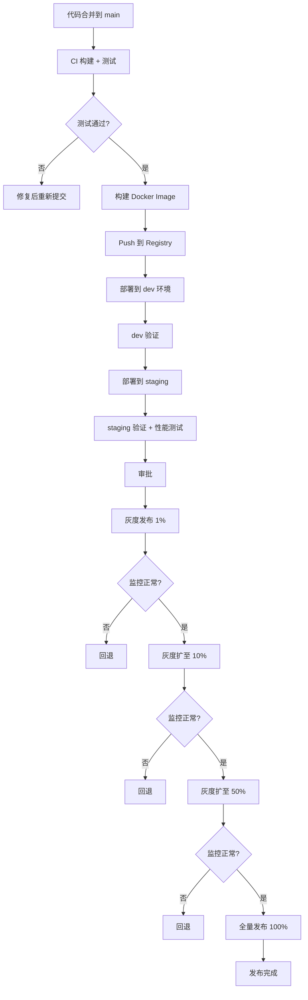

# 版本管理策略：生产交付·发版准备·切换代价·兼容性·影响范围·升降级·问题管理

> **范围**: 从工程管理视角，覆盖版本交付到生产/客户的全链路策略——发版本前准备（Release Notes/测试完备性/客户窗口）、切换代价评估、兼容性治理、影响范围控制、升降级路径设计、版本问题管理与失败记录回滚，以及 BMC 固件、互联网服务、DevOps/SRE 三类典型场景的最佳实践
> **用途**: 产品版本规划决策、生产变更风险评估、兼容性策略设计、运维 SOP 制定
> **关联**: [版本方法与兼容性方案](versioning-and-compatibility-methodology.md)（版本号方案基础）· [工程活动全景指南](engineering-activities-compass.md)（工程活动分类框架）

---

## 目录

1. [版本管理全景](#1-版本管理全景)
2. [维度一：到生产，到客户](#2-维度一到生产到客户)
3. [维度二：版本切换的代价](#3-维度二版本切换的代价)
4. [维度三：兼容性问题](#4-维度三兼容性问题)
5. [维度四：影响范围考虑](#5-维度四影响范围考虑)
6. [维度五：发版本前准备](#6-维度五发版本前准备)
7. [维度六：版本问题管理与失败记录回滚](#7-维度六版本问题管理与失败记录回滚)
8. [维度七：升降级策略与兼容性](#8-维度七升降级策略与兼容性)
9. [实践一：BMC 固件版本管理方案](#9-实践一bmc-固件版本管理方案)
10. [实践二：互联网服务版本更换方案](#10-实践二互联网服务版本更换方案)
11. [实践三：DevOps 流程与运维 SRE](#11-实践三devops-流程与运维-sre)
12. [总结：版本管理决策框架](#11-总结版本管理决策框架)

---

## 1. 版本管理全景

### 1.1 版本管理的两个层次

| 层次 | 关注点 | 代表问题 |
|:-----|:-------|:---------|
| **版本标识层** | 版本号怎么编、语义契约、兼容性声明 | 见[版本方法与兼容性方案](versioning-and-compatibility-methodology.md) |
| **版本策略层** | 版本怎么发、怎么切、怎么退、影响谁 | 本文全部内容 |

版本标识层回答"叫什么"，版本策略层回答"怎么管"。两者互补，缺一不可。

### 1.2 版本管理的七维模型

```
                    ┌─────────────┐
                    │  交付范围   │ ← 到生产？到客户？灰度？
                    │  (Delivery) │
                    └──────┬──────┘
                           │
          ┌────────────────┼────────────────┐
          ▼                ▼                ▼
   ┌────────────┐  ┌──────────────┐  ┌────────────┐
   │  切换代价  │  │  兼容性治理  │  │  影响范围  │
   │ (Cost)     │  │(Compatibility)│  │ (Scope)    │
   └────────────┘  └──────────────┘  └────────────┘
          │                │                │
          └────────────────┼────────────────┘
                           ▼
                    ┌─────────────┐
                    │  升降级策略 │
                    │(Roll/Rollback)│
                    └──────┬──────┘
                           │
          ┌────────────────┼────────────────┐
          ▼                ▼                ▼
   ┌────────────┐  ┌──────────────┐
   │  发版前准备│  │  版本问题管理│
   │(Pre-Release)│  │(Issue Mgmt) │
   └────────────┘  └──────────────┘
```

---

## 2. 维度一：到生产，到客户

### 2.1 交付通道模型

| 通道 | 接收者 | 稳定性要求 | 验证深度 | 回退窗口 |
|:-----|:-------|:-----------|:---------|:---------|
| **开发通道** (dev/nightly) | 内部开发者 | 低（可崩） | 单元测试+编译 | 无 |
| **测试通道** (test/QA) | 测试团队 | 中 | 完整功能测试 | 24h |
| **预发通道** (staging) | 内部用户/灰度客户 | 高 | 集成+性能+安全 | 实时 |
| **生产通道** (production) | 全部客户 | 极高 | 全量验证 | 严重受限 |
| **客户交付** (customer) | 特定客户 | 因合同而定 | 定制验收 | 合同约定 |

### 2.2 灰度发布策略

| 策略 | 机制 | 适用场景 | 风险等级 |
|:-----|:-----|:---------|:---------|
| **金丝雀发布** (Canary) | 小比例流量逐步放大 | 微服务、API 升级 | 低 |
| **蓝绿部署** (Blue/Green) | 两套环境瞬间切换 | 无状态服务、Web 应用 | 中（回退快） |
| **滚动更新** (Rolling) | 按节点分批升级 | 集群、K8s 工作负载 | 中 |
| **A/B 测试** | 用户分桶对比 | 功能效果验证 | 低（受控） |
| **特性开关** (Feature Flag) | 代码已部署 + 功能未激活 | 大型功能分阶段上线 | 极低 |

### 2.3 客户交付的特殊性

面向客户交付（嵌入式设备、固件、硬件）有不同于互联网服务的约束：

- **不可逆风险**：客户设备已部署，固件升级失败可能导致设备变砖
- **版本锁定**：客户可能多年不升级，需要承担历史版本维护
- **定制分支**：大客户要求专属版本，产生分支爆炸
- **验收周期长**：客户测试周期可达数周至数月
- **现场升级**：部分场景需要现场工程师操作，成本极高

---

## 3. 维度二：版本切换的代价

### 3.1 切换代价构成

| 代价类型 | 内容 | 量化维度 |
|:---------|:-----|:---------|
| **验证代价** | 回归测试、集成测试、性能基准测试 | 人天/轮次 |
| **部署代价** | 构建、打包、分发、安装、配置迁移 | 分钟/次 |
| **停服代价** | 升级期间服务不可用导致的 SLA 扣减 | 分钟 × 服务单价 |
| **回退代价** | 回退操作耗时、数据兼容性处理 | 分钟 + 风险系数 |
| **兼容代价** | 旧接口/旧格式的维护、双版本并行 | 人天/月 |
| **培训代价** | 文档更新、客户通知、运维培训 | 人天 |

### 3.2 代价评估矩阵

对每次版本切换，按三个维度打分（1-5）：

| 维度 | 1（低代价） | 3（中代价） | 5（高代价） |
|:-----|:-----------|:-----------|:-----------|
| **验证深度** | 自动化全覆盖 | 半自动 + 人工抽检 | 全人工验证 |
| **部署影响** | 无感滚动 | 分钟级中断 | 小时级停机 |
| **回退难度** | 一键回退 | 需数据转换 | 不可回退 |
| **客户影响** | 无感知 | 功能暂时降级 | 服务完全中断 |

**建议阈值**：总分 > 12 需升级审批，> 16 需技术委员会评审。

### 3.3 代价与价值的平衡

```
高代价高价值 → 战略升级，充分验证
高代价低价值 → 推迟或寻找替代方案
低代价高价值 → 尽快上线
低代价低价值 → 批量累积后一次性发布
```

---

## 4. 维度三：兼容性问题

### 4.1 兼容性分类矩阵

| 类型 | 定义 | 破坏条件 | 典型例子 |
|:-----|:-----|:---------|:---------|
| **API 兼容** | 接口签名与语义不变 | 参数增删、返回值变更、语义漂移 | REST API 字段名变化 |
| **ABI 兼容** | 二进制接口不变 | 结构体大小/偏移变化、虚表重排 | 共享库 `.so` 更新 |
| **数据兼容** | 数据格式/序列化不变 | 字段新增/类型变化/编码变化 | JSON Schema 更新 |
| **配置兼容** | 配置文件格式不变 | 键名变化、默认值改变、格式转换 | YAML 格式重排 |
| **协议兼容** | 通信协议不变 | 消息格式变化、握手流程变化 | IPMI/Redfish 命令变化 |
| **存储兼容** | 持久化存储格式不变 | 表结构变化、索引变化、编码变化 | 数据库 schema 变更 |
| **硬件兼容** | 物理接口/电气/时序不变 | 引脚定义变化、电压变化、信号时序变化 | 背板 Pin Map 修改 |

### 4.2 兼容性保证策略

| 策略 | 做法 | 代价 | 适用场景 |
|:-----|:-----|:-----|:---------|
| **前向兼容** (Forward) | 新版本兼容旧数据/旧接口 | 中 | 存储格式、通信协议 |
| **后向兼容** (Backward) | 旧版本能读新数据/调新接口 | 高 | API、库、驱动 |
| **双版本并行** | 新旧接口同时提供 | 高（维护双份） | 过渡期兼容 |
| **版本协商** | 握手阶段确定版本，按版本分叉 | 中（逻辑复杂） | 通信协议、RPC |
| **适配层** | 中间层做格式/协议转换 | 中（性能损耗） | 异构系统集成 |
| **冻结旧版本** | 旧版本不再更新但继续运行 | 低（安全风险） | 嵌入式设备 |

### 4.3 兼容性破坏的常见根因

1. **隐性依赖**：未声明的内部数据格式被外部依赖（如 `/var/run/` 路径）
2. **语义漂移**：接口签名不变但行为变（如 API 超时从 5s 改成 30s）
3. **配置的 forward compat 幻觉**：认为所有旧配置在新版都有效
4. **测试覆盖盲区**：只测了新功能，未测旧功能的回归
5. **第三方依赖升级**：底层库升级导致上层 ABI 断裂
6. **文档滞后**：接口改了但文档没更新，下游按旧文档集成

---

## 5. 维度四：影响范围考虑

### 5.1 影响范围分析框架

对每次版本发布，按以下层级分析影响：

```
影响层级
├── L0: 自身组件 → 单模块/单服务
├── L1: 直接依赖方 → 调用方、集成方
├── L2: 间接依赖方 → 依赖链上的下游
├── L3: 平台/生态 → 整个平台、插件生态
└── L4: 客户/业务 → 最终用户、业务连续性
```

### 5.2 影响范围量化表

| 维度 | 评估项 | 高危信号 |
|:-----|:-------|:---------|
| **数量** | 影响的客户/节点/服务数 | 影响面 > 全量 10% |
| **关键性** | 影响的服务是否核心链路 | 支付/登录/存储等 P0 服务 |
| **时间** | 影响持续时长 | 超过 SLA 容忍窗口 |
| **数据** | 是否涉及数据写入/迁移 | 数据格式变更无回退 |
| **合规** | 是否涉及审计/合规变更 | 日志格式变化、权限变更 |

### 5.3 影响范围控制技术

| 技术 | 原理 | 风险 |
|:-----|:-----|:-----|
| **灰度发布** | 逐步扩大影响范围 | 灰度比例设置不当 |
| **特性开关** | 代码全量部署，功能逐步开放 | 开关配置错误、开关删除遗忘 |
| **分群隔离** | 按客户等级/地域分群 | 不同群体验不一致 |
| **流量染色** | 按请求标签分流到不同版本 | 染色规则复杂 |
| **限制速率** | 控制受影响请求的速率 | 影响正常业务 |
| **熔断保护** | 自动切断对不稳定新版本的调用 | 误熔断 |

---

## 6. 维度五：发版本前准备

### 6.1 Release Notes（发布说明）

Release Notes 是版本交付的核心信息载体，直接影响客户/运维的升级决策。

**Release Notes 的标准结构**

| 模块 | 内容 | 面向受众 |
|:-----|:-----|:---------|
| **版本标识** | 版本号、发布日期、构建号、基线版本 | 所有人 |
| **变更摘要** | 一句话说明本次发布的核心目的（Bugfix / Feature / Security / Hotfix） | 决策者 |
| **新功能** | 新增功能列表 + 功能描述 + 使用说明链接 | 用户/运维 |
| **已修复问题** | 修复的 Bug 列表（含 Issue ID） | 用户/运维 |
| **已知问题** | 当前版本已知但未修复的问题 + 变通方案（Workaround） | 用户/运维 |
| **兼容性说明** | 升级前/后的兼容性变更 + 需要配合升级的组件 | 运维/集成方 |
| **升级指南** | 升级前提条件、步骤说明、预期耗时、回退方法 | 运维 |
| **安全更新** | CVE 列表 + 严重等级 | 安全团队 |
| **弃用/移除** | 已弃用功能 + 移除时间表 | 集成方 |
| **依赖变更** | 第三方依赖版本变更、最低要求 | 开发者 |

**Release Notes 的质量要求**

- **可操作**：每一条变更都应说明"这是什么"和"你需要做什么"
- **可追溯**：每一条变更都应关联 Issue ID / PR ID / Commit Hash
- **可验证**：声称修复的问题应有验证步骤
- **版本对比**：标注与上一版本的差异（diff-aware），避免每次重复全部内容
- **受众分层**：不同角色只看自己关心的部分（可考虑按角色分片）

### 6.2 测试完备性

版本发布前的测试需要覆盖多个维度，形成"测试完备性矩阵"：

| 测试类型 | 覆盖内容 | 通过标准 | 自动化程度 |
|:---------|:---------|:---------|:-----------|
| **单元测试 (UT)** | 函数级/模块级逻辑验证 | 覆盖率 ≥ 80%，全部通过 | 100% 自动化 |
| **集成测试 (IT)** | 模块间接口、数据流 | 关键路径通过 | 自动化 |
| **功能测试** | 验收需求定义的每项功能 | P0/P1 全部通过 | 自动化 + 人工 |
| **回归测试** | 已有功能不受影响 | 核心回归集通过率 100% | 自动化 |
| **压力测试** | 预期峰值 × 1.5~2 倍负载 | 无 OOM/CPU spike/超时 | 自动化 |
| **兼容性测试** | 向前/向后兼容、跨版本 | 无兼容性断裂 | 自动化 + 人工 |
| **安全测试** | CVE 扫描、渗透测试、权限 | 无高危漏洞 | 工具 + 人工 |
| **升级/降级测试** | 从 N-1/N-2 版本升级 | 成功升级 + 回退 | 自动化 |
| **长稳测试** | 长时间运行(24h~72h) | 无内存泄漏、无性能衰减 | 自动化 |
| **灾难恢复测试** | 备份恢复、故障切换 | RTO/RPO 满足要求 | 半自动 |

**测试完备性检查清单（Pre-Release Gate）**

```
□ 所有 P0 测试用例通过
□ 回归测试集通过率 ≥ 99.5%
□ 兼容性测试覆盖所有受影响的集成方
□ 升级/降级测试至少覆盖 N-1 和 N-2
□ 安全扫描无高危/严重漏洞
□ 性能基线无退化（或退化有合理解释）
□ 长稳测试运行 ≥ 24h 无异常
□ 测试报告已归档并关联版本号
```

**测试充分性的判断原则**

- **绿线原则**：核心功能的自动化测试覆盖率达到"安全线"，低于此线暂停发布
- **回归等价类**：每次代码变更对应的回归测试集不能小于等价类分析的结果
- **缺陷逃逸率**：追踪每个版本上线后发现的线上缺陷数量，持续改进测试质量
- **测试环境逼真度**：staging 环境与 prod 环境的差异越小，测试结果越可信

### 6.3 客户的窗口

版本发布到客户并非随时可发，需要考虑客户的业务窗口：

| 窗口类型 | 说明 | 影响策略 |
|:---------|:-----|:---------|
| **业务低峰期** | 客户业务流量最低的时段（如凌晨 2-6 点） | 升级窗口优先选择低峰期 |
| **维护窗口** | 合同约定的可中断服务时段（通常按月/季规划） | 需提前在维护窗口内申请 |
| **冻结期** | 客户业务高峰期禁止变更（如双十一、财报季、年终结算） | 冻结期内只发紧急安全补丁 |
| **合规窗口** | 监管要求的窗口期（如上市前、审计期间） | 合规窗口内限制变更频率 |
| **验收周期** | 客户测试验收需要的时间（通常 2-4 周） | 发货前预留充足的验收时间 |

**客户窗口管理的三个原则**

1. **提前通知**：至少提前 1-2 个维护窗口周期通知客户版本变更计划
2. **可选窗口**：给客户多个版本升级窗口选项（如 T+30 / T+60 / T+90）
3. **紧急通道**：为安全/严重 Bugfix 保留紧急发布通道，不受常规窗口限制

**多客户场景下的版本窗口协调**

```
客户 A（金融行业） → 维护窗口：每月第1个周日 02:00-06:00
客户 B（互联网） → 维护窗口：每周三凌晨 03:00-05:00
客户 C（运营商） → 维护窗口：季度窗口（提前 30 天申请）

策略：
 - 常规版本：按最严格的客户窗口统一发布
 - 紧急修复：通过紧急通道单独推送给有需求的客户
 - 客户分群：按行业/地域分群管理，错峰发布
```

---

## 7. 维度六：版本问题管理与失败记录回滚

### 7.1 版本问题管理概述

版本发布后，问题管理是确保版本健康度的持续活动。版本问题不是"发现即修复"的简单循环，而是需要系统化管理：

| 阶段 | 活动 | 产出 |
|:-----|:-----|:-----|
| **问题发现** | 监控告警、客户反馈、测试发现、安全报告 | 问题 Ticket |
| **问题分类** | 严重级别（P0-P4）、影响范围、根因类型 | 分类标签 |
| **问题定级** | 基于影响面 × 紧急度确定优先级 | 优先级矩阵 |
| **问题定位** | 根因分析（RCA）、复现条件、影响确认 | RCA 报告 |
| **修复决策** | 当前版本修复 / 下个版本修复 / 延期 / 不回修 | 修复计划 |
| **修复验证** | 单元测试 + 集成测试 + 回归测试 | 验证通过 |
| **发布决策** | Hotfix 通道 / 常规发布 / 累积发布 | 发布计划 |
| **关闭验证** | 客户/运维确认修复有效 | 关闭 Ticket |

### 7.2 版本问题分类与优先级矩阵

**按严重级别分类**

| 级别 | 定义 | 响应时间 | 修复策略 |
|:-----|:-----|:---------|:---------|
| **P0（灾难）** | 服务完全不可用、数据丢失、安全严重漏洞 | ≤ 30min | 立即修复，紧急 Hotfix 通道 |
| **P1（严重）** | 核心功能不可用、性能严重退化、大批量客户受影响 | ≤ 2h | 当天热修复或回退 |
| **P2（一般）** | 非核心功能异常、小批量客户受影响、有 workaround | ≤ 24h | 当前迭代修复 |
| **P3（轻微）** | 功能异常但影响极轻微、UI 问题、文档错误 | ≤ 1周 | 下个迭代修复 |
| **P4（建议）** | 优化建议、需求改进 | 无时限 | 纳入未来版本规划 |

**按影响面分类**

| 分类 | 判定条件 |
|:-----|:---------|
| **安全漏洞** | CVE 编号、漏洞评分 CVSS |
| **功能回归** | 已验证的功能在新版本中失效 |
| **兼容性断裂** | 升级后依赖方无法正常工作 |
| **性能退化** | 延迟/吞吐量退化超过容忍阈值 |
| **稳定性问题** | 无故重启、Crash、OOM、挂死 |
| **数据正确性** | 数据计算/存储/传输结果错误 |
| **可用性问题** | 功能可用但用户体验下降 |

### 7.3 失败操作的记录

每次版本发布/升级/回退操作，都应产生可审计的操作记录：

**操作记录的结构**

```json
{
 "operation_id": "UPG-20260630-001", // 全局唯一操作 ID
 "version": {
 "from": "2.16.3", // 升级前版本
 "to": "2.18.0", // 升级目标版本
 "actual": "2.18.0" // 实际结果版本（成功填目标，失败填实际）
 },
 "scope": {
 "targets": ["host01", "host02"], // 操作目标
 "total": 50, // 目标总数
 "success": 48, // 成功数
 "failed": 2 // 失败数
 },
 "timeline": [
 {"t": "2026-06-30T02:00:00Z", "event": "start"},
 {"t": "2026-06-30T02:15:30Z", "event": "host01_complete"},
 {"t": "2026-06-30T02:16:45Z", "event": "host02_failed", "reason": "checksum_mismatch"}
 ],
 "result": "partial_failure", // success / failure / partial_failure
 "rollback": {
 "triggered": true, // 是否触发回退
 "rollback_version": "2.16.3", // 回退到的版本
 "rollback_result": "success", // 回退结果
 "rollback_time": "00:03:45" // 回退耗时
 },
 "audit": {
 "operator": "sre_auto", // 操作者（人或自动化系统）
 "approval_ticket": "CHG-20260630-005", // 变更审批单号
 "reason": "scheduled_upgrade" // 操作原因
 }
}
```

**操作记录的存储与查询要求**

- **持久化存储**：操作记录写入不可变的审计日志系统（如 ELK / Splunk / 数据库）
- **可查询**：支持按时间、版本、目标、操作人、结果状态多维查询
- **可关联**：操作 ID 关联到变更审批单、监控告警、问题 Ticket
- **不可篡改**：审计日志应设为 append-only，防止事后修改
- **保留期限**：至少保留 2 年以上（合规要求通常 3-5 年）

### 7.4 失败模式的记录与分类

每次版本操作失败，应记录：

| 失败模式 | 典型场景 | 记录关键字段 |
|:---------|:---------|:-------------|
| **预检查失败** | 硬件不兼容、依赖版本不符、磁盘空间不足 | 检查项名称、预期值、实际值 |
| **下载失败** | 网络中断、镜像损坏、签名校验失败 | 下载源 URL、校验值、错误码 |
| **安装失败** | 写入 Flash 失败、依赖包缺失 | 失败步骤、错误码、设备状态 |
| **自检失败** | 升级后 POST 失败、服务未启动 | 自检项、超时时间、输出日志 |
| **功能验证失败** | 升级后核心 API 不可用、数据异常 | 验证命令、预期输出、实际输出 |
| **超时** | 操作超过预期时间窗口 | 超时阈值、实际耗时、当前状态 |
| **回退失败** | 回退过程中发生新的故障 | 回退步骤、失败原因、建议人工干预 |

### 7.5 回滚能力的设计与验证

**回滚能力的分级**

| 等级 | 能力 | 验证方式 |
|:-----|:-----|:---------|
| **L1 有回滚方案** | 回滚方案写在文档中，未实际验证 | 人工审查 |
| **L2 回滚已验证** | 回滚方案在 staging 验证过至少一次 | 定期演练（每季度） |
| **L3 回滚可自动化** | 回滚可一键触发，无需人工干预 | 自动化测试 |
| **L4 回滚自动决策** | 异常检测自动触发回滚 | 熔断测试 |
| **L5 零数据丢失回滚** | 回滚后数据完整，无需人工修复 | 数据一致性验证 |

**回滚能力的验证清单**

```
□ 回滚操作文档是否完整且最新？
□ 回滚后的数据一致性是否已验证？
□ 回滚失败时的应急方案是什么？
□ 回滚操作是否有人员培训？
□ 回滚时间是否在 SLA 容忍范围内？
□ 是否定期执行回滚演练？
□ 回滚演练结果是否有记录和改进跟踪？
```

**回滚演练（Game Day）**

定期执行回滚演练是验证回滚能力的唯一可靠方式：

```
回滚演练流程:
1. 选择场景 → 选定一个历史版本或模拟故障
2. 准备环境 → 克隆生产数据/流量到 staging
3. 执行升级 → 模拟正常版本升级流程
4. 触发故障 → 模拟升级失败或新版本异常
5. 执行回滚 → 按照回滚方案执行
6. 验证结果 → 检查数据一致性、服务可用性、监控指标
7. 记录改进 → 回滚方案中不完善的地方更新文档
8. 复盘 → 回滚演练报告 + 改进计划

演练频率建议:
 - 关键系统：每月 1 次
 - 常规系统：每季度 1 次
 - 新系统/首次发布：上线前必须演练
```

### 7.6 版本问题跟踪与改进闭环

| 阶段 | 活动 | 输出 |
|:-----|:-----|:-----|
| **问题记录** | 创建 Ticket，包含版本号、环境、复现步骤、影响范围 | Issue Ticket |
| **根因分析** | 5Why / 鱼骨图 / FTA 方法定位根因 | RCA 文档 |
| **修复方案** | 确定修复方式（代码/配置/文档），评估影响 | 修复 PR |
| **修复验证** | 验证修复有效，回归测试通过 | 测试报告 |
| **部署跟踪** | 修复版本部署后持续监控 48h | 监控报告 |
| **事后再现预防** | 增加测试用例、完善监控、改进流程 | 预防措施 |
| **成本度量** | 记录故障时长、影响范围、处理成本 | 故障成本报告 |

**版本问题的数据度量**

| 指标 | 定义 | 目标 |
|:-----|:-----|:-----|
| **MTTD** (Mean Time to Detect) | 从故障发生到发现的平均时间 | < 5min |
| **MTTR** (Mean Time to Repair) | 从发现到修复完成的平均时间 | < 30min |
| **缺陷逃逸率** | 上线后发现的缺陷数 / 总缺陷数 | < 5% |
| **回滚率** | 版本升级后触发回滚的比率 | < 1% |
| **重新打开率** | 修复后再次出现的问题比率 | < 2% |

---

## 8. 维度七：升降级策略与兼容性

### 8.1 升级策略

| 策略 | 流程 | 适用场景 | 典型工具 |
|:-----|:-----|:---------|:---------|
| **直接升级** | v1 → v2 一步到位 | 兼容性保证充分、影响范围小 | apt upgrade, pip install |
| **滚动升级** | 按节点/分区依次升级 | 集群、分布式系统 | K8s RollingUpdate |
| **金丝雀升级** | 先小比例升级验证 | 高风险变更 | istio, Flagger |
| **蓝绿升级** | 新环境部署后切换流量 | 无状态服务 | 负载均衡器切换 |
| **分阶段升级** | v1 → v1.1 → v1.2 → v2 | 大数据量/大变更 | 数据库迁移 |

### 8.2 降级策略

| 策略 | 条件 | 风险 |
|:-----|:------|:-----|
| **应用层回退** | 切换回旧版本代码 | 旧版本可能有已知 bug |
| **数据层回退** | 回滚数据到快照/备份 | 丢失升级期间的数据 |
| **功能降级** | 关闭新功能，保留旧逻辑 | 用户感知功能缺失 |
| **版本冻结** | 锁定为当前版本不再升级 | 错过安全/功能更新 |

### 8.3 升降级的兼容性陷阱

| 场景 | 问题 | 案例 |
|:-----|:-----|:------|
| **前向兼容不充分** | 升级后旧数据无法读取 | 数据库 schema 变更后旧条目失效 |
| **降级后数据残留** | 回退后新版本写入的数据旧版本无法处理 | 新字段写入后被旧版本忽略时数据丢失 |
| **双写不一致** | 同时写新旧两种格式导致不一致 | 双版本并行写入时数据混乱 |
| **状态机漂移** | 升级后状态机多了一个状态，回退后无法映射 | 升级中发生的状态回退后不识别 |
| **依赖升级回退** | 底层依赖已升级无法回退 | 操作系统升级后无法降级内核 |

### 8.4 升降级安全设计原则

1. **可回退是必选项**：任何版本升级必须有对应的回退方案
2. **数据兼容双向设计**：不仅要考虑 v1→v2 时数据转换，还要考虑 v2→v1 的逆向转换
3. **状态不可逆标记**：对不可逆的操作（如数据迁移）设置锁标记，禁止重复执行
4. **版本戳验证**：数据/消息/配置中带版本戳，运行时做兼容性检查
5. **降级回滚演练**：定期演练降级场景，避免纸上谈兵

---

## 9. 实践一：BMC 固件版本管理方案

### 9.1 BMC 固件版本管理的特殊性

| 特性 | 描述 | 管理挑战 |
|:-----|:-----|:---------|
| **嵌入式系统** | 资源受限、升级过程脆弱 | 升级中断可能导致设备变砖 |
| **长时间运行** | 服务器生命周期 5-8 年 | 需支撑超长版本维护 |
| **OTA/现场升级** | 远程或现场两种方式 | 远程失败后需现场干预 |
| **硬件绑定** | BMC 固件与主板版本强相关 | 升级前需验证硬件兼容性 |
| **多芯片联动** | BMC + BIOS + CPLD + HPM 固件需协同 | 版本依赖矩阵复杂 |
| **带外管理** | 升级通道独立于业务网络 | 安全隔离增加运维复杂度 |

### 9.2 典型 BMC 固件版本架构

```
BMC 固件版本 2.18.0
├── Kernel (Linux kernel 6.6.y) ← 独立版本
├── RootFS (OpenBMC distro) ← 独立版本
├── WebUI (前端界面) ← 独立版本
├── REST API (Redfish/BMCWeb) ← 版本化接口
├── IPMI (IPMI 2.0 firmware) ← 协议版本
├── CPLD (CPLD logic update) ← 单独二进制
├── BIOS (UEFI BIOS) ← 单独二进制
├── HPM (Custom FPGA/CPLD) ← 单独二进制
└── Device Tree (硬件描述) ← 板级配置
```

### 9.3 BMC 固件升级策略

| 策略 | 做法 | 优缺点 |
|:-----|:-----|:-------|
| **双镜像 (Dual Image)** | A/B 分区，升级失败的自动回退 | ✅ 安全可靠 ❌ 占用双倍 Flash |
| **滚动升级机架** | 机架内逐台 BMC 升级 | ✅ 不影响集群 ❌ 时间长 |
| **金丝雀节点** | 先升级一台验证后再批量 | ✅ 降低风险 ❌ 需要自动化编排 |
| **固件签名验证** | 升级前校验签名和完整性 | ✅ 防篡改 ❌ 增加升级流程 |
| **依赖检查** | 升级前验证硬件/FW 兼容矩阵 | ✅ 防不兼容 ❌ 维护矩阵成本高 |

**推荐做法**：双镜像 + 金丝雀验证 + 签名校验，三者组合使用。

### 9.4 BMC 固件版本兼容性矩阵示例

| BMC 版本 | 最低 BIOS | 最低 CPLD | 支持硬件 Rev | 兼容 OpenBMC 上游 |
|:---------|:----------|:----------|:-------------|:-----------------|
| 2.16.x | 1.2.0 | 0.4 | Rev A/B/C | 2.14+ |
| 2.17.x | 1.3.0 | 0.5 | Rev A/B/C/D | 2.15+ |
| 2.18.x | 1.4.0 | 0.6 | Rev C/D/E | 2.16+ |
| 3.0.0 (大版本) | 2.0.0 | 1.0 | Rev D/E/F | 3.0+（断裂）|

**关键规则**：
- BMC 大版本升级（MAJOR 变更）:: 硬件兼容性可能断裂，需验证
- BMC 小版本升级（MINOR 变更）:: 保持后向兼容
- BIOS 和 BMC 需同步升级 :: 版本组合在兼容矩阵内验证

### 9.5 升降级流程

```
升级流程:
1. 预检查 → 硬件版本验证 + 兼容矩阵检查 + 当前状态检查
2. 下载 + 校验 → MD5/SHA256 + 签名验证
3. 写入备用分区 → write to inactive bank
4. 完整性校验 → flash 后校验
5. 切换激活 → reboot to new bank
6. 自检 → POST check + sensor monitoring
7. 验证 → API 可用性 + 功能完整性
8. 提交 → 更新成功标记（如失败自动回退）

回退流程:
1. 触发回退 → 手动或自动（自检失败）
2. 切换备用分区 → 切换到 old bank
3. 重启 → reboot
4. 自检 → 验证旧版本正常
5. 标记 → 记录回退原因
```

---

## 10. 实践二：互联网服务版本更换方案

### 10.1 互联网服务版本管理特点

| 特点 | 与传统软件差异 |
|:-----|:--------------|
| **持续交付** | 版本发布频率高（天/周级） |
| **无感升级** | 通过负载均衡实现用户无感知 |
| **灰度能力** | 精细化流量控制、A/B 实验 |
| **监控完备** | 全链路监控、自动回退 |
| **多环境** | dev/test/staging/prod 多环境体系 |
| **基础设施即代码** | 版本管理延伸到 IaC |

### 10.2 典型互联网版本管理架构

```
代码仓库
 │
 ├── CI (持续集成)
 │ ├── 单元测试
 │ ├── 代码扫描
 │ └── 构建 artifact
 │
 ├── 制品仓库 (Artifact Registry)
 │ ├── Docker Image (tag: git-sha / semver)
 │ ├── Helm Chart (版本化)
 │ └── Binary Package
 │
 ├── CD (持续交付)
 │ ├── dev → 自动部署
 │ ├── test → 自动部署 + 集成测试
 │ ├── staging → 手工触发 + 预发布验证
 │ └── production → 审批 + 灰度发布
 │
 └── 发布管理
 ├── 版本号：git-sha 为主，SemVer 为辅
 ├── Changelog：自动生成
 ├── 灰度策略：金丝雀/蓝绿/滚动
 └── 回退策略：一键回退到前一个稳定版本
```

### 10.3 互联网版本发布流程



### 10.4 版本回退策略

| 场景 | 回退方式 | 注意事项 |
|:-----|:---------|:---------|
| **蓝绿部署** | 切换回旧环境 LB | 确保旧环境还在运行 |
| **滚动更新** | K8s rollout undo | 旧版本 Pod 正常启动 |
| **金丝雀发布** | 调整流量 100%→0% | 新版本数据是否已写入 |
| **数据库变更** | 需考虑数据 schema 回退 | 只追加不回退原则 |

### 10.5 数据库 schema 版本管理

数据库版本管理是互联网服务中最复杂的部分之一：

| 策略 | 做法 | 风险 |
|:-----|:-----|:------|
| **只追加** (Additive) | 只加列/表，不改/删 | 安全但表结构膨胀 |
| **兼容过渡** | v1 和 v2 schema 同时支持 | 代码复杂，性能下降 |
| **版本化迁移** | Flyway/Liquibase 管理迁移脚本 | 回退需额外编写反向脚本 |
| **Schema on Read** | 读时解析 schema 差异 | 查询性能受影响 |

**铁律**：数据库变更必须遵循"只追加、不修改、不删除"原则，确保版本回退时数据不丢失。

---

## 11. 实践三：DevOps 流程与运维 SRE

### 11.1 DevOps 中的版本管理

DevOps 将版本管理从"发版日事件"变为"持续事件"：

| DevOps 阶段 | 版本管理活动 | 工具链 |
|:------------|:-------------|:-------|
| **Plan** | 版本规划、特性拆分、发布计划 | Jira, Linear |
| **Code** | 分支策略（GitFlow/Trunk Based） | Git |
| **Build** | 版本号注入、Build ID 生成 | CI (Jenkins, GitHub Actions) |
| **Test** | 版本兼容性测试、回归测试 | 自动化测试框架 |
| **Release** | 制品版本化、Changelog 生成 | Artifactory, Harbor |
| **Deploy** | 环境版本映射、灰度策略 | ArgoCD, Spinnaker |
| **Operate** | 运行版本监控、合规检查 | Prometheus, Grafana |
| **Monitor** | 版本发布后的 SLO/SLI 监控 | Datadog, New Relic |

### 11.2 SRE 视角的版本管理

SRE（Site Reliability Engineering）将版本管理与可靠性目标绑定：

| SRE 原则 | 对版本管理的要求 |
|:---------|:----------------|
| **错误预算** | 发布导致的错误消耗错误预算，超预算暂停发布 |
| **SLO 基线与版本绑定** | 每个版本定义预期的 SLO，发布后对比偏差 |
| **渐进式发布** | 超出错误预算自动回滚 |
| **变更速率限制** | 控制单位时间内的发布次数和影响范围 |
| **故障演练** | 定期演练版本回退、数据恢复 |

### 11.3 版本发布指挥室（War Room）流程

对于重大版本发布，SRE 团队通常建立：

```
发布前（Pre-Release）
├── 变更评审 (Change Review Board)
│ ├── 兼容性检查
│ ├── 影响范围评估
│ ├── 回退方案评审
│ └── 审批
├── 性能基线建立
├── 回退演练
└── 通知相关方

发布中（During Release）
├── 灰度分步执行
├── 实时监控面板
├── 熔断机制（异常自动暂停）
└── 决策会议（发布经理 + SRE On-Call）

发布后（Post-Release）
├── 稳定性观察期（24-72h）
├── 版本锁定（观察期内不发布新版本）
├── 事后复盘（Postmortem）
└── 回顾改进
```

### 11.4 多环境版本一致性

| 环境 | 版本策略 | 一致性要求 |
|:-----|:---------|:-----------|
| **开发 (dev)** | 最新代码 + feature flag | 不要求 |
| **测试 (test)** | 待发布的候选版本 | 与 staging 一致 |
| **预发 (staging)** | 与生产同版本、同配置 | 与生产一致 |
| **生产 (prod)** | 经过验证的稳定版本 | — |
| **灾备 (DR)** | 与生产版本一致或有延迟 | 最多落后 1 个小版本 |

**关键原则**：staging 环境必须与生产环境在版本、配置、数据规模上尽可能一致，否则 staging 验证的结果不可信。

---

## 11. 总结：版本管理决策框架

### 11.1 七个维度的决策检查清单

每次版本发布前，逐条检查：

**□ 到生产，到客户**
- 发布范围：内测 / 灰度 / 全量 / 客户定制？
- 发布通道：开发 / 测试 / 预发 / 生产 / 客户？
- 客户是否需配合升级？

**□ 发版本前准备**
- Release Notes 是否完整、准确、面向受众？
- 测试完备性：UT 覆盖率、集成测试、压力测试、兼容性测试是否通过？
- 客户窗口是否对齐？是否存在客户业务高峰期、维护窗口冲突？
- 预发布验证（staging）是否完成？

**□ 版本切换的代价**
- 验证代价：___ 人天
- 部署代价：___ 分钟
- 停服代价：___ 分钟 × ___ 服务等级
- 总代价评分：___/20

**□ 兼容性问题**
- API/ABI/数据/配置/协议/存储/硬件兼容性逐一检查
- 兼容性破坏是否可控？
- 是否有兼容性文档/契约？

**□ 影响范围**
- 影响层级：L0 / L1 / L2 / L3 / L4
- 影响客户/节点数：___
- 是否涉及核心链路？
- 是否涉及数据变更？

**□ 升降级策略**
- 升级方案是否通过验证？
- 回退方案是否准备就绪？
- 数据兼容双向设计是否完成？
- 降级演练是否执行过？

**□ 版本问题管理**
- 已知问题清单是否已记录并分类？
- 失败操作是否有完整日志和审计追踪？
- 回滚能力是否已验证可用？
- 问题跟踪系统是否已挂钩？

### 11.2 版本管理成熟度模型

| 等级 | 特征 | 典型表现 |
|:-----|:-----|:---------|
| **L1 初始** | 手动发布，无版本规范 | 发布靠运维手动操作，回退靠经验 |
| **L2 标准化** | 有版本号规范，有发布流程 | 固定的版本号方案 + 发布 checklist |
| **L3 可度量** | 灰度发布 + 自动回退 + 监控 | 基本的灰度能力和自动回退 |
| **L4 自动化** | CI/CD + 自动化验证 + 全链路监控 | 一键发布 + 自动验证 + 自动回退 |
| **L5 智能化** | 基于风险模型的自动决策 | 根据影响范围评估自动选择发布策略 |

---

## 参考文献

1. OpenBMC: [Firmware Update Management](https://github.com/openbmc/docs/blob/master/architecture/firmware-update.md) — Redfish 固件更新规范
2. Google SRE Book: Chapter 14 — Managing Critical State with Distributed Consensus
3. AWS: [Deploying Software on AWS](https://docs.aws.amazon.com/wellarchitected/latest/reliability-pillar/deploy-software.html) — 蓝绿/滚动/金丝雀部署最佳实践
4. Kubernetes: [Rolling Update](https://kubernetes.io/docs/tutorials/kubernetes-basics/update/update-intro/) — Deployment 滚动更新策略
5. SemVer: [Semantic Versioning 2.0.0](https://semver.org/) — 版本号语义规范
6. Flyway: [Database Migrations](https://www.red-gate.com/products/flyway/) — 版本化数据库迁移
7. Netflix: [Canary Release](https://netflixtechblog.com/tagged/canary) — 金丝雀发布实践
8. DMTF: [Redfish Specification](https://www.dmtf.org/standards/redfish) — 固件更新 Resource 定义 (SimpleUpdate)
