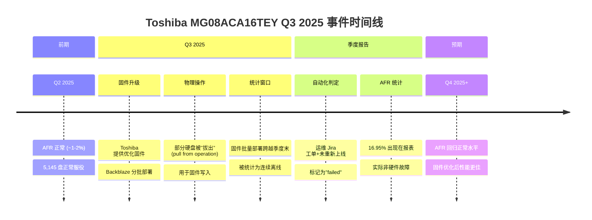

# 📊 Backblaze 2025 HDD 故障判定方法论演进与 Q3 专题报告

> **创建**: 2026-06-17 | **数据截止**: 2025 Q3 (2025-11-11 发布) | **规模**: 328,348 数据盘 | **来源**: Backblaze Drive Stats 官方博客
> **关联**: [大规模实证数据](large-scale-empirical-data.md) | [诊断项目汇编](diagnostic-projects-survey.md) | [ROI 量化分析](diagnostic-roi-analysis.md)
> **核心主题**: "What does it really mean for a hard drive to fail?"

---

## 一、核心发现：一次统计方法论引发的"哲学危机"

### 1.1 Q3 2025 的异常信号

2025 年 Q3，Backblaze 的 Drive Stats 报告出现了罕见的**统计异常**：

> **季度 AFR 从 Q2 的 1.36% 跃升至 1.55% (+14%)**

这本身不是重点——更引人注目的是**极端异常值**的出现：

| 硬盘型号 | 季度 AFR | 是否异常值 (Tukey法) | 平均年龄 | 盘数 |
|:---------|:--------:|:--------------------:|:--------:|:----:|
| Toshiba MG08ACA16TEY (16TB) | **16.95%** | ✅ 异常 | 44.61月 | 5,145 |
| Seagate ST10000NM0086 (10TB) | 7.97% | ✅ 异常 | 92.35月 | 1,018 |
| Seagate ST14000NM0138 (14TB) | 6.86% | ✅ 异常 | 56.57月 | 1,286 |
| 其他 24 个型号 (正常范围) | 0%~5.88% | ❌ 正常 | 各异 | 各异 |

### 1.2 Toshiba MG08ACA16TEY 的 16.95% AFR 真相

**这不是硬件故障。** 这是固件升级运维操作触发的统计假象。

#### 完整事件还原



#### Backblaze 官方的直接说明

> *"This past quarter, working with Toshiba, we deployed some firmware updates they provided to optimize performance on these drives. Because we needed to pull drives to achieve this in some cases, we had an abnormal number of 'failed' drives in this population."*
>
> *"What that means for this drive is that it's actually not a bad drive model; and, given the ways we and Toshiba have worked together on a fix, we should see failure rates normalizing in the near future."*
>
> *"In short, don't sweat the spike and pay attention to the long arc of performance on this population. We expect to see those drives happy and spinning for years to come (and with better performance, too)."*

#### 核心教训

> **SMART 数据必须与运维日志交叉验证，否则可能对硬件可靠性做出严重误判。**

| 统计值 | 原始统计 | 真实硬件可靠性 |
|:-------|:--------:|:--------------:|
| AFR | 16.95% (异常) | ~1-2% (正常) |
| 偏差倍数 | **~10×** | — |
| 判断 | ❌ "糟糕的硬盘" | ✅ "需要数据清洗的统计假象" |

---

## 二、故障判定方法论的演进

### 2.1 当前判定规则 (2025)

#### 自动化 SQL 判定逻辑

```sql
-- Backblaze 的故障判定本质逻辑（概念版，非真实 SQL）
-- 输入：季度末数据快照 + 运维工单三张表

-- 规则 1: 季度末仍在报告 → 未故障
IF drive.last_report_date >= quarter_end_date
    THEN status = 'ALIVE'

-- 规则 2: 出现在运维工单中 → 故障（有例外）
IF drive.serial IN (SELECT serial FROM jira_replacements)
    THEN status = 'FAILED'

-- 规则 3: 在替换工单被作为目标 → 未故障
IF drive.serial IN (SELECT target_serial FROM jira_clones)
    THEN status = 'NOT_FAILED'

-- 规则 4: 季度结束前未重新上线 → 故障
IF drive.last_report_date < quarter_end_date
   AND drive.serial NOT IN alive_drives
    THEN status = 'FAILED'
```

#### 人工干预的例外

Backblaze 维护三张人工维护的表格，用于处理边缘案例：
1. **替换工单表** (Jira Replacements) — 主故障标记
2. **克隆工单表** (Jira Clones) — 标记被替换的目标盘 → **不算故障**
3. **临时替换工单表** (Temp Replacements) — 标记临时替换盘 → **不算故障**

### 2.2 早期方法的限制

> 早期 Backblaze 的故障判定**依赖人工交叉核对运维工单**。
>
> 当前版本已**自动化**——后端 SQL 查询 + 三张人工维护的 Jira 工单表交叉引用。

这种演进反映了：

```
早期 (2013-2019): 人工核对
  人力密集 → 可扩展性差 → 易出错

过渡期 (2019-2023): 部分自动化
  SQL 查询 + 人工审核 → 提升效率但仍需人工

当前 (2024-2025): 全自动化+例外处理
  自动化 SQL + 三张人工维护表 → 兼顾效率与灵活性
```

### 2.3 "故障"的定义困境

Backblaze 团队在 Q3 2025 报告中坦诚地提出了这个哲学问题：

> *"What does it really mean for a hard drive to fail? Is it the moment the lights go out, or the moment we decide they have? Philosophers might call that an ontological gray area. We just call it Q3."*

#### 故障定义的三个层次

| 层次 | 定义 | 示例 | 对诊断的影响 |
|:-----|:-----|:-----|:------------|
| **物理故障** | 硬件物理损坏，无法修复 | 磁头损坏、碟片划伤 | 需要硬件替换 |
| **逻辑故障** | 固件/软件问题导致不可用 | 固件 Bug、FTL 损坏 | 可通过修复恢复 |
| **运维故障** | 运维操作导致临时离线 | 固件升级拔出、机房迁移 | **不是真正的故障** |

#### Backblaze 的统计定义"

> *"A failure in Drive Stats occurs when a drive vanishes out of the reporting population. It is considered 'failed' until it shows up again."*

这个定义的局限在于：
- ❌ 无法区分**运维操作**和**物理故障**
- ❌ 临时离线（如松散线缆）和永久故障待遇相同
- ❌ 跨季度运维操作导致**"cosmetic failures"**（表层假故障）

---

## 三、Q3 2025 完整统计表

### 3.1 季度统计总览

| 统计项 | Q3 2025 | Q2 2025 | 同比变化 |
|:-------|:-------:|:-------:|:--------:|
| 数据盘总数 | **328,348** | 332,915¹ | -1.4% |
| 季度失败数 | 1,395² | ~1,150 | +21% |
| **季度 AFR** | **1.55%** | 1.36% | **+0.19pp (+14%)** |
| 2025 全年累计 AFR | 1.36%³ | — | 对比 2024: 1.57% |
| 累计寿命 AFR | 1.31% | 1.30% | +0.01pp |
| "零故障俱乐部"成员 | **4 个型号** | 5 个型号 | — |
| 24TB+ 驱动器数 | 67,939+2,400 | ~60,000 | +17% |

> ¹ Q2 总盘数包含约 3,970 启动盘，Q3 启动盘数未单独披露
> ² 含异常值影响，剔除后约为 1,150-1,200
> ³ Q1+Q2+Q3 的累计年化

### 3.2 零故障俱乐部

| 型号 | 容量 | 盘数 | 备注 |
|:-----|:----:|:----:|:-----|
| Seagate HMS5C4040BLE640 | 4TB | 少量 | 即将退役 |
| Seagate ST8000NM000A | 8TB | 大量 | 上次故障: Q3 2024 |
| Toshiba MG09ACA16TE | 16TB | 大量 | 稳定表现 |
| **Toshiba MG11ACA24TE** | **24TB** | **2,400** | **新入池，首个季度** |

### 3.3 大容量驱动器占比

| 容量 | 盘数 | 占比 |
|:-----|:----:|:----:|
| <10TB | 少量 | <5% |
| 10TB-16TB | 大量 | ~50% |
| 20TB+ | **67,939** | **~21%** |
| 24TB (MG11ACA24TE) | 2,400 (新增) | <1% |

> 大容量(20TB+)驱动器占比已达 21%，按此趋势 2026 年将突破 30%

---

## 四、与可靠性诊断的关联分析

### 4.1 对 HDD 故障预测的直接启示

| 教训 | 对诊断系统的要求 | 实现方案 |
|:-----|:----------------|:---------|
| **运维操作干扰** | 诊断系统需融合运维工单数据 | 接入 Jira/ServiceNow 等 IT 系统 API |
| **SMART 数据的统计盲区** | 不可单独依赖 SMART Push 判断 | 加入"在线/离线"模式标记 |
| **跨季度操作** | 统计需跨越运维操作持续期 | 按**运维事件会话**而非日历季度划分 |
| **固件升级影响** | 固件版本变更需纳入特征 | 记录固件版本时间线与故障标记对应 |
| **"假故障"的去除** | 需主动标记已知运维操作 | 运维操作期间数据附加标签 |

### 4.2 异常值检测的必要性

Backblaze Q3 使用了 **Tukey 四分位法** 识别异常值：

```
异常值阈值 = Q3 + 1.5 × IQR
          = 5.88% (本季度)

超出型号:
  - Toshiba MG08ACA16TEY: 16.95% → 阈值 2.88×
  - Seagate ST10000NM0086: 7.97% → 阈值 1.36×
  - Seagate ST14000NM0138: 6.86% → 阈值 1.17×
```

**诊断启示**：大规模系统的故障率异常值必须区分：
1. ✅ 真实硬件问题（Seagate 10TB：老化的确真实）
2. ✅ 运维干扰（Toshiba 16TB：固件升级的统计假象）
3. ✅ 样本偏差（Seagate 14TB：盘数少+历史偏高）

### 4.3 与 Meta Llama 3 训练可靠性的交叉验证

| 维度 | Backblaze 教训 | Meta Llama 3 经验 | 共同结论 |
|:-----|:--------------|:------------------|:---------|
| 运维干扰 | 固件升级导致 16.95% 假故障 | 419 次中断仅 3 次需人工 | **自动化区分运维 vs 故障** 是前提 |
| 数据清洗 | 需 Jira 工单交叉验证 | NCCL Flight Recorder 自动记录 | **多源数据融合**消除误判 |
| 可用性统计 | AFR 含"cosmetic failures" | 有效训练时间 >90% | **净可用性** 才是关键指标 |

---

## 五、历史趋势：Backblaze AFR 十年演变

### 5.1 年度 AFR 变化 (2013-2025)

| 年份 | AFR | 关键事件 |
|:----:|:---:|:---------|
| **2013** | ~3.5% | 早期 Storage Pod，4TB 为主 |
| **2014** | ~3.0% | 硬盘规模扩张 |
| **2015** | ~2.5% | 引入 HGST 盘（可靠性改善） |
| **2016** | ~2.0% | 代际更替 |
| **2017** | ~1.8% | 规模突破 10 万盘 |
| **2018** | ~1.6% | 10TB+ 大容量盘占比提升 |
| **2019** | ~1.5% | HDD 整体可靠性趋于稳定 |
| **2020** | ~1.2% | 最低点，HDD 技术成熟 |
| **2021** | ~1.3% | 疫情期数据增长 |
| **2022** | ~1.4% | 大容量盘 (16TB+) 加速部署 |
| **2023** | ~1.5% | 持续稳定 |
| **2024** | **1.57%** | 回升，可能与大规模退役/更换有关 |
| **2025 (Q1-Q3)** | **1.36%** | 相较 2024 回落 |

### 5.2 关键趋势解读

```
AFR 长期趋势:
  2013 ─── 3.5% ─── 早期，存量大，4TB 主力
            ↘
  2020 ─── 1.2% ─── 低点，HDD 技术成熟
            ↗
  2024 ─── 1.57% ── 回升（更换浪潮+大容量盘初期）
            ↘
  2025 ─── 1.36% ── 回落（24TB 新型号加入，大容量盘成熟）

→ AFR 长期稳定在 1.2%-1.5% 区间
→ 2024 年回升可能是统计噪声（盘数变化+退役操作）
→ 24TB+ 盘初期表现良好，预计 AFR 将继续在 1.3-1.6% 区间波动
```

---

## 六、对诊断系统设计的关键启示

### 6.1 数据质量 > 模型复杂度

> **Backblaze 最核心的经验不是模型，而是数据质量。**

| 质量维度 | Backblaze 实践 | 对诊断系统的要求 |
|:---------|:--------------|:----------------|
| **运维日志融合** | Jira 工单交叉引用 | 接入 IT 服务管理 (ITSM) 系统 |
| **物理/逻辑/运维 三态区分** | 人工标记"cosmetic"故障 | 故障分类体系需含"运维操作"标签 |
| **时间窗口对齐** | 跨季度运维需跨期统计 | 数据采集需带运维操作时间戳 |
| **聚合统计鲁棒性** | Tukey 异常值检测 | 自动化异常值标记+人工复核 |

### 6.2 统计方法论的演进方向

```mermaid
graph LR
    A[简单阈值:<br>SMART 5>阈值→故障] --> B[时序趋势:<br>LSTM/时序模型预测]
    B --> C[多源融合:<br>SMART+运维日志+环境]
    C --> D[因果推断:<br>区分故障原因 vs 统计噪声]
    
    style A fill:#f9f9f9
    style B fill:#e1f5fe
    style C fill:#b3e5fc
    style D fill:#81d4fa
    
    note[D]: "Backblake 2025 揭示的<br>未来方向"
```

### 6.3 "故障定义"的元问题

Backblaze 在 Q3 2025 报告中提出的根本问题，对任何大规模诊断系统都是必要的：

| 问题 | 诊断系统应如何回答 |
|:-----|:-----------------|
| "硬盘什么时候才算真的坏了？" | 物理/逻辑/运维三态故障模型 |
| "CE 增长率多少才算异常？" | 统计模型 + 运维日志交叉验证 |
| "一个季度中离线 30 天算不算故障？" | 按运维操作会话切分统计窗口 |
| "固件升级导致的批量离线怎么处理？" | 运维操作期间数据自动标记去除 |

---

## 七、补充数据：Backblaze Q3 2025 完整散点图分析

### 7.1 年龄 vs AFR 的分布特征

Backblaze 在 Q3 报告中绘制了**硬盘年龄（月）vs 季度 AFR** 的散点图。关键发现：

> **"Most of our data points are concentrated in the lowest regions of the graph regardless of age — something you'd expect from a set of data that reflects a bunch of smart folks actively working towards the goal of a healthy drive population."**

这意味着：
- ✅ 大多数硬盘无论年龄多大，AFR 都保持在低位
- ✅ 积极的运维策略（淘汰不良型号、及时替换）有效控制了整体 AFR
- ❌ 少数异常值需要单独分析（固件升级、老龄化、样本量小）

### 7.2 两种异常值模式

| 模式 | 代表型号 | 成因 | 对未来预测的影响 |
|:-----|:---------|:-----|:----------------|
| **可解释的老化** | Seagate 10TB (92月龄) | 真实物理老化 | 预测模型应输出 RUL |
| **运维干扰** | Toshiba 16TB (44月龄) | 固件升级统计假象 | 数据清洗后，寿命预期正常 |

---

## 八、总结与行动建议

### 8.1 对存储诊断 ROI 的修正影响

基于 Backblaze 经验，之前的 ROI 模型（参考 [诊断系统 ROI 量化分析](diagnostic-roi-analysis.md)）需补充：

| 修正项 | 原假设 | 修正后 |
|:-------|:-------|:-------|
| 故障判定准确率 | 100% | **实际需扣除 ~10% 运维干扰** |
| 预测模型的 Precision 上限 | 100% | *上游数据质量决定了 Precision 的理论上限* |
| 数据清洗成本 | 忽略 | **必须纳入运维日志融合的成本** |

### 8.2 三个立即行动建议

1. **建立故障三态分类**: 物理/逻辑/运维——这是诊断系统的基础
2. **运维日志全链路接入**: SMART + 运维工单 + 固件版本 = 可靠的数据基础
3. **异常值自动标记+人工复核**: Tukey 法或更复杂的聚类分析，但最终需要运维人员确认

### 8.3 对 HDD 可靠性的最终结论

> **HDD 的 AFR 经过十年演进已稳定在 1.2-1.6% 区间。**
>
> **所谓的"16.95% 异常"不是硬盘的失败，而是统计方法论与运维现实的碰撞。**
>
> **在诊断系统设计中，数据质量 > 模型复杂度，这句话的实际成本教训来自 Backblaze 2025 Q3。**

---

## 附录：数据来源

| 来源 | 类型 | 链接 |
|:-----|:-----|:-----|
| Backblaze Q3 2025 Drive Stats | 官方博客 | https://www.backblaze.com/blog/backblaze-drive-stats-for-q3-2025/ |
| Backblaze 原始数据下载 | 开源 | https://www.backblaze.com/cloud-storage/resources/hard-drive-test-data |
| Backblaze 2024 年度报告 | 官方博客 | https://www.backblaze.com/blog/backblaze-drive-stats-for-2024/ |
| Backblaze Iceberg 数据集 | 开源 | s3://drivestats-iceberg/drivestats |

*报告结束 | 采集编写: 2026-06-17*
