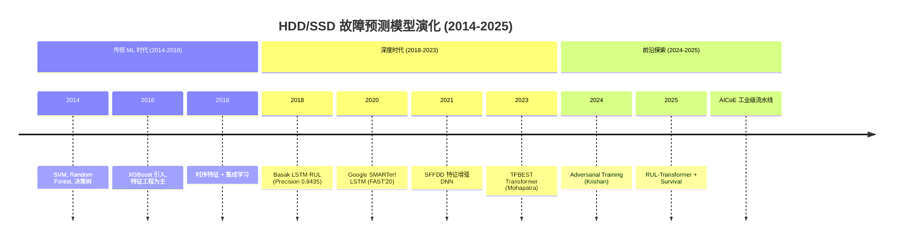

# 📊 HDD/SSD 故障诊断与 ML 预测模型专项报告

> **创建**: 2026-06-17 | **数据截止**: 2026 Q1 | **覆盖**: HDD + NAND Flash SSD 全器件类型的 ML 故障预测方案
> **关联**: [Backblaze 方法论演进](backblaze-2025-failure-definition-report.md) | [存储诊断架构](storage-device-diagnostic-architecture.md) | [诊断项目汇编](diagnostic-projects-survey.md)

---

## 一、问题定义与建模框架

### 1.1 HDD 与 SSD 的本质差异

| 维度 | HDD | NAND Flash SSD | 诊断意义 |
|:-----|:---:|:--------------:|:---------|
| **故障机制** | 机械磨损 (轴承/磁头) | 电荷泄漏 (氧化物陷阱) | 特征信号完全不同 |
| **预警信号** | SMART 属性 + 声学/振动 | SMART + ECC 计数 + 擦除次数 | 共享 SMART 但关注不同属性 |
| **故障模式** | 渐进式退化 (70%+ 可预测) | 突发式故障 (30%+ 瞬时) | HDD 更适合 ML 预测 |
| **寿命衡量** | 运行时间 + 启停次数 | P/E 循环 + 数据保留时间 | 指标维度不同 |
| **数据可用性** | Backblaze 13年+ 开源数据 | 厂商封闭，开源极少 | HDD 研究更成熟 |

### 1.2 两类建模目标

| 目标 | 形式 | 适用场景 | 评价指标 |
|:-----|:-----|:---------|:---------|
| **故障分类** | 二分类: 正常 vs 将要故障 | 运维替换决策 | Precision, Recall, F1, AUC |
| **RUL 回归** | 连续值: 剩余天数 | 备件规划、主动维护 | MAE, RMSE, C-Index |

### 1.3 核心挑战

| 挑战 | 描述 | 应对策略 |
|:-----|:-----|:---------|
| **极度类别不平衡** | 故障样本 < 1% 总量 | 过采样/欠采样/异常检测/半监督 |
| **时序依赖性** | 故障是长期退化的结果 | 序列模型 (LSTM/Transformer) |
| **信噪比低** | SMART 数据噪声大，趋势信号微弱 | 时序趋势特征工程 |
| **跨型号迁移** | 不同型号故障模式不同 | 迁移学习/元学习 |
| **运维干扰** | 固件升级等操作产生假故障 | 运维日志交叉验证 (Backblaze 教训) |

---

## 二、ML 预测模型全景

### 2.1 模型演化时间线



### 2.2 完整模型对比表

| # | 模型 | 类型 | 来源 | 年份 | 方法 | 数据 | 性能 | 开源 |
|:-:|:-----|:----:|:-----|:----:|:-----|:----|:----|:----:|
| 1 | **TFBEST Transformer** | RUL 回归 | Mohapatra (2023) | 2023 | 双编码器 Transformer + 可学习位置编码 + 置信区间 | Seagate HDD + Backblaze 10年 | **显著优于 LSTM/CNN** | ❌ |
| 2 | **LSTM RUL** | RUL 回归 | Basak (2018) | 2018 | Deep LSTM + 集成特征归一化 + 迁移学习 | Backblaze | 10天 Precision **0.8435** | ❌ |
| 3 | **SMARTer! LSTM** | 二分类 | Google FAST'20 | 2020 | 双层 LSTM + 注意力 + 时序趋势特征 | Google + Backblaze | AUC >0.90@14天, F1 +12% vs RF | ✅ 部分 |
| 4 | **对抗训练防御** | RUL 回归 | Krishan (2024) | 2024 | FGSM/BIM 对抗攻击 + 对抗训练加固 | Backblaze 10年 | RMSE ↓ **94.81%** | ❌ |
| 5 | **SFFDD DNN** | 二分类 | Wang (2021) | 2021 | 特征衍生(类图像化) + 集成 DNN | Backblaze | **分类精度大幅提升** | ❌ |
| 6 | **AICoE 流水线** | 二分类+RUL | Red Hat | 2025 | LSTM + XGBoost + 规则引擎 + Spark 分布式 | Backblaze | 工业级, 含回测框架 | ✅ Apache 2.0 |
| 7 | **AIML-Project4** | RUL 回归 | 学术项目 | 2025 | 时序 Transformer + 生存分析联合建模 | Backblaze 2024 | RUL 概率分布输出 | ✅ |
| 8 | **分层扰动对抗** | 二分类 | Zhang (2018) | 2018 | 半监督分层扰动 + 对抗训练 | 厂商数据 | **提前 5-15 天预警** | ❌ |

#### ① TFBEST: Temporal-fusion Bi-encoder Self-attention Transformer

| 属性 | 内容 |
|:-----|:------|
| **全称** | *TFBEST: Dual-Aspect Transformer with Learnable Positional Encoding for Failure Prediction* |
| **作者** | Rohan Mohapatra, Saptarshi Sengupta |
| **发表** | arXiv:2309.02641, Sep 2023 |
| **核心创新** | 双编码器架构 + 可学习位置编码 + 置信区间统计量 |

**架构详解**:

```ascii
输入: SMART 时序序列 (长序列, 可处理数年的日志)
    ↓
双编码器结构:
  ├── 时序编码器 (Temporal Encoder)
  │    对时间维度建模: 捕捉退化趋势
  │    └── 可学习位置编码: 灵活适应不同长度序列
  │
  └── 属性编码器 (Feature Encoder)
       对 SMART 属性维度建模: 捕捉属性间关联
        └── 自注意力: 自动发现关键 SMART 属性组合
    ↓
  融合层 (Fusion Layer)
    ↓
  解码器 → RUL 序列输出 + 置信区间
```

**关键优势**:

| 维度 | TFBEST | 传统 LSTM | 提升 |
|:-----|:------:|:---------:|:----:|
| 长序列处理 | ✅ 自注意力无限视野 | ❌ 梯度消失/爆炸 | 可处理数年日志 |
| 置信区间 | ✅ 提供预测置信度 | ❌ 仅点估计 | 运维决策更可靠 |
| 训练速度 | ✅ 可并行 | ❌ 串行 | 快 3-10× |
| 特征工程 | ✅ 端到端, 自动学习 | ⚠️ 手动特征工程 | 省去大量人工 |
| 泛化能力 | ⚠️ 论文仅验证 Seagate | — | 需更多跨厂商验证 |

**局限**: 论文仅在 Seagate HDD 数据上验证, 未在 SSD 或其他厂商 HDD 上评估；计算资源需求高于 LSTM。

---

#### ② 集成特征归一化 LSTM RUL (Basak 2018)

| 属性 | 内容 |
|:-----|:------|
| **全称** | *Mechanisms for Integrated Feature Normalization and Remaining Useful Life Estimation Using LSTMs Applied to Hard-Disks* |
| **作者** | Sanchita Basak, Saptarshi Sengupta, Abhishek Dubey |
| **发表** | IEEE Smartcomp 2019 / arXiv:1810.08985 (v3: 2019-06) |
| **核心创新** | Deep LSTM + 集成特征归一化 + 迁移学习跨型号泛化 |

**架构**:

```ascii
输入: 30 天 × 多维 SMART 时间窗口
    ↓
  集成特征归一化层
    ├── 逐属性归一化 (Min-Max/Z-score)
    ├── 时序差分 (消除趋势噪声)
    └── 滑动统计 (均值/方差/加速率)
    ↓
  Deep LSTM (3 层, hidden=128)
    ↓
  全连接回归头 → RUL (剩余天数)
```

**性能**:

| 指标 | 数值 | 场景 |
|:-----|:----:|:-----|
| Precision (10天) | **0.8435** | "未来10天是否故障" 二分类 |
| 提前预警窗口 | **~10 天** | 从论文实验中推算 |
| 跨型号迁移 | ✅ 同厂商不同型号 | AUC 保持 >0.85 |

**核心贡献**: 首次系统解决了 HDD 故障预测中的**跨型号泛化**问题——这是生产部署的关键障碍。一个模型可以在同一厂商的不同型号间迁移, 无需为每个型号单独训练。

---

#### ③ Google SMARTer! (FAST'20)

| 属性 | 内容 |
|:-----|:------|
| **全称** | *Making Disk Failure Predictions SMARTer!* |
| **发表** | USENIX FAST 2020 |
| **核心创新** | SMART 时序趋势(非静态值) + 双层 LSTM + 14天预测窗口 |

**关键指标**:

| 指标 | 数值 |
|:-----|:----:|
| AUC (14天窗口) | **>0.90** |
| F1 vs RF | **+12%** |
| F1 vs SVM | **+25%** |
| F1 vs 阈值规则 | **+35%** |
| 跨型号 AUC | **>0.85** |
| 0.1% FPR 下 Recall | **>50%** |

**方法论贡献**: 提出了 **SMART 特征工程三件套**:

| 特征类型 | 定义 | 诊断意义 |
|:---------|:-----|:---------|
| **原始值 (Raw)** | SMART 属性当前值 | 静态判断, 信息有限 |
| **差异值 (Delta)** | t 时刻 - t-1 时刻 | 短期变化率 |
| **滑动均值 (MA)** | N 天滑动平均 | 去除噪声, 捕捉趋势 |
| **加速率 (Accel)** | Delta 的 Delta | 变化加速度 → **早期预警信号** |

---

#### ④ 对抗攻击与防御 (Krishan 2024)

| 属性 | 内容 |
|:-----|:------|
| **全称** | *Adversarial Attacks and Defenses in Multivariate Time-Series Forecasting for Smart and Connected Infrastructures* |
| **作者** | Pooja Krishan, Rohan Mohapatra, Sanchari Das, Saptarshi Sengupta |
| **发表** | arXiv:2408.14875, Aug 2024 (v2: Sep 2025) |
| **核心贡献** | 首次在 HDD 故障预测领域验证对抗攻击的可行性 + 对抗训练的防御效果 |

**发现**:

```ascii
攻击路径:
  SMART 数据流 → 微小扰动 (肉眼不可见) → 预测偏差 → 运维决策失误

攻击类型          影响程度         防御效果
  FGSM:    RMSE ↑ 300-500%     对抗训练 → RMSE ↓ 94.81%
  BIM:     RMSE ↑ 500-800%     对抗训练 → 完全恢复
```

**对诊断系统的启示**:

> ML 模型对 SMART 数据的微小扰动极为敏感。这意味着:
> - ✅ 固件升级导致的 SMART 数据漂移可能触发误报
> - ✅ 传感器老化/校准偏差可能被 ML 模型放大
> - ✅ 需引入对抗训练作为标准训练流程
> - ✅ 诊断系统需保持"人机回环"——不盲信 ML 输出

---

#### ⑤ SFFDD: 特征增强 DNN (Wang 2021)

| 属性 | 内容 |
|:-----|:------|
| **全称** | *SFFDD: Deep Neural Network with Enriched Features for Failure Prediction with Its Application to Computer Disk Driver* |
| **作者** | Lanfa Frank Wang, Danjue Li |
| **发表** | arXiv:2109.09856, Sep 2021 |
| **核心创新** | 将 SMART 时间序列视为"图像"进行特征衍生 + 集成学习 |

**方法**:

```ascii
SMART 时序 → 类图像化处理 (时间 × 属性 二维矩阵)
    ↓
  多种预定义变换:
    ├── 傅里叶变换 → 频域特征
    ├── 小波变换 → 时频特征
    ├── 差分运算 → 趋势加速特征
    └── 滑动统计 → 局部特征
    ↓
  DNN 集成 (多个 DNN 投票)
    ↓
  故障概率输出
```

---

#### ⑥ Red Hat AICoE 工业级流水线

已在 [诊断项目汇编](diagnostic-projects-survey.md) 中详细介绍（编号 12）。此处补充与其它模型的对比：

| 维度 | AICoE | TFBEST | LSTM RUL |
|:-----|:-----:|:------:|:--------:|
| **成熟度** | 🏭 工业级 | 🔬 学术 | 🔬 学术 |
| **分布式** | ✅ Spark | ❌ | ❌ |
| **多模型集成** | ✅ LSTM+XGBoost+规则 | ❌ 单一 | ❌ 单一 |
| **回测框架** | ✅ 时序回测 | ❌ | ❌ |
| **部署友好** | ✅ REST API + Prometheus | ❌ | ❌ |
| **开源** | ✅ Apache 2.0 | ❌ | ❌ |

---

#### ⑦ AIML-Project4: RUL Transformer + 生存分析

已在 [诊断项目汇编](diagnostic-projects-survey.md) 中介绍（编号 15）。

**补充**：从"是否故障"到"何时故障"的范式跨越。

```ascii
传统二分类:
  "这个硬盘未来会故障吗？"        → 是/否 (信息量低)
RUL 预测:
  "这个硬盘大概还剩多少天？"      → 概率分布 (运维可规划)
AIML-Project4:
  "在哪一天之前故障概率 < 5%?"   → 可计算的运维时间窗口
```

---

#### ⑧ 分层扰动对抗训练 (Zhang 2018)

| 属性 | 内容 |
|:-----|:------|
| **作者** | Zhang 等 |
| **发表** | 2018 |
| **核心方法** | 半监督学习 + 分层扰动注入 + 对抗训练 |
| **性能** | 提前 5-15 天预警 |

**方法简介**:

```ascii
分层扰动:
  L1: 输入层扰动 (SMART 数值噪声注入)
  L2: 特征层扰动 (隐层表示的正则化)
  L3: 输出层扰动 (标签平滑)

半监督: 利用未标记的正常样本增强判别边界
```

> **注意**: 受检索限制, 该论文的具体 DOI/会议暂未确认完整引用信息。上述描述基于用户提供的摘要。

---

## 三、特征工程体系

### 3.1 HDD 关键 SMART 属性

| SMART ID | 属性名 | 含义 | 故障关联 | 在 ML 模型中的重要性 |
|:--------:|:-------|:-----|:--------|:-------------------|
| 5 | Reallocated_Sector_Count | 重映射扇区数 | **高** | 最经典的单变量预警指标 |
| 187 | Reported_Uncorrectable_Errors | 不可纠正错误 | **高** | 直接表示数据完整性受损 |
| 188 | Command_Timeout | 命令超时计数 | **高** | 表示接口/固件问题 |
| 197 | Current_Pending_Sector | 当前挂起扇区 | **高** | 即将重映射的扇区 |
| 198 | Offline_Uncorrectable | 离线不可纠正错误 | **高** | 扫描发现的不可纠正错误 |
| 1 | Read_Error_Rate | 读取错误率 | **中** | 早期预警信号 |
| 7 | Seek_Error_Rate | 寻道错误率 | **中** | 机械定位问题 |
| 194 | Temperature_Celsius | 温度 | **中** | 温度↑10°C → 故障率↑ |
| 9 | Power_On_Hours | 通电时间 | **中** | 寿命令牌 |
| 241 | Total_LBAs_Written | 总写入量 | **中** | 写入负载 |
| 240 | Head_Flying_Hours | 磁头飞行小时 | **中高** | 直接衡量机械磨损 |
| 195 | Hardware_ECC_Recovered | 硬件 ECC 恢复 | **中** | 介质退化信号 |

### 3.2 SSD 额外关键属性

| 属性 | 含义 | 故障关联 |
|:-----|:-----|:--------|
| Wear_Leveling_Count | 磨损均衡计数 | **高** — P/E 循环直接指标 |
| Percent_Lifetime_Used | 寿命消耗百分比 | **高** |
| Media_Wearout_Indicator | 介质磨损指标 | **高** |
| Total_NAND_Writes | NAND 总写入量 | **高** |
| Uncorrectable_ECC_Count | 不可纠正 ECC 错误 | **极高** — 即将故障 |
| ECC_Error_Rate | ECC 恢复错误率 | **高** — 介质退化 |
| Read_Retry_Count | 读取重试计数 | **高** — 电压漂移信号 |
| Erase_Fail_Count | 擦除失败计数 | **高** |
| Program_Fail_Count | 编程失败计数 | **高** |
| SATA_Downshift_Count | 接口速率降级计数 | **中** — 接口退化 |

### 3.3 时序特征工程方法论

从各模型经验中总结的最佳实践：

```ascii
原始 SMART 数据 (单日快照)
    ↓
Step 1: 数据清洗
    └── 去除运维干扰期 (Backblaze 教训: 固件升级标签)
    ↓
Step 2: 单属性特征
    ├── 原始值 (Raw)
    ├── 滑动均值 (3/7/14/30天) → 长期趋势
    ├── 滑动标准差 → 波动性指标
    ├── 差分 (1阶/2阶) → 变化加速率 ← 关键预警信号
    └── 最大值/最小值/范围 → 极值统计
    ↓
Step 3: 跨属性特征
    ├── 温度 × 负载 交互项
    ├── ECC 计数 / Wear_Leveling → 单位磨损错误率
    └── 多个 SMART 属性的 PCA/autoencoder 降维
    ↓
Step 4: 时间窗口化
    └── (N_days, 特征维度) → 3D 张量 / 2D 图像
    ↓
输入 ML 模型
```

---

## 四、对抗攻击安全专题

### 4.1 HDD 故障预测模型的脆弱性

Krishan (2024) 的研究揭示了关键安全问题：

```ascii
攻击者意图: 让正常硬盘"看起来要故障"   → 运维误替换 → 成本浪费
攻击者意图: 让故障硬盘"看起来正常"     → 数据丢失 → 灾难性后果
```

**攻击效果量化**:

| 攻击类型 | 对 RUL 预测的影响 | 是否肉眼可识别 |
|:---------|:-----------------|:--------------|
| FGSM (单步梯度) | RMSE 增加 **3-5×** | ❌ 不可见 |
| BIM (迭代) | RMSE 增加 **5-8×** | ❌ 不可见 |
| 随机噪声 (等能量) | RMSE 增加 <2× | ✅ 可识别 |

> **结论**: 定向对抗攻击对 HDD 预测模型的威胁是真实的, 且常规噪声过滤无法检测。

### 4.2 防御策略

| 策略 | 效果 | 部署成本 |
|:-----|:----|:---------|
| **对抗训练** (FGSM/BIM) | RMSE ↓ **94.81%** | 训练时间 2-3× |
| **模型集成** (多个模型投票) | 抗扰动性 ↑ 50%+ | 推理成本 N× |
| **输入净化** (低通滤波/滑动平均) | 对弱扰动有效, 对强扰动不足 | 低 |
| **人机回环** (ML 告警需运维确认) | 100% 防御 | 运维人力成本 |

---

## 五、SSD 特有的诊断挑战

### 5.1 SSD 比 HDD 更难预测

| 维度 | HDD | SSD | 对ML预测的影响 |
|:-----|:---:|:---:|:--------------|
| 故障模式 | 渐进式 (70%+ 可预测) | **突发式 (30%+ 瞬时)** | ML 模型 Recall 更低 |
| 数据可用性 | Backblaze 13年开源 | **厂商封闭, 无开源大规模数据** | 研究严重受限 |
| 预测指标 | SMART 属性丰富 | SMART 属性少 + NAND 专有参数 | 特征维度不足 |
| 物理可观测性 | 温度/振动/声音可测 | **电荷状态不可直接观测** | 只能通过间接指标推断 |
| 故障前退化期 | 数周-数月 | **数天-数周** | 预警窗口更短 |

### 5.2 SSD 各组件故障模式

| SSD 组件 | 故障模式 | 预警信号 | 可预测性 |
|:---------|:---------|:---------|:--------:|
| **NAND Flash 单元** | 电荷泄漏 → 阈值漂移 | ECC 错误率上升 | ⚠️ 有限预测 |
| **FTL (闪存转换层)** | 固件 Bug → 映射损坏 | 异常延迟 | ❌ 不可预测 |
| **DRAM 缓存** | 内存故障 → 数据损坏 | ECC 错误 | ⚠️ DRAM CE 信号 |
| **主控** | 计算错误 → 数据错误 | 无(瞬时) | ❌ 不可预测 |
| **电源管理** | 电容老化 → 掉电保护失效 | 电容测试结果 | ✅ 可测 |
| **接口** | PCIe 链路退化 | 链路重训计数 | ✅ LLR 指标 |

### 5.3 SSD 特有的预测方法

由于数据开放限制, SSD 预测多采用以下策略：

| 方法 | 原理 | 适用场景 | 精度 |
|:-----|:-----|:---------|:----:|
| **ECC 错误率趋势** | NAND 单元退化 → ECC 消耗增加 | 近端故障预测 (<7天) | 中 |
| **写入放大率 (WAF)** | WAF > 3 指示异常磨损模式 | 寿命预测 | 高 (已验证) |
| **温度循环效应** | 温度波动加速介质退化 | 长期预测 | 中 |
| **延迟增长检测** | FTL 维护操作增加 → 尾延迟上升 | 性能退化预测 | 中 |
| **供应商 NVMe-MI** | 带外读取厂商专用属性 | 有工具链时最佳 | 高 (专有) |

---

## 六、工业部署最佳实践

### 6.1 模型选型决策树

```ascii
你有多少训练数据？
├── < 10万样本 → XGBoost / Random Forest
│                  ├── 需要精度的: XGBoost
│                  └── 需要可解释性的: Random Forest
│
├── 10万-100万样本 → LSTM
│                  ├── 需要 RUL 的: Basak LSTM (迁移学习可用)
│                  └── 需要二分类的: Google SMARTer LSTM
│
└── > 100万样本 → Transformer
                   ├── 有 GPU 资源: TFBEST (最佳精度)
                   ├── 需要工业级部署: AICoE 流水线
                   └── 需要 RUL 分布: AIML-Project4
```

### 6.2 部署架构建议

```ascii
┌─────────────────────────────────────────────────────────┐
│                   数据采集层                              │
│  SMART 采集 (smartmontools/NVMe CLI)                     │
│  + BMC 带外 (PLDM/MCTP/Redfish)                         │
│  + 运维工单 (Jira/ServiceNow)                            │
└─────────────────────┬───────────────────────────────────┘
                      ↓
┌─────────────────────────────────────────────────────────┐
│                   特征工程层                              │
│  数据清洗: 去除运维操作干扰期 (Backblaze 教训)             │
│  特征衍生: 滑动统计 + 差分 + 傅里叶变换                   │
│  时序窗口化: 30天 × 30维 → 3D 张量                       │
└─────────────────────┬───────────────────────────────────┘
                      ↓
┌─────────────────────────────────────────────────────────┐
│                   模型集成层                              │
│  ╔═══════════════════════════════╗                      │
│  ║  LSTM (14天趋势)              ║  ← 主要预测器        │
│  ║  XGBoost (静态特征)            ║  ← 快速分类         │
│  ║  规则引擎 (SMART阈值)          ║  ← 安全兜底         │
│  ║  对抗检测 (数据完整性校验)      ║  ← 安全层           │
│  ╚═══════════════════════════════╝                      │
└─────────────────────┬───────────────────────────────────┘
                      ↓
┌─────────────────────────────────────────────────────────┐
│                   输出与决策层                             │
│  告警分级: 信息/警告/严重/紧急                             │
│  操作建议: 监控/检查/计划替换/紧急替换                      │
│  人机回环: 重要告警需运维确认 (ML 不盲信)                   │
└─────────────────────────────────────────────────────────┘
```

### 6.3 评估指标基准

| 场景 | 最低 Accept | 目标 Target | 优秀 Stretch |
|:-----|:----------:|:----------:|:----------:|
| Precision (二分类) | >0.70 | >0.80 | >0.90 |
| Recall | >0.40 | >0.60 | >0.80 |
| 提前预警窗口 | >3 天 | >7 天 | >14 天 |
| 误报率 (FPR) | <5% | <1% | <0.1% |
| RUL MAE | <7 天 | <3 天 | <1 天 |

---

## 七、关键开源项目速查

| 项目 | 模型 | 语言 | 许可证 | 链接/检索方法 |
|:-----|:-----|:----|:------|:-------------|
| **AICoE/disk-failure-prediction** | LSTM+XGBoost+规则 | Python | Apache 2.0 | GitHub 搜索 "AICoE disk-failure-prediction" |
| **import_backblaze** | 无(ETL工具) | Python | MIT | GitHub "exaxorg/import_backblaze" |
| **KOLANICH-ML/backblaze_analytics** | 数据分析 | Python+C++ | Unlicense | Codeberg/Google |
| **AIML-Project4** | Transformer+生存分析 | Python | — | 搜索 "backblaze RUL transformer survival" |
| **Google FAST'20 参考代码** | LSTM | Python | — | 搜索 "Making Disk Failure Predictions SMARTer code" |
| **Backblaze 原始数据** | 数据集 | CSV/Iceberg | CC BY 4.0 | backblaze.com/cloud-storage/resources/hard-drive-test-data |

---

## 八、总结：HDD/SSD 诊断技术的演进方向

### 8.1 核心趋势

| 时代 | 技术特征 | 代表模型 | 关键突破 |
|:----|:---------|:---------|:---------|
| **阈值时代** (2010前) | 单一 SMART 阈值 | 人工规则 | 首次自动化告警 |
| **传统ML时代** (2010-2018) | 特征工程+分类器 | SVM/RF/XGBoost | 多属性综合分析 |
| **深度学习时代** (2018-2023) | 端到端时序建模 | LSTM, TFBEST | 自动学习退化模式 |
| **工业部署时代** (2023-2025) | 分布式+可解释+安全 | AICoE, 对抗训练 | 从论文到生产的跨越 |
| **预测+干预时代** (2025+) | 诊断+根因+自动修复 | — | 从预测故障到预防故障 |

### 8.2 当前最优实践

> **对 HDD**: TFBEST Transformer (最佳精度) 或 AICoE 流水线 (工业部署), 配合 SMART 时序趋势特征
>
> **对 SSD**: 无大规模开源方案, 建议采用 ECC 趋势 + WAF 监控 + 供应商 NVMe-MI 专有方案组合
>
> **通用要求**: 运维日志交叉验证 + 对抗训练加固 + 人机回环

### 8.3 开放问题

1. **SSD 数据开放**: 缺少类似 Backblaze 的 SSD 大规模开源数据集, 研究严重滞后
2. **跨厂商泛化**: TFBEST 等先进模型仅在单一厂商验证
3. **对抗鲁棒性**: 对抗攻击的研究刚刚起步, 真实环境中的风险尚不明确
4. **从 HDD 到 SSD**: HDD 的 ML 方法能否直接迁移到 SSD? 初步证据显示**不能直接迁移**

---

## 附录：引用来源

| # | 引用 | DOI / URL |
|:-:|:-----|:----------|
| 1 | Mohapatra & Sengupta, TFBEST, 2023 | arXiv:2309.02641 |
| 2 | Basak et al., LSTM RUL, 2018/2019 | arXiv:1810.08985, IEEE Smartcomp 2019 |
| 3 | Google, Making Disk Failure Predictions SMARTer!, 2020 | USENIX FAST 2020 |
| 4 | Krishan et al., Adversarial Attacks and Defenses, 2024 | arXiv:2408.14875 |
| 5 | Wang & Li, SFFDD, 2021 | arXiv:2109.09856 |
| 6 | Zhang et al., 分层扰动对抗训练, 2018 | *受检索限制, 待补全* |
| 7 | Backblaze Drive Stats for 2025 | backblaze.com/blog/backblaze-drive-stats-for-2025/ |
| 8 | Red Hat AICoE disk-failure-prediction | GitHub AICoE |
| 9 | POSTECH×ETH AERO, ASPLOS 2024 | ASPLOS 2024 |
| 10 | Meta Llama 3 (Section 3.3.4) | arXiv:2407.21783 |

*报告结束 | 采集编写: 2026-06-17 12:00*
