# 🏭 芯片全生命周期与基础科学体系

> **版本**: v1.0 | **创建**: 2026-07-01
> **定位**: 从需求定义到批量部署的芯片全流程总览，揭示每个环节涉及的基础科学/工程领域，连接现有 `08_chip/` 下各专题文档
>
> **关联文档**:
> - [🏭 四大芯片类型研发全流程](chip-four-categories-rd-process.md) — CPU/DRAM/GPU/存储的研发流程、专用技术与工具（v1.0, 65KB）
> - [🔬 芯片测试全栈深度分析](../test/chip-test-full-stack-deep-analysis.md) — 封测→样板信号→固件→OS认证→生态
> - [🏗️ 芯片初始化与故障恢复体系](chip-init-recovery-framework.md) — CPU/PCIe Switch/USB/SSD/GPU 的初始化与恢复
> - [🎯 GPU芯片设计深度分析](gpu-chip-design-analysis.md) — 训练 vs 推理 + MoE 架构
> - [🏛️ 国产 ARM 服务器 CPU 生态调研](arm-cpu-ecosystem-deep-dive.md)
> - [🏛️ 芯片级 RAS 实现方案](../../07_ras/chip-level-ras-implementation.md)
> - [🛡️ RAS 综合设计手册](../../07_ras/ras-comprehensive-handbook.md)

---

## 📑 目录

- [一、芯片全生命周期总览](#一芯片全生命周期总览)
- [二、需求定义与架构设计](#二需求定义与架构设计)
- [三、前端设计（RTL）](#三前端设计rtl)
- [四、后端设计（物理实现）](#四后端设计物理实现)
- [五、流片与晶圆制造](#五流片与晶圆制造)
- [六、封装技术](#六封装技术)
- [七、芯片测试](#七芯片测试)
- [八、芯片初始化与系统 Bring-up](#八芯片初始化与系统-bring-up)
- [九、系统级验证与认证](#九系统级验证与认证)
- [十、量产与部署](#十量产与部署)
- [十一、各阶段涉及的基础科学体系](#十一各阶段涉及的基础科学体系)
- [十二、生态全景与交叉引用](#十二生态全景与交叉引用)
- [修订记录](#修订记录)

---

## 一、芯片全生命周期总览

### 1.1 V 型生命周期模型

芯片开发遵循典型的 V 型模型，左侧是设计与实现，右侧是验证与测试：

```text
需求定义 ────────────────────────────────────────→ 系统验证/验收测试
    │                                                    │
    架构设计 ──────────────────────────────────→ 系统级验证
    │                                                    │
    微架构/RTL 设计 ──────────────────────→ 芯片级验证 (Emulation/FPGA)
    │                                                    │
    逻辑综合 ─────────────────────────→ 门级仿真 + STA
    │                                                    │
    物理设计 (P&R) ───────────────→ 物理验证 (DRC/LVS/DFM)
    │                                                    │
    流片 (Tape-out) ──────────────────────────────→ 晶圆制造
                                                          │
                                                    封装
                                                          │
                                                CP/FT/SLT 测试
                                                          │
                                                Bring-up + 系统认证
```

### 1.2 时间线与成本分布

| 阶段 | 典型耗时 | 成本占比 | 团队构成 |
|:-----|:--------:|:--------:|:---------|
| 需求与架构 | 3-6 月 | 5-10% | 架构师·产品经理·客户代表 |
| RTL 设计 | 6-12 月 | 15-20% | 数字设计·验证工程师 |
| 后端物理设计 | 4-8 月 | 10-15% | PD 工程师·CAD 工程师 |
| 流片/制造 | 2-4 月 | 30-40% | 晶圆厂 (TSMC/Samsung/SMIC) |
| 封装与测试 | 2-3 月 | 15-20% | 封测厂 (ASE/Amkor/长电) |
| Bring-up + 验证 | 3-6 月 | 10-15% | 芯片验证·固件·BIOS·OS 团队 |

> **第一性原则**：流片一次性成本 ~$1000 万+（5nm），一次工程改动 = 3-6 个月 + 额外 $500 万+。这决定了芯片开发是"设计时多花 10% 时间验证，比流片后花 100% 成本改版"的行业铁律。

---

## 二、需求定义与架构设计

### 2.1 输入约束

| 类别 | 典型约束 | 示例 |
|:-----|:---------|:-----|
| 性能 | SPECint/TPC/TDP 目标 | 相比上代 IPC +15% |
| 功耗 | TDP / 能效比 | 300W TDP, perf/W +20% |
| 面积 | Die size / 封装限制 | ≤ 400mm² (reticle limit) |
| 成本 | BOM target / 晶圆成本 | $200/chip @ 1M volume |
| 时间 | Time-to-market | 18 月从 spec 到量产 |
| 兼容性 | 向后兼容 / pin-to-pin | PCIe 5.0 向下兼容 PCIe 4.0 |
| 可靠性 | FIT / MTTF / 使用寿命 | 10 年 7×24, FIT < 100 |
| 生态 | 指令集 / API / 软件栈 | 兼容 x86/ARM/RISC-V 用户态 |

### 2.2 架构决策的核心维度

```text
PPA 三角:  Performance ─── Power
                 \         /
                  Area
```

- **性能**: IPC × 频率，受限于微架构 + 工艺 + 功耗预算
- **功耗**: 动态 = ½CV²f × α，静态 = I_leak × V，受限于散热能力
- **面积**: 决定成本（Die per wafer），受限于 reticle limit（~800mm²）

### 2.3 基础支撑领域

- **计算机体系结构**（流水线·缓存一致性·内存序·虚拟化）
- **信息论**（指令编码压缩·ECC 纠错码·压缩感知）
- **性能建模与量化**（Amdahl's Law · Roofline Model · IPC 分解）
- **微架构探索工具**（gem5 · McPAT · CACTI）
- **工作负载分析**（profiling · trace analysis · benchmark 选取）

---

## 三、前端设计（RTL）

### 3.1 设计流程

```text
架构规范
    │
    ├── 高层次综合 (HLS) / SystemC 建模
    │       性能探索 → 微架构定型
    │
    ├── RTL 编码 (Verilog/SystemVerilog/VHDL)
    │       ┌─ 控制通路 (FSM/流水线控制/仲裁)
    │       └─ 数据通路 (ALU/Multiplier/Memory/NoC)
    │
    ├── 功能验证
    │       ├── 仿真 (Simulation): UVM/SystemVerilog Assertion
    │       ├── 形式验证 (Formal): 等价性检查/模型检验
    │       └── FPGA 原型验证: 加速仿真 100-1000×
    │
    ├── 设计 for Test (DFT)
    │       Scan Chain / BIST / JTAG / MBIST
    │
    └── 设计 for Debug (DFD)
            Trace Buffer / Trigger Logic / Performance Monitor
```

### 3.2 基础支撑领域

| 子领域 | 核心概念 | 应用场景 |
|:-------|:---------|:---------|
| **数字逻辑设计** | 布尔代数·FSM·时序·组合逻辑 | 基础 RTL 编码 |
| **计算机算术** | 定点/浮点/Karatsuba/Wallace Tree | ALU/FMA/除法器设计 |
| **时序分析基础** | Setup/Hold 时间·时钟偏斜·亚稳态 | 所有同步设计的基础 |
| **形式化方法** | SAT/SMT Solver·BDD·模型检验 | 指令一致性·Cache Coherence 验证 |
| **验证方法学** | UVM·覆盖率驱动·随机约束·断言 | 功能验证的行业标准 |
| **测试理论** | 故障模型·故障覆盖·ATPG·Scan | DFT 的数学基础 |

---

## 四、后端设计（物理实现）

### 4.1 流程

```text
门级网表 (Netlist)
    │
    ├── 逻辑综合 (Synthesis)
    │      RTL → 门级网表 + 时序库 + 功耗优化
    │
    ├── 布局 (Floorplan + Placement)
    │      宏单元布局 → 标准单元放置 → 拥塞优化
    │
    ├── 时钟树综合 (Clock Tree Synthesis, CTS)
    │      时钟偏斜 (skew) ≤ 目标值 → 时钟功耗优化
    │
    ├── 布线 (Routing)
    │      全局布线 → 详细布线 → 天线效应修复
    │
    ├── 时序收敛 (Timing Closure)
    │      Setup/Hold/Pulse Width 时序修复
    │
    ├── 物理验证
    │      DRC (Design Rule Check)
    │      LVS (Layout vs Schematic)
    │      DFM (Design for Manufacturing)
    │
    └── 签收 (Sign-off)
            静态时序分析 (STA) + 功耗分析 + IR Drop + EM
```

### 4.2 基础支撑领域

| 子领域 | 核心概念 |
|:-------|:---------|
| **半导体物理** | PN 结·MOSFET 特性·短沟道效应·FinFET/GAA 结构 |
| **电磁学** | 传输线理论·信号完整性·串扰·电磁兼容 |
| **热力学** | 热传导·对流·辐射·热阻网络·热梯度 |
| **固体力学** | 应力应变·热膨胀系数 CTE·翘曲·应变硅 |
| **图论与组合优化** | 布线中的 Steiner Tree·放置中的模拟退火·划分中的 KL/FM 算法 |
| **数值方法** | 有限元分析 FEM·RC 提取·SPICE 仿真 |

---

## 五、流片与晶圆制造

### 5.1 制造工艺

```text
设计数据 (GDSII/OASIS)
    │
    ├── 掩模制作 (Mask-making)
    │      电子束光刻 → 掩模版 → 多层对准
    │
    ├── 晶圆制造 (Fab Process)
    │      ┌── 前端工艺 (FEOL): 晶体管制造
    │      │    氧化→光刻→刻蚀→掺杂→CMP (重复几十次)
    │      │    FinFET/GAA 的具体工艺步骤
    │      │
    │      └── 后端工艺 (BEOL): 金属互连
    │            接触孔→金属层→通孔 (8-16 层 Cu)
    │
    └── 晶圆测试 (CP / Wafer Sort)
           探针卡接触 → 裸片功能测试 → 良率 binning
```

### 5.2 基础支撑领域

| 子领域 | 核心概念 |
|:-------|:---------|
| **半导体工艺物理** | 氧化动力学·离子注入分布·扩散方程·刻蚀各向异性 |
| **光学光刻理论** | Rayleigh 判据·分辨率 (R=k₁λ/NA)·OPC·多重图形 |
| **材料科学** | Si/Ge/III-V 族·high-k 介质·Cu 互连·Low-k 介质·CMP 抛光 |
| **等离子体物理** | 等离子体刻蚀·PECVD·离子损伤 |
| **统计过程控制 SPC** | Cpk·良率模型·缺陷密度·Pareto 分析 |

### 5.3 关键工艺节点对比

| 节点 | Fin Pitch | 金属间距 | 典型密度 | 代表产品 |
|:----|:---------:|:--------:|:--------:|:---------|
| N7 (7nm) | 30nm | 40nm | ~96 MTr/mm² | AMD Zen 2, NVIDIA Turing |
| N5 (5nm) | 28nm | 30nm | ~171 MTr/mm² | AMD Zen 4, Apple M1/M2 |
| N3 (3nm) | 23nm | 21nm | ~290 MTr/mm² | Apple M3/M4, NVIDIA Blackwell |
| N2 (2nm GAA) | — | — | ~350 MTr/mm² | 预计 2025-2026 |

---

## 六、封装技术

### 6.1 封装层次

```text
裸片 (Die)
    │
    ├── 单芯片封装
    │      Wire Bond (打线) → BGA → 传统封装
    │      Flip-Chip (倒装) → μBGA/LGA → 高 I/O 数
    │
    ├── 2.5D 集成 (Interposer)
    │      Si Interposer + TSV → CPU + HBM 并列
    │      代表: NVIDIA H100, AMD MI300
    │
    ├── 3D 堆叠 (3D Stacking)
    │      Hybrid Bonding (Cu-Cu 混合键合) → 垂直互联
    │      代表: HBM3/HBM4, Apple M Ultra Fusion
    │
    └── 先进封装
           CoWoS (台积电) → 2.5/3D 混合
           EMIB (Intel) → 嵌入式桥接
           Foveros (Intel) → 3D Face-to-Face
           InFO (台积电) → 扇出型封装
```

### 6.2 基础支撑领域

- **热力学**: 热阻网络·TIM 材料·散热路径设计
- **固体力学**: CTE 失配·焊点可靠性·翘曲控制·冲击
- **互连物理**: RLC 寄生·传输线效应·Skin Effect
- **可靠性物理**: 电迁移 EM·应力迁移 SM·热循环 TC
- **电磁兼容**: EMI 屏蔽·耦合噪声·去耦电容网络

---

## 七、芯片测试

> 详见 → [芯片测试全栈深度分析](../test/chip-test-full-stack-deep-analysis.md)（967 行全链路覆盖）

### 7.1 测试层次

```text
晶圆测试 (CP/Wafer Sort) ─── 探针卡接触裸片 → 直流/功能/良率筛选
    │                              ↓ 封装
最终测试 (FT/Final Test)   ─── 封装后完整功能/性能/特性化 → ATE
    │                              ↓ 老化筛选
老化测试 (Burn-in)         ─── HTOL → 早期失效筛选 (Infant Mortality)
    │
系统级测试 (SLT)           ─── 真实系统环境 → OS Boot + 压力 + 边界
    │
板级测试                   ─── SI/PI/时序 → 眼图/抖动/误码率
```

### 7.2 基础支撑领域

- **电路理论**: 网络分析·S 参数·TDR/TDT 时域反射
- **信号完整性 SI**: 传输线·反射·串扰·均衡·眼图
- **电源完整性 PI**: PDN 阻抗·去耦电容·同步开关噪声
- **统计与概率论**: 误码率 BER·统计时序分析·良率统计学
- **测试经济学**: DPPM·测试时间与成本·屏蔽率·漏杀率

---

## 八、芯片初始化与系统 Bring-up

> 详见 → [芯片初始化与故障恢复体系](chip-init-recovery-framework.md)（2782 行五类芯片深度分析）

### 8.1 初始化层次（五层共性框架）

```text
第1层: 供电与复位 ──── 电源域上电 → POR → 时钟稳定
                           │
第2层: Boot ROM 加载 ── 片上 ROM → 一级 Bootloader → 安全校验
                           │
第3层: 内部初始化 ──── PLL 锁定 → SRAM 初始化 → 内部状态机
                           │
第4层: 链路训练 ────── PCIe LTSSM / DDR 训练 / SerDes 均衡
                           │
第5层: 监控就绪 ────── 温度/电压/错误寄存器 → 上报 OS/BMC
```

### 8.2 基础支撑领域

- **时序电路设计**: 复位同步器·时钟域交叉·毛刺抑制
- **SerDes 物理层**: PLL/CDR·均衡 (FFE/DFE)·Precoding
- **链路协议**: PCIe/CXL/DDR/USB/以太网 LTSSM 状态机
- **安全启动**: 公钥密码学·信任链·ROM 不可变性
- **固件工程**: ROM 代码·SPI Flash 驱动·SMBus/I2C

---

## 九、系统级验证与认证

### 9.1 验证层次

```text
┌──────────┐
│ 单元验证  │ ← UVM/形式验证/FPGA 原型
├──────────┤
│ 子系统验证 │ ← 集成测试/互联互通
├──────────┤
│ 芯片级验证 │ ← Emulation/Palladium/Zebu
├──────────┤
│ 系统级验证 │ ← OS 启动/压力/稳定/RAS
├──────────┤
│ 合规认证   │ ← PCI-SIG/JEDEC/DMTF/SBSA/SBBR
├──────────┤
│ 生态认证   │ ← OS 认证/应用认证/ISV 认证
└──────────┘
```

### 9.2 基础支撑领域

- **操作系统原理**: 中断处理·内存管理·设备驱动·ACPI/Device Tree
- **计算机体系结构**: 缓存一致性·TLB·虚拟化·MMU
- **网络协议**: TCP/IP·RDMA·NVMe-oF·NFS
- **可靠性工程**: FIT·FMEA·FTA·RAS 设计·故障注入
- **测试方法论**: 等价类·边界值·随机·混沌工程·压力测试

---

## 十、量产与部署

### 10.1 流程

```text
良率爬坡 (Yield Ramp) ─── 工艺优化 → 缺陷减少 → 良率目标达成
    │
量产测试 (Volume Test) ── 自动化测试 → bin sorting → 品质抽检
    │
质量认证 (Qualification) ─ HTOL/HAST/TCT/ESD → 可靠性验证
    │
部署支持 (Deployment) ─── 客户现场 → FAE 支持 → 失效分析
    │
售后与 RMA ──────────── 退货分析 → 失效根因 → 设计修复
```

### 10.2 基础支撑领域

- **统计质量管理**: SPC·Cpk·σ·控制图·假设检验
- **可靠性物理**: 阿伦尼斯方程·Weibull 分布·激活能
- **失效分析**: SEM/TEM·FIB·EMMI·OBIRCH·热成像
- **供应链管理**: 晶圆厂产能·封测产能·库存缓冲·多源供应

---

## 十一、各阶段涉及的基础科学体系

### 11.1 按学科领域聚合

```mermaid
graph TB
    subgraph "数理基础"
        A1[数学: 图论/组合优化/概率统计]
        A2[物理: 电磁学/半导体物理/热力学]
        A3[材料科学: 半导体材料/封装材料]
    end
    
    subgraph "工程基础"
        B1[电路与系统: 数字/模拟/RF 电路]
        B2[计算机体系结构]
        B3[软件工程: 固件/驱动/操作系统]
    end
    
    subgraph "专业领域"
        C1[信号/电源完整性]
        C2[可靠性物理]
        C3[测试与验证方法论]
    end
    
    subgraph "管理与方法"
        D1[统计过程控制]
        D2[项目管理: IPD/PDP]
        D3[供应链与质量]
    end
    
    A1 --> 前端设计
    A1 --> 后端设计
    A2 --> 后端设计
    A2 --> 制造
    A2 --> 封装
    A3 --> 制造
    A3 --> 封装
    
    B1 --> 前端设计
    B1 --> 测试
    B2 --> 架构设计
    B2 --> 验证
    B3 --> 固件
    B3 --> 生态
    
    C1 --> 测试
    C2 --> 可靠性
    C3 --> 测试
    
    D1 --> 制造
    D1 --> 量产
    D2 --> 项目管理
    D3 --> 供应链
```



### 11.2 芯片工程师所需的技术栈广度

| 基础学科 | 应用章节 | 掌握程度 |
|:---------|:---------|:---------|
| 数字逻辑 / 布尔代数 | 前端 RTL 设计 | ⭐⭐⭐ 精通 |
| 计算机体系结构 | 架构·初始化·验证 | ⭐⭐⭐ 精通 |
| 电路分析基础 | SI/PI/封装 | ⭐⭐ 理解 |
| 电磁场与传输线 | SI/SerDes/EMC | ⭐⭐ 理解 |
| 半导体物理与器件 | FEOL·制造 | ⭐ 了解 |
| 热力学与传热 | 封装·散热设计 | ⭐ 了解 |
| 概率与统计 | 良率·BER·SPC | ⭐⭐ 理解 |
| 算法与数据结构 | DFT ATPG·布线 | ⭐ 了解 |
| 操作系统原理 | 驱动·验证 | ⭐⭐ 理解 |
| 编程语言 | SV/VHDL/Verilog·C/Python·Tcl | ⭐⭐⭐ 精通 |

---

## 十二、生态全景与交叉引用

### 12.1 本目录文件 → 生命周期覆盖

```text
 ┌─────────────────────────────────────────────────────────────────┐
 │  chip-full-lifecycle-overview.md (本文)                         │
 │  全生命周期总览 + 基础科学体系                                     │
 ├─────────┬─────────┬──────────┬──────────┬──────────┬───────────┤
 │  架构    │  设计    │ 制造/封装 │  测试     │ Bring-up │ 系统验证  │
 │         │         │          │          │          │           │
 │ ← GPU   │ ← ARM   │          │ ← chip-  │ ← chip-  │ ← ARM     │
 │  芯片    │   CPU   │          │   test-  │   init-  │   CPU     │
 │  设计    │   生态   │          │   full-  │   recov- │   生态     │
 │         │         │          │   stack  │   ery    │           │
 └─────────┴─────────┴──────────┴──────────┴──────────┴───────────┘
```

### 12.2 关联知识库交叉引用

| 生命周期阶段 | 关联知识文件 |
|:------------|:-------------|
| **架构设计** | `02_system/doubao-10-architecture-design-methodology.md`（架构设计五工具） |
| **RAS 设计** | `07_ras/ras-comprehensive-handbook.md`·`07_ras/chip-level-ras-implementation.md`·`07_ras/arm-amba-bus-ras-deep-dive.md` |
| **互联协议** | `04_fullstack/pcie-protocol-stack-deep-analysis.md`·`04_fullstack/dma-rdma-complete-analysis.md`·`04_fullstack/cache-coherence-complete-analysis.md`·`04_fullstack/interconnect-hierarchy-deep-dive.md` |
| **信号完整性** | `01_hw_core/10-signal-integrity-high-speed.md` |
| **可靠性验证** | `07_ras/large-scale-empirical-data.md`·`08_storage/backblaze-2025-failure-definition-report.md`·`08_storage/diagnostic-projects-survey.md` |
| **测试标准** | `test/chip-test-full-stack-deep-analysis.md` §十 行业规范 |
| **ARM 生态** | `base/arm-cpu-ecosystem-deep-dive.md` |

---

## 修订记录

| 日期 | 版本 | 变更 |
|:----|:----|:-----|
| 2026-07-01 | v1.0 | 初始创建：芯片全生命周期总览 + 基础科学体系 + 关联文档索引 |
