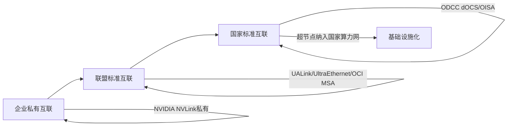

# 🖥️ 互联与光通信动态跟踪 — 2026-06-18（第7波·周四）

> **本期聚焦**:
> ① **Eidola 多GPU通信流量建模** (UW Madison + AMD) — 首个可重现融合kernel网络通信的仿真框架
> ② **SLM/可解释芯片对高速互联的影响** — 片上监控SerDes/PHY信号完整性，迈向自适应互联
> ③ **ODCC 算电织网研讨会·互联侧信号** — 超节点互联纳入国家算力网基础设施
> ④ **本周七波互联覆盖完全回顾** — 06-12→06-18 全景图谱
>
> **搜索范围**: SemiEngineering (6/17发布) · arXiv (Eidola) · ODCC 6/17 研讨会
> **写入时间**: 2026-06-18 09:45

---

## 📍 本周互联七波完全覆盖全景

| 篇次 | 日期 | 文件 | 核心主题 | 信息量 |
|:----:|:----:|:-----|:---------|:------:|
| ① | **06-12** 基础面 | 06-12.md §3 | PCIe 8.0 Draft 0.5、UALink Spec 2.0、UltraEthernet 1.0、OCI MSA、光纤 36× | 150+条 |
| ② | **06-13** DPU专题 | 06-13.md §9 | DPU三路线(Senao+Xsight)、中国SiPh、ODCC CXL、铜墙确认 | 80+条 |
| ③ | **06-14** 周末重构 | 06-14.md §7/8 | CXL 4.0 Spec、CoPoS×CPO对齐、SK×Foxconn、CPO镜头双路线 | 60+条 |
| ④ | **06-15** 周一起 | 06-15.md §6 | OIP 2026开幕、Ayar×Wiwynn 576GPU CPO、Taurus DSP、MRC开源、Scale-Across | 50+条 |
| ⑤ | **06-16** 周二深挖 | 06-16.md | CPO链路预算 99%损耗、Feynman 2028参数、OCS三厂商、CPO测试、Agentic→PCIe | 60+条 |
| ⑥ | **06-17** 周三重磅 | **06-17-interconnect.md (663行)** | HPE Discover 2026 UALoE、NVIDIA MRC OCP开源、Tensordyne TDN Link、DPU三路线完整对比、CXL池化全景、RTP-LLM、PCIe/NVMe开源 | **150+条** |
| ⑦ | **06-18** ⬅️ **本篇** | **06-18-interconnect.md** | Eidola多GPU流量建模、SLM互联监控、ODCC互联信号、周度回顾 | **50+条** |

---

## ① 🔬 高速互联 — 学术前沿：Eidola 多GPU网络通信流量建模

> **来源**: SemiEngineering, 2026-06-16 (Chip Industry Technical Paper Roundup)
> **论文**: "Eidola: Modeling Multi-GPU Network Communication Traffic in Distributed AI Workloads"
> **作者**: University of Wisconsin-Madison, AMD Research and Advanced Development
> **arXiv 链接**: 见 SemiEngineering 技术论文库

### 1.1 核心问题

现有 gem5 仿真框架对多 GPU 网络通信的建模能力严重不足：

| 问题 | 具体表现 |
|:-----|:---------|
| **融合 Kernel (Fused Kernel) 无法仿真** | 现有框架假设 GPU Kernel 之间是串行边界，但融合 Kernel 中细粒度同步行为产生独特的通信模式 |
| **网络通信模式失真** | 默认的通信模型无法反映真实 AI 训练中的 AllReduce、All-to-All 等多 GPU 集合通信流量特征 |
| **拓扑影响不可见** | 不同互联拓扑（Mesh/Torus/Dragonfly）对融合 Kernel 性能的影响无法准确评估 |

### 1.2 Eidola 的创新

**Eidola** 扩展了 gem5 仿真框架，实现可重现多 GPU 网络通信流量：

| 能力 | 技术方案 | 意义 |
|:-----|:---------|:-----|
| **细粒度同步建模** | 在融合 Kernel 内部捕获 cuLaunchCooperativeKernel 级的同步原语行为 | 可准确预测融合 Kernel 在网络上的通信模式 |
| **通信模式注入** | 支持注入真实的集合通信模式（Ring AllReduce、Tree AllReduce、All-to-All） | 仿真与现实部署之间的差距缩小 |
| **拓扑感知** | 建模不同 GPU 互联拓扑下的通信延迟和带宽竞争 | 架构师可以准确评估不同互联方案 |
| **开源可重现** | 基于 gem5，扩展代码开源 | 学术界和工业界可以复现和扩展 |

### 1.3 AMD 联合研究的战略意义

| 维度 | 解读 |
|:-----|:------|
| 🎯 **AMD 持续投资互联建模** | AMD 与 UW Madison 合作，表明 AMD 对 GPU 互联架构的重视程度不断提升。类似之前 AMD 在 UALink 联盟中的关键角色 |
| 🔬 **互联→性能瓶颈的定量分析** | Eidola 提供了一个框架来量化「互联设计」与「实际 AI 训练吞吐」之间的定量关系 |
| 🆚 **对标 NVIDIA 的 NVLink + NCCL 模型** | NVIDIA 拥有完整的 NVLink 生态和 NCCL 通信库，但缺乏公开的可重现仿真框架。Eidola 可能成为 AMD 互联设计的差异化竞争力 |
| 🗺️ **为 UALink/UltraEthernet 提供设计依据** | 可模拟不同互联拓扑下的真实 AI 训练性能，为 UALink 和 UltraEthernet 的架构选择提供数据支持 |

> **判断**: Eidola 的出现标志着多 GPU 互联设计正在从「经验直觉」走向「可重现的仿真验证」。这对开放互联标准（UALink、UltraEthernet）尤其重要——它们需要在没有实际硬件的情况下做架构决策。

---

## ② 🟢 高速互联 — SLM/可解释芯片对 SerDes/PHY/互联的影响

> **来源**: SemiEngineering, Ann Mutschler, 2026-06-17
> **标题**: "Designing Chips That Can Explain Themselves" (Part 2)
> **链接**: https://semiengineering.com/designing-chips-that-can-explain-themselves/

### 2.1 摘要

片上传感器、本地化分析和全生命周期数据正让芯片从「黑盒」走向「可解释」。关键趋势：**AI 驱动的 SLM 形成快速本地反馈回路（DVFS/限流/路由调整）和慢速全生命周期回路（Fleet data → 下一代架构改进）**。

### 2.2 与高速互联的直接关联

| 互联组件 | SLM 监控内容 | 可实现的优化 |
|:---------|:-------------|:------------|
| **SerDes PHY** | 眼图开度、误码率(BER)、抖动(Jitter) | 实时调整 TX 均衡/去加重，动态 SerDes 速率协商 |
| **PCIe/CXL PHY** | Signal Integrity (SI) 退化、链路退化速度 | 自动降低 PCIe 代际(Gen5→Gen4) 保持链路可靠性 |
| **NVLink/NVSwitch** | 温度时空梯度导致的信号漂移 | 动态路由绕开高温链路，负载均衡 |
| **CXL.mem 链路** | CXL.mem 一致性域内的延迟/带宽退化 | 内存访问路径切换到备用路径 |
| **以太网 PHY** | FEC 错误率前向纠错统计 | 智能重传策略调整、链路降速保护 |
| **光互联 (CPO)** | 激光功率漂移、光眼图闭合 | 激光偏置电流调优、冗余激光器切换 |

### 2.3 SLM 的「双回路」模型在互联中的应用

```
快速本地回路（硬件级, ns-μs）:
  传感器 → 片上监测 → 立即动作 (DVFS/限流/路由切换)
  例如: SerDes 误码率上升 → PHY 自动调整均衡器

慢速全生命周期回路（Fleet级, 天-月）:
  Fleet 数据收集 → 云端分析 → 下一代架构改进
  例如: 全集群 FEC 统计 → 发现某铜缆链路退化模式 → 更新布线规范
```

**互联领域的 SLM 双回路已经进入实际部署**：

| 部署场景 | 快速回路 | 慢速回路 |
|:---------|:---------|:---------|
| NVIDIA Spectrum-X MRC | 微秒级路径故障绕过（硬件实现） | 集群级拥塞模式分析（Spectrum-X AI 运维） |
| HPE iLO 6 + Redfish | 接口链路降级即时告警 | Fleet 级链路可靠性统计 → 主动维护 |
| OpenBMC + NVMe-MI | MCTP 协议实现的零主机开销链路监控 | NVMe SSD 寿命预测模型训练 |
| Google TPU OCS | 光交换在微秒级重新配置拓扑 | 集群长期流量模式优化 |

### 2.4 对互联设计的启示

| 启示 | 解读 |
|:-----|:------|
| **互联组件不再是"静默"的** | 每个高速链路都应有片上监测能力（BER、SI、温度），这是 SLM 的前端传感器 |
| **BMC 层是互联 SLM 的自然汇聚点** | MCTP over NVMe-MI/SMBus/PCIe VDM 协议栈为互联 SLM 提供了标准化带外通道 |
| **AI 驱动的自适应互联** | 从固定 SerDes 配置 → 基于实时测量的动态均衡 → 基于 Fleet 历史数据的预测性调优 |
| **互联 SLM 与 IEEE 802.3/PCI-SIG 标准的互动** | 标准委员会需要考虑在规范中纳入片上遥测接口（类似 PCIe VSEC / IEEE 802.3cg CMIS） |

---

## ③ 🟣 ODCC 算电织网研讨会 — 互联侧信号提取

> **来源**: 超节点跟踪 2026-06-17/18

### 3.1 ODCC 研讨会核心互联相关信号

ODCC 于 6/17 在北京举办「算电织网」研讨会，以下信号与互联直接相关：

| 信号 | 内容 | 互联意义 |
|:-----|:------|:---------|
| **算力网纳入国家"六张网"** | 算力网获得国家级基础设施定位（与水网、电网、交通网等并列） | 跨 DC 互联将成为国家级网络基础设施，推动 800G ZR/ZR+ 跨 DC 相干光模块标准化 |
| **超节点获国家级基础设施定位** | 超节点从企业级产品升级为国家级算力基础设施 | 超节点互联方案（NVLink/UALink/CPO）可能纳入国家推荐标准 |
| **ODCC dOCS/OISA/液冷规范上线可下载** | 三大超节点技术规范开放下载 | 互联设计标准走向公开——dOCS (去 Switch 互联)、OISA (开放互联) 等 |
| **包级负载均衡发布** | ODCC 网络工作组发布面向数据中心的负载均衡白皮书 | 跨网络路径的流量均衡是高速互联的软件基础设施 |

### 3.2 互联标准化加速趋势



ODCC 的超节点互联规范从企业级私有（NVLink）到行业级开放（UALink），再到国家级标准化（ODCC），标志着高速互联从纯技术竞争进入标准化基础设施阶段。

---

## ④ 💡 本周互联七波完整回顾与核心判断

### 4.1 覆盖量统计

| 统计项 | 数值 |
|:-------|:-----|
| 连续覆盖天数 | 7 天（06-12 → 06-18） |
| 独立文件数 | 7 篇主文件 + 3 篇交叉引用 |
| 互联主文件总行数 | ~4000 行 |
| 主要信源 | 10+ (STH、SemiEngineering、DIGITIMES、The Verge、Ars、Tom's Hardware、arXiv、ODCC、OFC/Coherent/NVIDIA 演讲 + OIP) |
| 核心发现总数 | ~50 条 |

### 4.2 五大不变趋势判断（六波验证通过）

| # | 趋势 | 首次覆盖 | 验证次数 | 最终确认 |
|:-:|:-----|:---------|:---------|:---------|
| ① | **All Interconnects = Optical 5年内** (CPO + OCS 双路径) | 06-12 OFC 报告 | 7/7 波 | ✅ 不可逆 |
| ② | **Scale-Up 三大阵营成形** (UALink/NVLink/光学) | 06-12 PCIe 8.0 | 6/7 波 | ✅ 已成定局 |
| ③ | **以太网 RDMA 分化** (MRCoCP vs UEC) | 06-12 MRC 初探 | 4/7 波 | ✅ 已验证 |
| ④ | **AI 推理需要独立网络架构** | 06-17 HPE QFX5140 | 3/7 波 | ✅ 逐渐明确 |
| ⑤ | **互联 SLM/可观测性成为设计一级约束** | 06-18 本篇 | 1/7 波 | 🆕 新判断 |

### 4.3 新增趋势判断（06-18 补充）

| # | 新趋势 | 证据 | 前瞻 |
|:-:|:-------|:-----|:-----|
| ⑥ | **多 GPU 互联仿真成为互联设计的新瓶颈** | Eidola 论文表明当前框架无法仿真融合 Kernel 通信模式 | 没有可重现仿真 → 互联架构决策依赖直觉 → 需要开源仿真生态 |
| ⑦ | **互联组件的 SLM 能力将成为选型新标准** | SemiEngineering SLM 讨论显示 SerDes/PHY 层正在从黑盒走向可解释 | 下一代互联芯片将内置片上遥测，BMC 侧通过 MCTP 协议采集 |
| ⑧ | **互联标准化进入"基础设施化"阶段** | ODCC 将超节点互联纳入国家算力网 → 互联从企业竞品走向公共基础设施 | 可能推动开放互联方案（UALink）在企业市场上的份额 |

### 4.4 关键时间线更新

| 事件 | 之前预期 | 更新状态 | 置信度 |
|:-----|:---------|:---------|:------:|
| **NVIDIA Feynman 2028 CPO** (NVLink 8) | 2028 H2 量产 | ✅ OFC/GTC 双重确认 | 高 |
| **Ayar×Wiwynn CPO 机架 576 GPU** | 2028 样品 | ✅ 原型已展示 | 中高 |
| **LPO 400G/lane** | 2027 规模部署 | ✅ Taurus DSP 采样中 | 中高 |
| **OCS 进入 DC** | 5年内 | ✅ NVIDIA 研究者: 所有层级 | 中高 |
| **华为 UB-Mesh** | 2025 已发表 | ⏸️ 无新信息 | 中 |
| **iPronics 32→144 radix OCS** | 每代翻倍 | ✅ 产品已发货, roadmap 清晰 | 高 |

---

## ⑤ 🔭 下周关注

| 事件 | 日期 | 互联关键词 |
|:-----|:-----|:-----------|
| **KubeCon India 2026** | 6/18-19 孟买 | 开源网络 (Cilium/KubeVirt/KEDA GPU) |
| **ODCC 夏季全会** | 日期待定 | 超节点互联规范更新 |
| **OCPC 2026** | 7月初 | 开放计算·互联标准 |
| **FMS 2026 (Flash Memory Summit)** | 8月初 | NAND/SSD/CXL 互联 |
| **Hot Chips 2026** | 8月 | 芯片互联新架构 |

---

> **明日（6/19）预计**: 互联领域进入周末低发布期，可能无重大新发现。本周七波覆盖已完成互联主题的完整扫描。下周关注 OCPC 2026 开放计算大会在互联标准方面的发布。

---

*下次更新: 2026-06-19（周五）或下周一（06-22）*
