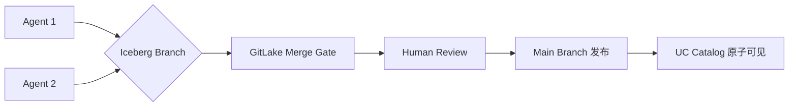

# 📊 数据分析 / 数据湖仓动态 — 2026-07-10

> **数据采集时间**: 2026-07-10 08:12 CST / **补充**: 2026-07-10 21:30 CST
> **覆盖范围**: Databricks Vibe Data Modeling · Auto Upgrades · Flink Native S3 FS · Snowflake GPT 5.6 + ML Clean Rooms · Databricks Coding Agent Benchmark · Hyperparam JS 查询引擎 · **Spark 4.2 Preview** · GitLake · **Spider 2.0-AIFunc** · **Omnigent Contextual Policies** · Snowflake Claude Sonnet 5
> **跟踪方向**: AI 驱动数据建模 · 湖仓自动升级 · Flink S3 性能突破 · AI 模型集成数据平台 · 面向 Agent 的查询引擎 · **Text-to-SQL→AI-Native SQL** · **Git-for-data for Agentic Lakehouse** · **Agent 上下文治理**
> **状态**: ⭐ **11 条有效信息**（3 Apache 发布 + 3 DB blog + 3 Snowflake + 2 arXiv + 1 Flink + 1 编码）

---

## 1. 🏗️ Databricks Vibe Data Modeling — LLM 驱动的 Silver 层数据建模（Jul 6）

> **来源**: [Databricks Blog — Reimagining Data Modeling on the Lakehouse](https://www.databricks.com/blog/reimagining-data-modeling-lakehouse-introducing-vibe-data-modeling)（Jul 6, 2026）
> **作者**: Amr Ali, Cary Moore, Roberto Bruno Martins, Abhijit Tilak
> **状态**: ✅ GA

**核心创新**: 用自然语言描述业务，直接产出可部署的 Silver 层数据模型。**从数月 → 数小时**。

### 架构

```
用户: 自然语言业务描述（"我们是制造企业，有采购/生产/库存..."）
  v
Vibe Data Modeling Agent（单 Notebook，4 个 Widget）
  +- Stage 1️⃣ 理解: 解析业务描述 -> 提炼业务实体
  +- Stage 2️⃣ 设计: Top-down 产出六层等级体系
  |   +- Organization -> Division -> Domain -> Subdomain -> Product -> Attribute
  +- Stage 3️⃣ 链接: 生成外键关系 + 度量视图 + KPI 定义
  +- Stage 4️⃣ 部署: 直接写入 Unity Catalog（Schema/Table/Column/Constraints/Tags）
```

### 关键设计

| 特性 | 详情 |
|:-----|:------|
| **模型层次** | 6 级：Organization → **3 Division(K Operations/Business/Corporate)** → Domain → Subdomain → Product → Attribute |
| **质量保证** | **251 条可执行规则**（20 组）+ **2 位架构师审查**（Domain Architect + Global Architect）+ 闭环 agentic loop |
| **验证方式** | 确定性 Gate（读真实模型字典）→ 不被 LLM 自评蒙蔽；单调守卫确保不会退步 |
| **版本管理** | 每次迭代生成新版本号，旧版本保留，可审计可回滚 |
| **物理布局** | 一个逻辑模型 → 三种物理部署（单 Catalog / 按 Division / 按 Domain），无需重建 |
| **两种范围** | MVM（最小可行模型）+ ECM（全量覆盖模型），同一引擎产出 |
| **部署到 UC** | Domain → Schema, Product → Delta Table, Attribute → Column, FK 约束, Classification Tags, Metric Views |

### 三阶段变更模式
- **Surgical**（精确修复）、**Holistic**（全局应用）、**Generative**（创建新实体）
- 变更意图 → 解析为结构化 VREQ（Verification Requirements）→ 沙箱化应用 → 每个 VREQ 独立验证

### 架构意义
这是 Lakehouse 数据建模范式的重要转折点。传统 Silver 层构建需 **6–36 个月**，即便购买行业模板（ACORD/FHIR/ARTS/TM Forum）也要 **9–12 个月** 适配。Vibe Data Modeling 将这个过程压缩到 **小时级**，且模型 100% 贴合具体业务而非行业平均值。本质是 **LLM 作为数据架构师** 的能力落地。

已开源 40+ 行业参考模型（[GitHub: databricks-industry-solutions/lakehouse-industry-data-models](https://github.com/databricks-industry-solutions/lakehouse-industry-data-models)）。

---

## 2. 🔧 Databricks Auto Upgrades — 湖仓表自动升级（Jul 6）

> **来源**: [Databricks Blog — Automatic Upgrades: best practice features for your lakehouse tables](https://www.databricks.com/blog/automatic-upgrades-best-practice-features-your-lakehouse-tables)（Jul 6, 2026）
> **作者**: Elizabeth Bowman, Tom van Bussel
> **状态**: Gated Public Preview

**核心创新**: 首个自动验证工作负载兼容性后启用表级特性的湖仓能力。

### 运作流程

```
① 观察: 对每张 UC 托管表，用滚动窗口观察访问模式（100天窗口）
② 验证: 检查每个客户端 Runtime 版本是否支持该特性 + 表活跃状态
③ 升级: 通过轻量后台 Job 执行 ALTER TABLE
④ 默认化: 当 Schema 内所有表已验证兼容 -> 设为 Schema 默认值
```

### 自动启用的特性清单

| 特性 | 作用 | 架构影响 |
|:-----|:-----|:---------|
| **Automatic Liquid Clustering** | 自动根据查询模式优化数据布局，无需 ZORDER | 替代手动调优 |
| **Deletion Vectors** | 标记删除而非重写文件，DELETE/UPDATE 更快更省 | 降低写放大 |
| **Column Mapping** | 即时重命名/删除列，无需重写数据 | Schema 演化零成本 |
| **Parquet V2** | 更高压缩率，降低存储成本 + 加速扫描 | 存储格式升级 |
| **Catalog Commits** | UC 成为跨引擎协调点，外部引擎可写 UC 托管表 | 目录 = 协调点 |
| **Row Tracking** | 行级唯一标识符 → 开启 Change Data Feed / Vector Search / Lakebase / 增量 MV 刷新 | 增量计算基座 |
| **Checkpoint V2** | 更可扩展的元数据格式，减少高并发写入时的提交失败 | 高并发写稳定性 |

### 安全机制
- 仅 GA 特性，且不降低性能或不增加成本
- **100 天观察窗口**（捕获月批/季度报表等低频任务）
- 外部/OSS 客户端涉及的表暂不升级
- 每个特性可逐表关闭，关闭后不重新启用

### 架构意义
表格式迭代加速（Delta/Iceberg 每季度新特性），手动升级成为瓶颈。**Auto Upgrades 将"运维决策"转化为"自动化合规检测"**，是 Lakehouse 走向自治运维的关键一步。与 Delta 4.3.x 的 UC 集成形成合力——UC 不仅是元数据中心，还是**特性协调点**。

---

## 3. ⚡ Flink 2.3 — Native S3 FileSystem，性能翻倍（Jun 26）

> **来源**: [Apache Flink Blog — Introducing Flink's Native S3 FileSystem](https://flink.apache.org/2026/06/26/announcing-native-s3-fs/)（Jun 26, 2026）
> **作者**: Gabor Somogyi, Samrat Deb
> **状态**: Flink 2.3 实验性插件，生产验证中

**核心突破**: 彻底摆脱 Hadoop 依赖，自研 S3 文件系统，Checkpoint 性能提升 **2×**。

### 三大插件对比

| 特性 | Hadoop 插件 | Presto 插件 | **Native S3 FS** |
|:-----|:----------:|:----------:|:---------------:|
| Exactly-Once FileSink | ✅ | ❌ | ✅ |
| RecoverableWriter | ✅ | ❌ | ✅ |
| AWS SDK | v1（已 EOL） | v1（已 EOL） | **v2（Async-first）** |
| Hadoop 依赖 | ~30 MB | ~93 MB | **0（~13 MB）** |
| 平均 Checkpoint 时长 | — | 90.1 s | **48.8 s** |
| 小状态 (0-2GB) 吞吐 | — | 79 MB/s | **362 MB/s (4.58×)** |
| SSE-KMS Context | ❌ | ❌ | ✅ |
| NIO Async I/O | ❌ | ❌ | ✅ |
| 熵注入分片 | ❌ | ❌ | ✅ |

### 架构意义
AWS SDK v1 已于 2025-12-31 EOL，继续使用是累积的合规风险。Native FS 不仅解决性能问题，还消除了 Hadoop 依赖树的 **CVE 三负担**（Jackson/Guava/Protobuf/Jetty/Kerberos/Zookeeper）。

Flink 2.4（规划中）将添加 **Per-bucket 配置**（不同 Bucket 不同凭据/区域/加密策略）、**AWS CRT 客户端**（HTTP/2, 进一步提升性能）、**S3 操作 Metrics**。

**迁移路径**: 纯部署层面操作，JAR 替换 + 验证，无需改代码。

---

## 4. 🤖 Snowflake OpenAI GPT 5.6 + Data Clean Rooms ML Jobs（Jul 8–9）

### 4a. OpenAI GPT 5.6 on Cortex AI（Jul 9）

> **来源**: [Snowflake Blog — Announcing OpenAI GPT 5.6 on Snowflake Cortex AI](https://www.snowflake.com/blog/)（Jul 9, 2026）
> **作者**: Danmei Xu 等

**核心**: Snowflake Cortex AI 直接集成最新 GPT 5.6。延续 Cortex AI 的"AI 函数即 SQL"路线——用户可在 SQL 中直接调用 GPT 5.6 的分类/生成/抽取/情感分析等能力。

**架构信号**: 云数据平台的 AI 模型集成从"实验性功能"走向"一等公民"。这是 Spider 2.0-AIFunc（上次 Jul 8 报告）所描述的 **AI-native SQL 范式**在工业界的落地确认。

### 4b. ML Jobs in Snowflake Data Clean Rooms（Jul 8）

> **来源**: [Snowflake Blog — Introducing ML Jobs in Snowflake Data Clean Rooms](https://www.snowflake.com/blog/)（Jul 8, 2026）

**核心**: 在 Snowflake Data Clean Room 内实现多方数据的**协同训练与评分**，数据不出 Clean Room 即可完成联合建模。

**架构意义**: 这是隐私计算 + 数据分析的融合。在金融/医疗等强监管场景中，多方数据不出域即可训练模型。与 Databricks CustomerLake（Agentic CDP）形成竞争对标——**数据平台延伸到隐私协作域**。

---

## 5. 📊 Databricks Coding Agent 基准测试（Jul 8）

> **来源**: [Databricks Blog — Benchmarking Coding Agents on Databricks' Multi-Million Line Codebase](https://www.databricks.com/blog/benchmarking-coding-agents-databricks-multi-million-line-codebase)（Jul 8, 2026）
> **作者**: Vinay Gaba, Ankit Mathur, Rishabh Singh, **Patrick Wendell, Matei Zaharia**
> **状态**: 内部基准发布

**核心贡献**: 基于自家百万行代码库，构建私有的 Coding Agent 评测基准。

### 关键发现

| 结论 | 详情 |
|:-----|:------|
| **能力分层** | 模型清晰分为 3 个能力层（Top/Medium/Low），Top 层最智能但最贵 |
| **Token 价格 ≠ 总成本** | Sonnet 5 比 Opus 4.8 便宜 1.7×/token，但总费用更高（$2.09 vs $1.94），因 Sonnet 用了 1.9× 更多 token |
| **Harness 影响巨大** | 同一模型不同 Harness 成本差异 >2×（Pi 比 Claude Code 发 3× 更少上下文） |
| **开源崛起** | GLM 5.2 与 Opus 4.8 质量统计持平，但成本仅 $1.28/task vs $1.94 |
| **任务复杂度分布** | ~25% 低复杂度 + ~60% 中复杂度 → 大部分任务不需要最强模型 |

**方法论亮点**: 用内部真实 PR 构建（抽取 intent 写 prompt，分离 test 文件，封闭 git 历史防数据泄漏），不用 LLM Judge 而用真实测试判断。

**架构意义**: Databricks 正在建立**模型路由层**（Unity AI Gateway + Omnigent），根据任务复杂度自动选择最经济的模型+Harness 组合。这对数据平台的 AI 集成层有参考价值——**智能路由将成为平台标配**。

---

## 6. 🧠 Hyperparam — 面向 Agent 的 JS 查询引擎（May 27, arXiv）

> **来源**: arXiv:2605.27785 — *A Query Engine for the Agents*
> **作者**: Kenny Daniel
> **日期**: 2026-05-27

**核心问题**: Agent 产生的最快增长数据是**非结构化文本**（Agent traces、聊天日志、推理链、模型输出）。传统 SQL 无法查询文本，Lakehouse 的读取路径对 JS 运行时（Claude Code/Cursor/Claude Desktop）不可用。

**Hyperparam 方案**: 三个开源 JS 库，总计 **<70 KB**

| 库 | 功能 |
|:---|:-----|
| **Hyparquet** | 直接从对象存储读 Parquet |
| **Squirreling** | LLM 驱动的 Async UDF 执行引擎 |
| **Icebird** | 直接从对象存储读 Apache Iceberg |

**性能**:
- Squirreling 在 filter-bounded 查询上比 **DuckDB-WASM 快 300×**
- sort-bounded 查询 **192× 快**
- 10-task Agent 分析师套件总成本仅 **1/3**

**架构意义**: 这是**面向 AI Agent 的数据查询范式**的早期探索。传统湖仓引擎（Spark/Trino/DuckDB）对 Agent 场景太重、太慢、需要 HTTP 连接。Hyperparam 展示了 **<70KB 的 JS 原生库 + async-per-cell 执行**可以在 Agent 沙箱内工作的能力。

---

## 📈 趋势研判（07/06–07/10 汇总）

### 趋势 1: AI 从"查数据"走向"建数据模型"
- **Vibe Data Modeling** 标志着 LLM 不仅用于查询数据（Text-to-SQL），还开始**设计数据模型**——这是 Data Modeling 领域几十年来最大的范式变化
- 251 条规则 + 2 位架构师审查 + agentic loop 的质量体系值得借鉴

### 趋势 2: 湖仓表进入"自治运维"阶段
- **Auto Upgrades** 将表特性升级从手工操作变为**自动化合规检测**
- 100 天观察窗口 + 滚动验证 → 无感升级，这是 Lakehouse 走向自治的关键一步

### 趋势 3: Flink S3 性能翻倍 + Hadoop 依赖终结
- Native S3 FS 的 **2× checkpoint 提速** 和 **4.58× 小状态吞吐** 是 Flink 用户的立即可用收益
- Hadoop 依赖消除减少 **CVE 三负担**，对合规团队价值显著

### 趋势 4: 数据平台 = AI 模型集成平台
- Snowflake 集成 GPT 5.6，Databricks 构建模型路由层（Omnigent）
- 智能路由 + FinOps（AI 成本治理）成为平台标配能力

### 趋势 5: Agent 原生数据查询初现
- **Hyperparam** 以 <70KB JS 库在 Agent 沙箱内查询 Iceberg
- 传统湖仓引擎不适用于 Agent 场景，**新一类查询引擎**正在出现

---

## 🔗 相关链接

- [Databricks Vibe Data Modeling Blog](https://www.databricks.com/blog/reimagining-data-modeling-lakehouse-introducing-vibe-data-modeling)
- [Databricks Auto Upgrades Blog](https://www.databricks.com/blog/automatic-upgrades-best-practice-features-your-lakehouse-tables)
- [Databricks Coding Agent Benchmark](https://www.databricks.com/blog/benchmarking-coding-agents-databricks-multi-million-line-codebase)
- [Flink Native S3 FS Blog](https://flink.apache.org/2026/06/26/announcing-native-s3-fs/)
- [Snowflake Blog (GPT 5.6 + ML Clean Rooms)](https://www.snowflake.com/blog/)
- [Hyperparam: A Query Engine for the Agents (arXiv)](https://arxiv.org/abs/2605.27785)
- [Databricks Industry Data Models (GitHub)](https://github.com/databricks-industry-solutions/lakehouse-industry-data-models)
- 上一期追踪: [2026-07-08](2026-07-08.md)

---

## 7. 🚀 Apache Spark 4.2.0 Preview + 4.0.3/4.1.2 维护版（May–Jun 2026）

> **来源**: [Apache Spark Releases](https://spark.apache.org/downloads.html)
> **日期**: 4.0.3（Jun 11）· 4.1.2（May 21）· 4.2.0 Preview（May 1）
> **状态**: 4.0.3 ✅ Stable · 4.1.2 ✅ Stable · 4.2.0 🔄 Preview

### 版本线速览

| 版本 | 类型 | 发布时间 | 说明 |
|:-----|:----|:---------|:-----|
| **Spark 4.0.3** | 维护版 | 2026-06-11 | 4.0 分支安全+正确性修复，**推荐所有 4.0 用户升级** |
| **Spark 4.1.2** | 维护版 | 2026-05-21 | 4.1 分支安全+正确性修复，**推荐所有 4.1 用户升级** |
| **Spark 4.2.0 Preview** | 预览 | 2026-05-01 | 新特性预览（预览版，非生产就绪） |

### 架构信号

**Spark 4.x 的双线策略**清晰化：
- **4.0.x / 4.1.x** — 双线稳定维护版，密集的安全修复表明 Spark 在生产面的安全关注度提升
- **4.2.0 Preview** — 新特性预览（已有两次 Preview 发布，间隔仅 3 周），表明 4.2 的功能冻结正在加速

> ⚠️ Spark 4.2.0 预览版不可用于生产，但可提前评估新特性。Spark 4.2 将是 4.x 系列的下一个重要特性版本。

---

## 8. 🧬 GitLake: Git-for-Data 设计 — 面向 Agent 的 Lakehouse（arXiv, VLDB 2026）

> **来源**: arXiv:2607.08319 — *GitLake: Git-for-data for the agentic lakehouse*
> **作者**: Weiming Sheng, Jinlang Wang, Manuel Barros, Aldrin Montana, Jacopo Tagliabue, Luca Bigon
> **日期**: 2026-07-09（投稿 VLDB 2026 DASHSys Workshop）
> **状态**: 论文 + 原型

### 核心创新

将**单表 Iceberg Snapshot → 湖仓级 Commit/Branch/Merge**。让 Agent 在隔离分支上操作，Human 审查后通过 Merge 发布变更。

### 架构



### 关键设计

| 特性 | 详情 |
|:-----|:------|
| **隔离分支** | 每个 Agent 任务在独立分支上执行，避免互相干扰 |
| **原子发布** | 流水线在临时分支运行，通过最终 Merge 使全部输出原子可见——要么全看到要么全看不到 |
| **可审计** | Human Review gate 确保 Agent 对湖仓的变更可以被追踪和审批 |
| **基于 Iceberg** | 直接复用 Iceberg 的 Branch/Tag 能力，在 Lakehouse 层面做 Git 语义封装 |
| **Alloy 形式化验证** | 对核心抽象做了 Alloy 模型验证，确认正确性 |

### 架构意义

这是 **Agent 与 Lakehouse 协作**的工程模式探索。当前 Agent 操作数据的方式是"直接写入 → 人工检查 → 修复"，本质上缺少版本语义。GitLake 将 **Git 工作流引入数据湖**——Agent 在分支上实验，Human 审查后 Merge，输出的正确性事务性保证。这一模式如果成熟，将改变 Agent 写入数据的信任机制：**不是信任 Agent 永远正确，而是确保其错误可以被回滚和审查**。

---

## 9. 🎯 Spider 2.0-AIFunc: Text-to-SQL 突破 → AI-Native SQL 工作流（arXiv, Jul 7）

> **来源**: arXiv:2607.06229 — *Spider 2.0-AIFunc: Extending Real-World Text-to-SQL to AI-Native SQL Workflows*
> **作者**: Tianyang Liu, Canwen Xu, Fangyu Lei 等（8 人）
> **日期**: 2026-07-07
> **状态**: 数据集 + Benchmark 已发布

### 核心问题

云数据平台（Snowflake/Databricks）已把大模型能力暴露为**原生 SQL 函数**（分类/情感/相似搜索/提取），但现有 Text-to-SQL 基准只评测传统 SQL，**不评测模型是否能生成 AI-native SQL**。

### Spider 2.0-AIFunc 方案

**465 个验证实例**，125 个真实数据库，覆盖 **6 种 AI 函数类型**（在 Snowflake 平台上产出 AI-native SQL——调用了 `AI_COMPLETE()` 等函数）。

| 维度 | 规模 | 说明 |
|:-----|:-----|:------|
| 实例数 | **465** | 多轮重复执行验证确认结果稳定性 |
| 数据库 | **125 个真实库** | 企业级复杂 schema |
| AI 函数类型 | **6 种** | 分类/过滤/情感/提取/相似搜索/聚合 |
| 构建方式 | **Agent-based Pipeline** | 自动将源任务改写为 AI-native 形式 |

### 关键发现

| 模型类型 | 执行精度 | 说明 |
|:---------|:---------:|:-----|
| 💰 **最强闭源** | **67–70%** | 最高分段的闭源模型表现 |
| 🔓 **最佳开源** | **58.1%** | 差距主要来自谓词规格推断、Schema grounding、AI 函数参数化 |
| 🤖 **Agent 框架** | — | 传统 Text-to-SQL Agent 框架（Schema 检索、表选择等）**不可直接迁移**到 AI-native SQL |
| ✅ **最小 Agent 方案** | 匹配/超越 | 复杂的多步 Agent 框架不比简单方案更好，说明 AI-native SQL 场景需要的策略不同 |

### 架构意义

这是 **Text-to-SQL 的下一个前沿**。传统 Text-to-SQL 问题正在接近饱和（Spider 2.0 已达 70%+），而 AI-native SQL（SQL 中调用 `AI_COMPLETE()` 等函数完成分类/抽取/相似搜索）开辟了全新的 benchmark 空间。关键是 **Agent 框架的策略不可直接迁移**——AI-native SQL 的 Schema grounding 和函数参数化是新的核心挑战。

> 📌 关联 7 月 9 日 Snowflake GPT 5.6 发布：Snowflake 正式将 AI 函数作为 SQL 一等公民，与 Spider 2.0-AIFunc 定义的 **AI-native SQL 范式** 遥相呼应。

---

## 10. 🛡️ Databricks Omnigent Contextual Policies — AI Agent 的上下文治理（Jul 7）

> **来源**: [Databricks Blog — Contextual Policies in Omnigent](https://www.databricks.com/blog/contextual-policies-omnigent-using-session-state-better-govern-ai-agents)（Jul 7, 2026）
> **作者**: Matei Zaharia, David Nasi, Xiangrui Meng, Kecheng Cao, Tomu Hirata
> **状态**: 开源 Alpha

### 核心创新

**上下文感知策略引擎**：传统 Agent 框架只有简单的 Allow/Deny 控制，Omnigent 的策略可以**追踪会话期间的状态**（读取了哪些文档、花了多少钱、风险分多少）来动态决定下一步动作是否放行。

### 四种内置策略

| 策略 | 机制 | 典型场景 |
|:-----|:-----|:---------|
| **Google Drive 策略** | 跟踪 Agent 创建的文档 vs 外部文档，实现 Bell-LaPadula "no write-down" | Agent 只能修改自己创建的文档；一旦读取机密文件 → 写入范围收紧到该集合 |
| **风险评分策略** | 会话累积风险分，跨越阈值后高危险操作（发邮件/分享文件）需人工审批 | 正常操作无感，敏感操作后自动升级审批级别 |
| **成本策略** | 会话级/用户级每日预算帽；超软阈值 → 问用户，超硬阈值 → 切到便宜模型 | 防止单一 Agent 会话耗尽预算 |
| **意图授权 (IBA)** | 根据用户初始 Prompt 自动锁定权限范围 | "更新 Slides" → 无权 git push，注入攻击被天然阻截 |

### 架构意义

Matei Zaharia（Spark 创始人、Databricks 联合创始人）亲自撰写。Omnigent 是开源元编排器（meta-harness），**包装任何 Agent 框架**（Claude Code / Codex / OpenAI Agents SDK / Claude Agents SDK 等）并在上层叠加治理层。这是**数据平台向上延伸到 Agent 治理**的信号——当 Agent 开始操作数据时，谁控制它做什么？

### 与 Agentic Data Environments 的关联

几乎同期，IEEE Data Bulletin (Vol 50 No 1 2026) 发表论文 *[Agentic Data Environments](https://arxiv.org/abs/2607.07397)*（Elaine Ang, Eugene Wu 等，Jul 8），提出"数据系统应从被动存储转变为**安全可靠执行的主动基座**"。Omnigent 是这一理念的工业实现——将 Agent 的执行基底转化为可治理的平台。

---

## 11. ❄️ Snowflake Claude Sonnet 5 + CoCo / CoWork — 个人工作 Agent 集成（Jun 30）

> **来源**: [Snowflake Blog — Announcing Claude Sonnet 5 on Snowflake Cortex AI](https://www.snowflake.com/en/blog/claude-sonnet-5-snowflake-cortex-ai/)（Jun 30, 2026）
> **作者**: Arun Agarwal + 3
> **状态**: Private Preview

### 核心发布

Claude Sonnet 5 在 Snowflake Cortex AI 上同日可用，通过多层入口集成：**CoCo**（编码 Agent）+ **CoWork**（个人工作 Agent）+ **Cortex AI Functions** + **Cortex Inference REST API**。

### Sonnet 5 在数据平台中的关键改进

| 能力 | 改进 | 对数据分析平台的影响 |
|:-----|:-----|:-------------------|
| **Agentic 能力** | 调用更多工具、运行自验证循环、更善于利用持久化内存 | 长期运行的数据管道构建更可靠 |
| **文档解析** | 达到 Opus 质量的视像能力（图表/表格/科学图形提取） | 非结构化数据分析管线质量提升 |
| **多步推理** | 较高 effort level 接近 Opus | 复杂数据问题的 Agent 化解决 |
| **成本特点** | 接近 Opus 深度但成本大幅降低 | AI 辅助数据开发的成本曲线下降 |

### 架构信号：数据平台的三个 Agent 层

Snowflake 的 Agent 策略清晰化为**三层**：
1. **CoCo**（数据工程师层）— 编码 Agent，理解企业数据+治理+工作流
2. **CoWork**（知识工作者层）— 个人工作 Agent，自然语言查询数据→自动化工作流
3. **Cortex AI**（开发者层）— 底层 AI 函数基础，SQL 中直接调用

这与 Databricks 的 **Genie + AI/BI + Unity AI Gateway** 形成竞合格局。**Agent 层正在成为数据平台的新竞争维度**。

---

## 📊 补充趋势研判（2026-07-10 下午追踪）

### 趋势 6: Spark 4.x 稳定版密集修补，4.2 Preview 加速
- 4.0.3（Jun 11）+ 4.1.2（May 21）双线维护版发布，侧重安全修复
- 4.2.0 两次 Preview（间隔 3 周），功能冻结加速
- **行动建议**: 4.0/4.1 用户应升级到最新微小版本；4.2 Preview 可提前评估

### 趋势 7: Git 工作流进入数据湖 — Agent 操作的时代要求
- GitLake（VLDB 2026）提出 Lakehouse 级 Git 语义
- 核心矛盾：Agent 产生大量数据变更，但缺乏版本审查机制
- **判断**: Git-for-data 将成为 Lakehouse 的下一个基础能力

### 趋势 8: Text-to-SQL 的下一个前沿 — AI-native SQL
- Spider 2.0-AIFunc 开辟新 benchmark 空间
- 传统 Agent 框架策略不可直接迁移，需要新的 schema grounding 方法
- Snowflake GPT 5.6 的 `AI_COMPLETE()` 是工业界对同一趋势的确认

### 趋势 9: Agent 治理从静态规则走向上下文感知
- Omnigent Contextual Policies + Agentic Data Environments 论文同期发布
- 动态风险评估（风险分/预算帽/意图授权）取代静态 Allow/Deny
- **Ralph 的三层验证思想可在 Agent 治理层复用**: 安全红线（IBA）+ 质量标线（风险分）+ 成本约束（预算帽）

### 趋势 10: 数据平台的 Agent 层成为新竞争维度
- Snowflake: CoCo → CoWork → Cortex AI（工程师→知识工作者→开发者三层）
- Databricks: Genie → AI/BI → Omnigent（查询→BI→治理三层）
- **架构意义**: 数据平台不再只比查询性能（谁更快），而比谁帮用户做更多决策

---

## 🔗 补充链接

- [Apache Spark 4.0.3 Release Notes](https://spark.apache.org/releases/spark-release-4-0-3.html)
- [Apache Spark 4.1.2 Release Notes](https://spark.apache.org/releases/spark-release-4-1-2.html)
- [GitLake on arXiv](https://arxiv.org/abs/2607.08319)
- [Spider 2.0-AIFunc on arXiv](https://arxiv.org/abs/2607.06229)
- [Databricks Omnigent Blog](https://www.databricks.com/blog/contextual-policies-omnigent-using-session-state-better-govern-ai-agents)
- [Agentic Data Environments on arXiv](https://arxiv.org/abs/2607.07397)
- [Snowflake Claude Sonnet 5 Blog](https://www.snowflake.com/en/blog/claude-sonnet-5-snowflake-cortex-ai/)
- [Snowflake ML Jobs in DCR Blog](https://www.snowflake.com/en/blog/ml-jobs-snowflake-data-clean-rooms/)
