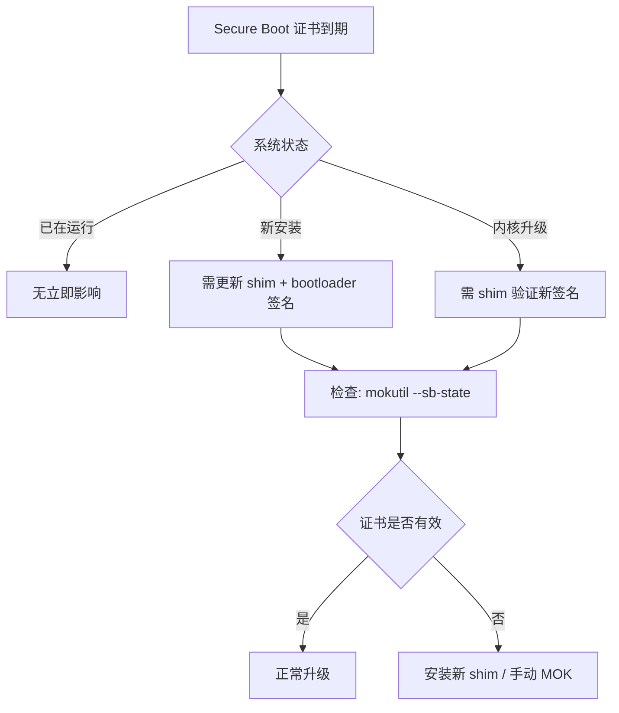

# 🖥️ 运维运营跟踪日志 — 2026-07-03

> 数据来源: LWN.net · CNCF Blog · K8s Blog · Git 发布公告
>
> **今日重点: LLM 辅助内核补丁"冰火两重天"——established vs unknown 开发者待遇差异 · Secure Boot 证书到期运维指南 · Fedora AI Desktop 倡议关闭 · Git 2.55 正式发布**

---

## 1️⃣ 🔴 LLM 辅助内存管理补丁集的冰火两重天

- **来源**: [LWN.net — Two LLM-assisted memory-management patch sets](https://lwn.net/Articles/1029472/) (2026-07-02)
- **作者**: corbet
- **热度**: 🔴 **首次详细讨论 LLM 辅助内核补丁的差异化接受度**

**核心发现**:

内核社区近期涌入了大量 LLM 辅助补丁，主要来自以前不为人知的开发者。但本次讨论的是**两个由知名长期维护者提交的 LLM 辅助大补丁集**，却收到了截然不同的对待：

| 维度 | 补丁集 A | 补丁集 B |
|:-----|:---------|:---------|
| **提交者** | Established maintainer | Established maintainer |
| **问题领域** | 内存管理 (mm) | 内存管理 (mm) |
| **LLM 使用方式** | LLM 生成 prototype + 人工重构 | LLM 直接生成完整补丁 |
| **社区反应** | 认真审阅、讨论改进方向 | 被要求"重新用非 LLM 方式实现" |
| **关键差异** | 提交者能清晰解释代码逻辑 | 提交者无法完全解释 LLM 生成的部分 |

**关键结论**:
- LLM 辅助本身不是问题，但 **"提交者能否理解并解释代码"** 是区分线
- Established 开发者用 LLM 行得通，因为他们知道"什么是好代码"
- Unknown 开发者用 LLM 暴露更快，因为缺少对内核代码库的深度理解
- 社区正在形成非正式共识：LLM 辅助补丁需要更高的审查门槛和更透明的披露

**🔗 关联**: K8s AI 政策 (7/02 #1) + Fedora AI Agent 账户入侵 (6/28 #1) + Akrites AI 防御 (6/28 #2)

---

## 2️⃣ 🔴 Secure Boot 证书到期运维指南

- **来源**: [LWN.net — Secure Boot certificate expiration is here](https://lwn.net/Articles/1025956/) (2026-07-01)
- **作者**: bexelbie (Microsoft)
- **热度**: 🔴 直接影响所有启用了 Secure Boot 的 Linux 系统

**时间线**:
- 微软 2026 证书已到期
- 已启动的系统不会因此拒绝启动（缓存机制）
- **真正危险**: 新安装/新内核/新 bootloader 无法再被签名
- shim 签名信任链窗口正在关闭

**运维操作建议**:

**关键行动**:
1. `mokutil --sb-state` 检查 Secure Boot 状态
2. 更新 shim 到最新版本（2026 年后签名版本）
3. 检查 `/boot` 分区上 bootloader/shim 的签名时间
4. 对于无法更新 shim 的 Legacy 系统 → 临时关闭 Secure Boot

**🔗 关联**: Fedora AI Agent 入侵推动 2FA (6/28 #1) — 基础设施安全双重压力

---

## 3️⃣ 🟡 BPF 本地存储性能优化：锁竞争瓶颈深入分析

- **来源**: [LWN.net — Efficient access to local storage for BPF programs](https://lwn.net/Articles/1026118/) (2026-07-01)
- **作者**: daroc
- **热度**: 🟡 运维可观测性基础设施底层优化

**背景**: BPF 程序常需要为每个数据包关联上下文数据，内核提供 BPF local storage API。Amery Hung 和 Jakub Sitnicki 在 LSFMM+BPF 2026 上讨论了性能瓶颈。

**瓶颈分析**:

| 场景 | 锁竞争模式 | 影响 |
|:-----|:-----------|:-----|
| 网络 BPF (XDP/TC) | 多 CPU 并发访问同一 socket 存储 | 高吞吐丢包 |
| 追踪 BPF | 读多写少但锁粒度粗 | 延迟抖动 |
| cgroup BPF | 层级嵌套影响存储查找效率 | CPU 开销上升 |

**优化方向**:
- 细粒度锁拆分（per-CPU vs global）
- 减少引用计数操作
- 网络 BPF 场景的专用 fast path

**运维影响**: 对于运行 eBPF 可观测性/安全工具（Cilium, Falco, Pixie）的集群，此优化直接提升数据面性能。

---

## 4️⃣ 🟡 Fedora Council 提议暂停 Community Initiatives，关闭 AI Desktop 倡议

- **来源**: [LWN.net — Fedora Council proposes pausing Community Initiatives](https://lwn.net/Articles/1029473/) (2026-07-02)
- **作者**: jzb
- **热度**: 🟡 Fedora 生态治理变化，间接影响 DevOps/CI/CD

**要点**:
- Fedora Council 认为 Community Initiatives 流程已失效
- **AI Developer Desktop 倡议正式关闭**（LWN 5月报道过）
- 正在运行的 3 项（Fedora Forge, Atomic, Fedora Docs 2026）将继续
- 考虑用 "Sandbox" 方案替代现有流程

**运维影响**: Fedora 作为上游容器镜像/DevOps 工具链的重要组成部分，其治理稳定性影响下游企业用户。

---

## 5️⃣ 🟡 Git 2.55.0 正式发布 — fsmonitor Linux 原生支持

- **来源**: [LWN.net — Git 2.55.0 released](https://lwn.net/Articles/1028352/) (2026-06-29)
- **热度**: 🟡 大型代码仓库运维效率提升

**核心更新**:
| 特性 | 说明 |
|:-----|:------|
| fsmonitor Linux (FSEvents) | Linux 原生文件系统事件监听，git status 加速 |
| `git history` 命令 | 实验性，交互式编辑提交历史 |
| format-patch 增强 | 更多格式选项 |
| 首次贡献者 | 33 人 (33%) 是首次贡献 |

**运维影响**: 大型 monorepo 或 K8s 源码类 repo 的 `git status` / `git add` 性能显著提升。配合 sparse checkout / partial clone 使用效果更佳。

---

## 6️⃣ 🟢 内核 7.2-rc1 额外数据

- **来源**: [LWN.net — The rest of the 7.2 merge window](https://lwn.net/Articles/1028725/) (2026-06-29)
- **热度**: 🟢 补充 7/02 记录

7.2-rc1 最终数据：**13,412 commits**，是 6.7 (2024) 以来最繁忙的合并窗口。近半数是在之后合并的。

**值得关注的新特性**（从大量补丁中筛选）:
- Allocation Tokens 内核加固（memory 子系统）
- bootpatch-SLR（Subsystem Level Recovery）
- Secure Boot 相关修复
- BPF 本地存储优化

---

## 7️⃣ 🔗 跨日志关联

| 事件 | 本日日志 | 关联日志 |
|:-----|:---------|:---------|
| LLM 辅助内核补丁 | 差异接受度分析 | Fedora AI 入侵 (6/28) · K8s AI 政策 (7/02) · Akrites (6/30) |
| Fedora AI Desktop 关闭 | 治理决策 | AI Agent 入侵 → 2FA 强制 (6/28) |
| Secure Boot 到期 | 运维指南 | 基础设施安全大背景 |
| BPF 锁竞争 | 分析结果 | Cilium/Falco 运维优化 |

---

**changelog**:
- 2026-07-03: 第一版，6 条有效信息 + 扩展阅读，跨日志关联
