# 📈 CowAgent Token 消耗可视化复分析与优化方案增补（实证版 v2.0）

> **来源**: `tmp/run.log`（136,297 行，2026-07-30 17:48 ~ 08-07 18:43）全量重解析；`tmp/nohup.out` 为其镜像（仅少 451 行），用于交叉校验
> **方法**: Python 正则事件提取 → SQLite 结构化（14 张事件表）→ SQL 统计 → matplotlib 12 图
> **前置文档**: [`2026-08-07-token-consumption-deep-analysis.md`](2026-08-07-token-consumption-deep-analysis.md)（v1.0，本文为其可视化复分析+方案增补，不重复其结论）
> **归档**: 2026-08-07 v2.0 | **模块**: 02_rd/02_project/03_kb_cowagent
> **分析管线**: `tmp/kbfix/extract.py`（日志→SQLite）→ `tmp/kbfix/analyze.py` / `analyze2.py`（统计+图表）→ `tmp/kbfix/runlog.db`；图表存放 `assets/2026-08-07-token/`

---

## 📑 目录

- [摘要（TL;DR）](#摘要tldr)
- [一、数据管线与可信度验证](#一数据管线与可信度验证)
- [二、可视化总览（12 图）](#二可视化总览12-图)
- [三、v1.0 之外的六个新发现](#三v10-之外的六个新发现)
- [四、优化方案增补（N1-N6）](#四优化方案增补n1-n6)
- [五、可证伪预测更新](#五可证伪预测更新)
- [附录：管线复现](#附录管线复现)
- [Changelog](#changelog)

---

## 摘要（TL;DR）

对 v1.0 的 9 天日志做全量结构化重解析（此前为正则计数，本次入 SQLite 可任意切片），**v1.0 全部核心数字复核通过**（请求 11,343 vs 11,361；压缩 355 vs 358；会话中位 17 turns 完全一致）。

六个**新发现**：① >40 turns 长会话占 10.3%，但消耗全部请求的 **29.6%**（首次量化）；② **web_fetch 是最大单点截断源**——120 次截断平均原文 782K chars（最大 2.09M），占全部截断字符的 **99.5%**，v1.0 关注的 bash 回读只是累计量大、单点并不极端；③ 调度任务投递失败空转重试 **1,489 次**（08-01~08-06 每天 ~250 次），web 通道未就绪时无熔断；④ Doubao embedding API 404 静默失败 **175 次**，向量检索 9 天全程退化关键词搜索；⑤ 飞书流式卡片失败 703 次；⑥ 会话时长中位仅 2.8 分钟，但压缩事件 73% 超 100K 上下文——**短会话高频次 × 超长上下文**说明消耗主力是"深度任务单会话长链路"而非闲聊。

方案增补六条（N1-N6），全部为 v1.0 P0-P2 之外的增量：web_fetch 正文抽取（预期砍掉最大单点浪费）、调度熔断、embedding 修复/报警、飞书降级策略、长会话软提醒、调研脚本输出瘦身。

---

## 一、数据管线与可信度验证

### 1.1 管线

```
run.log (136,297行) ──extract.py──> runlog.db (SQLite, 14表) ──analyze*.py──> 统计 + 12 PNG
nohup.out (136,005行) ──交叉校验──> 关键事件计数比对（偏差 <0.5%，为镜像子集）
```

提取事件表：`requests`(11,343) / `turns`(11,324) / `tool_calls` / `tool_results`(12,689) / `sessions`(574) / `session_done`(568) / `compressions`(355) / `truncations`(294) / `thinking`(7,928) / `reasoning_trunc`(322) / `memflush`(236) / `artifacts`(102) / `sched_tasks`(1,705) / `errors`(4,415)。

### 1.2 与 v1.0 数字核对

| 指标 | v1.0 | 本文（SQL 复核） | 判定 |
|:-----|-----:|-----------------:|:----:|
| API 请求总数 | 11,361 | 11,343 | ✅（±0.2%，计数口径差） |
| 压缩事件 | 358 | 355（trim 179 + 全压 176） | ✅ 且完成类型拆分 |
| 压缩上下文均值/中位/最大 | 138,950 / 124,235 / 345,032 | 138,553 / 123,985 / 345,032 | ✅ |
| >100K 占比 | 73% | 73.0%（259/355） | ✅ |
| 会话 turns 均值/中位/最大 | 19.7 / 17 / 176 | 20.0 / 17 / 176 | ✅ |
| 每请求消息数均值/中位/最大 | 64 / 45 / 443 | 64.0 / 45 / 443 | ✅ |
| 消息数分位 | — | **p90=137 / p99=337**（新增） | 🆕 |

结论：v1.0 方向性数字全部成立，本文在其上做增量深挖。

---

## 二、可视化总览（12 图）

### 2.1 总量与趋势

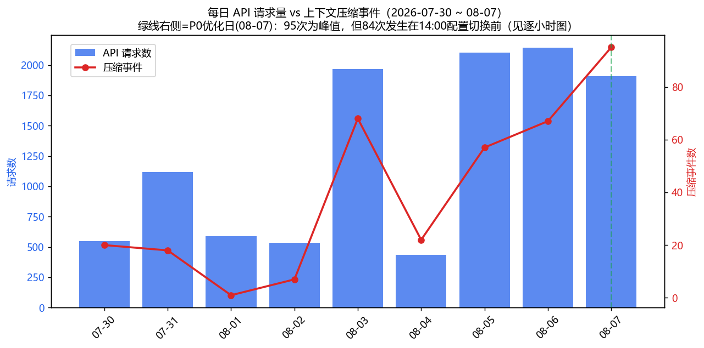

08-03 起请求量进入高峰（日均 ~2,000 vs 前期 ~800），压缩事件随请求量同步走高；**08-07（P0 优化日）请求最高、压缩也为 9 天峰值 95 次**——原因是压缩发生在 14:00 配置切换前的存量会话，优化效果需在 08-08 后的窗口验证（见 §五）。

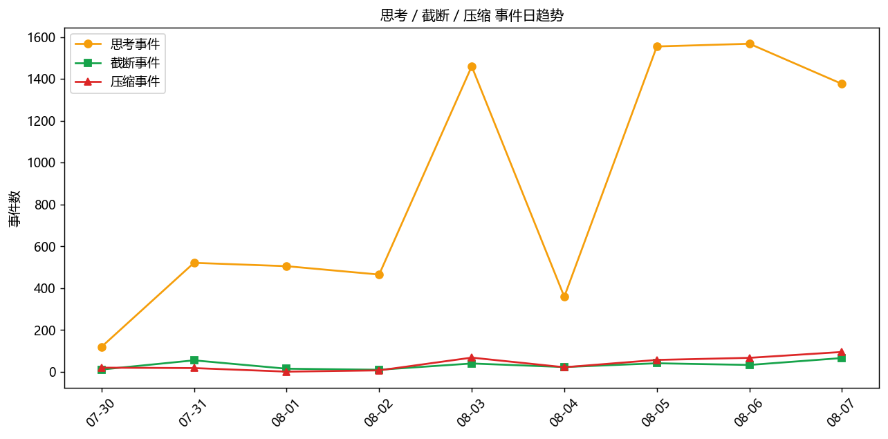

### 2.2 消耗结构与优化效果

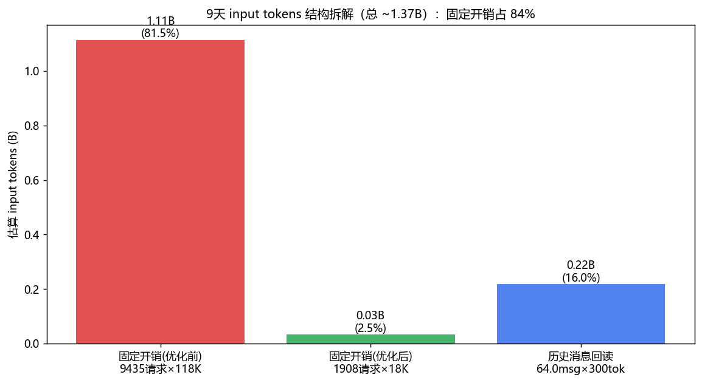

固定开销（system prompt 每轮重发）占 81.5%（1.11B/1.37B），历史消息回读占 16%——与 v1.0 的 84%/16% 一致。

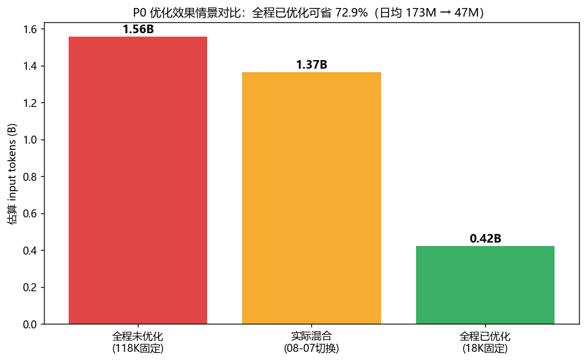

情景对比：**全程未优化 1.56B → 全程已优化 0.42B，省 72.9%**（日均 173M → 47M）。费用侧（DeepSeek 未命中 ¥1.00/M）：9 天理论全价 ¥1,556 → 优化+70% 缓存命中下 ~¥133。

### 2.3 压缩事件解剖

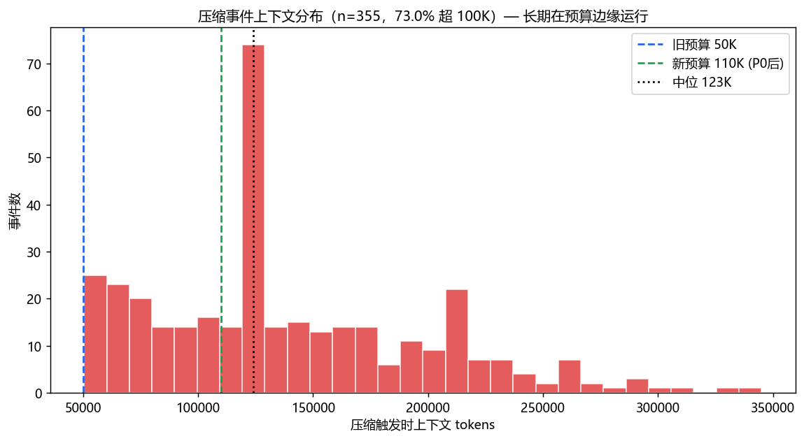

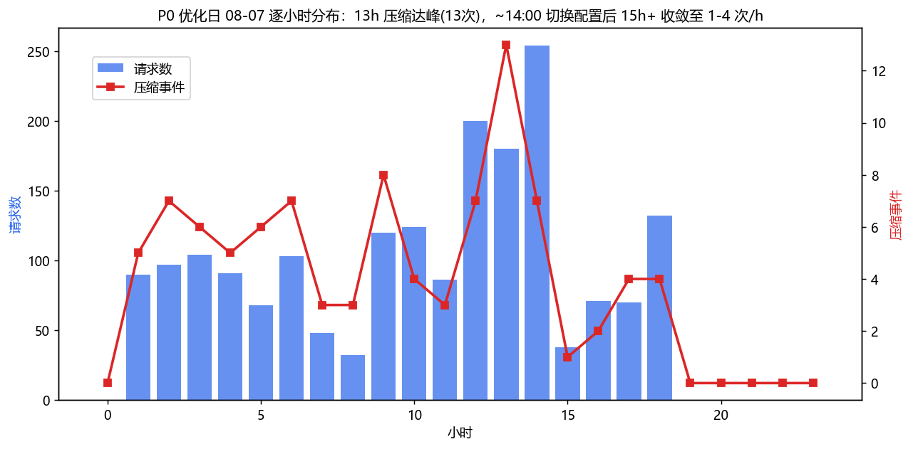

压缩事件类型拆分（新）：`trim_turns` 179 次（裁到 3 turns）+ `compress_all` 176 次（**平均 84 条消息压成 5.6 条**，tokens 仅剩 51.2%）——后者即 v1.0 所述"151→6 messages 失忆"的机制本体，占压缩事件整整一半。

### 2.4 会话维度

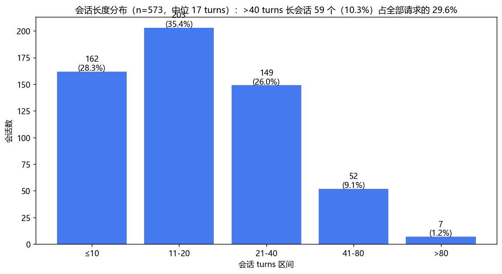

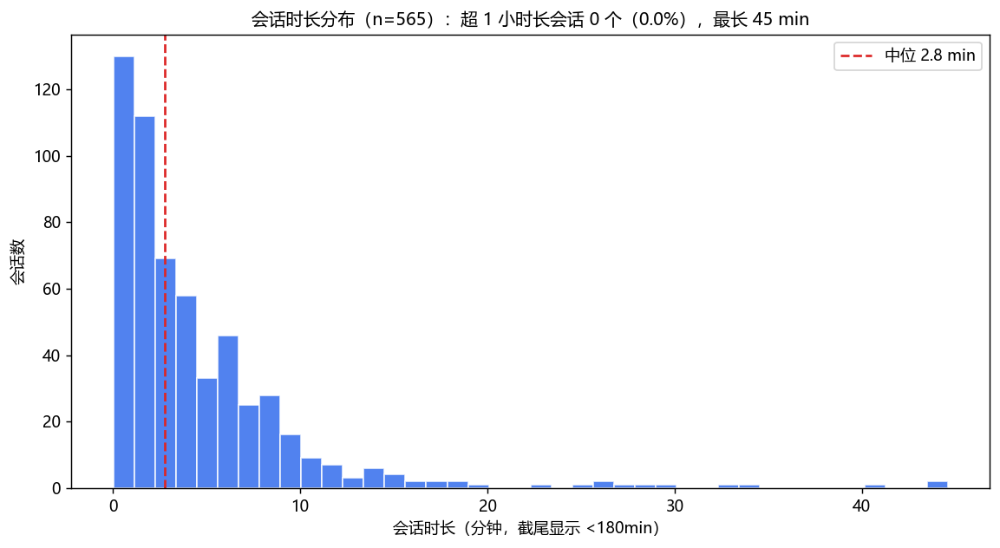

**关键量化（新）**：>40 turns 的 59 个长会话（10.3%）承载 **3,361 次请求 = 全部请求的 29.6%**；会话时长中位 2.8 min、均值 4.5 min、最大 44.6 min——消耗主力是"短时长高密度"的深度任务链。

### 2.5 工具维度

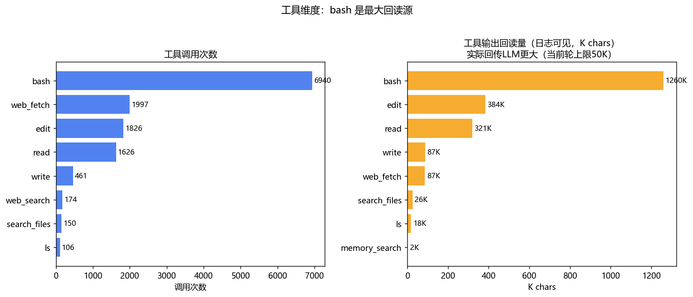

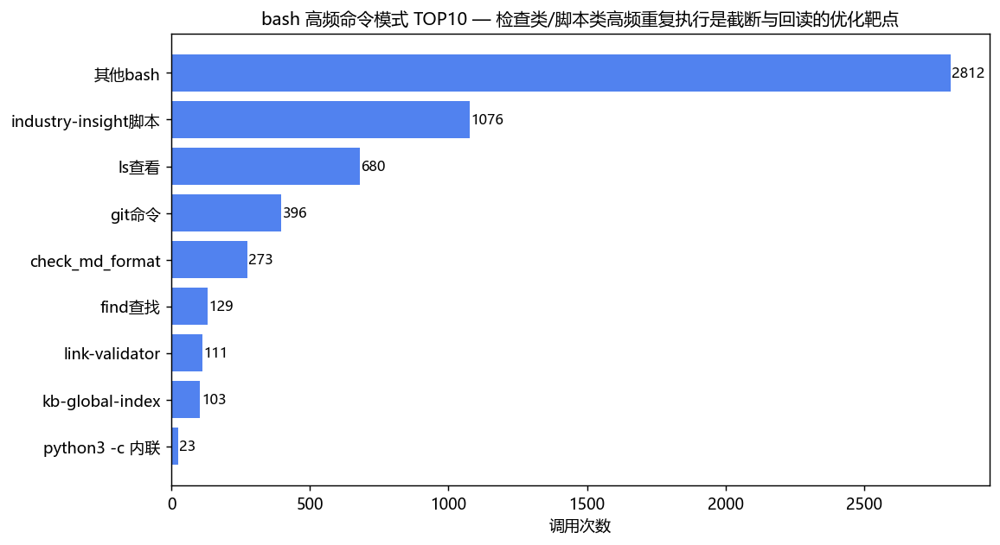

bash 调用 6,940 次、日志可见回读 1.26M chars（累计最大）；`industry-insight` 调研脚本 1,076 次为最高频单一模式，检查类（check_md_format 273 / link-validator 111 / kb-global-index 103）合计 ~490 次。

### 2.6 截断与可靠性

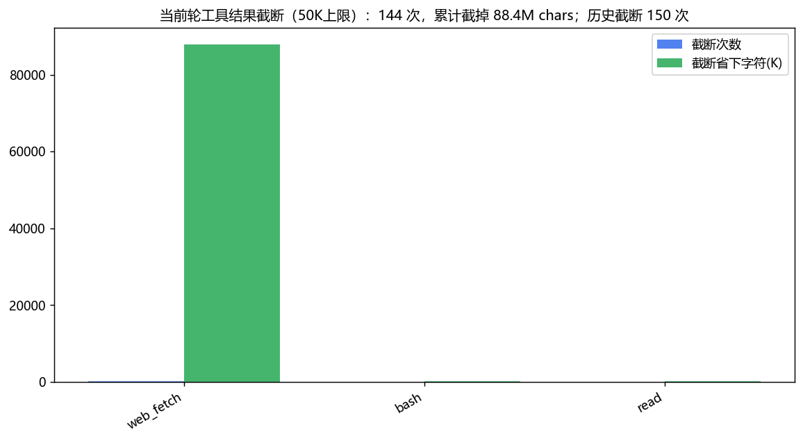

**本期最反直觉发现**：当前轮 50K 截断共 144 次，其中 **web_fetch 120 次、截掉 87.9M chars（占 99.5%）**，平均原文 782K chars、最大 2.09M chars——整页 HTML 灌入再截断是最大的单点浪费源。

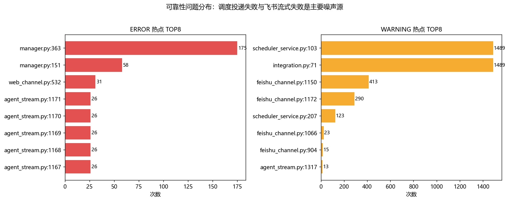

WARNING 前两名均为调度投递失败（1,489 次）；ERROR 第一名 `manager.py:363`（Doubao embedding 404，175 次）。

---

## 三、v1.0 之外的六个新发现

| # | 发现 | 数据 | 含义 |
|:-:|:-----|:-----|:-----|
| F1 | **长会话消耗占比首次量化** | >40 turns 会话 10.3% → 请求 29.6% | v1.0 定性"吃掉大头"，本文定量：砍长会话 = 砍三成请求 |
| F2 | **web_fetch 是最大单点截断源** | 120 次 / 均 782K chars / 截掉 87.9M chars = 99.5% | 浪费不在"累计大户 bash"，而在"单次巨头 web_fetch"——整页 HTML 直灌 |
| F3 | **调度任务投递空转** | 1,489 次失败（08-01~06 日均 ~250 次），08-07 消失 | web 通道未就绪时每 tick 重试无熔断；空转本身不产生 LLM 请求但污染日志/掩盖真问题，且恢复依赖重启 |
| F4 | **embedding 通道静默死亡** | Doubao embedding 404 ×175，vector search fallback ×58 | 9 天全程向量检索不可用 → memory 检索退化为关键词 → 检索质量降 → 模型重读文件补偿（间接 token 成本），且无任何告警 |
| F5 | **飞书流式卡片失败 703 次** | update text failed 413 + full card failed 290 | streaming closed 后无降级重发策略，用户侧表现为回复中断 |
| F6 | **压缩类型对半开** | trim 179 / 全压 176（84 msg→5.6 msg） | "失忆"不只是裁轮次，一半是整段历史压成纯文本；v1.0 P1-2（主动摘要）恰好对症 |

---

## 四、优化方案增补（N1-N6）

> v1.0 的 P0（已完成）/P1（保质量 5 招）/P2（轻微降质量 4 招）不变，以下为数据驱动的新增项。

| # | 方案 | 数据依据 | 预期收益 | 质量影响 |
|:-:|:-----|:---------|:---------|:--------|
| N1 | **web_fetch 正文抽取**：抓取后先过 readability/正文抽取（或 `trafilatura` 类），只保留正文+标题进上下文；>100K 原文先摘要 | F2：120 次 × 均 782K chars，99.5% 截断字符来自它 | 截断字符 -90%+；调研类任务历史膨胀显著减缓 | 无~轻微（正文抽取对表格/代码页有丢失风险→保留原文缓存按需二次读取） |
| N2 | **调度投递熔断**：同一任务连续 N 次（如 5 次）delivery failed → 暂停重试并记录待投队列，收到该 receiver 入站消息或通道 ready 后恢复 | F3：1,489 次空转 | WARNING 噪音 -77%（1,489/3,881 中占比）；日志可读性升 | 无 |
| N3 | **embedding 失败显式告警 + 降级开关**：embedding 连续失败 → 启动即 WARN 横幅 + 自动关闭向量索引写（避免每次 batch 重试 404） | F4：175 次 404，9 天无人感知 | 消除无效重试请求；检索质量显性化（要么修要么关，不再静默降级） | 无（当前已是下限） |
| N4 | **飞书流式降级**：`streaming mode is closed` / token 失效 → 自动降级为普通整段消息重发一次 | F5：703 次失败 | 用户侧回复中断消失 | 无（恢复可用性） |
| N5 | **长会话软提醒**：turns ≥ 30 时在 system 侧注入一次"建议 /flush 或开新会话"提示（配合 v1.0 P1-2 主动摘要） | F1：29.6% 请求集中于 10.3% 会话 | 长会话请求占比 29.6% → 20% 以下 | 无 |
| N6 | **调研脚本输出瘦身**：`industry-insight` 系列（1,076 次调用）输出默认摘要模式（计数+前 N 行），`--full` 才全量 | §2.5：最高频单一 bash 模式 | bash 回读 -20~30% | 无 |

**与 v1.0 合计预期更新**：每日 input 154M → **45-60M**（原估 50-70M，N1/N5/N6 叠加后下移），日志噪音（WARNING）-75%+。

---

## 五、可证伪预测更新

| # | 预测 | 验证窗口 | 证伪条件 |
|:-:|:-----|:--------|:---------|
| P1 | 压缩事件 <5 次/天（v1.0 原预测沿用） | 2026-08-14 | 无显著下降 |
| P2 | 每日 input <70M（v1.0 原预测沿用） | 2026-08-14 | 官方日均仍 >100M |
| P6 🆕 | 08-08 起调度投递失败 WARNING 应≈0（08-07 已消失，疑似重启恢复）；若 N2 落地则永久≈0 | 2026-08-14 | 仍出现日均 >50 次投递失败 |
| P7 🆕 | 若 N1 落地：web_fetch 截断事件趋近 0，截断字符总量 -90% | N1 上线后 7 天 | 截断字符仍 >5M/周 |
| P8 🆕 | embedding 404 在 N3 落地后 = 0（修复或显式关闭） | N3 上线后 | 仍静默 404 |

---

## 附录：管线复现

已固化为正式脚本 **`scripts/kb-stat/token-consumption-analyzer.py`**（extract→analyze→full-timeline 一体化）：

```powershell
python -X utf8 scripts/kb-stat/token-consumption-analyzer.py                  # 全流程（明细期+全周期，14图）
python -X utf8 scripts/kb-stat/token-consumption-analyzer.py --stats-only     # 复用 tmp/runlog.db 快速统计
python -X utf8 scripts/kb-stat/token-consumption-analyzer.py --json           # 统计另存 JSON
```

- 事件正则锚点：`agent_stream.py:1056`（Sending N messages）/ `:609`（Turn）/ `:739`（🔧 调用）/ `:798`（✅ 结果）/ `:1954`+`:1938`（压缩两类）/ `:1691`+`:824`（截断两类）/ `agent_event_handler.py:70`（💭）
- `tmp/` 为临时区，如需长期复跑建议将 `extract.py`/`analyze*.py` 迁移至 `scripts/`
- 数据边界：token 数为估算模型（同 v1.0，±20%）；工具调用计数含少量正则误匹配（prose 中的 `word(` 形态），TOP 工具排名不受影响

---

## Changelog

| 日期 | 版本 | 变更说明 |
|:----|:----|:---------|
| 2026-08-07 | v2.0 | 创建。run.log 全量 SQLite 化复核 v1.0（全部通过）+ 12 图可视化；新发现 F1-F6（长会话 29.6% 请求占比、web_fetch 99.5% 截断字符、调度空转 1,489 次、embedding 静默 404×175、飞书失败 703、压缩类型对半）；方案增补 N1-N6；预测增补 P6-P8 |
