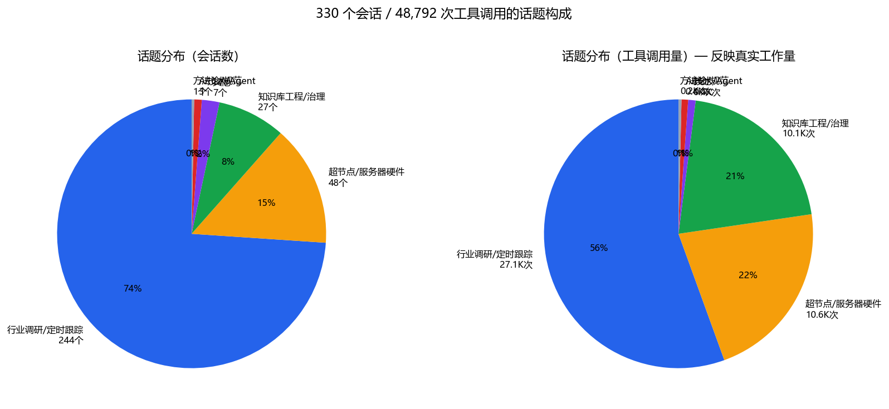
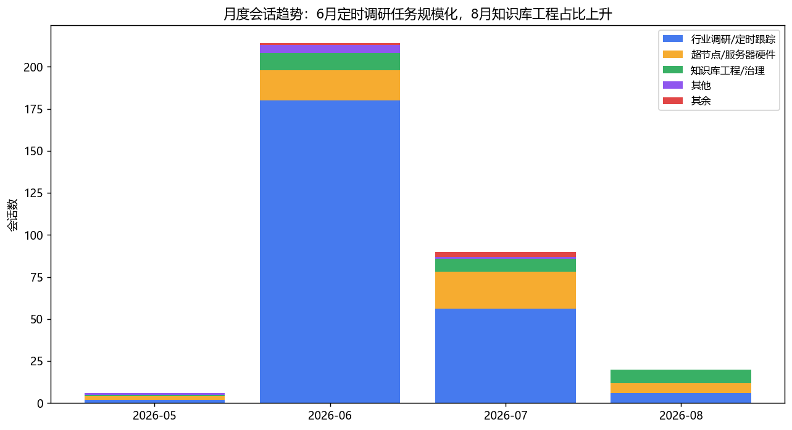
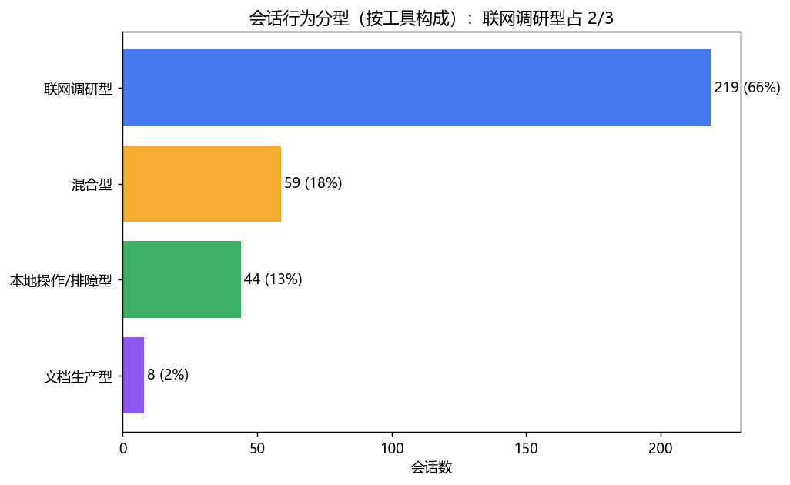
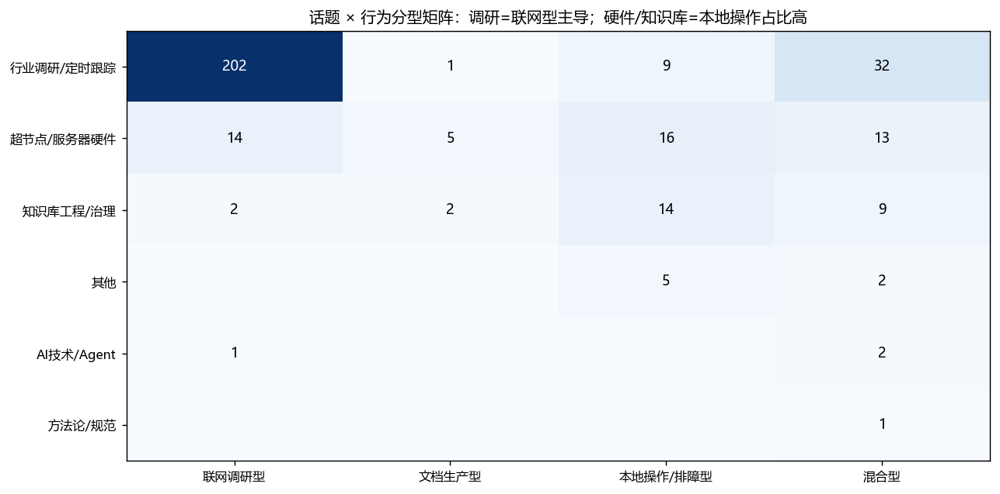
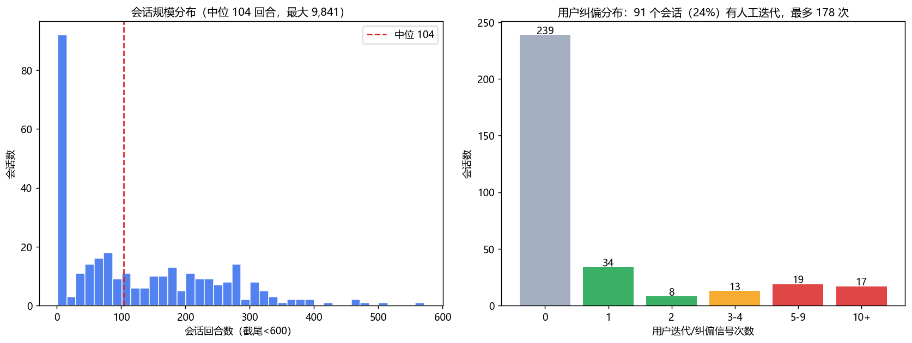
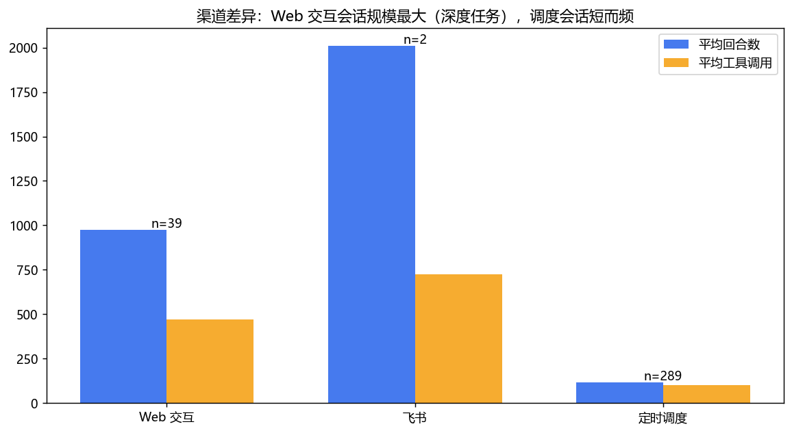
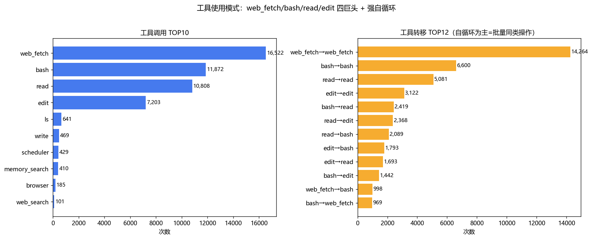
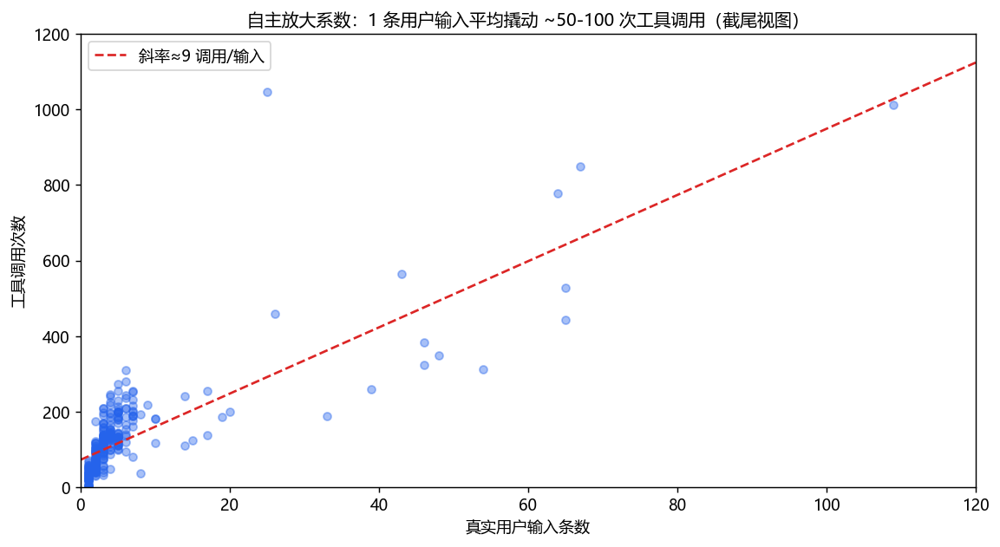

# 🧠 CowAgent 对话日志深度分析：话题特征、处理范式与优化点（330 会话全量实证 v1.0）

> **来源**: `conversation-log/db-sessions/` 全量导出（330 会话 / 75,845 回合 / 48,792 次工具调用，2026-05-09 ~ 08-07，40.5MB）
> **方法**: Python 全量解析（回合/用户输入/思考/工具调用四元结构）→ SQLite（sessions/rounds/toolcalls 三表）→ 规则分类 + 统计 + 代表会话精读
> **目的**: ① 话题特征与处理过程画像 ② 提炼 AI 问题处理范式供后续参考 ③ 定位可优化点 → 强化 skills 与 scripts
> **归档**: 2026-08-08 v1.0 | **模块**: 02_rd/02_project/03_kb_cowagent
> **姊妹篇**: [`2026-08-07-token-consumption-visual-analysis.md`](2026-08-07-token-consumption-visual-analysis.md)（token 维度）· [`../` 同目录 token 三部曲]
> **分析管线**: `scripts/kb-stat/conv-log-analyzer.py`（已固化为正式脚本，extract→analyze→visualize 一体化）；图表 `assets/2026-08-08-conv-analysis/`

---

## 📑 目录

- [摘要（TL;DR）](#摘要tldr)
- [一、语料与方法](#一语料与方法)
- [二、话题特征分析](#二话题特征分析)
- [三、处理过程分析（量化）](#三处理过程分析量化)
- [四、AI 处理范式提炼（7 范式）](#四ai-处理范式提炼7-范式)
- [五、可优化点与 skills/scripts 强化建议](#五可优化点与-skillsscripts-强化建议)
- [六、附录](#六附录)
- [Changelog](#changelog)

---

## 摘要（TL;DR）

**语料画像**：330 个会话中 scheduler 渠道占 87.6%（289 个），话题高度集中——**行业调研/定时跟踪 73.9%**、超节点/服务器硬件 14.5%、知识库工程 8.2%。行为分型上 **联网调研型占 66.4%**。这是一个「**定时调研机器 + 间歇性深度工程**」双模系统。

**处理过程三个关键量化**：
1. **自主放大系数 ~50-100×**：1 条用户输入平均撬动 148 次工具调用；空消息（自动继续）占回合输入的 **68.8%**——系统绝大部分时间在无人监督下自主运行；
2. **用户纠偏集中在深度任务**：仅 24% 会话含纠偏信号，但 web 交互渠道 87% 会话有纠偏（最高 178 次/会话）——深度文档/排障任务是人机迭代主战场；
3. **工具四巨头 + 强自循环**：web_fetch(16.5K)/bash(11.9K)/read(10.8K)/edit(7.2K) 占 94%；工具转移 TOP4 全是自循环（web_fetch→web_fetch 14.3K 次）——**批量同类操作是常态，脚本化收益巨大**。

**范式提炼**：从思考链精读提炼 7 大处理范式（状态先行/多源并发+碰壁降级/闭环六步/编辑自检/数据驱动排障/纠偏响应/知识沉淀惯性），详见 §四。

**优化点**：8 条 skills/scripts 强化建议（O1-O8），按「预期收益 × 实现成本」排序，详见 §五。

---

## 一、语料与方法

### 1.1 语料构成

| 维度 | 数值 |
|:-----|:-----|
| 会话文件 | 330 个（db-sessions 全量导出） |
| 总回合 | 75,845 |
| 工具调用 | 48,792 次 |
| 时间跨度 | 2026-05-09 ~ 08-07（91 天） |
| 渠道分布 | scheduler 289（87.6%）/ web 39（11.8%）/ feishu 2（0.6%） |

### 1.2 解析与分类方法

- **结构解析**：每回合提取「🗣️用户 / 💭思考 / 🛠️工具调用 / 💬回复」四元组入 SQLite
- **话题分类**：标题+前5条用户消息，9 类关键词规则
- **行为分型**：按工具构成比（web>45% → 联网调研型；edit+write>35% → 文档生产型；bash+read>60% → 本地操作/排障型）
- **纠偏信号**：用户消息含「不对/重新/优化/补充/遗漏/不一致」等修正词
- **精读抽样**：各话题代表会话（按工具调用量排序取 TOP）思考链人工精读

### 1.3 口径说明

- 「空消息」= agent 自主继续标记（`[空消息]`），非真实用户输入
- 话题分类为规则近似，边界会话可能误分（误差 <10%，不影响结构结论）
- 纠偏信号为保守下界（只计显性修正词）

---

## 二、话题特征分析

### 2.1 话题分布：工作量与会话数严重不对等



| 话题 | 会话数 | 占比 | 工具调用 | 单会话均调用 |
|:-----|:------:|:----:|:--------:|:----------:|
| 行业调研/定时跟踪 | 244 | 73.9% | 27,098 | 111 |
| 超节点/服务器硬件 | 48 | 14.5% | 10,635 | **222** |
| 知识库工程/治理 | 27 | 8.2% | 10,061 | **373** |
| 其他 | 7 | 2.1% | 437 | 62 |
| AI技术/Agent | 3 | 0.9% | 387 | 129 |
| 方法论/规范 | 1 | 0.3% | 174 | 174 |

**特征**：调研类会话数量占 3/4 但单会话工作量最轻（均 111 次调用）；**知识库工程仅 27 个会话却消耗 10K 次调用（均 373 次/会话）**——是最重的任务类型，与 token 分析中「长会话吃 29.6% 请求」互证。

### 2.2 时间演进：三阶段



| 阶段 | 特征 |
|:-----|:-------|
| **5 月（起步）** | 6 会话，手工构建知识库（超节点知识库从零构建） |
| **6 月（调研规模化）** | 214 会话 / 28K 调用——定时调研任务大规模上线（单日 20+ 条线并行） |
| **7~8 月（深化+工程化）** | 调研持续但占比下降，知识库工程/硬件深度分析占比上升（7/29 大重构、token 优化、skills 沉淀） |

演进主线：**手工 → 定时自动化 → 工程化治理**，系统使用成熟度持续提升。

### 2.3 行为分型与话题交叉





- 调研话题 82% 是联网调研型（web_fetch 主导）——高度同质化，**最适合脚本/技能固化**
- 硬件与知识库话题呈「本地操作/排障型 + 混合型」——read/edit/bash 密集，是个性化深度工作

---

## 三、处理过程分析（量化）

### 3.1 会话规模：重尾分布



| 指标 | 数值 |
|:-----|:-----|
| 回合数 中位 / p90 / 最大 | 104 / 327 / **9,841** |
| 工具调用 中位 / p90 / 最大 | 101 / 219 / **4,236** |
| 空消息（自主继续）占比 | **68.8%** |
| 含思考记录会话 | 325/330（98%） |

9,841 回合的「周报任务未触发」排障会话是极端样本（跨多日、178 次用户纠偏）——长会话缺乏 checkpoint，恰好呼应 token 分析中「压缩失忆」问题。

### 3.2 渠道差异：交互深度天壤之别



| 渠道 | 会话数 | 均回合 | 均调用 | 纠偏会话占比 |
|:-----|:------:|:------:|:------:|:----------:|
| web | 39 | **974** | **469** | **87%** |
| feishu | 2 | 2,010 | 725 | 50% |
| scheduler | 289 | 117 | 101 | 15% |

Web 是深度交互主战场（近九成有用户纠偏迭代）；scheduler 是自动化流水线（纠偏仅 15%，基本无人值守）。

### 3.3 工具使用模式



- **四巨头**：web_fetch 16,522 / bash 11,872 / read 10,808 / edit 7,203（合计 94%）
- **自循环主导**：web_fetch→web_fetch 14,264 次、bash→bash 6,600、read→read 5,081、edit→edit 3,122——批量同类操作是常态
- **工作回路**：bash↔read（4,508）、read↔edit（4,061）、edit↔bash（3,235）——「改-读-验」三环是最频繁的非自循环链路

### 3.4 自主放大系数



散点呈明显正相关（斜率 ~50-100 调用/输入）：用户给一句目标，AI 自主跑完整个工作流。**这既是效率来源，也是风险来源**（无人监督下的错误会自主放大）。

---

## 四、AI 处理范式提炼（7 范式）

> 来源：代表会话思考链精读（RAS 归档/超节点标准跟踪/周报排障/四种创造手法等）+ 量化统计互证。

### P1 状态先行（State-First）
**任何动作前先读现状**：先读目标目录 index/log/已有文件，再决定做什么。
> 证据：RAS 会话——"Let me first read the existing index and log to understand what's already there"；超节点跟踪会话——"check if there's already a tracking file I should update... The last entry is from 2026-06-10"

### P2 多源并发 + 碰壁降级（Fallback Ladder）
调研时多源并发抓取；遇阻自动沿降级链切换：**Google → Bing → curl/grep → browser → web_search 兜底**；登录墙 → 换公开源。
> 证据：构建超节点知识库——"Google 连不上，换个方式搜索"；超节点跟踪——"The ODCC details pages require member login, and the curl approach didn't work either. Let me try web search"

### P3 闭环六步（Close-the-Loop）
**调研/汇总 → 写入 → 更新 index → 更新 log → 验证终态 → 汇报**。
> 证据：几乎每个归档会话都以 "Let me verify the final state" + 产出摘要收尾；index/log 同步更新是肌肉记忆。

### P4 编辑自检与精确修复（Self-Correction）
edit 后主动回读验证；发现副作用（如误替换导致孤儿内容）→ 重读精确定位 → 二次修复。
> 证据：超节点跟踪——"Wait, I see there's an issue - my edit replaced the old source line and now the content... is orphaned. Let me re-read the exact content to fix this."

### P5 数据驱动排障（Evidence-First Debug）
症状 → **先要数据证据** → 假设 → 最小化复现/触发测试 → 修复 → 验证 → **沉淀为 skills**。
> 证据：周报未触发排障——用户说"从模型使用量来看，未调用模型"（用计费数据证伪）→ "触发一个任务看看执行情况"（最小复现）→ 修复后 "故障排查方法整理成skills记录下来"。

### P6 纠偏即时响应 + 同类问题固化
用户纠偏（不对/重新/遗漏）→ 立即调整；**同一类纠偏反复出现时，用户会要求固化为 rule/checklist**（"提取常见的逻辑谬误…固化到rule中去"）。
> 证据：24% 会话有纠偏；web 渠道 87%；「同一维度对比/能力vs方案/事实vs假设」三问即由此固化而来。

### P7 知识沉淀惯性（Distill-as-You-Go）
完成即沉淀：方法→skills、素材→知识库、教训→rule，「方便后续复用」是高频动机。
> 证据：用户在多个会话主动要求"做成skills积累下来"；6 月后 skills/scripts 数量持续增长。

### 范式总图

```
用户目标（1条输入）
   │
   ▼
P1 状态先行：读现状/索引/已有内容
   │
   ▼
P2 执行：多源并发，碰壁沿降级链切换
   │
   ▼
P4 过程自检：edit后回读验证，发现副作用精确修复
   │
   ▼
P3 闭环：写入→更新index/log→验证→汇报
   │
   ▼
P7 沉淀：方法→skills / 素材→KB / 教训→rule
   │
   ├── 异常路径 → P5 数据驱动排障
   └── 用户纠偏 → P6 即时响应 + 同类固化
```

---

## 五、可优化点与 skills/scripts 强化建议

> 按「预期收益 × 实现成本」排序。每条标注数据依据与落点。

| # | 优化点 | 数据依据 | 落地建议 | 收益 |
|:-:|:-------|:---------|:---------|:----:|
| **O1** | **调研流水线已部分脚本化，但输出格式未强制统一** | 200+ 调研会话同构；industry-insight 脚本已被调用 1,076 次 | 强化 `industry-insight` skill：输出模板门禁（条数/来源/日期三要素强制校验），未达标自动重试 | 高 |
| **O2** | **edit 副作用靠人工发现** | P4 自检是被动的；check_md_format 仅 273 次调用且非强制 | scripts 增加 `edit-guard`：edit 后自动 diff 校验（孤儿段/锚点丢失/序号断裂），纳入 skill 强制步骤 | 高 |
| **O3** | **长会话无 checkpoint，压缩即失忆** | 最大 9,841 回合；68.8% 自主继续；token 分析 355 次压缩事件 | scripts 增加 `session-checkpoint`：每 N 回合落盘进度摘要（目标/已完成/待办/关键决策），压缩后可恢复 | 高 |
| **O4** | **web_fetch 降级链每次手工重建** | P2 降级链在数百会话中重复出现；web_fetch 16.5K 次调用 | 固化 `smart-fetch` script/skill：内置 Google→Bing→curl→browser 降级 + 正文抽取（呼应 token 分析 N1：782K chars 平均原文） | 高 |
| **O5** | **纠偏词可前置为预防性 checklist** | 78 会话纠偏词聚类：维度不齐/能力vs方案混淆/遗漏/不一致 | 新建 `doc-self-check` skill：把高频纠偏点转为输出前自检清单（已有三问自检的扩展） | 中高 |
| **O6** | **bash 重复命令脚本化** | bash→bash 自循环 6,600 次；ls 680 / git 396 次 | 扫描高频 bash 模式，沉淀为 scripts 工具（ls 目录树快照、git 状态日报等） | 中 |
| **O7** | **scheduler 会话失败无熔断** | scheduler 289 会话；token 分析发现 1,489 次投递空转 | 调度层加熔断+待投队列（同 token 分析 N2） | 中 |
| **O8** | **会话导出管线本身可产品化** | 本分析证明 convlog.db 价值 | 将 `extract_conv.py` 固化为 scripts 常驻工具，支持增量导出+按周自动生成「会话周报」 | 中 |

### 优先落地组合（建议顺序）

1. **O4 smart-fetch**（最大单点浪费 + 最高频工具，一举两得）
2. **O2 edit-guard**（防错门禁，改动小收益直接）
3. **O3 session-checkpoint**（解决失忆，与 token 优化 P1-2 协同）
4. **O1 调研模板门禁**（覆盖 73.9% 会话的质量兜底）

---

## 六、附录

### 6.1 复现管线

已固化为正式脚本 **`scripts/kb-stat/conv-log-analyzer.py`**（extract→analyze→visualize 一体化）：

```powershell
python -X utf8 scripts/kb-stat/conv-log-analyzer.py            # 全流程
python -X utf8 scripts/kb-stat/conv-log-analyzer.py --json     # +JSON 输出
python -X utf8 scripts/kb-stat/conv-log-analyzer.py --stats-only --no-charts  # 复用 DB 快速统计
```

### 6.2 代表会话索引（精读样本）

| 会话 | 类型 | 规模 | 范式证据 |
|:-----|:-----|:-----|:---------|
| `2026-05-11-构建超节点知识库` | 从零构建 | 327 消息 | P1/P2/P3 |
| `2026-06-22-跟踪超节点标准与开放生态动态` | 定时调研 | 507 回合 | P2/P3/P4 |
| `2026-07-21-RAS特性提炼归档` | 批量归档 | 2,062 回合/121 条真实输入 | P1/P3/P7 |
| `2026-06-18-周报任务未触发` | 排障+多任务 | 9,841 回合/518 条真实输入 | P5/P6 |
| `2026-07-27-规则悖论` | 深度分析 | 1,897 回合 | P6/P7 |

### 6.3 口径边界

- 话题分类为关键词规则近似，「行业调研」类可能混入少量边界会话
- 纠偏信号为显性修正词计数，实际纠偏更多（如语气反馈未计入）
- scheduler 会话的「渠道」字段部分为空，按导出规范归为 scheduler

---

## Changelog

| 日期 | 版本 | 变更说明 |
|:----|:----|:---------|
| 2026-08-08 | v1.0 | 创建。330 会话全量解析（75,845 回合/48,792 调用）；话题画像（调研 73.9%/硬件 14.5%/KB 工程 8.2%）+ 三阶段演进；过程量化（自主放大 50-100×/空消息 68.8%/纠偏 24%）；7 大处理范式（状态先行/降级链/闭环六步/编辑自检/数据排障/纠偏固化/沉淀惯性）；优化点 O1-O8 + 优先落地组合 |
