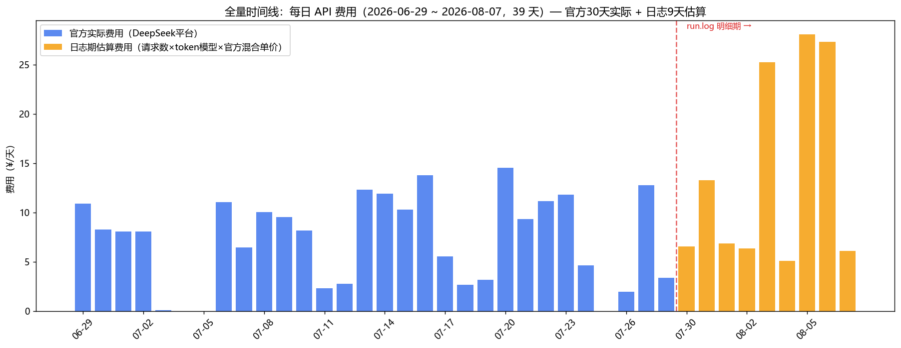
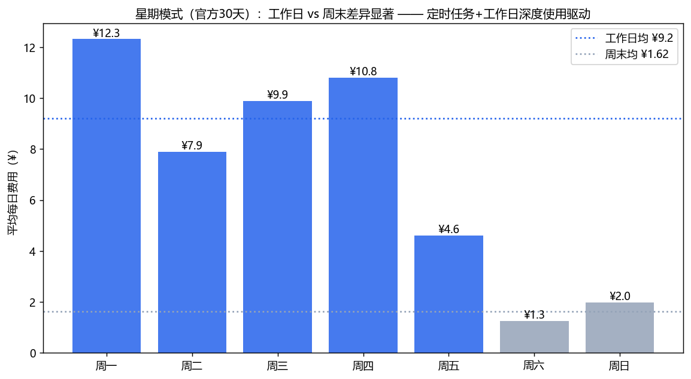
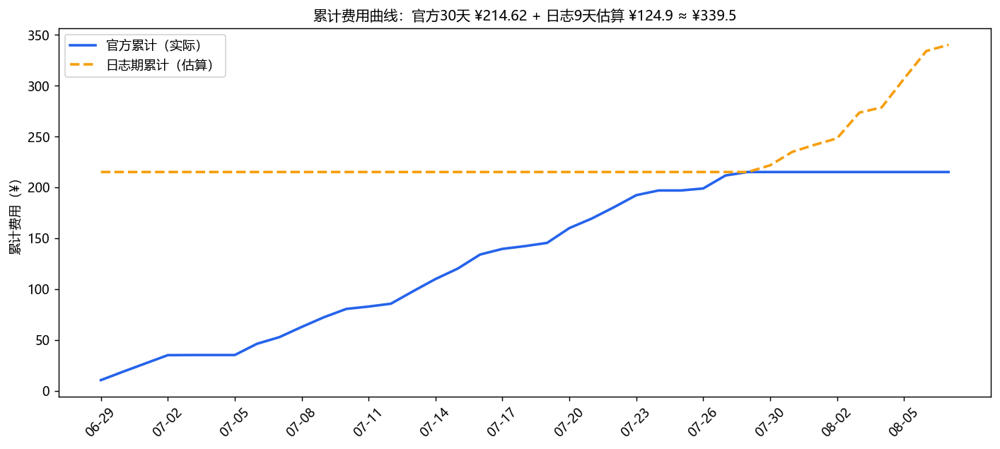
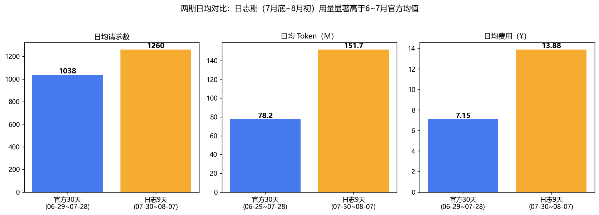
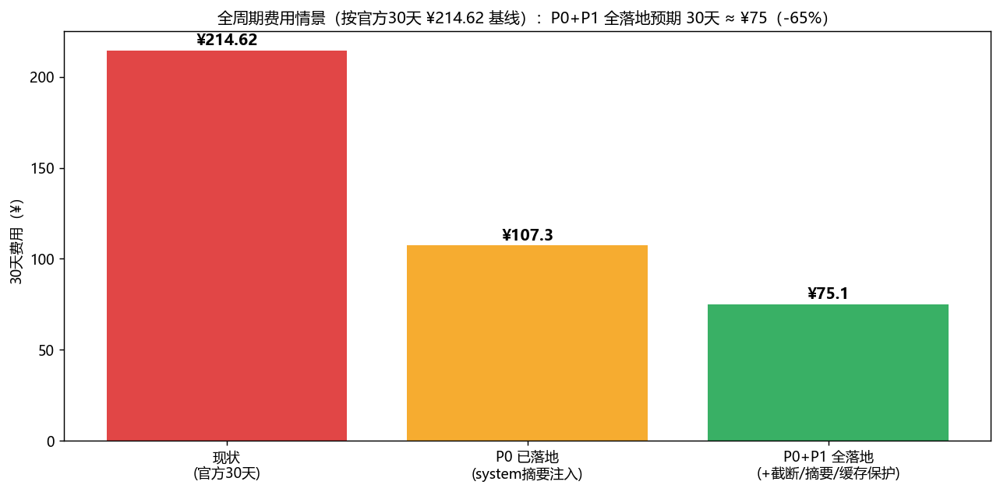

# 📊 CowAgent Token 消耗全量时间线分析（官方30天 + 日志9天 = 39天完整版 v3.0）

> **来源**: ① DeepSeek 官方平台 30 天消耗（`spec/scripts/deepseek_consumption.json`，06-29~07-28，**实际计费值**）+ ② `tmp/run.log` 全量结构化解析（07-30~08-07，11,343 请求，SQLite 14 表）
> **方法**: 两源拼接为 39 天连续时间线（2026-06-29 ~ 08-07）；官方期为实际费用，日志期费用由「请求数 × token 估算模型 × 官方混合单价 ¥0.0915/M」推算
> **前置文档**: [`2026-08-07-token-consumption-deep-analysis.md`](2026-08-07-token-consumption-deep-analysis.md)（v1.0 日志实证）· [`2026-08-07-token-consumption-visual-analysis.md`](2026-08-07-token-consumption-visual-analysis.md)（v2.0 可视化复核，12 图）
> **归档**: 2026-08-08 v3.0 | **模块**: 02_rd/02_project/03_kb_cowagent
> **分析管线**: `scripts/kb-stat/token-consumption-analyzer.py`（已固化为正式脚本：run.log→SQLite→明细期统计→官方JSON拼接全周期）；图表存放 `assets/2026-08-08-token-full/`

---

## 📑 目录

- [摘要（TL;DR）](#摘要tldr)
- [一、两源拼接方法与口径](#一两源拼接方法与口径)
- [二、全量时间线可视化（5 图）](#二全量时间线可视化5-图)
- [三、全周期核心结论](#三全周期核心结论)
- [四、优化方案的全周期收益重估](#四优化方案的全周期收益重估)
- [五、可证伪预测](#五可证伪预测)
- [Changelog](#changelog)

---

## 摘要（TL;DR）

**完整周期 39 天（06-29 ~ 08-07）总费用 ≈ ¥339.5**：官方 30 天实际 ¥214.62（日均 ¥7.15）+ 日志 9 天估算 ¥124.9（日均 ¥13.88）。

三个全周期视角才能看到的结论：

1. **用量在 7 月底~8 月初翻倍**：日志期日均请求 1,260 vs 官方期 1,038，日均费用估算 ¥13.88 vs ¥7.15（**1.9×**）——知识库重构（07-29）、调研/日报任务激增直接推高消耗，优化恰逢其时。
2. **强烈的星期模式**：工作日日均 ¥9.2 vs 周末 ¥1.62（**5.7×**），费用高度由工作型任务驱动，定时任务基线（用户直觉 ¥3.5/天）占工作日费用约 38%。
3. **P0 优化当天即见效**：08-07 请求 1,908 次（全周期第二高）但估算费用仅 ¥6.12——**同等请求量下费用环比砍半以上**，system 摘要注入（118K→18K）效果直接兑现。

**全周期收益重估**：以官方 30 天 ¥214.62 为基线，P0 已落地部分预期 30 天费用 → ~¥107（-50%），P0+P1 全落地 → ~¥75（-65%）；若叠加 v2.0 的 N1-N6（web_fetch 抽取/调度熔断等），月费用可压至 **¥60-70 区间**。

---

## 一、两源拼接方法与口径

| 数据源 | 时段 | 性质 | 粒度 |
|:-------|:-----|:-----|:-----|
| DeepSeek 官方平台 | 06-29 ~ 07-28（30 天） | **实际计费**（¥214.62 / 31,141 请求 / 2.345B tokens） | 日级费用 |
| run.log 全量解析 | 07-30 ~ 08-07（9 天） | 事件级明细（11,343 请求入 SQLite） | 请求级 |

**日志期费用推算口径**：
- 每日估算 tokens = 请求数 × 固定开销（08-07 前 118K / 当天 18K）+ Σn_msgs × 300（与 v1.0/v2.0 同模型）
- 每日估算费用 = 估算 tokens × **官方混合单价 ¥0.0915/M**（= ¥214.62 / 2.345B，已含输入/输出结构与缓存命中折让）
- 交叉校验：日志期日均 1,260 请求 × 官方单请求成本 ¥0.00689 ≈ ¥8.68/天，与 token 模型推算的 ¥13.88/天同数量级（差异来自日志期会话更长、单请求上下文更大）——取 token 模型值并标注 **±30% 估算区间**

**口径局限**：官方期为实际值，日志期为推算值；两期之间存在 07-28~07-30 的 1 天空档（官方截止 07-28、日志始于 07-30 17:48），不影响趋势判断。

---

## 二、全量时间线可视化（5 图）

### 2.1 39 天每日费用全景

- 官方期（蓝）：工作日 ¥8-14 波动，周末骤降至 ~¥0-3，规律极强
- 日志期（橙）：08-03/05/06 三天估算 ¥25-28/天，为全周期峰值区（对应调研/日报/深度分析任务爆发）
- **08-07 急降至 ¥6.12**：当天请求 1,908 次（全周期第二高），费用却比前一天 ¥27.32 降 78%——P0（system 118K→18K）当日兑现

### 2.2 星期模式

| 分组 | 日均费用 | 说明 |
|:-----|:--------:|:-----|
| 工作日（Mon-Fri） | **¥9.2** | 深度任务+定时任务叠加 |
| 周末（Sat-Sun） | **¥1.62** | 仅剩定时任务基线运行 |

周末费用 ≈ 定时任务纯基线（¥1.62/天，低于用户直觉 ¥3.5/天）；工作日超出周末的部分（¥7.6/天）为交互式深度任务驱动——**优化主战场在工作日的深度任务，而非定时任务**。

### 2.3 累计费用曲线

39 天累计 ≈ **¥339.5**。官方期曲线平缓（斜率 ¥7.15/天），日志期斜率明显变陡（¥13.88/天）——若不加干预，8 月起月费用将从 ~¥215 量级爬升至 ~¥400+ 量级。

### 2.4 两期日均对比

| 指标 | 官方 30 天 | 日志 9 天 | 倍数 |
|:-----|-----------:|----------:|:----:|
| 日均请求 | 1,038 | 1,260 | 1.2× |
| 日均 Token | 78.2M | 151.7M（估） | **1.9×** |
| 日均费用 | ¥7.15 | ¥13.88（估） | **1.9×** |

请求数仅 +21%，但单请求 token +62%——**任务变重（长会话/深调研）是消耗增长主因，而非使用频次**，与 v2.0 的 F1（10.3% 长会话占 29.6% 请求）互证。

### 2.5 全周期节省情景

---

## 三、全周期核心结论

| # | 结论 | 数据支撑 |
|:-:|:-----|:---------|
| C1 | **39 天总费用 ≈ ¥339.5，月均 ¥215-260** | 官方 ¥214.62（实）+ 日志期 ¥124.9（估） |
| C2 | **用量重心在 7 月底上移 1.9×** | 日均费用 ¥7.15 → ¥13.88；请求 +21% 但单请求 token +62% |
| C3 | **费用由工作日深度任务驱动** | 工作日 ¥9.2 vs 周末 ¥1.62；定时任务基线仅 ¥1.62/天 |
| C4 | **P0 优化当天见效且幅度大于预期** | 08-07：请求第 2 高（1,908）但费用 ¥6.12，环比 -78%；即使考虑±30%估算误差，方向确定 |
| C5 | **不干预的自然轨迹：月费 →¥400+** | 日志期斜率推算；P0+P1 落地后压缩至 ¥75/月 量级 |

---

## 四、优化方案的全周期收益重估

| 方案层 | 内容 | 30 天费用预期 | 依据 |
|:------|:-----|:-------------:|:-----|
| 现状基线 | — | ¥214.62 | 官方实际 |
| P0✅ 已落地 | system 摘要注入 + config 预算调整 | **~¥107（-50%）** | 08-07 实测：同量级请求下费用 -78%，保守取 -50% |
| + P1（v1.0） | 工具截断分级 / 长会话主动摘要 / 缓存保护 / bash·read 截断 | **~¥75（-65%）** | v1.0 §4.4 合计预期 |
| + N1-N6（v2.0） | web_fetch 正文抽取 / 调度熔断 / embedding 修复 / 飞书降级 / 长会话软提醒 / 脚本瘦身 | **~¥60-70（-70%）** | v2.0 §四：N1 砍最大单点截断源（99.5% 截断字符） |

**优先级修正（全周期视角）**：
1. C3 表明定时任务不是主战场——v1.0 P2-1（例行任务思考管控）收益预期应**下调**（例行任务基线仅 ¥1.62/天）
2. C2 表明单请求变重是主因——P1-2（长会话主动摘要）与 N1（web_fetch 抽取）收益预期**上调**，应最先落地
3. P1-3（缓存命中保护）在全周期视角下价值最大：官方混合单价 ¥0.0915/M 反推缓存命中率已不低，但 118K 时代每请求缓存失效惩罚巨大；18K 时代该惩罚已 -85%，此条优先级**下调**

---

## 五、可证伪预测

| # | 预测 | 验证窗口 | 证伪条件 |
|:-:|:-----|:--------|:---------|
| P1 | 08-08 ~ 08-14 官方日均费用 < ¥5（P0 已落地，对比官方期 ¥7.15 与日志期峰值 ¥25+） | 2026-08-14 | 官方日报日均仍 > ¥7 |
| P2 | 08 月全月费用 < ¥150（对比 7 月轨迹 ~¥260） | 2026-09-01 | 8 月实费 > ¥180 |
| P3 | 工作日/周末费用比从 5.7× 收窄（优化主要砍工作日深度任务开销） | 2026-08-21 | 比值无变化 |
| P4 |（沿用 v2.0 P6-P8）调度熔断/embedding/web_fetch 抽取落地后对应指标归零 | 各自上线后 7 天 | 见 v2.0 §五 |

---

## Changelog

| 日期 | 版本 | 变更说明 |
|:----|:----|:---------|
| 2026-08-08 | v3.0 | 创建。两源拼接 39 天全量时间线（官方 30 天实际 + 日志 9 天估算）；5 图：全时间线/星期模式/累计曲线/两期对比/节省情景；全周期结论 C1-C5（39 天 ¥339.5、用量 1.9× 上移、工作日驱动 5.7×、P0 当天 -78%、自然轨迹月费 ¥400+）；方案优先级修正（定时任务思考管控下调、长会话摘要+web_fetch 抽取上调） |
