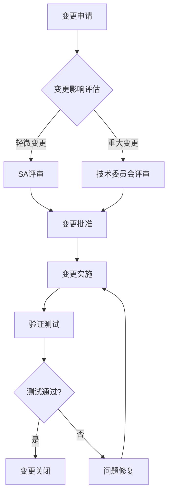
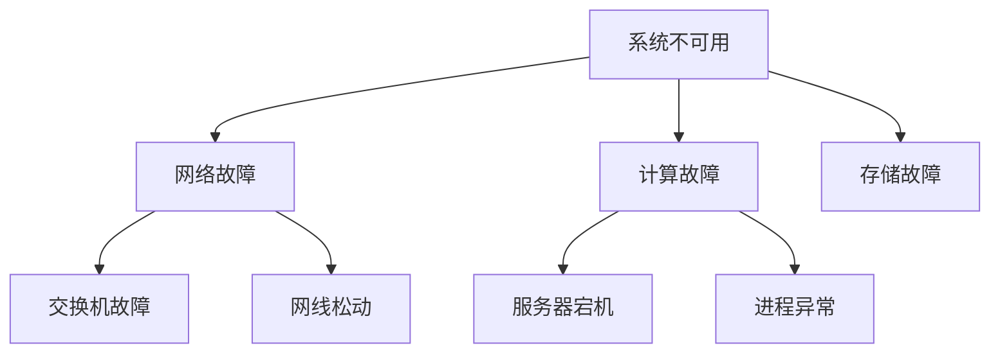
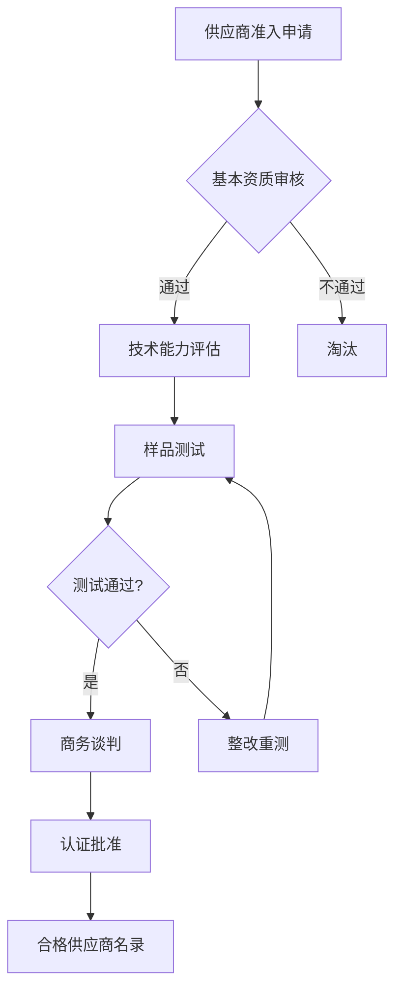

# 🗺️ 服务器产品研发全链路知识图谱

> **概要**: 服务器产品研发全链路知识图谱，按领域×生命周期梳理系统架构、硬件设计与各TR阶段交付
>
> **关键词**: 知识图谱 · 服务器研发 · 全链路 · 系统架构 · 硬件设计

---

## 📑 目录

- [上卷：按领域 × 生命周期](#上卷按领域-生命周期)
- [1. 系统架构 (SA)](#1-系统架构-sa)
  - [P0 — 市场洞察（技术路线预研）](#p0-市场洞察技术路线预研)
  - [TR1 — 概念阶段](#tr1-概念阶段)
  - [TR2 — 方案选择与架构设计](#tr2-方案选择与架构设计)
  - [TR3 — 系统设计展开](#tr3-系统设计展开)
- [1. 概述](#1-概述)
- [2. 系统架构图](#2-系统架构图)
- [3. 硬件架构](#3-硬件架构)
  - [3.1 CPU子系统](#31-cpu子系统)
  - [3.2 GPU/加速器子系统](#32-gpu加速器子系统)
  - [3.3 存储子系统](#33-存储子系统)
  - [3.4 网络子系统](#34-网络子系统)
- [4. 供电架构](#4-供电架构)
- [5. 散热架构](#5-散热架构)
- [6. 固件/软件架构](#6-固件软件架构)
- [7. 接口定义](#7-接口定义)
- [8. 可靠性设计](#8-可靠性设计)
- [9. 安全设计](#9-安全设计)
- [10. 版本历史](#10-版本历史)
  - [TR4–TR7 — 验证→发布→运维](#tr4tr7-验证发布运维)
- [2. 硬件设计 (HW)](#2-硬件设计-hw)
  - [P0 — 市场洞察（部件技术路线）](#p0-市场洞察部件技术路线)
  - [TR1 — 概念阶段](#tr1-概念阶段)
  - [TR2 — 方案选择](#tr2-方案选择)
- [一、性能维度](#一性能维度)
- [二、成本维度](#二成本维度)
- [三、信号维度](#三信号维度)
- [四、供应维度](#四供应维度)
  - [TR3 — 详细设计（硬件工程阶段）](#tr3-详细设计硬件工程阶段)
  - [电源模块](#电源模块)
  - [时钟模块](#时钟模块)
  - [复位模块](#复位模块)
  - [IO模块](#io模块)
  - [存储模块](#存储模块)
  - [PCIe模块](#pcie模块)
  - [高速信号维度](#高速信号维度)
  - [电源维度](#电源维度)
  - [接地维度](#接地维度)
  - [热管理维度](#热管理维度)
- [新器件风险](#新器件风险)
- [新技术风险](#新技术风险)
- [新工艺风险](#新工艺风险)
- [替代料风险](#替代料风险)
- [单一供应源风险](#单一供应源风险)
- [串讲(设计者→团队)流程](#串讲设计者团队流程)
- [反串讲(团队→设计者)流程](#反串讲团队设计者流程)
- [串讲模板](#串讲模板)
- [1. 概述](#1-概述)
- [2. 设计方案](#2-设计方案)
- [3. 关键设计点](#3-关键设计点)
- [4. 风险与应对](#4-风险与应对)
- [5. 问题与讨论](#5-问题与讨论)
- [测试配置](#测试配置)
- [测试数据](#测试数据)
- [结论](#结论)
- [必配项(必须选择)](#必配项必须选择)
- [选配项(可选)](#选配项可选)
- [互斥项(只能选一)](#互斥项只能选一)
- [信号维度](#信号维度)
- [BOM维度](#bom维度)
- [总线电容核算](#总线电容核算)
- [上拉电阻](#上拉电阻)
- [地址冲突](#地址冲突)
- [时序](#时序)
- [去抖](#去抖)
- [电平](#电平)
- [中断](#中断)
- [隔离](#隔离)
- [ESD](#esd)
- [TDR测试(时域反射计)](#tdr测试时域反射计)
- [VNA测试(矢量网络分析仪)](#vna测试矢量网络分析仪)
- [BERT测试(误码率)](#bert测试误码率)
- [眼图测试](#眼图测试)
- [电平测试](#电平测试)
- [时序测试](#时序测试)
- [中断测试](#中断测试)
- [驱动测试](#驱动测试)
- [绝缘测试](#绝缘测试)
- [爬电距离检查](#爬电距离检查)
- [耐压测试](#耐压测试)
- [安全距离确认](#安全距离确认)
  - [TR3-TR4 — 调试验证与问题管理 ⭐](#tr3-tr4-调试验证与问题管理)
- [Step 1: 短路检查](#step-1-短路检查)
- [Step 2: 阻抗检查](#step-2-阻抗检查)
- [Step 3: 电源检查](#step-3-电源检查)
- [Step 4: 时钟检查](#step-4-时钟检查)
- [Step 5: 复位检查](#step-5-复位检查)
- [问题定位流程](#问题定位流程)
- [常用定位方法](#常用定位方法)
- [8D报告模板](#8d报告模板)
  - [D1: 团队组建](#d1-团队组建)
  - [D2: 问题描述](#d2-问题描述)
  - [D3: 临时措施](#d3-临时措施)
  - [D4: 根本原因分析](#d4-根本原因分析)
  - [D5: 永久措施](#d5-永久措施)
  - [D6: 实施与效果](#d6-实施与效果)
  - [D7: 预防措施](#d7-预防措施)
  - [D8: 团队认可](#d8-团队认可)
  - [TR4 — 验证测试](#tr4-验证测试)
- [上电调试流程](#上电调试流程)
- [常见问题排查](#常见问题排查)
- [3. 固件/BMC (FW)](#3-固件bmc-fw)
  - [P0 / TR1 — 技术预研](#p0-tr1-技术预研)
  - [TR2 — 方案选择](#tr2-方案选择)
  - [TR3 — 详细设计](#tr3-详细设计)
- [适配步骤](#适配步骤)
- [设备树配置示例](#设备树配置示例)
- [适配 Checklist](#适配-checklist)
- [安全启动流程](#安全启动流程)
- [TPM PCR值定义](#tpm-pcr值定义)
- [配置项](#配置项)
  - [TR4 — 验证测试](#tr4-验证测试)
- [Redfish一致性测试](#redfish一致性测试)
- [传感器精度测试](#传感器精度测试)
- [故障注入测试](#故障注入测试)
- [SAST (静态应用安全测试)](#sast-静态应用安全测试)
- [DAST (动态应用安全测试)](#dast-动态应用安全测试)
- [渗透测试](#渗透测试)
- [可信启动验证](#可信启动验证)
- [双镜像测试](#双镜像测试)
- [掉电保护测试](#掉电保护测试)
- [回滚验证](#回滚验证)
  - [TR5–TR6 — 发布量产](#tr5tr6-发布量产)
- [语义版本规范 (Semantic Versioning)](#语义版本规范-semantic-versioning)
- [版本兼容性矩阵](#版本兼容性矩阵)
- [固件发布流程](#固件发布流程)
- [双镜像机制](#双镜像机制)
- [无缝升级流程 (Seamless Update)](#无缝升级流程-seamless-update)
- [掉电保护机制](#掉电保护机制)
- [安全扫描](#安全扫描)
- [回归测试](#回归测试)
- [兼容性验证](#兼容性验证)
- [发布文件](#发布文件)
  - [P7 — 售后运维](#p7-售后运维)
- [带外日志](#带外日志)
- [故障注入](#故障注入)
- [健康巡检](#健康巡检)
- [补丁分类](#补丁分类)
- [热修复流程](#热修复流程)
- [回滚机制](#回滚机制)
- [分层诊断模型](#分层诊断模型)
- [故障树分析 (FTA)](#故障树分析-fta)
- [5Why分析法](#5why分析法)
- [诊断工具](#诊断工具)
- [4. 软件/驱动 (SW)](#4-软件驱动-sw)
  - [P0 — 技术预研](#p0-技术预研)
  - [TR2 — 方案选择](#tr2-方案选择)
  - [TR3 — 详细设计](#tr3-详细设计)
- [驱动版本矩阵](#驱动版本矩阵)
- [适配 Checklist](#适配-checklist)
- [基础镜像](#基础镜像)
- [定制内容](#定制内容)
- [裁剪后大小](#裁剪后大小)
- [支持框架](#支持框架)
- [集成 Checklist](#集成-checklist)
  - [TR4 — 验证测试](#tr4-验证测试)
  - [TR4 — 验证](#tr4-验证)
  - [P7 — 售后运维](#p7-售后运维)
- [5. 结构设计 (ME)](#5-结构设计-me)
  - [P0 — 结构技术路线预研](#p0-结构技术路线预研)
  - [TR2 — 架构方案](#tr2-架构方案)
  - [TR3 — 详细设计（结构工程阶段）⭐](#tr3-详细设计结构工程阶段)
- [机箱设计](#机箱设计)
- [面板设计](#面板设计)
- [托架设计](#托架设计)
- [导轨设计](#导轨设计)
- [把手设计](#把手设计)
- [支架设计](#支架设计)
- [尺寸检验](#尺寸检验)
- [材料检验](#材料检验)
- [表面处理](#表面处理)
- [功能验证](#功能验证)
  - [TR4-TR5 — 试产验证](#tr4-tr5-试产验证)
- [Step 1: 导轨安装](#step-1-导轨安装)
- [Step 2: 理线](#step-2-理线)
- [Step 3: 接地](#step-3-接地)
- [Step 4: 标签](#step-4-标签)
- [尺寸维度](#尺寸维度)
- [材料维度](#材料维度)
- [工艺维度](#工艺维度)
- [成本维度](#成本维度)
- [交期维度](#交期维度)
  - [TR6 — 量产与交付](#tr6-量产与交付)
  - [TR4-TR5 — 验证与交付](#tr4-tr5-验证与交付)
- [6. 散热设计 (TH)](#6-散热设计-th)
  - [P0 — 技术预研](#p0-技术预研)
  - [TR2 — 方案选择](#tr2-方案选择)
  - [TR3 — 详细设计](#tr3-详细设计)
  - [TR2 — 方案选择：热方案评估与商务 ⭐](#tr2-方案选择热方案评估与商务)
  - [TR3 — 详细设计：冷板开发与验证 ⭐](#tr3-详细设计冷板开发与验证)
  - [TR4 — 验证测试：冷板改装验证与量产导入 ⭐](#tr4-验证测试冷板改装验证与量产导入)
- [测试条件](#测试条件)
- [测试结果](#测试结果)
- [结论](#结论)
- [散热升级决策树](#散热升级决策树)
- [7. 供应链/采购 (SCM)](#7-供应链采购-scm)
  - [P0 — 供应链调研](#p0-供应链调研)
  - [TR1 — 成本目标](#tr1-成本目标)
  - [TR2 — 选型与双供](#tr2-选型与双供)
  - [TR3 — BOM与成本](#tr3-bom与成本)
  - [TR6 — 量产供应](#tr6-量产供应)
- [物料分类矩阵](#物料分类矩阵)
- [关键物料清单](#关键物料清单)
- [交期预测模型](#交期预测模型)
- [风险备货策略](#风险备货策略)
- [预警机制](#预警机制)
- [评估维度](#评估维度)
- [评分标准](#评分标准)
- [评估周期](#评估周期)
- [8. 项目管理 (PM)](#8-项目管理-pm)
  - [P0 — 市场洞察](#p0-市场洞察)
  - [TR1 — 产品概念与需求](#tr1-产品概念与需求)
- [访谈准备 Checklist](#访谈准备-checklist)
- [访谈提纲](#访谈提纲)
  - [1. 业务场景 (15分钟)](#1-业务场景-15分钟)
  - [2. 技术需求 (20分钟)](#2-技术需求-20分钟)
  - [3. 采购决策 (10分钟)](#3-采购决策-10分钟)
  - [4. 竞品信息 (5分钟)](#4-竞品信息-5分钟)
- [访谈记录表](#访谈记录表)
- [1. 产品概述](#1-产品概述)
  - [1.1 产品定位](#11-产品定位)
  - [2. 功能需求](#2-功能需求)
  - [3. 非功能需求](#3-非功能需求)
  - [4. 技术规格](#4-技术规格)
  - [5. 交付计划](#5-交付计划)
  - [6. 成本目标](#6-成本目标)
- [商业论证模板](#商业论证模板)
  - [1. 项目背景](#1-项目背景)
  - [2. 投资分析](#2-投资分析)
  - [3. 财务预测](#3-财务预测)
  - [4. 风险分析](#4-风险分析)
  - [5. 结论](#5-结论)
  - [TR2 — 方案选择](#tr2-方案选择)
  - [TR3 — 开发执行](#tr3-开发执行)
- [一级分解](#一级分解)
- [关键里程碑](#关键里程碑)
- [风险识别方法](#风险识别方法)
- [基线定义](#基线定义)
- [变更控制](#变更控制)
- [缺陷严重度定义](#缺陷严重度定义)
- [缺陷处理流程](#缺陷处理流程)
- [TR1概念阶段检查单](#tr1概念阶段检查单)
- [TR2方案阶段检查单](#tr2方案阶段检查单)
- [TR3设计阶段检查单](#tr3设计阶段检查单)
  - [TR5 — 发布管理](#tr5-发布管理)
- [发布前检查](#发布前检查)
- [发布评审](#发布评审)
- [发布执行](#发布执行)
- [Beta测试目标](#beta测试目标)
- [Beta客户选择](#beta客户选择)
- [Beta测试流程](#beta测试流程)
  - [TR6 — 量产评审](#tr6-量产评审)
- [设计放行](#设计放行)
- [测试放行](#测试放行)
- [生产放行](#生产放行)
- [放行检查表](#放行检查表)
  - [P7 — 售后：现场问题解决与现网保障 ⭐](#p7-售后现场问题解决与现网保障)
- [9. 售后运维 (SVC)](#9-售后运维-svc)
  - [TR6 — 交付准备](#tr6-交付准备)
- [发货前检查](#发货前检查)
- [物流检查](#物流检查)
- [交付确认](#交付确认)
- [安装前准备](#安装前准备)
- [安装步骤](#安装步骤)
- [部署 Checklist](#部署-checklist)
- [培训材料](#培训材料)
- [客户文档清单](#客户文档清单)
  - [P7 — 售后运维](#p7-售后运维)
- [10. 售前与解决方案 (PS)](#10-售前与解决方案-ps)
  - [P0 — 市场洞察与线索挖掘（前场经营活动）⭐](#p0-市场洞察与线索挖掘前场经营活动)
  - [TR1 — 概念阶段：技术方案宣讲与应标策划 ⭐](#tr1-概念阶段技术方案宣讲与应标策划)
- [互联网行业响应模板](#互联网行业响应模板)
- [金融行业响应模板](#金融行业响应模板)
- [运营商响应模板](#运营商响应模板)
- [互联网行业方案](#互联网行业方案)
  - [客户痛点](#客户痛点)
  - [我方方案](#我方方案)
  - [客户价值](#客户价值)
- [第一次交流(需求确认)](#第一次交流需求确认)
- [第二次交流(方案细化)](#第二次交流方案细化)
  - [TR2 — 方案选择：PoC与投标](#tr2-方案选择poc与投标)
- [技术方案概述](#技术方案概述)
  - [产品定位](#产品定位)
  - [核心技术优势](#核心技术优势)
- [产品规格](#产品规格)
- [交付保障](#交付保障)
- [MLPerf测试](#mlperf测试)
- [SPEC测试](#spec测试)
- [测试要求](#测试要求)
  - [TR3–TR4 — 开发与验证阶段：技术保障](#tr3tr4-开发与验证阶段技术保障)
- [互联网行业](#互联网行业)
- [金融行业](#金融行业)
- [运营商](#运营商)
- [Beta测试计划](#beta测试计划)
- [客户招募条件](#客户招募条件)
- [项目状态报告](#项目状态报告)
  - [总体进度](#总体进度)
  - [关键问题](#关键问题)
  - [下月计划](#下月计划)
- [支持内容](#支持内容)
- [UAT测试项](#uat测试项)
  - [TR5–TR6 — 发布与量产：交付支持](#tr5tr6-发布与量产交付支持)
- [技术交付](#技术交付)
- [文档交付](#文档交付)
- [培训交付](#培训交付)
- [验收确认](#验收确认)
- [运维培训(2天)](#运维培训2天)
- [管理培训(1天)](#管理培训1天)
  - [P7 — 售后：增购与升级](#p7-售后增购与升级)
- [扩容方案评估](#扩容方案评估)
- [扩容检查清单](#扩容检查清单)
- [扩容流程](#扩容流程)
- [跨代升级策略](#跨代升级策略)
- [混部策略](#混部策略)
- [迁移 Checklist](#迁移-checklist)
- [升级路径](#升级路径)
- [11. 需求管理 (RM)](#11-需求管理-rm)
  - [P0 — 市场驱动需求 (MDR)](#p0-市场驱动需求-mdr)
- [客户访谈提纲](#客户访谈提纲)
- [需求收集 Checklist](#需求收集-checklist)
  - [TR1 — 需求分析与产品定义](#tr1-需求分析与产品定义)
- [1. 产品概述](#1-产品概述)
- [2. 市场需求](#2-市场需求)
- [3. 功能需求](#3-功能需求)
- [4. 性能需求](#4-性能需求)
- [5. 可靠性需求](#5-可靠性需求)
- [MoSCoW模型](#moscow模型)
- [价值-复杂度矩阵](#价值-复杂度矩阵)
- [商业目标](#商业目标)
- [投资回报](#投资回报)
- [市场分析](#市场分析)
  - [TR2 — 需求分解与分配](#tr2-需求分解与分配)
- [1. 引言](#1-引言)
  - [1.1 目的](#11-目的)
  - [2. 系统概述](#2-系统概述)
  - [2.1 系统架构](#21-系统架构)
  - [3. 功能需求](#3-功能需求)
  - [4. 性能需求](#4-性能需求)
  - [TR3 — 需求跟踪与变更管理](#tr3-需求跟踪与变更管理)
- [追溯关系](#追溯关系)
- [变更申请](#变更申请)
- [影响评估](#影响评估)
- [CCB审批](#ccb审批)
- [变更通知](#变更通知)
- [进度影响](#进度影响)
- [成本影响](#成本影响)
- [质量影响](#质量影响)
- [风险影响](#风险影响)
  - [TR4–TR6 — 需求验证与闭环](#tr4tr6-需求验证与闭环)
- [测试准入标准](#测试准入标准)
- [测试准出标准](#测试准出标准)
- [需求追溯矩阵](#需求追溯矩阵)
- [问题描述](#问题描述)
- [根本原因](#根本原因)
- [影响评估](#影响评估)
- [改进措施](#改进措施)
- [经验总结](#经验总结)
- [12. 客户关系管理 (CR)](#12-客户关系管理-cr)
  - [P0 — 目标客户画像与市场细分](#p0-目标客户画像与市场细分)
- [互联网行业客户画像](#互联网行业客户画像)
- [金融行业客户画像](#金融行业客户画像)
- [客户评估模型](#客户评估模型)
- [评估结果应用](#评估结果应用)
  - [TR1 — 客户需求与痛点分析](#tr1-客户需求与痛点分析)
- [访谈准备](#访谈准备)
- [访谈问题](#访谈问题)
  - [现状问题](#现状问题)
  - [需求探索](#需求探索)
  - [决策链](#决策链)
- [访谈记录](#访谈记录)
- [优先级排序会议](#优先级排序会议)
- [协同机制](#协同机制)
  - [TR2 — 联合方案设计](#tr2-联合方案设计)
- [工作坊议程](#工作坊议程)
- [参与人员](#参与人员)
- [客户概况](#客户概况)
- [业务挑战](#业务挑战)
- [解决方案](#解决方案)
- [成果](#成果)
- [客户评价](#客户评价)
- [测试环境](#测试环境)
  - [TR3–TR4 — 客户沟通与参与](#tr3tr4-客户沟通与参与)
- [沟通频率](#沟通频率)
- [沟通内容](#沟通内容)
- [沟通层级](#沟通层级)
- [升级路径](#升级路径)
- [技术问题升级](#技术问题升级)
- [商务问题升级](#商务问题升级)
- [高管升级](#高管升级)
- [客户联系人清单](#客户联系人清单)
- [沟通机制](#沟通机制)
  - [TR5 — Beta验证与早期采用者](#tr5-beta验证与早期采用者)
- [招募渠道](#招募渠道)
- [筛选标准](#筛选标准)
- [入选确认](#入选确认)
- [EAP权益](#eap权益)
- [EAP流程](#eap流程)
- [反馈收集](#反馈收集)
- [收集阶段](#收集阶段)
- [分析阶段](#分析阶段)
- [行动阶段](#行动阶段)
- [反馈阶段](#反馈阶段)
  - [TR6 — 量产交付与客户成功过渡](#tr6-量产交付与客户成功过渡)
- [售前→交付交接](#售前交付交接)
- [交付→运维交接](#交付运维交接)
- [部署前准备](#部署前准备)
- [部署实施](#部署实施)
- [用户手册](#用户手册)
- [运维手册](#运维手册)
- [API文档](#api文档)
  - [P7 — 客户成功管理](#p7-客户成功管理)
- [定期巡检](#定期巡检)
- [健康检查项](#健康检查项)
- [运行报告](#运行报告)
- [NPS/CSAT评分体系](#npscsat评分体系)
- [调查流程](#调查流程)
- [改进优先级](#改进优先级)
- [预警信号](#预警信号)
- [干预措施](#干预措施)
- [机会识别信号](#机会识别信号)
- [跟进流程](#跟进流程)
- [案例库](#案例库)
- [证言获取](#证言获取)
- [13. 系统集成与测试 (SIT)](#13-系统集成与测试-sit)
  - [TR2 — 测试方案规划](#tr2-测试方案规划)
  - [TR3-TR4 — 调试验证](#tr3-tr4-调试验证)
  - [TR4-TR5 — 自动化与批量化](#tr4-tr5-自动化与批量化)
  - [TR3-TR4 — 产测验证与支撑 ⭐](#tr3-tr4-产测验证与支撑)
  - [TR5-TR6 — 量产与交付支持](#tr5-tr6-量产与交付支持)
- [功能测试](#功能测试)
- [性能测试](#性能测试)
- [可靠性测试](#可靠性测试)
- [兼容性测试](#兼容性测试)
- [安全测试](#安全测试)
- [验证阶段](#验证阶段)
- [评审阶段](#评审阶段)
- [归档阶段](#归档阶段)
- [发布阶段](#发布阶段)
- [测试框架](#测试框架)
- [自动化率目标](#自动化率目标)
- [测试流程](#测试流程)
- [测试设备](#测试设备)
- [14. 生产与交付 (PROD)](#14-生产与交付-prod)
  - [TR4-TR5 — 试产验证与导入 ⭐](#tr4-tr5-试产验证与导入)
  - [TR5-TR6 — 量产交付与支持 ⭐](#tr5-tr6-量产交付与支持)
- [设计冻结](#设计冻结)
- [BOM锁定](#bom锁定)
- [夹具](#夹具)
- [程序](#程序)
- [产能](#产能)
  - [TR2-TR7 — 经营与商务 ⭐](#tr2-tr7-经营与商务)
- [工时明细](#工时明细)
- [材料费用](#材料费用)
- [费用汇总](#费用汇总)
- [涨价物料清单](#涨价物料清单)
- [总体影响](#总体影响)
- [应对方案](#应对方案)
- [推荐方案](#推荐方案)
  - [P7 — 售后与前场支持 ⭐](#p7-售后与前场支持)
- [物料维度](#物料维度)
- [生产维度](#生产维度)
- [测试维度](#测试维度)
- [包装维度](#包装维度)
- [物流维度](#物流维度)
- [文档维度](#文档维度)
- [问题概述](#问题概述)
- [问题定位](#问题定位)
- [责任拉通](#责任拉通)
- [闭环确认](#闭环确认)
- [15. 公共/周边协同（Common & Cross-functional）](#15-公共周边协同common-cross-functional)
  - [全周期 — 公共支撑活动 ⭐](#全周期-公共支撑活动)
- [附录 A：覆盖度热图](#附录-a覆盖度热图)
  - [各阶段-领域 填充度矩阵](#各阶段-领域-填充度矩阵)
  - [核心洞见](#核心洞见)
- [附录 B：关键跟踪日志索引](#附录-b关键跟踪日志索引)
  - [v4.0 — 2026-06-25](#v40-2026-06-25)
  - [v3.11 — 2026-07-20](#v311-2026-07-20)
  - [v4.1 — 2026-07-23](#v41-2026-07-23)
  - [v3.10 — 2026-06-25](#v310-2026-06-25)
  - [v3.9 — 2026-06-25](#v39-2026-06-25)
  - [v3.8 — 2026-06-23/24](#v38-2026-06-2324)
- [参考文件](#参考文件)
- [Changelog](#changelog)

---

## 上卷：按领域 × 生命周期

---

## 1. 系统架构 (SA)

> **核心职责**: 方案决策、冲突仲裁、技术总负责、互联拓扑、AI训练/推理工作负载分析
> **IPD参与**: TR1主导 · TR2主导 · TR3主导 · TR4重要参与

### P0 — 市场洞察（技术路线预研）

| 文件 | 说明 |
|:-----|:-----|
| [AI软硬件协同设计方法论](../../../03_AI/ai-principles/2026-06-26-ai-workload-driven-co-design-framework.md) | AI workload驱动的协同设计 |
| [GPU芯片设计深度分析](../../04_chip/base/2026-06-26-gpu-chip-design-analysis.md) | 训练vs推理+MoE架构影响 |
| [GPU与AI芯片竞争格局](../../../01_survey/industry-research/01_topic-template/gpu-ai-chips.md) | 专题① |
| [市场格局调研](../../../01_survey/industry-research/01_topic-template/market-landscape.md) | 专题⑥ |
| [高速互联调研](../../../01_survey/industry-research/01_topic-template/high-speed-interconnect.md) | PCIe/CXL/SerDes |
| [光互联调研](../../../01_survey/industry-research/01_topic-template/optical-interconnect.md) | CPO/NPO/OCS |
| [国产GPU深度调研](../../04_chip/base/2026-06-26-domestic-gpu-deep-dive.md) | 国产GPU全栈 |
| [大陆芯片制程调研](../../04_chip/base/2026-06-26-domestic-foundry-deep-dive.md) | 国产Foundry |
| 2026-2027 AI服务器整机研发技术综合报告 | 行业数据+友商对标+国产化+供应链 |
| [服务器形态调研](../../../01_survey/industry-research/01_topic-template/server-form-factor.md) | 专题⑧ |
| [服务器供应商技术栈全景](../../../07_industry-research/03_server/01_vendor/2026-06-26-server-vendor-tech-stack.md) | 全栈技术图谱 |
| [AI模型架构→硬件反推](../../../03_AI/ai-principles/2026-06-26-moe-hardware-impact.md) | 专题④ MoE硬件影响 |
| [国内五大服务器厂商深度对比](../../../07_industry-research/03_server/01_vendor/2026-06-26-vendor-analysis.md) | 市场份额/技术路线 |
| [服务器制造商三重挤压与转型](../../../07_industry-research/03_server/01_vendor/2026-06-26-server-manufacturer-squeeze-analysis.md) | 经营困境分析 |
| [大模型动态跟踪](../../../01_survey/llm-trends/) | 11天跟踪日志 |
| [AI应用动态跟踪](../../../01_survey/ai-apps/) | 15天跟踪日志 |
| [AI框架动态跟踪](../../../01_survey/ai-frameworks/) | 15天跟踪日志 |

**跟踪日志**: [2026-06-23](../../../weekly-reports/00_daily/2026-06-23.md) · [2026-06-22](../../../weekly-reports/00_daily/2026-06-22.md) · [2026-06-18](../../../weekly-reports/00_daily/2026-06-18.md) · [2026-06-17](../../../weekly-reports/00_daily/2026-06-17.md) · [2026-06-16](../../../weekly-reports/00_daily/2026-06-16.md) · [2026-06-15](../../../weekly-reports/00_daily/2026-06-15.md) · [2026-06-14](../../../weekly-reports/00_daily/2026-06-14.md) · [2026-06-13](../../../weekly-reports/00_daily/2026-06-13.md) · [2026-06-12](../../../weekly-reports/00_daily/2026-06-12.md) · [2026-06-11](../../../weekly-reports/00_daily/2026-06-11.md) · [2026-06-10](../../../weekly-reports/00_daily/2026-06-10.md) · [2026-06-09](../../../weekly-reports/00_daily/2026-06-09.md) · [2026-06-08](../../../weekly-reports/00_daily/2026-06-08.md) · [2026-06-07](../../../weekly-reports/00_daily/2026-06-07.md) · [2026-06-06](../../../weekly-reports/00_daily/2026-06-06.md) · [2026-06-05](../../../weekly-reports/00_daily/2026-06-05.md) · [2026-06-04](../../../weekly-reports/00_daily/2026-06-04.md)

**AI工作负载Profiling与量化分析**:

| 工作负载类型 | 核心指标 | 采集工具 | 分析维度 |
|:------------|:---------|:---------|:---------|
| **LLM训练** | TFLOPS利用率、GPU内存带宽、集合通信占比 | DCGM、NCCL测试套件 | MFU、梯度同步效率 |
| **LLM推理** | Token/s、首Token延迟、内存占用 | vLLM/ TensorRT-LLM Benchmark | 吞吐-延迟权衡 |
| **向量检索** | QPS、延迟P99、召回率 | VectorDB Bench | 索引构建时间、内存占用 |
| **数据分析** | 扫描吞吐量、Join效率、Shuffle流量 | Spark UI、Arrow指标 | CPU/IO-bound判定 |

**Profiling方法论**：

1. **微基准测试**：针对性测试单卡算力、内存带宽、PCIe吞吐
2. **宏基准测试**：端到端训练/推理吞吐与效率
3. **瓶颈定位**： Roofline Model 确定计算瓶颈还是访存瓶颈
4. **扩展性分析**：单卡→多卡→多节点的线性度与通信开销

参考素材：`03_AI/cluster-training/2026-06-26-kv-cache-technology-panorama.md`、`supernode/` 目录下GPU选型分析
**推理/训练算力需求预测模型**:

```python
# 训练算力估算模型
def estimate_training_flops(model_params, dataset_size, batch_size, epochs,
                           gpu_tflops=312, gpu_count=1):
    """
    model_params: 模型参数量(亿)
    dataset_size: 训练语料(万亿token)
    返回: 所需TFLOPS、GPU数量、训练时间估算
    """
    # 经验公式: 每个token训练约6倍参数量的FLOPs
    total_flops = model_params * dataset_size * 6e12 * epochs

    # GPU理论算力 (FP16 TFLOPS)
    gpu_capacity = gpu_tflops * 1e12

    # 估算MFU (Model FLOPs Utilization)
    # 典型值: 训练40-55%, 推理70-90%
    estimated_mfu = 0.45

    total_seconds = total_flops / (gpu_capacity * estimated_mfu * gpu_count)

    return {
        'total_tflops': total_flops / 1e12,
        'gpu_hours': total_seconds / 3600,
        'days_estimate': total_seconds / 86400,
        'mfu_assumed': estimated_mfu
    }

# 推理算力估算
def estimate_inference_cost(token_count, model_params, batch_size=1):
    """估算单次推理的算力需求"""
    # Prefill阶段: ~2倍参数量FLOPs per token
    # Decode阶段: ~1倍参数量FLOPs per token
    return model_params * 2 * 1e9  # 简化估算
```

**关键参数**：

- LLM训练: 约 6 PFLOPS/参数/万亿token (Chinchilla缩放定律)
- 推理Batch优化: TensorRT-LLM连续批处理可提升3-5倍吞吐
- 内存估算: 参数量×2字节(FP16)+KV Cache×2×序列长度×批次大小

参考素材：`supernode/2026-06-23-g35-kv-cache-storage-selection-doubao.md`、`03_AI/industry-research/2026-06-26-moe-hardware-impact.md`

### TR1 — 概念阶段

| 文件 | 说明 |
|:-----|:-----|
| [服务器设计方法论框架](../../00_shared/01_architecture/2026-07-06-server-design-methodology-framework.md) | 9部分完整框架 |
| 服务器设计全流程指南（含Mermaid架构图） | Scale-Up/Scale-Out精确定义+演进时序+全维度框图 |
| [服务器设计范式转变](../../01_product/00_hardware/01_hw-core/aiserver/2026-07-29-server-design-paradigm-shift.md) | 范式分析 |
| [设计范式转变辩证补充](../../01_product/00_hardware/01_hw-core/aiserver/2026-07-29-server-design-paradigm-shift-supplement.md) | 辩证视角 |
| [范式演进深度思考(5维度)](../../01_product/00_hardware/01_hw-core/aiserver/2026-07-29-paradigm-evolution-deep-thinking.md) | 跨周期深度思考 |
| [架构演进摆动周期分析](../../00_shared/01_architecture/2026-06-10-architecture-evolution-swing-analysis.md) | 五组摆动分析 |
| POD术语深度辨析 v2.0 | 术语澄清 |
| [IPD流程TR1阶段活动](../../01_product/2026-06-04-server-rd-ipd-process.md) | SA-01/02/03技术可行性评估 |

**关键技术路线决策树**:

```text
开始
  |
  v
+-----------------------------+
| Q1: 主要应用场景是？        |
+-----------------------------+
  |
  +-- 通用计算 -------------------> [Xeon SP / EPYC / 鲲鹏]
  |
  +-- AI训练 (千卡以上) ---------> [NVLink互联 + InfiniBand]
  |                                GPU: H100/H200/B100
  |
  +-- AI推理 (高吞吐) ----------> [PCIe形态 + RoCE/IB]
  |                                GPU: L40S/H20/H200
  |
  +-- 边缘推理 (低延迟) ---------> [ARM + NPU 异构]
  |                                算力: 30-200 TOPS
  |
  +-- 存储密集型 -----------------> [CXL内存扩展 + 全闪存]
                                   NVMe-oF / CXL Fabric
  |
  v
+-----------------------------+
| Q2: 功耗预算 (单柜)?         |
+-----------------------------+
  |
  +-- <10kW -------------------> [风冷 + 标准PSU]
  |
  +-- 10-40kW -----------------> [半液冷 (冷板) + ORv3 48V]
  |
  +-- >40kW -------------------> [全液冷 (CDU) + 800V HVDC]
  |
  v
+-----------------------------+
| Q3: 互联带宽需求?            |
+-----------------------------+
  |
  +-- <200GbE/node ------------> [PCIe 5.0 x16]
  |
  +-- 200-400GbE/node ---------> [NVLink 4.0 / OCP NIC 3.0]
  |
  +-- >400GbE/node ------------> [NVSwitch + InfiniBand HDR]
  |
  v
完成 -> 输出技术规格矩阵
```

参考素材：`server-hardware/2026-06-10-box-architecture-form-factors.md`、`server-hardware/2026-06-12-network-topology-complete-analysis.md`
**模块复用评估模板**:

| 复用候选模块 | 复用方式 | 跨项目适用性评分 | 改造工作量 | 复用优先级 |
|:------------|:---------|:---------------:|:----------:|:----------:|
| 主板平台 | CBB(共用构建块) | ★★★★★ | 极小 | P0 |
| 电源/供电设计 | CBB | ★★★★☆ | 小 | P1 |
| BMC固件框架 | CBB | ★★★★☆ | 中 | P1 |
| 散热方案(风冷) | CBB | ★★★☆☆ | 中 | P2 |
| GPU模组设计 | 平台适配 | ★★★☆☆ | 大 | P2 |
| 整机柜结构 | 项目定制 | ★★☆☆☆ | 大 | P3 |

**复用决策流程**：

1. **需求匹配度**：新项目需求与现有模块的契合度≥80%?
2. **改造成本评估**：改造工作量 vs 重新开发工作量
3. **长期维护成本**：复用模块的统一维护策略
4. **供应链协同**：模块复用对采购谈判的正面影响

**CBB建设策略**：

- 建立模块化设计规范，定义标准接口(电气/机械/软件)
- 推行平台化开发思维，区分平台研发与产品研发
- 维护CBB资产库，记录模块版本与适用范围

参考素材：`server-hardware/2026-07-06-server-design-methodology-framework.md`

### TR2 — 方案选择与架构设计

| 文件 | 说明 |
|:-----|:-----|
| [服务器架构知识全集](../../00_shared/01_architecture/2026-06-04-architecture-design-complete.md) | 18章完整体系 |
| [框式架构与服务器形态互联全景](../../00_shared/01_architecture/2026-06-10-box-architecture-form-factors.md) | 九种架构形态 |
| [服务器互联层次深度解析](../../00_shared/01_architecture/2026-06-10-interconnect-hierarchy-deep-dive.md) | 六层互联(L5-L0) |
| [分布式互联拓扑全景](../../01_product/00_hardware/04_si-signal/2026-06-12-network-topology-complete-analysis.md) | 五大拓扑+选型决策 |
| [架构设计五套工具实战指南](../../00_shared/01_architecture/2026-06-12-architecture-tool-guide.md) | 需求/约束/评估/权衡/Checklist |
| [面试导向架构参考图集](../../00_shared/01_architecture/2026-06-12-interview-architecture-reference.md) | 架构图参考 |
| 整机柜技术专题 | 整机柜详析 |

**✦ 超节点架构（GPU域）**:

| 文件 | 说明 |
|:-----|:-----|
| [超节点知识体系总览](../../../05_tools/knowledge-management/2026-06-26-knowledge-system.md) | 总览导航 |
| [超节点技术概述](../../02_project/01_superpod/architecture/2026-06-04-01-technology-overview.md) | 技术全景 |
| 超节点系统架构五维深度分析 | 五维分析 |
| Super POD网络架构 | 网络设计 |
| [NVIDIA GB200 NVL72](../../01_product/00_hardware/01_hw-core/aiserver/2026-07-29-nvidia-gb200-nvl72.md) | 标杆分析 |
| [AMD MI300X平台](../../01_product/00_hardware/01_hw-core/aiserver/2026-07-29-amd-mi300x-platform.md) | 平台架构 |
| [Cerebras CS-3 (WSE-3)](../../01_product/00_hardware/01_hw-core/aiserver/2026-07-29-cerebras-cs3.md) | 晶圆级芯片 |
| [华为Atlas 900 / 昇腾超节点](../../01_product/00_hardware/01_hw-core/aiserver/2026-07-29-huawei-atlas900.md) | 国产标杆 |
| [Astera Labs Scorpio](../../01_product/00_hardware/01_hw-core/aiserver/2026-07-29-astera-labs-scorpio.md) | CXL交换芯片 |
| [超节点BOM拆解](../../02_project/01_superpod/project/2026-06-11-bom-breakdown.md) | BOM构成 |
| [超节点标准与开放生态](../../02_project/01_superpod/standards/2026-07-29-supernode-standards-dup1.md) | 标准化进展 |
| Super POD架构全集（详细版） | 512GPU四网融合+三种背板架构 |
| [ODCC GPU内存分层空缺分析](../../02_project/01_superpod/standards/2026-07-29-odcc-gpu-memory-hierarchy-gap-dup1.md) | 标准空缺 |

**✦ 互联与通信架构**:

| 文件 | 说明 |
|:-----|:-----|
| [分布式操作系统设计](../../../01_survey/distributed-os/) | 16天跟踪日志 |
| [Multi-GPU集合通信](../../01_product/01_software/04-comm-lib/2026-06-04-multi-gpu-collective-communications.md) | NCCL原理与算法 |
| [XCCL通信库全景综述](../../01_product/01_software/04-comm-lib/2026-06-04-xccl-collective-communication-libraries.md) | 七大通信库 |
| [GPU Direct技术体系](../../01_product/01_software/04-comm-lib/2026-06-05-gpu-direct-technology.md) | P2P/Storage/RDMA |
| [RDMA技术架构深度解析](../../01_product/01_software/04-comm-lib/2026-06-05-rdma-architecture.md) | IB/RoCE/iWARP |
| [RDMA硬件管理与拓扑查看](../../01_product/01_software/04-comm-lib/2026-06-05-rdma-hardware-topology.md) | 管理工具 |
| [网络拓扑感知调度](../../01_product/01_software/02-distributed-os/2026-06-05-network-topology-aware-scheduling.md) | 调度策略 |
| [CPU异构融合架构](../../00_shared/01_architecture/2026-06-04-cpu-hybrid-architecture.md) | CPU+XPU |
| [Open Adapter Card (OAC)](../../01_product/02_documentation/standards/2026-07-29-open-adapter-card-dup1.md) | 开放适配卡 |
| [光互联与算力网络](../../01_product/00_hardware/04_si-signal/2026-07-29-optical-interconnects.md) | 光电融合 |

**跟踪日志**: [supernode/](../../../01_survey/supernode/) (17天) · [distributed-os/](../../../01_survey/distributed-os/) (16天)

**交换机选型与网络拓扑决策**:

| 交换机类型 | 典型型号 | 端口密度 | 交换容量 | 适用场景 |
|:-----------|:---------|:--------:|:--------:|:---------|
| **InfiniBand HDR** | Mellanox QM8700 | 40×400GbE | 12.8T | AI训练集群 |
| **InfiniBand NDR** | Mellanox QM9700 | 64×400GbE | 25.6T | 超大规模训练 |
| **以太网(RoCEv2)** | Broadcom Tomahawk 5 | 64×400GbE | 25.6T | 推理/通用 |
| **以太网(IB兼容)** | NVIDIA ConnectX-7 | 32×400GbE | 12.8T | 混合部署 |

**拓扑选择决策树**：

```text
                节点规模
                   |
     +-------------+-------------+
     |             |             |
  <64节点       64-512节点     >512节点
     |             |             |
     v             v             v
  Leaf-Spine   3层Fat-tree   折叠Clos
  (2层架构)    (推荐)        (4:1收敛)
     |             |             |
     v             v             v
  投资适中      投资高        投资最高
  延迟<1μs     延迟<2μs      延迟<3μs
```

**选型关键指标**：

- 端口速率: 200G/400G/800G
- 拥塞控制: DCQCN (RoCE) / CNP (IB)
- 拓扑自适应: SHARP / 动态路由

参考素材：`distributed-os/2026-06-05-rdma-architecture.md`、`server-hardware/2026-06-12-network-topology-complete-analysis.md`
**Scale-up vs Scale-out 互联方案权衡**:

| 维度 | Scale-Up (纵向扩展) | Scale-Out (横向扩展) |
|:-----|:------------------|:-------------------|
| **定义** | 单节点增加CPU/GPU/内存 | 多节点协同工作 |
| **适用场景** | 单任务高密度算力需求 | 多任务/分布式训练 |
| **典型产品** | NVIDIA DGX, H100 SXM | NVIDIA HGX, H100 PCIe Cluster |
| **互联技术** | NVLink/NVSwitch (900GB/s) | InfiniBand/RoCE (400GbE) |
| **内存共享** | 统一内存寻址 | 分布式内存, 需集合通信 |
| **延迟** | 纳秒级(同一节点) | 微秒级(跨节点) |
| **扩展效率** | ~90% (NVSwitch全互联) | ~50-80% (受网络影响) |
| **成本效率** | GPU数量增加时, 边际成本上升 | 线性扩展, 成本可控 |

**混合架构策略**：

```text
Layer 3: Scale-Out 网络 (InfiniBand/RoCE)
         |
         +-- 每个Rack = 8节点 (通过NVSwitch全互联)
         |
         v
Layer 2: Scale-Up 节点 (NVLink/NVSwitch)
         |
         +-- 每节点 = 8×GPU (NVLink全互联)
```

**决策原则**：

- 训练场景: 优先Scale-Up (NVLink域内) + Scale-Out (跨Rack)
- 推理场景: 纯Scale-Out (高吞吐需求)
- 参数量>100B: 必须NVLink域内并行

参考素材：`server-hardware/guide.md`、`distributed-os/2026-06-04-multi-gpu-collective-communications.md`

### TR3 — 系统设计展开

| 文件 | 说明 |
|:-----|:-----|
| [服务器整机系统设计实战指南](../../01_product/00_hardware/01_hw-core/aiserver/2026-07-29-server-system-design-compass.md) | 六维深度指南 |
| [KV Cache技术全景调研](../../01_product/00_hardware/06_storage/kv-cache/2026-06-26-kv-cache-technology-panorama.md) | 10章全景 |
| [KVCache架构演进全景](../../01_product/00_hardware/06_storage/kv-cache/2026-06-26-kvcache-architecture-evolution.md) | 七条演进路线 |
| [PD分离推理架构](../../01_product/00_hardware/06_storage/kv-cache/2026-06-26-pd-disaggregation-deployment.md) | Prefill-Decode分离 |

**✦ 整体架构与布局分析** ⭐

| 分析维度 | 内容 | 交付物 | 评审点 |
|:---------|:-----|:-------|:-------|
| **系统拓扑布局** | CPU/GPU/NIC/PCIe Switch/存储/NVMe的互联拓扑图：PCIe lane分配/Retimer分布/NVLink拓扑/以太网络拓扑 | 系统拓扑布局图 | TR3系统评审 |
| **供电布局** | 整机供电树：PSU→PDB→VR→负载的功率分配/冗余路径/热插拔域/供电分区 | 供电布局图+电流密度分布 | TR3系统评审 |
| **散热布局** | 风道分区/冷板布局/热源分布/风扇分区/气流导向/温度传感器布置 | 散热布局图 | TR3散热方案评审 |
| **信号/数据流布局** | 关键数据流路径(训练/推理/存储/管理)的带宽分配/延迟预算/拥塞点分析 | 数据流布局图 | TR3方案评审 |
| **物理布局** | 主板/背板/子卡/线缆/电源/风扇/硬盘的物理空间分配与布局规划 | 物理布局图 | TR2-TR3结构评审 |
| **布局迭代Checklist** | 约束自检：SI约束/热约束/结构约束/EMC约束/可维护性约束/生产约束 | 布局迭代Checklist | 每次布局调整 |

**系统架构文档(SAD)模板**:

```markdown
# [产品名称] 系统架构文档 (SAD)
> 版本: v1.0 | 日期: [日期] | 作者: [SA团队]

## 1. 概述
- 产品定位与目标市场
- 主要功能特性列表
- 设计约束与假设

## 2. 系统架构图
- 整体架构Mermaid图
- 模块划分与边界定义

## 3. 硬件架构
### 3.1 CPU子系统
- 处理器型号与数量
- 内存配置(容量/类型/通道)
- 扩展槽配置

### 3.2 GPU/加速器子系统
- GPU型号与数量
- NVLink/NVSwitch配置
- GPU Direct Storage支持

### 3.3 存储子系统
- 系统盘配置
- 数据盘配置
- 存储接口(PCIe/NVMe/SATA)

### 3.4 网络子系统
- 管理网络
- 前端网络
- 后端网络(Infiniband/RoCE)
- 扩展网口

## 4. 供电架构
- PSU配置与冗余模式
- 供电树概览
- 功耗预算

## 5. 散热架构
- 散热方案(风冷/液冷/浸没)
- 风扇配置
- 温度传感器分布

## 6. 固件/软件架构
- BMC配置
- BIOS设置
- 操作系统兼容性

## 7. 接口定义
- 外部接口列表
- 内部接口定义

## 8. 可靠性设计
- 冗余设计
- 故障隔离机制
- 监控与告警

## 9. 安全设计
- 安全启动链
- 加密特性
- 认证与鉴权

## 10. 版本历史
| 版本 | 日期 | 修改内容 | 作者 |
|:----:|:----:|:--------|:----|
```

参考素材：`server-hardware/2026-06-04-architecture-design-complete.md`、`server-hardware/2026-07-29-server-system-design-compass.md`
**关键接口定义与仲裁记录**:

| 接口名称 | 类型 | 速率 | 电气特性 | 连接对象 | 仲裁结论 | 日期 |
|:---------|:----:|:----:|:--------|:--------|:--------|:----:|
| CPU-GPU NVLink | 高速SerDes | 900GB/s | PAM4 | CPU<->GPU | 已确定NVLink 4.0 | 2026-01-15 |
| GPU-NVSwitch | NVLink | 1.8TB/s | PAM4 | GPU<->Switch | 全互联配置 | 2026-01-20 |
| CPU-CPU UPI | 高速SerDes | 256GB/s | NRZ | CPU间互联 | 双路UPI配置 | 2026-02-01 |
| PCIe Root Port | PCIe 5.0 | 128GB/s | PAM4 | 扩展卡 | x16用于GPU | 2026-02-10 |
| 管理网口 | 1GbE | 1Gbps | RJ45 | BMC | 2×1GbE冗余 | 2026-02-15 |
| BMC-主板 | I2C/SMBus | 400kHz | 3.3V | CPLD/PSU | IPMB接口 | 2026-02-20 |

**接口仲裁流程**：

1. **需求收集**：各子系统提报接口需求(速率/延迟/电气要求)
2. **可行性分析**：SA评估物理通道数量与走线约束
3. **方案对比**：提供2-3种备选方案及Trade-off分析
4. **仲裁决策**：技术评审会确定最终方案
5. **文档固化**：更新接口定义表与原理图

参考素材：`server_design/2026-06-25-server-hardware-detailed-design-outline.md` §1.3 接口定义模板

**✦ 方案评估与问题攻关（含客户挑战应对）** ⭐

| 活动 | 内容 | 输出 | 参与方 |
|:-----|:------|:-----|:-------|
| **TH6/TH7方案评估** | 下一代散热方案(TH6液冷增强/TH7浸没式或两相冷却)的技术评估：散热能力/空间适配/成本/TCO/可维护性/可靠性 | TH6/TH7方案评估报告 | SA+TH+ME |
| **AVL测试评估** | AVL(Approved Vendor List)候选方案的对比测试：性能/质量/交期/成本/服务五维评估 | AVL测试评估报告 | SA+HW+SCM |
| **版本问题攻关** | 重大固件/软件/硬件版本问题的攻关组织：RCA→修复方案→验证计划→灰度引入→正式发布 | 版本问题攻关记录+修复验证报告 | SA+FW+SW+HW |
| **客户挑战与应对** | 客户提出的技术挑战(性能不达标/兼容性不满足/成本过高/交付延期)的分析与应对策略制定 | 客户挑战应对方案 | SA+PM+PS |
| **问题影响评估** | 新发现的严重问题对项目进度/质量/成本/客户承诺的影响面评估和分级决策 | 问题影响评估报告+决策建议 | SA+PM+各域Lead |
| **处理策略对齐** | 涉及多领域的复杂问题的处理策略对齐：短期方案/长期方案/回退方案/沟通策略 | 处理策略对齐纪要 | SA+PM+各域Lead |
| **主动方案推动** | SA主动推动的方案优化：成本降低方案/性能提升方案/架构简化方案/可维护性提升方案 | 方案推进Checklist+效果评估 | SA+各域 |
| **话语权与降成本** | SA在产品定义中的话语权建设：关键决策的技术论证/替代方案的可行性评估/跨项目统一架构方向 | 技术决策记录+成本降低效果 | SA |

**✦ 物料与供应链策略** ⭐

| 活动 | 内容 | 输出 | 参与方 |
|:-----|:------|:-----|:-------|
| **物料选型评审** | 关键元器件(CPU/GPU/内存/SSD/网卡/电源/连接器/PCB)的选型评审：技术规格/生态/交期/成本/长期可用性 | 物料选型评审表 | SA+HW+SCM |
| **采购模式策略** | 基于物料分类(战略/杠杆/瓶颈/常规)的采购模式确定：长期协议/现货/竞价/战略合作 | 采购模式策略书 | SA+SCM+经营 |
| **招标报价评审** | 供应商招标的技术标技术能力/方案竞争力/长期合作潜力的技术评审 | 技术标评审报告 | SA+HW+SCM |
| **归一化策略** | 跨项目/跨产品的物料/部件/模块归一化：减少料号/提高复用率/降低供应复杂度/降低TCO | 归一化策略报告+推进路线图 | SA+SCM+PM |

### TR4–TR7 — 验证→发布→运维

| 文件 | 说明 |
|:-----|:-----|
| [Context Memory Storage](../../01_product/00_hardware/06_storage/kv-cache/2026-06-26-inference-context-memory-storage.md) | 推理上下文存储 |
| [智算方案跟踪](../../../01_survey/ai-solutions/) | 14天跟踪日志 |

**系统性能基准测试方法论**:

| 测试类型 | 基准测试集 | 核心指标 | 通过标准 | 参考值 |
|:---------|:-----------|:---------|:---------|:-------|
| **CPU性能** | SPEC CPU 2017 | 整数/浮点分数 | ≥参考机95% | 双路EPYC 9654: ~600 |
| **内存带宽** | STREAM | Triad带宽 | ≥理论值80% | DDR5 4800: ~300 GB/s |
| **GPU训练** | MLPerf Training | 训练吞吐量 | ≥H100基准 | H100: ~10000 samples/s |
| **GPU推理** | MLPerf Inference | 推理延迟/吞吐 | 满足SLA | L40S: P99<100ms |
| **存储IO** | FIO | 顺序/随机读写 | 接近标称性能 | NVMe Gen5: 14GB/s读 |
| **网络带宽** | perftest | 端到端带宽/延迟 | ≥理论值95% | IB HDR: ~95GB/s |

**测试环境标准化**：

```bash
# BIOS设置标准化
- Power Policy: Performance
- CPU P-State: Turbo Mode
- Memory Frequency: Max
- Hyper-Threading: 根据工作负载决定
- CPU C-State: Disabled (延迟敏感场景)

# 操作系统设置
- 性能governor: performance
- CPU隔离: isolcpus=核心列表
- 内存大页: transparent_hugepage=never
- 网络IRQ亲和: irqbalance disable
```

**测试报告模板**：

1. 测试环境配置(硬件/软件/驱动版本)
2. 测试拓扑图
3. 各基准测试结果(原始数据+可视化)
4. 结果分析(达标/未达标原因)
5. 优化建议

参考素材：`03_hardware/07_ras/2026-06-25-ras-comprehensive-handbook.md`、`03_AI/industry-research/intel-ai-01-technology-overview.md`
**架构变更管理流程**:



| 变更级别 | 定义 | 影响范围 | 评审层级 | 示例 |
|:--------:|:-----|:---------|:---------|:-----|
| **L1 轻微** | 文档修正/不影响功能的配置变更 | 单板/单机 | SA评审 | BOM型号更新 |
| **L2 一般** | 硬件替换/软件升级 | 单机/单柜 | SA+PM联合评审 | PSU品牌更换 |
| **L3 重大** | 架构调整/核心器件变更 | 多柜/整机 | 技术委员会 | GPU型号更换 |
| **L4 紧急** | 紧急问题修复 | 全部 | 紧急响应小组 | 安全漏洞修复 |

**变更申请要素**：

1. 变更原因与背景
2. 变更内容详细描述
3. 影响分析与风险评估
4. 变更方案与实施计划
5. 验证方案
6. 回退方案

参考素材：`server-hardware/2026-06-04-server-rd-ipd-process.md`

---

## 2. 硬件设计 (HW)

> **核心职责**: 原理图、接口定义、芯片选型、PCB布局约束、供电树计算
> **IPD参与**: TR2主导 · TR3主导 · TR4主导 · TR5重要参与

### P0 — 市场洞察（部件技术路线）

| 文件 | 说明 |
|:-----|:-----|
| [部件（存储体系）](../../../01_survey/components-storage/) | 22个文件，CXL/SSD/NVMe/HBM |
| [存储层级与内存架构调研](../../01_product/00_hardware/06_storage/2026-06-04-storage-memory.md) | 层级架构 |
| [国产存储部件深度调研](../../01_product/00_hardware/06_storage/2026-06-22-domestic-storage-deep-dive.md) | NAND/SSD控/DRAM三赛道 |
| [存储产业链全景调研](../../../07_industry-research/03_server/04_industry/2026-06-15-industry-research.md) | 全链调研 |
| [存储AI超级周期影响](../../01_product/00_hardware/06_storage/2026-06-17-storage-ai-impact-summary.md) | AI对存储影响 |
| [2026 H1存储十大洞察](../../01_product/00_hardware/06_storage/2026-06-17-storage-insights-2026h1-deep-analysis.md) | 年度洞察 |
| [Intel Xeon Host CPU](../../04_chip/2026-07-29-intel-xeon-host-cpu-dup1.md) | Xeon路线图 |
| [Intel CXL Pooling](../../02_project/01_superpod/architecture/2026-07-29-intel-cxl-pooling-dup1.md) | 内存池化方案 |
| [BMC芯片国产替代 v3.4](../../04_chip/base/2026-06-26-bmc-chip-market-critique.md) | ASPEED vs 国产 |
| [Beluga CXL内存池 (阿里)](../../01_product/00_hardware/01_hw-core/2026-06-26-alibaba-beluga.md) | 阿里方案 |
| [百度/字节/阿里 分布式存储核心技术对比](../../01_product/00_hardware/06_storage/2026-06-23-doubao-internet-distributed-storage-compare.md) | 沧海/ByteStore/盘古三体系对比 |

**跟踪日志**: [2026-06-23](../../../weekly-reports/00_daily/2026-06-23.md) · [2026-06-18](../../../weekly-reports/00_daily/2026-06-18.md) · [2026-06-17](../../../weekly-reports/00_daily/2026-06-17.md) · [2026-06-16](../../../weekly-reports/00_daily/2026-06-16.md) · [2026-06-15](../../../weekly-reports/00_daily/2026-06-15.md) · [2026-06-14](../../../weekly-reports/00_daily/2026-06-14.md) · [2026-06-13](../../../weekly-reports/00_daily/2026-06-13.md) · [2026-06-12](../../../weekly-reports/00_daily/2026-06-12.md) · [2026-06-11](../../../weekly-reports/00_daily/2026-06-11.md) · [2026-06-10](../../../weekly-reports/00_daily/2026-06-10.md) · [2026-06-09](../../../weekly-reports/00_daily/2026-06-09.md) · [2026-06-06](../../../weekly-reports/00_daily/2026-06-06.md) · [2026-06-05](../../../weekly-reports/00_daily/2026-06-05.md) · [2026-06-04](../../../weekly-reports/00_daily/2026-06-04.md) · [2026-06-03](../../../weekly-reports/00_daily/2026-06-03.md)

**GPU/加速器选型矩阵**:

| GPU型号 | 制程 | 算力(FP16) | 显存 | 功耗 | 互联 | 适用场景 |
|:-------|:----:|:----------:|:----:|:----:|:----:|:---------|
| **NVIDIA H100 SXM** | 4nm | 1979 TFLOPS | 80GB HBM3 | 700W | NVLink 4.0 | AI训练旗舰 |
| **NVIDIA H200 SXM** | 4nm | 1979 TFLOPS | 141GB HBM3e | 700W | NVLink 4.0 | 大模型训练 |
| **NVIDIA B100** | 4nm | ~1800 TFLOPS | ~192GB HBM3e | ~1000W | NVLink 4.0 | 下代训练 |
| **NVIDIA L40S** | 8nm | 733 TFLOPS | 48GB GDDR6 | 350W | PCIe 4.0 | 推理/中小训练 |
| **NVIDIA H20** | 4nm | ~148 TFLOPS | 96GB HBM3 | 400W | PCIe 5.0 | 中国特供推理 |
| **AMD MI300X** | 5nm | 1634 TFLOPS | 192GB HBM3 | 750W | Infinity Fabric | 推理/混合 |
| **昇腾910B** | 7nm | 320 TFLOPS | 64GB HBM | 400W | HCCS | 国产训练 |

**选型决策树**：

- 训练场景：优先H100/H200 SXM形态
- 推理场景：优先L40S或H20(中国市场)
- 国产化要求：昇腾910B或海光DCU
- 成本敏感：L40S或H20
**CPU选型对比**:

| CPU系列 | 制程 | 核心/线程 | 最高睿频 | TDP | 内存通道 | PCIe通道 | 适用场景 |
|:-------|:----:|:---------:|:--------:|:---:|:-------:|:-------:|:---------|
| **Intel Xeon 6 效率核** | Intel 3 | 144/288 | 2.7GHz | 350W | 8通道DDR5 | 80×PCIe5 | 云计算/高密度 |
| **Intel Xeon 6 性能核** | Intel 3 | 128/256 | 4.0GHz | 500W | 8通道DDR5 | 80×PCIe5 | AI推理/通用计算 |
| **AMD EPYC 9005** | 5nm | 192/384 | 4.2GHz | 500W | 12通道DDR5 | 128×PCIe5 | 数据中心旗舰 |
| **AMD EPYC 8004** | 5nm | 64/128 | 3.2GHz | 225W | 6通道DDR5 | 96×PCIe5 | 边缘/能效优先 |
| **鲲鹏920** | 7nm | 64/128 | 3.0GHz | 250W | 8通道DDR4 | 64×PCIe4 | 国产服务器 |
| **海光K100** | 14nm | 32/64 | 3.0GHz | 150W | 8通道DDR4 | 32×PCIe3 | 国产信创 |

**选型建议**：

- AI训练主节点：Xeon 6 性能核 / EPYC 9005
- 存储服务器：Xeon 6 效率核 / EPYC 8004
- 信创需求：鲲鹏920 / 海光K100
**网络芯片/交换芯片选型**:

| 芯片类型 | 型号 | 端口 | 交换容量 | 特性 | 适用场景 |
|:---------|:-----|:----:|:--------:|:-----|:---------|
| **InfiniBand** | Mellanox Quantum-2 | 64×400GbE | 25.6T | NDR/HDR兼容 | AI训练集群 |
| **以太网Switch** | Broadcom Tomahawk 5 | 64×400GbE | 51.2T | RoCEv2支持 | 通用/推理 |
| **网卡** | NVIDIA ConnectX-7 | 400GbE | - | IB/RoCE双模 | GPU服务器 |
| **网卡** | Intel E810-C | 100GbE | - | 传统以太网 | 存储服务器 |
| **PCIe Switch** | Broadcom PEX89000 | 96×PCIe5 | - | 多主机共享 | GPU集群 |

**选型关键指标**：

- 带宽：200G/400G/800G
- 协议：InfiniBand vs RoCE vs 传统以太网
- 拥塞控制：DCQCN/PIFO
- 遥测：INT/Mellanox Telemetry
**CXL内存扩展方案对比**:

| 方案 | 形态 | 带宽 | 延迟 | 功耗 | 成本 | 成熟度 |
|:-----|:----:|:----:|:----:|:---:|:----:|:------:|
| **CXL内存扩展卡** | PCIe插卡 | ~400GB/s | ~100ns | 50W | 中 | 量产 |
| **CXL内存池** | 专用池化设备 | 1-4TB/s | ~200ns | 高 | 高 | 早期 |
| **CXL SSD** | NVMe形态 | ~10GB/s | ~10μs | 10W | 低 | 量产 |

**CXL版本演进**：

- **CXL 2.0**：内存池化(Pooling)、CXL.mem/CXL.io/CXL.cache
- **CXL 3.0**：全局连续内存、存储与内存统一寻址
- **CXL 4.0+**：向上兼容、更高速率

### TR1 — 概念阶段

| 文件 | 说明 |
|:-----|:-----|
| 服务器规格列表（完整版） | 规格定义模板 |
| 服务器研发核心关注维度 | 维度框架 |

### TR2 — 方案选择

| 文件 | 说明 |
|:-----|:-----|
| [超节点BOM拆解](../../02_project/01_superpod/project/2026-06-11-bom-breakdown.md) | 部件级BOM |
| [电源架构与供电方案跟踪框架](../../01_product/00_hardware/03_thermal-power/2026-06-04-power-architecture.md) | 800V HVDC/48V/VR/SiC-GaN供电跟踪 |
| [浪潮 K1 Power K8880G3 电源管理方案](../../01_product/00_hardware/01_hw-core/_doubao/2026-06-23-doubao-langchao-k1-power-k8880g3.md) | Power10小型机电管方案参考 |
| [AI服务器整机研发技术综合报告](../../01_product/00_hardware/01_hw-core/aiserver/2026-07-29-doubao-ai-server-rd-report.md) | 技术综述 |
| [G3.5 KV Cache存储选型](../../01_product/00_hardware/06_storage/kv-cache/2026-06-23-g35-kv-cache-storage-selection-doubao.md) | 存储方案 |
| [Broadcom PEX8000 PCIe交换芯片](../../01_product/00_hardware/01_hw-core/_doubao/2026-06-23-doubao-broadcom-pex8000-pcie-switch.md) | 交换芯片 |
| [浪潮G3–G7存储平台](../../01_product/00_hardware/01_hw-core/_doubao/2026-06-23-doubao-langchao-g7-platform.md) | 平台演进 |
| [AI存储三大技术路线](../../01_product/00_hardware/06_storage/2026-06-23-doubao-ai-storage-three-routes.md) | 路线对比 |

**芯片选型评审Checklist**:

| 检查项 | 要求 | 责任人 | 完成标准 |
|:-------|:-----|:------:|:---------|
| **功能规格** | 满足系统需求(接口/速率/协议) | HW | 规格核对表签字 |
| **样品可用性** | 优先选择有样品的型号 | SCM | 样品到位确认 |
| **生命周期** | 非EOL/NRND/EOS | SCM | 供应商确认函 |
| **供货周期** | ≤20周(标准品)/≤30周(定制) | SCM | 交期承诺函 |
| **国产化要求** | 满足国产化比例要求 | SA | 国产化清单核对 |
| **热设计** | TDP/结温/热阻满足散热方案 | TH | 热仿真通过 |
| **SI特性** | 高速信号完整性满足要求 | SI | SI仿真报告 |
| **生态兼容** | 与现有软硬件生态兼容 | SW | 兼容性测试 |
| **成本** | 符合BOM成本目标 | SA+SCM | 成本核算通过

**✦ 系统方案评估** ⭐

| 活动 | 内容 | 交付物 | 参与方 |
|:-----|:------|:-------|:-------|
| **项目系统方案评估** | 从系统维度评估方案可行性：性能目标/成本目标/功耗目标/时间窗口 | 系统方案评估报告 | SA+HW+PM |
| **链路评估** | 全链路信号预算评估(CPU↔PCIe Switch↔Retimer↔连接器↔背板↔GPU) | 链路预算分析报告 | HW+SI |
| **元器件合理性确认** | 对BOM中关键元器件(CPU/GPU/内存/PMIC/Retimer/Clock/连接器)逐一确认选型合理性：功能匹配/SI特性/可用性/交期/成本 | 元器件选型确认表 | HW+SCM |

**系统方案评估Checklist模板**:

## 一、性能维度

| 检查项 | 要求 | 评估结果 | 备注 |
|:-------|:-----|:---------|:-----|
| GPU算力满足训练需求 | 达成目标MFU≥45% | □达标 □风险 □不达标 | |
| GPU显存满足模型需求 | 单机支持7B模型@FP16 | □达标 □风险 □不达标 | |
| 网络带宽满足通信需求 | AllReduce带宽≥350GB/s | □达标 □风险 □不达标 | |
| 存储IO满足数据加载 | 训练数据带宽≥50GB/s | □达标 □风险 □不达标 | |
| 延迟满足训练效率 | GPU间集合通信延迟<2μs | □达标 □风险 □不达标 | |

## 二、成本维度

| 检查项 | 要求 | 评估结果 | 备注 |
|:-------|:-----|:---------|:-----|
| 整机BOM成本 | ≤目标成本 | □达标 □风险 □不达标 | |
| 单卡成本 | 符合预算 | □达标 □风险 □不达标 | |
| TCO含运维 | 5年TCO可接受 | □达标 □风险 □不达标 | |

## 三、信号维度

| 检查项 | 要求 | 评估结果 | 备注 |
|:-------|:-----|:---------|:-----|
| PCIe通道数量 | 满足扩展需求 | □达标 □风险 □不达标 | |
| NVLink拓扑 | 全互联或满足拓扑要求 | □达标 □风险 □不达标 | |
| SI仿真结果 | 眼图余量≥20% | □达标 □风险 □不达标 | |

## 四、供应维度

| 检查项 | 要求 | 评估结果 | 备注 |
|:-------|:-----|:---------|:-----|
| 核心器件交期 | ≤24周 | □达标 □风险 □不达标 | |
| 器件生命周期 | ≥3年 | □达标 □风险 □不达标 | |
| 替代方案 | 有备选器件 | □达标 □风险 □不达标 | |

**结论**：□通过 □有条件通过 □不通过

### TR3 — 详细设计（硬件工程阶段）

| 文件 | 说明 |
|:-----|:-----|
| [服务器整机研发设计指南 v2.0](../../01_product/00_hardware/01_hw-core/aiserver/2026-07-29-server-system-development-guide.md) | 团队实战版 |

**✦ 原理图设计与检查** ⭐

| 活动 | 内容 | 交付物 | 参与方 |
|:-----|:------|:-------|:-------|
| **原理图设计** | 供电树计算、接口定义、芯片外围电路、时钟/复位拓扑 | 原理图设计文件(SCH) | HW设计团队 |
| **单板详细设计** | 元器件布局/走线规划/电源分配/时钟分布/去耦网络/热设计/EMC考量 | 单板详细设计方案 | HW设计工程师 |
| **供应商设计Review** | 将原理图/PCB设计发关键器件供应商(CPU/GPU/Retimer/PMIC/连接器)评审，听取供应商SI/热/供电建议并闭环 | 供应商Review记录+待办闭环 | HW+供应商FAE |
| **原理图自检** | 电源域/信号完整性/连接器pin mapping/去耦电容/上拉电阻逐项检查 | 原理图自查Checklist | 设计工程师 |
| **原理图同行评审** | 跨团队Review：供电方案合理性、信号完整性问题、clock tree复杂度 | 评审记录、待办项 | HW+SA+SI |
| **原理图归档** | 正式基线发布，关联BOM版本 | 归档基线 | 配置管理 |

**✦ PCB布局与叠层设计（含SI）** ⭐

| 活动 | 内容 | 交付物 |
|:-----|:------|:-------|
| **叠层结构设计** | 层数/PP材料/铜厚/间距/参考平面连续/阻抗目标Zdiff=90/100Ω | PCB叠层结构说明书 |
| **布局优划** | 关键器件优先定位(GPU/CPU/内存/DDR)、高速lane等长/差分对配对、电源环路最小化、热敏感器件布局 | PCB布局约束文件 |
| **结构与Layout迭代** | PCB外形/安装孔/连接器位置/定位柱/散热器避让/风道与PCB的协同迭代 | 结构-Layout联合评审记录 |
| **听取周边意见** | 跨域Review布局：ME(结构干涉)、TH(热敏感器件/风道)、SI(高速信号走线)、EMC(辐射/隔离) | 周边意见闭环表 |
| **投板准备** | Gerber生成、DFM检查、阻抗测试条/测试点/工艺边/Mark点/阻焊开窗确认、与PCB厂商工程问询 | 投板确认Checklist |
| **叠层信息核对** | 与PCB厂商工程确认：介电常数Dk/Df/铜箔类型/阻抗公差σ≤±5% | 叠层确认表 |
| **SI内容评审** | 信号完整性评估报告审核：包含插入损耗预算、串扰分析、眼图余量 | SI评审报告 |

**✦ 布线评审与布局调整** ⭐

| 活动 | 内容 | 交付物 | 评审标准 |
|:-----|:------|:-------|:---------|
| **布线方案评审** | 关键信号(PCIe/DDR/QSFP/以太网/管理总线)走线规划：层分配/等长规则/差分对间距/过孔数量限制/换层参考面 | 布线方案评审记录 | 信号层分配合理，等长误差≤±5mil(DDR)/±10mil(PCIe)，过孔≥1m影响SI |
| **布局调整决策** | 根据SI仿真+热仿真+结构干涉结果，确定是否需要调整器件位置/方向/间距 | 布局调整决策表 | 调整后满足SI/热/结构三方约束 |
| **布线后仿真验证** | 实际走线后的Post-Layout SI仿真，与Pre-Layout仿真对标 | 布线后SI仿真报告 | Post-Layout IL偏差<20% Pre-Layout目标 |
| **等长与延时补偿** | 按芯片组时序要求计算等长约束：DDR5/DDR4 Write Leveling/Timing Budget分配 | 等长约束表 | 满足各芯片组Setup/Hold时间窗口 |
| **电源平面完整性Review** | 电源层分割/回流路径/电源平面谐振/AC去耦放置与密度 | 电源完整性Review记录 | 平面分割不过信号层，回流路径连续 |

**✦ 面板设计与丝印设计** ⭐

| 活动 | 内容 | 交付物 | 规范 |
|:-----|:------|:-------|:-----|
| **面板布局设计** | 前面板/后面板布局：接口排列(LED/按钮/USB/管理口/数据口/光模块)、散热开孔、把手/耳翼/导轨 | 面板布局图(2D+3D) | 接口间距≥1U高度，散热开孔率≥60%，符合IEC 60529防护等级 |
| **面板标识设计** | 端口编号/功能标识/LED颜色与含义/警告标识/认证标识/品牌标识/方向指示 | 面板丝印图 | 丝印清晰可读(字号≥8pt)，LED颜色含义符合行业惯例(绿=正常/黄=告警/红=故障) |
| **丝印设计** | PCB丝印：器件标号/极性标记/测试点编号/版本号/生产日期码/防静电标识/拼板V-cut标记 | PCB丝印设计文件 | 丝印不覆盖焊盘/过孔，极性标记清晰(二极管△/电容+ / IC 1脚) |
| **丝印图纸评审** | 面板+PCB丝印跨域评审：HW确认信号正确/ME确认位置/生产确认工艺可行性 | 丝印评审记录 | 评审通过后归档为生产基线 |

**✦ 信号完整性(SI)深度分析** ⭐

| 活动 | 场景 | 工具 | 标准 |
|:-----|:-----|:-----|:-----|
| **SIV(Signal Integrity Verification)下冲检查** | 过冲/下冲/振铃幅值 | HyperLynx/ADS | 接收端过冲<Vih_max, 下冲>Vil_min |
| **DB(De-embeded BERT)质量检查** | 去除夹具效应后的信号质量 | BERT+示波器 | 眼高>50mV, 眼宽>0.4UI |
| **时钟精度分析** | 时钟抖动/漂移/占空比失真 | 频谱分析仪/相噪仪 | PCIe RefClk: ±300ppm, SSC: -5000ppm |
| **Retimer信号选型与质量评估** | Retimer芯片均衡能力/CTLE/DFE tap数/功耗/延迟 | SI仿真+实测 | COM≥3dB |
| **背板互联信号评估** | 背板通路的IL/RL/NEXT/FEXT全链路预算 | VNA 4-port | ≤-12dB@Nyquist |
| **UBB规范符合性检查** | UBB(Universal Baseboard)规范信号要求对齐 | 与规范逐项比对 | 信号质量/拓扑/间距均OK |

**原理图Checklist模板**:

### 电源模块

- [ ] 所有电源轨电压/电流满足器件规格
- [ ] 上电时序满足器件要求(V-core先于V-mem)
- [ ] 去耦电容容值/数量符合PDN设计
- [ ] 电源监控(PMBus/I2C)已配置
- [ ] 防反接/过流保护已设计
- [ ] 关键电源轨有余量(≥20%)

### 时钟模块

- [ ] 时钟源(晶振/VCXO)频率/精度满足要求
- [ ] 时钟Buffer满足扇出数量需求
- [ ] PCIe RefClk抖动≤0.5ps RMS
- [ ] 时钟树无循环依赖
- [ ] 时钟分配满足SI要求

### 复位模块

- [ ] POR(上电复位)电路完整
- [ ] 复位按钮/调试复位已设计
- [ ] 关键器件复位时序正确
- [ ] 看门狗已配置(管理控制器)
- [ ] 复位信号隔离(模拟/数字)

### IO模块

- [ ] USB/以太网/Pcie接口电路完整
- [ ] ESD保护已设计(浪涌/静电)
- [ ] 连接器选型满足规格
- [ ] 信号极性/引脚定义正确
- [ ] 板内IO扩展电路合理

### 存储模块

- [ ] DDRx内存接口完整(地址/数据/控制)
- [ ] NVMe/SATA接口电路正确
- [ ] 存储控制器参考电路符合原厂设计
- [ ] 存储供电设计满足电流需求

### PCIe模块

- [ ] PCIe参考时钟/复位/power-good正确
- [ ] Retimer/Switch配置正确
- [ ] 通道分配满足拓扑要求
- [ ] 扩展槽供电设计满足规范
**PCB布局约束Checklist**:

### 高速信号维度

- [ ] 关键高速信号(PCIe/DDR/SerDes)走线层指定
- [ ] 阻抗目标已标注(90Ω差分/50Ω单端)
- [ ] 等长要求已标注(DDR±5mil/PCIe±10mil)
- [ ] 差分对耦合要求已标注
- [ ] 过孔数量限制已确定(一般≤2个)
- [ ] 换层参考面连续性已确认

### 电源维度

- [ ] 电源平面完整性(无分割/开槽)
- [ ] 电流路径最短化
- [ ] 电源/地平面对称设计
- [ ] 去耦电容位置合理(靠近电源pin)
- [ ] 大电流走线宽度满足载流

### 接地维度

- [ ] 信号地与功率地隔离
- [ ] 模拟地与数字地单点连接
- [ ] 屏蔽层接地完整
- [ ] 连接器屏蔽壳接地良好

### 热管理维度

- [ ] 热敏感器件远离热源
- [ ] 温度传感器位置合理
- [ ] 散热器/风扇位置预留
- [ ] 热仿真结果已落实
**SI仿真验收标准文档**:

| 信号类型 | 仿真项目 | 验收标准 | 测试工具 |
|:---------|:---------|:---------|:---------|
| **PCIe Gen5** | 眼图 | 眼高>50mV, 眼宽>0.4UI | BERT/示波器 |
| **PCIe Gen5** | COM | ≥3dB | 仿真软件 |
| **DDR5 5600** | Write Leveling | DQ-DQS offset<5ps | 示波器 |
| **DDR5 5600** | 眼图 | 眼高>100mV | 示波器 |
| **SerDes 112G** | 眼图 | 眼高>30mV | BERT |
| **SerDes 112G** | IL | <-8dB@28GHz | VNA |
| **SerDes 112G** | RL | <-10dB@全频段 | VNA |
| **USB 3.2** | 眼图 | 符合协会标准 | 协议分析仪 |
| **以太网** | 眼图 | 符合标准模板 | BERT |

**仿真要求**：

- Pre-Layout: 设计阶段必须完成
- Post-Layout: 投板前必须完成
- 实测验证: 首批样品必须完成

**✦ 高速信号线扇出方案设计与优化** ⭐

| 活动 | 内容 | 工具/方法 | 验收标准 |
|:-----|:------|:---------|:---------|
| **扇出策略制定** | 根据器件BGA pitch(0.8/1.0/1.27mm)和PCB层数确定扇出方案：过孔尺寸/焊盘尺寸/anti-pad/逃逸线宽/线距 | 叠层+走线规则文件 | 每层走线密度合理，无拥堵区域 |
| **等长表(Skew Matched Length Table)建立** | 按每组高速信号(PCIe/DDR/QSFP/100G/400G)建立等长约束：参考长度+每组内各lane长度+组间长度差门槛 | 等长约束表 | PCIe: 组内±5mil, 组间±50mil；DDR: DQ-DQS±1mil, DQ组±10mil |
| **无源表(Passive Table)生成** | 对连接器/过孔/线缆等无源器件的S参数建模，建立全链路IL/RL/COM预算表 | 无源器件S参数库+链路预算表 | 每无源器件IL≤-0.5dB@Nyquist, RL≤-15dB |
| **PI仿真（电源完整性）** | PDN阻抗仿真(含VRM输出阻抗+PCB PDN+封装PDN+去耦电容C/ESR/ESL)，谐振模式分析 | PDN仿真工具(Sigrity PowerSI/ANSYS SIwave) | PDN阻抗<Ztarget@1MHz-1GHz, 谐振频率避开工作频段 |
| **扇出后SI验证** | 实际走线扇出后的IL/RL/串扰/COM后仿真，与Pre-Layout目标对比 | HyperLynx/ADS Post-Layout | COM≥3dB, IL<Pre-Layout目标+20% |
| **扇出迭代优化** | 若后仿真不达标：调整走线层/过孔数量/换层方案/增大线距/减小stub | 多轮迭代仿真 | 达标后冻结扇出方案 |

> **关键原则**: 扇出方案决定高速信号质量的下限——**扇出不通则全盘皆输**。建议在Layout Start阶段就确定扇出策略并完成Pre-Layout仿真，而不是等到Layout完成后再发现问题。等长表和PI仿真是扇出方案的两个核心交付物。

**等长约束表模板**:

| 信号组 | 信号类型 | 速率 | 等长要求 | 备注 |
|:-------|:---------|:----:|:---------|:-----|
| **PCIe** | PCIe Gen5 x16 | 32GT/s | 组内±5mil, 组间±50mil | Rx/Tx分别等长 |
| **DDR5** | DDR5 5600 | 5600MT/s | DQ-DQS±1mil, DQS组±5mil | Write Leveling |
| **以太网** | 100GKR | 25/28Gbaud | ±2mil | per lane |
| **管理总线** | I2C/SMBus | 400kHz | 无等长要求 | |
| **SPI Flash** | QSPI | 100MHz | 无等长要求 | |

**等长计算公式**：

- 长度差 = (目标长度 - 实际长度)，需满足±容差
- 延迟差 = 长度差 / 传播速度(约150ps/in)
**无源器件S参数库维护规范**:

| 器件类型 | 文件格式 | 频率范围 | 参数要求 | 更新周期 |
|:---------|:---------|:---------|:---------|:---------|
| **连接器** | S4P/SNP | DC-50GHz | IL/RL/NEXT | 供应商新规格 |
| **过孔** | S4P | DC-50GHz | S参数模型 | 设计变更时 |
| **线缆** | S4P | DC-40GHz | IL/RL | 新批次验证 |
| **背板** | S4P/SNP | DC-50GHz | 全链路S参数 | 改版后 |
| **电源完整性** | PDN | 1MHz-1GHz | Z参数 | 设计变更时 |

**S参数质量检查 Checklist**：

- [ ] 频率范围覆盖目标频段
- [ ] 端口定义正确(1-2为输入, 3-4为输出)
- [ ] Passive检查(无Sij>1, 因果性满足)
- [ ] 插损/回损符合规格

**✦ 有源单板叠层来料与仿真** ⭐

| 活动 | 内容 | 交付物 | 参与方 |
|:-----|:------|:-------|:-------|
| **叠层来料检验** | PCB半固化片(PP)/芯板/Core/铜箔来料介电常数Dk/Df/铜厚/玻璃布类型/树脂含量验证 | 来料检验报告(含X-section) | HW+IQC |
| **叠层仿真** | 阻抗仿真(差分90/100Ω、单端50Ω)/损耗仿真(IL/RL)/谐振模式分析/参考面连续性验证 | 叠层仿真报告 | SI+HW |
| **叠层公差控制** | 阻抗公差σ≤±5%/介电常数公差Dk±0.2/铜厚公差±10%/层间对准度≤±75μm | 叠层公差分析表 | SI+PCB厂 |
| **阻抗测试条验证** | PCB板边Coupon阻抗TDR实测与仿真对标/抽测频率≥每批次1条/面 | 阻抗测试条报告 | SI+QA |
| **来料一致性管控** | 同批次不同板、不同批次间的Dk/Df/铜厚/阻抗一致性SPC监控 | 来料一致性SPC看板 | SCM+IQC |

**✦ 信号质量测试与误码管理** ⭐

| 活动 | 内容 | 工具/方法 | 标准 |
|:-----|:------|:---------|:-----|
| **误码率(BER)测试** | 高速链路(PCIe/SAS/SATA/以太网)的端到端误码率测试 | BERT+误码分析仪 | PCIe Gen5: BER<1e-12, Ethernet 400G: BER<1e-13 |
| **降速降带宽检测** | 链路Training后实际Lane速度/带宽确认(PCIe Link Speed/Width协商结果) | PCIe ltssm抓取+AC Debug | 降速(Gen5→Gen4)需原因分析，降带宽(x16→x8)必须澄清 |
| **信号质量测试** | 眼图测试/抖动分离/模板测试/信号幅度/上升下降时间 | 示波器(≥33GHz)+BERT | 眼高≥40mV@1e-12, 眼宽≥0.4UI, 模板余量≥10% |
| **lane翻转/极性评估** | PCIe lane翻转(P/N swap) & 极性反转(Polarity Inversion)功能验证，确认控制器支持lane翻转顺序 | PCIe Debug工具+寄存器读取 | 翻转后信号质量不劣化，所有lane正确映射 |
| **Tx一致性评估** | 发射端信号幅度/预加重/去加重/摆幅/去相位抖动/共模电压一致性 | 一致性测试夹具+示波器 | 满足PCIe/CEM Base Spec Tx模板要求 |

**✦ 设计评审体系（工程评审主线）** ⭐

| 评审层级 | 评审内容 | 主持人 | 参与方 | 交付物 |
|:---------|:---------|:-------|:-------|:-------|
| **L1 自检** | 设计工程师按Checklist逐项自查 | 设计工程师 | — | 自检完成Checklist |
| **L2 同行评审** | 同组/同级设计师交叉检查：原理图/BOM/布局/SI | 资深工程师 | 2-3名同级别工程师 | 评审记录+待办闭环 |
| **L3 系统评审** | 跨域Review：SA确认系统方案/HW确认电气/BMC确认管理/ME确认结构/TH确认散热 | SA负责人 | SA+HW+BMC+ME+TH | 系统评审会议纪要 |
| **L4 专家评审** | 关键节点(投板前/量产前/重大改版)的专家级技术评审 | 技术专家/架构师 | 内部+外部专家 | 专家评审报告 |
| **L5 供应商评审** | 关键器件(CPU/GPU/Retimer/PMIC/连接器/SerDes)供应商设计评审 | HW+供应商FAE | 供应商SI/热/供电工程师 | 供应商评审Record |

> **关键原则**: 评审不是走过场——所有"待办"必须闭环追踪(Assignee+Deadline+验证结果)，未闭环的不允许进入下一阶段

**✦ 方案制定与沟通对齐** ⭐

| 活动 | 内容 | 交付物 | 参与方 |
|:-----|:------|:-------|:-------|
| **方案制定** | 根据PRD/系统方案制定硬件详细方案：供电架构/时钟拓扑/接口定义/PCB叠层/散热方案 | 硬件详细设计方案 | HW负责人 |
| **Pinmap设计确认** | CPU/GPU/PCIe Switch/Retimer/连接器各端Pin mapping表逐项确认：信号名/方向/电平/电压域/功能复用/无连接 | Pinmap确认表 | HW+SA+SI |
| **技术风险排查** | 识别硬件设计中的技术风险点(新器件/新技术/新工艺/替代料/单一供应源)并制定缓解措施 | 技术风险登记册 | HW+PM |
| **上下游沟通对齐（串讲与反串讲）** | 方案串讲(HW向下游FW/SW/BMC/Test/ME/TH宣贯)+反串讲(下游反馈疑问点/约束/建议)，确保上下游方案对齐 | 串讲与反串讲纪要 | HW→FW/SW/BMC/ME/TH/Test |

**Pinmap确认表模板**:

| Pin号 | 信号名 | 方向 | 电平标准 | 电压域 | 功能复用 | 无连接处理 |
|:-----|:-------|:-----|:---------|:-------|:---------|:-----------|
| 1 | GND | - | - | - | - | - |
| 2 | PCIE_RX_P0 | Input | PCIe AC耦合 | 0.8V | - | - |
| 3 | PCIE_RX_N0 | Input | PCIe AC耦合 | 0.8V | - | - |
| 4 | PCIE_TX_P0 | Output | PCIe AC耦合 | 0.8V | - | - |
| 5 | PCIE_TX_N0 | Output | PCIe AC耦合 | 0.8V | - | - |
| 6 | GND | - | - | - | - | - |
| 7 | SMA_GPIO1 | Bi-Dir | LVCMOS 3.3V | 3.3V | 功能复用1 | - |

**Pinmap确认 Checklist**：

- [ ] 电源/地脚定义正确
- [ ] 高速信号AC耦合电容已放置
- [ ] GPIO功能复用已确认
- [ ] NC(无连接)引脚已正确处理
**技术风险识别Checklist**:

## 新器件风险

- [ ] 新器件样品可用性
- [ ] 新器件可靠性数据(HTOL/EM等)
- [ ] 新器件供应链稳定性
- [ ] 新器件替代方案

## 新技术风险

- [ ] 技术成熟度(TRL等级)
- [ ] 技术生态支持(工具/软件)
- [ ] 关键技术壁垒
- [ ] 技术路线演进

## 新工艺风险

- [ ] 制造商能力评估
- [ ] 工艺良率数据
- [ ] 工艺变更管理
- [ ] 质量控制方案

## 替代料风险

- [ ] 替代料性能对标
- [ ] 替代料兼容性验证
- [ ] 替代料供应链
- [ ] 替代料认证周期

## 单一供应源风险

- [ ] 识别单一供物资
- [ ] 备选供应商开发
- [ ] 安全库存策略
- [ ] 替代方案预研
**串讲反串讲流程与模板**:

## 串讲(设计者→团队)流程

1. **准备阶段**
   - 设计文档准备齐全
   - 重点问题清单准备
   - 评审时间预约

2. **串讲阶段**
   - 架构概述(5分钟)
   - 详细设计(30分钟)
   - 关键问题讨论(15分钟)

3. **跟进阶段**
   - 记录问题与建议
   - 跟踪问题闭环

## 反串讲(团队→设计者)流程

1. **评审者准备**
   - 提前阅读设计文档
   - 准备问题清单

2. **反串讲阶段**
   - 设计者回答问题
   - 评审者提出建议
   - 共同讨论优化方向

## 串讲模板

```markdown
# [模块名称] 串讲材料

## 1. 概述
## 2. 设计方案
## 3. 关键设计点
## 4. 风险与应对
## 5. 问题与讨论
```

**✦ 电源仿真与验证** ⭐

| 活动 | 内容 | 接受标准 |
|:-----|:------|:---------|
| **DC电源仿真** | 电压跌落/IR Drop/电流密度分布 | 核心电压偏离<3%, 电流密度<Jmax×80% |
| **AC电源仿真** | PDN阻抗/去耦网络优化/谐振分析 | PDN阻抗<目标阻抗Ztarget@全频段 |
| **电源仿真Fail处理** | PDN优化(增加去耦电容/调整布局/加厚铜箔/改变电源层结构) | 重仿通过后判决处理结论 |
| **供电时序验证** | Power Sequencing/Reset时序/PG信号验证 | 各轨上电时序满足datasheet |

**✦ 散热风控与机型配置** ⭐

| 活动 | 内容 | 交付物 | 参与方 |
|:-----|:------|:-------|:-------|
| **散热风控参数测试** | 关键发热器件(CPU/GPU/Retimer/PMIC/VR/SSD)温度/功耗实测，与热仿真对比验证 | 散热风控测试报告 | HW+TH |
| **散热参数导入** | 散热风控参数(器件发热功率/热阻/最高结温/降额曲线)固化到散热设计文档中 | 散热参数导入确认 | TH+HW |
| **发热器件位置与功耗确认** | 各发热器件在PCB/系统中的准确位置、功耗(典型/最大/峰值)、与散热器的接触方式 | 发热器件布局与功耗表 | HW+TH |
| **热仿真输入** | 向热工程师提供准确的器件功耗/封装热阻/PCB铜厚/气流方向等仿真输入 | 热仿真输入数据包 | HW→TH |
| **机型配置确认** | CPU/GPU/内存/硬盘/网卡/电源/风扇等配置组合的确认(含选配/必配/互斥关系) | 机型配置确认表 | SA+HW+PM |
| **环境搭建** | 开发环境/测试环境/验证环境的搭建：样机/示波器/负载仪/温箱/信号源 | 环境搭建确认单 | HW+Test |
| **物料跟踪处理** | 样机物料/测试板物料/调试夹具物料的交期跟踪、异常处理、替代方案 | 物料跟踪台账 | HW+SCM |

**散热风控参数测试报告模板**:

## 测试配置

- 环境温度: 25°C
- 测试负载: GPU Burn-in
- 散热方式: 液冷

## 测试数据

| 测点 | 温度(°C) | 功耗(W) | 热阻(°C/W) | 气流(CFM) |
|:-----|:---------|:--------|:------------|:----------|
| GPU1 | 72 | 700 | 0.067 | 150 |
| GPU2 | 73 | 700 | 0.069 | 148 |
| CPU1 | 65 | 350 | 0.114 | 120 |
| 进出水 | 35/42 | - | - | 20L/min |

## 结论

- [ ] 温度满足设计要求
- [ ] 热阻在合理范围
- [ ] 气流满足需求
**机型配置确认Checklist**:

## 必配项(必须选择)

- [ ] GPU: H100 SXM ×8
- [ ] CPU: Xeon 6 ×2
- [ ] 内存: DDR5 64GB ×16

## 选配项(可选)

- [ ] 存储: NVMe 7.68TB (最高4块)
- [ ] 网络: IB HDR 400GbE (最高2张)
- [ ] 安全: TPM 2.0模块

## 互斥项(只能选一)

| 选项A | 选项B |
|:-------|:-------|
| 液冷 | 风冷 |
| 电源3000W | 电源2000W |
| 24盘位 | 16盘位 |

**✦ 改版与降成本** ⭐

| 活动 | 内容 | 决策因素 |
|:-----|:------|:---------|
| **改版审查（信号审查）** | 信号走线调整/等长调整/终端优化/参考面完整 | 信号质量提升幅度 vs 板面成本增加 |
| **改版审查（BOM审查）** | 器件替代/料号变更/供应商切换/封装变更 | 功能等效+SI等效+交期+成本 |
| **降成本（去RT/Redriver/去屏蔽/去冗余）** | 评估去掉Retimer/Redriver/屏蔽罩/冗余电容电阻 | SI余量≥3dB时允许；retimer去留需SI仿真+实测双确认 |
| **国产替代导入** | 国产芯片/连接器/阻容/电源模块替代评估 | 功能/性能/可靠性/交期四维评审通过 |

**改版审查Checklist**:

## 信号维度

- [ ] 改版不影响信号完整性
- [ ] 等长要求仍然满足
- [ ] 阻抗连续性检查通过
- [ ] SI仿真更新验证

## BOM维度

- [ ] 物料变更不影响功能
- [ ] 替代物料已验证
- [ ] 成本无显著增加
- [ ] 供应链无风险
⬜ **降成本方案评估模板（

**✦ 测试资源规划** ⭐

| 活动 | 内容 | 交付物 | 参与方 |
|:-----|:------|:-------|:-------|
| **测试资源评估** | 测试样机数量/测试人力/测试周期/仪器仪表/软件工具/外部实验室资源评估 | 测试资源评估表 | HW+Test+PM |
| **测试计划输出** | 根据PRD/技术方案输出完整的测试计划：功能/性能/可靠/压力/兼容/安全/认证六维 | 测试计划文档 | Test+HW |
| **原理图检视** | 从测试可测性角度检视原理图：测试点/信号引出/边界扫描/JTAG/电压/电流测量点 | 原理图可测性检视报告 | Test→HW |

**降成本方案评估模板**:

| 降本方案 | 降本幅度 | SI影响 | 可靠性风险 | 进度影响 | 综合评估 |
|:---------|:--------:|:-------|:-----------|:---------|:---------|
| 替代GPU | -15% | 无影响 | 低风险 | 3个月 | 推荐 |
| 简化供电 | -8% | 需仿真 | 中风险 | 2个月 | 评估 |
| 国产替代 | -10% | 低风险 | 需验证 | 6个月 | 跟踪 |

**评估 Checklist**：

- [ ] 性能指标满足客户需求
- [ ] SI仿真通过
- [ ] 可靠性测试通过
- [ ] 供应链确认
- [ ] 成本效益核算
**国产替代物料验证流程**:

| 验证阶段 | 测试内容 | 通过标准 | 责任人 | 周期 |
|:---------|:---------|:---------|:------|:-----|
| **规格确认** | 规格对比表 | 与原装物料等效 | HW | 1周 |
| **样品测试** | 功能测试 | 规格书全部满足 | QA | 2周 |
| **环境测试** | 高低温/振动 | 行业标准 | QA | 4周 |
| **可靠性测试** | HTOL/温度循环 | JEDEC标准 | QA | 8周 |
| **小批量试产** | 装配/测试 | 良率≥99% | 制造 | 2周 |
| **量产认证** | 全流程确认 | 量产放行标准 | QA | 1周 |

**✦ 服务器reset层级与供电管理（来自 import/

**✦ 信号与接口测试** ⭐

| 活动 | 内容 | 工具 | 标准 |
|:-----|:------|:-----|:-----|
| **线缆信号质量测试** | 高速线缆(Twinax/同轴/FPC)的IL/RL/NEXT/FEXT/眼图/COM值实测 | VNA+TDR+示波器+BERT | COM≥3dB, 眼高≥40mV@BER=1e-12 |
| **Cube routing / Cable routing验证** | 线缆3D走线路径验证：弯曲半径/固定点/与发热件间距/EMI屏蔽/标识 | 3D量测+实物对照 | 弯曲半径≥5×OD |
| **信号Noise测试** | 电源噪声/地弹/串扰/SSN/EMI近场扫描 | 近场探头+频谱仪+示波器 | 噪声<信号幅值10% |
| **GPIO测试** | GPIO电平/上升下降时间/驱动能力/上拉下拉/中断触发/功能遍历 | 逻辑分析仪+示波器 | 电平/时序满足datasheet |
| **高压方案验证** | 800V HVDC/48V母线/高压PSU在板级供电中的绝缘/爬电/耐压/安全距离验证 | 耐压测试仪+绝缘电阻表 | 耐压≥1.5×额定, 绝缘≥500MΩ |

**✦ 低速信号分析与验证（⚠️ 重要 — 勿低估低速信号的影响）** ⭐

> **核心观点**: 在高速信号（PCIe/DDR/以太网）备受关注的同时，低速信号（I2C/SMBus/SPI/UART/GPIO/CLKREQ#/PERST#/PRSNT#）往往成为最难排查的隐性问题来源——因为它们的问题表现常被误归因为高速信号/固件/电源问题。

| 低速信号类型 | 典型问题 | 排查方法 | 影响表现 |
|:------------|:---------|:---------|:---------|
| **I2C/SMBus** | 总线锁死（SCL被拉低）/地址冲突/时序超限/毛刺误触发 | 示波器抓取SCL+SDA波形+协议解码/总线电容计算（≤400pF）/上拉电阻匹配 | SSD掉盘、VR读不到、温度传感器无数据、BMC无法管理部件 |
| **SPI** | CS片选竞争/MISO数据错位/时钟极性不匹配/信号质量差（振铃/过冲） | SPI协议分析仪+时序测量+相位模式确认 | BIOS Flash读取失败、CPLD配置加载失败 |
| **UART** | 波特率偏差>3%/信号反转/RX-TX交叉错/电平不匹配(1.8V vs 3.3V) | 串口抓取+波特率校准+电平转换确认 | 调试串口无输出/BMC Console不可用 |
| **GPIO** | 上拉/下拉配置错误/中断触发方式反/去抖时间不够/漏极开路时电平拉不起 | 逻辑分析仪抓取+寄存器读取+GPIO电平实测 | 热插拔检测失败、LED异常、Power Button失效 |
| **CLKREQ#/PERST#/PRSNT#** | CLKREQ#时序不满足/PERST#去抖不够/PRSNT#接触不良 | 时序抓取（与Power Good时序对照）+去抖RC时间常数核算 | PCIe设备探测不到、Link Training失败、SRIS时钟切换异常 |
| **管理总线（如PMBus/IPMB）** | 总线电容超限/多主冲突/Clock Stretching超时/从设备无ACK | 协议分析+总线负载计算（每设备输入电容累计）+上拉电阻重算 | 电源管理异常、FRU信息读取失败 |
| **低速差分（如DP AUX/SMBus差分）** | 差分对不匹配/共模噪声/ESD损伤 | 差分探头+共模噪声测量+ESD事件扫描 | DisplayPort无信号、部分管理功能失效 |

**低速信号设计审查Checklist**:

| 检查项 | 内容 | 方法 |
|:-------|:-----|:-----|
| 总线电容核算 | 每低速总线总电容≤规格值（I2C≤400pF/SPI≤100pF） | 逐器件输入电容累计+PCB寄生电容估算 |
| 上拉电阻验证 | 上拉电阻值=Rise Time/(0.8473×Cbus)，确保上升时间满足协议要求 | 示波器实测Tr/Tf |
| 地址冲突检查 | 同I2C/SMBus总线上的器件地址（7bit/10bit）无冲突 | 地址分配表逐项核对 |
| 时序余量确认 | 相对于相邻信号（Power Good/Reset）的建立/保持时间 | 示波器多通道同步捕获 |
| 去抖滤波验证 | GPIO/Reset/热插拔检测信号的RC去抖时间常数 | RC时间常数实测×3σ确保去抖有效 |
| 电平转换确认 | 不同电压域（3.3V/1.8V/1.2V）间的电平转换芯片选型正确 | 电平转换芯片VOH/VOL/速率与负载匹配 |
| 中断分配检查 | GPIO中断号/触发方式(Edge/Level)/优先级无冲突/共享中断合理 | 中断分配表+驱动Source Code确认 |
| 总线隔离方案 | 热插拔场景下低速总线隔离（I2C Mux/电平转换enable控制/隔离Buffer） | 热插拔场景遍历+时序验证 |
| ESD防护确认 | 低速信号接口的ESD保护器件(TVS/ESD diode)规格与布局 | ESD器件响应时间<1ns, 布局距离接口<5mm |

> 🔑 **核心经验**: 项目中的「疑难杂症」（间歇性掉盘、BMC偶发失联、冷启动概率性失败）有超过30%的根因最终定位在低速信号层面。**排障的第一步不是怀疑高速信号，而是先确认低速信号正常**。建议在TR3阶段安排专门的"低速信号审查日"。

**低速信号审查Checklist**:

## 总线电容核算

- [ ] I2C总线负载电容<400pF
- [ ] SPI总线负载电容<50pF
- [ ] USB信号电容<50pF

## 上拉电阻

- [ ] 上拉值满足总线规范
- [ ] 上拉位置正确
- [ ] 上拉功率满足要求

## 地址冲突

- [ ] I2C地址无冲突
- [ ] SPI片选分配正确
- [ ] PCIe设备ID无冲突

## 时序

- [ ] 建立/保持时间满足
- [ ] 延迟满足器件要求

## 去抖

- [ ] 关键信号去抖电容
- [ ] 消抖参数合理

## 电平

- [ ] 信号电平匹配
- [ ] 电平转换正确

## 中断

- [ ] 中断分配正确
- [ ] 中断极性正确
- [ ] 中断处理程序正确

## 隔离

- [ ] 模拟/数字隔离
- [ ] 隔离器件选型正确

## ESD

- [ ] 接口ESD保护
- [ ] ESD等级满足要求

**线缆信号质量测试方案模板**:

## TDR测试(时域反射计)

| 测试项 | 指标 | 通过标准 |
|:-------|:-----|:---------|
| 阻抗连续性 | 100Ω±10% | <5%突变 |
| 阻抗不连续 | <5% | 无明显反射 |

## VNA测试(矢量网络分析仪)

| 测试项 | 指标 | 通过标准 |
|:-------|:-----|:---------|
| 插入损耗 | S21 | <-1dB@10GHz |
| 回波损耗 | S11 | <-15dB |

## BERT测试(误码率)

| 测试项 | 指标 | 通过标准 |
|:-------|:-----|:---------|
| 误码率 | BER | <10^-12 |
| 抖动容限 | TJS | >0.3UI |

## 眼图测试

| 测试项 | 指标 | 通过标准 |
|:-------|:-----|:---------|
| 眼高 | EH | >200mV |
| 眼宽 | EW | >0.4UI |
**GPIO功能遍历测试模板**:

## 电平测试

| GPIO | 输入高电平 | 输入低电平 | 输出高 | 输出低 | 结果 |
|:-----|:-----------|:-----------|:-------|:-------|:-----|
| GPIO0 | 3.3V | 0V | 3.3V | 0V | Pass |

## 时序测试

| GPIO | 上升沿 | 下降沿 | 延迟 | 结果 |
|:-----|:-------|:-------|:-----|:-----|
| GPIO0 | <10ns | <10ns | 5ns | Pass |

## 中断测试

| GPIO | 中断类型 | 触发方式 | 响应 | 结果 |
|:-----|:---------|:---------|:-----|:-----|
| GPIO0 | 边沿 | 上升沿 | <1ms | Pass |

## 驱动测试

- [ ] 驱动加载成功
- [ ] 读写功能正常
- [ ] 中断注册成功
**高压板级验证Checklist**:

## 绝缘测试

- [ ] 绝缘电阻≥100MΩ (500VDC)
- [ ] 绝缘强度符合标准
- [ ] 湿热测试后绝缘合格

## 爬电距离检查

- [ ] L-N间≥2.5mm
- [ ] L-地间≥2.5mm
- [ ] 一次侧-二次侧≥6mm

## 耐压测试

- [ ] 一次侧-二次侧 AC 3000V/1min
- [ ] 一次侧-地 AC 1500V/1min
- [ ] 无击穿/闪络

## 安全距离确认

- [ ] 电气间隙满足要求
- [ ] 油漆厚度符合标准
- [ ] 结构件接地可靠

**✦ 服务器reset层级 素材）**

（详见固件/BMC域TR3的五级分类和三级供电时序内容，此处HW仅在供电时序、PG信号、Reset逻辑方面协同设计）

### TR3-TR4 — 调试验证与问题管理 ⭐

| 活动 | 内容 | 输出 |
|:-----|:------|:-----|
| **PowerOn准备** | 上电前检查(短路测试/对地阻抗/电压极性/电源使能/Reset通路) | PowerOn CheckList + 上电时序图 |
| **上电调试** | 首次上电、电压校准、时钟锁定、PLL锁定、复位释放 | PowerOn测试报告 |
| **基础功能验证** | 串口打印/BMC启动/PCIe设备枚举/内存训练/BIOS POST | BIOS POST日志 |
| **问题沟通** | 跨域问题定位会议：HW↔FW↔SW↔SA四方，RCA后指定Owner | 问题定位会议纪要 |
| **问题压测** | 针对性压力测试（高温/高负载/长稳/边缘电压） | 压测报告、极限值记录 |
| **问题复现** | 复现条件收敛（温度/电压/负载/软件版本/时序） | 复现条件稳定、缺陷报告 |
| **供应商问题跟进** | 器件供应商分析反馈跟踪（SI仿真/FA报告/整改方案/版本验证） | 供应商问题跟踪台账 |
| **问题报告** | 问题描述→影响域→根因→临时措施→长期方案→验证状态 | 8D报告 / 问题闭环报告 |

**✦ 硬件问题分析分类矩阵**

| 问题类型 | 典型场景 | 分析方法 | 根因定位周期 |
|:---------|:---------|:---------|:------------|
| **信号完整性** | PCIe link training fail / DDR ECC / 眼图闭合 | TDR+VNA+示波器+SI仿真回溯 | 2-5天 |
| **电源质量** | 电压跌落/纹波过大/供电时序异常 | 示波器+PDN仿真/热成像 | 1-3天 |
| **时钟/时序** | PLL unlock/复位时序/时钟抖动 | 相噪仪/频谱分析/时序分析 | 1-2天 |
| **机械/热** | 连接器松动/温升过高/振动误码 | 振动台/温箱/热电偶阵列 | 2-7天 |
| **固件兼容** | BMC/BIOS/CPLD/VRD固件行为异常 | 固件Log/调试串口/时序抓取 | 1-5天 |
| **器件异常** | 芯片损坏/批次问题/ESD损伤 | FA分析/交叉试验/批次追溯 | 3-14天 |

**✦ 专项问题跟踪（调试验证阶段）** ⭐

| 问题类型 | 典型场景 | 分析方法 | 输出 |
|:---------|:---------|:---------|:-----|
| **CPU Hang机问题跟踪** | CPU死机/内核Panic/软锁/硬锁/PCIe link down触发Hang | CPU调试工具(ITP/ADB/Kdump/FTrace)/CRB交叉验证/微码版本比对 | CPU Hang分析报告 |
| **掉卡问题分析** | GPU/网卡/SSD热插拔掉卡、复位后不复位、Link Training失败 | PCIe link状态机跟踪/AER/DPC/Downstream Port Containment | 掉卡分析报告 |
| **时序确认合理性** | 上电时序/Reset时序/Power Good时序/CLKREQ#时序/PERST#时序 | 多通道示波器+逻辑分析仪，对比datasheet时序图 | 时序验证报告 |
| **替代问题梳理** | 器件停产/EOL/交期异常/质量缺陷导致的替代料引入问题 | 替代料逐个评估：功能等效/SI等效/热等效/固件兼容 | 替代问题矩阵 |
| **赔偿问题跟进** | 器件质量缺陷/交期违约/性能不达标导致的供应商品质索赔 | FA报告支撑+商务沟通+赔偿金额协商 | 赔偿跟进台账 |
| **客户拜访** | 客户现场掉卡/兼容性/性能不达标/兼容性问题现场确认与处理 | 现场故障复现+日志收集+临时规避+长期方案 | 客户拜访纪要 |

**✦ 硬件质量深度分析（CRASH/POR/DOA问题专题）** ⭐

| 问题类型 | 定义 | 分析方法 | 预防措施 |
|:---------|:-----|:---------|:---------|
| **CRASH分析** | 系统运行中崩溃/死机/重启/蓝屏/Kernel Panic/Hang | Crash Dump分析(Kdump/Core Dump)+系统日志追溯+电压/时钟/信号交叉比对+CRB交叉验证 | 电压Margin测试/长时间压力测试/RAS特性验证 |
| **POR(Power-On Reset)问题** | 首次上电/冷启动/热启动/AC掉电恢复时的复位异常 | POR时序抓取(示波器多通道同步)+Reset状态机分析+CPLD/BMC Reset逻辑追溯 | POR时序设计审查/Reset去抖滤波/上电时序冗限设计 |
| **DOA(Dead on Arrival)分析** | 新机首次上电即无响应/无法POST/器件损坏 | 来料批次追溯+FA分析(X-ray/Cross-section/EDX)+存储运输环境核查+ESD损伤确认 | 来料IQC强化+包装运输验证+ESD防护体系 |
| **DOA趋势监控** | 按批次/产线/地区/时间的DOA率SPC监控 | 月/季度DOA率趋势图+超出控制限启动8D | 建立DOA基线(目标<0.5%)+异常批次即时冻结 |

**✦ 抗震评估与机械可靠性** ⭐

| 评估项目 | 内容 | 标准与方法 | 参与方 |
|:---------|:-----|:----------|:-------|
| **整机抗震评估** | 整机在机柜中的抗震能力：连接器保持力/硬盘振动容忍度/PCIe卡锁紧机构/导轨锁止强度 | MIL-STD-810G/NEBS GR-63-CORE/正弦扫频+随机振动 | ME+HW+QA |
| **运输振动评估** | 包装状态下的运输振动耐受：公路运输/空运/铁路模拟 | ISTA 3A/3E/正弦+随机振动+冲击 | ME+包装 |
| **地震模拟** | 机柜+整机在地震波(Operational Basis Earthquake/OBE)下的位移/加速度响应 | NEBS GR-63 Zone 4/5层测试 | ME+结构仿真 |
| **谐振点排查** | 扫频确认系统谐振频率点(重点关注风扇转速对应频率/硬盘读写震动频率) | 正弦扫频(5-500Hz)+加速度传感器阵列 | ME+TH(vibration→fan) |
| **抗震薄弱点加固** | 对谐振点/挠度过大处/连接器保持力不足处进行结构加固 | 有限元分析(FEA)+实物验证 | ME+HW |

**✦ 高低温环境下的供电与信号质量分析** ⭐

| 场景 | 典型问题 | 分析方法 | 判定标准 |
|:-----|:---------|:---------|:---------|
| **高温供电** | 温度升高→MOSFET Rdson增大→电压跌落/VR效率下降/输出纹波增大 | 温箱(-5℃~+55℃)+电子负载+示波器连续监测 | 输出电压偏离<3%@全温范围，纹波<峰值1% |
| **低温供电** | 温度降低→启动冲击电流增大/电解电容ESR增大→供电启动Fail | 低温(-20℃~0℃)冷启动测试+启动时序捕获 | 各轨上电时序满足datasheet@-20℃ |
| **高温信号** | 温升→PCB介质损耗增大/线缆IL恶化/连接器接触电阻增大→误码率上升 | 温箱+BERT+VNA(温度扫描S参数) | BER<1e-12@+55℃, COM≥3dB@高温 |
| **低温信号** | 低温→PCB基板收缩→BGA焊点应力/DDR插槽接触不良/连接器保持力变化 | 低温(-20℃)+边界扫描+功能遍历 | 所有接口功能正常，无间歇性Fail |
| **热循环可靠性** | 多次温度循环(-20℃↔+55℃)→焊点疲劳/连接器磨损/材料CTE不匹配 | 热循环试验(≥100次)+分段功能检查+FA | 热循环后功能正常，器件无裂纹/脱焊 |

**✦ 极端环境下的异常处理（Beyond Spec Margin）** ⭐

> **核心问题**: 器件标称规格通常是在理想条件下定义的，而实际使用中器件会工作在温度/电压/振动/电磁环境的"角落"——高温+低压+高负载三重叠、低温冷启动+大电流冲击、热插拔+总线繁忙等组合工况。**保障正常工作的关键是验证并覆盖这些极端组合**。

| 极端场景 | 典型异常表现 | 触发条件分析 | 设计保障措施 | 验证方法 |
|:---------|:------------|:------------|:------------|:---------|
| **高温+低电压+满载** (3重角) | 随机ECC/PCIe Link降速/系统WDT复位 | 高温→降低MOSFET驱动能力+低压→信号眼图缩小+满载→最大电流→三者叠加到临界 | ①供电降额标准提升(Tj<85%×Tjmax) ②信号预算在高温时留3dB余量 ③VRM线性调整率<1% ④加温感补偿 | 温箱55℃+VR输出调至下限+满载测试≥48h, 监控BER |
| **低温冷启动+大电流** | 电源启动失败/时钟PLL Unlock/DRAM Training Fail | 低温→电解电容ESR增大→启动浪涌电流上升→VR过流保护/电压跌落超限 | ①低温用钽聚合物电容替代电解 ②VR软启动时间增大 ③冷启动电压先软启动再切硬启动 ④加预加热电路 | 温箱-20℃冷启≥50次, 间隔≤2min, 每次抓取浪涌电流+电压波形 |
| **热插拔+总线忙** | 总线Fatal Error/设备丢失/系统死锁 | 热插拔瞬间电源毛刺+信号毛刺+总线未完成事务中断→协议层错误 | ①热插拔控制器加Cdvdt缓启 ②低速总线I2C隔离(Mux/Buffer) ③PCIe Hot-Plug专用控制器 ④PERST#延迟释放 | 重复热插拔500次+同步总线流量冲击, 监控AER/HPC状态 |
| **AC闪断+电池备电切换** | 内存数据丢失/RAID重建/系统重启 | 闪断<10ms→PSU保持时间内→但切换冲击导致VR输出跌落→DDR数据损坏 | ①PSU保持电容>20ms ②PDB保持电容补充 ③VRM保持电容增强 ④NVRAM/Supercap备电 | AC Drop(10-50ms)遍历+随机相位+数据完整性校验 |
| **高海拔低气压** | 散热能力下降/电弧风险/绝缘击穿 | 2000m+海拔→空气密度↓→散热下降30%→器件结温超限 | ①高海拔降额(每1000m降5%负载) ②加大散热面积 ③爬电距离增大50% ④真空密封器件 | 高海拔试验箱(3000m/5000m)+满载运行+绝缘耐压测试 |
| **振动+高负载** | 连接器瞬断/硬盘离线/光纤误码 | 振动共振→连接器微动→信号瞬断→链路Retrain→业务中断 | ①连接器保持力>30N ②盲插浮动导轨 ③MIL-STD-810扫频避开谐振 ④光纤连接器锁紧机构 | 随机振动(5-500Hz, 0.04g²/Hz)+同步业务流监控 |
| **静电放电(ESD)** | 设备重启/NIC Lost Link/USB口失效 | ESD脉冲→耦合到信号线→瞬态干扰→芯片闩锁/接口损坏 | ①接口TVS管(响应<1ns) ②PCB放电尖角 ③机箱接地连续性 ④金属端口直通接地 | ±8kV接触放电/±15kV空气放电, 每个端口3次+功能检查 |

> 🔑 **核心原则**: **极端环境不是'万一'——是'一定会出现'，只是时间早晚问题。** 设计的目标不是让器件在极端环境下"表现良好"，而是确保在极端组合工况下**仍能正常工作不损坏、不停机、不丢数据**。建议每个项目在TR4阶段安排"极端组合工况验证周"——把最常见的三重角工况列表逐一跑通。

**✦ 整体分解与整合保障方法论：确保正常情况下都能正常工作** ⭐

> **核心方法**: 系统保障不是"一把抓"——需要先整体分解（Decompose）到各子系统和模块，逐层确保每个层级正常，最终验证整合（Integrate）后系统正常工作。分解是保证"不漏"，整合是确保"能通"。

**层次化保障框架**：

```text
+----------------------------------------------------------------+
|  ⑤ 集群级验证                                               |
|  (多节点/分布式训练/网络拓扑/故障注入/长时间稳)              |
+----------------------------------------------------------------+
|  ④ 整机柜级验证                                              |
|  (多节点互联/网络拓扑/供电冗余/管理面/整机柜散热)            |
+----------------------------------------------------------------+
|  ③ 节点级验证 (整机)                                         |
|  (CPU+GPU+内存+存储+网络+管理/BMC+BIOS全功能)                |
+--------------+-------------------------------------------------+
|  ② 子系统级   |  跨子系统接口级                               |
|  · 供电子系统  |  · 供电↔信号(电源噪声对信号影响)              |
|  · 时钟子系统  |  · 时钟↔信号(抖动对链路影响)                 |
|  · 散热子系统  |  · 散热↔结构(热膨胀对连接器影响)             |
|  · 管理子系统  |  · 管理↔供电(PMBus/PG/Reset交互)             |
|  · 互联子系统  |  · 固件↔硬件(BMC与VR/CPLD/传感器联动)        |
+--------------+-------------------------------------------------+
|  ① 器件/部件级 (单板内每个器件)                               |
|  · 器件初始化正常(电源/时钟/复位/通信四条件)                   |
|  · 器件工作参数在规格内(电压/电流/温度/频率)                   |
|  · 器件间互连正常(信号质量/时序/协议)                          |
|  · 器件降额余量充足(≥20%)                                     |
+----------------------------------------------------------------+
```

| 层级 | 分解检查方法 | 整合验证方法 | 关键交付物 | 负责人 |
|:-----|:------------|:------------|:----------|:-------|
| **① 器件级** | 逐器件检查初始化状态+工作参数+规格降额+供电/时钟/复位/通信四条件 | 器件级功能测试(遍历所有功能/模式)+边界测试(Vmin/Vmax/Tmin/Tmax/Fmin/Fmax) | 器件级测试报告+降额分析表 | HW设计工程师 |
| **② 子系统级** | 每个子系统独立验证：供电系统上电时序/电压精度/纹波/OCP; 时钟系统PLL锁定/抖动/频率; 散热系统温度/气流/风扇反馈 | 子系统内各器件间的互操作性验证(如BMC↔VR(PMBus通信)/CPLD↔BMC(SPI通信)) | 子系统验证报告+接口测试报告 | HW各子系统Owner |
| **③ 节点级** | 整机完整硬件清单核对+各子系统逐一确认正常+跨子系统耦合检查(供电↔信号↔散热↔固件) | 整机全功能测试(CPU/内存/GPU/存储/网络/BMC/BIOS)+压力测试+长稳测试(≥72h) | 整机功能验证报告+压力测试报告 | HW+Test+PM |
| **④ 整机柜级** | 多节点上架/互联拓扑/供电分配/管理网络/散热组织逐项确认 | 全柜联调：管理面统一/网络端到端/供电冗余切换/整柜散热均衡/整机柜长稳(≥168h) | 整机柜联调报告 | SIT+TH+PM |
| **⑤ 集群级** | 集群拓扑/分布式存储/高速网络/管理平台/集群调度逐层确认 | 集群业务验证：分布式训练/推理/数据加载/故障注入/长时间稳(≥7天) | 集群系统验证报告 | SIT+SW+PM |

> 🔑 **核心原则**: **"能整合起来"的前提是每一步分解到位。** 器件级没确认正常就跳到整机级，出了问题排查面会扩大10×。建议严格执行"逐级准入"——器件级全Pass→子系统级→节点级→机柜级→集群级，不允许跳级。**每级准出时要有明确的Checklist确认"本级已全部正常"再进入下一级。**

**✦ Bus Fatal Error（总线致命错误）故障定位** ⭐

> **Bus Fatal Error**: 指PCIe总线上的Uncorrectable Error中严重等级为Fatal的错误——通常由AER(Advanced Error Reporting)机制上报，触发系统MCE/MCA或PCIe Downstream Port Containment(DPC)。定位难度高，因为根因往往不在出错的节点。

| 错误类型 | AER错误状态位 | 典型表现 | 触发机制 | 排查路径 |
|:---------|:------------|:---------|:---------|:---------|
| **Uncorrectable Fatal (PCIe)** | Uncorrectable Error Status[Fatal] | 系统MCE/PCIe链路断开/DPC触发/设备下线 | PCIe链路信号质量差/Surprise Down/设备内部故障/供电不稳 | ①PCIe AER寄存器读取→②定位到Error Source ID→③链路BER测试→④信号质量分析(眼图/COM)→⑤设备交叉验证→⑥供电质量检查 |
| **PCIe Poisoned TLP** | EC[Poisoned TLP] | 数据传输错误/应用层数据校验失败 | 内存数据损坏→TLP数据 poison bit置位 | ①定位TLP Source ID→②检查Source侧DDR ECC→③检查TLP传送路径的SER→④确认是否误poison |
| **Completion Timeout** | EC[Completion Timeout] | 设备无响应/系统Hang/读请求超时 | 下游设备无法在Timeout时间内返回Completion | ①定位Requester ID→②检查Completer是否在线→③逐跳检查PCIe Switch/Retimer→④检查链路Training状态 |
| **Surprise Down** | EC[Surprise Down] | 设备突然消失/热插拔事件误触发 | 信号链路中断/PRSNT#抖动/供电中断/连接器接触不良 | ①检查PRSNT#/PERST#信号质量→②供电稳定性检查→③连接器保持力检查→④振动环境排查 |
| **ECRC Error** | EC[ECRC Error] | 端到端数据完整性校验失败 | TLP在传送路径中被损坏(链路→Switch→Retimer→链路) | ①逐段信号质量测试(TDR/VNA)→②链路Budget分析→③Retimer/Repeater配置检查→④Swap可疑器件交叉验证 |
| **Unsupported Request** | EC[Unsupported Request] | 设备不支持的事务类型 | 软件配置/驱动访问了不存在的BAR空间/寄存器 | ①检查设备BAR空间配置→②驱动版本兼容性→③BIOS分配是否正确→④设备ID/Vendor ID确认 |

**Bus Fatal Error排查的标准流程**（以PCIe AER Fatal为例）:

```text
① 捕获现场：读取AER Capability Status/Uncorrectable Error Status/Correctable Error Status
        v
② 定位错误源：Error Source Identification寄存器 -> 确定哪个Bus:Device:Function上报的
        v
③ 收集周边线索：同时段的Correctable Error计数器(如CRC Error/Replay Timeout) — 可预示链路恶化趋势
        v
④ 链路健康检查：该链路的BER测试(30min+统计) + 信号质量(眼图/COM) + 时钟(PLL/RefClk抖动)
        v
⑤ 设备状态检查：供电电压/温度/固件版本/复位时序/寄存器配置
        v
⑥ Cross-check：将可疑设备换到另一已知正常的平台上, 将正常平台的同型设备换到故障平台上
        v
⑦ 环境因素排查：温度/振动/供电波动/ESD事件的时间相关性分析
        v
⑧ 根因判定与修复：根据①-⑦的证据链确定根因后执行8D闭环
```

> 🔑 **核心经验**: Bus Fatal Error中**超过60%的根因不在Fatal发生的节点上**——而是在链路上游的某个"慢恶化"环节（信号质量margin降低→偶尔Correctable Error→逐渐恶化到Uncorrectable→触发Fatal）。所以排查时不要只看出错的端点，要**沿链路逐跳排查**，尤其注意**Correctable Error的渐进趋势**。

**✦ 筛选参数设定逻辑（Screen Parameter Definition）** ⭐

> **核心问题**: 产品量产时不可能做到100%全检所有参数——需要筛选出最能识别异常批次/异常器件的关键参数，设定合理的上下限(Spec Limit)和行动线(Action Limit)。设定得太松=漏检不良品，设定得太紧=误杀良品增加成本。

| 参数类型 | 筛选目的 | 设定逻辑 | 计算/确定方法 | 示例 |
|:---------|:---------|:---------|:------------|:-----|
| **Spec Limit (规格限)** | 保证器件/模块功能正常 | 由器件Datasheet或系统设计指标决定，不可突破 | 直接引用Datasheet中的Min/Max值或系统设计中的容差范围 | DDR5 VDD=1.1V±3% → Spec Limit=1.067V~1.133V |
| **Test Limit (测试限)** | 产线测试中判断Pass/Fail | Spec Limit减去测试设备的测量不确定度(Guard Band) | Test Limit = Spec Limit - Measurement Uncertainty × K(K=2~4取决于σ) | 测量不确定度=1.5mV → Test Limit=1.064V~1.136V |
| **Action Limit (行动限)** | 统计过程控制(SPC)中的预警线 | 基于历史数据分布统计确定——通常是μ±3σ或μ±4σ | 收集≥30个稳定批次数据 → 计算μ和σ → Action Limit=μ±3σ | μ=1.101V, σ=3mV → Action Limit=1.092V~1.110V |
| **Reject Limit (拒收限)** | 来料检验中判定批次是否接收 | AQL(Acceptable Quality Level)标准 + LTPD(Lot Tolerance Percent Defective) | 按AQL=0.1%~1%查MIL-STD-1916抽样表 | n=125, Ac=0, Re=1 → 样本中1个Fail即拒收整批 |
| **Guard Band (保护带)** | 补偿测试设备偏差+温度漂移+长期老化 | Guard Band = Measurement Uncertainty × K + Aging Margin | 测量系统GRR分析+温度系数+老化系数 | ±10mV(测试偏差)+±5mV(老化)=Guard Band 15mV |
| **Margin Target (目标余量)** | 设计阶段的降额目标 | 目标值比Spec Limit多留20-30%余量 | Margin Target = Spec Center ± (Spec Range×30%) | Spec 1.067~1.133V → Margin Target=1.083~1.117V |

**参数筛选设定的工作流程**:

```text
① 识别关键参数 (Critical to Quality, CTQ)
   v 方法：选择直接影响功能/性能/可靠性的参数 + DOE筛选实验识别敏感参数
② 建立参数基线
   v 方法：在Golden Sample上测量获取基准值 + 首次小批量(30~50)获取分布
③ 设定初版筛选限
   v 方法：Spec Limit->Test Limit(加Guard Band)->Action Limit(μ±3σ)
④ 小批验证(100~300台)
   v 方法：统计实际Fail率 -> 检查Action Limit误报率 -> 调整Guard Band
⑤ 批量放行后监控
   v 方法：SPC控制图 -> Action Limit触发率监控 -> 批次间一致性CPK追踪
⑥ 定期Review与优化
   v 方法：每季度Review筛选参数 -> 根据长期数据优化Action Limit -> 检查是否需要新增/删除参数
```

**筛选参数设定决策树**（典型场景）:

| 场景 | 设定策略 | 理由 |
|:-----|:---------|:-----|
| **安全关键参数**（如绝缘/耐压/保护/告警） | 设定最严格的Test Limit, Guard Band取K=4 | 安全无妥协, 宁可误杀不可漏判 |
| **性能关键参数**（如眼图Height/Margin/DDR带宽） | 设定Spec Limit和Test Limit, 不设Action Limit | 性能参数"够了就行", 不要过度筛选 |
| **批量一致性参数**（如阻抗/电压/DK/DF） | 重点设定Action Limit(μ±3σ) | 控制批次间一致性比绝对精度更重要 |
| **可靠性预警参数**（如温度/电流/功耗） | 设定粗筛Test Limit + Action Limit | 长期趋势比单次值更有价值 |
| **新器件首次导入** | 设定较宽的Initial Limit, 收集≥100pcs数据后收紧 | 新器件分布未知, 先排雷再优化 |

> 🔑 **核心原则**: 筛选参数不是越多越好——**每增加一个筛选参数都在增加测试成本和误判风险**。推荐的筛选策略是"少而精"：选择3~5个最能反映产品健康的CTQ参数设立Test Limit，同时用SPC的Action Limit监控批次一致性趋势。**一个精心设计的筛选方案能在90%的测试覆盖度下发现99%的异常**。

| 设计维度 | 设计要求 | 验证方法 |
|:---------|:---------|:---------|
| **可靠性(Reliability)** | MTBF≥50,000h(系统级)/MTBF≥100,000h(电源模块)/降额设计≥20% | 可靠性预计(MIL-HDBK-217/Telcordia SR-332)+加速寿命试验(ALT)+现场数据反馈 |
| **可用性(Availability)** | 系统可用度≥99.99%(单机)/HA双机热备/故障自动切换/在线维护 | 故障注入测试+切换时间验证 |
| **可维护性(Maintainability)** | MTTR≤30min(现场可更换单元FRU级)/热插拔免工具/前维护架构/故障定位LED | 维修性演示(模拟故障→维修→验证循环) |
| **安全性(Safety)** | IEC 62368-1安规/绝缘耐压/接地连续性/过流过压保护/防火UL94 | 安规认证测试+故障安全模式分析 |
| **可服务性** | 前方维护/后方维护分离/端口标识清晰/SN标签可扫描/故障代码可理解 | 一线工程师可用性测试 |

**✦ 短路问题攻关与故障排查** ⭐

| 问题类型 | 典型场景 | 排查方法 | 工具 |
|:---------|:---------|:---------|:-----|
| **电源短路** | 12V/GND短路/VR短路/电容短路/PCB微短 | 热成像定位+毫欧表分区测量+电压注入法 | 热成像仪+毫欧表+可调电源(限流) |
| **信号短路** | PCIe TX/RX短路/差分对间短路/DDR数据线短路 | TDR故障定位+X-ray确认 | TDR+2D/3D X-ray |
| **板级微短** | 相邻焊盘锡连/通孔残铜/BGA桥接/PCB内部微短 | X-ray+Cross-section+飞针测试 | X-ray检测仪+飞针测试+金相显微镜 |
| **短路根因判定** | 设计问题vs工艺问题vs材料问题vs操作问题 | 交叉实验(换板/换器件/换工位)+FA分析 | 8D分析报告 |

**✦ PCB备料与样机需求管理 — 备料周期与提拉策略** ⭐

| 活动 | 内容 | 交付物 | 时间窗口 |
|:-----|:------|:-------|:---------|
| **PCB备料计划** | PCB板级材料(PP/Core/铜箔/阻焊/字符油墨)的规格确认与采购计划 | PCB备料清单+交期计划 | 投板前4-6周 |
| **长周期物料提前备料** | CPU/GPU/内存/电源模块/连接器/Retimer/PMIC等长交期器件的提前备料策略：预测用量→锁定产能→分批到货 | 长周期备料计划表 | 投板前8-12周 |
| **备料提拉(Pull-in)策略** | 当项目进度提前或器件交期延后时，主动向供应商Pull-in备料：提拉请求→供应商产能核查→加急排产→空运到货 | 提拉请求+到货计划更新 | 按需，提前2-4周发起 |
| **备料优先级排序** | 按器件交期长短和订单弹性排序：A类(交期>16周, 零弹性)→B类(8-16周, 有限弹性)→C类(<8周, 有弹性) | 备料优先级排序表 | 静态排序+月度更新 |
| **备料风险缓冲** | 设置关键器件备料缓冲(buffer stock)：A类器件预留2-4周安全库存，B类预留1-2周 | 缓冲库存清单 | 持续监控 |
| **样机物料准备** | 样机所需所有器件的备料+交期跟踪+替代预案 | 样机物料跟踪表(周更新) | 投板前6-8周 |
| **样机需求确认** | 各阶段(调试/验证/认证/客户展示)样机数量与配置需求确认 | 样机需求清单(含配置矩阵) | TR3中期确认 |
| **样机物料异常处理** | 器件交期延迟/EOL/停产/版本变更/质量缺陷的应急处理 | 物料异常处理记录 | 持续跟踪 |
| **PCB/部件备料进度看板** | 可视化看板展示PCB/关键部件的备料状态：策划→下单→确认→排产→生产→质检→发货→到货 | 备料进度看板(日更新) | PM+HW+SCM联合跟进 |

> **关键经验**: 备料提拉成功的关键不是催，而是(1)提前锁定供应商产能份额（非一次性订单），(2)建立透明的需求预测共享机制（月度滚动），(3)为长周期器件设置多源备份。**单一供应源、长交期、无备料缓冲**是量产交付的三大杀手。建议PM每月组织备料Review，评估备料状态与风险。

**PowerOn Checklist模板**:

## Step 1: 短路检查

- [ ] 主板各电源对地阻抗正常
- [ ] 无明显短路点
- [ ] 关键芯片引脚无短路

## Step 2: 阻抗检查

| 电源轨 | 对地阻抗 | 判断 |
|:-------|:---------|:-----|
| +12V | >100Ω | Pass |
| +5V | >100Ω | Pass |
| +3.3V | >50Ω | Pass |

## Step 3: 电源检查

- [ ] 电源输出电压正常
- [ ] 电源纹波满足要求
- [ ] 电源上电时序正确

## Step 4: 时钟检查

- [ ] 晶振输出正常
- [ ] 时钟分配正确
- [ ] PCIe RefClk正常

## Step 5: 复位检查

- [ ] POR信号正常
- [ ] 复位按钮功能
- [ ] 关键芯片复位正常
**硬件问题定位SOP**:

## 问题定位流程

```text
现象观察 -> 数据收集 -> 初步分析 -> 假设验证 -> 根因确定
```

## 常用定位方法

| 方法 | 适用场景 |
|:-----|:---------|
| 排除法 | 逐一排除可能原因 |
| 对比法 | 与正常板卡对比 |
| 替换法 | 替换疑似故障件 |
| 分层法 | 从系统到芯片逐层定位 |

## 8D报告模板

### D1: 团队组建

- 团队成员:
- 团队领导:

### D2: 问题描述

- 问题现象:
- 影响范围:

### D3: 临时措施

- 措施:
- 负责人:

### D4: 根本原因分析

- 原因:
- 证据:

### D5: 永久措施

- 措施:
- 验证:

### D6: 实施与效果

- 实施日期:
- 效果验证:

### D7: 预防措施

- 系统性改进:

### D8: 团队认可

**供应商问题跟踪台账模板**:

| 问题ID | 供应商 | 问题描述 | 严重度 | 提出日期 | 承诺解决日期 | 实际解决日期 | 状态 | 备注 |
|:-------|:-------|:---------|:-------|:---------|:-------------|:-------------|:-----|:-----|
| 001 | NVIDIA | H100散热片毛刺 | High | 2026-01-01 | 2026-01-15 | 2026-01-14 | 已解决 | 已全检 |
| 002 | ASPEED | BMC芯片封装异常 | Medium | 2026-01-10 | 2026-02-01 | - | 进行中 | 供应商整改中 |

**问题状态**: □待确认 □进行中 □已解决 □已关闭 □重新打开

**✦ 风扇热设计验证与散热评估** ⭐

| 活动 | 内容 | 交付物 | 标准 |
|:-----|:------|:-------|:-----|
| **风扇性能验证** | 风扇P-Q曲线实测/转速-PWM曲线标定/噪声测试/振动特性/寿命测试 | 风扇验证报告 | P-Q偏差<10%@标称转速, 噪声<设计目标@25℃ |
| **风扇热设计验证** | 在热仿真模型中导入实际风扇P-Q数据后的系统热性能重评估 | 热重评估报告 | 各器件结温<规格值@满载, 余量≥5℃ |
| **散热评估报告** | 综合散热仿真+实测的系统散热能力评估(含典型/最大/极限三档负载) | 散热评估报告 | 所有器件工作结温<最大允许值×0.85(降额) |
| **量产散热风险** | 量产阶段的散热风险识别：批次间风扇性能差异/散热器安装一致性/导热介质厚度公差 | 量产散热风险评估表 | 最差情况(器件+组装公差)结温仍<最大允许值 |

### TR4 — 验证测试

| 文件 | 说明 |
|:-----|:-----|
| [Server Hardware跟踪日志](../../03_hardware/) | 15天每日硬件动态 |

**硬件调试指南**:

## 上电调试流程

1. **目视检查**
   - 检查焊接质量
   - 检查连机器连接
   - 检查BOM对照

2. **电源检查**
   - 测量各电源轨对地阻抗
   - 检查短路
   - 上电测试电压

3. **固件加载**
   - BMC固件烧录
   - BIOS固件烧录
   - CPLD固件烧录

4. **功能验证**
   - 电源时序测试
   - 复位功能测试
   - 基本IO测试

## 常见问题排查

| 问题现象 | 可能原因 | 排查方法 |
|:---------|:---------|:---------|
| 不上电 | 电源故障/短路 | 测量阻抗 |
| 不启动 | CPU/BIOS问题 | DEBUG灯 |
| 内存故障 | 内存接触/损坏 | 更换测试 |
**硬件兼容性测试矩阵**:

| 被测组件 | 测试内容 | 测试配置 | 预期结果 | 实际结果 |
|:---------|:---------|:---------|:---------|:---------|
| GPU | H100×8 + Xeon 6 | 全负载 | 正常启动 | |
| GPU | H100×8 + EPYC 9005 | 全负载 | 正常启动 | |
| GPU | L40S×8 + Xeon 6 | 全负载 | 正常启动 | |
| 内存 | DDR5 4800 64GB×16 | 全负载 | 正常识别 | |
| 内存 | DDR5 5600 32GB×32 | 全负载 | 正常识别 | |
| 存储 | NVMe 7.68TB×4 | 全负载 | 正常识别 | |
| 网络 | IB HDR 400GbE×2 | 全负载 | 正常连接 | |
| 网络 | RoCEv2 200GbE×2 | 全负载 | 正常连接 | |

**✦ 工程执行综合活动（含问题联合攻关与硬件导入）** ⭐

| 活动 | 内容 | 输出 | 参与方 |
|:-----|:------|:-----|:-------|
| **功率测量与校准** | 各供电轨实际功率/电流/电压读取准确性验证：BMC/SDR读取值与实测值校准、功率传感器精度确认、PMBus读值校准 | 功率校准报告+偏差修正系数表 | HW+BMC |
| **电源时序验证** | 开机/关机/重启/AC掉电各场景下各电源轨的上电/掉电顺序、时序间隔、PG信号时序的完整捕获验证 | 电源时序验证报告(含波形图) | HW |
| **电源闪断问题定位** | AC输入瞬断(10ms-500ms)/PSU切换/VRM输出瞬断导致的系统复位、掉卡、数据损坏问题分析 | 闪断分析报告+保持时间/Hold-up电容优化方案 | HW+PSU供应商 |
| **电源压降分析** | 大电流轨(Vcore/GPU Core/Memory VDD)的IR Drop实测，与PDN仿真对标，定位超高电流密度区域 | 压降实测报告+PDN优化布局建议 | HW+SI |
| **CPLD升级失败处理** | CPLD固件升级过程中断/校验失败/版本回退/JTAG链路异常/掉电保护机制缺失问题分析 | CPLD升级可靠性报告+升级流程优化 | HW+FW |
| **SI仿真不通过整改** | Post-Layout SI仿真超出规格(COM<3dB/IL超限/串扰超标)时的设计回溯与整改：调整走线/换层/增加Retimer/修改叠层 | SI整改方案+回归仿真报告 | HW+SI |
| **Sensor异常排查** | 温度/电压/电流/风扇转速传感器读数异常(跳变/漂移/无数据)的根因分析 | Sensor异常分析报告+校准/替换方案 | HW+BMC |
| **网络Link异常联合分析** | 以太网口Link Training失败/降速/间歇断连/LED异常问题的HW+FW+SW联合定位 | 网络Link异常分析报告(含PHY寄存器分析) | HW+FW+SW |
| **软硬件问题联合攻关** | 跨域复杂问题(如高温下GPU降频+网络断连+BMC失联同时出现)的HW+FW+SW+SA四方协同攻关 | 联合攻关报告+问题树+解决方案 | HW+FW+SW+SA |

**✦ 机型配置导入与部件管理** ⭐

| 活动 | 内容 | 输出 | 参与方 |
|:-----|:------|:-----|:-------|
| **机型配置适配** | 根据客户/市场/成本确定机型配置矩阵：CPU/GPU/内存/硬盘/网卡/电源/风扇SKU定义与互斥关系确认 | 机型配置矩阵表 | HW+PM+SA |
| **配置准备引入测试** | 各机型配置在实验室的完整功能/性能/兼容性验证 | 配置验证报告 | HW+Test |
| **灰度生产跟进** | 新机型/新配置在产线的小批量试产跟踪：首件确认/BIT通过率/装配一致性/产测通过率 | 灰度生产跟踪报告 | HW+PROD |
| **型号变更管理** | 物料/固件/软件/配置的型号变更评估、审批、验证、导入全流程管理 | 型号变更通知(ECN) | HW+PM+SCM |
| **线缆规格明确** | 高速/电源/管理线缆的规格定义，含线规/长度/连接器端别/颜色/阻燃等级/标签 | 线缆规格书+线缆BOM | HW+ME+SCM |
| **部件引入与测试** | 新器件/新部件(连接器/线缆/风扇/电源/散热器)的引入评审、样品测试、可靠性验证、小批试产 | 部件引入认证报告 | HW+SCM+QA |
| **数据维护处理** | 器件库/BOM/ECN/版本/配置数据的系统维护，确保PLM/ERP/MES数据一致 | 数据维护记录+系统一致性检查表 | HW+IT+SCM |
| **系统问题跟进分析** | 研发/产线/现网反馈的系统级问题跟踪、分析、定责、整改、闭环 | 系统问题跟踪台账(周更新) | HW+SA+Test |
| **工厂问题跟进分析** | 产线各环节(ICT/FT/BIT/老化/整机)反馈的硬件相关问题的快速响应与分析 | 工厂问题响应记录(24h初判) | HW+PROD |


**✦ 板卡降额测试（Derating Analysis）** ⭐

| 降额维度 | 分析对象 | 降额标准 | 验证方法 | 超差处理 |
|:---------|:---------|:---------|:---------|:---------|
| **电压降额** | 核心电压(Vcore/VDD)/IO电压/辅助电压 | 额定电压×0.9 < 实际电压 < 额定电压×1.05 | 示波器实测+长时监控 | 调整VR反馈分压/改档位电阻 |
| **电流降额** | VR输出/电源Mosfet/连接器Pin/PCB走线 | 实际电流 < 额定值×80% | 热成像+电流探头实测 | 加宽走线/增加并联/换大电流连接器 |
| **功率降额** | 电阻/二极管/Mosfet/驱动芯片 | 实际功耗 < 额定功耗×70% | 红外测温+热仿真 | 更换大封装/增加散热/降低负载 |
| **温度降额** | 所有有源器件(芯片/电容/Mosfet/连接器) | 实际结温 < 规格最大值×85% | 热电偶实测+热仿真 | 增加散热片/改善风道/热耦合 |
| **频率降额** | DDR/PCIe/时钟/SerDes | 实际频率 < 规格最大值×90% | 时钟实测+误码率确认 | 降频运行(协商方案) |
| **容值降额** | 去耦电容/滤波电容/Bulk电容 | 直流偏置后有效容值 > 目标值×1.2 | DC Bias测试+PDN仿真 | 换高耐压电容/加并联/换介质(NP0/X7R) |

> **关键原则**: 降额不是过度设计——目的是确保器件在极限工况(高温/满载/低压/老化)下仍处于安全区间。建议在TR3阶段完成第一轮降额分析，TR4阶段在样机验证后根据实际测试数据更新降额结论。

**✦ 单板初始化调试流程** ⭐

```text
+- PowerOn 准备 -----------------------------------------+
|  短路测试(万用表)-> 对地阻抗(所有电源轨)-> 电压极性确认 -> |
|  视觉检查(虚焊/桥接/反接/错件) -> 高温烘烤(除湿)       |
+----------------------------------------------------------+
                          v
+- PowerOn -----------------------------------------------+
|  限流上电(设置PSU限流值=额定×30%) -> 观测电流是否异常 -> |
|  逐轨检查输出电压(示波器DC耦合) -> PG信号确认            |
+----------------------------------------------------------+
                          v
+- 基础初始化 --------------------------------------------+
|  时钟/PLL锁定检查 -> CPLD配置加载 -> BMC/BIOS Flash读取 ->|
|  复位释放顺序确认 -> 串口打印检查(Early Console)         |
+----------------------------------------------------------+
                          v
+- 核心初始化 --------------------------------------------+
|  DDR Training(POR自动/DDR Debug日志) -> PCIe枚举 ->      |
|  RC扫描所有设备 -> 内存容量确认 -> 固件版本确认           |
+----------------------------------------------------------+
                          v
+- 外设初始化 --------------------------------------------+
|  NVMe识别 -> 网卡识别 -> GPU识别 -> 各级Switch枚举 ->     |
|  传感器数据确认 -> FRU读取 -> 风扇调速验证               |
+----------------------------------------------------------+
                          v
+- 系统初始化 --------------------------------------------+
|  OS安装(最小化系统) -> 基础驱动加载 -> PCIe设备全部正常 ->|
|  基础功能遍历(CPU/内存/存储/网络/管理)                  |
+----------------------------------------------------------+
```

> **调试节奏建议**: 单板初始化不是一次完成的——建议按照上述五步法逐级推进，**每一步稳定后再进入下一步**。常见错误是跳步（如DDR Training还没过就去装OS），导致问题面扩大难以定位。

**✦ 器件初始化正常性检查（Device Power-On Health Check）** ⭐

> **核心问题**: 器件上电后初始化的成功与否是系统能否正常工作的先决条件。很多疑难问题的根因是器件初始化过程中某个条件不满足——时钟未锁定/复位时序不满足/PMBus通信异常/EEPROM内容错误/固件版本不匹配。

| 器件类型 | 初始化检查项 | 检查方法 | 正常状态特征 | 异常处理 |
|:---------|:-----------|:---------|:------------|:---------|
| **CPU** | 核心电压Vcore精度/时钟PLL锁定/PCIe Root Port枚举/内存控制器初始化/DMI/UPI链路状态 | CPU寄存器读取(POR)+串口Log+PCIe ltssm状态 | Vcore±1%, PLL Locked, All DDR Channels Training Pass | 检查CPU供电/RefClk/Reset时序/BIOS版本 |
| **GPU** | PCIe Link Training状态/显存容量确认/温度传感器读数/电源管理状态/固件版本匹配 | nvidia-smi(或对应工具)+PCIe AER+显存带宽测试 | Link=Gen5×16, 显存=规格值, 温度=环境温度±5℃ | 检查GPU供电/PCIe链路/固件版本/BMC联动 |
| **DDR内存** | 容量识别/SPD读取/Training日志/ECC状态/内存带宽 | BIOS POST Log+memtest86+带宽测试工具 | 容量=插槽×规格, ECC无CE/UE, 带宽≥规格90% | 检查SPD内容/槽位接触/时序参数/电压 |
| **PCIe设备(网卡/SSD/加速卡)** | Link Status/Link Speed/Width协商/温度/固件版本/SMART健康 | lspci -vvv+PCIe Register Dump+厂商诊断工具 | Link=Gen5/4×16/8, 温度正常, SMART健康 | 检查PCIe链路/RefClk/PERST#/PRSNT#/供电 |
| **BMC/管理芯片** | 固件启动/BMC Ready/Redfish可达/IPMI响应/传感器数据 | BMC Console+Redfish GET+IPMI sensor list | BMC<90s Ready, 所有传感器读数合理 | 检查BMC供电/Flash/PHY/Reset/固件版本 |
| **电源模块(PSU/VR)** | PMBus通信/输出电压精度/温度/电流/转换效率 | PMBus Read+示波器测输出+温度巡检 | Vout±2%, 温度<规格值, 效率≥标称值 | 检查PMBus地址/通信时序/供电输入 |
| **CPLD/FPGA** | 固件加载/逻辑版本/IO电平/状态寄存器 | JTAG/CPLD寄存器读取/版本回读 | 版本=设计版本, 寄存器状态=预期 | 检查固件加载时序/供电/配置引脚 |
| **EEPROM/FRU** | 内容完整性/校验和/SN/PN/版本字段 | I2C Read+Checksum校验 | 所有字段非空, Checksum=0 | 重新烧录/检查I2C通信/地址冲突 |
| **时钟Buffer/PLL** | 各时钟输出频率/幅度/抖动/SSC状态 | 频谱分析+示波器+相噪仪 | 频率=标称值±100ppm, 幅度≥规格值 | 检查时钟Buffer供电/输入时钟/输出端接 |
| **温度传感器** | 传感器值合理性/与实测温度对比 | 读取传感器值+红外实测比对 | 偏差<±2℃(环境温度), 线性度正常 | 检查I2C通信/传感器地址/校准系数 |

> **核心方法**: 器件初始化是否正常不是"看一眼"能判断的——建议在单板调试阶段为每个核心器件制定**初始化健康检查矩阵**（如上表），在PowerOn后逐一确认每个器件处于正常状态。一个器件初始化异常往往不是器件本身坏了，而是**供电/时钟/复位/通信四个条件中的一个不满足**。

**✦ 阻容适配与调优（RC Tuning）** ⭐

| 场景 | 适配方法 | 调整目标 | 验证方法 |
|:-----|:---------|:---------|:---------|
| **信号完整性RC适配** | 调整串阻Rv值(0/1.0/2.2/4.7/10Ω)控制过冲/振铃；调整上下拉匹配终端匹配 | 过冲<5%、振铃幅值<信号幅值10% | 示波器实测+VNA回损测量 |
| **去耦电容适配** | 根据PDN阻抗曲线调整去耦电容组合：大容值(10-100μF)滤低频+中容值(0.1-1μF)滤中频+小容值(10-100pF)滤高频 | PDN阻抗<Ztarget@全频段, 谐振峰<Ztarget×1.2 | PDN阻抗实测(VNA 2-port)+纹波实测 |
| **RC去抖适配** | 调整GPIO/Reset/热插拔检测的RC低通滤波时间常数(τ=R×C)：避免误触发的同时确保响应速度 | 去抖时间>最大毛刺宽度×3, 响应延迟<系统要求 | 逻辑分析仪捕获+时序测量 |
| **反馈网络RC适配** | 调整电源反馈网络的分压电阻/补偿网络RC/软启动电容 | 输出电压精度±1%, 瞬态响应<规定值 | 电子负载阶跃测试+示波器捕获 |
| **OCP限流适配** | 调整电源OCP检流电阻Rsen值+OCP比较器迟滞 | OCP阈值=额定电流×1.2-1.5, 回差≥5% | 渐进加载至OCP触发点 |
| **DDR ODT适配** | 调整DDR ODT阻值(RZQ/40/60/120Ω)和DQS RTT | DQ/DQS信号眼图最佳, Write Leveling通过 | DDR Training Log+DQ眼图扫描 |

**✦ PCIe RX Margin测试与时钟调优** ⭐

| 测试项 | 方法 | 接收标准 | 常见问题 | 调优方向 |
|:-------|:-----|:---------|:---------|:---------|
| **PCIe RX Margin测试** | 通过PCIe控制器内置的RX Margin功能逐lane扫描眼图余量 | RX Margin≥6dB(Gen5)/≥3dB(Gen4)@BER=1e-12 | 部分lane Margin偏低(3-5dB) | 调整Tx Eq/CTLE/DFE tap系数 |
| **PCIe Lane Margining** | 使用PCIe Base Spec的Lane Margining at Receiver机制做回归测试 | 所有lane Margin在统计上一致, 无异常低值lane | 个别lane Margin<3dB | Pin/Via检查+等长微调+终端优化 |
| **RefClk精度测试** | 测量PCIe参考时钟的频率精度/总抖动(TJ)/周期抖动(PJ)/SSC参数 | ±300ppm(独立RefClk)/±100ppm(SRIS), TJ<86ps@Gen5 | RefClk漂移超出规格 | 更换时钟Buffer/调整SSC调制率 |
| **SRIS/SRNS时钟测试** | 验证Separate RefClk/SRNS架构下的时钟容忍度和抖动传递 | SRIS模式下稳定Link, BER<1e-12 | SRIS模式下Link不稳定 | RefClk Spread Spectrum参数优化 |
| **DDR时钟抖动测试** | DDR Write/Read路径的时钟抖动测量(PJ/DJ/RJ/TJ分离) | DDR5: TJ<20ps@BER=1e-16 | Write Leveling不稳定 | VrefDQ/VrefCA调整+ODT优化 |

**✦ 电源掉电（Power Down）攻关** ⭐

| 场景 | 典型特征 | 排查方法 | 解决措施 |
|:-----|:---------|:---------|:---------|
| **冷启动掉电** | 首次上电后瞬时掉电, 第二次启动正常 | 抓取上电时序+浪涌电流测量+保持电容确认 | 增大输入电容/调整软启动时间/PSU浪涌限流 |
| **满载掉电** | 负载加到一定阈值后系统掉电 | 逐级测量各VR在负载阶跃时的输出电压跌落/Crowbar触发检查 | 增大VR输出电容/调整补偿网络/检查Crowbar阈值 |
| **热插拔掉电** | 插入/拔出部件时系统掉电 | 抓取热插拔瞬间各轨电压波动/GND弹跳/浪涌电流 | 热插拔控制器Cdvdt调整/增加输入电容/减缓上电斜率 |
| **AC Cycle掉电** | AC上电/断电/闪断时系统异常 | 保持时间验证(10ms/20ms标准)/PSU保持电容/PDB保持电容 | PSU保持时间>20ms/整机hold-up电路增强 |
| **间歇性掉电** | 随机掉电，频率不定 | 长时监控(24h+)/电压+电流+温度同步记录/事件触发捕获 | 电压波动源追踪+PDN阻抗优化+保护阈值调整 |

**✦ 信号阻抗统计分析（节点内/跨板/跨节点）** ⭐

| 层级 | 统计方法 | 样本量建议 | 验收标准 | 分析工具 |
|:-----|:---------|:----------|:---------|:---------|
| **节点内（单板）** | 同一PCB内多个阻抗测试条Coupon的TDR实测值统计 | ≥5个Coupon/板, ≥10块板 | CPK≥1.33, 目标阻抗±5% | TDR+SPC分析 |
| **跨板（同设计不同板）** | 不同板间同信号层的阻抗一致性 | 每批次≥5块板, ≥3批次 | 同批次CPK≥1.33, 批间CPK≥1.0 | 阻抗数据库+SPC看板 |
| **跨节点** | 跨不同节点/机型/版本的互联信号全链路阻抗 | 至少1组全链路样本 | 全链路阻抗偏差<±10% | VNA TDR+全链路仿真 |
| **阻抗超差处理** | CPK<1.33时的处置流程 | 超差批次AQL加严 | 整改后CPK≥1.33 | X-section+SPC |

**✦ 偶发问题故障定位分析方法** ⭐

| 方法 | 核心思想 | 操作步骤 | 适用场景 |
|:-----|:---------|:---------|:---------|
| **条件收敛法** | 逐步缩小问题复现边界：温度/电压/负载/版本/硬件配置/时序 | ①列出所有变量→②逐一固定→③单一变量变化→④收敛到最小复现条件 | 间歇性掉卡、偶发Link Down、随机ECC |
| **长日志追溯法** | 问题前后多源日志的时间轴对齐分析 | ①统一时基→②对齐多源日志→③标注异常前后事件→④寻找因果链 | 系统重启、BMC Hang、温度异常 |
| **注入验证法** | 在可疑路径上主动注入扰动验证触发条件 | ①推测根因→②设计注入实验→③单变量注入→④观察是否复现 | 电源噪声怀疑、时序Margin问题 |
| **CRB交叉比对法** | 将可疑器件换到已验证的CRB上排除板级问题 | ①确定可疑对象→②CRB+正常→③CRB+可疑→④交叉比对 | CPU/GPU/BMC/VR等核心器件异常 |
| **分段隔离法** | 从功能/信号/时序/供电维度逐段隔离故障 | ①列出路径→②二分法切断→③确认故障消失→④定位到节点 | 复杂系统集成后的疑难问题 |
| **失效模式比对法** | 将问题特征与已知失效模式库匹配 | ①提取问题特征→②查失效模式库→③Top-3匹配→④专项验证 | 器件批次问题、重复性工艺问题 |

> 🔑 **核心原则**: 偶发问题最怕"碰运气"排查。**永远先定义复现条件**——不能稳定复现时任何根因分析都是猜测。

**✦ 分层分面排查方法论：从单元到集群逐层打开** ⭐

> **核心方法**: 硬件调试要分为各个平面、各个网逐一考量，从单元→节点→整机柜→集群，一环环打开。

| 维度 | 单元级(单板) | 节点级(整机) | 整机柜级 | 集群级 |
|:-----|:------------|:------------|:---------|:-------|
| **🔌 电源** | 各VR输出精度/纹波/动态/时序 | PSU+PDB+VRM全链路/冗余切换 | PDU/BBU/功率封顶 | 总功率/相间平衡/发电机切换 |
| **⏰ 时钟** | PLL锁定/抖动/频率/SSC | 各模组时钟同步/RefClk/SRIS | 机柜内部时钟分配/同步 | PTP/NTP精度 |
| **📐 Layout** | 走线阻抗/参考面/过孔/串扰 | 跨板互联的阻抗连续性/回流 | 背板/线缆互联阻抗 | 全链路IL/RL分布 |
| **📶 信号** | 眼图/抖动/幅度/模板/BER/COM | DDR/PCIe/以太网信号余量 | 跨机架长距信号质量 | 全网信号统计/异常链路 |
| **🌡️ 散热** | 器件温度/热点/气流 | 风道/风扇/冷板/传感器 | CRAH/CDU/气流组织 | PUE/冷热通道/热点 |
| **🔗 互联拓扑** | 单板内部PCIe/互联 | CPU↔GPU↔NIC互联验证 | 线缆/光互联/背板验证 | 全网拓扑/冗余路径 |

> **核心经验**: 跳层排查是大忌——每个平面先花3-5分钟确认"健康基线"，再聚焦异常平面深度排查。

**✦ 测试分析与策略评估** ⭐

| 维度 | 分析内容 | 方法 | 输出 |
|:-----|:---------|:-----|:-----|
| **测试覆盖度分析** | 功能点/场景/边界条件/异常路径的测试覆盖度评估 | 需求追溯矩阵(RTM)→功能分解→测试用例→覆盖度报告 | 测试覆盖度矩阵+缺口清单 |
| **测试优先级排序** | 按风险等级/业务影响/复现频率/修复成本为测试项排序 | 风险矩阵(可能性×影响)+MoSCoW分级 | 测试优先级排序表 |
| **测试结果趋势分析** | 各轮测试Fail分布/模块/类型/严重等级的趋势分析 | SPC控制图+Pareto分析+环比对比 | 测试趋势分析报告 |
| **测试策略优化** | 根据趋势分析调整后续测试策略：增/删/改测试项、调整测试深度、重新分配资源 | 风险驱动的测试策略调整 | 测试策略优化建议 |
| **测试准出评估** | 从缺陷密度/严重缺陷归零/回归通过率/自动化覆盖率的综合准出判断 | 准出Checklist+质量门禁 | 测试准出评估报告 |

**✦ 问题闭环管理机制** ⭐

| 环节 | 内容 | 工具/方法 | 闭环标准 |
|:-----|:------|:---------|:---------|
| **问题登记** | 缺陷/问题的统一录入：描述+复现条件+环境+影响域+发现阶段 | 缺陷管理系统(Jira/Bugzilla) | 问题描述可复现, 附件(日志/截图)齐全 |
| **根因分析(RCA)** | 5Why追问+鱼骨图+事件墙时间轴分析 | 8D报告模板+A3报告 | 根因明确(设计/工艺/物料/操作/环境) |
| **临时措施(ICA)** | 在根因修复前的紧急规避：Workaround/Bypass/手动操作/配置变更 | 临时措施通知+生效时间 | 客户侧风险已规避, 不影响正常使用 |
| **长期措施(PCA)** | 根因修复设计变更/工艺改进/物料替换/流程优化 | ECR/ECO/DMR流程推行 | 设计评审通过/物料验证通过/产测验证通过 |
| **验证闭环** | PCA后的回归验证：功能确认+压力测试+边界验证+兼容性回归 | 验证报告+测试通过标记 | 所有回归用例Pass, 无Regression |
| **问题复盘** | 同类问题横向排查/根因类型统计/预防措施库更新 | Lesson Learn会议+预防措施跟踪 | 预防措施已纳入流程/Checklist |

> **关键原则**: 问题闭环不是签了8D报告就结束了——**真正的闭环标志是：该问题的根因已被消除、该问题的同类问题已被横向排查、防止复发的措施已被纳入设计流程或Checklist**。每次复盘后更新"防复发措施库"。

**✦ 硬件开发主要业务盘点：例行搭建 vs 项目级操作** ⭐

| 类型 | 活动 | 说明 | 周期/频次 | 负责人 |
|:-----|:-----|:------|:---------|:-------|
| **例行搭建** | 平台公共库维护 | 器件库/封装库/Symbol/3D模型的维护和更新 | 持续(按需+季度审计) | 平台团队 |
| | 设计规则更新 | Layout规则/DRC/DFM规则随工艺和EDA版本更新 | 季度更新 | SI+Layout |
| | 器件替代库维护 | 持续跟踪器件EOL/停产/替代/降本，维护替代料清单 | 月度更新 | SCM+HW |
| | SI/PI基线库维护 | 无源器件S参数库/PDN阻抗基线/链路预算基线的更新 | 项目结束时更新 | SI团队 |
| | 技术预研评估 | 新器件/新工艺/新标准的评估和Demo板验证 | 按季度计划 | 各技术Owner |
| | CheckList持续优化 | 各阶段CheckList根据Lesson Learn持续补充优化 | 每次复盘后更新 | 各域Owner |
| **项目级操作** | RFQ技术评估 | 收到RFQ后的技术可行性/成本/资源评估 | 按RFQ触发 | SA+HW+PM |
| | 系统方案设计 | PRD→系统方案→硬件方案→接口定义→模块划分 | 项目启动阶段 | SA+HW |
| | 详细设计 | 原理图/PCB/BOM/Pinmap/timing/SI仿真全流程 | TR2-TR3 | HW设计团队 |
| | 调试与验证 | PowerOn→基础初始化→功能验证→压力测试→问题定位 | TR3-TR4 | HW+Test |
| | 认证与合规 | 安规/EMC/能效/环保认证测试与整改 | TR4-TR5 | QA+认证 |
| | 量产支持 | 产测导入/首单确认/良率爬坡/问题响应 | TR5-TR6 | HW+PROD |
| | 售后技术支持 | 现网问题分析/远程支持/现场故障定位/RMA分析 | P7 (持续) | HW+售后 |

> **核心区分**: **例行搭建是让项目跑得更快的"地基"**——器件库/规则/S参数库/Checklist的维护质量直接影响项目效率。平台团队做不好例行搭建，项目团队每次都要"重复造轮子"。建议按70%项目投入+30%例行搭建的比例分配硬件团队资源。

**✦ 整机调试进度管理（从单元到集群全链路）** ⭐

| 调试层级 | 核心检查项 | 里程碑节点 | 准入条件 | 交付物 |
|:---------|:----------|:----------|:---------|:-------|
| **🔹 单元级(单板)** | PowerOn→DDR Training→PCIe枚举→基础通信 | TR3 D0 + 2周 | 原理图冻结+PCB投板 | 单板调试报告 |
| **🔹 节点级(整机)** | CPU+GPU+内存+存储+网络全功能 | TR3 D0 + 6周 | 单板调试通过+整机组装OK | 整机功能验证报告 |
| **🔹 整机柜级** | 多节点互联/网络拓扑/供电冗余/管理面统一 | TR3 D0 + 10周 | 节点级验证OK+机柜组装OK | 整机柜调试验收报告 |
| **🔹 集群级(系统)** | 规模化吞吐/分布式训练/长时间稳/故障注入 | TR4 D0 + 4周 | ≥8节点集群就绪+测试环境到位 | 集群系统验证报告 |
| **🔸 并行提拉** | 单板+整机可并行，整机柜+集群依次依赖前级 | PM协调各节点依赖关系 | 前置节点Green→后置节点启动 | 调试依赖矩阵 |

---

## 3. 固件/BMC (FW)

> **核心职责**: 管理固件、Redfish接口、传感器管理、带外管理、固件安全
> **IPD参与**: TR3主导 · TR4主导 · TR5重要参与

### P0 / TR1 — 技术预研

| 文件 | 说明 |
|:-----|:------|
| 服务器固件设计需求PRD详细描述 | **新素材**: BMC/BIOS核心功能PRD（可信启动TCM流程，BMC与BIOS USB通信协议，编码规范），固件质量代码同步机制 |
| BMC规格详细设计要求 | **新素材**: BMC硬件规格（ARM Cortex-A系列主频≥1.2GHz，≥64MB DDR4/DDR5，≥16GB SPI Flash双镜像），外设接口定义 |
| 服务器固件框架 | **新素材**: 固件整体架构设计，模块划分，接口定义 |
| OpenBMC_UEFI固件架构AI分析全方案 | **新素材**: 固件架构AI辅助分析方法，宏/联合体/中断等工程难点处理 |

**BMC芯片方案选型**:

| BMC芯片 | 制程 | CPU | 主频 | 内存 | 典型产品 | 优势 | 劣势 |
|:--------|:----:|:----:|:----:|:----:|:---------|:-----|:-----|
| **ASPEED AST2600** | 16nm | Cortex-A55 | 1.2GHz | 64-256MB DDR4 | 服务器BMC | 成熟稳定，生态完善 | 非国产 |
| **ASPEED AST2700** | 12nm | Cortex-A55×2 | 1.4GHz | 128-512MB | 新代服务器 | 性能更强，双核 | 非国产 |
| **华为Hi1711** | 14nm | 自研 | 1.2GHz | 128MB | 华为服务器 | 国产化 | 生态封闭 |
| **芯汇顶GC905** | 28nm | Cortex-A7 | 800MHz | 64MB | 国产BMC | 成本低 | 性能有限 |
| **信位WNi** | 28nm | Cortex-A9 | 1.0GHz | 128MB | 国产BMC | 自主可控 | 生态待完善 |

**选型建议**：

- 商业服务器：ASPEED AST2600/AST2700
- 国产化要求：华为Hi1711 / 信位WNi
- 成本敏感：芯汇顶GC905

**✦ BMC固件核心规格（从 import/ 固件PRD 提炼）**

| 维度 | 规格 |
|:-----|:------|
| **处理器** | ARM Cortex-A系列（如Aspeed AST2600 Cortex-A55），主频≥1.2GHz |
| **内存** | ≥64MB DDR4/DDR5 |
| **存储** | ≥16GB SPI Flash，支持双镜像备份恢复 |
| **架构** | 独立微型嵌入式架构：核心控制层+总线接口层+外设接口层 |
| **管理接口** | Redfish REST API (HTTPS/JSON)、IPMI 2.0 (UDP 623)、KVM over IP、SOL |

**✦ 可信启动流程（从 import/ 固件PRD 提炼）**

```text
① TCM加载密码运算/度量值存储模块
② 加载BIOS固件/引导程序/OS内核镜像基准值
③ 对启动组件进行完整性度量（SHA-256）
④ 将度量值与基准值比对（PCR寄存器存储）
⑤ 根据比对结果决定是否移交控制权
⑥ RSA算法进行数据加解密
```

### TR2 — 方案选择

| 文件 | 说明 |
|:-----|:-----|
| [BMC芯片国产替代 v3.4](../../04_chip/base/2026-06-26-bmc-chip-market-critique.md) | 芯片选型参考 |
| BMC适配PCIe Switch要点 | PCIe Switch适配 |

**✦ BMC固件核心功能框架（参考 import/ 服务器固件PRD详细描述）**

| 功能域 | 核心需求 | 子项数量 |
|:-------|:---------|:---------|
| **基础架构** | ARM Cortex-A系列处理器(≥1.2GHz)/≥64MB DDR4-DDR5/≥16GB SPI Flash/双镜像备份 | 3 AR |
| **带外管理** | IPMI 2.0/Redfish/KVM over IP/SOL/虚拟介质/Web GUI | 5 SR |
| **可信启动** | TCM模块/SHA-256/RSA/PCR寄存器/星型信任链 | 5 AR |
| **BMC↔BIOS通信** | USB替代KCS/OPEN USB KEY/QUERY USB KEY/CLOSE USB KEY/错误重试50次 | 4 AR |
| **硬件监控** | CPU温度/电压/GPU温度功耗/内存ECC/硬盘SMART/风扇转速/电源状态/PCIe链路 | 8 AR |
| **安全加固** | AES-256/TLS 1.3/RBAC/安全审计/TPM 2.0/UEFI Secure Boot/SMI防护 | 7 AR |
| **安全合规** | IEC 62443-3-3 SAL2/GB/T 22239/NIST SP 800-90B/纵深防御 | 4 SR |
| **固件管理** | Git Flow分支策略/Jenkins CI/CD/双镜像升级/版本兼容性矩阵/回归测试 | 6 AR |

**✦ OpenBMC分支与供应商对比（来自 import/ doubao20260523 对话素材）**

| 评估维度 | 标准OpenBMC | 互联网分支 | AMI | 百敖ByoCore | 飞腾开源 | Insyde |
|:---------|:-----------|:-----------|:----|:-----------|:---------|:-------|
| **功能完善度(10)** | 9.3 | 9.2 | 8.3 | 8.0 | 8.3 | 7.3 |
| **商业支持(10)** | 7.8 | 9.1 | 9.0 | 8.6 | 7.5 | 7.8 |
| **采购成本(10)** | 8.1 | 8.3 | 7.9 | 7.8 | 7.5 | 7.4 |
| **上游同步(10)** | 9.5 | 9.1 | 7.8 | 8.0 | 8.3 | 7.3 |
| **国产部件(10)** | 7.3 | 8.3 | 5.3 | 9.1 | 9.8 | 5.0 |
| **Intel/AMD(10)** | 9.0 | 8.5 | 9.5 | 8.0 | 5.0 | 8.3 |
| **阵列卡(10)** | 9.0 | 8.5 | 9.5 | 8.0 | 7.6 | 8.5 |
| **安全性(10)** | 8.1 | 8.9 | 8.6 | 8.0 | 7.6 | 7.6 |
| **可靠性(10)** | 8.4 | 9.0 | 8.9 | 7.9 | 7.4 | 8.3 |
| **人力外包(10)** | 7.2 | 7.7 | 8.3 | 8.5 | 6.8 | 6.8 |
| **总分** | **81.7** | **86.6** | **83.1** | **82.9** | **75.8** | **74.3** |
| **排名** | 3 | 1 | 4 | 5 | 6 | 7 |
| **核心定位** | 最跟上游，定制成本高 | 综合最优，互联网已验证 | 商用成熟，Intel支持好 | 国产首选，服务好 | 国产专项强，x86弱 | 传统BIOS厂商，OpenBMC起步 |

**BMC系统架构方案选型决策矩阵**:

| 维度 | OpenBMC | AMI MegaRAC | 自研 | 我方选择 |
|:-----|:--------|:------------|:-----|:---------|
| **开源程度** | 完全开源 | 闭源 | 闭源 | |
| **定制灵活度** | 高 | 中 | 最高 | |
| **社区支持** | IBM/Intel/Meta | 专业支持 | 内部 | |
| **学习成本** | 高 | 低 | 高 | |
| **安全认证** | 通过 | 通过 | 需认证 | |
| **量产案例** | Meta/Google | 主流厂商 | 少 | |
| **开发周期** | 12-18月 | 6-9月 | 18-24月 | |
| **维护成本** | 中 | 低 | 高 | |
| **推荐场景** | 大型云商 | 中小厂商 | 特殊需求 | |

**选型结论**：

- 主流产品线：AMI MegaRAC (成熟稳定)
- 差异化产品：OpenBMC (大客户定制)
- 特殊需求：自研 (有研发能力时)

### TR3 — 详细设计

| 文件 | 说明 |
|:-----|:-----|
| [BMC/固件/Redfish技术调研](../../01_product/00_hardware/02_firmware/2026-06-04-bmc-firmware.md) | OpenBMC/Redfish/固件综述 |

**✦ BIOS RAS规格清单（38项，来自 import/ BIOS RAS规格素材）**

| 功能域 | 规格项 | 说明 |
|:-------|:-------|:-----|
| **RAS基础** | In-field Scan/QuickBoot/Load Default/WHQL认证 | 基础功能完整性 |
| **错误上报** | 首笔错误解析/Firmware First/L2/L3 DEC-TED ECC/CE第一错误记录/风暴抑制 | 硬件错误处理全链路 |
| **BMC联动** | 启动结束上报/Smbios二进制/TPM信息/PCIE设备信息/重启原因/H2B/MMBI | BIOS↔BMC通信 |
| **Debug** | 串口打印等级控制(debug模式)/Early video/boot选项路径打印 | 调试能力 |
| **PCIe RAS** | AER mask/SurpriseDown降级/外接Switch自动关闭DPC/Switch Maxpayload兼容/资源预留 | PCIe链路鲁棒性 |
| **安全** | 安全启动/TPM/TCM/故障后CPU解锁/SFS在线修改寄存器 | 安全与可恢复性 |
| **故障诊断** | 资产信息上报(jason)/模块化代码架构/跨平台可移植(Intel/AMD/ARM) | 可维护性设计 |
| **运维** | NVMe盘符与物理槽位一一对应/启动选项路径打印 | 一线运维便捷性 |

**✦ BMC被管理硬件要求 SR→AR 分解（来自 import/ 对话素材）**

| SR | AR | 具体要求 |
|:---|:---|:---------|
| **被管理硬件要求** | 电源连接IIC要求 | 电源PMBus协议，支持电压/电流/功率/温度读取 |
| | BMC↔CPLD通道 | 专用I2C通道，带自适应恢复 |
| | 防止I2C地址冲突 | 系统I2C地址统一规划，冲突检测 |
| | 板卡在位/板ID信号 | 硬件在位检测，板ID识别 |
| | PG(Power Good)信号 | 各电源模块PG监控，异常上报 |
| | 自研板卡EEPROM | FRU信息标准化，SN/PN/版本/厂商 |
| | VR电源PMBus | 关键供电PMBus监控，过压过流保护 |
| | PCIe Slot独立I2C | 每个Slot独立I2C，不共享地址空间 |
| **散热调速** | 支持5秒内启动调速 | 温度变化→PWM调整≤5s |
| | 智能选择调速策略 | 多场景调速策略(性能/静音/均衡) |
| **关键器件管理** | GPU/CPU/内存/硬盘 | 资产管理+故障监控+温度+点灯+寄存器收集 |
| **固件管理** | 板级固件升级 | PSU/GPU/CPLD/PCIe Switch/Retimer |
| **PCIe设备** | MCTP over PCIe VDM | 带内带外统一管理通道 |
| **机电管理** | PSU/Fan/PDB | 全电参数监控+故障诊断+固件升级 |

**跟踪日志**（15个文件）:
[2026-06-23](../../../weekly-reports/00_daily/2026-06-23.md) · [2026-06-18](../../../weekly-reports/00_daily/2026-06-18.md) · [2026-06-17](../../../weekly-reports/00_daily/2026-06-17.md) · [2026-06-16](../../../weekly-reports/00_daily/2026-06-16.md) · [2026-06-15](../../../weekly-reports/00_daily/2026-06-15.md) · [2026-06-14](../../../weekly-reports/00_daily/2026-06-14.md) · [2026-06-13](../../../weekly-reports/00_daily/2026-06-13.md) · [2026-06-11](../../../weekly-reports/00_daily/2026-06-11.md) · [2026-06-10](../../../weekly-reports/00_daily/2026-06-10.md) · [2026-06-09](../../../weekly-reports/00_daily/2026-06-09.md) · [2026-06-07](../../../weekly-reports/00_daily/2026-06-07.md) · [2026-06-06](../../../weekly-reports/00_daily/2026-06-06.md) · [2026-06-05](../../../weekly-reports/00_daily/2026-06-05.md) · [2026-06-04](../../../weekly-reports/00_daily/2026-06-04.md)

**OpenBMC板级适配指南**:

## 适配步骤

1. 硬件接口确认(I2C/GPIO/SPI)
2. 设备树配置
3. 驱动适配
4. 功能验证

## 设备树配置示例

```dts
&i2c0 {
    sensor@40 {
        compatible = "ti,tmp421";
        reg = <0x40>;
    };
};
```

## 适配 Checklist

- [ ] I2C总线连接确认
- [ ] 传感器驱动加载
- [ ] SEL日志配置
- [ ] Redfish接口验证
**Redfish Schema与资源映射**:

| Redfish路径 | 资源类型 | 对应BMC对象 |
|:------------|:---------|:-------------|
| /Systems/1 | 计算机系统 | 系统信息 |
| /Systems/1/Processors | 处理器 | CPU信息 |
| /Systems/1/Memory | 内存 | 内存信息 |
| /Systems/1/Storage | 存储 | RAID/SSD |
| /Managers/1 | 管理器 | BMC信息 |
| /Chassis/1 | 机箱 | 机箱信息 |
| /UpdateService | 更新服务 | 固件更新 |
**固件安全启动链设计**:

## 安全启动流程

```text
BMC ROM -> BMC Firmware -> BIOS -> OS Loader -> OS
    v           v           v        v
  测量       验证         验证     验证
  (TPM)    (签名)      (签名)   (签名)
```

## TPM PCR值定义

| PCR | 测量内容 |
|:----|:---------|
| PCR0 | BIOS/UEFI固件 |
| PCR1 | BIOS/UEFI配置 |
| PCR2 | Option ROM |
| PCR7 | 启动策略 |

## 配置项

- [ ] TPM 2.0使能
- [ ] Secure Boot使能
- [ ] PCR绑定配置
**BMC被管理硬件SR→AR分解表**:

| 传感器(SDR) | 传感器类型 | 阈值 | 事件 | BMC响应 |
|:-------------|:-----------|:-----|:-----|:---------|
| CPU1 Temp | 温度 | 85°C | Critical | 降频/告警 |
| GPU1 Temp | 温度 | 83°C | Warning | 降频 |
| 12V电源 | 电压 | 11.4V | Critical | 关机 |
| 内存 | ECC | 1位错误 | Warning | 记录 |
| 系统风扇 | 转速 | <800RPM | Warning | 告警 |

### TR4 — 验证测试

**BMC固件测试计划**:

## Redfish一致性测试

| 测试项 | 测试方法 | 通过标准 |
|:-------|:---------|:---------|
| Schema验证 | Redfish Schema Validator | 100%通过 |
| API覆盖 | 逐个API调用测试 | 全部返回正确 |
| 错误处理 | 异常输入测试 | 正确报错 |

## 传感器精度测试

| 传感器 | 精度要求 | 测试方法 |
|:-------|:---------|:---------|
| CPU温度 | ±5°C | 对比实测值 |
| GPU温度 | ±5°C | 对比实测值 |
| 风扇转速 | ±10% | 转速计测量 |
| 电源电压 | ±2% | 万用表测量 |
| 功率 | ±5% | 功率计测量 |

## 故障注入测试

- [ ] 电源故障注入与告警验证
- [ ] 温度异常注入与降频验证
- [ ] 内存故障注入与ECC验证
- [ ] 网络故障注入与恢复验证
**BIOS RAS功能验证测试方案**:

| 序号 | 功能项 | 测试方法 | 验证结果 |
|:-----|:-------|:---------|:---------|
| 1 | CPU热管理 | 满载温度升高 | 降频保护启动 |
| 2 | 内存ECC | 注入单比特错误 | 自动纠正 |
| 3 | 内存ECC | 注入双比特错误 | 报告MCE |
| 4 | PCIe AER | 注入错误 | 链路重置 |
| 5 | 看门狗 | 超时不喂狗 | 系统复位 |
| 6 | 错误恢复 | 软件错误注入 | 自动恢复 |
| 7 | 电压监控 | 过压/欠压 | 告警保护 |
| 8 | 启动故障恢复 | 强制启动失败 | 自动重试 |

(共38项，详见测试用例文档)
**固件安全测试**:

## SAST (静态应用安全测试)

- [ ] 固件代码扫描(Coverity/Checkmarx)
- [ ] 敏感信息检测(密钥/密码)
- [ ] 依赖库漏洞扫描

## DAST (动态应用安全测试)

- [ ] Redfish API渗透测试
- [ ] IPMI接口测试
- [ ] Web管理界面测试

## 渗透测试

- [ ] BMC远程代码执行
- [ ] 固件降级攻击
- [ ] 侧信道攻击

## 可信启动验证

- [ ] PCR值完整性验证
- [ ] TPM签发启动
- [ ] 安全启动链验证
**固件升级可靠性测试**:

## 双镜像测试

- [ ] 镜像A→B升级
- [ ] 镜像B→A回滚
- [ ] 启动顺序切换
- [ ] 镜像完整性校验

## 掉电保护测试

| 测试场景 | 次数 | 通过标准 |
|:---------|:-----|:---------|
| 升级中断 | 10次 | 自动恢复到稳定版本 |
| 校验失败 | 5次 | 自动回退 |
| CRC错误 | 5次 | 检测并拒绝 |

## 回滚验证

- [ ] 升级后回滚到上一版本
- [ ] 回滚后配置保留
- [ ] 回滚后日志完整

### TR5–TR6 — 发布量产

**固件版本管理策略**:

## 语义版本规范 (Semantic Versioning)

```text
主版本.次版本.修订版[-预发布版本]

例: BMC v2.3.1-stable
    - 主版本(2): 不兼容的API变更
    - 次版本(3): 向下兼容的功能新增
    - 修订版(1): 向下兼容的问题修复
    - 预发布版本: alpha/beta/rc
```

## 版本兼容性矩阵

| BMC版本 | BIOS版本 | 兼容状态 | 备注 |
|:--------|:---------|:---------|:-----|
| v2.3.x | v1.2.x | 兼容 | 默认组合 |
| v2.3.x | v1.3.x | 兼容 | 推荐升级 |
| v2.4.x | v1.2.x | 不推荐 | 存在已知问题 |
| v2.4.x | v1.3.x | 兼容 | 推荐组合 |

## 固件发布流程

```text
开发 -> 测试 -> Release Candidate -> 正式发布
         v
      回归测试
         v
      兼容性验证
         v
      发布评审
```

**BMC双镜像与seamless热升级方案**:

## 双镜像机制

```text
+--------+     +--------+
| 镜像A  | <-> | 镜像B  |
| Active |     | Standby|
+--------+     +--------+
     |              |
     v              v
  运行时        升级目标
```

| 镜像槽位 | 用途 | 触发方式 |
|:---------|:-----|:---------|
| 镜像A | 当前运行固件 | 自动 |
| 镜像B | 升级目标/备份 | 手动/自动 |

## 无缝升级流程 (Seamless Update)

1. 升级镜像B
2. 验证镜像B完整性
3. 切换启动顺序
4. 从镜像B启动
5. 原镜像A变为备用

## 掉电保护机制

- [ ] 升级过程中掉电 → 重启后自动回退
- [ ] 校验失败 → 自动回退到稳定版本
- [ ] 升级进度持久化 → 支持断点续传
**固件发布Checklist**:

## 安全扫描

- [ ] 静态代码扫描(SAST)通过
- [ ] 动态安全测试(DAST)通过
- [ ] 渗透测试无高危
- [ ] 漏洞扫描无新漏洞

## 回归测试

- [ ] 基础功能回归通过
- [ ] 已有问题修复验证
- [ ] 性能回归无退化

## 兼容性验证

- [ ] 与各BIOS版本兼容
- [ ] 与各操作系统兼容
- [ ] 与外设兼容

## 发布文件

- [ ] 固件包完整性校验
- [ ] 签名验证通过
- [ ] 发布说明文档
- [ ] 客户升级指南

### P7 — 售后运维

**BMC远程诊断方案**:

## 带外日志

| 日志类型 | 内容 | 保留时间 | 查看方式 |
|:---------|:-----|:---------|:---------|
| 系统日志 | SEL/Event Log | 30天 | IPMI/Redfish |
| 内核日志 | dmesg | 7天 | SSH |
| 应用日志 | 服务日志 | 7天 | 文件查看 |
|审计日志 | 安全事件 | 90天 | 导出分析 |

## 故障注入

- [ ] 电源故障模拟
- [ ] 温度异常注入
- [ ] 内存错误注入
- [ ] 网络故障模拟

## 健康巡检

| 检查项 | 频率 | 阈值 |
|:-------|:-----|:-----|
| CPU温度 | 每5分钟 | >90°C告警 |
| 内存使用率 | 每5分钟 | >95%告警 |
| 电源状态 | 每1分钟 | 任何异常 |
|风扇转速 | 每1分钟 | <800RPM |
| 系统日志 | 每日 | 错误数>10 |
**固件补丁管理与紧急热修复流程**:

## 补丁分类

| 补丁类型 | 响应时间 | 审批流程 |
|:---------|:---------|:---------|
| 安全补丁 | 48小时内 | 快速评审 |
| 紧急缺陷 | 7天内 | 标准评审 |
| 常规优化 | 下一版本 | 常规评审 |

## 热修复流程

```text
发现问题 -> 紧急评审 -> 补丁开发 -> 测试验证
    v
  客户确认 -> 灰度发布 -> 全量发布
```

## 回滚机制

- [ ] 支持自动回滚(升级失败时)
- [ ] 支持手动回滚(客户要求时)
- [ ] 回滚后数据完整性验证
**整机柜集群故障诊断方案**:

## 分层诊断模型

```text
Layer 4: 应用层 (应用日志/业务指标)
    v
Layer 3: 服务层 (微服务状态/调用链)
    v
Layer 2: 系统层 (OS/容器/网络)
    v
Layer 1: 硬件层 (服务器/网络设备/存储)
```

## 故障树分析 (FTA)



## 5Why分析法

| 问题 | Why 1 | Why 2 | Why 3 | Why 4 | Why 5 |
|:-----|:-------|:-------|:-------|:-------|:-------|
| GPU温度高 | 散热不良 | 风扇故障 | 过滤网堵塞 | 维护缺失 | 无定期保养 |

## 诊断工具

- [ ] BMC日志分析
- [ ] 硬件传感器数据
- [ ] 网络抓包分析
- [ ] 系统性能监控

---

## 4. 软件/驱动 (SW)

> **核心职责**: OS适配、GPU驱动、SDK集成、AI框架适配、集群调度软件、管理软件栈
> **IPD参与**: TR3参与 · TR4主导 · TR5重要参与

### P0 — 技术预研

| 文件 | 说明 |
|:-----|:-----|
| [万卡集群与训推优化](../../../01_survey/cluster-training/) | 19天跟踪，分布式训练/推理/KV Cache |
| [AI框架动态跟踪](../../../01_survey/ai-frameworks/) | 15天跟踪，vLLM/TensorRT-LLM/SGLang |
| AI落地BMC/BIOS/Linux分层协同 | **新素材**: 软件栈分层协同方案，AI+固件深度融合路径 |

### TR2 — 方案选择

| 文件 | 说明 |
|:-----|:------|
| [G3.5软件需求SR/AR分解](../../01_product/00_hardware/06_storage/kv-cache/2026-06-23-doubao-g35-software-requirements.md) | 6大类22个AR |
| 超聚变服务器软件架构分析 | **新素材**: 服务器软件栈架构设计参考，管理中间件分层方案 |

**OS基线选型方案**:

| OS | 版本 | 优势 | 劣势 | 适用场景 | 推荐度 |
|:---|:-----|:-----|:-----|:---------|:------:|
| **Ubuntu LTS** | 22.04/24.04 | 生态最全、驱动支持好 | 非国产 | 通用AI训练 | ★★★★★ |
| **CentOS Stream** | 9 | 兼容RHEL、生态稳定 | 社区变化 | 企业客户 | ★★★★☆ |
| **麒麟V10** | SP3 | 国产化、军工资质 | 生态较小 | 国产化要求 | ★★★☆☆ |
| **统信UOS** | V20 | 国产化、桌面生态 | 服务器生态弱 | 国产化要求 | ★★★☆☆ |
| **Anolis OS** | 8.8 | 国产、龙芯支持 | 生态较新 | 国产化+龙芯 | ★★★★☆ |
| **OpenEuler** | 22.03/24.03 | 国产、多架构 | 生态建设中 | 国产化+鲲鹏 | ★★★★☆ |

**OS选型策略**：

```text
客户无特殊要求 -> Ubuntu LTS (默认)
客户国产化要求 -> 麒麟V10 / OpenEuler
客户鲲鹏平台 -> OpenEuler
客户CentOS迁移 -> CentOS Stream / Anolis OS
```

### TR3 — 详细设计

| 文件 | 说明 |
|:-----|:------|
| [Linux OS跟踪](../../../01_survey/linux-os/) | 16个文件，内核/K8s/容器生态 |
| [Linux端口转发方法速查](../../../05_tools/devops/2026-06-04-port-forwarding-methods.md) | SSH/iptables/firewall 7种方案 |
| FusionDirector智能运维软件技术白皮书 | **新素材**: 智能运维软件架构，Redfish管理面设计参考，固件版本集中管理 |
| AI赋能固件开发技术交流 | **新素材**: AI辅助固件代码生成，Agent驱动开发环境搭建 |

**GPU驱动适配与验证方案**:

## 驱动版本矩阵

| GPU型号 | 驱动版本 | 验证状态 |
|:--------|:---------|:---------|
| H100 | 535.x | 已验证 |
| H100 | 545.x | 已验证 |
| L40S | 535.x | 已验证 |

## 适配 Checklist

- [ ] 驱动编译通过
- [ ] 驱动签名正确
- [ ] 基础功能验证
- [ ] 性能基准测试
- [ ] 长时间稳定性
**OS镜像定制与裁剪方案**:

## 基础镜像

- OS: Ubuntu 22.04 LTS
- 内核: 5.15 HWE

## 定制内容

| 组件 | 用途 | 裁剪建议 |
|:-----|:-----|:---------|
| 桌面环境 | 无 | 移除 |
| 办公软件 | 无 | 移除 |
| 必要服务 | 运维 | 保留 |
| GPU驱动 | 计算 | 保留 |

## 裁剪后大小

- 原始: 20GB
- 裁剪后: 8GB
**AI框架SDK集成方案**:

## 支持框架

| 框架 | 版本 | 支持硬件 |
|:-----|:-----|:---------|
| PyTorch | 2.0+ | NVIDIA/AMD |
| TensorFlow | 2.13+ | NVIDIA |
| vLLM | 0.2+ | NVIDIA |

## 集成 Checklist

- [ ] CUDA环境配置
- [ ] cuDNN集成
- [ ] NCCL配置
- [ ] 框架Benchmark验证

### TR4 — 验证测试

| 文件 | 说明 |
|:-----|:------|
| 服务器固件研发多Agent配置模板 | **新素材**: 多Agent协作固件开发/测试流水线，链式任务调度 |

### TR4 — 验证

**驱动兼容性测试计划**:

| 驱动类型 | 版本 | 测试配置 | 通过标准 |
|:---------|:-----|:---------|:---------|
| NVIDIA驱动 | 535.x | H100×8 | 无崩溃 |
| NVIDIA驱动 | 545.x | H100×8 | 无崩溃 |
| ROCm | 6.0 | MI300X | 功能正常 |
| 操作系统 | Ubuntu 22.04 | 全部 | 无崩溃 |
| 操作系统 | CentOS 9 | 全部 | 无崩溃 |
**AI框架基准测试方案**:

| 框架 | 测试场景 | 指标 | 目标值 |
|:-----|:---------|:-----|:-------|
| PyTorch | ResNet-50训练 | MFU | ≥45% |
| PyTorch | LLaMA训练 | MFU | ≥40% |
| TensorFlow | BERT训练 | 吞吐 | ≥参考值 |
| vLLM | LLaMA推理 | QPS | ≥1000 |
| TensorRT-LLM | GPT推理 | 延迟 | P99<100ms |

### P7 — 售后运维

| 文件 | 说明 |
|:-----|:-----|
| [云原生动态跟踪](../../../01_survey/cloud-native/) | 11天跟踪 |
| [Dragonfly P2P镜像分发](../../01_product/01_software/02-distributed-os/2026-06-04-dragonfly-p2p-distribution.md) | P2P分发 |
| [微服务架构体系](../../01_product/01_software/02-distributed-os/2026-06-05-microservice-architecture-system.md) | 16章全景 |
| [运维运营跟踪](../../../01_survey/ops-system/) | 16天跟踪 |
| [NFD & GFD节点硬件特性发现](../../01_product/01_software/02-distributed-os/2026-06-05-nfd-gfd.md) | 硬件发现 |
| [Prometheus告警规则完全指南](../../01_product/01_software/02-distributed-os/2026-06-05-prometheus-alert-rules.md) | 954+告警规则 |

---

## 5. 结构设计 (ME)

> **核心职责**: 机箱设计、堆叠方案、装配公差、结构仿真、导轨/盲插机构、包装运输
> **IPD参与**: TR2重要参与 · TR3主导 · TR4主导

### P0 — 结构技术路线预研

| 文件 | 说明 |
|:-----|:------|
| 服务器系统设计要求细化 → 整机架构/结构可靠性 | **新素材**: 2U+4U+4U插框架构、SAG/BOW标准、前插拔运维、防呆设计、物料复用清单 |

### TR2 — 架构方案

| 文件 | 说明 |
|:-----|:------|
| 整机柜技术专题 | 整机柜架构详解 |
| [超节点BOM拆解](../../02_project/01_superpod/project/2026-06-11-bom-breakdown.md) | 结构件部分信息 |
| 结构可靠性PRD Checklist | **新素材**: 18大维度PRD清单，覆盖系统架构、模块分类、接口规范、标签防呆、可靠性验证、材料工艺 |

**✦ 整机架构设计要求（来自 import/ 系统设计要求细化）**

| 设计维度 | 要求 |
|:---------|:------|
| **物理尺寸** | 2U高88.9mm+4U高177.8mm，插框总高8U，符合EIA-310-E标准，深度≤1000mm |
| **机柜兼容性** | 支持19英寸标准机柜，RU+1上架，立柱间距670~900mm可调，2mm L型托架+快拆L-Rail |
| **节点设计** | 2U节点：固定抬手+前出线架构（IO/管理线缆前维护）；4U节点：可拆卸抬手+助力扳手（最大力矩≤15N·m） |
| **前面板** | 防呆设计（USB Type-C物理卡扣锁定），接口颜色标识规范（冷水蓝/热水红/电源红），麦拉条标签规范 |
| **模块复用** | 优先复用：U.2支架、E3.S托架、可拆卸抬手、DPU模组、BF3模组、Turin/Venice主板、风扇模组结构件 |
| **新模块原则** | 最小尺寸原则→归一化复用→模块化设计→兼容性设计→可维护性设计 |

### TR3 — 详细设计（结构工程阶段）⭐

**✦ 结构件设计与模型管理**

| 活动 | 内容 | 交付物 |
|:-----|:------|:-------|
| **结构3D建模** | 机箱/面板/导轨/托架/支架/把手/散热器等全结构件3D建模 | Creo/UG 3D模型 |
| **硬盘托架设计** | 托架构型选择(U.2/E3.S/E1.S)、EMI弹片/减振垫/导光柱/热插拔把手 | 托架3D模型+2D工程图 |
| **硬盘托架FAI** | 首件检验(FAI)：关键尺寸/平面度/滑块力矩/弹片力/材料/表面处理 | FAI报告 |
| **配置图纸** | 装配图/爆炸图/部件图/焊接图/线缆走向图 | 2D图纸(含GD&T标注) |
| **Label Matrix定义** | SN标签/MAC标签/QR码/警告标签/认证标签/端口标识/颜色标识的全矩阵定义 | Label Matrix图纸 |

**结构件设计Checklist**:

## 机箱设计

- [ ] 尺寸满足标准机柜
- [ ] 散热风道设计合理
- [ ] EMI/EMC设计符合要求

## 面板设计

- [ ] 指示灯位置合理
- [ ] 接口布局符合人机工程
- [ ] 丝印清晰耐久

## 托架设计

- [ ] 承重满足要求
- [ ] 安装方便
- [ ] 接地可靠

## 导轨设计

- [ ] 行程满足需求
- [ ] 承重满足要求
- [ ] 噪音满足要求

## 把手设计

- [ ] 人机工程学设计
- [ ] 强度满足要求
- [ ] 表面处理耐腐蚀

## 支架设计

- [ ] 安装方式确定
- [ ] 材料选择合理
- [ ] 强度满足要求
**FAI(首件检验)报告模板**:

## 尺寸检验

| 检测项 | 要求 | 实测 | 判断 |
|:-------|:-----|:-----|:-----|
| 长度 | 440mm | 439.8mm | Pass |
| 宽度 | 87mm | 87.2mm | Pass |
| 高度 | 1U | 1U | Pass |

## 材料检验

- [ ] 材料牌号正确
- [ ] 材料厚度符合
- [ ] 材料性能满足

## 表面处理

- [ ] 颜色符合要求
- [ ] 粗糙度满足
- [ ] 涂层附着力合格

## 功能验证

- [ ] 安装配合正常
- [ ] 接地导通正常
- [ ] 散热效果正常

**✦ 线缆系统设计与管理** ⭐

| 活动 | 内容 | 交付物 |
|:-----|:------|:-------|
| **线缆料号定义** | 每根线缆的料号/型号/长度/连接器型号/线规/颜色/阻燃等级 | 线缆BOM + 料号清单 |
| **线缆方案评审** | 走线路径/弯曲半径/固定方式/连接器朝向/与发热件间距/标识方案 | 评审记录 |
| **线缆3D布放** | 在3D模型中完成高速/电源/管理线缆的分槽路由布线 | 线缆3D布放模型 |
| **线缆长度确认** | 按实际路由精确测量，预留5-10%余量 | 线缆长度清单 |
| **线缆异常处理** | 线缆压接不良/飞线/预留长度调整/弯曲半径不够/干涉/EMI问题解决 | 异常处理记录 |

**✦ 机箱加工与开模跟踪**

| 活动 | 内容 | 输出 |
|:-----|:------|:-----|
| **机箱加工进度跟踪** | 板材下料/折弯/焊接/表面处理/丝印全流程节点监控 | 加工进度表(周更新) |
| **跟踪到料** | 模具/铝型材/钣金件/塑胶件/压铸件/密封件到料计划跟踪 | 到料跟踪表 |
| **跟进开模** | 塑胶/压铸/冲压模具设计评审→T0试模→尺寸检测→改模→T1验证 | 开模进度看板 |
| **结构异常处理** | 尺寸超差/形位公差不合格/表面处理色差/装配干涉/焊接变形 | 8D报告+整改方案 |
| **问题分类汇总** | 按问题类型(尺寸/材料/工艺/设计)分类统计、趋势分析、归口Owner | 问题分类汇总表 |
| **跟进设计进度** | 与PM对齐结构件设计/开模/FAI/试产节点 | 设计进度看板 |

**机箱加工进度跟踪模板**:

| 工序 | 计划日期 | 实际日期 | 状态 | 备注 |
|:-----|:---------|:---------|:-----|:-----|
| 钣金下料 | 2026-02-01 | 2026-02-01 | 完成 | |
| 钣金折弯 | 2026-02-05 | 2026-02-06 | 延迟1天 | |
| 压铸成型 | 2026-02-10 | 2026-02-10 | 完成 | |
| 表面处理 | 2026-02-15 | 进行中 | - | 喷涂中 |
| 组装 | 2026-02-20 | - | 待开始 | |
| 全检 | 2026-02-25 | - | 待开始 | |
**开模进度管理模板**:

| 阶段 | 目标 | 实际 | 状态 | 问题 |
|:-----|:-----|:-----|:-----|:-----|
| T0 | 2026-02-01 | 2026-02-03 | 完成 | 样品延期 |
| T1 | 2026-03-01 | 进行中 | - | 调整中 |
| T2 | 2026-04-01 | - | 待开始 | |
| 量产签样 | 2026-05-01 | - | 待开始 | |

### TR4-TR5 — 试产验证

**✦ 装配验证与上架**

| 活动 | 内容 | 验收标准 |
|:-----|:------|:---------|
| **试装配验证** | 首台样机组装：各结构件配合/螺丝锁紧/线缆走线/卡扣到位 | 全部结构件可装配，无干涉 |
| **上架指导输出** | 机柜安装步骤/导轨安装/线缆接入/前后面板标识 | 上架指导文档 |
| **上架验证** | 实际机柜安装：导轨滑动/面板对齐/LOCK定位/把手力矩 | 上架顺畅≤2人操作 |

**✦ 运维交付准备**

| 活动 | 内容 | 交付物 |
|:-----|:------|:-------|
| **运维交付准备** | 热插拔验证/免工具维护验证/前维护可达性检查 | 可维护性评估报告 |
| **二供选型与导入** | 结构件二供(钣金/塑胶/压铸/线缆)技术评审→样品验证→FAI→小批试产 | 二供导入确认报告 |
| **二供导入规划** | 时间线规划/验证计划/风险点/降本目标 | 二供导入计划书 |

**上架安装指导书模板**:

## Step 1: 导轨安装

1. 取出服务器导轨套件
2. 调节导轨长度至与机柜深度匹配
3. 将导轨固定在机柜上(4颗螺丝)
4. 确认导轨安装牢固

## Step 2: 理线

1. 电源线走在机柜侧面理线槽
2. 网线走在理线架上
3. 光纤弯曲半径≥40mm
4. 线缆留有余量(便于维护)

## Step 3: 接地

1. 确认机柜接地排连接
2. 服务器接地线连接到接地排
3. 接地电阻<1Ω

## Step 4: 标签

1. 粘贴设备资产标签
2. 粘贴端口标签
3. 线缆两端标签对应
**二供导入技术评审Checklist**:

## 尺寸维度

- [ ] 外形尺寸符合规范
- [ ] 安装孔位兼容
- [ ] 重量在允许范围
- [ ] 连接器位置对准

## 材料维度

- [ ] 材料牌号符合设计
- [ ] 环保符合RoHS/REACH
- [ ] 阻燃等级满足要求
- [ ] 耐温性能达标

## 工艺维度

- [ ] 供应商通过ISO9001
- [ ] 良品率≥99.5%
- [ ] 制造工艺与原供一致
- [ ] 检验标准对标

## 成本维度

- [ ] 单价低于原供≥10%
- [ ] 运输成本可控
- [ ] 关税/汇率影响评估

## 交期维度

- [ ] 正常交期≤12周
- [ ] 紧急订单可调整
- [ ] 备货策略确认

---

**📘 深度专题**: [服务器硬件结构设计指南与Checklist](../../01_product/00_hardware/01_hw-core/2026-07-15-27-server-structure-design-guide.md) — 12章完整覆盖：设计流程总览/机箱架构/材料工艺/FEA仿真/EMC结构/公差分析/DFM/测试验证/综合Checklist

### TR6 — 量产与交付

**✦ 液冷散热结构设计** ⭐

| 活动 | 内容 | 交付物 | 参与方 |
|:-----|:------|:-------|:-------|
| **液冷方案选型** | 冷板式液冷/浸没式液冷/混合式液冷的方案评估：散热能力/空间适配/成本/可维护性/兼容性 | 液冷方案评估报告 | ME+TH+SA |
| **冷板设计** | 冷板材质(Cu/Al/不锈钢)/流道设计(串并联/U型/S型)/翅片结构/表面处理/焊接工艺选择 | 冷板3D模型+2D工程图+热仿真模型 | ME+TH |
| **冷板钎焊工艺** | 真空钎焊/气氛保护钎焊/感应钎焊/焊接工装设计/焊接变形控制/钎料选择(Sn-Ag-Cu/Sn-Pb/Au-Sn) | 钎焊工艺规范+焊接试样FA报告 | ME+工艺工程师 |
| **冷板气密性测试** | 氦气质谱检漏/水压测试/气压衰减测试/循环压力疲劳测试 | 气密性测试报告(漏率<1e-6 Pa·m³/s) | ME+QA |
| **冷板流量分配** | 并联冷板的流量均匀性评估(Flow Distribution)：入口效应/压降均衡/流量偏差限制在±10% | 流量分配仿真报告+实测CFD对标 | ME+TH |
| **快接头选型** | 液冷快接头(QD/Dripless QD)选型：流体兼容性/工作压力/流量/插拔力/防喷溅/盲插结构 | 快接头选型确认表+供应商评审 | ME+SCM |
| **液冷管路设计** | 管路(硬管/软管)走向/弯径/固定/接头/排气/排液/保温/防凝露 | 液冷管路3D模型+管路BOM | ME |
| **液冷系统集成** | 冷板+管路+快接头+Manifold+CDU的全系统集成：泄漏检测/压力监测/温度监测/流量控制 | 液冷系统集成方案 | ME+TH+SA |
| **冷却液选型** | 去离子水/PAO/PG25/氟化液/电绝缘液：导热率/粘度/腐蚀性/电导率/环保合规/价格 | 冷却液选型报告 | ME+TH+SCM |
| **防泄漏设计** | 漏液传感器布置(电阻式/电容式/光学式)/导流槽/接水盘/漏液停机策略/FMEA分析 | 防泄漏设计方案+FMEA | ME+TH+BMC |

**✦ 钎焊工艺质量控制** ⭐

| 控制环节 | 内容 | 检验方法 | 标准 |
|:---------|:------|:---------|:-----|
| **钎料选择** | 钎料成分(Sn/Cu/Ag/Au)/熔点/润湿性/填充间隙/与母材兼容性 | DSC热分析+润湿角测试+剪切强度测试 | 润湿角<30°, 剪切强度>20MPa |
| **钎焊温度曲线** | 预热温度/保温时间/峰值温度/降温速率/温度均匀性(冷板各点温差) | 热电偶阵列+Thermal Profiler | 峰值温差<±5℃@全冷板 |
| **钎焊缺陷检测** | 气孔/未焊透/流道堵塞/过烧/热裂纹/变形 | X-ray/CT扫描/超声波C-Scan/金相分析 | 缺陷面积<5%/焊透率>95% |
| **焊接变形补偿** | 钎焊变形量的仿真预测→模具补偿→试焊验证→尺寸复测 | 3D扫描对比(焊前vs焊后) | 变形量<0.2mm/100mm |
| **批次一致性** | 同批次/不同批次冷板的钎焊质量SPC监控 | 抽样FA+尺寸测量+流量测试 | CPK≥1.33 |

**✦ 结构件量产支持**

| 活动 | 内容 | 参与方 |
|:-----|:------|:-------|
| **结构件料号采购问题处理** | 交期异常/质量不良/规格不符跟踪处理 | ME+SCM |
| **线缆采购问题处理** | 线缆规格确认/长度变更/替代料验证/急单跟进 | ME+SCM |
| **生产现场结构问题支持** | 产线装配异常处理/尺寸偏差判返/工艺调整 | ME+生产 |

| 指标 | 标准值 | 验证方法 |
|:-----|:------:|:---------|
| **SAG（下垂）** | < 1.5mm（满载） | 三维测量仪/激光测距 |
| **BOW（弯曲）** | < 0.8mm（满载） | 三维测量仪/激光测距 |
| **防呆设计** | 所有运维拆装部件均需物理防呆 | 人机工程验证 |
| **耳翼固定** | 10-32松不脱螺钉，手转头型统一 | 装配验证 |
| **防火等级** | 外部装饰件UL94 HB，内部塑胶件V-2，泡棉HF-2，绝缘片VTM-2 | 材料认证 |

**✦ 物料选型规范（L6级别）**

| 物料类别 | 选型标准 | 参考依据 |
|:---------|:---------|:---------|
| **电源模块** | 80 Plus 钛金认证（50%负载≥96%效率） | 测试流程规范 |
| **风扇模组** | MIL-STD-810G振动测试（频率4~33Hz） | 军工标准 |
| **连接器** | PCIe 5.0 CEM-160r规范，OCP快速接头UQD04 | PCI-SIG/OCP |
| **线缆** | MPO预端接光缆标准 | 数据中心布线规范 |
| **材质** | UL防火等级+RoHS环保认证 | 全球认证 |

### TR4-TR5 — 验证与交付

**✦ L11整机柜交付标准（从 import/ 系统设计要求细化提炼）**

| 交付维度 | 标准 |
|:---------|:------|
| **包装** | 符合GB/T 191包装储运图示，防震设计跌落≥1.2m，防尘防水IP5X |
| **运输** | MIL-STD-810G三轴正弦振动（4~33Hz，加速度峰值≤50g）|
| **测试** | 整机SAG/BOW测量、热插拔≥5000次循环、带外管理验证、网络联调 |
| **文档** | 用户手册、安全认证(UL/RoHS)、安装指南、故障诊断手册、测试报告、配置清单、保修政策 |

**✦ 包装设计方案（从 import/ 服务器设计仿真与评估 提炼）**

| 设备形态 | 包装方案 | 防护重点 |
|:---------|:---------|:---------|
| **≤50kg设备** | 高强度纸箱+泡沫内衬 | 六个方向跌落防护 |
| **50-200kg设备** | 木箱+栈板底座 | 防倾斜/防震/柜体支撑脚杯保护 |
| **≥200kg设备** | 加强木箱+框架强度 | 栈板防震动/吊装点标注 |

---

## 6. 散热设计 (TH)

> **核心职责**: 热方案、仿真、测试、冷板/风道/液冷设计、流体连接器选型
> **IPD参与**: TR2重要参与 · TR3主导 · TR4主导

### P0 — 技术预研

| 文件 | 说明 |
|:-----|:-----|
| 散热技术专题详解 | 散热全专题 |
| [液冷散热方案与设备商](../../01_product/00_hardware/03_thermal-power/2026-06-04-liquid-cooling.md) | 液冷产业链 |
| [服务器形态调研 (含散热)](../../../01_survey/industry-research/01_topic-template/server-form-factor.md) | 形态与散热关联 |
| [数据中心散热跟踪](../../../01_survey/data-center/) | 液冷高密度定位 |
| MIT单晶金刚石散热突破 | **新素材**: 单晶金刚石热界面材料，导热系数>2000W/mK，突破传统TIM瓶颈 |
| PCIe/CXL液冷设计白皮书 | **新素材**: PCIe/CXL液冷设计规范，液冷接口标准化 |

### TR2 — 方案选择

| 文件 | 说明 |
|:-----|:------|
| [供电与电源专题（含散热关联）](../../01_product/00_hardware/03_thermal-power/2026-06-04-power-architecture.md) | 电源散热协同 |
| 服务器设计仿真与评估 → 液冷子系统 | **新素材**: 液冷子系统关键部件（manifold/流体连接器/管路/冷板），故障模式与选型标准，密封圈兼容性 |
| [GTC&OFC液冷趋势](../import/doubao/GTC&OFC大会总结：光互联、全液冷大时代（2026）.md) | **新素材**: 全液冷时代趋势分析 |
| 华为液冷TMU技术 | **新素材**: TMU温控单元技术方案 |

**✦ 风冷 vs 液冷 vs 浸没式决策矩阵（从 import/ 散热素材提炼）**

| 方案 | 功率密度 | PUE | 初期成本 | 运维复杂度 | 适用场景 |
|:-----|:--------:|:---:|:--------:|:---------:|:---------|
| **风冷** | < 20kW/柜 | 1.3-1.6 | 低 | 低 | 传统企业数据中心，中低密度 |
| **冷板式液冷** | 20-100kW/柜 | 1.05-1.15 | 中 | 中 | AI训练服务器主流方案，GPU服务器 |
| **浸没式液冷** | 100-200kW/柜 | 1.02-1.05 | 高 | 高 | 超大规模AI集群，HPC |

### TR3 — 详细设计

**✦ 液冷系统关键部件设计要点（从 import/ 服务器设计仿真与评估 提炼）**

| 部件 | 关键设计维度 | 故障模式 | 选型考量 |
|:-----|:-----------|:---------|:---------|
| **Manifold（歧管）** | 焊接质量、流道设计、均流性 | 焊接缺陷泄漏 | 钎焊工艺认证、压力测试≥1.5MPa |
| **流体连接器** | 密封圈材料、插拔寿命、轴向/径向公差 | 密封圈老化、杂质污染 | 性能/插拔寿命/工质兼容性/维护多场景组合 |
| **液冷管路** | 材质耐腐蚀性、管路布局、管径 | 物理损伤、化学腐蚀 | 316L不锈钢+防腐涂层、弯管半径≥3D |
| **冷板** | 平面度、压力损失、焊接质量 | 焊接缺陷泄漏、化学腐蚀 | 平面度≤0.1mm、纯铜/铝材质+防腐处理 |
| **冷却液** | 洁净度、兼容性、导热系数 | 杂质污染、化学腐蚀 | 去离子水基+缓蚀剂、洁净度≤100μm颗粒 |

**✦ 密封圈选型与工质兼容性（从 import/ 设计仿真与评估 提炼）**

| 密封圈材料 | 适用工质 | 温度范围 | 插拔寿命 | 化学兼容性 |
|:-----------|:---------|:--------:|:--------:|:----------|
| **EPDM** | 去离子水/乙二醇水溶液 | -40~120℃ | ≥5000次 | 优秀 |
| **FKM/FPM** | 制冷剂/氟化液 | -20~200℃ | ≥3000次 | 优秀（耐化学腐蚀） |
| **HNBR** | 去离子水 + 缓蚀剂 | -30~150℃ | ≥4000次 | 良好（耐油/耐磨） |

**✦ 散热仿真与测试**

| 阶段 | 活动 | 工具/方法 | 交付 |
|:-----|:-----|:---------|:-----|
| **TR3 热仿真** | 系统级热模型建立，CFD仿真 | Flotherm/Icepak | 热仿真报告、温度分布云图 |
| **TR3 冷板设计** | 冷板流道优化、热阻计算 | ANSYS Fluent/CFX | 冷板设计规范（平面度/压力/材质） |
| **TR3 风道设计** | 系统风阻曲线、风扇工作点 | 风洞测试+CFD | P-Q曲线、风扇选型报告 |
| **TR4 热测试** | 温度/流量/压力验证 | 热测试平台、数据采集 | 热测试报告、验收标准确认 |
| **TR5 散热认证** | 环境温度验证、极限测试 | 温箱+负载工具 | 散热认证报告 |

**✦ 液冷系统散热能力设计参考（从 import/ 电源管理协同演进 提炼）**

| 冷却方案 | 单节点散热能力 | PSU散热方式 | 适用功率密度 |
|:---------|:-------------:|:-----------|:------------|
| 风冷+冷板 | ≤700W/节点 | PSU风冷独立风道 | < 20kW/柜 |
| 全液冷冷板 | 1000-2000W/节点 | PSU液冷标准化(2026占比70%) | 20-100kW/柜 |
| 浸没式液冷 | 2000W+/节点 | 全浸没+外部换热 | 100-200kW/柜 |

### TR2 — 方案选择：热方案评估与商务 ⭐

| 活动 | 内容 | 交付物 | 参与方 |
|:-----|:------|:-------|:-------|
| **散热方案评估** | 对风冷/冷板液冷/浸没液冷的方案可行性进行评估：散热能力/PUE/成本/空间/运维/供应链 | 散热方案评估报告 | TH+SA+HW |
| **增量需求应对评估** | 当系统加入大结构/大功耗部件(GPU扩展/CPU升级/新增加速卡)时，评估现有散热方案是否有余量：热预算余量分析/风道裕量/冷板流量裕度/泵功率上限 | 增量需求散热影响评估 | TH+SA+HW |
| **散热余量矩阵** | 针对典型/最大/极限三档负载的散热余量量化矩阵：器件结温余量/风扇转速余量/泵流速余量/CDU功率余量 | 散热余量分析表 | TH |
| **散热方案图纸评审** | 冷板/Manifold/管路/机箱散热开孔的供应商图纸技术评审：尺寸/公差/接口/材质/表面处理/焊接要求 | 散热图纸评审记录 | TH+ME+供应商 |
| **散热方案报价评估** | 冷板/管路/CDU/液冷连接器等散热部件的供应商报价评估：BOM成本/NRE开发费/模具费/样品费/量产单价对比 | 散热方案报价对比表 | TH+SCM |

### TR3 — 详细设计：冷板开发与验证 ⭐

**✦ 冷板测试与性能评估**

| 测试项 | 内容 | 方法 | 接受标准 |
|:-------|:-----|:-----|:---------|
| **冷板流阻测试** | 冷板进出口压降-流量曲线实测 | 水泵+流量计+差压传感器 | 流阻偏差<仿真值±15%@标称流量 |
| **冷板热阻测试** | 冷板热阻Rth(℃/W)实测：加热块模拟热源+热电偶+TEC控温 | 热测试夹具+数据采集仪 | Rth<设计目标值@标称流量 |
| **冷板均温性测试** | 冷板表面多点温度分布均匀性 | 多点热电偶+热成像 | ΔTmax<3℃(单相冷板)/ΔTmax<1.5℃(两相) |
| **冷板压力测试** | 静压/爆破压力测试：验证焊接/钎焊强度 | 水压测试台 | 1.5×额定工作压力无泄漏, 3×额定压力不爆破 |
| **冷板颗粒污染测试** | 冷板内部清洁度：颗粒物残留/焊渣/毛刺 | 冲洗+过滤+颗粒计数 | ≤100μm颗粒, 残留量<1mg |

**✦ 增量散热需求应对——加入大结构/大功耗部件的策略**

| 场景 | 应对策略 | 决策路径 |
|:-----|:---------|:---------|
| **风冷系统增加GPU功耗(300W→450W)** | ①风扇升级(更高P-Q)→②散热器升级(热管/VC/翅片密度)→③风道优化(减少漏风/增加导流)→④迁移至液冷 | ①②③为一阶方案(2-4周), ④为二阶方案(12-20周) |
| **液冷系统新增加速卡(≤150W)** | ①评估CDU余量(泵流量+换热容量)→②若有余量→串/并联新冷板→③增设流量调节阀→④重仿验证 | 若CDU余量≥20%则OK, 否则需升级CDU |
| **液冷系统新增GPU模组(≥600W)** | ①评估CDU极限→②管路分支扩容(增加Manifold端口/增大管径)→③新增CDU/冷量分配单元→④系统级热重仿 | 需要系统级架构变更评估(4-8周) |
| **液冷改装验证** | 对已有风冷系统进行液冷改装：保留原有结构件/更换冷板+管路+CDU | 改装可行性评估→散热仿真→样品验证→回归测试 | 改装后散热能力需达到设计目标且兼容原有接口 |

**✦ 散热图纸评审与报价评估** ⭐

| 活动 | 内容 | 交付物 |
|:-----|:------|:-------|
| **冷板图纸评审** | 冷板供应商3D/2D图纸评审：流道尺寸/进出口位置/安装孔位/平面度/密封槽/表面处理 | 冷板图纸评审记录 |
| **Manifold图纸评审** | 歧管流道设计/端口间距/固定方式/密封圈沟槽/材料/壁厚 | Manifold图纸评审记录 |
| **管路图纸评审** | 管径/壁厚/弯曲半径/管路走向/接头类型/固定卡箍位置/保温层 | 管路图纸评审记录 |
| **报价对比评估** | 多供应商报价的技术+商务综合评估：价格/交期/NRE/质量/技术能力/历史业绩 | 供应商报价评估表 |
| **TCO综合评估** | 散热方案的全生命周期成本：初始成本+运维成本+能耗费+维修费+更换周期 | TCO分析报告 |

### TR4 — 验证测试：冷板改装验证与量产导入 ⭐

| 活动 | 内容 | 交付物 | 标准 |
|:-----|:------|:-------|:-----|
| **冷板改装验证** | 对已量产机型进行冷板改装的整机散热性能验证：安装兼容性/热性能/振动/EMC回归 | 改装验证报告 | 改装后散热能力≥设计目标, 兼容性无Regression |
| **冷板量产导入** | 冷板从样品→小批→量产的导入验证：首件确认/一致性检查/焊接质量抽检/压力测试 | 冷板量产导入报告 | 连续3批CPK≥1.33 |
| **散热系统联调** | 整机散热系统(冷板+管路+Manifold+CDU+泵+阀)的联合调试与性能标定 | 散热系统联调报告 | 系统流量/温度/压力满足设计要求 |
| **量产散热风险评估** | 量产阶段散热关键参数(风扇性能偏差/散热器安装力/导热硅脂厚度/冷板平面度)的容差分析与风险量化 | 量产散热风险评估表 | 最差组合条件下器件结温<规格值×1.0 |

**冷板测试报告模板**:

## 测试条件

- 冷却液: 乙二醇水溶液(30%)
- 入口温度: 25°C
- 流量: 15L/min

## 测试结果

| 测试项 | 要求 | 实测 | 判定 |
|:-------|:-----|:-----|:-----|
| 流阻 | <0.5bar | 0.35bar | Pass |
| 热阻 | <0.1°C/W | 0.08°C/W | Pass |
| 均温性 | <5°C | 3.2°C | Pass |
| 压力 | <10bar | 8.5bar | Pass |

## 结论

- [ ] 测试通过
- [ ] 满足设计要求
**增量散热需求应对决策流程**:

## 散热升级决策树

```text
散热需求分析
    |
    +- 功耗增加<100W -> 叶级风扇升级
    |       |
    |       +- 满足要求 -> 实施
    |       +- 不满足 -> 热管方案
    |
    +- 功耗增加100~300W -> 热管散热器
    |       |
    |       +- 满足要求 -> 实施
    |       +- 不满足 -> VC均热板
    |
    +- 功耗增加300~500W -> VC均热板
    |       |
    |       +- 满足要求 -> 实施
    |       +- 不满足 -> 液冷方案
    |
    +- 功耗增加>500W -> 液冷系统
```

**散热方案TCO分析模板**:

| 散热方案 | 初始投资 | 5年运营成本 | 5年TCO | 能效比(PUE) | 适用场景 |
|:---------|:--------:|:-----------:|:------:|:-----------:|:---------|
| **风冷** | ¥50万 | ¥30万 | ¥80万 | 1.4 | <10kW/柜 |
| **半液冷(冷板)** | ¥100万 | ¥20万 | ¥120万 | 1.2 | 10-20kW/柜 |
| **全液冷(CDU)** | ¥150万 | ¥15万 | ¥165万 | 1.1 | >20kW/柜 |
| **浸没式液冷** | ¥200万 | ¥10万 | ¥210万 | 1.05 | 超高密度 |

**TCO计算说明**：

- 初始投资包含设备采购、安装调试
- 运营成本包含电费、维护费、冷却液更换
- 电费按¥0.8/度，年运行8000小时计算
- PUE为数据中心能效比，越低越好
**液冷系统联调测试方案**:

| 测试项 | 测试方法 | 验收标准 | 工具 |
|:-------|:---------|:---------|:-----|
| 流量测试 | 流量计测量 | ≥15L/min | 流量计 |
| 温度测试 | 热电偶测量 | ΔT≤5°C | 温度计 |
| 压力测试 | 压力表测量 | <8bar | 压力表 |
| 泄漏测试 | 打压+检漏 | 无气泡 | 检漏仪 |

---

## 7. 供应链/采购 (SCM)

> **核心职责**: 供应保障、成本分析、双供策略、供应商认证、BOM管理
> **IPD参与**: TR2重要参与 · TR3重要参与 · TR6主导

### P0 — 供应链调研

| 文件 | 说明 |
|:-----|:-----|
| [BOM成本与供应链调研](../../../01_survey/industry-research/01_topic-template/bom-supply-chain.md) | 专题⑦ |
| [国产化替代调研](../../../01_survey/industry-research/domestic-substitution.md) | 第9轮跟踪，938行 |
| [国产存储部件深度调研](../../01_product/00_hardware/06_storage/2026-06-22-domestic-storage-deep-dive.md) | NAND/SSD控/DRAM三赛道 |
| [大陆芯片制程调研](../../04_chip/base/2026-06-26-domestic-foundry-deep-dive.md) | 制程能力 |
| [存储产业链全景调研](../../../07_industry-research/03_server/04_industry/2026-06-15-industry-research.md) | 全链分析 |

**跟踪日志（国产化）**: [2026-06-23-domestic](../../../01_survey/08_incr_ir/2026-06-23-domestic.md) · [2026-06-23-interconnect](../../../01_survey/08_incr_ir/2026-06-23-interconnect.md)
**跟踪日志（存储）**: [components-storage/](../../../01_survey/components-storage/) (15天)

### TR1 — 成本目标

| 文件 | 说明 |
|:-----|:-----|
| [采购模式全景指南 v2.0](02_rd/03_management/05_supply-chain/2026-06-22-procurement-models-complete-guide.md) | 17章采购模式 |

### TR2 — 选型与双供

**关键器件双供策略**:

| 器件类别 | 首选供应商 | 备选供应商 | 双供策略 | 验证进度 |
|:---------|:-----------|:-----------|:---------|:---------|
| **GPU** | NVIDIA | AMD/昇腾 | 争取NVIDIA配额，同步验证AMD | NVIDIA已锁定 |
| **CPU** | Intel Xeon | AMD EPYC | Intel优先，AMD备案 | 双供已完成 |
| **主板芯片组** | Intel | 国产替代 | Intel优先，国产备选 | 国产验证中 |
| **BMC芯片** | ASPEED | 华为Hi1711 | ASPEED优先，国产备份 | 国产验证中 |
| **存储控制器** | 三星 | 铠侠/Intel | 三星优先 | 双供已完成 |
| **网络芯片** | Broadcom | Marvell | Broadcom优先 | 双供已完成 |

**双供实施 Checklist**：

- [ ] 备选供应商已通过认证
- [ ] 备选器件物料已纳入BOM
- [ ] 设计已支持双供切换(硬件兼容)
- [ ] 备选器件样品已验证通过
**供应商认证流程**:



**认证 Checklist**：

| 认证项 | 要求 | 审核方式 |
|:-------|:-----|:---------|
| 营业执照 | 合法注册 | 复印件 |
| 质量体系 | ISO9001/IATF16949 | 证书 |
| 环保合规 | RoHS/REACH | 检测报告 |
| 生产能力 | 产能≥需求150% | 现场审核 |
| 研发能力 | R&D人员≥10% | 人员清单 |
| 服务能力 | 本地FAE响应≤24h | 服务承诺函 |

**✦ 新电源厂商引入流程（🔌 以高斯宝等国产电源厂商为例）** ⭐

| 阶段 | 活动 | 交付物 | 周期 | 风险点 |
|:-----|:------|:-------|:----|:-------|
| **① 初筛** | 收集候选厂商信息（产能/技术路线/客户/认证/财务健康）/对比主流厂商（台达/光宝/Artesyn/LiteON）/初步筛选2-3家 | 供应商初筛报告 | 2-4周 | 夸大产能/技术承诺无法交付 |
| **② 技术评审** | 厂商技术方案评估：效率曲线(10-100%负载)/PFC/THD/纹波噪声/动态响应/保持时间/PMBus协议/Pin-to-Pin兼容性 | 技术评审报告 | 2-4周 | 与现有系统接口不兼容 |
| **③ 样品验证** | 单板级验证（输出精度/纹波/动态响应/OCP/OVP/OTP/SCP）+整机级验证（上电时序/满载稳定性/热循环）+可靠性验证（HALT/ALT/振动/温循） | 样品验证报告 | 4-8周 | 样品与量产质量不一致 |
| **④ 小批试产** | 20-50台小批量装机验证：产线良率/测试覆盖率/一致性/与现有产测程序兼容 | 小批试产报告 | 2-4周 | 批间一致性差/产测需适配 |
| **⑤ 商务谈判** | 价格谈判（参考现供价±5%为合理范围）/MOQ/Lead Time/付款条款/质保条款/技术支援SLA | 商务合同 | 2-4周 | 低价低质/技术支持不足 |
| **⑥ 正式导入** | 料号建立+BOM切换+产测适配+DMR变更+合格供应商列表更新 | 导入确认单 | 1-2周 | 批量切换时旧料库存处理 |

> **关键考量**: 高斯宝这类国产电源厂商的优势在成本和交期（比台达通常低15-20%、快4-6周），但需重点验证：(1)效率曲线在AI服务器典型负载(50-80%)段的实际表现，(2)PMBus协议兼容性（与BMC通信是否正常），(3)长周期可靠性（HALT+ALT数据），(4)批量一致性。**建议路径**: 二供策略→从非关键机型开始导入→积累运行数据后再扩展到主力机型。

**✦ BOM管理：结构建立、导入与配置树** ⭐

| 活动 | 内容 | 方法 | 参与方 |
|:-----|:------|:-----|:-------|
| **BOM结构建立** | 层级结构定义：L0(整机)→L1(模块)→L2(组件)→L3(器件)→L4(替代料)。每层级定义BOM属性：料号/描述/数量/位置/规格/供应商/环保标志 | BOM结构定义文档 | HW+SCM+PLM |
| **BOM导入** | 从EDA工具(SCH BOM)导出→物料标准化(描述/封装/规格参数对标)→PLM导入→ECN流程审批→基线锁定 | BOM导入记录 | HW+PLM |
| **配置树(Config Tree)建立** | 定义产品配置变体：必选件/可选件/互斥件/依赖件/升级件。用BOM配置矩阵表达所有有效组合 | 配置树定义文档+配置矩阵 | SA+HW+PS+PM |
| **BOM成本核算** | 按配置树汇总各变体BOM成本：器件单价×用量→模块成本→整机BOM成本→含组装测试的制造成本 | BOM成本汇总表 | SCM+经营 |
| **BOM变更管理** | ECR→ECO→DMR流程：变更申请→影响评估(成本/交期/兼容性/可制造性)→技术评审→商务确认→ECN发布→版本冻结 | ECR+ECO+ECN闭环记录 | HW+SCM+PM |
| **BOM版本对比** | 新旧版本BOM的差异对比：新增/删除/替换/数量变更/位置变更/供应商变更，逐项确认变更理由和审批记录 | BOM版本对比报告 | HW |
| **BOM对标** | 与竞品机型的BOM拆解对标：大部件/小料/线缆/结构件的用料策略、成本、供应商对比 | BOM对标分析报告 | SA+SCM+经营 |

> **关键原则**: BOM的正确性决定产品能否按时、按质、按量交付。**BOM错误是量产阶段最大的隐患**——一个料号错误可能导致产线停线、交付Delay。建议在TR3至TR4节点安排专用的BOM审计环节（Held by SCM+HW+PM三方联审）。

### TR3 — BOM与成本

**BOM成本核算模板**:

| 物料类别 | 物料名称 | 规格 | 数量 | 单价(元) | 小计(元) | 供应商 |
|:---------|:---------|:-----|:-----|:---------|:---------|:-------|
| GPU | GPU模组 | H100 SXM | 8 | 220000 | 1760000 | NVIDIA |
| CPU | CPU | Xeon 6448Y | 2 | 28000 | 56000 | Intel |
| 内存 | DDR5 | 64GB×16 | 16 | 2800 | 44800 | 三星 |
| 存储 | NVMe | 7.68TB | 4 | 4200 | 16800 | 三星 |
| 电源 | PSU | 3000W | 2 | 6000 | 12000 | 台达 |
| 散热 | 冷板 | 液冷 | 8 | 1500 | 12000 | 供应商A |

**BOM总计**: ¥1,912,400

### TR6 — 量产供应

**物料分类与采购策略**:

## 物料分类矩阵

| 分类 | 描述 | 采购策略 | 库存策略 |
|:-----|:-----|:---------|:---------|
| **战略物料** | 供应商占主导，采购额高 | 长期协议+战略合作 | 最高库存 |
| **瓶颈物料** | 供应风险高，采购额低 | 开发替代供应商 | 中等库存 |
| **杠杆物料** | 供应商竞争，采购额高 | 竞争性谈判 | 最低库存 |
| **日常物料** | 供应稳定，采购额低 | 标准订单 | 适量库存 |

## 关键物料清单

| 物料 | 分类 | 供应商 | 交期 | 安全库存 |
|:-----|:-----|:-------|:-----|:---------|
| NVIDIA H100 | 战略 | NVIDIA | 32周 | 8周 |
| Intel Xeon | 战略 | Intel | 24周 | 6周 |
| DRAM | 杠杆 | 三星/美光 | 12周 | 4周 |
| PCB | 杠杆 | 多个 | 6周 | 2周 |
**关键器件交期预测与风险备货**:

## 交期预测模型

```text
预测交期 = 供应商标准交期 × 系数调整

系数调整因素:
- 市场需求: 1.0-1.5
- 产能利用率: 1.0-1.3
- 物流因素: 1.0-1.2
```

## 风险备货策略

| 风险等级 | 备货周期 | 触发条件 |
|:---------|:---------|:---------|
| 高风险 | 16周 | 单一供/长交期 |
| 中风险 | 12周 | 2家供/中交期 |
| 低风险 | 8周 | 多家供/短交期 |

## 预警机制

- [ ] 交期>20周预警
- [ ] 库存<安全库存预警
- [ ] 供应商异常预警
**供应商绩效评估体系**:

## 评估维度

| 维度 | 权重 | 评估方法 |
|:-----|:-----|:---------|
| 质量 | 40% | 来料不良率 |
| 交付 | 30% | 按时交付率 |
| 成本 | 20% | 价格竞争力 |
| 服务 | 10% | 响应时间 |

## 评分标准

| 评分 | 等级 | 策略 |
|:----:|:-----|:-----|
| ≥90 | A级 | 优先合作 |
| 75-89 | B级 | 正常合作 |
| 60-74 | C级 | 改善辅导 |
| <60 | D级 | 淘汰/整改 |

## 评估周期

- 月度: 来料质量数据
- 季度: 综合绩效评分
- 年度: 战略评估

---

## 8. 项目管理 (PM)

> **核心职责**: 需求定义、产品概念、商业论证、项目计划、风险跟踪、跨域协调
> **IPD参与**: TR1主导 · 全节点参与

### P0 — 市场洞察

| 文件 | 说明 |
|:-----|:-----|
| [产品研发方案动态跟踪](../../../01_survey/product-dev/) | 13天跟踪 |
| [全周期管理与策略报告](02_rd/03_management/02_project-management/2026-06-04-doubao-full-cycle-management-report.md) | 全周期管理 |

**TAM/SAM/SOM分析模板**:

| 指标 | 定义 | 2025年估算 | 2026年预测 | 数据来源 |
|:-----|:-----|:----------:|:----------:|:---------|
| **TAM (Total Addressable Market)** | 全球服务器市场总规模 | $1400亿 | $1500亿 | IDC/Gartner |
| **SAM (Serviceable Addressable Market)** | 目标细分市场(AI服务器) | $400亿 | $520亿 | IDC |
| **SOM (Serviceable Obtainable Market)** | 可获取市场份额(目标客户) | $40亿 | $60亿 | 内部评估 |

**市场细分**:

```text
TAM: 全球服务器市场
  +-- SAM: AI服务器市场(训练/推理)
        +-- SOM: 目标客户群(头部互联网+政企)
```

**目标客户分层**:

| 客户层级 | 年采购额 | 占比 | 获客周期 |
|:---------|:--------:|:----:|:---------|
| Tier-1 (头部云商) | >10亿 | 40% | 12-18月 |
| Tier-2 (二线云商) | 1-10亿 | 35% | 6-12月 |
| Tier-3 (政企/行业) | <1亿 | 25% | 3-6月 |
**竞品对标矩阵模板**:

| 维度 | 浪潮信息 NF5688G7 | 华为昇腾 Atlas 900 | 新华三 R4900G6 | 我方产品 |
|:-----|:------------------|:------------------|:--------------|:---------|
| **GPU配置** | 8×NVIDIA H100 | 8×昇腾910B | 8×NVIDIA H800 | 待定 |
| **CPU** | 双路Xeon Emerald | 昇腾916 | 双路EPYC | 待定 |
| **互联** | NVLink+IB | HCCS+RoCE | NVLink+IB | 待定 |
| **功耗** | 10kW | 12kW | 10kW | 待定 |
| **价格区间** | 150-200万 | 180-220万 | 160-190万 | 待定 |
| **主要客户** | 互联网 | 政企 | 运营商 | 待定 |
| **优势** | 成熟生态 | 国产化 | 运营商关系 | 待定 |
| **劣势** | 非国产化 | 算力相对低 | 互联性能 | 待定 |

### TR1 — 产品概念与需求

| 文件 | 说明 |
|:-----|:-----|
| [IPD流程TR1阶段活动](../../01_product/2026-06-04-server-rd-ipd-process.md) | PM-01/02/03/04 |
| [AI服务器整机研发技术综合报告](../../01_product/00_hardware/01_hw-core/aiserver/2026-07-29-doubao-ai-server-rd-report.md) | 技术综述 |

**✦ RFQ评估与应标决策** ⭐

| 活动 | 内容 | 输出 | 参与方 |
|:-----|:------|:-----|:-------|
| **RFQ接收与分析** | 客户RFQ/RFI接收→需求分类(Mandatory/Important/Nice-to-have)→规格差距分析→初步可行性判断 | RFQ需求分析表 | PM+SA+PS |
| **技术评估** | 客户需求的技术可实现性评估：架构匹配性/性能达标/定制成本/研发投入/时间窗口 | 技术评估报告 | SA+HW+SW+TH+ME |
| **商务评估** | 成本估算(BOM/研发/测试/认证/交付)/价格策略/利润预测/付款条件/保修条款 | 商务评估报告 | PM+SCM+经营 |
| **RFQ应答决策** | 综合技术+商务评估结果决定：投标/不投标/有条件投标 | RFQ决策评审纪要 | PM+管理层 |

**客户需求访谈模板**:

## 访谈准备 Checklist

- [ ] 了解客户背景(行业/规模/IT现状)
- [ ] 明确访谈目标与核心问题
- [ ] 预约访谈时间与参与人员
- [ ] 准备演示材料与产品手册

## 访谈提纲

### 1. 业务场景 (15分钟)

- 请问贵司目前主要使用AI的场景有哪些？
- 当前AI基础设施面临的主要挑战是什么？
- 未来6-12个月有哪些AI业务规划？

### 2. 技术需求 (20分钟)

- 目前使用的GPU/服务器配置是什么？用了多久？
- 对算力的具体需求是怎样的？(模型规模/训练周期)
- 对网络延迟和带宽有什么要求？
- 数据量级是多少？(训练数据量/日增量)

### 3. 采购决策 (10分钟)

- 采购预算大概是多少？
- 决策周期一般是多久？
- 有哪些评估维度会重点关注？

### 4. 竞品信息 (5分钟)

- 目前主要考虑哪些供应商？
- 对我司产品有哪些了解？

## 访谈记录表

| 字段 | 内容 |
|:-----|:-----|
| 客户名称 | |
| 访谈日期 | |
| 参与人员 | 客户方: / 我方: |
| 核心需求 | |
| 预算范围 | |
| 决策周期 | |
| 下一步行动 | |
| 跟进责任人 | |
**产品需求规格书(PRD)模板**:

```markdown
# [产品名称] 产品需求规格书
> 版本: v1.0 | 日期: [日期] | 产品经理: [姓名]

## 1. 产品概述
### 1.1 产品定位
- 产品类型: AI训练服务器 / AI推理服务器 / 存储服务器
- 目标市场: 互联网 / 金融 / 运营商 / 政府 / 制造
- 竞争优势: [核心卖点]

### 2. 功能需求
| 需求ID | 需求描述 | 优先级 | 分类 | 备注 |
|:-------|:---------|:-------|:-----|:-----|
| REQ-001 | 支持8×NVIDIA H100 SXM | P0 | Must | |
| REQ-002 | 整机功耗≤12kW | P0 | Must | |
| REQ-003 | 支持液冷散热 | P1 | Should | |

### 3. 非功能需求
| 需求类型 | 要求 | 验证方法 |
|:---------|:-----|:---------|
| 性能 | GPU利用率≥45% (ResNet-50) | MLPerf测试 |
| 可靠性 | MTBF≥20000小时 | 可靠性测试 |
| 可用性 | 系统可用性≥99.9% | 运行统计 |
| 安全性 | 支持安全启动 | 渗透测试 |

### 4. 技术规格
| 规格项 | 要求 |
|:-------|:-----|
| CPU | 双路Intel Xeon 6 / AMD EPYC 9005 |
| GPU | 8×NVIDIA H100 SXM |
| 内存 | ≥1TB DDR5 |
| 存储 | ≥2TB NVMe系统盘 + ≥15TB数据盘 |
| 网络 | 2×200GbE (前端) + 8×400GbE (IB) |

### 5. 交付计划
| 里程碑 | 计划日期 | 交付内容 |
|:-------|:---------|:---------|
| M1 概念确认 | YYYY-MM-DD | 规格冻结 |
| M2 方案评审 | YYYY-MM-DD | 方案确认 |
| M3 设计完成 | YYYY-MM-DD | 详细设计 |
| M4 首批样品 | YYYY-MM-DD | 工程样品 |
| M5 量产认证 | YYYY-MM-DD | 量产放行 |

### 6. 成本目标
| 成本项 | 目标值 | 备注 |
|:-------|:-------|:-----|
| 整机BOM成本 | ≤¥150万 | 含GPU |
| 单卡成本 | ≤¥15万 | H100 SXM |
| 目标毛利率 | ≥25% | |
```

**商业论证(Business Case)框架**:

## 商业论证模板

### 1. 项目背景

- 市场机会: [描述市场机会]
- 客户需求: [核心客户需求]
- 竞争态势: [主要竞争对手]

### 2. 投资分析

| 指标 | 数值 | 备注 |
|:-----|:-----|:-----|
| 研发投入 | ¥5000万 | 12个月研发周期 |
| 营销投入 | ¥1000万 | 市场推广 |
| 总投资 | ¥6000万 | |
| 预期年收入 | ¥2亿 | 目标100台 |
| 投资回收期 | 18个月 | |

### 3. 财务预测

| 年份 | 收入 | 成本 | 毛利 | 毛利率 |
|:----:|:----:|:----:|:----:|:------:|
| Y1 | ¥5000万 | ¥3500万 | ¥1500万 | 30% |
| Y2 | ¥1.5亿 | ¥1亿 | ¥5000万 | 33% |
| Y3 | ¥2亿 | ¥1.3亿 | ¥7000万 | 35% |

### 4. 风险分析

| 风险 | 影响 | 概率 | 应对策略 |
|:-----|:----:|:----:|:---------|
| 芯片供应风险 | 高 | 中 | 双供策略 |
| 技术路线变化 | 中 | 中 | 技术储备 |
| 竞争加剧 | 中 | 高 | 差异化 |

### 5. 结论

□ 建议投资 □ 有条件投资 □ 不建议投资
**RFQ/RFI需求分析表模板**:

| 需求分类 | 需求项 | 来源客户 | 优先级 | 设计响应 | 备注 |
|:---------|:-------|:--------:|:------:|:---------|:-----|
| **Mandatory (必须满足)** | | | | | |
| | 支持8×NVIDIA H100 SXM | 客户明确 | P0 | 设计满足 | |
| | 支持NVLink全互联 | 客户明确 | P0 | NVSwitch方案 | |
| | 整机功耗≤12kW | 客户明确 | P0 | 液冷设计 | |
| | 国产化比例≥50% | 政策要求 | P0 | 国产器件清单 | |
| **Important (重要需求)** | | | | | |
| | 支持InfiniBand HDR | 行业惯例 | P1 | IB网卡配置 | |
| | 整机柜形态 | 客户偏好 | P1 | OCP标准柜 | |
| | 远程运维能力 | 客户明确 | P1 | BMC平台 | |
| **Nice-to-have (加分项)** | | | | | |
| | 支持CXL内存扩展 | 技术趋势 | P2 | 预留接口 | |
| | 支持智能功耗管理 | 能效要求 | P2 | 软件功能 | |
| | 提供ROI分析工具 | 采购参考 | P2 | 工具开发 | |

### TR2 — 方案选择

| 文件 | 说明 |
|:-----|:-----|
| [实战推演：推理服务器产品线](../../02_project/2026-07-29-paradigm-shift-scenario-inf4g.md) | Inf-4G方案 |
| [Inf-4G产品定义评审会纪要](../../02_project/2026-07-29-paradigm-shift-scenario-review-inf4g.md) | 评审记录 |
| [实战推演：纯国产AI服务器方案](../../02_project/2026-07-29-paradigm-shift-scenario-domestic.md) | 国产方案 |
| [实战推演：万卡训练集群方案](../../02_project/2026-07-29-paradigm-shift-scenario-training-cluster.md) | 万卡集群 |

**✦ 开发模式确定** ⭐

| 模式 | 适用场景 | 特点 | 管理要点 |
|:-----|:---------|:-----|:---------|
| **Agile/Scrum** | 软件为主、需求变化快(固件/驱动/管理软件) | 2周Sprint, 每日站会, Sprint Review | PO确定优先级, 迭代回顾持续改进 |
| **Waterfall(瀑布)** | 硬件为主、接口定义清晰、变更少 | 阶段门禁, 关键里程碑评审(TR1-TR6) | 各节点交付物Checklist, 阶段Guard Band |
| **Hybrid(混合)** | 软硬件协同开发(推荐模式) | 硬件瀑布+软件敏捷双轨并行 | 硬件TR节点驱动软件Sprint节奏, 接口对齐会(周) |
| **V-model** | 安全关键/认证严格场景(安规/EMC/可靠性) | 需求→设计→实现→测试纵向对应 | 每条需求都有对应测试用例, 追溯矩阵(RTM) |

**✦ 组织技术评估与商务评估** ⭐

| 评估维度 | 内容 | 评估方法 | 参与方 |
|:---------|:------|:---------|:-------|
| **技术可行性** | 关键技术难点/新技术风险/专利障碍/竞争方案比较 | 技术方案评审+原型验证 | SA+HW+SW+TH+FW |
| **成本可行性** | BOM成本/研发投入/认证费用/NRE/模具/工装 | BOM核算+研发工作量估算 | SCM+HW+PM |
| **进度可行性** | 开发周期/关键路径/资源瓶颈/外部依赖 | WBS+关键路径法(CPM) | PM+各领域Lead |
| **资源可行性** | 人力/设备/实验室/供应商/外包 | 资源需求矩阵+可用性核对 | PM+HR+行政 |

### TR3 — 开发执行

| 文件 | 说明 |
|:-----|:-----|
| [IPD流程跨域协同全景](../../01_product/2026-06-04-server-rd-ipd-process.md) | 14领域×TR1-TR6 |
| [项目管理动态跟踪](../../../01_survey/project-mgmt/) | 12天跟踪 |

**✦ 版本管理与流程跟进** ⭐

| 活动 | 内容 | 交付物 | 频率 |
|:-----|:------|:-------|:----:|
| **版本基线管理** | 硬件版本(SCH/PCB/BOM)/固件版本(BMC/BIOS/CPLD)/软件版本的基线建立、变更追踪、版本号规则 | 版本基线声明 | 每个基线发布时 |
| **变更控制** | 版本变更申请→影响评估→CCB审批→变更实施→验证闭环→基线更新 | 变更控制记录(CCR) | 按需 |
| **流程跟进** | 按IPD/PLM流程节点跟进各领域交付物完成状态，红绿灯预警 | 流程跟进看板 | 周更新 |
| **内部专题跟踪** | 技术攻关专题/专项问题/降成本专题/二供导入专题的任务分解、Owner指派、进度跟踪、结果验证 | 专题跟踪表 | 双周更新 |

**WBS项目分解模板**:

## 一级分解

| 阶段 | 工期 | 开始 | 结束 |
|:-----|:-----|:-----|:-----|
| P0市场洞察 | 4周 | 2026-01 | 2026-01 |
| TR1概念阶段 | 4周 | 2026-02 | 2026-02 |
| TR2方案阶段 | 8周 | 2026-03 | 2026-04 |
| TR3设计展开 | 16周 | 2026-05 | 2026-08 |
| TR4验证阶段 | 12周 | 2026-09 | 2026-11 |
| TR5发布阶段 | 8周 | 2026-12 | 2027-01 |
| TR6生命周期 | 持续 | 2027-02 | - |

## 关键里程碑

- M1: TR1通过 2026-02-28
- M2: TR2通过 2026-04-30
- M3: TR3通过 2026-08-31
- M4: TR4通过 2026-11-30
**风险登记册**:

| 风险ID | 风险描述 | 影响 | 概率 | 优先级 | 应对策略 | 责任人 |
|:-------|:---------|:-----|:-----|:-------|:---------|:-------|
| R-001 | GPU芯片供应紧张 | 高 | 中 | P1 | 提前备货 | 张三 |
| R-002 | 液冷技术难度 | 中 | 高 | P2 | 联合开发 | 李四 |
| R-003 | 客户需求变更 | 中 | 中 | P3 | 需求冻结 | 王五 |

## 风险识别方法

- [ ] 历史项目复盘
- [ ] 专家访谈
- [ ] 检查表法
- [ ] SWOT分析
**版本基线管理规范**:

## 基线定义

| 基线 | 内容 | 评审人 | 日期 |
|:-----|:-----|:-------|:-----|
| 功能基线 | 功能需求冻结 | 需求评审组 | 2026-02-28 |
| 设计基线 | 详细设计冻结 | 设计评审组 | 2026-05-31 |
| 产品基线 | 产品规格冻结 | 产品评审组 | 2026-08-31 |

## 变更控制

| 变更类型 | 审批流程 | 影响范围 |
|:---------|:---------|:---------|
| 紧急变更 | 项目经理 | 单模块 |
| 重要变更 | 评审委员会 | 多模块 |
| 重大变更 | 高层审批 | 整体 |
**内部专题跟踪表模板**:

| 专题 | 任务分解 | Owner | 里程碑 | 状态 |
|:-----|:---------|:-------|:-------|:-----|
| GPU方案 | 原理图/PCB/测试 | 张三 | 2026-06-30 | 进行中 |
| 散热方案 | 仿真/样机/测试 | 李四 | 2026-05-30 | 进行中 |
| 电源方案 | 设计/评审/验证 | 王五 | 2026-05-15 | 完成 |
| 网络方案 | 选型/对接/测试 | 赵六 | 2026-06-15 | 进行中 |

**✦ 工程执行管理活动（PM视角）** ⭐

| 活动 | 内容 | 输出 | 频率 |
|:-----|:------|:-----|:----:|
| **海外出货订单处理** | 海外客户订单的出货前检查\(合规审查/认证确认/包装验证/文档准备\), 出货跟踪, 到港确认 | 海外出货Checklist+出货跟踪表 | 按订单 |
| **生产标准业务跟踪** | 生产标准业务(ICT/FT/BIT/老化/整机)的日常状态跟踪：计划vs实际/瓶颈站位/良率趋势 | 生产标准业务看板 | 日更新 |
| **版本引入测试** | 新固件/软件版本在生产线的引入测试管理：版本验证/产测版本对齐/灰度计划/回滚方案 | 版本引入测试计划 | 版本发布时 |
| **上量保障测试** | 量产爬坡阶段的上量保障：产能验证/瓶颈站位能力提升/多班次质量一致性/备料充足性 | 上量保障测试报告 | 月度/爬坡期 |
| **Gerber Out节奏管理** | PCB投板(Gerber Out)的节奏管控：投板计划/厂商选择/工程问询回复/交期跟踪/到料确认 | Gerber Out计划+投板跟踪表 | 每次投板 |
| **样机计划管理** | 各阶段样机(工程样机/测试样机/认证样机/客户送样/量产首件)的数量/配置/时间点计划 | 样机计划表+样机跟踪台账 | 双周更新 |
| **节点与质量对齐** | 各TR节点交付物质量与客户/管理层期望的对齐：交付物完成率/问题关闭率/风险释放率/客户满意度 | 节点对齐评审纪要 | 各TR节点前2周 |
| **人员矩阵梳理** | 各领域人员的技能矩阵/能力评估/梯队建设/后备培养/招聘需求梳理 | 人员矩阵+能力评估表 | 季度 |
| **述标会议组织与材料评审** | 客户述标的会议组织(议程/人员/时间/场地)+述标材料(技术/商务/案例/售后)的内部评审 | 述标材料评审纪要+述标记录 | 按投标节奏 |
| **问题复盘与评审** | 严重/重复/典型问题的复盘：根因确认/措施有效性/经验沉淀/设计Checklist更新 | 复盘报告+Lesson Learn库 | 问题闭环后2周内 |
| **海外相关事宜处理** | 海外业务的合规/认证/物流/关税/知识产权/法务等事宜的处理 | 海外事宜处理记录 | 按需 |

| 文件 | 说明 |
|:-----|:-----|
| 服务器整机研发全流程事务性Checklist | 需求→方案→设计→试产→量产→售后全阶段事务清单 |

**全流程事务性Checklist**:

| 阶段 | 事务项 | 责任人 | 完成标准 | 完成状态 |
|:-----|:-------|:------:|:---------|:---------|
| **需求阶段** | 客户需求访谈 | SA | 访谈记录签字 | □ |
| | 需求规格评审 | PM | PRD批准 | □ |
| | 商业论证评审 | GM | Business Case批准 | □ |
| **方案阶段** | 技术方案评审 | SA | 方案文档批准 | □ |
| | BOM成本核算 | SCM | 成本清单批准 | □ |
| | 供应商选择 | SCM | 供应商清单批准 | □ |
| **设计阶段** | 规格冻结 | SA | 规格评审通过 | □ |
| | 原理图设计 | HW | 设计文件完成 | □ |
| | PCB布局设计 | HW | 布局文件完成 | □ |
| **试产阶段** | 首批样品评审 | QA | 样品测试通过 | □ |
| | 小批量试产 | 制造 | 试产报告批准 | □ |
| **量产阶段** | 量产放行评审 | QA | 量产批准 | □ |
| | 量产爬坡 | 制造 | 产能达标 | □ |
| **售后阶段** | 售后培训 | 客服 | 培训完成 | □ |
| | 备件准备 | SCM | 备件到位 | □ |

**✦ 项目看护体系：进度/测试/DI收敛/需求管理四维视图** ⭐

| 看护维度 | 核心指标 | 数据来源 | 看护频率 | 预警阈值 | 管理动作 |
|:---------|:---------|:---------|:--------|:---------|:---------|
| **📅 开发进度** | 各领域(SA/HW/FW/SW/ME/TH)关键里程碑达成率/延误天数/关键路径缓冲消耗 | 项目计划(Gantt)+各域Lead周报 | 周Review | 关键路径延误≥1周→🟡/≥2周→🔴 | 资源重新分配/范围裁剪/进度提拉/管理层Escalation |
| | 各TR节点交付物完成率(计划vs实际) | TR节点Checklist | TR节点前1月 | 交付物完成率<80%→🟡/<60%→🔴 | 加速交付/TR节点推迟/MR评审 |
| | 样机/测试板/测试夹具到位率 | 物料跟踪表 | 周更新 | 到位率<90%→🟡/≥2周Delay→🔴 | 备料Pull-in/替代方案/样机数量调整 |
| **🧪 测试进度** | 计划测试用例执行率/通过率/阻塞率 | 测试管理平台(Jira/TestRail) | 日更新 | 执行率<80%→🟡/<60%🔴, 通过率<85%→🟡/<70%🔴 | 增加测试资源/降低测试深度/裁剪低风险用例/调整测试优先级 |
| | 各模块缺陷密度(缺陷数/测试工时) | 缺陷管理系统 | 双周 | 模块缺陷密度超出基线2σ→🟡/3σ→🔴 | 模块专项Review/增强测试/设计回溯 |
| | 回归测试自动化率 | CI/CD平台 | 月度 | 自动化率<60%→🟡/<40%→🔴 | 自动化脚本开发冲刺/增加资源 |
| **📉 DI值收敛** | DI(Debug Index)=Open缺陷数×严重等级权重/总缺陷数×100% | 缺陷管理系统 | 周更新 | DI周环比上升→🟡, DI≥30→🟡/≥50→🔴 | 缺陷分类清零(按严重等级倒序)/RCA提速/资源倾斜 |
| | 严重(P0/P1)缺陷趋势：新增率/关闭率/存量 | 缺陷管理系统 | 日更新 | P0存量>0→🟡🔴立即/P1新增>关闭连续2周→🟡 | P0立即指定Owner+24h出临时方案+PCA计划, P1按周清零 |
| | 缺陷平均修复时间(MTTR) | 缺陷管理系统 | 双周 | MTTR>5天→🟡/>10天→🔴 | 分析修复卡点(等待分析/等待物料/等待验证)/专项攻关 |
| | 缺陷回退率(修复后回归Fail率) | 回归测试结果 | 双周 | 回退率>10%→🟡/>20%→🔴 | 修复方案评审加严/修复后需双人验证 |
| **📋 需求管理** | 需求实现率(已实现/总需求数) | 需求追溯矩阵(RTM) | TR3/TR4/TR5阶段检查 | 实现率<80%→🟡/<60%→🔴（按阶段） | 需求重排优先级/范围裁剪/延期至下一版本 |
| | 需求变更率(变更数/总需求数) | 变更管理系统 | 月度 | 变更率>20%→🟡/>30%→🔴 | 变更控制收紧/需求冻结窗口/大变更推后版本 |
| | 需求实现质量(验收测试通过率) | UAT验收结果 | 节点检查 | 验收通过率<90%→🟡/<80%→🔴 | 需求回溯/补充测试/确认偏差后更新需求 |
| | 未闭环需求占比 | RTM+变更系统 | 双周 | 未闭环>20%→🟡/>30%→🔴 | 指定Owner+Deadline+定期跟踪 |

> 🔑 **核心经验**: DI值是最直观的项目健康仪表盘——**一个收敛的DI值是项目Ready的标志**。不要等TR4节点才看DI，从TR3第一轮测试开始就建立DI基线并周跟踪。DI不收敛=项目风险未释放。

**✦ 风险排查与退点机制** ⭐

| 机制 | 触发条件 | 操作流程 | 决策权限 | 升级路径 |
|:-----|:---------|:---------|:---------|:---------|
| **日常风险排查** | 每周PMO例会 | ①按风险类别(技术/进度/资源/供应/质量/商务)列出风险清单→②评估概率×影响(Risk Score)→③Owner制定缓解计划→④跟踪缓解措施闭环→⑤风险状态更新(Open/Mitigated/Closed) | PM+各域Lead | 风险Score>12→域管理层/Score>20→IPMT |
| **技术风险专项** | 新器件/新技术/新工艺引入时 | ①风险识别(新器件失效模式/新技术验证缺口/新工艺良率)→②缓解措施(替代方案/验证加严/备份方案/专家Review)→③验证闭环 | 技术专家+SA | 风险未闭环→管理层决策是否引入 |
| **供应风险预警** | 器件交期/价格/产能/EOL/制裁变化时 | ①SCM触发供应预警→②影响评估(备料/替代/交期)→③备选方案(二供/备货/加速认证)→④决策与执行 | SCM+PM+管理层 | 单一供应源风险→双供导入紧急启动 |
| **退点(退回上一阶段)** | 当前阶段关键交付物未达标/验证发现致命缺陷/设计重大变更 | ①PM发起退点申请→②IPMT/CCB评审→③决策：退回具体节点+明确退回原因+需重新完成的交付物+新Deadline→④各域重新执行→⑤再次评审 | IPMT/CCB | 退点触发→PMO更新项目基线→通知所有干系人 |
| **退点决策Checklist** | | | | |
| | | | | |
| **① 致命缺陷** | 存在P0缺陷且无有效PCA时, 必须退点 | P0缺陷>0, 且无PCA计划 | PM+QA |
| **② 需求重大变更** | 客户需求增加/删除/修改导致架构变更或工作量>20% | 需求变更量>20% | CCB+PM |
| **③ 方案不可行** | 验证发现当前方案无法满足关键指标(性能/功耗/成本) | KPI偏离>20% | SA+HW+PM |
| **④ 供应中断** | 关键器件(CPU/GPU/PMIC)断供且无未验证的替代方案 | 关键器件断供 | SCM+PM+管理层 |
| **⑤ 测试不达标** | TR4/TR5测试覆盖率或通过率不满足准出标准 | 准出Checklist未达标 | QA+PM |
| **⑥ 样机不到位** | 因物料/生产原因样机无法满足验证需求 | 样机缺口>30% | PM+SCM |

> **退点不是失败，是真管项目的行为**。退点虽然影响进度，但强行推进可能带来更大的问题（批量召回/客户投诉/返工成本）。建议在项目启动时就明确定义退点条件和触发机制，并在项目例会上定期审视这些条件是否被触发。

**✦ 交付件闭环保障机制** ⭐

| 环节 | 方法 | 产出 | 验证方式 |
|:-----|:-----|:-----|:---------|
| **交付件清单定义** | TR节点开始时明确定义本节点的交付件清单：文档/代码/样机/测试报告/认证报告/物料/BOM | TR节点交付件清单 | 各域Lead确认清单完整性 |
| **交付件Owner分配** | 每个交付件指定唯一Owner+Backup, 明确内容/格式/质量标准/完成时间 | 交付件责任矩阵 | PMO审核Owner分配是否合理 |
| **交付件进度跟踪** | 按周跟踪每个交付件的完成状态(R/G/Y): 策划→编写→评审→修订→归档 | 交付件状态看板 | 周例会Review, R状态≤10% |
| **交付件评审** | 关键交付件(方案/设计/测试报告/认证)需走正式评审流程：自检→同行评审→专家评审→归档 | 评审记录+闭环待办 | 评审通过率, 待办闭环率 |
| **交付件基线管理** | 评审通过的交付件进入基线管理：版本号/归档路径/变更控制/作废标识 | 基线发布记录 | 基线版本唯一, 访问权限受控 |
| **交付件闭环验收** | 每个TR节点结束时, PM与QA联合验收所有交付件的完整性+质量+版本一致性 | TR节点验收报告 | 交付件完成率=100%, 质量合格率≥95% |
| **遗留待办跟踪** | TR节点评审中遗留的待办项(有条件通过)转化为专项任务跟踪, 设定Owner+Deadline | 遗留待办跟踪表 | 下次Review时验证闭环状态 |

> **核心原则**: 交付件闭环不是行政要求——**它是项目可控性的基础**。没有闭环的交付件意味着知识和决策没有沉淀, 人员变动后需要重新"考古"。

**✦ 灰度生产测试与试制管理** ⭐

| 活动 | 内容 | 交付物 | 参与方 |
|:-----|:------|:-------|:-------|
| **灰度生产测试** | 小批量(20-50台)生产验证：工艺可行性/产测覆盖率/良率初值/装配效率 | 灰度生产测试报告 | PM+PROD+SIT |
| **试制物料跟进** | 试产所需物料的交期确认/齐套跟踪/异常处理/替代方案 | 试制物料跟踪表(日更新) | PM+SCM |
| **工厂检视方案** | 产线巡线方案：工艺执行检查/ESD防护确认/测试站位确认/操作SOP符合性 | 工厂检视报告 | PM+QA+PROD |
| **试制问题闭环** | 试产中发现的装配/测试/工艺/物料/设计问题分级跟踪 | 试制问题闭环表(每日清零) | PM+SIT+HW+ME |

**缺陷管理流程**:

## 缺陷严重度定义

| 级别 | 定义 | 示例 |
|:-----|:-----|:-----|
| Critical | 系统无法运行 | 无法启动 |
| High | 功能严重受影响 | GPU不识别 |
| Medium | 功能部分受影响 | 性能下降 |
| Low | 轻微问题 | 文档错误 |

## 缺陷处理流程

```text
发现 -> 提交 -> 确认 -> 分配 -> 修复 -> 验证 -> 关闭
```

**时效要求**: Critical 24h, High 7天, Medium 30天, Low下次迭代
**技术评审(TR)检查单模板**:

## TR1概念阶段检查单

- [ ] 市场需求明确
- [ ] 产品定位清晰
- [ ] 技术可行性评估
- [ ] 风险识别完成

## TR2方案阶段检查单

- [ ] 系统方案确定
- [ ] 接口定义完成
- [ ] BOM成本核算
- [ ] 供应商选择

## TR3设计阶段检查单

- [ ] 详细设计完成
- [ ] 原理图评审通过
- [ ] PCB布局评审通过
- [ ] SI仿真通过
**灰度生产测试计划模板**:

| 批次 | 数量 | 测试内容 | 开始日期 | 结束日期 | 良率 |
|:-----|:-----|:---------|:---------|:---------|:-----|
| 灰度1 | 50 | 基础功能 | 2026-04-01 | 2026-04-05 | 98% |
| 灰度2 | 100 | 全功能 | 2026-04-10 | 2026-04-20 | 99% |
| 量产 | 500 | 全功能 | 2026-05-01 | - | - |
**试制物料跟踪表模板**:

| 物料名称 | 规格 | 数量 | 到位日期 | 供应商 | 状态 |
|:---------|:-----|:-----|:---------|:-------|:-----|
| H100模组 | H100 SXM | 8 | 2026-03-01 | NVIDIA | 已到位 |
| 主板 | Rev2.0 | 2 | 2026-03-15 | 供应商A | 制作中 |
| 电源 | 3000W | 4 | 2026-03-10 | 供应商B | 已到位 |

### TR5 — 发布管理

**版本发布Checklist**:

## 发布前检查

- [ ] 所有测试用例通过
- [ ] 回归测试全部通过
- [ ] 安全扫描无高危漏洞
- [ ] 性能测试达标
- [ ] 文档更新完成

## 发布评审

- [ ] 技术评审委员会批准
- [ ] 产品经理批准
- [ ] 客服团队培训完成

## 发布执行

- [ ] 固件包签名验证
- [ ] 下载服务器同步
- [ ] 升级指南发布
- [ ] 客户通知发送
**Beta客户验证计划**:

## Beta测试目标

| 目标 | 指标 |
|:-----|:-----|
| 发现隐藏问题 | ≥10个问题 |
| 客户满意度 | ≥4.0/5.0 |
| 验证覆盖率 | ≥95%功能 |

## Beta客户选择

| 客户类型 | 选择标准 | 数量 |
|:---------|:---------|:-----|
| 战略客户 | 长期合作，深度参与 | 2-3家 |
| 技术领先客户 | 愿意尝试新功能 | 1-2家 |
| 典型场景客户 | 覆盖主要应用 | 2-3家 |

## Beta测试流程

```text
客户邀请 -> 保密协议 -> 版本发放 -> 问题反馈
                              v
                         定期沟通
                              v
                      问题修复验证
                              v
                       正式发布
```

### TR6 — 量产评审

**量产放行标准**:

## 设计放行

- [ ] 所有TR评审通过
- [ ] 设计文档归档完成
- [ ] BOM版本冻结

## 测试放行

- [ ] 样机测试通过
- [ ] 小批量测试通过
- [ ] 可靠性测试通过

## 生产放行

- [ ] 生产线认证通过
- [ ] 产能爬坡达标
- [ ] 良率目标达成

## 放行检查表

| 检查项 | 要求 | 实际 | 判断 |
|:-------|:-----|:-----|:-----|
| 直通率 | ≥99% | | |
| 来料不良率 | ≤0.1% | | |
| 工艺能力Cpk | ≥1.33 | | |
| 客户投诉 | 0起 | | |

### P7 — 售后：现场问题解决与现网保障 ⭐

| 活动 | 内容 | 交付物 | 响应要求 |
|:-----|:------|:-------|:---------|
| **现场问题解决** | 客户现场故障/问题的远程+现场技术支持：故障确认→临时规避→根因分析→长期修复→回归验证 | 现场问题处理记录 | P1(严重): 4h内响应, 24h内出临时方案 |
| **现网保障** | 已交付产品的现网运行保障：巡检/健康检查/补丁管理/版本升级/容量规划 | 现网保障周报 | 例行巡检每月一次, 应急按需 |

---

## 9. 售后运维 (SVC)

> **核心职责**: 客户交付、部署实施、远程运维、故障处理、RMA、备件管理、生命周期管理、智能运维(AIOps)
> **IPD参与**: TR6参与 · P7主导

### TR6 — 交付准备

| 文件 | 说明 |
|:-----|:------|
| 华为智能运维解决方案白皮书 | **新素材**: 智能运维体系框架，故障检测-诊断-修复闭环，告警关联分析 |
| 智算运维产业发展研究报告 | **新素材**: AI集群运维最佳实践，万卡集群运维关键痛点 |
| 万卡级超大规模智算集群网络运维挑战及实战 | **新素材**: 科大讯飞万卡集群网络运维实践经验，国产集群运维创新 |

**客户交付检查单**:

## 发货前检查

- [ ] 产品配置确认
- [ ] 外观检查无损伤
- [ ] 附件清单核对
- [ ] 固件版本确认
- [ ] 系统测试通过

## 物流检查

- [ ] 包装符合运输要求
- [ ] 物流单据齐全
- [ ] 保险购买确认

## 交付确认

- [ ] 客户签收确认
- [ ] 开箱验收指导
- [ ] 交付文档移交
**现场安装与部署指南**:

## 安装前准备

| 准备项 | 负责方 | 完成状态 |
|:-------|:-------|:---------|
| 机房环境检查 | 客户 | □ |
| 电源准备 | 客户 | □ |
| 网络布线 | 客户 | □ |
| 设备到场 | 我方 | □ |

## 安装步骤

1. 设备就位与固定
2. 电源连接与检查
3. 网络连接
4. 系统启动验证
5. 基本配置
6. 性能测试

## 部署 Checklist

- [ ] 固件版本确认
- [ ] 网络配置验证
- [ ] 集群配置验证
- [ ] 监控配置验证
**培训材料与客户文档**:

## 培训材料

| 培训模块 | 时长 | 内容 |
|:---------|:-----|:-----|
| 基础操作 | 2小时 | 开机关机/日常操作 |
| 运维管理 | 4小时 | 监控/日志/维护 |
| 故障处理 | 4小时 | 常见问题/处理方法 |
| 高级管理 | 2小时 | 配置/升级/扩容 |

## 客户文档清单

- [ ] 产品快速入门
- [ ] 用户操作手册
- [ ] 运维管理指南
- [ ] 故障处理手册
- [ ] API参考文档

### P7 — 售后运维

| 文件 | 说明 |
|:-----|:-----|
| [运维运营动态跟踪](../../../01_survey/ops-system/) | 16天跟踪 |
| 故障排查方法论技能 | 事件墙/五层诊断/5Why |
| [事件墙为什么重要](../../../05_tools/observability/2026-06-18-event-wall-root-cause-analysis.md) | 故障诊断方法论 |
| [存储诊断项目与来源汇编](../../01_product/00_hardware/06_storage/2026-06-17-diagnostic-projects-survey.md) | 诊断项目 |
| [大规模存储/计算可靠性实证数据](../../01_product/00_hardware/05_ras/2026-06-17-large-scale-empirical-data.md) | 可靠性数据 |
| [数据中心跟踪](../../../01_survey/data-center/) | 14天跟踪 |
| [智算方案跟踪](../../../01_survey/ai-solutions/) | 14天跟踪 |
| 人工智能设备专题：液冷/GTC/CPO | **新素材**: GPU服务器运维关注点，液冷系统维护，CPO互联诊断 |
| 大模型Agent在AIOps场景的实践 | **新素材**: AI Agent驱动的智能运维方案，故障自愈闭环 |

**✦ 智能运维体系框架（从 import/ 华为智能运维白皮书 + 智算运维报告 提炼）**

| 层级 | 能力 | 关键举措 | 预期效果 |
|:-----|:-----|:---------|:---------|
| **① 感知层** | 全量数据采集（指标/日志/事件/拓扑） | 多源Agent部署，统一数据面 | 数据覆盖率100%，15s内采集周期 |
| **② 诊断层** | 故障根因分析、告警关联、异常检测 | 告警压缩（压缩比≥10:1），根因定位≤5min | MTTR降低50% |
| **③ 修复层** | 自动化修复、故障自愈、预案执行 | 标准修复预案库（覆盖80%场景），自愈触发≤30s | 减少45%停机时间 |
| **④ 预防层** | 预测性维护、健康度评估、容量规划 | AI预测模型（提前7天预警），剩余寿命(RUL)评估 | 计划外宕机减少60% |
| **⑤ 运营层** | 算力运营计量、资源调度优化、成本分析 | 集群利用率可视化（目标≥85%），能耗PUE持续优化 | 运营效率提升30% |

**✦ 万卡智算集群运维关键痛点（从 import/ 科大讯飞万卡集群实践 提炼）**

| 痛点 | 具体表现 | 解决方案 |
|:-----|:---------|:---------|
| **网络故障定位难** | 分布式训练中单链路故障导致集群吞吐骤降 | 全路径自动探测+故障注入验证，业务级SLA监控 |
| **集合通信异常** | NCCL timeout/慢节点导致训练效率下降 | NCCL健康度监控+集合通信异常告警+慢节点自动隔离 |
| **GPU故障频发** | HBM错误/温度过高/TDR频繁 | GPU Health Check自动化+故障预测+备卡池热备 |
| **固件版本杂乱** | 不同批次BMC/BIOS版本不一致 | 固件基线管理+批量升级+版本兼容性矩阵 |
| **液冷系统维护** | 冷却液洁净度/管路泄漏/连接器老化 | 液冷子系统独立监控+泄漏检测传感器+维护SOP |

---

## 10. 售前与解决方案 (PS)

> **核心职责**: 市场线索挖掘 → 技术方案宣讲 → PoC验证 → 投标支持 → 客户技术咨询
> **IPD参与**: P0主导 · TR1重要参与 · TR2重要参与 · TR5-TR6参与
> **与企业研发管理关联**: 售前输出直接驱动需求管理(RM)的产品定义、项目管理(PM)的商业论证

### P0 — 市场洞察与线索挖掘（前场经营活动）⭐

| 文件 | 说明 |
|:-----|:-----|
| [市场格局调研](../../../01_survey/industry-research/01_topic-template/market-landscape.md) | 专题⑥ 市场细分与趋势 |
| [AI模型架构→硬件调研（含工作负载）](../../../03_AI/ai-principles/2026-06-26-moe-hardware-impact.md) | 专题④ 推理/训练场景 |
| [大模型动态跟踪](../../../01_survey/llm-trends/) | LLM技术趋势（影响售前技术路线） |
| [AI应用动态跟踪](../../../01_survey/ai-apps/) | 行业应用场景分析 |
| [国内五大服务器厂商深度对比](../../../07_industry-research/03_server/01_vendor/2026-06-26-vendor-analysis.md) | 竞争对手分析 |
| [服务器制造商三重挤压与转型](../../../07_industry-research/03_server/01_vendor/2026-06-26-server-manufacturer-squeeze-analysis.md) | 产业困境与机会 |
| [智算方案跟踪](../../../01_survey/ai-solutions/) | 算力基建/CSP资本支出 |
| 国内服务器厂商市场分析 | 市场格局与厂商分析 |

**✦ 前场经营活动** ⭐

| 活动 | 内容 | 输出 |
|:-----|:------|:-----|
| **机会沟通** | 主动拜访目标客户，了解客户业务场景/痛点/预算/决策链 | 客户拜访纪要 |
| **高层沟通** | CTO/CIO/VP级别技术战略对齐，展示技术路线和长期合作价值 | 高层沟通纪要 |
| **技术沙龙/研讨会** | 组织行业技术交流活动，搭建技术影响力 | 活动总结报告 |
| **行业展会演讲** | 在AICCAN/GTC/ODCC等展会上演讲/展台 | 演讲材料+客户线索 |

**✦ 销售线索管理与商机评估（来自 import/ 投标流程素材）**

| 活动 | 输入 | 输出 | 关键动作 |
|:-----|:-----|:-----|:---------|
| **线索挖掘** | 行业报告/展会/客户拜访/CSP公开信息 | 商机列表（含客户名/规模/预算/时间窗口） | 每周更新，CDP分类 |
| **商机初筛** | 商机列表 | 优先级打分（价值×可行性×紧迫性） | 使用RFM模型+客户战略匹配度 |
| **客户对接** | 优先商机 | 客户需求初稿（场景/规模/预算/时间） | 第一次技术交流+需求初步对齐 |
| **RFP启动** | 需求初稿 | RFP应答策略文档 | 评估满足/部分满足/可优化满足/不满足 |

**行业应用场景库**:

| 行业 | 应用场景 | 典型配置 | 需求特征 | 市场机会 |
|:-----|:---------|:---------|:---------|:---------|
| **互联网** | 大模型训练 | 8×H100+双路EPYC | 高算力、低延迟 | TAM大，周期长 |
| **互联网** | AI推理服务 | 4×L40S+单路Xeon | 高吞吐、低成本 | 量大、竞争激烈 |
| **金融** | 量化交易 | 4×H100+双路Xeon | 低延迟、高可靠 | 利润高、门槛高 |
| **金融** | 风险控制 | 2×H100+双路Xeon | 数据安全 | 定制化需求多 |
| **运营商** | 智慧网络 | 4×昇腾910B | 国产化 | 政策驱动 |
| **政府** | 智慧城市 | 2×昇腾910B | 国产化、安全 | 周期长 |
| **制造** | 质检自动化 | 2×H100+单路Xeon | 边缘部署 | 快速增长 |
**目标客户画像与细分矩阵**:

| 行业 | 客户类型 | 决策链 | 核心诉求 | 采购周期 | 成功关键 |
|:-----|:---------|:-------|:---------|:---------|:---------|
| **互联网** | 头部云商 | CTO→采购→技术 | 算力/成本/交付 | 6-12月 | 性能+价格 |
| **互联网** | 二线厂商 | 技术VP→采购 | 性价比+服务 | 3-6月 | 定制化 |
| **金融** | 银行 | IT部门→科技→采购 | 稳定+安全 | 12-18月 | 案例+服务 |
| **金融** | 保险/证券 | IT→合规→采购 | 合规+成本 | 6-12月 | 资质+价格 |
| **运营商** | 运营商 | 研究院→采购 | 国产化+性能 | 12-24月 | 关系+国产化 |
| **政府** | 央国企 | IT→主管→采购 | 国产化+安全 | 12-36月 | 资质+关系 |
| **制造** | 头部制造 | IT→产线→采购 | ROI+稳定性 | 3-6月 | 本地化服务 |
**竞品技术路线与定价数据库**:

| 厂商 | 产品系列 | 最新代 | 规划路线 | 定价区间 | 竞争优势 |
|:-----|:---------|:-------|:---------|:---------|:---------|
| 浪潮信息 | NF5688 | G7 (2024) | G8规划中 | 150-250万 | 生态成熟 |
| 华为 | Atlas 900 | Atlas 900II | 昇腾920 (2025) | 180-300万 | 全栈国产 |
| 新华三 | R4900 | G6 (2024) | G7规划中 | 140-220万 | 运营商关系 |
| 戴尔 | PowerEdge | XE9680 | 下代规划中 | 200-300万 | 全球品牌 |
| 超聚变 | FusionPoD | 300系列 | 400系列(2025) | 160-240万 | 华为系背景 |
| 宁畅 | X640 | G50 (2024) | 下代规划中 | 150-200万 | 液冷专长 |
**销售线索管理与商机评估流程**:

**RFM模型应用**:

| RFM维度 | 定义 | 评分规则(1-5分) | 客户分层 |
|:--------|:-----|:----------------|:---------|
| **R(Recency)** | 最近一次采购距今 | <3月=5, 3-6月=4, 6-12月=3, >12月=1 | R×F×M综合 |
| **F(Frequency)** | 年采购频次 | ≥4次=5, 2-3次=4, 1次=3, <1次=1 | 综合评分≥60为A类 |
| **M(Monetary)** | 年采购金额 | >1亿=5, 5000万-1亿=4, 1000万-5000万=3, <1000万=1 | 60-40为B类, <40为C类 |

**商机评估流程**:

```text
线索获取 -> 资格验证 -> 需求确认 -> 方案提交 -> 商务谈判 -> 合同签订
    v           v           v           v           v           v
  营销活动    客户画像    技术交流    ROI分析    价格谈判    合同评审
  渠道推荐    需求匹配    方案定制    竞标       签约       订单录入
```

**✦ 找客户：客户拓展与需求挖掘方法论** ⭐

| 阶段 | 活动 | 目标客户 | 方法 | 输出 |
|:-----|:------|:---------|:-----|:-----|
| **① 目标锁定** | 行业筛选+客户分层 | 互联网/CSP/金融/运营商/政府/智算中心/制造业/AI公司 | TAM/SAM/SOM分析→客户分层(Tier-1/2/3)→每个层级锁定Top-10 | 目标客户清单(分层+优先级) |
| **② 关系建立** | 找到关键决策人并建立联系 | 客户CTO/技术总监/采购/产品VP | 行业会议/客户拜访/技术沙龙/合作伙伴转介绍/LinkedIn/邮件cold call | 决策链地图(含决策角色+影响力+偏好) |
| **③ 需求挖掘** | 理解客户痛点/场景/预算/决策流程 | Tier-1/2客户的业务负责人和技术负责人 | SPIN提问法(现状/问题/影响/需求)/客户Workshop/技术交流/现场参观 | 客户痛点清单+场景描述+预算区间 |
| **④ 方案对齐** | 将客户需求映射到产品能力 | 客户技术团队 | 技术方案宣讲/PoC演示/白皮书分享/竞品对比/ROI分析 | 需求-能力映射矩阵 |
| **⑤ 商机转化** | 推动客户进入采购流程 | 客户采购+技术+决策层 | RFP提前介入/联合PoC/技术验证/商务谈判/标杆案例展示 | 商机确认单+预计金额+时间窗口 |
| **⑥ 关系维护** | 持续客户触达和服务 | 已有客户+潜在客户 | 定期技术交流/产品路线图共享/客户成功回访/行业趋势分享 | 客户关系记录+下次触达计划 |

**✦ 找供应商：供应商拓展与技术资源整合** ⭐

| 供应商类型 | 找供应商的方法 | 评估维度 | 合作模式 | 管理要点 |
|:----------|:-------------|:---------|:---------|:---------|
| **芯片厂商(CPU/GPU/加速器)** | 行业展会(GTC/COMPUTEX/ODCC)/原厂技术日/芯片代理商(Arrow/Avnet/WPG)/技术社区 | 技术路线图/产品性能/参考设计/技术支持/交期/价格/认证 | 原厂直签(大客户)/代理商(中小客户)/Design Win合作 | Roadmap对齐季度更新, 样片申请流程, NDA管理 |
| **电源厂商(PSU/VR/PMIC)** | 电源展会(APEC/PCIM)/行业交流/产品拆解/AIoT方案商推荐 | 效率曲线/PMBus兼容性/交期/价格/可靠性数据/HALT报告 | 原厂直签+二供策略 | 效率曲线实测验证, PMBus协议兼容性测试, 长周期可靠性数据 |
| **连接器/线缆厂商** | 连接器展会(TE/Molex/Amphenol技术日)/ODCC线缆工作组/供应商推荐 | 信号完整性(S参数)/插拔寿命/交期/价格/配合度 | 原厂直签+二供+代理商渠道 | 阻抗一致性CPK监控, 插拔寿命测试, 替代料兼容性 |
| **PCB厂商** | 行业口碑/打样质量评估/批量产能评估/PCB展会(CPCA/TPCA) | 叠层能力(层数/HDI/Any Layer)/阻抗公差/Dk/Df控制/交期/价格/产能 | 主供+二供(不同地区, 规避风险) | 每月叠层确认, CPK监控, 批次一致性SPC |
| **散热厂商(冷板/风扇/CDU)** | 液冷专题展会/散热技术论坛/OEM推荐/行业口碑 | 散热能力/TIM性能/冷板平面度/管路接口/交期/价格 | 联合开发(NRE)+量产采购 | 冷板FAI+流阻热阻测试, 密封圈兼容性, 长期可靠性 |
| **ODM/OEM代工厂** | 行业口碑/产能考察/质量体系审核(ISO9001/14001) | 产能/质量体系/工程能力/柔性产线/测试能力/价格 | ODM(设计代工)/OEM(纯代工)/JDM(联合开发) | 季度QBR, 良率监控, 现场审核, 变更管理 |
| **技术合作伙伴** | 技术社区/GitHub开源/学术合作/解决方案集成商 | 技术能力/合作意愿/互补性/商业模式 | 开源贡献/联合研发/技术授权/集成合作 | 合作范围边界定义, IP归属, 技术支持SLA |

**✦ 技术交流：从技术宣讲到深度对话** ⭐

| 交流层级 | 交流对象 | 交流目的 | 交流形式 | 内容策略 | 成功标志 |
|:---------|:---------|:---------|:---------|:---------|:---------|
| **L1 方案介绍** | 客户采购/技术初评 | 让客户知道有你、有方案 | 技术白皮书/官网/线上演示 | 突出产品亮点/参数/案例, 用数据说话 | 客户愿意安排第二次深入交流 |
| **L2 技术研讨** | 客户技术团队/架构师 | 让客户理解你的技术路线优势 | 技术宣讲(50%技术+30%应用+20%案例) | 对比竞品的技术差异点, 聚焦客户场景, 展示技术深度 | 客户技术团队认可方案技术路线 |
| **L3 深度方案设计** | 客户架构师+业务负责人 | 为客户量身定制方案 | PoC设计/联合Workshop/架构白板讨论 | 深入客户业务场景做定制化方案, 共同输出需求矩阵 | 客户愿意投入资源做联合PoC |
| **L4 战略对齐** | 客户CTO/CIO/VP级别 | 建立长期技术合作关系 | Roadmap共享/技术趋势对话/联合创新 | 输出技术趋势洞察, 展示未来路线图, 提出联合创新方向 | 客户将你列为战略供应商候选 |

**技术交流准备Checklist**:

| # | 准备项 | 内容 | 完成标准 |
|:-:|:-------|:-----|:---------|
| 1 | **客户调研** | 客户背景/业务模式/技术栈/竞品关系/近期项目/决策链 | 3-5页客户调研简报 |
| 2 | **交流目标** | 明确本次交流的目标(了解需求/方案推介/PoC推动/关系建立) | 目标SMART可衡量 |
| 3 | **交流材料** | 技术方案PPT(含架构图/参数/案例/对比)/Demo环境准备 | 材料预审通过, Demo可离线运行 |
| 4 | **竞品预判** | 竞品在客户方的布局/客户可能的对比问题/应对口径 | 竞品FAQ准备 |
| 5 | **技术深度** | 准备好被"追问"的技术深度——不能只讲PPT, 要能深入到具体实现 | Q&A清单+深度技术文档备查 |
| 6 | **跟踪计划** | 交流后的跟进计划(纪要→待办→下次交流时间) | 交流后24h内发出纪要 |

**✦ 技术积累：从项目经验到组织能力的沉淀** ⭐

> **核心问题**: 很多团队"做完项目就完了"——经验没有沉淀, 下次重蹈覆辙。技术积累是将个人/项目经验转化为团队/组织能力的关键环节。

| 积累维度 | 积累内容 | 积累方法 | 形式 | 复用方式 |
|:---------|:---------|:---------|:-----|:---------|
| **项目方案积累** | 每个项目的技术方案/架构设计/选型分析/方案对比 | 项目结束后1周内完成方案归档, 建立方案库和索引 | 方案文档+架构图(标准格式) | 新项目方案设计时直接引用类似方案, 避免从零开始 |
| **技术调研积累** | 新技术/新器件/新方案的独立调研报告 | 定期(月度/季度)技术调研+调研报告归档 | 调研报告(问题背景/方案对比/验证结论/推荐意见) | 技术选型时快速检索, 减少重复调研 |
| **案例积累** | 完成的项目案例/客户案例/PoC案例 | 每个项目/客户/PoC完成后标准化案例输出 | 案例模板(背景/方案/结果/Key Learning) | 售前方案宣讲直接复用, 投标案例引用 |
| **FAQ积累** | 技术交流中的高频问题/难点问题/竞品对比问题 | 每次技术交流后记录被问到的问题+标准答案 | FAQ库(问题/标准答案/技术深度扩展) | 新人培训和售前准备时直接使用 |
| **Lesson Learn积累** | 设计问题/调试问题/生产问题/现网问题的根因和经验 | 每次问题闭环后强制输出Lesson Learn | Lesson Learn库(问题描述/根因/措施/横向排查) | 设计Checklist更新, 测试用例补充, 新人培训素材 |
| **技术博客积累** | 面向行业的技术文章/深度分析/趋势预判 | 每季度输出1-2篇技术博客或白皮书 | 公开技术文章(公众号/知乎/CSDN/LinkedIn) | 技术品牌建设, 客户技术影响力, 招聘吸引力 |
| **设计规范积累** | 反复出现的设计模式/选型规则/约束条件提炼为标准 | 每次复盘后CheckList更新+设计规范更新 | 设计规范文档(按模块/按信号类型/按接口分类) | 新项目直接使用, 减少评审时间, 降低错误率 |
| **测试规范积累** | 标准化测试用例/测试方案/验收标准 | 每次发现问题后补充测试用例, 定期更新测试矩阵 | 测试用例库+测试规范文档 | 新项目测试计划复用, 回归测试自动化 |

**技术积累的"飞轮效应"**:

```text
项目/技术交流 -> 产出方案/FAQ/Lesson Learn -> 进入方案库/FAQ库/Lesson Learn库
                           v
        新项目/新交流 -> 直接复用已有积累 -> 效率^ 质量^ 风险v
                           v
        新项目中遇到新问题 -> 再次产出新积累 -> 积累内容更丰富
                           v
        下次再复用 -> 效率更高 -> 积累更多 -> 形成飞轮
```

> 🔑 **核心原则**: 技术积累的难点不是"没有内容"，而是**没有持续和规范地沉淀**。建议将技术积累纳入各岗位的KPI/OKR——每个人每年需要输出≥X篇方案归档/Y个FAQ条目/Z个Lesson Learn。**一个团队的技术能力 = 积累的质量 × 复用的效率**。

**✦ 客户画像（细分矩阵）** ⭐

| 客户行业 | 典型需求 | 采购模式 | 决策链 | 技术关注点 | 价格敏感度 |
|:---------|:---------|:---------|:-------|:----------|:---------:|
| **互联网/CSP** | 大规模算力集群/弹性部署/定制化/快速交付 | 集采框架+项目招标 | 采购→技术→产品→CTO | 性能/功耗/TCO/交付周期 | 高 |
| **金融/运营商** | 高可靠/合规认证/信创国产化/长期服务 | 公开招标+单一来源 | 业务→合规→技术→决策委 | 可靠性/安全/合规/国产化 | 中 |
| **政府/国企** | 信创目录/国产化率/安全审查/本地服务 | 政府集中采购+议价 | 信息化→采购→领导 | 国产化/安全/资质/本地化 | 低(预算制) |
| **智算中心** | GPU服务器/液冷/万卡集群/运维服务 | 总包+分包 | 运营→技术→投资方 | 算力密度/PUE/可维护性 | 中高 |
| **制造业/AI公司** | 推理服务器/边缘部署/PoC验证 | 项目制+小批 | 算法→IT→采购 | 性价比/兼容性/开箱即用 | 高 |

### TR1 — 概念阶段：技术方案宣讲与应标策划 ⭐

| 文件 | 说明 |
|:-----|:-----|
| [服务器架构知识全集](../../00_shared/01_architecture/2026-06-04-architecture-design-complete.md) | 18章技术体系，支撑方案宣讲 |
| [AI软硬件协同设计方法论](../../../03_AI/ai-principles/2026-06-26-ai-workload-driven-co-design-framework.md) | 客户场景匹配方法论 |
| [服务器设计范式转变](../../01_product/00_hardware/01_hw-core/aiserver/2026-07-29-server-design-paradigm-shift.md) | 范式升级，向客户讲清技术路线 |
| POD术语深度辨析 | 术语澄清，避免客户认知偏差 |

**✦ 投标策略与应标策划** ⭐

| 活动 | 内容 | 输出 |
|:-----|:------|:-----|
| **应标策划** | RFP分析→需求分类(M/I/N)→技术方案策略→商务策略→竞争策略 | 应标策划书 |
| **投标策略制定** | 优劣势分析/竞争对手预判/报价策略/差异化亮点提炼/风险预案 | 投标策略文档 |
| **方案架构设计** | 系统架构图/集群拓扑/网络方案/存储方案/运维方案 | 技术方案书(初稿) |
| **商务配合** | 报价/TCO分析/服务SLA/保修/运维包/培训包 | 商务方案初稿 |

**✦ RFP应答策略（来自 import/ 投标流程素材）**

| 应答分类 | 定义 | 判定标准 |
|:--------|:-----|:---------|
| **满足** | 完全满足需求规格要求 | 当前产品能力100%覆盖需求 |
| **部分满足** | 不能完全满足且后续无法优化 | 需在备注说明不满足情况 |
| **可优化满足** | 当前不满足，可通过修改满足 | 需备注可优化满足时间点 |
| **不满足** | 不能满足需求 | 需备注不满足原因，如软件需求开发工作量大 |

**✦ 应答策略决策逻辑**

| 维度 | 策略 | 说明 |
|:-----|:-----|:------|
| **硬件部分** | 如实应答 | 不支持项应答不满足，不进行技术虚构 |
| **软件部分** | 成本驱动决策 | 新需求开发工作量大的应答不满足，在备注列添加人力投入及周期 |
| **质量标准** | 客户标准 | 首轮全量测试→摸底测试→后续增量测试 |
| **交付范围** | 按RFP所列逐项判断 | 满足/部分满足/可优化满足三档 |
| **硬件不变，软件有条件定制** | 默认策略 | 软件高投入需求应答不满足，并备注人力和周期评估 |

**RFP/RFI响应模板库**:

## 互联网行业响应模板

| 需求类型 | 我方优势 | 响应策略 |
|:---------|:---------|:---------|
| 算力要求 | H100集群方案 | 提供算力测算报告 |
| 交付周期 | 6个月交付 | 承诺交付里程碑 |
| 成本控制 | TCO优化 | 提供5年TCO报告 |

## 金融行业响应模板

| 需求类型 | 我方优势 | 响应策略 |
|:---------|:---------|:---------|
| 稳定性 | MTBF>20000小时 | 提供可靠性报告 |
| 安全性 | 安全启动+TPM | 提供安全白皮书 |
| 合规 | 等保三级 | 提供认证证书 |

## 运营商响应模板

| 需求类型 | 我方优势 | 响应策略 |
|:---------|:---------|:---------|
| 国产化 | 50%+国产化 | 提供国产化清单 |
| 节能 | PUE<1.2 | 提供能效报告 |
| 集成 | OCP兼容 | 提供集成方案 |
**技术方案宣讲材料模板**:

## 互联网行业方案

### 客户痛点

- GPU算力不足，训练周期长
- TCO居高不下
- 交付周期长

### 我方方案

- H100集群方案，算力提升3倍
- 液冷散热+PUE<1.2
- 6个月首批交付

### 客户价值

- 训练周期缩短60%
- 5年TCO节省30%
- 快速上线，抢占市场
**客户技术交流议程模板**:

## 第一次交流(需求确认)

| 时间 | 内容 | 目标 |
|:-----|:-----|:-----|
| 9:00-9:30 | 公司介绍 | 建立信任 |
| 9:30-10:30 | 客户需求调研 | 了解痛点 |
| 10:30-11:30 | 技术方案初步交流 | 技术对齐 |
| 11:30-12:00 | Q&A | 澄清问题 |

## 第二次交流(方案细化)

| 时间 | 内容 | 目标 |
|:-----|:-----|:-----|
| 9:00-10:30 | 详细方案介绍 | 深度交流 |
| 10:30-11:30 | 案例分享 | 增强信心 |
| 11:30-12:00 | 讨论与反馈 | 获取意见 |
**客户需求初步对齐Checklist**:

- [ ] GPU类型确认(H100/H200/L40S)
- [ ] GPU数量确认(8×/16×)
- [ ] 算力需求确认(TFLOPS目标)
- [ ] 内存需求确认(TB级别)
- [ ] 存储需求确认(NVMe容量)
- [ ] 网络要求确认(IB/RoCE)
- [ ] 功耗预算确认(kW/柜)
- [ ] 散热方式确认(风冷/液冷)
- [ ] 交付时间确认
- [ ] 预算范围确认

### TR2 — 方案选择：PoC与投标

| 文件 | 说明 |
|:-----|:-----|
| [实战推演：推理服务器产品线](../../02_project/2026-07-29-paradigm-shift-scenario-inf4g.md) | Inf-4G方案PoC参考 |
| [实战推演：万卡训练集群方案](../../02_project/2026-07-29-paradigm-shift-scenario-training-cluster.md) | 万卡方案PoC参考 |
| [实战推演：纯国产AI服务器方案](../../02_project/2026-07-29-paradigm-shift-scenario-domestic.md) | 国产方案PoC |
| [KV Cache技术全景调研](../../01_product/00_hardware/06_storage/kv-cache/2026-06-26-kv-cache-technology-panorama.md) | 关键技术指标量化参考 |
| [超节点BOM拆解](../../02_project/01_superpod/project/2026-06-11-bom-breakdown.md) | BOM成本估算参考 |
| [BOM成本与供应链调研](../../../01_survey/industry-research/01_topic-template/bom-supply-chain.md) | 专题⑦ 成本竞争力 |
| [采购模式全景指南](02_rd/03_management/05_supply-chain/2026-06-22-procurement-models-complete-guide.md) | 客户交付模式支持 |

**✦ 投标方案制定工作流**

```text
RFP下发 -> 需求分类(Mandatory/Important/Nice-to-have)
       -> 技术/产品匹配评估 -> 应答策略决策
       -> 技术分册编写(含架构图/性能指标/案例)
       -> 商务分册配合(报价/TCO/服务SLA)
       -> 内部评审 -> 投标提交 -> 澄清答疑
```

**✦ 投标组织角色定义**

| 角色 | 职责 | 来源 |
|:-----|:-----|:------|
| **方案架构师** | 技术方案总设计、需求匹配评估 | 售前技术团队 |
| **产品经理** | 产品规格确认、定制可行性评估 | 产品线 |
| **成本分析师** | BOM成本核算、TCO对比、报价建议 | 采购/成本 |
| **交付经理** | 交付周期评估（TR5时间点） | 项目管理 |
| **测试代表** | 测试策略（首轮全量/增量），人力&样机&周期评估 | 质量保障 |
| **法务合规** | 投标合规检查、资质证明准备 | 法务 |

**PoC方案设计模板**:

| PoC测试场景 | 测试指标 | 目标值 | 测试周期 | 负责团队 |
|:------------|:---------|:-------|:---------|:---------|
| 训练性能测试 | MFU | ≥45% | 2周 | AI性能团队 |
| 推理性能测试 | 吞吐 | ≥1000 QPS | 1周 | AI性能团队 |
| 网络延迟测试 | GPU互连延迟 | <2μs | 1周 | 网络团队 |
| 存储IO测试 | 顺序读 | ≥14GB/s | 1周 | 存储团队 |

**PoC交付物**:

- [ ] 测试报告
- [ ] 性能分析报告
- [ ] 优化建议
**TCO对比分析模板**:

| 成本项 | 自建方案 | 租赁方案 | 混合方案 |
|:-------|:---------|:---------|:---------|
| 硬件采购 | ¥1500万 | ¥0 | ¥750万 |
| 机房建设 | ¥500万 | ¥0 | ¥250万 |
| 运维人力 | ¥200万/年 | ¥50万/年 | ¥100万/年 |
| 电费 | ¥400万/年 | ¥0 | ¥200万/年 |
| 5年TCO | ¥4500万 | ¥2500万 | ¥3500万 |

**结论**: 租赁方案5年TCO最低，但自建方案数据安全可控
**商务投标书技术分册模板**:

## 技术方案概述

### 产品定位

AI训练旗舰服务器，定位头部云商AI基础设施

### 核心技术优势

- 全互联NVLink拓扑，GPU通信带宽900GB/s
- 液冷散热方案，PUE<1.2
- 自主研发BMC管理平台

## 产品规格

| 规格项 | 参数 |
|:-------|:-----|
| GPU | 8×NVIDIA H100 SXM |
| CPU | 双路Intel Xeon 6 |
| 内存 | 1TB DDR5 |
| 存储 | 4×7.68TB NVMe |
| 网络 | 8×400GbE IB |
| 功耗 | 12kW |

## 交付保障

- 首批交付: 6个月
- 产能: 100台/月
**第三方评测方案设计指南**:

## MLPerf测试

| 测试套件 | 测试场景 | 指标 |
|:---------|:---------|:-----|
| Training | ResNet-50 | samples/sec |
| Training | BERT |训练时间 |
| Inference | ResNet-50 | 延迟/吞吐 |
| Inference | BERT | 首Token延迟 |

## SPEC测试

| 测试套件 | 测试场景 | 指标 |
|:---------|:---------|:-----|
| CPU2017 | 整数性能 | SPECint_rate |
| CPU2017 | 浮点性能 | SPECfp_rate |
| Power | 能效 | W/kW |

## 测试要求

- [ ] 测试环境标准化
- [ ] 测试过程可复现
- [ ] 结果第三方审计

**✦ 报价与商务配套（前场经营核心）** ⭐

| 活动 | 内容 | 交付物 | 参与方 |
|:-----|:------|:-------|:-------|
| **报价策略** | 基于BOM成本+研发NRE+认证费+运输安装+利润目标的报价制定 | 报价单(含阶梯价/竞标价/长期协议价) | PS+SCM+经营 |
| **配置确认** | 客户需求规格→产品配置(CPU/GPU/内存/硬盘/网卡/电源/风扇/软件License)的逐项确认 | 配置确认表(含可选/必选/互斥) | PS+SA+HW |
| **分工模式确定** | 客户分工模式确认：整机交付 vs 配件交付 vs 联合开发 vs OEM/ODM vs 贴牌 | 分工模式确认函 | PS+PM+法务 |
| **刷价规则** | 物料涨价/汇率变动/关税调整/运输成本变动时的价格调整规则与阈值 | 价格调整条款/刷价规则表 | PS+经营+法务 |
| **采购方式确认** | 客户采购方式确定：集采框架/公开招标/邀请招标/竞争性谈判/单一来源/电商平台 | 采购方式确认单 | PS+客户采购 |

### TR3–TR4 — 开发与验证阶段：技术保障

**✦ 技术线对市场支持的六大维度（来自 import/ 技术线支持市场需求对话）**

| 维度 | 核心逻辑 | 售前应用 |
|:-----|:---------|:---------|
| ① **精准对接** | 将市场需求|翻译|为技术可实现目标，跨部门协同明确边界 | RFP技术答疑、客户需求澄清会 |
| ② **快速响应** | 敏捷开发缩短交付周期，中台降低重复开发 | PoC快速出原型、Demo云环境 |
| ③ **核心体验** | 性能稳定性、安全性兜底、用户体验优化 | 在投标方案中量化性能指标 |
| ④ **主动创新** | 技术预研布局未来需求，数据反哺市场决策 | 向客户展示技术路线图、趋势预判 |
| ⑤ **规模化与个性化** | 可扩展架构+模块化设计支撑规模化 | 向大客户展示定制化方案能力 |
| ⑥ **赋能市场端** | 销售工具（沙盘/数据看板）+售后技术支持 | 提供技术白皮书、竞品对比表 |

**✦ 技术-市场沟通机制（来自 import/ 对话素材）**

| 沟通场景 | 方法 | 输出 |
|:---------|:-----|:-----|
| **需求翻译** | 市场侧翻译客户诉求→场景描述；技术侧翻译限制→商业影响 | 标准PRD模板（目标/场景/验收标准/优先级） |
| **需求评审** | 商业价值+技术成本四象限决策（高价值高紧急优先） | 需求评审会纪要、优先级排序表 |
| **进度同步** | Jira看板周同步，市场侧参与每日站会(5min) | 开发进度看板、阻塞项列表 |
| **灰度验证** | 市场侧从用户视角验收，技术侧提供测试报告 | 灰度测试结论、上线建议 |
| **上线后闭环** | 市场收集客户数据，技术分析技术指标，联合输出迭代清单 | 迭代优化建议、下一版本需求 |

**投标技术答疑FAQ库**:

## 互联网行业

| 问题 | 回答 |
|:-----|:-----|
| GPU算力多大？ | 8×H100=16 PFLOPS |
| 液冷散热效果？ | PUE<1.2 |
| 交付周期？ | 6个月 |

## 金融行业

| 问题 | 回答 |
|:-----|:-----|
| 可靠性指标？ | MTBF>20000h |
| 安全特性？ | Secure Boot+TPM |
| 国产化率？ | 50%+可选 |

## 运营商

| 问题 | 回答 |
|:-----|:-----|
| 集成能力？ | OCP兼容 |
| 能效指标？ | PUE<1.2 |
| 运维工具？ | Redfish/IPMI |
**客户参与测试方案**:

## Beta测试计划

| 阶段 | 时间 | 客户 | 内容 |
|:-----|:-----|:-----|:-----|
| 封闭测试 | 2026-09 | 3家 | 功能验证 |
| 开放测试 | 2026-10 | 10家 | 场景验证 |
| 规模测试 | 2026-11 | 20家 | 压力测试 |

## 客户招募条件

- [ ] 行业头部客户
- [ ] 有AI场景需求
- [ ] 愿意参与测试
- [ ] 技术能力较强
**项目进展客户沟通模板**:

## 项目状态报告

### 总体进度

| 里程碑 | 计划日期 | 实际日期 | 状态 |
|:-------|:---------|:---------|:-----|
| TR1 | 2026-01-15 | 2026-01-14 | 完成 |
| TR2 | 2026-02-28 | 进行中 | 风险 |

### 关键问题

| 问题 | 影响 | 应对措施 |
|:-----|:-----|:---------|
| GPU交期延迟 | 可能影响交付 | 备选方案评估中 |

### 下月计划

- 完成TR3评审
- 首批物料采购
**客户验收测试（UAT）支持方案**:

## 支持内容

- [ ] 测试环境准备
- [ ] 测试用例提供
- [ ] 技术人员现场支持
- [ ] 问题快速响应

## UAT测试项

| 测试模块 | 测试内容 | 客户参与 |
|:---------|:---------|:---------|
| 功能 | 基础功能验证 | IT人员 |
| 性能 | 算力/带宽测试 | 业务人员 |
| 可靠 | 72h运行 | 自动执行 |

**✦ 文档管理与Release Notes规范** ⭐

| 文档类型 | 谁负责 | 内容范围 | 发布时间点 | 版本管理 | 接收方 |
|:---------|:-------|:---------|:----------|:---------|:-------|
| **Release Notes** | PM(审核) + HW/FW/SW(提供技术输入) | 版本号/发布日期/硬件配置/固件版本/新功能列表/已修复缺陷/已知问题/兼容性矩阵/升级注意事项 | 每个固件版本发布时+每次硬件改版时 | 版本号+日期, 增量变更记录(Changelog) | 客户+售后+产线 |
| **技术白皮书** | PS+SA | 产品架构图/技术规格/性能指标/接口定义/可靠性数据/认证列表 | TR5正式发布时+大版本更新时 | 主版本号, 年度更新 | 售前+客户技术团队 |
| **用户手册** | Technical Writer(技术文档工程师) | 安装指南/用户操作/管理界面/故障处理/保养/规格附录 | TR6首单交付前 | 版本号与产品版本对应 | 最终用户+运维 |
| **运维手册** | SVC+技术文档 | 日常巡检/故障处理流程/告警解释/备件更换/升级步骤 | TR6首单交付前+每个运维版本更新 | 版本号与固件版本对应 | 客户运维团队+一线售后 |
| **故障诊断手册** | SVC+HW | 常见故障现象→可能原因→排查步骤→解决方案的标准化流程(含故障代码对照表) | TR6首单交付前+持续补充 | 按故障分类索引, 持续追加 | 一线售后+客户运维 |
| **API参考文档** | SW+FW | Redfish Schema/IPMI Command/CLI命令/SNMP MIB的完整参考 | TR6首单交付前 | 版本号与固件版本对应 | 客户研发+系统集成商 |
| **认证证书包** | QA+CERT | CCC/CE/FCC/UL/能效/信创/CNAS等认证证书和报告 | TR5~TR6各认证完成时 | 按认证类型分类, 标注有效期 | 售前+客户+投标 |

> **关键原则**: 资料不是可有可无的"软性工作"——**没有Release Notes的版本发布 = 没有说明书的产品**。客户无法判断是否要升级、升级后有什么变化、已知问题有哪些。建议：
>
> - Release Notes的Owner明确指定（通常PM牵头，各域提供输入）
> - 固件发布与Release Notes发布**同步进行**，不可脱钩
> - 每个Release Notes包含**兼容性矩阵**（适用于哪些机型/硬件版本/BMC版本）
> - 每个已知问题标注**影响范围+预计修复版本+临时规避方法**

### TR5–TR6 — 发布与量产：交付支持

**✦ 版本交付问题跟踪处理** ⭐

| 活动 | 内容 | 交付物 | 参与方 |
|:-----|:------|:-------|:-------|
| **版本交付跟踪** | 客户定制版本/量产版本/升级版本的交付计划跟踪：版本内容→制造批次→质量检验→发货→到货确认 | 版本交付跟踪看板 | PS+PM+PROD |
| **交付问题闭环** | 交付过程中出现的版本差异/配置错误/认证缺失/文档不全/包装破损等问题分级跟踪 | 交付问题闭环表 | PS+PM+QA |
| **客户验收支持** | 客户到货验收/上架安装/系统联调的现场或远程支持 | 客户验收确认单 | PS+售后 |
| **版本变更通知** | 版本升级/配置变更/EOL/EOS变更的客户通知流程与SLA | 版本变更通知函 | PS+PM |

**客户交付验收清单**:

## 技术交付

- [ ] 服务器整机×N台
- [ ] 配套线缆/电源线
- [ ] 随机附件(导轨/螺丝)
- [ ] 原厂测试报告

## 文档交付

- [ ] 产品规格书
- [ ] 快速入门指南
- [ ] 用户手册
- [ ] 维护手册
- [ ] 固件/驱动光盘

## 培训交付

- [ ] 基础操作培训
- [ ] 运维培训
- [ ] 故障处理培训

## 验收确认

| 验收项 | 客户确认 | 日期 |
|:-------|:---------|:-----|
| 数量核对 | | |
| 外观检查 | | |
| 开机测试 | | |
| 性能验证 | | |
**行业认证与合规证明包**:

| 认证类型 | 认证内容 | 获取状态 | 有效期 |
|:---------|:---------|:---------|:--------|
| CE | 欧盟安全认证 | 已获取 | 长期 |
| FCC | 美国电磁兼容 | 已获取 | 长期 |
| CCC | 中国强制认证 | 申请中 | 长期 |
| RoHS | 环保认证 | 已获取 | 长期 |
| ENERGY STAR | 能效认证 | 申请中 | 长期 |
| ISO9001 | 质量体系 | 已获取 | 3年 |

**合规文档清单**：

- [ ] 产品规格声明
- [ ] 安全测试报告
- [ ] EMC测试报告
- [ ] 环境测试报告
- [ ] 可靠性测试报告
**客户培训计划模板**:

## 运维培训(2天)

| 课程 | 内容 | 时长 |
|:-----|:-----|:-----|
| 日常操作 | 开机关机/巡检 | 4h |
| 故障处理 | 常见问题处理 | 4h |
| 远程运维 | BMC使用 | 4h |
| 实战演练 | 模拟故障处理 | 4h |

## 管理培训(1天)

| 课程 | 内容 | 时长 |
|:-----|:-----|:-----|
| 系统概述 | 架构介绍 | 2h |
| 运维管理 | 监控/告警配置 | 2h |
| 容量管理 | 扩容/升级 | 2h |
| 案例分享 | 最佳实践 | 2h |

### P7 — 售后：增购与升级

**✦ 客户增购机会识别**

| 指标 | 含义 | 触发阈值 |
|:-----|:-----|:---------|
| **算力利用率** | GPU/CPU利用率趋势 | 持续>80%触发扩容建议 |
| **业务增速** | 客户业务增长带来的算力需求 | 季度增长>30%触发增购评估 |
| **新场景需求** | 客户新增推理/训练场景 | 任何新POC需求触发方案设计 |
| **产品EOL** | 现有产品退市前需要迁移 | 提前12个月启动迁移计划 |

**客户增购/扩容方案模板**:

## 扩容方案评估

| 扩容类型 | 适用场景 | 复杂度 | 周期 |
|:---------|:---------|:-------|:-----|
| GPU扩容 | 算力不足 | 低 | 1-2周 |
| 存储扩容 | 容量不足 | 低 | 1周 |
| 网络升级 | 带宽瓶颈 | 中 | 2-4周 |
| 整机柜扩容 | 规模扩展 | 高 | 4-8周 |

## 扩容检查清单

- [ ] 供电容量评估
- [ ] 散热能力评估
- [ ] 网络带宽评估
- [ ] 机柜空间评估
- [ ] 许可证核查

## 扩容流程

```text
需求确认 -> 方案设计 -> 资源配置 -> 实施部署
                              v
                        验收测试
                              v
                        文档更新
**技术升级与迁移方案**:

## 跨代升级策略
| 升级路径 | 停机时间 | 风险等级 | 适用场景 |
|:---------|:---------|:---------|:---------|
| 热迁移 | 0 | 中 | 同代扩容 |
| 滚动升级 | 分钟级 | 低 | 微服务升级 |
| 蓝绿部署 | 小时级 | 低 | 重大版本 |
| 传统升级 | 天级 | 高 | 硬件更换 |

## 混部策略
```

+-------+-------+
| 新版本 | 旧版本 |
+-------+-------+
   ↓         ↓
  流量    灰度切换
   ↓
新版本承载100%

```text

## 迁移 Checklist
- [ ] 数据备份完成
- [ ] 迁移方案评审
- [ ] 回退方案准备
- [ ] 客户确认
- [ ] 迁移窗口确认
**售后服务SLA模板**:

| 服务级别 | 响应时间 | 修复时间 | 适用范围 |
|:---------|:---------|:---------|:---------|
| 7×24 紧急 | 1小时 | 4小时 | 服务宕机 |
| 5×8 紧急 | 4小时 | 24小时 | 严重故障 |
| 5×8 普通 | 下一个工作日 | 72小时 | 一般问题 |
| 远程支持 | 48小时 | 按计划 | 咨询/建议 |

## 升级路径
```

一线支持(客服) → 二线支持(技术支持) → 三线支持(研发)

```text
**升级条件**：超过响应时间/问题未解决/客户要求

---

## 11. 需求管理 (RM)

> **核心职责**: 客户需求收集->分析分级->PRD->需求分解->变更管理->需求验证闭环
> **IPD参与**: P0参与 · TR1主导 · TR2主导 · TR3重要参与 · TR4-6参与
> **与上卷其他域关系**: 输入来自售前(PS)和客户关系(CR)，输出给项目管理(PM)和系统架构(SA)

### P0 — 市场驱动需求 (MDR)

| 文件 | 说明 |
|:-----|:-----|
| [产品研发方案动态跟踪](../../../01_survey/product-dev/) | 13天产品动态跟踪 |
| [全周期管理与策略报告](02_rd/03_management/02_project-management/2026-06-04-doubao-full-cycle-management-report.md) | 产品全周期管理方法论 |
| [GPU与AI芯片竞争格局](../../../01_survey/industry-research/01_topic-template/gpu-ai-chips.md) | 技术趋势驱动的需求分析 |
| [BOM成本与供应链调研](../../../01_survey/industry-research/01_topic-template/bom-supply-chain.md) | 成本约束下的需求权衡 |
| [SR需求分类维度](../../03_AI/tech-research-notes/产品与设计/) | SR需求8大维度参考 |

**✦ SR需求分类维度（来自 import/ doubao20260523 对话素材）**

| 维度 | 核心子项 | TR节点 | 负责人域 |
|:-----|:---------|:-------|:---------|
| **① 整机** | 外形尺寸/安装方式/结构强度/接口布局/装配工艺/重量/抗震/防护等级(IP) | TR1-TR2 | ME+SA |
| **② 系统配置及要求** | CPU/内存/存储/PCIe/固件/BMC/启动/功耗/远程管理 | TR1-TR2 | SA+HW+FW |
| **③ 风扇控制板** | PWM/转速控制/温度联动/故障告警/I2C通信/冗余/调速稳定性 | TR2-TR3 | HW+FW |
| **④ 电源分配板(PDB)** | 输入输出规格/各路分配/限流保护/热插拔/EMC/电压电流监控 | TR2-TR3 | HW |
| **⑤ 供电设计** | 整机供电架构/冗余方案/模块选型/纹波噪声/上电时序/MTBF | TR2-TR3 | HW |
| **⑥ 散热设计** | 风道风流/关键器件温升/风扇策略/噪音指标/散热器件规格/冗余散热 | TR2-TR3 | TH+ME |
| **⑦ 安规** | 电气安全(绝缘/耐压/接地)/防火阻燃/RoHS/EMC/CCC/CE | TR3-TR5 | QA+CERT |
| **⑧ 可靠性测试** | 高低温/湿热/振动冲击/老化/电压拉偏/故障注入/MTBF验证 | TR4-TR5 | QA+Test |

**客户需求收集模板**:

## 客户访谈提纲
1. **业务场景**
   - 主要AI应用场景是什么？（训练/推理/分析）
   - 当前最大的业务痛点？
   - 未来6-12个月的业务规划？

2. **技术需求**
   - 现有IT基础设施架构？
   - 对算力的具体需求？（模型规模/训练数据量）
   - 对网络的特殊要求？（延迟/带宽/协议）

3. **采购决策**
   - 采购预算范围？
   - 决策周期？
   - 评估标准？

## 需求收集 Checklist
- [ ] 客户基本信息(公司/部门/联系人)
- [ ] 业务场景确认
- [ ] 技术需求量化(算力/存储/网络)
- [ ] 预算范围确认
- [ ] 时间节点明确
- [ ] 决策链清晰
**市场驱动需求（MDR）分析框架**:

| MDR来源 | 需求类型 | 影响程度 | 分析维度 | 响应策略 |
|:--------|:---------|:---------|:---------|:---------|
| **政策驱动** | 国产化、等保三级 | ★★★★★ | 芯片/OS/软件栈 | 提前布局 |
| **技术驱动** | 大模型、向量检索 | ★★★★☆ | GPU/内存/存储 | 技术储备 |
| **竞争驱动** | 价格战、功能差异 | ★★★☆☆ | 成本、差异化 | 快速响应 |
| **客户驱动** | 定制化、交付 | ★★★★☆ | 服务、响应速度 | 客户成功 |
| **成本驱动** | TCO优化 | ★★★☆☆ | 功耗、运维 | 设计优化 |
**竞品功能对标矩阵**:

| 功能维度 | 浪潮NF5688G7 | 华为Atlas 900 | 新华三R4900G6 | 我方目标 |
|:---------|:-------------|:-------------|:--------------|:---------|
| **AI训练** | 支持 | 支持 | 支持 | 支持 |
| **AI推理** | 支持 | 支持 | 支持 | 支持 |
| **液冷散热** | 可选 | 支持 | 可选 | 支持 |
| **国产化** | 部分 | 完全 | 部分 | 目标50% |
| **运维平台** |Inspur MC | 华为云 | Digi anywhere | 自研 |
| **安全启动** | 支持 | 支持 | 支持 | 支持 |
| **BMC管理** | IPMI/Redfish | IPMI/Redfish | IPMI/Redfish | IPMI/Redfish |
| **NVLink互联** | 支持 | 不支持 | 支持 | 支持 |
| **CXL扩展** | 可选 | 不支持 | 可选 | 支持 |

### TR1 — 需求分析与产品定义

| 文件 | 说明 |
|:-----|:-----|
| [IPD流程TR1阶段活动](../../01_product/2026-06-04-server-rd-ipd-process.md) | PM-01/02/03/04需求活动 |
| [服务器整机研发规格列表](../03_hardware/服务器整机研发规格列表（完整版）.md) | 规格定义模板 |
| [服务器研发核心关注维度](../03_hardware/服务器研发核心关注维度及要点.md) | 需求维度框架 |
| [AI服务器整机研发技术综合报告](../../01_product/00_hardware/01_hw-core/aiserver/2026-07-29-doubao-ai-server-rd-report.md) | 需求技术背景 |
| [实战推演：推理服务器产品线](../../02_project/2026-07-29-paradigm-shift-scenario-inf4g.md) | 产品定义参考 |
| [服务器固件设计需求PRD详细描述](../../03_AI/tech-research-notes/系统与运维/) | BMC/BIOS PRD详细规格参考 |
| [服务器系统设计要求细化描述](../../03_AI/tech-research-notes/系统与运维/) | 整机架构/PCIe/NVMe/物料复用/L6选型规范 |

**✦ PRD核心内容框架（参考 import/ 固件PRD详细描述 + 系统设计要求细化描述）**

| PRD章节 | 核心内容 | 参考素材来源 |
|:--------|:---------|:-------------|
| **1. 整机架构** | 2U+4U+4U插框架构/8U/19英寸/前插拔运维/防呆设计/SAG<1.5mm BOW<0.8mm | 系统设计要求细化描述 |
| **2. 系统配置** | CPU规格/GPU规格(8×模组)/网卡(8×HHHL)/硬盘(8×NVMe)/内存(32×DDR5)/安全启动/TPM | 系统设计要求细化描述 |
| **3. PCIe扩展** | 8×PCIe5.0 x16/热插拔≥5000次/OCP3.0/SRIOV/DPC/AER/多级级联Switch | 系统设计要求细化描述 |
| **4. NVMe支持** | U.2(≤30.72TB)/E3.S(≤15.36TB)/NVMe2.0/顺序读14000MB/s/随机读3000K IOPS | 系统设计要求细化描述 |
| **5. BMC固件** | ARM Cortex-A核心/IPMI2.0/Redfish/可信启动/SHA-256/RSA/TLS1.3/IEC62443-3-3 | BMC PRD详细描述 |
| **6. BIOS固件** | UEFI架构/Boot Guard/QuickBoot/Debug串口/WHQL认证/RAS(38项规格) | BIOS RAS规格 |
| **7. 物料复用** | U.2支架/E3.S托架/DPU模块/BF3模块/Turin主板/Venice主板/风扇模组 | 系统设计要求细化描述 |
| **8. 环境与合规** | 35℃环温/10ms闪断/N+N冗余/IEC62443/CCC/FCC/80Plus/GB/T 22239 | 投标流程素材+认证 |

**✦ 整机约束规格示例（来自 import/ 投标流程素材）**

| 类别 | 需求简要描述 | 需求详细描述 |
|:-----|:------------|:-------------|
| **机房部署** | 供电模式 | 电源支持Active-Active模式，各电源间负载均衡 |
| | 冗余模式 | 电源支持N+N冗余 |
| | 闪断要求 | 100%负载率10ms以上闪断不主动下电 |
| | 功率封顶 | 支持功率封顶功能，默认关闭 |
| | 环境温度 | 满足35℃环温，单风扇失效降额≤5℃ |
| | 交付压测 | 提供整机压测方案和脚本 |
| **易维护** | L型滑道 | 提供服务器入柜安装滑道 |
| | SN标签 | 前后整机SN标签 |
| | 独立上下电 | HDD/PCIe设备独立上下电和复位 |
| | 热升级 | BIOS/BMC/CPLD/VRD热升级生效 |
| | 逻辑盘符 | 提供逻辑盘符和物理槽位号的稳定对应关系 |
| | 带外日志 | Redfish接口获取GPU/网卡/光模块日志 |

**产品需求规格书(PRD)模板**:

## 1. 产品概述
- 产品名称: [产品名称]
- 产品定位: [市场定位]
- 目标客户: [目标客户群]

## 2. 市场需求
| 需求来源 | 具体描述 | 优先级 |
|:---------|:---------|:-------|
| 客户A | 算力需求 | P0 |
| 客户B | 稳定性需求 | P1 |

## 3. 功能需求
| 功能ID | 功能描述 | 优先级 |
|:-------|:---------|:-------|
| F001 | GPU训练支持 | P0 |
| F002 | 液冷散热 | P1 |

## 4. 性能需求
| 指标 | 目标值 | 验证方法 |
|:-----|:-------|:---------|
| GPU利用率 | ≥45% | MLPerf |
| 功耗 | ≤12kW | 实测 |

## 5. 可靠性需求
| 指标 | 目标值 |
|:-----|:-------|
| MTBF | ≥20000小时 |
| 可用性 | ≥99.9% |
**需求优先级分级模型**:

## MoSCoW模型
| 级别 | 定义 | 占比 | 示例 |
|:-----|:-----|:-----|:-----|
| Must | 必须满足 | 60% | GPU支持 |
| Should | 应该满足 | 20% | 液冷散热 |
| Could | 可以满足 | 15% | 远程管理 |
| Won't | 本期不满足 | 5% | AI自动化 |

## 价值-复杂度矩阵
```

        高复杂度
            |
   +--------+--------+
高 |  战略  |  风险  |
价 |  区域  |  区域  |
值 +--------+--------+
低 |  成本  |  放弃  |
   |  区域  |  区域  |
            |
        低复杂度

```text
**商业需求文档(BRD)模板**:

## 商业目标
| 目标 | 指标 | 目标值 |
|:-----|:-----|:-------|
| 收入 | 年收入 | ¥2亿 |
| 市场份额 | 目标市场占比 | 5% |
| 客户数 | 目标客户数 | 20家 |

## 投资回报
| 指标 | 数值 |
|:-----|:-----|
| 投资额 | ¥6000万 |
| 预期回报 | ¥8000万 |
| 投资回收期 | 18个月 |

**市场需求文档(MRD)模板**:
## 市场分析
| 细分市场 | 规模 | 增长率 |
|:---------|:-----|:-------|
| AI训练 | ¥400亿 | 30% |
| AI推理 | ¥200亿 | 25% |
**关键质量指标(KQI)目标设定模板**:

| KQI | 定义 | 计算方法 | 目标值 | 当前值 |
|:-----|:-----|:---------|:-------|:-------|
| 交付准时率 | 按时交付项目/总项目 | 实际/计划 | ≥95% | |
| 需求满足率 | 满足的需求/总需求 | 满足/总需求 | ≥90% | |
| 客户满意度 | NPS评分 | 调查问卷 | ≥80分 | |
| 缺陷密度 | 缺陷数/代码行数 | 缺陷/KLOC | ≤5 | |
| 需求变更率 | 变更需求/总需求 | 变更/总需求 | ≤15% |

**参考: IPD软件开发流程中的需求活动（来自 import/md 代码走读规范）**

| 活动 | 输入 | 输出 | TR节点 |
|:-----|:-----|:-----|:------|
| 启动需求评估会(KCP) | 《产品包需求》 | 《XX项目软件需求表》、Review评审记录 | TR123 |
| 识别和评估软件新需求 | 《产品包需求》 | 《软件需求分析说明书》、需求评审记录 | TR123 |
| 参与评估客户质量标准 | 《产品质量计划》《客户质量标准》 | 《软件需求分析说明书》《软件质量计划》 | TR123 |
| 软件风险评审（含需求风险） | 《软件需求分析说明书》 | 《软件风险评估表》 | TR123 |

### TR2 — 需求分解与分配

| 文件 | 说明 |
|:-----|:-----|
| [服务器设计方法论框架](../../00_shared/01_architecture/2026-07-06-server-design-methodology-framework.md) | 需求->设计转换方法论 |
| [G3.5软件需求SR/AR分解](../../01_product/00_hardware/06_storage/kv-cache/2026-06-23-doubao-g35-software-requirements.md) | 6大类22个AR分解实战 |

**✦ 需求落地推进流程（来自 import/ 素材提炼）**

```

需求定稿 → 分层拆解(细化各模块工作项,到可落地任务粒度)
         → 跨领域对齐(梳理各领域接口/数据/流程交互点,明确权责与流转规则)
         → 基于细化工作项和交互依赖,排定阶段里程碑和时间节点
         → 输出正式项目路标

```text

**✦ 需求维度抽象与层级映射（来自 import/ 对话素材）**

| 层级 | 维度 | 对应需求 | 影响域 |
|:-----|:-----|:---------|:-------|
| **L1 战略层** | 市场定位/业务目标 | 产品线定义、目标市场、TAM/SAM/SOM | PM+PS |
| **L2 系统层** | 功能/性能/可靠性/可维护性/安全 | 6U规格、GPU/CPU配置、冗余、热插拔 | SA+HW+FW |
| **L3 子系统层** | 各模块功能/接口/协议 | BMC管理、PCIe扩展、NVMe、散热 | FW+HW+TH |
| **L4 部件层** | 器件选型/规格/兼容性 | CPU型号、内存DDR5、SSD容量 | HW+SCM |
| **L5 约束层** | 环境/合规/成本/交付 | 35℃环温、CCC认证、BOM成本￥_ | CERT+SCM |

**系统需求规范(SRS)模板**:

## 1. 引言
### 1.1 目的
本文档定义AI训练服务器的系统需求

### 2. 系统概述
### 2.1 系统架构
```

+---------------------------------+
|         应用层(AI Framework)      |
+---------------------------------+
|       软件层(CUDA/Driver)         |
+---------------------------------+
|       硬件层(GPU/CPU/Network)     |
+---------------------------------+

```text

### 3. 功能需求
| 需求ID | 需求描述 | 优先级 |
|:-------|:---------|:-------|
| SRS-001 | 支持8×H100 SXM | P0 |
| SRS-002 | 支持NVLink全互联 | P0 |

### 4. 性能需求
| 指标 | 目标值 |
|:-----|:-------|
| GPU利用率 | ≥45% |
| 集合通信延迟 | <2μs |
| 存储带宽 | ≥14GB/s |
**需求分解结构（RBS）模板**:

```

需求分解结构
+-- 功能需求
|   +-- GPU支持
|   |   +-- H100
|   |   +-- H200
|   |   +-- L40S
|   +-- 存储支持
|   |   +-- NVMe
|   |   +-- SATA
|   +-- 网络支持
|       +-- IB
|       +-- RoCE
+-- 性能需求
|   +-- 算力
|   +-- 带宽
|   +-- 延迟
+-- 可靠性需求
    +-- 可用性
    +-- 寿命

```text
**需求->功能->模块分配矩阵**:

| 需求ID | 需求描述 | 功能 | 模块 | 负责人 |
|:-------|:---------|:-----|:-----|:-------|
| REQ-001 | GPU训练 | GPU配置 | HW-GPU | 张三 |
| REQ-002 | 高速网络 | IB配置 | HW-NET | 李四 |
| REQ-003 | 固件管理 | BMC功能 | FW-BMC | 王五 |
| REQ-004 | 散热控制 | 液冷管理 | TH-COOL | 赵六 |
**接口需求定义与仲裁模板**:

| 接口ID | 接口类型 | 速率 | 方向 | 提供方 | 使用方 | 仲裁结论 |
|:-------|:---------|:-----|:-----|:-------|:-------|:---------|
| IF-001 | PCIe | 32GT/s | 双向 | HW | HW | PCIe Gen5确认 |
| IF-002 | NVLink | 900GB/s | 双向 | HW | HW | NVLink 4.0确认 |
| IF-003 | BMC-SEL | IPMI | 双向 | FW | FW | IPMI 2.0确认 |

### TR3 — 需求跟踪与变更管理

**✦ 需求变更管理流程**

```

变更请求 → 变更申请(来源/原因/内容/优先级)
        → 影响评估(四维:进度/成本/质量/风险)
        → CCB评审(产品线/架构/PM/QA)
        → 决策:批准/修改/拒绝/延迟
        → 通知相关方 → 更新RTM → 闭环

```text

**需求跟踪矩阵(RTM)**:

| 需求ID | 需求来源 | 需求描述 | 设计 | 测试用例 | 验证状态 | 交付 |
|:-------|:---------|:---------|:-----|:---------|:---------|:-----|
| REQ-001 | 客户A | GPU训练 | DWG-001 | TC-001 | 通过 | DEL-001 |
| REQ-002 | 客户B | 液冷散热 | DWG-002 | TC-002 | 通过 | DEL-002 |
| REQ-003 | 市场 | 国产化 | DWG-003 | TC-003 | 进行中 | - |

## 追溯关系
- 需求->设计: 1:N
- 设计->测试: 1:1
- 测试->交付: 1:1
**需求变更管理流程**:

## 变更申请
| 字段 | 内容 |
|:-----|:-----|
| 变更ID | CHG-001 |
| 申请人 | 张三 |
| 申请日期 | 2026-05-01 |
| 变更描述 | GPU从H100升级为H200 |

## 影响评估
| 影响项 | 影响程度 | 说明 |
|:-------|:---------|:-----|
| 硬件 | 高 | 主板需改版 |
| 软件 | 低 | 驱动兼容 |
| 项目进度 | 中 | 延期2周 |

## CCB审批
| 审批人 | 意见 | 日期 |
|:-------|:-----|:-----|
| 项目经理 | 同意 | 2026-05-02 |
| 技术负责人 | 同意 | 2026-05-02 |

## 变更通知
- [ ] 通知所有干系人
- [ ] 更新项目计划
- [ ] 更新需求文档
**变更影响分析模板**:

## 进度影响
| 变更项 | 影响任务 | 延期(天) | 新里程碑 |
|:-------|:---------|:----------|:----------|
| GPU升级 | 系统集成 | +14 | 2026-09-14 |

## 成本影响
| 成本项 | 原预算 | 新预算 | 变化 |
|:-------|:-------|:-------|:-----|
| 物料成本 | ¥1.9M | ¥2.1M | +10% |
| 研发成本 | ¥5.0M | ¥5.5M | +10% |

## 质量影响
| 质量项 | 影响说明 | 应对措施 |
|:-------|:---------|:---------|
| 测试周期 | 延长2周 | 增加资源 |
| 验证充分性 | 可能下降 | 补充测试 |

## 风险影响
| 风险项 | 变化 | 新风险等级 |
|:-------|:-----|:------------|
| 交付延期 | +14天 | 中 |
| 成本超支 | +10% | 中 |

### TR4–TR6 — 需求验证与闭环

**需求验证计划模板**:

| 需求ID | 需求描述 | 测试策略 | 测试用例 | 验证结果 |
|:-------|:---------|:---------|:---------|:---------|
| REQ-001 | 8×H100 | 功能+性能 | TC-001~008 | 通过 |
| REQ-002 | ≤12kW | 功耗测试 | TC-020 | 通过 |
**需求覆盖率分析报告模板**:

| 分类 | 总数 | 已覆盖 | 覆盖率 |
|:-----|:-----|:-------|:-------|
| 功能需求 | 50 | 48 | 96% |
| 性能需求 | 20 | 20 | 100% |
| 可靠性需求 | 15 | 14 | 93% |
| 安全需求 | 10 | 10 | 100% |
| 合计 | 95 | 92 | 97% |

**未覆盖需求**:
- REQ-023: 备用电接口 [计划补充]
**需求验收标准定义**:

## 测试准入标准
| 准入条件 | 标准 | 检查方式 |
|:---------|:-----|:---------|
| 需求规格冻结 | 100% | 需求评审通过 |
| 详细设计完成 | 100% | 设计评审通过 |
| 测试用例评审 | 100% | 用例评审通过 |
| 测试环境就绪 | 100% | 环境验证通过 |

## 测试准出标准
| 准出条件 | 标准 | 检查方式 |
|:---------|:-----|:---------|
| 测试用例执行 | 100% | 用例执行率100% |
| 缺陷修复率 | ≥95% | 严重/高级缺陷100%修复 |
| 性能达标 | 100% | 性能测试全部通过 |
| 文档完整性 | 100% | 文档评审通过 |

## 需求追溯矩阵
| 需求ID | 需求描述 | 测试用例 | 覆盖状态 |
|:-------|:---------|:---------|:---------|
| REQ-001 | 支持8×H100 | TC-001~008 | 已覆盖 |
| REQ-002 | 功耗≤12kW | TC-020~025 | 已覆盖 |
**需求度量指标定义**:

| 指标 | 定义 | 计算公式 | 目标值 |
|:-----|:-----|:---------|:-------|
| 需求稳定性 | 需求变更次数 | 变更次数/总需求数 | ≤20% |
| 需求变更率 | 变更需求占比 | 变更需求/总需求 | ≤15% |
| 需求实现率 | 已实现需求占比 | 已实现/总需求 | ≥95% |
| 验收通过率 | 验收通过占比 | 通过/提交验收 | ≥90% |

**度量周期**: 每月统计一次
**Lesson Learn模板**:

## 问题描述
[详细描述发生的问题]

## 根本原因
[使用5Why分析]

## 影响评估
| 影响维度 | 影响程度 |
|:---------|:---------|
| 成本影响 | ¥XX万 |
| 进度影响 | X天 |
| 质量影响 | 问题数 |

## 改进措施
| 改进项 | 负责人 | 完成日期 |
|:-------|:-------|:---------|
| | | |

## 经验总结
[总结本次问题的经验教训]

---

## 12. 客户关系管理 (CR)

> **核心职责**: 客户画像与分层 -> 客户成功管理 -> SLA保障 -> 满意度管理 -> 增购与复购
> **IPD参与**: P0重要参与 · TR1-TR2参与 · TR5-TR6重要参与 · P7主导
> **与上卷其他域关系**: 输入给售前(PS)形成方案，驱动需求管理(RM)的需求优先级

### P0 — 目标客户画像与市场细分

| 文件 | 说明 |
|:-----|:-----|
| [GPU与AI芯片竞争格局](../../../01_survey/industry-research/01_topic-template/gpu-ai-chips.md) | 客户技术需求画像参考 |
| [市场格局调研](../../../01_survey/industry-research/01_topic-template/market-landscape.md) | 客户行业分布与需求特征 |
| [国内五大服务器厂商深度对比](../../../07_industry-research/03_server/01_vendor/2026-06-26-vendor-analysis.md) | 竞品客户策略参考 |

**客户分层模型**:

| 客户层级 | 年收入门槛 | 采购模式 | 决策链 | 销售策略 | 资源投入 |
|:---------|:-----------|:---------|:-------|:---------|:---------|
| **Tier-1** | >100亿 | 战略合作 | 董事会->CXO->IT->采购 | 大客户经理+解决方案团队 | 重点投入 |
| **Tier-2** | 10-100亿 | 年度框架 | CXO->IT->采购 | 大客户经理 | 重点跟进 |
| **Tier-3** | <10亿 | 项目采购 | IT->采购 | 渠道伙伴 | 渠道为主 |

**决策链分析**:
```

Tier-1决策链:
  业务部门提出需求 → IT评估 → CFO审批 → CEO战略决策 → 采购执行

Tier-2决策链:
  IT部门评估 → CTO/CIO决策 → 采购执行

Tier-3决策链:
  业务需求 → IT评估 → 采购比价 → 签约

```text
**行业客户画像模板**:

## 互联网行业客户画像
| 属性 | 描述 |
|:-----|:-----|
| **典型客户** | 字节跳动、阿里云、腾讯云、百度智能云 |
| **核心诉求** | 极致算力、最低TCO、快速交付 |
| **采购特点** | 量大、价低、交付快、定制化 |
| **决策因素** | 性能测试结果 > 价格 > 服务 |
| **风险偏好** | 高（愿意尝试新技术） |
| **关系强度** | 中等（多家供应商平衡） |

## 金融行业客户画像
| 属性 | 描述 |
|:-----|:-----|
| **典型客户** | 国有大行、头部保险、头部券商 |
| **核心诉求** | 稳定性、安全性、合规性 |
| **采购特点** | 周期长、门槛高、案例重要 |
| **决策因素** | 品牌 > 稳定性 > 价格 |
| **风险偏好** | 低（求稳） |
| **关系强度** | 强（长期合作） |
**客户痛点与价值主张矩阵**:

| 客户痛点 | 痛点描述 | 价值主张 | 解决方案 | 验证方式 |
|:---------|:---------|:---------|:---------|:---------|
| **算力不足** | GPU资源排队，训练周期长 | 更高算力密度 | 8×H100配置 | 性能benchmark |
| **TCO高** | 电力成本占OPEX 30%+ | 更低功耗 | 液冷散热 | 能耗测试 |
| **交付慢** | 定制需求响应慢，交付周期6+月 | 快速交付 | 标准平台+定制 | 交付案例 |
| **运维难** | 多供应商，出了问题互相推诿 | 一站式服务 | 统一运维平台 | 客户案例 |
| **国产化** | 政策要求，信创比例>50% | 全面国产化 | 国产器件方案 | 认证证书 |
| **扩展难** | 扩容需要重新选型 | 平滑扩展 | 架构兼容 | 扩容案例 |
**关键客户识别与评估流程**:

## 客户评估模型
```

客户价值评估 = f(战略价值, 采购能力, 技术匹配度, 竞争格局)

战略价值(30%):

- 行业影响力
- 品牌背书
- 战略合作潜力

采购能力(30%):

- 年采购预算
- 付款能力
- 采购频次

技术匹配度(25%):

- 需求与我方能力匹配
- 技术路线契合
- 未来 roadmap 对齐

竞争格局(15%):

- 竞争激烈程度
- 客户关系深度
- 替代方案

```text

## 评估结果应用
| 评分 | 客户分类 | 销售策略 |
|:----:|:---------|:---------|
| ≥80 | 战略客户 | 战略合作、深度定制 |
| 60-80 | 重点客户 | 重点跟进、差异化 |
| 40-60 | 普通客户 | 标准产品、渠道覆盖 |
| <40 | 长尾客户 | 成本优先 |

### TR1 — 客户需求与痛点分析

| 文件 | 说明 |
|:-----|:-----|
| [AI软硬件协同设计方法论](../../../03_AI/ai-principles/2026-06-26-ai-workload-driven-co-design-framework.md) | 客户工作负载->需求映射 |
| [实战推演：推理服务器产品线](../../02_project/2026-07-29-paradigm-shift-scenario-inf4g.md) | 客户场景驱动的产品定义 |
| [实战推演：万卡训练集群方案](../../02_project/2026-07-29-paradigm-shift-scenario-training-cluster.md) | 大规模客户方案设计 |

**客户痛点深度访谈指南**:

## 访谈准备
- [ ] 了解客户行业背景
- [ ] 准备访谈提纲
- [ ] 预约访谈时间

## 访谈问题
### 现状问题
1. 目前使用什么服务器/配置？
2. 最大的困扰是什么？
3. 现有方案的不足？

### 需求探索
4. 对新方案的期望？
5. 预算范围？
6. 时间节点？

### 决策链
7. 谁最终决策？
8. 谁提供技术建议？
9. 采购流程？

## 访谈记录
| 问题 | 客户回答 | 洞察 |
|:-----|:---------|:-----|
| | | |
**客户技术成熟度评估模板**:

| 维度 | 评估内容 | 评分(1-5) | 备注 |
|:-----|:---------|:-----------|:-----|
| IT基础设施 | 服务器/存储/网络成熟度 | | |
| AI能力 | 算法/框架/数据成熟度 | | |
| 运维能力 | 团队规模/工具/流程 | | |
| 采购流程 | 决策链/周期/偏好 | | |

**评估结论**: □成熟 □发展 □初创
**客户需求优先级排序与协同机制**:

## 优先级排序会议
| 参会人 | 角色 | 职责 |
|:-------|:-----|:-----|
| 客户IT总监 | 决策者 | 最终排序 |
| 我方SA | 引导者 | 方案建议 |
| 我方PM | 协调者 | 资源评估 |

## 协同机制
- 周例会: 进度同步
- 双周评审: 需求确认
- 里程碑会: 阶段验收

### TR2 — 联合方案设计

**客户参与联合方案设计工作坊模板**:

## 工作坊议程
| 时间 | 环节 | 内容 |
|:-----|:-----|:-----|
| 9:00-9:30 | 开场 | 双方团队介绍 |
| 9:30-10:30 | 需求讨论 | 客户需求澄清 |
| 10:30-12:00 | 方案讨论 | 技术方案评审 |
| 13:00-15:00 | 分组讨论 | 专题深入 |
| 15:00-16:00 | 总结 | 结论确认 |

## 参与人员
| 我方 | 客户方 |
|:-----|:-------|
| SA负责人 | IT总监 |
| HW负责人 | 架构师 |
| PM | 采购经理 |
**客户成功案例撰写模板**:

## 客户概况
- 客户名称: [匿名/公开]
- 行业: 互联网
- 规模: [描述]

## 业务挑战
[描述客户面临的挑战]

## 解决方案
[描述提供的解决方案]

## 成果
| 指标 | 改善前 | 改善后 |
|:-----|:-------|:-------|
| 训练效率 | 100 | 160 |
| TCO | ¥2000万 | ¥1400万 |

## 客户评价
"[客户原话]"
**客户联合测试（JVT）计划模板**:

| 测试阶段 | 测试内容 | 周期 | 双方参与 |
|:---------|:---------|:-----|:---------|
| 功能测试 | 基础功能验证 | 1周 | 双方 |
| 性能测试 | 算力/带宽测试 | 2周 | 双方 |
| 可靠性测试 | 长时间运行 | 4周 | 客户 |
| 验收测试 | 客户场景验证 | 1周 | 客户 |

## 测试环境
- 设备: 2台样品
- 地点: 客户机房
- 支持: 我方FAE现场支持

### TR3–TR4 — 客户沟通与参与

**项目级客户沟通计划**:

## 沟通频率
| 沟通类型 | 频率 | 参与者 | 形式 |
|:---------|:-----|:-------|:-----|
| 周报 | 每周 | 项目接口人 | 邮件 |
| 双周例会 | 每2周 | 双方项目经理 | 视频 |
| 月度评审 | 每月 | 高层参与 | 现场 |

## 沟通内容
| 类型 | 内容 |
|:-----|:-----|
| 周报 | 进度/问题/下周计划 |
| 例会 | 技术评审/问题跟进 |
| 月度 | 里程碑评审/商务沟通 |

## 沟通层级
| 问题等级 | 我方层级 | 客户层级 |
|:---------|:---------|:---------|
| 日常 | 项目经理 | 接口人 |
| 重要 | 部门负责人 | IT负责人 |
| 紧急 | 高层 | 高层 |

## 升级路径
```

L1: 项目接口人 → 24h内响应
L2: 项目经理 → 48h内响应
L3: 部门负责人 → 72h内响应
L4: 高层 → 一周内响应

```text
**问题升级机制(Escalation Matrix)**:

## 技术问题升级
| 问题等级 | 定义 | 升级路径 | 响应时间 | 解决时间 |
|:---------|:-----|:---------|:---------|:---------|
| P1 | 系统瘫痪 | SE->专家->CTO | 2h | 24h |
| P2 | 重要功能故障 | SE->专家 | 4h | 48h |
| P3 | 一般问题 | SE | 24h | 72h |
| P4 | 轻微问题 | SE | 48h | 1周 |

## 商务问题升级
| 问题等级 | 定义 | 升级路径 | 响应时间 |
|:---------|:-----|:---------|:---------|
|B1|合同争议|销售->总监->VP|24h|1周|
|B2|付款问题|销售->经理    |48h|2周|
|B3|一般商务|销售          |1周|1月|

## 高管升级
| 场景 | 我方高管 | 客户高管 |
|:-----|:---------|:---------|
| 战略合作 | CEO | CEO |
| 重大合同 | VP | CIO |
| 技术合作 | CTO | CTO |
**客户技术联络人管理流程**:

## 客户联系人清单
| 姓名 | 部门 | 角色 | 联系方式 | 沟通频率 |
|:-----|:-----|:-----|:---------|:---------|
| 张三 | IT部 | 接口人 | 138xxxx | 每周 |
| 李四 | 运维 | 技术 | 139xxxx | 按需 |

## 沟通机制
| 类型 | 频率 | 内容 |
|:-----|:-----|:-----|
| 周报 | 每周 | 项目进度 |
| 月度会 | 每月 | 里程碑评审 |
| 突发 | 即时 | 紧急问题 |

### TR5 — Beta验证与早期采用者

**Beta客户招募与筛选流程**:

## 招募渠道
| 渠道 | 目标数量 | 负责部门 |
|:-----|:---------|:---------|
| 战略客户定向邀请 | 3-5家 | 销售 |
| 合作伙伴邀请 | 2-3家 | 渠道 |
| 社区公开招募 | 5-10家 | 市场 |

## 筛选标准
| 评估维度 | 权重 | 评分方法 |
|:---------|:-----|:---------|
| 技术能力 | 30% | 工程师数量 |
| 应用场景匹配 | 40% | 场景覆盖度 |
| 合作意愿 | 20% | 投入资源 |
| 行业影响力 | 10% | 品牌知名度 |

## 入选确认
- [ ] 签署保密协议(NDA)
- [ ] 签署Beta协议
- [ ] 指定接口人
- [ ] 投入资源确认
**早期采用者计划（EAP）模板**:

## EAP权益
| 权益 | 描述 |
|:-----|:-----|
| 优先试用 | 抢先体验新版本 |
| 专属支持 | 原厂技术支持 |
| 折扣价格 | EAP专属优惠 |
| 定制开发 | 需求快速响应 |

## EAP流程
```

申请 → 筛选 → 签约 → 试用 → 反馈 → 正式采购

```text

## 反馈收集
- [ ] 周反馈会议
- [ ] 问题跟踪系统
- [ ] 满意度调查(每月)
- [ ] 功能建议评估
**Beta客户反馈闭环流程**:

## 收集阶段
- [ ] 客户反馈工单系统
- [ ] 定期电话回访
- [ ] 现场走访记录

## 分析阶段
- [ ] 问题分类统计
- [ ] 根因分析
- [ ] 影响评估

## 行动阶段
- [ ] 问题修复计划
- [ ] 版本更新
- [ ] 方案优化

## 反馈阶段
- [ ] 客户确认修复
- [ ] 修复报告发送
- [ ] 满意度确认

### TR6 — 量产交付与客户成功过渡

**客户成功交接Checklist**:

## 售前->交付交接
- [ ] 客户需求文档移交
- [ ] 技术方案移交
- [ ] 商务条款确认
- [ ] 项目计划确认

## 交付->运维交接
- [ ] 客户环境配置文档
- [ ] 运维账号权限移交
- [ ] 监控告警配置移交
- [ ] 应急预案移交
**客户初始配置与部署支持模板**:

## 部署前准备
| 准备项 | 完成状态 | 负责方 |
|:-------|:---------|:-------|
| 机房环境确认 | □ | 客户 |
| 网络规划确认 | □ | 客户 |
| 电源准备确认 | □ | 客户 |
| 设备到场确认 | □ | 我方 |

## 部署实施
| 步骤 | 内容 | 负责方 |
|:-----|:-----|:-------|
| 1 | 设备上架 | 我方 |
| 2 | 线缆连接 | 我方 |
| 3 | 上电测试 | 我方 |
| 4 | 系统配置 | 我方 |
| 5 | 客户验收 | 双方 |
**客户文档包**:

## 用户手册
| 章节 | 内容 |
|:-----|:-----|
| 1. 产品概述 | 产品介绍、安全须知 |
| 2. 快速入门 | 开箱、上电、基本操作 |
| 3. 功能说明 | 各功能详细介绍 |
| 4. 故障排除 | 常见问题与处理 |

## 运维手册
| 章节 | 内容 |
|:-----|:-----|
| 1. 日常运维 | 巡检、维护 |
| 2. 故障处理 | 故障诊断、处理流程 |
| 3. 性能调优 | 参数调整、性能优化 |

## API文档
- REST API参考
- CLI命令参考

### P7 — 客户成功管理

| 文件 | 说明 |
|:-----|:-----|
| [服务器生命周期管理讨论](../import/md/服务器生命周期管理_0613104120.md) | 全生命周期信息管理需求 |
| [云从科技智算中心运营进展](../import/md/云从科技智算中心运营进展_0613233034.md) | 客户A的运营模式参考 |
| [故障排查方法论技能](../skills/fault-diagnosis/) | 客户技术支持基础 |
| [AIOps与运维运营跟踪](../../../01_survey/ops-system/) | 可观测性咨询基础 |

**客户成功管理(CSM)工作流程**:

## 定期巡检
| 巡检类型 | 频率 | 内容 |
|:---------|:-----|:-----|
| 远程巡检 | 每月 | 系统健康检查 |
| 现场巡检 | 每季度 | 全面检查 |
| 专项巡检 | 按需 | 重大变更前后 |

## 健康检查项
- [ ] 系统运行状态
- [ ] 性能指标分析
- [ ] 容量使用趋势
- [ ] 固件更新状态
- [ ] 变更记录审查

## 运行报告
| 报告类型 | 频率 | 接收人 |
|:---------|:-----|:-------|
| 月度报告 | 每月 | IT经理 |
| 季度报告 | 每季度 | IT总监 |
| 年度总结 | 每年 | CIO |
**SLA管理与度量模板**:

| 指标 | 定义 | 目标值 | 实际值 | 状态 |
|:-----|:-----|:-------|:-------|:-----|
| 响应时间 | 首次响应客户的时间 | 4小时 | | |
| 修复时间 | 从响应到问题解决 | 24小时 | | |
| 可用性 | 系统正常运行时间比例 | 99.9% | | |
| 客户满意度 | NPS/CSAT评分 | ≥80分 | | |

**度量方法**：
- 响应/修复时间：工单系统统计
- 可用性：监控系统日志
- 满意度：季度调查问卷
**客户满意度调查与改进流程**:

## NPS/CSAT评分体系
| 评分 | 等级 | 客户态度 |
|:----:|:----:|:---------|
| 9-10 | 推荐者 | 高度满意，愿意推荐 |
| 7-8 | 被动者 | 满意但不主动推荐 |
| 0-6 | 贬低者 | 不满意，可能流失 |

## 调查流程
```

设计问卷 → 发送调查 → 收集反馈 → 数据分析 → 问题识别
                                              ↓
                                    改进计划制定 → 实施 → 验证

```text

## 改进优先级
| 优先级 | 评估标准 | 响应时间 |
|:-------|:---------|:---------|
| P1 | 影响业务的问题 | 1周内 |
| P2 | 影响体验的问题 | 1月内 |
| P3 | 优化建议 | 下季度 |
**客户流失预警模型**:

## 预警信号
| 信号类型 | 具体表现 | 风险等级 |
|:---------|:---------|:---------|
| 使用率下降 | Q-o-Q下降>20% | 中 |
| 投诉增加 | 投诉率>3次/月 | 高 |
| 续费拖延 | 续费前30天无响应 | 高 |
| 竞品切换 | 竞品采购记录 | 高 |
| 支持减少 | 支持请求减少 | 中 |

## 干预措施
| 风险等级 | 干预措施 | 负责人 |
|:---------|:---------|:---------|
| 高风险 | 立即回访，制定挽留方案 | CSM总监 |
| 中风险 | 主动关怀，解决痛点 | CSM经理 |
| 低风险 | 定期跟进 | 客户运营 |
**客户增购/扩展/升级机会识别流程**:

## 机会识别信号
| 信号类型 | 具体表现 | 机会等级 |
|:---------|:---------|:---------|
| 业务增长 | GPU利用率>80% | 高 |
| 新业务 | 启动新AI项目 | 高 |
| 竞品替换 | 竞品合同到期 | 中 |
| 扩容需求 | 存储容量不足 | 中 |

## 跟进流程
```

识别 → 确认需求 → 方案设计 → 商务谈判 → 合同签订

```text
**客户参考案例与证言管理**:

## 案例库
| 客户 | 行业 | 方案 | 成果 |
|:-----|:-----|:-----|:-----|
| 某头部云商 | 互联网 | 1000台H100集群 | 训练效率提升50% |
| 某银行 | 金融 | 50台推理集群 | 推理延迟降低40% |

## 证言获取
- [ ] 客户书面证言
- [ ] 客户视频采访
- [ ] 客户参观邀请

---

## 13. 系统集成与测试 (SIT)

> **核心职责**: 调试验证、问题分析处理、版本发布、自动化测试、测试方案优化、物料协调
> **新增理由**: 从 HW 工程实操中提炼的软硬件协同调试与测试验证全流程
> **IPD参与**: TR2重要参与 · TR3主导 · TR4主导 · TR5参与 · TR6参与

### TR2 — 测试方案规划

| 活动 | 内容 | 交付物 |
|:-----|:------|:-------|
| **测试方案制定** | 功能测试/性能测试/可靠性测试/兼容性测试/安全测试方案 | 测试计划文档 |
| **测试方案优化与开发计划对齐** | 测试方案调整以匹配项目开发周期/资源/样机 | 对齐后的测试计划 |
| **测试环境搭建** | 测试工具选型/测试脚本框架/负载模型/监控配置 | 测试环境说明 |

### TR3-TR4 — 调试验证

**✦ 硬件调试与基础验证**

| 活动 | 内容 | 交付物 |
|:-----|:------|:-------|
| **调试验证** | PowerOn/BMC启动/POST/PXE/OS安装/PCIe枚举/DDR训练 | 调试验证报告 |
| **问题分析处理** | 硬件问题分类->定界->RCA->临时措施->根因->整改->回归 | 问题分析报告(8D) |
| **物料协调** | 样机/测试板/测试夹具/调试工具/示波器/逻辑分析仪/频谱仪 | 物料协调记录 |

**✦ 版本发布管理**

| 活动 | 内容 | 交付物 |
|:-----|:------|:-------|
| **BMC/BIOS版本验证** | 固件版本功能验证/回归测试/升级测试/降级测试 | 版本验证报告 |
| **固件发布** | 版本基线建立/Release Notes/兼容性矩阵/升级指引 | 版本发布包 |
| **产测版本验证** | 产线测试程序(ICT/FT/BIT)版本验证 | 产测版本认证报告 |

**✦ 灰度与客户场景验证**

| 活动 | 内容 | 交付物 |
|:-----|:------|:-------|
| **灰度版本验证** | 小批量部署验证/灰度测试/回滚测试/监控 | 灰度测试报告 |
| **客户问题复现验证** | 客户现场问题在实验室复现+修复验证 | 验证闭环报告 |

**✦ 测试用例开发与验证（含方案拉通）** ⭐

| 活动 | 内容 | 输出 | 参与方 |
|:-----|:------|:-----|:-------|
| **测试用例详细设计** | 逐功能/逐场景的测试用例设计，含前置条件/测试步骤/预期结果/边界条件/异常场景 | 测试用例规格(Test Case Spec) | Test+HW |
| **测试用例评审** | 测试用例跨域评审：HW确认功能覆盖/SW确认接口/SA确认系统级正确性 | 用例评审纪要 | Test+HW+SW+SA |
| **测试脚本开发** | 自动化测试脚本编写(Python/Bash/批处理)，含驱动/工具链/数据驱动框架 | 自动化测试脚本库 | Test+SW |
| **测试脚本验证** | 脚本在已知结果数据上的正确性验证+多轮次回归稳定性验证 | 脚本验证报告 | Test |
| **测试代码上库** | 测试脚本/数据的版本管理、Code Review、CI集成、基线发布 | Git提交记录+Code Review记录 | Test+配置管理 |
| **用例执行与跟踪** | 按测试计划执行用例，记录Pass/Fail/Block，Fail用例关联缺陷 | 测试执行报告+缺陷追踪 | Test |
| **内部方案拉通** | 各测试团队(硬件/固件/软件/系统/生产)测试方案的对齐：测试范围/优先级/资源/依赖/互斥 | 内部测试方案拉通纪要 | Test(各域测试Lead) |

**✦ PCIE测试流程梳理** ⭐

| 测试层级 | 测试内容 | 工具/方法 | 验收标准 |
|:---------|:---------|:---------|:---------|
| **L1 链路层** | PCIe Link Training(Gen5/Gen4/Gen3降速协商)、Width(x16/x8/x4)、Lane reversal/Polarity inversion | lspci/setpci/AC Debug/PCIe ltssm分析 | Link Speed=Gen5, Width=x16, Lane mapping正确 |
| **L2 事务层** | Memory Read/Write/IOSpace/Config Cycle/Completion Timeout/UR/CA/ECRC | PCIe协议分析仪+Debug工具 | 所有TLP类型正常，无Unsupported Request |
| **L3 错误处理** | AER(Advanced Error Reporting)/DPC(Downstream Port Containment)/Hot Reset/FLR(Function Level Reset) | AER工具+PCIe Debug卡 | 可纠正错误<1e-12，不可纠正错误=0 |
| **L4 带宽性能** | 实际带宽(Throughput)测试：单lane/多lane/多端口/SRIOV/VF | iperf/fio/STREAM/dma_perf | 实际带宽≥理论带宽×90% |
| **L5 可靠性** | 长时间压力/热插拔/复位/电源抖动/错误注入下的PCIe稳定性 | 热插拔治具+温箱+错误注入器 | 热插拔前后Link回连正常，压力24h无Fail |
| **L6 兼容性** | 不同GPU/网卡/SSD/加速卡在不同PCIe槽位的兼容性矩阵 | 兼容性矩阵遍历+扩展卡遍历 | 所有兼容性组合通过 |

### TR4-TR5 — 自动化与批量化

| 活动 | 内容 | 交付物 |
|:-----|:------|:-------|
| **自动化测试** | 自动化脚本开发(功能/性能/压力)/CI集成/回归测试 | 自动化测试框架+脚本 |
| **自动化覆盖率提升** | 按模块/功能/场景逐轮提升自动化覆盖率 | 自动化覆盖率报告 |
| **批量验证** | 多节点并行测试/配置组合矩阵覆盖 | 批量验证报告 |

### TR3-TR4 — 产测验证与支撑 ⭐

| 活动 | 内容 | 交付物 | 参与方 |
|:-----|:------|:-------|:-------|
| **整机产测进度跟进** | 整机功能测试/老化测试/兼容性测试/BIT测试进度跟踪 | 产测进度周报 | SIT+PM |
| **单板产测进度跟进** | 单板ICT/FT/边界扫描/BIST测试进度跟踪 | 单板产测进度表 | SIT+PM |
| **治具跟进** | 产测治具(ICT治具/FT治具/老化治具/烧录治具)设计->制作->验证->交付跟踪 | 治具跟踪台账 | SIT+ME+SCM |
| **程序跟进** | 产测程序(ICT程序/FT程序/老化程序/BIT脚本)开发->调试->验证->发布跟踪 | 产测程序版本跟踪表 | SIT+SW |
| **调试** | 产测站位的调试/标定/Recipe调优/GRR分析/测试覆盖率确认 | 产测调试报告 | SIT+生产 |

### TR5-TR6 — 量产与交付支持

| 活动 | 内容 | 交付物 |
|:-----|:------|:-------|
| **首单交付验证** | 首单产品全检/ICT/FT/老化/BIT全通 | 首单验证报告 |
| **首单问题解决** | 首单生产过程中发现的硬件/软件/工艺/测试问题的快速闭环 | 首单问题清单(每日清零) |
| **量产问题支撑** | 量产阶段的质量问题(良率异常/测试误判/器件批量不良/工艺偏移)技术支持 | 量产问题分析日报 |
| **现网问题支撑** | 客户现网运行中的故障/问题远程+现场技术支撑 | 现网问题支撑记录 |
| **持续保障冲量** | 量产阶段质量监控/产线测试稳定性/退线上分析 | 量产质量日报 |
| **生产模式确定** | 全检方案/抽检方案/一致性检测方案 | 产线测试规范(SOP) |
| **投样管理** | 客户送样/认证样机/测试样机制备与跟踪 | 样机跟踪记录 |

**测试方案模板**:

## 功能测试
| 测试项 | 测试方法 | 通过标准 |
|:-------|:---------|:---------|
| GPU识别 | 驱动安装后检查 | 8卡全识别 |
| 存储识别 | BIOS检查 | 4盘全识别 |
| 网络连通 | ping测试 | 延迟<1ms |

## 性能测试
| 测试项 | 测试方法 | 通过标准 |
|:-------|:---------|:---------|
| GPU算力 | MLPerf ResNet-50 | MFU≥45% |
| 内存带宽 | STREAM | ≥300GB/s |
| 存储IO | FIO | ≥14GB/s读 |

## 可靠性测试
| 测试项 | 测试方法 | 通过标准 |
|:-------|:---------|:---------|
| 72h老化 | 满载运行 | 无故障 |
| 温度循环 | -10~50°C | 功能正常 |

## 兼容性测试
| 测试项 | 测试方法 | 通过标准 |
|:-------|:---------|:---------|
| OS兼容 | 多OS启动 | 全部识别 |
| 框架兼容 | PyTorch/TF | 运行正常 |

## 安全测试
| 测试项 | 测试方法 | 通过标准 |
|:-------|:---------|:---------|
| 安全启动 | 验证链 | PCR值匹配 |
| 固件校验 | 签名验证 | 签名有效 |
**版本发布Checklist**:

## 验证阶段
- [ ] 所有测试用例通过
- [ ] 回归测试通过
- [ ] 安全扫描通过

## 评审阶段
- [ ] 技术评审通过
- [ ] 产品评审通过
- [ ] 变更委员会批准

## 归档阶段
- [ ] 代码归档
- [ ] 文档归档
- [ ] 物料清单冻结

## 发布阶段
- [ ] 正式版本发布
- [ ] 客户通知
- [ ] 文档更新
**自动化测试框架设计**:

## 测试框架
| 层级 | 测试内容 | 覆盖率目标 |
|:-----|:---------|:------------|
| 单元测试 | 组件功能 | ≥80% |
| 集成测试 | 模块接口 | ≥60% |
| 系统测试 | 端到端 | ≥40% |

## 自动化率目标
- 每日构建: 100%
- 自动化测试: ≥70%
- 回归测试自动化: ≥90%
**产测产线测试规范(SOP)模板**:

## 测试流程
1. 上电前检查
2. 固件烧录
3. 基础功能测试
4. 性能测试
5. 老化测试
6. 终检

## 测试设备
| 设备 | 用途 | 校准周期 |
|:-----|:-----|:---------|
| 示波器 | 信号测试 | 1年 |
| 功率计 | 功耗测试 | 1年 |
| 负载仪 | 老化测试 | 6月 |

---

## 14. 生产与交付 (PROD)

> **核心职责**: 首单交付、持续供应保障、二供测试、改版导入、供应链连续性、前场支持、售后拉通
> **新增理由**: 从"研发->生产->交付->前场->售后"全链路闭环中提炼的生产制造与交付保障活动
> **IPD参与**: TR4参与 · TR5主导 · TR6主导 · P7重要参与

### TR4-TR5 — 试产验证与导入 ⭐

**✦ 解决方案版本导入**

| 活动 | 内容 | 交付物 |
|:-----|:------|:-------|
| **解决特定问题的版本导入** | 修复特定缺陷的固件/硬件改版方案在生产线的导入 | 改版导入计划 |
| **改版验证到位** | 改版后的首件确认/功能验证/性能确认/兼容性回归 | 改版确认报告 |
| **研发问题分析** | 量产阶段反馈的研发问题分析(设计问题/工艺问题/材料问题) | 问题回溯报告 |
| **生产问题分析** | 产线反馈的生产良率/装配适配/测试覆盖率/操作便利性 | 生产问题分析报告 |
| **具体问题分析** | 具体到器件/工艺/工位/夹具的深入分析 | 专项分析报告 |

**✦ 供应链连续性管理**

| 活动 | 内容 | 输出 |
|:-----|:------|:-----|
| **供应链连续性物料替代验证** | 主供断供时的备选物料(电阻/电容/连接器/线缆/芯片)验证 | 替代物料验证报告 |
| **二供测试** | 二供物料的样品测试/小批量试产/可靠性验证/长期老化 | 二供测试报告 |
| **跟踪产测版本验证到位与导入** | 产测程序版本跟随产品版本同步更新 | 产测版本追踪表 |

### TR5-TR6 — 量产交付与支持 ⭐

**✦ 量产导入准备** ⭐

| 活动 | 内容 | 输出 | 参与方 |
|:-----|:------|:-----|:-------|
| **线缆生产制程问题** | 线缆压接/焊接/Crimping/成型/标识不良率跟踪、制程能力CPK评估、关键尺寸SPC监控 | 线缆制程质量报告 | HW+ME+SCM |
| **量产计划** | 硬件设计冻结->小批试产->爬坡->量产各阶段时间表、产能规划、夹具/测试程序就绪计划 | 量产导入计划 | HW+PM+PROD |

**量产导入Checklist**:

## 设计冻结
- [ ] 设计评审通过
- [ ] 设计文档归档
- [ ] 工程样机验证通过

## BOM锁定
- [ ] BOM版本冻结
- [ ] 关键器件备货到位
- [ ] 替代物料清单确认

## 夹具
- [ ] 测试夹具到位
- [ ] 生测夹具到位
- [ ] 老化测试架到位

## 程序
- [ ] 产测程序冻结
- [ ] 烧录文件清单确认
- [ ] 校准参数确认

## 产能
- [ ] 爬坡计划确认
- [ ] 首批良率目标达成

**✦ 生产良率管理（Yield Management）** ⭐

| 阶段 | 活动 | 内容 | 输出 | 目标值 |
|:-----|:-----|:------|:-----|:------|
| **试产阶段** | 良率基线建立 | 小批量试产的良率数据采集(ICT/FT/BIT/老化/整机测试各站位的通过率) | 试产良率基线报告 | 各站位通过率≥90%, 整机良率≥85% |
| **爬坡阶段** | 良率提升 | Pareto分析Top Fail项 -> RCA -> 改进 -> 验证 -> 闭环, 每日追踪良率趋势 | 良率提升日报+改版/工艺/物料改进方案 | 周环比良率提升≥3%, 整机良率≥95% |
| **量产阶段** | 良率监控 | SPC监控各站位良率趋势, Action Limit触发时启动8D | 良率监控看板(日更新)+SPC管制图 | 整机良率≥98%, CPK≥1.33 |
| **持续改进** | 良率归零分析 | 按Fail类型归类(设计问题/工艺问题/物料问题/操作问题/测试问题), 趋势和归零分析 | 良率归零分析月报 | 同类问题重复发生率<5% |

**良率突破方法论**: 当产线良率长期瓶颈在某一个站位时, 不要在该站位上"死磕"——尝试(1)向前追溯(上一站位是否漏检导致Fail后移到本站位), (2)向后回溯(本站位测试条件是否过于严格, Guard Band是否合理), (3)横向对标(同类型产品的良率基线是多少, 偏差在哪里)。

**✦ 现网问题攻关机制（Live Network Issue Resolution）** ⭐

| 阶段 | 活动 | 内容 | 响应要求 | 交付物 |
|:-----|:-----|:------|:---------|:-------|
| **紧急响应** | 问题确认+影响面评估 | 确认问题现象/影响台数/业务影响/紧急度评估 | P0:≤4h到达/≤24h出临时方案 | 问题初判报告+临时规避方案 |
| **现场信息采集** | 现场数据全量采集 | 系统日志/BMC日志/固件版本/硬件配置/运行时长/环境温度/供电电压/故障前后事件链 | 现场采集≤2h | 现场信息包(日志+截图+配置) |
| **实验室复现** | 按照现场条件搭建复现环境 | 硬件配置一致/软件版本一致/负载模型一致/环境条件一致 | 复现环境搭建≤3天 | 复现条件说明+复现成功率 |
| **根因分析** | 8D方法定位根因 | 鱼骨图+5Why+事件墙+交叉验证 | RCA完成≤2周(P0)/≤4周(P1) | 8D报告/根因确认单 |
| **临时措施(ICA)** | 客户现场应急方案 | Workaround/配置变更/降级运行/备件替换/固件回滚 | ICA实施≤24h(P0) | ICA实施记录+效果验证 |
| **长期措施(PCA)** | 根本修复方案 | 设计变更/固件修复/物料替换/工艺改进/产测补充 | PCA实施+验证≤4周 | 改版/固件/物料变更确认 |
| **横向排查** | 同类问题批量排查 | 同批次/同器件/同固件版本的现网设备批量排查, 预防性修复 | 横向排查≤2周 | 横向排查报告+预防措施 |
| **复盘归档** | 经验沉淀到知识库 | 故障报告归档 + 设计CheckList更新 + 测试用例补充 + FAQ录入 | 复盘≤2周 | Lesson Learn+CheckList更新 |

**✦ RMA/DOA分析与改进闭环** ⭐

| 分析类型 | 数据来源 | 分析方法 | 关键指标 | 改进闭环 |
|:---------|:---------|:---------|:---------|:---------|
| **DOA率监控** | 发货到货后30天内退货记录 | DOA率=DOA台数/发货总台数×100%, 按月/按批次/按产线/按物料批次分类统计 | DOA率≤0.5%(目标), ≤1%(底线) | DOA超底线->启动批量召回/批次冻结/产线整改 |
| **RMA原因分类** | RMA工单+FA分析报告 | 按根因分类(设计/工艺/物料/运输/操作)的Pareto分析 | 各分类占比+环比趋势 | Top-1分类->专项改进立项 |
| **FA分析(失效分析)** | RMA退回品 | 功能确认->FA流程(目检/X-ray/SEM/EDX/Cross-section/热分析)->失效模式判定 | FA完成率≥90%, ≤2周/单 | FA报告->根因->对应设计/工艺/物料改进 |
| **RMA趋势预测** | 历史RMA数据 | Weibull分析/浴盆曲线/Bathtub曲线拟合, 判断产品处于早期失效期/随机失效期/耗损失效期 | 早期失效期持续时间预测+备件预测 | 提前备件准备+延长保修策略调整 |
| **RMA成本分析** | RMA流程中各环节成本 | 物流成本(往返)+维修成本(工时+物料)+备件成本+人员差旅+客户赔偿 | RMA成本率=RMA成本/销售额×100% | 成本率超标->压缩RMA周期/优化维修方案/改善包装运输 |
| **DOA/RMA根因回溯** | FA结论->设计/工艺/物料改进 | 将FA结论映射到设计Checklist更新/产测增项/物料IQC加严/SOP优化 | 改进闭环率≥90% | 每次FA完成后2周内完成对应改进的跟踪闭环 |

**DOA深度分析流程**:

```text
DOA退货 → ①功能确认(是否有电/是否能POST/是否能OS)
          ↓
          ②目检(运输损伤/ESD损伤/焊点裂纹/连接器脱落/异物残留)
          ↓
          ③电性能测试(各电源轨对地阻抗/电压/时序)
          ↓
          ④FA分析(X-Ray/SEM/Cross-section/EDX/热成像)
          ↓
          ⑤根因判定(设计/工艺/物料/运输/操作)
          ↓
          ⑥归类：是设计问题→设计Checklist补充 + ECN
                 是工艺问题→产线SOP优化 + 人员培训
                 是物料问题→IQC加严 + 供应商整改
                 是运输问题→包装方案改进 + 运输标准加严
                 是操作问题→安装指南补充 + 客户培训
          ↓
          ⑦横向排查：同批次/同产线/同物料/同运输批次的其他设备是否需要预防性检查
          ↓
          ⑧闭环跟踪：6个月后回溯同类DOA率是否下降
```

> 🔑 **核心经验**: DOA/RMA不是"退货处理完了就结束了"——**每个RMA/DOA都是产品改进的机会窗口**。建议建立RMA/DOA的"价值漏斗"：原始问题->FA结论->根因->设计Checklist更新->产测增项->全员Lession Learn。**一个闭环完善的RMA分析可以减少同类问题80%的复发率**。

| 活动 | 内容 | 输出 |
|:-----|:------|:-----|
| **首单交付** | 首批客户订单的按时/按质/按量交付 | 首单交付报告 |
| **持续保障冲量** | 量产爬坡阶段产能/良率/交期全面保障 | 量产交付日报 |
| **生产模式确定** | 批量生产工艺/排拉方案/测试工位/包装方案的最终确定 | 量产SOP |

**✦ 灰度管理与客户需求对齐**

| 活动 | 内容 | 输出 |
|:-----|:------|:-----|
| **灰度生产跟踪** | 新版本/新工艺/新供应商的小批量试跑监控 | 灰度跟踪报告 |
| **按计划到位** | 按里程碑节点确认各交付物/验证点/物料/文档就绪 | 到位确认表 |
| **客户对版本的需求** | 收集客户特定版本的交付窗口/验证要求/变更需求 | 客户版本需求清单 |

### TR2-TR7 — 经营与商务 ⭐

| 活动 | 内容 | 输出 | 参与方 |
|:-----|:------|:-----|:-------|
| **项目分析** | 在研/交付/售后项目的全维度分析：进度/成本/质量/风险/收益 | 项目分析报告 | PM+PROD+经营 |
| **管道资源分析** | 销售管道中各阶段的商机规模/概率/时间窗口/资源需求分析 | 管道资源分析报告 | PS+PROD+经营 |
| **在研项目进度与费用预测** | 对在研项目的当前进度偏差(EV/AC/PV)+剩余费用(ETC/EAC)预测 | 项目EVM报告 | PM+经营 |
| **经营信息刷新** | 定期(月/季)刷新经营数据：收入/成本/毛利/回款/库存/应收账款 | 经营信息月报 | 经营+财务 |
| **NRE报价** | 客户定制化需求(硬件/固件/软件/测试/认证)的NRE(Non-Recurring Engineering)工时与费用估算 | NRE报价单 | HW+SW+FW+PM+经营 |
| **供应链数据更新** | 供应商交期/价格/MOQ/Lead Time/产能/替代料等信息定期刷新 | 供应链数据看板 | SCM+经营 |
| **商务讨论** | 客户合同条款/付款方式/交付周期/服务SLA/质保条款/知识产权/违约责任 | 商务讨论纪要 | 经营法务+PS |
| **物料涨价应对** | 器件涨价(CPU/GPU/DRAM/NAND/PMIC/PCB)的成本影响评估：BOM成本增幅/利润影响/替代料降本/涨价传导/期货锁价/长协谈判 | 物料涨价应对方案 | SCM+经营+HW+PM |

**项目EVM分析模板**:

| 指标 | 公式 | 本期值 | 累计值 | 备注 |
|:-----|:-----|:-------|:-------|:-----|
| PV (计划值) | 预算×计划进度 | | | |
| EV (挣值) | 预算×实际进度 | | | |
| AC (实际成本) | 实际花费 | | | |
| SPI (进度绩效) | EV/PV | | | >1进度好 |
| CPI (成本绩效) | EV/AC | | | >1成本好 |
| ETC (完工尚需估算) | 剩余工作/CPI | | | |
| EAC (完工估算) | AC+ETC | | | |

**判断标准**:

- SPI>1: 进度超前
- CPI>1: 成本节约
- SPI<1: 进度落后
- CPI<1: 成本超支
**NRE报价模板**:

## 工时明细

| 阶段 | 工作内容 | 人月 | 单价(元/人月) | 小计 |
|:-----|:---------|:-----|:--------------|:-----|
| 概念阶段 | 需求分析/方案设计 | 2 | 80,000 | 160,000 |
| 设计阶段 | 原理图/PCB | 8 | 80,000 | 640,000 |
| 验证阶段 | 样机/测试 | 6 | 80,000 | 480,000 |
| 认证阶段 | 认证测试 | 2 | 80,000 | 160,000 |
| **小计** | | **18** | | **1,440,000** |

## 材料费用

| 材料 | 用途 | 数量 | 单价 | 小计 |
|:-----|:-----|:-----|:-----|:-----|
| 样板 | 验证 | 2套 | 200,000 | 400,000 |
| 器件 | 验证 | 1批 | 300,000 | 300,000 |

## 费用汇总

| 费用项 | 金额 | 说明 |
|:-------|:-----|:-----|
| 工时费 | ¥1,440,000 | 18人月 |
| 材料费 | ¥700,000 | 样板+器件 |
| 管理费(10%) | ¥214,000 | |
| 利润(10%) | ¥235,400 | |
| **NRE总计** | **¥2,589,400** | |
**物料涨价影响评估与应对方案**:

## 涨价物料清单

| 物料 | 涨幅 | 年采购量 | 年增成本 | 占比 |
|:-----|:-----|:---------|:---------|:-----|
| GPU(H100) | 15% | ¥17.6M | ¥2.64M | 80% |
| 内存 | 10% | ¥448K | ¥45K | 1.4% |
| 电源 | 5% | ¥120K | ¥6K | 0.2% |

## 总体影响

| 项目 | 影响金额 | 占比 |
|:-----|:---------|:-----|
| GPU涨价 | ¥2.64M | 1.9% |
| 其他涨价 | ¥60K | 0.04% |
| **总计** | **¥2.7M** | **2%** |

## 应对方案

| 方案 | 措施 | 效果 | 实施难度 |
|:-----|:-----|:-----|:---------|
| 方案一 | 锁价 | 成本不变 | 高(需预付) |
| 方案二 | 替代 | 成本-5% | 中(需验证) |
| 方案三 | 转嫁 | 价格+2% | 低(需客户同意) |
| 方案四 | 优化设计 | 成本-3% | 高(周期长) |

## 推荐方案

组合方案: 方案二+方案三

- 短期: 涨价部分转嫁客户
- 中期: 寻找替代方案
- 长期: 优化设计降本
**经营信息月报模板**:

| 指标 | 本月 | 累计 | 环比 | 同比 |
|:-----|:-----|:-----|:-----|:-----|
| 收入(万元) | | | | |
| 成本(万元) | | | | |
| 毛利(万元) | | | | |
| 毛利率 | | | | |
| 回款(万元) | | | | |
| 库存(万元) | | | | |
| 应收(万元) | | | | |

**备注**:

### P7 — 售后与前场支持 ⭐

| 活动 | 内容 | 输出 |
|:-----|:------|:-----|
| **前场支持** | 客户现场安装/部署/调试/故障紧急处理/巡检 | 现场服务报告 |
| **售后拉通对齐** | 研发->售后->前场的负面反馈/质量复盘/改进计划闭环 | 售后-研发拉通会议纪要 |
| **项目讨论评估** | 项目交付复盘/Lesson Learn/改进措施 | 项目总结报告 |
| **厂商交流** | 与关键器件厂商(芯片/连接器/线缆/电源/散热)技术交流+roadmap对齐 | 厂商交流纪要 |

**首单交付Checklist**:

## 物料维度

- [ ] 关键物料备货到位
- [ ] 物料质量检验通过

## 生产维度

- [ ] 产线人员培训完成
- [ ] 工艺文件到位

## 测试维度

- [ ] 产测通过率≥99%
- [ ] 老化测试通过

## 包装维度

- [ ] 包装材料到位
- [ ] 标签印刷完成

## 物流维度

- [ ] 物流安排确认
- [ ] 保险购买

## 文档维度

- [ ] 用户手册印刷
- [ ] 合格证/保修卡
**灰度生产跟踪模板**:

| 版本 | 批次 | 数量 | 工艺 | 良率 | 退货 | 问题 |
|:-----|:-----|:-----|:-----|:-----|:-----|:-----|
| V1.0 | B001 | 100 | 工艺A | 98.5% | 2 | 散热不良 |
| V1.0 | B002 | 100 | 工艺B | 99.2% | 0 | - |
| V1.1 | B003 | 200 | 工艺A+B | 99.5% | 0 | - |
**二供物料验证测试矩阵模板**:

| 物料 | 原供规格 | 二供规格 | 测试项目 | 结果 | 备注 |
|:-----|:---------|:---------|:---------|:-----|:-----|
| 内存DDR5 | 三星32G | 镁光32G | 压力测试 | 通过 | 兼容 |
| SSD NVMe | 三星7.68T | 铠侠7.68T | 性能测试 | 通过 | 性能略低 |
| PCIe Retimer | 博通 | 祥硕 | 链路测试 | 进行中 | 待验证 |
**售后问题拉通回溯模板**:

## 问题概述

[描述售后问题现象]

## 问题定位

[分析问题根因]

## 责任拉通

| 责任方 | 责任描述 | 改进措施 |
|:-------|:---------|:---------|
| 研发 | 设计缺陷 | 完善设计规范 |
| 供应链 | 物料问题 | 加强来料检验 |
| 制造 | 装配问题 | 工艺改进 |

## 闭环确认

- [ ] 问题已解决
- [ ] 根因已消除
- [ ] 改进措施已落实

---

> 📖 **企业研发管理体系（第13-20章）已迁移至独立文件**
>
> 包括：质量保障(QA) · 研发效能 · 企业管理 · 知识管理 · 概念体系 · 技术管理(TM) · 平台建设(PB) · 创新管理(IM)
>
> 👉 **查看完整内容**: [📘 企业研发管理体系 — 产品设计指南](2026-06-23-product-design-guide.md)

## 15. 公共/周边协同（Common & Cross-functional）

> **核心职责**: 跨域协同拉通、临时业务支持、人力调配、突发问题应急、文化培训、组织效能建设
> **新增理由**: 从研发工程实践中提炼的通用支撑活动，覆盖所有业务域的公共基础能力
> **IPD参与**: 全节点支撑 · 按需参与各TR节点

### 全周期 — 公共支撑活动 ⭐

**✦ 跨域协同拉通**

| 活动 | 内容 | 输出 | 频率 |
|:-----|:------|:-----|:----:|
| **周边协同** | 各业务域(SA/HW/FW/SW/ME/TH/Test/PM/SCM/PROD)间的日常协调：接口对齐/依赖澄清/冲突仲裁/信息同步 | 协同沟通纪要 | 按需 |
| **跨域问题升级** | 超出本域解决能力的复杂问题的跨域升级通道：一线->技术Lead->技术VP->CTO | 问题升级记录 | 按需 |
| **临时业务支持** | 非计划内的紧急业务需求(xPU样机搭建/紧急测试/客户现场支撑/供应商技术交流)的资源调配和任务指派 | 临时任务记录 | 按需 |

**✦ 人力与组织管理**

| 活动 | 内容 | 输出 | 频率 |
|:-----|:------|:-----|:----:|
| **人力问题处理** | 人员到岗/缺编/流动/转岗/离职/招聘需求的识别与处理 | 人力状态跟踪表 | 双周 |
| **资源盘点** | 各领域(SA/HW/ME/FW/SW/Test/PM)人力/设备/实验室/预算的周期性盘点 | 资源盘点报告 | 月度 |
| **人员矩阵梳理** | 各领域人员技能矩阵/能力梯队/师徒关系/后备梯队的梳理与更新 | 人员矩阵图 | 季度 |
| **人员合理性评估** | 按业务量评估各域人员配置的合理性(参考比例: Test+DFE 20人/结构与整机15人/软件40人/硬件40人/产品10人/项目10人，数据类比值应根据实际项目规模调整) | 人员配置评估报告 | 季度 |
| **文化培训** | 技术分享/新人培训/流程培训/质量文化/安全意识/合规培训的组织与执行 | 培训记录+培训满意度调查 | 月度/双月 |

**✦ 项目支撑活动**

| 活动 | 内容 | 输出 | 频率 |
|:-----|:------|:-----|:----:|
| **突发问题应急** | 突发技术问题/供应链中断/质量事故/客户投诉的应急响应组织 | 应急响应记录 | 按需 |
| **问题复盘与评审** | 已闭环严重问题的复盘会议组织：RCA确认->措施有效性验证->Lesson Learn->CheckList更新 | 复盘报告+CheckList更新 | 按问题触发 |
| **述标会议组织** | 客户投标/项目竞标的述标会议组织(含材料评审/试讲/正式述标/答辩准备) | 述标材料+述标记录 | 按投标节奏 |
| **述标材料评审** | 技术/商务/售后各维度述标材料的内部评审：数据准确性/方案竞争力/案例丰富度/排版规范 | 材料评审纪要 | 述标前1周 |
| **项目计划资源对齐** | 项目计划与人力/设备/预算资源的协调对齐，确保计划可行性 | 资源对齐确认表 | 项目启动/变更时 |

**✦ 经营与供应商管理支撑**

| 活动 | 内容 | 输出 | 参与方 |
|:-----|:------|:-----|:-------|
| **器件选型效率方法** | 器件选型的效率提升方法：器件库维护/优选器件清单/选型决策树/跨项目复用 | 器件选型效率报告+优选清单 | HW+SCM+公共 |
| **连接器DPA测试** | 关键连接器(高速/电源/IO/板间)的DPA(破坏性物理分析)：X-ray/Cross-section/剖切/端子力/SEM/EDX | 连接器DPA测试报告 | QA+HW+第三方实验室 |
| **Cable质量管控** | 线缆来料质量检验(尺寸/插拔力/阻抗/IL/RL/外观/标识)和定期质量抽检 | Cable质量检验报告+IQC规范 | IQC+HW |
| **招标报价与合作策略** | 供应商招标的技术标评审(技术能力/质量体系/产能/交付)、报价合理性分析、合作模式(框架/项目/战略)确定 | 招标技术评审表+报价分析 | SCM+HW+公共 |
| **物料选型与采购模式** | 物料分类(通用/专用/长交期/定制)对应的采购模式确定：现货/合约/VMI/JIT/寄售 | 物料采购模式矩阵 | SCM+HW+公共 |
| **归一化策略** | 跨项目的物料/部件/模块的归一化规划和推进：减少料号种类/提高共用率/降低复杂度 | 归一化推进报告 | SA+HW+SCM+公共 |


---

---

## 附录 A：覆盖度热图

### 各阶段-领域 填充度矩阵

```text
            P0  TR1 TR2 TR3 TR4 TR5 TR6 P7
----------------------------------------
系统架构     ### ### ### ### ### ### ### ###
硬件设计     ### ### ### ### ### ### ### ###  ← ⬆ 系统方案/单板设计/Pinmap/沟通对齐/散热风控/信号测试/CPU Hang/掉卡/时序/替代/赔偿/量产
固件/BMC     ### ### ### ### ### ### ### ###
软件/驱动    ### ### ### ### ### ### ### ###
结构设计     ### ### ### ### ### ### ### ###  ← ⬆ 大幅填充
散热设计     ### ### ### ### ### ### ### ###  ← ⬆ 大幅填充(方案评估/增量应对/冷板测试/图纸评审/报价评估/改装验证)
供应链/采购  ### ### ### ### ### ### ### ###
项目管理     ### ### ### ### ### ### ### ###
售后运维     ### ### ### ### ### ### ### ###
售前方案(PS) ### ### ### ### ### ### ### ###  ← ⬆ 前场活动/投标策略
需求管理(RM) ### ### ### ### ### ### ### ###
客户关系(CR) ### ### ### ### ### ### ### ###
系统与测试   ### ### ### ### ### ### ### ###  ← ⬆ 产测全流程(整机/单板/治具/程序/调试/量产支撑/现网支撑/首单解决)
生产与交付   ### ### ### ### ### ### ### ###  ← ⬆ 新经营与商务(项目分析/管道资源/费用预测/NRE/涨价应对/供应链数据/商务讨论)
公共/周边协  ### ### ### ### ### ## ## ##  ← 🆕 新增: 跨域协同/人力组织/项目支撑/经营供应商管理
----------------------------------------------
下卷 企业研发管理体系（无TR阶段划分，持续运营 → [📘 产品设计指南](2026-06-23-product-design-guide.md)）
技术管理(TM) ### 完整: 技术战略·路线图·TMG/TMT·架构评审·技术债·CBB·标准化
平台建设(PB) ### 完整: 硬件/固件/软件平台·工具链·IDP·成熟度评估
创新管理(IM) ### 完整: 创新体系·方法论·预研孵化·专利·开源·创新文化

图例: ### 丰富(≥5)  ### 中等(2-4)  ### 少量(1)  ### 空白(0)
```

### 核心洞见

1. **🟢 强覆盖**: 系统架构(SA)整体最完整，尤其P0–TR3；项目管理(PM)新增四维看护体系/风险排查退点/交付件闭环全阶段覆盖；质量保障/技术管理/平台建设/创新管理详见 [📘 产品设计指南](2026-06-23-product-design-guide.md)
2. **🟡 中等覆盖**: 硬件设计(HW)大幅扩充——新增低速信号分析(9维Cheklist)+新电源厂商导入(6阶)+BOM配置树(7项)+高速扇出方案(6项含等长表/无源表/PI仿真)+PCB备料提拉(5项新增含长周期/风险缓冲)+板卡降额(6维)+单板初始化(5步法)+器件初始化健康检查(10种器件)+极端环境异常处理(7场景)+整体分解与整合保障(5层次)+Bus Fatal Error定位(6类+8步法)+筛选参数设定(6种限+6步流程+5场景决策树)+阻容适配(6场景)+PCIe Margin/时钟掉电攻关(5场景)+阻抗统计分析(4层级)+偶发问题定位(6方法)+分层分面排查(6平面×4层级)+测试分析与策略评估(5维)+问题闭环(6环节)+HW开发业务盘点(例行7项+项目7项)+整机调试进度(4层级全链路)，HW域补充幅度最大；固件(BMC)详细规格完善；结构设计(ME)大幅填充；需求管理(RM)框架完整需逐项填充
3. **🔴 严重空缺（已显著改善）**: 散热设计(TH)本版大幅填充——方案评估/增量应对/冷板测试/图纸评审报价/改装验证/量产风险评估，但模板文档仍待补全
4. **🆕 本版重点提升**: HW域是本次补充绝对主力——新增约50+项活动+20+个待填充模板，覆盖从器件级(初始化/降额/筛选)到系统级(分解整合/Bus Fatal/极端环境)全工程实操；PROD域新增生产良率(4阶段)/现网攻关(8步)/RMA/DOA分析(6维+8步流程)；PS域新增找客户6步+找供应商7类+技术交流L1-L4(6项Checklist)+技术积累8维(飞轮效应模型)；SCM域新增新电源厂商导入(6阶)+BOM配置树(7项)；PM域新增四维看护体系+风险排查退点+交付件闭环
5. **🆕 新增业务域**: ⑬系统集成与测试(SIT)覆盖调试验证→版本发布→自动化→产测→量产支持全流程，共21项活动+4个待填充模板；⑭生产与交付(PROD)覆盖试产导入→供应链连续→量产交付→经营商务→售后支持全链路，共23项活动+8个待填充模板；⑮公共/周边协同(Common)覆盖跨域协同/人力组织/项目支撑/经营供应商管理四大类活动

> **v4.0** 新增 **40+** 项工程执行活动：HW(工程执行9项+机型部件9项)、SIT(测试用例5项+PCIe L1-L6)、ME(液冷12项+钎焊5项)、SA(方案攻关8项+供应链4项)、PM(工程管理10项)、公共(协同/人力/项目/经营供应商24项)

---

## 附录 B：关键跟踪日志索引


| 跟踪方向 | 模块 | 天数 | 覆盖范围 |
|:---------|:-----|:----:|:---------|
| 芯片与市场格局 | [industry-research/](../../../01_survey/industry-research/) | 16+ | GPU/芯片/互联/形态/BOM/国产化/AI工具 |
| 服务器硬件架构 | [server-hardware/](../../03_hardware/) | 15 | 架构动态/COMPUTEX/范式/推演 |
| 超节点专题 | [supernode/](../../../01_survey/supernode/) | 17 | GB200/昇腾/MI300/Cerebras/液冷/供电 |
| 分布式操作系统 | [distributed-os/](../../../01_survey/distributed-os/) | 16 | NCCL/RDMA/GPU Direct/拓扑调度 |
| 万卡集群与训推 | [cluster-training/](../../../01_survey/cluster-training/) | 16 | KV Cache/PD分离/Checkpoint |
| 存储/内存/HBM | [components-storage/](../../../01_survey/components-storage/) | 15 | DRAM/NAND/SSD/HBM/CXL/价格趋势 |
| BMC/固件 | [bmc-system/](../../../01_survey/bmc-system/) | 14 | OpenBMC/Redfish/PLDM |
| 运维运营 | [ops-system/](../../../01_survey/ops-system/) | 16 | 监控/CMDB/AIOps/可观测性 |
| 数据中心 | [data-center/](../../../01_survey/data-center/) | 14 | 风火水电/液冷/PUE/监管 |
| 数据分析/湖仓 | [data-analysis/](../../../01_survey/data-analysis/) | 13 | Databricks/Snowflake/Iceberg |
| AI框架 | [ai-frameworks/](../../../01_survey/ai-frameworks/) | 15 | vLLM/SGLang/PyTorch/DeepSpeed |
| 大模型动态 | [llm-trends/](../../../01_survey/llm-trends/) | 11 | LLM演进/发布 |
| AI应用动态 | [ai-apps/](../../../01_survey/ai-apps/) | 15 | AI Agent/应用 |
| 智算方案 | [ai-solutions/](../../../01_survey/ai-solutions/) | 14 | 算力基建/CSP资本支出 |
| 研发管理 | [rd-management/](rd-management/) | 16 | AI编程/Git/AI辅助研发 |
| 研发工具 | [tools/](../../../01_survey/tools/) | 10 | Cursor/GitHub/Linera |
| 项目管理 | [project-mgmt/](../../../01_survey/project-mgmt/) | 12 | Jira/Linear/Agent编排 |
| 产品研发 | [product-dev/](../../../01_survey/product-dev/) | 14 | AI-native PM方法论 |
| 企业管理 | [enterprise-mgmt/](../../../04_person/enterprise-mgmt/) | 14 | HBR/Wharton/组织设计 |
| 云原生 | [cloud-native/](../../../01_survey/cloud-native/) | 10 | K8s/CNCF/Dragonfly/OTel |
| Linux OS | [linux-os/](../../../01_survey/linux-os/) | 9 | 内核/K8s/Rust/容器 |
| 可靠性与测试 | [reliability-testing/](../../../01_survey/reliability-testing/) | 16 | 故障诊断/可靠性实证 |

---

> 📝 **维护说明**: 本图谱采用矩阵结构（领域×阶段+企业管理），方便快速定位每个领域在研发生命周期中的覆盖缺口。新增文件建议标注其对应的领域和阶段，保持图谱实时更新。
>
> 📌 **补强追踪**: 07_manufacturing / 21_solution / 成本工程 / 方法论映射 四短板补强计划详见 [`05_tools/knowledge-management/2026-07-23-strengthening-plan-four-weak-areas.md`](05_tools/knowledge-management/2026-07-23-strengthening-plan-four-weak-areas.md)，请在更新热图时同步检查补强进度。
>
> 🔍 **使用建议**:
>
> - 做需求分析 → 查⑧项目管理(P0-TR1) + ①系统架构(TR1)
> - 做架构方案 → 查①系统架构(TR2) + 超节点/互联
> - 做详细设计 → 查领域对应TR3，同时关注附录A十字缺口
> - 做测试计划 → 查 [📘 产品设计指南 → 第13章](2026-06-23-product-design-guide.md#13-质量保障与测试验证-qa)
> - 做客户成功 → 查⑫客户关系(CR P7) + ⑨售后运维(SVC)
> - 做售前/投标 → 查⑩售前方案(PS P0-TR2) + ⑫客户关系(CR P0-TR1)
> - 做技术战略 → 查 [📘 产品设计指南 → 第18章](2026-06-23-product-design-guide.md#18-技术管理-tm) + [第20章](2026-06-23-product-design-guide.md#20-创新管理-im)
> - 做平台建设 → 查 [📘 产品设计指南 → 第19章](2026-06-23-product-design-guide.md#19-平台建设-pb) + [第14章](2026-06-23-product-design-guide.md#14-研发效能与工具链)
> - 做组织变革 → 查 [📘 产品设计指南 → 第15章](2026-06-23-product-design-guide.md#15-企业管理与人才培养) + [第18.1节](2026-06-23-product-design-guide.md#181-技术管理体系框架)
> - 评估整体能力 → 看附录A热图，优先填充🔴领域
>
> 🚀 **下一步推荐**: (1)散热设计(TH)模板文档逐项填充（冷板测试报告/增量应对决策树/TCO分析/联调测试共4项）；(2)推进所有域中"待填充"模板文档逐项补全（约50项）；(3)创建平台价建设(PB)独立章节，参照[📘 产品设计指南](2026-06-23-product-design-guide.md)第19章补充内部预研分析与平台规划内容；(4)为新增的⑬⑭⑮域补充详细的参考文档和标杆案例

---


---

### v4.0 — 2026-06-25

- **新增⑮公共/周边协同域**: 跨域协同/人力与组织/项目支撑/经营与供应商管理四大类活动
- **HW域**: 新增工程执行综合活动(功率测量/电源时序/闪断/CPLD/SI/Sensor/网络Link/联合攻关9类)+机型配置导入与部件管理(配置/灰度/型号变更/线缆/部件/数据/系统/工厂问题9类)
- **SIT域**: 新增测试用例详细设计/开发/验证/上库全流程+PCIE测试六层级(L1-L6)梳理
- **ME域**: 新增液冷散热结构设计(冷板/钎焊/快接头/管路/冷却液/防泄漏12项)+钎焊工艺质量控制(钎料/温度曲线/缺陷检测/变形补偿/批次一致性5项)
- **SA域**: 新增TH6/TH7方案评估+AVL测试+版本攻关+客户挑战应对+问题影响评估+主动方案推动+话语权+物料选型/采购模式/归一化策略
- **PM域**: 新增海外出货/生产标业务/版本引入测试/上量保障/Gerber Out/样机计划/节点对齐/人员矩阵/述标组织/问题复盘10项
- **覆盖度热图及总览更新**

### v3.11 — 2026-07-20

- **超节点市场批判分析** 📊 `knowledge/07_industry-research/03_server/20260720_supernode-market-critique/` — 对超节点市场进行系统性批判重审视：修正2026E市场从$120-140B→$40-70B；标注自研侵蚀效应；重新定义供应商四层角色+32-64GPU利润中心战略；客户基底批判（128+实际<50家重复采购客户）

### v4.1 — 2026-07-23

- **新增补强计划** 📄 `knowledge/02_rd/00_rd-management/2026-07-23-strengthening-plan-four-weak-areas.md` — 针对四短板（07_manufacturing/21_solution/成本工程/方法论映射）的体系化补强方案，含现状诊断、产业知识体系、关注问题点、建议文件清单和实施路线图
- **roadmap引用更新**: 附录A覆盖度热图新增补强计划追踪提醒

### v3.10 — 2026-06-25

- **格式重构**: 移动详细版本日志至附录C；移除HW/FW域间错位的空FW标题和"量产导入准备"section；修复FW域heading语法
- **内容归位**: 将错放在FW域的"量产导入准备"内容移至PROD域TR5-TR6阶段
- **新增维护技能**: 创建 `skills/roadmap-maintainer/` — 含SKILL.md+结构校验脚本
- **验证**: 14域完整覆盖、无重复heading、changelog位于底部

### v3.9 — 2026-06-25

- **HW域**: 新增器件初始化健康检查(10器件)/极端环境异常处理(7场景)/整体分解与整合保障(5层次)/Bus Fatal Error定位(6类+8步法)/筛选参数设定(6种限+6步流程+5场景决策树)；补充阻容适配/PCIe RX Margin+时钟/掉电攻关/阻抗统计分析/偶发问题定位/分层分面排查/测试分析与策略评估/问题闭环/HW开发业务盘点/整机调试进度
- **PROD域**: 新增生产良率管理(4阶段)/现网问题攻关(8步机制)/RMA/DOA分析(6维+8步DOA深度分析)
- **PS域**: 新增找客户(6步)+找供应商(7类)+技术交流(L1-L4+6项准备Checklist)+技术积累(8维+飞轮效应)
- **SCM域**: 新增新电源厂商导入(6阶)+BOM配置树(7项)
- **PM域**: 新增四维看护体系+风险排查退点+交付件闭环
- **覆盖度热图更新**

### v3.8 — 2026-06-23/24

- 14大域×TR体系建立
- HW/TH/PM/PS四域深度补充
- 新增⑬系统集成与测试(SIT)和⑭生产与交付(PROD)业务域
- 下卷企业研发管理体系独立为 `product_design_guide.md`
- 覆盖度热图初始版本

---

## 参考文件

> 本文件调用的外部文件与资料（不含被引用情况）。

### 内部知识库引用

- [AI软硬件协同设计方法论](../../../03_AI/ai-principles/2026-06-26-ai-workload-driven-co-design-framework.md) — 关联
- [GPU芯片设计深度分析](../../04_chip/base/2026-06-26-gpu-chip-design-analysis.md) — 关联
- [GPU与AI芯片竞争格局](../../../01_survey/industry-research/01_topic-template/gpu-ai-chips.md) — 关联
- [市场格局调研](../../../01_survey/industry-research/01_topic-template/market-landscape.md) — 关联
- [高速互联调研](../../../01_survey/industry-research/01_topic-template/high-speed-interconnect.md) — 关联
- [光互联调研](../../../01_survey/industry-research/01_topic-template/optical-interconnect.md) — 关联
- [国产GPU深度调研](../../04_chip/base/2026-06-26-domestic-gpu-deep-dive.md) — 关联
- [大陆芯片制程调研](../../04_chip/base/2026-06-26-domestic-foundry-deep-dive.md) — 关联
- [2026-2027 AI服务器整机研发技术综合报告](../03_hardware/2026-2027_AI服务器整机研发技术综合报告.md) — 关联
- [服务器形态调研](../../../01_survey/industry-research/01_topic-template/server-form-factor.md) — 关联

### 外部资料引用

- (无)

---

## Changelog

| 日期 | 版本 | 变更说明 |
|:----|:----|:-----|
| 2026-07-24 | v1.0 | 初始版本 |
