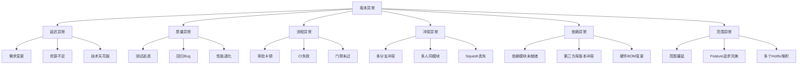

# 团队管理专题：版本·知识产权·PBC·人员·客户·质量·新人

> **概要**: 团队管理专题，覆盖版本管理根因、知识产权、PBC、人员、客户、质量与新人培养
>
> **关键词**: 版本管理 · 知识产权 · PBC考核 · 质量管理 · 新人培养

---

## 📑 目录

- [1. 版本管理细化](#1-版本管理细化)
  - [1.1 版本数量为什么会多：6大根因](#11-版本数量为什么会多6大根因)
    - [1.1.1 根因A：需求碎片化 → 版本"零散化"](#111-根因a需求碎片化-版本零散化)
    - [1.1.2 根因B：缺乏版本节奏 → 版本"随机化"](#112-根因b缺乏版本节奏-版本随机化)
    - [1.1.3 根因C：架构耦合 → 版本"连锁反应"](#113-根因c架构耦合-版本连锁反应)
    - [1.1.4 根因D：缺少合并策略 → 版本"堆叠化"](#114-根因d缺少合并策略-版本堆叠化)
    - [1.1.5 根因E：质量前移不足 → 版本"返工化"](#115-根因e质量前移不足-版本返工化)
    - [1.1.6 根因F：管理机制缺失 → 版本"无序化"](#116-根因f管理机制缺失-版本无序化)
  - [1.2 版本异常为什么会多：根因分类与诊断树](#12-版本异常为什么会多根因分类与诊断树)
    - [1.2.1 六类常见异常及根因分类](#121-六类常见异常及根因分类)
    - [1.2.2 延迟异常：根因深度分析](#122-延迟异常根因深度分析)
    - [1.2.3 质量异常：根因深度分析](#123-质量异常根因深度分析)
    - [1.2.4 异常诊断树（快速定位工具）](#124-异常诊断树快速定位工具)
    - [1.2.5 异常数据基线化](#125-异常数据基线化)
  - [1.3 计划外版本为什么多：动机分析与管控](#13-计划外版本为什么多动机分析与管控)
    - [1.3.1 三类计划外版本](#131-三类计划外版本)
    - [1.3.2 各类型根因](#132-各类型根因)
    - [1.3.3 Hotfix过多的根因分析树](#133-hotfix过多的根因分析树)
    - [1.3.4 Hotfix管控机制](#134-hotfix管控机制)
    - [1.3.5 Security版本管控](#135-security版本管控)
    - [1.3.6 客户定制版本管控](#136-客户定制版本管控)
  - [1.4 版本管理自检清单](#14-版本管理自检清单)
  - [1.5 版本优化决策矩阵](#15-版本优化决策矩阵)
    - [1.5.1 版本数量控制的"To Do / Not To Do"](#151-版本数量控制的to-do-not-to-do)
    - [1.5.2 按效果/成本选择优化方向](#152-按效果成本选择优化方向)
  - [1.6 版本管理评审机制](#16-版本管理评审机制)
    - [1.6.1 评审层次](#161-评审层次)
    - [1.6.2 版本月度复盘模板](#162-版本月度复盘模板)
    - [1.6.3 发布评审准入清单](#163-发布评审准入清单)
  - [1.7 版本管理成熟度评估](#17-版本管理成熟度评估)
  - [1.8 各产品线综合对比与优化](#18-各产品线综合对比与优化)
    - [1.8.1 多产品线版本全景对比](#181-多产品线版本全景对比)
    - [1.8.2 关键发现](#182-关键发现)
    - [1.8.3 对比优化建议](#183-对比优化建议)
    - [1.8.4 跨产品线共性优化](#184-跨产品线共性优化)
- [2. 知识产权建设](#2-知识产权建设)
  - [2.1 知识产权顶层设计](#21-知识产权顶层设计)
    - [2.1.1 知识产权战略定位](#211-知识产权战略定位)
    - [2.1.2 知识产权构成](#212-知识产权构成)
    - [2.1.3 知识产权流程](#213-知识产权流程)
  - [2.2 专利体系](#22-专利体系)
    - [2.2.1 专利类型选择](#221-专利类型选择)
    - [2.2.2 专利布局策略](#222-专利布局策略)
    - [2.2.3 专利指标](#223-专利指标)
    - [2.2.4 专利挖掘机制](#224-专利挖掘机制)
    - [2.2.5 专利评审标准](#225-专利评审标准)
  - [2.3 专著体系](#23-专著体系)
    - [2.3.1 专著类型](#231-专著类型)
    - [2.3.2 专著选题矩阵](#232-专著选题矩阵)
    - [2.3.3 专著编写流程](#233-专著编写流程)
    - [2.3.4 专著编写的常见问题](#234-专著编写的常见问题)
  - [2.4 IP评价与激励](#24-ip评价与激励)
    - [2.4.1 IP评价体系](#241-ip评价体系)
    - [2.4.2 IP激励方案](#242-ip激励方案)
    - [2.4.3 IP纳入PBC](#243-ip纳入pbc)
  - [2.5 IP风险防控](#25-ip风险防控)
  - [2.6 知识产权建设成熟度](#26-知识产权建设成熟度)
- [3. PBC总结与规划](#3-pbc总结与规划)
  - [3.1 PBC体系框架](#31-pbc体系框架)
    - [3.1.1 什么是PBC](#311-什么是pbc)
    - [3.1.2 PBC与绩效管理的关系](#312-pbc与绩效管理的关系)
    - [3.1.3 PBC的三层架构](#313-pbc的三层架构)
  - [3.2 PBC制定流程](#32-pbc制定流程)
    - [3.2.1 制定时间线](#321-制定时间线)
    - [3.2.2 PBC制定的SMART原则](#322-pbc制定的smart原则)
    - [3.2.3 PBC模板](#323-pbc模板)
    - [3.2.4 PBC对齐会议](#324-pbc对齐会议)
  - [3.3 PBC总结与评价](#33-pbc总结与评价)
    - [3.3.1 季度总结模板](#331-季度总结模板)
    - [3.3.2 年度总结模板](#332-年度总结模板)
    - [3.3.3 PBC评审校准（Calibration）](#333-pbc评审校准calibration)
  - [3.4 PBC与结果联动](#34-pbc与结果联动)
    - [3.4.1 PBC与调薪/奖金](#341-pbc与调薪奖金)
    - [3.4.2 PBC与晋升](#342-pbc与晋升)
  - [3.5 PBC常见问题与应对](#35-pbc常见问题与应对)
- [4. 人员A进展与痛点管理](#4-人员a进展与痛点管理)
  - [4.1 A人员全景档案](#41-a人员全景档案)
    - [4.1.1 人员档案结构](#411-人员档案结构)
    - [4.1.2 档案模板](#412-档案模板)
  - [4.2 A进展跟踪框架](#42-a进展跟踪框架)
    - [4.2.1 跟踪方法](#421-跟踪方法)
    - [4.2.2 1:1 会议指南](#422-11-会议指南)
    - [4.2.3 每周进展速览](#423-每周进展速览)
  - [4.3 A痛点管理](#43-a痛点管理)
    - [4.3.1 痛点分类](#431-痛点分类)
    - [4.3.2 痛点处理原则](#432-痛点处理原则)
    - [4.3.3 痛点记录跟踪](#433-痛点记录跟踪)
  - [4.4 A风险管理](#44-a风险管理)
    - [4.4.1 人员风险类型](#441-人员风险类型)
    - [4.4.2 人员风险等级](#442-人员风险等级)
    - [4.4.3 核心人员备份策略](#443-核心人员备份策略)
  - [4.5 A进阶路径规划](#45-a进阶路径规划)
    - [4.5.1 技术路线进阶路径](#451-技术路线进阶路径)
    - [4.5.2 针对不同阶段的规划重点](#452-针对不同阶段的规划重点)
    - [4.5.3 进阶路径模板](#453-进阶路径模板)
- [5. 客户管理](#5-客户管理)
  - [5.1 客户画像体系](#51-客户画像体系)
    - [5.1.1 客户画像构成](#511-客户画像构成)
    - [5.1.2 客户分层](#512-客户分层)
    - [5.1.3 客户画像模板](#513-客户画像模板)
  - [5.2 客户问题管理](#52-客户问题管理)
    - [5.2.1 问题分级与响应](#521-问题分级与响应)
    - [5.2.2 问题跟踪流程](#522-问题跟踪流程)
    - [5.2.3 客户问题趋势分析](#523-客户问题趋势分析)
  - [5.3 客户新技术与机会挖掘](#53-客户新技术与机会挖掘)
    - [5.3.1 客户需求发现渠道](#531-客户需求发现渠道)
    - [5.3.2 客户新技术需求的信号](#532-客户新技术需求的信号)
    - [5.3.3 客户技术路线图对齐](#533-客户技术路线图对齐)
    - [5.3.4 客户机会评估](#534-客户机会评估)
  - [5.4 客户管理成熟度](#54-客户管理成熟度)
- [6. 质量与效率：减少内耗](#6-质量与效率减少内耗)
  - [6.1 内耗全景诊断](#61-内耗全景诊断)
    - [6.1.1 什么是"内耗"](#611-什么是内耗)
    - [6.1.2 内耗诊断框架](#612-内耗诊断框架)
    - [6.1.3 内耗诊断调查](#613-内耗诊断调查)
  - [6.2 流程内耗：识别与削减](#62-流程内耗识别与削减)
    - [6.2.1 常见流程内耗](#621-常见流程内耗)
    - [6.2.2 流程简化方法论](#622-流程简化方法论)
    - [6.2.3 流程削减的优先级](#623-流程削减的优先级)
  - [6.3 沟通内耗：识别与削减](#63-沟通内耗识别与削减)
    - [6.3.1 常见沟通内耗](#631-常见沟通内耗)
    - [6.3.2 会议优化](#632-会议优化)
    - [6.3.3 信息同步优化](#633-信息同步优化)
  - [6.4 工具内耗：识别与削减](#64-工具内耗识别与削减)
    - [6.4.1 常见工具内耗](#641-常见工具内耗)
    - [6.4.2 工具内耗优化](#642-工具内耗优化)
  - [6.5 组织内耗：识别与削减](#65-组织内耗识别与削减)
    - [6.5.1 常见组织内耗](#651-常见组织内耗)
    - [6.5.2 减少协作摩擦](#652-减少协作摩擦)
  - [6.6 内耗削减ROI矩阵](#66-内耗削减roi矩阵)
    - [6.6.1 典型内耗削减行动](#661-典型内耗削减行动)
    - [6.6.2 内耗基线化](#662-内耗基线化)
  - [6.7 内耗持续监控机制](#67-内耗持续监控机制)
    - [6.7.1 内耗监控仪表盘](#671-内耗监控仪表盘)
    - [6.7.2 内耗团队自查机制](#672-内耗团队自查机制)
- [7. 新员工培养](#7-新员工培养)
  - [7.1 培养阶段细化](#71-培养阶段细化)
    - [7.1.1 新员工成长的6个月关键期](#711-新员工成长的6个月关键期)
    - [7.1.2 管理者在每个阶段的关键动作](#712-管理者在每个阶段的关键动作)
  - [7.2 培养基线化](#72-培养基线化)
    - [7.2.1 新员工培养基线](#721-新员工培养基线)
    - [7.2.2 新员工异常预警](#722-新员工异常预警)
  - [7.3 新员工导师制强化](#73-新员工导师制强化)
    - [7.3.1 导师与管理者分工](#731-导师与管理者分工)
    - [7.3.2 导师一票否决项](#732-导师一票否决项)
  - [7.4 新员工成长路径](#74-新员工成长路径)
    - [7.4.1 成长地图](#741-成长地图)
    - [7.4.2 新人留存的关键因素](#742-新人留存的关键因素)
- [8. 团队管理全景仪表盘](#8-团队管理全景仪表盘)
  - [8.1 仪表盘结构](#81-仪表盘结构)
  - [8.2 管理周报模板](#82-管理周报模板)
- [9. 变更记录](#9-变更记录)
- [参考文件](#参考文件)
- [Changelog](#changelog)

---

## 1. 版本管理细化

### 1.1 版本数量为什么会多：6大根因

版本数量多不一定是坏事（说明交付活跃），但**非必要的版本膨胀**一定是管理问题。以下是版本数量过多的六大根因及其诊断方法：

#### 1.1.1 根因A：需求碎片化 → 版本"零散化"

| 症状 | 诊断方法 | 量化指标 |
|:-----|:---------|:---------|
| 每个版本只包含少量功能 | 查看版本的平均功能/Story数量 | 版本Story密度 < 3个/版本 |
| 需求频繁插入导致版本不断 | 需求变更趋势图 | 月度需求变更数 / 版本数 > 2 |
| 需求粒度不一致 | 需求拆分检查 | 一个Story平均工作量 < 2人天 |
| 缺乏需求批次管理 | 需求合入时间分布 | 需求分散在整月而不是集中在窗口期 |

**根因分析**：

```text
需求随口提 -> 不经评审 -> 直接排版本 -> 版本膨胀 -> 版本碎片化
   ^                                                      |
   +------------------ 恶性循环 ---------------------------+
```

**改善措施**：

| 措施 | 做法 | 见效周期 | 效果 |
|:-----|:-----|:---------|:-----|
| **需求批次管理** | 收集→评审→排期→冻结，每2周一个批次窗口 | 1-2月 | 版本数 -30% |
| **版本内容最低阈值** | 每个Minor版本至少包含X个功能点（按产品定） | 1月 | 版本质量提升 |
| **需求合并机制** | 小需求必须捆绑到≥3个才独立发布 | 立即 | 碎片版本减少 |
| **需求积分制** | 每个需求打分，低于阈值的延后合并 | 1季度 | 需求质量提升 |

#### 1.1.2 根因B：缺乏版本节奏 → 版本"随机化"

| 症状 | 诊断方法 | 量化指标 |
|:-----|:---------|:---------|
| 版本间隔不一 | 版本间隔标准差 | 间隔CV > 30% |
| 发布日没有规律 | 版本发布日期分布 | 周内各天都有发布 |
| 没有版本日历 | 询问团队是否有年度版本计划 | 无正式版本日历 |
| 版本经常跳票 | 版本按时交付率 | < 80% |

**改善措施**：

```text
固定版本节奏（以两周为基准时钟）:

Week 1    Week 2    Week 3    Week 4    Week 5    Week 6
  |          |         |          |         |          |
  +- 需求冻结 +- 开发期 -+- 测试期 -+- 发布日 -+-- 复盘 -+
  |          |         |          |         |          |
  +-------------------- 一个版本周期 --------------------+
```

| 节奏类型 | 适合场景 | 版本间隔 | 优点 | 缺点 |
|:---------|:---------|:---------|:-----|:-----|
| **固定周期** | 成熟产品、持续交付 | 2-4周 | 可预期、节奏稳定 | 不够灵活 |
| **固定容量** | 多项目并行 | 2周 | 容灾好、质量稳定 | 功能量波动 |
| **事件驱动** | 紧急修复、安全更新 | 按需 | 响应快 | 难以规划 |
| **混合模式** | 通用+紧急 | 固定+按需 | 兼顾稳定与灵活 | 管理复杂度高 |

**推荐方案**：固定周期 + 紧急通道

- 常规版本：每2周一个Minor版本
- 紧急通道：预留Hotfix能力，但设门槛（P0级故障）
- Patch版本：每两周批量处理一次

#### 1.1.3 根因C：架构耦合 → 版本"连锁反应"

| 症状 | 诊断方法 | 量化指标 |
|:-----|:---------|:---------|
| 一个模块改完牵动多个模块 | 变更影响分析 | 单次变更涉及模块数 > 3 |
| 发布时必须全量回归 | 回归测试集量 | 全量回归时间 > 2天 |
| 模块间接口频繁变更 | 接口变更记录 | 月度接口变更次数 > 5 |
| Cherry-pick泛滥 | 每次发布前精选次数 | > 5次/版本 |

**改善措施**：

```text
架构解耦 -> 模块独立版本 -> 接口版本化 -> 并行开发 -> 版本数下降
```

| 措施 | 做法 | 预期效果 |
|:-----|:-----|:---------|
| **模块独立版本化** | BMC/BIOS/GPU驱动各自独立版本号 | 减少级联发布 |
| **接口契约版本化** | 模块间API/ABI加版本标记 | 兼容性可追溯 |
| **接口冻结窗口** | 每季度一次接口变更窗口 | 减少临时接口变更 |
| **微服务化/组件化** | 关键模块拆为独立服务 | 独立部署能力 |

#### 1.1.4 根因D：缺少合并策略 → 版本"堆叠化"

| 症状 | 诊断方法 | 量化指标 |
|:-----|:---------|:---------|
| 一个功能在多版本重复出现 | 查看各版本commit log | 跨版本重复commit > 10% |
| 合入策略不统一 | 团队合入方式各不相同 | 无统一标准 |
| 多条分支并行混乱 | 活跃分支数量 | > 活跃开发者×0.5 |
| Cherry-pick作为常规操作 | Cherry-pick频率 | 每周 > 3次 |

**改善措施**：

```text
分支策略选择树：

产品形态是什么？
+-- 单版本持续交付 -> Trunk-Based
+-- 多版本并行维护 -> GitFlow
+-- 多环境部署 -> GitLab Flow
+-- SaaS持续发布 -> GitHub Flow
```

| 分支策略 | 版本数控制效果 | 适用条件 |
|:---------|:--------------|:---------|
| Trunk-Based Development | 单分支，版本数最少 | CI成熟度≥3级 |
| GitLab Flow（环境分支） | 环境线清晰 | 多环境部署 |
| GitHub Flow | 功能分支短生命周期 | 全量部署 |
| 推荐：Release Branch + Hotfix | 版本隔离好，Hotfix受控 | 大部分团队 |

#### 1.1.5 根因E：质量前移不足 → 版本"返工化"

| 症状 | 诊断方法 | 量化指标 |
|:-----|:---------|:---------|
| 版本测试阶段大量Bug | 测试阶段Bug占比 | > 60% Bug在测试阶段发现 |
| Patch/Hotfix占比高 | Patch+Hotfix/总版本 | > 40% |
| 发布后频繁紧急修复 | 发布后7天内Hotfix数 | > 2次/版本 |
| 回归测试重复发现 | 回归Bug占比 | > 20% |

**改善措施**：

```text
质量前移 = 版本回流减少 = 版本总数下降

质量前移措施:
  代码Review + 单元测试 -> CI门禁 -> 集成测试 -> 自动化回归 -> 人工验收
     v                     v         v           v           v
  Bug发现率: 30%          15%       15%         30%         10%
  阶段成本:   1x           4x        10x         20x        50x
```

#### 1.1.6 根因F：管理机制缺失 → 版本"无序化"

| 症状 | 诊断方法 | 量化指标 |
|:-----|:---------|:---------|
| 版本创建不需要审批 | 版本创建流程 | 无审批 |
| 没有版本清理机制 | 版本状态统计 | 废弃版本 > 20% |
| 版本命名混乱 | 版本号检查 | 不统一 > 3种 |
| 没有版本定期评审 | 版本评审频率 | 月度评审缺失 |

**改善措施**：

```text
版本治理委员会 -> 版本管理规范 -> 版本审批流 -> 版本清理机制 -> 版本定期评审
```

| 管理机制 | 做法 | 效果 |
|:---------|:-----|:-----|
| **版本审批门禁** | 创建版本需要Leader审批 + 说明理由 | 减少无意义版本 |
| **版本清理日** | 每月1次废弃版本清理 | 控制版本总数 |
| **版本名统一** | 全组织统一版本命名规范 | 统计可对比 |
| **版本分级评审** | 月度/季度版本评审 | 趋势可追踪 |

---

### 1.2 版本异常为什么会多：根因分类与诊断树

#### 1.2.1 六类常见异常及根因分类



#### 1.2.2 延迟异常：根因深度分析

| # | 根因子类 | 典型表现 | 真实原因（不浮于表面） | 定量判断 | 改善方向 |
|:-:|:---------|:---------|:---------------------|:---------|:---------|
| 1a | **需求变更冲动** | 版本中插入新需求 | PM/销售缺乏"批次感"、"每个客户都承诺" | 版本中变更数 / 总需求 > 20% | 需求冻结窗口+变更评审 |
| 1b | **需求理解偏差** | 开发到一半发现理解错误 | 需求文档缺乏验收标准(DoD) | 需求澄清工单 / 总需求 > 15% | 需求评审加入验收标准 |
| 2a | **资源被抽调** | 关键开发被临时拉去救火 | 缺乏资源保护机制，紧急事项优先 | 人被抽调 > 2次/版本 | 核心人力锁定+救火预备队 |
| 2b | **隐性资源不足** | 测试人力不足导致排队 | 测试人力按峰值配置不足 | 测试等待时间 / 总周期 > 20% | 自动化测试+测试左移 |
| 3a | **技术预研不足** | 开发中才发现方案不可行 | 设计评审流于形式，没有原型验证 | 方案变更次数 > 2次/版本 | 技术预研前移、SPIKE机制 |
| 3b | **技术债务触发** | 旧模块改造比预期困难 | 长期缺乏代码重构 | 老模块Bug率 > 新模块2倍 | 技术债务定期还 |

#### 1.2.3 质量异常：根因深度分析

| # | 根因子类 | 典型表现 | 真实原因 | 定量判断 | 改善方向 |
|:-:|:---------|:---------|:---------|:---------|:---------|
| 1a | **测试覆盖不足** | 生产环境异常漏测 | 测试用例由开发者自己写，缺乏独立性 | 漏测率 > 10% | 测试用例独立评审 |
| 1b | **边界条件漏测** | 高并发/大压力下出问题 | 测试环境与生产环境差异大 | 生产/测试环境差异 > 3项 | 预生产环境(Staging) |
| 2a | **合并丢失** | 已修复Bug在新版本重现 | Cherry-pick遗漏或合并回退 | 回归Bug / 总Bug > 15% | 自动化回归测试 |
| 2b | **基线漂移** | 修复引起其他Bug | 测试用例未随功能更新 | 回归测试集覆盖率 < 80% | 测试用例定期审计 |
| 3a | **性能退化无症状** | 发布后发现性能下降 | 没有性能基准线 | 无自动化性能测试 | 性能基线CI |
| 3b | **安全漏洞未检测** | 引入新依赖带来安全风险 | 没有依赖安全扫描 | 未扫描依赖 > 10% | 依赖安全扫描自动门禁 |

#### 1.2.4 异常诊断树（快速定位工具）

```text
版本异常 -> 判断类型
    |
    +-- 延迟 -> 是否需求变更？
    |        +-- 是 -> 查看变更频率 -> A: 频繁->需求批次管理 B: 偶尔->评估影响
    |        +-- 否 -> 是否资源问题？
    |                  +-- 是 -> 查看资源占用 -> A: 被抽调->锁定核心人力
    |                  |                        B: 能力不足->培训/换人
    |                  +-- 否 -> 技术问题？
    |                            +-- 技术预研不足 -> SPIKE机制
    |                            +-- 依赖延迟 -> 外部依赖管理
    |
    +-- 质量 -> 测试逃逸？
    |       +-- 是 -> 测试覆盖不足 -> 增强测试
    |       |                    -> 边界条件漏测 -> 边界值分析
    |       +-- 否 -> 回归Bug？
    |                 +-- 合并丢失 -> 自动化回归
    |                 +-- 基线漂移 -> 测试用例审计
    |
    +-- 流程 -> 审批卡顿？
    |       +-- CI失败？ -> CI稳定性建设
    |
    +-- 冲突 -> 分支问题？
    |       +-- 模块耦合？ -> 架构解耦/接口版本化
    |
    +-- 依赖 -> 外部依赖未就绪？
    |       +-- 依赖管理机制
    |
    +-- 范围 -> 范围蔓延？
            +-- 需求冻结/变更评审
```

#### 1.2.5 异常数据基线化

建立异常基线，用于判断是否有"恶化趋势"：

| 异常维度 | 基线定义方法 | 基线示例 | 异常判断 |
|:---------|:------------|:---------|:---------|
| **延迟率** | 过去6个月平均延迟率±σ | μ=12%, σ=5% | >22% 异常 |
| **质量逃逸率** | 发布后Bug数/总Bug数 | μ=8%, σ=3% | >14% 异常 |
| **需求变更率** | 版本内变更需求/总需求 | μ=15%, σ=6% | >27% 异常 |
| **冲突率** | 冲突MR/总MR | μ=5%, σ=2% | >9% 异常 |

**异常趋势判断**：

```text
基线偏离判断：
  正常（✅）: |当前值 - 基线μ| ≤ σ
  关注（🟡）: σ < |当前值 - 基线μ| ≤ 2σ
  预警（🟠）: 2σ < |当前值 - 基线μ| ≤ 3σ
  异常（🔴）: |当前值 - 基线μ| > 3σ

  连续恶化趋势：连续3个月同方向偏离 -> 自动预警
```

---

### 1.3 计划外版本为什么多：动机分析与管控

#### 1.3.1 三类计划外版本

```text
计划外版本
    +-- 紧急修复(Hotfix): 已发布版本的P0/P1 Bug修复
    +-- 安全更新(Security): 安全漏洞修复（通常强制）
    +-- 客户特定(Custom): 大客户特殊需求的临时版本
```

#### 1.3.2 各类型根因

| 类型 | 常见根因 | "正常"频次 | "过多"频次 | 深层原因 |
|:-----|:---------|:----------|:----------|:---------|
| **Hotfix** | 测试未覆盖/边界条件/硬件兼容 | ≤月1次 | 月≥3次 | 发布质量门禁不严 |
| **Security** | 组件漏洞/协议漏洞/接口安全 | 年2-4次 | 月≥1次 | 安全开发流程(SDL)缺失 |
| **Custom** | 客户要提前交付/特殊配置 | 0（规划内） | 月≥2次 | 销售承诺管理缺失 |

#### 1.3.3 Hotfix过多的根因分析树

```text
Hotfix过多
    |
    +-- 发布前发现不足
    |   +-- 测试用例覆盖不足 -> 增加场景/边界用例
    |   +-- 测试环境与生产不一致 -> 建立Staging环境
    |   +-- 测试周期被压缩 -> 保护测试时间窗口
    |   +-- 灰度发布缺失 -> 建立灰度/金丝雀发布
    |
    +-- 开发质量不足
    |   +-- 单元测试缺乏 -> 单元测试覆盖率目标
    |   +-- Code Review不严肃 -> Review清单/强制Review
    |   +-- 自测不充分 -> 自测checklist强制完成
    |   +-- 静态分析未启用 -> CI集成静态分析
    |
    +-- 兼容性未验证
    |   +-- 硬件版本组合未全覆盖 -> 兼容性矩阵标准化
    |   +-- 固件/软件版本未完全测试 -> 版本组合缩减
    |   +-- 依赖版本未锁定 -> 依赖锁定+自动化检查
    |
    +-- 流程问题
        +-- 版本规范无"质量门禁" -> 设置门禁(0 P0/P1 Bug)
        +-- 发布决策流于形式 -> 发布评审委员会
        +-- 没有Hotfix复盘 -> 每次Hotfix 5Why分析
```

#### 1.3.4 Hotfix管控机制

**热修复门槛**：

```text
触发Hotfix的条件（全部满足才允许）:
  □ 故障定级为 P0 或 P1
  □ 影响客户正常运行
  □ 无临时绕行方案（Workaround）
  □ 修复方案已通过评审
  □ 自动化回归测试已通过
```

**热修复流程**：

```text
Hotfix申请（提交故障单+修复方案）
    v
版本经理评审（30分钟内响应）
    v
+-------------- 决策门 --------------+
| P0/P1 + 无绕行方案 -> 允许创建Hotfix  |
| 其他情况 -> 归入下一个Patch版本       |
+------------------------------------+
    v
开发修复 + 单元测试 + 代码Review（4小时内）
    v
自动化回归测试 + 核心场景冒烟测试
    v
发布评审（测试结果+影响范围确认）
    v
灰度发布（10%->50%->100%）
    v
48小时内提交复盘报告（5Why）
    v
复盘结论纳入下一版发布检查清单
```

**Hotfix趋势监控**：

```text
月度 Hotfix 热力图:

产品线   1月  2月  3月  4月  5月  6月  趋势
A        2    1    3    2    1    0    v 改善
B        0    1    0    2    1    1    -> 持平
C        3    4    2    5    3    4    🔴 持续偏高
D        1    0    0    1    0    0    ✅ 良好

指标:
- 组织级Hotfix目标: ≤ 月均1次/产品线
- Hotfix产生到修复: 目标 < 8小时
- Hotfix复盘闭环率: 目标 100%
```

#### 1.3.5 Security版本管控

| 措施 | 做法 | 效果 |
|:-----|:-----|:-----|
| **SDL嵌入开发流程** | 每次需求评审+安全风险评估 | 从源头减少漏洞 |
| **依赖安全扫描自动化** | CI集成npm/pip/mvn漏洞检查 | 发现漏洞即阻断 |
| **安全补丁合并发布** | 每月集中发布安全Patch | 减少单独安全版本 |
| **CVE跟踪机制** | 专人跟踪CVE+影响评估 | 不漏报、不恐慌发布 |
| **安全版本快速通道** | 严重漏洞(>CVSS 9.0)可走快速通道 | 常规漏洞走普通版本 |

#### 1.3.6 客户定制版本管控

客户定制版本是"计划外"的重要源头，核心是**不要每个客户单独出版本**：

```text
客户定制版本管控原则:
  1. 配置代替版本：能用配置/CDP(客户定义参数)解决的，不出版本
  2. 标准+扩展：核心功能标准化，扩展功能用插件/模组
  3. 版本收敛：相似需求合并到同一版本
  4. 定制成本透明化：让销售/客户知道定制版本的成本和周期
```

| 管控措施 | 做法 | 预期效果 |
|:---------|:-----|:---------|
| **定制版本审批委员会** | 定制版本需VP级审批 | 减少定制版本量 |
| **定制成本内部计价** | 定制版本成本计入项目成本 | 决策时考虑成本 |
| **定制版本归并** | 季度收集同类需求，统一出版本 | 减少重复定制 |
| **定制功能标准化** | 定制→通用化→纳入标准版本 | 长期减少定制 |

---

### 1.4 版本管理自检清单

**月度版本健康检查**：

```text
□ 版本数量检查
   □ 本月版本总数 ≤ 基线 + 10%
   □ Hotfix版本数 ≤ 月度目标
   □ Security版本数 ≤ 月度目标
   □ 无废弃版本未清理

□ 版本节奏检查
   □ Major版本按季度计划执行
   □ Minor版本按双周节奏执行
   □ 版本间隔CV < 30%
   □ 按时交付率 ≥ 目标值

□ 版本质量检查
   □ 版本测试通过率 ≥ 90%
   □ 版本发布后7天内Hotfix = 0
   □ 版本回归Bug率 ≤ 10%
   □ 版本合入冲突率 ≤ 5%

□ 版本异常检查
   □ 所有延迟版本有根因分析
   □ 所有异常版本有复盘记录
   □ 异常趋势未连续3个月恶化
   □ 基线已更新（如有显著偏移）

□ 版本清理检查
   □ 已合并分支已删除（清理率≥95%）
   □ 超过3个月未活动分支已归档
   □ 废弃版本已标记或删除
```

---

### 1.5 版本优化决策矩阵

#### 1.5.1 版本数量控制的"To Do / Not To Do"

| 应该做 (To Do) | 不该做 (Not To Do) |
|:---------------|:-------------------|
| 需求批次管理 | 禁止所有紧急版本（不现实） |
| 版本最低内容阈值 | 一刀切减少版本数（质量会恶化） |
| 版本合并发布 | 把所有人满负荷作为常态 |
| 清理废弃版本 | 单纯限制版本号分配 |
| 提高自动化回归率 | 减少测试周期（Bug逃逸更多） |
| 质量前移（Review+UT+CI） | 减少版本类型（不现实） |

#### 1.5.2 按效果/成本选择优化方向

```text
效果高
  ^
  | ❶ 质量前移 <- <- <- ❷ 需求批次管理
  |   效果:★★★★★       效果:★★★★☆
  |   成本:★★★☆☆       成本:★★☆☆☆
  |
  | ❸ 版本节奏固定 <- ❹ 分支策略优化
  |   效果:★★★★☆       效果:★★★☆☆
  |   成本:★★☆☆☆       成本:★★☆☆☆
  |
  | ❺ 架构解耦 <- <- ❻ 质量门禁
  |   效果:★★★★★       效果:★★★★☆
  |   成本:★★★★★       成本:★★☆☆☆
  |
  +-------------------------------> 成本低
```

**推荐实施顺序**：

1. **P0（1-2周见效）**：需求批次管理 + 版本节奏固定
2. **P1（1-2月见效）**：质量门禁 + Hotfix管控
3. **P2（3-6月见效）**：质量前移 + 分支策略优化
4. **P3（6-12月见效）**：架构解耦 + 模块独立版本

---

### 1.6 版本管理评审机制

#### 1.6.1 评审层次

| 评审类型 | 频次 | 参与人 | 内容 | 输出 |
|:---------|:-----|:-------|:-----|:-----|
| **版本周例会** | 每周 | 版本经理+各模块TL | 当前版本状态、阻塞项 | 版本周报 |
| **版本发布评审** | 每次发布前 | 版本经理+QA+开发 | 发布准入清单 | 发布决策 |
| **版本月度复盘** | 每月 | 研发经理+版本经理 | 版本健康度、异常分析 | 月度版本报告 |
| **版本季度规划** | 每季 | 研发总监+PM+版本经理 | 版本节奏、资源匹配 | 季度版本日历 |
| **版本年度策略** | 每年 | CTO/VP+研发总监 | 版本策略、工具投资 | 年度版本管理策略 |

#### 1.6.2 版本月度复盘模板

```text
+===========================================================+
|        2026年_月_版本复盘报告                              |
+===========================================================+
| 1. 版本总览                                              |
|    Major: _ | Minor: _ | Patch: _ | Hotfix: _ | Security: _ |
|    总版本数: _ | 按时交付率: _% | 平均延迟: _天           |
|                                                          |
| 2. 版本健康度                                            |
|    冲突率: _% | 热修复率: _% | 回归Bug率: _%              |
|    测试通过率: _% | 门禁通过率: _%                         |
|    健康评分: _/100                                        |
|                                                          |
| 3. 异常分析                                              |
|    延迟版本: _个, 根因分布:                               |
|      - 需求变更: _% | 资源不足: _% | 技术难题: _%          |
|      - 外部依赖: _% | 质量回退: _%                        |
|    质量异常: _个, 根因:                                   |
|    计划外版本: _个, 根因:                                 |
|                                                          |
| 4. 与基线对比                                            |
|    指标        本月   基线   偏差   趋势                   |
|    版本数       _      _     _      ^/v/->              |
|    延迟率       _%     _%    _%     ^/v/->              |
|    Hotfix率     _%     _%    _%     ^/v/->              |
|    冲突率       _%     _%    _%     ^/v/->              |
|                                                          |
| 5. 改进项                                                |
|    P0: _ | P1: _ | P2: _                                 |
|    已完成: _ | 进行中: _ | 未开始: _                       |
|                                                          |
| 6. 下月计划                                              |
|    预计版本数: _ | 重点关注: _                            |
+===========================================================+
```

#### 1.6.3 发布评审准入清单

```text
版本号: _______________ | 日期: _______________

□ 质量门禁
   □ 所有P0/P1 Bug已修复并验证
   □ P2 Bug ≤ X个（无功能阻塞）
   □ 安全扫描已通过（无高危/严重漏洞）
   □ 性能基线未退化（或退化已评估）
   □ 兼容性测试已通过（BOM/固件/软件矩阵）

□ 测试门禁
   □ 自动化回归测试通过率 ≥ 98%
   □ 核心场景冒烟测试通过率 = 100%
   □ 测试覆盖率达到版本目标 ≥ 90%
   □ 无已知漏测风险

□ 交付件门禁
   □ 版本发布说明已编写
   □ 变更日志(Changelog)已更新
   □ 升级/回退方案已验证
   □ 已知问题清单已记录
   □ 配套文档已更新

□ 决策
   □ 批准发布
   □ 有条件发布（条件: _______________）
   □ 拒绝发布（原因: _______________）
```

---

### 1.7 版本管理成熟度评估

| 级别 | 名称 | 特征 | 关键指标 |
|:-----|:-----|:-----|:---------|
| **L1 混乱** | 无版本管理 | 版本号随意、无发布时间表、无分支策略 | Hotfix率>30%、按时交付率<50% |
| **L2 基础** | 有版本号规范 | 有版本命名规则、有基本的发布流程 | Hotfix率<20%、按时交付率<70% |
| **L3 规范** | 有版本节奏 | 固定版本周期、有分支策略、有发布评审 | Hotfix率<10%、按时交付率>80% |
| **L4 量化** | 数据驱动 | 基线化管理、异常自动预警、指标看板 | Hotfix率<5%、按时交付率>90% |
| **L5 优化** | 持续改进 | 版本质量预测、自动修复、智能决策辅助 | Hotfix率<3%、按时交付率>95% |

---

### 1.8 各产品线综合对比与优化

#### 1.8.1 多产品线版本全景对比

| 对比维度 | 产品线A (AI训练) | 产品线B (推理) | 产品线C (通用) | 产品线D (边缘) |
|:---------|:----------------|:---------------|:---------------|:---------------|
| **月均版本数** | 1.3 | 2.0 | 0.7 | 0.7 |
| **版本密度** (版本/人/年) | 2.8 | 3.2 | 2.1 | 1.5 |
| **计划内外比例** | 6:4 | 7:3 | 5:5 | 8:2 |
| **Major/Minor/Patch/Hotfix** | 2/3/8/3 | 2/5/8/1 | 1/2/3/2 | 1/2/3/1 |
| **按时交付率** | 81% | 88% | 75% | 87% |
| **平均延迟天数** | 6天 | 3天 | 10天 | 2天 |
| **冲突率** | 8% | 4% | 3% | 2% |
| **模块变更加权** | BMC ⭐⭐⭐ | GPU ⭐⭐ | BMC/存储 ⭐⭐ | ⭐ |
| **分支生命周期** | 45天 | 30天 | 90天 | 60天 |
| **版本健康评分** | 68/100 🟡 | 82/100 🟢 | 55/100 🟠 | 78/100 🟢 |

#### 1.8.2 关键发现

| 发现 | 涉及产品线 | 数据支撑 | 根因 |
|:-----|:----------|:---------|:-----|
| **产品线C版本健康严重不达标** | C | 交付率75%、延迟10天、计划外50% | 测试资源不足、架构耦合 |
| **产品线B版本管理表现最好** | B | 交付率88%、延迟3天、健康评分82 | 流程成熟、自动化率高 |
| **产品线A Hotfix集中度异常** | A | P/H比例3:3，Hotfix月均1-2次 | BMC模块耦合大，测试覆盖不足 |
| **产品线D版本数量少但健康** | D | 月均0.7版，计划外仅20% | 导入期但流程建设到位 |
| **全部产品线Patch占比偏高** | 全部 | 平均45%为Patch版本 | 需求碎片化的普遍性问题 |

#### 1.8.3 对比优化建议

| 产品线 | P0措施 | P1措施 | P2措施 | 预期效果 |
|:-------|:-------|:-------|:-------|:---------|
| **A: AI训练** | BMC模块拆分独立版本 | 增加BMC自动化测试覆盖 | 合入门禁强化 | Hotfix率12%→<8% |
| **B: AI推理** | 保持当前节奏 | 推动质量前移（左移） | 向L4级量化管理升级 | 维持领先，Hotfix率<5% |
| **C: 通用** | **扩充测试资源**+需求冻结 | 分支策略优化（缩短周期） | 架构解耦 | 交付率75%→>85% |
| **D: 边缘** | 保持当前机制 | 建立基线，预防版本膨胀 | — | 预防性管理 |

#### 1.8.4 跨产品线共性优化

| 优化方向 | 适用产品线 | 预期效果 | 优先级 |
|:---------|:----------|:---------|:-------|
| 全产品线统一版本命名规范 | 全部 | 版本可对比可统计 | P0 |
| 全产品线需求批次管理 | 全部（最适用于C） | 版本总数-15% | P0 |
| 全产品线版本月度评审 | 全部 | 异常早发现 | P0 |
| 测试自动化率提升 | A、C | 质量提升 | P1 |
| 分支策略统一化 | A、C | 冲突率下降 | P1 |
| 版本管理工具统一 | 全部 | 数据可拉通 | P1 |

---

## 2. 知识产权建设

### 2.1 知识产权顶层设计

#### 2.1.1 知识产权战略定位

```text
知识产权建设目标:

                     +----------+
                     | 保护创新  |  ->  核心技术和方案不被仿制
                     +----------+
                     | 构建壁垒  |  ->  形成专利护城河
                     +----------+
                     | 品牌建设  |  ->  专著、白皮书提升技术影响力
                     +----------+
                     | 价值变现  |  ->  许可/转让/融资/上市估值
                     +----------+
```

#### 2.1.2 知识产权构成

```text
知识产权体系 (服务器R&D团队)
    +-- 专利 (Patent)
    |   +-- 发明专利 (核心)
    |   +-- 实用新型 (改进)
    |   +-- 外观设计 (外观)
    +-- 专著 (Monograph/Book)
    |   +-- 技术专著 (系统性知识)
    |   +-- 白皮书 (行业引领)
    |   +-- 技术博客 (知识输出)
    +-- 软著 (Software Copyright)
    |   +-- 自研/合作开发软件
    +-- 标准 (Standard)
    |   +-- 标准必要专利(SEP)
    |   +-- 行业标准/团体标准
    +-- 技术秘密 (Know-how)
        +-- 未公开的核心技术/参数
```

#### 2.1.3 知识产权流程

```text
技术产生 -> 技术评审(是否可专利/可出专著)
    v
+--------------------------------------------------+
|  专利路径                     专著路径              |
|  技术交底书 <- 发明人撰写    专著规划 <- 作者规划  |
|      v                            v              |
|  内部评审(新颖性/创造性)      大纲评审           |
|      v                            v              |
|  专利撰写(代理机构)          章节撰写           |
|      v                            v              |
|  申报(国知局/USPTO/EPO)      审校/出版          |
|      v                            v              |
|  审查/答复授权               正式出版            |
+--------------------------------------------------+
```

---

### 2.2 专利体系

#### 2.2.1 专利类型选择

| 专利类型 | 保护期 | 审查周期 | 保护对象 | 适用场景 | 费用 |
|:---------|:------|:---------|:---------|:---------|:-----|
| **发明专利** | 20年 | 2-4年 | 技术方案、方法、系统 | 核心技术、算法、架构 | 高 |
| **实用新型** | 10年 | 6-12月 | 产品结构、构造 | 改进、硬件结构 | 中 |
| **外观设计** | 15年 | 6-12月 | 外观形状、图案 | 产品外观ID | 低 |

#### 2.2.2 专利布局策略

**服务器领域重点专利布局方向**：

| 技术域 | 可专利方向 | 布局优先级 | 竞争对手布局强度 |
|:-------|:----------|:----------|:----------------|
| **供电管理** | 电源拓扑、VR控制、上下电时序、功率封顶 | ⭐⭐⭐⭐⭐ | 高 |
| **散热方案** | 液冷接头、冷板设计、智能风扇调速 | ⭐⭐⭐⭐⭐ | 中高 |
| **BMC管理** | 带外管理、故障预测、资产管理 | ⭐⭐⭐⭐ | 高 |
| **高速互联** | PCIe/CXL拓扑、信号完整性、连接器 | ⭐⭐⭐⭐ | 极高 |
| **AI加速** | GPU集群拓扑、AllReduce优化、故障恢复 | ⭐⭐⭐⭐⭐ | 极高 |
| **安全** | 可信启动、安全固件、SPDM认证 | ⭐⭐⭐⭐ | 高 |
| **RAS** | 故障预测、FMEA、容错机制 | ⭐⭐⭐ | 中 |
| **结构设计** | 机箱布局、导轨、快拆结构 | ⭐⭐⭐ | 中 |

#### 2.2.3 专利指标

| 指标 | 定义 | 年度目标 | 说明 |
|:-----|:-----|:---------|:-----|
| **专利申请量** | 年度新申请专利数 | 按产品线定 | 数量指标 |
| **授权率** | 授权专利/申请专利 | ≥60% | 质量指标 |
| **授权周期** | 申请到授权时间 | ≤3年 | 效率指标 |
| **发明专利占比** | 发明/总申请 | ≥70% | 质量指标 |
| **人均专利提案** | 交底书数/研发人数 | ≥0.5 | 参与度指标 |
| **授权实施率** | 已实施/已授权 | ≥40% | 价值指标 |
| **国际专利占比** | PCT/海外专利/总专利 | ≥20% | 国际化指标 |
| **SEP数量** | 标准必要专利数 | 按规划 | 战略指标 |

#### 2.2.4 专利挖掘机制

```text
常规挖掘                             主动挖掘
    |                                    |
    +-- 项目节点挖掘                    +-- 技术预见挖掘
    |   TR2(方案) -> 预埋专利           |   年度技术路线 -> 预研 -> 专利包
    |   TR3(详细) -> 交底书撰写         |
    |   TR4(开发) -> 补充申请           |
    |                                   |
    +-- 问题驱动挖掘                    +-- 竞品应对挖掘
    |   Bug/故障攻克 -> 技术方案专利化  |   竞品专利 -> 规避设计 -> 新专利
    |   性能优化方案 -> 方法专利        |
    |                                   |
    +-- 复用挖掘                        +-- 标准预埋挖掘
    |   CBB/平台技术 -> 系统专利        |   标准制定 -> 标准必要专利布局
    |   工具方法 -> 方法专利            |
    +-- 复盘挖掘                       +-- 跨界融合挖掘
        事故复盘 -> 创新方案             AI+硬件 -> 跨域专利
```

#### 2.2.5 专利评审标准

**专利提案评审表**：

```text
专利名称: _______________ | 提案人: _______________

+--------------------------------------------------------+
| 评审维度           权重   评分(1-5)  加权得分          |
+--------------------------------------------------------+
| 1. 技术新颖性       25%      _          _              |
| 2. 创造性(非显而易见) 20%      _        _              |
| 3. 实用性与可实施性   20%      _        _              |
| 4. 商业价值与战略意义 15%      _        _              |
| 5. 技术宽幅(可扩展性) 10%      _        _              |
| 6. 可规避难度         10%      _        _              |
+--------------------------------------------------------+
| 总分                        100%                     |
|                                                       |
| 判定:                                                  |
|   ≥80分: 强烈推荐申请                                |
|   60-79分: 推荐申请                                   |
|   40-59分: 考虑申请(需要改进)                          |
|   <40分: 不推荐(可作为技术秘密)                        |
+--------------------------------------------------------+
```

---

### 2.3 专著体系

#### 2.3.1 专著类型

| 类型 | 定位 | 篇幅 | 出版周期 | 读者 | 示例 |
|:-----|:-----|:-----|:---------|:-----|:-----|
| **技术专著** | 系统化技术沉淀 | 200-400页 | 6-12月 | 技术从业者 | 《服务器供电架构设计》 |
| **白皮书** | 技术理念/方案先行 | 20-50页 | 1-3月 | CTO/架构师 | 《AI集群供电白皮书》 |
| **技术博客/文章** | 技术影响力 | 3-10页 | 1-2周 | 一线开发者 | 《48V IBC设计深度解析》 |
| **论文集** | 团队学术积累 | 按需 | 3-6月 | 学术界/研究者 | 团队论文集合 |
| **教材/培训手册** | 内部传承 | 50-200页 | 按需 | 新员工/内部 | 《研发新员工培训手册》 |

#### 2.3.2 专著选题矩阵

```text
选题优先级评估矩阵：

专利关联度
    ^
 高  |  C区: 可专利，④ 先专利后专著  |  A区: 核心方向① 优先专著
     |      （技术成熟，可系统输出）    |      （战略级技术方向）
     |                                ｜
 低  |  D区: 一般性知识③ 适当产出    |  B区: 可专利但② 专著论证不足
     |      （基础/通用知识）          |      （技术不成熟，需积累）
     +---------------------------------------> 技术成熟度
       低                              高
```

**专著产出优先级**：

- A区（高关联+高成熟）：👉 优先专著（如供电管理、BMC架构、液冷方案）
- B区（高关联+低成熟）：👉 先积累论文/白皮书，成熟后再专著
- C区（低关联+高成熟）：👉 先专利，有精力再专著
- D区（低关联+低成熟）：👉 仅博客/文章

#### 2.3.3 专著编写流程

```text
阶段1: 规划（1个月）
  +-- 选题论证（技术方向+市场价值+作者能力）
  +-- 竞品调研（已有专著/白皮书）
  +-- 大纲评审（MECE拆分，章节逻辑）
  +-- 写作计划（分章分人、里程碑）

阶段2: 写作（3-6个月）
  +-- 章节初稿
  +-- 交叉审校（技术准确性+逻辑一致性）
  +-- 图表绘制（统一风格）
  +-- 术语统一（术语表+中英文对照）

阶段3: 出版（2-4个月）
  +-- 出版社对接（选题申报+合同）
  +-- 三审三校（内容质量）
  +-- 排版+封面设计
  +-- 印刷+发行

阶段4: 推广（持续）
  +-- 新书发布（线上线下）
  +-- 赠书/书评（行业KOL）
  +-- 持续更新（再版/电子版）
```

#### 2.3.4 专著编写的常见问题

| 问题 | 症状 | 解药 |
|:-----|:-----|:-----|
| **写不完** | 第一章很详细，后面越来越草草 | 分阶段验收，先出初稿再打磨 |
| **深度不够** | 堆砌概念，没有第一性原理深度 | 每个关键技术点必须讲透：原理+公式+数据 |
| **太像论文** | 学术腔重，缺乏工程实践 | 工程实例、踩坑经验、权衡取舍 |
| **时间拖沓** | 计划3个月写完实际1年 | 固定写作时间（如每天1小时）、Deadline驱动 |
| **人员变动** | 写作者离职/转岗 | 组合作者团队，降低单人依赖 |
| **内容过时** | 出版后发现技术迭代了 | 选择成熟方向，预留更新空间 |

---

### 2.4 IP评价与激励

#### 2.4.1 IP评价体系

| IP类型 | 评价维度 | 权重 | 评价方法 |
|:-------|:---------|:-----|:---------|
| **专利** | 技术先进性 | 30% | 评审委员会打分 |
| | 商业价值 | 30% | 实施情况/许可收入 |
| | 保护强度 | 20% | 权利要求宽度/可规避性 |
| | 战略意义 | 20% | 与产品路线图匹配度 |
| **专著** | 技术深度 | 30% | 内容质量/读者反馈 |
| | 影响力 | 30% | 销量/引用/行业评价 |
| | 时效性 | 20% | 3年内内容仍有效 |
| | 团队贡献 | 20% | 知识传承效果 |

#### 2.4.2 IP激励方案

| IP产出 | 激励类型 | 激励标准 | 发放方式 |
|:-------|:---------|:---------|:---------|
| **专利提案** | 现金奖励 | 500-2000元/件 | 提案评审通过 |
| **专利申请** | 现金奖励 | 1000-5000元/件 | 正式申报 |
| **专利授权** | 现金奖励+荣誉 | 2000-10000元/件+证书 | 授权公告 |
| **PCT/海外专利** | 额外奖励 | 海外专利额外5000元/件 | 进入国家阶段 |
| **专著出版** | 版税+奖励 | 版税6-10%+一次性奖励5000-20000元 | 出版后 |
| **白皮书/行业报告** | 现金奖励 | 2000-5000元/篇 | 发布后 |
| **年度IP之星** | 荣誉+现金 | 5000-10000元+奖杯 | 年度评选 |
| **IP突出贡献** | 晋升加分 | 作为晋升评审参考项 | 晋升窗口 |

#### 2.4.3 IP纳入PBC

```text
PBC中的IP目标示例:

工程师级别:
  - 年度完成_件专利提案
  - 年度撰写_篇技术文章

高级工程师:
  - 年度完成_件发明专利提案
  - 授权_件发明专利
  - 参与专著章节编写

专家/首席:
  - 指导团队完成_件专利
  - 主导_本专著/白皮书
  - 主导_件标准必要专利

管理岗:
  - 团队专利提案数量X件以上
  - 团队IP培训覆盖率100%
  - 为团队创造专利挖掘条件
```

---

### 2.5 IP风险防控

| 风险类型 | 风险描述 | 防控措施 |
|:---------|:---------|:---------|
| **专利侵权** | 新产品/技术侵犯他人专利 | 专利检索+FTO分析、设计规避 |
| **技术泄露** | 核心方案在专利公开前泄露 | 交底书保密、NDA、内部审查 |
| **成果流失** | 员工离职带走未申请IP | 离职IP审计、保密协议、发明人确认 |
| **权属不清** | 合作开发/外包的IP归属 | 合作协议明确IP归属、法律审查 |
| **专利无效** | 已授权专利被无效 | 权利要求质量把控、授权后评估 |
| **标准必要专利** | SEP未纳入标准 | 标准制定前布局、标准跟踪 |
| **论文先发** | 论文发表后再申请专利（失去新颖性） | 先专利后论文 |

---

### 2.6 知识产权建设成熟度

| 级别 | 名称 | 特征 | 关键指标 |
|:-----|:-----|:-----|:---------|
| **L1 初始** | 零散申请 | 专利靠"碰"，无专著规划 | 年度专利 < 5件，无专著 |
| **L2 规范** | 有流程 | 有申请流程和奖励机制 | 年度专利 5-20件，开始写技术文章 |
| **L3 体系** | 有布局 | 有专利布局规划、有专著规划 | 年度专利 20-50件，1-2本专著/白皮书 |
| **L4 战略** | 战略驱动 | IP与产品路线对齐、有SEP布局 | 年度专利 50+件，专著体系化出版 |
| **L5 引领** | 行业引领 | 标准制定、技术输出、IP许可收入 | 专利许可收入>成本，标准制定主导权 |

---

## 3. PBC总结与规划

### 3.1 PBC体系框架

#### 3.1.1 什么是PBC

PBC (Personal Business Commitment，个人绩效承诺) 是目标管理工具，核心框架：

```text
          组织目标 (公司->事业部->产品线->部门)
                v 分解 (Cascade)
          个人PBC (承诺)
                v
+-----------------------+----------------------+----------------------+
|  业务目标 (Win)        |  执行方法 (Execute)   |  团队与人 (Team)      |
|  . 关键结果(KR)        |  . 流程优化           |  . 人才培养           |
|  . 里程碑              |  . 工具建设           |  . 知识传承           |
|  . 量化指标            |  . 质量提升           |  . 团队建设           |
|                        |  . 能力建设           |  . 文化建设           |
|         权重 60%        |         权重 25%      |         权重 15%      |
+-----------------------+----------------------+----------------------+
                v
         季度/半年度回顾
                v
         年度总结+评价
```

#### 3.1.2 PBC与绩效管理的关系

```text
PBC ≠ 绩效考核
PBC = 目标设定 + 过程管理 + 结果评价

        绩效管理大循环
+--------------------------------------------+
|  目标设定 (PBC制定)  <- 组织目标分解         |
|        v                                    |
|  过程辅导 (季度回顾+持续反馈) <- 经理关键动作|
|        v                                    |
|  结果评价 (PBC总结) -> 评级/调薪/晋升        |
|        v                                    |
|  改进计划 (新PBC) -> 循环                    |
+--------------------------------------------+
```

#### 3.1.3 PBC的三层架构

| 层级 | 内容 | 典型指标 | 适合角色 |
|:-----|:-----|:---------|:---------|
| **业务目标 (Win)** | 必须交付的硬成果 | 版本交付、质量指标、项目里程碑 | 全员 |
| **执行方法 (Execute)** | 怎么做好、怎么改进 | 工具建设、流程优化、效率提升 | 全员 |
| **团队与人 (Team)** | 团队贡献与成长 | 带新人、培训分享、知识沉淀 | 管理岗+高潜 |

---

### 3.2 PBC制定流程

#### 3.2.1 制定时间线

```text
年度PBC时间线:

12月                       1月                     3月/6月/9月
  |                         |                        |
  +-- 组织目标发布           +-- 个人PBC提交          +-- 季度回顾
  +-- 团队目标对齐会议       +-- 经理审核+对齐        |  (过程辅导)
  +-- 个人PBC草稿           +-- 双方确认签署          |
  |                         |                        |
  战略分解阶段              PBC制定阶段              过程管理阶段
```

#### 3.2.2 PBC制定的SMART原则

| 原则 | 说明 | 错误示例 | 正确示例 |
|:-----|:-----|:---------|:---------|
| **S**pecific | 具体明确 | 提高代码质量 | Bug率从3.2%降至1.5%以下 |
| **M**easurable | 可衡量 | 改善测试效率 | 测试自动化率从60%提升至85% |
| **A**chievable | 可达成 | 完成5件发明专利 | 完成2件发明专利提案 |
| **R**elevant | 与组织目标一致 | 学习日语 | 完成AI集群供电技术调研报告 |
| **T**ime-bound | 有时限 | 提升BMC稳定性 | Q2前完成BMC V4.0稳定性攻关 |


#### 3.2.3 PBC模板

```text
+==============================================================+
|              2026年度 PBC                                    |
+==============================================================+
| 姓名: ________ | 角色: ________ | 职级: ________            |
| 部门: ________ | 经理: ________ | 期间: 2026年度           |
|                                                             |
| +- 业务目标 (Win, 60%) ----------------------------------+ |
| | KR1: 按时交付产品A v2.0版本，2026-08-31前完成GA        | |
| |  - 里程碑1: TR3评审通过 (2026-03-15)                   | |
| |  - 里程碑2: TR4评审通过 (2026-05-30)                   | |
| |  - 里程碑3: TR5评审通过 (2026-07-31)                   | |
| |  - 里程碑4: GA发布 (2026-08-31)                        | |
| |                                                         | |
| | KR2: 产品A BMC模块Bug率降至1.5%以下                    | |
| |  - 当前基线: 3.2% (2025年度)                            | |
| |  - 季度目标: Q1 2.8%, Q2 2.2%, Q3 1.8%, Q4 1.5%       | |
| |                                                         | |
| | KR3: 完成平台供电方案技术预研                           | |
| |  - 交付物: 48V IBC技术评估报告                          | |
| |  - 完成日期: 2026-05-15                                 | |
| +------------------------------------------------------+ |
|                                                             |
| +- 执行方法 (Execute, 25%) -----------------------------+ |
| | KR4: 搭建BMC自动化测试平台                              | |
| |  - 测试覆盖率从60%提升至85%                             | |
| |  - 自动化回归时间从8h降至2h                             | |
| |  - Q2前完成                                             | |
| |                                                         | |
| | KR5: 优化版本分支策略                                    | |
| |  - 引入Release Branch分支管理                            | |
| |  - Cherry-pick次数降低50%                                | |
| |  - Q1试点，Q2推广                                        | |
| +------------------------------------------------------+ |
|                                                             |
| +- 团队与人 (Team, 15%) --------------------------------+ |
| | KR6: 完成2件发明专利提案                                | |
| |                                                         | |
| | KR7: 完成1篇技术文章/白皮书                              | |
| |  - 主题: 服务器供电架构演进分析                          | |
| |                                                         | |
| | KR8: 带教1名新员工(约_姓)                                | |
| |  - Q1可独立完成简单任务                                 | |
| |  - Q2可独立完成中等复杂度任务                           | |
| |  - 年度可独立负责模块                                   | |
| +------------------------------------------------------+ |
|                                                             |
| 员工签名: ________ | 经理签名: ________                    |
| 日期: 2026-01-15                                           |
+==============================================================+
```

#### 3.2.4 PBC对齐会议

**PBC对齐三步法**：

```text
第一步：个人自述 (5min)
  说明自己理解的年度重点目标和关键结果，展示PBC草稿

第二步：经理反馈 (10min)
  方向是否对齐？指标是否合理？资源是否有缺口？

第三步：双方确认 (5min)
  调整PBC内容，约定季度回顾时间
```

**对齐检查清单**：

```text
PBC对齐自检:

□ 对齐性
   □ 个人KR与部门年度目标直接关联（能说清对应关系）
   □ 个人KR与产品路线图一致
   □ 个人KR之间没有冲突

□ 可衡量性
   □ 每个KR都有量化指标（数值+基线+时间）
   □ 每个KR都有明确的完成标准（DoD）
   □ 季度里程碑清晰可验证

□ 挑战性
   □ 需要付出努力才能达成（不是保证完成）
   □ 有1-2个"拉伸目标"（跳一跳才够到）
   □ 不是日常工作的简单重复

□ 可行性
   □ 资源配置（工时/工具/支持）已确认
   □ 没有超过个人合理负荷（注意：不是超负荷）
   □ 关键依赖已被识别并确认
```

---

### 3.3 PBC总结与评价

#### 3.3.1 季度总结模板

```text
姓名: ________ | 期间: 2026-Q_

KR1（业务目标）: 完成度___%
  实际产出:
  关键证据:
  - 里程碑1: □ 完成 □ 部分完成(___%) □ 未完成
  - 里程碑2: □ 完成 □ 部分完成(___%) □ 未完成
  偏差分析:
  自我评价:

KR2（执行方法）: 完成度___%
  实际产出:
  偏差分析:
  自我评价:

KR3（团队与人）: 完成度___%
  实际产出:
  偏差分析:
  自我评价:

整体自评 (5分制):
  业务目标 _分 | 执行方法 _分 | 团队与人 _分

经理反馈:
  亮点:
  改进点:
  下季度关注:

下季度计划调整:
  □ 维持原目标
  □ 调整部分目标（说明原因）
```

#### 3.3.2 年度总结模板

```text
+==============================================================+
|              2026年度 PBC总结                                |
+==============================================================+
| 姓名: ________ | 经理: ________ | 评审日期: ________       |
|                                                             |
| 1. 年度业务成果                                              |
| +----------------------------------------------------------+ |
| | KR   目标        实际       完成度   自评   经理评       | |
| | KR1  v2.0 Q3 GA  v2.0 08-15  100%    5      5           | |
| | KR2  Bug率1.5%   Bug率1.3%   110%    5      5           | |
| | KR3  48V预研报告  报告完成    100%    4      4           | |
| | KR4  自动化覆盖率 覆盖率82%   95%     4      4           | |
| | KR5  Cherry-pick 降低55%     110%    5      4           | |
| | KR6  2件专利提案  3件提案     150%    5      5           | |
| | KR7  1篇技术文章  2篇(额外)   200%    5      5           | |
| | KR8  带教新员工  已完成独立   100%    4      4           | |
| +----------------------------------------------------------+ |
|                                                             |
| 2. 综合评价                                                 |
|    业务成果: 所有KR超额或按时完成，v2.0提前2周发布          |
|    关键贡献: BMC质量大幅改善、自动化测试平台投产            |
|    待改进项: 团队内技术分享频次略低、建议增加                |
|                                                             |
| 3. 绩效评级                                                 |
|    □ A+ (远超期望)  □ A (超出期望)  □ B+ (达到期望)        |
|    □ B (部分达到)   □ C (未达到)                            |
|                                                             |
| 4. 下年度发展建议                                           |
|    角色晋升方向/培训需求/轮岗计划                            |
+==============================================================+
```

#### 3.3.3 PBC评审校准（Calibration）

**校准目的**：确保不同经理对同一级别员工的评价标准一致

**校准流程**：

```text
各经理：带所属员工PBC总结 -> 评价打分
    v
PBC校准会：所有经理一起评审
    v
逐人讨论：展示证据 -> 对齐评价标准 -> 调整评级
    v
最终评级确认
```

**校准常见问题**：

| 问题 | 表现 | 应对 |
|:-----|:-----|:-----|
| **晕轮效应** | 一个人某方面特别强，其他方面也被高估 | 分开评价每个维度 |
| **近因效应** | 盯着最近几个月的表现，忘了一整年 | 季度记分卡，全年追踪 |
| **宽松/严格偏差** | 有些经理评分普遍偏高或偏低 | 校准会拉平，看相对排序 |
| **从众效应** | 不敢给太高的分或太低的分 | 匿名打分后再讨论 |
| **信息不足** | 对跨部门员工不够了解 | 要求展示证据、请跨部门同事补充 |

---

### 3.4 PBC与结果联动

#### 3.4.1 PBC与调薪/奖金

```text
PBC评级 -> 调薪系数 + 奖金系数

评级    调薪幅度的参考范围    奖金倍数参考
A+      15-20%               1.5-2.0x
A       10-15%               1.2-1.5x
B+       5-10%               1.0-1.2x
B        0-5%                0.8-1.0x
C        0%                  0-0.5x
```

#### 3.4.2 PBC与晋升

| 晋升条件 | PBC要求 | 其他要求 |
|:---------|:---------|:---------|
| **晋升高级工程师** | 近2年PBC评级≥B+ | 关键技术贡献、专利/专著 |
| **晋升专家** | 近2年PBC评级≥A | 领域影响力、行业认可 |
| **晋升架构师** | 近2年PBC评级≥A | 跨系统架构设计能力 |
| **晋升经理** | 近2年PBC评级≥B+ | 管理潜质、带教经验 |

---

### 3.5 PBC常见问题与应对

| 问题 | 表现 | 根因 | 对策 |
|:-----|:-----|:-----|:-----|
| **PBC变成"任务清单"** | 列了一堆日常运维工作，没有KR | 员工不知道怎么写，经理不指导 | 经理用"问问题"引导: "今年最大的挑战是？" |
| **目标定太高** | 每个KR都过度拉伸，年度完成率<60% | 怕被认为不够努力，或被要求"有挑战" | 合理配置：2个必达+1-2个挑战 |
| **目标定太低** | 都是肯定完成的事 | 安全感优先，不愿承担风险 | 要求至少1个KR需要"跳一跳" |
| **季度回顾流于形式** | 经理不花时间回顾，只是问"还好吗" | 忙/不重视/不会辅导 | 强制季度1:1时间，提供review模板 |
| **KR之间权重失衡** | 团队与人部分每年0分 | 不考核就不做 | 团队人权重必须≥15%并真正评估 |
| **临时加任务不调PBC** | 年底发现年初目标与工作内容严重不符 | PBC不更新 | 允许季度PBC调整（正式变更流程） |
| **被工具绑架** | 花大量时间填系统，不如花时间做思考 | 系统设计太复杂 | PBC系统要简洁，5个KR以内 |
| **经理不认可员工自评** | 自评A+，经理认为只有B | 缺乏过程反馈 | 季度回顾要提前拉齐期望 |

---

## 4. 人员A进展与痛点管理

### 4.1 A人员全景档案

> 这里的"A"不是具体某个人，而是指**每一位直接下属**。以下框架适用于1:1的管理场景。

#### 4.1.1 人员档案结构

```text
人员档案: [姓名]
+-- 基础信息
|   +-- 岗位/职级/入职时间
|   +-- 技术方向/擅长的领域
|   +-- 当前项目角色
+-- 当前工作
|   +-- 参与的项目/版本
|   +-- 角色和职责
|   +-- 当前进度
+-- 能力评估
|   +-- 技术能力（L1-L5）
|   +-- 交付能力（效率/质量）
|   +-- 协作能力
|   +-- 创新能力
+-- 进展跟踪
|   +-- 里程碑完成情况
|   +-- PBC进度
|   +-- 关键事件
+-- 痛点和风险
|   +-- 技术瓶颈
|   +-- 工作负荷
|   +-- 职业发展瓶颈
|   +-- 个人因素
+-- 发展计划
    +-- 短期（1-3月）
    +-- 中期（1年）
    +-- 长期（2-3年）
```

#### 4.1.2 档案模板

```text
+----------------------------------------------------------------+
|  人员档案: 张三                                                 |
+----------------------------------------------------------------+
| 基础信息                                                       |
|  岗位: BMC固件开发工程师 | 职级: 高级(P6) | 入职: 2024-03      |
|  技术方向: BMC IPMI/Redfish/RMCP+                              |
|  当前项目: 产品A v2.0 (BMC模块负责人)                           |
|                                                                |
| 当前工作                                                       |
|  200+人天/季 | 产品A 100% (但跨部门支持占用20%)                |
|  当前进度: BMC固件开发进度95%, 按计划推进中                    |
|  最近里程碑: TR4评审通过(06-15)                                 |
|                                                                |
| 能力评估 (2026年Q2)                                            |
|  技术: L4/5 (BMC架构能力突出)                                   |
|  交付: 效率高, 质量稳定 (Bug率1.8%, 低于组织平均水平)           |
|  协作: 跨团队沟通能力强, 但缺乏跨领域视野                      |
|  创新: 年度2件专利提案, 活跃                                    |
|                                                                |
| 进展跟踪                                                       |
|  [2026-07-01] v2.0 RC1已提交测试, 回归测试通过率95%             |
|  [2026-06-15] TR4评审通过, 评审得分92/100                       |
|  [2026-05-20] 解决关键Bug: CVE-2026-XXXX BMC安全漏洞          |
|  [2026-04-10] 完成48V IBC供电管理方案设计                       |
|                                                                |
| 痛点和风险                                                     |
|  🟠 跨部门支持占用20%工时, 影响主项目进度                       |
|  🟡 独立负责BMC模块, 无Backup (BMC核心人员单一依赖)            |
|  🟡 表达能力强但文档输出偏少 (建议增加白皮书输出)               |
|                                                                |
| 发展计划                                                       |
|  短期: 陪他完成v2.0 GA -> 复盘沉淀为技术文档                    |
|  中期: 培养第二BMC人选(Bob), 降低单一依赖                      |
|  长期: 进阶BMC架构师/技术专家路径                               |
+----------------------------------------------------------------+
```

---

### 4.2 A进展跟踪框架

#### 4.2.1 跟踪方法

```text
跟踪频率:
  +- 日常: 站会/即时通讯 (2-5min)
  +- 每周: 1:1 (30min)
  +- 每月: 正式进展回顾 (1h)
  +- 每季: PBC回顾 (1.5h)
  +- 每年: PBC总结+发展规划 (2h)
```

#### 4.2.2 1:1 会议指南

```text
1:1 不是状态同步汇报！
1:1 = 员工议程 > 经理议程
      倾听空间 > 指令下达
      解决问题 > 问进度

1:1 推荐议程 (30min):
  ① 上周过得怎么样？(5min, 破冰+情绪感知)
  ② 你带什么议题来？(10min, 员工主导时间)
  ③ 我们需要讨论什么？(10min, 经理议题)
  ④ 下一步做什么？(5min, 明确行动项)
```

**1:1 高质量问题清单**：

```text
进展类:
  - 这个月让你最有成就感的事是？(识别动力来源)
  - 什么事让你特别困扰/卡住？(识别痛点)
  - 有什么是你觉得可以做但没做的？(识别约束)

成长类:
  - 你最近学到了什么新东西？(学习状态)
  - 有什么是你觉得需要学习和提升的？(能力缺口)
  - 你对现在的项目感兴趣吗？(投入度)

团队类:
  - 团队协作上有什么痛点？(团队健康度)
  - 你有什么反馈想给其他同事？(360°视角)
  - 你觉得什么可以让团队更好？(参与感)

职业发展类:
  - 你3年后的理想角色是什么？(职业愿景)
  - 你觉得达到下一个级别还需要什么？(成长路径)
  - 有什么你想要但还没有的机会？(机会匹配)
```

#### 4.2.3 每周进展速览

```text
+--------------------------------------------+
|  姓名: ________ | 周次: W_                 |
+--------------------------------------------+
| ✅ 完成:                                    |
|  1.                                          |
|  2.                                          |
|                                             |
| 🚧 进行中:                                  |
|  1.  [80%]                                   |
|  2.  [50%]                                   |
|                                             |
| ⚠️ 阻塞:                                    |
|  1.  阻塞项1 (需要________支持)             |
|  2.  阻塞项2 (等待________)                 |
|                                             |
| 💡 下周计划:                                 |
|  1.                                          |
|  2.                                          |
|                                             |
| 📝 经理反馈:                                 |
|                                             |
| 情绪状态: 😊/😐/😟/😡                       |
+--------------------------------------------+
```

---

### 4.3 A痛点管理

#### 4.3.1 痛点分类

```text
A的痛点
    +-- 技术痛点
    |   +-- 技术天花板: 某个技术难题长期突破不了
    |   +-- 知识盲区: 新技术领域经验不足
    |   +-- 方案选择困难: 多个方案不知道怎么选
    |
    +-- 流程痛点
    |   +-- 审批慢: 流程卡在某个环节
    |   +-- 工具不好用: 效率低
    |   +-- 沟通成本高: 一个事得找N个人确认
    |
    +-- 资源痛点
    |   +-- 人力不足: 活多人少
    |   +-- 设备不够: 测试/开发环境不足
    |   +-- 时间不够: 优先级/计划不合理
    |
    +-- 协作痛点
    |   +-- 跨团队推不动: 别人不配合
    |   +-- 信息不对称: 不知道别人在做什么
    |   +-- 责任不清: 边界模糊
    |
    +-- 职业发展痛点
    |   +-- 成长慢: 感觉学不到东西
    |   +-- 方向模糊: 不知道下一步往哪里走
    |   +-- 认可不足: 付出没被看到
    |
    +-- 个人因素
        +-- 健康问题: 身体/心理状态
        +-- 家庭因素: 家庭责任影响工作
        +-- 士气问题: 外在因素导致低情绪
```

#### 4.3.2 痛点处理原则

```text
痛点处理5步法:

① 倾听 ≠ 急于给方案
   作用: 倾听本身就是安抚, 同时给思考时间
   做法: "你详细说说" / "具体是怎么样的?"

② 判断 ≠ 自动认同
   作用: 验证是否是真实根因
   做法: "这个问题有多久了?" / "你觉得根因是什么?"

③ 分级 ≠ 都当第一优先级
   作用: 分配处理精力和资源
   做法: P0(立刻解决) / P1(本周) / P2(本月) / P3(观察)

④ 赋权 ≠ 替TA解决
   作用: 培养解决问题能力,而非依赖经理
   做法: "你觉得可以怎么做?" / "你需要什么支持?"

⑤ 闭环 ≠ 口头承诺
   作用: 确保痛点真正解决,而非被遗忘
   做法: 下次1:1先检查上周痛点
```

#### 4.3.3 痛点记录跟踪

```text
+----------------------------------------------------+
|  A痛点跟踪看板                                       |
+------+----------+------+------+------+------------+
| 姓名 | 痛点描述  | 等级  | 状态  | 解决日 | 措施      |
+------+----------+------+------+------+------------+
| 张三 | BMC测试   | 🟡  | 进行中 |07-15  | 协调测试   |
|      | 环境不足  | P2   |       |       | 资源共享   |
+------+----------+------+------+------+------------+
| 李四 | 方案设计  | 🟡  | 已解决 |06-30  | 引入专家   |
|      | 选择困难  | P2   |       |       | 评审会     |
+------+----------+------+------+------+------------+
| 王五 | 跨部门    | 🟠  | 进行中 |07-20  | 经理出面   |
|      | 推不动   | P1   |       |       | 协调       |
+------+----------+------+------+------+------------+
```

---

### 4.4 A风险管理

#### 4.4.1 人员风险类型

| 风险类型 | 信号 | 阶段 | 应急措施 |
|:---------|:-----|:-----|:---------|
| **离职风险** | 简历更新、频繁请假、回避长期承诺 | 早期 | 主动1:1沟通、了解真实想法 |
| **倦怠风险** | 主动性下降、频繁迟到、情绪消极 | 中期 | 调整工作内容、休假、心理咨询 |
| **能力瓶颈** | 长期同一职级、绩效下降 | 中期 | 培训、换项目、导师辅导 |
| **健康风险** | 频繁病假、加班过多(月>60h) | 随时 | 控制工时、强制休假、EAP |
| **合规风险** | 违反流程、信息安全问题 | 随时 | 立即纠正+培训 |
| **单一依赖** | 核心模块仅1人掌握 | 长期 | 培养第二人、知识沉淀、文档化 |

#### 4.4.2 人员风险等级

```text
风险等级评估矩阵:

              离职可能性
               低      中      高
影 高  |  🟡 关注   🟠 预警   🔴 紧急
响     |  (后备)     (留住)     (立即行动)
程 中  |  🟢 正常   🟡 关注   🟠 预警
度     |  (观察)     (后备)     (谨慎)
   低  |  🟢 正常   🟢 正常   🟡 关注
       |  (忽略)     (忽略)     (替代准备)

风险登记表:
  🔴 高风险（红色）：离职可能性高+影响力高 -> 立刻行动
  🟠 中风险（橙色）：高/中影响 -> 制定保留计划
  🟡 低风险（黄色）：观察+准备Backup
  🟢 无风险（绿色）：正常管理
```

#### 4.4.3 核心人员备份策略

```text
核心人员 = 掌握核心技术/模块/Bug修复经验, 一旦离开严重影响项目

备份策略:

+----------+          +----------+
| 核心人员A |   带教    | 备份人员B |
| (85%)    | <-------- -> | (40%)    |
| BMC架构  |          | BMC开发  |
+----------+          +----------+
     | 知识沉淀             | 文档
     +---> 技术文档库 <-------+
     +---> 故障复盘记录
     +---> 架构决策记录(ADR)
     +---> 带教计划(月/季进展Check)

备份目标: B从40%->70%能力 (6个月)
考核方式: 核心模块Bug修复B能否独立完成?
```

---

### 4.5 A进阶路径规划

#### 4.5.1 技术路线进阶路径

```text
T型人才进阶路径:

             领域广度
               ^
               |
    [T型]      |      [π型]
    一个领域深  |      两个领域深
    其他了解   |      交叉创新
               |
               |
               |
    [I型]      |      [M型]
    单一领域深 |      多领域深
    不关心其  |      系统级视野
    他领域    |
               +-------------------> 领域深度
```

#### 4.5.2 针对不同阶段的规划重点

| 阶段 | 年限 | 关注重点 | 发展方式 | 典型角色 |
|:-----|:-----|:---------|:---------|:---------|
| **L1 入门** | 0-1年 | 熟悉领域、掌握工具、完成任务 | 师傅带教+项目实践 | 初级工程师 |
| **L2 独立** | 1-3年 | 独立完成任务、解决常规问题 | 独立负责模块+培训 | 工程师 |
| **L3 骨干** | 3-6年 | 复杂问题解决、带新人、跨模块协 | 项目Owner+师徒带教 | 高级工程师 |
| **L4 专家** | 6-10年 | 技术规划、架构设计、技术创新 | 领域Owner+专利/专著 | 技术专家/架构师 |
| **L5 权威** | 10年+ | 行业引领、标准制定、团队培养 | 影响力输出+人才培养 | 首席专家/CTO |

#### 4.5.3 进阶路径模板

```text
姓名: ________ | 当前职级: ________ | 目标职级: ________

能力差距分析:

能力维度        当前水平    目标水平    Gap    计划
技术深度        L3         L4         L3->L4  深度学习+实践
系统视野        中          高        中->高  跨项目参与
影响力(对内)    中          高        中->高  主导技术分享
影响力(对外)    低          中        低->中  发表文章/演讲
带教能力        无          中        无->中  带教1名新员工
创新(专利)      0件        2件        0->2    提案方法

发展计划 (6个月):

第1-2月:
  - 深度学习目标领域(计划: 每天30min)
  - 参与跨项目评审(旁听)
  - 准备1次团队内技术分享

第3-4月:
  - 主导模块设计(独立负责完整方案)
  - 完成1件专利提案
  - 带教1名新员工

第5-6月:
  - 跨团队技术方案评审(输出意见)
  - 完成第2件专利提案
  - 团队内技术分享2次
  - 撰写1篇技术文章

晋升材料准备:
  - 关键项目贡献
  - 技术分享/专利/文章
  - 带教案例
  - 360°反馈
```

---

## 5. 客户管理

### 5.1 客户画像体系

#### 5.1.1 客户画像构成

```text
客户画像 = 基础信息 + 技术画像 + 商业画像 + 关系画像

基础信息:
  +-- 企业信息: 名称/规模/行业/成立时间/营收
  +-- 组织架构: 决策链/关键联系人
  +-- 采购记录: 历史采购/在网设备/合同周期
  +-- 竞品分布: 用哪些友商产品/份额

技术画像:
  +-- 技术栈: 现有服务器/网络/存储/软件
  +-- 痛点: 性能瓶颈/稳定性/运维问题
  +-- 能力水平: 技术团队规模和能力
  +-- 技术倾向: 偏好/厌恶的技术路线

商业画像:
  +-- 预算: 年度采购预算/周期/决策流程
  +-- 商业模式: 自用/转售/集成
  +-- 增长速度: 业务增长/扩张计划
  +-- 价格敏感度: 价格vs性能的权重

关系画像:
  +-- 对接层级: 执行层/管理层/决策层
  +-- 信任度: 合作历史/信任深度
  +-- 反馈频率: 主动/被动联系
  +-- 满意度: 历史满意度评分/投诉记录
```

#### 5.1.2 客户分层

```text
客户分层模型:

       战略客户 (Strategic)
   +--- 年采购额 > X千万
   |    联合创新、深度绑定
   |    高层互访、专属支持团队
   |
   +--- 重要客户 (Key)
   |    年采购额 > X百万
   |    定期拜访、快速响应
   |    优先资源保障
   |
   +--- 普通客户 (Standard)
   |    年采购额 > X十万
   |    标准服务、定期回访
   |    按流程响应
   |
   +--- 潜力客户 (Potential)
        有增长潜力但当前量小
        培育期、定期接触
        关注业务增长
```

#### 5.1.3 客户画像模板

```text
+----------------------------------------------------------------+
|  客户画像: [客户名称]                                          |
+----------------------------------------------------------------+
| 基础信息                                                       |
|  行业: 互联网/金融/运营商/政企                                  |
|  规模: 年营收_亿 | 员工_人 | IT团队_人                         |
|  总部: ________ | 分支机构: ________                           |
|                                                                |
| 技术画像                                                       |
|  使用场景: AI训练/推理/云计算/数据库/虚拟化                      |
|  关键技术需求:                                                 |
|    - 计算: GPU x_卡 / CPU x_路                                  |
|    - 存储: 全闪/混闪/容量型, _____T                            |
|    - 网络: 100G/200G/400G, InfiniBand/RoCE                     |
|    - 管理: 自研云平台/第三方/带外管理                           |
|  当前痛点:                                                     |
|    1. 散热(功耗/噪音)/空间/运维效率/可靠性                      |
|    2. ________                                                 |
|  技术能力: (自研/集成/外包)                                    |
|                                                                |
| 商业画像                                                       |
|  年度预算: ________万 | 决策周期: ________                     |
|  决策链: CTO/IT总监/采购/技术选型                              |
|  价格敏感度: 高/中/低                                          |
|  竞品: 华为/浪潮/新华三/DELL/HPE                                |
|                                                                |
| 关系画像                                                       |
|  合作年限: _年 | 在网设备: _台                                 |
|  满意度: _/10 | NPS: _                                         |
|  主要对接人: ________ (角色: ________)                         |
|  上次联系: ________ | 下次联系: ________                       |
|                                                                |
| 机会与风险                                                     |
|  机会: 新项目/技术升级/扩容/竞品退网                           |
|  风险: 价格战/客户自研/竞争对手策略                             |
+----------------------------------------------------------------+
```

---

### 5.2 客户问题管理

#### 5.2.1 问题分级与响应

```text
客户问题分级

P0 - 严重故障 (Critical)
  定义: 系统宕机/数据丢失/业务中断
  响应: 15min内响应, 2h内出方案, 7×24h
  升级: -> CTO/VP

P1 - 重要故障 (Major)
  定义: 主要功能不可用/性能严重下降
  响应: 30min内响应, 4h内出方案
  升级: -> 研发总监

P2 - 一般故障 (Minor)
  定义: 部分功能异常/性能轻微下降
  响应: 2h内响应, 24h内出方案
  升级: -> 部门经理

P3 - 轻微问题 (Trivial)
  定义: 功能缺陷/文档错误/建议
  响应: 24h内确认, 下个版本修复
  升级: -> 产品经理

P4 - 咨询/需求 (Request)
  定义: 技术咨询/新功能需求
  响应: 48h内回复, 需求评估
  升级: -> 产品或售前
```

#### 5.2.2 问题跟踪流程

```text
客户问题 -> 录入系统 -> 分级(P0-P4)
    v
分派给对应工程师
    v
问题诊断 + 临时绕行方案(Workaround)
    v
+---------------------------------+
|  P0/P1: 每2h更新状态给客户       |
|  P2/P3: 每日更新                 |
|  P4: 评估后回复                  |
+---------------------------------+
    v
根因定位 + 修复/永久方案
    v
测试验证 (Regression Test)
    v
客户验收
    v
问题关闭 + 复盘(5Why)
    v
知识库沉淀 (避免重复踩坑)
```

#### 5.2.3 客户问题趋势分析

```text
月度客户问题趋势表

问题类型    1月  2月  3月  4月  5月  6月  趋势  重点客户
硬件故障    5    3    4    2    1    2     v    B公司(CX)
固件Bug    8    10   7    6    5    4     v    —
兼容性      3    2    5    3    4    6     ^    A公司(新硬件)
性能问题    2    1    0    2    1    1     ->    —
文档/支持   4    3    2    2    1    3     ->    —

分析:
  - 硬件故障整体下降(质量改善)
  - 兼容性问题上升(A公司新硬件导入周期)
  - 固件Bug虽然下降趋势显著但仍为核心问题大类
```

---

### 5.3 客户新技术与机会挖掘

#### 5.3.1 客户需求发现渠道

```text
渠道                频次                目的
+-- 技术交流日       季度               主动展示新技术, 收客户反馈
+-- 客户现场拜访     月/季              深度了解痛点, 建立信任
+-- 产品路演         半年度             提前预告产品线, 探需求
+-- 联合创新项目     年度               深度绑定, 共同定义产品
+-- 客户满意度调研   半年度             量化评价, 发现问题
+-- 技术论坛/峰会    年度               行业趋势, 竞品动向
+-- 售后问题分析     持续               问题中隐藏着需求
+-- 竞争对手分析     每月               客户为什么选对手?
```

#### 5.3.2 客户新技术需求的信号

```text
识别客户新技术需求的关键信号:

信号类型      具体表现                     应对动作
---------   ---------------------        ----------
技术信号:  询问某技术参数/方案             -> 主动技术分享+评估
预算信号:  开始做预算/招标                 -> 提前介入定义需求
扩容信号:  在网设备数量快速增长            -> 提前准备扩容方案
痛点信号:  抱怨现有方案性能/成本/兼容性     -> 调研替代方案
人员信号:  客户技术团队扩招新方向           -> 判断战略方向变化
竞品信号:  客户在试用友商产品              -> 了解竞品优势+差异定位
变革信号:  客户组织架构调整/CTO变更        -> 重新建立关系
```

#### 5.3.3 客户技术路线图对齐

```text
内部产品路线图         客户技术路线图       对齐点/机会
    |                      |
2026 Q1                 2026 Q1
  v2.0 48V IBC          AI集群扩容300节点   ✓ 48V供电方案
    |                      |
2026 Q2                 2026 Q2
  v2.1 液冷优化          评估液冷方案      ✓ 联合液冷测试
    |                      |
2026 Q3                 2026 Q3
  v3.0 800V HVDC         数据中心改造      提前介入需求定义
    |                      |
2026 Q4                 2026 Q4
  AI超节点方案            新业务上线        需求匹配度评估
```

#### 5.3.4 客户机会评估

```text
客户机会评估表

机会描述: [客户名称] AI集群扩容项目

评估维度          权重   评分(1-5)   加权得分   说明
市场规模          20%      4          0.8     300节点, 约3000万
技术匹配度         25%      5          1.25    48V供电方案完美匹配
竞争烈度           15%      3          0.45    华为也在跟进
客户关系深度       15%      4          0.6     合作3年, CTO沟通良好
利润率             15%      3          0.45    政企客户利润中等
时间窗口           10%      4          0.4     Q3招标

总分:                       3.95/5.0
结论: 强烈跟进 (≥4.0: 全力投入, 3.0-3.9: 积极跟进, <3.0: 正常跟进)
```

---

### 5.4 客户管理成熟度

| 级别 | 名称 | 特征 |
|:-----|:-----|:-----|
| **L1 被动响应** | 客户找上门才处理 | 无客户画像, 问题驱动, 响应依赖个人 |
| **L2 主动管理** | 有客户档案和回访机制 | 建立了客户画像, 定期回访, 问题可跟踪 |
| **L3 关系经营** | 分层管理+定期联络 | 按客户层级差异化服务, 有定期技术交流 |
| **L4 价值共创** | 联合创新+技术引领 | 联合项目、路演对齐、技术路线图对齐 |
| **L5 战略伙伴** | 深度绑定+生态共建 | OEM/ODM、联合实验室、标准共建 |

---

## 6. 质量与效率：减少内耗

### 6.1 内耗全景诊断

#### 6.1.1 什么是"内耗"

```text
内耗 = 投入了资源但没有产生价值的活动

内耗4大来源:

内耗类型               典型表现                浪费占比(估算)
流程内耗(Process)      审批过多/等待/重复        40%
沟通内耗(Communication) 信息不对称/会议过多       25%
工具内耗(Tool)         工具不好用/不统一         20%
组织内耗(Organizational) 责任不清/优先级冲突      15%
```

#### 6.1.2 内耗诊断框架

```text
内耗诊断第一问：你做的这件事，客户愿意为此付费吗？

如果答案是否定的，这就是内耗候选。

内耗诊断分类:

                高价值             低价值(内耗候选)
客户可见         ✅ 交付功能         ❌ 返修/救火
研发可见         ✅ 架构设计         ❌ 重复审批
团队可见         ✅ 知识沉淀         ❌ 信息对齐会
个人可见         ✅ 深度学习         ❌ 填表/格式调整
```

#### 6.1.3 内耗诊断调查

```text
内耗调查问卷 (匿名):

1. 你平均每天花多少时间在"自己觉得有价值"的工作上？
   □ >6h  □ 4-6h  □ 2-4h  □ <2h

2. 你最大的时间消耗来自哪个方面？
   □ 会议  □ 审批  □ 信息查找  □ 返工  □ 沟通协调

3. 你认为团队最大的流程瓶颈是什么？
   ________

4. 什么工具你觉得最不好用？
   ________

5. 如果明天可以取消一个流程，你会取消哪个？
   ________

6. 你觉得最不必要的会议是什么？
   ________

7. 你每周花多少时间在"填坑/救火/处理本该早就解决的问题"上？
   □ >10h  □ 5-10h  □ 2-5h  □ <2h
```

---

### 6.2 流程内耗：识别与削减

#### 6.2.1 常见流程内耗

| 内耗类型 | 具体表现 | 浪费时间(周) | 削减方案 |
|:---------|:---------|:------------|:---------|
| **审批链过长** | 一个BOM变更要签7个人 | 2-4h等待 | 审批流程简化, 分级授权 |
| **重复填写** | 相同信息填多个系统 | 1-2h | 系统打通, 自动同步 |
| **不必要报告** | 每周花2h写没人看的报告 | 2h | 取消或改为季度 |
| **流程僵化** | 小变更也要走大流程 | 1-3h | 分级流程(简化版/标准版) |
| **等待审批** | 审批人迟迟不审 | 2-8h | 审批超时自动升级+移动审批 |
| **多级确认** | 一个数据反复找N人确认 | 1-3h | 数据源统一, 唯一可信源 |

#### 6.2.2 流程简化方法论

```text
流程简化五步法:

① 画出现有流程 (As-Is)
   - 画出每一步, 标出耗时和等待时间

② 标记价值 vs 非价值
   - ✅ 价值步骤: 直接产出/决策/验证
   - ❌ 非价值: 等待/传递/重复/检查(非关键)

③ 问"为什么需要这一步?"
   - 如果答不出 -> 取消
   - 如果有替代 -> 简化
   - 如果真需要 -> 优化

④ 重新设计流程 (To-Be)
   - 取消所有非增值步骤
   - 合并可以并行的步骤
   - 简化必须有但复杂的步骤

⑤ 验证新流程
   - 试点->收集反馈->调整->推广

工具: 流程时耗分析表

步骤          耗时   等待   价值判断     简化方案
需求提交      10min   0     ✅ 必须      —
需求评审      30min   2天   ✅ 必须      固定评审时间, 减少等待
需求变更审批  15min   1天   ❌ 非关键    分级: 小变更简化审批
BOM发布       10min   0     ✅ 必须      —
跨部门确认    20min   3天   ❌ 可优化    预对齐+自动通知
```

#### 6.2.3 流程削减的优先级

```text
流程削减ROI矩阵:

               削减难度低          削减难度高
               ---------         ---------
效果大   |   ① 快速胜利          ② 系统改进
        |   案例: 取消周报       案例: 流程系统化
        |   行动: 直接取消       行动: 立项治理
        |
效果小   |   ③ 随手之劳          ④ 放弃
        |   案例: 合并两份报告   案例: 某些合规检查
        |   行动: 立即合并       行动: 不做
```

---

### 6.3 沟通内耗：识别与削减

#### 6.3.1 常见沟通内耗

| 内耗类型 | 具体表现 | 浪费时间(周) | 削减方案 |
|:---------|:---------|:------------|:---------|
| **会议过多** | 日会+周会+评审会+N个对齐会 | 4-8h | 会议审查制度, 无议程不开会 |
| **信息不对称** | 问半天才知道谁在做/谁有信息 | 2-4h | 信息看板+RACI对齐 |
| **邮件太多** | CC vs 群发 vs 回复全部 | 1-2h | 邮件礼仪规范 |
| **IM刷屏** | 群太多, 消息太多 | 1-2h | 群规范+@规则 |
| **信息查找** | 找个文档找30min | 1-2h | 知识库结构化+搜索优化 |
| **反复沟通** | 同一个事说N遍 | 1-3h | 文档化+决策记录 |

#### 6.3.2 会议优化

**会议健康度检查**：

```text
会议名称: __________________ | 频次: ________

是否是必需的?
  有没有比会议更好的方式? (邮件/文档/IM)
  如果取消这个会议, 会出问题吗?

参会人:
  每个人都是必要的吗?
  有没有人可以只看会议纪要?

议程:
  有议程吗? 提前发了吗?
  每个议题有明确的目标和决策预期吗?

产出:
  有会议纪要/行动项吗?
  上次会议的行动项都有进展吗?

时间:
  是否准时开始/结束?
  时间是否匹配议题重要性?
  有没有控制讨论不跑题?
```

**会议优化措施**：

| 措施 | 做法 | 预期节省 |
|:-----|:-----|:---------|
| **无议程不开会** | 提前24h发议程, 否则取消 | 减少30%会议 |
| **站立会议** | <15min, 站着开 | 缩短50%时间 |
| **25min/50min** | 用25/50替代30/60 | 每天多1h |
| **会议纪要轮值** | 每人轮值做纪要 | 责任分享 |
| **异步沟通优先** | 文档/IM/邮件>会议 | 减少40%会议 |
| **周二/四下午无会** | 留出深度工作时间 | 腾出4h/周 |

#### 6.3.3 信息同步优化

```text
信息同步原则:

1. 信息推送到需要的人, 而不是广撒网(CC文化)
   做法: RACI明确谁需要知道、谁只需要抄送

2. 信息"一次输入, 多次使用"
   做法: 项目状态写在共享看板, 而不是口头同步

3. 信息按结构存放, 而不是靠"问"
   做法: 知识库/共享盘有标准化目录

4. 关键决策有记录(ADR)
   做法: 架构决策记录模板, 会后5min写入

5. 信息表达精炼
   做法: 一言不合先写摘要, 金字塔原理

沟通"三句话"规则:
  任何口头同步, 先说结论(一句话)
  再说支撑论据(一句话)
  最后说需求/行动项(一句话)
```

---

### 6.4 工具内耗：识别与削减

#### 6.4.1 常见工具内耗

| 内耗类型 | 具体表现 | 浪费时间(周) | 削减方案 |
|:---------|:---------|:------------|:---------|
| **工具不统一** | 项目管理和代码管理各用各的 | 1-2h | 统一工具栈, 减少切换 |
| **工具不好用** | 流程复杂/反应慢/UI差 | 2-4h | 工具优化/替换 |
| **工具不会用** | 功能强大但没人会 | 1-2h | 培训+做"快速上手指南" |
| **工具太多** | 10+个工具来回切换 | 2-3h | 工具整合/减少至3-5个核心 |
| **重复录入** | 一个数据在N个工具录入 | 1-3h | API打通/自动化同步 |
| **缺少工具** | 没有能用的自动化工 | 2-4h | 引入/自建工具 |

#### 6.4.2 工具内耗优化

```text
工具优化的黄金标准:
  时间投入 < 工具节省的时间 × 2倍 (6个月内回本)

示例:
  引入自动化测试框架: 投入3人月, 每月节省5人天
  回本周期: 3人月÷5人天≈3个月 -> 值得做

工具优化优先级:

P0 (立即做, 0成本):
  - 浏览器书签统一/收藏夹共享
  - 设置IM群@规范
  - 统一文档模板

P1 (本月):
  - 知识库重构(减少查找时间)
  - CI/CD优化(减少等待)
  - 脚本自动化重复操作

P2 (本季度):
  - 引入新工具(有ROI论证)
  - 工具整合(从10个降到5个)
  - API打通(减少重复录入)

P3 (持续):
  - 工具培训
  - 工具使用反馈机制
  - 工具健康度定期评估
```

---

### 6.5 组织内耗：识别与削减

#### 6.5.1 常见组织内耗

| 内耗类型 | 具体表现 | 浪费时间(周) | 削减方案 |
|:---------|:---------|:------------|:---------|
| **责任不清** | "这件事谁负责?" | 2-4h | RACI矩阵, 责任到人 |
| **优先级冲突** | 多个上级"最优先" | 1-3h | 统一优先级排序, 有冲突升级 |
| **信息孤岛** | 各做各的, 互相不知道 | 2-3h | 定期同步+信息透明化 |
| **决策拖延** | 缺乏决策者/会议形成决议 | 2-4h | 决策升级机制, 明确决策权 |
| **本位主义** | 各扫门前雪, 不主动配合 | 1-2h | KPI对齐+跨团队协作目标 |
| **重复建设** | 不同团队做类似功能 | 1-3h | CBB共享+沟通机制 |

#### 6.5.2 减少协作摩擦

```text
协作摩擦的解决框架:

① 明确边界
   各自的职责范围是什么?
   接触点/依赖关系是什么?
   -> RACI -> 文档化

② 建立接口
   团队间的"接口规范"是什么?
   怎么提需求? 怎么验收? 怎么处理变更?
   -> 接口SLA -> 度量

③ 持续沟通
   多长时间同步一次?
   用什么方式?
   -> 定期站会/周会 -> 信息透明

④ 冲突机制
   优先级冲突有争议怎么办?
   资源冲突怎么仲裁?
   -> 升级路径 -> 第三方决策

跨团队协作SLA模板:

  协作项: ________ (甲: ___团队 -> 乙: ___团队)

  服务内容:
  响应时间:
    紧急(P0): 2h内
    常规(P2): 24h内
    咨询(P4): 48h内

  交付标准:
    质量:
    时效:

  例外处理:
```

---

### 6.6 内耗削减ROI矩阵

#### 6.6.1 典型内耗削减行动

| 行动项 | 预期节省(人天/月) | 投入成本 | ROI(月) | 优先级 |
|:-------|:----------------|:---------|:--------|:-------|
| 取消不必要周报 | 10 | 0 | 立即 | **P0** |
| 统一知识库+搜索 | 20 | 1人月 | 1月 | **P0** |
| 会议审查制度 | 30 | 0.5人月 | 0.5月 | **P0** |
| 审批流程简化 | 15 | 0.5人月 | 1月 | **P0** |
| 引入CI/CD优化 | 40 | 3人月 | 2.3月 | **P1** |
| 工具统一化 | 25 | 2人月 | 2.4月 | **P1** |
| RACI矩阵建立 | 10 | 0.5人月 | 1.5月 | **P1** |
| 自动化测试 | 50 | 6人月 | 3.6月 | **P1** |
| 系统打通/API | 30 | 4人月 | 4月 | **P2** |
| 新工具引入 | 20 | 3人月 | 4.5月 | **P2** |

#### 6.6.2 内耗基线化

```text
内耗基线: 定义可量化的内耗指标

指标                     基线(月度)         目标(月度)
人均会议时间(h)           12h               8h
人均审批等待时间(h)       5h                2h
人均信息查找时间(h)       4h                1h
人均返工时间(h)           8h                4h
工具切换次数/天           15次              5次
信息不对称导致的阻塞次数   5次               1次

团队月度内耗指数:
  = Σ(实际值/基线值 × 权重) × 100

  权重分配: 会议30%+审批20%+查找20%+返工30%

  例:
    会议: 10h/12h=0.83 × 30% = 0.25
    审批: 3h/5h=0.6 × 20% = 0.12
    查找: 2h/4h=0.5 × 20% = 0.10
    返工: 6h/8h=0.75 × 30% = 0.225
    内耗指数 = (0.25+0.12+0.10+0.225)×100 = 69.5 (越低越好)

  基线(初始): 100 (定义=100)
  目标(6个月): <80
  长期目标: <60
```

---

### 6.7 内耗持续监控机制

#### 6.7.1 内耗监控仪表盘

```text
+------------------------------------------------------------------+
|  团队内耗全景仪表盘             周期: 2026年Q2                   |
+------------------------------------------------------------------+
| +- 内耗指数（越低越好）--------------------------------------+ |
| | 整体: 69.5 (基期100)  目标<80   趋势 vv 改善中               | |
| | 流程: 72  |  沟通: 65  |  工具: 58  |  组织: 80（待改善）    | |
| +--------------------------------------------------------------+ |
|                                                                |
| +- 时间消耗分布（人天/月）----------------------------------+ |
| | 等待审批   会议    信息查找   返工    工具切换   其他        | |
| | ########  ######  ####     ######  ###       ##           | |
| |  32h      24h     16h      24h     12h       8h            | |
| +--------------------------------------------------------------+ |
|                                                                |
| +- 削减行动完成情况 ------------------------------------------+ |
| | 行动项         计划    实际   状态   节省(人天/月)           | |
| | 取消周报       07-01   07-01  ✅     10                      | |
| | 会议审查制度   07-15   07-10  ✅     8                       | |
| | 审批简化       07-30   07-20  ✅     5                       | |
| | 自动化测试     Q3      —      🚧    (目标40)                | |
| +--------------------------------------------------------------+ |
+------------------------------------------------------------------+
```

#### 6.7.2 内耗团队自查机制

```text
团队月度内耗自查:

□ 流程
   □ 本月是否有流程简化/取消？
   □ 审批是否有超时（>24h）？
   □ 有没有填写重复内容的场景？

□ 会议
   □ 团队的人均会议时间控制在多少？
   □ 有没有不开会也能解决的问题？
   □ 哪些会议可以缩短/合并/取消？

□ 工具
   □ 哪些工具最浪费时间？
   □ 有没有重复录入的场景？
   □ 有没有手动操作可以自动化的？

□ 组织
   □ 有没有因责任不清导致的推诿？
   □ 有没有"一个事找N个人问"？
   □ 有没有团队内优先级冲突？
```

---

## 7. 新员工培养

> 新员工培养的详细内容已在 `2026-07-02-employee-training-inventory.md` 中覆盖，本章聚焦于**管理者视角**的关键管控点和实操要点。

### 7.1 培养阶段细化

#### 7.1.1 新员工成长的6个月关键期

```text
新员工成长曲线:

胜任度
  ^
  |           +--- 独立负责模块
  |          ╱          (M6)
  |     ╱---          80%
  |   ╱               ╲
  |  ╱  独立完成任务   +---
  | ╱    (M3) 50%          ╲
  |╱                        +--- 全面胜任
  ╟--- 了解阶段   ---------------- (M12) 100%
  |   (M1) 20%
  |
  +-----------------------------------> 时间

关键里程碑:
  M1: 了解团队/产品和流程 (目标: 20%胜任)
  M2: 能在指导下完成简单任务 (目标: 35%胜任)
  M3: 独立完成分配任务 (目标: 50%胜任)
  M6: 独立负责模块 (目标: 80%胜任)
  M12: 全面胜任当前岗位 (目标: 100%胜任)
```

#### 7.1.2 管理者在每个阶段的关键动作

```text
入职第1天:
  □ 亲自迎接, 介绍团队
  □ 分配导师
  □ 确认工位/设备/权限已就绪
  □ 安排第1周计划

第1周:
  □ 每天花10min问:"今天怎么样"
  □ 检查是否有人带TA吃饭
  □ 确认基本工具能用
  □ 安排一次团队聚餐

第1个月:
  □ 每周1:1 (30min), 问:
     - 对团队和产品的第一印象?
     - 有没有什么让你困惑的?
     - 有没有什么你觉得可以改进的?(给新人发言权)
  □ 检查导师辅导是否到位
  □ 安排一次简单任务让TA完成(建立信心)

第2-3个月:
  □ 双周1:1
  □ 检查是否可以独立完成任务
  □ 安排技术分享(新人讲一个话题)
  □ 收集团队成员对新人的反馈

第4-6个月:
  □ 月度1:1
  □ 检查是否可以独立负责模块
  □ 评估是否需要调整培养计划
  □ 讨论发展方向

第7-12个月:
  □ 月度1:1
  □ 评估是否达到岗位要求
  □ 制定下一年发展计划
```

---

### 7.2 培养基线化

#### 7.2.1 新员工培养基线

```text
新员工基线 (基于过去12个月数据, 每半年更新):

指标                     基线         异常预警
独立完成任务(M3)          50%胜任      <30%
独立负责模块(M6)          80%胜任      <60%
12个月留任率              90%          <80%
3个月转正通过率           95%          <85%
Bug率(前6月)              高于成熟员工50%  高于100%
产出的代码量(M6)          成熟员工的60%    <40%
导师评分                  4.0/5.0     <3.0
```

#### 7.2.2 新员工异常预警

```text
新员工预警规则:

规则1 - 学习速度异常慢
  条件: M3时胜任度 < 30% 或 导师反馈"进步缓慢"
  动作:
    - 检查任务难度是否太高
    - 检查导师/带教是否到位
    - 检查是否个人能力或意愿问题

规则2 - 融入困难
  条件: M1结束时还不认识团队/不知道产品做什么
  动作:
    - 增加团队互动
    - 安排配对编程/共同任务
    - 1:1沟通了解原因

规则3 - 质量问题
  条件: Bug率 > 成熟员工2倍持续2个月
  动作:
    - 加强代码Review
    - 增加单元测试培训
    - 从简单任务重新开始

规则4 - 情绪问题
  条件: 主动性显著下降/请假增多/社交退缩
  动作:
    - 1:1深度沟通
    - 了解压力源
    - 必要时调整工作安排

规则5 - 导师反馈"不够"
  条件: 导师表示无力或没时间
  动作:
    - 减轻导师工作任务
    - 调整/更换导师
    - 检查导师与新人的匹配度
```

---

### 7.3 新员工导师制强化

> 基础导师制内容参见 `2026-07-02-employee-training-inventory.md` 第8章，以下为管理者视角的关键强化措施。

#### 7.3.1 导师与管理者分工

```text
导师(日常指导)                  管理者(总体负责)
------------                   ------------
技术指导: 代码Review等         资源保障: 工位/权限/预算
日常答疑: 随问随答             方向把控: 培养计划对了吗?
任务分配: 合理的难度递进        评估考核: 转正/季度/年度评估
知识传授: 系统/工具/流程         风险识别: 融入/能力/情绪
及时反馈: 写的/做的怎么样        跨团队协调: 需要其他团队配合
```

#### 7.3.2 导师一票否决项

```text
导师有下列行为的 -> 立即更换:

1. "你放着，我来做" -> 剥夺了新人的学习机会
2. 让新人做大量重复劳动(跑脚本/填表格) -> 纯消耗
3. 不给反馈/只给负面反馈 -> 打击积极性
4. 自己太忙，完全顾不上新人 -> 等于无导师
5. 技术方向与新人发展不匹配 -> 成长路径错位
```

---

### 7.4 新员工成长路径

#### 7.4.1 成长地图

```text
新员工成长地图 (以固件开发为例):

M1: 了解
  +-- 阅读: 产品文档/代码规范/工具手册
  +-- 搭建: 开发环境/编译环境
  +-- 任务: 修改一个简单的配置参数 + 验证

M2: 上手
  +-- 参与: 代码Review (观察)
  +-- 任务: 修改一个Bug (指定范围)
  +-- 学习: 模块的代码架构

M3: 独立
  +-- 任务: 独立修复Bug (不限范围)
  +-- 参与: 代码Review (提建议)
  +-- 产出: 写一份模块说明文档

M4-M6: 成长
  +-- 任务: 承担一个小功能开发
  +-- 产出: 完成第1次技术分享
  +-- 参与: 方案设计讨论

M7-M12: 成熟
  +-- 任务: 独立负责模块维护
  +-- 产出: 1件专利提案
  +-- 参与: 新人面试/带教M1新人
```

#### 7.4.2 新人留存的关键因素

```text
新人为什么留下? (排名有先后)

1. 好的团队氛围 (70%)
   - 同事愿意帮忙
   - 没有被孤立/忽略的感觉
   - 团队有归属感

2. 学到东西 (60%)
   - 能接触到核心技术和业务
   - 有人指导和反馈
   - 感觉在成长

3. 有成就感 (50%)
   - 自己的产出被看到/被认可
   - 承担了有价值的工作
   - 能做出可验证的贡献

4. 合理的压力 (40%)
   - 不是"扔到水里学游泳"
   - 有缓冲期
   - 有犯错的空间

5. 职业前景 (30%)
   - 能看到未来发展方向
   - 有晋升通道和机会
   - 薪酬福利合理
```

**新人危险信号清单** (看到任何一条请立即关注)：

```text
□ 入职1个月还没理解自己在做什么
□ 入职1个月还没和团队成员吃过饭
□ 带教导师经常"没时间"
□ 新人在1:1中只说"挺好的"（不暴露问题）
□ 请假频率增加/迟到
□ 主动社交减少/午餐独自吃
□ 多次问同样的问题（没人教或教了没记）
□ 交上来的东西和预期差很远（缺乏反馈或检查）
```

---

## 8. 团队管理全景仪表盘

### 8.1 仪表盘结构

```text
+----------------------------------------------------------------------+
|    团队管理全景仪表盘                   更新: 2026-07-02              |
+----------------------------------------------------------------------+
| +- 版本管理 --------------+  +- 人力状态 ----------------+          |
| | 版本健康度     82/100 🟢 |  | 团队规模     120人        |          |
| | 月均版本数     1.7      |  | 利用率       83%  ✅     |          |
| | 按时交付率     85%   🟡 |  | 人均项目数   1.4         |          |
| | Hotfix率       12%   🟠 |  | Gap率       -2.8% ✅     |          |
| +-------------------------+  +----------------------------+          |
|                                                                      |
| +- 知识产权 --------------+  +- 客户管理 ----------------+          |
| | 年度专利数     18件   🟢 |  | 战略客户数   5家         |          |
| | 专利授权率     65%   🟢 |  | 满意度       8.2/10      |          |
| | 专著/白皮书    1篇   🟡 |  | 问题响应     95% <24h   |          |
| | IP评估分       3.5/5 🟡 |  | Top问题      兼容性^     |          |
| +-------------------------+  +----------------------------+          |
|                                                                      |
| +- 质量与内耗 ------------+  +- 新员工 ------------------+          |
| | 内耗指数       69.5  v  |  | 在职新人    8人          |          |
| | 人均会议时     10h/周   |  | M3胜任率    75%    ✅    |          |
| | 返工时间       24h/月   |  | 留任率      90%    ✅    |          |
| | 自动化率       75%  🟢 |  | 导师匹配    100%   ✅    |          |
| +-------------------------+  +----------------------------+          |
|                                                                      |
| +- 预警列表 ---------------------------------------------------+    |
| | 等级  预警项            责任人  截止    状态                    |   |
| | 🟠   产品线C版本健康度  经理C   07-15   进行中                  |   |
| | 🟠   BMC单一依赖(张三)  经理A   07-30   备选培养中              |   |
| | 🟡    兼容性问题上升    售前    07-20   客户沟通中              |   |
| | 🟡    测试资源Gap +2人  研发总监 Q3招聘  面试中                |   |
| +--------------------------------------------------------------+    |
+----------------------------------------------------------------------+
```

### 8.2 管理周报模板

```text
+==============================================================+
|             团队管理周报 (第W_周, 2026-07-_ ~ 07-_)          |
+==============================================================+
| 1. 版本状态                                                 |
|    产品线    本周发布  下周计划  阻塞项  状态                |
|    A: AI训练    —      v2.1.0    —       🟢               |
|    B: AI推理   v2.3.1   —       测试缺陷  🟡               |
|    C: 通用      —      v1.5.2   需求变更  🟠               |
|    D: 边缘     v0.8.1   —        —       🟢               |
|                                                             |
| 2. 团队状态                                                 |
|    人员变动: ___离职/___新入职/___请假                       |
|    关键人员风险: ___ (状态: 关注/平稳)                       |
|    1:1完成情况: _人已完成 / _人待完成                        |
|                                                             |
| 3. 客户问题                                                 |
|    P0: _ | P1: _ | P2-P3: _ | 新增: _ | 关闭: _            |
|    重点客户动态:                                            |
|                                                             |
| 4. 本周完成                                                 |
|    1.                                                        |
|    2.                                                        |
|    3.                                                        |
|                                                             |
| 5. 下周重点                                                 |
|    1.                                                        |
|    2.                                                        |
|                                                             |
| 6. 风险/问题上升                                             |
|    问题1: ___ (等级: ___)                                    |
|    问题2: ___ (等级: ___)                                    |
+==============================================================+
```

---

## 9. 变更记录

| 日期 | 版本 | 变更内容 | 变更人 |
|:----|:----|:---------|:-------|
| 2026-07-02 | v1.0 | 初版撰写：版本管理细化、知识产权建设、PBC总结与规划、A进展与痛点、客户管理、质量与效率减少内耗、新员工培养 | 小龙猫 |

---

## 参考文件

> 本文件调用的外部文件与资料（不含被引用情况）。

### 内部知识库引用

- (无)

### 外部资料引用

- (无)

---

## Changelog

| 日期 | 版本 | 变更说明 |
|:----|:----|:-----|
| 2026-07-24 | v1.0 | 初始版本 |
