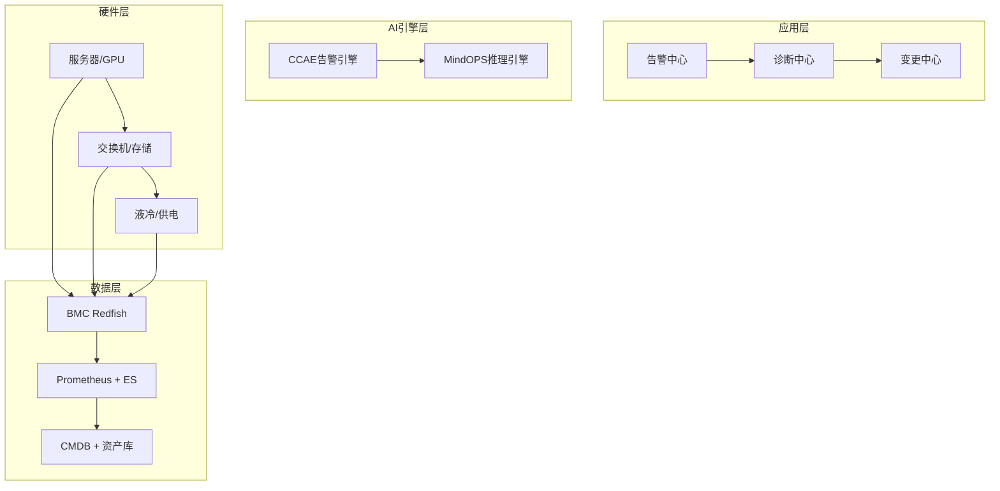

# 国内头部服务器厂商智能运维转型评估

> **概要**: 国内五家头部服务器厂商智能运维转型现状、评估体系与远期战略布局分析
>
> **关键词**: 智能运维 · 厂商评估 · CCAE · Redfish · 故障预测

---

## 📑 目录

- [一、概述](#一概述)
- [二、短期关注点（0~12个月）](#二短期关注点012个月)
  - [2.1 基础能力补齐](#21-基础能力补齐)
  - [2.2 三个必打标杆项目](#22-三个必打标杆项目)
- [三、落地评估体系](#三落地评估体系)
  - [3.1 技术栈成熟度](#31-技术栈成熟度)
  - [3.2 落地效果评估](#32-落地效果评估)
- [四、全栈层次框架](#四全栈层次框架)
- [五、远期评估维度（1~3年+）](#五远期评估维度13年)
- [六、五家厂商现状评估](#六五家厂商现状评估)
- [七、与已有知识框架对接](#七与已有知识框架对接)
- [八、标准与规范引用](#八标准与规范引用)
- [参考文件](#参考文件)
- [Changelog](#changelog)

---

## 一、概述

从**现状能力诊断→短期可落地举措→远期战略布局**三个时间窗口，评估国内五家头部服务器厂商（华为/超聚变/中兴/浪潮/新华三）的智能运维转型进展与效果，避免仅关注技术而忽视实际成效。

## 二、短期关注点（0~12个月）

### 2.1 基础能力补齐

| 能力项 | 目标状态 | 当前差距 | 建议举措 |
|:-------|:---------|:---------|:---------|
| 资产入库率 | >99% | 60-80% | 部署Redfish自动发现脚本 |
| 硬件告警覆盖率 | >95%关键部件 | 50-70% | 补充BMC传感器清单 |
| 告警降噪率 | >90% | 30-50% | 部署CCAE规则引擎 |
| SOP自动化率 | >60%常规故障 | 10-20% | SOP标准化+剧本编排 |
| 固件版本一致率 | >99%集群 | 30-60% | 批量固件升级管线 |

### 2.2 三个必打标杆项目

1. **硬件资产全生命周期管理**：从BMC Redfish自动发现→CMDB→变更追踪→退役
2. **GPU故障预测性诊断**：XID+SMART+Telemetry复合预警模型（3个月内上线）
3. **自助固件升级平台**：CI/CD式固件升级，一键灰度、回滚、校验

## 三、落地评估体系

### 3.1 技术栈成熟度

| 级别 | 特征 | 覆盖厂商 |
|:-----|:-----|:---------|
| L1 基础监控 | SNMP/IPMI采集，被动告警 | 全部 |
| L2 集中管理 | Redfish统一纳管，告警规则引擎 | 华为iMaster、浪潮UniSystem |
| L3 智能诊断 | 根因分析+预测性维护，告警降噪>80% | 华为、超聚变 |
| L4 自动化闭环 | SOP自动化>60%，故障自愈>30% | 华为 |
| L5 自治运维 | 全场景自动化，人仅做确认决策 | 探索中（华为远景） |

### 3.2 落地效果评估

| 评估维度 | 关键指标 | 目标值 | 采集方式 |
|:---------|:---------|:-------|:---------|
| **告警准确性** | 误报率、漏报率 | 误报<10%, 漏报<5% | A/B测试 |
| **响应时效** | MTTR | 降低50% vs 人工 | 工单系统统计 |
| **资产准确性** | CMDB准确率 | >99% | 自动→人工抽检 |
| **固件/版本** | 一致性/合规率 | >95% | 自动巡检报表 |
| **客户满意度** | NPS/CSAT | 提升20% | 客户调研 |

## 四、全栈层次框架

## 五、远期评估维度（1~3年+）

| 维度 | 远期目标 | 技术路线 |
|:-----|:---------|:---------|
| **AI预测** | GPU故障预测准确率>90% | XID+SMART+NVLink CRC+Telemetry多模态 |
| **自动化** | 常规运维操作自动化率>80% | SOP剧本编排→ChatOps |
| **自愈** | 已知故障自愈率>50% | 故障注入→自动隔离→自动恢复 |
| **数字孪生** | 整机柜级数字孪生 | 3D可视化+仿真推理 |

## 六、五家厂商现状评估

| 厂商 | 转型阶段 | 优势 | 短板 |
|:-----|:---------|:-----|:-----|
| **华为** | L3-L4（领先） | iMaster全面、硬件自研、算法团队 | 封闭生态 |
| **超聚变** | L2-L3（追赶） | FusionDirector平台化好 | AI能力滞后于硬件 |
| **浪潮** | L2-L3（追赶） | UniSystem+AIStation组合 | 缺乏OS层深度 |
| **中兴** | L2（跟随） | ZXN覆盖全面 | 方案不够聚焦 |
| **新华三** | L2（跟随） | 网络管理强 | 偏设备级，集群级能力弱 |

## 七、与已有知识框架对接

- **[整机柜集群故障诊断规格](../../00_shared/05_fault-diagnosis/2026-06-29-rack-cluster-fault-diagnosis-specs.md)** — 本文CCAE/MindOPS方案的诊断规格基础
- **[FTA故障树全集](../../00_shared/05_fault-diagnosis/2026-06-29-fta-fault-tree-complete.md)** — 智能运维中的FTA故障分析方法配套
- **[厂商软件层布局对比](../../../05_tools/doubao-qa/2026-06-29-doubao-07-chinese-vendor-software-comparison.md)** — 本文智能运维能力的软件层上下文
- **AI训推一体智算平台方案** — 智能运维在智算平台中的部署位置

---

---

## 八、标准与规范引用

| 标准/规范 | 组织 | 版本 | 关联内容 |
|:----------|:-----|:-----|:---------|
| [IPMI 2.0 Spec](https://www.intel.com/content/www/us/en/products/docs/servers/ipmi/) | Intel | v2.0 rev1.1 | BMC传感器/日志 |
| [Redfish DSP0266](https://www.dmtf.org/standards/redfish) | DMTF | 2022.x | RESTful管理/遥测 |
| [PLDM DSP0240](https://www.dmtf.org/standards/pldm) | DMTF | 1.0+ | 诊断数据模型 |
| [OpenBMC](https://github.com/openbmc/openbmc) | 开源 | 2.18.0 | BMC软件栈 |
| [Google SRE](https://sre.google/books/) | Google | — | SLI/SLO/SLA |
| [NVIDIA GPU 诊断](https://docs.nvidia.com/deploy/) | NVIDIA | 最新 | GPU健康检查 |

---

## 参考文件

> 本文件调用的外部文件与资料（不含被引用情况）。

### 内部知识库引用

- [整机柜集群故障诊断规格](../../00_shared/05_fault-diagnosis/2026-06-29-rack-cluster-fault-diagnosis-specs.md) — 关联
- [FTA故障树全集](../../00_shared/05_fault-diagnosis/2026-06-29-fta-fault-tree-complete.md) — 关联
- [厂商软件层布局对比](../../../05_tools/doubao-qa/2026-06-29-doubao-07-chinese-vendor-software-comparison.md) — 关联
- AI训推一体智算平台方案 — 关联

### 外部资料引用

- (无)

---

## Changelog

| 日期 | 版本 | 变更说明 |
|:----|:----|:-----|
| 2026-07-24 | v1.0 | 初始版本 |
