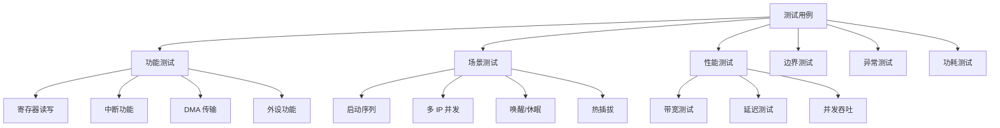

# L3 实现→验证：系统级多 IP 协同验证方法

> **概要**: 芯片 L3 层实现到验证方法，涵盖系统级多 IP 协同验证、验证计划与覆盖率驱动
>
> **关键词**: 芯片验证 · V模型 · 验证计划 · 覆盖率 · VIP

---

## 📑 目录

- [📖 文档导读](#文档导读)
- [1️⃣ L3 层定位与工作全景](#1-l3-层定位与工作全景)
  - [1.1 L3 在六层金字塔中的角色](#11-l3-在六层金字塔中的角色)
  - [1.2 验证的「冰山模型」](#12-验证的冰山模型)
  - [1.3 验证原则 V 模型](#13-验证原则-v-模型)
- [2️⃣ 验证方法论全景](#2-验证方法论全景)
  - [2.1 验证方法对比](#21-验证方法对比)
  - [2.2 验证方法选择矩阵](#22-验证方法选择矩阵)
- [3️⃣ 验证计划编制](#3-验证计划编制)
  - [3.1 验证计划模板](#31-验证计划模板)
  - [3.2 功能点分解方法](#32-功能点分解方法)
  - [3.3 验证计划质量检查](#33-验证计划质量检查)
- [4️⃣ 验证环境架构](#4-验证环境架构)
  - [4.1 标准 SoC 验证环境](#41-标准-soc-验证环境)
  - [4.2 验证 IP（VIP）选择](#42-验证-ipvip选择)
  - [4.3 断言（Assertion）体系](#43-断言assertion体系)
- [5️⃣ 测试用例设计方法](#5-测试用例设计方法)
  - [5.1 测试用例分类体系](#51-测试用例分类体系)
  - [5.2 核心测试用例设计](#52-核心测试用例设计)
    - [5.2.1 启动序列测试](#521-启动序列测试)
    - [5.2.2 并发冲突测试](#522-并发冲突测试)
    - [5.2.3 边界条件测试](#523-边界条件测试)
  - [5.3 随机测试约束](#53-随机测试约束)
- [6️⃣ 覆盖率驱动验证](#6-覆盖率驱动验证)
  - [6.1 覆盖率类型](#61-覆盖率类型)
  - [6.2 代码覆盖率](#62-代码覆盖率)
  - [6.3 功能覆盖率（Covergroup）](#63-功能覆盖率covergroup)
  - [6.4 覆盖率收敛流程](#64-覆盖率收敛流程)
- [7️⃣ 层次化验证策略](#7-层次化验证策略)
  - [7.1 验证层次](#71-验证层次)
  - [7.2 层次化验证的时间交错](#72-层次化验证的时间交错)
  - [7.3 子系统验证](#73-子系统验证)
- [8️⃣ 后仿真](#8-后仿真)
  - [8.1 后仿真的目的与范围](#81-后仿真的目的与范围)
  - [8.2 后仿真测试用例选择](#82-后仿真测试用例选择)
  - [8.3 后仿真 X 态传播分析](#83-后仿真-x-态传播分析)
- [9️⃣ FPGA 原型验证](#9-fpga-原型验证)
  - [9.1 FPGA 原型的定位](#91-fpga-原型的定位)
  - [9.2 原型验证覆盖场景](#92-原型验证覆盖场景)
  - [9.3 FPGA 原型调试方法](#93-fpga-原型调试方法)
- [🔟 回归管理与签核](#回归管理与签核)
  - [10.1 回归测试集](#101-回归测试集)
  - [10.2 验证签核标准](#102-验证签核标准)
  - [10.3 Bug 跟踪与关闭](#103-bug-跟踪与关闭)
- [1️⃣1️⃣ 产出物规范](#11-产出物规范)
- [1️⃣2️⃣ 常见验证失败模式](#12-常见验证失败模式)
- [1️⃣3️⃣ L3 检查清单](#13-l3-检查清单)
  - [13.1 验证计划](#131-验证计划)
  - [13.2 验证环境](#132-验证环境)
  - [13.3 测试执行](#133-测试执行)
  - [13.4 覆盖率](#134-覆盖率)
  - [13.5 后仿真](#135-后仿真)
  - [13.6 FPGA 原型](#136-fpga-原型)
  - [13.7 签核](#137-签核)
- [参考文件](#参考文件)
- [Changelog](#changelog)

---

---

## 📖 文档导读

| 章节 | 内容 |
|:-----|:-----|
| §1 | L3 定位与工作全景 |
| §2 | 验证方法论全景 |
| §3 | 验证计划编制 |
| §4 | 验证环境架构 |
| §5 | 测试用例设计方法 |
| §6 | 覆盖率驱动验证 |
| §7 | 层次化验证策略 |
| §8 | 后仿真（Gate-Level Simulation） |
| §9 | FPGA 原型验证 |
| §10 | 回归管理与签核 |
| §11 | 产出物规范 |
| §12 | 常见验证失败模式 |
| §13 | 检查清单 |

---

## 1️⃣ L3 层定位与工作全景

### 1.1 L3 在六层金字塔中的角色

```text
L6 -- 需求 -> 架构
L5 -- 架构 -> 集成
L4 -- 集成 -> 实现（交付综合后网表）

L3 -- 实现 -> 验证 --- ★ 本层：门级实现的完整验证
      v 产出：验证计划 | 测试用例 | 覆盖率报告
      v 关键活动：功能验证 · 后仿真 · 覆盖率收敛
      v 时间占比：~20% · 决定芯片功能正确性的关键层

L2 -- 验证 -> 制造
L1 -- 制造 -> 测试
```

**核心洞察**：现代 SoC 验证消耗 **50-70%** 的芯片研发总工作量（含各层的验证活动）。L3 是六层中验证活动的核心汇聚点，但验证需要贯穿所有层。

### 1.2 验证的「冰山模型」

```text
         +--------------------------------------+
         |  功能验证（L3 核心）                    |
         |  +----------------------------------+ |
         |  |  显式功能 -> 规格文档中的功能点     | |  <- 水面之上：验证计划覆盖
         |  |  隐式功能 -> 设计者未写但隐含的     | |  <- 需要白盒理解设计
         |  +----------------------------------+ |
         |                                        |
         |  冲 突 场 景（L3+L5 联合）              |
         |  +----------------------------------+ |
         |  |  总线冲突 · DMA 抢占 · 中断嵌套   | |  <- 并发场景：关键但难覆盖
         |  |  时钟域交互 · 复位释放竞争         | |
         |  +----------------------------------+ |
         |                                        |
         |  边 界 条 件（L3+L4 联合）              |
         |  +----------------------------------+ |
         |  |  FIFO 满/空 · 缓冲区溢出          | |  <- 边界值：测试设计质量关键
         |  |  FIFO 空时读 · 缓存行未对齐       | |
         |  +----------------------------------+ |
         |                                        |
         |  故 障 与 错 误（L3+L4 联合）           |
         |  +----------------------------------+ |
         |  |  时序违规 -> 亚稳态                | |  <- 后仿真核心覆盖
         |  |  X 态传播 · 功耗状态切换           | |  <- 需要特殊测试方法
         |  +----------------------------------+ |
         +--------------------------------------+
```

### 1.3 验证原则 V 模型

```text
        需求定义                                     验收测试
          |                                            |
          +----- 架构设计 ---+                    +--- 系统验证
                             |                    |
                             +----- 模块设计 --+ +--- 集成验证
                                                | |
                                                +-- 单元验证
```

**左移验证原则**：验证活动尽可能向左移动（尽早开始），因为越早发现的 Bug 修复成本越低。

---

## 2️⃣ 验证方法论全景

### 2.1 验证方法对比

| 方法 | 优缺点 | 适用场景 | 仿真速度 | 覆盖率 |
|:-----|:------|:---------|:--------:|:------:|
| **定向测试** | 针对性强 / 编写慢 | 核心功能的确认验证 | 快 | 低 |
| **随机测试（约束随机）** | 自动生成 / 需约束 | 大规模功能覆盖 | 中 | 高 |
| **形式化验证** | 100% 覆盖 / 容量有限 | 控制逻辑 / 协议合规 | — | 100% |
| **带断言验证** | 实时检查 / 定位准 | 协议/时序检查 | 中 | 中 |
| **后仿真** | 含时序信息 / 极慢 | 时序相关场景 | 极慢 | 低 |
| **FPGA 原型** | 硬件加速 / 早期软件 | 固件/驱动验证 | 实时 | 中 |
| **硬件加速仿真** | 比 RTL 仿真快 1000× | 大规模软件验证 | 快 | 高 |

### 2.2 验证方法选择矩阵

| 验证目标 | 定向测试 | 随机测试 | 形式化 | FPGA | 后仿真 |
|:---------|:--------:|:--------:|:------:|:----:|:------:|
| 寄存器读写正确性 | ★ | ★ | — | ★ | — |
| 总线协议合规 | ★ | ★ | ★ | — | — |
| 中断正确性 | ★ | ★ | — | ★ | — |
| DMA 传输 | ★ | ★ | — | ★ | — |
| 时钟域交互 | — | ★ | ★ | ★ | ★ |
| 边界条件覆盖 | — | ★ | — | — | — |
| 时序违规检测 | — | — | — | — | ★ |
| 软硬件协同 | — | — | — | ★ | — |
| 功耗状态切换 | ★ | ★ | — | — | ★ |

---

## 3️⃣ 验证计划编制

### 3.1 验证计划模板

```text
+---------------------------------------------------------------------+
|                      SoC 系统验证计划                                  |
|                                                                     |
|  1. 验证范围                                                         |
|     +-- 覆盖率目标 / 排除项 / 假设条件                                |
|  2. 验证层次                                                         |
|     +-- IP-Level -> Subsystem -> SoC -> System                         |
|  3. 功能点分解                                                       |
|     +-- 每功能点的：验证方法 / 通过标准 / 优先级                       |
|  4. 测试用例清单                                                     |
|     +-- 用例编号 / 名称 / 功能覆盖 / 场景描述 / 验证方法               |
|  5. 覆盖率计划                                                       |
|     +-- 代码覆盖率目标 / 功能覆盖率目标 / 覆盖率缺口分析计划            |
|  6. 验证环境                                                         |
|     +-- Testbench 结构 / VIP 清单 / 脚本框架                          |
|  7. 回归计划                                                         |
|     +-- 回归频度 / 回归用例集 / 通过标准                              |
|  8. 时间计划                                                         |
|     +-- 各阶段里程碑 / 交付物时间线                                   |
|  9. 资源需求                                                         |
|     +-- 人力 / EDA 工具 / 服务器 / FPGA 板                           |
|  10. 风险与缓解                                                      |
|     +-- 已知风险 / 缓解措施 / 备案计划                                |
+---------------------------------------------------------------------+
```

### 3.2 功能点分解方法

从需求文档和架构文档中系统化分解可测试的功能点：

| 功能点 ID | 功能描述 | 来源 | 验证方法 | 优先级 | 依赖 | 通过标准 |
|:----------|:---------|:-----|:---------|:------:|:-----|:---------|
| FP_001 | CPU 复位后从 0x0000_0000 取指 | 架构 §4.1 | 定向测试 | P0 | — | PC = 0x0000_0000 |
| FP_002 | DDR 初始化: 写入模式寄存器 | 架构 §4.3 | 定向测试 | P0 | FP_001 | MR 值正确 |
| FP_003 | DDR 读写: 全部地址空间 ping-pong | 架构 §4.3 | 随机测试 | P0 | FP_002 | 读回数据一致 |
| FP_004 | UART TX: 发送字节序列 | 架构 §5.2 | 定向测试 | P1 | FP_001 | 引脚输出正确时序 |
| FP_005 | UART RX: 接收字节 + 中断 | 架构 §5.2 | 随机测试 | P1 | FP_001 | 中断触发 + 数据正确 |
| FP_006 | 中断嵌套: 低优 ISR 中被高优打断 | 架构 §7.2 | 定向测试 | P1 | — | 高优中断先处理 |
| FP_007 | DMA: DDR↔UART 数据传输 | 架构 §7.3 | 随机测试 | P2 | FP_003+FP_005 | 数据传输完整 |
| ... | ... | ... | ... | ... | ... | ... |

### 3.3 验证计划质量检查

| 检查项 | 标准 |
|:-------|:-----|
| **完整性** | 每项需求至少对应一个功能点或标记为不可测试 |
| **可测试性** | 每功能点有明确的验证方法、通过标准 |
| **优先级分布** | P0（核心功能）占 30-40%, P1（重要）占 30%, P2（增强）占 30% |
| **依赖关系** | 功能点之间的依赖已标注 |
| **覆盖率映射** | 功能点覆盖率目标 ≥ 95% |

---

## 4️⃣ 验证环境架构

### 4.1 标准 SoC 验证环境

```text
+---------------------------------------------------------------------+
|               SoC UVM 验证环境架构                                     |
|                                                                     |
|  +------------------------------------------------------------+     |
|  |  测 试 层（Test Layer）                                      |     |
|  |  +------+ +------+ +------+ +------+ +------+             |     |
|  |  |test_1| |test_2| |test_3| |test_4| | ...  |             |     |
|  |  +--+---+ +--+---+ +--+---+ +--+---+ +------+             |     |
|  |     +--------+--------+--------+----+                      |     |
|  +-----------------+------------------------------------------+     |
|                    |                                                |
|  +-----------------v------------------------------------------+     |
|  |  场 景 层（Scenario Layer）                                  |     |
|  |  +--------------------------+                              |     |
|  |  |  Virtual Sequencer       |  <- 协调所有 agent 的行为      |     |
|  |  +--------------------------+                              |     |
|  +-----------------+------------------------------------------+     |
|                    |                                                |
|  +-----------------v------------------------------------------+     |
|  |  功 能 层（Functional Layer）                                |     |
|  |  +----------+ +----------+ +----------+ +----------+      |     |
|  |  | CPU Agent| | AXI VIP | |DDR VIP  | | APB VIP | ...  |     |
|  |  |(指令驱动)| |(总线事务)| |(内存模型)| |(外设驱动)|      |     |
|  |  +----------+ +----------+ +----------+ +----------+      |     |
|  +-----------------+------------------------------------------+     |
|                    |                                                |
|  +-----------------v------------------------------------------+     |
|  |  DUT 层（SoC RTL/Netlist）                                  |     |
|  |  +-----------------------------------------------------+   |     |
|  |  |                  soc_top                           |   |     |
|  |  |  +------+ +------+ +------+ +------+ +------+    |   |     |
|  |  |  | CPU  | |AXI/XB| |DDRPHY| |  NPU | | APB  | ...|   |     |
|  |  |  +------+ +------+ +------+ +------+ +------+    |   |     |
|  |  +-----------------------------------------------------+   |     |
|  +-----------------+------------------------------------------+     |
|                    |                                                |
|  +-----------------v------------------------------------------+     |
|  |  监 测 层（Monitor Layer）                                   |     |
|  |  +----------+ +----------+ +----------+ +----------+      |     |
|  |  | 功能覆盖率| | 断言检查  | | 协议检查  | | 时序检查 | ...  |     |
|  |  +----------+ +----------+ +----------+ +----------+      |     |
|  +--------------------------------------------------------------+     |
+---------------------------------------------------------------------+
```

### 4.2 验证 IP（VIP）选择

| VIP 类型 | 必须/可选 | 推荐供应商 | 功能 |
|:---------|:---------:|:-----------|:-----|
| AXI/AHB/APB 总线 VIP | ★ 必须 | Synopsys VC / Cadence | 协议检查 + 事务生成 |
| DDR 内存模型 | ★ 必须 | Synopsys / Cadence | 时序精确的 DDR 行为 |
| CPU 模型 | ★ 必须 | ARM Fast Models / RISC-V ISS | 指令级仿真 |
| USB/PCIe VIP | ★ 必须 | Synopsys / Cadence | 标准接口协议检查 |
| Ethernet VIP | ◯ 推荐 | Synopsys / Cadence | RGMII/SGMII 协议 |
| I2C/SPI/UART VIP | ◯ 推荐 | 开源 UVC / 自研 | 外设总线检查 |
| 功耗意图检查 | ◯ 推荐 | Synopsys VC LP | UPF/CPF 意图验证 |

### 4.3 断言（Assertion）体系

断言系统是验证环境的核心质量保障：

| 断言类型 | 检查内容 | 示例 |
|:---------|:---------|:------|
| **协议断言** | 总线协议合规 | `AXI_VALID_READY_HANDSHAKE: valid 不能依赖 ready` |
| **时序断言** | 信号时序正确 | `RST_DEASSERT: 复位释放后 10clk 内无事务` |
| **功能断言** | 功能正确性 | `FIFO_OVERFLOW: 满时不能写入` |
| **安全断言** | 安全策略执行 | `SECURE_ACCESS: 非安全模式不能写安全寄存器` |
| **边界断言** | 边界条件 | `ADDR_RANGE: 地址必须在有效范围内` |

**断言开发规范**：

```text
断言命名：assert_<模块>_<检查内容>
禁止在 full_case / parallel_case 中隐藏断言
所有断言必须有 severity 级别（ERROR/WARNING/INFO）
覆盖率目标：断言触发覆盖率 ≥ 90%
```

---

## 5️⃣ 测试用例设计方法

### 5.1 测试用例分类体系



### 5.2 核心测试用例设计

#### 5.2.1 启动序列测试

```systemverilog
class test_boot_sequence extends soc_test_base;
    `uvm_component_utils(test_boot_sequence)

    function void build_phase(uvm_phase phase);
        super.build_phase(phase);
        // CPU 模型加载 BootROM 二进制
        cpu_model.load_memory("bootrom.bin", 32'h0000_0000);
        // 配置 OTP 为预置值
        otp_model.load_otp("otp_config.dat");
    endfunction

    task run_phase(uvm_phase phase);
        phase.raise_objection(this);

        // Step 1: 释放 POR
        `DRIVE(pad_por_n, 1, 100ns)

        // Step 2: 等待 PLL 锁定
        @(posedge top.`CLK_READY_SIGNAL)
        `INFO("PLL locked, clock ready")

        // Step 3: 等待 CPU 取指
        repeat(1000) @(posedge clk);
        `CHECK_CPU_PC(32'h0000_0100, "BootROM entry point reached")

        // Step 4: 验证 BootROM 执行 — UART 输出启动信息
        wait_for_uart_output("*Booting...*");
        `INFO("BootROM boot message received")

        phase.drop_objection(this);
    endtask
endclass
```

**启动序列通过标准**：

```text
□ POR 释放后 PLL 锁定时间 ≤ spec
□ CPU 从复位向量正确取指
□ BootROM 代码完整执行
□ DDR 初始化成功
□ 启动日志通过 UART 输出
□ 总启动时间 ≤ spec（如 500ms）
```

#### 5.2.2 并发冲突测试

```systemverilog
// 多 Master 同时访问 DDR 的冲突场景
class test_ddr_concurrent extends soc_test_base;
    // CPU：持续进行 memcpy（L2 miss → DDR 访问）
    // NPU：持续读写模型权重
    // DMA：在 DDR 和 USB 之间传输帧
    // Display：持续从帧缓冲读取

    task run_phase(uvm_phase phase);
        fork
            // CPU 线程
            begin
                repeat(100) cpu_model.memcpy(32'h1000_0000, 32'h2000_0000, 4096);
            end
            // NPU 线程
            begin
                npu_model.start_inference();
                #10us;
                npu_model.stop_inference();
            end
            // DMA 线程
            begin
                dma_model.transfer(
                    .src(32'h1000_0000),
                    .dst(32'h4000_0000),
                    .size(1024)
                );
            end
        join

        // 检查数据完整性
        `CHECK_MEMORY(32'h2000_0000, 32'h4000_0000, 1024,
                      "DMA data corruption under concurrent access")
    endtask
endclass
```

#### 5.2.3 边界条件测试

| 测试 | 设计意图 | 验证方法 |
|:-----|:---------|:---------|
| FIFO 满+写 | 满标志正确防止溢出 | 反复写满 FIFO + 再写一次 |
| FIFO 空+读 | 空标志正确防止下溢 | 读空 FIFO + 再读一次 |
| 地址边界 | 地址映射边界行为 | 在每区域的起始/结束地址读写 |
| 中断风暴 | 连续高速中断 → 不丢 | 外设以最快速度触发中断 |
| DMA 竞争 | DMA 和 CPU 同时访问同地址 | 启动 Coherence 一致性检查 |
| 时钟门控 | 唤醒后数据不丢失 | 门控→唤醒→检查寄存器值 |
| 复位边界 | 复位释放瞬间的事务 | 在复位释放的同时发起总线事务 |

### 5.3 随机测试约束

```text
随机测试 = 自动化生成测试用例的核心方法

约束随机测试的约束设计原则：
  1. 合法约束（Legal Constraint）：生成的事务必须协议合规
  2. 功能约束（Functional Constraint）：生成有功能意义的场景
  3. 分布约束（Distribution Constraint）：关键场景出现概率有偏

示例：外设访问的约束随机
  class peripheral_access_sequence extends uvm_sequence;
      rand int slave_id;       // 选择哪个外设
      rand bit [11:0] offset;  // 寄存器偏移
      rand bit [31:0] wdata;   // 写入数据
      rand bit is_write;       // 读/写

      // 合法约束
      constraint legal {
          slave_id inside {[0:11]};   // 12 个 APB slave
          offset inside {[0:255]};    // 每 slave 1KB 空间
      }

      // 功能约束：80% 概率访问常用外设
      constraint functional_dist {
          slave_id dist {
              0 := 20,    // UART0 (控制台) — 频繁访问
              1 := 10,    // UART1
              2 := 20,    // I2C0 (EEPROM)
              6 := 30,    // GPIO (LED/按键)
              default := 20 // 其他外设
          };
      }
  endclass
```

---

## 6️⃣ 覆盖率驱动验证

### 6.1 覆盖率类型

| 覆盖率类型 | 粒度 | 目标 | 方法 |
|:-----------|:----:|:----|:-----|
| **代码覆盖率** | 行/分支/条件/状态机 | ≥ 90% | 工具自动收集 |
| **功能覆盖率** | 用户定义的功能点 | ≥ 95% | 覆盖率组（covergroup） |
| **断言覆盖率** | 断言触发 | ≥ 90% | 自动收集 |
| **翻转覆盖率** | 信号值翻转 | ≥ 80% | 工具自动 |
| **交叉覆盖率** | 多信号组合 | 按需 | 用户定义 |

### 6.2 代码覆盖率

```text
代码覆盖率的四个维度：

行覆盖率（Line Coverage）：
  每行代码是否被仿真到？-> 目标 ≥ 95%

分支覆盖率（Branch Coverage）：
  if/else/case 的各分支是否都进入？-> 目标 ≥ 90%

条件覆盖率（Condition Coverage）：
  复合条件（A && B）的所有真值组合？-> 目标 ≥ 85%

状态机覆盖率（FSM Coverage）：
  所有状态转移是否被覆盖？-> 目标 ≥ 100%

代码覆盖率未达标时的排查：
  1. 未覆盖的代码是否是不可达代码（Dead Code）？
     -> 如果是 -> 修复 RTL（移除或加综合 exclude）
     -> 如果不是 -> 补充测试用例
  2. 分支未覆盖 -> 补充该分支场景的测试
```

### 6.3 功能覆盖率（Covergroup）

```systemverilog
// DDR 控制器功能覆盖率组
covergroup ddr_cg @(posedge clk_ddr);

    // 1. DDR 命令覆盖
    command_cp : coverpoint ddr_cmd {
        bins rd_single  = {READ};
        bins wr_single  = {WRITE};
        bins rd_burst   = {READ_BURST};
        bins wr_burst   = {WRITE_BURST};
        bins refresh    = {REFRESH};
        bins precharge   = {PRECHARGE};
        bins activate   = {ACTIVATE};
        // 所有命令各至少出现一次
    }

    // 2. 地址覆盖
    addr_cp : coverpoint ddr_addr {
        bins low    = {[32'h1000_0000 : 32'h1FFF_FFFF]};  // 低半区
        bins high   = {[32'h2000_0000 : 32'h2FFF_FFFF]};  // 高半区
        bins all    = {[32'h1000_0000 : 32'h2FFF_FFFF]};  // 全范围
    }

    // 3. 交叉覆盖：命令 × 地址
    cross_cmd_addr : cross command_cp, addr_cp {
        // 要求每个命令在每个地址区域至少出现一次
        bins cmd_addr_pairs = binsof(command_cp) && binsof(addr_cp);
    }

    // 4. 时序覆盖：读写间隔
    gap_cp : coverpoint rd_wr_gap {
        bins continuous = {0};
        bins gap_1_5    = {[1:5]};
        bins gap_6_10   = {[6:10]};
        bins gap_gt_10  = {[11:$]};
    }

endgroup
```

### 6.4 覆盖率收敛流程

```text
覆盖率收敛循环：

  +-----------------------------------------------------------------+
  |  1. 运行回归 -> 收集覆盖率                                        |
  |     v                                                           |
  |  2. 覆盖率合并（merge）-> 当前覆盖率报告                           |
  |     v                                                           |
  |  3. 覆盖率差距分析 -> 未覆盖的功能点/代码                          |
  |     +-- 是否合法未覆盖（功能不在此 SoC 版本中）-> 标记 exclude     |
  |     +-- 需要补充测试 -> 分析为什么未覆盖                           |
  |         +-- 约束过于宽松 -> 收紧约束方向                           |
  |         +-- 缺少特定场景 -> 添加定向测试                           |
  |         +-- 该功能不可达 -> 检查 RTL 设计是否有 bug               |
  |     v                                                           |
  |  4. 补测 -> 新测试用例 / 新约束种子                               |
  |     v                                                           |
  |  5. 重新运行回归 -> 检查覆盖率增长                                |
  |     +-- 收敛？-> 是 -> 覆盖率签核                                  |
  |         +-- 否 -> 回到步骤 2                                      |
  +-----------------------------------------------------------------+
```

---

## 7️⃣ 层次化验证策略

### 7.1 验证层次

```text
L4 System Level
+-- 软硬件协同验证（FPGA 原型平台）
+-- OS 引导 + 驱动验证
+-- 完整的应用场景验证
+-- 性能验证（带宽/延迟/吞吐）

L3 SoC Level       <- L3 核心工作
+-- 所有 IP 联合仿真
+-- 总线互联验证（AXI/AHB 事务完整性）
+-- 功耗场景验证（唤醒-休眠序列）
+-- 中断完整性验证
+-- 全系统随机场景

L2 Subsystem Level
+-- CPU 子系统（CPU + L2 + SCU）
+-- 内存子系统（DDR Ctrl + PHY）
+-- NPU 子系统（NPU + 本地 SRAM）
+-- 安全子系统（OTP + 加密 + 安全处理器）

L1 IP Level
+-- 单 IP 功能验证（UVM Testbench）
+-- IP 供应商提供的标准验证环境
+-- 覆盖率目标：代码 90%+ 功能 85%+
```

### 7.2 层次化验证的时间交错

```text
时间线：
  M01 M02 M03 M04 M05 M06 M07 M08 M09 M10 M11 M12
  |   |   |   |   |   |   |   |   |   |   |   |
  +---+   |   |   |   |   |   |   |   |   |      <- IP Level (最长)
  |       +-------+   |   |   |   |   |         <- Subsystem
  |               +-----------+   |   |         <- SoC Level
  |                   +---------------+         <- FPGA Prototype
  |                                   +---+    <- 后仿真
```

**关键原则**：上层验证不等待下层全部完成，而是「分批集成，分批验证」。

### 7.3 子系统验证

将 SoC 按功能划分为若干子系统，先在子系统级完成验证：

| 子系统 | 组成 | 验证优先级 | 验证重点 |
|:-------|:-----|:----------:|:---------|
| **CPU 子系统** | CPU + L1/L2 + SCU + VIC | P0 | 多核一致性、中断、缓存 |
| **内存子系统** | DDR Ctrl + PHY + AXI DDR Port | P0 | 初始化、带宽、ECC |
| **NPU 子系统** | NPU Core + SRAM + AXI Master | P1 | 推理正确性、DDR 访问 |
| **外设子系统** | APB 桥 + UART/I2C/SPI/GPIO/Timer | P1 | 寄存器访问、中断 |
| **安全子系统** | OTP + TRNG + AES/SHA + 防火墙 | P1 | 安全启动、密钥管理 |
| **显示子系统** | Display Ctrl + HDMI/LVDS PHY | P2 | 帧输出、时序 |

---

## 8️⃣ 后仿真

### 8.1 后仿真的目的与范围

| 项目 | 说明 |
|:-----|:------|
| **目的** | 验证门级网表的时序正确性（含门延迟 + 线延迟） |
| **范围** | 不跑全部测试用例（仅选关键用例，因为极慢） |
| **速度** | RTL 仿真的 1/50 ~ 1/100 |
| **数据** | SDF（标准延迟格式）反标到门级网表 |
| **工具** | VCS / Xcelium 支持 SDF 反标 |

### 8.2 后仿真测试用例选择

| 用例类型 | 选择理由 | 数量 |
|:---------|:---------|:----:|
| 启动序列 | 覆盖最多的时序路径 | 1-2 |
| DDR 全地址读写 | 最长的组合路径 | 2-3 |
| 中断风暴 | 检查异步路径时序 | 1 |
| 多 Master 并发 | 总线时序最紧张场景 | 2 |
| 低功耗切换 | 电压/时钟切换时的时序 | 1-2 |
| **总计** | | **8-10** |

### 8.3 后仿真 X 态传播分析

```text
X 态传播检查：后仿真中发现 X 态的关键排查步骤

1. 确认 X 态来源：
   +-- 未初始化的寄存器？(最常见)
   +-- 多驱动总线？
   +-- 时序违规导致的 X 态？

2. 判断 X 态是否影响功能：
   +-- 功能性 X（会影响功能）-> 必须修复
   +-- 结构性 X（不影响功能）-> 可豁免

3. X 态修复方法：
   +-- 寄存器初始化（同步复位值）
   +-- 总线驱动修复
   +-- 添加 X 态传播屏障
```

---

## 9️⃣ FPGA 原型验证

### 9.1 FPGA 原型的定位

| 对比项 | RTL 仿真 | FPGA 原型 | 硬件加速仿真 |
|:-------|:---------|:-----------|:------------|
| 速度 | 1-10 KHz | 10-100 MHz | 1-10 MHz |
| 可见性 | 完全可见 | 有限可见 | 完全可见 |
| 调试能力 | 强（波形 dump） | 弱（少量 probe） | 中 |
| 配置时间 | 分钟级 | 小时级（综合+布局） | 天级 |
| 软件运行 | 不可行 | 可跑固件/OS | 可跑轻量 OS |

### 9.2 原型验证覆盖场景

| 场景 | RTL 仿真 | FPGA 原型 | 说明 |
|:-----|:--------:|:---------:|:-----|
| 固件启动 | ◯ 有限 | ★ 主场景 | 硬件加速固件验证 |
| 驱动验证 | — | ★ 主场景 | 真实 I/O 交互 |
| 外设物理验证 | — | ★ 主场景 | 接真实外设（UART/USB/ETH） |
| 性能估算 | — | ◯ 有限 | 频率非目标频率 |
| 异常情况 | ★ 主场景 | ◯ 有限 | 注入故障困难 |
| 覆盖率 | ★ 主场景 | — | 无法收集覆盖率 |

### 9.3 FPGA 原型调试方法

```text
FPGA 调试：可见性有限是最大挑战

常用调试方法：
  1. 片上逻辑分析仪（ILA/ChipScope）
     +-- 触发条件：特定的地址/数据/状态
     +-- 深度：通常 1024-4096 样本
     +-- 信号数：受限（消耗 BRAM）

  2. 硬件探针
     +-- 保留关键信号的 FPGA 观察端口
     +-- 外部逻辑分析仪捕获

  3. 固件辅助调试
     +-- 固件读回状态寄存器
     +-- 固件在 UART 输出调试信息
```

---

## 🔟 回归管理与签核

### 10.1 回归测试集

```text
回归测试集分层：

+---------------------------------------------------------------------+
|  Smoke Test（冒烟测试 ~10 用例, <5min）                              |
|  +-- 每次代码提交后运行 -> 分钟级反馈                                  |
|  +-- 包含：编译、寄存器读写、中断、启动序列                            |
|                                                                     |
|  Daily Regression（日常回归 ~200 用例, <2h）                        |
|  +-- 每天运行 -> 日级覆盖检查                                        |
|  +-- 覆盖所有 P0 + 主要 P1 测试                                    |
|                                                                     |
|  Full Regression（全回归 ~2000+ 用例, <24h）                       |
|  +-- milestone 前运行 -> 签核级覆盖                                  |
|  +-- 覆盖所有功能点 + 随机测试 + 边界条件                           |
|                                                                     |
|  Nightly Gate-Level（门级回归 ~10 用例, <48h）                     |
|  +-- 每次综合后运行 -> 时序正确性检查                                |
|  +-- 含 SDF 反标的后仿真                                           |
+---------------------------------------------------------------------+
```

### 10.2 验证签核标准

| 检查项 | 标准 | 验证方法 |
|:-------|:----|:---------|
| **功能覆盖率** | ≥ 95% | 所有功能点覆盖组达标 |
| **代码行覆盖率** | ≥ 90% | 工具报告 |
| **分支覆盖率** | ≥ 90% | 工具报告 |
| **条件覆盖率** | ≥ 85% | 工具报告 |
| **FSM 覆盖率** | 100% | 所有状态转移覆盖 |
| **断言覆盖率** | ≥ 90% | 所有断言触发 |
| **后仿真** | 零违例 | SDF 反标后仿真通过 |
| **FPGA 原型** | 固件可启动 | BootROM → OS 引导完毕 |
| **回归测试** | 100% 通过 | 所有用例 zero failure |

### 10.3 Bug 跟踪与关闭

| Bug 严重度 | 定义 | 关闭条件 |
|:-----------|:-----|:---------|
| **Critical** | 导致芯片不可用 | 必须修复并回归通过 |
| **Major** | 功能异常但有 workaround | 修复 or 评估后降级 |
| **Minor** | 影响体验但不阻塞功能 | 可延期或记录为已知问题 |
| **Cosmetic** | 格式/注释/代码风格 | 记录即可 |

**Bug 生命周期**：

```text
Opened -> Assigned -> In Progress -> Fixed -> Verified -> Closed
                                                  +-> Reopened（验证不通过）
```

---

## 1️⃣1️⃣ 产出物规范

| # | 产出物 | 格式 | 内容 | 交付对象 |
|:-:|:-------|:-----|:-----|:---------|
| 1 | **验证计划** | Markdown | 功能点+场景+方法+时间线 | 项目经理 |
| 2 | **验证环境代码** | SV/UVM | Testbench base class + 组件 | 验证团队 |
| 3 | **测试用例库** | SV | 定向+随机测试用例 | 回归平台 |
| 4 | **覆盖率报告** | HTML | 所有覆盖率维度的综合报告 | 签核评审 |
| 5 | **后仿真报告** | Log | SDF 反标后仿结果 | 签核评审 |
| 6 | **Bug 数据库** | Jira/Redmine | 所有 Bug 的完整生命周期 | 项目管理 |
| 7 | **回归报告** | HTML | 回归结果 + 通过/失败/新增 | 日常管理 |
| 8 | **验证签核报告** | Markdown | 验证完成的证据汇总 | 项目里程碑 |

---

## 1️⃣2️⃣ 常见验证失败模式

| # | 模式 | 症状 | 根因 | 预防 |
|:-:|:-----|:-----|:-----|:------|
| V1 | **覆盖率假象** | 代码覆盖率 95% 但功能仍有 Bug | 功能点漏写 | 需求→功能点的完整追溯 |
| V2 | **随机测试重复** | 跑再多随机测试覆盖率不增长 | 约束太窄 | 分析覆盖率差距 + 加定向 |
| V3 | **后仿真误解** | RTL OK 但后仿真 fail | RTL 含综合敏感写法 | RTL 编码规范强制 lint |
| V4 | **X 态误判** | 后仿真中 X 态导致假性失败 | X 态来自未初始化 | RTL 统一初始化策略 |
| V5 | **回归噪音** | 同用例有时过有时不通过 | 随机种子 + 时序相关性 | 固定种子或放宽边界 |
| V6 | **FPGA 不匹配** | RTL 仿真正常但 FPGA 挂起 | 综合差异（latch/时钟） | FPGA 综合约束对齐 |

---

## 1️⃣3️⃣ L3 检查清单

### 13.1 验证计划

- [ ] 验证计划完成且经过评审？
- [ ] 所有功能点从需求分解完毕？
- [ ] 每功能点有明确验证方法和通过标准？
- [ ] 功能点之间的依赖关系已标注？

### 13.2 验证环境

- [ ] Testbench 编译通过？
- [ ] 所有 VIP 已集成并验证功能？
- [ ] 断言覆盖了所有关键协议？
- [ ] 覆盖率组（covergroup）定义完成？

### 13.3 测试执行

- [ ] Smoke Test 通过（每次提交）？
- [ ] Daily Regression 通过（每日）？
- [ ] Full Regression 通过（里程碑）？
- [ ] P0 测试全部通过？
- [ ] P1 测试通过（或已评估影响）？

### 13.4 覆盖率

- [ ] 功能覆盖率 ≥ 95%？
- [ ] 代码行覆盖率 ≥ 90%？
- [ ] 分支覆盖率 ≥ 90%？
- [ ] FSM 覆盖率 100%？
- [ ] 断言覆盖率 ≥ 90%？

### 13.5 后仿真

- [ ] SDF 反标无 warnings？
- [ ] 8-10 个关键用例后仿真通过？
- [ ] X 态传播分析完成？

### 13.6 FPGA 原型

- [ ] FPGA 编译无 critical warning？
- [ ] BootROM 在 FPGA 上可正常启动？
- [ ] 关键外设（UART/I2C/SPI）功能正常？

### 13.7 签核

- [ ] 回归通过率 100%？
- [ ] 所有 Critical/Major Bug 关闭？
- [ ] 已知问题清单已评估影响并同意？
- [ ] 验证签核报告完成？

---

## 参考文件

> 本文件调用的外部文件与资料（不含被引用情况）。

### 内部知识库引用

- (无)

### 外部资料引用

- (无)

---

## Changelog

| 日期 | 版本 | 变更说明 |
|:----|:----|:-----|
| 2026-07-21 | v1.0 | 初版发布，从 chip-system-design-methodology.md §2 + §7 六层抽象金字塔 L3 展开 |
