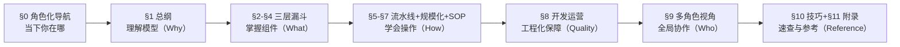

# CowAgent 知识管理系统化使用方案

> **概要**: 使用 CowAgent（及其 AI 助理能力）将零散的问答记录、本地材料系统化管理，形成个人→部门级知识库的方法论与实操指南
>
> **关键词**: (待补充)

---

## 📑 目录

- [0. 如何使用本文档（角色化阅读指南）](#0-如何使用本文档角色化阅读指南)
  - [0.1 角色-章节映射](#01-角色-章节映射)
  - [0.2 概念索引](#02-概念索引)
  - [0.3 结构逻辑总览](#03-结构逻辑总览)
- [1. 总纲：知识管理的三层漏斗](#1-总纲知识管理的三层漏斗)
  - [1.1 知识管理的本质问题](#11-知识管理的本质问题)
  - [1.2 三层漏斗模型](#12-三层漏斗模型)
- [1.3 CowAgent 在知识管理生态中的定位](#13-cowagent-在知识管理生态中的定位)
  - [1.3.1 不是替代，而是上层加工系统](#131-不是替代而是上层加工系统)
  - [1.3.2 协同工作流](#132-协同工作流)
  - [1.3.3 各 RAG 系统的对接方式](#133-各-rag-系统的对接方式)
  - [1.3.4 为什么需要两层？— 没有加工层的 RAG 系统的三大缺陷](#134-为什么需要两层-没有加工层的-rag-系统的三大缺陷)
  - [1.3.5 部署架构建议](#135-部署架构建议)
  - [1.3.6 CowAgent 在整个生命周期中的角色全景](#136-cowagent-在整个生命周期中的角色全景)
- [2. 第一层：知识源（输入管理）](#2-第一层知识源输入管理)
  - [2.1 知识源全景（服务器/AI 基础设施团队典型）](#21-知识源全景服务器ai-基础设施团队典型)
  - [2.2 知识源管理的三条铁律](#22-知识源管理的三条铁律)
  - [2.3 CowAgent 在知识源环节的具体用法](#23-cowagent-在知识源环节的具体用法)
- [3. 第二层：知识结构（组织与存储）](#3-第二层知识结构组织与存储)
  - [3.1 知识库的层次化架构](#31-知识库的层次化架构)
  - [3.2 每个知识页面的结构规范](#32-每个知识页面的结构规范)
- [1. 核心内容](#1-核心内容)
- [2. 关键数据](#2-关键数据)
- [3. 与现有知识的关联](#3-与现有知识的关联)
- [参考文件](#参考文件)
- [Changelog](#changelog)

---

## 0. 如何使用本文档（角色化阅读指南）

> **本文 1,700+ 行覆盖知识管理的全链路。各角色无需通读全文——根据身份选择最相关的章节即可。**

### 0.1 角色-章节映射

| 你的角色 | 核心关注章节 | 速读推荐 | 预计时长 |
|:---------|:------------|:---------|:--------:|
| **技术决策者/管理层** | §1 总纲 → §8 多角色 → §9 规模化 | §1 三层漏斗 + §8 全景矩阵 + 实施路线图 9.11 | 15 min |
| **架构师/技术负责人** | §1 → §3(知识结构) → §8(开发运营) | §1 + §3 交叉链接 + §8.5 编写模式 + §8.6 正确性 | 30 min |
| **研发工程师** | §4(使用) → §5(流水线) → §10(技巧) | §4.2 检索 + §5.2 环节①-⑥ + §10 技巧 1/4/6 | 20 min |
| **产品经理** | §2(知识源) → §3(结构) → §8.2(Git) | §2.2 铁律 + §3.2 页面规范 + §8.5 模式 P4 | 20 min |
| **销售/售前** | §8.2(销售角色) → §4(使用) | §8.2 + §4.4 主动推送 + §10 技巧 1 | 10 min |
| **售后/运维** | §8.8(售后角色) → §5(流水线) | §8.8 知识需求 + 故障诊断 + §5.2 检索 | 15 min |
| **知识管理员/PMO** | §7(SOP) → §8(运营) → §9(规模化) | §7 三个时间粒度 SOP + §8.3 CI/CD + §9.3 推广路线图 | 45 min |

### 0.2 概念索引

本文涉及的核心概念及其首次出现位置：

| 概念 | 首次出现 | 一句话定义 |
|:-----|:---------|:-----------|
| **三层漏斗** | §1.2 | 源→结构→使用的三级过滤模型 |
| **CowAgent 定位** | §1.3 | 知识生产加工层，非检索工具 |
| **RAG 系统** | §1.3 | 知识检索问答层，依赖加工层输出 |
| **知识流水线** | §5 | 采集→识别→提炼→存储→索引→检索→迭代 七环节 |
| **Knowledge-as-Code** | §8.1 | 用软件工程方法运营知识库 |
| **知识债** | §8.6.5 | 知识库中过期/断链/重复的累积问题 |
| **编写模式** | §8.5 | 7 种可复用的知识页结构模板 |
| **知识前向/后向流** | §9.10.2 | 设计→交付的前向传递 + 交付→设计的后向反馈 |
| **知识周转率** | §9.10.4 | 新建知识半年内被引用 ≥2 次的比例 |

### 0.3 结构逻辑总览

本文的编排逻辑遵循 **「认知递进」** 而非简单并列：



| 层次 | 涵盖章节 | 回答的问题 |
|:-----|:---------|:-----------|
| **Why（为什么）** | §1 | 为什么要做知识管理？核心模型是什么？ |
| **What（是什么）** | §2-§4 | 三层漏斗各层是什么？如何设计？ |
| **How（怎么做）** | §5-§7 | 日常怎么操作？如何规模化？ |
| **Quality（质量）** | §8 | 如何用工程化手段保障知识质量？ |
| **Who（谁参与）** | §9 | 不同角色怎么用？如何打通协作？ |
| **Reference（速查）** | §10-§11 | 技巧速查 + 能力映射 + 参考来源 |

---

## 1. 总纲：知识管理的三层漏斗

### 1.1 知识管理的本质问题

技术团队的知识管理通常经历三个阶段：

```text
阶段一                         阶段二                         阶段三
信息囤积                     结构沉淀                     规模效应
---------                   ---------                   ---------
❌ 收藏从未整理              ✅ 分类但孤岛                ✅ 交叉链接产生新洞察
❌ 重复造轮子                ✅ 可检索                    ✅ 新人快速上手
❌ 人走知识走                ✅ 人走知识留                ✅ 跨项目复用 > 80%
❌ 问答即忘                  ✅ 问答沉淀                  ✅ 问答->资产->可扩展
```

### 1.2 三层漏斗模型

```text
原始信息输入（无界）
   |
   v
+-------------------------------------+
|  第一层：知识源管理 (Source)         |  <- 渠道采集、去重、分类
|  「输入什么、从哪来、怎么采」        |
+-------------------------------------+
   | 过滤 70% 噪音，保留 30% 有价值源
   v
+-------------------------------------+
|  第二层：知识结构 (Structure)        |  <- 提炼、组织、交叉链接
|  「怎么存、怎么标、怎么关联」        |
+-------------------------------------+
   | 再过滤 50% 冗余，剩下 15% 高价值
   v
+-------------------------------------+
|  第三层：知识使用 (Usage)            |  <- 检索、复用、反馈
|  「怎么找、怎么用、怎么迭代」        |
+-------------------------------------+
   |
   v
知识规模效应（决策加速 × 新人上手 × 跨域创新）
```

**核心观点**: 大多数团队只关注第二层（工具选型、存储方式），但真正的差距在第一层（知识源的质量与覆盖）和第三层（使用的频率与深度）。

---

## 1.3 CowAgent 在知识管理生态中的定位

### 1.3.1 不是替代，而是上层加工系统

CowAgent **不是独立的知识管理工具**，而是构建在业界常用知识库问答系统（如 **MaxKB、Dify、RAGFlow、FastGPT** 等）之上的**数据加工与系统化层**。

```text
+-----------------------------------------------------+
|  🔷 CowAgent（数据加工与系统化层）                    |
|                                                       |
|  功能：数据提炼 -> 结构化 -> 交叉链接 -> 质量管控 -> 演进  |
|  输出：体系化 knowledge/ 知识库（Markdown 结构文件）    |
|  核心：AI 驱动的持续加工流水线，非检索工具              |
+-----------------------------------------------------+
          ↕ 数据同步 / 文件推送
+-----------------------------------------------------+
|  📚 知识库 RAG 系统（检索与问答层）                   |
|                                                       |
|  代表：MaxKB · Dify · RAGFlow · FastGPT · Xinference  |
|  功能：文档上传 -> 向量化 -> 语义检索 -> LLM 问答         |
|  输入：Markdown / PDF / Word / 网页                    |
|  输出：知识库问答、带引用的检索结果                     |
+-----------------------------------------------------+
          ↕ 数据源 / 文档
+-----------------------------------------------------+
|  🌐 原始信息源                                        |
|                                                       |
|  arXiv · 技术博客 · 白皮书 · 内部文档 · 会议纪要 · ……  |
+-----------------------------------------------------+
```

**核心关系**：

| 维度 | CowAgent（加工层） | RAG 系统（检索层） |
|:-----|:------------------|:------------------|
| **定位** | 知识生产者（提炼/结构化/质量控制） | 知识消费者（检索/问答/引用） |
| **输入** | 原始信息（链接/PDF/对话/碎片） | 已加工的结构化文档 |
| **输出** | 体系化知识文件（Markdown + 元数据） | 答案 + 引用片段 |
| **质量** | 主动审查（交叉验证/逻辑自检） | 被动响应（仅检索已有内容） |
| **演进** | 持续迭代（补充/修正/重构） | 随文档更新被动更新 |
| **是否可独立运行** | 部分可以（但纯加工无检索意义） | 部分可以（但检索内容越差效果越差） |

### 1.3.2 协同工作流

典型的端到端知识处理流程是**两者配合**完成的：

```text
阶段 ①：信息采集
  +-- 用户发现一篇有价值的文章
  +-- 投喂给 CowAgent -> 「归档这个链接」

阶段 ②：数据加工（CowAgent 核心）
  +-- web_archive 抓取内容
  +-- knowledge-doc-writer 提炼核心
  +-- 自动生成定位说明 + 关键数据表 + 交叉链接
  +-- 写入 knowledge/ 目录 + 更新索引

阶段 ③：知识入库
  +-- CowAgent 将 Markdown 文件推送到共享目录
  +-- RAG 系统（如 Dify）自动扫描新文件 -> 向量化
  +-- 知识进入可检索状态

阶段 ④：知识消费
  +-- 用户通过 RAG 系统的对话界面提问
  +-- RAG 系统检索知识库 -> 返回带引用的答案
  +-- 用户确认答案质量 -> 反馈回 CowAgent

阶段 ⑤：闭环迭代
  +-- 用户发现知识缺口 -> 「CowAgent，补充 XXX」
  +-- 用户发现过时信息 -> 「CowAgent，更新 XXX」
  +-- CowAgent 修正知识文件 -> 触发 RAG 系统重新索引
```

### 1.3.3 各 RAG 系统的对接方式

| RAG 系统 | 对接方式 | 说明 |
|:---------|:---------|:------|
| **MaxKB** | 文件同步到 `maxkb-data/` 目录，触发自动解析 | 适用本地部署场景 |
| **Dify** | 通过 Dify API / 文件监控（File Watcher）自动同步知识库 | 最灵活，支持自动重索引 |
| **RAGFlow** | Markdown 文件 → RAGFlow 的 `ragflow_data/` 目录挂载 | 支持深度文档解析 |
| **FastGPT** | 通过 FastGPT 数据集 API 上传 | 适合在线部署 |
| **Xinference** | 内置 RAG 引擎，直接读取知识库目录 | 轻量级方案 |
| **通用方案** | Git 仓库同步 → RAG 系统定期 Pull 更新 | 通用，不绑定具体系统 |

### 1.3.4 为什么需要两层？— 没有加工层的 RAG 系统的三大缺陷

```text
缺陷 1：垃圾进垃圾出（GIGO）
  +-- RAG 系统对输入文档质量无判断力
  +-- 喂 100 篇低质文章 -> 检索时 80% 是噪音 -> 答案质量差
  +-- CowAgent 解决：先提炼、去噪、交叉验证，再放行

缺陷 2：知识不进化
  +-- RAG 系统的知识 = 最后一次上传的文档快照
  +-- 文章过时 -> 除非手动删除 + 重新上传 -> 否则一直用错误答案
  +-- CowAgent 解决：持续审查 -> 修正 -> 标注时效性

缺陷 3：无结构关联
  +-- RAG 系统只做语义向量，不做结构化交叉链接
  +-- A 方案和 B 方案的对比关系需要人工梳理
  +-- CowAgent 解决：交叉引用 + 对比分析 + 专题化归档
```

### 1.3.5 部署架构建议

```text
                    +--------------+
                    |  用户界面     | <- 飞书/微信/Web
                    +------+-------+
                           |
              +------------+------------+
              |                         |
     +--------+--------+      +--------+--------+
     |  CowAgent (加工) |      |  RAG 系统 (检索) |
     |  +------------+  |      |  +------------+  |
     |  | knowledge/ |  |      |  | 向量数据库  |  |
     |  |  (Markdown)|--+------+->| (Milvus/   |  |
     |  +------------+  | sync |  |  Qdrant)   |  |
     |                  |      |  +------------+  |
     +-----------------+      +------------------+
```

**最小可行架构**：

1. **一台机器**部署 CowAgent（或共享工作区）
2. **同一台机器**上运行 RAG 系统（如 Dify + Milvus）
3. CowAgent 的 `knowledge/` 目录挂载 / 同步到 RAG 系统的文档目录
4. 触发自动向量化 → 知识库立即可检索

**规模扩展**：

- CowAgent 工作区 → 多人共享 Git 仓库
- RAG 系统 → 多节点部署（独立的向量库 + 推理节点）
- 同步机制 → CI/CD Pipeline（提交 → 自动重索引 → 通知）

### 1.3.6 CowAgent 在整个生命周期中的角色全景

```text
+----------------------------------------------------------+
|                    知识全生命周期                         |
+----------+----------+----------+----------+--------------+
|  数据输入  |  数据加工  |  知识存储  |  知识消费  |  自我演进    |
+----------+----------+----------+----------+--------------+
| 📥 采集   | 🔧 提炼   | 💾 写入   | 🔍 检索   | 🔄 审查修正   |
| 链接归档  | 去噪音    | Markdown | RAG 系统  | 健康度检查    |
| 文件导入  | 结构化    | 元数据    | 问答引用  | 过时更新      |
| 对话沉淀  | 交叉链接  | 索引更新  | 跨文档聚合| 重构合并      |
|          | 事实校验  |          |          | 技能进化      |
+----------+----------+----------+----------+--------------+
|  ⭐CowAgent|  ⭐独家    |  ⭐独家    |  RAG系统  |  ⭐独家       |
|  触发层   |  加工层   |  输出层   |  检索层   |  演进层      |
+----------+----------+----------+----------+--------------+
```

> **一句话总结**: CowAgent 是知识生产的「加工车间」，RAG 系统是知识消费的「超市货架」。前者解决「知识怎么来的、怎么变好的」，后者解决「知识怎么找到的、怎么用上的」。**两者配合才能形成完整的知识管理闭环**。

---

## 2. 第一层：知识源（输入管理）

### 2.1 知识源全景（服务器/AI 基础设施团队典型）

| 知识源类型 | 来源渠道 | 价值等级 | 采集方式 | CowAgent 角色 |
|:-----------|:---------|:---------|:---------|:--------------|
| **技术博客/深度文章** | arXiv, DIGITIMES, The Verge, 公众号 | ⭐⭐⭐⭐⭐ | 分享链接 → 自动归档 | `web-archive` / `doubao-share` |
| **内部设计文档** | Confluence, 飞书文档, 本地文件 | ⭐⭐⭐⭐⭐ | 上传/Drop → 结构化 | `light-file-reading` → `knowledge-wiki` |
| **问答沉淀** | 豆包对话、飞书消息、会议纪要 | ⭐⭐⭐⭐ | 分享 → 提炼 | `doubao-share` / 记忆系统 |
| **开源项目/代码** | GitHub, GitLab | ⭐⭐⭐⭐ | 链接+PR → 归档 | `web-archive` + 代码分析 |
| **行业报告/白皮书** | NVIDIA, Intel, AMD 官方 | ⭐⭐⭐⭐ | PDF 投递 → 归档 | `markdown-converter` → `knowledge-doc-writer` |
| **会议/研讨会笔记** | 线下活动、线上分享 | ⭐⭐⭐ | 笔记投递 | `light-file-reading` |
| **闲聊/碎片信息** | 微信群、即时消息 | ⭐⭐ | 筛选后归档 | 人工判断, 有价值才归档 |
| **日/周/月报** | 团队汇报 | ⭐⭐⭐⭐ | 自动生成 | `weekly-report-generator` |

### 2.2 知识源管理的三条铁律

**铁律 1: 源质量 > 数量**

```text
❌ 100 篇低质文章 -> 100 个噪声文件 -> 检索命中率低
✅ 10 篇高质文章 -> 10 个结构化知识页 -> 交叉引用形成网络
```

如何判断质量：

- **来源**: 论文/标准原文 > 官方白皮书 > 一线报告 > 行业分析 > 自媒体摘要
- **数据**: 有数值+单位+基线+条件 → 有价值；只有结论无数据 → 噪音
- **时效**: 服务器硬件/互联/AI 框架 → 6 个月内；标准协议 → 5 年内

**铁律 2: 即时归档 > 稍后整理**

```text
稍后整理 -> 永远不会整理
即时归档 -> 3 分钟内完成 -> 知识入库率 90%+
```

- 分享链接 → 立即归档（`web-archive` 或 `doubao-share`）
- 阅读文档 → 读完后立即写 `knowledge/` 条目
- 会议记完 → 当晚归档

**铁律 3: 去重去噪 > 堆砌**

- 同一主题的多篇博客 → 只归档最高质量的一篇 + 补充差异点
- 同一事件的多渠道报道 → 合成一份多视角报告
- 工具类教程 → 只存要点备忘，不存完整的 Step-by-Step（链接可找回）

> **交叉参考**: 源质量判断的量化标准（数值+基线+条件）参见 §8.6.2 断言可信度分级；去重检测的自动化工具参见 §8.3.2 质量保障工具详解。

### 2.3 CowAgent 在知识源环节的具体用法

| 场景 | 操作 | 对应技能/工具 |
|:-----|:-----|:--------------|
| 看到一篇好文章 | 直接发链接 → 说「归档」 | `web-archive` / `doubao-share` |
| 收到一份 PDF/Word | 拖入聊天 → 说「读这个文件并归档」 | `markdown-converter` → `knowledge-wiki` |
| 看完一篇论文 | 说「提炼这篇论文的关键点存知识库」 | `knowledge-doc-writer` |
| 日常阅读发现新概念 | 说「把这个概念存到知识库」 | `knowledge-wiki` |
| 收到内部设计文档 | 投递文件 → 「整理并归档」 | `light-file-reading` → `knowledge-wiki` |

> **关键技巧**: 日常使用中养成「读即存」的习惯。一篇 5 分钟读完的文章，多花 1 分钟让 CowAgent 归档，未来可能节省 30 分钟的检索时间。

---

## 3. 第二层：知识结构（组织与存储）

### 3.1 知识库的层次化架构

以本文档所在的 CowAgent 知识库为例，展示从宏观到微观的组织方式：

```text
knowledge/                          <- 根目录（单点入口）
+-- index.md                        <- 全局索引（导航地图）
+-- log.md                          <- 变更日志（追踪变化）
|
+-- 01_survey/                      <- 调研跟踪（时间序列）
|   +-- index.md + log.md
|   +-- distributed-os-comm/       <- 分布式 OS 集合通信专题（连续跟踪）
|   +-- data-lakehouse/            <- 数据湖仓专题
|   +-- ...
|
+-- 02_rd/                          <- 研发（系统化知识）
|   +-- 00_rd-management/           <- 研发管理 + 产品全生命周期
|   +-- 01_hw_core/                 <- 核心硬件设计（SI/PCIe/时钟/信号）
|   +-- 03_hardware/                <- 硬件专题（服务器/存储/液冷）
|   +-- 05_software/                <- 软件技术栈
|   +-- ...
|
+-- 03_AI/                          <- AI 技术原理
|   +-- llm-techniques-principles/  <- KV Cache 四篇互补文档
|   +-- agent-engineering/          <- Agent 工程化
|   +-- ...
|
+-- 05_tools/                       <- 工具经验
|   +-- knowledge/                  <- 知识库建设方法论（本文所在目录）
|   +-- git/  golang/  scrapy/     <- 开发工具
|   +-- ...
|
+-- 07_industry-research/           <- 行业调研（持续跟踪）
    +-- gpu-chips/  optical-interconnect/  domestic/
    +-- ...
```

### 3.2 每个知识页面的结构规范

以本知识库的标准实践为例：

```markdown
# 标题（名词性短语，清晰说明主题）

> **来源**: <原始来源 URL 或说明>
> **归档日期**: YYYY-MM-DD
> **定位**: <一句话说明本文在知识体系中的位置>

## 目录
...

## 1. 核心内容
...

## 2. 关键数据

| 维度 | 数据 | 来源 |
|:-----|:-----|:------|

## 3. 与现有知识的关联

- [关联文档 A](../category/doc-a.md) — 说明了什么关系
- [关联文档 B](../category/doc-b.md) — 差异对比

---

## 参考文件

> 本文件调用的外部文件与资料（不含被引用情况）。

### 内部知识库引用

- [关联文档 A](../category/doc-a.md) — 关联
- [关联文档 B](../category/doc-b.md) — 关联

### 外部资料引用

- (无)

---

## Changelog

| 日期 | 版本 | 变更说明 |
|:----|:----|:-----|
| 2026-07-24 | v1.0 | 初始版本 |
