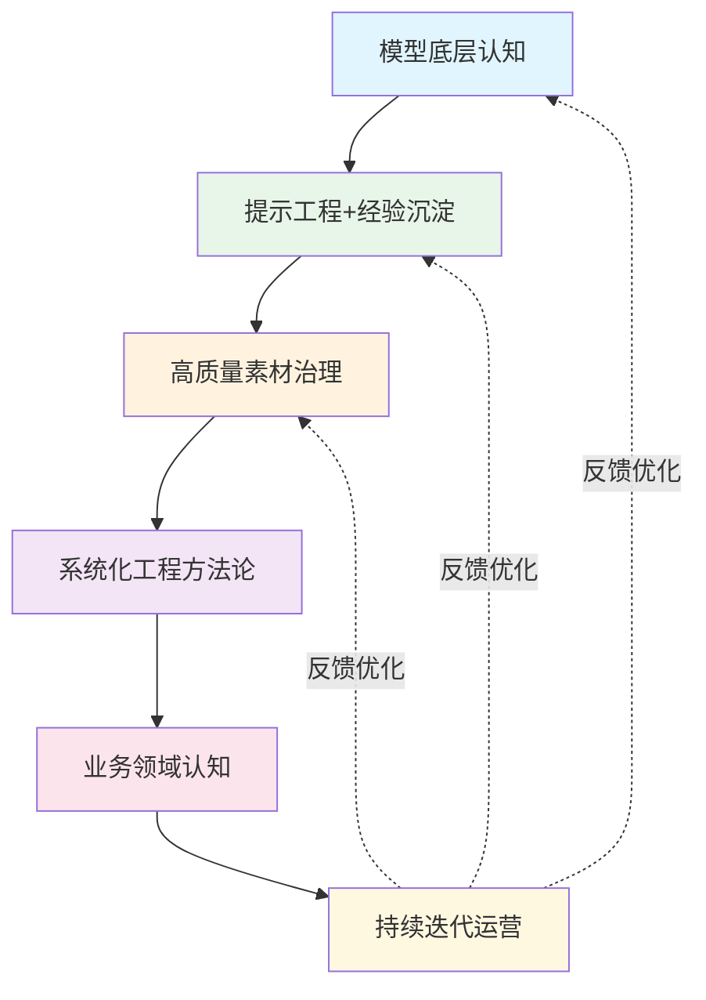

# T09: AI落地六大要素——从原理认知到持续运营

> **主题来源**: 豆包对话「输入与注意力权重对输出的影响」话题9
> **分析类型**: 框架整合与全景汇总
> **关联文件**: 全12个话题的综合收束

## 目录

[TOC]

---

## 1. 核心命题

> AI本身是工具，工具能否产出价值不取决于模型本身强弱，而是一整套配套条件共同决定。

对话中系统化梳理了用好AI的全部核心要素，整合此前全部讨论结论。

---

## 2. 六层能力模型

```text
                    +---------------------+
                    |  ⑥ 持续迭代运营机制  |  <- 长期保障
                    |  案例复盘·版本适配·  |
                    |  风险管控            |
                    +---------------------+
                    |  ⑤ 业务领域认知      |  <- 验收标尺
                    |  业务逻辑·评判标准·  |
                    |  目标定义能力        |
                    +---------------------+
                    |  ④ 系统化工程方法论  |  <- 规模化骨架
                    |  分层架构·流水线·    |
                    |  实验体系·上下文管理 |
                    +---------------------+
                    |  ③ 高质量素材与治理  |  <- 原材料上限
                    |  素材质量·预处理·    |
                    |  知识体系·传递规范   |
                    +---------------------+
                    |  ② 提示工程+经验沉淀 |  <- 核心软实力
                    |  Skill·约束体系·     |
                    |  指令透传            |
                    +---------------------+
                    |  ① 模型底层认知      |  <- 基础地基
                    |  Transformer·能力边界|
                    |  模型特性差异        |
                    +---------------------+
```

---

## 3. 各层详解

### 3.1 第一层：模型底层认知（地基）

| 认知点 | 说明 | 对应痛点 |
|:-------|:-----|:---------|
| Transformer特性 | 注意力机制、上下文窗口、长文本注意力弥散 | 大批量文档丢入期待高质量分析 |
| 模型偏好差异 | 基座vs微调vs对齐，对约束敏感度不同 | 套用通用prompt效果不稳定 |
| 能力边界 | 容易幻觉、无法自主校验 | 默认AI输出可靠 |

### 3.2 第二层：提示工程+经验沉淀（软实力核心）

| 能力 | 关键认知 |
|:-----|:---------|
| 提示词即经验载体 | 承载人类工作流程、分析原则、禁止事项 |
| Skill沉淀体系 | 把验证有效的流程封装为可复用Skill |
| 隐式 vs 显式约束 | 显式定义深度、粒度、边界、错误规避清单 |
| 指令透传策略 | SubAgent存在上下文丢失风险，设计强制下发机制 |

### 3.3 第三层：高质量素材与数据治理（原材料上限）

| 维度 | 要求 |
|:-----|:------|
| 原始素材质量 | 残缺/矛盾/冗余的输入 → 无论如何优化prompt都有缺陷 |
| 预处理策略 | 长文本/多文档严禁直送顶层，需分层拆解 |
| 知识体系治理 | 分类+关联+检索+时效，不是文档堆砌 |
| 信息传递规范 | 防止下层随意简化遗漏关键限定词 |

### 3.4 第四层：系统化工程方法论（骨架）

→ [**T02**](2026-07-30-t02-ai-layered-architecture.md)、[**T07**](2026-07-30-t07-multi-document-processing.md)

| 方法论 | 核心内容 |
|:-------|:---------|
| 分层架构 | 大小模型协同 + 按需回溯 |
| 校验闭环 | 独立校验单元对照Skill标准复核 |
| 对照实验 | 控制变量法定位关键质量变量 |
| 上下文生命周期 | 区分永久约束/临时数据/冗余草稿 |

### 3.5 第五层：业务领域认知（验收标尺）

```text
如果自身无法分辨什么是高质量答案：
  -> 就无法设计有效约束条件
  -> 就无法识别AI产出的错误/漏洞
  -> 模糊的业务诉求 = 模糊的AI输出
```

### 3.6 第六层：持续迭代运营（长期保障）

| 机制 | 内容 |
|:-----|:------|
| 案例复盘 | 收集失效案例，反向优化Skill和约束 |
| 版本适配 | 模型迭代后提示词效果变化，需持续调优 |
| 风险管控 | 幻觉识别、逻辑矛盾常态化检查 |

---

## 4. 一体化总结



**底层原理认知是地基 → 领域经验+标准化Skill是操作手册 → 高质量治理后的素材是原材料 → 分层协同的工程架构是生产线 → 深刻的业务理解是验收标尺 → 持续迭代优化机制保障长期稳定运行。**

缺少任意一环 → 偶尔能拿到不错结果 → 但**很难稳定、规模化产出高质量内容**。

---

## 参考文献

[1] Bubeck, S., et al. (2023). "Sparks of Artificial General Intelligence: Early experiments with GPT-4." *arXiv:2303.12712*.
[2] Huyen, C. (2022). "Designing Machine Learning Systems." *O'Reilly Media*.
[3] Sculley, D., et al. (2015). "Hidden Technical Debt in Machine Learning Systems." *NeurIPS 2015*.

---

## 变更记录

| 日期 | 版本 | 变更说明 |
|:----|:----:|:---------|
| 2026-07-30 | v1.0 | 首次创建，从豆包对话话题9深度展开，整合全部分析 |
