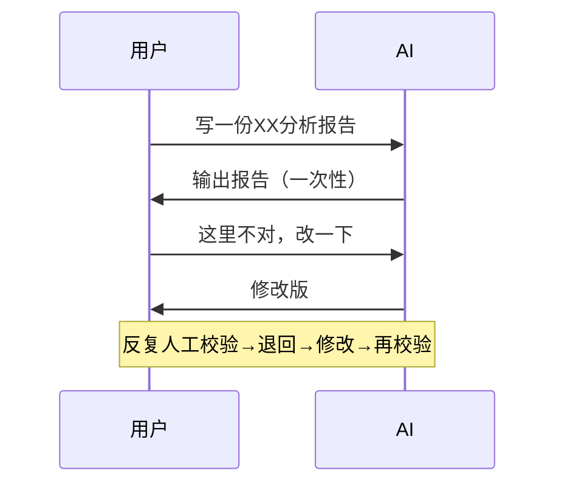

# AI 高质量产出流水线方法论

> **概要**: AI 高质量产出六阶段流水线方法论：从输入把关到专家把关
>
> **关键词**: 流水线 · 多路并行 · 验证循环 · 约束体系 · 专家把关

---

## 📑 目录

- [1. 核心理念：从"碰运气"到"工程流水线"](#1-核心理念从碰运气到工程流水线)
  - [1.1 问题现状](#11-问题现状)
  - [1.2 流水线思维](#12-流水线思维)
  - [1.3 与单次调用模式的关键区别](#13-与单次调用模式的关键区别)
- [2. 六阶段流水线总览](#2-六阶段流水线总览)
  - [各阶段职责](#各阶段职责)
- [3. 阶段一：输入质量把关（Input Quality Gate）](#3-阶段一输入质量把关input-quality-gate)
  - [3.1 输入质量检查清单](#31-输入质量检查清单)
  - [3.2 源可信度分级](#32-源可信度分级)
  - [3.3 输入增强策略](#33-输入增强策略)
- [4. 阶段二：多路并行加工（Multi-path Processing）](#4-阶段二多路并行加工multi-path-processing)
  - [4.1 并行模式](#41-并行模式)
    - [模式 A：多视角并行（最常用）](#模式-a多视角并行最常用)
    - [模式 B：多模型/Agent 并行](#模式-b多模型agent-并行)
    - [模式 C：多方法并行](#模式-c多方法并行)
    - [模式 D：多阶段并行（流水线内流水线）](#模式-d多阶段并行流水线内流水线)
  - [4.2 路径隔离与独立预算](#42-路径隔离与独立预算)
  - [4.3 子Agent 卸载机制](#43-子agent-卸载机制)
- [5. 阶段三：汇聚（Convergence & Collation）](#5-阶段三汇聚convergence-collation)
  - [5.1 冲突消解矩阵](#51-冲突消解矩阵)
  - [5.2 最优合并策略](#52-最优合并策略)
- [6. 阶段四：验证循环（Verification Loop）](#6-阶段四验证循环verification-loop)
  - [6.1 Ralph 循环——核心验证引擎](#61-ralph-循环核心验证引擎)
    - [三大核心组件](#三大核心组件)
    - [验证标准规范](#验证标准规范)
  - [6.2 验证维度矩阵](#62-验证维度矩阵)
  - [6.3 验证通过标准](#63-验证通过标准)
- [7. 阶段五：约束体系（Constraint System）](#7-阶段五约束体系constraint-system)
  - [7.1 约束分层模型](#71-约束分层模型)
  - [7.2 约束失效模式与检测](#72-约束失效模式与检测)
  - [7.3 约束模板](#73-约束模板)
    - [`.agignore` 模板（面向 AI 的文件操作约束）](#agignore-模板面向-ai-的文件操作约束)
    - [组件清单模板 `component-inventory.md`](#组件清单模板-component-inventorymd)
- [核心工具库](#核心工具库)
- [第三方依赖（已审批）](#第三方依赖已审批)
- [可复用模式](#可复用模式)
  - [依赖审批脚本 `check_reuse.py`](#依赖审批脚本-check_reusepy)
- [8. 阶段六：专家把关（Expert Gate）](#8-阶段六专家把关expert-gate)
  - [8.1 专家审查清单](#81-专家审查清单)
  - [8.2 自动化 vs 人工的边界](#82-自动化-vs-人工的边界)
- [9. 全流水线运作示例](#9-全流水线运作示例)
  - [输入](#输入)
  - [阶段一：质量把关](#阶段一质量把关)
  - [阶段二：多路并行](#阶段二多路并行)
  - [阶段三：汇聚](#阶段三汇聚)
  - [阶段四：验证循环](#阶段四验证循环)
  - [阶段五：约束检查](#阶段五约束检查)
  - [阶段六：专家把关](#阶段六专家把关)
  - [全流水线统计](#全流水线统计)
- [10. 工程化落地](#10-工程化落地)
  - [10.1 Harness 配置模板](#101-harness-配置模板)
  - [10.2 监控指标](#102-监控指标)
  - [10.3 成熟度模型](#103-成熟度模型)
- [11. 从方法论到 Skill](#11-从方法论到-skill)
  - [11.1 Skill 拆分建议](#111-skill-拆分建议)
  - [11.2 阶段 → Skill 映射](#112-阶段-skill-映射)
  - [11.3 编排器串联](#113-编排器串联)
- [附录A：检查清单速查](#附录a检查清单速查)
  - [A.1 输入质量检查清单](#a1-输入质量检查清单)
  - [A.2 验证检查清单](#a2-验证检查清单)
  - [A.3 专家终审清单](#a3-专家终审清单)
- [附录B：流水线配置文件模板](#附录b流水线配置文件模板)
- [12. 案例实证：MEMORY.md 指令冲突分析](#12-案例实证memorymd-指令冲突分析)
  - [12.1 现象 & 数据](#121-现象-数据)
  - [12.2 修复路径](#122-修复路径)
  - [12.3 通用模式提炼](#123-通用模式提炼)
- [13. AI 使用方法与工程思路](#13-ai-使用方法与工程思路)
  - [13.1 AI 产出的"信息熵"模型](#131-ai-产出的信息熵模型)
  - [13.2 AI 指令冲突的优先级仲裁](#132-ai-指令冲突的优先级仲裁)
  - [13.3 存储策略映射表](#133-存储策略映射表)
  - [13.4 工程化落地三原则](#134-工程化落地三原则)
    - [原则一：内容与位置频率匹配](#原则一内容与位置频率匹配)
    - [原则二：指定归宿优于负面禁止](#原则二指定归宿优于负面禁止)
    - [原则三：否定指令定安全底线，肯定指令定行为方向](#原则三否定指令定安全底线肯定指令定行为方向)
  - [13.5 实施检查清单](#135-实施检查清单)
- [参考文件](#参考文件)
- [Changelog](#changelog)

---

## 1. 核心理念：从"碰运气"到"工程流水线"

### 1.1 问题现状

当前 AI 辅助产出的典型模式：



**问题**: 质量取决于单次 prompt 质量 + 运气，人工成为唯一质检环节。

### 1.2 流水线思维

将 AI 产出视为**制造流水线**，每个环节有明确的输入标准、加工工序、质量检查门：

```text
输入材料 ---> 质量把关 ---> 多路并行 ---> 汇聚 ---> 验证循环 ---> 专家把关 ---> 输出
                ^                                                     ^
            Harness 约束                                        不可替代的人类判断
```

**核心公式**:

```text
高质量产出 = (Harness 约束 + 多路加工 + 循环验证) × 专家终审
```

### 1.3 与单次调用模式的关键区别

| 维度 | 单次调用模式 | 流水线模式 |
|:-----|:-------------|:-----------|
| 质量保障 | 靠 prompt 质量 + 运气 | 靠每个阶段的 check gate |
| 验证时机 | 事后人工 review | **同步内置**，每个环节自带验证 |
| 容错 | 一步错全盘输 | 单路出错不影响其他路径 |
| 可重复性 | 同一 prompt 每次结果不同 | 有约束保证一致性 |
| 自动化程度 | 人工驱动迭代 | AI 自主 Loop 直到达标 |
| 最终责任 | 模糊 | 明确由专家终审负责 |

---

## 2. 六阶段流水线总览

```text
+---------------------------------------------------------------------+
|                          AI 高质量产出流水线                           |
+---------------------------------------------------------------------+

  +----------+   +----------+   +----------+   +----------+   +----------+   +----------+
  |  ① 质量  |-->|  ② 多路  |-->|  ③ 汇聚  |-->|  ④ 验证  |-->|  ⑤ 约束  |-->|  ⑥ 专家  |--> 输出
  |   把关   |   |   并行   |   |          |   |   循环   |   |   体系   |   |   把关   |
  +----------+   +----------+   +----------+   +----------+   +----------+   +----------+
       |              |              |              |              |              |
       v              v              v              v              v              v
  输入校验      多视角/多模型     冲突消解      Ralph Loop     .agignore     人类终审
  源可信度      子Agent隔离      最优合并      验证矩阵      权限约束      责任归属
  完整度检查    独立上下文预算    交叉验证      自动迭代      输出格式约束   不可替代判断
```

### 各阶段职责

| 阶段 | 一句话职责 | 失败处理 |
|:-----|:-----------|:---------|
| **① 质量把关** | 输入不合格 → 不进入下一阶段 | 退回补充或拒绝执行 |
| **② 多路并行** | 同一任务多视角同时加工 | 单路失败不影响其他路 |
| **③ 汇聚** | 多路结果合并、冲突消解 | 冲突标记 → 回 ② 补加工 |
| **④ 验证循环** | 自动迭代直到满足通过标准 | 未达标 → 回 ② 或 ③ |
| **⑤ 约束体系** | 全流程确定性约束 | 越权操作被自动拦截 |
| **⑥ 专家把关** | 人类终审，唯一可签署"通过" | 不通过 → 退回指定阶段 |

---

## 3. 阶段一：输入质量把关（Input Quality Gate）

> **原则**: "垃圾进，垃圾出"——输入质量直接决定产出天花板。

### 3.1 输入质量检查清单

每次接到任务，先对输入材料做系统化检查：

```text
□ [完整性]  任务目标是否清晰可衡量？
□ [完整性]  背景信息是否充分？（谁/什么/为什么/边界条件）
□ [完整性]  已有材料是否齐全？（数据/文档/参考来源）
□ [可信度]  信息来源是否可追溯？
□ [可信度]  数据是否有数值+单位+对比基线+测试条件？
□ [一致性]  输入材料内部是否存在矛盾？
□ [可行性]  在当前上下文窗口/工具范围内是否能完成？
```

### 3.2 源可信度分级

| 级别 | 说明 | 示例 | 加权系数 |
|:----:|:-----|:-----|:--------:|
| **S** | 标准原文/官方文档/实测数据 | IEEE/PCI-SIG 规范、芯片 Datasheet | 1.0 |
| **A** | 权威白皮书/顶会论文/官方报告 | NVIDIA 白皮书、ODCC 规范 | 0.9 |
| **B** | 行业分析/一线技术博客 | DIGITIMES/SemiAnalysis | 0.7 |
| **C** | 自媒体/个人博客/未验证论坛 | 知乎个人分析、公众号文章 | 0.4 |
| **D** | LLM 生成内容/未知来源 | 无出处断言 | 0.1 |

**处理规则**:

- 多路并行时，每路应使用不同可信度的源，覆盖 S/A/B 三级
- 汇聚时，高可信度源在冲突消解中获得更高权重
- C/D 级源仅作补充参考，不能作为核心论据

### 3.3 输入增强策略

当输入质量不足时，自动触发增强流程：

1. **缺失信息补全**: 识别缺失维度 → 发起定向搜索/追问
2. **结构规范化**: 将非结构化输入转为标准格式（如散乱笔记→结构化要点）
3. **上下文扩展**: 查询知识库已有相关内容，补充背景
4. **边界澄清**: 识别模糊表述 → 生成边界条件假设 → 请求确认

---

## 4. 阶段二：多路并行加工（Multi-path Processing）

> **原则**: 同一任务多视角同时加工，互不干扰，各自有独立资源预算。

### 4.1 并行模式

四种基础并行模式，可根据任务类型选择：

#### 模式 A：多视角并行（最常用）

同一问题从不同角度同时分析：

```text
输入: "分析某芯片竞争力"

路径 A -- 技术指标维度（性能/功耗/面积/成本）
路径 B -- 市场维度（定价/供货/生态/替代方案）
路径 C -- 时间维度（演进路线/技术代际/差距趋势）
```

**适用**: 综合分析类、调研类、报告类

#### 模式 B：多模型/Agent 并行

同一任务交给不同模型/Agent 独立处理：

```text
路径 A -- DeepSeek（强推理/长文）
路径 B -- GPT（强代码/结构化）
路径 C -- Claude（强分析/安全性）
```

**适用**: 高价值/高风险任务，需要交叉验证

#### 模式 C：多方法并行

同一问题用不同方法求解：

```text
输入: "计算某系统总拥有成本(TCO)"

路径 A -- 自上而下（从预算反推）
路径 B -- 自下而上（从部件累加）
路径 C -- 对标法（从竞品推算）
```

**适用**: 数值计算、成本估算、性能预测

#### 模式 D：多阶段并行（流水线内流水线）

```text
              +-- 子任务 A1 (独立 Agent)
输入 -- 分解 -- 子任务 A2 (独立 Agent) -- 子汇聚 -- 主汇聚
              +-- 子任务 A3 (独立 Agent)
```

**适用**: 大型文档/复杂系统拆解

### 4.2 路径隔离与独立预算

每条路径必须严格隔离，避免交叉污染：

| 隔离维度 | 要求 |
|:---------|:-----|
| **上下文隔离** | 每条路径有独立上下文窗口，互不读取对方内容 |
| **Token 预算** | 每条路径分配独立 Token 配额，不抢占 |
| **工具调用** | 每条路径的工具调用结果不泄漏到其他路径 |
| **中间产物** | 中间文件按路径命名空间隔离（如 `tmp/path_A/`） |
| **失败隔离** | 一条路径失败不影响其他路径继续运行 |

### 4.3 子Agent 卸载机制

当任务过重或需专业化处理时，启动子 Agent 卸载：

```text
主 Agent
  +-- 子 Agent A（专注搜索调研，独立 Ralph 循环）
  +-- 子 Agent B（专注数据分析，独立 Token 预算）
  +-- 子 Agent C（专注图表生成，独立上下文）
```

**子Agent 协议**:

1. 主 Agent 下派明确的任务定义（含完成标准）
2. 子 Agent 独立运行自己的 TAOR 循环
3. 子 Agent 完成 → 只返回摘要给主 Agent
4. 主 Agent 上下文不受子 Agent 消耗影响

---

## 5. 阶段三：汇聚（Convergence & Collation）

> **原则**: 多条路径的结果必须经过系统化汇聚，不是简单拼接。

### 5.1 冲突消解矩阵

多条结果汇聚时，遇到矛盾内容使用冲突消解矩阵：

| 冲突类型 | 判定方法 | 消解策略 |
|:---------|:---------|:---------|
| **事实冲突** | 同一数据不同值 | 以可信度更高的源为准；同级别则标记待核实 |
| **观点分歧** | 同一问题不同结论 | 保留双方观点并注明分歧原因 |
| **完整性差异** | 覆盖内容不同 | 取并集（路径 A 有甲、B 有乙 → 合并甲乙） |
| **质量差异** | 同一内容不同深度 | 选深度更高的版本，低质量版本做补充注释 |

**冲突标记规范**:

```markdown
> ⚠️ **冲突标记**: 路径 A 认为 X=10，路径 B 认为 X=12
> - 来源差异：A 引用源1(S级)，B 引用源2(A级)
> - 判定：以源1为准，X=10
> - 置信度：高（S级源 + 可复现）
```

### 5.2 最优合并策略

根据输出类型选择合并方式：

| 输出类型 | 合并策略 | 示例 |
|:---------|:---------|:-----|
| **报告/文档** | 结构化合并：按大纲框架逐节取最优版本 | 分析报告 |
| **代码** | 模块化合并：各路径写不同模块，无缝拼接 | 微服务 |
| **数据表格** | 行/列追加 + 冲突检测 | 对比表 |
| **图表** | 择优：选出效果最好的一条路径直接使用 | 架构图 |
| **观点/结论** | 综合：归纳各路径共同点 + 标记分歧点 | 决策建议 |

---

## 6. 阶段四：验证循环（Verification Loop）

> **原则**: 验证不是事后 review，而是**每个环节内置的 check gate**。AI 自主迭代直到达标，人只负责定标准和终审。

### 6.1 Ralph 循环——核心验证引擎

Ralph 循环是整套流水线的"心脏"——通过外部化迭代机制，用明确的完成条件和最大迭代次数构建强制性自我修正循环。

```text
                   +----------------------------------+
                   |         Ralph 循环引擎            |
                   +----------------------------------+

     +---------+     +---------+     +---------+
     | 规划     |---->| 执行     |---->| 验证     |
     |(Plan)    |     |(Do)      |     |(Check)   |
     +---------+     +---------+     +----+-----+
          ^                                |
          |                                | 未达标
          |    +---------+                 |
          +----| 反思     |<----------------+
               |(Act)     |
               +---------+
                     | 达标
                     v
                +----------+
                | 通过/输出  |
                +----------+
```

#### 三大核心组件

```python
class RalphLoop:
    def __init__(self, task, completion_criteria, max_iterations=5):
        self.task = task
        self.criteria = completion_criteria  # 可机器验证的完成条件
        self.max_iterations = max_iterations
        self.iteration = 0

    def run(self):
        while self.iteration < self.max_iterations:
            result = self.execute_phase()
            if self.verify(result, self.criteria):
                return result  # 达标 → 输出
            self.reflect_and_replan()
            self.iteration += 1
        return self.handle_timeout()  # 超限 → 挂起等待人工
```

**组件说明**:

| 组件 | 职责 | 实现方式 |
|:-----|:------|:---------|
| **1. 明确的完成条件** | 可机器验证的客观标准 | check gate 列表（所有测试通过/格式校验通过/覆盖率达标） |
| **2. Stop Hook 拦截** | AI 尝试退出时自动触发验证 | 注入验证指令到系统 prompt；工具调用后检查结果 |
| **3. 最大迭代次数** | 防止无限循环 | 硬编码上限（如 5 次），超限后挂起等待人工介入 |

#### 验证标准规范

每次迭代的验证标准必须是**客观可测量**的：

```text
✅ 好的验证标准:
  - "所有 5 个单元测试通过"
  - "文档包含以下 4 个章节: 概述/方法/结果/结论"
  - "表格行数 ≥ 10行，列数 = 5列"
  - "每个断言都有来源引用"

❌ 坏的验证标准:
  - "看起来不错"
  - "质量足够好"
  - "读者能理解"
```

### 6.2 验证维度矩阵

每个阶段的产出至少经过以下维度的验证：

| 验证维度 | 验证内容 | 验证方法 | 通过标准 |
|:---------|:---------|:---------|:---------|
| **事实准确性** | 数据/断言是否正确 | 交叉引用 + 溯源 | 每个断言有 S/A 级源支持 |
| **逻辑一致性** | 内部无矛盾 | 自动扫描矛盾断言 | 无逻辑冲突 |
| **结构完整性** | 包含所有必需部分 | 格式/模板校验 | 100% 覆盖必需元素 |
| **格式规范性** | 符合目标格式要求 | lint + 模式匹配 | 零格式违规 |
| **来源可追溯** | 每个断言有出处 | 引用计数 + 来源交叉检查 | 无未标记断言 |
| **数据可验证** | 有数值+单位+基线+条件 | 模式匹配检查 | 无裸断言 |
| **创新性** | 相对已有工作是否有增量 | 对比库匹配 | 增量明确 |
| **伦理合规** | 无夸大/虚假/侵权 | 伦理扫描 checklist | 无红线违规 |

### 6.3 验证通过标准

流水线内置三级通过标准：

| 级别 | 含义 | 触发条件 | 下一步 |
|:----:|:-----|:---------|:-------|
| **🟢 自动通过** | 满足全部自动验证条件 | 全部 check gate 通过 | 进入专家把关 |
| **🟡 条件通过** | 存在次要问题但不影响核心质量 | >=80% check gate 通过，次要问题已标记 | 进入专家把关+问题清单 |
| **🔴 不通过** | 存在严重问题需返工 | 核心 check gate 未通过 | 退回对应阶段重加工 |

---

## 7. 阶段五：约束体系（Constraint System）

> **原则**: Harness 约束是确定性骨架，让 AI 的非确定性智能在可控范围内发挥作用。

### 7.1 约束分层模型

```text
+-----------------------------------------------+
|  第1层: 安全红线（不可触碰）                      |
|  - 永不删除关键文件                              |
|  - 永不写入 API 密钥/令牌到输出                   |
|  - 永不执行可能影响生产环境的操作                   |
+-----------------------------------------------+
|  第2层: 质量标线（必须遵守）                      |
|  - 输出必须有 TOC/交叉链接/changelog              |
|  - 断言必须有来源引用（S/A 级优先）                |
|  - 数据必须有数值+单位+对比基线+测试条件            |
+-----------------------------------------------+
|  第3层: 工程约束（最佳实践）                      |
|  - 优先复用已有组件（从 component-inventory 查）   |
|  - 新增依赖需审批                                |
|  - 中间产物需清理                                |
|  - 风格一致性（术语/编号/格式）                    |
+-----------------------------------------------+
```

### 7.2 约束失效模式与检测

| 失效模式 | 表现 | 检测方法 | 处理 |
|:---------|:-----|:---------|:-----|
| **中间文件污染** | 生成大量不清理的临时文件 | 文件扫描（结束 vs 开始） | 自动清理脚本 |
| **依赖膨胀** | 不断引入新依赖 | `check_reuse.py` | 新增依赖需审批 |
| **架构漂移** | 逐渐偏离初始设计 | 设计一致性检查 | 回滚至上一个检查点 |
| **复用约束失效** | 重造轮子 | AST 函数名去重检测 | 标记 + 替换建议 |
| **风格不一致** | 同一项目多套风格 | lint 扫描 | 自动格式化 |
| **术语不一致** | 同一概念多种表述 | 术语一致性检查 | 自动替换为标准术语 |
| **断言无出处** | 结论无来源支撑 | 引用完整性检查 | 退回补充来源 |

### 7.3 约束模板

#### `.agignore` 模板（面向 AI 的文件操作约束）

```gitignore
# .agignore — AI 行为约束文件
# AI 在操作项目时必须遵守以下规则

# --- 安全红线（不可触碰） ---
*~          # 编辑备份文件
config/secret*  # 敏感配置
*.key       # 密钥文件
production/*    # 生产环境目录

# --- 避免生成临时文件 ---
tmp/*       # AI 只能写 tmp/ 下的文件
*.bak       # 不生成 bak 文件
*.swp       # 不生成 vim 交换文件

# --- 限定 AI 可写的目录 ---
# AI 默认只能写以下目录
# WORK_DIRS: src/, docs/, tests/, tmp/

# --- 自定义规则 ---
# NEW_DEPENDENCY_APPROVAL_REQUIRED: true
# MAX_NEW_FILES_PER_SESSION: 5
# MAX_FILE_SIZE_LIMIT: 500KB
```

#### 组件清单模板 `component-inventory.md`

```markdown
# 项目组件清单

> AI 启动时**必须**先查阅此文件，优先复用已有组件。

## 核心工具库
| 组件 | 路径 | 功能 | 最后更新 |
|:-----|:-----|:-----|:---------|
| `DateUtils` | `src/utils/date.py` | 日期格式化/计算 | 2026-06 |
| `HttpClient` | `src/utils/http.py` | HTTP 请求封装 | 2026-05 |

## 第三方依赖（已审批）
| 包名 | 版本 | 用途 | 审批日期 |
|:-----|:-----|:-----|:---------|
| `requests` | 2.31.0 | HTTP 请求 | 2025-12 |
| `pandas` | 2.1.0 | 数据处理 | 2025-12 |

## 可复用模式
| 模式 | 位置 | 场景 |
|:-----|:------|:-----|
| 数据清洗管道 | `src/pipeline/clean.py` | 通用清洗流程 |
| 报告模板 | `templates/report.md` | 标准报告结构 |
```

#### 依赖审批脚本 `check_reuse.py`

```python
#!/usr/bin/env python3
"""检测该复用但没复用的组件 + 审计新增依赖"""
import ast, sys, re
from pathlib import Path

def check_functions(file_path):
    """检测新写的函数是否与已有工具函数重复"""
    with open(file_path) as f:
        tree = ast.parse(f.read())
    new_funcs = {n.name for n in ast.walk(tree) if isinstance(n, ast.FunctionDef)}
    # 与组件清单中的已知函数比对
    known_funcs = {'format_date', 'parse_date', 'send_request', 'retry_call'}
    duplicates = new_funcs & known_funcs
    if duplicates:
        print(f"⚠️  发现可能重复的函数: {duplicates}")
        print("  建议优先复用组件清单中的已有实现")
        return False
    return True

def check_new_imports(file_path):
    """检测新增第三方依赖"""
    pattern = re.compile(r'^(import|from)\s+(\w+)')
    known_imports = {'os', 'sys', 'json', 're', 'datetime', 'pathlib',
                     'typing', 'collections', 'math', 'random'}
    new_imports = set()
    with open(file_path) as f:
        for line in f:
            m = pattern.match(line.strip())
            if m:
                pkg = m.group(2).split('.')[0]
                if pkg not in known_imports:
                    new_imports.add(pkg)
    if new_imports:
        print(f"⚠️  新增依赖（需审批）: {new_imports}")
        return False
    return True

if __name__ == '__main__':
    file_path = sys.argv[1] if len(sys.argv) > 1 else '.'
    ok = check_functions(file_path)
    ok = check_new_imports(file_path) and ok
    sys.exit(0 if ok else 1)
```

---

## 8. 阶段六：专家把关（Expert Gate）

> **原则**: 自动化流程可以跑 99% 的工序，但最终的责任归属和判断力在人。

### 8.1 专家审查清单

专家在终审时检查以下维度（流水线已有自动验证的维度不再重复检查）：

```text
□ [核心判断] 自动化无法验证的定性判断是否正确？
   - 战略方向是否正确？
   - 创新点是否真正有价值？
   - 结论是否经得起推敲？

□ [责任归属] 输出是否可归因？
   - 是否清楚哪些是 AI 生成的、哪些是人工修改的？
   - 是否有 AI 生成内容的标识？

□ [边界条件] 输出的适用边界是否清晰？
   - 结论在什么条件下成立？
   - 有什么前提假设？
   - 局限性是否已说明？

□ [可交付性] 输出是否可直接使用？
   - 格式是否满足交付标准？
   - 是否缺失必要信息？

□ [合规审查] 是否有伦理/合规风险？
   - 是否涉及敏感信息？
   - 结论是否夸大？
   - 是否有侵权行为？
```

### 8.2 自动化 vs 人工的边界

| 类型 | 由自动化处理 | 由专家处理 |
|:-----|:------------|:-----------|
| **事实检查** | 数据一致性、格式合规、来源可追溯 | 专业判断、战略方向、创新性评估 |
| **迭代** | Ralph 循环自动迭代至达标 | 对不达标内容明确退回哪个阶段 |
| **风险检测** | 安全红线检查、依赖审计、格式扫描 | 定性风险评估、业务影响判断 |
| **修改** | 格式修正、自动补充来源、清理中间产物 | 核心方向调整、重大重写、内容取舍 |

---

## 9. 全流水线运作示例

以"生成某芯片竞争力分析报告"为例，展示完整流水线运作：

### 输入

```text
用户输入: "分析 NVIDIA GB300 相比 B200 的竞争力提升"
已有材料: 官方白皮书链接、第三方评测文章、知识库中的技术架构文档
```

### 阶段一：质量把关

```text
[检查]
✓ 任务目标清晰: "GB300 vs B200 竞争力对比"
✓ 背景信息充分: 产品规格已知
✓ 来源: 官方白皮书(S级) + 第三方评测(A级) + 知识库(B级)
✓ 数据完整性: 缺少功耗数据 -> 自动检索补充

[通过] 进入阶段二
```

### 阶段二：多路并行

```text
路径 A -- 性能维度：FLOPS/带宽/能效比/互联（参考官方白皮书 S 级源）
路径 B -- 成本维度：BOM 估算/TCO/性价比（参考第三方拆解 A 级源）
路径 C -- 生态维度：软件栈/部署方案/客户采纳（参考行业分析 B 级源）
路径 D -- 时间维度：上市节奏/代际提升/竞品对应（参考路线图 A 级源）

[子 Agent 启动]
  子 Agent S -- 独立搜索补充最新价格和供货信息
```

### 阶段三：汇聚

```text
[冲突检测]
  ⚠️ 峰值 FLOPS: 路径 A 为 900 TFLOPS(S源), 路径 B 为 850 TFLOPS(A源)
  -> 以 S 级源为准: 900 TFLOPS（标注来源）

[合并]
  - 性能章节: 用路径 A（数据最精确）
  - 成本章节: 用路径 B（分析最深入）
  - 生态章节: 用路径 C + 子 Agent S 补充
  - 综合结论: 综合四条路径的共同发现

[通过] 进入验证循环
```

### 阶段四：验证循环

```text
Round 1:
  [验证] 事实检查: 发现一个性能数据单位错误（GB/s vs GT/s）
  [反思] 标记错误 + 定位问题段落
  [重做] 修正单位 + 重新计算
Round 2:
  [验证] 全部 check gate 通过 ✓
    - 所有断言有来源 ✓
    - 数据有数值+单位+基线 ✓
    - 内部无矛盾 ✓
    - 格式符合规范 ✓
  [通过] 进入阶段五

[迭代统计] 2 轮达成（< 上限 5 轮）
```

### 阶段五：约束检查

```text
[安全红线检查] ✓ 无敏感信息泄露
[依赖审计] ✓ 无新增依赖
[格式规范] ✓ TOC/交叉链接/changelog 完整
[术语一致性] ✓ "GB300"全篇统一
[中间产物清理] ✓ tmp/ 路径已清理
[通过] 进入专家把关
```

### 阶段六：专家把关

```text
专家审查:
  ✓ 核心判断: 结论合理，分析框架完整
  ✓ 责任归属: AI 生成部分已标注
  ✓ 边界条件: 测试条件、前提假设已说明
  ✓ 可交付性: 可直按交付客户
  △ 建议: 补充两个 GB300 特有的技术细节（来自内部验证数据）

[签署通过] -> 最终输出
```

### 全流水线统计

| 指标 | 值 |
|:-----|:---|
| 总耗时 | 12 分钟（AI 处理）+ 8 分钟（专家审查）|
| 迭代轮次 | 2 轮 |
| 并行路径 | 4 条 + 1 子 Agent |
| 人工介入 | 1 次（终审）+ 1 个建议 |
| 产出质量 | 专家评分 9/10 |

---

## 10. 工程化落地

### 10.1 Harness 配置模板

```yaml
# pipeline_config.yaml — 流水线全局配置

pipeline:
  name: "AI 高质量产出流水线"
  version: "1.0"

phases:
  quality_gate:
    enabled: true
    min_source_level: "C"     # 最低接受源级别
    auto_enhance: true         # 自动补全缺失信息

  parallel_processing:
    mode: "multi_view"         # multi_view / multi_model / multi_method
    min_paths: 2               # 最少并行路数
    max_paths: 5
    isolation: true
    sub_agent:
      enabled: true
      max_depth: 3             # 子 Agent 嵌套最大深度
      token_budget: "30%"      # 子 Agent Token 占总预算比例

  convergence:
    conflict_resolution: "weighted"  # weighted / majority / manual
    source_weights:
      "S": 1.0
      "A": 0.9
      "B": 0.7
      "C": 0.4
      "D": 0.1

  verification:
    loop:
      enabled: true
      max_iterations: 5
      completion_ratio: 0.8    # 80% check gate 通过即为条件通过
    dimensions:
      - "fact_accuracy"
      - "logic_consistency"
      - "structure_completeness"
      - "format_compliance"
      - "source_traceability"
      - "data_verifiability"

  constraints:
    enabled: true
    agignore: ".agignore"
    component_inventory: "component-inventory.md"
    dependency_audit: true

  expert_gate:
    enabled: true
    auto_bypass_on: false      # 从不自动跳过专家审查
    required_signoff: true
```

### 10.2 监控指标

```python
# 流水线运行指标

metrics = {
    # 效率指标
    "avg_pipeline_time": "12 min",   # 平均流水线耗时
    "avg_iterations": 2.5,            # 平均验证循环轮次
    "max_iterations": 5,              # 最大轮次（超限挂起）
    "parallel_efficiency": 0.72,      # 并行加速比

    # 质量指标
    "auto_pass_rate": 0.65,           # 自动通过比例
    "condition_pass_rate": 0.28,      # 条件通过比例
    "fail_rate": 0.07,                # 不通过比例
    "expert_modification_rate": 0.15, # 专家修改比例

    # 约束指标
    "constraint_violations": 0.12,    # 每任务平均违规次数
    "dependency_approval_rate": 0.08, # 新增依赖申请比例

    # 投入产出
    "ai_time_per_task": "10 min",
    "expert_time_per_task": "5 min",
    "quality_score": 8.7,             # 专家评分均值 (1-10)
}
```

### 10.3 成熟度模型

| 级别 | 名称 | 特征 | 关键标识 |
|:----:|:-----|:------|:---------|
| **L1** | 原始模式 | 单次 prompt → 人工 review | 无流水线，全凭运气 |
| **L2** | 半自动化 | 有简单检查清单 + 人工校验 | 有 check gate 概念但未落地 |
| **L3** | 初步流水线 | 输入把关 + 单路输出 + Ralph 循环 | 验证循环已跑通 |
| **L4** | 成熟流水线 | 多路并行 + 汇聚 + 自动验证 + 专家终审 | 六阶段完整运作 |
| **L5** | 自主进化 | L4 + 自动分析失败模式 + 自优化流水线参数 | 持续自我迭代 |

---

## 11. 从方法论到 Skill

> ✅ **已实现**: 以下 7 个 Skill 已于 2026-07-10 创建完成并验证通过。见 `skills/` 目录。

### 11.1 Skill 拆分建议

流水线的每个阶段适合独立封装为一个 Skill，遵循"单阶段、单职责"原则：

| # | Skill 名称 | 对应阶段 | 核心能力 |
|:-:|:-----------|:---------|:---------|
| ① | `pipeline-input-qa` | 质量把关 | 输入完整性/可信度检查 + 自动补全 |
| ② | `pipeline-multi-path` | 多路并行 | 多视角/多模型并行调度 + 子Agent管理 |
| ③ | `pipeline-convergence` | 汇聚 | 冲突消解 + 最优合并 + 交叉验证 |
| ④ | `pipeline-verification-loop` | 验证循环 | Ralph 循环引擎 + 验证矩阵 + 自动迭代 |
| ⑤ | `pipeline-constraint-enforcer` | 约束体系 | .agignore 解析 + 依赖审计 + 格式校验 |
| ⑥ | `pipeline-expert-gate` | 专家把关 | 审查清单生成 + 差异标注 + 退回路由 |
| — | `pipeline-orchestrator` | 全流程编排 | 阶段串联 + 状态管理 + 断点续传 |

### 11.2 阶段 → Skill 映射

```text
输入 -- input-qa -- multi-path-processor -- convergence-engine
                                                      |
                                                 verification-loop (Ralph)
                                                      |
                                                 constraint-enforcer
                                                      |
                                                 expert-gate -- 输出
                                                      |
                                              pipeline-orchestrator (全流程管理)
```

### 11.3 编排器串联

编排器 `pipeline-orchestrator` 负责：

1. **阶段路由**: 按配置文件顺序依次调用各阶段 Skill
2. **状态追踪**: 维护全局任务状态（当前阶段/各路径状态/迭代计数）
3. **断点续传**: 任一阶段失败时保留已完成的中间结果
4. **异常处理**: 非致命错误自动重试，致命错误挂起等待人工介入
5. **失败分析**: 记录失败模式 → 用于流水线参数调优

**编排器工作流**:

```python
class PipelineOrchestrator:
    def execute(self, task):
        state = self.init_state(task)

        # 阶段 1: 质量把关
        state = call_skill("input-qa", state)
        if not state['quality_passed']:
            return self.reject("输入质量不达标")

        # 阶段 2: 多路并行
        state = call_skill("multi-path-processor", state)

        # 阶段 3: 汇聚
        state = call_skill("convergence-engine", state)

        # 阶段 4: 验证循环（自动迭代）
        state = call_skill("verification-loop", state,
                          max_iterations=5)

        # 阶段 5: 约束检查
        state = call_skill("constraint-enforcer", state)
        if state['constraint_violations'] > 0:
            state = self.auto_fix(state)  # 自动修复
            if state['fix_failed']:
                return self.flag_for_review(state)

        # 阶段 6: 专家把关
        state = call_skill("expert-gate", state)

        return self.deliver(state)
```

---

## 附录A：检查清单速查

### A.1 输入质量检查清单

```text
□ 目标是否清晰可衡量？
□ 背景信息是否充分？
□ 已有材料是否完备？
□ 来源是否可追溯且达到最低可信度级别？
□ 数据是否包含数值+单位+对比基线+测试条件？
□ 输入材料内部是否有矛盾？
□ 任务在当前范围内是否可执行？
```

### A.2 验证检查清单

```text
□ 所有断言有来源引用（S/A 级优先）？
□ 数据有数值+单位+对比基线+测试条件？
□ 内部无逻辑矛盾？
□ 结构完整（包含所有必需章节）？
□ 格式符合目标规范（TOC/交叉链接/changelog）？
□ 无安全红线违规？
□ 无新增未经审批的依赖？
□ 中间产物已清理？
□ 术语一致？
```

### A.3 专家终审清单

```text
□ 核心结论是否正确且经得起推敲？
□ 适用边界和前提假设是否清晰？
□ AI 生成内容是否已标识？
□ 是否有伦理/合规风险？
□ 格式是否满足交付标准？
□ 是否缺失必要信息？
□ 是否有侵权行为或夸大表述？
```

---

## 附录B：流水线配置文件模板

```yaml
# .pipeline.yml — 单任务流水线配置文件

task:
  name: "竞争力分析报告"
  type: "analysis_report"
  urgency: "normal"  # urgent / normal / low

pipeline:
  profiles:
    quick: &quick           # 快速模式：单路+1轮验证
      parallel_paths: 1
      max_iterations: 2
      quality_min_level: "C"

    standard: &standard     # 标准模式（默认）
      parallel_paths: 3
      max_iterations: 5
      quality_min_level: "C"
      sub_agent: true

    deep: &deep             # 深度模式：多路+严格验证
      parallel_paths: 5
      max_iterations: 8
      quality_min_level: "B"
      sub_agent: true
      source_min_weight: 0.7

  select: *standard

output:
  format: "markdown"
  toc: true
  changelog: true
  cross_links: true
```

---

## 12. 案例实证：MEMORY.md 指令冲突分析

> **场景**: MEMORY.md 文件中混入了本该放在知识库或每日记忆中的动态内容，且 RULE.md 的"非明确要求不要动"规则与系统 prompt 的"主动写入"指令反复冲突。

### 12.1 现象 & 数据

**问题**: MEMORY.md（长期记忆）频繁被写入"关键洞察（最新）"和"调研跟踪（动态）"——本质是行业新闻和短期跟踪，而非长期记忆。

**量化**（规则引入后 10 天内）:

| 时间段 | MEMORY.md 修改次数 | 规则约束 | 实际效果 |
|:-------|:------------------:|:---------|:---------|
| 6/30 前（30天） | ~15 | 无 | 自由写入，含动态内容 |
| 6/30 引入规则 | — | `非明确要求不要动` | 规则写入 |
| 6/30→7/10 | **10 次** | 有规则但未解决 | 仍频繁改动，主要动因是"关键洞察"和"调研跟踪"两个动态区块 |

**根因追溯**:

1. MEMORY.md 没做内容类型分界——长期原则（稳定）与短期新闻（日更）混放
2. 系统 prompt 指令权重（"遇到重要信息→主动写入 MEMORY.md"）> RULE.md 约束（"非明确要求→不要动"）
3. 没有给出替代存储位置——AI 只能继续写 MEMORY.md，因为没有其他地方可写

### 12.2 修复路径

| 步骤 | 操作 | 对应流水线阶段 |
|:-----|:------|:--------------|
| ① 内容分类 | 识别 MEMORY.md 中两类内容：长期原则（保留）vs 动态新闻（迁移） | ① Input QA |
| ② 指定归宿 | "关键洞察"→`memory/YYYY-MM-DD.md`，"调研跟踪"→`01_survey/`专题文件 | ② 方法/约束 |
| ③ 删除动态块 | 从 MEMORY.md 移除 2 个动态区块（~350行→0行） | ⑤ 约束执行 |
| ④ 文件压到 27 行 | 稳定内容保留，MEMORY.md 从~60行降至27行 | ④ 验证循环 |

**效果**: MEMORY.md 从之前"每2天改一次"降至"长期稳定"，已连续写入后不再变动。

### 12.3 通用模式提炼

```text
+--------------+      +--------------+      +--------------+
|  信息产生     | -->  |  内容分类     | -->  |  写入正确位置  |
|  AI/用户产出  |      |  长期/短期？  |      |  静态->MEMORY  |
+--------------+      |  静态/动态？  |      |  动态->memory/ |
                      |  核心/辅助？  |      |  知识->knowledge|
                      +--------------+      +--------------+
```

**三条硬规则**:

1. **存储位置与内容频率匹配**: 日更→`memory/`，周更→`knowledge/`子目录，月更+→`MEMORY.md`
2. **迁移而非覆写**: 发现错位内容先迁到正确位置再删原处（`mv` 而非 `rm`）
3. **收口即约束**: 关键约束文件设定内容白名单，不在名单内的内容拒绝写入

---

## 13. AI 使用方法与工程思路

> 从 MEMORY.md 案例提炼出的 AI 使用哲学和工程化落地方法。

### 13.1 AI 产出的"信息熵"模型

AI 产出的所有信息可按两个维度分类，决定其归属：

```text
                  频率
               高频(日)
                 |
          +------+------+
          | 每日 | 跟踪 |
          | 记忆 | 调研 | <- 当前热点
          | A区  | B区  |
          +------+------+
  弱重要性  |      |      | 强重要性
          | C区  | D区  |
          | 临时 | 长期 |
          | 笔记 | 沉淀 | <- 核心原则
          +------+------+
                 |
               低频(月+)
```

| 区域 | 特征 | 存放位置 | 示例 |
|:-----|:-----|:---------|:-----|
| **A区** | 高频+弱重要 | `memory/YYYY-MM-DD.md` | 当日讨论进展、临时备忘 |
| **B区** | 高频+强重要 | `knowledge/01_survey/<dir>/` | 行业新闻跟踪、竞品动态 |
| **C区** | 低频+弱重要 | 随用随删 | 试验代码片段、临时计算 |
| **D区** | 低频+强重要 | MEMORY.md / AGENT.md / RULE.md | 核心原则、工作习惯、决策记录 |

**工程推论**:

- 信息熵高（高频变化）的数据不应放在低频修改的文件中
- 存储结构的稳定性 = 文件的修改频率与内容变化频率一致
- "写什么地方"的决策应该在"写不写"的决策之后自动执行，而非每次都重新判断

### 13.2 AI 指令冲突的优先级仲裁

AI 面对的指令来源有明确的优先级层级，但**默认没有显式仲裁机制**。需要人为建立：

```text
优先级从高到低:

  L1: 安全红线的负面指令      "永不rm"          <- 最高优先级，不可覆盖
  L2: 当前任务的明确指令       "写这份报告"      <- 任务上下文
  L3: RULE.md 的约束规则      "不要动MEMORY.md" <- 工程约束
  L4: AGENT.md 的行为准则    "主动记录重要事项" <- 人格设定
  L5: 系统 prompt 默认指令    "写入MEMORY.md"   <- 基础行为
```

**冲突解决规则**:

| 情况 | 规则 | 示例 |
|:-----|:-----|:------|
| 安全红线 vs 任何指令 | 安全红线赢 | "绝不rm" > "清理文件" |
| 正面 vs 负面指令 | 负面的（不做X）> 正面的（做Y） | "不要动" > "主动写" |
| 具体 vs 模糊 | 具体的 > 模糊的 | "写到knowledge/" > "写到长期记忆" |
| 近的 vs 远的 | 本文件内 > 跨文件引用 | RULE.md 内规则 > 引用另一文件的规则 |

**工程实践**: 在 RULE.md 中显式声明优先级覆盖关系。

### 13.3 存储策略映射表

每类信息的明确归宿（必须固化到 RULE.md 或 AGENT.md）：

| 信息产生场景 | 应写入位置 | 判断依据 | 变更频率 |
|:------------|:-----------|:---------|:--------:|
| 用户今天做了什么/讨论了什么 | `memory/YYYY-MM-DD.md` | 当天记录 | 日更 |
| 技术文章/链接/文档归档 | `knowledge/06_others/sources/<slug>.md` | 知识沉淀 | 一次性 |
| 行业新闻/竞争动态 | `knowledge/01_survey/<dir>/YYYY-MM-DD.md` | 调研跟踪 | 日/周更 |
| 方法论/工作流程/质量原则 | `knowledge/02_rd/00_shared/02_concepts/epistemology/<topic>.md` 或 MEMORY.md | 长期可复用 | 月/季更 |
| 用户偏好/习惯/决策 | `MEMORY.md` (精简摘要) + `memory/` (详细) | 长期核心 | 月更 |
| Agent 性格/语气/行为准则 | `AGENT.md` | 人格设定 | 季更 |
| 工程红线/操作规则 | `RULE.md` | 强制约束 | 半年更 |
| 临时草稿/中间产物 | `tmp/` 目录 | 临时 | 随用随删 |

### 13.4 工程化落地三原则

从 MEMORY.md 案例中最终提炼的三条不可妥协原则：

#### 原则一：内容与位置频率匹配

> **文件修改频率 ≈ 内容变化频率**

- `MEMORY.md` 一个月改一次是正常的，一天改一次是出问题了
- 写之前问：这个信息应该多久更新一次？如果超过 1 周，就不该放在 `memory/YYYY-MM-DD.md`；如果少于 1 个月，就不该放在 `MEMORY.md`

#### 原则二：指定归宿优于负面禁止

> **"写到这里" 比 "不要写那里" 有效**

- 负面禁止（"不要动 MEMORY.md"）不解决问题——AI 不知道信息该放哪里
- 指定归宿（"行业新闻→01_survey/，每日记录→memory/，核心原则→MEMORY.md"）一次性解决归属问题
- AI 的"主动写入"本能需要被引导而非压制

#### 原则三：否定指令定安全底线，肯定指令定行为方向

> **否定指令（安全红线）L1 不可覆盖 | 肯定指令（行为指引）需要与否定指令显式协调**

- 安全红线用否定句式（"永不rm"、"永不泄露密钥"）
- 行为指引用肯定句式（"技术文章→knowledge/06_others/sources/"）+ 映射表
- 两者冲突时：否定 > 肯定（"不rm" > "清理临时文件"即为"mv到bak"）

### 13.5 实施检查清单

当在新工作空间或新项目中落地 AI 流水线时，执行以下检查：

```text
□ 存储策略映射表已定义（每种信息类型->写入位置）
□ 四个身份文件已按频率分界（AGENT/USER/MEMORY/RULE各司其职）
□ 规则优先级已显式声明（冲突时谁赢）
□ 动态内容已分离到对应目录（不混入静态文件）
□ .agignore 或等效约束已建立（物理防止越界写入）
□ 关键文档头部已标记 DO NOT EDIT / AUTO-GENERATED
□ 修改频率已做基线：MEMORY(月) / AGENT(季) / RULE(半年)
```

---

## 参考文件

> 本文件调用的外部文件与资料（不含被引用情况）。

### 内部知识库引用

- (无)

### 外部资料引用

- (无)

---

## Changelog

| 日期 | 版本 | 变更说明 |
|:----|:----|:-----|
| 2026-07-10 | v1.0 | 初始版本：完整六阶段流水线方法论 |
| 2026-07-14 | v1.2 | 📦 从 `05_tools/ai-production-pipeline/` 迁至 `03_AI/methodology/`（AI 方法论文档统一管理） |
