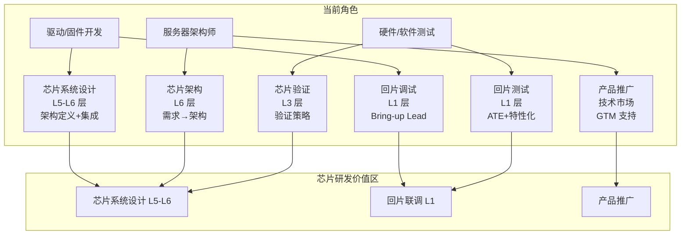

# 🔄 驱动/固件/测试/架构 → 芯片研发转型深度指南

> **概要**: 固件/驱动开发人员 · 硬件测试人员 · 服务器架构人员 → 快速切入芯片研发（系统设计·回板测试·产品推广）的完整转型路径
>
> **关键词**: (待补充)

---

## 📑 目录

- [📖 文档导读](#文档导读)
- [1️⃣ 行业背景：为什么现在是最佳切入时机](#1-行业背景为什么现在是最佳切入时机)
  - [1.1 AI 芯片需求爆发驱动的人才缺口](#11-ai-芯片需求爆发驱动的人才缺口)
  - [1.2 为什么服务器背景人员在芯片研发中有独特优势](#12-为什么服务器背景人员在芯片研发中有独特优势)
  - [1.3 三类角色的转型目标定位](#13-三类角色的转型目标定位)
- [2️⃣ 角色画像：三类候选人的起点、优势、差距](#2-角色画像三类候选人的起点优势差距)
  - [2.1 驱动/固件开发人员（最天然匹配）](#21-驱动固件开发人员最天然匹配)
  - [2.2 服务器架构人员（战略价值最高）](#22-服务器架构人员战略价值最高)
  - [2.3 硬件/软件测试人员（执行层最短路径）](#23-硬件软件测试人员执行层最短路径)
- [3️⃣ 映射桥梁：服务器技术能力 → 芯片设计能力的等价转换](#3-映射桥梁服务器技术能力-芯片设计能力的等价转换)
  - [3.1 核心映射原理](#31-核心映射原理)
  - [3.2 详细映射表](#32-详细映射表)
    - [驱动/固件知识 → 芯片设计知识点](#驱动固件知识-芯片设计知识点)
    - [服务器架构知识 → 芯片设计知识点](#服务器架构知识-芯片设计知识点)
    - [测试知识 → 芯片验证知识点](#测试知识-芯片验证知识点)
  - [3.3 六层金字塔上的位置映射](#33-六层金字塔上的位置映射)
- [4️⃣ 驱动/固件开发人员转型路径](#4-驱动固件开发人员转型路径)
  - [4.1 核心论点：驱动/固件开发者是「最被低估的芯片设计候选者」](#41-核心论点驱动固件开发者是最被低估的芯片设计候选者)
  - [4.2 三步切入路径](#42-三步切入路径)
    - [Phase 1：从「读 Datasheet」到「参与寄存器定义」（1-3 个月）](#phase-1从读-datasheet到参与寄存器定义1-3-个月)
    - [Phase 2：从「写驱动」到「做集成验证」（3-6 个月）](#phase-2从写驱动到做集成验证3-6-个月)
    - [Phase 3：从「单芯片驱动」到「芯片系统设计」（6-12 个月）](#phase-3从单芯片驱动到芯片系统设计6-12-个月)
  - [4.3 驱动/固件人员 → 芯片系统设计 的独特价值](#43-驱动固件人员-芯片系统设计-的独特价值)
- [5️⃣ 服务器架构人员转型路径](#5-服务器架构人员转型路径)
  - [5.1 核心论点：服务器架构师是最稀缺的「芯片系统架构师」候选者](#51-核心论点服务器架构师是最稀缺的芯片系统架构师候选者)
  - [5.2 三步切入路径](#52-三步切入路径)
    - [Phase 1：从「整机架构」到「芯片架构约束」（1-3 个月）](#phase-1从整机架构到芯片架构约束1-3-个月)
    - [Phase 2：从「架构评审」到「芯片架构方案设计」（3-6 个月）](#phase-2从架构评审到芯片架构方案设计3-6-个月)
    - [Phase 3：从「芯片选型」到「芯片差异化定义」（6-12 个月）](#phase-3从芯片选型到芯片差异化定义6-12-个月)
  - [5.3 服务器架构师转型的典型产出示例](#53-服务器架构师转型的典型产出示例)
- [6️⃣ 硬件/软件测试人员转型路径](#6-硬件软件测试人员转型路径)
  - [6.1 核心论点：测试人员是最快融入芯片验证的角色](#61-核心论点测试人员是最快融入芯片验证的角色)
  - [6.2 三步切入路径](#62-三步切入路径)
    - [Phase 1：从「系统测试」到「RTL 仿真验证」（1-3 个月）](#phase-1从系统测试到rtl-仿真验证1-3-个月)
    - [Phase 2：从「手动测试」到「验证计划编写」（3-6 个月）](#phase-2从手动测试到验证计划编写3-6-个月)
    - [Phase 3：从「功能覆盖」到「系统级协同验证」（6-12 个月）](#phase-3从功能覆盖到系统级协同验证6-12-个月)
  - [6.3 测试 → 验证转型的价值增量和进阶方向](#63-测试-验证转型的价值增量和进阶方向)
- [7️⃣ 汇合点：回片联调（Bring-up）阶段的角色协同](#7-汇合点回片联调bring-up阶段的角色协同)
  - [7.1 Bring-up 在芯片研发中的战略地位](#71-bring-up-在芯片研发中的战略地位)
  - [7.2 三类角色在 Bring-up 中的分工](#72-三类角色在-bring-up-中的分工)
  - [7.3 Bring-up 的「三叉戟」协同模式](#73-bring-up-的三叉戟协同模式)
  - [7.4 典型 Bring-up 故障场景的角色响应](#74-典型-bring-up-故障场景的角色响应)
- [8️⃣ 芯片产品推广：技术背景如何转化为市场语言](#8-芯片产品推广技术背景如何转化为市场语言)
  - [8.1 技术背景做芯片推广的天然优势](#81-技术背景做芯片推广的天然优势)
  - [8.2 从技术参数到客户价值的转换框架](#82-从技术参数到客户价值的转换框架)
  - [8.3 芯片推广的「三层次沟通法」](#83-芯片推广的三层次沟通法)
  - [8.4 芯片推广中的关键输出物](#84-芯片推广中的关键输出物)
  - [8.5 从「调芯片的人」到「推广芯片的人」的转型要点](#85-从调芯片的人到推广芯片的人的转型要点)
- [9️⃣ 三阶段学习路线图](#9-三阶段学习路线图)
  - [9.1 学习全景](#91-学习全景)
  - [9.2 推荐学习资源](#92-推荐学习资源)
  - [9.3 三类人员的推荐学习路径差异](#93-三类人员的推荐学习路径差异)
- [🔟 常见转型陷阱与对治](#常见转型陷阱与对治)
  - [陷阱 1：试图全面铺开、从零学起](#陷阱-1试图全面铺开从零学起)
  - [陷阱 2：低估「系统视角」的独特价值](#陷阱-2低估系统视角的独特价值)
  - [陷阱 3：只学理论、不动手](#陷阱-3只学理论不动手)
  - [陷阱 4：忽视软技能转型](#陷阱-4忽视软技能转型)
- [1️⃣1️⃣ 技能差距分析矩阵](#11-技能差距分析矩阵)
  - [11.1 完整技能差距评估](#111-完整技能差距评估)
  - [11.2 自我评估方法](#112-自我评估方法)
- [1️⃣2️⃣ 检查清单与决策框架](#12-检查清单与决策框架)
  - [12.1 转型准备度自检](#121-转型准备度自检)
  - [12.2 转型路径选择决策树](#122-转型路径选择决策树)
  - [12.3 转型成果交付物清单](#123-转型成果交付物清单)
  - [12.4 转型节奏建议](#124-转型节奏建议)
- [参考文件](#参考文件)
- [Changelog](#changelog)

---

---

## 📖 文档导读

| 章节 | 内容 | 适用角色 |
|:-----|:-----|:---------|
| §1 | 行业背景：为什么现在是最佳切入时机 | 所有读者 |
| §2 | 角色画像：三类候选人的起点、优势、差距 | 所有读者（选择对应章节） |
| §3 | 映射桥梁：服务器技术能力 → 芯片设计能力的等价转换 | 所有读者 |
| §4 | 驱动/固件人员转型路径 | 驱动/固件开发 |
| §5 | 服务器架构人员转型路径 | 服务器架构师 |
| §6 | 测试人员转型路径 | 硬件/软件测试 |
| §7 | 汇合点：回片联调（Bring-up）阶段的全角色协同 | 所有读者 |
| §8 | 芯片产品推广：技术背景如何转化为市场语言 | 所有读者 |
| §9 | 三阶段学习路线图 | 所有读者 |
| §10 | 常见转型陷阱与对治 | 所有读者 |
| §11 | 技能差距分析矩阵与自我评估 | 所有读者 |
| §12 | 检查清单与决策框架 | 所有读者 |

---

## 1️⃣ 行业背景：为什么现在是最佳切入时机

### 1.1 AI 芯片需求爆发驱动的人才缺口

```text
+---------------------------------------------------------------------+
|                   芯片人才供需的结构性失衡                              |
|                                                                     |
|  需求端：                                                           |
|    +-- 中国芯片设计企业：3,400+ 家（2026年）                         |
|    +-- 年招聘需求：~30-40 万人                                       |
|    +-- AI 芯片（GPU/NPU/ASIC）占比 >50%                             |
|    +-- 服务器级芯片（BMC/DPU/管理芯片）需求持续增长                    |
|    +-- Chiplet/先进封装带来的系统设计需求倍增                         |
|                                                                     |
|  供给端：                                                           |
|    +-- 高校微电子/集成电路专业毕业生：~3 万人/年                     |
|    +-- 仅有 ~10% 具备系统级设计能力                                   |
|    +-- 具备服务器/系统背景的芯片人才：极度稀缺                         |
|    +-- 传统芯片设计人员缺系统视角 -> 芯片与整机脱节                     |
|                                                                     |
|  结果：懂系统的人不懂芯片，懂芯片的人不懂系统                            |
|   -> 兼具「服务器系统理解 + 芯片设计能力」的人才溢价极高                 |
+---------------------------------------------------------------------+
```

### 1.2 为什么服务器背景人员在芯片研发中有独特优势

| 优势维度 | 服务器背景人员 | 纯芯片设计背景人员 | 对比结论 |
|:---------|:--------------|:-----------------|:---------|
| **系统视角** | 理解整机→板级→芯片的全链路 | 聚焦芯片内部 | ✅ 芯片系统设计最需要的能力 |
| **驱动/固件** | 日常编写/调试底层软件 | 通常不碰软件 | ✅ 芯片验证和回片调试的核心技能 |
| **debug 能力** | 多层级 fault 定位（OS→驱动→硬件） | 聚焦 RTL 仿真 | ✅ 回片阶段的关键能力 |
| **BMC/IPMI** | 熟悉带外管理全栈 | 不了解 | ✅ 管理芯片设计的独特输入 |
| **生态理解** | 清楚服务器生态（OS/Hypervisor/RAID/网络） | 缺生态视角 | ✅ L6 需求定义的必备输入 |
| **RTL 设计** | 通常不具备 | 核心能力 | ⚠️ 转型需补 |
| **EDA 工具** | 不了解 | 日常使用 | ⚠️ 转型需补 |
| **工艺/物理** | 不了解 | 基础认知 | ⚠️ 转型需补 |

### 1.3 三类角色的转型目标定位



---

## 2️⃣ 角色画像：三类候选人的起点、优势、差距

### 2.1 驱动/固件开发人员（最天然匹配）

**典型岗位背景**：

- BMC 固件开发（OpenBMC/AMI/ASPED）
- 设备驱动开发（Linux 内核/RTOS）
- 引导程序开发（U-Boot/ATF/EDK2）
- 固件安全（Secure Boot/TPM/Measured Boot）

**核心优势**：

| 优势 | 映射到芯片设计的价值 | 对应芯片层 |
|:-----|:-------------------|:----------:|
| 寄存器级编程理解 | 知道「寄存器怎么暴露、怎么被软件使用」→ 指导地址映射和寄存器布局 | L5 |
| 中断处理深入 | 理解中断延迟、优先级、嵌套 → 直接做中断系统设计 | L5 |
| 启动流程全控 | Boot ROM→BL1→BL2→OS 完整链路 → 定义芯片启动架构 | L6→L5 |
| 外设协议精通 | SPI/I2C/UART/USB/PCIe 驱动开发 → 指导外设 IP 选型和验证 | L5→L3 |
| 电源管理了解 | DVFS/PMIC/Suspend-to-RAM → 指导电源域设计 | L5 |
| 调试工具熟练 | JTAG/SWD/UART debug → 回片调试的主力 | L1 |

**关键差距**：

| 差距 | 原因 | 补足难度 |
|:-----|:------|:--------:|
| 缺乏 RTL/Verilog 阅读能力 | 不读硬件描述语言 | ⭐⭐⭐ 中等 |
| 不理解综合/时序约束 | 不知道 RTL→Gate 的过程 | ⭐⭐⭐ 中等 |
| 缺乏 EDA 工具经验 | 没用过仿真器/综合工具 | ⭐⭐ 低 |
| 不理解工艺/DFM | 不知道物理实现的约束 | ⭐⭐⭐⭐ 高 |
| 不熟悉验证方法学 | 没用过 UVM/SystemVerilog | ⭐⭐⭐ 中等 |

### 2.2 服务器架构人员（战略价值最高）

**典型岗位背景**：

- 服务器整机架构师
- 系统硬件架构师
- 数据中心基础设施架构
- 产品线技术负责人

**核心优势**：

| 优势 | 映射到芯片设计的价值 | 对应芯片层 |
|:-----|:-------------------|:----------:|
| 系统级需求分解 | PRD→系统指标→板级约束→芯片约束 | L6（核心能力） |
| TCO/ROI 分析 | 芯片成本→整机成本→数据中心成本 的量化推导 | L6 成本约束 |
| PPA 理解从整机视角 | 功耗/性能/面积在整机层面的 trade-off | L6 |
| 竞品分析能力 | 对标竞争对手 → 定义芯片差异化需求 | L6 |
| 生态理解 | 服务器 OS/Hypervisor/网络/存储 全栈 | L6 生态约束 |
| 标准化熟悉 | OCP/OpenBMC/Redfish/IPMI/PCI-SIG | L6 接口约束 |

**关键差距**：

| 差距 | 原因 | 补足难度 |
|:-----|:------|:--------:|
| 缺乏芯片级设计经验 | 没做过 RTL/集成 | ⭐⭐⭐⭐ 高 |
| 不理解工艺/PPA 的芯片侧细节 | 不知道功耗/面积在芯片层面如何实现 | ⭐⭐⭐⭐ 高 |
| 缺乏 EDA/验证经验 | 没用过芯片设计工具 | ⭐⭐⭐ 中等 |
| 不熟悉 IP 生态 | 不知道 ARM/Synopsys/Cadence 的 IP 产品线 | ⭐⭐⭐ 中等 |
| 从整机到芯片的约束投射经验不足 | 需要实战积累 | ⭐⭐⭐ 中等 |

### 2.3 硬件/软件测试人员（执行层最短路径）

**典型岗位背景**：

- 服务器系统测试
- 硬件验证（信号/时序/兼容性）
- 自动化测试开发
- 可靠性/压力测试

**核心优势**：

| 优势 | 映射到芯片设计的价值 | 对应芯片层 |
|:-----|:-------------------|:----------:|
| 测试方法论系统 | 测试计划/用例设计/覆盖率分析 → 验证计划 | L3 |
| 自动化能力 | Python/Shell/TCL 脚本 → 验证环境搭建 | L3→L1 |
| debug 系统性 | 从现象到根因的排查方法 → 回片调试 | L1 |
| 边界条件思考 | 总是在找「什么情况下会挂」→ 验证的 core mindset | L3 |
| 工具思维 | 熟悉各种测试工具 → 快速上手 EDA 工具 | 通用 |
| 文档化习惯 | 测试报告/Bug 报告 → 验证报告/特性化报告 | L3→L1 |

**关键差距**：

| 差距 | 原因 | 补足难度 |
|:-----|:------|:--------:|
| 不熟悉芯片验证方法学 | UVM/SystemVerilog/Coverage-driven 不熟 | ⭐⭐⭐ 中等 |
| 缺乏 RTL 阅读能力 | 只看过芯片 datasheet，没看过 RTL | ⭐⭐⭐ 中等 |
| 不理解架构设计 | 只测试功能，不理解为什么这么做 | ⭐⭐⭐ 中等 |
| 缺乏仿真环境经验 | 测试在真实硬件上，没用过仿真 | ⭐⭐ 低 |
| 不熟悉 DFT/ATE | 不知道生产测试的流程 | ⭐⭐⭐⭐ 高 |

---

## 3️⃣ 映射桥梁：服务器技术能力 → 芯片设计能力的等价转换

### 3.1 核心映射原理

> **转型的核心不是「从零学芯片」，而是「把已有能力精确映射到芯片设计流水线的某个环节」**

```text
+----------------------------------------------------------------------+
|                    能力映射引擎                                        |
|                                                                      |
|  服务器领域                           芯片设计领域                       |
|  +--------------+                  +--------------+                  |
|  | 寄存器级      | <----------------> | 地址映射      |                  |
|  | 编程          |                  | 寄存器布局     |                  |
|  +--------------+                  +--------------+                  |
|  +--------------+                  +--------------+                  |
|  | 中断处理      | <----------------> | 中断系统      |                  |
|  | ISR 设计      |                  | VIC 设计      |                  |
|  +--------------+                  +--------------+                  |
|  +--------------+                  +--------------+                  |
|  | 启动流程      | <----------------> | Boot ROM     |                  |
|  | U-Boot        |                  | Secure Boot   |                  |
|  +--------------+                  +--------------+                  |
|  +--------------+                  +--------------+                  |
|  | 功耗管理      | <----------------> | 电源域设计    |                  |
|  | CPU Freq     |                  | DVFS/PG      |                  |
|  +--------------+                  +--------------+                  |
|  +--------------+                  +--------------+                  |
|  | 协议分析      | <----------------> | 接口 IP      |                  |
|  |（I2C/SPI/    |                  | 选型与验证    |                  |
|  | USB/PCIe）   |                  |              |                  |
|  +--------------+                  +--------------+                  |
|  +--------------+                  +--------------+                  |
|  | Fault 定位    | <----------------> | 回片调试      |                  |
|  | 系统级 debug  |                  | Shmoo 分析    |                  |
|  +--------------+                  +--------------+                  |
|                                                                      |
+----------------------------------------------------------------------+
```

### 3.2 详细映射表

#### 驱动/固件知识 → 芯片设计知识点

| 服务器知识域 | 等价芯片设计能力 | 转换率 | 补足内容 |
|:------------|:----------------|:-----:|:---------|
| 寄存器 read/write | 地址映射设计、Decoder 逻辑 | 80% | 地址空间规划（非只有总线地址） |
| 中断注册/处理 | 中断控制器设计、优先级路由 | 75% | VIC 的寄存器级设计（不只看 API） |
| 时钟管理 clk_prepare_enable | 时钟域划分、门控设计 | 70% | PLL/时钟树硬件实现 |
| 电源管理 regulator | 电压域、DVFS 控制逻辑 | 60% | 上电时序的硬件实现 |
| DMA 驱动 | DMA 控制器集成、描述符链 | 70% | 总线仲裁与带宽保证 |
| SPI Flash 驱动 | SPI 控制器寄存器设计 | 85% | 启动模式选择硬件 |
| USB/PCIe 驱动 | USB/PCIe PHY 集成、控制器配置 | 60% | PHY 层、电气特性 |
| I2C/SMBus 协议 | I2C 控制器设计、多 master 仲裁 | 80% | 开漏/速率/时序 |

#### 服务器架构知识 → 芯片设计知识点

| 服务器知识域 | 等价芯片设计能力 | 转换率 | 补足内容 |
|:------------|:----------------|:-----:|:---------|
| 整机功耗(TCO) | 芯片功耗预算分解 | 85% | 芯片级功耗组成（动态/静态） |
| 系统带宽规划 | 芯片互联带宽设计 | 80% | NoC/AXI 层级、SerDes 配置 |
| 散热方案 | 芯片温度约束、热管理 | 75% | 热节/温度传感器/降频策略 |
| 冗余设计/RAS | 芯片可靠性(ECC/Parity/锁步) | 70% | 芯片级 RAS 机制 |
| BMC 管理架构 | 管理子系统芯片化（IPMI→内部逻辑） | 90% | 管理引擎/Mailbox/传感器 |
| 安全架构(TPM/SEV) | 芯片安全子系统(OTP/TRNG/SHA) | 75% | 硬件安全引擎设计 |

#### 测试知识 → 芯片验证知识点

| 服务器知识域 | 等价芯片设计能力 | 转换率 | 补足内容 |
|:------------|:----------------|:-----:|:---------|
| 测试用例设计 | 验证场景/Testplan | 90% | UVM 环境执行而非手动执行 |
| 边界测试 | 边界 corner case 验证 | 85% | 时序 corner/电压 corner |
| 压力测试 | 极限场景验证 | 80% | 最大化并行访问/bandwidth saturation |
| 兼容性测试 | 多 IP 协同验证 | 70% | 全系统仿真而非单板 |
| 回归测试 | 回归验证流水线 | 80% | 仿真 regression（比硬件测试快 100×） |
| Bug 报告 | 验证覆盖率分析 | 75% | 功能覆盖率 vs 代码覆盖率 |

### 3.3 六层金字塔上的位置映射

```text
L6 -- 需求 -> 架构
        ^  服务器架构师最直接匹配（架构定义、需求分解）
        ^  驱动人员：提供「软件角度」的架构输入

L5 -- 架构 -> 集成
        ^  驱动人员最直接匹配（寄存器/中断/时钟/启动）
        ^  测试人员：验证集成的正确性

L4 -- 集成 -> 实现
        <-  三类人员都需要补课（综合/时序/物理）

L3 -- 实现 -> 验证
        ^  测试人员最直接匹配（方法论迁移）
        ^  驱动人员：提供 IP-level 功能验证

L2 -- 验证 -> 制造
        <-  三类人员都需要补课（DRC/OPC/DFM/Mask）

L1 -- 制造 -> 测试
        ^  三类人员汇合点（Bring-up 是全角色协同）
        ^  驱动人员：启动/BSP 调试
        ^  测试人员：ATE/特性化
        ^  架构人员：系统验证/产品确认
```

**关键洞察**：

- 驱动/固件人员 → 从 **L1（回片）** 和 **L5（架构→集成）** 切入最快
- 服务器架构人员 → 从 **L6（需求→架构）** 切入最快，战略价值最高
- 测试人员 → 从 **L3（实现→验证）** 和 **L1（制造→测试）** 切入最快
- **L4（集成→实现）和 L2（验证→制造）** 是所有转型者需要系统补课的区域

---

## 4️⃣ 驱动/固件开发人员转型路径

### 4.1 核心论点：驱动/固件开发者是「最被低估的芯片设计候选者」

传统观点认为芯片设计是 EE/微电子专业的领域，但驱动/固件开发者实际上已经具备了芯片设计 60% 的核心能力——区别只在于**从「软件角度理解硬件」转换为「硬件角度设计寄存器」**。

### 4.2 三步切入路径

#### Phase 1：从「读 Datasheet」到「参与寄存器定义」（1-3 个月）

**当前状态**：按照芯片 Datasheet 的寄存器定义写驱动

**目标能力**：能参与芯片寄存器地址映射的讨论和评审

**具体行动**：

| 步骤 | 行动 | 产出 |
|:-----|:-----|:-----|
| 1.1 | 把正在开发的驱动芯片的 Datasheet 反向推导：为什么这组寄存器放在这个地址范围？为什么中断号这样分配？ | 寄存器布局逆向分析报告 |
| 1.2 | 比较同一类芯片的不同 Datasheet 的寄存器布局差异 | 芯片寄存器布局的对比分析 |
| 1.3 | 阅读 ARM CoreSight/AMBA 规范中关于寄存器访问的部分 | 对 AMBA APB 寄存器访问协议的文档理解 |
| 1.4 | 实践：用 Verilog 写一个 APB Slave 寄存器模块（含读写/中断/复位） | 一个小型寄存器模块 RTL |

**可参考的知识库文档**：

- [L5 架构→集成](../../02_rd/04_chip/base/2026-07-21-chip-design-L5-architecture-to-integration.md) §4 地址映射与空间规划
- [L5 架构→集成](../../02_rd/04_chip/base/2026-07-21-chip-design-L5-architecture-to-integration.md) §5 中断系统设计

#### Phase 2：从「写驱动」到「做集成验证」（3-6 个月）

**当前状态**：编写单芯片驱动，功能正确

**目标能力**：能做 SoC 级 IP 集成的 RTL 仿真验证

**具体行动**：

| 步骤 | 行动 | 产出 |
|:-----|:-----|:-----|
| 2.1 | 学习 SystemVerilog 基础（重点：interface/clocking/module） | 可读/可写基础 RTL |
| 2.2 | 学习 UVM 验证方法学的基础概念（driver/monitor/scoreboard） | 理解验证环境的结构 |
| 2.3 | 实践：用已有的驱动测试用例，映射为 UVM 的 sequence | 一个 UVM sequence 的例子 |
| 2.4 | 对一个简单 IP（如 UART/GPIO）做 RTL 仿真 → 与真实硬件对比 | 仿真结果 vs 硬件行为的对比 |
| 2.5 | 实践：参与芯片集成阶段的寄存器 RAL（Register Abstraction Layer）生成 | 一个 IP 的 RAL model |

**关键认知转变**：

```diff
- 当前思维：写驱动 = 按 Datasheet 操作寄存器
+ 转型思维：参与寄存器定义 = 决定 Datasheet 怎么写

- 当前思维：驱动 bug 可以通过软件 workaround
+ 转型思维：寄存器设计的 bug 不可 workaround → 必须在 RTL 阶段验证
```

#### Phase 3：从「单芯片驱动」到「芯片系统设计」（6-12 个月）

**当前状态**：能验证单个 IP 的正确性

**目标能力**：能独立设计一个小的子系统（如管理子系统的芯片集成方案）

**具体行动**：

| 步骤 | 行动 | 产出 |
|:-----|:-----|:-----|
| 3.1 | 选取熟悉的外设（如 I2C/SPI controller）做完整集成：RTL → 仿真 → 验证 | 一个小型 IP 的集成项目 |
| 3.2 | 学习 AXI/AHB/APB 总线协议（区别于「只看驱动角度」） | 总线协议理解（重点：时序/握手/outstanding） |
| 3.3 | 实践：搭建一个含 3-5 个 IP 的小型 SoC 验证环境 | 小型 SoC 验证平台 |
| 3.4 | 参与实际芯片的验证计划评审（用驱动经验补充验证场景） | 验证计划的驱动场景补充 |
| 3.5 | 学习 CDC（跨时钟域）检查工具的使用 | CDC 报告的理解和常见问题 |

### 4.3 驱动/固件人员 → 芯片系统设计 的独特价值

```text
+---------------------------------------------------------------------+
|        驱动/固件开发者在芯片设计中的「不可替代」价值                      |
|                                                                     |
|  1. 寄存器正确性验证                                               |
|     +- 驱动开发者能发现 Datasheet 和 RTL 之间的不一致 — RSIM 找不到  |
|                                                                     |
|  2. 中断延迟验证                                                   |
|     +- 驱动开发者理解「中断从触发到 ISR 执行」的全路径                |
|        -> 能发现中断路径上的硬件问题                                  |
|                                                                     |
|  3. 启动流程验证                                                   |
|     +- 驱动开发者最清楚 Boot ROM -> BL1 -> ... -> OS 的每一帧          |
|        -> 能发现启动阶段的硬件初始化时序问题                           |
|                                                                     |
|  4. 功耗状态验证                                                   |
|     +- 驱动开发者做 DVFS 调优，最理解 P-state 切换的影响             |
|        -> 能发现电源管理硬件的状态机问题                              |
|                                                                     |
|  5. 外设互操作性验证                                                |
|     +- 驱动开发者做多外设并发测试 -> 能发现总线仲裁/interrupt 冲突    |
|                                                                     |
+---------------------------------------------------------------------+
```

---

## 5️⃣ 服务器架构人员转型路径

### 5.1 核心论点：服务器架构师是最稀缺的「芯片系统架构师」候选者

芯片行业最大的痛点是「系统架构师」极度短缺——能理解整机需求并将其转化为芯片架构约束的人。服务器架构师天然具备这种能力，差距只在于「芯片内部实现机制」的知识空白。

### 5.2 三步切入路径

#### Phase 1：从「整机架构」到「芯片架构约束」（1-3 个月）

**当前状态**：做整机/板级/系统的架构决策

**目标能力**：能把整机需求精确转化为芯片级的 IP 约束

**具体行动**：

| 步骤 | 行动 | 产出 |
|:-----|:-----|:-----|
| 1.1 | 对照现有芯片 Datasheet，反向推导其 PRD 需求和架构决策逻辑 | 芯片 PRD 逆向分析报告 |
| 1.2 | 学习芯片六大约束体系（算力/带宽/功耗/面积/安全/生态）对整机指标的影响 | 约束传递映射文档 |
| 1.3 | 实践：选取一个正在做的整机项目，做「整机需求→芯片规格」的约束推导 | 约束传递矩阵 |
| 1.4 | 学习芯片工艺节点的基础知识（28nm vs 16nm vs 7nm vs 5nm 的成本/性能/功耗特征） | 工艺知识总结 |

**可参考的知识库文档**：

- [L6 需求→架构](../../02_rd/04_chip/base/2026-07-21-chip-design-L6-requirements-to-architecture.md) §3 需求量化与可行性评估
- [芯片系统设计方法论](../../02_rd/04_chip/base/2026-07-21-chip-system-design-methodology.md) §4 六大系统约束

#### Phase 2：从「架构评审」到「芯片架构方案设计」（3-6 个月）

**当前状态**：评审芯片厂商的芯片规格

**目标能力**：能独立撰写芯片级架构方案（含竞品分析和差异化定位）

**具体行动**：

| 步骤 | 行动 | 产出 |
|:-----|:-----|:-----|
| 2.1 | 选取一个熟悉的芯片品类（如 BMC/DPU/交换芯片），做全品类竞品架构分析 | 竞品芯片架构对比报告 |
| 2.2 | 学习芯片的 PPA 基础：不同架构选择如何影响 PPA（如 NoC vs 交叉开关） | PPA 公式和 tradeoff 表 |
| 2.3 | 学习芯片设计流程（从 RTL→Netlist→GDSII）的主要决策点 | 芯片设计流程概要 |
| 2.4 | 实践：为熟悉的应用场景做一个芯片架构方案草图 | 芯片架构方案文档 |

**关键认知转变**：

```diff
- 当前思维：选择哪家芯片厂商的芯片
+ 转型思维：定义芯片规格，让芯片厂商按你的要求做

- 当前思维：芯片功耗看 TDP 够不够
+ 转型思维：芯片功耗分解到每个 IP → 影响 IP 选型和制程

- 当前思维：芯片面积是芯片厂的事
+ 转型思维：芯片面积 = 成本 → 影响到整机的 BOM → 必须从架构阶段把控
```

#### Phase 3：从「芯片选型」到「芯片差异化定义」（6-12 个月）

**当前状态**：能评审芯片架构方案

**目标能力**：能定义芯片的差异化架构（不仅仅是「跟竞品一样但便宜」）

**具体行动**：

| 步骤 | 行动 | 产出 |
|:-----|:-----|:-----|
| 3.1 | 分析现有服务器产品线的「芯片痛点」（什么功能缺？接口不够？性能瓶颈在哪？） | 芯片需求缺口分析 |
| 3.2 | 分析竞品的芯片架构差异和其产品差异化的关联 | 竞品芯片架构→产品能力映射 |
| 3.3 | 学习 Chiplet/先进封装技术对系统架构的影响 | Chiplet 架构知识 |
| 3.4 | 实践：提交一份芯片架构创新提案（含技术路线和商业论证） | 芯片创新提案文档 |

### 5.3 服务器架构师转型的典型产出示例

```json
{
  "转型产出示例：BMC 芯片需求定义",
  "当前状态": "选型 ASPEED AST2600 或其他厂商的 BMC 芯片",
  "转型后能力": "定义 BMC 定制芯片的规格",
  "约束传递示例": {
    "整机需求": "OOB 管理面延迟 < 100ms",
    "→系统约束": "BMC 管理网络不通过 Host CPU 转发",
    "→芯片约束": "BMC 芯片需集成独立 MAC+PHY 或 NC-SI 控制器",
    "→IP选型": "NC-SI 控制器需支持 RMII/RGMII + VLAN 过滤",
    "→验证场景": "Host 满载时，BMC 网络延迟 < 100ms 的仿真验证"
  }
}
```

---

## 6️⃣ 硬件/软件测试人员转型路径

### 6.1 核心论点：测试人员是最快融入芯片验证的角色

芯片验证是芯片设计流程中**人力需求最大**的环节（通常占项目 40-50% 的人力），且测试人员的「找 bug 思维」与验证工程师的 mindset 完全一致。区别只在于从「测试真实硬件」到「仿真验证 RTL」的工具转换。

### 6.2 三步切入路径

#### Phase 1：从「系统测试」到「RTL 仿真验证」（1-3 个月）

**当前状态**：在真实服务器上做系统级测试

**目标能力**：能在 EDA 仿真环境中跑 RTL 仿真并解读波形

**具体行动**：

| 步骤 | 行动 | 产出 |
|:-----|:-----|:-----|
| 1.1 | 学习 SystemVerilog 基础语法（重点：interface/assertion/clocking） | 可读/可写基础验证代码 |
| 1.2 | 学习 UVM 验证架构（重点：sequence→driver→DUT→monitor→scoreboard） | UVM 概念理解 |
| 1.3 | 实践：查看已有芯片项目的仿真环境，理解测试用例→仿真执行的映射 | 仿真环境理解报告 |
| 1.4 | 学习波形查看工具（Verdi/DVE）的基本使用 | 能读懂仿真波形 |

**可参考的知识库文档**：

- [L3 实现→验证](../../02_rd/04_chip/base/2026-07-21-chip-design-L3-implementation-to-verification.md) — UVM 验证方法学、回归管理

#### Phase 2：从「手动测试」到「验证计划编写」（3-6 个月）

**当前状态**：写测试用例

**目标能力**：能编写芯片级的验证计划（Verification Plan）并解读覆盖率报告

**具体行动**：

| 步骤 | 行动 | 产出 |
|:-----|:-----|:-----|
| 2.1 | 学习验证计划的编写方法：功能覆盖点分解 → 验证场景 → 覆盖率定义 | 验证计划结构理解 |
| 2.2 | 学习功能覆盖率（covergroup/coverpoint）和代码覆盖率（line/toggle/FSM） | 覆盖率分析能力 |
| 2.3 | 实践：为一个小型 IP（如 I2C master）编写验证计划并执行仿真 | 小型 IP 验证计划+结果 |
| 2.4 | 学习随机验证和约束求解（SV randomization + constraints） | 约束随机测试理解 |

**关键认知转变**：

```diff
- 当前思维：测试通过 = 功能正确 = 用例全部 PASS
+ 转型思维：验证通过 = 覆盖率达标 = 所有 corner 覆盖 = 能回答「什么没测到」

- 当前思维：测试环境 = 真实硬件（上电→插卡→跑 OS → 观察行为）
+ 转型思维：验证环境 = 仿真（RTL compile → run → dump waveform → check coverage）
```

#### Phase 3：从「功能覆盖」到「系统级协同验证」（6-12 个月）

**当前状态**：做 IP 级的验证

**目标能力**：能做 SoC 级的系统验证，包括多 IP 协同、低功耗验证、后仿真

**具体行动**：

| 步骤 | 行动 | 产出 |
|:-----|:-----|:-----|
| 3.1 | 学习 SoC 级验证的挑战：多时钟域、多电源域、系统启动流程 | SoC 验证方法论理解 |
| 3.2 | 学习低功耗验证（UPF/CPF）的概念 | 功耗验证理解 |
| 3.3 | 学习后仿真（Gate-level simulation + SDF annotation） | 后仿真理解 |
| 3.4 | 参与实际芯片项目的回归验证管理和覆盖率收敛 | 回归验证经验 |

### 6.3 测试 → 验证转型的价值增量和进阶方向

```text
测试（系统测试）             芯片验证（Pre-silicon）
  |                              |
  +- 用例设计能力                +- 设计相同的用例但更快（仿真 vs 真机）
  +- debug 能力                  +- debug 能力完全复用
  +- 边界条件思考                +- 边界条件思考完全复用 + 可探索更多 corner
  +- 自动化能力                  +- 自动化能力升级（SV/UVM vs Python/Shell）

  |                              |
  增量价值：                      覆盖率驱动（而非手动执行通过）
                                  可覆現、可追溯、可量化
                                  发现问题的阶段从「流片后」提到「流片前」
                                  单个问题的修复成本从 $1M+ 降到 $10K
```

---

## 7️⃣ 汇合点：回片联调（Bring-up）阶段的角色协同

### 7.1 Bring-up 在芯片研发中的战略地位

```text
   +----------------------------------------------------------+
   |               Bring-up 是芯片研发的「临门一脚」              |
   |                                                          |
   |  流片（~$100万）-> 封装（~$2万）-> Bring-up（决胜阶段）        |
   |                                                          |
   |  ✦ 时间窗口：通常 4-8 周                                   |
   |  ✦ 成功标准：芯片所有 IP 能正常工作、跑通基本 BSP            |
   |  ✦ 失败代价：芯片无法工作 -> 改版 -> 再流片 -> +$100万 +4个月 |
   |  ✦ 角色：全角色协同 — 驱动/固件/测试/架构 各有不可替代的角色 |
   +----------------------------------------------------------+
```

### 7.2 三类角色在 Bring-up 中的分工

```text
+----------------------------------------------------------------------+
|                    Bring-up 团队角色分配                                |
|                                                                      |
|  Timeline:  Day1 ------- Day7 --- Day14 --- Day21 --- Day28          |
|                                                                      |
|  阶段一                   阶段二             阶段三           阶段四    |
|  上电+时钟                Boot启动          外设调试         全系统    |
|                                                                      |
|  驱动/固件:                                                          |
|    +-- 写 Boot ROM 验证    +-- U-Boot      +-- 各外设驱动   +-- OS   |
|    +-- 调试 DDR 初始化     |   移植         |   逐项验证     |   引导 |
|    +-- JTAG 连接验证       +-- Secure Boot  +-- 中断/DMA    +-- 功能 |
|                             验证             验证            验证    |
|                                                                      |
|  测试/验证:                                                         |
|    +-- 电源测量            +-- ATE 测试    +-- 特性化       +-- 压力 |
|    +-- 时钟测量            |   向量执行     |   Shmoo       |   测试 |
|    +-- 基本功能检查        +-- DFT 验证    +-- 边界扫描    +-- 兼容 |
|                                                                      |
|  架构（产品确认）:                                                   |
|    +-- 上电时序确认        +-- 启动时间   +-- 性能基准    +-- 整机  |
|    +-- 复位行为确认        |   测量       |   评估         |   集成  |
|    +-- 功耗初步评估        +-- 安全链验证 +-- 功耗/温度   +-- 验收  |
|                                                                      |
+----------------------------------------------------------------------+
```

### 7.3 Bring-up 的「三叉戟」协同模式

| 阶段 | 驱动/固件主力 | 测试主力 | 架构主力 | 关键协同点 |
|:-----|:------------|:---------|:---------|:----------|
| **阶段一：上电**（Day 1-7） | JTAG 连接→读取 ID→验证基本寄存器读写 | 测量电源/时钟/复位信号 | 确认上电流程与设计一致 | 驱动发现寄存器行为与 Datasheet 不一致 → 测试测量电气信号确认 → 架构判断是否为设计缺陷 |
| **阶段二：启动**（Day 7-14） | Boot ROM→DDR 训练→U-Boot | ATE 向量执行→良率统计 | 验证安全链、启动流程时间 | 驱动发现 DDR 训练失败 → 测试做 DDR 特性化 → 架构评估是否需要改 PCB 或降速 |
| **阶段三：外设**（Day 14-21） | 各外设驱动逐一验证 | Shmoo 特性化→功耗温度测量 | 性能基准评估 → 对比 Spec | 驱动发现外设性能不达标 → 测试检查时序 → 架构做 Tradeoff 决策 |
| **阶段四：系统**（Day 21-28） | OS 引导→完整 BSP | 压力测试→长期稳定性 | 整机集成验收→产品确认 | 驱动发现稳定性问题 → 测试隔离条件 → 架构做 Root cause |

### 7.4 典型 Bring-up 故障场景的角色响应

```yaml
场景 1: DDR 初始化失败
  表现: DDR 训练挂死，无法进入下一步
  驱动/固件角色:
    - 检查 DDR 初始化代码配置（时序参数/ODT/驱动强度）
    - 通过 JTAG 读取 DDR PHY 状态寄存器
  测试角色:
    - 测量 DDR 时钟信号（频率/抖动/幅度）
    - 测量 VREF 电压、ODT 电阻
    - 检查 PCB 焊接（X-ray）
  架构角色:
    - 确认 DDR 速度等级与 PCB 走线长度是否匹配
    - 调整时序约束（降速/放宽时序）
    - 决策：是芯片问题还是板级问题还是固件问题

场景 2: USB 3.0 枚举失败
  表现: USB 设备插入无响应
  驱动/固件角色:
    - 检查 USB 控制器寄存器（power/clock/reset 状态）
    - 检查 PHY 状态（PLL locked? Rx Detection?）
  测试角色:
    - 测量 USB DP/DM 信号
    - 检查 PHY 供电电压
  架构角色:
    - 确认 USB PHY 集成方式是否正确
    - 检查 PHY 参考时钟来源和频率
    - 判断：PHY IP 本身问题 vs 集成问题 vs 驱动问题

场景 3: 芯片功耗超标
  表现: 实测功耗 > TDP 30%
  驱动/固件角色:
    - 检查各 IP 时钟门控状态
    - 检查电源管理寄存器配置
  测试角色:
    - 逐电压域测量电流
    - 逐场景测量功耗（idle/load/full load）
  架构角色:
    - 与预期功耗分解表对比 → 定位哪个 IP 超了
    - 分析是漏电问题还是动态功耗算法问题
    - 决策：降频/关断 IP/调整电源管理策略
```

---

## 8️⃣ 芯片产品推广：技术背景如何转化为市场语言

### 8.1 技术背景做芯片推广的天然优势

| 优势 | 说明 | 芯片推广中的价值 |
|:-----|:-----|:----------------|
| **技术深度** | 理解芯片内部实现机制 | 能把技术规格翻译为客户价值的完整推演链 |
| **系统视角** | 理解芯片在服务器整机中的位置 | 能讲清楚「这个芯片怎么让整机更好」 |
| **客户共情** | 自己就是芯片用户（驱动/固件/系统视角） | 能准确识别客户真正的痛点和价值点 |
| **实战故事** | 有 Bring-up/调试的实战经验 | 能讲真实故事而非理论说教 |
| **竞品对比** | 用过竞品芯片，知道差异 | 能做出有说服力的对比分析 |

### 8.2 从技术参数到客户价值的转换框架

```text
+---------------------------------------------------------------------+
|                  技术 -> 价值 翻译引擎                                 |
|                                                                     |
|  技术参数                           客户价值                         |
|  +-------------+                   +-------------+                  |
|  | 算力 20     |                   |「能同时跑    |                  |
|  | TOPS INT8   | <----------------> | 8 路 4K 视频 |                  |
|  +-------------+                   | AI 分析」    |                  |
|  +-------------+                   +-------------+                  |
|  | TDP 5W      |                   +-------------+                  |
|  |             | <----------------> |「无风扇设计，|                  |
|  +-------------+                   | 免维护运行」 |                  |
|  +-------------+                   +-------------+                  |
|  | Secure Boot |                   +-------------+                  |
|  | + TPM       | <----------------> |「满足等保    |                  |
|  +-------------+                   | 三级要求」   |                  |
|  +-------------+                   +-------------+                  |
|  | -40~85°C    |                   +-------------+                  |
|  |             | <----------------> |「户外机柜    |                  |
|  +-------------+                   | 无需空调」   |                  |
|  +-------------+                   +-------------+                  |
|  | 双分区      |                   +-------------+                  |
|  | OTA         | <----------------> |「业务不中断  |                  |
|  +-------------+                   | 固件升级」   |                  |
|                                                                     |
+---------------------------------------------------------------------+
```

### 8.3 芯片推广的「三层次沟通法」

```text
层次一：客户语言（1 分钟）—— 给出「芯片能解决什么业务问题」
    例：「这颗芯片让你们的 AI 摄像头方案功耗降低 40%，不用加散热片，
        整机体积缩小 30%，安装更灵活」

层次二：系统语言（5 分钟）—— 给出「芯片怎么在系统中工作」
    例：「芯片内置 NPU 和 ISP 流水线，摄像头传感器直接接入，
        预处理->推理->编码全部在片内完成，不需要额外 CPU 或 GPU」

层次三：技术语言（30 分钟）—— 给出「芯片的具体规格和验证结果」
    例：「NPU 2 TOPS @ INT8，ISP 支持 4K@60fps，DDR3-1600 6.4GB/s，
        TDP 3.5W，已通 -40~85°C 认证。回片测试结果：...」
```

### 8.4 芯片推广中的关键输出物

| 推广材料 | 内容 | 谁最有能力写 |
|:---------|:-----|:------------|
| **芯片白皮书** | 芯片架构、关键特性、性能数据、应用场景 | 架构师领衔 |
| **应用笔记** | 特定场景的芯片使用指南、配置方法 | 驱动/固件人员领衔 |
| **性能报告** | 基准测试、对比测试、场景实测 | 测试人员领衔 |
| **技术博客** | 芯片设计理念、技术突破、实战故事 | 三类人员均可 |
| **客户演示** | 现场 Demo、技术交流 | 架构师 + 驱动/固件人员 |
| **培训材料** | 芯片使用培训、SDK 入门 | 驱动/固件人员领衔 |

### 8.5 从「调芯片的人」到「推广芯片的人」的转型要点

```diff
- 当前思维：芯片的功能是「Datasheet 上写的那些」
+ 推广思维：芯片的价值是「客户能用它做到什么」

- 当前思维：和客户交流时讲技术细节
+ 推广思维：先讲「你遇到的痛点是不是这个」，再讲「我们的芯片怎么解决」

- 当前思维：竞品对比列参数表格
+ 推广思维：竞品对比讲「在实际场景中的表现差异」— 用数据 + 案例说话
```

---

## 9️⃣ 三阶段学习路线图

### 9.1 学习全景

```text
+----------------------------------------------------------------------+
|              转型学习路线图（推荐周期：12-18 个月）                      |
|                                                                      |
|  第一阶段（1-3 个月）       第二阶段（3-6 个月）      第三阶段（6-12 月）  |
|  「能看」                   「能评」                  「能做」          |
|                                                                      |
|  +------------------+    +------------------+    +----------------+ |
|  | 数字电路基础      |    | SystemVerilog    |    | 小型 SoC 项目  | |
|  | + Verilog 语法   |    | + UVM 方法学     |    | 实战           | |
|  +------------------+    +------------------+    +----------------+ |
|  | AMBA 总线协议     |    | 综合/时序约束    |    | CDC 检查       | |
|  | (AXI/AHB/APB)    |    | 基础             |    | + 功耗验证     | |
|  +------------------+    +------------------+    +----------------+ |
|  | EDA 工具链       |    | DFT/扫描链       |    | PPA 收敛实践   | |
|  | 入门             |    | 概念             |    |                | |
|  +------------------+    +------------------+    +----------------+ |
|  | L6 方法文档      |    | L5 方法文档      |    | L3/L4/L1 文档  | |
|  | 精读             |    | 精读             |    | 精读           | |
|  +------------------+    +------------------+    +----------------+ |
|                                                                      |
+----------------------------------------------------------------------+
```

### 9.2 推荐学习资源

| 主题 | 推荐资源 | 学习方式 | 时间投入 |
|:-----|:---------|:---------|:---------|
| **数字电路基础** | 《数字设计：原理与实践》（Morris Mano） | 精读 1-5 章 | 40h |
| **Verilog 基础** | 《Verilog HDL 数字设计与综合》（Samir Palnitkar） | 精读 1-8 章 | 40h |
| **SystemVerilog 验证** | 《SystemVerilog for Verification》（Chris Spear） | 精读验证相关章节 | 60h |
| **UVM 方法学** | 《The UVM Primer》（Ray Salemi） | 精读+实践 | 40h |
| **AMBA 总线协议** | ARM AMBA 规范（AXI/AHB/APB） | 协议规范通读 | 30h |
| **综合/时序** | 《Static Timing Analysis for Nanometer Designs》 | 精读 1-6 章 | 60h |
| **DFT** | 《Essentials of Electronic Testing》（Bushnell） | 精读 DFT 章节 | 30h |
| **EDA 工具** | Synopsys/Cadence 官方培训 + 实操练习 | 在线课程+动手 | 40h |
| **芯片设计流程** | 《数字集成电路：电路、系统与设计》（Rabaey） | 精读 | 60h |

### 9.3 三类人员的推荐学习路径差异

| 学习主题 | 驱动/固件人员 | 服务器架构人员 | 测试人员 |
|:---------|:------------|:-------------|:---------|
| Verilog | ⭐⭐⭐ 必须扎实 | ⭐⭐ 能读懂即可 | ⭐⭐⭐ 必须扎实 |
| UVM | ⭐⭐ 理解概念 | ⭐ 了解即可 | ⭐⭐⭐ 必须扎实 |
| 时序约束 | ⭐⭐ 理解概念 | ⭐ 了解即可 | ⭐⭐ 理解概念 |
| 架构方法论 | ⭐⭐ 补充 | ⭐⭐⭐ 核心 | ⭐ 了解即可 |
| 低功耗设计 | ⭐⭐⭐ 必须 | ⭐⭐ 需理解 | ⭐⭐ 需理解 |
| DFT | ⭐ 了解即可 | ⭐ 了解即可 | ⭐⭐⭐ 必须 |
| PPA 分析 | ⭐ 了解即可 | ⭐⭐⭐ 核心 | ⭐ 了解即可 |
| 工艺/DFM | ⭐ 了解即可 | ⭐⭐ 需理解 | ⭐ 了解即可 |
| 产品推广 | ⭐ 可选 | ⭐⭐⭐ 核心 | ⭐ 可选 |

---

## 🔟 常见转型陷阱与对治

### 陷阱 1：试图全面铺开、从零学起

```yaml
表现: 买了 10 本教材，从数字电路基础到 Verilog 到综合到 DFT 全部同时学
结果: 信息过载，3 个月后还在学基础，没有实际输出
根因: 用「学生思维」而不是「工程师转型思维」

对治方案:
  1. 先定位自己的「最短切入点」（根据 §3.3 的映射）
     - 驱动人员 → L5（集成）或 L1（bring-up）
     - 架构人员 → L6（架构）
     - 测试人员 → L3（验证）
  2. 从最短切入点开始做「3 周的微项目」
     - 驱动人员：写一个 APB 寄存器模块 RTL
     - 架构人员：写一个芯片架构约束矩阵
     - 测试人员：搭建一个小型 UVM 环境
  3. 通过第一个微项目建立信心 → 再逐步扩展
```

### 陷阱 2：低估「系统视角」的独特价值

```yaml
表现: 「我只会写驱动，不懂芯片设计，要从头学 RTL」
结果: 忽视了自己最大的优势（系统理解），变成了一个「半吊子 RTL 工程师」

对治方案:
  1. 明确自己的定位是「系统级芯片工程师」而不是「RTL 设计工程师」
  2. RTL 能读懂、能写简单模块即可——不需要成为 RTL 专家
  3. 持续强化自己的差异化优势：
     - 驱动人员：寄存器正确性验证、中断延迟分析、启动流程验证
     - 架构人员：需求分解、PPA 整机推导、竞品分析
     - 测试人员：测试方法论、自动化、边界思维
```

### 陷阱 3：只学理论、不动手

```yaml
表现: 读了 5 本书，能讲清楚 UVM 的架构，但没跑过一个仿真
结果: 面试被问到实操问题答不出来

对治方案:
  1. 动手优先原则：每个学习阶段必须有可交付的产出物
  2. 推荐实战项目：
     - 下载一个开源 SoC（如 PULPino/VexRiscv）做 RTL 仿真
     - 在开源项目中加一个小 IP，做完整的集成验证
     - 用 EDA 工具跑一次完整的综合流程
  3. 每学一个概念都问自己：「我能用工具做出来吗？」
```

### 陷阱 4：忽视软技能转型

```yaml
表现: 技术能力上去了，但沟通方式还是「驱动开发思维」
  - 在架构评审会上过度关注寄存器级细节
  - 在产品推广会上讲太多内部实现
  - 在验证讨论时只讲「功能对错」，不讲「覆盖率」

对治方案:
  1. 芯片设计是团队协作，沟通粒度比驱动开发大得多
  2. 需要适应的新沟通方式：
     - 架构讨论：用「约束传递」语言而非「寄存器实现」语言
     - 验证讨论：用「覆盖率」和「场景」语言而非「用例」语言
     - 推广讨论：用「客户价值」语言而非「技术参数」语言
  3. 每次沟通前问自己：「我的听众是谁？他们需要什么信息量？」
```

---

## 1️⃣1️⃣ 技能差距分析矩阵

### 11.1 完整技能差距评估

| 技能领域 | 驱动/固件人员 | 服务器架构人员 | 测试人员 | 芯片设计目标水平 | 最需补足的群体 |
|:---------|:------------:|:-------------:|:--------:|:----------------:|:-------------:|
| **数字电路基础** | ⭐⭐ | ⭐⭐ | ⭐ | ⭐⭐⭐⭐⭐ | 测试人员 |
| **Verilog RTL 编写** | ⭐ | ⭐ | ⭐ | ⭐⭐⭐⭐ | 全员 |
| **SystemVerilog 验证** | ⭐ | — | ⭐⭐ | ⭐⭐⭐⭐ | 驱动/架构人员 |
| **UVM 方法学** | — | — | ⭐ | ⭐⭐⭐⭐ | 全员 |
| **AMBA 协议** | ⭐⭐⭐ | ⭐⭐ | ⭐⭐ | ⭐⭐⭐⭐ | 架构/测试人员 |
| **综合/STA** | ⭐ | ⭐ | ⭐ | ⭐⭐⭐ | 全员 |
| **DFT/扫描链** | ⭐ | ⭐ | ⭐⭐⭐ | ⭐⭐⭐ | 驱动/架构人员 |
| **低功耗设计** | ⭐⭐⭐ | ⭐⭐⭐ | ⭐⭐ | ⭐⭐⭐⭐ | 测试人员 |
| **CDC 检查** | ⭐⭐ | ⭐ | ⭐ | ⭐⭐⭐⭐ | 架构/测试人员 |
| **架构方法论** | ⭐⭐ | ⭐⭐⭐⭐ | ⭐⭐ | ⭐⭐⭐⭐⭐ | 驱动/测试人员 |
| **PPA 分析** | ⭐⭐ | ⭐⭐⭐⭐ | ⭐ | ⭐⭐⭐⭐⭐ | 驱动/测试人员 |
| **EDA 工具** | ⭐ | ⭐ | ⭐⭐ | ⭐⭐⭐⭐ | 全员 |
| **封装/工艺** | ⭐ | ⭐⭐ | ⭐ | ⭐⭐⭐ | 全员 |
| **回片调试** | ⭐⭐⭐⭐ | ⭐⭐ | ⭐⭐⭐⭐ | ⭐⭐⭐⭐ | 架构人员 |
| **产品推广** | ⭐⭐ | ⭐⭐⭐ | ⭐ | ⭐⭐⭐ | 测试人员 |

### 11.2 自我评估方法

```text
转型前自我评估步骤：

Step 1：定位当前角色
  思考：「我当前的工作更多的是...？」
  A. 寄存器/中断/启动逻辑（-> 驱动/固件路径）
  B. 系统需求/整机架构/产品规划（-> 服务器架构路径）
  C. 测试计划/自动化/故障定位（-> 测试路径）

Step 2：按 §11.1 矩阵标出自己当前水平

Step 3：确定最短切入层
  对照 §3.3 的层映射，选择开始点

Step 4：制定 3 周微项目计划
  目标：3 周内能交付第一个芯片设计相关产出物
```

---

## 1️⃣2️⃣ 检查清单与决策框架

### 12.1 转型准备度自检

- [ ] 我是否能说出芯片从需求到流片的完整流程（六层抽象金字塔）？
- [ ] 我是否能读懂一份芯片 Datasheet 的关键章节（寄存器/中断/时序）？
- [ ] 我是否知道 AMBA AXI/AHB/APB 的基本区别和适用场景？
- [ ] 我是否能写出一个简单的 Verilog 模块（如计数器/APB Slave）？
- [ ] 我是否跑过一次 RTL 仿真并查看了波形？
- [ ] 我是否知道 UVM 中的 driver/monitor/scoreboard 各起什么作用？
- [ ] 我是否能从整机需求推导出芯片级的约束？
- [ ] 我是否理解 PPA（性能-功耗-面积）三者的 trade-off？
- [ ] 我是否知道芯片 Bring-up 的基本流程和常见故障场景？
- [ ] 我是否能将芯片的技术参数翻译为客户可理解的价值语言？

**评估标准**：

- **7-10 个「是」**：已具备基本的转型准备，可直接参与实际芯片项目
- **4-6 个「是」**：需要 3-6 个月系统学习
- **0-3 个「是」**：建议从 §9 的学习路线图第一阶段开始

### 12.2 转型路径选择决策树

```text
你想切入芯片研发的哪个环节？
|
+- 芯片系统设计（架构定义/IP选型/集成）
|  |
|  +- 你当前是服务器架构师？
|  |   +- YES -> L6 路径（最高效率，战略价值最高）
|  |       学习重点：工艺知识、芯片 PPA 细节、IP 生态
|  |       跳板岗：芯片系统架构师 / 产品规划总监
|  |
|  +- 你当前是驱动/固件开发？
|      +- YES -> L5 路径（最天然匹配）
|          学习重点：RTL 编写、总线协议深入、集成验证
|          跳板岗：芯片集成工程师 / SoC 设计工程师
|
+- 芯片验证（Pre-silicon 验证）
|  |
|  +- 你当前是硬件/软件测试人员？
|      +- YES -> L3 路径（切换成本最低）
|          学习重点：SystemVerilog、UVM、覆盖率分析
|          跳板岗：芯片验证工程师 -> 验证架构师
|
+- 回片调试/生产测试（Bring-up / ATE）
|  |
|  +- 你当前是驱动/固件开发？
|  |   +- YES -> L1 路径（优势最直接）
|  |       学习重点：ATE 测试、Shmoo、特性化方法
|  |       跳板岗：芯片应用工程师（AE）/ Bring-up Lead
|  |
|  +- 你当前是测试人员？
|      +- YES -> L1 路径（方法论迁移）
|          学习重点：DFT 概念、ATE 编程
|          跳板岗：芯片测试工程师 / ATE 开发
|
+- 芯片产品推广/技术市场
    +- 适合已有 2-3 年芯片经验后转型
        跳板岗：芯片产品经理 / 技术市场工程师（TME）
```

### 12.3 转型成果交付物清单

| 阶段 | 必须可交付的成果 | 证明转型成功 |
|:-----|:----------------|:------------|
| **Phase 1（1-3 月）** | ① 一个简单 Verilog 模块（APB Slave/计数器）<br>② 一次完整的 RTL 仿真跑通<br>③ 一份芯片架构约束推导报告 | 能看懂 RTL，能跑仿真 |
| **Phase 2（3-6 月）** | ① 一个小型 IP 的集成验证项目<br>② 一份验证计划（至少 10 个验证场景）<br>③ 一份时序约束文件（SDC 基础） | 能独立完成小模块设计 |
| **Phase 3（6-12 月）** | ① 参与一次芯片 Tape-out 流程<br>② 参与一次 Bring-up（哪怕只是辅助）<br>③ 一份芯片推广技术文档 | 能参与芯片全流程 |

### 12.4 转型节奏建议

```yaml
最激进路径（6 个月）:
  第 1-2 月: 全脱产学习 Verilog + EDA 工具 + 总线协议
  第 3-4 月: 参与芯片项目（从验证/集成辅助角色开始）
  第 5-6 月: 独立负责一个小模块/测试项
  适用: 内部转岗机会明确、有 mentor 带

平衡路径（12 个月）:
  第 1-3 月: 业余时间学习基础（每周 10h）
  第 4-6 月: 参与芯片项目的小部分工作（每周 5h 项目+10h 学习）
  第 7-9 月: 扩大在芯片项目中的参与度（每周 15h 项目）
  第 10-12 月: 独立承担一项芯片相关工作
  适用: 在职转型、有项目支撑

稳妥路径（18 个月）:
  第 1-6 月: 系统学习基础（每周 8-10h）
  第 7-12 月: 参与芯片项目辅助工作 + 学习深入（每周 12-15h）
  第 13-18 月: 正式切换岗位
  适用: 无项目支撑、纯自学
```

---

## 参考文件

> 本文件调用的外部文件与资料（不含被引用情况）。

### 内部知识库引用

- [L5 架构→集成](../../02_rd/04_chip/base/2026-07-21-chip-design-L5-architecture-to-integration.md) — 关联
- [L6 需求→架构](../../02_rd/04_chip/base/2026-07-21-chip-design-L6-requirements-to-architecture.md) — 关联
- [芯片系统设计方法论](../../02_rd/04_chip/base/2026-07-21-chip-system-design-methodology.md) — 关联
- [L3 实现→验证](../../02_rd/04_chip/base/2026-07-21-chip-design-L3-implementation-to-verification.md) — 关联

### 外部资料引用

- (无)

---

## Changelog

| 日期 | 版本 | 变更说明 |
|:----|:----|:-----|
| 2026-07-21 | v1.0 | 初版发布：完整的三类人员（驱动/固件·服务器架构·测试）转型芯片研发的路径指南，覆盖系统设计·回片测试·产品推广三大方向，含角色画像·能力映射·学习路线·转型陷阱·检查清单 |
