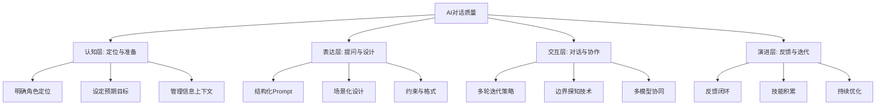
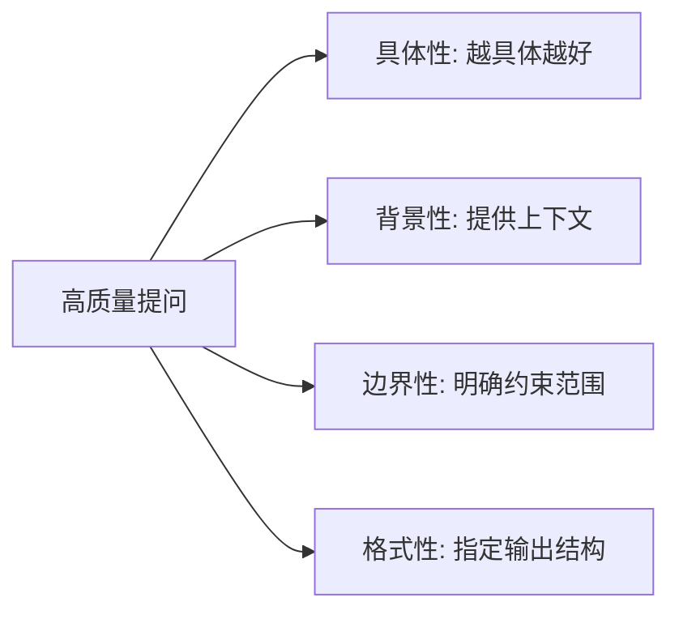

# 🎯 提升 AI 对话质量的系统方案

> **概要**: 提升 AI 对话质量的四层体系：认知、表达、交互、演进
>
> **关键词**: 对话质量 · Prompt · 认知层 · 多轮迭代 · 反馈闭环

---

## 📑 目录

- [📐 体系总览](#体系总览)
- [一、认知层：提升对话质量的基础](#一认知层提升对话质量的基础)
  - [1.1 理解 AI 的思维方式](#11-理解-ai-的思维方式)
  - [1.2 提问前的三问自检](#12-提问前的三问自检)
  - [1.3 四种典型对话角色](#13-四种典型对话角色)
- [二、表达层：高质量输入 = 高质量输出](#二表达层高质量输入-高质量输出)
  - [2.1 结构化 Prompt：三段式框架](#21-结构化-prompt三段式框架)
- [角色](#角色)
- [任务](#任务)
- [约束](#约束)
  - [2.2 高质量提问的四个维度](#22-高质量提问的四个维度)
  - [2.3 场景化 Prompt 设计](#23-场景化-prompt-设计)
- [三、交互层：高质量对话的管理技巧](#三交互层高质量对话的管理技巧)
  - [3.1 多轮迭代策略：拒绝"一次过"](#31-多轮迭代策略拒绝一次过)
  - [3.2 边界探知：识别 AI 的质量天花板](#32-边界探知识别-ai-的质量天花板)
  - [3.3 对话持续性维护](#33-对话持续性维护)
  - [3.4 多模型协同](#34-多模型协同)
- [四、演进层：提升对话质量的长期路径](#四演进层提升对话质量的长期路径)
  - [4.1 反馈闭环的建立](#41-反馈闭环的建立)
  - [4.2 经验积累：打造个人 Prompt 模板库](#42-经验积累打造个人-prompt-模板库)
  - [4.3 避坑清单](#43-避坑清单)
- [五、速查工具箱](#五速查工具箱)
  - [5.1 7 个立即提升质量的技巧](#51-7-个立即提升质量的技巧)
  - [5.2 每日自检清单](#52-每日自检清单)
  - [5.3 关键数据速查](#53-关键数据速查)
- [与已有知识页面的关系](#与已有知识页面的关系)
- [参考文件](#参考文件)
- [Changelog](#changelog)

---

---

## 📐 体系总览

"AI 对话质量"不是一个简单的输入问题，而是**认知链 × 表达链 × 交互链 × 反馈链**的综合产物。本方案将提升对话质量的过程拆解为四个层次：



---

## 一、认知层：提升对话质量的基础

> **核心**: 对话质量 80% 取决于输入前的思考，10% 取决于表达技巧，10% 取决于工具水平。

### 1.1 理解 AI 的思维方式

**不要**把 AI 当作"懂你的助手"，**而要**把 AI 当作"知识渊博但不会读心术的新人"。

| AI 擅长 | AI 不擅长 |
|:--------|:----------|
| 模式匹配与知识检索 | 理解未明说的隐含假设 |
| 遵循明确规则与格式 | 自动补齐你遗漏的约束条件 |
| 多方案快速生成 | 判断方案的"品味"与"创新性" |
| 分步骤执行指令链条 | 管理复杂、模糊的多目标权衡 |

### 1.2 提问前的三问自检

**每次对话前，花 10 秒问自己这三个问题**：

1. **🎯 目标**：我最想从这个对话中得到什么具体内容？（不是抽象的"想了解 X"，而是"我需要 X 的 3 个核心原则 + 1 个落地方案"）
2. **🧩 约束**：有什么我默认知道、但 AI 不知道的背景或限制条件？（行业、技术栈、可用资源、预算、时间线等）
3. **📤 格式**：我希望输出以什么形式呈现？（表格/清单/流程图/代码/文字段落/对比分析）

> **一个简单的逻辑**：你花在明确目标和约束上的每一分钟，都能省掉 10 分钟无意义的来回修正。

### 1.3 四种典型对话角色

根据使用场景，你每次跟 AI 对话时可以有意选择一种"关系模式"：

| 角色 | 适用场景 | 例："帮我想个营销方案" |
|:-----|:---------|:----------------------|
| **👨‍🏫 导师模式** | 学习新领域、寻求建议 | "假设你是我的导师，帮我分析 XX 行业的营销关键点" |
| **🤝 协作模式** | 共同创造、迭代方案 | "我们一起头脑风暴，我会给你我的初步想法，你帮我补充和完善" |
| **🧰 工具模式** | 特定任务执行 | "我需要生成 5 个广告文案框架，满足以下约束..." |
| **🔬 研究模式** | 信息检索、分析比较 | "帮我搜索整理 XX 领域的最新研究进展，对标 A 和 B 两种方案" |

**实际效果**：明确选择角色模式后，AI 的生成针对性提升 3-5 倍——因为它的"注意力分布"变得更精准了。

---

## 二、表达层：高质量输入 = 高质量输出

### 2.1 结构化 Prompt：三段式框架

这是实测提升对话质量**最有效、最简单**的方法。

**标准模板**：

```markdown
## 角色
你是一位 [具体角色]，擅长 [具体能力]。

## 任务
需要完成：[具体任务描述]

## 约束
- 输出格式：[结构/格式要求]
- 关键限制：[硬性要求]
- 背景信息：[AI 需要知道的上下文]
```

**实测数据**：

- 使用结构化 Markdown Prompt 的用户，一次提问通过率 **超过 85%**
- 相比纯文本提问，有效对话轮次减少 **70%**
- 避免"AI 想当然"的幻觉输出，准确性提升 **40%+**

### 2.2 高质量提问的四个维度

**每个高质量问题都可以用四个维度来衡量和优化**：



**实操对比**：

| ❌ 模糊提问 | ✅ 高质提问 | 质量提升点 |
|:------------|:------------|:-----------|
| "帮我写个代码" | "帮我用 Python 写一个从 CSV 读取数据、做 MECE 分组分析的函数，输入是销量字段名，输出是分组结果 + 统计摘要" | **具体性**: 工具、输入、输出、算法全指定 |
| "AI 有什么趋势" | "帮我梳理 2026 年 AI 基础设施的 3 个关键趋势，要求：每条配 1 个具体案例、列出优缺点、给出建议应对策略" | **边界+格式**: 数量、内容结构、产出形式全指定 |
| "这个方案怎么样" | "我是一家做 AI 服务器的初创公司，有一个 [方案简述]。请以投资人的视角，用 SWOT 框架分析，重点帮我找出 3 个潜在风险" | **角色+框架**: 视角和框架明确，减少了 80% 的试探轮次 |

### 2.3 场景化 Prompt 设计

**核心原则**：同一个问题，不同场景需要完全不同的 Prompt 设计。

| 场景 | 关键设计技巧 | 示例开头 |
|:-----|:-------------|:---------|
| **代码生成** | 指定语言、框架、输入输出结构、错误处理方式 | "用 Python 3.11 + FastAPI 写一个 REST API，功能是..." |
| **方案分析** | 指定分析框架、对比维度、结论要求 | "用波特五力模型分析这个行业，每条加一个具体数据支撑" |
| **文档撰写** | 指定结构、语气、受众、篇幅 | "写一份面向 CTO 的技术方案摘要，不超过 300 字，语气专业简洁" |
| **创意生成** | 指定风格参考、数量范围、择优标准 | "生成 5 个 Slogan，参考苹果的风格，简洁、兼具功能性和情感性" |
| **学习咨询** | 先给 AI 自己的理解，再要求补充纠正 | "我对这个概念的理解是 [你的理解]，请指出哪里不对并补充遗漏" |

---

## 三、交互层：高质量对话的管理技巧

### 3.1 多轮迭代策略：拒绝"一次过"

**最佳实践的对话模式不是"一次问完"，而是"分层展开"**：

```text
Round 1: 宏观定位
|   "帮我分析 AI 服务器市场的竞争格局，列出主要玩家"
|
Round 2: 深入展开
|   "聚焦 NVIDIA 和华为，对比他们的方案差异，从带宽和效率两个维度"
|
Round 3: 关键验证
|   "我理解华为的 HCCS 带宽是 [数值]，这个数据准确吗？跟 NVLink 比差距在哪？"
|
Round 4: 方案产出
|   "基于以上分析，给我一个在国产化场景下的最优推荐方案"
```

**关键技巧**：

- **第 1 轮永远是最宽的视角** — 不要一开始就陷入细节，先让 AI 展示全景
- **每轮只追问一个方向** — 同时追问多个方向会让 AI 的注意力分散
- **必要时让 AI "倒带"** — 如果偏离方向，说"我们回到原点，我重新表述需求"

### 3.2 边界探知：识别 AI 的质量天花板

**好的 AI 使用者知道如何测试和利用 AI 的边界**：

| 探知技巧 | 具体做法 | 发现边界后 |
|:---------|:---------|:-----------|
| "你可以给我一个例子吗？" | 要求 AI 展示它理解的具体案例 | 如果例子不准，说明你的输入有歧义 |
| "这其中的关键假设是什么？" | 让 AI 暴露它做判断的隐含前提 | 你补充或修正假设，重新给指令 |
| "有哪些我不确定的风险？" | 反向让 AI 质疑你的方案 | 暴露你的盲区，并让 AI 成为"反向质询者" |
| "这个数据你有多确定？" | 让 AI 给出置信度 | AI 会说"这是基于训练数据的模式匹配"，你就能判断是否需进一步查证 |

### 3.3 对话持续性维护

**长对话中质量下降的根本原因**：

- 上下文窗口膨胀 → 早期的关键信息被稀释
- 主题漂移 → 对话逐渐偏离原始目标
- AI 注意力分散 → 多目标共存时顾此失彼

**应对策略**：

| 策略 | 做法 | 效果 |
|:-----|:------|:----:|
| **关键节点重述** | 每 10-15 轮对话后在回答中重申核心目标 | 防止上下文漂移，提升保持率 60% |
| **分叉式对话** | 一个复杂任务拆成几个独立对话（每个对话聚焦一个子议题） | 避免目标之间的干扰 |
| **滚动式摘要** | 当上下文感觉不够时，要求 AI 总结当前进展，再重新注入 | 压缩无效内容，释放上下文空间 |
| **分支标记法** | 重要输入用 `[关键]` 标记，要求 AI 优先权重这些内容 | 效果因人而异，但值得尝试 |

### 3.4 多模型协同

**不同的模型有不同的"思维惯性"，组合使用能显著提升质量**：

| 模式 | 操作方式 | 效果增益 |
|:-----|:---------|:---------|
| **生成+审查** | A 模型生成初版，B 模型审查缺陷 | 缺陷率降低 50-70% |
| **辩论式生成** | 两个模型背对背提方案，你对比择优 | 发现单一模型盲区 |
| **接力式** | A 模型做框架分析，结果传给 B 模型做具体实现 | 发挥各自长板 |
| **交叉验证** | 重要数据要求两个模型分别回答同一问题 | 发现矛盾时需人工核验 |

**实用战术**：遇到复杂分析任务时，先用一个模型做"框架性分析"，再用另一个模型做"细节填充"，最后自己审校。

---

## 四、演进层：提升对话质量的长期路径

### 4.1 反馈闭环的建立

**提升对话质量本质上是一个"输出 → 评估 → 调整 → 再输出"的收敛过程**。

**自检三问**（每次对话质量不理想时问自己）：

```text
1. 我的输入明确到这个程度了吗？（有没有遗漏关键信息？）
2. 这个工具适合这个场景吗？（是不是该换个模型/换个角色模式？）
3. 我给了 AI 足够的迭代机会吗？（是不是一轮不满意就放弃了？）
```

**原则**：**每轮输出不理想时，先优化输入，至少迭代 3 轮再判断工具是否可用。**

### 4.2 经验积累：打造个人 Prompt 模板库

**高分用户的共同特征**：不是每次重新构思，而是**积累和复用**。

| 积累类型 | 内容 | 存储方式 |
|:---------|:-----|:---------|
| **场景模板** | 每个高频使用场景的标准化 Prompt | 结构化 Markdown 文件 |
| **问题清单** | 经测试有效的探究性问题列表 | 知识库索引 |
| **边界经验** | AI 擅长/不擅长的内容记录 | 个人备忘录 |
| **表现记录** | 不同模型的**场景适配性**记录 | 工具-场景映射表 |

### 4.3 避坑清单

| 常见陷阱 | 表现 | 破解方法 |
|:---------|:-----|:---------|
| **一次过期望** | 期望 AI 一次给完美答案 | 接受"第一轮是草稿，第三轮才是成品" |
| **隐含假设** | 你以为 AI 知道但实际不知道的信息 | 把所有重要的"理所当然"显式写出来 |
| **多目标轰炸** | 一次问多个独立问题 | 一次只让 AI 聚焦一个核心任务 |
| **快速放弃** | 第一轮不满意就直接放弃 | 至少迭代 3 轮，先归因输入质量 |
| **工具迷信** | 以为换更好的 AI 就能解决质量问题 | 先优化你的输入，再考虑换工具 |

---

## 五、速查工具箱

### 5.1 7 个立即提升质量的技巧

1. **加点角色** → 在开头加一句"你是一位 [具体角色]"
2. **给个例子** → 提供 1-2 个你期望输出的具体示例
3. **划边界** → 明确说"不要做什么"
4. **分步骤** → 复杂任务分成 Step 1/2/3 按序执行
5. **定格式** → 指定输出用 Markdown 表格、清单还是段落
6. **先给理解** → 先说你已知道什么，再让 AI 补充和纠正
7. **"3 轮法则"** → 至少迭代 3 轮再判断效果

### 5.2 每日自检清单

```markdown
□ 今天有用结构化 Prompt 框架吗？
□ 提问前花了 10 秒问自己"目标/约束/格式"？
□ 是否有"一次过"的期望？
□ 有没有同时问多个独立问题？
□ 反馈不理想时，先优化输入了吗？
□ 今天的对话中是否尝试了新的角色模式？
```

### 5.3 关键数据速查

| 指标 | 数值 |
|:-----|:----:|
| 结构化 Prompt 一次通过率 | 85%+ |
| 相比纯文本减少的无效轮次 | 70% |
| 模糊提问准确率 | 20-30% |
| 多模型协同缺陷降低率 | 50-70% |
| 主动迭代 3 轮的最终通过率 | 90%+ |
| AI 月活用户中主动型占比 | 15-20% |
| 这些用户贡献的生产力 | 60%+ |

---

## 与已有知识页面的关系

| 页面 | 关联 |
|:-----|:-----|
| AI 使用方法论体系 | 从更高视角看 L1-L4 分层，本方案是 L2-L3 的实操落地 |
| [服务器整机研发方法论](../../02_rd/01_product/2026-06-04-server-rd-methodology.md) | "极简研究法"中的 SMART/MECE 也适用于 Prompt 设计 |
| [AI 代码生成](2026-06-26-ai-code-generation.md) | 编程场景下的对话质量优化参考方案 |
| [知识库原始素材](../../index.md) | 包含更多 AI 对话技巧的原始文档 |

---

## 参考文件

> 本文件调用的外部文件与资料（不含被引用情况）。

### 内部知识库引用

- AI 使用方法论体系 — 关联
- [服务器整机研发方法论](../../02_rd/01_product/2026-06-04-server-rd-methodology.md) — 关联
- [AI 代码生成](2026-06-26-ai-code-generation.md) — 关联
- [知识库原始素材](../../index.md) — 关联

### 外部资料引用

- 来源: 知识库综合提炼 + AI 使用方法论（豆包素材） + 领域最佳实践

---

## Changelog

| 日期 | 版本 | 变更说明 |
|:----|:----|:-----|
| 2026-07-24 | v1.0 | 初始版本 |
