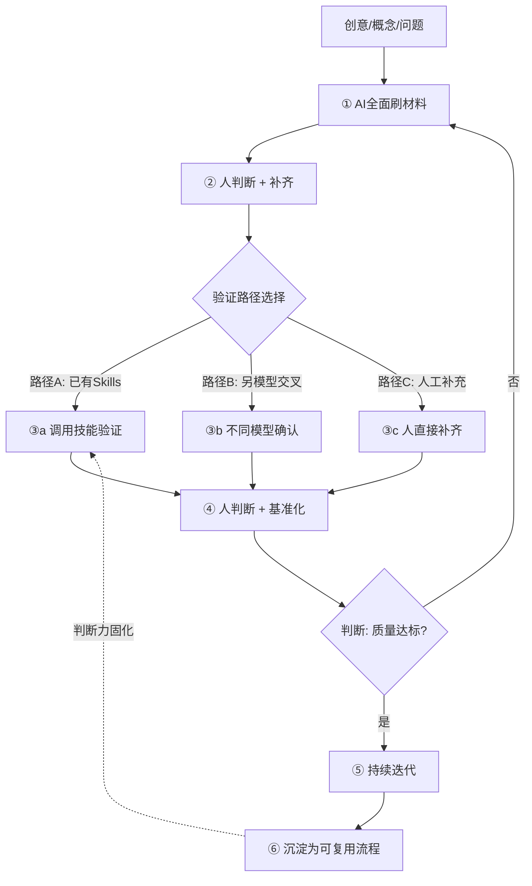
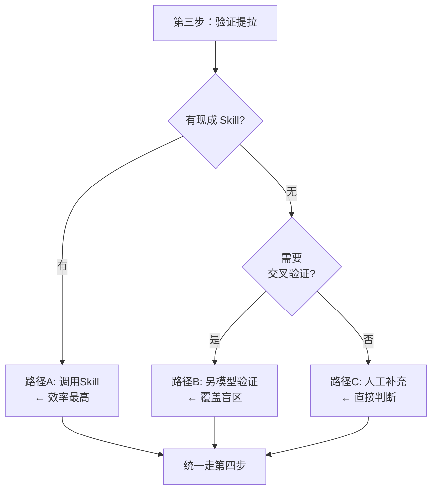

# 💰 AI 时代价值迁移：做趋于免费，判断决定价值

> **概要**: 阐述AI时代价值迁移规律：执行趋近免费、判断决定价值，给出判断力类型学、固化路径与人机协作工作流
>
> **关键词**: 价值迁移 · 判断力 · 执行免费 · 人机协作 · 判断力固化

---

## 📑 目录

- [§1 引言：一个正在发生的价格重组](#1-引言一个正在发生的价格重组)
  - [1.1 三个观察](#11-三个观察)
  - [1.2 共同特征](#12-共同特征)
  - [1.3 历史参照](#13-历史参照)
- [§2 第一性原理：为什么"做"在趋近免费](#2-第一性原理为什么做在趋近免费)
  - [2.1 AI 的经济学特征](#21-ai-的经济学特征)
  - [2.2 "做"的五个层次及各自的免费化速度](#22-做的五个层次及各自的免费化速度)
  - [2.3 一个关键的认知转换](#23-一个关键的认知转换)
- [§3 价值迁移的方向：执行 → 判断](#3-价值迁移的方向执行-判断)
  - [3.1 旧模式：你在执行链上](#31-旧模式你在执行链上)
  - [3.2 新模式：你在判断链上](#32-新模式你在判断链上)
  - [3.3 模式转换的信号](#33-模式转换的信号)
- [§4 判断力的类型学](#4-判断力的类型学)
  - [4.1 选择判断](#41-选择判断)
  - [4.2 质量判断](#42-质量判断)
  - [4.3 风险判断](#43-风险判断)
  - [4.4 取舍判断](#44-取舍判断)
  - [4.5 方向判断](#45-方向判断)
  - [4.6 判断力的金字塔结构](#46-判断力的金字塔结构)
- [§5 判断力固化：从"人做判断 AI 执行"到"AI 执行你的判断流程"](#5-判断力固化从人做判断-ai-执行到ai-执行你的判断流程)
  - [5.1 什么是"判断力固化"](#51-什么是判断力固化)
  - [5.2 固化路径：四个层次](#52-固化路径四个层次)
  - [5.3 本系统的实践案例](#53-本系统的实践案例)
  - [5.4 判断力固化的经济模型](#54-判断力固化的经济模型)
- [§6 新能力图谱：判断力需要什么支撑](#6-新能力图谱判断力需要什么支撑)
  - [6.1 判断力的来源](#61-判断力的来源)
  - [6.2 判断力需要的元能力](#62-判断力需要的元能力)
  - [6.3 判断力与 AI 的分工边界](#63-判断力与-ai-的分工边界)
- [§7 辩证分析：判断力的边界与陷阱](#7-辩证分析判断力的边界与陷阱)
  - [7.1 判断力退化风险](#71-判断力退化风险)
  - [7.2 判断力固化过度的风险](#72-判断力固化过度的风险)
  - [7.3 判断力外包的幻觉](#73-判断力外包的幻觉)
  - [7.4 判断力评估的困难](#74-判断力评估的困难)
  - [7.5 "做"变免费的隐含风险](#75-做变免费的隐含风险)
- [§8 实战工作流：创意驱动的人-AI协作迭代](#8-实战工作流创意驱动的人-ai协作迭代)
  - [8.1 整体流程](#81-整体流程)
  - [8.2 六步详解](#82-六步详解)
    - [第一步：AI 全面铺设材料](#第一步ai-全面铺设材料)
    - [第二步：人判断 + 补齐](#第二步人判断-补齐)
    - [第三步：验证提拉质量（三条路径，按优先级选）](#第三步验证提拉质量三条路径按优先级选)
    - [第四步：人判断 + 基准化](#第四步人判断-基准化)
    - [第五步：持续迭代](#第五步持续迭代)
    - [第六步（可选）：沉淀为可复用流程](#第六步可选沉淀为可复用流程)
  - [8.3 各阶段的人机分工明细](#83-各阶段的人机分工明细)
  - [8.4 三种典型场景的应用](#84-三种典型场景的应用)
    - [场景一：写一份技术分析报告](#场景一写一份技术分析报告)
    - [场景二：验证一个技术 Idea](#场景二验证一个技术-idea)
    - [场景三：调研竞争动态](#场景三调研竞争动态)
  - [8.5 关键原则](#85-关键原则)
- [§9 总结](#9-总结)
  - [9.1 核心论点的逻辑链条](#91-核心论点的逻辑链条)
  - [9.2 五条操作原则](#92-五条操作原则)
  - [9.3 一句话说清楚](#93-一句话说清楚)
- [🔗 知识库关联](#知识库关联)
- [参考文件](#参考文件)
- [Changelog](#changelog)

---

## §1 引言：一个正在发生的价格重组

### 1.1 三个观察

**观察一：AI 编程工具的扩散**

2023-2026 年，从 GitHub Copilot 到 Cursor 到 Codex，AI 写代码的能力从"能写简单函数"进化到"能完整实现中等复杂度的功能模块"。一个原本需要 3 天完成的编码任务，现在可能 30 分钟就完成初稿。**代码的边际成本在骤降**。

**观察二：AI 内容生成的普及**

文案、配图、排版、翻译、摘要、报表、PPT 初稿——这些曾经需要专业技能或大量时间的执行性工作，现在 AI 可以在秒级完成。质量不一定完美，但"一个大致的可用版本"已经近乎免费。

**观察三：AI 研究辅助的深化**

文献检索、代码实现、实验数据分析、论文润色——这些科研中的执行环节，AI 的参与度在指数级增长。

### 1.2 共同特征

这三个观察的共同特征不是"AI 变强了"，而是：

> **AI 正在把"从想法到产物"的执行成本压缩到接近零。**

这不是渐进变化——这是一个经济结构性的价格重组。当一个生产要素的价格从"较贵"骤降到"近乎免费"，整个价值分配格局会被重写。

### 1.3 历史参照

| 历史事件 | 什么变免费了 | 什么变得更有价值 |
|:---------|:------------|:----------------|
| 印刷术普及 | 抄写成本 | 写作质量·内容选择·编辑判断 |
| 搜索引擎兴起 | 信息获取成本 | 信息筛选·可信度判断·知识整合 |
| 云计算普及 | 服务器运维成本 | 架构设计·成本优化·系统判断 |
| **AI 时代** | **执行成本** | **判断成本** |

每一次"某件事变免费"的历史，都对应着"某类判断变贵"的迁移。AI 时代的独特之处在于——变免费的是"从指令到产物的全链条执行"，而变贵的是"发出正确指令所需的判断力"。

---

## §2 第一性原理：为什么"做"在趋近免费

### 2.1 AI 的经济学特征

传统知识工作的成本结构：

```text
总成本 = 理解成本 + 执行成本 + 验证成本
               v          v           v
          人的认知     人的劳动     人的判断
```

AI 介入后：

```text
总成本 = 理解成本 + 执行成本 + 验证成本
               v          v           v
          人的认知     近零       人的判断
                (AI 代劳)       (仍须人把关)
```

**核心机制**: AI 是"可复制劳动力"。一份模型训练完成后，服务的边际成本只有推理算力——而推理成本正以每年 3-5 倍的速度下降。

### 2.2 "做"的五个层次及各自的免费化速度

| 层次 | 举例 | 免费化速度 | 当前状况 |
|:-----|:-----|:----------:|:---------|
| **L1 机械执行** | 复制粘贴·格式整理·批量计算 | 已免费 | 2018+ 的 RPA/脚本 |
| **L2 模式化创作** | 写邮件·写文案·写简单代码 | 基本免费 | 2023-2025 的大模型 |
| **L3 结构化分析** | 数据汇总·文献综述·对比分析 | 快速免费 | 2025-2026 的 Agent |
| **L4 复杂推理** | 调试·根因分析·方案设计 | 半免费中 | 2026+ 推理增强模型 |
| **L5 判断决策** | 方向选择·取舍权衡·风险判断 | 仍昂贵 | **人类核心价值区** |

趋势很清晰：免费化从 L1 向上蔓延。**L5 是人类最后的堡垒，也是最高价值区**。

### 2.3 一个关键的认知转换

> **不要问"AI 能不能做这件事"——未来几乎所有执行性的事它都能做。**
>
> 要问的是：**"我的判断力应该聚焦在哪里，才能让 AI 执行出最大价值？"**

这个转换的本质是把 AI 从"对手/竞争者"重新定位为"你的执行基础设施"。就像你不会和云服务器比计算速度——你只需决定"要算什么，为什么算，结果怎么用"。

---

## §3 价值迁移的方向：执行 → 判断

### 3.1 旧模式：你在执行链上

```text
旧分工：
  你(判断 + 执行 + 验证) -> 产物
      |           |        |
   价值高      价值中    价值中

-> 你的总产出 = 你的判断力 × 你的执行力
```

### 3.2 新模式：你在判断链上

```text
新分工：
  你(判断方向 + 判断质量 + 判断风险) -> AI(执行) -> 你(终验)
      |                               |           |
   价值高                           成本趋零    价值中

-> 你的总产出 = 你的判断力 × (近乎无限的 AI 执行力)
```

### 3.3 模式转换的信号

以下信号表明你还在"执行模式"：

| 旧模式的信号 | 对应"判断模式"的做法 |
|:------------|:-------------------|
| "帮我写一段代码实现 X" | "这个功能应该用什么架构？关键约束是什么？验收标准是什么？代码让 AI 写" |
| "帮我分析一下这个数据" | "这个分析应该从哪些维度切入？每维度的可信度边界在哪？数据清洗策略怎么定？" |
| "帮我把这个文档翻译成英文" | "这个文档的目标读者是谁？专业术语的对应关系怎么确立？翻译风格偏正式还是技术直译？" |
| "帮我画一张架构图" | "这张图要传达什么信息？观众是谁？信息层次怎么分？让 AI 出初稿你来迭代" |

**核心判据**: 你的输入是否从"我要产物"变成了"我要判断标准"。

---

## §4 判断力的类型学

### 4.1 选择判断

> 在多个可行选项中做出选择——这是最基础、最频繁的判断类型。

| 场景 | 判断内容 | AI 能做什么 | 人必须做什么 |
|:-----|:---------|:-----------|:------------|
| 架构选型 | 用方案 A 还是 B | 列出优缺点+数据对比 | 决定权重·判断隐性成本·考虑组织因素 |
| 技术栈选择 | Go 还是 Rust | 功能对比+生态分析 | 判断团队能力·长期维护成本·业务匹配度 |
| 设计取舍 | 性能优先还是扩展优先 | 模拟不同方案的表现 | 判断业务阶段·风险承受度 |

**关键能力**: 在信息不完备时做出选择的能力。

### 4.2 质量判断

> 判断一个产出的质量是否达到可用标准——这是最容易被忽视但最关键的判断类型。

| 场景 | 判断内容 | 常见错误 |
|:-----|:---------|:---------|
| AI 代码审查 | 这段 AI 生成的代码能上线吗？ | 盲目信任·没发现边界条件缺失 |
| AI 分析审查 | 这个分析结论有数据支撑吗？ | 被"逻辑自洽"欺骗，没看出假设错误 |
| AI 文档审查 | 这份文档在技术上是准确的吗？ | 被"看起来专业"迷惑，没发现技术错误 |

**关键能力**: 区分"看起来对"和"真的对"。

### 4.3 风险判断

> 判断一个决策可能带来的负面后果——这是最体现经验价值的判断类型。

| 风险类型 | 判断内容 | AI 的盲区 |
|:---------|:---------|:----------|
| 技术风险 | 这个设计在极端条件下会失败吗？ | 没有实际经验·无法感知"意外的角落" |
| 交付风险 | 这个时间表是否切合实际？ | 不了解团队真实速率·无法识别隐性依赖 |
| 采用风险 | 这个方案会被团队接受吗？ | 不了解组织政治·不理解人的因素 |

**关键能力**: 从类似情况中提取模式的能力。

### 4.4 取舍判断

> 在多个不可兼得的目标之间做出权衡——这是高阶判断力的标志。

```text
取舍判断的典型结构：
  维度 A(如性能)  <-->  维度 B(如可维护性)
         不可兼得

  你的任务：判断在当前约束下，落在这个光谱的哪个位置最优
```

| 取舍类型 | 典型场景 | 判断依据 |
|:---------|:---------|:---------|
| 质量 vs 速度 | 要不要为了赶工期牺牲代码质量？ | 项目阶段·业务压力·返工成本 |
| 通用 vs 专用 | 通用方案还是定制方案？ | 复用概率·维护成本·功能密度 |
| 现成 vs 自研 | 用开源方案还是自建？ | 控制力需求·定制深度·长期路线 |

**关键能力**: 理解"每个选择都有一个隐形的价格标签"——而且价格不会消失，只会转移。

### 4.5 方向判断

> 判断"往哪个方向走"——这是最高层级的判断，是战略而非战术。

- **研究方向的判断**: 这个技术方向 3 年后还有价值吗？
- **产品方向判断**: 用户真正需要的是什么？现在做还是等？
- **投资方向判断**: 哪些技术值得投入？哪些是泡沫？
- **团队方向判断**: 现在的团队结构能支撑未来的目标吗？

**关键能力**: 在噪声中识别趋势信号的能力。

### 4.6 判断力的金字塔结构

```text
        ^ 价值高 / 频率低
       ╱╲
      ╱  ╲         §4.5 方向判断
     ╱    ╲        (往哪走)
    ╱------╲
   ╱  取舍   ╲     §4.4 取舍判断
  ╱   判断    ╲    (选什么)
 ╱--------------╲
╱ 风 质 选        ╲  §4.1-4.3
╱ 险 量 择        ╲  基础判断力
╱-----------------╲
▏ 执 行 能 力  (AI)   ▏ <- 近乎免费
╲-----------------╱
     ^ 价值低 / 频率高
```

**关键规律**:

- 金字塔越往下，AI 替代得越快
- 金字塔越往上，判断力越依赖实践经验而非知识积累
- 你的价值所在 = 你能在金字塔的哪一层做有效判断

---

## §5 判断力固化：从"人做判断 AI 执行"到"AI 执行你的判断流程"

### 5.1 什么是"判断力固化"

"判断力固化"是本框架的核心操作——不是让 AI 替你判断，而是：

> **把你积累的判断标准、决策框架、质量门控、取舍原则，编码成 AI 能理解、能执行的规则和流程。**

这是从"使用 AI"到"驾驭 AI"的质变。

### 5.2 固化路径：四个层次

```text
L1: 纯人工判断                 你：执行 + 判断
                               v
L2: AI 执行 + 人工判断         你：判断 -> AI：执行
                               v
L3: AI 执行 + 固化判断流程     你：制定规则 -> AI：执行 + 部分判断
                               v
L4: AI 持续执行 + 判断反馈      你：定义质量 -> AI：执行+判断 -> 你：异常反馈
```

**关键的跃迁点是 L2 → L3**：

| 维度 | L2（常见水平） | L3（高手水平） |
|:-----|:--------------|:--------------|
| **你做的事** | 每个任务做一次判断 | 把判断标准写成可复用的规则 |
| **AI 做的事** | 按指令执行 | 按规则执行 + 按规则自检 |
| **可扩展性** | 线性：多做一件事多花一份判断时间 | 指数：一次固化 → 无限次复用 |
| **典型技术** | Prompt 工程 | Skill 系统·约束体系·流水线 |

### 5.3 本系统的实践案例

**案例一：Skill 系统 = 判断力固化**

```text
原始场景：用户说"分析一下这个竞品"
 - L2 做法：每次都判断 "我应该从哪些维度分析？什么框架？"
 - L3 做法：把分析框架固化成 SKILL.md
   -> 维度：市场定位/技术架构/性能指标/生态策略/路线图
   -> 标准：每维度必须含数据+来源+时间戳
   -> 门控：输出前自动做逻辑谬误检测

-> 效果：每次分析都产出一致质量，不会因为"今天的我状态不好"而波动
```

**案例二：约束体系 = 判断标准编码**

```text
原始场景：让 AI 写一个技术文档
 - L2 做法：每个文档开头加 "注意不要堆砌名词、数据要标来源、格式要规范"
 - L3 做法：把标准编码为 RULE.md + AGENT.md + 约束验证脚本
   -> "输出前自检"成为自动触发行为
   -> "断言有出处"成为不可忽略的标准

-> 效果：AI 的长期行为稳定性提升，不再依赖每轮输入的提醒
```

**案例三：流水线编排 = 判断流程自动化**

```text
原始场景：做一个深度技术分析
 - L2 做法：告诉 AI "做深度分析" -> 看结果 -> 不满意 -> 重做
 - L3 做法：编排为 pipeline（输入QA -> 多路并行 -> 汇聚 -> 验证 -> 专家终审）
   -> 每一步的"判断标准"提前固化好
   -> AI 自动执行大部分检查，只在关键节点等你

-> 效果：产出质量从"看运气"变为"看流程"
```

### 5.4 判断力固化的经济模型

```text
不固化（L2）：
  产出质量 = f(你的时间投入)
  -> 可扩展性差，你的时间是上限

固化（L3+）：
  产出质量 = f(规则质量) × AI 执行次数
  -> 可扩展性好，你的判断力被线性放大
```

**衡量指标**：

| 指标 | L2 水平 | L3+ 水平 |
|:-----|:-------:|:--------:|
| 一次规则制定影响多少次执行 | 1 | 100+ |
| 产出一致性 | 波动大（取决于状态）| 稳定（取决于规则） |
| 新任务启动成本 | 每次都高 | 规则复用后降低 |
| 团队中复制能力 | 无法复制（只有你知道）| 可复制（编码为文档/规则/脚本）|

---

## §6 新能力图谱：判断力需要什么支撑

### 6.1 判断力的来源

```text
判断力 ≠ 知识量
判断力 = 知识 × 经验 × 反馈闭环
               ^
          大部分知识本身已可通过 AI 获取
```

| 判断力来源 | 获取方式 | AI 能否替代 |
|:-----------|:---------|:-----------:|
| **领域知识** | 读书·文档·实践 | 可替代（AI 知识面更广）|
| **实践经验** | 亲身经历·失败总结 | 不可替代（AI 无真实经验）|
| **反馈闭环** | 结果→复盘→修正 | 半替代（AI 可以辅助分析反馈）|
| **直觉/体感** | 长期实践形成的模式匹配 | 不可替代 |

**判断力建设的核心**：不是大量输入知识（这部分 AI 已经比你强），而是**积累实践经验 + 闭环反馈**。

### 6.2 判断力需要的元能力

| 元能力 | 说明 | 训练方法 |
|:-------|:-----|:---------|
| **结构化思维** | 能把复杂问题拆成可判断的维度 | 写分析框架·画决策树 |
| **批判性思维** | 能识别"看起来对但不对"的结论 | 自检逻辑谬误·多源验证 |
| **抽象化能力** | 能从具体案例中提取通用模式 | 做类比分析·写方法论文档 |
| **风险感知** | 能在信息不完备时判断风险 | 做预演(Pre-mortem)·写风险清单 |
| **取舍意识** | 能接受"没有完美方案"的客观现实 | 做决策矩阵·量化权衡 |

### 6.3 判断力与 AI 的分工边界

```text
AI 擅长：                人擅长：
- 知识检索与综合         - 在知识矛盾时做判断
- 模式识别               - 识别新模式（没见过就不知道）
- 一致性执行             - 在异常情况下灵活变通
- 大规模信息处理         - 从少量信息中提取信号
- 无偏见的分析           - 承担决策的责任
```

**分工原则**：

> **让 AI 做"从数据到结论"的执行，让人做"从价值到选择"的判断。**

AI 可以告诉你"方案 A 比方案 B 快 20% 但贵 30%"，但"值不值得用 30% 的成本换 20% 的性能"——这是人的判断。

---

## §7 辩证分析：判断力的边界与陷阱

### 7.1 判断力退化风险

```text
风险：当"做"越来越免费，人的执行肌肉会萎缩。
问题：执行能力是判断力的一部分——你不会执行就很难判断执行质量。
```

**举例**：

- 完全依赖 AI 写代码的程序员，3 年后可能失去评估 AI 代码质量的能力
- 完全依赖 AI 做分析的工程师，可能失去"数据不对劲"的直觉

**对策**：保留"核心判断的亲手执行"——不能外包你不理解的东西。

### 7.2 判断力固化过度的风险

```text
风险：把判断规则固化的太死，失去了灵活应变的能力。
问题：现实世界总有规则覆盖不了的边缘情况。
```

> **固化的边界条件**：只固化那些"你可以预见的、高频出现的判断"。低频、高不确定性的判断，保持手动模式。

### 7.3 判断力外包的幻觉

```text
幻觉："AI 能做判断了，我不需要判断力了"
真相：AI 的"判断"是在已有框架内的模式匹配，真正的判断是框架设计本身。
```

AI 可以帮你判断"这个 Bug 的根因是什么"——但你得先判断"这个 Bug 值不值得花时间修"。

### 7.4 判断力评估的困难

好的判断力很难被直接衡量。常见的替代指标——"资历""经验""直觉"——都是模糊且不可靠的。

**评估判断力的替代方案**：

- 查看决策记录（过去的关键决策对不对？）
- 查看异常处理方式（遇到没遇到过的情况怎么应对？）
- 查看知识固化程度（有没有把自己的判断标准写成可复用的规则？）

### 7.5 "做"变免费的隐含风险

| 风险 | 表现 | 对策 |
|:-----|:------|:-----|
| **决策通胀** | 因为执行成本低，所以做更多的决策——很多本不需要做 | 先问"这个决策有收益吗？" |
| **执行污染** | AI 产出太多，淹没了真正的判断信号 | 建立质量门控，不是所有输出都值得看 |
| **责任漂移** | "AI 做的"变成推卸责任的借口 | 坚持"人始终是最终负责任的主体" |
| **能力空洞** | 团队整体执行能力下降，判断失去根基 | 保留核心环节的人肉操作训练 |

---

## §8 实战工作流：创意驱动的人-AI协作迭代

> **核心模式**: 创意/概念/问题启动 → AI全面铺设 → 人判断+补齐 → 验证提拉 → 人判断+基准化 → 持续迭代

这是将本章全部理论（判断力迁移+判断力固化）落地为**可执行的协作循环**。它不是单次交互，而是一个**有节奏的六步迭代流水线**。

### 8.1 整体流程



### 8.2 六步详解

#### 第一步：AI 全面铺设材料

> **目标**: 在最短时间内覆盖"已知范围"，为人的判断提供完整信息基底

| 维度 | 做法 | 常见错误 |
|:-----|:------|:---------|
| **广度优先** | 让 AI 先铺全貌，不要过早聚焦 | 直接要求"详细分析某子问题"——错失全景 |
| **材料收集** | 搜索+原文+数据+已有知识库检索 | 只依赖 AI 内部知识，不拉外部实时数据 |
| **结构化输出** | 要求 AI 按框架输出（MECE·对比表·时间线·分类树） | 让 AI 自由发挥——后续判断成本飙升 |
| **标明不确定性** | 要求 AI 标注"哪些是事实、哪些是推测" | 全盘接受 AI 输出，把推测当结论 |

**典型案例**：

```text
输入：帮我分析一下 CXL 3.0 的延迟特性

✓ 好做法：
  1. 先让 AI 收集 CXL 3.0 的所有公开延迟数据（官方 + 论文 + 博客）
  2. 按路径分类（CXL.io / .mem / .cache）
  3. 标注每项数据的来源和时间

✗ 差做法：
  直接问"CXL 3.0 延迟是多少？"——可能得到一个笼统甚至错误的数字
```

#### 第二步：人判断 + 补齐

> **目标**: 在 AI 铺设的基础上，人做三件事——判断可信度、识别盲区、补充经验

**人要做的事**：

| 判断维度 | 具体问题 | 典型发现 |
|:---------|:---------|:---------|
| **源可信度** | 这些数据来源可靠吗？时效性够吗？ | AI 可能引用过时数据或非权威来源 |
| **覆盖完整性** | AI 铺设的维度是否覆盖了关键问题？ | 某些专业维度 AI 根本不知道"需要查" |
| **逻辑一致性** | 这些结论之间矛盾吗？ | AI 可能把矛盾信息并列而不察觉 |
| **经验修正** | 以你的经验，哪些数据偏离实际？ | 工艺偏差、实际部署与理论的差距 |
| **盲区识别** | 哪些问题 AI 完全没覆盖到？ | 特定领域的隐性知识 AI 不掌握 |

**补齐方式**：

- 直接补充知识（告诉 AI 你没覆盖到的部分）
- 或者重定向 AI 搜索方向（"再查一下 X 方面的数据"）
- 或者自己补充关键缺失

**关键原则**：
> **人不是来审核 AI 的每一句输出——人是来找 AI 没看到的东西。**
>
> 如果在第二步你做的事和 AI 一样（逐行审核），说明第一铺得不对。

#### 第三步：验证提拉质量（三条路径，按优先级选）

---

**路径 A（优先）→ 调用已有 Skill 验证**

当系统中已有相应的判断力固化产物时，直接复用：

```text
✓ 场景示例：
  框架分析 -> 调用 MECE 分析 Skill
  文档审查 -> 调用 逻辑谬误检测 Skill
  竞品分析 -> 调用 竞品分析 Skill (服务器)
  数据查询 -> 调用 data-query Skill
  文献调研 -> 调用 light-literature-search Skill

效果：固化在 Skill 中的判断标准自动生效
     -> 质量门控、维度检查、格式规范自动执行
     -> 不需要人重复做"质量检查"的判断
```

这是**判断力固化（§5）的直接落地**——你把过去做判断的标准编进了 Skill，现在每次调用都自动应用。

---

**路径 B → 用另一个模型或工具做交叉验证**

当没有现成 Skill 时，利用不同模型的能力差异做三角验证：

| 验证类型 | 做法 | 发现能力 |
|:---------|:------|:---------|
| **跨模型验证** | 把输出给另一模型审查 | 不同训练数据→覆盖不同盲区 |
| **分角色验证** | 让 AI 扮演"苛刻审稿人"审查自己的输出 | 发现逻辑漏洞和过度自信 |
| **极值检验** | 让 AI 模拟"极端条件下结论是否仍然成立" | 发现边界条件缺失 |
| **反向论证** | 让 AI 给出反方观点 | 发现被忽略的负面因素 |

**为什么有效**：不同 AI 模型的训练数据、推理路径、偏见方向不同——一个模型漏掉的东西，另一个可能看到。

---

**路径 C → 人直接补齐/使用专业工具**

当 AI 的能力边界不足以胜任验证时：

- 用专业工具（仿真器·计算器·统计分析软件）做量化验证
- 人基于经验直接判断和补全
- 跨领域专家评审

---

**路径选择原则**：



#### 第四步：人判断 + 基准化

> **目标**: 在验证提拉后的材料上，人做最终的质量判断，并把"可接受的版本"设为基线

**判断内容**：

| 判断 | 通过标准 |
|:-----|:---------|
| 事实准确性 | 所有断言有出处，数据可验证 |
| 逻辑完备性 | 结论由推理链导出，无跳跃 |
| 覆盖充分性 | 没有已知的关键维度被遗漏 |
| 可用性判断 | 这个产出的质量达到"能用"标准了吗？ |

**基准化**：把当前版本设定为 v1.0 基线

```text
基准化意味着：
  1. 记录下当前版本的状态（版本号 + 时间戳）
  2. 明确"这个版本好在哪、缺在哪"
  3. 后续迭代以这个基线为参考点
  4. 不反复回到起点，而是在基线之上做增量改进

核心规律：没有基线就没有迭代——你只是在随机游走。
```

#### 第五步：持续迭代

> **目标**: 在基线上做有针对性的增量改进，不推翻重来

**迭代结构**：

```text
v1.0 (基准) -> 识别改进点 -> 定向改进 -> v1.1 -> 再次判断 -> ...

迭代的三种模式：
1. 广度迭代：补全遗漏的维度（"再查一下 X 方面"）
2. 深度迭代：在某维度上挖更深（"第3点还不够，找更多数据支撑"）
3. 质量迭代：打磨表述、精炼论证、强化对比
```

**迭代终止条件**（避免无限循环）：

```text
☑ 迭代前与用户明确："做到什么程度算好？"
☑ 或设定：最多 3 轮迭代，第 3 轮后无论好坏先出结果
☑ 或按场景：内部文档->基本准确即可；对外交付->严格标准
```

#### 第六步（可选）：沉淀为可复用流程

> **目标**: 把本次协作中产生的有效判断标准，固化为系统中可复用的Skill/规则/模板

这是**从 L2 跃迁到 L3 的关键一步（参见 §5.2）**：

```text
问自己三个问题：
  1. 这个过程中，我做了哪些相同的判断？
  2. 这些判断标准能不能写成可复用的规则？
  3. 如果类似问题再来一次，AI 能不能自动完成更多步骤？

如果是 -> 固化为 Skill（参见 §5.3）
如果否 -> 本次就是一次性工作流，不必过度工程
```

### 8.3 各阶段的人机分工明细

| 阶段 | AI 角色 | 人角色 | 产出 |
|:-----|:--------|:-------|:-----|
| ① 铺设 | 广度搜索·结构化呈现·不确定性标注 | 定义问题边界·设定输出框架 | 材料基底 |
| ② 判断+补齐 | （等待） | 源可信度·覆盖盲区·经验修正 | 修正后的基底 |
| ③ 验证提拉 | 自检·交叉验证·极值测试 | 选择验证策略·判断验证结果 | 提升后的产物 |
| ④ 判断+基准化 | （等待） | 最终质量门控·设定基线 | v1.0 基线 |
| ⑤ 迭代 | 定向改进·对比基线 | 识别改进点·终止条件判断 | v1.x 版本 |
| ⑥ 沉淀 | 辅助提取模式 | 判断是否值得固化·制定规则 | Skill/模板/规则 |

### 8.4 三种典型场景的应用

#### 场景一：写一份技术分析报告

```text
① 铺设：AI搜索并整理所有相关技术资料，按MECE框架分维度输出
② 判断：人发现 AI 遗漏了某个关键竞品信息 -> 补齐方向
③ 验证：调用深度技术分析Skill -> 自动检查深度不足
④ 判断：人阅读后认为逻辑框架OK，但某节数据不够 -> 基准化v1
⑤ 迭代：定向补数据 -> v1.1 -> 再次审阅 -> v1.2（最终版）
⑥ 沉淀：若这个分析框架可复用 -> 编为知识文档 + 分析模板
```

#### 场景二：验证一个技术 Idea

```text
① 铺设：AI搜索该领域的相关工作、已有方案、技术限制
② 判断：人发现 AI 没找到某个关键背景 -> 补齐
③ 验证：调用另一模型做"严格审稿人"审查 -> 发现逻辑漏洞
④ 判断：人决定方向可行但需要修改方法 -> 基准化当前状态
⑤ 迭代：基于漏洞信息优化 idea -> 再次验证 -> 确认可行
⑥ 沉淀：将验证标准（什么算可行、什么条件止步）写进知识库
```

#### 场景三：调研竞争动态

```text
① 铺设：AI搜索所有公开竞品信息，按时间线整理
② 判断：人判断某个信息来源不可靠 -> 提醒 AI 降权
③ 验证：调用竞品分析Skill（服务器）-> 按标准维度自动审查
④ 判断：人判断分析深度够 -> 基准化为本周竞品报告
⑤ 迭代：下周增量更新 -> 关注特定竞品的新动态
⑥ 沉淀：将"竞品跟踪维度"固化为定期周报模板
```

### 8.5 关键原则

| 原则 | 说明 | 违背时的后果 |
|:-----|:------|:-----------|
| **先广度后深度** | 第一步铺全貌，之后才聚焦 | 早早深挖一个方向，错过更好的方向 |
| **人不要做AI擅长的事** | 逐行审核AI输出 = 浪费人类判断力 | 你用宝贵时间做了AI能做的事 |
| **验证路径选最快的** | 有Skill用Skill → 没有就交叉验证 → 再不行才人补 | 选了费力路径，迭代效率下降 |
| **没有基线就没有迭代** | 必须有一个"v1.0基准" | 每次改动都不知道在什么基础上改 |
| **不是所有工作流都需要⑥** | 一次性任务不必固化 | 过度工程浪费判断力 |
| **一轮比一轮窄** | 迭代范围应该递减，不是递增 | 越迭代范围越大 → 永远完不了 |

---

## §9 总结

### 9.1 核心论点的逻辑链条

```text
1. AI 让"执行"的边际成本趋近于零  <- 不可逆趋势
   v
2. 价值从执行端转移到判断端      <- 经济规律决定
   v
3. 个人策略：从执行侧迁到判断侧    <- 适应策略
   v
4. 高阶策略：把判断力固化成流程     <- 放大效应
   v
5. AI 执行你的判断流程            <- 自动化形态
   v
6. 你的时间聚焦于：                   <- 最终状态
   ① 更高阶的判断（方向/取舍）
   ② 判断流程的优化迭代
   ③ 异常情况的例外处理
```

### 9.2 五条操作原则

1. **问"判断什么"不问"做什么"** — 每次与 AI 协作前，先想清楚你的判断点在哪
2. **把判断标准写下来** — 不做重复判断，一次思考多次复用
3. **保留核心执行能力** — 不能外包你不理解的东西
4. **判断质量比执行速度更重要** — 执行可以快，判断错了方向快也没用
5. **接受判断力的边界** — 有些判断只能靠经验和直觉，不是所有东西都能固化

### 9.3 一句话说清楚

> **AI 时代，你的价值 = 你的判断力 × 你把判断力固化为流程的能力。**

执行已经近乎免费了。真正稀缺的、值得收费的，是你知道"什么该做、做到什么程度、什么时候不做"——**这是判断力的全部**。

---

## 🔗 知识库关联

```text
本文涉及的其他知识页面：

- [信息的深度认知如何提升AI使用效能](../../07_industry-research/18_methodology-framework/2026-07-20-information-depth-ai-mastery.md)
  — §6 判断力的元能力中"结构化思维/批判性思维"的信息论基础

- [信息加工分析](../../07_industry-research/18_methodology-framework/2026-07-20-information-processing-analysis.md)
  — §5 判断力固化的设计原则中"加工目的不混淆"的理论源

- [对象系统分析框架](../../07_industry-research/18_methodology-framework/2026-07-20-object-system-analysis-framework.md)
  — §5.3 Skill 系统的架构设计基础

- [Git提交模式与工程质量](../../07_industry-research/18_methodology-framework/2026-07-20-git-commit-quality-analysis.md)
  — §8.4 开源库选型的判断力应用场景

- [强逻辑的特征与谬误检测](../../07_industry-research/18_methodology-framework/2026-07-20-strong-logic-fallacy-detection.md)
  — §4.2 质量判断的检测工具

- [信息传递失真分析](../../07_industry-research/18_methodology-framework/2026-07-20-information-transmission-distortion.md)
  — §4.3 风险判断中"AI输出的失真识别"的理论源

- [约束管理与失效模式](../methodology/约束管理与失效模式.md)
  — §5.3 约束体系作为判断力编码的方法论基础
```

---

> **修订记录**
>
> | 日期 | 版本 | 变更 |
> |:-----|:----|:------|
> | 2026-07-20 | v1.0 | 创建：核心论点·判断力类型学·固化路径·新能力图谱·辩证分析·总结 |
> | 2026-07-20 | v1.1 | 新增 §8 实战工作流：六步迭代模式（创意启动→AI铺设→人判断→验证提拉→基准化→迭代→沉淀）+三种验证路径（Skill/交叉/人工）+三种场景应用+人机分工明细+关键原则 |

---

## 参考文件

> 本文件调用的外部文件与资料（不含被引用情况）。

### 内部知识库引用

- [信息的深度认知如何提升AI使用效能](../../07_industry-research/18_methodology-framework/2026-07-20-information-depth-ai-mastery.md) — 信息认知维度的互补框架
- AI使用技巧与方法论导读 — 更多AI使用原则索引
- [对象系统分析框架](../../07_industry-research/18_methodology-framework/2026-07-20-object-system-analysis-framework.md) — 本论点中"固化流程→AI执行"环节的系统架构支撑

### 外部资料引用

- (无)

---

## Changelog

| 日期 | 版本 | 变更说明 |
|:----|:----|:-----|
| 2026-07-24 | v1.0 | 初始版本 |
