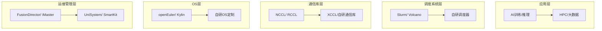

# 国内头部服务器厂商核心软件层布局对比

> **概要**: 国内头部服务器厂商核心软件层布局对比，从调度/通信库/OS/运维四层判断转型深度
>
> **关键词**: 服务器厂商 · 软件层 · 调度系统 · 通信库 · 运维管理

---

## 📑 目录

- [一、概述](#一概述)
- [二、四层框架总览](#二四层框架总览)
- [三、调度系统层](#三调度系统层)
- [四、通信库层](#四通信库层)
- [五、操作系统层](#五操作系统层)
- [六、运维管理软件层](#六运维管理软件层)
- [七、综合对比矩阵](#七综合对比矩阵)
- [八、与已有知识框架对接](#八与已有知识框架对接)
- [八、标准与信息来源](#八标准与信息来源)
- [参考文件](#参考文件)
- [Changelog](#changelog)

---

## 一、概述

对比五家国内头部服务器厂商在核心软件层的自主布局，判断各厂商从OEM/ODM向"软硬一体解决方案提供商"转型的深度。

## 二、四层框架总览

## 三、调度系统层

| 厂商 | 自主方案 | 策略 | 分析 |
|:-----|:---------|:-----|:------|
| **华为(昇腾)** | Volcano调度器（CNCF孵化）+ MindStudio | 自研全套 | 调度+训练平台+推理平台全栈自闭环 |
| **超聚变** | 基于Kubernetes的集群调度层（FusionOne AI） | 集成生态 | 不搞底层调度器自研，侧重上层平台和AI Infra集成 |
| **中兴** | 基于Kubernetes/Zookeeper调度 | 跟随策略 | 底层调度器以开源+轻度定制为主 |
| **浪潮** | AIStation + 自研调度Agent | 自研+优化 | 平台化路线成熟，自研调度Agent实现智能资源分配 |
| **新华三** | 基于Kubernetes的调度（AI-Stack） | 集成生态 | 依托紫光云生态，调度器以Kubernetes为主 |

## 四、通信库层

| 厂商 | 自主方案 | 策略 | 分析 |
|:-----|:---------|:-----|:------|
| **华为** | HCCL（昇腾集合通信库） | 全自研 | 对标NCCL，支持AllReduce/AllGather/ReduceScatter，与昇腾硬件深度绑定 |
| **超聚变** | 无自研通信库 | 兼容生态 | 对接NCCL/RCCL/XCCL，不做通信库深度优化 |
| **中兴** | 无自研通信库 | 兼容生态 | 依赖标准NCCL/RCCL |
| **浪潮** | 无独立通信库品牌 | 优化适配 | 对多卡通信做驱动层调优而非自研通信库 |
| **新华三** | 无自研通信库 | 兼容生态 | 依赖标准NCCL/RCCL |

## 五、操作系统层

| 厂商 | 自主方案 | 策略 | 分析 |
|:-----|:---------|:-----|:------|
| **华为** | openEuler（捐赠开放原子） | 主导发行版 | 内核深度定制（LTS 5.10/6.6），支持多样性算力调度 |
| **超聚变** | FusionOS（基于openEuler） | 发行版定制 | 系统调优+运维工具集成+安全加固 |
| **中兴** | 新支点OS（兼容CentOS/RHEL） | 自研发行版 | 工业场景安全加固+实时优化 |
| **浪潮** | 无自研OS品牌 | 兼容生态 | 对OS做调优（内核参数/调度器），但不自研发行版 |
| **新华三** | H3C Linux/CAS | 集成认证 | 依赖OS生态，不做底层OS定制 |

## 六、运维管理软件层

| 厂商 | 自主方案 | 策略 | 分析 |
|:-----|:---------|:-----|:------|
| **华为** | iMaster NCE-Fabric + eSight | 全自研 | 设备发现→配置→监控→故障闭环，集群级运维能力 |
| **超聚变** | FusionDirector | 自研 | 软硬一体化运维，资产管理/健康管理/功耗管理/固件升级 |
| **中兴** | ZXN Cloud Manager | 自研 | 侧重云化运维 |
| **浪潮** | UniSystem + InManage | 自研 | 批量部署→统一监控→诊断告警→资产管理闭环 |
| **新华三** | 智能管理中心(iMC) | 自研 | 网络管理为主，设备管理由HDM（BMC）提供 |

## 七、综合对比矩阵

| 维度 | 华为 | 超聚变 | 中兴 | 浪潮 | 新华三 |
|:-----|:-----|:-------|:-----|:-----|:-------|
| 调度系统 | ★★★★ 自研 | ★★★ 生态集成 | ★★ 跟随 | ★★★ 自研平台 | ★★ 生态集成 |
| 通信库 | ★★★★★ HCCL | ★ 无 | ★ 无 | ★★ 优化适配 | ★ 无 |
| 操作系统 | ★★★★★ openEuler主导 | ★★★ FusionOS | ★★★ 新支点 | ★ 兼容 | ★★ 集成认证 |
| 运维管理 | ★★★★ iMaster | ★★★★ FusionDirector | ★★★ ZXN | ★★★ UniSystem | ★★★ iMC |
| **全栈深度** | **最深（四层全自研）** | **中等（OS+运维自研）** | **中等（OS+运维自研）** | **中等（调度+运维自研）** | **较浅（运维自研）** |

## 八、与已有知识框架对接

- **[智能运维转型评估](../../02_rd/03_management/08_competitive-analysis/2026-06-29-doubao-08-intelligent-om-transformation.md)** — 本文运维管理层的深度展开
- **AI训推一体智算平台方案** — 全栈国产化方案中调度/通信库/OS的选型落地
- **超节点整机柜项目研发管理** — OEM厂商vs自研厂商的合作策略

---

---

## 八、标准与信息来源

| 来源 | 类型 | 关联内容 |
|:-----|:-----|:---------|
| [华为FusionDirector](https://e.huawei.com/) | 厂商文档 | 华为运维平台 |
| [浪潮UniSystem](https://www.inspur.com/) | 厂商文档 | 浪潮管理平台 |
| [超聚变FusionDirector](https://www.xfusion.com/) | 厂商文档 | 超聚变平台 |
| [中兴ZXN](https://www.zte.com.cn/) | 厂商文档 | 中兴管理方案 |
| [新华三HDM](https://www.h3c.com/) | 厂商文档 | H3C管理平台 |
| [OpenStack](https://www.openstack.org/) | 开源 | 云平台管理 |
| [Kubernetes](https://kubernetes.io/) | 开源 | 容器编排 |

---

## 参考文件

> 本文件调用的外部文件与资料（不含被引用情况）。

### 内部知识库引用

- [智能运维转型评估](../../02_rd/03_management/08_competitive-analysis/2026-06-29-doubao-08-intelligent-om-transformation.md) — 关联
- AI训推一体智算平台方案 — 关联
- 超节点整机柜项目研发管理 — 关联

### 外部资料引用

- (无)

---

## Changelog

| 日期 | 版本 | 变更说明 |
|:----|:----|:-----|
| 2026-07-24 | v1.0 | 初始版本 |
