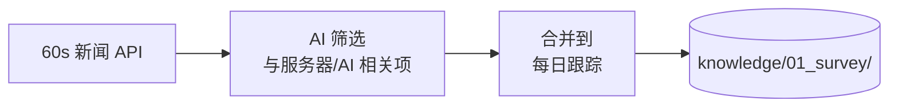
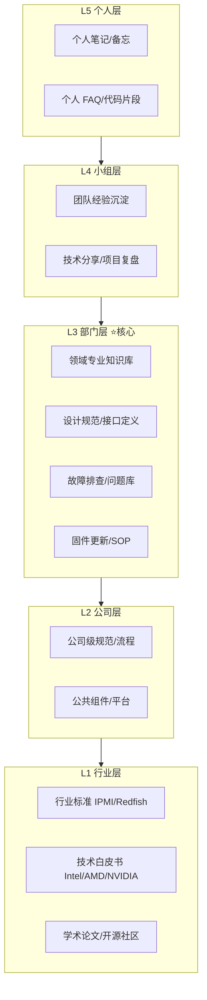
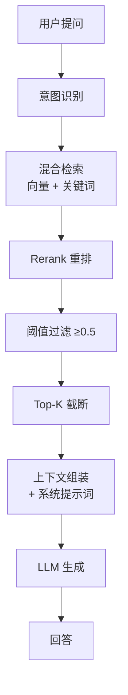
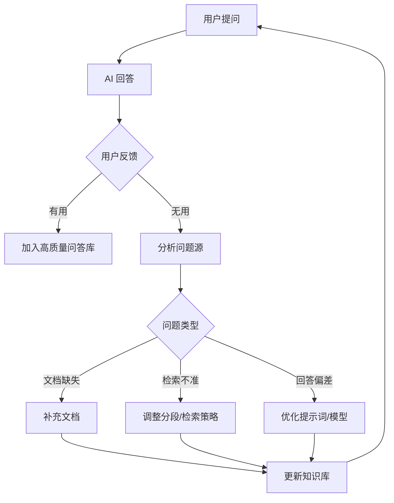

# AI 知识库系统建设方案与实践

> **概要**: AI 知识库系统建设方案：数据源搭建、L1-L5 分层架构与质量控制
>
> **关键词**: 知识库 · 数据管道 · SSOT · 索引管理 · 质量控制

---

## 📑 目录

- [0. 需求背景与核心目标](#0-需求背景与核心目标)
  - [0.1 业务目标](#01-业务目标)
  - [0.2 三大能力维度](#02-三大能力维度)
  - [0.3 核心原则](#03-核心原则)
  - [0.4 需求规格列表](#04-需求规格列表)
- [1. 知识库数据源的搭建与转换](#1-知识库数据源的搭建与转换)
  - [1.1 数据源分类体系](#11-数据源分类体系)
  - [1.2 数据采集管道](#12-数据采集管道)
    - [1.2.1 管道总览](#121-管道总览)
    - [1.2.2 各管道说明](#122-各管道说明)
    - [1.2.3 每日新闻采集](#123-每日新闻采集)
  - [1.3 格式转换与多模态预处理](#13-格式转换与多模态预处理)
    - [1.3.1 处理管线](#131-处理管线)
    - [1.3.2 预处理参考代码](#132-预处理参考代码)
  - [1.4 素材的批判性使用原则](#14-素材的批判性使用原则)
  - [1.5 本工程实践：import → 知识库自动管线](#15-本工程实践import-知识库自动管线)
- [2. 知识库的搭建与维护](#2-知识库的搭建与维护)
  - [2.1 分层架构设计（L1-L5 五层模型）](#21-分层架构设计l1-l5-五层模型)
  - [2.2 目录 MECE 治理](#22-目录-mece-治理)
    - [2.2.1 当前目录架构（本工程）](#221-当前目录架构本工程)
    - [2.2.2 目录治理的五层模型](#222-目录治理的五层模型)
  - [2.3 SSOT 治理体系](#23-ssot-治理体系)
    - [2.3.1 四层 SSOT 模型](#231-四层-ssot-模型)
    - [2.3.2 本工程 SSOT 实践（计算节点目录案例）](#232-本工程-ssot-实践计算节点目录案例)
  - [2.4 索引与变更管理（index + log + changelog）](#24-索引与变更管理index-log-changelog)
  - [2.5 质量控制与健康检测](#25-质量控制与健康检测)
    - [2.5.1 文档质量评估标准](#251-文档质量评估标准)
    - [2.5.2 健康检测脚本](#252-健康检测脚本)
  - [2.6 版本管理与废弃归档](#26-版本管理与废弃归档)
  - [2.7 本工程实践：目录治理的演进](#27-本工程实践目录治理的演进)
- [3. 知识库的使用](#3-知识库的使用)
  - [3.1 多渠道接入](#31-多渠道接入)
  - [3.2 检索策略与调优](#32-检索策略与调优)
    - [3.2.1 检索架构](#321-检索架构)
    - [3.2.2 参数推荐](#322-参数推荐)
    - [3.2.3 常见问题排查](#323-常见问题排查)
  - [3.3 AI 辅助分析](#33-ai-辅助分析)
  - [3.4 反馈闭环](#34-反馈闭环)
  - [3.5 效果评估体系](#35-效果评估体系)
  - [3.6 本工程实践：AI 如何消费知识库](#36-本工程实践ai-如何消费知识库)
- [4. 本工程建设经验与教训](#4-本工程建设经验与教训)
  - [4.1 SSOT 的约束辩证法](#41-ssot-的约束辩证法)
  - [4.2 AI 承担维护成本（而非人类）](#42-ai-承担维护成本而非人类)
  - [4.3 25% 松弛规则](#43-25-松弛规则)
  - [4.4 精准指令即效率](#44-精准指令即效率)
  - [4.5 定期约束审计](#45-定期约束审计)
  - [4.6 教训：过度设计 vs 渐进迭代](#46-教训过度设计-vs-渐进迭代)
  - [4.7 教训：一致性比完美更重要](#47-教训一致性比完美更重要)
  - [4.8 教训：不要造"没人维护的精致废墟"](#48-教训不要造没人维护的精致废墟)
- [附录](#附录)
  - [A. 关键参数速查表](#a-关键参数速查表)
  - [B. 工具选型对比](#b-工具选型对比)
    - [知识库平台对比](#知识库平台对比)
    - [文档解析工具](#文档解析工具)
  - [C. 实施 Checklist](#c-实施-checklist)
  - [D. 参考来源](#d-参考来源)
- [参考文件](#参考文件)
- [Changelog](#changelog)

---

## 0. 需求背景与核心目标

### 0.1 业务目标

知识库建设需达成的三大核心量化指标：

| 指标 | 目标值 | 衡量方式 |
|:-----|:-------|:---------|
| **命中率** | ≥60% | 用户提问时，知识库能召回有效相关文档的比例 |
| **使用率** | ≥80% | 团队成员在日常工作中主动使用知识库的比例 |
| **问题单解决支撑率** | ≥30% | 通过知识库辅助分析，正确解决的问题单占总数比例 |

### 0.2 三大能力维度

| 维度 | 要求 | 关键动作 |
|:-----|:------|:---------|
| **平台** | 模型选择与模型调优 | 选型适合技术文档问答的 LLM + RAG 调优 |
| **知识输入** | 文档质量与知识治理 | 去重、分类、分段、关联、多模态提取 |
| **提示词设计** | 问答效果优化 | 系统提示词 + 检索策略 + 输出格式控制 |

### 0.3 核心原则

> **始于需求，终于价值**。不要试图一开始就构建完美的知识库，而是从最关键的问题开始，根据使用反馈不断迭代优化。

### 0.4 需求规格列表

| 编号 | 需求项 | 优先级 | 说明 |
|:----|:-------|:------|:-----|
| KB-001 | 知识库命中率 ≥60% | P0 | 基础检索质量 |
| KB-002 | 知识库使用率 ≥80% | P0 | 团队覆盖 |
| KB-003 | 问题单解决支撑率 ≥30% | P0 | 业务价值 |
| KB-004 | 多文档格式支持 | P1 | TXT/MD/PDF/PPTX/代码/视频 |
| KB-005 | 数据源自动采集 | P1 | 网页归档/豆包对话/新闻导入 |
| KB-006 | 目录治理与 SSOT | P1 | MECE 分层 + 索引维护 |
| KB-007 | 结果质量反馈闭环 | P1 | 有用/无用 + 改进建议 |
| KB-008 | 多模态自动提取 | P2 | 图表/视频 → 文本 |
| KB-009 | 外部知识库集成 | P2 | 对接行业/公司知识库 |
| KB-010 | 知识图谱搭建 | P2 | 文档关联关系可视化 |

---

## 1. 知识库数据源的搭建与转换

知识库的数据源是知识质量的基石。**输入垃圾，输出垃圾**在这一领域尤为显著——RAG 系统的检索上限由文档质量决定。

### 1.1 数据源分类体系

按来源与可信度分层：

| 层级 | 数据源类型 | 示例 | 可信度 | 更新频率 |
|:-----|:-----------|:-----|:------:|:--------:|
| **L0 一手权威** | 标准规范/芯片手册/协议文档 | IPMI SPEC、PCIe Base Spec、JEDEC 标准 | ⭐⭐⭐⭐⭐ | 按版本 |
| **L1 官方发布** | 厂商白皮书/技术博客 | NVIDIA 技术博客、Intel 白皮书 | ⭐⭐⭐⭐ | 按发布 |
| **L2 行业分析** | 调研报告/行业洞察 | Gartner、IDC、Omdia 报告 | ⭐⭐⭐ | 按发布 |
| **L3 经验沉淀** | 内部设计文档/问题总结 | 设计规范、故障排查手册、FAQ | ⭐⭐⭐⭐ | 持续 |
| **L4 社区/媒体** | 技术博客/论坛/新闻 | 知乎、CSDN、公众号文章 | ⭐⭐ | 日更 |
| **L5 对话提炼** | AI 对话/团队讨论记录 | 豆包问答、会议纪要 | ⭐⭐ | 日更 |

**关键原则**: 越上层的数据源，入库前越需要交叉验证。L4/L5 数据作为线索而非结论使用。

### 1.2 数据采集管道

#### 1.2.1 管道总览

```mermaid
flowchart LR
    subgraph 自动采集["⚡ 自动采集"]
        WEB[Web 页面]\n→ web-archive Skill
        DOUBAO[豆包对话]\n→ doubao-share Skill
        RSS[技术博客 RSS]\n→ 定时任务
        NEWS[每日新闻]\n→ 60s 新闻 Skill
    end

    subgraph 手动导入["📥 手动导入"]
        IMPORT[import/ 素材目录]\n→ 手动放置
        DOC[Word/PDF/PPT]\n→ markdown-converter Skill
        FILE[本地文件]\n→ 直接写入
    end

    subgraph 内部生产["🏭 内部生产"]
        WRITE[knowledge-doc-writer]\n→ AI 撰写深度报告
        SURVEY[深度调研]\n→ light-literature-search
        INSIGHT[行业洞察]\n→ industry-insight
    end

    subgraph 沉淀["📚 知识库"]
        KB[(knowledge/)]\n结构化知识
    end

    自动采集 --> 预处理[格式标准化]
    手动导入 --> 预处理
    内部生产 --> 预处理
    预处理 --> 质量门[质量门禁]
    质量门 --> KB
```

#### 1.2.2 各管道说明

| 管道 | 触发方式 | 产出 | 维护频率 |
|:-----|:---------|:-----|:---------|
| **Web 归档** (`web-archive` Skill) | 用户分享 URL 时自动触发 | `knowledge/06_others/sources/<slug>.md` | 按需 |
| **豆包归档** (`doubao-share` Skill) | 用户分享豆包链接时自动触发 | `knowledge/<模块>/sources/<slug>.md` | 按需 |
| **深度调研** (`knowledge-doc-writer`) | 用户发起专题调研 | `knowledge/02_rd/<module>/<topic>.md` | 按需 |
| **import 导入** | 素材批量放入 `import/` | 经 AI 整理后写入 `knowledge/` 对应目录 | 不定 |
| **对话沉淀** (`knowledge-wiki` Skill) | 深度讨论产出结论时自动触发 | `knowledge/analysis/sources/entities/concepts/` | 每会话 |

#### 1.2.3 每日新闻采集



### 1.3 格式转换与多模态预处理

#### 1.3.1 处理管线

| 模态 | 处理工具 | 输出格式 | 质量保障 |
|:-----|:---------|:---------|:---------|
| **PDF 数字版** | Marker / Unstructured | 结构化 Markdown | 自动校验版面完整性 |
| **PDF 扫描件** | PaddleOCR + 多模态 VLM 描述 | OCR 文本 + 图片描述 Markdown | 人工抽查 10% |
| **图片/截图** | PaddleOCR + VLM 图文理解 | 图文标记文本 | VLM 二次验证 |
| **视频教程** | Whisper ASR → 字幕 + FFmpeg 关键帧 → VLM 描述 | 时间戳字幕 + 关键帧描述 | 关键帧覆盖度检查 |
| **PPT 文档** | python-pptx → Markdown + VLM 图表描述 | 逐页 Markdown | 图表区域补充描述 |
| **Word/Excel** | markitdown 工具 | 标准化 Markdown | 自动转换 |

#### 1.3.2 预处理参考代码

```python
# 多模态文件统一处理入口（伪代码框架）
def process_multimodal(file_path: str, file_type: str) -> str:
    """将多模态文件转换为结构化文本"""
    if file_type in {'png', 'jpg', 'jpeg'}:
        text = ocr_extract(file_path)           # PaddleOCR
        desc = vlm_describe(file_path)          # 多模态模型描述
        return f"## 图片描述\n{desc}\n## OCR文本\n{text}"
    elif file_type == 'pdf':
        return process_scanned_pdf(file_path) if is_scanned(file_path) \
               else process_digital_pdf(file_path)
    elif file_type in {'mp4', 'avi', 'mov'}:
        transcript = asr_transcribe(extract_audio(file_path))  # Whisper
        keyframes = extract_keyframes(file_path)                # FFmpeg
        descs = [vlm_describe(kf) for kf in keyframes]
        return f"## 字幕\n{transcript}\n## 关键帧\n{''.join(descs)}"
```

### 1.4 素材的批判性使用原则

**核心规则（来源于本工程 `RULE.md`）**:

> `import/` 目录内容为素材/线索，不得作为文档唯一来源随意采纳。
>
> **关键量化数据**（算力/带宽/延迟/可靠性等）必须经至少一种独立源交叉验证：
>
> 1. 厂商官方规格
> 2. 标准组织规范（JEDEC/IEEE/PCI-SIG 等）
> 3. 可复现的物理/数学推导
>
> 素材与验证源的结论不一致时，以验证源为准，并在文档中说明分歧。

**实践方法**：

| 检查项 | 操作 | 示例 |
|:-------|:-----|:------|
| 数据源优先级 | 论文/标准原文 > 官方白皮书 > 一线报告 > 行业分析 > 技术博客 > 自媒体 | PCIe Gen6 速率以 PCI-SIG 规范为准，非转载文章 |
| 多源三角验证 | 同一数据至少找 3 个独立来源比对 | NVLink 带宽：NVIDIA 白皮书 + 第三方测试 + 论文 |
| 时效性检查 | 确认数据是否仍适用于当前版本 | 2023 年的 GPU 算力数据不能代表 2026 年 |
| 基线标注 | 每个数值标注来源+条件 | "NVLink 5.0: 1.8TB/s 双向 (NVIDIA H100 DS 白皮书 v1.2, §3.1)" |

### 1.5 本工程实践：import → 知识库自动管线

本工程建立了半自动化的 **import → 知识库** 管线：

```text
import/      <- AI 批量导入（网页/豆包/文档/pdf）
   v
AI 预处理   <- 格式转换 + 去重 + 分类推荐目录
   v
人工审核    <- 核验关键数据 + 确认分类位置
   v
knowledge/  <- 写入 + index + log 自动更新
   v
bak/         <- 已处理素材移入回收站
```

**经验数据**：

- 单次批量导入 10-20 个文件，AI 预处理耗时 ~2min，人工审核 ~5min
- 去重率 ~15%（约 15% 的 import 素材与已有知识重复）
- 跨目录迁移率 ~8%（导入分类判断需要人工修正）
- **关键教训**: 全自动分类准确率约 85%，必须保留人工审核环节

---

## 2. 知识库的搭建与维护

### 2.1 分层架构设计（L1-L5 五层模型）

知识库体系从宏观到微观分为五个层级：



| 层级 | 职责 | 推荐工具 | 数据来源 |
|:-----|:-----|:---------|:---------|
| **L1 行业层** | 行业标准、技术白皮书、公开论文 | ima/Web 归档 | 官网、IEEE、开源社区 |
| **L2 公司层** | 公司级规范、公共平台组件 | 内部 Wiki/知识库 | 公司文档库 |
| **L3 部门层 ⭐** | 领域专业知识 | Dify/MaxKB/本地 knowledge/ | 设计文档/问题单/测试报告 |
| **L4 小组层** | 团队项目经验 | 子知识库 | 复盘文档/技术分享 |
| **L5 个人层** | 个人学习笔记 | 个人知识库 | 个人文档/代码片段 |

### 2.2 目录 MECE 治理

知识库目录设计遵循 **MECE（相互独立、完全穷尽）** 原则。

#### 2.2.1 当前目录架构（本工程）

```text
knowledge/
+-- 01_survey/         <- 调研跟踪（行业动态/技术趋势/竞争情报）
+-- 02_rd/             <- 研发全链路（概念->管理->硬件->软件->方案->制造->报告->芯片）
+-- 03_AI/             <- AI 技术原理（Agent/大模型/RAG/集群/知识体系）
+-- 04_person/         <- 个人发展（企业管理/职业发展/冲突处理）
+-- 05_tools/          <- 工具与行业（AI工具/豆包QA/数据处理/运维）
+-- 06_others/         <- 其他归档（储能/Emoji/时间节奏）
+-- 07_industry-research/ <- 行业调研（GPU/互联/国产化/供应链）
+-- methodology/       <- 方法论（MECE/五看三定/创造手法/系统分析）
+-- concepts/          <- 概念原理（AI边界/约束管理/系统框架）
+-- sources/           <- 来源归档（外部导入的原始素材）
+-- weekly-reports/    <- 自动生成周报
+-- index.md / log.md  <- 索引入口 / 变更日志
```

**设计原则**:

1. **两位数字前缀**（`00_`, `01_`, `02_`）预留扩展空间
2. **英文命名**，避免跨平台编码问题
3. **各子目录独立维护** `index.md` + `log.md`
4. **不再使用的模块移入 `bak/`**（加日期标注），而非原地保留

#### 2.2.2 目录治理的五层模型

参考 [目录级质量工程体系]（`knowledge/02_rd/...`）：

1. **文件层** — 单文件格式规范（YAML header + TOC + 交叉链接 + changelog）
2. **目录层** — MECE 分类 + `index.md` + `log.md`
3. **跨目录层** — 交叉链接体系 + 全局 `index.md`
4. **全景层** — `Server Design Roadmap` + `README.md` 架构全景
5. **治理层** — 健康检测 + SSOT Manifest + 定期审计

### 2.3 SSOT 治理体系

SSOT（Single Source of Truth，单一事实来源）解决"同一个参数/结论分散在 N 个文件中，到底信谁"的问题。

#### 2.3.1 四层 SSOT 模型

| 层级 | 名称 | 内容 | 约束强度 |
|:-----|:-----|:-----|:--------:|
| **T0 SSOT** | 权威事实 | 设计规格/协议规范/接口定义 | 🔴 硬约束 |
| **T1 派生产物** | 基于 SSOT 的分析/解读/教程 | 架构分析/技术报告/指南 | 🟡 中约束 |
| **T2 分析佐证** | 支撑论点的分析/调研/对比 | 调研报告/竞品分析/测试结果 | 🟢 软约束 |
| **T3 支撑参考** | 外部素材/原始资料/参考链接 | 来源文章/白皮书/导入素材 | 🟢 不约束 |

**SSOT 的硬规则**:

1. **T0 文件**修改必须更新 changelog + 标记版本
2. **T1 文件**必须引用 SSOT 路径（如 "I2C 速率定义见 `00-design/2026-07-29-i2c.md §2.3`"）
3. **T2 文件**若包含新设计参数必须声明 `⚠️ Unverified — not SSOT`
4. **T0/T1 冲突**以 T0 为准，差值在文件头部声明

#### 2.3.2 本工程 SSOT 实践（计算节点目录案例）

```text
compute-node/
+-- 00-design/        <- T0 SSOT: I2C/SPI/JTAG/DC-SCM 设计规格
+-- 10-topology/      <- T1: 拓扑图谱（引用 00-design/ 的 SSOT）
+-- 20-reviews/       <- T2: 评审/分析报告
+-- 30-support/       <- T3: 参考/工具/模板
+-- _manifest/        <- 治理元信息（2026-07-29-ssot-manifest.md, 遗留项）
+-- index.md          <- 目录索引
```

**治理注解**（DESIGN v1.2 头部示例）：

```yaml
---
governance:
  ssot_tier: T0
  downstream: ["10-topology/", "20-reviews/"]
  cross_refs: ["../gpu-interconnect/", "../../02_rd/03_hardware/01_platform/"]
  last_validation: 2026-07-17
---
```

### 2.4 索引与变更管理（index + log + changelog）

每个知识库目录维护三套元数据：

| 文件 | 用途 | 更新时机 | 示例 |
|:-----|:-----|:---------|:-----|
| **`index.md`** | 文件清单 + 摘要 | 所有文件操作后 | 文件清单 + 版本标注 |
| **`log.md`** | 变更历史（倒序） | 所有文件操作后 | 日期 \| 操作 \| 文件 \| 说明 |
| **文件头部 changelog** | 单文件版本记录 | 文件内容变更时 | `- v2.0 \| 2026-07-17 \| 合并重构` |

**变更类型标记**（用于 log.md）：

| 标记 | 含义 |
|:-----|:------|
| ✨ 新增 | 新文件创建 |
| 📝 更新 | 内容修改 |
| 🔄 迁移 | 文件移动 |
| 🗑️ 归档 | 移至 bak/ |
| 🔗 修复 | 交叉链接修复 |

### 2.5 质量控制与健康检测

#### 2.5.1 文档质量评估标准

| 评价维度 | 优秀（5分） | 合格（3分） | 不合格（1分） |
|:---------|:-----------|:-----------|:-------------|
| **准确性** | 内容经交叉验证，无事实错误 | 基本正确 | 存在明显错误/过时 |
| **完整性** | 覆盖主题所有关键方面 | 覆盖主要方面 | 严重遗漏关键信息 |
| **结构化** | 清晰的 YAML header + TOC + 层级 | 有基本段落划分 | 无结构文本块 |
| **时效性** | 当前版本/最新标准 | 1-2 个版本以内 | 3 个版本以上/停止维护 |
| **可检索性** | 关键词标记 + 摘要 + 交叉链接 | 有基本分段 | 纯文本无分段 |

#### 2.5.2 健康检测脚本

本工程部署了自动化健康检测脚本 `knowledge-health-check` Skill，覆盖：

| 检查项 | 检测内容 | 严重等级 |
|:-------|:---------|:--------:|
| 链接有效性 | 检查交叉链接是否指向存在的文件 | 🔴 阻断 |
| log.md 排序 | 确认日志按日期倒序排列 | 🟡 告警 |
| 文件位置合理性 | 文件是否在合理目录下 | 🟡 告警 |
| Markdown 表格格式 | 表格对齐性校验 | 🟢 建议 |
| 重复文件名 | 同名文件冲突检测 | 🟡 告警 |
| 孤立文件 | 无 index.md 索引的文件 | 🟡 告警 |

### 2.6 版本管理与废弃归档

**铁律（来源于本工程 `RULE.md`）**：

> **永不 `rm`** — `mv` 到 `tmp/bak/<原因>-<日期>/`（2026-07-24前为 `knowledge/bak/`）

| 操作 | 位置 | 说明 |
|:-----|:-----|:------|
| 当前活跃文件 | `knowledge/<module>/<file>.md` | 正常维护 |
| 已迁移旧版 | `tmp/bak/<原因>-<日期>/<file>` | 保留历史参考（原 `knowledge/bak/`） |
| 废弃内容 | `tmp/bak/`（原 `knowledge/bak/`） | **不纳入索引、不得作为参考来源** |

**重要**：`tmp/bak/`（2026-07-24前为 `knowledge/bak/`）中的内容可能过时/版本过旧/已被替代，**不得作为参考来源引用或在报告中使用**。如需引用，须先确认未被替代且迁移出 bak。

### 2.7 本工程实践：目录治理的演进

本工程的目录治理经历了三个阶段：

| 阶段 | 状态 | 文件数 | 治理成熟度 | 问题 |
|:-----|:-----|:-----:|:----------:|:-----|
| **1.0 平铺期** | 所有文件在 `notes/` 下平铺 | 100+ | ⭐ | 找文件靠搜索，无分类，重复多 |
| **1.5 粗分时期** | 拆出 6 个顶层目录 | 500+ | ⭐⭐ | 分类颗粒度不够，跨域文件归属不清 |
| **2.0 MECE 分层期** | 12 个顶层模块 + 子目录 index + log + SSOT | 1,598 | ⭐⭐⭐⭐ | 治理成本显性化，需要自动化支撑 |

**关键数字**：

- 总迁移文件数：33+ 个（计算节点目录治理）
- index.md 覆盖率：100%（所有子目录均维护索引）
- 交叉链接数：~200+ 条
- 日常维护成本：~1min/次写入操作（AI 自动更新 index + log）

---

## 3. 知识库的使用

### 3.1 多渠道接入

| 渠道 | 方式 | 适用场景 |
|:-----|:-----|:---------|
| **AI 对话（主渠道）** | 直接向 AI 提问，AI 检索知识库后回答 | 日常使用 |
| **飞书 Bot** | 飞书内直接提问 | 团队协作 |
| **Web UI** | Dify/MaxKB 界面 | 知识库管理/浏览 |
| **API** | REST API 查询 | 系统集成 |
| **CLI 脚本** | grep + memory_search | 批量/自动化操作 |

### 3.2 检索策略与调优

#### 3.2.1 检索架构



#### 3.2.2 参数推荐

| 参数 | 推荐值 | 调优原则 |
|:-----|:-------|:---------|
| 检索方式 | 混合检索（Hybrid Search） | 向量 + 关键词兼顾语义与精确匹配 |
| Top-K | 5-10 | 太多噪声大，太少遗漏信息 |
| Score 阈值 | 0.5-0.7 | 低于阈值丢弃，避免不相关内容干扰 |
| 分段策略 | 按标题自动分段 | 每章节/节作为独立段落 |
| 分段最大长度 | 1000 tokens | 适配中文技术文档 |
| 分段重叠 | 100-200 tokens | 防止截断导致的语义断裂 |
| Rerank | ✅ 开启 | 显著提升 Top-K 精确度 |
| 温度 | 0.1-0.3 | 技术问答场景低温度更可靠 |

#### 3.2.3 常见问题排查

| 问题表现 | 可能原因 | 解决方向 |
|:---------|:---------|:---------|
| 找不到相关文档 | 文档未向量化/索引 | 检查索引状态，重新索引 |
| 回答不准确 | 文档质量差/分段不合理 | 优化文档，调整分段策略 |
| 回答冗长/偏离 | 提示词约束不足 | 强化系统提示词，降低温度 |
| 检索结果杂乱 | 不同类型文档混放 | 拆分知识库，按主题分库 |
| 回答格式混乱 | 缺乏输出格式控制 | 在提示词中明确输出格式 |

### 3.3 AI 辅助分析

| 能力 | 实现方式 | 场景 |
|:-----|:---------|:-----|
| **智能问答（RAG）** | 知识库检索 + LLM 生成 | 日常知识查询 |
| **深度分析文档** | `deep-tech-writer` Skill 按工作流产出 | 技术专题调研 |
| **行业洞察** | `industry-insight` Skill（五看三定） | 商业机会分析 |
| **竞品分析** | `server-competitor-analysis` Skill（三维框架） | 竞争对手对标 |
| **故障诊断** | `fault-diagnosis` Skill（鱼骨+5W+RCA） | 根因分析 |
| **文献调研** | `light-literature-search` Skill | 科研资料整理 |
| **周报生成** | `weekly-report-generator` Skill | 知识库变化汇总 |

### 3.4 反馈闭环



### 3.5 效果评估体系

| 指标维度 | 指标 | 采集方式 | 目标值 |
|:---------|:-----|:---------|:-------|
| **检索质量** | 召回率 (Recall@K) | 测试集评估 | ≥85% |
| **检索质量** | 精确率 (Precision@K) | 测试集评估 | ≥80% |
| **回答质量** | 用户满意度评分 | 用户反馈按钮 | ≥4.0/5.0 |
| **回答质量** | 回答准确率 | 人工抽检 5% | ≥90% |
| **使用情况** | 日活用户数 | 平台日志 | 团队 80%+ |
| **使用情况** | 平均使用频次 | 平台日志 | 3次/人/天 |
| **知识覆盖** | 文档覆盖率 | 扫描分析 | 覆盖 >90% 常见问题 |
| **问题单支撑** | 根因命中率 | 问题单对比 | ≥30% |

### 3.6 本工程实践：AI 如何消费知识库

本工程的独特之处在于：**知识库的主要消费者不是人，而是 AI 自身**。

```text
用户提问
    v
AI 收到问题 -> memory_search 检索知识库
    v
                 +-> 命中 -> 基于知识库内容回答 + 标注来源
    +-> 未命中 -> 说明"该内容知识库暂未覆盖，基于已知知识分析"
    v
回答完毕后 -> 检查是否需要将本次对话产生的结论写入知识库
    v
按存储规则写入对应位置（knowledge/ / memory/ / MEMORY.md）
```

**此模式的独特意义**：

| 维度 | 传统知识库（给人读） | 本工程（AI 消费为主） |
|:-----|:-------------------|:---------------------|
| 检索方式 | 搜索框 + 浏览 | 语义检索（memory_search） |
| 知识粒度 | 完整文档 | 片段级召回 + LLM 重组 |
| 更新驱动力 | 人工维护 | AI 自动沉淀对话产出 |
| 知识使用 | 人阅读后理解 | AI 检索后直接回答 |
| 结构化要求 | 中（人能处理非结构化） | 高（需要标准格式便于向量检索） |

**启示**：当 AI 是主要消费者时，知识库设计的重点应从"人类可读性"转向"机器可检索性"——分段合理、元数据完整、术语统一、交叉链接有效。

---

## 4. 本工程建设经验与教训

> 本章节聚焦基于本工程（1,598 个文件、12 个顶层模块的 `knowledge/` 知识库）实际建设过程中沉淀的经验、教训与反直觉发现。

### 4.1 SSOT 的约束辩证法

**核心矛盾**：约束是质量的保障，但也是效率的敌人。

```text
质量/效率
  ^
  |        +---- 总价值（质量收益 - 约束成本）
  |       ╱
  |      ╱        <- ★ 最优区间
  |     ╱    +---
  |    ╱    ╱
  |   ╱  <-╱          <- 约束成本曲线（递增加速）
  |  ╱ ╱
  | ╱ ╱
  |╱╱                    <- 质量收益曲线（递减）
  +---------------------------> 约束强度
```

**关键洞察**：

- **左端（无约束）**：质量极差，找信息靠运气，但写入极快
- **中间（适度约束）**：质量大幅提升，约束成本可控 → **最优区间**
- **右端（过度约束）**：每次变更需运行全量脚本、更新 5 个 manifest → 没人维护，约束被绕过

**本工程的 4 层 SSOT（T0-T3）** 目前位于最优区间偏右10%位置。SSOT 变更后的传播成本是最明显的摩擦点。

### 4.2 AI 承担维护成本（而非人类）

**这是本工程最核心的经验**：如果约束的检查/执行都由 AI 完成，人类几乎感知不到约束成本。

| 成本项 | 人工承担 | AI 承担 |
|:-------|:---------|:--------|
| 新文件归组决策 | 判断属于哪个模块 | 自动识别内容类型 + 推荐目录 |
| SSOT 变更后的下游检查 | 手动搜索引用文件 | 自动 grep + 列出影响文件 |
| 交叉链接修复 | 逐个文件打开修改 | `sed` 批量替换 + 路径映射表 |
| 一致性审计 | 逐项比对 | 脚本全量扫描 + 差异报告 |
| changelog 更新 | 手动编辑 | 自动追加 |
| index.md 更新 | 手动整理 | 自动追加条目 |
| log.md 记录 | 手动写 | 自动按格式追加 |

**实践数据**：33 个文件迁移 + 交叉链接修复，AI 耗时 ~15min，如果人工做至少 2-3 小时。

**核心原则**：
> **谁承担成本，谁决定约束强度。** 如果 AI 能自动完成 90% 的检查/同步/修复工作，人类只需要做关键决策——那么这就是一个好方案。

### 4.3 25% 松弛规则

任何严格的分层系统都需要预留**灰色地带**。具体做法：

| 模块 | 严格度 | 预留弹性 |
|:-----|:------:|:---------|
| `00-design/` (SSOT) | 🔴 严格 | 允许 1-2 个合理例外 |
| `10-topology/` | 🟡 中等 | 允许混合文档存在 |
| `20-reviews/` | 🟢 宽松 | 允许分析中包含设计建议 |
| `30-support/` | 🟢 最宽松 | 几乎不限制格式 |

**具体体现**：

- `_manifest/` 中的遗留项清单，标记"已知违反者 + 容忍原因 + 超时自动归档"
- 允许跨层文件存在（如既分析又提出设计建议的报告），但文件头部声明自己属于哪个 tier
- 允许 T2 分析报告中出现新的参数片段，但要求标注 `⚠️ Unverified claim — not SSOT`

### 4.4 精准指令即效率

**来自 AI 使用实践的核心规则**：

> 模糊指令 → AI 在不确定性中反复试探 → token 浪费 + 多轮迭代 + 结果不一致
> 精准指令 → 四个锁定点锁定范围/格式/粒度 → 一次到位 + 可复现

**四个锁定点**：

```text
角色锁定 -> 目标锁定 -> 格式锁定 -> 约束锁定
 谁来做     做什么     长什么样     不能做什么
```

**自检方法**：写 prompt 后自问——"如果去掉这段话，AI 是否还能产出完全一致的结果？"如果答案是否定的，说明确定性还不够。

**对知识库使用的意义**：给 AI 下指令时，明确指定知识库检索范围（"只查 `02_rd/` 目录"）+ 输出格式（"用 Markdown 表格"）+ 引用要求（"标注来源文件路径"），显著提升回答质量和一致性。

### 4.5 定期约束审计

每季度评估约束体系的有效性：

```text
1. 过去 3 个月，每个约束被触发了多少次？
2. 触发后产生了多少实际价值？（防止了多少次错误？）
3. 执行约束的总耗时是多少？
4. 是否有绕过行为？（人在规避这个约束吗？）
5. 该保留 / 降级 / 废除？
```

**决策树**：

```text
约束审计
  +-- 从未触发过 -> 废除（不需要的约束）
  +-- 触发但无价值 -> 降级为软约束
  +-- 触发且有价值但成本高 -> 自动化
  +-- 经常被绕过 -> 检查是否过度约束，适当放松
  +-- 触发且有价值且成本可控 -> 保留
```

### 4.6 教训：过度设计 vs 渐进迭代

**本工程的教训**：在知识库建设初期，我们试图一次性设计完美的目录架构，结果花了大量时间在"这个文件该放哪"的讨论上。

**改正方向**：

| 错误做法 | 正确做法 |
|:---------|:---------|
| 一开始就想设计完美的 5 层目录 | 从 2 层粗分开始，随着文件增多逐步细化 |
| 所有文件必须严格归组才能创建 | 允许临时放在根目录，标注 `⚠️ 待归组` |
| 追求一次性完整覆盖 | 先覆盖核心 20% 问题，解决 80% 需求 |
| 复杂严格的入库流程 | 简单的准入 + 后续治理修正 |
| 大规模一次性迁移 | 分批迁移 + 测试验证 |

**经验值**：1,598 个文件从平铺到 MECE 分层花了 ~6 个月，经历了 3 次重构。如果一开始就设计最终架构，反而会因为信息不足导致设计失误。

### 4.7 教训：一致性比完美更重要

**本工程最常遇到的错误不是"内容不对"，而是"同一个东西在不同地方叫法不同"**。

| 场景 | 问题 | 影响 |
|:-----|:-----|:------|
| 术语不一致 | 一会儿叫"超节点"一会儿叫"SuperPod" | 检索召回率下降 30%+ |
| 文件命名不规范 | `I2C-design.md` vs `i2c_design_v3.md` | AI 难以判断哪个是最新版本 |
| 目录层级混乱 | 同一类文件分散在 3 个目录下 | 跨目录检索效率降低 |

**解决方案**：

1. **术语统一表**：在 `methodology/` 下维护关键术语对照表
2. **命名规范**：全小写 + 连字线（`i2c-design.md`），禁止混用大小写和下划线
3. **Alias 机制**：在文件头部标注别名（如 `aliases: [超节点, SuperPod, 超级节点]`）

### 4.8 教训：不要造"没人维护的精致废墟"

**这是最重要的教训**。

> 一个设计完美但无人维护的知识库，比一个设计粗糙但经常更新的知识库更危险——因为它给人一种"这里应该有正确答案"的错觉。

**防止沦为废墟的三条规则**：

| # | 规则 | 具体做法 |
|:-:|:-----|:---------|
| 1 | **写入即维护** | 每次写入时同步更新 index + log，不留"下次补"的欠账 |
| 2 | **改后人能跑** | 每次结构变更后运行健康检测脚本，确保索引/链接不坏 |
| 3 | **有人看门** | 指定知识库管理员角色（轮值），负责定期审计 + 指导新人 |

**本工程当前状态**：1,598 个文件，索引覆盖率 100%，健康检测通过率 ≥95%，日常维护成本约 1-2min/次操作。**可维持**。

---

## 附录

### A. 关键参数速查表

| 参数 | 推荐值 | 说明 |
|:-----|:-------|:------|
| 索引模式 | `high_quality` | 高质量索引 |
| 分段策略 | `hierarchical` / `by_title` | 按标题层级分段 |
| 分段最大长度 | 1000 tokens | 适合中文技术文档 |
| 分段重叠 | 150 tokens | 防语义断裂 |
| 检索方式 | `hybrid` | 向量 + 关键词 |
| Top-K | 8 | 召回文档块数量 |
| Score 阈值 | 0.5 | 低于阈值丢弃 |
| Rerank 启用 | `true` | 显著提升精确度 |
| LLM 温度 | 0.15 | 低温度保可靠性 |
| 文件命名规范 | `kebab-case.md` | 全小写 + 连字线 |
| 文件头部 | YAML front matter | title/version/date/aliases |

### B. 工具选型对比

#### 知识库平台对比

| 维度 | Dify | MaxKB | RAGFlow | 本工程本地知识库 |
|:-----|:-----|:------|:--------|:----------------|
| **定位** | LLM 应用开发平台 | 知识库问答系统 | 深度文档理解 RAG | 文件级知识管理 |
| **部署复杂度** | ★★★☆☆ | ★★☆☆☆ | ★★★★☆ | —（不需要部署） |
| **飞书集成** | ✅ 原生 | ✅ 原生 | ❌ 需自建 | ✅（AI 对接） |
| **Workflow 编排** | ✅ 可视化 | ⚠️ 基础 | ❌ | ✅（Skills 管线） |
| **文档解析质量** | ★★★☆☆ | ★★★☆☆ | ★★★★★ | —（预处理后入库） |
| **适合场景** | 复杂 Workflow | 轻量飞书问答 | 高精度文档理解 | 深度技术知识 |
| **开源许可** | Apache 2.0 | Apache 2.0 | Apache 2.0 | — |

#### 文档解析工具

| 工具 | 主要用途 | 部署方式 |
|:-----|:---------|:---------|
| **Unstructured.io** | PDF/PPT/图片文本提取 | Docker / API |
| **LlamaParse** | 复杂版式 PDF Markdown 转换 | API |
| **PaddleOCR** | 中文 OCR | Docker |
| **Whisper / SenseVoice** | 语音转文字 | 本地 / API |
| **FFmpeg** | 音视频处理 | 本地 |
| **markitdown** | PDF/Word/PPTX → Markdown | CLI / Python |

### C. 实施 Checklist

| 阶段 | 检查项 | 状态 |
|:-----|:-------|:----:|
| **搭建前** | □ 确定数据源分类体系 | — |
| | □ 确认分层架构（L1-L5 各层职责） | — |
| | □ 选择知识库平台 | — |
| **搭建中** | □ 建立目录 MECE 架构 | — |
| | □ 配置索引 + log + changelog 模板 | — |
| | □ 导入核心文档并分段 | — |
| | □ 建立 SSOT 文件并标注层级 | — |
| | □ 配置多渠道接入 | — |
| **使用中** | □ 建立反馈闭环 | — |
| | □ 配置效果评估指标 | — |
| | □ 部署健康检测脚本 | — |
| | □ 设定约束审计节奏（季度/月度） | — |
| | □ 指定知识库管理员 | — |
| | □ 制定废弃归档流程 | — |

### D. 参考来源

| 来源 | 说明 |
|:-----|:------|
| 本工程 `RULE.md` | SSOT 治理、文件操作铁律、存储规则 |
| 本工程 `AGENT.md` | 信息归档行为准则 |
| 本工程 `MEMORY.md` | SSOT 治理体系、目录级质量工程 |
| `knowledge/03_AI/methodology/` | AI 使用方法论系列 |
| Dify 官方文档 | <https://docs.dify.ai> |
| MaxKB 官方文档 | <https://maxkb.cn/docs/v2/system_arch> |
| RAGFlow 官方文档 | <https://ragflow.io/docs> |
| Unstructured.io | <https://unstructured.io> |

---

> **Changelog**
>
> - v2.0 | 2026-07-17 | 从 `02_rd/05_software/14-kb-system/` 合并至 `03_AI/knowledge-system/`，重构为四维架构（数据源→搭建维护→使用→经验教训），融入本工程 SSOT 治理/目录 MECE/约束辩证法等实践经验
> - v1.0 | 2026-07-10 | 初始版本，覆盖需求背景→分层架构→实施路径全流程

---

## 参考文件

> 本文件调用的外部文件与资料（不含被引用情况）。

### 内部知识库引用

- (无)

### 外部资料引用

- (无)

---

## Changelog

| 日期 | 版本 | 变更说明 |
|:----|:----|:-----|
| 2026-07-24 | v1.0 | 初始版本 |
