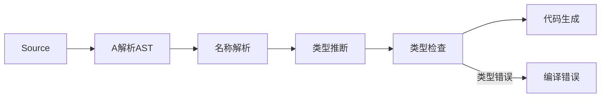

# 编程语言类型系统全面知识体系框架

> **概要**: 从**类型定义/声明→作用域→转换与兼容→类型检查→变量绑定→地址绑定→AST 表示→代码审查→常见错误**全链路，跨语言（C/C++/Python/Rust/Go/Shell）系统化对比
>
> **关键词**: (待补充)

---

## 📑 目录

- [一、类型系统基础理论](#一类型系统基础理论)
  - [1.1 核心概念](#11-核心概念)
  - [1.2 类型系统分类维度](#12-类型系统分类维度)
  - [1.3 各语言类型系统定位](#13-各语言类型系统定位)
- [二、类型定义与类型声明](#二类型定义与类型声明)
  - [2.1 C 语言的类型定义/声明](#21-c-语言的类型定义声明)
    - [基本类型](#基本类型)
    - [复合类型](#复合类型)
    - [指针与数组](#指针与数组)
    - [**C 语言的类型难点（CR 重点关注）**](#c-语言的类型难点cr-重点关注)
    - [C 语言的 AST 表示](#c-语言的-ast-表示)
  - [2.2 C++ 语言的类型系统](#22-c-语言的类型系统)
    - [类型声明](#类型声明)
    - [模板与类型推导](#模板与类型推导)
    - [**C++ 类型难点（CR 重点关注）**](#c-类型难点cr-重点关注)
    - [C++ 类型的 AST 表示（Clang AST）](#c-类型的-ast-表示clang-ast)
  - [2.3 Python 类型系统](#23-python-类型系统)
    - [类型声明（通过类型注解，Python 3.5+）](#类型声明通过类型注解python-35)
    - [TypeVar 与泛型约束](#typevar-与泛型约束)
    - [Python 类型的重要特性](#python-类型的重要特性)
    - [**Python 类型难点（CR 重点关注）**](#python-类型难点cr-重点关注)
    - [Python 类型的 AST 表示](#python-类型的-ast-表示)
  - [2.4 Rust 类型系统（最严格的类型系统）](#24-rust-类型系统最严格的类型系统)
    - [类型声明](#类型声明)
    - [所有权与借用类型](#所有权与借用类型)
    - [泛型与 Trait](#泛型与-trait)
    - [Rust 类型系统中的特殊类型](#rust-类型系统中的特殊类型)
    - [**Rust 类型难点（CR 重点关注）**](#rust-类型难点cr-重点关注)
    - [Rust 类型的 AST 表示（syn crate）](#rust-类型的-ast-表示syn-crate)
  - [2.5 Go 类型系统](#25-go-类型系统)
    - [类型声明](#类型声明)
    - [Go 泛型（1.18+）](#go-泛型118)
    - [**Go 类型难点（CR 重点关注）**](#go-类型难点cr-重点关注)
    - [Go 类型的 AST 表示](#go-类型的-ast-表示)
  - [2.6 Shell (Bash) 类型系统](#26-shell-bash-类型系统)
    - [类型模型](#类型模型)
    - [**Shell 类型难点（CR 重点关注）**](#shell-类型难点cr-重点关注)
    - [Shell 的 AST 表示](#shell-的-ast-表示)
- [三、类型作用域 (Type Scoping)](#三类型作用域-type-scoping)
  - [3.1 各语言类型作用域对比](#31-各语言类型作用域对比)
  - [3.2 典型作用域问题](#32-典型作用域问题)
    - [C: 结构体前向声明的使用限制](#c-结构体前向声明的使用限制)
    - [C++: 命名空间污染与 ADL 陷阱](#c-命名空间污染与-adl-陷阱)
    - [Rust: Orphan Rule](#rust-orphan-rule)
    - [Python: 循环导入与 TYPE_CHECKING](#python-循环导入与-type_checking)
    - [Go: 包的导出规则](#go-包的导出规则)
- [四、类型转换与兼容性 (Type Conversion & Compatibility)](#四类型转换与兼容性-type-conversion-compatibility)
  - [4.1 各语言类型转换方式总表](#41-各语言类型转换方式总表)
  - [4.2 各语言详细转换机制](#42-各语言详细转换机制)
    - [C: 隐式转换的反直觉陷阱](#c-隐式转换的反直觉陷阱)
    - [C++: 转换的层次化设计](#c-转换的层次化设计)
    - [Python: 鸭子类型与类型转换](#python-鸭子类型与类型转换)
    - [Rust: 类型转换是最严格的语言](#rust-类型转换是最严格的语言)
    - [Go: 严格但灵活的转换](#go-严格但灵活的转换)
  - [4.3 跨语言类型兼容性对照](#43-跨语言类型兼容性对照)
- [五、类型检查：正向检查与绕过方法](#五类型检查正向检查与绕过方法)
  - [5.1 正向类型检查](#51-正向类型检查)
    - [编译期类型检查 (C/C++/Rust/Go)](#编译期类型检查-ccrustgo)
    - [Rust 的类型推断（最先进）](#rust-的类型推断最先进)
    - [Go 的类型推断（简单但高效）](#go-的类型推断简单但高效)
  - [5.2 类型检查的绕过方法](#52-类型检查的绕过方法)
    - [C: 强制转换](#c-强制转换)
    - [C++: 多种强制转换](#c-多种强制转换)
    - [Python: 运行时的类型绕过](#python-运行时的类型绕过)
    - [Rust: 安全与不安全的边界](#rust-安全与不安全的边界)
    - [Go: 接口与类型断言](#go-接口与类型断言)
    - [Shell: 类型完全不存在](#shell-类型完全不存在)
  - [5.3 各语言类型绕过风险等级](#53-各语言类型绕过风险等级)
- [六、变量绑定与地址绑定](#六变量绑定与地址绑定)
  - [6.1 变量-类型绑定模型](#61-变量-类型绑定模型)
  - [6.2 各语言变量绑定的深层机制](#62-各语言变量绑定的深层机制)
    - [C: 编译期绑定](#c-编译期绑定)
    - [Rust: 所有权绑定（最独特）](#rust-所有权绑定最独特)
    - [Python: 名字→对象引用](#python-名字对象引用)
    - [Go: 值语义 vs 引用语义](#go-值语义-vs-引用语义)
  - [6.3 变量-地址绑定](#63-变量-地址绑定)
    - [各语言地址绑定示例](#各语言地址绑定示例)
  - [6.4 变量绑定中的常见错误](#64-变量绑定中的常见错误)
- [七、从 AST 角度看类型表达](#七从-ast-角度看类型表达)
  - [7.1 各语言类型在 AST 中的位置](#71-各语言类型在-ast-中的位置)
  - [7.2 典型 AST 类型节点对比](#72-典型-ast-类型节点对比)
  - [7.3 类型相关的 AST 审查要点](#73-类型相关的-ast-审查要点)
- [八、类型相关代码审查清单](#八类型相关代码审查清单)
  - [8.1 通用类型审查清单（跨语言）](#81-通用类型审查清单跨语言)
  - [8.2 各语言专项审查清单](#82-各语言专项审查清单)
    - [C 语言类型审查](#c-语言类型审查)
    - [C++ 类型审查](#c-类型审查)
    - [Python 类型审查](#python-类型审查)
    - [Rust 类型审查](#rust-类型审查)
    - [Go 类型审查](#go-类型审查)
    - [Shell 类型审查](#shell-类型审查)
- [九、类型相关常见错误模式汇总](#九类型相关常见错误模式汇总)
  - [9.1 跨语言通用错误模式](#91-跨语言通用错误模式)
  - [9.2 各语言高频错误](#92-各语言高频错误)
    - [C 高频错误](#c-高频错误)
    - [C++ 高频错误](#c-高频错误)
    - [Python 高频错误](#python-高频错误)
    - [Rust 高频错误](#rust-高频错误)
    - [Go 高频错误](#go-高频错误)
    - [Shell 高频错误](#shell-高频错误)
- [交叉引用](#交叉引用)
- [参考文件](#参考文件)
- [Changelog](#changelog)

---

---

## 一、类型系统基础理论

### 1.1 核心概念

| 概念 | 定义 | 在 AST 中的体现 |
|:-----|:-----|:----------------|
| **类型 (Type)** | 值的集合 + 允许的操作集合 | AST 节点上的 `type` 属性或类型子节点 |
| **类型系统 (Type System)** | 给程序中的每个表达式/变量分配类型的规则体系 | AST 遍历时的推理/检查规则 |
| **类型检查 (Type Checking)** | 验证程序中类型使用是否符合类型规则的过程 | AST 自底向上/自顶向下的遍历验证 |
| **类型推断 (Type Inference)** | 从上下文自动推导表达式的类型 | AST 节点上的类型约束求解 |
| **类型声明 (Type Declaration)** | 显式指定标识符的类型 | AST 中的 `TypeDecl` 或 `AnnotatedType` 节点 |
| **类型兼容性 (Type Compatibility)** | 判断一个类型能否用于期望另一类型的位置 | AST 中父子节点的类型匹配规则 |
| **类型转换 (Type Conversion)** | 将值从一种类型变为另一种类型 | AST 中的 `CastExpr` 或 `ImplicitCast` 节点 |

### 1.2 类型系统分类维度

```text
类型系统
+-- 静态类型 (Static) --- 编译期检查  [C, C++, Rust, Go]
|   +-- vs 动态类型 (Dynamic) -- 运行期检查  [Python, Shell]
+-- 强类型 (Strong) --- 不允许隐式类型混用 [Rust, Python, Go]
|   +-- vs 弱类型 (Weak) -- 允许隐式类型转换  [C, C++, Shell]
+-- 显式类型 (Explicit) -- 必须写类型标注  [C, Go]
|   +-- vs 隐式类型 (Implicit/Inferred) -- 编译器推断  [Rust, C++ auto, Python typing]
+-- 名义类型 (Nominal) -- 类型由名称决定  [C++, Rust, Java]
|   +-- vs 结构类型 (Structural) -- 类型由结构决定  [Go, TypeScript]
+-- 安全类型 (Safe) --- 类型错误被阻止 [Rust, Python]
|   +-- vs 不安全类型 (Unsafe) -- 允许指针/内存操作绕过检查  [C, C++, unsafe Rust]
+-- 类型擦除 (Type Erasure) -- 泛型在编译后丢失类型信息  [C++ template, Java erasure]
    +-- vs 具体化 (Reified) -- 泛型类型在运行时保留  [Rust monomorphization, C++ template]
```

### 1.3 各语言类型系统定位

| 语言 | 静态/动态 | 强/弱 | 显式/隐式 | 名义/结构 | 安全/不安全 | 泛型实现 |
|:-----|:---------:|:-----:|:---------:|:---------:|:-----------:|:---------|
| **C** | ⚡ 静态 | ⚡ 弱 | 🔵 显式 | 名义 | 🔴 不安全 | ❌ 无 |
| **C++** | ⚡ 静态 | ⚡ 弱 | 🔵 半显式 | 名义 | 🔴 不安全 | monomorphization (模板) |
| **Python** | 🔵 动态 | 🟢 强 | 🔵 可选标注 | 名义 | 🟢 安全 | duck typing + Generic (3.5+) |
| **Rust** | ⚡ 静态 | 🟢 强 | 🟢 推断为主 | 名义 | 🟢 安全 | monomorphization (泛型) |
| **Go** | ⚡ 静态 | 🟢 强 | 🔵 显式 | 🟢 结构 | 🟢 安全 | 接口 + 类型参数 (1.18+) |
| **Shell** | 🔵 动态 | 🔴 弱 | 🔵 隐式 | 值类型 | 🔴 不安全 | ❌ 无 |

---

## 二、类型定义与类型声明

### 2.1 C 语言的类型定义/声明

#### 基本类型

```c
// 基本类型声明
int a;              // 有符号整数
unsigned int b;     // 无符号整数
float f;            // 单精度浮点
double d;           // 双精度浮点
char c;             // 字符类型
_Bool flag;         // 布尔类型 (C99)

// 类型修饰符
const int *p;       // 指向const int的指针
volatile int reg;   // 告诉编译器不要优化
```

#### 复合类型

```c
// 结构体定义 + 声明
struct Point { int x; int y; };
struct Point p1;                     // 声明

// 联合体
union Data { int i; float f; char s[4]; };

// 枚举
enum Color { RED, GREEN, BLUE };

// 类型别名
typedef unsigned long ulong;         // typedef
typedef struct { int x; int y; } Point2D;  // 匿名结构体 + typedef
```

#### 指针与数组

```c
// 指针类型
int *p;              // 指向 int 的指针
int **pp;            // 指向 int 指针的指针
int (*fp)(int);      // 函数指针

// 数组类型
int arr[10];                     // 固定长度数组
int matrix[3][4];                // 二维数组
int *dyn = malloc(n * sizeof(int));  // 动态数组（退化指针）
```

#### **C 语言的类型难点（CR 重点关注）**

| 问题 | 代码示例 | 风险 |
|:-----|:---------|:-----|
| 类型别名混淆 | `#define PCHAR char*` → `PCHAR a, b;` 只有 a 是指针 | 声明错误 |
| 函数指针可读性差 | `int (*(*fp)(int))(double)` | 可读性极差，易出错 |
| 隐式类型转换 | `int i; double d = i / 3;` → d = 0.0 | 精度丢失 |
| 数组退化 | `void f(int arr[])` 等价于 `void f(int *arr)` | 丢失长度信息 |
| void* 滥用 | `void *p = ...; int *q = p;` 无类型安全检查 | 类型不安全 |
| 未定义行为 | signed 整数溢出、空指针解引用 | 编译优化可能产生意外结果 |

#### C 语言的 AST 表示

```text
TranslationUnit
+-- FunctionDefinition
    +-- DeclarationSpecifiers    <- 返回类型节点 (int/float/void*...)
    +-- Declarator              <- 函数名 + 参数列表
    |   +-- ParameterDeclaration
    |       +-- DeclarationSpecifiers  <- 参数类型
    |       +-- Declarator             <- 参数名
    +-- CompoundStatement       <- 函数体
        +-- Declaration
            +-- DeclarationSpecifiers  <- 变量类型
            +-- InitDeclarator         <- 变量名 + 初始化
                +-- Initializer
```

---

### 2.2 C++ 语言的类型系统

#### 类型声明

```cpp
// 基本类型 (同 C)
int i;
double d;

// 引用类型
int &ref = i;            // 左值引用 (必须初始化，不可重新绑定)
int &&rref = std::move(i);  // 右值引用 (C++11)

// auto 推断
auto x = 42;             // int
const auto &y = foo();   // const 引用
auto lambda = [](int a) { return a * 2; };  // 闭包类型 (匿名)

// decltype
decltype(x) z = 0;       // int
decltype(foo()) result = foo();  // 函数返回类型
auto func() -> decltype(...) {}  // 尾随返回类型 (C++11)

// 类/结构体
class MyClass { ... };
struct Point { int x; int y; };  // struct 默认 public

// 枚举类 (强类型枚举)
enum class Color { RED, GREEN, BLUE };  // 不隐式转换为 int
```

#### 模板与类型推导

```cpp
// 函数模板 — 类型推断
template<typename T>
T max(T a, T b) { return a > b ? a : b; }

// 类模板
template<typename T, int N>
class Array { T data[N]; };

// 变参模板 (C++11)
template<typename... Args>
auto sum(Args... args) -> decltype(...);

// Concept (C++20)
template<typename T>
concept Arithmetic = std::is_arithmetic_v<T>;

template<Arithmetic T>
T add(T a, T b) { return a + b; }

// SFINAE (Substitution Failure Is Not An Error)
template<typename T>
auto check(T t) -> decltype(t.foo(), void());

// 类型萃取 (Type Traits)
static_assert(std::is_integral_v<T>);         // C++17
static_assert(std::is_same_v<T, U>);          // 类型相等检查
```

#### **C++ 类型难点（CR 重点关注）**

| 问题 | 代码示例 | 风险 | 检测方式 |
|:-----|:---------|:-----|:---------|
| auto 过度依赖 | `auto result = compute();` 隐藏真实类型 | 类型不透明，可读性差 | 人工审查 |
| 转发引用混淆 | `template<typename T> void f(T&&)` 是转发引用非右值引用 | 模板实例化意外行为 | Clang-Tidy |
| SFINAE 可读性差 | 复杂的 `enable_if` 嵌套 | 错误信息难读、维护困难 | 人工审查 |
| 隐式转换 (单参数构造) | `class Foo { Foo(int x); }; Foo f = 42;` | 隐式类型转换副作用 | `explicit` 关键字 |
| 模板实例化膨胀 | 同一模板不同类型生成多份代码 | 二进制体积膨胀 | 链接器报告 |
| 类型擦除 | `std::function`/`std::any` 损失类型信息 | 运行期类型检查开销 | 人工审查 |
| ADL 导致的类型混淆 | 参数依赖查找找到意外重载 | 歧义/意外行为 | 静态分析 |
| 切片问题 | 基类按值传递 → 派生类信息丢失 | 多态断裂 | Clang-Tidy (`-Wslice`) |

#### C++ 类型的 AST 表示（Clang AST）

```text
FunctionDecl
+-- TemplateArgument      <- 模板实参类型 (隐式推断)
+-- ParmVarDecl
|   +-- QualifiedTypeLoc  <- const/volatile 限定
|   |   +-- BuiltinTypeLoc  <- 基本类型定位
|   +-- DeclRefExpr       <- 参数使用
+-- CompoundStmt
|   +-- DeclStmt
|       +-- VarDecl
|           +-- AutoTypeLoc  <- auto 类型占位
|           +-- IntegerLiteral <- 初始化值
+-- ReturnStmt
    +-- ImplicitCastExpr  <- 隐式类型转换节点
        +-- LValueToRValue
        +-- IntegralCast
```

---

### 2.3 Python 类型系统

#### 类型声明（通过类型注解，Python 3.5+）

```python
# 基本类型注解
x: int = 10
name: str = "Alice"
pi: float = 3.14
active: bool = True

# 复合类型 (typing 模块)
from typing import List, Dict, Tuple, Optional, Union, Any, Callable

# 容器类型
nums: List[int] = [1, 2, 3]
config: Dict[str, Union[int, str]] = {"timeout": 30, "host": "localhost"}
point: Tuple[int, int, int] = (1, 2, 3)  # 固定长度

# 可选与联合类型
maybe: Optional[str] = None           # Optional[X] ≡ Union[X, None]
value: Union[int, float] = 3.14

# 函数注解
def greet(name: str, age: int = 25) -> str:
    return f"{name} is {age} years old"

# 可调用类型
callback: Callable[[int, str], bool] = lambda x, y: True

# 类型别名
Vector = List[float]
Matrix = List[Vector]

# 泛型 (Python 3.12+ or typing.Generic)
from typing import TypeVar, Generic
T = TypeVar('T')

class Stack(Generic[T]):
    def push(self, item: T) -> None: ...
    def pop(self) -> T: ...
```

#### TypeVar 与泛型约束

```python
from typing import TypeVar, Protocol, runtime_checkable

# 带约束的 TypeVar
T = TypeVar('T')
NumT = TypeVar('NumT', int, float)       # 限定为 int 或 float
StrT = TypeVar('StrT', bound=str)        # 必须是 str 或其子类

# Protocol (结构类型, Python 3.8+)
@runtime_checkable
class SupportsClose(Protocol):
    def close(self) -> None: ...

def cleanup(obj: SupportsClose) -> None:
    obj.close()

# Final 与 Literal
from typing import Final, Literal
MAX_RETRIES: Final = 3
STATUS: Literal['active', 'inactive'] = 'active'

# TypedDict (Python 3.8+)
from typing import TypedDict
class Person(TypedDict):
    name: str
    age: int
    email: Optional[str]
```

#### Python 类型的重要特性

```text
Python 类型系统的核心矛盾:
  "类型注解只是提示，不是约束"

运行时等效:
  x: int = "hello"   <- Python 不会报错！类型只在静态检查时有效

实际行为:
  - mypy/pyright/pylance: 静态检查时使用类型注解
  - Python 运行时: 完全忽略类型注解（除非使用 @runtime_checkable + isinstance）
  - duck typing: 类型由行为决定而非声明
```

#### **Python 类型难点（CR 重点关注）**

| 问题 | 代码示例 | 风险 | 检测工具 |
|:-----|:---------|:-----|:---------|
| 类型注解与运行时不一致 | `x: int = "hello"` | 误导读者 | mypy (strict) |
| Optional 误用 | `x: Optional[str]` 但从不处理 None | 运行时 NoneError | mypy |
| Any 泛滥 | `x: Any = compute()` 失去所有类型检查 | 类型检查失效 | mypy `--disallow-any-*` |
| 协变/逆变错误 | `List[Dog]` 赋值给 `List[Animal]` (默认不变) | 运行时类型错误 | mypy |
| Protocol 理解不当 | 结构类型 vs 名义类型的语义差异 | 意外匹配/不匹配 | 人工审查 |
| typing 过度 | 过度泛型化导致可读性下降 | 维护成本增加 | 代码规范约束 |
| TypeVar 未绑定 | `def f(x: T) -> T` 无 `TypeVar` 声明 | 编译错误 | mypy |
| 泛型运行时擦除 | `isinstance(x, List[int])` 抛异常 | 错误处理 | 运行时测试 |

#### Python 类型的 AST 表示

```text
Module
+-- FunctionDef
    +-- name: "greet"
    +-- args: arguments
    |   +-- arg: "name"
    |   |   +-- annotation: Name(id='str')    <- 类型注解节点
    |   +-- arg: "age"
    |       +-- annotation: Name(id='int')    <- 类型注解
    |       +-- value: Constant(value=25)     <- 默认值
    +-- returns: Name(id='str')               <- 返回类型注解
    +-- body
        +-- Return
            +-- JoinedStr                     <- f-string
```

> **注意**: Python AST 中类型注解是 `annotation` 属性附加在参数/变量/函数上，但**不参与运行时语义**。类型检查由外部工具（mypy/pyright）独立完成，不走 CPython AST 解释。

---

### 2.4 Rust 类型系统（最严格的类型系统）

#### 类型声明

```rust
// 基本类型
let x: i32 = 42;         // 显式类型
let y = 42i32;            // 字面量后缀
let z = 42;               // 推断为 i32（默认整数类型）

// 浮点、布尔、字符
let f: f64 = 3.14;
let b: bool = true;
let c: char = 'A';        // Unicode 标量值（4字节）

// 复合类型
let t: (i32, f64, bool) = (42, 3.14, true);   // 元组
let arr: [i32; 5] = [1, 2, 3, 4, 5];           // 固定长度数组

// 结构体
struct Point { x: i32, y: i32 }
let p = Point { x: 10, y: 20 };

// 元组结构体
struct Color(i32, i32, i32);
let red = Color(255, 0, 0);

// 枚举（代数数据类型）
enum Option<T> { None, Some(T) }
enum Result<T, E> { Ok(T), Err(E) }

// 联合体 (unsafe)
union Repr { int: i32, float: f32 }
```

#### 所有权与借用类型

```rust
// 引用类型
let s: String = String::from("hello");
let r: &String = &s;            // 不可变引用
let m: &mut String = &mut s;    // 可变引用（独占）

// 切片类型（胖指针）
let slice: &[i32] = &arr[1..3];         // 动态大小类型 (DST)
let str_slice: &str = &s[0..3];          // 字符串切片

// Box（堆分配）
let b: Box<i32> = Box::new(42);          // 智能指针

// 智能指针类型
let rc: Rc<i32> = Rc::new(42);           // 引用计数 (单线程)
let arc: Arc<i32> = Arc::new(42);        // 原子引用计数 (多线程)
let cell: Cell<i32> = Cell::new(42);     // 内部可变性
let mutex: Mutex<i32> = Mutex::new(42);  // 互斥锁
```

#### 泛型与 Trait

```rust
// 泛型函数
fn largest<T: PartialOrd>(list: &[T]) -> &T { ... }

// Trait 定义与实现
trait Display {
    fn fmt(&self, f: &mut Formatter) -> Result;
}

impl Display for Point {
    fn fmt(&self, f: &mut Formatter) -> Result {
        write!(f, "({}, {})", self.x, self.y)
    }
}

// Trait Bound 语法
fn foo<T: Clone + Debug>(x: T) {}       // 约束语法
fn bar<T>(x: T) where T: Clone + Debug {}  // Where 从句

// impl Trait (匿名类型)
fn returns_closure() -> impl Fn(i32) -> i32 {
    |x| x + 1
}

// 关联类型
trait Iterator {
    type Item;
    fn next(&mut self) -> Option<Self::Item>;
}

// 动态分发
let objects: Vec<Box<dyn Display>> = vec![
    Box::new(42),
    Box::new(String::from("hello")),
];
```

#### Rust 类型系统中的特殊类型

```rust
// 单元类型 ()
fn do_nothing() {}  // 返回类型隐式为 ()

// Never 类型 (!)
fn panic_fn() -> ! { panic!() }       // 发散函数
fn loop_fn() -> ! { loop {} }         // 无限循环

// 动态大小类型 (DST)
// - [T]: 切片
// - dyn Trait: trait 对象
// - str: 字符串切片
// - 自定义 DST: 仅最后一个字段是 DST

// PhantomData (类型标记)
use std::marker::PhantomData;
struct MyVec<T>(Vec<*const T>, PhantomData<T>);  // 不拥有 T 但声明关系

// MaybeUninit
use std::mem::MaybeUninit;
let mut x: MaybeUninit<i32> = MaybeUninit::uninit();
x.write(42);
let val = unsafe { x.assume_init() };

// NonNull / NonZero
use std::ptr::NonNull;
use std::num::NonZeroU32;
```

#### **Rust 类型难点（CR 重点关注）**

| 问题 | 代码示例 | 风险 | 检测方式 |
|:-----|:---------|:-----|:---------|
| 生命周期标注错误 | `fn f<'a>(x: &'a str, y: &str) -> &'a str` | 借出释放后的引用 | `rustc` (编译错误) |
| 生命周期擦除混淆 | 省略规则理解错误 → 实际生命周期短于预期 | 悬垂引用 | Clippy `-W elided-lifetimes` |
| `'_` 使用不当 | 匿名生命周期导致非预期的借用关系 | 编译失败 | 人工审查 |
| `dyn Trait` 与 `impl Trait` 混淆 | 动态分发 vs 静态分发的语义和性能差异 | 误用导致性能损失 | Clippy |
| `unsafe` 中类型协变破坏 | `*const T` → `*mut T` 转换不当 | UB | 人工审查 + Miri |
| `PhantomData` 缺失 | 原始指针泛型未标记所有权关系 | Drop 检查遗漏 | `rustc` (在特定模式) |
| `MaybeUninit::assume_init()` 误用 | 未初始化就假定已初始 | UB | Miri |
| `transmute` 滥用 | `std::mem::transmute<T, U>` 类型大小不匹配 | UB | Clippy `-W suspicious_transmute` |
| `Box<dyn Trait>` 大小猜错 | 忘记 trait 对象是胖指针 (2 个 word) | 布局假定错误 | 人工审查 |
| 泛型单态化膨胀 | 每个泛型组合生成独立函数 | 体积膨胀 | `cargo bloat` |
| Pin 语义误用 | `Pin<&mut T>` 的 !Unpin 约束不理解 | 自引用结构破坏 | 人工审查 |

#### Rust 类型的 AST 表示（syn crate）

```text
ItemFn
+-- sig: Signature
|   +-- inputs: Punctuated<FnArg, Comma>
|   |   +-- FnArg::Typed
|   |       +-- pat: Pat (参数名)
|   |       +-- ty: Type
|   |           +-- Type::Reference (引用类型)
|   |           |   +-- lifetime: Lifetime  <- 生命周期标注
|   |           |   +-- mutability: Option<Mutability>
|   |           |   +-- elem: Box<Type>     <- 引用目标类型
|   |           +-- Type::Path              <- 普通路径类型
|   |               +-- path: Path (eg. "i32", "String")
|   +-- output: ReturnType
|       +-- ReturnType::Default             <- 隐式 ()
|       +-- ReturnType::Type(_, ty)         <- 显式返回类型
+-- generics: Generics                      <- 泛型参数
|   +-- params: Punctuated<GenericParam, Comma>
|   |   +-- GenericParam::Type(TypeParam)   <- T: type parameter
|   |   +-- GenericParam::Lifetime(LifetimeParam)  <- 'a
|   |   +-- GenericParam::Const(ConstParam) <- const N: usize
|   +-- where_clause: Option<WhereClause>   <- where T: Clone
```

---

### 2.5 Go 类型系统

#### 类型声明

```go
// 基本类型
var i int = 42
var f float64 = 3.14
var s string = "hello"
var b bool = true

// 短变量声明（类型推断）
x := 42              // int
pi := 3.14           // float64
msg := "hello"       // string

// 复合类型
arr := [3]int{1, 2, 3}            // 数组（固定长度）
slice := []int{1, 2, 3}           // 切片（动态长度）
m := map[string]int{"a": 1}       // 映射

// 结构体
type Point struct {
    X int
    Y int
}
p := Point{X: 10, Y: 20}

// 接口（结构类型！不要求显式声明实现）
type Writer interface {
    Write([]byte) (int, error)
}
var w Writer = os.Stdout  // *os.File 隐式实现 Writer

// 类型别名
type MyInt int          // 定义新类型 (不兼容 int)
type MyInt2 = int       // 类型别名 (完全兼容 int)

// 空接口
var any interface{} = "hello"  // Go 1.18 前
var any any = "hello"          // Go 1.18+
```

#### Go 泛型（1.18+）

```go
// 泛型函数
func Map[T, U any](s []T, f func(T) U) []U {
    result := make([]U, len(s))
    for i, v := range s {
        result[i] = f(v)
    }
    return result
}

// 约束接口
type Number interface {
    ~int | ~float64    // 类型集 (type set)
}

func Sum[T Number](values []T) T {
    var sum T
    for _, v := range values {
        sum += v
    }
    return sum
}

// 类型参数约束
type Comparable[T any] interface {
    Compare(T) int
}
```

#### **Go 类型难点（CR 重点关注）**

| 问题 | 代码示例 | 风险 | 检测方式 |
|:-----|:---------|:-----|:---------|
| 接口是结构类型 | 两个无关类型可能因方法集匹配而实现同一接口 | 意外实现 | 人工审查 |
| nil 接口 ≠ nil 指针 | `var w Writer = (*os.File)(nil)` → `w != nil` | 条件判断错误 | `go vet` / 人工 |
| 空结构体零内存 | `type Empty struct{}` 所有实例共享同一地址 | 地址比较误判 | 人工审查 |
| 类型断言不检查 | `val := x.(int)` 而非 `val, ok := x.(int)` | panic | `go vet` |
| 别名 vs 定义 | `type MyInt int` 不兼容 int，`type MyInt2 = int` 兼容 | 类型不匹配编译错误 | 编译器 |
| 接口泛型 vs 类型断言 | 泛型比 `interface{}` + 类型断言更安全和高效 | 运行时类型检查开销 | 人工审查 |
| 切片不是引用类型 | 切片作为函数参数时，底层 array 共享但 len/cap 不共享 | append 意外行为 | 静态分析 |
| map/slice 并发 | 并发读写 map 导致 fatal error | 运行时崩溃 | `go run -race` |

#### Go 类型的 AST 表示

```text
File
+-- Decl
|   +-- GenDecl
|       +-- TypeSpec                     <- type 定义
|           +-- Name: Ident("Point")     <- 类型名
|           +-- Type: StructType
|               +-- FieldList
|                   +-- Field
|                       +-- Names: [Ident("X")]  <- 字段名
|                       +-- Type: Ident("int")   <- 字段类型
+-- Decl
    +-- FuncDecl
        +-- Type: FuncType
        |   +-- Params: FieldList
        |   +-- Results: FieldList
        +-- Body: BlockStmt
            +-- AssignStmt
                +-- Lhs: [Ident("x")]
                +-- Rhs: [BasicLit("42")]
                +-- Tok: :=             <- 短变量声明 (类型推断)
```

---

### 2.6 Shell (Bash) 类型系统

#### 类型模型

```bash
# Bash 中所有变量本质上是字符串
# 没有类型声明——首次赋值即决定"类型行为"

# 字符串（默认）
name="Alice"
echo $name

# 整数（通过 declare 声明）
declare -i count=42
count=count+1          # 43 (整数运算, 非字符串拼接)
count="hello"          # 0 (隐式转换为整数失败 → 0)

# 数组
arr=(1 2 3)                            # 索引数组
echo ${arr[0]}                         # 1
declare -A map                         # 关联数组 (Bash 4+)
map["key"]="value"

# 只读变量
readonly PI=3.14

# 环境变量
export PATH="/usr/bin:$PATH"

# 局部变量
local var="inside_function"            # 函数内声明
```

#### **Shell 类型难点（CR 重点关注）**

| 问题 | 代码示例 | 风险 | 检测方式 |
|:-----|:---------|:-----|:---------|
| 一切皆字符串 | `val=08` 在算术上下文被解释为八进制 | 数字解析错误 | `shellcheck` |
| declare -i 整数陷阱 | `count=$count+1` 加号拼接而非加法 | 逻辑错误 | `shellcheck` |
| 空变量未引用 | `if [ $var == "" ]` → var 为空时展开为 `[ == ""]` | 语法错误 | 始终用双引号: `"$var"` |
| 类型声明不强制 | `declare -i x=42; x="abc"` → x=0 | 静默失败 | 人工审查 |
| 关联数组未声明 | `arr["key"]=val` 未 `declare -A` → 索引数组 | 意外行为 | `shellcheck` (SC2190) |
| 退出码被当类型 | `if cmd` 检查的是退出码而非布尔值 | 混淆返回值与布尔值 | 人工审查 |
| 局部变量泄漏 | 函数内忘记 `local` → 变量全局化 | 状态污染 | `shellcheck` |
| 间接引用混淆 | `${!var}` vs `eval` 语义差异 | 引用错误 | 人工审查 |

#### Shell 的 AST 表示

```text
Script
+-- If
    +-- Condition
    |   +-- Command
    |       +-- SimpleCommand
    |           +-- Word: [          <- test 命令
    |           +-- Word: "$var"
    |           +-- Word: -gt
    |           +-- Word: "0"
    +-- Then
        +-- Assignment
            +-- Left: Word("result")
            +-- Right: Word("positive")
```

> Shell AST 中没有类型节点——所有赋值节点本质上是 `Word`（字符串）操作。`declare -i` 等修饰符只在 Bash 解析时产生 `AssignModifier` 标记，不影响 AST 的类型结构。

---

## 三、类型作用域 (Type Scoping)

> 类型的可见范围——在哪段代码中该类型名可以被引用。

### 3.1 各语言类型作用域对比

| 语言 | 作用域单位 | 类型可见性规则 | 前向引用 | 特殊机制 |
|:-----|:----------|:--------------|:---------|:---------|
| **C** | 文件/块作用域 | 类型声明在其作用域内可见，`extern` 跨文件 | 结构体前向声明 | `typedef` 可遮蔽同名类型 |
| **C++** | 命名空间/类/块 | ADL 参数类型查找、using 声明/指令 | 需前向声明或分离声明定义 | 名称查找分两阶段 (ADL + 普通查找) |
| **Python** | 模块/类/函数 | 导入时绑定模块作用域 | 运行时绑定，不存在"前向"概念 | `TYPE_CHECKING` 条件导入 (避免循环) |
| **Rust** | 模块/crate | 路径引用 (`use`/`::`)、trait 需引入作用域才可用 | 无需前向声明 (同一模块) | orphan rule (trait 实现限制) |
| **Go** | 包 | 大写导出、小写私有、无需 `use` 只需 `import` | 同一包内无需顺序 | 隐式接口实现 (无需声明 implements) |
| **Shell** | 函数/全局 | 默认全局, `local` 限定函数内 | 无前向引用概念 | `declare -g` 在函数内显式全局 |

### 3.2 典型作用域问题

#### C: 结构体前向声明的使用限制

```c
// ✅ 可以定义指向前向声明结构体的指针
struct Node;                // 前向声明
struct Tree { struct Node *root; };  // ✅ 指针可行

// ❌ 不能使用不完整类型
struct Node node;           // ❌ 不完整类型 (incomplete type)
node.value = 42;            // ❌ 成员访问需要完整定义

// ⚠️ typedef 前向声明
typedef struct Node Node;   // C 中的 typedef 等效前向
```

#### C++: 命名空间污染与 ADL 陷阱

```cpp
namespace A {
    struct S {};
    void foo(S) {}
}

namespace B {
    void bar() {
        A::S s;
        foo(s);     // ✅ ADL: 在参数类型 A::S 的命名空间 A 中查找 foo
    }

    void foo(int) {}
    void baz() {
        foo(42);    // ❌ 调用 B::foo(int), 非 ADL 作用域 (int 无命名空间)
    }
}
```

#### Rust: Orphan Rule

```rust
// Rust 的孤儿规则 (Orphan Rule):
// 你可以实现一个 trait，当且仅当 trait 或类型在当前 crate 定义
// ❌ 不能: impl Display for Vec<i32>  (trait 和类型都不在当前 crate)
// ❌ 不能: impl MyTrait for String     (String 外部定义)
// ✅ 可以: impl MyTrait for MyStruct   (类型当前 crate)
// ✅ 可以: impl Display for MyStruct   (trait 外部, 类型当前 crate)
```

#### Python: 循环导入与 TYPE_CHECKING

```python
# a.py
from __future__ import annotations  # PEP 563: 延迟评估注解
from typing import TYPE_CHECKING

if TYPE_CHECKING:  # 仅在类型检查时导入，避免运行时循环
    from b import B

class A:
    def method(self) -> B:  # 字符串化注解，运行时无需 B
        ...

# b.py
from a import A  # 运行时正常导入
class B: ...
```

#### Go: 包的导出规则

```go
// main.go
package main

import "mypackage"

func main() {
    // ✅ 大写开头: 导出
    mypackage.PublicFunc()

    // ❌ 小写开头: 私有 — 编译错误
    // mypackage.privateFunc()  // undefined
}
```

---

## 四、类型转换与兼容性 (Type Conversion & Compatibility)

### 4.1 各语言类型转换方式总表

| 语言 | 隐式转换 | 显式转换 | 类型兼容性判定 |
|:-----|:---------|:---------|:--------------|
| **C** | 整数提升、浮点提升、指针隐式转换 | 强制转换 `(type)expr` | 隐式兼容: 算术类型间、`void*` ↔ 指针、数组→指针 |
| **C++** | 单参数构造、`operator T()`、隐式提升 | `static_cast`/`dynamic_cast`/`reinterpret_cast`/`const_cast`/C‑style | 兼容性判断: 隐式转换序列规则、派生→基类兼容 |
| **Python** | 数字类型隐式提升 (int→float→complex) | `int(x)`/`str(x)`/`list(x)` 等构造 | 鸭子类型: 有方法/行为即可, 不要求类型名匹配 |
| **Rust** | 几乎无边 → 仅 `deref` 和解引用 | `as`/`From`/`Into`/`try_into()`/`transmute` | trait bound / 名义兼容 |
| **Go** | 数值类型无隐式转换、仅有别名兼容 | `T(x)` 类型转换表达式 | 底层类型相同可转换、接口结构匹配 |
| **Shell** | 字符串与数字无条件隐式转换 (算术上下文) | 子进程扩展 `$((expr))`、`printf` 格式化 | 一切皆为字符串 |

### 4.2 各语言详细转换机制

#### C: 隐式转换的反直觉陷阱

```c
// 1. 有符号 ↔ 无符号
int i = -1;
unsigned int u = 0;
if (i < u) {
    // ❌ 实际 i > u! 有符号提升为无符号，-1 → UINT_MAX
    // 编译时可用 -Wsign-compare 检测
}

// 2. 整数溢出
int8_t x = 127;
x = x + 1;      // -128 (回绕, 未定义行为)

// 3. float ↔ double 隐式转换
float f = 3.14f;
double d = f;   // ✅ 提升
f = d;          // ⚠️ 精度丢失

// 4. void* 隐式转换到任意指针
void *vp = malloc(sizeof(int));
int *ip = vp;   // ✅ C 允许，C++ 禁止（不安全）

// 5. 数组→指针退化
int arr[5];
int *p = arr;   // ✅ 隐式退化
sizeof(arr);    // 20 (数组作用域)
sizeof(p);      // 8 (指针)
```

#### C++: 转换的层次化设计

```cpp
// C++ 提供了 4 个具名转换，禁止 C‑style 在关键场景使用

// 1. static_cast — 编译期可检查的转换
double d = 3.14;
int i = static_cast<int>(d);     // ✅ 截断

// 2. dynamic_cast — 运行期类型检查（需 RTTI）
Base* bp = new Derived();
Derived* dp = dynamic_cast<Derived*>(bp); // 失败返回 nullptr
auto& dr = dynamic_cast<Derived&>(*bp);   // 失败抛 std::bad_cast

// 3. reinterpret_cast — 位模式重解释（危险）
int n = 0x3F800000;  // float 1.0 的位模式
float f = *reinterpret_cast<float*>(&n);  // ⚠️ UB: strict aliasing 违反

// 4. const_cast — 移除 const（仅用于遗留接口）
const int ci = 42;
int& ri = const_cast<int&>(ci);  // ⚠️ 修改 const 对象是 UB

// 5. 用户定义的隐式转换
class String {
public:
    String(const char*);           // ✅ 隐式构造
    operator const char*() const;  // ✅ 隐式转换到 C 字符串
};
String s = "hello";  // 隐式构造

// 6. explicit 禁止隐式转换
class SafeString {
public:
    explicit SafeString(const char*);  // ❌ 禁止隐式构造
};
// SafeString s = "hello";  ❌ 编译错误
```

#### Python: 鸭子类型与类型转换

```python
# 数字隐式提升
x = 1 + 2.0        # 3.0 (int → float)
y = 1 + 2j         # (1+2j) (int → complex)

# 显式转换
s = str(42)        # "42"
i = int("42")      # 42
f = float("3.14")  # 3.14
l = list("abc")    # ["a", "b", "c"]

# 鸭子类型 — 行为决定类型
def process(iterable):
    for item in iterable:   # 任何实现了 __iter__ 的对象
        ...

process([1, 2, 3])          # 列表 ✅
process("hello")            # 字符串 ✅
process(42)                 # ❌ TypeError: 'int' is not iterable

# __duck__ 协议方法
class MyList:
    def __len__(self): return 0      # len() 可用
    def __iter__(self): return iter([])  # 迭代可用
    def __contains__(self, x): return False  # in 可用

# 抽象基类 (ABC) 注册
from collections.abc import Sequence
class MySeq(Sequence): ...  # 必须实现 __getitem__ 和 __len__
```

#### Rust: 类型转换是最严格的语言

```rust
// Rust 隐式转换极少:
// 1. 解引用 (Deref coercion)
fn foo(s: &str) {}
let s = String::from("hello");
foo(&s);  // &String → &str 通过 Deref 强制转换

// 2. 子类型（生命周期变体）
fn bar<'a>(x: &'a str) {}
let s: &'static str = "hello";
bar(s);  // &'static str → &'a str (生命周期收缩)

// 3. 所有其他必须显式:
let x = 42i32;
let y = x as i64;        // ✅ as 转换
let z = i64::from(x);    // ✅ From trait
let w: i64 = x.into();   // ✅ Into trait (推断目标类型)

// as 转换的限制（安全）
let a = 3.14f64;
let b = a as i32;         // ✅ 3 (截断)
let c = 300i32 as u8;    // ✅ 44 (回绕, 但 safe)
// let d = a as String;   // ❌ as 不能转换不相关类型

// transmute（极危险，必须 unsafe）
unsafe {
    let bits: u64 = std::mem::transmute(3.14f64);
}

// TryFrom 用于可能失败的转换
use std::convert::TryFrom;
let n = i32::try_from(300i64);   // Ok(300)
let n = i8::try_from(200);       // Err(...)

// From/Into 自动推导
#[derive(Debug)]
struct MyNumber(i32);
impl From<i32> for MyNumber {
    fn from(n: i32) -> Self { MyNumber(n) }
}
let n = MyNumber::from(42);      // ✅
let n: MyNumber = 42.into();     // ✅ (Into 自动实现)
```

#### Go: 严格但灵活的转换

```go
// Go 数值类型间无隐式转换
var i int = 42
// var f float64 = i   // ❌ 编译错误: 不能将 int 隐式转 float64
var f float64 = float64(i)  // ✅ 显式转换

// 类型别名 vs 新类型
type MyInt int        // 新类型: 不兼容 int
type MyAlias = int    // 别名: 完全兼容 int

var mi MyInt = 10
// var n int = mi     // ❌ 需要显式转换
var n int = int(mi)    // ✅

var ma MyAlias = 20
var na int = ma        // ✅ 别名完全兼容

// 接口赋值 — 隐式实现
type Writer interface { Write([]byte) (int, error) }
var w Writer = os.Stdout  // ✅ *os.File 实现了 Write

// 类型断言
var x interface{} = "hello"
s := x.(string)        // ✅ 断言成功
n, ok := x.(int)       // n=0, ok=false (安全断言)
// v := x.(int)        // ❌ panic: interface conversion

// 类型 switch
switch v := x.(type) {
case string:  ...
case int:     ...
default:      ...
}
```

### 4.3 跨语言类型兼容性对照

| 场景 | C | C++ | Python | Rust | Go | Shell |
|:-----|:-:|:---:|:------:|:----:|:--:|:-----:|
| int → float 隐式 | ✅ | ✅ | ✅ | ❌ | ❌ | ✅ |
| 指针→整数 隐式 | ⚠️ UB | ❌ | N/A | ❌ | ❌ | N/A |
| void*→T* 隐式 | ✅ | ❌ | N/A | ❌ | N/A | N/A |
| 派生→基类隐式 | ✅(struct ptr) | ✅ | N/A | ✅(trait) | ✅(接口) | N/A |
| 字符串↔数字隐式 | ❌ | ❌ | ❌ | ❌ | ❌ | ✅ |
| 数组↔切片隐式 | N/A | N/A | N/A | ❌(&[T]) | ✅(切片) | N/A |
| nil/null↔类型 | ✅(NULL ptr) | ✅(nullptr) | ✅(None) | ❌(Option) | ✅(nil) | ✅(空) |

---

## 五、类型检查：正向检查与绕过方法

### 5.1 正向类型检查

#### 编译期类型检查 (C/C++/Rust/Go)



**各语言检查策略**:

| 语言 | 检查机制 | 错误信息质量 | 检查时机 |
|:-----|:---------|:------------|:---------|
| **C** | 单遍扫描，类型按声明检查 | 差 (歧义/行号偏移) | 编译期 |
| **C++** | 两阶段检查 (模板定义期 + 实例化期) | 差 (模板错误极长) | 编译期 |
| **Rust** | 基于 Hindley-Milner 类型推断 + Rustc AST/HIR 检查 | 好 (错误信息带有标注和建议) | 编译期 |
| **Go** | 快速单遍扫描 + 结构类型检查 | 好 (简洁明确) | 编译期 |
| **Python** | mypy/pyright/pylance 外部工具 (CPython 不做类型检查) | 好 (取决于工具) | 静态分析时 |
| **Shell** | shellcheck 外部工具 | 好 (规则丰富) | 静态分析时 |

#### Rust 的类型推断（最先进）

```rust
// Rust 使用 Hindley-Milner 风格的全局类型推断
fn main() {
    let v = Vec::new();      // ❌ 无法推断: 需要类型标注
    let v: Vec<i32> = Vec::new();  // ✅ 显式标注

    let v = Vec::<i32>::new();     // ✅ 涡轮鱼语法

    let mut v = Vec::new();
    v.push(42);              // ✅ push(i32) 推断出 Vec<i32>

    // 类型推断贯穿整个函数
    let x = 42;              // i32 (默认整数)
    let y = 3.14;            // f64 (默认浮点)
    let z = "hello"          // &str (字符串字面量)
}
```

#### Go 的类型推断（简单但高效）

```go
// Go 的类型推断基于初始化表达式
x := 42            // int
y := 3.14          // float64
z := "hello"       // string

// 多变量推断
a, b := 1, "two"  // a: int, b: string

// 函数返回值推断
func getConfig() (int, string) { return 42, "default" }
port, host := getConfig()  // port: int, host: string
```

### 5.2 类型检查的绕过方法

#### C: 强制转换

```c
// 1. C‑style cast (完全绕过类型系统)
double d = 3.14;
int *p = (int*)&d;       // ⚠️ 违反 strict aliasing

// 2. union 的类型双关 (type punning)
union { float f; int i; } u;
u.f = 3.14;
int bits = u.i;          // ✅ 标准允许 (但更安全的用 memcpy)

// 3. void* 中转
void *vp = &d;
int *ip = vp;            // 绕过了所有类型信息

// 4. memcpy 绕过
float f = 3.14;
int i;
memcpy(&i, &f, sizeof(i)); // 安全的类型双关
```

#### C++: 多种强制转换

```cpp
// 1. reinterpret_cast（最危险）
float f = 3.14;
int bits = *reinterpret_cast<int*>(&f); // ⚠️ UB: strict aliasing

// 2. const_cast（破坏 const 性）
const int ci = 42;
int &ri = const_cast<int&>(ci);
ri = 100;                  // ⚠️ UB: 修改 const 对象

// 3. C‑style cast（综合以上所有）
float *fp = &f;
int *ip = (int*)fp;       // static_cast + reinterpret_cast

// 4. union 类型双关（C++ 中未定义行为）
union { float f; int i; } u;
u.f = 3.14;
int x = u.i;              // ⚠️ C++ 标准中 UB (C 中允许)

// 5. bit_cast (C++20, 安全的类型双关)
#include <bit>
int bits = std::bit_cast<int>(f);  // ✅ 明确定义

// 6. template + SFINAE + 特化（完全绕过类型推导）
template<typename T>
struct TypeEraser {
    static void* value_;   // 存储任何类型
    template<typename U>
    TypeEraser(U u) { value_ = new U(u); }
};
```

#### Python: 运行时的类型绕过

```python
# 1. 完全忽略类型注解 (Python 不检查)
x: int = "hello"           # ✅ 运行时完全正常

# 2. 使用 Any
from typing import Any
def process(data: Any) -> Any:  # 完全关闭类型检查
    ...

# 3. cast() 强制类型
from typing import cast
x = cast(int, some_value)       # mypy 中视为 int

# 4. # type: ignore 注释
x = some_func()  # type: ignore[assignment]

# 5. 动态属性修改
class Foo:
    pass
Foo.bar = 42               # 运行时添加属性

# 6. __annotations__ 直接修改
def f(x: int) -> str: ...
f.__annotations__['return'] = int  # 运行时篡改类型信息
```

#### Rust: 安全与不安全的边界

```rust
// 1. as 转换 (受限, 安全)
let x = 42u32;
let y = x as u64;    // 安全

// 2. transmute (极危险)
unsafe {
    let bytes: [u8; 4] = [0x00, 0x00, 0x80, 0x3F];  // float 1.0
    let f: f32 = std::mem::transmute(bytes);   // ⚠️ 大小必须相同
}

// 3. transmute_copy (不检查大小)
unsafe {
    let bits: u32 = std::mem::transmute_copy(&3.14f64); // ⚠️ 大小不匹配
}

// 4. 裸指针转换 + 解引用
unsafe {
    let f: f64 = 3.14;
    let p: *const f64 = &f;
    let ip: *const u64 = p as *const u64;  // ptr cast
    let bits = *ip;   // ⚠️ UB: 对齐要求可能不匹配
}

// 5. Union (unsafe)
union Repr { f: f64, i: u64 }
let u = Repr { f: 3.14 };
unsafe {
    let bits = u.i;  // ✅ 但只能通过 unsafe 访问
}

// 6. Pin 绕过 (通过 unsafe)
struct SelfRef { data: String, ptr: *const String }
impl SelfRef {
    fn new(data: String) -> Self {
        SelfRef { data, ptr: std::ptr::null() }
    }
    fn init(self: Pin<&mut Self>) {
        let this = unsafe { self.get_unchecked_mut() };
        this.ptr = &this.data;  // ⚠️ Pin 约定被绕过
    }
}
```

#### Go: 接口与类型断言

```go
// 1. 空接口 - 完全绕过类型检查
var v any = 42              // int
v = "hello"                 // string
v = struct{}{}              // struct

// 2. 类型断言（不检查）
var x any = "hello"
s := x.(string)             // OK
// n := x.(int)             // ❌ panic

// 3. unsafe.Pointer - 最危险
import "unsafe"

var f float64 = 3.14
var i int64 = *(*int64)(unsafe.Pointer(&f))  // ⚠️ 类型双关

// 4. reflect 包 — 运行时类型操作
import "reflect"
v := reflect.ValueOf(x)
if v.Kind() == reflect.String {
    s := v.String()
}

// 5. unsafe.Sizeof/aligmentof
size := unsafe.Sizeof(x)    // 获取类型大小
align := unsafe.Alignof(x)  // 获取对齐要求
```

#### Shell: 类型完全不存在

```bash
# 1. 所有值都是字符串
x=42
y="42"
[ "$x" == "$y" ]  # true — 比较字符串

# 2. declare -i 的整数"类型"可以绕过
declare -i count=42
count="hel lo"    # 变为 0 (静默转换)

# 3. 强制算术上下文中字符串被视为0
echo $(( "abc" + 1 ))   # 1

# 4. eval — 绝对危险的执行
eval "x=$1"       # ⚠️ 命令注入风险
```

### 5.3 各语言类型绕过风险等级

| 方法 | 风险等级 | 是否需人工审查 | 静态分析可发现 |
|:-----|:--------:|:-------------:|:-------------:|
| C `(type*)` | 🔴 高 | 是 | Semgrep/CodeQL |
| C++ `reinterpret_cast` | 🔴 高 | 是 | Clang-Tidy |
| C++ `const_cast` | 🟡 中 | 是 | Clang-Tidy |
| Rust `transmute` | 🔴 高 | 是 | Clippy |
| Rust `unsafe { *ptr }` | 🔴 高 | 是 | Clippy + Miri |
| Go `unsafe.Pointer` | 🔴 高 | 是 | go vet |
| Go 无检查类型断言 | 🟡 中 | 是 | go vet |
| Python `# type: ignore` | 🟢 低 | 否 | mypy |
| Python `Any` | 🟢 低 | 建议 | mypy |
| Shell `eval` | 🔴 高 | 是 | shellcheck |

---

## 六、变量绑定与地址绑定

### 6.1 变量-类型绑定模型

| 语言 | 绑定时机 | 可变性 | 重新绑定 | 底层机制 |
|:-----|:---------|:-------|:---------|:---------|
| **C** | 编译期声明 | `const` 限定 | 可赋值不可重新声明 | 类型在编译时绑定到符号 (符号表) |
| **C++** | 编译期声明 | `const`/`constexpr` | 可赋值, 引用不可重新绑定 | 类型在声明时固定，auto 在编译期确定 |
| **Python** | 运行期赋值 | 默认可变, `Final` 仅标注 | 可重新赋值任意类型 | 变量名绑定到对象引用 (名字→对象) |
| **Rust** | 编译期推断 | `mut` 控制可变性 | 可通过 `let` 重新绑定 (shadowing) | 所有权 + 借用 + 生命周期 + 类型 (编译时) |
| **Go** | 编译期推断 | 赋值可修改 | 不可重新声明 (短变量 `:=` 可复用但类型不变) | 变量声明绑定类型，其后不可变更 |
| **Shell** | 运行期赋值 | `readonly` | 随时可重新赋值 | 变量名→字符串值 (无类型概念) |

### 6.2 各语言变量绑定的深层机制

#### C: 编译期绑定

```c
// 编译期: 类型固定
int x = 42;      // x 的类型 int 在编译期绑定
x = 3.14;        // ⚠️ 隐式截断: x = 3

// const: 值不可修改，但类型固定
const int y = 42;
// y = 100;      // ❌ 编译错误

// volatile: 告诉编译器值可能被外部修改
volatile int reg;
```

#### Rust: 所有权绑定（最独特）

```rust
// 变量绑定 = 所有权转移
let s1 = String::from("hello");
let s2 = s1;           // ✅ s1 的所有权转移到 s2
// println!("{}", s1); // ❌ 编译错误: s1 已被移动

// 借用: 不转移所有权
let s3 = String::from("world");
let len = calculate_len(&s3);  // ✅ 只借用
println!("{}", s3);            // ✅ s3 仍有效

// shadowing: 同一名字的不同绑定
let x = 5;         // 绑定到 int
let x = x + 1;     // 新的绑定 (新的变量, shadow 旧的)
let x = "hello";   // 类型改变! (全新的变量)

// 模式解构绑定
let (a, b) = (1, "two");          // a: i32, b: &str
let Point { x, y } = point;       // 结构体解构
let [first, .., last] = &arr[..]; // 数组解构
```

#### Python: 名字→对象引用

```python
# Python 中变量名是对象的"标签"
x = 42           # 名字 x 绑定到 int 对象 42
x = "hello"      # 名字 x 绑定到 str 对象 "hello" (类型改变)

# 可变对象 vs 不可变对象
a = [1, 2, 3]    # 可变列表
b = a            # b 引用同一列表对象
b.append(4)      # a 也变了! [1, 2, 3, 4]

c = 42           # 不可变整数
d = c            # d 引用同一整数 (小整数被缓存)
c = 100          # c 绑定到新对象 100, d 仍是 42

# 函数参数是对象引用传递
def modify(lst):
    lst.append(4)   # ✅ 修改了传入的列表
    lst = [10, 20]  # ❌ 只重新绑定了局部变量 lst

# 可变默认参数陷阱
def append_to(item, lst=[]):  # ⚠️ 默认列表在定义时创建一次
    lst.append(item)
    return lst

print(append_to(1))  # [1]
print(append_to(2))  # [1, 2]  ← 同一个列表!
```

#### Go: 值语义 vs 引用语义

```go
// Go 中赋值默认是值拷贝
type Point struct { X, Y int }
p1 := Point{1, 2}
p2 := p1         // ✅ 值拷贝
p2.X = 100       // p1.X 不变

// 引用类型（内部包含指针）
s1 := []int{1, 2, 3}
s2 := s1         // 共享底层数组
s2[0] = 100      // s1[0] 也变了
s2 = append(s2, 4) // ⚠️ 可能导致分离（底层 array 扩容后 s1 不变）

// map 和 channel 也是引用语义
m1 := map[string]int{"a": 1}
m2 := m1
m2["a"] = 100    // m1["a"] 也变了
```

### 6.3 变量-地址绑定

| 语言 | 变量在内存中的位置 | 获取地址方式 | 地址绑定时机 | 地址可变性 |
|:-----|:------------------|:------------|:------------|:----------|
| **C** | 栈/全局/堆 | `&x` | 运行时 (栈帧创建时) | 地址在生命周期内固定 |
| **C++** | 栈/全局/堆 | `&x` | 运行时 | 地址固定 |
| **Python** | 堆 (所有对象) | `id(x)` (非真实地址) | 运行时对象创建 | 对象移动 (GC 时地址变) |
| **Rust** | 栈/堆 | `&x` / `&mut x` | 编译期布局确定 | 地址固定 (借用检查保证) |
| **Go** | 栈/堆 (escape 分析决定) | `&x` | 编译+运行时 | 地址可 escape 到堆 |
| **Shell** | 解释器内部 | 无 (无指针概念) | N/A | N/A |

#### 各语言地址绑定示例

```c
// C: 地址是确定的
int x = 42;
int *p = &x;        // p 持有 x 的地址
*p = 100;           // 通过地址修改 x
```

```rust
// Rust: 借用规则保证地址安全
let mut x = 42;
let p = &mut x;     // ✅ 唯一可变借用
*p += 1;
// let q = &x;      // ❌ 不能同时有可变和不可变引用
```

```go
// Go: escape 分析决定地址是否逃逸到堆
func createPoint() *Point {
    p := Point{1, 2}  // 局部变量
    return &p          // ⚠️ p escape 到堆 (Go 编译器自动决定)
}
```

```python
# Python: id() 是逻辑标识符，非内存地址
x = 42
print(id(x))         # 逻辑唯一标识符
# x 的"实际地址"由 CPython 管理，GC 时可能改变
```

### 6.4 变量绑定中的常见错误

| 语言 | 常见错误 | 代码 | 修复 |
|:-----|:---------|:-----|:------|
| **C** | 返回局部变量地址 | `int *f() { int x; return &x; }` | 返回堆分配或传入指针 |
| **C++** | 引用悬垂 | `int &f() { int x; return x; }` | 返回寿命适当的值 |
| **Rust** | 借用超出生命周期 | 引用的使用超过其源头寿命 | 调整生命周期标注 |
| **Go** | 闭包捕获循环变量 | `for _, v := range slice { go func() { fmt.Println(v) }() }` | 传参 v |
| **Python** | 可变默认参数 | `def f(x, lst=[])` | `def f(x, lst=None)` |
| **Shell** | 局部变量忘记 local | `f() { x=42; }` (x 变成全局) | `f() { local x=42; }` |

---

## 七、从 AST 角度看类型表达

### 7.1 各语言类型在 AST 中的位置

```text
+------------------------------------------------------------------+
|                    类型信息在 AST 中的分布                         |
+------------------------------------------------------------------+
|                                                                  |
|  显式类型: TypeAnnotation 节点 (C/C++/Go/Rust)                   |
|       v                                                            |
|  Parser -> AST (含类型节点) -> 类型检查 -> 类型擦除 -> IR              |
|                                     (C++/Rust 单态化后)            |
|                                                                  |
|  隐式类型: 无 TypeAnnotation 节点 (Python 静态检查时补充)        |
|       v                                                            |
|  Parser -> AST (无类型节点) -> mypy 独立构建类型 AST                 |
|       v                                                            |
|  CPython 执行: 无视类型注解                                      |
|                                                                  |
|  无类型: 没有类型 AST (Shell)                                    |
|       v                                                            |
|  Parser -> AST (只有 Word/Command 节点) -> 执行                      |
|                                                                  |
+------------------------------------------------------------------+
```

### 7.2 典型 AST 类型节点对比

| 场景 | C AST 节点 | C++ / Clang AST | Rust syn AST | Go AST |
|:-----|:-----------|:----------------|:-------------|:-------|
| int 变量 | `DeclarationSpecifiers → TypeSpecifier(int)` | `QualTypeLoc(BuiltinTypeLoc{IntTy})` | `Type::Path("i32")` | `Ident("int")` |
| const int | `DeclarationSpecifiers → TypeQualifier(const)` | `QualTypeLoc{Qualifiers::Const, IntTy}` | `Type::Reference{mut:None}` | N/A |
| 结构体 | `StructDeclarator` | `RecordTypeLoc(Struct)` | `Type::Path(StructName)` | `StructType` |
| 函数指针 | `Declarator(Pointer(Function))` | `PointerTypeLoc(ParenTypeLoc(FunctionProto))` | `Type::BareFn` | `FuncType` |
| 泛型 | N/A | `TemplateSpecializationTypeLoc` | `Type::Path {segments: [T, i32]}` | `TypeExpr` |
| 类型注解 | N/A | N/A | N/A | N/A (Python AST) |

### 7.3 类型相关的 AST 审查要点

| 审查场景 | AST 中应检查什么 | 检测工具 |
|:---------|:----------------|:---------|
| 隐式转换 | `ImplicitCastExpr` 节点 (C/C++ Clang AST) | `clang-check -ast-dump` |
| 数组退化 | `ArrayType` → `PointerType` 的转换 | `clang-tidy` |
| 模板实例化 | `TemplateSpecializationType` 节点膨胀 | `clang -ftime-trace` |
| 未使用类型 | 类型声明节点但无引用 | `deadcode` 分析 |
| 类型注解不一致 | Python AST 中 `annotation` vs 实际赋值 | `mypy --strict` |
| 泛型单态化 | Rust MIR 中的泛型函数副本数 | `cargo bloat` |

---

## 八、类型相关代码审查清单

### 8.1 通用类型审查清单（跨语言）

```text
□ [正确性] 类型是否与预期语义一致？（size_t vs int, f32 vs f64）
□ [安全]   类型转换是否安全？（是否有 UB/异常/截断风险）
□ [效率]   类型选择是否最优？（int8 vs int32, String vs &str）
□ [兼容性] 类型变更是否影响接口兼容性？
□ [边界]   边界值在所选类型下的行为？（溢出/下溢/回绕）
□ [可读性] 类型标注是否足够帮助理解代码？
□ [一致性] 类型使用是否遵循项目约定？
```

### 8.2 各语言专项审查清单

#### C 语言类型审查

```text
□ [安全]   是否有未检查的 void* 转换？
□ [安全]   signed ↔ unsigned 比较是否触发 -Wsign-compare？
□ [安全]   是否有 int 溢出风险？（int 在不同平台大小不同）
□ [安全]   size_t 是否用于非尺寸场景？（负数赋值 -> 大正数）
□ [正确性] typedef 是否命名的类型符合语义？（TimeSeconds 而非 int）
□ [正确性] 枚举值是否显式指定？（新增枚举值不破坏 ABI）
□ [正确性] 结构体填充是否考虑对齐？（_Alignas 指定）
□ [效率]   类型大小是否合理？（int32_t vs int, float vs double）
□ [可读性] 函数指针类型是否有 typedef？
```

#### C++ 类型审查

```text
□ [安全]   是否有不必要的 reinterpret_cast 或 C‑style cast？
□ [安全]   const_cast 是否修改了真正 const 的对象？
□ [安全]   dynamic_cast 是否检查了结果（指针判空/引用 try-catch）？
□ [正确性] 隐式构造/转换是否需要加 explicit？
□ [正确性] 派生类析构函数是否 virtual？
□ [正确性] auto 是否隐藏了不希望的类型（代理对象、reference）？
□ [性能]   按值传大型对象 vs const& 取舍合理？
□ [可读性] auto 使用是否过度（类型不透明）？
□ [模板]   模板约束是否充分（C++20 Concept/static_assert）？
□ [模板]   SFINAE 是否有更简洁的替代方案（if constexpr）？
```

#### Python 类型审查

```text
□ [正确性] 类型注解是否与运行时实际类型一致？（mypy --strict）
□ [正确性] Optional 类型是否正确处理了 None 分支？
□ [安全]   Any 使用是否合理？（是否关闭了太多检查）
□ [性能]   类型相关的运行时开销？（isinstance 频繁调用）
□ [可读性] 类型注解是否帮助理解？（vs 过度泛型化）
□ [设计]   是否应该用 Protocol 而非 ABC？
□ [设计]   泛型是否合理简化？（vs 纯鸭子类型更简洁）
□ [兼容性] 类型变更是否向后兼容？
```

#### Rust 类型审查

```text
□ [安全]   unsafe 块中的类型转换是否经过 Miri 验证？
□ [安全]   transmute 是否确认了源/目标类型大小相同？
□ [安全]   裸指针解引用是否满足别名规则和生命周期要求？
□ [正确性] 生命周期标注是否准确？（尤其是省略规则的情况）
□ [正确性] PhantomData 是否用于正确的型变关系？
□ [性能]   泛型单态化是否导致二进制膨胀？（检查 cargo bloat）
□ [设计]   使用 impl Trait (静态分发) vs dyn Trait (动态分发) 是否合理？
□ [设计]   Box<dyn Trait> 的胖指针布局是否理解？
□ [可读性] 复杂的泛型约束是否可用 type alias 简化？
```

#### Go 类型审查

```text
□ [安全]   接口断言是否使用了 ok 模式？(`v, ok := x.(T)`)
□ [安全]   nil 接口值 vs nil 具体类型指针的区分？
□ [正确性] 短变量声明 `:=` 是否意外遮蔽了外层变量？
□ [正确性] 新类型 (type MyInt int) vs 别名 (type MyInt2 = int) 是否区分？
□ [性能]   接口方法调用是否有 escape 到堆？（`go build -gcflags='-m'`）
□ [设计]   空接口 `any` 使用是否合理？（vs 泛型/具体接口）
□ [设计]   结构类型是否意外实现了接口？（方法名冲突）
```

#### Shell 类型审查

```text
□ [正确性] 算术比较是否使用 -eq 而非 ==？（`[ $x -eq 3 ]` vs `[ "$x" == "3" ]`）
□ [正确性] declare -i 是否真的需要？（默认字符串更安全）
□ [安全]   变量引用是否始终双引号包裹？（`"$var"`）
□ [安全]   是否有未检查的子进程退出码？
□ [安全]   eval 是否可以替换为其他方案？
□ [可读性] 变量命名是否反映其"类型语义"？（`count`, `is_active` 等）
```

---

## 九、类型相关常见错误模式汇总

### 9.1 跨语言通用错误模式

| 模式 | 描述 | 发生率 | 严重程度 |
|:-----|:-----|:------:|:--------:|
| **隐式截断** | 大类型赋值给小类型（double→int, int64→int32） | ⭐⭐⭐ | 🟡 中 |
| **有符号/无符号混用** | signed 与 unsigned 比较/运算 | ⭐⭐⭐⭐ | 🔴 高 |
| **空指针/空值解引用** | 未检查 NULL/None/nil 就使用 | ⭐⭐⭐⭐ | 🔴 高 |
| **类型混淆** | 误把 A 类型当 B 类型使用 | ⭐⭐ | 🔴 高 |
| **溢出/回绕** | 整数运算超出类型范围 | ⭐⭐⭐ | 🔴 高 |
| **精度丢失** | 浮点数比较/金额计算用 float | ⭐⭐⭐ | 🟡 中 |
| **错误类型选择** | 用 int 表示时间戳/大小（应为 size_t/time_t） | ⭐⭐ | 🟡 中 |

### 9.2 各语言高频错误

#### C 高频错误

1. **`int` 溢出**: `int32_max + 1` 未定义行为
2. **负无符号**: `unsigned int u = -1;` → `UINT_MAX`
3. **sizeof 指针**: `sizeof(ptr)` 得到 8 而非数组大小
4. **字符串长度**: `strlen()` 返回值是 `size_t`（unsigned）
5. **类型符号不一致**: `for (int i = 0; i < strlen(s); i++)` 警告

#### C++ 高频错误

1. **切片**: 基类按值传递，派生类信息丢失
2. **隐式构造**: `void f(MyType)` 被 `f(42)` 意外调用
3. **模板错误难读**: 深层模板实例化的类型错误信息长达千行
4. **引用悬垂**: 返回临时对象的引用
5. **auto 误用**: `auto x = foo()` 得到代理对象而非预期类型

#### Python 高频错误

1. **None 未检查**: `Optional[str]` 变量直接调用 `.upper()`
2. **可变默认参数**: `def f(x=[])` 共享列表
3. **类型不匹配运行时才暴露**: `"hello" + 42` → TypeError
4. **unhashable type**: 列表作为字典键
5. **AttributeError**: 鸭子类型调用不存在的方法

#### Rust 高频错误

1. **借用冲突**: 同时持有可变和不可变引用
2. **生命周期不足**: 引用超出借用对象寿命
3. **移动后使用**: `let s2 = s1; println!("{}", s1);`
4. **unwrap 崩溃**: `Option.unwrap()` 在 None 时 panic
5. **unsafe 中 UB**: 裸指针解引用违反别名规则

#### Go 高频错误

1. **nil 接口 != nil 指针**: `var w Writer = (*os.File)(nil)` 接口非 nil
2. **map 并发不安全**: 并发读写 map → fatal error
3. **切片 append 误解**: append 后原切片视图可能失效
4. **interface{} 类型断言 panic**: 未使用 ok 模式
5. **循环变量闭包**: `for _, v := range slice { go f(v) }` 捕获最后一个值

#### Shell 高频错误

1. **无引号变量展开**: `[ $var == "" ]` → var 空时语法错误
2. **八进制解读**: `08` 在算术上下文中视为非法八进制
3. **declare -i 静默转 0**: `declare -i x="abc"` → x=0
4. **全局变量污染**: 函数内未用 local 导致变量泄漏
5. **test [ 比较**: 用 `>` 而非 `-gt` 做数字比较

---

## 交叉引用

- [代码审查检查清单](../codereview/2026-06-29-codereview-checklist.md) — 通用 CR 检查项（安全/性能/规范）
- [代码质量评估模型](../codereview/2026-06-29-codereview-quality-assessment.md) — 7维质量评估框架
- [AI CR 方案全景](../codereview/2026-06-29-ai-codereview-landscape.md) — AI 辅助代码审查的选型决策
- [服务器设计知识图谱](../../02_rd/03_management/01_product-management/2026-06-23-server.md) — 嵌入式/固件开发中的类型安全考虑

---

## 参考文件

> 本文件调用的外部文件与资料（不含被引用情况）。

### 内部知识库引用

- [代码审查检查清单](../codereview/2026-06-29-codereview-checklist.md) — 关联
- [代码质量评估模型](../codereview/2026-06-29-codereview-quality-assessment.md) — 关联
- [AI CR 方案全景](../codereview/2026-06-29-ai-codereview-landscape.md) — 关联
- [服务器设计知识图谱](../../02_rd/03_management/01_product-management/2026-06-23-server.md) — 关联

### 外部资料引用

- (无)

---

## Changelog

| 日期 | 版本 | 变更说明 |
|:----|:----|:-----|
| 2026-07-24 | v1.0 | 初始版本 |
