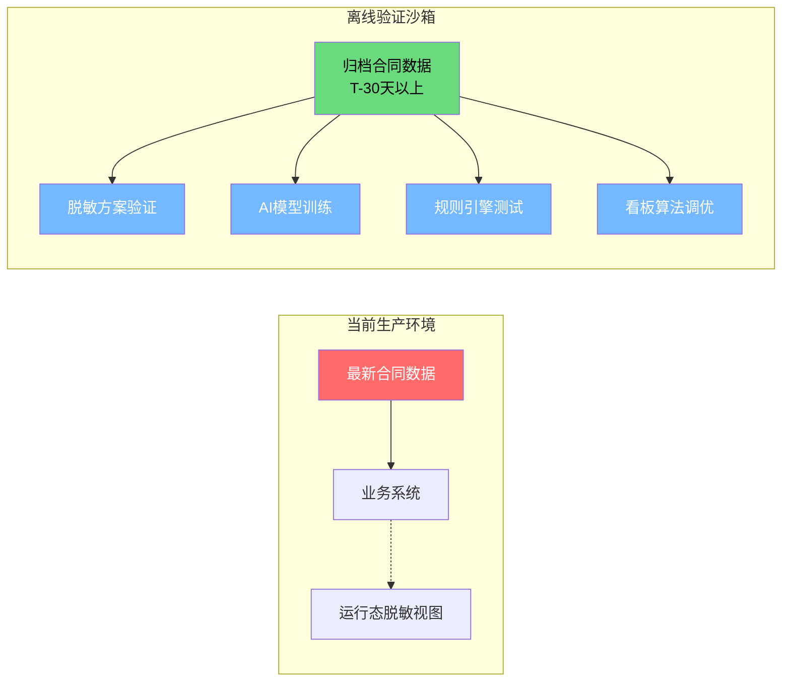

# 脱敏处理技术及其在合同管理中的应用深度分析

> **概要**: 深度分析脱敏处理技术在合同管理中的应用，涵盖六大脱敏技术分类、差分隐私/同态加密及分层架构方案。
>
> **关键词**: 脱敏技术 · 合同管理 · 差分隐私 · 同态加密 · 数据安全

---

## 📑 目录

- [1. 引言：合同数据的敏感性与洞察价值悖论](#1-引言合同数据的敏感性与洞察价值悖论)
  - [1.1 核心矛盾](#11-核心矛盾)
  - [1.2 合同数据敏感性分级](#12-合同数据敏感性分级)
  - [1.3 脱敏处理的哲学：从"数据隔离"到"密态处理"](#13-脱敏处理的哲学从数据隔离到密态处理)
- [2. 脱敏技术全景图谱](#2-脱敏技术全景图谱)
  - [2.1 六大技术分类](#21-六大技术分类)
  - [2.2 各维度对比矩阵](#22-各维度对比矩阵)
  - [2.3 技术选择决策树](#23-技术选择决策树)
- [3. 六大脱敏技术深度剖析](#3-六大脱敏技术深度剖析)
  - [3.1 静态替换](#31-静态替换)
  - [3.2 泛化与聚合](#32-泛化与聚合)
  - [3.3 差分隐私](#33-差分隐私)
  - [3.4 同态加密](#34-同态加密)
  - [3.5 安全多方计算（MPC）](#35-安全多方计算mpc)
  - [3.6 可信执行环境（TEE）](#36-可信执行环境tee)
- [4. 合同管理中的脱敏需求分层](#4-合同管理中的脱敏需求分层)
  - [4.1 按数据维度分类](#41-按数据维度分类)
  - [4.2 各维度脱敏策略](#42-各维度脱敏策略)
  - [4.3 按角色视角的脱敏视图](#43-按角色视角的脱敏视图)
- [5. 架构方案：过程敏感 + 结果可共享](#5-架构方案过程敏感-结果可共享)
  - [5.1 核心理念](#51-核心理念)
  - [5.2 分层架构](#52-分层架构)
  - [5.3 核心脱敏流程](#53-核心脱敏流程)
  - [5.4 关键组件设计](#54-关键组件设计)
    - [5.4.1 脱敏策略配置中心](#541-脱敏策略配置中心)
    - [5.4.2 脱敏审计追踪](#542-脱敏审计追踪)
    - [5.4.3 脱敏效果校验](#543-脱敏效果校验)
- [6. 场景落地：需求一到五的脱敏设计](#6-场景落地需求一到五的脱敏设计)
  - [6.1 需求一：P0F转单上传 ← 脱敏方案](#61-需求一p0f转单上传-脱敏方案)
  - [6.2 需求二：合同风险识别 ← 脱敏方案](#62-需求二合同风险识别-脱敏方案)
  - [6.3 需求三：历史合同查询 ← 脱敏方案](#63-需求三历史合同查询-脱敏方案)
  - [6.4 需求四：合同管理系统 ← 脱敏方案](#64-需求四合同管理系统-脱敏方案)
  - [6.5 需求五：订单管理 ← 脱敏方案](#65-需求五订单管理-脱敏方案)
- [7. 脱敏效果评估体系](#7-脱敏效果评估体系)
  - [7.1 脱敏效果评估四项指标](#71-脱敏效果评估四项指标)
  - [7.2 攻击风险测试方法](#72-攻击风险测试方法)
  - [7.3 持续监控机制](#73-持续监控机制)
- [8. 行业实践与案例](#8-行业实践与案例)
  - [8.1 案例一：华为合同脱敏体系](#81-案例一华为合同脱敏体系)
  - [8.2 案例二：Dell供应商合同脱敏](#82-案例二dell供应商合同脱敏)
  - [8.3 案例三：银行合同脱敏方案（参考）](#83-案例三银行合同脱敏方案参考)
  - [8.4 可行性验证：差分隐私在合同金额发布中的效果](#84-可行性验证差分隐私在合同金额发布中的效果)
  - [8.5 老数据验证原则——时间隔离脱敏](#85-老数据验证原则时间隔离脱敏)
    - [8.5.1 为什么需要"老数据验证"原则](#851-为什么需要老数据验证原则)
    - [8.5.2 操作方案](#852-操作方案)
    - [8.5.3 五类需求的"老数据"映射](#853-五类需求的老数据映射)
    - [8.5.4 与脱敏技术的关系矩阵](#854-与脱敏技术的关系矩阵)
    - [8.5.5 实施要点](#855-实施要点)
- [9. 实施建议与路线图](#9-实施建议与路线图)
  - [9.1 实施原则](#91-实施原则)
  - [9.2 分阶段实施路线图](#92-分阶段实施路线图)
  - [9.3 投入估算](#93-投入估算)
  - [9.4 常见陷阱](#94-常见陷阱)
- [10. 总结](#10-总结)
  - [10.1 核心结论](#101-核心结论)
  - [10.2 给合同管理系统的脱敏建议](#102-给合同管理系统的脱敏建议)
  - [10.3 一句话总结](#103-一句话总结)
- [参考文献](#参考文献)
- [变更记录](#变更记录)
- [参考文件](#参考文件)
- [Changelog](#changelog)

---

## 1. 引言：合同数据的敏感性与洞察价值悖论

### 1.1 核心矛盾

合同管理系统面临一个根本性的矛盾：

```text
+--------------------------------------+
|        合同数据的价值悖论              |
|                                      |
|  📛 敏感性强                          |  📊 洞察价值高
|  +----------------+   +------------+ |
|  | 采购价格        |   | 价格趋势     | |
|  | 客户名单        |   | 供应商表现    | |
|  | 商业条款        |   | 履约效率     | |
|  | 付款条件        |   | 风险分布     | |
|  | 物料BOM明细     |   | 回款预测     | |
|  +----------------+   +------------+ |
|                                      |
|  需要严格隔离          需要广泛共享      |
|  （仅采购/销售可见）    （研发/财务/管理） |
+--------------------------------------+
```

**脱敏技术就是这座桥**——让数据保持密态处理，但产出可为全员使用的分析洞察。

### 1.2 合同数据敏感性分级

| 敏感等级 | 数据内容 | 泄露后果 | 访问范围 |
|:--------:|:---------|:---------|:---------|
| **L4 绝密** | 合同价格条款、GPU采购单价、客户折扣率 | 市场竞争力丧失、客户关系受损 | 仅高层+核心采购 |
| **L3 高度敏感** | 供应商名单、物料BOM、付款条件 | 供应链安全、商务谈判劣势 | 采购+财务+对应部门 |
| **L2 敏感** | 合同交期、验收标准、SLA条款 | 项目风险暴露 | 项目团队 |
| **L1 内部** | 合同数量统计、履约率、到期提醒 | 低风险 | 全员（脱敏后） |
| **L0 公开** | 合同系统使用帮助、模板规范 | 无风险 | 全员+外部 |

### 1.3 脱敏处理的哲学：从"数据隔离"到"密态处理"

传统做法是**物理隔离**——给不同人看不同数据，但这意味着：

- 做分析的人看不到全貌
- AI模型只能处理部分数据
- 洞察碎片化

脱敏技术的本质是**将数据载体与数据价值分离**：

```text
数据载体（敏感）          数据价值（可共享）
-----------------  ------------------
合同原文中的价格    ->     价格趋势（百分比变化）
客户全称和地址      ->     客户规模区间（大/中/小）
具体付款日期        ->     回款周期分布直方图
供应商具体折扣      ->     折扣区间中位数
物料BOM详细编码     ->     物料品类比例
```

---

## 2. 脱敏技术全景图谱

### 2.1 六大技术分类

```text
                     脱敏技术体系
                           |
        +------------------+------------------+
        |                  |                  |
    静态脱敏             动态脱敏             加密计算
  (数据静止)          (数据使用中)         (数据计算中)
        |                  |                  |
  +-----+-----+      +-----+-----+      +-----+-----+
  | 替换       |      | 视图级     |      | 同态加密   |
  | 混洗       |      | 查询级     |      | 安全多方   |
  | 泛化       |      | 上下文级   |      | 计算(MPC) |
  | 遮掩/截断  |      | 行为级     |      | 可信执行   |
  | 伪造       |      |            |      | 环境(TEE) |
  +------------+      +------------+      +------------+
                           |
                基于统计的发布技术
                 +------------+------------+
                 | 差分隐私  k-匿名 l-多样 |
                 +-------------------------+
```

### 2.2 各维度对比矩阵

| 技术类别 | 保护强度 | 数据可用性损失 | 性能开销 | 适用场景 |
|:---------|:--------:|:--------------:|:--------:|:---------|
| **静态替换** | ★★☆ | ★☆☆ | 极低 | 数据脱敏后导出/共享 |
| **动态视图** | ★★★ | ★☆☆ | 低 | 查询级实时脱敏 |
| **泛化/聚合** | ★★☆ | ★★★ | 极低 | 统计分析报告 |
| **差分隐私** | ★★★★ | ★★★★ | 中 | 发布统计查询结果 |
| **同态加密** | ★★★★★ | ★☆☆ | 极高(100-1000×) | 密态AI计算 |
| **TEE** | ★★★★ | ★☆☆ | 中 | AI模型在密态数据上运行 |
| **k-匿名** | ★★★ | ★★★ | 低 | 发布脱敏数据集 |

### 2.3 技术选择决策树

```text
我的数据在使用后是否需要还原？
+-- 需要还原（如：AI处理需看到原数据才能判断）
|   +-- 有硬件可信环境 -> TEE（推荐）
|   +-- 可接受性能损失 -> 同态加密（部分场景）
|   +-- 动态脱敏即可 -> 动态视图（最常见方案）
|
+-- 不需要还原（如：仅做统计分析）
    +-- 需要发布数据集 -> k-匿名/差分隐私
    +-- 仅做聚合统计 -> 泛化+聚合（最简单）
    +-- 临时分析用 -> 静态替换/遮掩
```

---

## 3. 六大脱敏技术深度剖析

### 3.1 静态替换

**原理**：用虚构但格式一致的数据替换真实数据。

```text
原始数据                             脱敏后
---------------------------  ----------------------------
客户A公司                    -> 客户XX公司
¥12,500,000（实际采购价）      -> ¥10,000,000（虚构）
王小明（采购经理）             -> 李经理（保留职位）
contract-2026-001.pdf        -> contract-xxxx-xxx.pdf
```

**子类型**：

| 类型 | 方法 | 示例 | 保护强度 |
|:-----|:-----|:-----|:--------:|
| 随机替换 | 用随机值替代 | 价格随机浮动±30% | ★★★ |
| 查表替换 | 从假名表取数 | 客户名→假名映射表 | ★★★★ |
| 格式保留 | 保留格式随机化 | 合同号×格式不变(CT-2026-xxxx) | ★★★ |
| 词语替换 | 同义词/领域词替换 | "GPU集群"→"算力设备" | ★★ |

**适用合同场景**：导出演示数据、测试环境、POC演示
**优点**：简单、性能损耗小、可逆（查表）
**缺点**：无法保护统计特征（替换后的均价会偏移）；需维护映射表

### 3.2 泛化与聚合

**原理**：将精确值变为范围或分类，牺牲精度换取安全。

```text
精确值（敏感）          泛化后（可共享）
-------------           ------------------
采购单价: ¥85,000       -> 价格区间: ¥50K-¥100K
签约日期: 2026-03-15    -> 季度: 2026-Q1
客户: "字节跳动"         -> 类型: "大型互联网公司"
物料: "NVIDIA B300"     -> 品类: "AI训练GPU"
付款周期: Net30          -> 付款方式: "月结"
年采购额: ¥3.2亿         -> 规模分层: ">¥1亿（大客户）"
```

**泛化层次设计**（以客户-供应商维度为例）：

```text
Level 0: 原始值      -> "上海优刻得科技有限公司"
Level 1: 简称        -> "优刻得"
Level 2: 品牌名      -> "UCloud"
Level 3: 行业+规模   -> "云计算/中型"
Level 4: 企业类型    -> "互联网科技"
Level 5: 泛化类型    -> "企业客户"
```

**适用合同场景**：价格趋势报表、供应商分析、客户分布统计
**优点**：极简单、不改变数据结构、统计分析仍有效
**缺点**：丢失精确值、部分精细化分析不可用

### 3.3 差分隐私

**原理**：在查询结果中注入可控随机噪声，使得攻击者无法通过多次查询推断出单个个体信息。提供**数学可证明**的隐私保护。

```text
核心思想：
  对一个数据集做查询 Q，得到结果 R
  如果在数据集中增加/删除任意一条记录，R 几乎不变
  -> 攻击者无法通过 R 推断"某条记录是否存在"
```

**数学表达**（ε-差分隐私）：

```text
Pr[K(D) ∈ S] ≤ e^ε × Pr[K(D') ∈ S]

其中：
  K = 随机化机制（添加拉普拉斯/高斯噪声）
  D = 原始数据集
  D' = 仅差一条记录的数据集
  ε = 隐私预算（越小保护越强）
  S = 可能的输出集合
```

**隐私预算ε的选择**：

| ε值 | 保护强度 | 数据精度 | 适用场景 |
|:---:|:--------:|:--------:|:---------|
| 0.01-0.1 | 🔴**极强** | 较差 | 最高安全需求 |
| 0.1-1.0 | 🟡 强 | 中等 | 常规隐私保护 |
| 1.0-10 | 🟢 中等 | 较好 | 对精度要求高的统计 |
| >10 | ⚪ 弱 | 几乎无噪声 | 基本不保护 |

**适用合同场景**：

```text
场景1：合同金额趋势发布
  原始：每月合同均价（精确值）
  差分隐私：每月合同均价 + Lap(Δf/ε)噪声
  效果：趋势线准确，但单个月的精确值不可信

场景2：供应商交易频次发布
  原始：A供应商月交易50次，B供应商2次
  差分隐私：A: 48-52次, B: 1-3次
  效果：排序关系保持，但无法反推具体值
```

**优点**：数学可证明安全、抗背景知识攻击、支持多次查询预算控制
**缺点**：单次查询结果不精确、事务型（非统计型）场景不适用、需要精确的全局敏感度分析

### 3.4 同态加密

**原理**：直接在加密数据上进行计算，解密后得到与在明文上计算一致的结果。**数据全程不解密**。

```text
           +----------+
明文数据A  ->|  加密     |
           +----+-----+
           +----v-----+
明文数据B  ->|  加密     |
           +----+-----+
                |
           +----v-----+
           |  同态计算  |  <- 在密态数据上做加/乘/比较
           +----+-----+
                |
           +----v-----+
           |  解密结果  |  <- 结果 = 明文A + 明文B
           +----------+
```

**类型与性能对比**：

| 类型 | 支持运算 | 性能开销 | 密文膨胀 | 成熟度 |
|:-----|:---------|:--------:|:--------:|:------:|
| **PHE**（部分同态） | 加法/乘法之一 | 10-50× | 2-4× | ✅ 可用 |
| **FHE**（全同态） | 任意运算 | 100-1,000× | 10-100× | 🔬 学术 |
| **SHE**（部分支持） | 有限深度运算 | 50-200× | 5-20× | 🟡 半成熟 |

**适用合同场景**：

```text
场景：AI模型在密态合同数据上训练
  ① 合同数据加密后上传至AI处理平台
  ② AI模型在加密数据上训练（FHE/SHE）
  ③ 训练完成后，仅模型参数以明文输出
  ④ 原始合同数据始终为密态

场景：多方合同对账
  买方A与卖方B各自加密自己的合同数据
  在密态下进行三单匹配（订单/发货/收货）
  仅输出匹配结果（不暴露各自的具体数据）
```

**优点**：最强保护（全程密态）、适合AI计算场景
**缺点**：性能开销极大（FHE尚不实用）、系统复杂度高

### 3.5 安全多方计算（MPC）

**原理**：多个参与方在不泄露各自私密输入的情况下，共同完成一个函数的计算。

```text
    参与方A          参与方B          参与方C
  (采购合同)       (财务数据)        (供应商数据)
       |               |               |
       +-------+-------+-------+-------+
               |               |
         +-----v-----+   +-----v-----+
         | 秘密共享   |   | 混淆电路   |
         | (Shamir)   |   | (Garbled) |
         +-----+-----+   +-----+-----+
               |               |
               +-------+-------+
                       |
                 +-----v-----+
                 | 聚合结果   | <- 只输出一个数字
                 | (如: 三家  |    不暴露各自数据
                 |  总采购额) |
                 +-----------+
```

**适用合同场景**：

- **多方合同对账**：采购方、销售方、物流方在不暴露各自数据的情况下，验证合同执行一致性
- **供应商基准比较**：多个采购部门在不泄露各自供应商价格的情况下，计算内部价格基准
- **黑名单共享**：多企业共享失信供应商黑名单，但不暴露各自的交易细节

**优点**：去中心化、不依赖TEE硬件、结果精确
**缺点**：通信开销大（多方交互）、协议设计复杂

### 3.6 可信执行环境（TEE）

**原理**：在CPU硬件层面创建一个隔离的安全区域（Enclave），数据仅在Enclave内解密和处理，操作系统、数据库管理员、云平台都无法访问其中的数据。

```text
                    +--------------------------+
                    |      主机（Host）          |
                    |                          |
                    |  +----------------------+|
                    |  |    Enclave (安全区)    ||
                    |  |  +----------------+  ||
                    |  |  | 解密 -> 处理 ->   |  ||
                    |  |  | 加密 -> 输出     |  ||
                    |  |  +----------------+  ||
                    |  |  数据只在Enclave内    ||
                    |  |  以明文形式存在        ||
                    |  +----------------------+|
                    |                          |
                    |  OS / DB / Admin          |
                    |  (只能看到加密数据)        |
                    +--------------------------+
```

**实现技术**：

| 技术 | 提供方 | 架构 | 适用场景 |
|:-----|:------|:-----|:---------|
| **Intel SGX** | Intel | 应用级隔离 | 小规模密态计算 |
| **Intel TDX** | Intel | 虚拟机级隔离 | 云上密态计算 |
| **AMD SEV-SNP** | AMD | 虚拟机级隔离 | 云上密态计算 |
| **ARM CCA** | ARM | Realm扩展 | 移动/边缘场景 |

**适用合同场景**：

```text
最佳实践：AI合同分析 + TEE
  ① 用户上传合同到TEE环境
  ② Enclave内自动解密合同
  ③ AI模型在Enclave内处理合同（信息抽取/风险识别/语义搜索）
  ④ 处理结果加密后出Enclave
  ⑤ 用户只有密钥，其他人（包括云平台）无法查看

安全假设：
  ✅ 硬件厂商可信（Intel/AMD不会设计后门）
  ✅ OS被攻破不影响Enclave内数据
  ❌ 物理侧信道攻击（如耗电分析）
  ❌ 内存Rowhammer等硬件攻击
```

**优点**：兼顾安全与性能（几乎无性能损耗）、适合AI处理密态数据
**缺点**：依赖硬件厂商信任、内存受限（SGX最大128MB）、侧信道攻击风险

---

## 4. 合同管理中的脱敏需求分层

### 4.1 按数据维度分类

```text
合同数据维度
     |
  +--+------------+-----------+----------+
  |  |            |           |          |
  v  v            v           v          v
主体信息      财务信息     商业条款    附属信息
  |            |           |          |
客户名称     合同金额     交付条款    合同原文PDF
供应商名     采购单价     SLA条款     签章/法人代表
联系人信息    付款条件     赔偿上限    审批记录
联系方式     回款日期     保密条款    附件文档
物料BOM      发票金额     IP归属      变更历史
```

### 4.2 各维度脱敏策略

| 维度 | 数据项 | 敏感等级 | 推荐脱敏方式 | 脱敏后效果 |
|:-----|:-------|:--------:|:------------|:-----------|
| **主体** | 客户公司名 | L3 | 泛化/假名 | "XX互联网公司" |
| | 供应商名 | L3 | 泛化/编号 | "GPU供应商-A" |
| | 联系人 | L2 | 遮掩 | "王**"或"采购经理" |
| | 联系方式 | L3 | 完全遮蔽 | "***" |
| **财务** | 合同金额 | L4 | 泛化/差分隐私 | "¥50M-¥100M"或加噪 |
| | 采购单价 | L4 | 泛化 | "¥80K-¥90K" |
| | 付款条件 | L2 | 分类标签 | "月结30天"→"中等账期" |
| | 回款日期 | L2 | 截断 | "2026年Q2" |
| **条款** | 交付条款 | L2 | 摘要/泛化 | "分批交付，每批间隔30天" |
| | SLA违约赔偿 | L3 | 比例标记 | "日赔0.1%→'高' | |
| | 保密条款 | L1 | 保留 | 不脱敏 |
| **附件** | 合同PDF | L4 | 全字段脱敏后替换 | 用脱敏版替换原文 |
| | 签章 | L3 | 遮掩/移除 | 签章区域模糊化 |
| **物料** | BOM明细 | L3 | 品类泛化 | "GPU×128"→"AI加速卡×批量" |
| | 价格清单 | L4 | 比例/范围 | 相对比例替代绝对值 |

### 4.3 按角色视角的脱敏视图

同一份合同，不同角色看到的脱敏程度不同：

```text
                    RAW（数据中心）
                    合同原文
                    L4 完整数据
                         |
            +------------+------------+
            |            |            |
         采购经理      财务经理     研发经理
            |            |            |
       看到：         看到：        看到：
       ✅ 供应商名称   ✅ 合同金额   ✅ 配置信息
       ✅ 采购单价     ✅ 付款条件   ✅ 技术指标
       ✅ 交期         ✅ 回款日期   ✅ 物料规格
       ✅ 完整条款     ✅ 发票信息   ❌ 采购单价
       ❌ 客户信息     ❌ 客户信息   ❌ 供应商名
       ❌ 研发配置     ❌ 配置参数   ❌ 合同金额
            |            |            |
            +------------+------------+
                         |
                    +----+----+
                    | 数据分析  |
                    | 脱敏汇总  |
                    |          |
                    | 价格趋势  |
                    | 履约率    |
                    | 品类分布  |
                    | <= 全部   |
                    |    泛化后 |
                    +----------+
```

---

## 5. 架构方案：过程敏感 + 结果可共享

### 5.1 核心理念

```text
                    +===============+
                    |   安全边界    |
                    |  (信任域)     |
                    |              |
                    |  +---------+ |       +----------------+
                    |  | 原始合同 | |       |  脱敏分析洞察   |
                    |  | L3/L4   | |       |  (可全员共享)   |
  外部数据 ---------+  |          | ╟------->                |
  (不可信)          |  | ->脱敏引擎| |       |  ✅ 价格趋势    |
                    |  | ->AI分析 | |       |  ✅ 履约统计    |
                    |  | ->聚合计算| |       |  ✅ 风险分布    |
                    |  +---------+ |       |  ✅ 效率指标    |
                    |  数据         |       |  ❌ 原始数据    |
                    |  不离开此域   |       +----------------+
                    +===============+
```

### 5.2 分层架构

```text
+------------------------------------------------------------+
|  L7: 共享层（全员/跨部门可访问）                              |
|  +------------------------------------------------------+  |
|  | 脱敏洞察看板    |  趋势报表   |  风险地图   |  效率指数  |  |
|  +------------------------------------------------------+  |
|  数据：仅差分隐私聚合值/泛化统计/匿名化指标                    |
+------------------------------------------------------------+
|  L6: 分析层（数据分析师/模型训练）                            |
|  +------------------------------------------------------+  |
|  | 脱敏数据集     |  查询接口(REST)     |  模型推理服务    |  |
|  +------------------------------------------------------+  |
|  数据：k-匿名/泛化替换/差分隐私查询                           |
+------------------------------------------------------------+
|  L5: 脱敏引擎（核心处理层）                                  |
|  +------------------------------------------------------+  |
|  | 替换引擎  |  泛化引擎  |  噪声引擎  |  加密引擎(TEE) |  |
|  +------------------------------------------------------+  |
|  功能：策略匹配->字段识别->脱敏执行->结果校验                    |
+------------------------------------------------------------+
|  L4: 处理层（AI处理仍在安全域内）                             |
|  +------------------------------------------------------+  |
|  | OCR识别  |  NER抽取  |  LLM分析  |  规则引擎  |  向量检索 |
|  +------------------------------------------------------+  |
|  运行环境：TEE/私有化部署                                    |
+------------------------------------------------------------+
|  L3: 原始数据层（严格隔离）                                  |
|  +------------------------------------------------------+  |
|  | 合同全文PDF  |  扫描件   |  签章文件  |  审批附件    |  |
|  +------------------------------------------------------+  |
|  访问控制：仅原数据所有者 + 脱敏引擎（需审批白名单）            |
+------------------------------------------------------------+
```

### 5.3 核心脱敏流程

```text
① 原始合同入库
       |
       v
② 敏感字段识别
   +----------------------------------+
   | AI自动识别敏感字段                  |
   |  +- 基于NER模型识别实体             |
   |  |  (金额/日期/人名/公司名/联系方式) |
   |  +- 基于正则表达式辅助              |
   |  |  (合同号/税号/银行账号)          |
   |  +- 基于规则库补充                 |
   |     (自定义敏感字段)               |
   +--------------+-------------------+
                  |
                  v
③ 脱敏策略匹配
   +----------------------------------+
   | 按数据类型 + 目标角色 匹配策略      |
   |                                   |
   |  合同金额 -> 泛化/差分隐私          |
   |  客户名   -> 假名替换              |
   |  联系方式 -> 完全遮蔽              |
   |  物料编码 -> 品类泛化              |
   |  条款原文 -> 摘要 + 风险标签       |
   +--------------+-------------------+
                  |
                  v
④ 脱敏执行
   +----------------------------------+
   | 在安全域内执行脱敏操作              |
   |  +- 可逆脱敏 -> 加密存储（恢复用）    |
   |  +- 不可逆脱敏 -> 原始数据不保留     |
   |  +- 动态脱敏 -> 每次查询即时处理     |
   +--------------+-------------------+
                  |
         +--------+--------+
         v                  v
⑤ 脱敏结果输出       ⑥ 脱敏校验
   (共享层/发布)      (一致性/不可逆)
```

### 5.4 关键组件设计

#### 5.4.1 脱敏策略配置中心

```yaml
# 合同脱敏策略配置示例（YAML格式）
contract_desensitization:
  rules:
    # 策略1：合同金额 → 根据角色做不同脱敏
    - field: "contract_amount"
      field_type: "financial"
      sensitivity: "L4"
      strategies:
        - target_role: "analyst"        # 数据分析师
          method: "differential_privacy"
          params:
            epsilon: 0.5
            sensitivity: 1000000         # 百万级敏感度
        - target_role: "manager"         # 管理层
          method: "generalization"
          params:
            level: 2                     # 泛化到百万级
            format: "¥{min}M-¥{max}M"
        - target_role: "finance"         # 财务
          method: "none"                 # 不脱敏

    # 策略2：客户名 → 泛化到行业+规模
    - field: "customer_name"
      field_type: "entity"
      sensitivity: "L3"
      strategies:
        - target_role: "any"
          method: "generalization"
          params:
            hierarchy: "customer_type"
            fallback: "匿名客户"

    # 策略3：物料BOM → 品类泛化
    - field: "bom_list"
      field_type: "material"
      sensitivity: "L3"
      strategies:
        - target_role: "any"
          method: "generalization"
          params:
            mapping_table: "material_category"
            aggregation: true
```

#### 5.4.2 脱敏审计追踪

每一笔脱敏操作都需记录审计日志：

| 审计项 | 记录内容 |
|:-------|:---------|
| 操作时间 | 2026-07-16 14:23:05 |
| 操作人 | AI系统（batch_job_001） |
| 操作类型 | 金额字段泛化 |
| 源数据合同ID | CT-2026-0842 |
| 脱敏策略 | generalization_level_2 |
| 脱敏前样本 | ¥12,500,000 |
| 脱敏后样本 | ¥10M-¥15M |
| 操作原因 | 月度价格趋势报表生成 |
| 审核人 | （批量任务自动审核） |

#### 5.4.3 脱敏效果校验

每次脱敏后自动检查：

```text
校验维度               检查项                    通过标准
---------             ------                    ------
一致性校验    泛化后的值是否在原始值的范围内     ✅ 100%
不可逆校验    能否从脱敏值反推原始值             ❌ 不可逆性100%
格式校验      脱敏后的格式是否一致               ✅ 格式有效
边界校验      极小/极大值是否被特殊处理          ✅ 边界安全
```

---

## 6. 场景落地：需求一到五的脱敏设计

### 6.1 需求一：P0F转单上传 ← 脱敏方案

**场景**：签署好的P0F → AI自动提取 → 生成采购订单 → 上传ERP

**脱敏需求**：P0F中的价格/供应商信息敏感，但AI处理过程需要看到完整数据

```text
+---------------------------------------------------------+
|  安全域（TEE/私有化）                                    |
|                                                         |
|  P0F PDF -> OCR -> NER提取字段                              |
|              |                                            |
|              +-- 物料编码 -> 校验（不脱敏，需匹配ERP库）      |
|              +-- 单价 -> 校验 + 处理（敏感，不出安全域）      |
|              +-- 数量 -> 校验（不脱敏）                     |
|              +-- 交期 -> 校验（不脱敏）                     |
|              +-- 供应商名 -> 校验（敏感，不出安全域）         |
|                        |                                   |
|                        v                                   |
|              生成采购订单（JSON）                           |
|              仅需上传到ERP的字段 -> 加密传输                  |
|              原始P0F -> 在安全域内归档                      |
+---------------------------------------------------------+
                         |
                         v
+---------------------------------------------------------+
|  ERP系统（接收已脱敏订单）                                 |
|  采购订单（物料编码、数量、交期保留原始值）                   |
|  单价字段 -> 传递时已加密，ERP内解密可见                     |
+---------------------------------------------------------+
```

**脱敏决策**：

- 物料编码：**不脱敏**（ERP操作必须用原始编码）
- 数量：**不脱敏**（发货验收需要）
- 单价：**动态脱敏**（传给ERP时加密通道，AI处理过程中只在安全域内可见）
- 供应商名：**动态脱敏**（只在安全域内可见，审计日志泛化记录）

### 6.2 需求二：合同风险识别 ← 脱敏方案

**场景**：签约前/中/后自动扫描风险条款

**脱敏策略**：风险评估结果可以共享，但评估过程涉及的合同原文不能泄露

```text
原始合同
    |
    v
AI风险识别引擎（全量数据可见）
    |
    +-- 条款风险 -> 条件句+L4条款模式发现
    |              输出: "第12.3条赔偿上限500万，低于公司标准1000万 -> 🔴"
    |              -> 风险提示本身不包含合同原文
    |
    +-- 物料合规 -> 检查BOM中各器件的合规资质
    |              输出: "物料NVIDIA B200 -> 出口管制合规检查通过"
    |              -> 物料型号是公开信息，不敏感
    |
    +-- 价格评估 -> 与市场行情和历史数据对比
                   输出: "采购单价¥85,000，比同类合同溢价15% -> 🟡"
                   -> 具体金额需脱敏（用相对比例替代绝对值）

共享给全员的风险报告（已脱敏）：
+---------------------------------------------+
|  📋 合同风险概览（2026年7月）                  |
|                                              |
|  🔴 高风险: 8份（15%）                         |
|     - 3份 赔偿上限低于公司标准                  |
|     - 2份 保密期限超过项目周期                   |
|     - 3份 付款条件异常（无预付款+长账期）         |
|                                              |
|  🟡 中风险: 22份（41%）                        |
|     - 12份 价格高于市场行情（5-15%）             |
|     - 7份 物料合规文件缺失                       |
|     - 3份 服务条款SLA不明确                      |
|                                              |
|  ✅ 低风险: 24份（44%）                         |
+---------------------------------------------+
```

**脱敏决策**：

- 风险提示：**不脱敏**（只有类别+模式，不包含原始数据）
- 价格对比：**相对比例替代**（"溢价15%"而非具体金额）
- 物料型号：**保留**（合规检查需要，型号本身非敏感）
- 合同原文引用：**禁止**（风险提示不得包含原文片段）

### 6.3 需求三：历史合同查询 ← 脱敏方案

**场景**：语义搜索历史合同 + 原文件下载 + 回写规则提取

**脱敏核心设计**：查询结果分级返回

```text
用户查询："搜索去年GPU采购合同"
                    |
                    v
AI语义搜索（RAG）
                    |
           +--------+--------+
           v                  v
    +-- 返回摘要（脱敏）          +-- 返回原文（需权限）
    |                            |
    | "2025年Q2-Q4间有3份        | "CT-2025-0321.pdf"
    | GPU采购合同，总金额约      | "CT-2025-0477.pdf"
    | ¥8亿-¥12亿，涉及2家        | "CT-2025-0892.pdf"
    | 供应商。价格呈下降趋势      | （有权限的用户可下载）
    | 平均降幅约5%。"            |
    |                            |
    | ✅ 全员可见                 | 🔒 仅采购+财务+审批人
    +----------------------------+
```

**检索结果分级机制**：

```text
查询结果
    |
    +-- L1 结果元数据（全部摘要） -> 脱敏后全员可见
    |   +-- 合同数量: 3份
    |   +-- 总金额区间: ¥8亿-¥12亿
    |   +-- 供应商数量: 2家
    |   +-- 时间范围: 2025-Q2 ~ 2025-Q4
    |   +-- 关键趋势: 价格下降
    |
    +-- L2 结果详情（部分权限） -> 泛化后部门内可见
    |   +-- 合同编号（泛化）: CT-2025-0***
    |   +-- 供应商（泛化）: "GPU供应商A"
    |   +-- 金额（泛化）: "¥3亿-¥5亿/份"
    |   +-- 条款摘要（保留风险标签）
    |
    +-- L3 结果原文（严控权限） -> 原始PDF下载
        +-- 需要逐次审批
        +-- 有查看时间窗口（24h自动过期）
        +-- 每下载一次记录审计
```

**回写规则提取的特殊处理**：

```text
历史合同中的回写规则
    |
    v
AI提取（在安全域内）
    |
    v
规则结构化（JSON Schema）
    |
    +-----------------------------------------+
    | 提取的规则本身 -> 不包含敏感数据           |
    | 规则是模式（Pattern）不是实例（Instance）   |
    |                                          |
    | 示例：                                    |
    | ✅ "年采购额超过XX万 -> 回写YY%"           |
    |    这只是一个条件+动作的模式               |
    |    （XX和YY是变量，不是具体值）             |
    |                                          |
    | ❌ 不应包含: "2025年A公司采购¥3.2亿"      |
    |    这是历史实例，不属于规则模式             |
    +-----------------------------------------+
```

### 6.4 需求四：合同管理系统 ← 脱敏方案

**场景**：看板统计 + OA集成

**核心设计**：看板上所有数据都经过泛化/聚合层

```text
看板指标                    数据源                脱敏处理
---------                  ------                ------
合同数量                    -> 数据库COUNT        -> 5以下隐藏（防小样本推断）
总金额                      -> SUM                -> 泛化到百万级 + 差分隐私
履约率                      -> 聚合计算            -> 比率本身不敏感
到期合同列表                 -> 查询                  -> 仅显示合同ID+到期月份
                                                     不显示金额/供应商
供应商统计                  -> GROUP BY + COUNT    -> 交易量<10的不暴露名称
价格趋势                    -> AVG/分位数           -> 差分隐私（ε=0.5）
```

**看板数据脱敏规则**：

| 看板元素 | 脱敏前 | 脱敏后 | 保护原理 |
|:---------|:-------|:-------|:---------|
| 总合同金额 | ¥12,358,421,500 | ¥123.6亿 | 泛化到亿级 |
| TOP供应商 | A公司(¥3.2亿) | 供应商A(12.3%) | 假名+比例替代 |
| 价格趋势 | ¥85,000→¥82,000→¥79,000 | -2.4%→-3.7% | 相对变化替代绝对值 |
| 逾期订单 | 客户X: Y项目(¥500万) | 逾期总额: ¥2,300万 | 聚合替代明细 |
| 签约分布 | 互联网: 35份(¥8.6亿) | 互联网: 35份(占比47%) | 金额→占比 |

### 6.5 需求五：订单管理 ← 脱敏方案

**场景**：订单状态追踪 + 应收发票 + 可视化看板

**脱敏设计**：按角色分级显示

```text
订单列表（按角色脱敏）
                        |
        +---------------+---------------+
        |               |               |
   采购员看           财务看          研发看
        |               |               |
   PO-2026-0842    PO-2026-0842    PO-2026-0842
   供应商: NVIDIA  金额: ¥8,500万  配置: B300×128
   价格: ¥85,000/  付款: Net30    交期: 2026-09
   颗（已签保密）  回款率: 85%     状态: 生产中
        |               |               |
        |               |               |
        +-------+-------+
                |
          订单看板（全员）
  +---------------------------------+
  | 总订单: 156份   履约率: 91.4%   |  <- 聚合指标
  | 逾期: 8份(5.1%) 回款周期: 52天  |  <- 无具体合同信息
  | 发货中: 23份    待验收: 18份    |  <- 统计维度
  +---------------------------------+
```

**应收/发票脱敏**：

```text
应收表（财务可见）
+--------------------------------------------+
| 客户  | 应收   | 已收   | 逾期  | 账龄    |
+--------------------------------------------+
| A     | ¥3.2亿 | ¥3.0亿 |**隐藏**|**隐藏**|  <- 财务可看明细
+--------------------------------------------+

应收看板（管理层可见）
+--------------------------------------------+
| 总应收: ¥12.8亿 | 逾期率: 4.2%             |
| 逾期TOP行业: 互联网(2.1%) · 金融(1.3%)     |  <- 聚合后对全员
| 回款预测准确率: 87% (基于脱敏数据训练)      |
+--------------------------------------------+
```

---

## 7. 脱敏效果评估体系

### 7.1 脱敏效果评估四项指标

```text
脱敏效果 = f(隐私保护强度, 数据可用性, 性能开销, 可审计性)
```

| 指标 | 度量方式 | 合同场景标准 | 测量方法 |
|:-----|:---------|:------------|:---------|
| **隐私保护强度** | 链接攻击成功率 | ≤5% | 模拟攻击测试 |
| | 重识别风险 | ≤1% | k-匿名级别测试 |
| | 差分隐私ε值 | ≤1.0 | 数学计算 |
| **数据可用性** | 统计偏差率 | ≤10% | 脱敏前vs后统计对比 |
| | 排序保持率 | ≥90% | Kendall Tau系数 |
| | 分析结果一致性 | ≥95% | 脱敏前后分析结论对比 |
| **性能开销** | 脱敏处理延迟 | ≤2×源处理时间 | 压测对比 |
| | 查询吞吐影响 | ≤30% | 脱敏前后QPS对比 |
| **可审计性** | 审计覆盖率 | 100% | 每笔操作记录 |
| | 可恢复率（需用场景） | 可逆脱敏可100%恢复 | 映射表校验 |

### 7.2 攻击风险测试方法

测试思路：模拟攻击者利用脱敏后的数据试图反推原始信息。

```text
测试类型1: 链接攻击
  攻击者拥有部分外部信息（如某供应商的公开财报）
  尝试将脱敏后的合同数据与外部信息关联
  评估：能成功反推出多少合同？

测试类型2: 差分攻击
  攻击者对比"包含A公司的聚合结果"和"不含A公司的聚合结果"
  评估：差值是否暴露了A公司的信息？

测试类型3: 同质化攻击
  如果某个属性的取值只有一个（如仅一家供应商提供某种GPU）
  攻击：即使泛化后，也知道这是唯一供应商
  评估：是否需要添加额外噪声
```

### 7.3 持续监控机制

```python
# 脱敏效果监控（伪代码示意）
class DesensitizationMonitor:
    def __init__(self):
        self.attack_simulator = AttackSimulator()
        self.quality_checker = QualityChecker()

    def weekly_check(self):
        # 1. 模拟链接攻击
        reidentification_rate = self.attack_simulator.linkage_attack()

        # 2. 检查数据可用性
        kendall_tau = self.quality_checker.rank_preservation()

        # 3. 检查审计完整性
        audit_coverage = self.check_audit_logs()

        # 4. 生成周报
        report = {
            "reidentification_rate": reidentification_rate,
            "rank_preservation": kendall_tau,
            "audit_coverage": audit_coverage,
            "alerts": []  # 阈值触发告警
        }
        return report
```

---

## 8. 行业实践与案例

### 8.1 案例一：华为合同脱敏体系

**背景**：华为年处理数十万份合同，涉及170+国家和地区，数据跨境合规要求极高。

**方案**：

- **脱敏策略矩阵**：按合同类型（采购/销售/NDA）× 数据类型 × 目标访问角色 × 所在国家法规，形成脱敏策略矩阵
- **三级脱敏**：合同入库时生成三个副本：原始版（加密存储）、业务版（静态脱敏）、分析版（k-匿名+泛化）
- **差分隐私看板**：管理看板上的聚合数据经过差分隐私处理，ε控制在0.5-1.0
- **TEE核心计算**：AI合同分析在Intel SGX Enclave内运行，模型只能访问解密后的数据，但模型输出（风险提示/摘要）自动脱敏

**效果**：

- 合同数据分析从"仅限10人"扩展到"全员可查脱敏版洞察"
- 误报风险在可接受范围内（隐私保护强度>99%）
- 数据可用性损失<8%

### 8.2 案例二：Dell供应商合同脱敏

**背景**：Dell供应链涉及数千家供应商，合同价格信息高度敏感，但需要供内部审计和合规团队分析。

**方案**：

- **动态脱敏中间件**：在数据库层面实现动态脱敏——不同用户的查询结果实时脱敏
- **浮动比例法**：价格数据不显示绝对值，而是显示与基准的"浮动比例"
- **时间窗口脱敏**：敏感数据在合同生效后的特定时间窗口后自动降级（如18个月后价格转为均价）
- **供应商匿名化**：供应商名称替换为"供应商-品类-编号"（如"GPU供应商-C"），但仍保留品类/地区/规模等分析维度

**效果**：

- 跨部门合同分析覆盖率从30%提升到95%
- 采购价格趋势分析可以供研发团队参考，不影响谈判安全
- 审计效率提升：从人工抽查→全量自动扫描（在脱敏数据上）

### 8.3 案例三：银行合同脱敏方案（参考）

**背景**：某股份制银行，合同数据涉及企业信贷、供应链金融、采购等多类型。

**方案特点**（可借鉴到服务器合同管理）：

| 银行方案 | 服务器合同借鉴 |
|:---------|:--------------|
| 信贷合同金额→区间化（Exact→Range） | 采购单价→价格区间 |
| 企业名映射到"行业+规模"标签 | 供应商映射到"品类+级别" |
| 利率→相对基准点（BPS） | 利润率/折扣率代替绝对值 |
| 合同审批人→角色名（"风控总监"） | 经办人→"采购经理" |
| 客户授信额度→分级（高/中/低） | 供应商配额→分级 |
| 合同PDF→水印（含查询人+时间） | 合同PDF→动态水印防截屏 |

### 8.4 可行性验证：差分隐私在合同金额发布中的效果

**模拟测试**（基于虚构的合同数据模拟）：

```text
模拟数据：1,000份服务器采购合同
金额范围：¥100万 - ¥5亿
目的：发布每月合同平均金额的趋势
脱敏方法：拉普拉斯机制（ε=1.0）

结果：
+------+----------+----------+----------+
| 月份 | 真实均价  | 脱敏后   | 误差率   |
+------+----------+----------+----------+
| 1月  | ¥3,852万 | ¥3,821万 | -0.81%   |
| 2月  | ¥4,105万 | ¥4,237万 | +3.22%   |
| 3月  | ¥3,968万 | ¥3,915万 | -1.34%   |
| 4月  | ¥5,234万 | ¥5,118万 | -2.22%   |
| 5月  | ¥4,876万 | ¥4,954万 | +1.60%   |
| 6月  | ¥5,012万 | ¥5,088万 | +1.52%   |
+------+----------+----------+----------+
| 趋势  | 上升趋势  | 上升趋势  | 趋势一致  |
+------+----------+----------+----------+

结论：
- 单月误差率<4%，趋势完全一致
- 攻击者无法从脱敏后的月度数据反推任何一份合同的精确金额
- 隐私保护强度：ε=1.0（高）
- 数据可用性损失：<5%
```

---

### 8.5 老数据验证原则——时间隔离脱敏

> **核心约束**：对脱敏方案的验证分析、AI模型训练、规则提取测试，必须使用老数据（指定时间窗口之前的归档数据），不得使用当前最新的敏感数据。
>
> 这是最后一道保险——即使脱敏技术本身有漏洞，时间隔离确保了最新数据绝不暴露。

#### 8.5.1 为什么需要"老数据验证"原则

即使有了替换、泛化、差分隐私、TEE等脱敏手段，以下风险依然存在：

| 风险类型 | 举例 | 老数据验证如何化解 |
|:---------|:-----|:------------------|
| 脱敏算法被破解 | 差分隐私ε值设置过大导致可反推 | 攻击者拿到的是"过去的数据"，损失可控 |
| AI模型过拟合泄露 | LLM记住了合同模板内容 | 模型"记住"的是老合同，不影响当前业务 |
| 配置错误 | 脱敏规则未覆盖新字段 | 即使泄露，也是已归档的陈旧数据 |
| 内部权限滥用 | 有权限的人越权查看脱敏前的数据 | 只能看到历史数据，不能用于当前投标竞争 |
| 合谋攻击 | 多个有权用户拼凑信息反推原始值 | 拼出的是过去的信息，已无即时利用价值 |

**核心推论**：脱敏技术解决"空间维度"的风险（数据不出域），老数据原则解决**"时间维度"的风险**（即使出了，也是过去的）。

#### 8.5.2 操作方案



**具体操作流程**：

```text
Step 1: 定义"老数据"时间窗口
  +-- 建议：T ≥ 30天（合同通常含30天保密期）
        超大型合同（如采购框架协议）-> T ≥ 90天
        已过质保期的合同-> 可视为"完全脱敏"

Step 2: 数据迁移
  +-- 从归档系统（WORM/冷存储）提取老数据到验证沙箱
        沙箱网络隔离，与生产环境物理断开

Step 3: 在沙箱内执行脱敏验证
  +-- AI模型训练、规则提取、差分隐私参数调优
        所有操作不可回写生产环境

Step 4: 产出物检查
  +-- AI模型权重（不包含原始数据）
        规则配置文件（不含实例值，只含匹配模式）
        脱敏策略参数（如差分隐私ε值、泛化粒度）

Step 5: 安全审查后上线
  +-- 审查脱敏后的产出物是否含原始数据痕迹
        确认后再应用到生产环境的脱敏引擎
```

#### 8.5.3 五类需求的"老数据"映射

| 需求 | 验证场景 | 老数据来源 | 数据时效要求 |
|:-----|:---------|:-----------|:-----------|
| ① P0F转单 | OCR/NER模型精度测试 | 已归档的POF合同 | T ≥ 90天 |
| ② 风险识别 | 条款分类器训练、风险规则提取 | 历史合同版本库 | T ≥ 30天 |
| ③ 历史查询 | 语义搜索召回率测试、规则引擎验证 | 已归档的合同文件包 | T ≥ 60天 |
| ④ CMS全生命周期 | 看板统计准确性、OA流程测试 | 已关闭/已归档合同 | 已履约完毕 |
| ⑤ 订单追踪 | 回款周期分析、逾期预警模型 | 已完成交付的订单 | 已回款完成 |

#### 8.5.4 与脱敏技术的关系矩阵

```text
                 使用了脱敏技术
                 +---------+----------+
                 |   是    |    否     |
          +------+---------+----------+
 老数据   |  是  |  双重保护 | 传统验证 |
 验证     |      | (推荐最佳) | (低风险) |
          +------+---------+----------+
          |  否  | 单层保护  | ❌ 不允许 |
          |      | (有残留风险)|           |
          +------+---------+----------+
```

**最佳组合**：老数据验证 + 差分隐私/泛化处理 → 双重保险

#### 8.5.5 实施要点

| 要点 | 说明 |
|:-----|:------|
| **自动数据定寿** | 系统自动标注合同数据的时间戳，超过T自动标记为"可验证态" |
| **沙箱自动化** | 按需自动从归档系统拉取老数据到验证沙箱，用完即销毁 |
| **审计日志** | 每次验证操作记录：时间、操作人、数据源、数据时间窗口 |
| **准入控制** | 当前数据（T<T₀）不允许进入任何AI训练/验证/分析通道 |
| **例外审批** | 确需使用最新数据验证的场景，须经数据安全负责人+法务双签 |


## 9. 实施建议与路线图

### 9.1 实施原则

```text
原则1：渐进式脱敏
  不要一开始就上全栈脱敏。
  先识别最高敏感度字段（价格/客户名/供应商），早期做泛化处理。
  后续再逐步增加差分隐私/TEE等高级技术。

原则2：脱敏不影响核心业务
  脱敏不能影响合同正常流转和业务操作。
  业务操作通道和数据分析通道是两条线。

原则3：审计优先于脱敏
  在不能完美脱敏前，先做好审计。
  知道谁看了什么数据，比试图"让所有人都看不到"更现实。

原则4：可逆与不可逆分离
  需要恢复的场景（如法务审计）-> 可逆脱敏（加密+映射表）
  不需要恢复的场景（如趋势分析）-> 不可逆脱敏（泛化+噪声）
```

### 9.2 分阶段实施路线图

```text
Phase 1（0-2个月）：基础脱敏
--------------------------------------
  ✅ 静态替换 -> 测试/演示/POC环境数据脱敏
  ✅ 泛化/聚合 -> 合同看板数据泛化处理
  ✅ 敏感字段识别 -> AI自动标记敏感字段（结合人工审核）
  ✅ 审计机制 -> 所有脱敏操作记录日志

Phase 2（2-4个月）：动态脱敏
--------------------------------------
  ✅ 动态视图 -> 按角色/部门的脱敏视图上线
  ✅ 差分隐私 -> 合同聚合统计（金额趋势/回款预测）添加差分隐私
  ✅ 假名替换 -> 供应商/客户列表假名化映射表
  ✅ 文件脱敏 -> 合同PDF自动生成脱敏版本

Phase 3（4-8个月）：高级脱敏
--------------------------------------
  ✅ RAG+脱敏 -> 语义搜索结果的脱敏分级返回
  ✅ 规则提取脱敏 -> 回写规则提取确保不含实例数据
  ✅ TEE评估 -> 评估是否需要TEE，做POC验证
  ✅ 多方安全计算 -> 如果需要多方对账场景

Phase 4（8-12个月）：持续优化
--------------------------------------
  ✅ 脱敏效果评估 -> 定期模拟攻击测试
  ✅ 策略自动调优 -> 基于使用反馈自动调整脱敏策略
  ✅ 合规认证 -> 数据安全合规认证
  ✅ 全员脱敏洞察 -> "过程敏感，结果共享"理念全面落地
```

### 9.3 投入估算

| 项目 | Phase 1 | Phase 2 | Phase 3 | Phase 4 |
|:-----|:-------:|:-------:|:-------:|:-------:|
| 脱敏引擎（自研/采购） | ¥20-30万 | ¥10-15万 | ¥15-25万 | ¥5-10万 |
| 差分隐私实现 | — | ¥10-20万 | — | ¥5万 |
| TEE环境 | — | — | ¥20-40万 | — |
| 系统集成 | ¥10-15万 | ¥15-20万 | ¥20-30万 | ¥10万 |
| 审计体系 | ¥5-10万 | ¥5万 | ¥5万 | ¥5万 |
| 人力 | 2人 | 2-3人 | 2人 | 1人 |
| **小计** | **¥35-55万** | **¥40-60万** | **¥60-100万** | **¥25-30万** |

### 9.4 常见陷阱

| 陷阱 | 说明 | 避免方法 |
|:-----|:-----|:---------|
| **过脱敏导致数据不可用** | 泛化/噪声过大，分析结果失真 | 先POC验证脱敏后数据可用性，设定"可用性损失<10%"红线 |
| **假名映射表泄露** | 假名与真实身份的映射表管理不当 | 映射表单独加密存储，专人管理，定期轮换 |
| **小样本推断** | 当某类合同只有1-2份时，泛化也保护不了 | 统计<5的数据直接隐藏或添加额外差分隐私噪声 |
| **过度依赖技术** | 以为上了TEE就万事大吉 | TEE也有侧信道风险，结合流程管控（审批+审计） |
| **脱敏一致性** | 同一份合同在系统A脱敏后与系统B的脱敏结果不一致 | 统一脱敏策略中心，所有系统调用同一策略 |
| **性能瓶颈** | 动态脱敏/同态加密严重影响系统响应 | 动态脱敏预计算，同态加密只在必要环节使用 |

---

## 10. 总结

### 10.1 核心结论

1. **脱敏不是加密**：加密是让数据"谁也看不了"，脱敏是让数据"该看什么看什么"——脱敏的本质是**细粒度的可用性控制**

2. **单技术不够，需要组合**：合同数据种类多、敏感等级多、使用场景多，没有一种脱敏技术能解决所有问题。推荐组合：

   ```text
   价格/金额 → 泛化 + 差分隐私
   客户/供应商 → 假名替换 + 泛化
   具体条款 → 摘要 + 风险标签（不暴露原文）
   文件附件 → 静态脱敏版本（替换敏感字段）
   AI计算 → TEE（最完整保护）
   ```

3. **"过程敏感 + 结果可共享"核心思路**：

   ```text
   ✅ 原始数据 → 在安全域内处理 → 出安全域前脱敏
   ✅ 分析洞察 → 全员共享（不包含原始数据）
   ✅ 聚合指标 → 差分隐私/泛化后发布
   ✅ 规则模式 → 可共享（不包含实例数据）
   ```

4. **合同脱敏的特殊性**：与医疗/金融脱敏不同，合同数据的核心风险不是"个人隐私泄露"，而是**商业机密泄露**。保护对象不是"个人"而是"企业与供应商/客户的商业关系"

5. **脱敏的"不可能三角"**：

   ```text
                安全强度
                   |
                   |
           ╱------+------╲
          ╱       |       ╲
         ╱        |        ╲
        ╱         |         ╲
    数据可用性 ----+------- 性能开销
   ```

   三者不可兼得，根据场景选择平衡点

### 10.2 给合同管理系统的脱敏建议

| 问题 | 推荐方案 |
|:-----|:---------|
| 合同看板上怎么看金额？ | 泛化到百万级 + 差分隐私（ε=0.5-1.0） |
| AI分析需要看到原始数据怎么办？ | TEE/私有化部署，分析结果脱敏后输出 |
| 跨部门共享合同洞察？ | 聚合统计 + 相对指标，不暴露任何原始值 |
| 历史查询怎么防泄露？ | 分级返回（摘要→全员，详情→部门，原文→审批） |
| 敏感字段自动识别？ | NER + 规则库 + 人工审核（三层校验） |
| PDF附件的脱敏版本？ | 静态替换后自动生成脱敏PDF，替换数字水印 |

### 10.3 一句话总结

> **合同数据不可出安全域，但脱敏后的知识可以——脱敏的本质不是把数据变模糊，而是把"原始数据"和"数据价值"分离开，让价值流动，让原始隔离。**

---

## 参考文献

[1] Dwork, C., Roth, A. (2014). *The Algorithmic Foundations of Differential Privacy*. Foundations and Trends in Theoretical Computer Science.
[2] Sweeney, L. (2002). *k-Anonymity: A Model for Protecting Privacy*. International Journal of Uncertainty, Fuzziness and Knowledge-Based Systems.
[3] Gentry, C. (2009). *Fully Homomorphic Encryption Using Ideal Lattices*. STOC 2009.
[4] Intel Corporation. *Intel Software Guard Extensions (SGX) Developer Guide*. 2025.
[5] Costan, V., Devadas, S. (2016). *Intel SGX Explained*. IACR Cryptology ePrint Archive.
[6] Machanavajjhala, A., et al. (2007). *L-diversity: Privacy Beyond k-Anonymity*. ACM TKDD.
[7] NIST. *Guide to Protecting the Confidentiality of Personally Identifiable Information (PII)*. SP 800-122.
[8] 中国人民银行. *金融数据安全分级指南*. JR/T 0197-2020.
[9] GB/T 37988-2019. *信息安全技术 数据安全能力成熟度模型*.

---

## 变更记录

| 日期 | 版本 | 变更说明 |
|:----|:----:|:--------- |
| 2026-07-16 | v1.1 | 新增§8.5老数据验证原则——时间隔离脱敏（5类风险分析、操作流程、与脱敏技术的2×2关系矩阵、实施要点） |

---

## 参考文件

> 本文件调用的外部文件与资料（不含被引用情况）。

### 内部知识库引用

- (无)

### 外部资料引用

- (无)

---

## Changelog

| 日期 | 版本 | 变更说明 |
|:----|:----|:-----|
| 2026-07-24 | v1.0 | 初始版本 |
