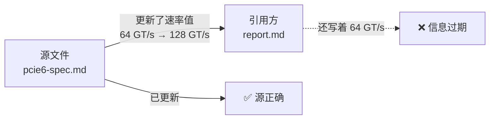

# 内容引用一致性与漂移检测系统

> **概要**: (待补充)
>
> **关键词**: (待补充)

---

## 📑 目录

- [目录 (TOC)](#目录-toc)
- [§一 问题定义](#一-问题定义)
  - [1.1 现象](#11-现象)
  - [1.2 根因](#12-根因)
- [§二 核心概念](#二-核心概念)
  - [2.1 副本语义 vs 引用语义](#21-副本语义-vs-引用语义)
  - [2.2 三类引用漂移](#22-三类引用漂移)
- [§三 引用标记规范](#三-引用标记规范)
  - [3.1 标记语法](#31-标记语法)
  - [3.2 标记位置规则](#32-标记位置规则)
  - [3.3 完整示例](#33-完整示例)
- [electrical-parameters {#electrical-parameters}](#electrical-parameters-electrical-parameters)
- [power-constraints {#power-constraints}](#power-constraints-power-constraints)
- [2.1 互联带宽演进](#21-互联带宽演进)
- [§四 依赖图模型](#四-依赖图模型)
- [§五 漂移检测机制](#五-漂移检测机制)
  - [5.1 三层检测](#51-三层检测)
  - [5.2 检测流程](#52-检测流程)
- [§六 维护工作流](#六-维护工作流)
  - [6.1 添加引用](#61-添加引用)
  - [6.2 同步更新](#62-同步更新)
  - [6.3 源文件移动/删除](#63-源文件移动删除)
- [§七 工具链](#七-工具链)
- [§八 与现有方案的对比](#八-与现有方案的对比)
- [§九 演进路线](#九-演进路线)
- [参考文件](#参考文件)
- [Changelog](#changelog)

---

---

## 目录 (TOC)

- [§一 问题定义](#§一-问题定义)
- [§二 核心概念](#§二-核心概念)
  - [2.1 副本语义 vs 引用语义](#21-副本语义-vs-引用语义)
  - [2.2 三类引用漂移](#22-三类引用漂移)
- [§三 引用标记规范](#§三-引用标记规范)
  - [3.1 标记语法](#31-标记语法)
  - [3.2 标记位置规则](#32-标记位置规则)
  - [3.3 完整示例](#33-完整示例)
- [§四 依赖图模型](#§四-依赖图模型)
- [§五 漂移检测机制](#§五-漂移检测机制)
  - [5.1 三层检测](#51-三层检测)
  - [5.2 检测流程](#52-检测流程)
- [§六 维护工作流](#§六-维护工作流)
  - [6.1 添加引用](#61-添加引用)
  - [6.2 同步更新](#62-同步更新)
  - [6.3 源文件移动/删除](#63-源文件移动删除)
- [§七 工具链](#§七-工具链)
- [§八 与现有方案的对比](#§八-与现有方案的对比)
- [§九 演进路线](#§九-演进路线)
- [修订记录](#修订记录)

---

## §一 问题定义

### 1.1 现象



这是知识库中最常见也最隐蔽的一类质量问题——**信息不一致**。源文件已经更新，但所有引用它的文件仍然使用旧数据。这种问题：

- **不报错**（Markdown 没有类型系统或编译器检查）
- **不易察觉**（人眼不会逐一对齐每个数据点）
- **传播迅速**（一个源数据被 10 个文件引用，就是 10 个潜在的过时点）

### 1.2 根因

| 层次 | 问题 | 与编程语言的对比 |
|:-----|:-----|:----------------|
| **语法层** | Markdown 没有"引用类型"，只有纯文本 | Python 有 `import`，Rust 有 `use` |
| **追踪层** | 没有依赖图记录谁引用了谁 | Go 有 `go.mod` 的依赖锁定 |
| **检测层** | 没有编译时检查或运行时断言 | 编译器检测类型不匹配 |
| **传播层** | 源更新不影响引用方 | 修改接口 → 编译器报所有调用方 |

---

## §二 核心概念

### 2.1 副本语义 vs 引用语义

```text
+----------------------------------------------------+
|  副本语义（当前做法）                               |
|                                                     |
|  report.md:  "PCIe Gen6 速率 64 GT/s"              |
|               ^ 这是从 spec 复制过来的文本           |
|               ^ 复制完后与 spec 再无关系             |
|                                                     |
|  ❌ spec 改为 128 GT/s -> report.md 仍然 64 GT/s     |
+----------------------------------------------------+

+----------------------------------------------------+
|  引用语义（目标做法）                               |
|                                                     |
|  report.md:  "PCIe Gen6 速率 {@ref: spec.md#rate}" |
|               ^ 这是一个引用指针，不是副本           |
|               ^ 工具可以追踪这个引用关系             |
|                                                     |
|  ✅ spec 改为 128 GT/s -> 检测到漂移 -> 通知更新       |
+----------------------------------------------------+
```

**注意**：在大语言模型场景下，AI 无法像编译器一样实时解析引用指针。因此我们的方案采取**"标记 + 检测"模式**——不改变 Markdown 的渲染逻辑，而是通过注释标记让脚本可以追踪引用关系。

### 2.2 三类引用漂移

| 类型 | 定义 | 严重程度 | 检测方法 |
|:-----|:-----|:--------:|:---------|
| **L1 路径漂移** | 源文件被移动或删除，引用链接断裂 | 🔴 高 | 检查路径是否有效 |
| **L2 时间漂移** | 源文件已修改，但引用方未同步更新 | 🟡 中 | 对比 mtime vs last-verified |
| **L3 内容漂移** | 源文件对应段落的实际内容已变化 | 🟠 中高 | 对比 content hash |

---

## §三 引用标记规范

### 3.1 标记语法

在 Markdown 中，用 HTML 注释承载引用元数据，不影响渲染效果：

```markdown
<!-- @ref: <relative-path-to-source>#<section-anchor>, <last-verified-date>, hash:<content-hash> -->
```

**字段说明**：

| 字段 | 必填 | 格式 | 说明 |
|:-----|:----:|:-----|:-----|
| `relative-path-to-source` | ✅ | `path/to/file.md` | 相对于知识库根 `knowledge/` 的路径 |
| `#section-anchor` | ❌ | `#section-name` | 被引用的具体章节锚点，省略时指整个文件 |
| `last-verified-date` | ✅ | `YYYY-MM-DD` | 最后验证引用内容与源一致的日期 |
| `hash:<content-hash>` | ✅ | `hash:sha256短值` | 源文件（或对应段落）的 SHA256 前 12 位 |

**约定**：

- 引用标记**紧贴在引用内容的上方**，中间不要有空行
- 同一段连续内容有多个引用源时，用多个 `@ref` 标记
- 标记中的路径**始终相对于 `knowledge/` 目录**，方便脚本扫描

### 3.2 标记位置规则

```text
+- 引用方文件 ----------------------------------+
|                                                 |
|  ## 3.2 PCIe Gen6 电气参数                      |
|                                                 |
|  <!-- @ref: 02_rd/06_platform/pcie6-spec.md    |
|           #electrical-parameters,               |
|           2026-07-10, hash:a1b2c3d4 -->         |  <- 标记紧贴引用内容上方
|  PCIe Gen6 每通道速率为 64 GT/s，采用 PAM-4    |
|  调制，比 Gen5 的 NRZ 编码带宽翻倍。          |  <- 实际引用内容
|                                                 |
|  <!-- @ref: 02_rd/06_platform/pcie6-spec.md    |
|           #power-constraints,                   |
|           2026-07-10, hash:e5f6g7h8 -->         |  <- 不同段落可能引用不同章节
|  功耗方面，Gen6 每通道约 ...                   |
+-------------------------------------------------+
```

### 3.3 完整示例

**源文件** `knowledge/02_rd/06_platform/pcie6-spec.md`：

```markdown
## electrical-parameters {#electrical-parameters}

PCIe Gen6 每通道速率为 **64 GT/s**（PAM-4 调制），
是 Gen5（32 GT/s, NRZ）的两倍。

## power-constraints {#power-constraints}

PCIe Gen6 每通道功耗约 12W（典型值），
使用 0.6V 供电电压。
```

**引用方** `knowledge/01_survey/ai-cluster-interconnect.md`：

```markdown
## 2.1 互联带宽演进

<!-- @ref: 02_rd/06_platform/pcie6-spec.md#electrical-parameters, 2026-07-10, hash:a1b2c3d4 -->
PCIe Gen6 实现了每通道 64 GT/s 的速率（PAM-4），
为 AI 集群的 GPU 互联提供了 128 GB/s（x16）的带宽能力。

<!-- @ref: 02_rd/06_platform/pcie6-spec.md#power-constraints, 2026-07-10, hash:e5f6g7h8 -->
但需要注意，Gen6 每通道功耗约 12W，
16 通道的 x16 链路总功耗接近 200W，
需在设计中权衡带宽与散热。
```

当源文件中的速率从 64 GT/s 更新为 128 GT/s 后，`hash` 会变化，检测脚本就能发现引用方已过期。

---

## §四 依赖图模型

系统维护一个**有向依赖图**：

```text
+--------------------------------------------------------+
|                   依赖图（示例）                        |
|                                                         |
|  pcie6-spec.md ---> ai-cluster-interconnect.md           |
|       |                  (引用了 2 处)                    |
|       +---> server-arch-compare.md                       |
|       |       (引用了 1 处)                              |
|       +---> 07_industry-research/interconnect-report.md  |
|              (引用了 3 处)                               |
|                                                         |
|  bmc-fru-spec.md ---> bmc-design-guide.md                |
|                      (引用了 3 处)                       |
|                   ---> fru-inventory-report.md            |
|                          (引用了 1 处)                   |
+--------------------------------------------------------+
```

依赖图存储在 `scripts/check/ref-graph/` 目录下：

| 文件 | 格式 | 说明 |
|:-----|:-----|:-----|
| `ref-graph.json` | JSON | 完整依赖图，供脚本和下游工具消费 |
| `ref-graph.dot` | DOT | Graphviz 格式，可渲染为可视化图谱 |
| `ref-drift-report.md` | Markdown | 人类可读的漂移检测报告 |

---

## §五 漂移检测机制

### 5.1 三层检测

| 层级 | 检测内容 | 方法 | 输出 |
|:----:|:---------|:-----|:-----|
| **L1** | 源文件是否存在 | `os.path.exists(target)` | 🔴 MISSING |
| **L2** | 源文件是否比标记日期更新 | `os.path.getmtime(target) > parse_date(last_verified)` | 🟡 STALE |
| **L3** | 源文件内容是否变化 | 计算源文件（或锚点段落）的 SHA256，对比标记中的 hash | 🟠 DRIFTED |

**判定矩阵**：

```text
标记 hash 匹配 + 路径有效 + mtime ≤ last_verified -> ✅ GREEN（一致）
标记 hash 匹配 + 路径有效 + mtime > last_verified -> 🟡 YELLOW（需验证）
标记 hash 不匹配 + 路径有效                     -> 🟠 RED（已漂移）
路径无效                                          -> 🔴 MISSING（源消失）
```

### 5.2 检测流程

```text
+--------------+
|  扫描全部 .md |
|  文件         |
+------+-------+
       v
+--------------+
|  提取 @ref   |
|  标记        |
+------+-------+
       v
+--------------+
|  构建依赖图  |
+------+-------+
       v
+--------------+
|  三层检测    |
|  L1->L2->L3   |
+------+-------+
       v
+--------------+
|  生成报告    |
|  文本/json   |
+--------------+
```

---

## §六 维护工作流

### 6.1 添加引用

当你在文档中引用某个外部文件的数据时：

1. 在引用内容上方添加 `@ref` 标记
2. 路径写相对于 `knowledge/` 的路径
3. last-verified 写当前日期
4. hash 通过 `sha256sum` 计算源文件的 hash（前 12 位）

### 6.2 同步更新

当检测到漂移时：

1. 运行检测脚本，获取漂移报告
2. 打开源文件确认实际变更内容
3. 更新引用方的文本以匹配源文件
4. 更新标记中的 `last-verified` 日期和 `hash`
5. 重新运行检测脚本确认漂移消除

### 6.3 源文件移动/删除

当源文件路径变化时：

1. 移动后，L1 检测会标记 MISSING
2. 在知识库的 `bak` 或 `log.md` 中记录路径变更
3. 手动搜索引用该文件的所有 `@ref` 标记
4. 逐个更新路径，同时更新 hash 和日期

---

## §七 工具链

| 工具 | 位置 | 功能 |
|:-----|:-----|:------|
| `ref-drift-detector.py` | `scripts/check/ref-drift-detector.py` | 主检测脚本：扫描→检测→报告 |
| `ref-graph.json` | `scripts/check/ref-graph/ref-graph.json` | 自动生成的依赖图数据 |
| `ref-drift-report.md` | `scripts/check/ref-graph/ref-drift-report.md` | 自动生成的漂移报告 |

**脚本用法**：

```bash
# 全量扫描
python3 scripts/check/ref-drift-detector.py

# 指定模块扫描
python3 scripts/check/ref-drift-detector.py --module 02_rd

# 单文件扫描
python3 scripts/check/ref-drift-detector.py --file report.md

# JSON 输出
python3 scripts/check/ref-drift-detector.py --json

# 只报告漂移项（无绿色项）
python3 scripts/check/ref-drift-detector.py --drifted-only
```

---

## §八 与现有方案的对比

| 方案 | 是否需要改语法 | 自动化程度 | 是否能检测漂移 | 是否能自动更新 |
|:-----|:------------:|:---------:|:------------:|:------------:|
| **本方案 (@ref 标记)** | 仅加注释 | 半自动（检测+报告，手动更新） | ✅ L1/L2/L3 | ❌ |
| Hugo shortcode | 改语法 | 构建时静态替换 | ❌ | ❌ |
| Obsidian `![[note]]` | 无 | 预览时渲染 | ❌ | ❌ |
| Pandoc transclusion | 改语法 | 转换时替换 | ❌ | ❌ |
| Git submodule | 不适用 | 版本锁定 | ✅ 版本级 | ❌ 需手动 merge |
| AI 语义检测（理想） | 无 | 全自动 | ✅ 语义级 | ✅ 需 AI 辅助 |

**本方案的核心取舍**：

- **不改变 Markdown 渲染** → 兼容所有 Markdown 渲染器
- **只检测不自动更新** → 避免自动替换带来的语义偏差（AI 无法保证 100% 准确识别替换范围）
- **轻量级注释标记** → 不需要新工具链，文本编辑器即可维护

---

## §九 演进路线

| 阶段 | 能力 | 时间 |
|:----:|:-----|:----:|
| **v1.0** 🎯 当前 | 标记规范 + 手动扫描脚本，三类漂移检测 + 报告输出 | 2026-07-16 |
| **v1.5** | 集成到 `kb-health.py` 作为子检查项 | 待排期 |
| **v2.0** | AI 辅助自动修复：检测到漂移后，AI 读取源文件变更内容，生成替换建议 | 待排期 |
| **v3.0** | 语义级漂移：用 embedding 比较"意思是否变了"而非"文本是否变了" | 待排期 |

---

## 参考文件

> 本文件调用的外部文件与资料（不含被引用情况）。

### 内部知识库引用

- [AI处理关联约束问题的根因分析](../../05_tools/ai-tools/2026-07-16-ai-constraint-association-limitation.md) — 为什么跨文件任务 AI 频繁翻车
- [目录级文件质量工程](2026-07-16-directory-level-quality-engineering.md) — 强关联文件集合的四层治理模型
- [知识容器类型学](../../05_tools/knowledge-management/2026-07-15-server-knowledge-artifact-taxonomy.md) — 19 种知识容器的原理与应用

### 外部资料引用

- (无)

---

## Changelog

| 日期 | 版本 | 变更说明 |
|:----|:----|:-----|
| 2026-07-16 | v1.0 | 初版：标记规范 + 检测系统设计 |
