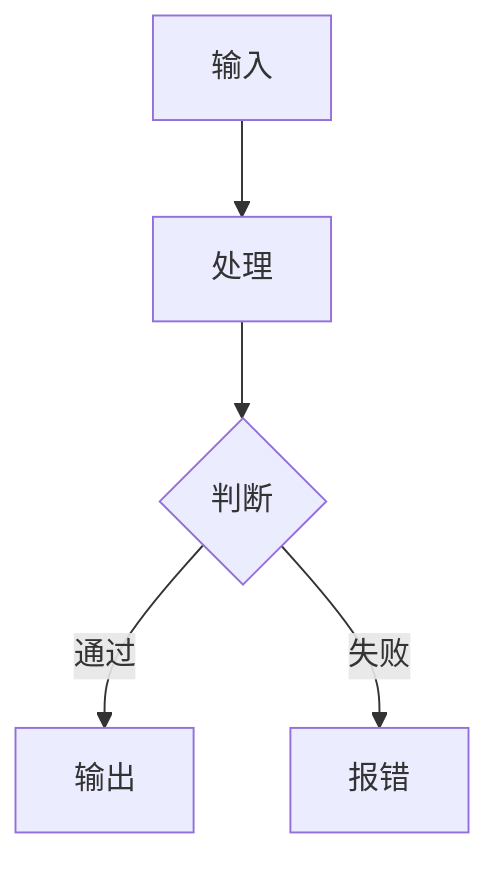

# Markdown信息表达手法深度分析：结构语法 × 原理论证 × 写作提升 × 质量验证

> **概要**: 深度分析Markdown信息表达手法，从标题/TOC/表格/列表/代码块/引用/链接/图片等结构剖析信息论原理与质量验证
>
> **关键词**: Markdown表达 · 信息论 · 表达手法 · 质量验证 · 信息密度

---

## 📑 目录

- [1. 问题框架：Markdown作为信息载体的独特性](#1-问题框架markdown作为信息载体的独特性)
  - [1.1 Markdown的"隐蔽劣势"](#11-markdown的隐蔽劣势)
  - [1.2 核心命题](#12-核心命题)
  - [1.3 Markdown的三种消费模式](#13-markdown的三种消费模式)
- [2. 表达手法全景图谱（Markdown场景）](#2-表达手法全景图谱markdown场景)
- [3. 手法深度分析](#3-手法深度分析)
  - [3.1 标题体系：信息架构的骨架](#31-标题体系信息架构的骨架)
    - [3.1.1 标题不是格式问题，是架构问题](#311-标题不是格式问题是架构问题)
    - [3.1.2 标题层级的信息论模型](#312-标题层级的信息论模型)
    - [3.1.3 标题命名的"结论性"原则（与PPT通用）](#313-标题命名的结论性原则与ppt通用)
    - [3.1.4 标题深度的黄金法则](#314-标题深度的黄金法则)
    - [3.1.5 锚点一致性的重要性（Markdown特有锚点风险）](#315-锚点一致性的重要性markdown特有锚点风险)
- [标题：使用「」（引号）和特殊字符](#标题使用引号和特殊字符)
  - [3.2 TOC（目录）：阅读路径的地图](#32-toc目录阅读路径的地图)
    - [3.2.1 TOC的信息论定位](#321-toc的信息论定位)
    - [3.2.2 手动TOC vs 自动TOC](#322-手动toc-vs-自动toc)
    - [3.2.3 TOC的信息密度设计](#323-toc的信息密度设计)
- [目录（详细信息版）](#目录详细信息版)
  - [3.3 表格：高密度对比的最佳结构](#33-表格高密度对比的最佳结构)
    - [3.3.1 表格的独特性](#331-表格的独特性)
    - [3.3.2 表格的信息论优势](#332-表格的信息论优势)
    - [3.3.3 列对齐的设计原则](#333-列对齐的设计原则)
    - [3.3.4 表格"行列选择"原则](#334-表格行列选择原则)
    - [3.3.5 表格的信息密度控制](#335-表格的信息密度控制)
    - [3.3.6 Raw模式下表格的可读性](#336-raw模式下表格的可读性)
    - [3.3.7 表格内容的语法一致性](#337-表格内容的语法一致性)
  - [3.4 列表（有序/无序）：序列与类别的编码](#34-列表有序无序序列与类别的编码)
    - [3.4.1 有序列表 vs 无序列表的信息论差异](#341-有序列表-vs-无序列表的信息论差异)
    - [3.4.2 列表嵌套的信息论约束](#342-列表嵌套的信息论约束)
    - [3.4.3 列表项的一致性法则（与PPT完全一致）](#343-列表项的一致性法则与ppt完全一致)
    - [3.4.4 列表项的长度控制](#344-列表项的长度控制)
  - [3.5 代码块：与文字完全不同的信息通道](#35-代码块与文字完全不同的信息通道)
    - [3.5.1 代码块在Markdown中的独特定位](#351-代码块在markdown中的独特定位)
    - [3.5.2 语言标签的信息论作用](#352-语言标签的信息论作用)
    - [3.5.3 代码块内注释的一致性](#353-代码块内注释的一致性)
    - [3.5.4 内置代码 vs 外链引用的选择](#354-内置代码-vs-外链引用的选择)
    - [3.5.5 代码块raw模式下的可读性](#355-代码块raw模式下的可读性)
  - [3.6 引用块：权威性与高亮标记](#36-引用块权威性与高亮标记)
    - [3.6.1 引用块的信息论角色](#361-引用块的信息论角色)
    - [3.6.2 不要滥用引用块](#362-不要滥用引用块)
    - [3.6.3 引用块的Markdown特有用法：元信息标注](#363-引用块的markdown特有用法元信息标注)
  - [3.7 链接：交叉引用的信息导航](#37-链接交叉引用的信息导航)
    - [3.7.1 链接在Markdown中的三种角色](#371-链接在markdown中的三种角色)
    - [3.7.2 链接文本的"可预测性"原则](#372-链接文本的可预测性原则)
    - [3.7.3 链接的可靠性管理](#373-链接的可靠性管理)
    - [3.7.4 链接密度的控制](#374-链接密度的控制)
  - [3.8 图片与图表：视觉信息的嵌入策略](#38-图片与图表视觉信息的嵌入策略)
    - [3.8.1 Markdown中图片的限制](#381-markdown中图片的限制)
    - [3.8.2 Alt文本的信息论作用](#382-alt文本的信息论作用)
    - [3.8.3 图片本地化 vs 外链引用](#383-图片本地化-vs-外链引用)
    - [3.8.4 用代码块替代图片：Mermaid/ASCII图](#384-用代码块替代图片mermaidascii图)
    - [3.8.5 图片布局建议](#385-图片布局建议)
  - [3.9 Emoji与标记符号](#39-emoji与标记符号)
    - [3.9.1 Emoji在Markdown中的角色](#391-emoji在markdown中的角色)
    - [3.9.2 状态标记模式](#392-状态标记模式)
    - [3.9.3 标题中使用Emoji（慎用，但有效）](#393-标题中使用emoji慎用但有效)
- [✅ 质量验证Checklist](#质量验证checklist)
- [🔧 自动化检测方案](#自动化检测方案)
- [📊 数据对比分析](#数据对比分析)
- [⚠️ 常见错误与风险](#常见错误与风险)
  - [3.9.4 Emoji与Markdown代码块的兼容性](#394-emoji与markdown代码块的兼容性)
  - [3.10 分隔符与元信息区](#310-分隔符与元信息区)
    - [3.10.1 水平分割线（HR）的章节分界](#3101-水平分割线hr的章节分界)
- [第2章](#第2章)
- [第3章](#第3章)
  - [3.10.2 Frontmatter（元信息区）](#3102-frontmatter元信息区)
  - [3.10.3 注释（HTML注释）](#3103-注释html注释)
- [4. 表达维度交叉对抗分析](#4-表达维度交叉对抗分析)
  - [4.1 三种消费模式的表达冲突](#41-三种消费模式的表达冲突)
  - [4.2 手法之间的协同与互斥](#42-手法之间的协同与互斥)
  - [4.3 Markdown的"信噪比"公式](#43-markdown的信噪比公式)
- [5. Markdown特有的编码约束](#5-markdown特有的编码约束)
  - [5.1 空格与换行的"隐身"特性](#51-空格与换行的隐身特性)
  - [5.2 转义字符的正确使用](#52-转义字符的正确使用)
  - [5.3 不同渲染器的不一致性](#53-不同渲染器的不一致性)
  - [5.4 中英文混排问题](#54-中英文混排问题)
- [6. 写作能力提升方法](#6-写作能力提升方法)
  - [6.1 Markdown写作的四阶段流程（适配自PPT）](#61-markdown写作的四阶段流程适配自ppt)
  - [6.2 刻意练习框架](#62-刻意练习框架)
  - [6.3 常见反模式与修正](#63-常见反模式与修正)
- [7. 质量验证Checklist](#7-质量验证checklist)
  - [7.1 结构层检查（文档整体）](#71-结构层检查文档整体)
  - [7.2 内容层检查（每章/每节）](#72-内容层检查每章每节)
  - [7.3 格式层检查（细节）](#73-格式层检查细节)
  - [7.4 消费模式交叉检查](#74-消费模式交叉检查)
- [8. 自动化检测方案](#8-自动化检测方案)
  - [8.1 Markdown Lint 基础配置](#81-markdown-lint-基础配置)
  - [8.2 高级检测脚本：Checklist自动化](#82-高级检测脚本checklist自动化)
  - [8.3 简单自检三分钟法（无需工具）](#83-简单自检三分钟法无需工具)
  - [8.4 不同文档类型的检测重点](#84-不同文档类型的检测重点)
- [9. 总结](#9-总结)
  - [9.1 核心结论](#91-核心结论)
  - [9.2 Markdown vs PPT 表达手法对照](#92-markdown-vs-ppt-表达手法对照)
  - [9.3 与知识库的关联](#93-与知识库的关联)
- [参考文件](#参考文件)
- [Changelog](#changelog)

---

## 1. 问题框架：Markdown作为信息载体的独特性

### 1.1 Markdown的"隐蔽劣势"

对比四种信息载体，Markdown的情况比PPT更复杂：

| 维度 | 编程语言 | PPT | **Markdown** | 口头沟通 |
|:-----|:---------|:----|:-------------|:---------|
| **确定性** | 编译器强制执行 | 观众一次性阅读 | ❌ **渲染器依赖——同一文件在不同平台上可能完全不同的视觉呈现** | 即时澄清 |
| **多态性** | 单一执行 | 固定视觉布局 | ❌ **同时被raw阅读、rendered阅读、搜索引擎索引、AI摘要、TTS朗读** | 单一体验 |
| **阅读次序** | 代码逻辑顺序 | 页面逻辑+视觉引导 | ❌ **非线性：标题跳读、全文搜索、TOC导航、链接跳转——读者从来不按顺序读** | 线性叙述 |
| **回溯能力** | 强（IDE跳转） | 弱（需翻页） | **强（全文搜索、跳转链接、浏览器查找）** | 几乎无 |
| **信息密度** | 低（逐行） | 中（一页一主题） | **极高（可容纳长篇论证、复杂表格、嵌套列表）** | 高（双通道） |
| **作者控制力** | 完全控制 | 像素级控制 | **极弱——字体/颜色/间距/对齐全部由渲染器决定** | 话语权控制 |

### 1.2 核心命题

> **Markdown写作的本质不是在"写文档"，而是在为一个多态系统设计数据层——同一份源数据将在至少三种截然不同的语境中被消费：raw阅读者、rendered阅读者、机器处理者。好的Markdown必须让这三者都能准确解码。**

### 1.3 Markdown的三种消费模式

这是理解所有后续手法的基础——任何一种手法，都必须评估它在三种模式下的表现：

```text
           Markdown源文件
          /       |       \
    [Raw阅读]  [Rendered]  [机器处理]
         v         v          v
  直接看源码    VS Code/    AI索引/搜索/
  纯文本读取   GitHub渲染    工具提取

  约束：
  - Raw: 必须对齐美观(ASCII)
  - Rendered: 必须结构清晰(语义)
  - 机器: 必须格式规范(结构)
```

| 消费模式 | 读者群体 | 核心需求 | Markdown要求 |
|:---------|:---------|:---------|:-------------|
| **Raw阅读** | 开发者、审查者、高级用户 | 纯文本可读，对齐，ASCII图表清晰 | 表格对齐、缩进一致、不依赖渲染效果 |
| **Rendered阅读** | 大多数读者 | 视觉舒适、导航方便、层次清晰 | 标题层级合理、图片嵌入、链接有效 |
| **机器处理** | AI引擎、搜索、Git diff | 格式规整、元信息完整、结构可解析 | 语义标题、标准的frontmatter、锚点一致性 |

---

## 2. 表达手法全景图谱（Markdown场景）

Markdown场景共有 **10大表达手法维度**：

```text
Markdown表达手法全景
|
+- 1. 标题体系 -----------> 层级深度 · 命名准则 · 锚点生成
+- 2. TOC（目录） --------> 静态TOC vs 自动TOC · 跳读的入口
+- 3. 表格 -------------> 列对齐设计 · 信息密度控制 · 可读性
+- 4. 列表 -------------> 有序/无序 · 嵌套深度 · 语法一致性
+- 5. 代码块 -----------> 语言标签 · 行号 · 嵌入 vs 引用
+- 6. 引用块 -----------> 权威引用 · 高亮箱 · 元信息
+- 7. 链接 -------------> 相对/绝对 · 指向校验 · 锚点链接
+- 8. 图片与图表 --------> alt文本 · 尺寸控制 · 时序图/流程图
+- 9. Emoji与标记符号 ---> 状态标记 · 语义符号 · 注意点
+- 10. 分隔符与元信息 ---> HR分割 · frontmatter · 注释
```

---

## 3. 手法深度分析

### 3.1 标题体系：信息架构的骨架

#### 3.1.1 标题不是格式问题，是架构问题

标题是Markdown文档中**最核心的信息结构单元**。它同时承担三种角色：

| 角色 | 对应消费模式 | 重要性 |
|:-----|:------------|:------:|
| 视觉导航（rendered） | 读者扫读和跳转 | ⭐⭐⭐ |
| 全文大纲（raw） | 快速理解文档结构 | ⭐⭐⭐ |
| 锚点/目录关联（机器） | TOC生成、链接跳转、AI摘要 | ⭐⭐⭐ |

#### 3.1.2 标题层级的信息论模型

```text
H1 -- 文档主题（唯一，不可多重）
 |
 +- H2 -- 独立章节（MECE互斥）
 |    |
 |    +- H3 -- 章节内子主题
 |    |    |
 |    |    +- H4 -- 子主题内细节（慎用，通常可转列表）
 |    |
 |    +- H3 -- 另一个子主题
 |
 +- H2 -- 另一个独立章节
```

**标题的信息熵（信息量）**：

| 层级 | 信息量 | 语义角色 | 单文档推荐数量 |
|:----:|:------:|:---------|:--------------:|
| H1 | 最高 | 文档主题——其信息量约等于全文最粗粒度的摘要 | 1（最多2，若两篇合并） |
| H2 | 高 | MECE章节分界——每个H2应能被一句话概括 | ≤20 |
| H3 | 中 | 章节内子主题 | ≤50 |
| H4 | 低 | 细节标记——通常预示结构可优化 | ≤10（否则重构） |
| H5+ | 极低 | 不推荐使用（99%场景H4已够） | 0 |

#### 3.1.3 标题命名的"结论性"原则（与PPT通用）

遵循与PPT一致的黄金法则——**标题必须传达信息，不能仅做标签**：

| 类型 | 示例 | 信息量 | 判断 |
|:-----|:------|:------:|:----:|
| 💡 **结论型**（推荐） | "标题体系：信息架构的骨架" | 高 | ✅ 知道在讲什么 |
| 📋 **标签型**（较差） | "标题体系" | 中 | 可接受（作为章节标题） |
| ❓ **泛泛型**（不推荐） | "关于标题的一些问题" | 低 | ❌ 不告诉读者任何东西 |

**在Markdown中的独特约束**：

- 标题也是锚点（`#标题体系` → `#标题体系`）
- 标题也是搜索结果的关键匹配对象
- 标题是Git diff中变化最容易被注意的位置

#### 3.1.4 标题深度的黄金法则

> **H1→H2→H3 每一级跳转，意味着读者的信息处理粒度变化一个数量级。**

判断标题深度是否合理的方法：

```text
标题深度检查法：
1. 只看H1+H2 -> 能否理解文档的完整骨架？-> 是✅ 否->需调整H2
2. 任意H2下，H3数量是否≤7？（Miller's Law）-> 是✅ 否->需拆分章节
3. 文档是否出现H5？-> 出现->考虑将H5内容转为列表或子段落
```

#### 3.1.5 锚点一致性的重要性（Markdown特有锚点风险）

这是Markdown区别于PPT **最隐蔽**的问题：

```markdown
## 标题：使用「」（引号）和特殊字符

<!-- 实际锚点：标题使用引号和特殊字符 -->
<!-- GitHub渲染为：#标题使用引号和特殊字符 -->
<!-- 但某些渲染器会省略引号 → #标题使用和特殊字符 -->
<!-- 交叉链接若锚点不匹配 → 404 -->
```

**锚点生成规则**（GitHub风格）：

1. 全转为小写
2. 移除所有标点符号（引号、括号、冒号、逗号等）
3. 空格转为连字符`-`
4. 连续连字符合并为单个
5. 中文保留原字符（不转译）

**实践中保持锚点安全的两种策略**：

| 策略 | 做法 | 适用 |
|:-----|:-----|:------|
| **避免策略** | 标题中不使用引号/括号/冒号/斜杠/问号等可能导致锚点异常的字符 | 通用安全 |
| **显式锚点策略** | 在标题后显式指定锚点 `<a id="custom-anchor"></a>` | 长文档/确定性需求 |

### 3.2 TOC（目录）：阅读路径的地图

#### 3.2.1 TOC的信息论定位

TOC不是"辅助元素"——它是**读者在非线性文档中建立认知模型的第一入口**。

```text
读者打开文档的认知过程：
1. 看标题（H1） -> 这是什么？            <- 10毫秒
2. 看TOC -> 文档讲了什么？结构是什么？   <- 3-10秒
3. 阅读特定章节 -> 深度获取信息           <- 持续过程
```

**如果没有TOC**：

- 读者只能线性阅读——但Markdown允许跳读，没有TOC等于没有地图
- 读者在跳读时无法建立"整体结构感"——这是认知负荷的外部来源

#### 3.2.2 手动TOC vs 自动TOC

| 维度 | 手动TOC | 自动TOC |
|:-----|:--------|:--------|
| **精确性** | 高（可控制层级和排序） | 依赖工具和渲染器 |
| **维护成本** | 高（改章节必须同步改TOC） | 低（自动生成） |
| **GitHub兼容** | ✅ 所有平台 | ⚠️ 某些平台不支持自动TOC |
| **可定制性** | 自由（可只显示H2） | 有限（通常按层级全量显示） |
| **信息噪声** | 可控（可有选择地跳过某些H3） | 不可控（如果标题过多则TOC过长） |

**推荐实践**：

- **小型文档（<5个H2）**：两种均可，手动TOC简单直接
- **中型文档（5-20个H2）**：手动TOC + 仅显示H2+H3
- **大型文档（>20个H2）**：自动TOC + H2级目录 + 每个H2内嵌子目录

#### 3.2.3 TOC的信息密度设计

```markdown
## 目录

- [1. 问题框架](#1-问题框架)              ← 仅H2 → 简洁
- [2. 手法深度分析](#2-手法深度分析)
  - [2.1 标题体系](#21-标题体系)          ← H2+H3 → 适中
  - [2.2 TOC（目录）](#22-toc目录)
  - [2.3 表格](#23-表格)
- [3. 质量验证](#3-质量验证)              ← 仅H2

--------------------------------------------------

## 目录（详细信息版）

所有章节标题及其编号                       ← 超详细信息 → 如果文档很长

1. 问题框架
   1.1 Markdown的"隐蔽劣势"
   1.2 核心命题
   ...
```

**决策准则**：

| 文档类型 | 推荐TOC深度 | 原因 |
|:---------|:-----------|:-----|
| 技术报告（本文级别） | H2+H3 | 读者需精细导航 |
| 周报/简短备忘 | 仅H2 | 信息量小，跳读需求低 |
| API参考/规格文档 | 全层级 | 按需跳转最常见 |
| README | 无TOC或少H2 | 短的README无需TOC |

### 3.3 表格：高密度对比的最佳结构

#### 3.3.1 表格的独特性

表格是Markdown中**信息密度最高的结构**——它在一屏空间内实现了多维度对比。但也是**最脆弱的结构**——格式稍有偏差就完全失效。

#### 3.3.2 表格的信息论优势

```text
文本描述（低密度）：
  方案A的延迟是10ms，成本是$100。方案B的延迟是20ms，成本是$80。
  所以方案A延迟更低但成本更高，而方案B相反。

表格（高密度）：
  | 维度 | 方案A | 方案B |
  |------|-------|-------|
  | 延迟 | 10ms  | 20ms  |
  | 成本 | $100  | $80   |

信息密度提升：约3×（同样信息量，表格空间约为文本的1/3）
```

**香农模型下的表格**：

- 文本描述：每行一个符号序列，靠读者自行建立对比关系
- 表格：结构编码了对比关系（横向=对比，纵向=维度），读者直接在结构内填充数值

#### 3.3.3 列对齐的设计原则

| 对齐方式 | 含义 | 适用数据 |
|:--------:|:-----|:---------|
| `:---` 左对齐 | 表头/文本内容 | 名称、描述、类别 |
| `:--:` 居中 | 状态/分类 | 等级、状态标记（✅/❌/⚠️） |
| `---:` 右对齐 | 对比数值 | 数字、金额、百分比——**数值右对齐是最重要原则** |

**为什么数值必须右对齐？**

```text
错误的：
| 产品 | 价格 |
|------|------|
| A    | 100  |
| B    | 1000 |  <- 排版上"A"对不齐，视觉对比被破坏

正确的：
| 产品 | 价格 |
|:-----|-----:|
| A    |   100 |
| B    |  1000 |  <- 个位对齐，一眼看出数量级差异
```

#### 3.3.4 表格"行列选择"原则

表格的维度分配决定了阅读效率：

| 分配方式 | 示例 | 读效率 | 适用 |
|:---------|:-----|:------:|:-----|
| **行=项目，列=维度**（推荐） | 每个产品一行，价格/性能/功耗各一列 | 最高 | 绝大多数场景 |
| **行=维度，列=项目** | 每维度一行，A/B/C产品各一列 | 中 | 维度少、项目多 |
| **双向交叉** | 行=项目A特性，列=项目B特性 | 低 | 仅双项目逐维度对比 |

**业界标准**：**行=被比较对象，列=比较维度**，这是最自然的阅读模式。

#### 3.3.5 表格的信息密度控制

表格最常见的问题——**一列塞了两种信息**：

```markdown
❌ 错误的混合列设计：
| 产品 | 性能/价格 |  ← 一列包含两个维度
|------|-----------|
| A    | 100/¥80   |  ← 读者需要自行拆解

✅ 正确的单一维度列设计：
| 产品 | 性能(TOPS) | 价格(USD) |
|:-----|:--------:|:--------:|
| A    |   100    |    80    |
```

**表格列数上限**：≤7列（Miller's Law），超过则考虑分表或转用其他结构。

#### 3.3.6 Raw模式下表格的可读性

这是Markdown特有的挑战——Raw模式下表格必须对齐才可读：

```markdown
✅ 对齐的表格（raw可读）：
| 产品 | 性能 | 价格 |
|:-----|:----:|:----:|
| Alpha | 100  | 80   |
| Beta  | 200  | 120  |
| Gamma | 150  | 45   |

❌ 未对齐的表格（raw不可读）：
| 产品 | 性能 | 价格 |
|:-----|:----:|:----:|
| Alpha | 100 | 80 |
| Beta | 200 | 120 |
| Gamma | 150 | 45 |
```

#### 3.3.7 表格内容的语法一致性

与PPT列表语法一致性同理——**同一列的同一类内容，语法必须一致**：

```markdown
❌ 语法不一致（列内）：
| 风险等级 | 描述                     |
|:---------|:-------------------------|
| 高       | 会引发系统宕机           | ← 断言式
| 中       | 降低了系统的可用性       | ← 过程描述式（有"了"）
| 低       | 不影响核心功能           | ← 否定式（"不"）

✅ 语法一致（统一用断言式）：
| 风险等级 | 描述                     |
|:---------|:-------------------------|
| 高       | 引发系统宕机             |
| 中       | 降低系统可用性           |
| 低       | 不影??核心功能             |
```

### 3.4 列表（有序/无序）：序列与类别的编码

#### 3.4.1 有序列表 vs 无序列表的信息论差异

| 列表类型 | 信息论含义 | 读者解读 | 适用场景 |
|:---------|:-----------|:---------|:---------|
| **有序列表** `1. 2. 3.` | **序列关系**——有顺序、有优先级、有时间线 | "第一重要、第二步、第三..." | 步骤、优先级、时间线 |
| **无序列表** `- - -` | **集合关系**——平等元素、无顺序要求 | "这些都是同一类，任意顺序" | 列举、集合、特性列表 |
| **任务列表** `- [ ] - [x]` | **状态关系**——完成/未完成 | "哪些做了，哪些没做" | 清单、进度 |

#### 3.4.2 列表嵌套的信息论约束

```text
错误做法：嵌套超过3层
- Level 1
  - Level 2
    - Level 3
      - Level 4  <- 人的工作记忆无法跟踪4层嵌套关系

认知科学解释：人类的工作记忆通常只能同时跟踪3-4个嵌套层级
                          (Cowan, 2001)

推荐做法：嵌套不超过3层，第4层应转为段落或子标题
```

#### 3.4.3 列表项的一致性法则（与PPT完全一致）

```markdown
❌ 语法不一致（同一列表内）：
项目优势：
- 高性能计算能力          ← 名词短语
- 降低了运营成本          ← 动词短语（过去式）
- 易于进行二次开发        ← 动词短语（不定式）

✅ 语法一致（统一名词短语）：
项目优势：
- 高性能计算能力          ← 名词
- 低运营成本              ← 名词
- 灵活的二次开发能力      ← 名词
```

**检测批量修正**：同一列表内，所有条目的首词语法类型必须一致（动词/名词/形容词三选一）。

#### 3.4.4 列表项的长度控制

| 列表项长度 | raw可读性 | 信息完整度 | 推荐 |
|:----------:|:---------:|:----------:|:----:|
| ≤15个字 | ✅ 极好 | ⚠️ 可能不足 | 特点/关键词列表 |
| 15-40字 | ✅ 好 | ✅ 适中 | **推荐**——大多数场景 |
| 40-80字 | ⚠️ 可接受 | ✅ 完整 | 详细说明——考虑是否可拆 |
| >80字 | ❌ 差 | ⚠️ 冗余 | 建议转为段落或子标题 |

**经验法则**：列表项应能在直视下6-10秒内读完并理解。

### 3.5 代码块：与文字完全不同的信息通道

#### 3.5.1 代码块在Markdown中的独特定位

代码块是Markdown中**唯一一个明确告知读者"此处语言模式切换"的结构**。当读者看到代码块时，自动从"自然语言模式"切换到"编程语言模式"。

#### 3.5.2 语言标签的信息论作用

```markdown
```

← 无标签语言代码块

```text
无语法高亮；某些渲染器可能无法正确识别
```

```python
def hello():
    print("Hello")
```

← 有标签语言代码块
有语法高亮；某些渲染器可提供折叠/复制功能

```text

**语言标签的正确使用**：

| 内容类型 | 标签 | 效果 |
|:---------|:-----|:------|
| Python代码 | `python` | 语法高亮 |
| Shell命令 | `bash` 或 `shell` | 命令高亮 |
| 配置文件 | `yaml` `json` `ini` | 结构高亮 |
| 输出日志 | `text` 或 `log` | 纯文本 |
| SQL | `sql` | SQL高亮 |
| Diff | `diff` | 行增减突出显示 |
| 伪代码/算法描述 | `text` 或 `pseudo` | 无语法高亮 |
| ASCII图表 | `text` | 保持原样 |
| 思�的对话/概念 | `markdown` | 用于嵌套示例 |

#### 3.5.3 代码块内注释的一致性

代码块内的注释也应遵循"页面级一致性"——**注释语言、格式、详略程度应在跨代码块间保持一致**：

```markdown
❌ 跨代码块注释风格不一致（同一文档）：

代码块1:
```python
# 检查输入参数
def validate(x):   ← 中文注释，以"检查"开头
    pass
```

代码块2:

```python
# This function does validation  ← 英文注释，风格完全不同
def validate(x):
    pass
```

✅ 全文统一中文注释 + 动词开头的祈使句风格：

代码块1:

```python
# 检查输入参数
def validate(x):
    pass
```

代码块2:

```python
# 校验返回结果
def validate_result(x):
    pass
```

```text

#### 3.5.4 内置代码 vs 外链引用的选择

| 策略 | 适用 | 风险 |
|:-----|:-----|:------|
| **全量代码块嵌入** | 短片段（≤15行）、关键技术点 | 文档膨胀 |
| **关键片段嵌入+全文外链** | 中等代码（15-50行） | 外链失效 |
| **仅外链引用** | 大段代码（>50行）、已有仓库 | 读者需跳转 |

**推荐**：将代码块限制在**演示原理所需的最短片段**，完整代码放附录或外链。

#### 3.5.5 代码块raw模式下的可读性

Markdown代码块在raw模式下是文档中**唯一可以精确控制排版**的区域（因为代码块内的空格不会被渲染器合并）。利用这一特性：

```markdown
# 代码块内排版在raw和rendered模式下保持一致的示例

```text
+----------------+----------------+----------------+
|  区域A (8KB)   |  区域B (16KB)  |  区域C (32KB)  |
+----------------+----------------+----------------+
|  延迟: 5ns     |  延迟: 10ns    |  延迟: 15ns    |
+----------------+----------------+----------------+
```

```text

### 3.6 引用块：权威性与高亮标记

#### 3.6.1 引用块的信息论角色

引用块在渲染后通常有**左侧竖线/背景色变化**，这让它在视觉上与正文明显区分。它承载三种信息论角色：

| 角色 | 用法 | 示例 |
|:-----|:-----|:------|
| **权威引用** | 引用外部来源的精确原文 | `> 根据IEEE 802.3标准...` |
| **核心命题高亮** | 将文档的核心论点独立呈现 | `> **核心命题**：...` |
| **上下文标记** | 备注/说明/注意事项 | `> **注**：此数据需在...条件下验证` |

#### 3.6.2 不要滥用引用块

引用块的视觉区分度高，但**正是因为它突出，所以不能多用**：

```

递减效应（与PPT高亮完全一致）：
1个引用块 → 高信噪比 ✅
3个引用块 → 可接受，但开始分散 ⚠️
10个引用块在一页 → 信噪比崩溃，读者不再区分 ❌

```text

**推荐**：一个H2章节下，引用块≤3个。主要用于核心命题和关键引用。

#### 3.6.3 引用块的Markdown特有用法：元信息标注

利用引用块在渲染时侧边栏的视觉提示，可以**在信息流中插入"元层"信息而不打断正文阅读**：

```markdown
正文正文正文正文正文...

> **关键概念**: 这就是本段的核心概念，用一个引用块独立标记
> 让读者在扫读时就能捕获

正文继续...

> **⚠️ 注意**: 这段内容需要特殊关注，使用引用块的视觉区分
> 使其从正文中凸现
```

### 3.7 链接：交叉引用的信息导航

#### 3.7.1 链接在Markdown中的三种角色

| 角色 | 类型 | 信息论含义 | 读者行为 |
|:-----|:-----|:-----------|:---------|
| **引用链接** | 外链 | "此处信息来自外部权威源" | 点击验证/展开阅读 |
| **交叉引用** | 内链（相对路径） | "此处信息与另一文档关联" | 点击跳转到相关文档 |
| **导航链接** | 锚点链接（`#`） | "此处信息在本文档的另一位置" | 点击跳到指定章节 |

#### 3.7.2 链接文本的"可预测性"原则

> **链接文本必须让读者在点击之前就知道链接指向什么。**

```markdown
❌ 无信息链接文本：
点击这里查看详情
更多信息请参考此处

✅ 信息链接文本：
参见[PCIe Gen 6信号完整性分析](..)
在[IEEE 802.3标准第4章](https://...)中定义了相关内容
```

**在知识库场景下**，链接文本应该：

1. 包含目标文档的核心主题词
2. 无需点击即可判断是否值得点击
3. 在Git diff中，即使上下文消失，链接文本本身有意义

#### 3.7.3 链接的可靠性管理

Markdown链接的**最大风险是静默失效**——PPT中链接失效至少有个"404"提示，但Markdown：

```markdown
- 外部链接失效 → 静默（reader不提示）
- 锚点链接错位 → 静默（点了没反应或跳错位置）
- 相对路径错误 → 静默（在raw中看路径没问题，但渲染器可能解析错误）
```

**链接可靠性策略**：

| 链接类型 | 风险等级 | 应对措施 |
|:---------|:--------:|:---------|
| 外链（HTTP/HTTPS） | 高（域名过期/链接404） | 标注访问日期，附录保留关键内容快照 |
| 内链（相对路径） | 中（文件被重命名/移动） | 使用相对路径，配合知识库交叉链接检查脚本 |
| 锚点链接（`#`） | 中-高（标题修改导致锚点变化） | 避免在标题中使用特殊字符，修改标题同步更新所有锚点链接 |

#### 3.7.4 链接密度的控制

```markdown
❌ 链接过密（每个段落都塞满链接）：
这个系统使用PCIe Gen5接口，带宽达到32GT/s
→ 读者分不清哪个链接是主要的

✅ 链接适度（每个段落1-3个关键链接）：
这个系统使用PCIe Gen5接口，带宽达到32GT/s——这是业界最高水平。
同时参考竞品对比方案了解差异。
```

**链接密度经验法则**：

- 每段（~200字）≤3个链接
- 关键路径链接优先
- 两个连续链接之间需有至少3-5个字的间隔

### 3.8 图片与图表：视觉信息的嵌入策略

#### 3.8.1 Markdown中图片的限制

与PPT完全不同，Markdown对图片**几乎无控制力**：

| 维度 | PPT | Markdown |
|:-----|:-----|:---------|
| **位置控制** | 像素级 | ❌ 无——图片自动左对齐 |
| **大小控制** | 自由缩放 | ❌ 需要HTML `` 标签侵入 |
| **文字环绕** | 多种布局 | ❌ 无——文字在图片下方 |
| **图文绑定** | 手动 | ✅ 自动（图片在文字流中） |
| **图注** | 手动添加 | ⚠️ 需手动在图片下加斜体或小字 |

#### 3.8.2 Alt文本的信息论作用

Alt文本在Markdown中有三种角色：

| 角色 | 使用场景 | 要求 |
|:-----|:---------|:-----|
| **可访问性** | 屏幕阅读器 | 描述图片的核心信息 |
| **备用信息** | 图片加载失败时 | 读者看到替代文字 |
| **SEO/AI索引** | 搜索引擎、AI摘要 | 包含关键词 |

```markdown
❌ 无意义的alt文本：


✅ 有信息的alt文本：


```

#### 3.8.3 图片本地化 vs 外链引用

| 策略 | 优势 | 风险 |
|:-----|:------|:------|
| **本地图片（仓库内）** | 可控、永远不会404 | 仓库膨胀、需git lfs |
| **外链图片** | 仓库小巧 | **外链失效=图片404** |
| **Base64嵌入** | 完全自包含 | 文件巨大、diff不可读 |

**知识库推荐**：本地图片 + 规定图片目录 `assets/` + 命名规范 `yyyy-mm-dd-purpose-N.png`。

#### 3.8.4 用代码块替代图片：Mermaid/ASCII图

**Mermaid流程图**（rendered支持时）：



**ASCII替代方案**（raw/rendered双兼容）：使用代码块画ASCII图：

```text
+--------+      +--------+      +--------+
| 输入层  |----->| 处理层  |----->| 输出层  |
+--------+      +--------+      +--------+
                     |
                     v
                +--------+
                | 错误处理 |
                +--------+
```

#### 3.8.5 图片布局建议

由于Markdown无法控制图片位置，建议遵循以下策略以最大化图文互补效果：

```markdown
✅ 推荐的图文布局模式：

文字解释图片中包含的数据/趋势/关系
（一段简要的文字说明）


*图注：图片的详细说明，来源链接*

优点：
1. 先给结论（文字说明） → 读者建立了预期框架
2. 再看到图片 → 在预期框架内理解图片
3. 图注补充 → 完整上下文
```

### 3.9 Emoji与标记符号

#### 3.9.1 Emoji在Markdown中的角色

与PPT场景一致，Emoji在Markdown中扮演相同的信息压缩角色——但**在Markdown中有额外的raw模式约束**。

#### 3.9.2 状态标记模式

这是Markdown中最广泛也最高效的Emoji用法——**利用Emoji作为多维状态的编码符号**：

```markdown
| 模块 | 状态 | 说明 |
|:-----|:----:|:----:|
| 模块A | ✅ | 测试通过，已部署 |
| 模块B | ⚠️ | 测试中，预计下周一完成 |
| 模块C | ❌ | 阻塞，依赖组件未就绪 |
| 模块D | 🔧 | 重构中，API暂不稳定 |
| 模块E | 📋 | 待排期，优先级P3 |
```

**状态Emoji编码体系（推荐统一）**：

| 状态 | Emoji | 含义 |
|:-----|:-----:|:-----|
| 完成/通过 | ✅ | 已确认完成 |
| 失败/问题 | ❌ | 已确认失败/存在阻塞 |
| 警告/注意 | ⚠️ | 需关注，但未阻塞 |
| 进行中 | 🔄 或 🚧 | 正在处理 |
| 待办 | 📋 | 已记录，未开始 |
| 关键/重要 | ⭐ 或 🔥 | 重要优先级 |
| 信息/参考 | ℹ️ | 提供额外背景 |

#### 3.9.3 标题中使用Emoji（慎用，但有效）

在H2标题中使用Emoji可以**快速标记章节类型**：

```markdown
## ✅ 质量验证Checklist
## 🔧 自动化检测方案
## 📊 数据对比分析
## ⚠️ 常见错误与风险
```

**优势**：

- 在TOC中快速定位特定类型的章节（rendered或raw）
- 在长文档中通过Emoji快速扫读定位

**劣势**：

- 过度使用显得不专业
- 某些渲染器对Emoji渲染风格不同
- 屏幕阅读器的可访问性问题

**推荐**：长文档的"工具性章节"（Checklist/方案/对比）使用Emoji标记，但**同一文档内Emoji使用频率≤5次**。

#### 3.9.4 Emoji与Markdown代码块的兼容性

在代码块中，Emoji通常不会被渲染（按原样显示原始Unicode字符或表情符号）。这是需要注意的边界：

```markdown
在代码块中，Emoji表现取决于渲染器：
❌ 有些渲染器显示为原始字符（如 `:white_check_mark:`）
✅ 有些渲染器直接显示Emoji图形
⚠️ 无法保证一致性
```

**结论**：代码块内尽量避免依赖Emoji传递关键信息。

### 3.10 分隔符与元信息区

#### 3.10.1 水平分割线（HR）的章节分界

```markdown
## 第2章

内容...

---

## 第3章
```

HR在PPT中没有对应物——它是**Markdown独有的章节节奏控制工具**。

| 使用场景 | 效果 | 建议 |
|:---------|:-----|:------|
| H1之间的自然分界 | 创建视觉间隔 | ✅ 推荐——正文中隔页使用 |
| 正文与附录的分界 | 明确功能切换 | ✅ 推荐 |
| 每个H2下都用HR | HR泛滥，失去分隔意义 | ❌ 不推荐 |
| 连续多个HR | 空间浪费 | ❌ 不推荐 |

**频率**：一个文档中HR≤3-5个（除非是连载式长文）。

#### 3.10.2 Frontmatter（元信息区）

Frontmatter是Markdown文档中**机器的专属阅读区**——同时给渲染器、搜索引擎、AI提供元数据。

```markdown
---
title: Markdown表达手法深度分析
created: 2026-07-20
status: v1.0
tags: [markdown, expression, techniques, documentation]
related: [2026-07-20-ppt-expression-techniques-analysis.md, 2026-07-20-context-expression-transmission-comparison.md]
---
```

**Frontmatter的信息价值**：

| 字段 | 读者 | 用途 |
|:-----|:-----|:------|
| `title` | 人类+机器 | 文档标题（渲染器将H1与title绑定） |
| `created/updated` | 维护者 | 版本管理 |
| `status` | 维护者 | 内容成熟度 |
| `tags` | 搜索/AI | 分类索引 |
| `related` | 人类+机器 | 交叉引用提示 |

**原则**：Frontmatter的信息应与正文H1保持语义一致，不应出现互相矛盾的信息。

#### 3.10.3 注释（HTML注释）

```markdown
<!-- 此处需更新：数据尚未验证 -->
<!-- TODO: 加上图表引用链接 -->
```

注释是**只有raw读者能看到的信息**——对rendered和机器消费者完全透明。

| 用途 | 是否推荐 | 原因 |
|:-----|:--------:|:------|
| TODO/待办标记 | ⚠️ 临时可用 | 适合临时标记，但不应长期留存 |
| 修改说明 | ✅ 推荐 | 记录变更原因，让维护者理解意图 |
| 技术背景 | ❌ 不推荐（放在正文） | 如果信息重要，应该让人能看到 |
| 移除历史内容 | ✅ 推荐（替代删除） | 保留上下文，方便后续恢复 |

---

## 4. 表达维度交叉对抗分析

### 4.1 三种消费模式的表达冲突

这是Markdown独有的分析——**同一种表达手法在三种消费模式中可能产生冲突**：

| 手法 | Raw表现 | Rendered表现 | 机器处理 | 冲突点 |
|:-----|:--------|:------------|:---------|:-------|
| **表格** | 需要对齐（ASCII美观） | 自动渲染为专业表格 | 标准解析 | Raw模式下对不齐会很难看，但rendered和机器不在意 |
| **Emoji** | 显示原始字符或图片 | 显示图形 | 可能被解析为Unicode或忽略 | Raw模式下的可读性取决于渲染器 |
| **图片** | 仅显示alt文本 | 显示图片 | 读取alt属性 | Raw下信息全靠alt，rendered下信息在图中 |
| **链接** | 显示URL文本 | 显示可点击链接 | 解析href | Raw下URL可能很长破坏可读性，rendered下看不到URL |
| **标题** | 显示#个数和文本 | 显示层级差异 | 解析为语义结构 | 一致性好（Markdown设计优良的地方） |

### 4.2 手法之间的协同与互斥

| 手法对 | 关系 | 说明 |
|:-------|:-----|:------|
| 标题 + TOC | **强协同** | TOC是标题的聚合视图 |
| 表格 + 列表 | **互斥** | 同一信息不应同时用表格和列表表达 |
| 引用块 + 代码块 | **可协同** | 代码块嵌入引用块表示引用代码，引用块嵌入代码块少见 |
| 图片 + Alt文本 | **强协同** | Raw模式靠Alt，Rendered模式靠图片 |
| Emoji + 表格 | **强协同** | 状态Emoji最适合在表格中使用 |
| 链接 + 列表 | **强协同** | 链接作为列表项的值，构成导航目录 |

### 4.3 Markdown的"信噪比"公式

> **Markdown视觉噪声 = 违反语义的格式符号 + 未对齐的结构 + 冗余的嵌套 + 不一致的标记**

```markdown
常见噪声源（标记为格式化符号，但不传递有用信息）：

1. 大量空行（>2行连续）：占用scoll空间，破坏阅读节奏
2. 标题前后空白不一致：渲染器会统一处理，raw下破坏可读性
3. 无效的表格对齐：列宽度参差不齐（raw模式噪声）
4. **过度使用粗体/斜体**：全篇都在强调 = 没有强调
5. 过多层级嵌套：4层列表或4层标题 → 读者迷失
```

---

## 5. Markdown特有的编码约束

### 5.1 空格与换行的"隐身"特性

Markdown中：

- 多个空格 -> 合为一个（代码块除外）
- 单个换行 -> 合为一个空格
- 两个换行 -> 段落分隔

**这意味着作者不能通过物理排版控制视觉呈现**——这是Markdown最大的设计约束，也是最大的设计优势（让作者只关注内容结构）。

### 5.2 转义字符的正确使用

```markdown
当需要在正文中使用Markdown语法字符（如# * ` [）时：
- 用反斜杠转义：\# 不是标题
- 代码块内无需转义（但注意嵌套代码块的标记）

常见需转义的字符：
\  反斜杠          `  反引号
*  星号             _  下划线
{} 花括号          [] 方括号
() 圆括号          #  井号
+  加号             -  减号/连字符
.  点               !  感叹号
```

### 5.3 不同渲染器的不一致性

同一份Markdown在不同平台的呈现差异：

| 特性 | GitHub | VS Code | Typora | Jupyter |
|:-----|:-------|:--------|:-------|:--------|
| Mermaid | ✅ | ✅ | ⚠️ 需插件 | ⚠️ 需扩展 |
| Emoji | ✅ `:smile:` | ✅ 原生 | ✅ | ⚠️ |
| LaTeX公式 | ✅ `$...$` | ✅ | ✅ | ✅ |
| 任务列表 | ✅ `- [ ]` | ✅ | ✅ | ⚠️ |
| 自动TOC | ⚠️ 需markdown-toc | ✅ 插件 | ✅ | ❌ |

**应对策略**：编写时以**最严格的渲染器（GitHub）** 为基准，保证在GitHub上完全正常渲染，则其他渲染器通常也兼容。

### 5.4 中英文混排问题

与"信息表达"相关的中英文混排约束：

```markdown
❌ 混排不规范：
使用Python进行数据分析，性能比C++低约20%。

✅ 混排规范（中英文之间加空格）：
使用 Python 进行数据分析，性能比 C++ 低约 20%。
```

**中英文混排的Markdown原则**：

1. 中英文之间加一个空格
2. 中文与数字之间加一个空格
3. 英文与数字之间不加空格（自然）
4. 全角标点与半角标点不混用（中文用全角，英文用半角）

---

## 6. 写作能力提升方法

### 6.1 Markdown写作的四阶段流程（适配自PPT）

```text
阶段1：结构设计（40%时间）
  目标：确定文档结构的骨架
  产物：H1→H2→H3 的标题大纲
  方法：
    - 先写所有标题，不写正文
    - 确保H2之间的MECE
    - 确定每个H3所属的H2
  检查：
    - 只看标题（H1+H2）→ 能理解整篇文档？
    - 标题链是否有逻辑跳跃？

阶段2：内容填充（30%时间）
  目标：在每个章节填入核心信息
  产物：完整内容（初稿，不关心格式）
  方法：
    - 按H3顺序填入核心论点
    - 判断每个论点用什么结构（表格/列表/代码块/段落）
    - 先不考虑链接、TOC等问题
  检查：
    - 每个H3下的内容是否足够支撑H3的命题？
    - 是否有内容不适合当前结构（如列表内容过长应转段落）？

阶段3：结构增强（20%时间）
  目标：添加TOC、链接、交叉引用、图片
  产物：带完整导航的文档
  方法：
    - 生成/编写TOC
    - 检查并添加必要的交叉链接
    - 插入图片和图表
    - 添加引用块标注核心命题
  检查：
    - 所有链接有效？
    - TOC与正文标题完全一致？
    - 图片alt文本准确？

阶段4：格式精修（10%时间）
  目标：对齐、一致性检查、格式规范
  产物：最终稿
  方法：
    - 检查表格对齐
    - 统一术语和语法一致性
    - 检查中英文混排
    - 运行自动化检测脚本
  检查：
    - Checklist所有项通过
    - Raw模式下可读性良好
```

### 6.2 刻意练习框架

| 练习类型 | 方法 | 频率 | 效果 |
|:---------|:-----|:----|:-----|
| **只写标题** | 一篇文章只写H1->H2->H3，不写正文 | 每周2次 | 培养结构感 |
| **结构迁移** | 把一篇好文章的H2提取出来->自行填充->对照原文 | 每周1次 | 学习高手结构 |
| **列表转表格** | 把一段文字描述转为表格（多维度对比） | 每天1次 | 培养表格思维 |
| **Raw模式审查** | 关闭渲染器，在纯文本编辑器里读自己的文档 | 每周1次 | 培养raw可读性 |
| **交叉引用审计** | 检查自己的文档中所有链接是否有效 | 每篇文档发布前 | 培养链接习惯 |

### 6.3 常见反模式与修正

| 反模式 | 表现 | 根因 | 修正 |
|:-------|:-----|:-----|:------|
| **标题炸弹** | 5级嵌套H1->H2->H3->H4->H5 | 未能正确拆解结构 | 限制H3以内，拆分文档或使用列表 |
| **表格癌** | 全文80%内容在表格里 | 认为表格是"唯一"的信息密度方案 | 判断：纯列举->列表；详细描述->段落 |
| **代码块过度** | 每个函数都放完整源码 | 缺乏"最小演示原理"意识 | 仅放关键片段，完整源码放附录/外链 |
| **链接恐慌** | 每句都塞链接 | 认为多链接=专业 | 每段≤3个链接，仅核心引用 |
| **段落黑洞** | >200字的无分段段落 | 认为"一口气说完"更流畅 | 每段≤100字，用HR/空行/列表切分 |
| **Emoji狂欢** | 全文遍布😊✅⚠️🔥⭐ | 高估Emoji在技术文档中的作用 | 限制在表格/列表状态标记，正文不用 |
| **TOC与正文错位** | 改标题后忘了改TOC | 维护流程缺失 | 改标题->立即改TOC（作为习惯） |

---

## 7. 质量验证Checklist

### 7.1 结构层检查（文档整体）

| 编号 | 检查项 | 验证方法 | 通过标准 |
|:----:|:-------|:---------|:---------|
| S-01 | 标题层级MECE | 提取全文所有标题，检查H2是否互斥且穷尽 | 任意两个H2不重叠 |
| S-02 | 标题深度 | 最深层级 | 不出现H5+ |
| S-03 | TOC完整性 | TOC章节标题与正文标题逐项比对 | 100%一致 |
| S-04 | 锚点可访问 | 每个锚点链接 `#xxx` 在文档中有对应标题 | 无死链接 |
| S-05 | 文档有明确主标题 | 第一个标题是H1且只有一个 | 一个H1 |

### 7.2 内容层检查（每章/每节）

| 编号 | 检查项 | 验证方法 | 通过标准 |
|:----:|:-------|:---------|:---------|
| C-01 | 表格列一致性 | 同一列的语法/格式/数据单位 | 所有行同一列对齐 |
| C-02 | 表格列数 | 最大列数 | ≤7列 |
| C-03 | 列表语法一致性 | 同一列表内首词类型 | 所有条目语法一致 |
| C-04 | 列表嵌套深度 | 最大嵌套 | ≤3层 |
| C-05 | 代码块语言标签 | 每个代码块是否标语言 | 所有代码块有标签 |
| C-06 | 引用块密度 | 每个H2下引用块数量 | ≤3个 |
| C-07 | 段落长度 | 最长段落 | ≤200字 |
| C-08 | 链接文本可预测 | 链接文本是否包含指向目标的信息 | 无需点击可知链接内容 |
| C-09 | 图片Alt文本 | 图片是否有alt属性 | 所有图片有alt文本 |
| C-10 | 术语一致性 | 全文搜索核心术语 | 同一概念全篇用同一词 |

### 7.3 格式层检查（细节）

| 编号 | 检查项 | 验证方法 | 通过标准 |
|:----:|:-------|:---------|:---------|
| F-01 | 表格Raw对齐 | raw模式下表格是否对齐 | 列边界基本对齐 |
| F-02 | 中英文空格 | 全文搜索中英交界 | 中英之间有空格 |
| F-03 | 空行规范 | 段落之间空行 | 1个空行，无连续>2空行 |
| F-04 | 重复空格 | 全文搜索连续空格 | 代码块外无连续>1空格 |
| F-05 | HR使用频率 | HR数量 | ≤5个 |
| F-06 | 标题与正文间距 | 标题上下空行 | 标题前1空行，后1空行 |
| F-07 | Emoji频率 | Emoji数量 | ≤全文字数0.5% |

### 7.4 消费模式交叉检查

| 编号 | 检查项 | Raw | Rendered | 机器 | 说明 |
|:----:|:-------|:---:|:--------:|:----:|:-----|
| X-01 | 标题可读 | ✅ 看# | ✅ 看大小 | ✅ 语义 | 标题层级在所有模式下可分辨 |
| X-02 | 表格可读 | ⚠️ 需对齐 | ✅ | ✅ 解析 | Raw模式下至少近似对齐 |
| X-03 | 代码块可读 | ✅ | ✅ 高亮 | ✅ 语言标 | 代码块在所有模式下良好显示 |
| X-04 | 链接识别 | ✅ URL可见 | ✅ 可点击 | ✅ href | 链接在所有模式下可识别 |
| X-05 | 图片识别 | ✅ alt | ✅ 图 | ✅ alt | 所有模式下图片信息不丢失 |
| X-06 | Emoji识别 | ⚠️ 取决于OS | ✅ | ⚠️ | Emoji不可作为唯一信息载体 |

---

## 8. 自动化检测方案

### 8.1 Markdown Lint 基础配置

基于 `markdownlint` 的自定义规则集（适配本文档的原则）：

```yaml
# .markdownlint.yml — 基于本文原则的Markdown Lint配置

# 启用所有规则，再逐一自定义
default: true

# == 标题层级 ==
MD001: true                    # 标题层级不能跳跃（禁止H1→H3）
MD002: false                   # 不强制H1在文档开头
MD003: { style: "atx" }       # 强制使用#风格标题（非=和-风格）
MD025: false                   # 允许多个H1（某些文档需要）

# == 格式 ==
MD007: { indent: 2 }          # 列表缩进2个空格
MD009: false                   # 允许行尾空格（表格需要）
MD010: true                    # 禁止tab缩进
MD012: true                    # 禁止连续多个空行
MD022: true                    # 标题前后需要空行
MD023: true                    # 标题必须在行首
MD024: false                   # 允许同层重复标题（例如"总结"多次出现）

# == 列表 ==
MD004: { style: "dash" }      # 列表使用-风格（非*）
MD005: true                    # 同一列表缩进一致
MD029: { style: "one" }       # 有序列表从1开始

# == 代码块 ==
MD046: { style: "fenced" }    # 使用```围栏式代码块
MD048: { style: "backtick" }  # 使用反引号

# == 链接 ==
MD034: false                   # 允许裸URL（某些场景需要）

# == 表格 ==
MD055: false                   # 表格头部分隔符检查 - 自定义
MD056: false                   # 表格列数一致性检查 - 自定义

# == 图片 ==
MD045: true                    # 图片必须有alt文本

# == 段落 ==
MD013: { line_length: 120, tables: false, code_blocks: false }
MD033: false                   # 允许HTML标签（图片大小控制等需要）
MD041: false                   # 文档开头必须是H1
```

### 8.2 高级检测脚本：Checklist自动化

基于Python的增强检测脚本（覆盖Checklist中可自动化部分）：

```python
#!/usr/bin/env python3
"""
md_quality_checker.py - Markdown质量检测脚本
基于本文档的Checklist（S/C/F/X四层），检测可自动化的检查项。
用法: python md_quality_checker.py <markdown_file.md>
"""

import re
import sys
from pathlib import Path
from collections import Counter

class MarkdownQualityChecker:
    """Markdown质量检测器"""

    def __init__(self, filepath):
        self.filepath = Path(filepath)
        self.content = self.filepath.read_text(encoding='utf-8')
        self.lines = self.content.split('\n')
        self.results = []

    def check_s(self):
        """结构层检查 (S-01 to S-05)"""
        # S-01: 标题层级MECE - 提取所有标题
        headings = []
        for i, line in enumerate(self.lines, 1):
            m = re.match(r'^(#{1,6})\s+(.+)$', line)
            if m:
                level = len(m.group(1))
                text = m.group(2).strip()
                headings.append((i, level, text))

        # S-02: 标题深度 - 最深层级
        max_level = max((h[1] for h in headings), default=0)
        self.results.append({
            'id': 'S-02',
            'name': '标题深度',
            'status': '❌' if max_level >= 5 else '✅',
            'detail': f'最深H{max_level}' if max_level >= 1 else '无标题',
            'recommend': 'H4已足够，避免H5+' if max_level >= 5 else ''
        })

        # S-05: 文档有明确主标题
        h1_count = sum(1 for h in headings if h[1] == 1)
        self.results.append({
            'id': 'S-05',
            'name': '主标题',
            'status': '✅' if h1_count == 1 else '⚠️' if h1_count == 0 else '❌',
            'detail': f'H1数量: {h1_count}',
            'recommend': '应该只有一个H1' if h1_count != 1 else ''
        })

        return self

    def check_c(self):
        """内容层检查 (C-01 to C-10)"""
        # C-02: 表格列数
        table_match = re.findall(r'^\|.+\|$', self.content, re.MULTILINE)
        max_cols = 0
        if table_match:
            # 取第一行表头计算列数
            first_table_line = table_match[0]
            # 跳过纯分隔符行
            for line in table_match:
                if re.match(r'^\|[-:\s]+\|$', line):
                    continue
                cols = line.count('|') - 1
                max_cols = max(max_cols, cols)
                break

        self.results.append({
            'id': 'C-02',
            'name': '表格列数',
            'status': '⚠️' if max_cols > 7 else '✅' if max_cols > 0 else '⚠️',
            'detail': f'最大{max_cols}列' if max_cols > 0 else '无表格',
            'recommend': '建议≤7列' if max_cols > 7 else '无需处理' if max_cols > 0 else '-'
        })

        # C-05: 代码块语言标签
        code_blocks = re.findall(r'```(\w*)', self.content)
        untagged = sum(1 for cb in code_blocks if not cb)
        total = len(code_blocks)
        self.results.append({
            'id': 'C-05',
            'name': '代码块语言标签',
            'status': '✅' if total == 0 or untagged == 0 else '⚠️' if untagged <= total/2 else '❌',
            'detail': f'{total}个代码块，{untagged}个未标语言',
            'recommend': f'为{untagged}个代码块添加语言标签' if untagged > 0 else ''
        })

        # C-07: 段落长度检查
        long_paras = 0
        for line in self.lines:
            if len(line) > 200 and not line.startswith(('#', '|', '>', '```', ' ')):
                long_paras += 1
        self.results.append({
            'id': 'C-07',
            'name': '段落长度',
            'status': '✅' if long_paras == 0 else '⚠️' if long_paras <= 3 else '❌',
            'detail': f'{long_paras}个超200字段落',
            'recommend': '考虑拆分长段落' if long_paras > 0 else ''
        })

        # C-09: 图片Alt文本
        imgs = re.findall(r'!\[([^\]]*)\]\([^\)]+\)', self.content)
        no_alt = sum(1 for alt in imgs if not alt.strip())
        self.results.append({
            'id': 'C-09',
            'name': '图片Alt文本',
            'status': '✅' if len(imgs) == 0 or no_alt == 0 else '⚠️',
            'detail': f'{len(imgs)}张图片，{no_alt}张无alt',
            'recommend': '为所有图片添加有意义的alt文本' if no_alt > 0 else ''
        })

        # C-04: 列表嵌套深度
        list_depth = 0
        for line in self.lines:
            if re.match(r'^(\s{2})*[-*+]\s', line):
                depth = len(re.match(r'^(\s*)', line).group(1)) // 2 + 1
                list_depth = max(list_depth, depth)
        self.results.append({
            'id': 'C-04',
            'name': '列表嵌套深度',
            'status': '✅' if list_depth <= 3 else '❌',
            'detail': f'最深{list_depth}层',
            'recommend': '建议嵌套≤3层（Cowan限制）' if list_depth > 3 else ''
        })

        return self

    def check_f(self):
        """格式层检查 (F-01 to F-07)"""
        # F-02: 中英文空格检查
        cn_en_pattern = re.compile(r'[\u4e00-\u9fff][a-zA-Z]|[a-zA-Z][\u4e00-\u9fff]')
        no_space = cn_en_pattern.findall(self.content)
        self.results.append({
            'id': 'F-02',
            'name': '中英文空格',
            'status': '⚠️' if len(no_space) > 5 else '✅',
            'detail': f'发现{len(no_space)}处中英文无空格',
            'recommend': '中英文之间加空格' if len(no_space) > 0 else ''
        })

        # F-03: 连续空行
        empty_lines = re.findall(r'\n{3,}', self.content)
        self.results.append({
            'id': 'F-03',
            'name': '连续空行',
            'status': '⚠️' if len(empty_lines) > 3 else '✅',
            'detail': f'发现{len(empty_lines)}处连续>2空行',
            'recommend': '最多一个空行分隔' if len(empty_lines) > 0 else ''
        })

        # F-05: HR使用频率
        hr_count = len(re.findall(r'^---$|^\*\*\*$|^___$', self.content, re.MULTILINE))
        self.results.append({
            'id': 'F-05',
            'name': 'HR使用频率',
            'status': '✅' if hr_count <= 5 else '⚠️',
            'detail': f'{hr_count}个HR',
            'recommend': '建议≤5个' if hr_count > 5 else ''
        })

        # F-07: Emoji频率
        emoji_pattern = re.compile(
            r'[\U0001F600-\U0001F64F'   # 表情符号
            r'\U0001F300-\U0001F5FF'     # 符号和象形文字
            r'\U0001F680-\U0001F6FF'     # 交通工具和符号
            r'\U0001F1E0-\U0001F1FF'     # 国旗
            r'\U00002702-\U000027B0'     # 其他符号
            r'\U000024C2-\U0001F251'     # 其他补充
            r'\u2705\u274c\u26a0\u2139'  # ✅❌⚠️ℹ️
            r']+', re.UNICODE)
        emojis = emoji_pattern.findall(self.content)
        total_chars = len(self.content)
        emoji_ratio = len(emojis) / total_chars * 100
        self.results.append({
            'id': 'F-07',
            'name': 'Emoji频率',
            'status': '✅' if emoji_ratio < 0.5 or len(emojis) == 0 else '⚠️',
            'detail': f'{len(emojis)}个Emoji，占比{emoji_ratio:.2f}%',
            'recommend': '建议≤0.5%' if emoji_ratio >= 0.5 else ''
        })

        return self

    def check_x(self):
        """消费模式交叉检查"""
        # X-03: 代码块可读性 - 检查raw模式下代码块内是否包含非ASCII字符
        in_code_block = False
        code_with_chinese = 0
        code_blocks_count = 0
        for line in self.lines:
            if line.startswith('```'):
                in_code_block = not in_code_block
                if not in_code_block:
                    code_blocks_count += 1
            elif in_code_block and re.search(r'[\u4e00-\u9fff]', line):
                code_with_chinese += 1

        self.results.append({
            'id': 'X-03',
            'name': '代码块中文混合',
            'status': '⚠️' if code_with_chinese > 0 else '✅',
            'detail': f'{code_blocks_count}个代码块，{code_with_chinese}行含中文',
            'recommend': '代码块中避免中文注释，或改为英文' if code_with_chinese > 0 else ''
        })

        # X-06: Emoji作为唯一信息载体的检查（无文字相邻的Emoji行）
        emoji_only_lines = 0
        for line in self.lines:
            stripped = line.strip()
            if stripped and not re.search(r'[\u4e00-\u9fff\w]', stripped):
                if re.search(r'[\U0001F000-\U0001FFFF]', stripped):
                    emoji_only_lines += 1

        return self

    def generate_report(self):
        """生成完整报告"""
        self.check_s().check_c().check_f().check_x()

        print("=" * 70)
        print(f"  Markdown质量检测报告")
        print(f"  文件: {self.filepath.name}")
        print(f"  大小: {len(self.content)} 字符, {len(self.lines)} 行")
        print("=" * 70)

        issues = [r for r in self.results if r['status'] in ('⚠️', '❌')]
        passed = [r for r in self.results if r['status'] == '✅']

        print(f"\n  总检查项: {len(self.results)}")
        print(f"  通过: {len(passed)}")
        print(f"  警告: {len([r for r in issues if r['status'] == '⚠️'])}")
        print(f"  失败: {len([r for r in issues if r['status'] == '❌'])}")

        # 按严重程度排序
        sorted_issues = sorted(issues, key=lambda x: (0 if x['status'] == '❌' else 1, x['id']))

        if sorted_issues:
            print("\n  +------+----------------------+------+----------------------------------+")
            print("  | 编号  | 检查项                | 状态  | 详情/建议                          |")
            print("  +------+----------------------+------+----------------------------------+")
            for r in sorted_issues:
                detail = r.get('detail', '')
                rec = r.get('recommend', '')
                combined = detail
                if rec:
                    combined += f' → {rec}'
                print(f"  | {r['id']:<4s} | {r['name']:<18s} | {r['status']:<4s} | {combined:<32s} |")
            print("  +------+----------------------+------+----------------------------------+")

        if passed:
            print(f"\n  已通过项: {', '.join(r['id'] for r in passed)}")

        print("\n" + "=" * 70)
        return self.results

if __name__ == '__main__':
    if len(sys.argv) < 2:
        print("用法: python md_quality_checker.py <markdown_file.md>")
        sys.exit(1)

    checker = MarkdownQualityChecker(sys.argv[1])
    checker.generate_report()
```

### 8.3 简单自检三分钟法（无需工具）

```text
第1分钟（最高优先级）—— 结构完整性
  +-- 标题大纲：只看H1→H2，能否覆盖全部内容？
  +-- 核心假设：去掉第一段引言，读者能否理解文档？

第2分钟（中优先级）—— Raw可读性
  +-- 表格对齐：在纯文本编辑器中，表格列是否大致对齐？
  +-- 代码块：每个代码块是否都标注了语言？
  +-- 链接文本：不点开链接，能知道它指向什么吗？

第3分钟（低优先级）—— 格式一致性
  +-- 中英文空格：扫一眼有无中英文连写？
  +-- Emoji：全篇Emoji数量是否合理？
  +-- 空行：有无连续3行以上的空行？
```

### 8.4 不同文档类型的检测重点

| 文档类型 | 最高优先级检查 | 次高优先级 |
|:---------|:--------------|:-----------|
| **技术报告**（本文类型） | S-01 标题MECE | C-01 表格一致性 |
| **API参考文档** | C-05 代码块语言标签 | X-03 代码块一致性 |
| **README** | S-05 主标题 | F-07 Emoji（不应过多） |
| **讨论/分析** | C-07 段落长度 | F-03 连续空行 |
| **知识库索引** | S-03 TOC完整性 | C-08 链接文本 |
| **对照检查清单** | S-01 标题MECE | C-02 表格列数 |

---

## 9. 总结

### 9.1 核心结论

1. **Markdown是"三态写作"**：一份源文件同时服务Raw阅读者、Rendered阅读者和机器——好Markdown必须三者兼顾

2. **结构 > 格式 > 装饰**：标题体系 > 表格对齐 > Emoji——有限精力按此优先级分配

3. **每一页语法元素都是语义信号**：有序列表表示顺序关系、无序列表表示集合关系、表格表示对比关系——选错语法结构等于传递错误信息

4. **表格是最高密度但最脆弱的结构**：表格列数、对齐、语法一致性三者缺一不可

5. **Markdown的信息熵管理**：标题层级决定读者/机器对文档的认知粒度；5层标题（H5+）意味着管理失败

6. **链接是最容易被忽视的质量维度**：链接失效是静默的，但后果严重——定期审计是必要的习惯

### 9.2 Markdown vs PPT 表达手法对照

| 手法 | PPT | Markdown | 核心差异 |
|:-----|:-----|:---------|:---------|
| **结论先行** | 标题栏+页面布局 | H1-H3标题体系 | 逻辑一致，PPT有视觉辅助，Markdown靠层级 |
| **一句话原则** | 一页一个核心信息 | 一段/一节一个核心信息 | 原理一致，粒度不同 |
| **高亮** | 颜色/粗体/位置 | **粗体** + `代码块` + `>` 引用块 | Markdown高亮手段少但结构更多 |
| **颜色** | 像素级控制 | 无（渲染器控制） | Markdown完全无颜色控制权 |
| **Emoji** | 有 | 有但raw模式不确定 | Markdown中Emoji不宜做唯一信息载体 |
| **模板** | 视觉模板 | 结构模板（标题体系） | PPT模板控视觉，Markdown模板控结构 |
| **图文结合** | 自由排版 | 固定排版 | Markdown下图文结合需要更多规划 |
| **一致性** | 页面级+全篇 | 全篇+跨文件 | Markdown跨文件一致性要求更高 |

### 9.3 与知识库的关联

| 关联文档 | 关系 | 互补内容 |
|:---------|:-----|:---------|
| `2026-07-20-ppt-expression-techniques-analysis.md` | **兄弟篇**（同源框架） | 本文是Markdown场景下的对应分析，框架结构一致 |
| `2026-07-20-context-expression-transmission-comparison.md` | 上层框架 | Markdown同时属于"文本语言"和"编程语言"的交集 |
| `2026-07-20-information-processing-analysis.md` | 加工工具 | Markdown是本文"表达手法"中"结构化表达"的具体实现 |
| `2026-07-20-information-transmission-distortion.md` | 底层理论 | Markdown特有的"渲染器失真"和"三态失真"是新的失真类型 |
| `2026-07-20-object-system-analysis-framework.md` | 元框架 | Markdown文档本身是一个"数字对象"——有生命周期、版本管理、集成（知识库）、质量属性 |

---

> **修订记录**
>
> | 日期 | 版本 | 变更 |
> |:-----|:-----|:------|
> | 2026-07-20 | v1.0 | 初始创建，覆盖10大表达手法×三态消费模式×原理论证×Checklist×自动化检测脚本 |

---

## 参考文件

> 本文件调用的外部文件与资料（不含被引用情况）。

### 内部知识库引用

- (无)

### 外部资料引用

- (无)

---

## Changelog

| 日期 | 版本 | 变更说明 |
|:----|:----|:-----|
| 2026-07-24 | v1.0 | 初始版本 |
