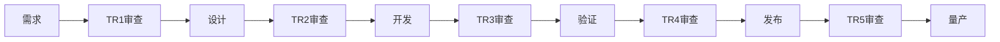
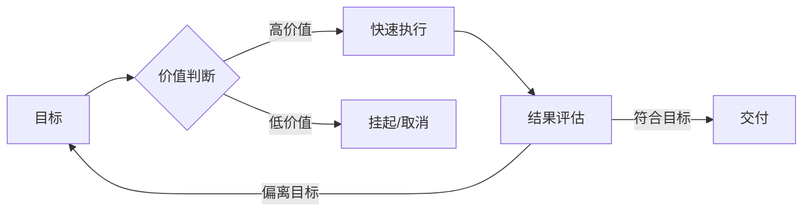

# 🏗️ 服务器研发团队管理机制：流程驱动 vs 价值驱动的深度分析与岗位适配

> **类型**: 专题分析报告 · **创建**: 2026-07-30 · **版本**: v1.0
> **核心命题**: 服务器研发管理应当以「明确流程、按章办事」为主，还是以「围绕目标、机动响应」为主？两种模式对硬件/软件/固件/测试/项目管理等不同岗位的适用性截然不同。本报告基于服务器产业四十年组织模式演变（IBM→华为→新华三→JDM），构建岗位-模式适配矩阵。
> **前置阅读**: [🏭 研发人员是否需要关注商业价值？](2026-07-30-developer-business-value-roi-analysis.md) — 同一议题的「人」的维度
> **交叉链接**: [经营思维与效益管理](../18_methodology-framework/2026-07-15-business-thinking-performance-management.md) · [AI项目管理痛点分析](../03_server/06_enterprise-mgmt/2026-07-16-ai-project-management-deep-analysis.md) · [研发全周期管理报告](../../02_rd/03_management/02_project-management/2026-06-04-doubao-full-cycle-management-report.md)

---

## 📑 目录 (TOC)

- [§0 执行摘要](#0-执行摘要)
- [§1 问题定义：两种管理哲学的终极对立](#1-问题定义两种管理哲学的终极对立)
  - [1.1 两条路径的典型画像](#11-两条路径的典型画像)
  - [1.2 核心矛盾矩阵](#12-核心矛盾矩阵)
  - [1.3 为什么不能「既要又要」——资源约束下的取舍](#13-为什么不能既要又要资源约束下的取舍)
- [§2 历史演变：四代管理模式的演进脉络](#2-历史演变四代管理模式的演进脉络)
  - [2.1 第一代 · IBM（1980s-1990s）](#21-第一代--ibm1980s-1990s)
  - [2.2 第二代 · 华为（2000s-2010s）](#22-第二代--华为2000s-2010s)
  - [2.3 第三代 · 新华三（2010s-2020s）](#23-第三代--新华三2010s-2020s)
  - [2.4 第四代 · JDM（2020s-至今）](#24-第四代--jdm2020s-至今)
  - [2.5 四代模式的演变规律](#25-四代模式的演变规律)
- [§3 两种管理哲学的核心差异分析](#3-两种管理哲学的核心差异分析)
  - [3.1 流程驱动（Process-Driven）](#31-流程驱动process-driven)
  - [3.2 价值驱动（Value-Driven）](#32-价值驱动value-driven)
  - [3.3 八维度全量对比](#33-八维度全量对比)
  - [3.4 适用边界：不是「哪个好」，而是「哪个场景下好」](#34-适用边界不是哪个好而是哪个场景下好)
- [§4 各研发岗位的适配分析](#4-各研发岗位的适配分析)
  - [4.1 岗位总览与分类](#41-岗位总览与分类)
  - [4.2 硬件开发（HW）](#42-硬件开发hw)
  - [4.3 软件开发（SW / BSP / BIOS）](#43-软件开发sw--bsp--bios)
  - [4.4 固件开发（FW / BMC / CPLD）](#44-固件开发fw--bmc--cpld)
  - [4.5 测试与验证（TEST / QA / DVT）](#45-测试与验证test--qa--dvt)
  - [4.6 系统架构（Architect / System Engineer）](#46-系统架构architect--system-engineer)
  - [4.7 项目管理（PM / TPM）](#47-项目管理pm--tpm)
  - [4.8 供应链与质量（SCM / QE / DFX）](#48-供应链与质量scm--qe--dfx)
  - [4.9 岗位-模式适配矩阵（总表）](#49-岗位-模式适配矩阵总表)
- [§5 混合模式的实践与陷阱](#5-混合模式的实践与陷阱)
  - [5.1 常见混合模式](#51-常见混合模式)
  - [5.2 混合模式的典型失败案例](#52-混合模式的典型失败案例)
  - [5.3 混合模式的底层约束](#53-混合模式的底层约束)
- [§6 选择决策框架](#6-选择决策框架)
  - [6.1 六维决策公式](#61-六维决策公式)
  - [6.2 按组织规模的推荐配置](#62-按组织规模的推荐配置)
  - [6.3 按利润水平的推荐配置](#63-按利润水平的推荐配置)
  - [6.4 管理演进路线图](#64-管理演进路线图)
- [§7 对个体研发人员的启示](#7-对个体研发人员的启示)
  - [7.1 不同管理模式下的人才特质要求](#71-不同管理模式下的人才特质要求)
  - [7.2 跨模式适应的核心能力](#72-跨模式适应的核心能力)
  - [7.3 「管理风格兼容性」自测表](#73-管理风格兼容性自测表)
- [§8 结论](#8-结论)
- [变更日志](#变更日志)

---

## §0 执行摘要

服务器研发团队的管理模式，本质上是对**不确定性、资源密度和人才成熟度**三个变量的权衡。四十年产业演变表明：**没有绝对最优的管理模式，只有与产业利润结构、产品成熟度、团队规模三者匹配的模式**。

### 核心发现

| # | 发现 | 证据 |
|:-:|:-----|:------|
| **F1** | **流程驱动 vs 价值驱动不是二选一，而是「阶段适配」** | 产品生命周期不同阶段对流程密度要求不同；成熟产品需要更多流程，创新产品需要更多自由度 |
| **F2** | **硬件/软件/固件三者的最优管理模式不同** | 硬件因物理约束（制版周期/物料交期）天然需要更多流程；软件因可回滚特性更适合价值驱动 |
| **F3** | **产业利润决定管理冗余空间，而非决定管理模式** | 高毛利时代（IBM 40%+）的多层流程不是「更好的管理」，而是「买得起的流程」 |
| **F4** | **混合模式的最大风险是「流程套在价值驱动外衣上」** | 实行价值驱动却保留所有流程节点的审批 → 既失去了效率，也失去了确定性 |
| **F5** | **价值驱动对人才成熟度的要求远高于流程驱动** | 流程驱动可以用「合格」的人，价值驱动需要「判断力合格」的人——这个差距很大 |
| **F6** | **AI 正在模糊两者的边界** | AI 将标准流程自动化后，人的价值转向异常判断和方向决策——这更接近价值驱动的核心 |

### 最终判断

- **30 人以下团队** → 价值驱动（高机动性）为默认模式，流程只要「最小可行」
- **30-200 人团队** → 混合模式：核心岗位（硬件/测试）流程驱动，创新岗位（软件/架构）价值驱动
- **200 人以上团队** → 以流程驱动为骨架，以价值驱动为皮肉——流程保证下限，价值驱动提升上限
- **利润 <8% 的极致竞争环境** → 必须价值驱动（JDM 模式），流程驱动的管理成本会压垮利润

---

## §1 问题定义：两种管理哲学的终极对立

### 1.1 两条路径的典型画像

#### 路径 A：流程驱动（Process-Driven）

> 「把研发流程写清楚，大家按流程走，评审点一个一个过，质量自然就上来了。」



**典型口号**：「流程就是生产力」「通过流程保证质量」「没有文档就没有交付」

**代表企业**：华为（IPD 全流程）、传统 IBM、大型 ODM（广达/英业达成熟产品线）

#### 路径 B：价值驱动（Value-Driven）

> 「不要被流程束缚，围绕目标和价值快速行动。领导层根据情况灵活调整方向，团队自己判断该做什么。」



**典型口号**：「紧盯目标，快速迭代」「相信团队的专业判断」「先做出来再说」

**代表企业**：初创 JDM 厂商、创新事业部、Google X（登月项目早期阶段）

### 1.2 核心矛盾矩阵

两个路径的根本冲突点不在于「要不要管理」，而在于**「谁说了算」和「什么说了算」**：

| 维度 | 流程驱动 | 价值驱动 | 冲突根源 |
|:-----|:---------|:---------|:---------|
| **决策主体** | 流程节点+评审委员会 | 团队/个人+领导机动判断 | 决策权的集中 vs 分散 |
| **度量标准** | 流程遵从度（TR通过率） | 价值产出（ROI/客户满意度）| 「做对了」vs「做对了事」|
| **错误容忍** | 不允流程错误，允技术错误 | 允方向错误，不允执行拖延 | 防错 vs 快速迭代 |
| **信息流向** | 自下而上报告 + 自上而下指令 | 目标对齐 + 横向自主协调 | 层级 vs 网络通信模式 |
| **人才需求** | 专业深度的「执行者」| 判断力的「决策者」| 专才 vs T 型人才 |

### 1.3 为什么不能「既要又要」——资源约束下的取舍

很多管理者希望「既有流程的确定性又有机动的灵活性」，但这是有代价的：

**两套管理并存的管理成本**：

- 流程驱动需要：流程定义、评审组织、合规审计、文档维护 → 管理成本约 15-25% 的人力
- 价值驱动需要：目标对齐、方向沟通、决策权下放、容错预算 → 管理成本约 5-10% 的人力
- 两者共存：两套体系并行 → 管理成本约 25-40% 的人力

```text
管理成本 vs 团队规模
 50% |                        🚫 两套并行区（不可持续）
     |                       /
 30% |              流程驱动区
     |              /
 15% |    混合区
     |    /
  5% | 价值驱动区
     +--------------------------
        10人  50人  200人  500人
```

**关键洞察**：在利润足够高时，可以承受两套体系的成本；但当前服务器行业毛利率 <15% 时，两套体系的成本 ≈ 吃掉 1.5-3 个百分点的毛利率——这往往是盈亏分界线。

---

## §2 历史演变：四代管理模式的演进脉络

### 2.1 第一代 · IBM（1980s-1990s）

**利润背景**：服务器行业毛利率 ~40-50%，系统厂商拥有从芯片到应用的全栈能力。

**管理模式**：**多层专家分工 + 重流程评审**

```text
IBM 管理金字塔

                    ⬆ 战略决策层（高层）
    +-------------------+-------------------+
    |  架构委员会       |  产品委员会       |  技术委员会
    +-------------------+-------------------+
    |  TR1->TR2->TR3->TR4->TR5->TR6 全流程      |  ⬆ 流程评审层
    +-------------------+-------------------+
    |  硬件组  软件组  固件组  测试组  制造组 |  ⬆ 执行层
    +-------------------+-------------------+
```

**关键特征**：

- **流程即制度**：每个 TR 点有 50+ 页检查清单
- **角色极度细分**：硬件工程师不分原理图/布局/信号仿真，各司其职
- **决策链条长**：一个 BOM 变更需要 7 级审批
- **文档文化**：「没有文档就没有事实」

**为何能这么管**：

- 高毛利 → 养得起大量非直接创造价值的岗位（流程管理/评审/审计）
- 市场寡头 → 产品周期长（3-5 年一代），流程成本可以分摊
- 技术壁垒高 → 人才深度比广度更重要

**IBM 管理模式的成本结构**（估算）：

```text
+----------------------------------+
|           总人力成本              |
|  +-----------------------------+ |
|  | 直接研发（HW/SW/FW）: 60%   | |
|  +-----------------------------+ |
|  | 流程管理/评审/审计: 25%     | | <- 高毛利养得起
|  +-----------------------------+ |
|  | 文档/合规/标准化: 15%       | |
|  +-----------------------------+ |
+----------------------------------+
```

### 2.2 第二代 · 华为（2000s-2010s）

**利润背景**：毛利率 ~25-35%，从跟随者向领先者转型。

**管理模式**：**IPD 矩阵式 + 有边界参与**

```text
华为 IPD 矩阵

             产品线1    产品线2    产品线3
             +------+  +------+  +------+
   硬件开发  |  o   |  |  o   |  |  o   |
   软件开发  |  o   |  |  o   |  |  o   |
   系统测试  |  o   |  |  o   |  |  o   |
   供应链    |  o   |  |  o   |  |  o   |
             +------+  +------+  +------+
```

**关键特征**：

- **IPD 流程重型但可裁剪**：不同产品等级（A/B/C）对应不同流程密度
- **技术线 + 管理线双线**：技术专家可以走「Fellow」路线，不必转管理
- **矩阵参与**：研发按项目参与产品线，但保留在职能部门的管理归属
- **评审权改进**：IBM 的「委员会决策」→ 华为的「评审+技术负责人决策」

**关键改进**：

- **流程裁剪机制**：A 类产品（旗舰）用完整 IPD，C 类产品（OEM 款）只用 30% 环节
- **角色更宽**：一个硬件工程师要做原理图+Layout 指导+信号仿真
- **决策下放**：TR2 之前项目经理可决策，TR4 之后才需委员会

**管理成本**：~20%（比 IBM 降低 5 个百分点）

### 2.3 第三代 · 新华三（2010s-2020s）

**利润背景**：毛利率 ~20-25%，市场竞争激烈，定制化需求增多。

**管理模式**：**BU 制 + 精简流程 + 有限全流程**

```text
新华三 BU 制

    +------------------------------+
    |        公司管理层             |
    +--------+--------+------------+
    |  BU1   |  BU2   |   BU3      |
    |  (通用) | (AI)   |  (网络)    |
    +--------+--------+------------+
    |   共享平台（供应链/HR/财务）   |
    +------------------------------+

    BU 内部结构（~50-80人）:
    +------------------------+
    |  PM + 系统架构         |
    +------------------------+
    |  HW + SW + FW + 测试   | <- 没有中间流程层
    +------------------------+
    |  直接对接客户           |
    +------------------------+
```

**关键特征**：

- **BU 自治**：每个 BU 有自己的研发、市场、交付，独立核算损益
- **流程精简**：TR 点从 6 个精简到 3-4 个，评审从委员会降到核心团队
- **研发更靠近客户**：产品定义不再由高层拍板，而是 BU 直接对接客户需求
- **共享平台**：供应链/生产/HR 保持共享，避免每个 BU 重复造轮子

**关键改进**：

- **损益责任下沉到 BU** → 研发管理者必须懂商业
- **流程去官僚化** → 3 页评审材料代替 50 页
- **决策链缩短 50%** → 一个 BOM 变更只需 BU 负责人批准

**管理成本**：~12-15%（比华为再降 5-8 个百分点）

### 2.4 第四代 · JDM（2020s-至今）

**利润背景**：毛利率 <10%（AI 服务器因 GPU 溢价甚至 <5%）。

**管理模式**：**小团队全流程 + 高机动性 + ODM 深度嵌入**

```text
JDM 协作模式（以某 Top3 JDM 厂商为例）

   客户（互联网大厂）                 JDM 厂商
   +------------------+           +------------------+
   |  需求定义 70%     |<-------->|  联合设计 50%    |
   |  +--------------+ |           |  +--------------+ |
   |  | 产品规格      | |           |  | 详细设计     | |
   |  | 性能指标      | | 双向      |  | 原型验证     | |
   |  | 定价约束      | | 渗透      |  | 量产支持     | |
   |  +--------------+ |           |  +--------------+ |
   +------------------+           +------------------+

   团队结构（~15-30 人/项目）:
   +------------------------------+
   |  1 × 客户对接 PM             |
   |  1 × 内部项目经理            |
   |  1 × 系统架构师（兼硬件）    |
   |  3-5 × 硬件工程师（全栈）     |
   |  3-5 × 软件/BSP/BIOS          |
   |  2-3 × 测试                  |
   |  1 × 供应链（兼质量）         |
   +------------------------------+
```

**关键特征**：

- **极扁平组织**：项目经理直接对接一线工程师，没有中间管理层
- **角色高度重叠**：硬件工程师兼做系统架构/DFM/BOM 管理/供应商沟通
- **流程极度精简**：TR 点从 6 降到 2-3 个，评审变为「核心团队会签」
- **决策链超短**：一个 BOM 变更只需内部 PM 确认 + 客户确认
- **以客户目标为驱动**：客户说「这个月底需要 500 台」，团队自行规划路径
- **领导高机动性**：VP/总监直接参与项目决策，跳过正式评审环节

**关键改进**：

- **研发即管理**：一线工程师自己做计划、管进度、对结果负责
- **流程自动化**：CI/CD 代替人工评审，Checklist 代替评审会议
- **人才要求聚变**：从「我擅长 SI」到「我能在 2 周内把 SI 方案落地到量产」

**管理成本**：~5-8%（降至新低）

### 2.5 四代模式的演变规律

```text
管理演变主线（1960s -> 2026）

流程密度
  ^
  |    IBM
  |     ################## (全流程重型)
  |
  |    华为
  |     ############### (IPD 可裁剪)
  |
  |    新华三
  |     ########## (精简 BU 制)
  |
  |    JDM
  |     ##### (最小可行流程)
  +---------------------------> 时间

毛利率 v 流程密度 v 角色宽度 ^ 决策链 v
```

**五条演变规律**：

| # | 规律 | 解释 | 例外 |
|:-:|:-----|:------|:------|
| **R1** | **利润决定流程密度上限** | 毛利率每降 5%，管理人力占比降 ~3% | 安全关键系统（航空/医疗）流程不随利润降 |
| **R2** | **角色宽度与流程密度反向** | 人越少越全栈，人越多越细分 | 初创公司例外（人少但细分不明智） |
| **R3** | **决策链长度≈流程节点数** | 6 个 TR → 6 个决策点，2 个 TR → 2 个决策点 | 如果 TR 只走过场则决策链仍短 |
| **R4** | **管理成本有「地板效应」** | 再精简也需要质量门禁（测试/审计），地板约 5% | 全职研发团队 <10 人时可更低 |
| **R5** | **AI 正在打破流程-成本的关系** | AI 替代流程管理人力 → 可以用较少人力维持较密流程 | 需要大量定制化适配，非通用方案 |

---

## §3 两种管理哲学的核心差异分析

### 3.1 流程驱动（Process-Driven）

**适用场景**：

- 产品复杂度高（数百个元器件/数百万行代码）
- 涉及人身安全或重大经济损失（服务器可靠性要求）
- 团队规模 >200 人
- 人员流动性大，需要「制度化」保障下限
- 客户要求流程合规认证（ISO/TL9000）

**优势**：

| 优势 | 原理 | 量化证据 |
|:-----|:------|:---------|
| **质量下限高** | 每个 TR 点拦截早期缺陷 | 华为 IPD 数据显示：TR1-2 发现的问题修复成本为 $1，到 TR5-6 为 $1000 |
| **可复制性强** | 新人按流程走就能交付 70 分结果 | 广达新员工培训周期 3 个月即可独立交付 |
| **责任清晰** | 每步有 owner，出事追溯明确 | 合规审计通过率提高 40% |
| **规模扩展性好** | 200 人变 500 人只需加流程节点 | 反之，价值驱动团队 200→500 人需彻底重构管理 |

**劣势**：

| 劣势 | 原理 | 量化证据 |
|:-----|:------|:---------|
| **效率损失** | 等待评审消耗的时间占 20-30% | 硬件 TR 等待平均 2-3 周 |
| **创新抑制** | 流程外的尝试被制度性拒绝 | Google 研究发现：过度流程化的团队「side project」产出降低 60% |
| **决策延迟** | BOM 变更 7 级审批 → 2-4 周 | 错过关键元器件最佳采购窗口 |
| **僵化执行** | 流程合格≠产品成功 | 大量「流程完美但有问题的产品」案例 |

### 3.2 价值驱动（Value-Driven）

**适用场景**：

- 市场变化快，需要快速响应（AI 服务器 3 个月一代）
- 产品形态在快速迭代中（早期产品定义不清晰）
- 团队规模 <50 人
- 人才成熟度高，有独立判断能力
- 利润极低，养不起流程管理人力

**优势**：

| 优势 | 原理 | 量化证据 |
|:-----|:------|:---------|
| **效率极高** | 没有等待评审的时间浪费 | JDM 厂商新产品导入时间 ~3-4 个月 vs 传统 ODM 6-8 个月 |
| **创新空间大** | 工程师可以尝试非常规方案 | 某 JDM 厂商 30% 的创新方案来自工程师自发的「跑偏」尝试 |
| **适应性强** | 需求变化时快速调整方向 | AI 服务器 GPU 换代的响应时间：JDM 2-4 周 vs 传统厂商 8-12 周 |
| **人才成长快** | 接触全流程，视野更宽 | JDM 工程师 3 年经验 ≈ 传统厂商 5 年经验的广度 |

**劣势**：

| 劣势 | 原理 | 量化证据 |
|:-----|:------|:---------|
| **质量波动大** | 高度依赖个人判断力 | 「低水平价值驱动」= 混乱 |
| **可复制性差** | 换了人可能结果判若两人 | 核心工程师离职导致项目延期概率 40% |
| **规模瓶颈** | 50 人以上难以维持 | 多数 JDM 厂商超 100 人后出现管理混乱 |
| **方向依赖领导** | 领导判断失误 → 全队白费 | JDM 模式中「选错客户」是最大的失败风险源 |

### 3.3 八维度全量对比

| 维度 | 流程驱动 | 价值驱动 | 差异幅度 |
|:-----|:---------|:---------|:--------:|
| **决策速度** | 3-7 天（常规变更） | 2-4 小时 | **10-20x** |
| **质量一致性** | σ ≤ 0.3（高一致性） | σ ≥ 0.8（波动大） | 2.5-3x |
| **人力成本（管理占比）** | 15-25% | 5-8% | **3-5x** |
| **人才门槛** | 专业深度 7/10 | 判断力 8/10+广度 6/10 | 侧重不同 |
| **创新产出** | 在流程框架内优化 | 非预期创新概率高 | 无直接可比 |
| **规模扩展性** | 从 20→500 人无需重构 | 50→200 人需要重构 | 关键差异 |
| **容错预算** | 需要大量预算 | 需要少量但精确的预算 | 数量级不同 |
| **工具依赖** | 依赖流程管理工具（PLM/ERP） | 依赖沟通工具+CI/CD | 技术栈不同 |

### 3.4 适用边界：不是「哪个好」，而是「哪个场景下好」

```text
                     产品生命周期
                 ------------------------>
                探索期        成长期        成熟期
     +---------+----------+----------+----------+
     | 价值驱动 | ######## | ######   | ##       |  <- 创新优先
     |          | (初创定义) | (快速迭代) | (微创新)  |
     +---------+----------+----------+----------+
     | 流程驱动 | ##       | ######   | ######## |  <- 质量优先
     |          | (谨慎使用) | (规模扩展) | (成熟产线)|
     +---------+----------+----------+----------+

                     团队人才成熟度
                 ------------------------>
                 初级为主     中高级混合   全高级
     +---------+----------+----------+----------+
     | 价值驱动 | ##       | ######   | ######## |  <- 人才成熟
     |          | (不可行!)  | (谨慎)    | (可行)    |
     +---------+----------+----------+----------+
     | 流程驱动 | ######## | ######   | ##       |  <- 系统保障
     |          | (适合)    | (可选)    | (可精简)   |
     +---------+----------+----------+----------+
```

---

## §4 各研发岗位的适配分析

### 4.1 岗位总览与分类

服务器研发典型岗位可分为 6 大类，每类的**工作性质、出错代价、迭代频率、外部约束**决定了最优管理模式：

| 大类 | 岗位示例 | 工作特点 | 出错代价 | 迭代频率 | 外部约束 |
|:-----|:---------|:---------|:--------:|:--------:|:---------|
| **硬件** | 系统/原理图/Layout/信号/热/结构 | 物理交付，不可回滚 | 🔴 极高（修板 = 8-12 周 + $50-200K） | 低（1-2 版/项目） | 制版周期/物料交期/认证 |
| **软件** | BSP/BIOS/驱动/管理软件 | 逻辑交付，可 OTA 回滚 | 🟡 中（Bug 可补丁） | 高（周级迭代） | 兼容性/性能基线 |
| **固件** | BMC/CPLD/FPGA/MCU | 介乎 HW/SW 之间 | 🟠 高-中（部分可更新，部分不可） | 中（月级迭代） | 芯片厂商固件栈成熟度 |
| **测试** | DVT/SIT/可靠性/认证 | 验证性质，依赖前序交付 | 🟡 中（漏测 = 流到客户） | 中（项目周期内多次） | 测试资源/设备/样机 |
| **架构** | 系统架构/方案设计 | 决策性质，影响全局 | 🔴 极高（架构错 = 全盘重来） | 低（项目初期） | 技术趋势/客户需求/成本约束 |
| **项目管理** | PM/TPM/供应链 | 协调性质，信息密集 | 🟠 高（延期 = 损失窗口） | 持续（日常） | 客户/供应商/内部资源 |

### 4.2 硬件开发（HW）

**岗位类型**：系统工程师、原理图工程师、Layout 工程师、信号完整性工程师、热设计工程师、结构工程师

**工作本质**：物理世界约束下的工程决策。每一个硬件错误的修复代价量级为 $50K（工程变更）到 $200K（重新制版）。

**为什么硬件天然倾向流程驱动**：

| 硬件特性 | 对管理的约束 | 最佳管理模式 |
|:---------|:-------------|:------------|
| **制版周期 8-12 周** | 一旦流片/制版，2-3 个月内无法修改 | 需要 TR 点强制审查，避免低级错误 |
| **物料交期 8-16 周** | BOM 冻结后不可变 | 需要严格的 BOM 变更管理流程 |
| **认证周期 4-8 周** | 未通过认证不可销售 | 需要在设计阶段就做预认证检查 |
| **一版多产** | 一块板子用在多个项目中 | 需要设计复用审查和版本管理 |
| **物理样机有限** | 测试资源争抢 | 需要排期和优先级管理 |

**最优管理画像**：

```text
硬件开发管理模式
+----------------------------------+
| 流程保障 ≈ 70%                    |
| +----------------------------+  |
| | TR1 TR2 TR3 审查           |  |
| | 原理图评审  Layout 评审    |  |
| | BOM 会签   DFM 审查        |  |
| | ECN 变更流程               |  |
| +----------------------------+  |
|                                  |
| 价值驱动 ≈ 30%                   |
| +----------------------------+  |
| | SI 仿真方案选择            |  |  <- 这些是判断性决策
| | 元器件替代方案              |  |     需工程师自己的判断
| | 散热方案权衡               |  |
| +----------------------------+  |
+----------------------------------+
```

**关键结论**：硬件开发**不应**采用纯价值驱动模式。流程不是束缚，而是安全保障。但流程应聚焦在「高代价错误拦截」而非「所有决策控制」。

**最佳实践建议**：

- 必设硬卡点：原理图评审、Layout 评审、BOM 会签、DFM 审查 — 不可跳过
- 可灵活处理：SI 仿真方案选择、元器件选型、散热方案评估 — 放权给工程师
- 应自动化：BOM 合规检查、版本一致性检查、ERC 规则检查 — 用工具代替人

### 4.3 软件开发（SW / BSP / BIOS）

**岗位类型**：BSP 驱动工程师、BIOS/UEFI 工程师、管理软件工程师、测试工具开发

**工作本质**：逻辑世界的构建。大多数错误可通过代码更新修复（OTA 或现场升级），回滚成本低。

**为什么软件倾向价值驱动**：

| 软件特性 | 对管理的约束 | 最佳管理模式 |
|:---------|:-------------|:------------|
| **可 OTA 修复** | 发布后 90% 的 Bug 可远程修复 | 不必在发布前过度审查 |
| **CI/CD 自动化** | 自动构建→测试→部署，减少人工环节 | 用自动化取代流程节点 |
| **迭代周期短** | 2-4 周一个发布版本 | 允许快速试错，不必等待审批 |
| **依赖链复杂** | 芯片 SDK/BSP/OS/开源组件 | 管理依赖版本比管理流程更重要 |
| **可并行开发** | 多分支同时开发 | 分支策略比流程评审更有效 |

**最优管理画像**：

```text
软件开发管理模式
+----------------------------------+
| 流程保障 ≈ 30%                    |
| +------------------------+      |
| | 接口定义合同/API 审查   |      |
| | 安全审查（关键模块）   |      |
| | 发布管理/版本冻结      |      |
| +------------------------+      |
|                                  |
| 价值驱动 ≈ 70%                   |
| +------------------------+      |
| | 每日 CI 自动化测试     |      |  <- 用自动化代替流程
| | 分支策略自主决定        |      |     让工程师聚焦创造
| | 代码 Review 放权给团队  |      |
| | 发布节奏按目标灵活调整  |      |
| +------------------------+      |
+----------------------------------+
```

**关键结论**：软件开发适合**以价值驱动为主**，但关键接口和安全性需要流程保障。

**最佳实践建议**：

- 必设硬卡点：API 规范对齐、安全审查（CSAF/加密模块）、发布基线冻结 — 不可跳过
- 可灵活处理：代码实现细节、分支策略、发布节奏、功能优先级排序 — 团队自主决策
- 应自动化：单元测试覆盖、集成测试、性能回归、安全扫描 — 每 PR 自动执行

### 4.4 固件开发（FW / BMC / CPLD）

**岗位类型**：BMC 固件、CPLD/FPGA 逻辑、MCU 固件、HMC 管理控制器

**工作本质**：硬件和软件的「交界地带」。BMC/CPLD 可升级但风险高（升级失败 → 整机不可用），FPGA 逻辑不可回滚。

**为什么固件是「最难管」的岗位**：

| 固件特性 | 对管理的约束 |
|:---------|:-------------|
| **部分可升级，部分不可** | CPLD/FPGA 逻辑变更 = 新硬件，BMC 可升级但需带外通道 |
| **固件升级风险不对称** | 1% 的升级失败率 = 100% 的不可用（P3 场景丢包 |
| **芯片厂商依赖** | 固件栈质量取决于芯片厂商（BMC 厂商的 SDK 质量参差不齐） |
| **热补丁能力弱** | 相比应用软件，固件的热补丁能力弱 1-2 个数量级 |
| **硬软件联合调试** | 固件问题往往横跨 HW 和 SW 域，定位链极长 |

**最优管理画像**：

```text
固件开发管理模式
+----------------------------------+
| 流程保障 ≈ 50%                    |
| +------------------------+      |
| | 固件版本基线管理       |      |
| | 升级路径兼容性审查     |      |
| | 芯片 SDK 集成验证      |      |
| | 异常恢复机制审查       |      |
| +------------------------+      |
|                                  |
| 价值驱动 ≈ 50%                   |
| +------------------------+      |
| | 固件特性开发节奏自主    |      |
| | Bug 定位和修复方案      |      |  <- 需要工程师深入理解
| | 芯片厂商接口适配策略    |      |     硬件行为的判断力
| +------------------------+      |
+----------------------------------+
```

**关键结论**：固件是**混合模式的典型场景** — 既要流程保障升级安全，又要给工程师足够的判断空间定位硬件级 Bug。

### 4.5 测试与验证（TEST / QA / DVT）

**岗位类型**：功能测试、系统集成测试（SIT）、可靠性测试（DVT）、认证测试、自动化测试开发

**工作本质**：验证者角色。发现问题是价值，漏测是风险。

**为什么测试「流程驱动是底线」**：

| 测试特性 | 对管理的约束 |
|:---------|:-------------|
| **漏测代价高** | 流到客户的 Bug 修复成本是内部发现的 10-100x |
| **测试依赖前序** | 必须等硬件/软件交付才能测试 |
| **测试资源有限** | 样机数量、测试设备、测试时间都是约束 |
| **认证不可逆** | 认证失败 → 重新送测 → 4-8 周延迟 |
| **覆盖可度量** | 测试覆盖率是最客观的「质量证据」 |

**最优管理画像**：

```text
测试开发管理模式
+----------------------------------+
| 流程保障 ≈ 80%                    |
| +------------------------+      |
| | 测试计划评审           |      |  <- 不可跳过
| | 测试用例评审           |      |
| | 缺陷管理流程           |      |
| | 回归测试基线           |      |
| | 认证准备清单           |      |
| +------------------------+      |
|                                  |
| 价值驱动 ≈ 20%                   |
| +------------------------+      |
| | 测试优先级判断          |      |  <- 哪些测试先跑、哪些可裁剪
| | 自动化测试框架选择      |      |     需要工程判断
| +------------------------+      |
+----------------------------------+
```

**关键结论**：测试是**最不适合纯价值驱动的岗位**。流程是测试的「程序正义」保障。测试自主权可放在「测什么先测」的优先级判断上，而非「测不测」的选择上。

### 4.6 系统架构（Architect / System Engineer）

**岗位类型**：系统架构师、方案架构师、技术预研工程师

**工作本质**：决策者角色。架构选择影响整个项目的成本、性能、进度。

**为什么架构「需要价值驱动」**：

| 架构特性 | 对管理的约束 |
|:---------|:-------------|
| **没有「标准答案」** | 每个方案都是权衡，没有唯一正确的路径 |
| **信息不完整** | 架构决策时往往没有全部信息 |
| **影响全局** | 架构错了后期推倒重来代价极大 |
| **创新成分高** | 架构是「把已知方案用到新场景」或「创造新方案」|
| **经验驱动** | 顶尖架构师的价值在于「知道哪些方案会踩坑」|

**最优管理画像**：

```text
系统架构管理模式
+----------------------------------+
| 流程保障 ≈ 20%                    |
| +------------------------+      |
| | 架构评审（关键决策点） |      |  <- 只评审核心假设
| | 技术选型记录           |      |     不做细节审查
| +------------------------+      |
|                                  |
| 价值驱动 ≈ 80%                   |
| +------------------------+      |
| | 方案方向自主决定        |      |
| | POC 验证放权            |      |  <- 核心是判断力
| | 技术选型权在架构师      |      |     不是流程
| | 风险判断不受流程约束    |      |
| +------------------------+      |
+----------------------------------+
```

**关键结论**：架构是**最强价值驱动的岗位**。给架构师套太多流程，等于用流程代替判断——这正是很多优秀架构师离开大厂去小公司的原因。

### 4.7 项目管理（PM / TPM）

**岗位类型**：项目经理（PM）、技术项目经理（TPM）、产品经理、产品线负责人

**工作本质**：信息枢纽和资源协调。PM 不是管人，而是管「信息流」和「决策流」。

**为什么 PM「两种模式都能用，但要求不同」**：

| PM 类型 | 流程驱动模式下的 PM | 价值驱动模式下的 PM |
|:--------|:--------------------|:--------------------|
| **工作方式** | 按 TR 节点推进，管理评审 | 按目标倒推，协调资源 |
| **核心技能** | 流程遵从、文档管理、向上汇报 | 目标分解、优先级判断、跨部门协调 |
| **决策权** | 流程说了算，PM 是执行者 | PM 有决策权，对结果负责 |
| **信息管理** | 写周报、日报、会议纪要 | 建立关键决策的沟通渠道 |
| **失败模式** | 流程走完但产品不 success | 方向对但执行没守住 |

**关键结论**：PM 的管理模式应**适配团队的整体模式**。流程驱动团队的 PM 做流程管理，价值驱动团队的 PM 做目标管理。最怕的是「流程驱动团队的 PM 认为自己有权做方向决策」或「价值驱动团队的 PM 还在等流程批准」。

### 4.8 供应链与质量（SCM / QE / DFX）

**岗位类型**：供应链工程师、质量工程师、DFX 工程师、合规工程师

**工作本质**：约束条件管理者。供应链/质量的角色是「告诉研发哪些不能做」。

**为什么这类岗位「流程驱动是天然选择」**：

| 特性 | 对管理的约束 |
|:-----|:-------------|
| **供应链信息是硬约束** | 元器件交期不可协商，不是「相信团队就能解决」 |
| **质量数据需要标准** | 不良率/DPPM/ORT 需要统一采集标准 |
| **合规是硬门槛** | 通不过认证就是不能卖 |
| **DFX 规则可固化** | 大部分 DFM/DFT 规则可以自动化检查 |
| **跨项目复用** | 供应链和质量数据跨项目有效，需要统一标准 |

**关键结论**：供应链和质量是**流程驱动的压舱石**。即使全公司采用价值驱动，供应链和质量环节也不能放松流程。它们的流程不是「管理成本」而是「风险控制投资」。

### 4.9 岗位-模式适配矩阵（总表）

| 岗位 | 推荐管理模式 | 流程占比 | 关键理由 | 最怕什么 |
|:-----|:------------|:--------:|:---------|:---------|
| **硬件开发** | 流程驱动为主 | 70% | 物理不可回滚，制版代价高 | 跳过审查直接制版 |
| **软件开发** | 价值驱动为主 | 30% | 可 OTA 修复，CI/CD 自动化 | 过度审查拖慢迭代 |
| **固件开发** | 混合均衡 | 50% | 升级风险大但需判断空间 | 两头都不靠（既无流程也无判断力）|
| **测试验证** | **流程驱动严格** | 80% | 漏测代价高，认证不可逆 | 用「相信团队」替代测试基线 |
| **系统架构** | **价值驱动为主** | 20% | 判断力核心，无标准答案 | 用流程替代判断 |
| **项目管理** | 随团队模式 | 视情况 | PM 应适配而非定义管理模式 | 模式错配 |
| **供应链/质量** | **流程驱动严格** | 85% | 硬约束不可协商，合规是底线 | 为「效率」跳过合规环节 |

---

## §5 混合模式的实践与陷阱

### 5.1 常见混合模式

实践中几乎没有纯流程驱动或纯价值驱动的团队。以下是三种常见的混合模式：

#### 模式 A：流程骨架 + 价值皮肉（推荐）

> 用流程保底线，用价值驱动提上限。

```text
公司级 流程骨架              团队级 价值皮肉
+--------------------+      +--------------------+
| TR 评审节点         |      | 实现方式自主决定    |
| BOM 变更审批        |      | 技术方案选择权      |
| 版本基线冻结        |      | 发布节奏灵活        |
| 合规检查            |      | 优先级排序自主      |
| 质量门禁            |      | 侧项目尝试允许      |
+--------------------+      +--------------------+
     ^ 不可跳过                    ^ 可灵活调整
```

**适用**：中型成熟团队（50-200 人），产品线稳定但需要创新空间

**典型成功案例**：华为 IPD 的 A/B/C 产品分级 —— A 类产品（旗舰）用完整 IPD，C 类产品（OEM 款）只用 30% 节点。同样的公司、同样的流程体系，但不同产品线有不同的「流程密度」。

#### 模式 B：时间窗口分区（阶段切换）

> 产品不同阶段用不同管理模式。

```text
阶段      探索期          定义期          开发期          量产期
模式      价值驱动        轻流程         中流程          重流程
流程占比  10%            30%            50%             80%
          ^              ^              ^               ^
        团队自由探索   锁定架构方向    严格开发流程    全量质量管控
```

**适用**：创新型产品线，从 0 到 1 再规模化

**典型成功案例**：某 Top3 JDM 厂商的新产品线策略 —— 前 3 个月（探索期）完全价值驱动，架构锁定后切换流程驱动。

#### 模式 C：岗位分区（异质管理）

> 不同岗位用不同管理模式（这正是 §4 的实践映射）。

```text
公司管理全景（异质管理）

    +--------------+  +--------------+  +--------------+
    | 硬件组       |  | 软件组       |  | 测试组       |
    | 流程驱动 70%  |  | 价值驱动 70%  |  | 流程驱动 80%  |
    | 严格 TR       |  | CI/CD 自主    |  | 测试基线严格  |
    +--------------+  +--------------+  +--------------+

    +--------------+  +--------------+  +--------------+
    | 架构组       |  | 供应链       |  | PM           |
    | 价值驱动 80%  |  | 流程驱动 85%  |  | 适配团队     |
    | 方案自主      |  | 合规严格      |  | 看整体模式   |
    +--------------+  +--------------+  +--------------+
```

**适用**：多工种混合团队（所有服务器厂商的默认形态）

**核心挑战**：跨岗位协作时的「模式摩擦」。

### 5.2 混合模式的典型失败案例

#### 案例 1：流程套在价值驱动外衣上

**症状**：公司口号是「价值驱动」，但保留了全部 TR 节点、评审会议、BOM 变更审批流程。工程师抱怨「沟通会占 40% 时间，写文档占 30%，只剩 30% 做实际工作」。

**根因**：管理层希望「既有流程的确定性又有机动的灵活性」，但拒绝为两者中的任何一个做出取舍。

**结果**：

- 既没有流程驱动的质量一致性（因为团队不认真走流程）
- 也没有价值驱动的效率（因为流程仍然消耗大量时间）
- 管理成本 ~25%（两套体系并行）× 效果 ~50%（两边都不彻底）= **最低效率组合**

**停止建议**：选一边。如果选价值驱动 → 砍掉 60% 的评审环节，只保留核心安全门禁。如果选流程驱动 → 接受 15-20% 的效率损失，保证质量一致性。

#### 案例 2：硬件组软件化管理

**症状**：硬件团队采用软件团队的「快速迭代」模式，工程师跳过原理图评审直接制版。

**根因**：管理层认为「统一管理模式」更有助于文化建设，忽视了硬件和软件的工作本质差异。

**结果**：

- 一次原理图错误 → 重新制版 → 8-12 周延期 + $100K 浪费
- 「快速迭代」在硬件上 = 快速烧钱

**停止建议**：硬件和软件必须分开管理。不要因为「公平」而统一模式，要因为「有效」而差异化。

#### 案例 3：价值驱动团队扩大后的流程盲目

**症状**：20 人初创 JDM 团队增长到 100 人后，CEO 突然引入全套 IPD 流程。核心工程师大量流失。

**根因**：从价值驱动到流程驱动的转换不是「一下切换」的，需要 6-12 个月的渐进式过渡。

**结果**：

- 人才流失率 40%（核心工程师受不了流程）
- 新流程水土不服（没人真正执行）
- 生产效率在过渡期下降 50%+

**停止建议**：规模扩展时，优先用工具自动化（CI/CD/AI 审查）代替流程节点，而不是直接引入人工评审。工具的效率损失 < 5%，人工流程的效率损失 > 20%。

### 5.3 混合模式的底层约束

| 约束 | 解释 | 超出时风险 |
|:-----|:------|:-----------|
| **协作接口的流程密度需对齐** | 硬件交付给测试的样机，必须有统一的验收标准 | 硬件「灵活交付」→ 测试无法开展 |
| **上下游岗位的模式差异不宜 >40%** | 硬件 70% 流程 + 软件 30% 流程 = 差异 40%，尚可协作 | 超过 40% 则协作摩擦剧增 |
| **管理成本不超利润的 2 倍占比** | 毛利率 10%，管理成本应 <20% | 管理吃掉利润 → 不可持续 |
| **核心安全门禁不可被「价值」覆盖** | 认证/合规/安全审查不可因「快速响应」跳过 | 合规事故可能毁掉公司 |
| **模式切换需要缓冲期** | 从价值→流程过渡至少 6 个月 | 切换过快 = 核心团队崩塌 |

---

## §6 选择决策框架

### 6.1 六维决策公式

```text
管理得分 = 流程驱动倾向分 (0-100)

得分 = D1 × 0.25 + D2 × 0.20 + D3 × 0.15 + D4 × 0.15 + D5 × 0.10 + D6 × 0.15

D1 = 产品成熟度（成熟=90, 迭代中=50, 探索=10）
D2 = 出错代价（高=90, 中=50, 低=10）
D3 = 团队规模（>500=90, 200-500=70, 50-200=50, <50=10）
D4 = 合规要求（强制认证=90, 有要求=60, 无=10）
D5 = 创新需求（低=80, 中=50, 高=10）
D6 = 人才成熟度（初级为主=90, 中高=50, 全高=10）

决策阈值：
得分 >70 -> 倾向流程驱动
30-70   -> 混合模式（按岗位差异化管理）
<30     -> 倾向价值驱动
```

### 6.2 按组织规模的推荐配置

| 团队规模 | 默认模式 | 说明 | 例外 |
|:--------|:---------|:------|:-----|
| **<10 人** | 价值驱动（100%）| 流程成本 > 收益 | 有严格合规要求的产品 |
| **10-30 人** | 价值驱动（80%）+ 最小流程（20%）| 保留 BOM 变更 + 版本基线 | 硬件团队需提高流程占比 |
| **30-100 人** | **岗位分区混合** | 硬件/测试流程驱动，软件/架构价值驱动 | PM 需协调跨岗位模式摩擦 |
| **100-300 人** | 流程骨架（50%）+ 团队自治（50%）| 公司级流程保底线，团队级放权 | 核心人才保留比流程更重要 |
| **>300 人** | 流程驱动（70%）+ 创新特区（30%）| 大平台保证一致性，特区保创新 | 特区必须有明确边界 |

### 6.3 按利润水平的推荐配置

| 毛利率 | 管理成本预算 | 推荐模式 | 关键约束 |
|:------|:-----------|:---------|:---------|
| **>40%** | 可支持 20-25% | 重型流程 | 核心问题是「避免过度管理」|
| **20-40%** | 可支持 15-20% | IPD 可裁剪 | 核心问题是「流程密度适配」|
| **10-20%** | 可支持 10-15% | 岗位分区混合 | 核心问题是「流程效率优化」|
| **<10%** | 可支持 5-8% | **价值驱动为主** | 核心问题是「管理成本清零」|
| **<5%** | <5% | 极致精简 | 核心问题是「活下来」|

### 6.4 管理演进路线图

```text
                    时间 ->
                    |
   创业期           成长期            成熟期              转型期
   +-----------+  +-----------+   +-----------+    +-----------+
   | 价值驱动  |-> | 流程骨架  |->  | 流程驱动  |->   | 价值驱动  |
   |           |   | + 价值    |   | + 创新特区 |    | + AI 替代  |
   | 10-30人   |   | 30-100人  |   | 100-300人 |    | 流程岗位   |
   | 高机动    |   | 岗位分区  |   | 流程标准  |    | AI 自动化  |
   +-----------+  +-----------+   +-----------+    +-----------+
```

**转变触发条件**：

| 转变 | 触发信号 | 建议窗口 | 主要风险 |
|:-----|:---------|:---------|:---------|
| 价值→流程骨架 | 团队超 30 人，开始出现交付不一致 | 2-3 个月内渐进实施 | 过度流程吓跑核心人才 |
| 流程骨架→流程驱动 | 超 100 人，跨团队协作摩擦明显 | 4-6 个月分批实施 | 流程过重失去市场响应力 |
| 流程驱动→AI 精简 | AI 能力成熟，可替代 50%+ 人工评审 | 12-24 个月战略转型 | AI 漏检无法100%覆盖 |

---

## §7 对个体研发人员的启示

### 7.1 不同管理模式下的人才特质要求

| 管理模式 | 硬件工程师 | 软件工程师 | 测试工程师 | 架构师 | PM |
|:---------|:-----------|:-----------|:-----------|:-------|:----|
| **流程驱动** | 深度 + 规范 | 规范 + 可靠 | 细致 + 严谨 | 经验 + 全面 | 流程 + 文档 |
| **价值驱动** | 广度 + 判断 | 速度 + 创新 | 优先级 + 自动化 | 决断 + 远见 | 目标 + 协调 |
| **混合模式** | 双模式适配 | 边界感重要 | 核心流程不破 | 价值为主 | 灵活切换 |

### 7.2 跨模式适应的核心能力

**无论团队用哪种管理模式，以下能力是跨模式通用的「职业免疫系统」**：

| # | 能力 | 为什么重要 | 怎么训练 |
|:-:|:-----|:-----------|:---------|
| **C1** | **判断力** | 流程驱动需要判断「哪些流程重要」，价值驱动需要判断「做什么值」| 每次决策前写 3 个选项的利弊 |
| **C2** | **沟通力** | 流程驱动需要写评审材料，价值驱动需要对齐目标 | 练习用一页纸讲清一个技术问题 |
| **C3** | **边界感** | 知道「哪些是我的决策范围」「哪些需要上报」| 事先明确自己的决策权边界 |
| **C4** | **可迁移的技术深度** | 管理模式变了但技术原理不变 | 坚持理解第一性原理而非工具用法 |
| **C5** | **结果导向** | 无论怎么管，最终看的是产品交付和商业结果 | 定期自问「我的产出给公司和客户创造了什么价值」|

### 7.3 「管理风格兼容性」自测表

对个体工程师，以下问题帮助判断你适合哪种管理模式：

| 问题 | 选流程驱动 | 选价值驱动 |
|:-----|:-----------|:-----------|
| 你喜欢明确的规则和流程吗？ | ✅ 非常喜欢 | ❌ 觉得束缚 |
| 你希望有人告诉你「做什么」吗？ | ✅ 可以接受 | ❌ 我想自己决定 |
| 你对不确定性感到焦虑吗？ | ✅ 需要确定性 | ❌ 不确定性是机会 |
| 你擅长自己判断优先级吗？ | ❌ 希望别人排好 | ✅ 我自己能排 |
| 你喜欢写文档和做评审吗？ | ✅ 可以接受 | ❌ 觉得浪费时间 |
| 你愿意为「做错了」承担责任吗？ | ❌ 我是执行者 | ✅ 决策者就应承担 |
| 你习惯做深度专注还是广度覆盖？ | 深度专注 | 广度覆盖 |
| 你理想的工作状态是？ | 「规则清晰，按章办事」| 「目标明确，方法自选」|

**适配建议**：

- **7-8 个选流程驱动** → 适合 IBM/华为型大厂成熟产品线
- **7-8 个选价值驱动** → 适合 JDM 厂商/初创公司/创新事业部
- **4-6 个选一边** → 适合大多数工程师，具备双模式适应能力
- **3 个以下明确倾向** → 可能需要更深入地了解自己的职业偏好

---

## §8 结论

### 8.1 核心结论

| # | 结论 | 证据 |
|:-:|:-----|:------|
| **C1** | **流程驱动 vs 价值驱动不是对错问题，而是阶段适配问题** | 产品生命周期、团队规模、利润水平三个维度决定最优模式 |
| **C2** | **「既要又要」是最差选择** — 两套体系并行导致管理成本翻倍、效果折半 | 管理成本从 15% 升至 25%，但质量响应双重损失 |
| **C3** | **岗位差异化管理是服务器研发的最优解** | 硬件因物理约束需 >70% 流程，软件因可回滚只需 <30% |
| **C4** | **测试和供应链是流程驱动的「压舱石」** | 这两个环节的流程保障的是下游所有工作的有效性 |
| **C5** | **架构师是最不适合流程约束的岗位** | 架构决策本质是信息不完整下的判断，流程无法替代判断力 |
| **C6** | **从价值到流程的过渡需要 6-12 个月的缓冲期** | 过渡过快→核心人才流失→生产崩盘 |
| **C7** | **AI 正在打破流程-管理成本的传统关系** | AI 替代人工评审→可用较少人力维持较密流程→未来管理模式可能重构 |
| **C8** | **个体工程师应具备「双模式适应力」**— 判断力 + 沟通力 + 边界感 | 管理模式取决于公司阶段，个人需能适应不同管理风格 |

### 8.2 最终建议

```text
给管理者：
+---------------------------------------------------------+
|                                                          |
|  ① 先算一笔账：你现在的管理成本（管理人力/总人力）         |
|     是否匹配你的毛利率？                                 |
|                                                          |
|  ② 再画一张图：你的六大岗位各用多少流程？                 |
|     流程密度是否与岗位工作性质匹配？                     |
|                                                          |
|  ③ 最后看看混合模式的三条红线有没有触：                   |
|     - 协作接口是否对齐？                                 |
|     - 核心安全门禁是否被「价值」跳过？                   |
|     - 过渡期的核心人才是否留住？                         |
|                                                          |
+---------------------------------------------------------+

给研发工程师：
+---------------------------------------------------------+
|                                                          |
|  ① 先了解你的团队当前处于什么管理模式                    |
|     （流程驱动/价值驱动/混合）                            |
|                                                          |
|  ② 再判断自己的职业偏好 (§7.3 自测)                      |
|     如果不匹配，考虑内部换岗或外部机会                    |
|                                                          |
|  ③ 无论什么模式，持续修炼五核心能力：                    |
|     判断力 + 沟通力 + 边界感 + 技术深度 + 结果导向        |
|                                                          |
|  ④ 记住：管理模式是公司的事，职业竞争力是你自己的事       |
|                                                          |
+---------------------------------------------------------+
```

---

## 📋 变更日志

| 日期 | 版本 | 变更说明 |
|:-----|:----:|:---------|
| 2026-07-30 | v1.0 | 初始创建。覆盖四代管理模式演变（IBM→华为→新华三→JDM）、流程驱动 vs 价值驱动八维度对比、8 类岗位置位分析、混合模式三种实践路径、六维决策公式、个体适配自测表 |

---

> **交叉参考**:
>
> - [🏭 研发人员是否需要关注商业价值？](2026-07-30-developer-business-value-roi-analysis.md) — 同一议题的「人」的维度，分析利润变迁驱动角色演变
> - [经营思维与效益管理](../18_methodology-framework/2026-07-15-business-thinking-performance-management.md) — 经营思维七层金字塔，技术负责人的经营能力跃迁
> - [构建策略深度分析](../../weekly-reports/07_kb_stat/03_skills_scripts/2026-W31-construct-strategy-deep-analysis.md) — 分阶段 vs 一次性构建的决策框架，与本章管理模式的 Cross Reference
> - [AI项目管理痛点分析](../03_server/06_enterprise-mgmt/2026-07-16-ai-project-management-deep-analysis.md) — 项目管理七痛与 AI 方案，与本章「PM 角色适配」互补


