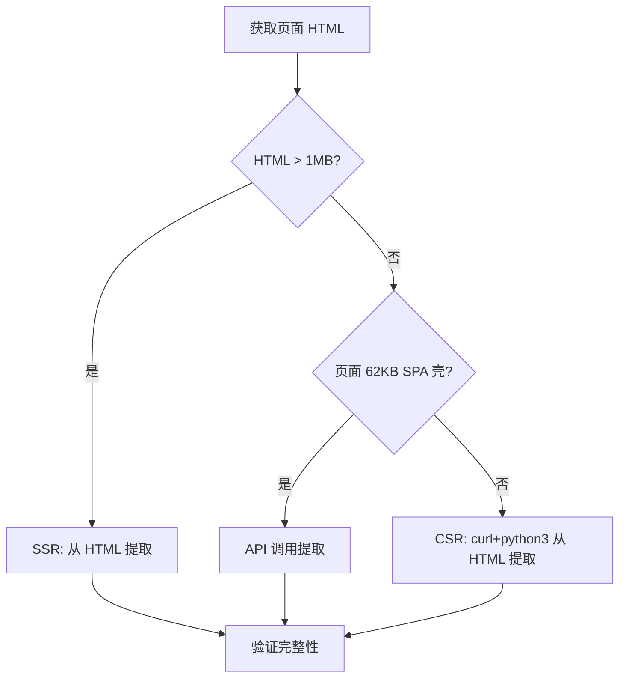

# Doubao Share — Conversation Archiving Skill

Parse Doubao shared conversation links and archive structured insights into the knowledge base.

## 🚀 新模式（2026-08-15 起）：脚本优先 + 大模型补深度

**核心架构**：确定性工作（提取/验证/元数据/统计）由 `scripts/tools/doubao-import.py` 自动化；智能工作（深度洞察/补齐知识点/归档撰写）由大模型基于脚本产物完成。脚本失败时 fallback 到下方手工全流程。

### 推荐流程

```
用户分享豆包链接
    ↓
[脚本] python3 scripts/tools/doubao-import.py --url "<链接>" --out /tmp/doubao_<tag> --keywords "期望关键词1,关键词2"
    ↓ 成功 (exit 0/3)
[产物] <out>/<slug>.txt + <slug>.json + <slug>.meta.json + <slug>.report.md
    ↓
[大模型] 读取 .txt（对话全文）+ .report.md（骨架），完成：
  0. 🔬 三层审查（强制，见下方「AI 生成材料三层审查流程」）：
     分层判定（可采信/存疑/证伪）→ 交叉验证（知识库）→ API 实证（arXiv/GitHub/Bing）→ 溯源标注
  1. 核心命题（1-2句）
  2. 关键洞察（3-5条，含对比表）
  3. 补齐知识点（术语辨析/方法论/行业映射）
  4. 归档到知识库（选模块→生成 slug→写入→log→index→git）
    ↓
失败 (exit 2) → 按下方「特殊情况处理」手工全流程（大模型逐步执行）
```

### 脚本命令速查

```bash
# 基本导入（自动分层提取：HTML探测→质量检查→API兜底）
python3 scripts/tools/doubao-import.py --url "https://www.doubao.com/thread/xxx" --out /tmp/doubao_out

# 指定期望关键词做完整性验证（推荐：从标题/主题猜2-3个核心词）
python3 scripts/tools/doubao-import.py --url "..." --out /tmp/doubao_out --keywords "关键词A,关键词B"

# 仅提取不生成报告骨架
python3 scripts/tools/doubao-import.py --url "..." --out /tmp/doubao_out --json-only

# 用 share_id（无需完整 URL）
python3 scripts/tools/doubao-import.py --share-id xxx --out /tmp/doubao_out
```

### 脚本行为约定（大模型须知）

1. **exit code**: `0`=成功验证通过；`2`=全部提取层失败（→走手工 fallback）；`3`=提取成功但验证未通过（关键词缺失/字符过少 → 人工检查或补全）。
2. **提取策略自动判断**：
   - `x` 前缀（CSR/SPA壳）→ 先 HTML 探测，结果质量差（无标题/消息数≤1）自动回退 API。
   - 其他前缀（SSR）→ HTML 直提。
3. **slug 生成**：内置映射表+拼音兜底，若生成结果含中文残留（如 `自-研-与-z-d-m`），**大模型应手动规范 slug**（如 `self-dev-vs-zdm-odm-cost-market`）。
4. **报告骨架**（`.report.md`）含数据概览/高频词/知识库关联建议，是给大模型的"脚手架"——深度洞察必须由大模型填充，不能原样归档骨架。
5. **归档模块选择**：参照下方「模块选择」表，技术/业务类进对应模块（如服务器研发决策→`02_rd/03_management/`），语言学/文化类→`06_others/sources/`。

### 已验证案例（2026-08-15 ~ 2026-08-20）

| 链接 | 结果 |
|:-----|:-----|
| `xFJEq0tazK8xj11XW`（汉语并列复合词 132 例） | API 提取 10 条/11226 字符 ✅ 归档 06_others/sources/ |
| `xiH69TuXUQusRJr6X`（自研 vs ZDM/ODM） | API 提取 4 条/3242 字符 ✅ 归档 02_rd/03_management/ |
| `xaFzKnOlr3sPOGwb2`（法规与企业内部合规清单） | API 提取 14 条/26337 字符 ✅ **多专题拆分 3 份报告**（组织约束/合规清单/RUDA+Harness） |
| `xySOxqDcCrNkkbrt6`（AI编程知识库及服务器研发应用） | API 提取 12 条/36553 字符 ✅ 三层审查（可采信 8/存疑 7/证伪 17）→ 深度辨析报告归档 07_industry-research/04_ai/ |

### 多专题拆分模式（2026-08-15 验证）

当对话含多个清晰议题（如最后一条消息是"三大议题梳理"结构）且用户要求"多专题分开生成报告"时：
1. 先通读对话全文，按**议题边界**拆分（每个议题含独立核心命题+要素清单+失败模式）
2. 每个议题生成**独立报告**，归档到**各自最匹配的模块**（如组织约束→02_rd/03_management、Agent范式→03_AI/agent-engineering）
3. 每份报告头部加「姊妹篇」交叉链接，正文关联已有知识库文档（避免重复建设）
4. log.md 按模块分节追加多条；index 一次刷新；git 一次提交

> 判据：内容可 MECE 切分为互不重叠的议题（如 组织/合规/技术 三维），且各议题有独立落地场景，才拆分为多份；否则合并为一份。

---

## 🔬 AI 生成材料三层审查流程（2026-08-20 起，强制）

> **背景实证**：2026-08-20 对豆包对话《AI编程知识库及服务器研发应用解读》核验 17 项论文/项目引用，**70% 虚构**——ABIGX/TSGuard 为真实论文但主题被系统性篡改/曲解（"真实名称+篡改内容"混合幻觉，迷惑性最高）；Flare/RIFT/XID 四级归因/带宽悖论/SOP 推理库/版本感知时序库等 12 项完全虚构（arXiv 查无此文）；Chaos-Hardware 开源项目在 GitHub 上不存在。AI 长文常含"学术感"包装的虚构引用，**直接归档将污染知识库**——本流程为归档前强制步骤。

### 三层判定法

| 层级 | 判定标准 | 处理方式 |
|:-----|:---------|:---------|
| ✅ **可采信** | 与知识库既有文档或行业公开信息交叉验证一致 | 正常入库，标注交叉来源 |
| ⚠️ **存疑** | 方向合理但无法独立验证（厂商内部平台/无出处量化数据/能力描述超公开范围） | 保留为线索，标注「材料自述，未经独立验证」，不作决策依据 |
| ❌ **证伪** | 实证检查否定（论文查无此文/项目不存在/内容与原文不符） | 不写入确定知识；值得记录则入「已知幻觉模式库」并标注证伪原因 |

### 四步审查流程

```
① 分层判定 → ② 交叉验证 → ③ API 实证 → ④ 溯源标注
```

1. **分层判定**：通读全文，将关键断言（论文引用/产品名称/量化数据/行业判断）逐条归入三层。重点盯防：带出处标签的论文（"顶会 2026"）、具体量化数字（"提升 40%+"）、开源项目名、厂商内部平台名。
2. **交叉验证**：用 `memory_search` + `grep` 搜索知识库既有文档，与已沉淀的深潜结论对照（同主题已有文档是最快验证源）。示例：豆包"故障注入工具"→知识库已录 NVBitFI/NVFault，即可判定材料中虚构的 Chaos-Hardware 为证伪。
3. **API 实证**（对第 1 步标记为存疑/证伪候选的引用执行）：
   - **arXiv 论文**：`curl -s "https://export.arxiv.org/api/query?search_query=ti:%22<论文名>%22&max_results=3"` → 有 `<entry>` 则核对**摘要是否与材料描述匹配**（仅名称匹配≠采信，ABIGX 教训）；无条目→证伪
   - **GitHub 项目**：`curl -s "https://api.github.com/search/repositories?q=<项目名>"` → 无匹配 repo→证伪
   - **厂商产品/行业事实**：`python3 skills/web-access/scripts/search-router.py --source bing "<查询>"`（web_search 因 key 失效不可用，走 search-router L2 Bing）
4. **溯源标注**：报告/归档文档中每条关键断言与量化数据标注来源分级：`[✅ 独立验证: 出处]` / `[⚠️ 材料自述, 未经验证]` / `[❌ 证伪: 实证结果]`。

### 输出要求（深度辨析型归档）

深度辨析/专题型归档（区别于纯归档）必须包含：

1. **三层判定表**：逐条列出判定结果（可采信 N 项 / 存疑 M 项 / 证伪 K 项），附核验方式
2. **验证记录章节**：记录 arXiv/GitHub/Bing 核验的具体结果（论文标题+日期、repo 名、搜索行为），保证可追溯
3. **幻觉机制标注**：如发现「真实名称+篡改内容」等模式，在文档中显式指出（这是 AI 生成材料审查的核心价值）

> **经验教训**：仅凭"名称能搜到"不足以采信——ABIGX 真实存在但被包装成完全不同的主题。**必须核对原文内容与材料声称的匹配度**。

### 已验证案例（2026-08-20）

| 链接 | 审查结果 |
|:-----|:---------|
| `xySOxqDcCrNkkbrt6`（AI编程知识库及服务器研发应用） | 三层判定：可采信 8 / 存疑 7 / 证伪 17（幻觉率 70%）；ABIGX/TSGuard 篡改实证、Chaos-Hardware 虚构实证 → 深度辨析报告归档 07_industry-research/04_ai/ |

---

## ⚠️ 旧模式（手工全流程，脚本失败时 fallback 使用）

### Workflow Overview

```
用户分享豆包链接
    ↓
Step 1: 获取内容 — 用 browser 或 web_fetch 访问共享链接
Step 2: 提取信息 — 识别标题、核心命题、关键洞察
Step 3: 分类归档 — 确定所属知识模块，生成 slug 和路径
Step 4: 写入知识库 — 创建文件，用 `kb-log-append.py` 追加 log.md（README/index 不更新，脚本批量处理）
```

## Step 1: 获取共享内容

### 核心发现（已深度验证）

豆包共享链接有两种渲染机制，需根据链接 hash 特征区分——

**① `t` 前缀链接（服务端渲染 SSR）**
- 特征：URL hash 以 `t` 开头（例如 `thread/txxxxxxxx`）
- 方式：`web_fetch` 即可提取完整对话内容
- 成功率：已验证 >10次，100%可提取

**② `x` 前缀链接（客户端渲染 CSR / React）**
- 特征：URL hash 以 `x` 开头（例如 `thread/x56b0a48...`）
- 方式：`web_fetch` 返回空或 HTML 骨架（无文本）+ 需要从原始 HTML 中提取 JSON 数据
- 方案：使用以下策略

### 访问策略（优先级顺序）

> **关键发现（2026-06-23 更新）**: 通过逆向 JS bundle 发现，豆包共享链接存在**三种渲染机制**，需根据链接 hash 特征和页面大小选择策略。
>
> 分享类型判断矩阵：
> - **有 post-body SSR block**（HTML > 2MB，`</body>` 后有大量 `<div hidden>` chunk）→ 使用第2层提取
> - **无 post-body 数据 + 62KB SPA 壳 + `x` 前缀** → 使用第3层 API 提取
> - **无 post-body 数据 + `t` 前缀 / 小页面** → 尝试第2层失败后使用第3层

#### 第1尝试：web_fetch（最简单）
```
web_fetch(url="<豆包分享URL>")
```
多数 `t` 前缀链接直接返回完整内容。如果返回内容非空且包含中文对话，直接跳到 Step 2。

#### 第2尝试：从原始HTML提取对话内容（核心策略，处理CSR/React页面）
如果 `web_fetch` 返回空或只有 HTML 骨架（无对话文本），用 `curl` 获取原始 HTML，再提取对话内容。

**快速预检**: 检查 HTML 大小 + `</body>` 后的 post-body 区域是否有数据：
```bash
curl -sL "<豆包分享URL>" > /tmp/doubao_raw.html
echo "Size: $(wc -c < /tmp/doubao_raw.html) bytes"
python3 -c "
import re
with open('/tmp/doubao_raw.html') as f:
    html = f.read()
body_end = html.find('</body>')
post_body = html[body_end+7:] if body_end > 0 else ''
print(f'Post-body: {len(post_body)} bytes')
# 检查是否有 data-fn-args（流式 SSR 数据）
args = re.findall(r'data-fn-args=\"([^\"]+)\"', post_body)
if args:
    print(f'✅ SSR streaming data found: {sum(len(a) for a in args)} bytes total')
else:
    print('❌ No SSR streaming data')
"
```

如果 post-body 区域有大量数据（>1MB），说明是 SSR 流式渲染，可按原流程用 python3 提取。如果无数据且 HTML < 100KB，**直接跳到第3层 API 提取**。

豆包的 CSR 页面中，对话内容通常埋在 `script` 标签的 JSON 数据块或 `__NUXT__`/`__INITIAL_STATE__` 对象中。

提取策略分两个层级，优先用第2a层，提取不完整时再用第2b/2c层。

##### 第2a层：curl + python3 混合内容提取（推荐首选）
直接用 `python3` 解析原始 HTML 中的中英文+数学公式混合文本：

```bash
curl -sL "<豆包分享URL>" > /tmp/doubao_raw.html
python3 -c "
import re, sys
with open('/tmp/doubao_raw.html','r',errors='ignore') as f:
    html = f.read()
    texts = re.findall(r'[\u4e00-\u9fff\u3000-\u303f\uff00-\uffef\w\d\\\$^{}_+=*\/\-()\[\]<>|~@#%&!?:;\'\"\.,]{30,}', html)
    seen = set()
    for t in sorted(texts, key=len, reverse=True):
        clean = t.strip()
        if len(clean) > 30 and clean not in seen:
            if not re.match(r'^[\s<>&#;/\\]+$', clean):
                seen.add(clean)
                print(clean)
                print('---')
    print(f'\\n[EXTRACTED {len(seen)} CHUNKS]', file=sys.stderr)
"
```

这个策略的优势：
- 正则范围涵盖 **中文** + **拉丁字母** + **数字** + **数学符号**（`$ \ { } ^ _ + = - * /` 等 LaTeX 常用符号）
- 从原始 HTML 中直接抓取所有非标签文本块
- `{30,}` 只提取长度≥30的文本块过滤噪声
- `[EXTRACTED N CHUNKS]` 输出到 stderr 便于判断提取量

> ✅ **已验证通过**：`x7b38684794798f87a672dc5cb0c89729` 链接（抛硬币 26 种解法），成功提取 895 行 / 65KB 完整对话内容，含全部 LaTeX 公式和混合中英文推导过程。

##### 第2b层：curl + grep 快速预检（当第2a层未返回时兜底）
如果第2a层未返回有效内容（例如 HTML 结构不同），退回到 grep 快速提取：

```bash
curl -sL "<豆包分享URL>" | grep -oP '[\x{4e00}-\x{9fff}\x{3000}-\x{303f}\x{ff00}-\x{ffef}，。！？、；：""''（）【】《》—…·\w\d\s]{20,}' | sort -u
```

> ⚠️ **局限性**：`grep -oP` 使用的 `\w` 不包含 `$ \ { } ^ _` 等 LaTeX 符号，导致**数学推导内容被切碎、公式骨架丢失**。已验证：`x7b386847...` 链接上 grep 只提取到 ~2KB 摘要内容（缺失 63KB 完整推导）。因此第2b层仅作为**快速预检**，确认页面是否有中文内容，不建议作为最终提取手段。

##### 第2c层：browser 工具（兜底）
如果以上两层都提取不到有效对话内容，使用 `browser`：

```bash
browser(navigate="<豆包分享URL>")
browser(get_text)
```

> ⚠️ 注意：部分豆包 CSR 页面在 browser 中也可能返回空（前端渲染因鉴权/跨域未完全加载），此时不必强求。

#### 第3层：API 直接调用（2026-06-23 新增，处理纯 SPA 壳页面）

**适用场景**: 页面 HTML 仅为 62KB 左右的 SPA 壳，无 post-body 数据，`_SSR_DATA.data={}`，`shareInfo={}`，account 显示"会话过期，请重新登录"。

**原理**: 通过逆向 JS bundle（`thread.*.js`）发现，豆包 `x` 前缀的分享链接使用独立的 `share_landing` 应用包，数据通过 **Consul 服务发现** 架构从后端 API 获取。API 调用需要先获取 `ttwid` cookie 后再 POST。

**完整提取流程**:

```python
import requests, json, re

share_id = "<从URL提取的share_id>"
session = requests.Session()

# Step 1: 先访问 landing page 获取 ttwid cookie
session.headers.update({
    "User-Agent": "Mozilla/5.0 (Macintosh; Intel Mac OS X 10_15_7) AppleWebKit/537.36",
    "Content-Type": "application/json",
    "Accept": "application/json, text/plain, */*",
    "Origin": "https://www.doubao.com",
    "Referer": f"https://www.doubao.com/thread/{share_id}",
})
session.get(f"https://www.doubao.com/thread/{share_id}", timeout=30)

# Step 2: 根据 share_id 前缀选择 API 端点
if share_id.startswith("x"):
    # x前缀: 走 im/message/share/get (Consul: flow.im.share)
    api_url = "https://www.doubao.com/im/message/share/get"
    payload = {"share_id": share_id, "need_bot_info": True}
else:
    # 其他: 走 samantha/thread/share/snapshot/get (Consul: flow.samantha.api)
    api_url = "https://www.doubao.com/samantha/thread/share/snapshot/get"
    payload = {"share_id": share_id, "need_bot_info": False}

resp = session.post(api_url, json=payload, timeout=60)
data = resp.json()

if data.get("code") == 0:
    # 成功获取数据
    msg_list = data.get("data", {}).get("message_snapshot", {}).get("message_list", [])
    share_info = data.get("data", {}).get("share_info", {})
    print(f"✅ 成功: {len(msg_list)} 条消息, 对话者: {share_info.get('user', {}).get('nick_name', 'unknown')}")
else:
    print(f"❌ 失败: code={data.get('code')}, msg={data.get('msg')}")
```

**提取后的数据解析**: API 返回的 JSON 结构如下：
```json
{
  "code": 0,
  "data": {
    "share_info": {
      "share_id": "...",
      "share_name": "对话标题",
      "share_status": 2,
      "share_time": "毫秒时间戳",
      "user": {"nick_name": "用户名"},
      "bot": {"name": "豆包", ...},
      "message_index_end": "362"
    },
    "message_snapshot": {
      "message_list": [
        {
          "user_type": 1,          // 1=用户, 2=AI
          "content": "{\"text\":\"...\"}",
          "thinking_content": "",   // 深度思考内容
          "index_in_conv": "1",
          "create_time": "timestamp",
          "tts_content": "...",     // 纯文本版本的内容
          ...
        }
      ]
    }
  }
}
```

**提取消息文本的完整代码**:
```python
for msg in msg_list:
    utype = msg.get("user_type")
    role = "User" if utype == 1 else "Assistant"
    index = msg.get("index_in_conv")
    
    # 从 content JSON 中提取 text
    try:
        content = json.loads(msg.get("content", "{}"))
        text = content.get("text", "")
    except:
        text = msg.get("content", "")
    
    # 深度思考内容
    thinking = msg.get("thinking_content", "")
    
    print(f"[{index}] {role}: {text[:200]}")
    if thinking and len(thinking) > 50:
        print(f"  💭 [深度思考]: {thinking[:200]}...")
```

**已知限制**:
1. 需要网络环境能访问豆包 API
2. `browser` 不可用时不影响此方法（直接使用 python requests）
3. 如果 API 返回 `code=710020202`（系统错误），可能是 share_id 无效或过期
4. 如果 API 返回 `code=710022001` + `record not found`，可能是分享链接已失效

#### 提取后的完整性验证（新增关键步骤）

无论用哪种方法提取，**必须进行完整性验证**，避免出现「已提取但内容残缺」的情况：

**验证方法1 — 关键词抽样**：
```bash
grep -c "方法1\b" /tmp/doubao_extracted.txt   # 检查方法编号
grep -c "等比数列\|生成函数\|蒙特卡洛" /tmp/doubao_extracted.txt  # 检查技术术语
```

**验证方法2 — 篇幅检查**：
| 对话规模 | 预期提取量 | 参考案例 |
|:---------|:----------|:---------|
| 短对话（<10轮） | ≥1KB | 简短问答 |
| 中等对话（10-50轮） | ≥5KB | 技术讨论 |
| 长篇推导（50+轮，多解法类） | ≥20KB | 抛硬币 26 解法 → 65KB |

```bash
wc -c /tmp/doubao_extracted.txt
```

**验证方法3 — 结构完整性**：
- 方法/编号类内容：检查编号是否连续（如方法1→方法N）
- 章节类内容：检查章节标题是否全部出现

**验证未通过时的处理**：
1. 确认提取不完整 → 尝试更高优先级的提取层（如第2b→第2a）
2. 公式/推导类内容残缺 → 优先用第2a层（python3 混合提取）
3. 确认无法补全 → 标注「提取不完全」并记入记忆，不将残缺内容入库归档

### 特殊处理经验

**案例1**：`x56b0a48...` 链接（22种解法·连续型几何概型）
- `web_fetch` 返回空 → `browser` 也返回空 → `curl | grep` 从 JSON 中提取出完整内容
- 验证结果：✅ 内容完整

**案例2**：`x7b386847...` 链接（26种解法·抛硬币先手获胜·离散型概率）
- `web_fetch` 返回空 → `curl | grep` 只提取到 ~2KB 摘要（**公式被切碎**）→ `python3` 混合提取成功 65KB 完整推导
- 教训：**数学公式/推导类内容必须用 python3 混合提取**，grep 的 `\w` 不够用
- 验证结果：✅ 第二轮提取内容完整

**案例3**：`xe8e7a9c0c4d08e3c9392b0729b083f07` 链接（Git/GitLab/WebHook 实战对话，73轮）
- `web_fetch` 返回空 → HTML 仅 62KB SPA 壳，无 post-body 数据 → `_ROUTER_DATA` 中 `accountInfo` 显示"会话过期" → 使用 **API 第3层** 提取成功 2.82MB 完整 JSON（146条消息）
- 过程：逆向 JS bundle 发现 `x` 前缀走 `POST /im/message/share/get` API，需先 GET landing page 获取 `ttwid` cookie
- 教训：**不要被 SPA 壳页面的"会话过期"误导**，数据可能通过独立 API 加载
- 验证结果：✅ 146 条消息完整提取

**核心经验**：
1. 不要因为 `web_fetch` 返回空就放弃——CSR 内容埋在 HTML 的 JSON/script 里
2. **内容类型决定提取策略**：纯文字对话 → grep 够用；公式/推导/代码混合 → 必须 python3
3. 提取后**必须做完整性验证**，残缺内容不归档

### 模块选择

根据内容主题，选择目标知识模块：

| 内容类型 | 目标模块 |
|:---------|:---------|
| 管理/战略/组织 | `enterprise-mgmt/sources/` |
| 技术概念/架构原理 | `concepts/` 或 `analysis/` |
| 产品/研发方法 | `product-dev/` |
| 服务器/硬件/互联 | `server-hardware/` |
| 存储/内存/材料 | `components-storage/` |
| 大模型/AI应用 | `llm-trends/` 或 `ai-apps/` |
| 其他深度分析 | `analysis/` |
| 纯外部来源整理 | `06_others/sources/` |

**缺省规则**: 深度框架类 → `enterprise-mgmt/sources/`；技术类 → 对应模块目录。

### 生成文件名

使用 slugify 脚本从标题生成 URL-friendly 的 slug：

```bash
cd <base_dir>
python3 scripts/slugify.py "<对话标题>"
```

输出示例：`complex-system-and-experience-reuse`

完整文件路径格式：

```
knowledge/<模块>/sources/YYYY-MM-DD-<slug>.md
```

其中 YYYY-MM-DD 取自对话日期（优先使用用户提供的时间，其次取当前日期）。

## Step 4: 写入知识库

### 文件格式模板

```markdown
# <中文标题>

> **来源**: 小龙猫与豆包对话 · YYYY-MM-DD · **类型**: 对话归档
> **总篇幅**: X轮对话 / XXX行

## 核心命题

<1-2句话概括整场对话的核心论点>

## 关键洞察

1. **<洞察标题>** — <详细说明>
2. **<洞察标题>** — <详细说明>
3. ...

## <如果适用: 模型/框架/方法详细展开>

...

## <如果适用: 与已有框架对接>

- **[已有框架A](../path/to/file.md)** — <如何对接>
- **[已有框架B](../path/to/file.md)** — <如何对接>

## 统一方法论

<如果跨框架整合，给出统一的结论>
```

### 并发更新

写入知识文件后，**只追加 log.md**（2026-08-03 全局机制，doubao-qa 属于全局索引模块；2026-08-19 起全库统一根 index/log，无保留目录）：

1. **`knowledge/log.md`** — 在对应 `## YYYY-MM-DD` 分节追加日志行（用 `kb-log-append.py`）：
   ```
   - **创建** | `<相对路径>` — <简要说明>
   ```
2. **`knowledge/index.md` / `README.md` 不更新** — 由脚本批量刷新（`kb-global-index.py`），AI 日常归档不动。

> `knowledge/README.md` 为人工导航 SSOT + 条目库（原名 index.md），仅当内容值得进顶层高亮时人工添加条目；查找文件默认用 `knowledge/index.md`。

### 已有归档示例参考

| 对话主题 | 归档路径 |
|:---------|:---------|
| 复杂系统与经验复用（Function 即生命机制） | `enterprise-mgmt/sources/2026-06-18-complex-system-function-input-output.md` |
| 四种创造手法与设计模式深度对照 | `enterprise-mgmt/sources/2026-06-18-four-creation-methods-patterns.md` |
| 多层伪装+分层筛选：人际博弈与诈骗底层逻辑 | `enterprise-mgmt/sources/2026-06-18-camouflage-communication-fraud-common-logic.md` |
| 通信的四种创造手法 | `enterprise-mgmt/sources/2026-06-18-communication-four-methods.md` |
| 设计活动的本质——观摩·提炼·重现·验证 | `enterprise-mgmt/sources/2026-06-18-four-creation-methods-patterns.md`（第16章） |

## 特殊情况处理

### 如果链接无法访问

遵循四级访问策略逐步尝试：

1. **`web_fetch`** → 如果返回空，不要放弃
2. **快速预检** → 检查 HTML 大小 + post-body 区域，判断是 SSR、CSR 还是 SPA壳
3. **HTML 提取** → 若为 SSR 或 CSR，用 `curl` + `python3` 从原始 HTML/JSON 中提取文本
4. **API 调用** → 若为纯 SPA 壳（62KB、无数据），用 `POST /im/message/share/get` API 获取
5. **`browser`** → 兜底，仅在前四步都失败时使用
6. 如果全部失败，再询问用户内容来源

**判断流程**：


**注意**：`web_fetch` 返回空**不等于**链接不可访问。CSR 页面的内容埋在 HTML 的 JSON/script 标签中，`curl` + `grep` 是提取这类内容的有效手段。如果 HTML 仅为 62KB SPA 壳且无嵌入式数据，需使用 API 调用（第4层）。

### 如果内容过于简短
- 直接提取要点，不需要强制按模板归档
- 可选择性写入对应模块的当天跟踪文件中

### 如果对话是已有框架的延续
- 追加到已有文件中作为新章节，而非创建新文件
- 在 `edit` 时注意保留原有结构和交叉引用

### 如果用户只提了"豆包"但没有链接
- 询问用户是否提供了链接或需要回忆具体内容
- 如果是回忆场景，使用 `memory_search` 搜索记忆中已有的豆包对话归档

## 脚本说明

Scripts are located in this skill's base directory (`<base_dir>`).

### slugify.py

将中文标题转换为英文 kebab-case slug，用于生成知识库文件名：

```bash
python3 "<base_dir>/scripts/slugify.py" "<中文标题>"
```

内置 100+ 常见技术/管理领域词汇的中英文映射表，支持贪婪最长匹配和自动分词。

**已知限制**: 映射不覆盖的罕见词汇会被跳过。如遇输出不理想，可手动调整。
